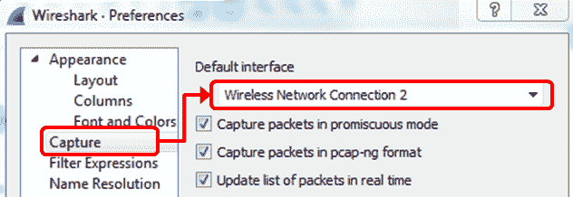
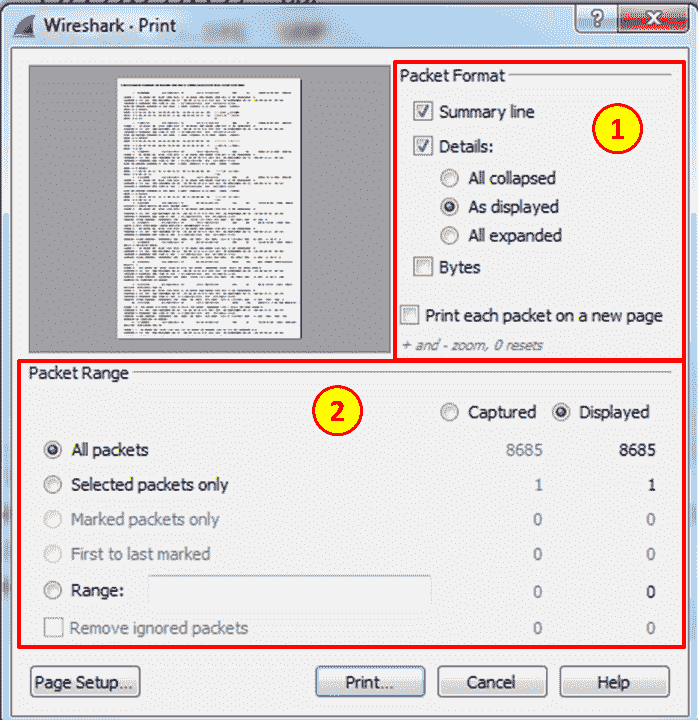
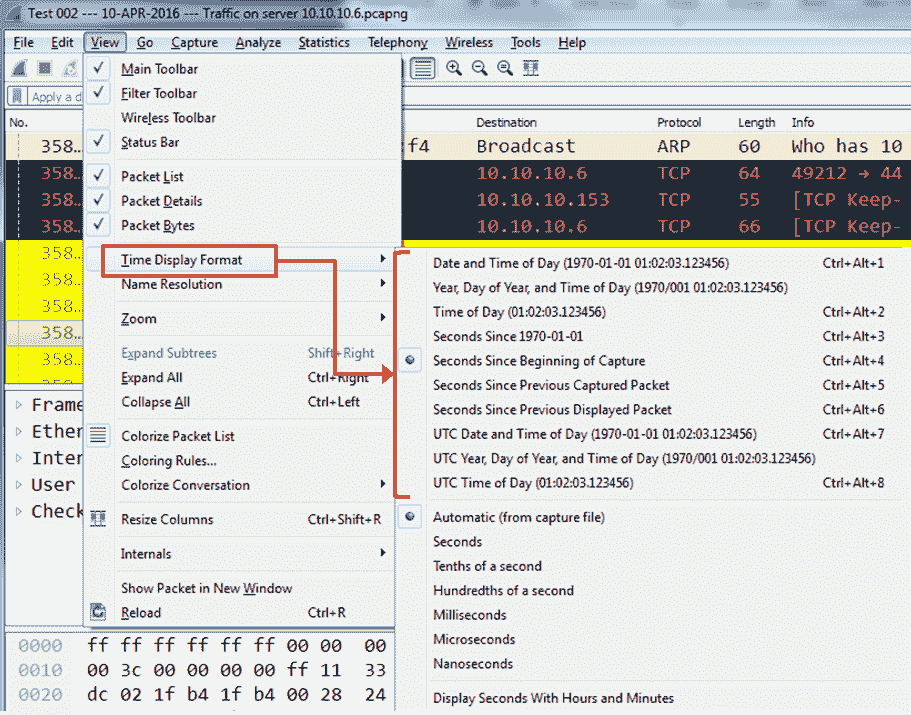

# 二、掌握 Wireshark 网络故障排除

在本章中，您将了解以下内容:

*   配置用户界面、全局和协议首选项
*   导入和导出文件
*   配置颜色规则和导航技术
*   使用时间值和摘要
*   构建用于故障排除的配置文件

# 介绍

在本章中，我们将讨论如何改进 Wireshark 作为网络分析工具的使用。我们首先配置用户界面，并设置全局和协议首选项。接下来，我们将讨论 Wireshark 文件夹、配置文件以及文件夹和插件。

我们继续讲述着色规则以及如何配置它们。我们还将讨论 Wireshark v2 中添加的智能滚动条，它可用于流量模式和行为识别。

我们用概要文件和如何使用它们来结束这一章。配置文件是为特定环境、协议或网络问题预先配置的显示和捕获过滤器、着色规则和首选项集，以简化网络故障排除。简介被解释，连同有帮助的简介被附在这本书。

# 配置用户界面、全局和协议首选项

Preferences(首选项)菜单使我们能够根据需要调整显示方式，而配置 protocol preferences(协议首选项)使我们能够更改 Wireshark 捕获和显示常见协议的方式。在本菜谱中，我们将学习如何配置最常见的协议。

# 做好准备

转到编辑菜单中的首选项，您将看到以下窗口:


在 Preferences 窗口中，我们有菜单可以从中选择我们想要配置的内容，而配置参数显示在右侧。

# 怎么做...

在这个菜谱中，我们将讨论外观首选项，以及最常见协议的协议首选项。本书后面的相关章节将提供额外的首选项配置。

因为这本书是关于如何使用和改进读者使用 Wireshark 进行网络分析的方法，所以我们不会讨论 Wireshark 的所有特性。我将把简单的功能留给 Wireshark 网站上的大手册，并把重点放在那些重要的和特殊的、实际上可以改进软件使用的功能上。

让我们开始关注偏好，看看它们能如何帮助我们。

# 一般外观偏好

在下面的屏幕截图中，我们看到了一些可以在首选项窗口中配置的有用功能:


在这里，我们可以配置:

*   显示过滤器和最近文件缓冲区的大小
*   界面语言(未来版本将提供更多语言)
*   主工具栏样式—图标、文本或图标和文本

# 布局首选项

在布局首选项中，您只需设置 Wireshark 显示数据包列表、数据包详细信息和数据包字节的方式:


正如您在前面的截图中看到的，您可以设置窗格的外观以及每个窗格中将呈现的内容。

# 列首选项

在列首选项中，您可以添加或删除列。我们在数据包窗格中看到的默认列是编号、时间、来源、目的地、协议、长度和信息，如下面的屏幕截图所示:

****

要向数据包窗格添加新列:

*   您可以将字段名中的一个预定义参数配置为新列。这些字段包括时间增量、IP DSCP 值、端口号等。
*   当您在字段类型中填写 Custom 时，一个非常重要的特性出现了。在这种情况下，您可以为字段名填写任何过滤器字符串。例如，您可以添加以下内容:
    *   添加字符串`tcp.window_size`来查看 TCP 窗口大小(这会影响性能)
    *   添加字符串`ip.ttl`查看每个数据包的 IP **生存时间** ( **TTL** )参数
    *   每次在 RTP 数据包中设置标记时，添加`rtp.marker`进行查看

要应用列，您也可以在数据包详细信息窗格中选择数据包中的字段，右键单击，然后选择应用为列。该列将被添加到数据包列表窗格中。

正如我们将在后面的章节中看到的，这个特性将帮助我们快速解决网络问题。

# 字体和颜色首选项

要更改字体大小和形状，只需选择外观|字体和颜色，然后更改主窗口字体，如下图所示:

**Appearance | Font and Colors **

如果您忘记如何恢复默认字体，默认字体是 Consolas，大小 11.0，正常。

# 捕获首选项

在“采集”偏好设置中，您可以将默认界面设定为您最常用的界面:



在前面的屏幕截图中，接口设置为无线网络连接 2。保留所有复选框不变。

# 过滤表达式首选项

在筛选表达式中，您可以配置哪些筛选表达式将出现在屏幕顶部显示筛选栏的右侧。

要配置显示过滤器表达式，请按照下列步骤操作:

1.  单击编辑菜单并选择首选项和过滤表达式。将出现以下窗口:


2.  选择添加并配置按钮标签和过滤器表达式。

3.  正如您在下面的屏幕截图中看到的，按钮标签将出现在显示过滤器栏的右侧:


4.  如您所见，我们在过滤器首选项中配置的名为 TCP-Z-WIN 和 TCP-RETR 的过滤器出现在 Wireshark 的右上角。

我们可以为每个配置文件配置过滤器首选项，如本章后面的*为故障排除建立配置文件*方法中所述。通过这样做，我们可以为 TCP 问题、 **IP 电话** ( **IPT** )问题等等配置配置文件，其中每个网络协议都配置有相应的配置文件。

应按照显示过滤器格式配置过滤器，如第 4 章、*使用显示过滤器*、*所述。*

# 名称解析首选项

Wireshark 支持三层名称解析:

*   **第 2 层**:将 MAC 地址的第一部分解析为厂商名称。例如，`14:da:e9`会呈现为华硕(ASUSTeK Computer Inc .)。
*   **第 3 层**:通过将 IP 地址解析为 DNS 名称。例如，`157.166.226.46`将被解析为[www.edition.cnn.com](http://www.edition.cnn.com)。
*   **第四层**:将 TCP/UDP 端口号解析为端口名。例如，端口`80`将被解析为 HTTP，端口`53`将被解析为 DNS。

在下面的屏幕截图中，您可以看到如何在偏好设置窗口中配置名称解析:


在此窗口中，您可以从上到下配置:

*   第 2 层、第 3 层和第 4 层名称解析。
*   如何执行名称解析:通过 DNS 和/或 hosts 文件，以及并发 DNS 请求的最大数量是多少(这样软件就不会过载)。
*   **简单网络管理协议** ( **SNMP** )，对象标识符，id，以及我们是否要把它们翻译成对象名。
*   GeoIP 以及我们是否要使用它。有关这方面的更多信息，请参见第 10 章、*网络层协议和操作*。

在 TCP 和 UDP 中，客户端最初打开连接只对目的端口有意义。打开连接的源端口是一个随机数(大于 1，024)，因此将其转换为端口名称没有意义。

*   Wireshark 默认解析第 2 层 MAC 地址和第 4 层 TCP/UDP 端口号。由于 Wireshark 使用大量的 DNS 查询，解析 IP 地址会降低 Wireshark 的速度，因此请小心使用。

# IPv4 首选项配置

当您选择配置 IPv4 或 IPv6 参数时，您将看到以下窗口:


您需要更改的参数有:

*   将 IPv4 TOS 字段解码为 DiffServ 字段:最初的 IP 协议带有一个称为**服务类型** ( **TOS** )的字段，用于通过网络实现 IP 服务质量。20 世纪 90 年代初，**区分服务** ( **DiffServ** )标准改变了 IP 设备在这一领域的面貌。取消选中此复选框将在原始 IP 标准中显示该字段。
*   启用 GeoIP 查找:GeoIP 是一个数据库，允许 Wireshark 将 IP 地址显示为地理位置。在 IPv4 和 IPv6 中启用此功能将启用此演示。此功能涉及名称解析，因此会降低实时数据包捕获的速度。你可以在[第十章](9affead7-6197-42e7-8ebc-0da367154504.xhtml)、*网络层协议和操作*、*中看到如何配置 GeoIP。*

# TCP 和 UDP 配置

在 UDP 中，没有太大的改变；这是一个非常简单的协议，配置非常简单。另一方面，在 TCP 中，有些参数是可以改变的:


您可以在 TCP 首选项中进行的大多数更改都与 Wireshark 解析捕获数据的方式有关:

*   如果可能，验证 TCP 校验和:在某些网卡中，您可能会看到许多校验和错误。这是因为 TCP 校验和卸载通常在网卡上实现。这里的问题可能是网卡实际上在 Wireshark 捕获数据包后添加了校验和，因此如果您看到许多 TCP 校验和错误，首先要做的是禁用此复选框，并验证这不是问题所在。
*   分析 TCP 序列号:必须选中此复选框，以便 Wireshark 可以提供 TCP 分析，这是其主要和最重要的功能之一。
*   相对序列号:当 TCP 打开一个连接时，它从一个随机序列号开始。选中此复选框后，Wireshark 会将其归一化为零，因此您看到的不是真实的数字，而是从零开始攀升的数字。在大多数情况下，相对数字更容易处理。
*   计算会话时间戳:选中此复选框时，TCP 分析器将在每个数据包中显示自连接开始以来的时间。在时间紧迫的情况下，这对于连接速度非常快的情况很有帮助。

# 它是如何工作的...

使用首选项|协议功能为 Wireshark 增加了更多分析功能。注意不要添加太多的功能，因为这会降低数据包捕获和分析的速度。

对于 TOS 和 DiffServ，进入[第 10 章](9affead7-6197-42e7-8ebc-0da367154504.xhtml)、*网络层协议和操作*、*。*

SNMP 是用于网络管理的协议。SNMP **对象标识符** ( **OID** )用于标识对象及其在**管理信息库** ( **MIB** )中的位置。对象可以是对接口输入数据包计数的计数器、路由器接口的 IP 地址、设备名称或位置、CPU 负载或任何其他可以显示或测量的实体。

SNMP MIB 构建在一个树形结构中，如下图所示。顶级 MIB 对象 id 属于不同的标准组织。供应商为他们自己的产品定义私有分支，包括被管理的对象:


在解析 SNMP MIB 时，Wireshark 不仅显示对象 ID，还显示其名称，这有助于理解所监控的数据。

# 还有更多...

关于 GeoIP，请前往[http://wiki.wireshark.org/HowToUseGeoIP](http://wiki.wireshark.org/HowToUseGeoIP)获取进一步指示。

# 导入和导出文件

为了进行根本原因分析，需要与其他运营团队或供应商共享数据包捕获文件是很常见的。这样的捕获文件可能有很多包，而我们感兴趣的只是一个特定的流或一组包。Wireshark 不共享整个文件，而是允许您有选择地将数据包导出到一个新文件中，甚至修改文件格式以方便文件传输。在本菜谱中，我们将讨论 Wireshark 中可用的导入和导出选项。

# 做好准备

启动 Wireshark 或打开保存的文件。

# 怎么做...

我们按如下方式保存或导出数据。

# 导出整个或部分文件

我们可以保存整个文件或导出各种格式和各种文件类型的特定数据。在下面的段落中，我们将看到如何做到这一点。

要保存捕获数据的整个文件，请执行以下操作:

*   在文件菜单中，点击保存(或按下 *Ctrl* + *S* )以其当前名称保存文件
*   在文件菜单中，点击另存为(或按下*Shift*+*Ctrl*+*S*)以新名称保存文件

要保存文件的一部分，例如只保存显示的数据，请执行以下操作:

*   导航至文件菜单下的导出指定数据包。您将看到以下窗口:


在窗口的左下方，您会看到您可以选择要保存的数据部分:

*   要保存所有捕获的数据，请选择所有数据包和捕获。
*   要仅保存显示的数据，请选择所有数据包并显示。
*   要保存文件中选定的数据包(选定的数据包就是您单击的数据包)，请选择仅选定的数据包。
*   要保存已标记的数据包，即在数据包列表窗口中右键单击已标记的数据包，请从菜单中选择仅标记的数据包(切换)。
*   要在两个标记的数据包之间保存数据包，请选择从第一个到最后一个标记的选项。
*   要保存数据包的范围，请选择范围并指定要保存的数据包的范围。
*   在数据包列表窗口中，您可以手动选择忽略数据包。在导出窗口中，您可以选择忽略这些数据包，不保存它们。

要压缩保存的文件，请选中用 gzip 压缩。

在提到的所有选项中，您可以从整个捕获的文件中选择数据包，或者从屏幕上显示的数据包中选择数据包(在应用显示过滤器后，数据包显示在数据包列表中)。

# 以各种格式保存数据

您可以用各种格式保存 Wireshark 捕获的数据，以便用其他工具进行进一步分析。

通过从“文件”菜单中选择“导出数据包剖析”,您可以用以下格式保存文件:

*   **纯文本(*。txt)** :将数据包数据导出为明文 ASCII 文件。
*   **后记(*。ps)** :将数据包数据导出为 PostScript 格式。
*   **逗号分隔的值(*。csv)** :将数据包摘要导出为 csv 文件格式，用于电子表格程序(如 Microsoft Excel)。
*   **C 数组到包字节(*。c)** :将包字节导出到 C 数组中，以便 C 程序导入。
*   **PSML (*。psml)** :将数据包数据导出到 psml，一种基于 XML 的格式，只包括数据包摘要。
*   **PDML (*。pdml)** :将包数据导出到 PDM，一种基于 XML 的格式，包括包的细节。

# 打印日期

为了打印数据，单击文件菜单中的打印按钮，将出现以下窗口:



在打印窗口中，您有以下选择:

*   在窗口的右上方，选择要打印的文件格式。它可以是:
    *   每个数据包只有一个摘要行。这是您从数据包列表窗格中获得的内容。
    *   数据包详细信息。这将打印数据包详细信息窗格中提供的数据包的全部详细信息。
    *   数据包字节，从“数据包字节”面板中获得。

*   在窗口的下半部分，您选择要打印的数据包，如前一节所述。

# 它是如何工作的...

数据可以以文本格式、PostScript(支持 PostScript 的打印机)打印，或打印到文件中。配置此窗口并点击打印后，将出现常规打印界面，您可以选择打印机。

# 还有更多...

要了解 Wireshark 存储在哪些文件夹中，只需从主菜单中选择“帮助”,然后选择“关于 Wireshark ”,并在打开的窗口中选择“文件夹”选项卡。正如您在下一个屏幕截图中看到的，您将看到存储文件的实际文件夹，在右侧，您可以看到存储在这些文件夹中的典型文件:


单击某个位置会将我们带到存储这些文件的文件夹。

# 配置颜色规则和导航技术

着色规则定义了 Wireshark 如何对捕获数据中的协议和事件着色。使用颜色规则将对网络故障排除有很大帮助，因为您可以用不同的颜色看到不同的协议，并且您还可以为不同的事件配置不同的颜色。

着色规则使您能够根据各种过滤器配置新的着色规则。它将帮助您为不同的场景配置不同的配色方案，并将它们保存在不同的配置文件中。这样，您可以配置用于解决 TCP 问题的着色规则、用于解决 SIP 和电话问题的规则等等。

您可以配置 Wireshark 配置文件以保存 Wireshark 配置，例如预定义的颜色、过滤器等。为此，请从编辑菜单导航到配置描述文件。

# 做好准备

从着色规则开始，步骤如下:

1.  转到视图菜单。
2.  在菜单的下半部分，选择着色规则。您将看到以下窗口:


在此窗口中，我们可以看到 Wireshark 中的默认着色规则，包括 TCP 和其他协议事件、路由数据包等的规则。

# 怎么做...

要转到着色规则，请执行以下操作:

*   对于新的着色规则，单击“新建”选项卡，您将看到以下窗口:


*   在名称字段中，填写规则的名称。比如网络时间协议填写`NTP`。
*   在 Filter 字段中，填写过滤字符串，也就是你希望规则显示的内容(我们将在第四章[，*使用显示过滤器*中谈到显示过滤器)。](297ea816-d45a-4111-9c4a-3c33e5ced6da.xhtml)
*   单击前景按钮并选择规则的前景颜色。这将是数据包列表中数据包的前景色。
*   单击背景按钮，选择规则的背景颜色。这将是数据包列表中数据包的背景颜色。
*   单击删除图标(加号左侧的减号)删除颜色规则。
*   如果要编辑现有规则，请单击复制图标(减号按钮右侧)。
*   您也可以点选汇入...按钮导入一个现有的配色方案，或者点击导出...导出当前方案的规则。

着色规则的顺序很重要。确保着色规则按照实现的顺序。例如，应用层协议应该在 TCP 或 UDP 之前，所以 Wireshark 会用它们的颜色而不是常规的 TCP 或 UDP 颜色来着色。

# 它是如何工作的...

像 Wireshark 中的许多操作一样，您可以对过滤的数据配置各种操作。着色规则机制只是将着色规则应用于预定义的过滤器。

# 请参见

*   你可以在 http://wiki.wireshark.org/ColoringRules 找到各种各样的配色方案，在简单的互联网搜索中还可以找到许多其他的例子
*   要使用此处列出的着色规则文件之一，请将其下载到您的本地计算机，在 Wireshark 中选择 View **|** Coloring Rules，然后单击 Import...按钮

# 使用时间值和摘要

时间格式配置是关于如何显示时间列(默认配置中从左数第二个)。在某些情况下，这一点非常重要，例如，在 TCP 连接中，您希望看到数据包之间的时间间隔，或者当您从多个源捕获数据并希望看到每个数据包的确切时间时。

# 做好准备

要配置时间格式，请转到视图菜单，在时间显示格式下，您将看到以下窗口:



# 怎么做...

您可以从以下选项中选择:

*   日期和时间:当您对具有时间相关事件的网络进行故障排除时，例如，当您知道在特定时间发生的事件，并且您想要查看在同一时间网络上发生了什么时，这将是很好的配置。
*   秒钟后...:自 1970 年 1 月 1 日以来的时间，以秒为单位。Epoch 是一个任意选择的日期，作为系统的参考时间，Unix 和类 Unix 系统选择 1970 年 1 月 1 日。
*   自捕获开始后的秒数:默认配置。

*   自上一次捕获数据包以来的秒数:这也是一个常见的特性，使您能够看到数据包之间的时间差。这在监控时间敏感型流量(如 TCP 连接、实时视频流、VoIP 呼叫等)时非常有用，因为数据包之间的时间差非常重要。
*   自上次显示数据包以来的秒数:这是一个有用的特性，可以在配置显示过滤器时使用，并且只显示捕获数据的选定部分(例如，TCP 流)。在这种情况下，您将看到数据包之间的时间差，这在某些应用中可能很重要。
*   UTC 日期和时间:提供相对 UTC 时间。

子菜单的下部提供时间显示的格式。只有在需要更精确的测量时才改变它。

你也可以使用键盘上的 *Ctrl* + *Alt* +任意数字键来选择不同的选项。

# 它是如何工作的...

这很简单。Wireshark 使用系统时钟，并显示系统中的时间。默认情况下，您会看到自捕获开始以来的时间。

# 构建用于故障排除的配置文件

您可以配置 Wireshark 配置文件以保存 Wireshark 配置，例如通过设置预定义的颜色、捕获和显示过滤器等。为此，请从编辑菜单导航到配置描述文件。

配置描述文件存储以下信息:

*   首选项，包括常规和协议首选项，例如窗格大小、文本大小和字体、列宽等
*   捕获过滤器
*   显示过滤器和显示过滤器宏(参见[第 4 章](297ea816-d45a-4111-9c4a-3c33e5ced6da.xhtml)、*使用显示过滤器*、 *)*
*   着色规则
*   定制的 HTTP、IMF 和 LDAP 头(参见[第 12 章](91ddb152-048f-49f3-9d85-0b106e85cde8.xhtml)、 *FTP、HTTP1 和 HTTP2* )
*   用户定义的解码，例如解码作为一种功能，使您能够暂时转移特定的协议分析

所有配置文件都保存在`profiles`目录中。

# 做好准备

启动 Wireshark 并打开保存的文件或开始新的捕获。

# 怎么做...

要打开现有的配置文件:

1.  单击状态栏右下角的配置文件，并选择您希望使用的配置文件:


2.  选择“编辑”|“配置描述文件”,然后选择您想要使用的描述文件:


要创建新的配置文件:

1.  右键单击 Wireshark 窗口右下角状态栏中的配置文件区域，然后选择“新建”,或者选择“编辑”|“配置配置文件”,然后选择“新建”。
2.  将在`profiles`目录下创建一个新目录:


3.  在概要文件目录中，在这个例子中是`Wireless`概要文件，我们有`cfilter`文件，它保存了捕获过滤器；`colorfilters`文件，它保存着着色规则；`custom_http_header_fields`，保存 HTTP 字段配置；和保存首选项配置的`preferences`文件。

# 它是如何工作的...

当您创建新的配置文件时，会在您的个人配置目录中的`profiles`下创建一个以您的配置文件命名的文件夹。当您关闭 Wireshark 或加载另一个配置文件时，一个名为`recent`的文件会放在您的新配置文件目录中。该文件包含 Wireshark 窗口的常规设置，如可见工具栏、时间戳显示、缩放级别和列宽。如果在自定义配置文件中工作时创建捕获过滤器、显示过滤器和着色规则，将创建附加文件并存储在自定义配置文件的目录中(分别为`cfilters`、`dfilters`和`colorfilters`)。

# 还有更多...

正如我们在上一节中看到的，保存配置文件参数的文件位于配置文件目录中。当然，您可以将参数从一个概要文件复制到另一个概要文件；例如，在默认的性能文件中，有以下过滤器:

```
####### Filter Expressions ########
gui.filter_expressions.label: SIP
gui.filter_expressions.enabled: FALSE
gui.filter_expressions.expr: sip
gui.filter_expressions.label: RTP
gui.filter_expressions.enabled: FALSE
gui.filter_expressions.expr: rtp
```

如果您在另一个概要文件中需要这些过滤器中的一个，只需将它复制到您需要它的概要文件目录中的同一个文件中。

# 请参见

*   具体的概要将在本书后面的相关章节中提出。TCP 性能故障排除配置文件将在[第 11 章](f46fb26a-2c13-48c9-9302-aafb4e0e0e4b.xhtml)、*传输层协议分析*中显示，无线局域网分析配置文件将在[第 9 章](d9b20754-743b-4534-a4ef-9c402890a3c0.xhtml)、*无线局域网*中显示，以此类推。