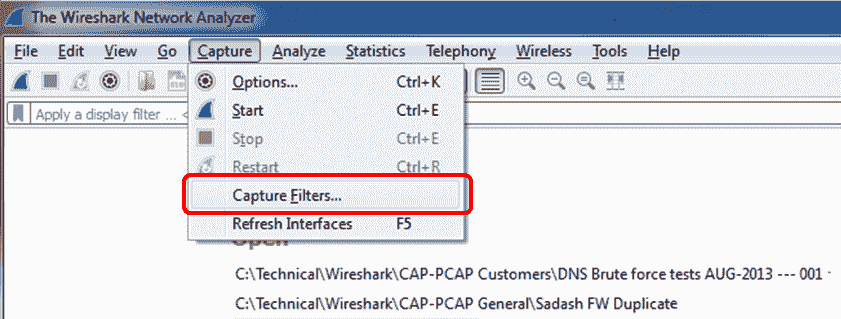

# 三、使用捕获过滤器

在本章中，我们将讨论以下主题:

*   配置捕获过滤器
*   配置以太网过滤器
*   配置主机和网络过滤器
*   配置 TCP/UDP 和端口过滤器
*   配置结构化过滤器
*   配置字节偏移量和有效负载匹配过滤器

# 介绍

在第一章和第二章中，我们讨论了如何安装 Wireshark，如何配置它进行基本和智能操作，以及它在网络上的位置。在本章和下一章，我们将讨论捕获过滤器和显示过滤器。

区分这两种类型的过滤器非常重要:

*   捕获过滤器是在我们开始捕获数据之前配置的，因此只有过滤器认可的数据才会被捕获。所有其他数据都将丢失。本章介绍了这些过滤器。
*   显示过滤器是在捕获数据后过滤数据的过滤器。在这种情况下，所有数据都被捕获，您可以配置想要显示的数据。这些过滤器将在下一章介绍。

捕获过滤器基于`libpcap` / `WinPcap`库中的`tcpdump`语法，而显示过滤器语法是几年后才出现的。因此，请记住显示和捕获过滤器有不同的语法！

在某些情况下，您需要将 Wireshark 配置为仅捕获它通过接口看到的部分数据:

*   当有大量数据在受监控的链路上运行，而您只想捕获您关心的数据时
*   当您希望仅捕获进出您监控的 VLAN 上的特定服务器的数据时
*   当您只想从特定的一个或多个应用中捕获数据时(例如，您怀疑网络中存在 DNS 问题，并且您只想分析 DNS 查询和来自 internet 的响应)

在许多其他情况下，您只想捕获特定的数据，而不是网络上运行的所有数据。使用捕获过滤器时，将只捕获预定义的数据，而忽略所有其他数据包，因此您将只获得所需的数据。

使用捕获过滤器时要小心。在网络上的许多情况下，不同的应用和服务器之间存在依赖关系，而您并不总是意识到这一点；因此，当您使用带有捕获过滤器的 Wireshark 对网络进行故障排除时，请确保您没有过滤掉一些导致信息不准确的连接。一个常见而简单的例子是只过滤 TCP 端口`80`上的流量，以监控可疑的慢速 HTTP 响应，而问题可能是由于慢速或无响应的 DNS 服务器引起的，这不容易被注意到。

在本章中，我们将描述如何配置简单的、结构化的、字节偏移和有效载荷匹配的捕获过滤器。

# 配置捕获过滤器

我们建议在配置捕获过滤器之前，仔细设计要捕获的内容，并为此准备好过滤器。不要忘记，没有通过过滤器的内容将会丢失。

您可以使用一些 Wireshark 预定义的过滤器，也可以按照下一节所述自行配置。

# 做好准备

要配置捕获过滤器，请打开 Wireshark，并按照配方中的步骤操作。

# 怎么做...

要在开始捕获之前配置捕获过滤器，请执行以下步骤:

1.  要配置捕获过滤器，请单击左侧第四个捕获选项按钮，如下图所示:
2.  Wireshark - Capture Interfaces 窗口将会打开，如下图所示:


3.  标记您想要捕获的接口，在所选接口的捕获过滤器中填写您想要使用的过滤器表达式(您可以验证哪个接口是活动的，如[第 1 章](53577c40-0245-4671-90d7-f42cc1c89cb1.xhtml)、*Wireshark v2* 简介)。正如您在下面的截图中看到的，您编写的过滤器表达式将出现在界面行中。在本例中，`tcp port http`将捕获 TCP 端口`80`的所有数据包:


4.  配置过滤器后，确保过滤器框变为绿色，表明过滤器字符串是合法的，单击 Start 按钮，捕获将开始。

要配置预定义的过滤器，请参见以下步骤:

1.  要配置预定义的捕获过滤器，请选择捕获过滤器...从捕获菜单:

将会打开以下窗口:


2.  在此窗口中，您可以添加、删除或复制。

# 它是如何工作的...

Wireshark - Capture Filters 窗口使您能够根据 **Berkeley 数据包过滤器** ( **BPF** )配置过滤器。写完过滤字符串后，你可以点击编译 BPF 按钮，BPF 编译器会检查你的语法，如果错误，你会得到一个错误信息。

此外，当您在“捕获过滤器”文本框中键入过滤器字符串时，如果过滤器字符串正确，它将变为绿色，如果不正确，它将变为红色。

BPF 滤波器只检查语法是否正确。它不检查条件是否正确。例如，如果您键入不带任何参数的字符串`host`，您将得到一个错误，该字符串将变为红色，但如果您键入`host 192.168.1.1000`，它将通过，窗口将变为绿色。

BPF 是 1992 年 12 月伯克利大学劳伦斯伯克利实验室的 Steven McCanne 和 Van Jacobson 的论文*BSD 数据包过滤器:用户级数据包捕获的新架构*中的语法。该文件可以在 http://www.tcpdump.org/papers/bpf-usenix93.pdf 的[看到。](http://www.tcpdump.org/papers/bpf-usenix93.pdf)

捕获过滤器由包含过滤表达式的字符串组成。该表达式选择将被捕获的数据包和将被忽略的数据包。过滤器表达式由一个或多个原语组成。原语通常由一个标识符(名称或编号)后跟一个或多个限定符组成。有三种不同的限定词:

*   **类型**:这些限定词说明了标识符名称或编号指的是什么。可能的类型有:`host`代表主机名或地址，`net`代表网络，`port`代表 TCP/UDP 端口，等等。
*   **Dir (direction)** :这些限定符指定一个特定的传入和/或传出 ID 的传输方向。例如，`src`表示来源，`dst`表示目的地，依此类推。
*   **Proto (protocol)** :这些是将匹配限制在特定协议的限定符。例如，`ether`代表以太网，`ip`代表互联网协议，`arp`代表地址解析协议，等等。

标识符是我们测试的实际条件。标识符可以是地址`10.0.0.1`，端口号`53`，或者网络地址`192.168.1`(这是网络`192.168.1.0` / `24`的标识符)。

例如，在过滤器`tcp dstport 135`中，我们有:

*   `dst`是目录限定符
*   `port`是类型限定符
*   `tcp`是原型限定词

# 还有更多...

您可以在不同的接口上配置不同的捕获过滤器:


当您在设备的两个接口上捕获流量并希望检查两端的不同数据包时，可以使用这种方法。

捕获过滤器存储在`Wireshark`目录下名为`cfilters`的文件中。在该文件中，您将找到预定义的过滤器，以及您已配置的过滤器，并且您可以将该文件复制到其他计算机。该目录的位置将根据 Wireshark 的安装方式和平台而变化。

# 请参见

*   Wireshark 的捕获过滤器基于`tcpdump`程序。你可以在[http://www.tcpdump.org/tcpdump_man.html](http://www.tcpdump.org/tcpdump_man.html)找到参考。
*   您也可以在 Wireshark 手册页上找到有用的信息:[http://wiki.wireshark.org/CaptureFilters](http://wiki.wireshark.org/CaptureFilters)。

# 配置以太网过滤器

当谈到以太网过滤器时，我们指的是基于 MAC 地址的第 2 层过滤器。在本食谱中，我们将参考这些过滤器以及我们可以用它们做什么。

# 做好准备

基本的第 2 层过滤器是:

*   `ether host <Ethernet host>`:获取以太网地址
*   `ether dst <Ethernet host>`:获取以太网目的地址
*   `ether src <Ethernet host>`:获取以太网源地址
*   `ether broadcast`:捕获所有以太网广播包
*   `ether multicast`:捕获所有以太网组播数据包
*   `ether proto <protocol>`:仅过滤协议标识符中指示的协议类型
*   `vlan <vlan_id>`:仅传递来自标识符字段中指示的特定 VLAN 的数据包

要否定一个过滤规则，只需在原语前面键入单词`not`或`!`。例如:

`Not ether host <Ethernet host>`或`! ether host <Ethernet host>`将捕获不是来自/去往标识符字段中指定的以太网地址的数据包。

# 怎么做...

让我们来看下图，图中我们有一台服务器、多台 PC 和一台路由器，连接到一台 LAN 交换机。Wireshark 运行在连接到 LAN 交换机的笔记本电脑上，端口镜像到整个交换机(到 VLAN1)。

图中的`/24`符号是指 24 位的子网掩码，即二进制的`11111111.11111111.11111111.00000000`或十进制的`255.255.255.0`:


按照*配置捕获过滤器*配方中的说明，按如下方式配置过滤器:

*   要仅捕获来自/发往特定 MAC 地址的数据包，请配置`ether host 00:24:d6:ab:98:b6`。
*   要捕获去往目的 MAC 地址的数据包，请配置`ether dst 00:24:d6:ab:98:b6`。
*   要捕获来自源 MAC 地址的数据包，请配置`ether src 00:24:d6:ab:98:b6`。
*   要捕获广播包，配置`ether broadcast`或`ether dst ff:ff:ff:ff:ff:ff`。
*   要捕获多播数据包，请配置`ether multicast`。
*   要捕获特定的以太网类型(十六进制数值)，请配置`ether proto 0800`。也可以写`ether proto \ip`(当一个关键字作为值使用时使用反斜杠)。

# 它是如何工作的...

捕获过滤器处理源主机和目的主机的方式很简单——捕获引擎只是将条件与实际 MAC 地址进行比较，只传递相关的内容。

广播地址是目的地址全为 1 的地址，即`ff:ff:ff:ff:ff:ff:ff`，因此，当您配置广播过滤器时，只有这些地址会通过过滤器。广播地址可以是:

*   转换为第 2 层广播的第 3 层 IPv4 广播；例如，发往`10.0.0.255`的 IP 数据包将在目的 MAC 字段中转换为第 2 层广播
*   与网络相关的广播；例如，IPv4 **地址解析协议** ( **ARP** )，它发送广播作为网络操作的一部分

与网络相关的广播是为了网络的正常运行而发送的广播。其中包括 ARP、路由更新、发现协议等等。

在多播过滤器中，有 IPv4 和 IPv6 多播:

*   在 IPv4 中，当 MAC 地址以字符串`01:00:5e`开始时，发送多播 MAC 地址。MAC 地址以该字符串开头的每个数据包都将被视为多播。
*   在 IPv6 中，当 MAC 地址以字符串`33:33`开始时，传输多播地址。MAC 地址以该字符串开头的每个数据包都将被视为多播。

以太网协议是指以太网数据包中的以太网类型字段，它指示上层协议。这里常见的值有 IPv4 的`0800`，IPv6 的`86dd`，ARP 等的`0806`。乙醚类型的更新列表可在[http://www . iana . org/assignments/IEEE-802-numbers/IEEE-802-numbers . XHTML](http://www.iana.org/assignments/ieee-802-numbers/ieee-802-numbers.xhtml)找到。

# 还有更多...

*   要为特定的 VLAN 配置过滤器，请使用`vlan <vlan number>`
*   要在几个 VLANs 上配置过滤器，使用`vlan <vlan number> and vlan <vlan number> and vlan <vlan number>...`

# 请参见

*   大约有一百种以太类型的代码，其中大部分都没有使用。你可以参考[http://www.mit.edu/~map/Ethernet/Ethernet.txt](http://www.mit.edu/~map/Ethernet/Ethernet.txt)获得额外的代码，或者简单地在互联网上浏览以太网代码。

# 配置主机和网络过滤器

当谈到主机和网络过滤器时，我们指的是基于 IP 地址的第 3 层过滤器。在本食谱中，我们将参考这些过滤器以及我们可以用它们做什么。

# 做好准备

基本的第 3 层过滤器是:

*   `ip`或`ip6`:捕获 IP 或 IPv6 数据包。
*   `host <host>`:获取主机名或地址。
*   `dst host <host>`:获取目的主机名或地址。
*   `src host <host>`:获取源主机名或地址。

主机可以是与该号码相关的 IP 地址或主机名。例如，您可以键入一个过滤主机`www.packtpub.com`，它将向您显示与 Packt 网站相关的所有进出 IP 地址的数据包。

*   `gateway <Host name or address>`:捕获发往或来自硬件地址的流量，但不捕获发往主机 IP 地址的流量。此过滤器捕获通过指定路由器的流量。此过滤器需要一个可以被本地系统的名称解析过程找到的主机名(例如，DNS)。
*   `net <net>`:所有进出指定 IPv4/IPv6 网络的数据包。
*   `dst net <net>`:发往指定 IPv4/IPv6 目的网络的所有数据包。
*   `src net <net>`:发往指定 IPv4/IPv6 目的网络的所有数据包。
*   `net <net> mask <netmask>`:去往/来自特定网络和掩码的所有数据包。此语法对于 IPv6 网络无效。
*   `dst net <net> mask <netmask>`:去往/来自特定网络和掩码的所有数据包。此语法对于 IPv6 网络无效。
*   `src net <net> mask <netmask>`:去往/来自特定网络和掩码的所有数据包。此语法对于 IPv6 网络无效。
*   `net <net>/<len>`:所有进出`net`网络的数据包，长度为`len`位。
*   `dst net <net>/<len>`:所有进出`net`网络的数据包，长度为`len`位。
*   `dst net <net>/<len>`:所有进出`net`网络的数据包，长度为`len`位。
*   `broadcast`:所有广播包。
*   `multicast`:所有组播包。
*   `ip proto <protocol code>`:当 IP 协议字段等于`protocol`标识符时捕获数据包。可以有各种各样的协议，比如 TCP(代码`6`)、UDP(代码`17`)、ICMP(代码`1`等等。

不用写`ip proto`和协议代码，可以写`ip proto \<protocol name>`，比如`ip proto \tcp`。

*   `ip6 proto <protocol>`:使用类型字段中指示的协议捕获 IPv6 数据包。请注意，此原语不遵循 IPv6 扩展头链。

在 IPv6 报头中，报头中有一个可以指向可选扩展报头的字段，该字段又指向下一个扩展报头，依此类推。在当前版本中，Wireshark 捕获过滤器不遵循这种结构。

*   `icmp[icmptype]==<identifier>`:当标识符是 ICMP 代码时，捕获 ICMP 数据包，如`icmp-echo`、`icmp-request`。

# 怎么做...

遵循*配置捕获过滤器*配方中的说明，并按如下方式配置过滤器:

*   为了捕获去往/来自主机`10.10.10.1`的数据包，配置`host 10.10.10.1`。
*   为了在`www.cnn.com`捕获主机发送/接收的数据包，配置`host www.cnn.com`。
*   为了捕获到主机`10.10.10.1`的数据包，配置`dst host 10.10.10.1`。
*   为了从主机`10.10.10.1`捕获数据包，配置`src host 10.10.10.1`。
*   为了捕获进出网络`192.168.1.0/24`的数据包，配置`net 192.168.1.0`或`net 192.168.1.0 mask 255.255.255.0`或`net 192.168.1.0/24`。
*   为了在没有广播或组播的情况下捕获所有数据，配置`not broadcast`或`not multicast`。
*   为了从/向 IPv6 网络`2001::/16`捕获数据包，配置`net 2001::/16`。
*   为了捕获到 IPv6 主机`2001::1`的数据包，配置`host 2001::1`。
*   要仅捕获 ICMP 数据包，请配置`ip proto 1`。
*   要仅过滤 ICMP 回应(pings ),您可以使用 ICMP 消息或消息代码。配置`icmp[icmptype]==icmp-echo`或`icmp[icmptype]==8`。

# 它是如何工作的...

对于主机过滤，当您键入主机名时，Wireshark 会将该名称转换为 IP 地址，并捕获指向该地址的数据包。例如，如果您配置了一个过滤主机`www.cnn.com`，它将被一个名称解析服务(通常是 DNS)翻译成一个 IP 地址，并向您显示进出该地址的所有数据包。请注意，在这种情况下，如果 CNN 网站将您转发到其他地址的其他网站，则只会捕获发送到第一个地址的数据包。

当写入`icmp[icmptype]`时，它检查 ICMP 报头中的 ICMP 类型字段。`icmp-echo`有代码`8`，因此你可以写`icmp[icmptype]==icmp-echo`或`icmp[icmptype]==8`。

# 还有更多...

一些更有用的过滤器:

*   `ip multicast` : IP 组播数据包
*   `ip broadcast` : IP 广播包
*   `ip[2:2] == <number>` : IP 包大小(IP 头的字节 3 和 4)
*   `ip[8] == <number>` : TTL 值(IP 头的字节 9)
*   `ip[12:4] = ip[16:4]` : IP 源等于 IP 目的地址(字节 13-16 等于字节 17-20)
*   `ip[2:2]==<number>`:IP 包的总长度(字节 3 和 4 等于`<number>`
*   `ip[9] == <number>`:协议标识符(字节 10 等于`number`)

本章末尾的*配置字节偏移和有效载荷匹配滤波器*中进一步解释了这些滤波器。如进一步说明的，原则是括号中的第一个数字定义从协议报头的开始有多少字节，第二个数字指示要观察多少字节:


# 请参见

*   有关更多过滤器，请参考位于[http://www.tcpdump.org/tcpdump_man.html](http://www.tcpdump.org/tcpdump_man.html)的`tcpdump`手册页

# 配置 TCP/UDP 和端口过滤器

在本菜谱中，我们将介绍第 4 层 TCP/UDP 端口过滤器，以及如何将它们与捕获过滤器一起使用。

# 做好准备

基本的第 4 层过滤器是:

*   `port <port>`:当数据包是第 4 层协议(如 TCP 或 UDP)时，此过滤器将捕获发往/来自标识符字段中指示的端口的数据包
*   `dst port <port>`:当数据包是第 4 层协议(如 TCP 或 UDP)时，此过滤器会将数据包捕获到标识符字段中指示的目的端口
*   `src port <port>`:当数据包是第 4 层协议(如 TCP 或 UDP)时，此过滤器会将数据包捕获到标识符字段中指示的源端口

端口范围匹配过滤器包括:

*   `tcp portrange <p1>-<p2>`或`udp portrange <p1>-<p2>`:在`p1`到`p2`端口范围内的 TCP 或 UDP 数据包
*   `tcp src portrange <p1>-<p2>`或`udp src portrange <p1>-<p2>`:在`p1`到`p2`的源端口范围内的 TCP 或 UDP 数据包
*   `tcp dst portrange <p1>-<p2> `或`udp src portrange <p1>-<p2>`:在`p1`到`p2`的目的端口范围内的 TCP 或 UDP 数据包

除了这些过滤器之外，还可以使用以下 TCP 标志:

*   `tcp-urg`:用于 TCP 紧急指针标志
*   `tcp-rst`:用于 TCP 复位指针标志
*   `tcp-ack`:用于 TCP 确认指针标志
*   `tcp-syn`:用于 TCP 同步指针标志
*   `tcp-psh`:用于 TCP 推送指针标志
*   `tcp-fin`:用于 TCP 结束指针标志

# 怎么做...

遵循*配置捕获过滤器*配方中的说明，按如下方式配置过滤器:

*   要捕获到端口`80` (HTTP)的数据包，配置`dst port 80`或`dst port http`
*   要捕获进出端口`5060` (SIP)的数据包，请配置`port 5060`
*   要捕获所有启动连接的 TCP 数据包(所有带有`syn=1`的数据包)，请配置`tcp-syn != 0`
*   要捕获所有 TCP 连接的开始(`syn`标志)和结束(`fin`标志)数据包，请配置`tcp[tcpflags] & (tcp-syn|tcp-fin) != 0`

在`tcp[tcpflags] & (tcp-syn|tcp-fin) != 0`中，需要注意的是，这是一个按位 AND 运算，而不是逻辑 AND 运算。比如`010`或者`101`等于`111`，而不是`000`。

*   要捕获所有将`rst`(复位)标志设置为`1`的 TCP 数据包，请配置`tcp[tcpflags] & (tcp-rst) != 0`
*   长度过滤器的配置方式如下:
    *   `less <length>`:仅捕获长度小于或等于长度标识符的数据包。这相当于`len <= <length>`。
    *   `greater <length>`:仅捕获长度大于或等于长度标识符的数据包。这相当于`<len >= length>`。

例如:

*   `tcp portrange 2000-2500`
*   `udp portrange 5000-6000`

端口范围过滤器可用于适用于一系列端口而非特定端口的协议。

# 它是如何工作的...

第 4 层协议主要是 TCP 和 UDP，是连接终端应用的协议。一端的端节点(例如，web 客户端)向另一端(例如，web 服务器)发送消息，请求连接到它。发送请求的进程和接收请求的进程的代码称为**端口号**。在[第 11 章](f46fb26a-2c13-48c9-9302-aafb4e0e0e4b.xhtml)、*传输层协议分析*中提供了关于此问题的进一步讨论。

对于 TCP 和 UDP，端口号表示应用代码。它们之间的区别在于，TCP 是面向连接的可靠协议，而 UDP 是无连接的不可靠协议。还有一个额外的第 4 层协议叫做**流控制传输协议** ( **SCTP** )，可以称为 TCP 的高级版本，也使用端口号。

TCP 标志以数据包的形式发送，以便建立、维护和关闭连接。当数据包中的特定位设置为`1`时，信号被设置。最常用的标志有:

*   `syn`:为了打开连接而发送的信号
*   `fin`:为了关闭连接而发送的信号
*   `ack`:发送确认接收数据的信号
*   `rst`:立即关闭连接的信号
*   `psh`:发送一个信号，用于推送数据，供终端进程(应用)处理

使用捕获过滤器，您可以过滤进出特定应用的数据包，以及过滤打开了特定标志的数据包。

我们讨论了过滤器`tcp[tcpflags] & (tcp-syn|tcp-fin) != 0`，我们看到我们使用了`&`而不是更常见的操作符`&&`。不同的是，当我们写`&`或`|`时，这些是按位运算符，也就是说，结果是一位一位计算的，而不是在整个域上。

这里有一件有趣的事。例如，如果您尝试使用过滤器`tcp[tcpflags] & (tcp-rst) == 1`，它将不会显示任何结果。这是因为前面的 Wireshark 过滤器正在指示对`tcpflags`和`11111111`执行布尔 AND 运算，并检查结果是否为`1`。`rst`标志设置为`1`的 TCP 包将为`00000010`。所以`00000010`和`11111111`会产生不等同于`1`的`00000010`。

另一方面，当我们写`tcp[tcpflags] & (tcp-rst) != 0`时，我们在`00000010`和`11111111`之间执行一个按位 and，结果还是`00000010`，它不等于配置的`0`。

# 还有更多...

一些有问题的场景(主要是攻击)是:

*   `tcp[13] & 0x00 = 0`:未设置标志(空扫描)
*   `tcp[13] & 0x01 = 1` : `fin`设定，`ack`未设定
*   `tcp[13] & 0x03 = 3` : `syn`设定和`fin`设定
*   `tcp[13] & 0x05 = 5` : `rst`设定和`fin`设定
*   `tcp[13] & 0x06 = 6` : `syn`设定和`rst`设定
*   `tcp[13] & 0x08 = 8` : `psh`设定，`ack`未设定

在下图中，您可以看到它是如何工作的。`tcp[13]`是从协议头开始的字节数，当值`0`、`1`、`3`、`5`、`6`和`8`表示标志位置时:


# 请参见

*   在[第 11 章](f46fb26a-2c13-48c9-9302-aafb4e0e0e4b.xhtml)、*传输层协议分析*中提供了对 UDP 和 TCP 的更深入的描述

# 配置复合过滤器

结构过滤器是简单地为编写几个条件的过滤器。它使用简单的条件，如 NOT、AND 和 OR 来创建结构化条件。

# 做好准备

结构化过滤器以下列格式编写:

```
[not] primitive [and|or [not] primitive ...] 
```

Wireshark 捕获过滤器中通常使用以下修饰符:

*   `!`或`not`
*   `&&`或`and`
*   `||`或`or`

对于按位运算符，请使用:

*   `&`进行与运算
*   `|`进行或操作

# 怎么做...

要配置结构化过滤器，您只需根据我们在前面的菜谱中所学的内容编写条件，其中的条件满足您的要求。

一些常见的过滤器有:

*   为了仅捕获单播包，配置`not broadcast and not multicast`
*   为了捕获到`www.youtube.com`的 HTTP 数据包，配置`host www.youtube.com and port 80`
*   对于捕获进出特定主机流量的 telnet 捕获过滤器，配置`tcp port 23 and host 192.180.1.1`
*   要捕获所有非来自`192.168.1.1`的 telnet 流量，请配置`tcp port 23 and not src host 192.168.1.1`
*   要将数据包捕获到服务器`216.58.209.68`和`216.58.209.69`上的端口`80` (HTTP ),请配置`((tcp) and (port 80) and ((dst host 216.58.209.68) or (dst host 216.58.209.69)))`

# 它是如何工作的...

结构化过滤器的一些示例:

*   从`5000` - `6000`的源端口范围捕获数据到 TCP 端口`23` (telnet)，配置`tcp dst port 23 and tcp src portrange 5000-6000`

# 还有更多...

一些有趣的例子如下:

*   `host www.mywebsite.com and not (port xxx or port yyy)`
*   `host 192.168.0.50 and not tcp port 80`
*   `ip host 10.0.0.1 and not udp`

# 请参见

*   [http://www.packetlevel.ch/html/tcpdumpf.html](http://www.packetlevel.ch/html/tcpdumpf.html)
*   [http://www.packetlevel.ch/html/txt/tcpdump.filters](http://www.packetlevel.ch/html/txt/tcpdump.filters)

# 配置字节偏移量和有效负载匹配过滤器

字节偏移量和有效负载匹配过滤器为我们提供了配置自定义过滤器的灵活工具(Wireshark 解析器中未定义的字段过滤器和专有协议过滤器)。通过了解我们使用的协议和它们的数据包结构，我们可以配置过滤器来监视捕获的数据包中的特定字符串，并根据该字符串过滤数据包。在这个食谱中，我们将学习如何配置这些类型的过滤器，我们还将看到一些常见和有用的例子。

# 做好准备

要配置字节偏移量和有效负载匹配过滤器，请启动 Wireshark，并按照本章开头的*配置捕获过滤器*方法中的说明进行操作。

字符串匹配过滤器检查数据包报头中的特定字符串。我们可以用两种方式配置它们:

*   `proto [Offset:bytes]`，其中 offset 是从协议头开始的字节数。例如，`ip[8:1]`检查 IP 报头的第 9 个字节，`tcp[8:2]`检查 TCP 报头的第 9-10 个字节。
*   `Proto [byte]`，其中字节表示从协议开始检查的字节数。例如，`ip[8]`也会检查 IP 头的第 9 个字节。

有了这个过滤器，我们可以为 IP、TCP 和 UDP 上的字符串创建过滤器。对于有效负载匹配过滤器，还要记住:

*   `proto[x:y] & z = 0`:将屏蔽`z`应用到`proto[x:y]`时，匹配设置为`0`的位
*   `proto[x:y] & z !=0`:当将屏蔽`z`应用到`proto[x:y]`时，一些位被设置为`1`
*   `proto[x:y] & z = z`:将屏蔽`z`应用到`proto[x:y]`时，所有位都设置为`z`
*   `proto[x:y] = z` : `proto[x:y]`的位被精确设置为`z`

# 怎么做...

1.  对于 IP 字符串匹配过滤器，您可以创建以下过滤器:

```
ip [Offset:Bytes] 
```

2.  对于匹配应用数据(即，查看 TCP 或 UDP 承载的应用数据)，它最常见的用途是:

```
tcp[Offset:Bytes] 

//Or

udp[Offset:Bytes]
```

# 它是如何工作的...

失调滤波器的一般结构如下:

```
proto [Offset in bytes from the start of the header : Number of bytes to check] 
```

字符串匹配过滤器的常见示例有:

*   为了过滤`50`和`100`之间的目的 TCP 端口，配置`(tcp[2:2] > 50 and tcp[2:2] < 100)`。在这里，我们从 TCP 报头的开头开始计算两个字节，并检查接下来的两个字节是否低于`100`和高于`50`:


*   要检查小于`8192`的 TCP 窗口大小，请配置`tcp[14:2] < 8192`。这里我们从 TCP 报头的开头开始计算两个字节，并检查接下来的两个字节(窗口大小)是否小于`8192`:


*   为了只过滤 HTTP `GET`数据包，配置端口`80`和`tcp[((tcp[12:1] & 0xf0) >> 2):3] = 0x474554`。这里，`tcp[12:1] & 0xf0) >> 2`给出了 TCP 报头的长度。紧随其后，在 TCP 报头之后的数据包字节窗格中检查字符串`G`、`E`、`T`(即 HTTP `GET`命令)，这些字符串具有十六进制值`47`、`45`、`54`。

在:[http://www.wireshark.org/tools/string-cf.html](http://www.wireshark.org/tools/string-cf.html)有一个很好的字符串匹配捕获过滤器生成器。

# 还有更多...

您可以在`tcpdump`主页中看到其他过滤器:

*   要打印进出端口`80`的所有 IPv4 HTTP 数据包(即，仅打印包含数据的数据包，而不是例如`syn`、`fin`或`ack`-仅数据包)，请配置过滤器:`tcp port 80 and (((ip[2:2] - ((ip[0]&0xf)<<2)) - ((tcp[12]&0xf0)>>2)) != 0)`
*   要打印涉及非本地主机的每个 TCP 会话的开始和结束数据包(`syn`和`fin`数据包)，请配置`tcp[tcpflags] & (tcp-syn|tcp-fin) != 0 and not src and dst net localnet`
*   要打印不是通过以太网广播或组播发送的 IP 广播或组播数据包，请配置`ether[0] & 1 = 0 and ip[16] >= 224`
*   要打印所有非回应请求/回复的 ICMP 数据包(即非 ping 数据包)，请配置`icmp[icmptype] != icmp-echo and icmp[icmptype] != icmp-echoreply`

# 请参见

*   在[http://www.wireshark.org/tools/string-cf.html](http://www.wireshark.org/tools/string-cf.html)有一个字符串计算器。它并不总是提供工作结果，但它可能是一个好的起点。
*   另一个有趣的博客可以在:[http://www.packetlevel.ch/html/txt/byte_offsets.txt](http://www.packetlevel.ch/html/txt/byte_offsets.txt)找到。