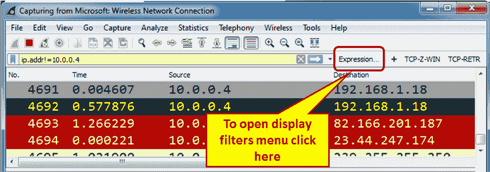

# 四、使用显示过滤器

在本章中，您将了解:

*   配置显示过滤器
*   配置以太网、ARP、主机和网络过滤器
*   配置 TCP/UDP 过滤器
*   配置指定的协议筛选器
*   配置子字符串运算符过滤器
*   配置宏

# 介绍

在本章中，我们将学习如何使用显示过滤器。显示过滤器是我们在捕获数据(无论是否被捕获过滤器过滤)后，当我们希望只显示部分数据时应用的过滤器。

可以实施显示过滤器来定位各种类型的数据:

*   参数，如 IP 地址、TCP 或 UDP 端口号、URL 或服务器名称
*   条件，如数据包长度短于 TCP 端口范围
*   现象，如 TCP 重新传输、重复 ack 和其他、各种协议错误代码、标志存在等
*   各种应用参数，如**短消息服务** ( **SMS** )源号码和目的号码、**服务器消息块** ( **SMB** )、**简单邮件传输协议** ( **SMTP** )、服务器名称等

通过网络发送的任何数据都可以被过滤，一旦过滤，就可以根据它创建统计数据和图表。

正如我们将在本章的配方中描述的，有多种方法可以配置显示过滤器，从预定义的菜单、数据包窗格或通过直接编写语法。

使用显示过滤器时，不要忘记所有的数据都是被捕获的，显示过滤器只决定显示什么。因此，在过滤数据后，捕获文件仍然包含捕获的原始数据。您可以稍后保存全部数据或仅保存显示的数据。

# 配置显示过滤器

为了配置显示过滤器，您可以选择以下选项之一:

*   从过滤器菜单中选择。
*   将语法直接写入过滤器窗口(使用 Wireshark 一段时间后，这将成为您的最爱)。
*   在数据包窗格中选择一个参数，并将其定义为过滤器。
*   在命令行中，使用`tshark`或`wireshark`。这将在附录中讨论。

本章讨论前三个选项。

# 做好准备

一般而言，显示过滤器串采用由合取(`and|or`等)连接的一系列基本表达式的形式，并且可选地以`not`开头:

```
[not] Expression [and|or] [not] Expression...
```

同时:

*   `Expression`可以是任何过滤器表达式，例如`ip.src==192.168.1.1`(用于源地址)、`tcp.flags.syn==1`用于 TCP 同步标志存在、`tcp.analysis.retransmission`用于 TCP 重新传输，等等
*   `and|or`是连接词，可用于任何表达式组合，包括括号、多括号和任意长度的字符串

这些条件可以是下列条件之一:

| **类 C 语法** | **快捷方式** | **描述** | **例子** |
| `==` | `eq` | 平等的 | `ip.addr == 192.168.1.1`或`ip.addr eq 192.168.1.1` |
| `!=` | `ne` | 不相等 | `!ip.addr==192.168.1.1`或`ip.addr != 192.168.1.1`或`ip.addr ne 192.168.1.1` |
| `>` | `gt` | 大于 | `frame.len > 64` |
| `<` | `lt` | 不到 | `frame.len < 1500` |
| `>=` | `ge` | 大于或等于 | `frame.len >= 64` |
| `<=` | `le` | 小于或等于 | `frame.len <= 1500` |
|  | `Is present` | 存在一个参数 | `http.response` |
|  | `contains` | 包含一个字符串 | `http.host contains cisco` |
|  | `matches` | 符合条件的字符串 | `http.host matches www.cisco.com` |

您可以在参数运算符之间插入空格字符，也可以不加空格。

每当您将`!=`操作符用于组合表达式(如`eth.addr, ip.addr`、`tcp.port`或`udp.port`)时，Wireshark 会将显示过滤区涂成黄色，但这不会起作用，因为当您键入过滤表达式(如`ip.addr != 192.168.1.100`)时，必须读取过滤区，因为数据包包含值不同于`192.168.1.100`的字段`ip.addr`。因为 IP 数据报包含源地址和目的地址，所以只要这两个地址中至少有一个与`192.168.1.100`不同，表达式就会计算为真。由于这个原因，你应该写`!(ip.addr == 192.168.1.100)`，也就是说，当`ip.addr`字段的值`1.2.3.4`不为真时，它显示所有的包。

运算符可以如下所示:

| **类 C 语法** | **快捷方式** | **描述** | **例子** |
| `&&` | `and` | 逻辑与 | `ip.src==10.0.0.1 and tcp.flags.syn==1`从 IP 地址`10.0.0.1`发送的所有 SYN 标志实际上——从`10.0.0.1`打开(或试图打开)的所有连接 |
| `&#124;&#124;` | `or` | 逻辑或 | `ip.addr==10.0.0.1 or ip.addr==10.0.02`进出两个 IP 地址的所有数据包 |
| `!` | `not` | 逻辑非 | `not arp and not icmp`既不是 ARP 数据包也不是 ICMP 数据包的所有数据包 |

# 怎么做...

要配置显示过滤器，您可以选择上述方法之一。

要使用“过滤器”菜单，请执行以下操作:

1.  要从过滤器菜单中进行选择，请转到窗口顶部的显示过滤器窗格，然后单击表达式...按钮，如下图所示:



2.  当您单击表达式时...按钮，将打开以下窗口:


“显示过滤器表达式”窗口中有四个重要的窗格:

*   字段名称:在此窗口中，您可以配置过滤器参数。您可以通过键入协议名称向下滚动，并通过单击列表左侧的(+)符号进入协议参数。

Example 1
Type the letters `ipv4` to get to the IPv4 protocol, click on the (+) sign to see the protocol parameters (or click on *Enter* twice), and choose `ip.addr` to filter a specific IP address.

Example 2
Type the letters `tcp` to get to the TCP protocol, click on the (+) sign to see the protocol parameters, and choose `tcp.port` for source or destination port number.

*   关系:这是您从中选择运算符的窗格。可以选择`==`表示相等，`!=`表示不相等，以此类推。

Example 3
Type the letters `sip` to get to the SIP protocol, choose `sip.Method`, and from the Relation window choose `==`. In the value window, type `invite`. This will filter all SIP invite methods.

*   值:在这里，您可以选择之前选择的字段的值。

Example 4
Type the letters `tcp` to get to the TCP protocol, click on the (+) sign to see the protocol parameters, choose `tcp.flags.syn` for a TCP SYN flag, and in the Value field choose `1`.

*   预定义值:当您选择的字段的值不是布尔值时，该字段中可能会有一个选项列表。

Example 5
Under TCP, there is a field `tcp.option_kind`. This option relates to TCP options (for more details go to [Chapter 11](f46fb26a-2c13-48c9-9302-aafb4e0e0e4b.xhtml), *Transport Layer Protocol Analysis*). You will get a list of the values that are possible here.

*   搜索:一种搜索机制，使您能够搜索过滤器表达式。在搜索框中，你应该准确地写出你要找的内容。例如，你可以在下面的截图中看到它——当你搜索`ip fragment`时，它会出现 OpenFlow 和 Cisco NetFlow 表达式 **:**


写`ipv4 fragment`的时候会显示我们需要的东西，也就是 IPv4 碎片，你可以在下面的截图中看到:


将语法直接写入过滤器窗口的操作如下:

1.  习惯显示过滤器语法后，您可能会发现直接在过滤器窗口中键入过滤器字符串会更容易，如以下屏幕截图所示:


2.  在这种情况下，当您将过滤器字符串写入窗口时，窗口将以下列三种颜色之一亮起:
    *   **绿色**:此时滤镜正确，可以应用了。
    *   **红色**:这是一个错误的字符串。请在应用之前修复字符串。
    *   **黄色**:无论何时使用`!=`操作符，显示过滤区都会变成黄色。这并不意味着你的过滤器不起作用，这只是一个警告，它可能不起作用。
3.  要应用过滤器，点击过滤器字符串窗口右侧的右箭头，或使用*输入*。
4.  要从先前定义的过滤器中进行选择，请使用应用箭头右侧的向下滚动按钮。
5.  要配置过滤器首选项和过滤器表达式，请单击过滤器窗口左侧的符号，如下图所示:


6.  选择“管理显示过滤器”使您能够添加过滤器以供将来使用(例如，用于特定的配置文件)。
7.  选择管理过滤器表达式使您能够添加过滤器表达式，这些表达式将显示在过滤器窗口的右侧，以便更方便地使用它们。

使用数据包窗格并将其定义为过滤器，如下所示:

这是一个非常方便的选择。您可以从捕获的文件中的 packet detail pain 中选择任何字段，右键单击它，您将获得以下选项，如以下截图所示:


这些选项包括:

*   应用为过滤器:这将根据您选择的字段设置过滤器，并将其应用于捕获数据。
*   准备过滤器:这将准备一个过滤器，但不应用它。当您单击过滤器窗口右侧的“应用”按钮时，它将被应用。

在这两个选项中，您都可以选择配置过滤器:

*   选定:这将选择选定的字段和参数
*   未选择:这将选择未选择的字段和参数

例如，右击`http.request.method`字段并选择“已选择”将显示过滤字符串`http.request.method == GET`，而选择“未选择”将显示字符串`!(http.request.method == "GET")`。

您还可以为结构化过滤器选择选项“已选择”、“已选择”、“未选择”和“未选择”。

# 它是如何工作的...

显示过滤器是 Wireshark 的专有语言。有许多地方可以使用显示过滤器，这将在后面的章节中讨论协议时讨论。其他过滤器将在本章的以下配方中讨论。

您可以随时使用自动完成功能来完成筛选字符串。例如，如果您在下面的屏幕截图中键入`tcp.f`，自动完成功能会列出可能创建的以`tcp.f`开头的显示过滤器值，即 TCP 标志(SYN、FIN、RST 等):


# 还有更多...

一些其他有用的功能包括:

*   我们过滤的参数是什么？
    *   每当您在数据包详细信息窗格中标记特定字段时，您都会在 Wireshark 左下角的状态栏中看到相关的过滤器字符串:


*   添加参数列:
    *   您也可以右键单击数据包窗格中的参数。右键单击它，然后选择“应用为列”。这将添加一个带有特定参数的列。例如，您可以选择`tcp.window_size_value`参数并将其作为一列添加到数据包列表窗格，这样您将能够在线观察 TCP 窗口大小(这将影响 TCP 性能，我们将在[第 11 章](f46fb26a-2c13-48c9-9302-aafb4e0e0e4b.xhtml)、*传输层协议分析*中了解)。

# 配置以太网、ARP、主机和网络过滤器

在这些食谱中，我们将讨论如何配置第 2-3 层过滤器，即基于以太网和基于 IP 的过滤器。我们还将讨论**地址解析协议** ( **ARP** )过滤器。

# 做好准备

在第 2 层，我们将配置基于以太网的过滤器，而在第 3 层，我们将配置 IP 过滤器。对于以太网，我们有基于以太网帧和 MAC 地址的过滤器，而对于 IP，我们有基于 IP 包和地址的过滤器。

常见的帧增量滤波器包括:

*   `frame.time_delta`:当前帧和前一帧之间的时间差(将用于统计图表，在第 6 章的[和使用高级统计工具的*中)*](ec022445-b229-4794-899a-207790a42f39.xhtml)
*   `frame.time_delta_displayed`:当前显示帧与前一显示帧之间的时间差值(将用于统计图表，在第 6 章中的[，【使用高级统计工具的 )](ec022445-b229-4794-899a-207790a42f39.xhtml)

由于帧之间的时间会显著影响 TCP 性能，我们将使用统计图中的`frame.time_delta`参数来监控 TCP 性能。

常见的第 2 层(以太网)过滤器包括:

*   `eth.addr == <MAC Address>`用于显示特定的 MAC 地址
*   `eth.dst == <MAC Address> or eth.src == <MAC Address>`对于源或目的 MAC 地址
*   `eth.type == <Protocol Type (Hexa)>`对于以太网协议类型

常见的 ARP 过滤器包括以下几种:

*   `arp.opcode == <value>`对于 ARP 请求/响应
*   `arp.src.hw_mac == <MAC Address>`对于 ARP 发送者

常见的第 3 层(IP)过滤器包括:

*   `ip.addr == <IP Address>`为源或目的 IP 地址
*   源或目的 IP 地址的`ip.dst == <IP Address>`或`ip.src == <IP Address>`
*   IP **生存时间** ( **TTL** )值的`ip.ttl == <value>`或`ip.ttl < value>`或`ip.ttl > <value>`
*   IP 数据包长度值的`ip.len = <value>`或`ip.len > <value>`或`ip.len < <value>`
*   `ip.version == <4/6>`针对 IP 协议版本(版本 4 或版本 6)

# 怎么做...

在本节中，我们将看到第 2 层/第 3 层滤波器的一些常见示例:

| **地址格式** | **语法** | **例子** |
| 以太网(MAC)地址 | `eth.addr == xx:xx:xx:xx:xx:xx`where `x` is `0` to `f` | `eth.addr == 00:50:7f:cd:d5:38` |
| `eth.addr == xx-xx-xx-xx-xx-xx`where `x` is `0` to `f` | `eth.addr == 00-50-7f-cd-d5-38` |
| `eth.addr == xxxx.xxxx.xxxx`where `x` is `0` to `f` | `eth.addr == 0050.7fcd.d538` |
| 广播 MAC 地址 | `Eth.addr == ffff.ffff.ffff` |  |
| IPv4 主机地址 | `ip.addr == x.x.x.x`where `x` is `0` to `255` | `Ip.addr == 192.168.1.1` |
| IPv4 网络地址 | `ip.addr == x.x.x.x/y`其中`x`是`0`到`255`，`y`是`0`到`32` | `ip.addr == 192.168.200.0/24`(all addresses in the network `192.168.200.0` mask `255.255.255.0`) |
| IPv6 主机地址 | `ipv6.addr == x:x:x:x:x:x:x:x``ipv6.addr == x::x:x:x:x`其中`nnnn`、`n`格式为`0`到`f`(十六进制) | `ipv6.addr == fe80::85ab:dc2e:ab12:e6c7` |
| IPv6 网络地址 | `ipv6.addr == x::/y`where `x` is `0` to `f` (hex), `y` is `0` to `128` | `ipv6.addr == fe80::/16`(all addressees that start with the 16 bits `fe80`) |

该表引用了`ip.addr`和`ipv6.addr`滤波器字符串。任何具有 IP 地址值的字段的值都可以用同样的方式书写。

以太网过滤器:

*   仅显示特定 MAC 地址发送或接收的数据包:
    *   `eth.src == 10:0b:a9:33:64:18`
    *   `eth.dst == 10:0b:a9:33:64:18`
*   仅显示广播:
    *   `Eth.dst == ffff.ffff.ffff or Eth.dst == ff:ff:ff:ff:ff:ff`

ARP 过滤器:

*   仅显示 ARP 请求:
    *   `arp.opcode == 1`
*   仅显示 ARP 响应:
    *   `arp.opcode == 2`

IP 和 ICMP 过滤器:

*   只显示来自特定 IP 地址的数据包:
    *   `ip.src == 10.1.1.254`

*   仅显示不是来自特定地址的数据包:
    *   `!ip.src == 64.23.1.1`
*   仅显示两台主机之间的数据包:
    *   `ip.addr == 192.168.1.1 and ip.addr == 200.1.1.1`
*   只显示发送到多播 IP 地址的数据包:
    *   `ip.dst == 224.0.0.0/4`
*   仅显示来自网络`192.168.1.0/24`(掩码`255.255.255.0`)的数据包:
    *   `ip.src==192.168.1.0/24`
*   仅显示发往/来自特定地址的 IPv6 数据包:
    *   `ipv6.addr == ::1`
    *   `ipv6.addr == 2008:0:130F:0:0:09d0:666A:13ab`
    *   `ipv6.addr == 2006:0:130f::9c2:876a:130b`
    *   `ipv6.addr == ::`

复杂过滤器:

*   从网络`10.0.0.0/24`到包含单词`packt`的网站的数据包:
    *   `ip.src == 10.0.0.0/24 and http.host contains "packt"`

*   从网络`10.0.0.0/24`到以`.com`结尾的网站的数据包:
    *   `ip.addr == 10.0.0.0/24 and http.host matches ".com$"`
*   来自源 IP 地址`10.0.0.3`的所有广播:
    *   `ip.src == 10.0.0.0/24 and eth.dst == ffff.ffff.ffff`
*   所有不是 ARP 请求的广播:
    *   `not arp and eth.dst == ffff.ffff.ffff`
*   所有不是 ICMP 和 ARP 的数据包:
    *   `!arp || !icmp or not arp&&not icmp`

# 它是如何工作的...

下面是对我们在上一段中看到的过滤器的一些解释。

*   **以太网广播**:对于以太网来说，广播是发送到目的地字段全为 1 的地址的数据包，这就是为什么，为了找到网络中的所有广播，我们编写了过滤器`eth.dst == ffff.ffff.ffff`。
*   **IPv4 组播** : IPv4 组播是发送到地址范围`224.0.0.0`到`239.255.255.255`内的一个地址的数据包，也就是二进制的，地址范围`11100000.00000000.00000000.00000000`到`11101111.11111111.11111111.11111111`。

出于这个原因，如果您查看二进制表示，目的地多播地址是以三个 1 和一个 0 开始的地址，因此到 IPv4 多播目的地的过滤器将是`ip.dst == 224.0.0.0/4`。

也就是说，以四个 1(224)开头的地址和四位的子网掩码(/4)将表示 224 到 239 的网络地址将过滤多播地址。

*   **IPv6 组播** : IPv6 组播是发送到以`ff`(前两个十六进制数字= `ff`)开头的地址的数据包，然后是一个数字标志和范围。因此，当我们编写过滤器`ipv6.dst == ff00::/8`时，它意味着显示 IPv6 中发送到以字符串 ff 开头的地址的所有数据包，即 IPv6 组播。

# 请参见

*   有关以太网的更多信息，请参考[第 8 章](d1205fdc-1b98-40d5-abcb-0d1ffea148a0.xhtml)、*以太网和局域网交换*和[第 10 章](9affead7-6197-42e7-8ebc-0da367154504.xhtml)、*网络层协议和操作*

# 配置 TCP/UDP 过滤器

TCP 和 UDP 是第 4 层的主要协议，提供终端应用之间的连接。无论何时从一端到另一端启动应用，都是从源端口(通常是一个等于或大于 1，024 的随机数)启动会话，并连接到目的端口，目的端口是一个众所周知的或注册的端口，它等待另一端的会话。这些是标识在会话中工作的应用的端口号。

其他类型的过滤器指的是 UDP 和 TCP 报头中的其他字段。在 UDP 中，我们有一个非常简单的报头，其中包含非常基本的数据，而在 TCP 中，我们有一个更复杂的报头，从中我们可以获得更多的信息。

在这个菜谱中，我们将集中讨论配置 TCP 和 UDP 显示过滤器的可能性。

# 做好准备

像以前一样，我们应该精确地计划我们想要显示的内容，并相应地准备过滤器。

# TCP 和 UDP 端口号显示过滤器

对于 TCP 或 UDP 端口号，使用以下显示过滤器:

*   `tcp.port == <value>`或`udp.port == <value>`用于特定的 TCP 或 UDP 端口(源或目的地)
*   `tcp.dstport == <value>`或`udp.dstport == <value>`用于特定的 TCP 或 UDP 目的端口
*   `tcp.srcport == <value>` **o** r `udp.srcport == <value>`为特定的 TCP 或 UDP 目的端口

# TCP 标头过滤器

在 UDP 中，报头结构非常简单—源端口和目的端口、数据包长度和校验和。因此，这里唯一有意义的信息是端口号。

另一方面，TCP 更复杂，它使用可被 Wireshark 监控的连接和可靠性机制。使用`tcp.flags`、`tcp.analysis`和其他智能过滤器将帮助您解决性能问题(重新传输、重复 ack、零窗口等)，或协议操作问题，如重置、半开等。

此类别中常见的显示过滤器如下:

*   `tcp.analysis`:用于 TCP 分析标准，如重传、重复 ack 或窗口问题。这些筛选器的示例如下(您可以使用自动完成功能来获取可用筛选器的完整列表):
    *   `tcp.analysis.retransmission`显示重新传输的数据包
    *   `tcp.analysis.duplicate_ack`显示多次确认的数据包
    *   `tcp.analysis.zero_window`当连接端的设备发送零窗口消息时显示(该消息告诉发送方停止在此连接上发送数据，直到窗口大小再次增加)

`tcp.analysis` fields do not analyze the TCP header, they provide protocol analysis through the Wireshark expert system.

*   `tcp.flags`:这些过滤器用于确定是否设置了标志；
    *   `tcp.flags.syn == 1`检查是否设置了 SYN 标志
    *   `tcp.flags.reset == 1`检查是否设置了 RST 标志
    *   `tcp.flags.fin == 1`检查是否设置了 FIN 标志
    *   `tcp.window_size_value < <value>`寻找 TCP 窗口较小的情况，在某些情况下，这表示设备运行缓慢

`tcp.flags` filters—for TCP flags, this will be used to find out whether a specific flag is set or not.

# 怎么做...

TCP/UDP 过滤器中的一些过滤器示例如下:

*   发往 HTTP 服务器的所有数据包:
    *   `tcp.dstport == 80`
*   从网络`10.0.0.0/24`到 HTTP 服务器的所有数据包:
    *   `ip.src==10.0.0.0/24 and tcp.dstport == 80`
*   特定 TCP 连接上的所有重新传输:
    *   `tcp.stream eq 16 && tcp.analysis.retransmission`

要隔离特定的连接，请将鼠标放在要观察的连接上的数据包上，右键单击它，然后选择跟随和 TCP 流。TCP 流是指从建立连接到断开连接，在事务两端之间传输的数据。字符串`tcp.stream eq <value>`将出现在显示过滤器窗口中。这是你现在可以工作的流。在以下示例中，它作为流 6 输出，但它可以是任何流编号(从捕获文件中的流编号 1 开始):


重新传输是再次发送的 TCP 数据包。这可能有几个原因，如第十一章、*传输层协议分析*、*中所述。*

当您监视诸如重新传输、重复 ack 和其他影响性能的行为等现象时，请务必记住这些现象指的是特定的 TCP 连接。

*   特定连接上的所有窗口问题:
    *   `tcp.stream eq 0 && (tcp.analysis.window_full || tcp.analysis.zero_window)`
    *   `tcp.stream eq 0 and (tcp.analysis.window_full or tcp.analysis.zero_window)`

*   从`10.0.0.5`到 DNS 服务器的所有数据包:
    *   `ip.src == 10.0.0.5 && udp.port == 53`
*   包含字符串`cacti`(区分大小写)的 TCP 或 TCP 协议(例如 HTTP)中的所有数据包:
    *   `tcp contains "cacti"`
*   来自`10.0.0.3`的所有重新传输的数据包:
    *   `ip.src == 10.0.0.3 and tcp.analysis.retransmission`
*   发往任何 HTTP 服务器的所有数据包:
    *   `tcp.dstport == 80`
*   从特定主机打开的所有连接(如果以扫描的形式，可能是一个警告):
    *   `ip.src==10.0.0.5 && tcp.flags.syn==1 && tcp.flags.ack==0`
*   客户端发送和接收的所有 cookies:
    *   `ip.src==10.0.0.3 && (http.cookie || http.set_cookie)`

# 它是如何工作的...

以下是 TCP 和 IP 报头结构的示意图。UDP 非常简单，只有源和目的端口号、长度和校验和:


IP 数据包中的一些重要内容:

*   版本 4 或 6。
*   **报头长度** : 20 到 24 字节，带选项。
*   **服务类型(ToS)** :通常用**区分服务** ( **DiffServ** )实现，优先提供优先服务。

TCP 标准(1981 年 10 月的 RFC 793)将该字段命名为 ToS，并定义了其结构。后来发布的区分服务标准(1998 年 12 月的 RFCs 2474、2475 和其他标准)用于在大多数应用中实现 ToS 字节。

*   **长度**:数据报总长度，以字节为单位。
*   **标识符、标志和片段偏移量**:每个数据包都有自己的数据包 ID。当分段时，连同标志和偏移，它将使接收器能够重组它。
*   **生存时间**:从 64、128 或 256(取决于发送数据包的操作系统)开始，此时途中的每台路由器都会将该值减 1。这可以防止数据包在网络中无休止地传输。在数据包中发现 1 的路由器会将其递减为零，并丢弃该数据包。
*   **上层**:上层协议——TCP、UDP、ICMP 等。
*   **互联网校验和**:这里的想法是发送方使用一种错误检查机制来计算数据包的值。该值在校验和字段中设置，而数据包的接收方将再次计算该值。如果发送的值不等于接收的值，将被视为校验和错误。
*   **源和目的 IP 地址**:顾名思义。
*   **选项**:IP 版本 4 中通常不使用。

IP 报头后面是 TCP 报头。格式如下:


TCP 数据包中的一些重要内容:

*   **源端口和目的端口**:这是两端的应用代码。
*   **序列号**:统计发送方发送给接收方的字节数。
*   **确认号** : ACK 的接收字节。我们将在[第十一章](f46fb26a-2c13-48c9-9302-aafb4e0e0e4b.xhtml)、*传输层协议分析*中详细讨论这一点。
*   **HL** :表头长度，表示是否使用选项字段。
*   **Res** :保留(用于未来标志)。
*   **标志**:启动连接(SYN)、关闭连接(FIN)、重置连接(RST)和推送数据以进行快速处理(PSH)的标志。将在 TCP 分析章节中讨论。
*   **Rcvr 窗口大小**:接收方已经分配给进程的缓冲区。
*   **校验和**:数据包校验和。
*   **选项**:时间戳、接收器窗口增强(RFC 1323)和 MSS 扩展。**最大段尺寸** ( **MSS** )是 TCP 有效载荷的最大尺寸。我们将在[第 11 章](f46fb26a-2c13-48c9-9302-aafb4e0e0e4b.xhtml)、*传输层协议分析*中进一步讨论这一点。

# 还有更多...

IP 中的 TTL 字段是非常有用的字段。当看到一个 TTL 值时，它明确地指出数据包通过了多少个路由器。由于操作系统默认为 64、128 或 256，数据包通过互联网的最大跳数为 30(在专用网络中更少)，例如，如果我们看到值为 120，则数据包已通过 8 个路由器，值为 52 表示数据包已通过 12 个路由器。

# 请参见

*   有关 TCP/IP 协议栈的更多信息，请参见[第 11 章](f46fb26a-2c13-48c9-9302-aafb4e0e0e4b.xhtml)、*传输层协议分析*、 *s*

# 配置特定的协议过滤器

在本菜谱中，我们将提供为常见协议(如 DNS、HTTP、FTP 等)配置显示过滤器的说明和示例。

本菜谱的目的是学习如何配置过滤器，这将有助于我们进行网络故障排除，我们将在以下章节中详细讨论。

# 做好准备

要逐步完成这个食谱，您需要 Wireshark 软件和一个正在运行的捕获。不需要其他先决条件。

# 怎么做...

在这个菜谱中，我们将看到一些常见协议的显示过滤器。

# HTTP 显示过滤器

一些常见的 HTTP 显示过滤器如下:

*   显示发往主机名的所有 HTTP 数据包:
    *   `http.request.method == <"Request methods">`
*   使用 HTTP `GET`方法的数据包:
    *   `http.request.method == "GET"`
*   显示客户要求的 URI:
    *   `http.request.method == <"Full request URI">`
    *   `http.request.uri == "/v2/rating/mail.google.com"`
*   显示客户端请求的包含特定字符串的 URI(本例中是对 Google 的所有请求):
    *   `http.request.uri contains "URI String"`
    *   `http.request.uri contains "mail.google.com"`
*   通过网络发送的所有 cookie 请求(注意，cookie 总是从客户端发送到服务器):
    *   `http.cookie`
*   从服务器发送到客户端的所有 cookie 集命令:
    *   `http.set_cookie`
*   Google 服务器发送到您电脑的所有 cookies:
    *   `(http.set_cookie) && (http contains "google")`
*   包含 ZIP 文件的所有 HTTP 数据包:
    *   `http matches ".zip" && http.request.method == "GET"`

# DNS 显示筛选器

一些常见的 DNS 显示过滤器如下:

*   显示 DNS 查询和响应:
    *   `dns.flags.response == 0 for DNS queries`
    *   `dns.flags.response == 1 for DNS response`
*   仅显示具有四个或更多答案的 DNS 响应:
    *   `dns.count.answers >= 4`

# FTP 显示过滤器

一些常见的 FTP 显示过滤器如下:

*   FTP 请求命令:
    *   `ftp.request.command == <"requested command"> - ftp.request.command == "USER"`
*   FTP 或 FTP 数据—FTP 命令(端口`21`)或数据(端口`20`或变量):
    *   `ftp`
    *   `ftp-data`

# 它是如何工作的...

用于显示过滤器的 Wireshark 正则表达式语法与 Perl 中的正则表达式使用相同的语法。

一些常见的修饰符如下:

*   `^`:匹配行首
*   `$`:匹配行尾
*   `|`:交替
*   `()`:分组
*   `*`:匹配零次或多次 [](http://perldoc.perl.org/functions/times.html) 
*   `+`:匹配一次或多次
*   `?`:匹配一次或零次
*   `{n}`:精确匹配`n`次
*   `{n,}`:至少匹配 *n 次*
*   `{n,m}`:匹配至少 *n 次*，但不超过 *m 次*

您可以使用这些修饰符来配置更复杂的过滤器。例如，查找包含 ZIP 文件的 HTTP `GET`命令:

```
http.request.method == "GET" && http matches ".zip" && !(http.accept_encoding == "gzip, deflate")
```

查找包含以`.com`结尾的网站的 HTTP 邮件:

```
http.host matches ".com$"
```

# 请参见

*   Perl 正则表达式语法列表可以在 http://www.pcre.org/的[找到，手册页可以在 http://perldoc.perl.org/perlre.html 的](http://www.pcre.org/)[找到](http://perldoc.perl.org/perlre.html)

# 配置子字符串运算符过滤器

偏移过滤器是这样的过滤器，其中您实际上说*“转到协议报头中的字段 X，并检查接下来的 Y 字节是否等于...”*。

这些过滤器可以用在许多情况下，一个已知的字节字符串出现在包的某个地方，你想显示包含它的包。

# 做好准备

要逐步完成这个食谱，您需要 Wireshark 软件和一个正在运行的捕获。不需要其他先决条件。失调滤波器的一般表示如下:

```
Protocols[x:y] == <value>
X: Bytes from beginning of header
Y: Number of bytes to check
```

# 怎么做...

使用子字符串运算符的筛选器示例如下:

*   发往 IPv4 多播地址的数据包

`eth.dst[0:3] == 01:00:5e RFC 1112`, section 6.4 allocates the MAC address space of `01-00-5E-00-00-00 to 01-00-5E-FF-FF-FF` to multicast addresses.

*   发往 IPv6 组播地址的数据包

`eth.dst[0:3] == 33:33:00 RFC 2464`, section 7 allocates the MAC address space that starts with `33-33` to multicast addresses.

# 它是如何工作的...

Wireshark 允许您查看协议并在其中搜索特定的字节。这对于诸如以太网之类的协议中众所周知的字符串尤其实用。

# 配置宏

显示过滤器宏用于为复杂的显示过滤器创建快捷方式，您可以配置一次并在以后使用。

# 做好准备

要配置显示过滤器宏，请转到:分析|显示过滤器宏。您将看到以下窗口:


# 怎么做...

1.  为了配置一个宏，你给它一个名字，并在文本框中填入过滤字符串。
2.  为了激活宏，您只需编写以下内容:

```
$(macro_name:parameter1;paramater2;parameter3 ...) 
```

3.  让我们配置一个简单的过滤器名称`test01`，它采用以下参数作为值:

```
ip.src == <value> and 
tcp.dstport == <value> 
```

4.  这将是一个过滤器，用于查找从特定源网络发送到 HTTP 端口的数据包。

采用这两个参数的宏如下所示:

```
ip.src==$1 && tcp.dstport==$2  
```

5.  现在，为了获得参数的过滤结果，我们执行以下操作:

```
ip.src == 10.0.0.4 and 
tcp.dstport == 80 
```

6.  我们应该在显示窗口栏中编写如下字符串:

```
${test01:10.0.0.4;80} 
```

# 它是如何工作的...

宏的工作方式很简单——在每个位置参数前写一个带符号`$`的过滤字符串。运行宏时，它将按顺序接受参数。