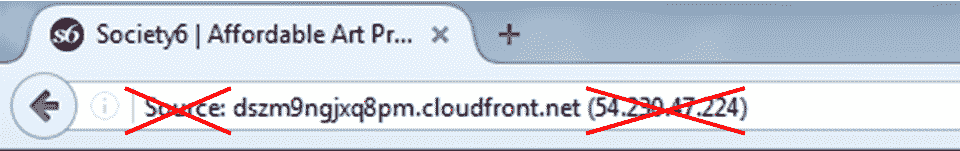

# 五、使用基本统计工具

在本章中，您将了解:

*   使用统计-捕获文件属性
*   使用统计解析的地址
*   使用统计–协议层次菜单
*   使用统计–对话菜单
*   使用统计–端点菜单
*   使用统计–HTTP 菜单
*   配置用于查看 TCP 流的流图
*   创建基于 IP 的统计数据

# 介绍

Wireshark 的优势之一是它的统计工具。使用 Wireshark 时，我们有各种类型的工具，从列出终端节点和对话的简单工具，到更复杂的工具，如流和 I/O 图。

在接下来的两章中，我们将学习如何使用这些工具。在本章中，我们将了解为我们提供基本网络统计数据的简单工具，即谁在网络上与谁交谈，什么是聊天设备，网络上传输的数据包大小，等等。在下一章中，我们将进入诸如 I/O 和流图等工具，它们为我们提供了更多关于网络行为的信息。

有些工具我们就不说了——有些很明显(比如数据包大小)，有些不太常见(比如 ANSP、BACnet、NCP 等等)。其他一些我们将在相关章节中提及，例如，统计|服务响应时间或统计|DNS。

要启动统计工具，请启动 Wireshark，并从主菜单中选择统计。

# 使用统计–捕获文件属性菜单

在这个菜谱中，我们将学习如何从网络上运行的数据中获取一般信息。Wireshark 2 中的捕获文件属性取代了 Wireshark 1 中的摘要菜单。

# 做好准备

启动 Wireshark，点击统计。

# 怎么做...

1.  从统计菜单中，选择捕获文件属性:

您将会看到“捕获文件属性”窗口(显示在下面的屏幕截图中)。

2.  正如您在下面的屏幕截图中看到的，我们有以下内容:
    *   File:提供文件数据，如文件名和路径、长度等
    *   时间:捕获的开始时间、结束时间和持续时间
    *   捕获:安装 Wireshark 的 PC 的硬件信息
    *   接口:接口信息—左侧的接口注册表标识符(如果打开了捕获过滤器)、接口类型和数据包大小限制
    *   统计数据:常规捕获统计数据，包括捕获和显示的数据包:

# 它是如何工作的...

当有人想了解捕获统计信息时，该菜单简单地给出了过滤数据属性和捕获统计信息(平均每秒包数或字节数)的摘要。

# 还有更多...

从 summary 窗口中，您可以获得整个捕获文件的平均每秒数据包数和每秒位数，显示的数据也是如此。

# 使用统计解析的地址

在这个菜谱中，我们将了解 Wireshark v2 的一个新功能:捕获的 IP 地址的 DNS 转换，以及众所周知的 TCP/UDP 端口和以太网(MAC)地址供应商的列表。

# 做好准备

启动 Wireshark，点击统计。

# 怎么做...

从统计菜单中，选择已解析的地址。您将看到以下窗口:

在此窗口中，您可以看到以下信息:

*   **地址解析**，提供捕获的 IP 地址的 DNS 名称。如果您希望看到评论，也可以选中评论。
*   **哈希表**是 IP 地址的哈希值。
*   端口名称(服务)、以太网地址、以太网制造商和以太网知名地址提供了以太网地址信息。

# 它是如何工作的...

对于 IP 地址，Wireshark 只需使用笔记本电脑的解析机制，即 DNS 和 Wireshark 主机文件，它们位于 Wireshark 主目录中。

对于 MAC 制造商，Wireshark 使用 IEEE 802 委员会所定义的 MAC 地址转换。

TCP 和 UDP 端口号由**互联网编号分配机构** ( **IANA** )在[http://www . iana . org/assignments/service-names-port-Numbers/service-names-port-Numbers . XHTML](http://www.iana.org/assignments/service-names-port-numbers/service-names-port-numbers.xhtml)定义。

# 还有更多

借助 Wireshark 的这一新功能，我们可以获取互联网上的信息。它只是一些对我们有帮助和可获取的更多信息。

# 使用统计–协议层次菜单

在这个菜谱中，我们将学习如何获取在网络上运行的数据的协议层次信息。

# 做好准备

启动 Wireshark，点击统计。

# 怎么做...

1.  从统计菜单中，选择协议层次结构:

您将获得的是关于捕获文件中协议分布的数据。您将获得捕获数据的协议分布。

2.  此处显示的部分屏幕截图描述了基于每个协议捕获的数据包的统计信息:

您将看到协议层次窗口:

*   协议:协议名称
*   百分比数据包:协议数据包占捕获的全部数据包的百分比
*   数据包:总捕获数据包中协议数据包的数量
*   百分比字节:协议字节占捕获数据包总数的百分比
*   Bytes:总捕获数据包中的协议字节数
*   位/秒:该协议的带宽，与捕获时间相关
*   结束数据包:该协议的数据包的绝对数量(对于解码文件中的最高协议)
*   End Bytes:该协议的绝对字节数(用于解码文件中的最高协议)
*   结束位/秒:此协议的带宽，相对于捕获数据包和时间(对于解码文件中的最高协议)

当协议是数据包中的最后一个协议时(即当协议出现在帧的末尾时)，end 列计数。这些数据包可以是不带有效负载的 TCP 数据包(例如，SYN 数据包),它们携带上层协议。这就是为什么您会看到以太网、IPv4 和 UDP 结束数据包的计数为零；不存在那些协议是帧中最后一个协议的帧。

在这个文件示例中，我们可以看到两个有趣的问题:

*   我们可以看到 1842 个 DHCPv6 数据包。如果不需要 IPv6 和 DHCPv6，请将其禁用。
*   我们看到超过 200，000 个**检查点高可用性** ( **CPHA** )数据包，其中 74.7%是通过我们监控的网络发送的。这些是在集群中工作的两个防火墙之间发送的同步数据包，用于更新防火墙之间的会话表。如此大量的数据包会严重影响性能。此问题的解决方案是在防火墙之间配置专用链路，以便会话表不会影响网络。

# 它是如何工作的...

简单地说，它计算捕获数据的统计数据。一些需要注意的重要事项:

*   百分比总是指同一层协议。例如，在下面的屏幕截图中，我们看到逻辑链路控制有 0.5%的数据包在以太网上运行，IPv6 有 1.0%，IPv4 有 88.8%的数据包，ARP 有 9.6%的数据包，甚至旧的思科 ISK 也有 0.1%—第 2 层以太网上的协议总数为 100 %。
*   另一方面，我们看到 TCP 有 75.70%的数据，在 TCP 内部，只有 12.74%的包是 HTTP，差不多就是这样。这是因为 Wireshark 只计算带有 HTTP 报头的数据包。例如，它不计算 ACK 包、数据包等:

# 还有更多...

为了让 Wireshark 也能对数据包进行计数，例如 TCP 数据包中的 HTTP 数据包，请禁用允许子分离器重组 TCP 流。您可以从 Preferences 菜单或通过在 packet details 窗格中右键单击 TCP 来完成此操作。

# 使用统计–对话菜单

在这个菜谱中，我们将学习如何获取在网络上运行的数据的会话信息。

# 做好准备

启动 Wireshark，点击统计。

# 怎么做...

从统计菜单中，选择对话:

将出现以下窗口:

您可以选择第 2 层以太网统计、第 3 层 IP 统计或第 4 层 TCP 或 UDP 统计。

您可以将此统计工具用于:

*   **在第 2 层(以太网)**:发现并隔离广播风暴
*   **在第 3 层/第 4 层(TCP/IP)** :并行连接到互联网路由器端口，并检查是谁在向 ISP 加载线路

If you see that there is a lot of traffic going out to port `80` (HTTP) on a specific IP address on the internet, you just have to copy the address to your browser and find the website that is most popular with your users.

If you don't get anything, simply go to a standard DNS resolution website (search Google for DNS lookup) and find out what is loading your internet line.

要以名称的形式查看 IP 地址，您可以选中名称解析的名称解析复选框(前面截图中的 **1** )。要查看名称解析，您必须首先通过选择视图|名称解析|启用网络层来启用它。

您还可以通过选中“限制显示过滤器”复选框( **2** )将对话统计信息限制为显示过滤器。这样，通过显示过滤器的所有数据包的统计数据都会显示出来。

Wireshark v2 中的一个新功能是图形功能，在之前的截图中标记为( **5** )。当您在 TCP 对话统计中选择特定线路并单击图形时...，它会将您带到 TCP 时间/序列(tcptrace)流图。该图也可从统计| TCP 流图中获得，将在下一章*中解释。*

要复制表格数据，点击**复制**按钮( **3** )。在 TCP 或 UDP 中，您可以标记特定的行，然后点选跟随流...按钮( **4** )。这将定义一个显示过滤器，向您显示特定的数据流。正如您在下面的屏幕截图中所看到的，您也可以右键单击一行，然后选择准备或应用过滤器，或者为数据流着色:

我们还可以看到，与以前的 Wireshark 版本不同，在以前的版本中，我们可以在上面的选项卡中看到所有类型的协议，而在这里，我们可以选择在默认情况下只显示已识别的协议时查看哪些协议。

# 它是如何工作的...

网络会话是两个特定端点之间的流量。例如，IP 会话是两个 IP 地址之间的所有流量，而 TCP 会话表示所有 TCP 连接。

# 还有更多...

使用对话列表时，会出现许多网络问题。

在以太网会话统计中:

*   寻找大量的广播——你可能会看到一个广播风暴(一个小的；在大调中，你可能什么也看不见)

在严重的广播风暴中通常会发生的情况是，由于 Wireshark 接收到数千甚至数万个每秒发送的数据包，软件只是停止向我们显示数据，屏幕冻结。只有当您断开 Wireshark 与网络的连接时，您才能看到它。

*   如果您看到大量流量来自特定的 MAC 地址，请查看它的第一部分——这是供应商 ID，它将为您提供麻烦制造者的线索

尽管 MAC 地址的前半部分标识了供应商，但它不一定标识 PC 本身。这是因为 MAC 地址属于安装在 PC 或笔记本电脑主板上的以太网芯片供应商，而不一定来自 PC 制造商。如果您没有得到一个您知道它来自哪里的地址，您可以 ping 可疑设备并通过 ARP 得到它的 MAC 地址，在交换机中找到 MAC 地址，如果您有一个管理系统，使用一个简单的 find 命令找到它。

在 IP 会话统计中:

*   检查发送或接收大量数据包的 IP 地址，并比较预期行为。如果该地址属于服务器，您可能会看到大量的数据包。但如果是最终用户，可能是网络扫描或只是产生了太多的流量。
*   寻找扫描模式，详见[第 19 章](04fd2bda-1039-43f6-9fd7-203c0e56e8d3.xhtml)、*安全和网络取证*。这可能是一个很好的扫描，如 SNMP 软件发送 ping 来发现网络，但通常网络扫描不是好事情。
*   您可以在下面的屏幕截图中看到典型的扫描模式:

在这个例子中，有一个扫描模式。一个 IP 地址`192.168.110.58`，发送 ICMP 数据包到`192.170.3.44`，到`192.170.3.45`，到`192.170.3.46`，到`192.170.3.47`，等等(在图片中我们只能看到很短的一部分扫描)。然后扫描继续到`192.170.4.0`、`192.168.4.1`等等。在这种情况下，我们有一个蠕虫感染了网络中的所有 PC，当它感染 PC 时，它开始生成 ICMP 请求并将其发送到网络，因此窄带链路很容易拥塞(例如，WAN 连接)。

在 TCP/UDP 会话统计中:

*   寻找具有太多打开的 TCP 连接的设备。一台 PC 有 10-20 个连接是合理的；几百个不是。
*   查看并尝试找到无法识别的目的端口号。这可能没问题，但也可能意味着麻烦。在下面的屏幕截图中，您可以看到典型的 TCP 扫描:

在前面的屏幕截图中，我们看到了一个简单的 TCP 扫描模式。显示源地址`10.0.0.1`，它在目的端口`1`、`3`、`4`、`6`、`7`等产生发往 IP 地址`81.218.230.244`的 TCP 包。

这种情况下的扫描是一种模式；`10.0.0.1`向每个目的端口发送两个数据包。两个数据包从源端口`63033`和`63038`发送到端口`1`，两个数据包从源端口`63650`和`63655`发送到端口`3`，以此类推。

使用 conversations 工具时，可以立即识别的一件事情是，当您单击此窗口中的 source 或 destination 选项卡时，扫描模式会立即显示出来。

# 使用统计–端点菜单

在这个菜谱中，我们将学习如何获取捕获数据的端点统计信息。

# 做好准备

启动 Wireshark 并单击统计数据。

# 怎么做...

要查看端点统计信息，请按照下列步骤操作:

1.  从统计菜单中，选择端点:

2.  将出现以下窗口:

在此窗口中，您将能够看到第 2 层、第 3 层和第 4 层端点，即以太网、IP 和 TCP 或 UDP。

从窗口的左侧，您可以看到(这里是 TCP 选项卡的示例):

*   该主机上的端点 IP 地址和端口号
*   该主机发送和接收的数据包总数和字节数
*   发往主机的数据包(数据包 A → B)和发往主机的字节(字节 A → B)
*   发往主机的数据包(数据包 B → A)和发往主机的字节(字节 B → A)
*   适用于 GeoIP 的纬度和经度列，如[第 10 章](9affead7-6197-42e7-8ebc-0da367154504.xhtml) **、** *网络层协议和操作所述进行配置。*

在窗口底部，我们有以下复选框:

*   名称解析:如果在视图菜单下的名称解析中配置了名称解析，则提供名称解析。
*   限制显示过滤器:仅显示主窗口上配置的显示过滤器的统计信息。
*   复制:以 CSV 或 YAML 格式将列表值复制到剪贴板。
*   地图:在配置了 GeoIP 的情况下，在地理地图上显示地理信息。有关 GeoIP 配置，请参见第 10 章、*网络层协议和操作*、*。*

# 它是如何工作的...

很简单，它给出了 Wireshark 发现的所有端点的统计数据。它可以是任何情况，例如以下情况:

*   几个以太网(甚至上)端节点(即 MAC 地址)，许多 IP 端节点(即 IP 地址)，例如，我们有一个路由器，它从许多远程设备发送/接收数据包。
*   几个 IP 端节点和许多 TCP 端节点—每台主机上许多 TCP 连接都是这种情况。可能是具有许多连接的服务器的常规操作，也可能是一种来自网络的攻击(SYN 攻击)。

# 还有更多...

这里我们看到了一个从网络中心获取的捕获文件的示例，以及我们可以从中获得什么。

在下面的截图中，我们看到了一个内部网络，其中大多数数据包都被发送到一台思科设备(可能是一台路由器)和一台惠普设备( **1** )。然后我们看到几个设备有未解析的 MAC 地址( **2** )。接下来，我们看到广播( **3** )和生成树帧( **4** )、IPv4 和 IPv6 组播(我们将在[第 10 章](9affead7-6197-42e7-8ebc-0da367154504.xhtml) **、** *网络层协议和操作* *、* IPv6 组播从`33:33:00`开始)，在最后一行，这些帧的前六个数字可以是所显示的选项之一— **思科发现协议**(

在下一个捕获文件示例中，从到互联网的连接中获取，我们看到大多数到互联网的数据包(13，031 个数据包)被发送到 IP 地址`54.230.47.224`:

当我们试图找出这个网站，并试图在我们的浏览器中简单地写下它的 IP 地址时，我们会得到 HTTP 和 HTTPS 的错误。我们可以在下面的截图中看到这一点:

因此，为了看到这个网站，我们将使用名称解析按钮，然后:

1.  如下图所示，我们看到了该地址的 DNS 转换。要查看转换后的地址，您需要首先标记查看|名称解析|解析网络地址，然后刷新主机表:

Some windows in Wireshark refresh automatically when the operation you make requires it, and some not. In our case, in version 2.0.3, it does not. In this case, you can simply check the Limit to display filter checkbox and the window will be refreshed. Then, if you don't need the filter, uncheck it.

2.  右键单击要检查的主机所在的行，选择“应用过滤器”|“选定的”,然后转到 Wireshark 主窗口。
3.  在 Wireshark 主窗口中，转到数据包扣留窗格。单击带有您要复制的名称的地址。选择复制|描述。也可以用*Ctrl*+*Shift*+*D*:

4.  将不带 IP 地址的值复制到您的 web 浏览器，您将获得所需的网站:

有了 DNS 名称，网站就会出现。

# 使用统计–HTTP 菜单

在这个菜谱中，我们将学习如何使用在网络上运行的数据的 HTTP 统计信息。

# 做好准备

启动 Wireshark，点击统计。

# 怎么做...

要查看 HTTP 统计信息，请单击统计信息菜单并选择 HTTP。将出现以下窗口:

在 HTTP 菜单中，我们有以下内容:

*   数据包计数器:为我们提供每个网站的数据包数量。这将帮助我们了解我们收到了多少请求和响应。
*   请求:查看向网站分发的请求。
*   负载分布:查看网站之间的负载分布。

查看数据包计数器统计信息:

1.  选择统计| HTTP |数据包计数器。
2.  将会打开以下窗口:

此窗口显示 HTTP 请求和响应的总数。

3.  为了查看特定节点的 HTTP 统计信息，您可以使用显示过滤器格式为它配置一个过滤器。这可以在显示过滤器窗口中配置。

查看 HTTP 请求统计信息:

1.  选择统计| HTTP |请求。将出现以下窗口:

2.  要获得特定 HTTP 主机的统计信息，您可以设置一个过滤器`http.host contains <host_name>`或`http.host==<host_name>`(取决于您是需要具有特定名称的主机名还是包含特定字符串的主机名)，您将看到这个特定主机的统计信息。
3.  例如，配置过滤器`http.host == www.ndi-com.com`，将统计到`www.ndi-com.com`的网站(如下图所示):

要查看 web 或特定网站的负载分布:

1.  选择统计| HTTP |数据包负载分布。
2.  将出现以下窗口(为便于解释，缩小了范围):

3.  打开表项时，您可以通过以下方式获得服务器列表:
    *   国际电脑互联网地址
    *   服务器地址
    *   HTTP 主机名

在[第十二章](91ddb152-048f-49f3-9d85-0b106e85cde8.xhtml)、 *FTP、HTTP/1 和 HTTP/2* 中，您将看到如何使用这些工具进行 HTTP 分析。

# 它是如何工作的...

当我们打开一个网站时，它通常会向几个 URL 发送请求。在这个例子中，我们打开的一个网站是`www.cnn.com`，它将我们转发到`edition.cnn.com`。考虑到这一点，我们已经向根 URL 发送了几个请求来获取突发新闻，并向主页上的另外两个位置发送了请求。

# 还有更多...

对于更深入的 HTTP 分析，您可以使用特定用途的工具。其中最常见的是提琴手。你可以在:[http://www.fiddler2.com/fiddler2/](http://www.fiddler2.com/fiddler2/)找到它。

Fiddler 是为 HTTP 故障排除开发的软件工具，因此它为 HTTP 提供了更多的数据和更好的用户界面。

# 配置用于查看 TCP 流的流图

在本食谱中，我们将学习如何使用流程图功能。

# 做好准备

打开 Wireshark，单击 statistics，然后选择 Statistics 菜单中间的 Flow Graph。

# 怎么做...

选择流图，将会打开以下窗口:

在窗口中，我们看到左边是数据包时间，数据包的起始地址和目的地址，以及流向箭头两侧的端口号。

单击其中一个会话箭头会将您带到 Wireshark 主窗口数据包列表窗格中的数据包。

您可以从“流程图”窗口的几个选项中进行选择:

*   显示所有捕获的数据包或只显示由显示过滤器过滤的数据包。
*   显示所有流或仅显示 TCP 流。这将只显示 TCP 操作，例如，在 HTTP 请求中，它将显示它是一个 TCP 推送(在第 12 章、 *FTP、HTTP/1 和 HTTP/2* 中解释)，以及它是一个 HTTP `GET`命令的事实。
*   显示任何类型的地址，例如 MAC 地址，或者只显示网络地址(实际上，这将只显示 IP 地址)。

# 它是如何工作的...

只需从捕获的文件中创建简单的统计数据。

# 还有更多...

理解 TCP 问题有时相当复杂。最好的方法是，大多数时候，使用图形界面更好的图形软件，或者干脆拿一张纸和不同颜色的笔自己画。

能够完成这项工作的友好软件包括 Wireshark 的开发人员提供的 Cascade Pilot 包:[http://www . riverbed . com/us/products/Cascade/Wireshark _ enhancements/Cascade _ Pilot _ personal _ edition . PHP](http://www.riverbed.com/us/products/cascade/wireshark_enhancements/cascade_pilot_personal_edition.php)。

下图是一个自制图表的例子:

您可以清楚地看到 TCP 连接是如何设置的(帧 2-4)，客户端`10.0.0.5`如何发送 HTTP `POST`命令并从服务器`77.234.41.58`获得 200 (OK)(帧 5-7)，以及连接是如何有序关闭的(帧 8-11)。

我们将在后面的第 12 章、 *FTP、HTTP/1 和 HTTP/2* 以及其他应用章节中看到更多这些自制的图表。几个图下来，你就对这个了如指掌了。

# 创建基于 IP 的统计数据

在这个菜谱中，我们将学习如何创建一些基于 IP 的统计数据。IP 统计实际上是基于相同数据的几种工具，即源和目的 IP 地址，以及在它们之间发送的数据包。

# 做好准备

打开 Wireshark 并单击统计菜单。在统计菜单的底部，我们看到以下统计工具:

*   IPv4 统计
*   IPv6 统计

下面显示了 IPv4/IPv6 统计信息部分下的选项:

*   所有地址
*   目的地和港口
*   IP 协议类型
*   源地址和目的地址:

# 怎么做...

要获得统计数据，请按照下列步骤操作:

要获取所有 IP 地址:

1.  转到统计| IPv4 统计|所有地址。
2.  或者，转到统计| IPv6 统计|所有地址。将打开以下窗口:

****

3.  到目前为止，很明显。有趣的是，您可以配置一个过滤器，例如(在本例中)，过滤器`tcp.analysis.retransmission`向我们显示大多数重传都是针对地址`10.10.10.30`的，有 1，262 次重传是针对该地址的:

4.  还有其他工具可以向我们显示相同的信息，例如，我们在本章前面讨论过的 Statistics | Conversations，或者简单地使用 Wireshark 主窗口上的显示过滤器。

要获取 IP 和 TCP/UDP 目标统计信息:

1.  转到统计| IPv4 统计|目标和端口。
2.  或者，转到统计| IPv6 统计|目标和端口。在以下窗口中，您可以选择想要使用的过滤器，例如`tcp.analysis.zero_window`，如下图所示:

****

要获取 IP 协议类型:

1.  转到统计| IPv4 统计|协议类型
2.  或者，转到统计| IPv6 统计|协议类型

从这里没什么可得到的。

要获取 IP 源地址和目的地址:

1.  转到统计| IPv4 统计|源地址和目标地址
2.  或者，转到统计| IPv6 统计|源地址和目标地址

从这里也没得到什么。

这里作为例子给出的文件是`CAP_05_08`。

# 它是如何工作的...

它的工作原理很简单，就是在捕获的文件上创建统计数据。

# 还有更多...

Wireshark 中有各种选项可以提供非常相似的统计数据；这些是本章开始时讨论的对话、协议层次和端点。您可以将它们与前面的结合使用。