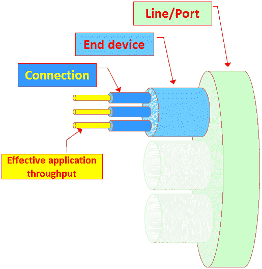
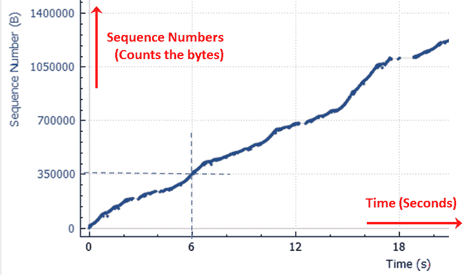

# 六、使用高级统计工具

在本章中，我们将学习以下主题:

*   使用过滤器配置 I/O 图形以测量网络性能问题
*   使用 I/O 图测量吞吐量
*   具有高级 *y* 轴参数的高级 I/O 图形配置
*   通过 TCP 流图获取信息–时间/顺序(Steven 的)窗口
*   通过 TCP 流图获取信息–时间/序列(TCP-trace)窗口
*   通过 TCP 流图获取信息–吞吐量窗口
*   通过 TCP 流图获取信息–往返时间窗口
*   通过 TCP 流图获取信息–窗口缩放窗口

# 介绍

在[第 5 章](8429d556-d7c9-470a-b9b4-4e236f88453e.xhtml)、*使用基本统计工具、*中，我们讨论了基本统计工具，即终端用户列表、对话列表、捕获摘要等。在本章中，我们将了解高级统计工具——I/O 图、TCP 流图，简而言之，还有 UDP 组播流。

我们将在这里讨论的工具使我们能够更好地了解网络。这里，我们有两个主要工具:

*   I/O 图形，使我们能够查看任何预定义过滤器的统计图形，例如，单个 IP 地址上的吞吐量、两台或多台主机之间的负载、应用吞吐量、TCP 现象分布、帧之间的时间、TCP 序列号和确认之间的时间等。
*   TCP 流图。在检查这些问题时，我们将更深入地研究单个 TCP 连接，并了解如何隔离 TCP 问题以及导致这些问题的原因。

Wireshark v2 显著改进了 I/O 图和 TCP 流图。在本章中，我们将学习如何使用这些工具；在处理协议的章节中，我们将需要它们来进行更深入的协议分析。

# 使用过滤器配置 I/O 图形以测量网络性能问题

在本菜谱中，我们将学习如何使用 I/O 图形工具，以及如何配置它来进行网络故障排除。

# 做好准备

在统计菜单下，打开 I/O 图。您可以在联机文件捕获过程中或在之前捕获的文件上执行此操作。在实时捕获中使用 I/O 图时，您将获得捕获数据的实时统计信息。

# 怎么做...

运行 I/O 图，您将得到以下窗口:

在窗口的上部，您可以看到图形区域。在左下方，您可以看到 filters 区域，该区域允许您配置将启用特定图形的显示过滤器。正如您在前面的截图中看到的，默认值是在 *y* 轴上的每秒包数和在 *x* 轴上的以秒为单位的时间。

您可以为窗口显示配置以下参数:

*   窗口左下角的+/-和复制按钮用于添加/删除和复制图表。
*   使用“鼠标用法”复选框来拖动或缩放。您可以将图形拖过窗口，并使用缩放功能来放大或缩小。使用窗口右下角的重置按钮返回到初始窗口状态。

在 *x* 轴上，可以通过以下方式配置参数:

*   选择间隔。范围可以在 1 毫秒到 10 分钟之间

例如，如果当 *x* 轴被配置为 1 秒的间隔时，我们获得每秒 1000 个包的峰值，这意味着在最后一秒，我们已经接收了 1000 个包。当我们将 *x* 轴更改为 0.1 秒间隔时，峰值会有所不同，因为现在我们可以看到在过去的 0.1 秒内捕获了多少个数据包。

*   选中“一天中的时间”复选框，以选择“一天中的时间”格式，而不是从捕获开始的时间

在 *y* 轴配置上，可以进行如下更改:

*   选中对数标度复选框，以对数标度查看图表

图形配置:

*   在图形窗口中，您可以添加/删除/复制和更改图形。只需完成以下步骤:
    1.  当您启动 I/O 图形时，默认情况下会显示所有数据包图形。
    2.  要添加带有过滤器的附加图形，请单击 I/O 图形窗口左下角的+号。将添加一个新行。
    3.  在“名称”列中为图表命名。
    4.  在显示过滤器列中配置所需的过滤器。顾名思义，该过滤器采用带有自动完成功能的显示过滤器语法。
    5.  配置(或保留默认值)颜色和样式列。
    6.  在样式栏中，您可以配置线条、脉冲、条形图、堆积条形图、点、正方形和菱形参数。例如，Line 适用于流量图，而 Dot 适用于 TCP 分析、重新传输、重复 ACK 等事件图。
    7.  如果您想要查看运行平均值，即在每个分笔成交点间隔中查看过去分笔成交点的平均值，请选取平滑。您可以选择 4 到 1024 之间的值来平滑图形。

在下面的示例中，`CAP_1674_06_02`，您会看到一个包含所有数据包、`tcp.analysis.duplicate_ack`和`tcp.analysis.fast_retransmission`过滤器的流量图:

在示例中，您可以看到 *x* 轴刻度以 10 ms(毫秒)为单位， *y* 轴刻度以数据包/10 ms 为单位。在第一个图表中，所有数据包是没有任何过滤器的总流量，以线条样式呈现；使用过滤器`tcp.analysis.` `duplicate_ack`的第二个图形使用点样式呈现，使用过滤器`tcp.analysis.` `fast_retransmission`的第三个图形使用正方形样式呈现。该图以放大的焦点呈现在从捕获开始起 52.5 到 52.86 秒之间的时间上。

流量从 52.53 到 52.54 的每 10 毫秒 6 个包( **1** )的峰值开始，接下来的两个峰值是每 10 毫秒 12 个包( **4** 和 **9** )。

对于重复确认，我们在 52.61 秒看到一个事件( **2** ，在 52.62 秒看到六个事件( **3** ，在 52.68 秒看到两个事件( **5** ，在 52.69 秒看到两个事件( **6** ，在 52.60 秒，我们看到五个重复确认( **8** 事件)和一个快速重传事件( **7** )。

正如我们从下面的截图中看到的，特定时间的事件意味着在指定时间发生的事件—例如，在时间 52.62 发生的六个事件意味着在时间 52.62 发生了六个事件:

稍后，在处理协议的章节中，我们将看到我们在这里谈到的准确性的重要性，以及何时何地使用它。

# 它是如何工作的...

I/O 图形功能是重要的 Wireshark 工具之一，使我们能够监控在线性能以及离线捕获文件分析。

当你使用这个工具时，重要的是要记住用正确的 *x* 轴和 *y* 轴参数配置正确的滤波器。

我们可以在 *y* 轴上测量两种类型的参数。第一种类型是数字参数——数据包、字节和位，相对于 *x* 轴中的时间刻度进行测量。如下面的屏幕截图所示，第二种类型的参数是 SUM、COUNT FRAMES、COUNT FIELDS、MAX、MIN、AVG 和 LOAD，它们用于 *y* 轴不一定显示数字的计数，如本章后面的“使用高级 *y* 轴参数的高级 I/O 图形配置”一节所述:

另一个需要记住的重要特性是窗口左侧的平滑栏，如下图所示。术语**平滑**意味着它不会绘制每个样本的值，但会累积最近的 10、20、50、100 和 200 个样本，构建这些读数的平均值，并绘制该平均值(10、20、50、100 等等):

正如我们将在后面看到的，这可以用于带宽/吞吐量测量。

# 还有更多...

要查看 I/O 图形窗口的快捷方式列表，请将鼠标放在图形窗口和过滤器窗口之间的空间:

在这个窗口中，你可以以任何你认为合适的方式改变这个显示——例如，你可以放大/缩小 *x* 或 *y* 刻度，移动光标，在选项之间切换，等等。

# 使用 I/O 图测量吞吐量

I/O 图形功能是一种测量网络吞吐量的便捷工具。我们可以用它来测量任何预定义过滤器的流量和吞吐量。在这个配方中，我们将看到一些如何使用它来测量网络吞吐量的例子。

# 做好准备

使用 Wireshark 将您的笔记本电脑连接到网络，将端口镜像到您想要测量的链路，正如您在第 1 章、*Wireshark v2*中所学。启动新的捕获或打开现有文件，然后从统计菜单中打开 I/O 图形。

测量吞吐量时，我们可以在终端设备(PC 到服务器、电话到电话、PC 到互联网)或特定应用之间的通信线路上进行测量:

隔离网络问题的过程始于测量链路上、终端设备之间或单个连接上的流量，以了解流量的来源。

一些典型的测量是主机到主机的流量、到特定服务器的所有流量、到特定服务器上的特定应用的所有流量、特定服务器上的所有 TCP 性能现象等等。

# 怎么做...

在本菜谱中，我们将提供一些基本的过滤器来测量整个网络的流量。

# 测量下载/上传流量

让我们来看看接下来的两幅图，其中一台 IP 地址为`10.0.0.10`的电脑正在浏览互联网，在 http://www.youtube.com 的[上看电影。图表在文件`CAP_1674_06_03`中配置。](http://www.youtube.com)

在这两个 I/O 图中，我们配置了两个过滤器:

*   第一张图显示了所有流向 IP 地址`10.0.0.10`的流量——这是`ip.dst==10.0.0.10`过滤器，以红色显示(上面一行)。这是下载(下行)流量的图表。
*   第二张图显示了来自 IP 地址`10.0.0.10`的所有流量——这是`ip.src==10.0.0.10`过滤器，用绿色表示(下面一行)。这是上传(上行)流量的图表。

在第一张图中，我们可以看到，当 *x* 轴被配置为 1 秒的时间间隔，并且 *y* 轴刻度被配置为包/秒时，我们已经测量了流量。我们得到的结果显示，当用户观看电影时，上传的内容约占总下载量的一半:

****

在第二张图中，我们可以看到以比特/秒为单位观看质量合理的电影的流量。在这个例子中，正在通过[http://www.youtube.com](http://www.youtube.com)观看电影。正如你所看到的，最初下载的流量是 10 兆比特/秒(这是当你打开电影窗口时看到的小圆箭头)，从那时起连续观看电影的流量是 6 兆比特/秒。

我们还可以看到，流量是强烈不对称的，大部分流量来自下载。在下面的截图中，你可以看到为什么:

**** 

在这里，我们可以看到从`googlevideo.com`到`10.0.0.10`的每两个下行分组有一个上行确认，这就是为什么我们看到 1:2 的比率。另一方面，当我们查看数据包长度时，我们可以看到下载流量中的两个数据包的长度为 1，506 字节，而上行确认数据包是一个短的 54 字节长的数据包。

# 测量两个终端设备之间的几个流

要测量端点设备之间的吞吐量，只需在它们的 IP 地址之间配置一个显示过滤器。

让我们看看统计|对话中的`CAP_1674_06_04`文件。在该文件中，我们可以看到三个最繁忙的连接如下:

*   从终端服务器客户端`192.168.1.192`到终端服务器`172.30.0.10`的一个连接
*   从终端服务器`172.30.0.10`到数据库服务器`172.30.0.22`的两个连接

在下面的屏幕截图中，我们可以看到对话窗口:

过滤器字段中设置的参数如下:

*   `ip.addr==172.30.0.22 && tcp.port==57604 && ip.addr==172.30.0.10 && tcp.port==445`
*   `ip.addr==172.30.0.22 && tcp.port==58479 && ip.addr==172.30.0.10 && tcp.port==445`
*   `ip.addr==192.168.1.192 && tcp.port==45214 && ip.addr==172.30.0.10 && tcp.port==3389`

正如我们在下面的截图中看到的，当我们查看 I/O 图时，我们可以看到从终端服务器`172.30.0.10`到数据库服务器`172.30.0.22`的两个峰值。棕色的客户端-服务器流量 1 出现在右侧，绿色的客户端-服务器流量 2 出现在左侧:

****

由于从终端服务器到数据库服务器的两个比特流的带宽远高于终端服务器流的带宽，因此我们在此窗口中看不到最后一个比特流(屏幕截图中添加了虚线)。为了查看它，我们禁用了两个较高的位流复选框，我们得到的结果如下:

**** 

在这里，我们可以看到终端服务器流量的最高峰值大约是每秒 400，000 位(在前面的屏幕截图中添加了一条虚线)。

# 测量应用吞吐量

为了配置特定应用的性能测量，您可以配置包含特定端口号或特定连接的过滤器。

有几种方法可以隔离应用图:

*   在捕获的数据中，单击属于通信流的任何数据包。在 TCP 中，会是特定的连接；在 UDP 中，它只是一个 IP/端口对之间的流。
*   右键单击它并选择跟随 TCP 流或跟随 UDP 流。
*   你会得到`tcp.stream eq <number>or udp.stream eq <number>`。`<number>`只是捕获文件中的流的编号。
*   将字符串复制到 I/O 图形中的过滤器窗口，您将获得特定流的图形:

# 使用 TCP 事件分析测量 TCP 流

要测量特定的流以找到干扰该流的事件，请使用如下 I/O 图:

1.  打开捕获文件(或开始新的捕获)并启动 I/O 图形。在这个例子中，我们使用了`CAP_1674_06_06`文件。
2.  在第一个过滤器中，配置流编号—在本例中，我们看到的是`tcp.stream eq 0`。这会给你这个流的流量。

3.  在第一个过滤器中，配置流编号和`tcp.analysis.retransmissions: tcp.stream eq 0`，和`tcp.analysis.retransmissions`。这将显示特定流上的所有 TCP 重新传输现象(指示慢速终端设备)。

在下面的屏幕截图中，我们在第一个线形图中看到 0 号流，在第二个点状图中看到该流的重新传输:

在[第十章](9affead7-6197-42e7-8ebc-0da367154504.xhtml)、*网络层协议和操作*中，我们将看到如何使用这些特性对 TCP 流量进行深入分析。

# 它是如何工作的...

I/O graph 工具的强大之处在于，您可以配置任何显示过滤器，并以各种形状和配置将其视为图形。数据包中的任何参数都可以通过这种方式进行过滤和监控。

# 还有更多...

您可以在任何可以通过显示过滤器字符串过滤的参数上配置 I/O 图形，这使它成为一个非常强大的工具。让我们看一些例子。

我们可以使用图表来查找特定用户发送的 SMS 消息(`CAP_1674_06_07`):

1.  要配置过滤器，使用`Submit_SM`命令选择**短消息点对点** (SMPP)协议数据包。这是发送 SMS 的 SMPP 命令。
2.  键入`smpp.source_addr == phone number`过滤器。在示例中应用了`smpp.source_addr == 0529992525`过滤器:

我们还可以使用一个图表来显示一些 HTTP 请求(`CAP_1674_06_08`):

1.  打开 I/O 图。您可以在捕获期间执行此操作以查看在线统计数据，也可以打开保存的捕获文件。
2.  在输入/输出图形窗口中配置`http.request`过滤器。
3.  您将得到下图:

该图显示了每秒包含 HTTP 请求的数据包数量。

本配方的目的是展示 I/O 图形工具的功能。稍后，在处理协议的章节中，我们将使用它们进行更深入的协议分析。

# 具有 y 轴参数的高级 I/O 图形配置

在使用 I/O 图的标准测量中，当 *y* 轴以包/秒、字节/秒或比特/秒为单位显示时，我们测量网络的性能。有些类型的数据不能用这些参数来度量，例如，我们度量查询和响应之间的秒数、以太网帧之间的秒数、延迟，以及我们将在这个配方中看到的其他类似情况。下一节将介绍这些参数。这些功能在 Wireshark 版本 1 的 *y* 轴选项中被称为高级。

# 做好准备

打开 *y* 轴下的下拉菜单，如下截图所示:

您将获得以下 *y* 轴选项:

*   SUM (Y 字段):绘制一个图表，其中包含刻度间隔内的参数摘要
*   计算帧数(Y 字段):绘制一个图形，计算时间间隔内过滤帧的出现次数
*   计数字段(Y 字段):绘制一个图表，对时间间隔内筛选字段的出现次数进行计数
*   MAX (Y 字段):用时间间隔内参数的平均值绘制图形
*   MIN (Y 字段):用时间间隔中参数的最小值绘制图形
*   AVG (Y 字段):用时间间隔内参数的平均值绘制图形
*   负载(Y 字段):用于响应时间图表

在 Y 字段中，您可以设置想要查看的参数。

# 怎么做...

要开始使用带有 *y* 轴配置选项功能的 I/O 图形，请完成以下步骤:

1.  从统计菜单启动 I/O 图
2.  在 Y 轴下拉菜单中，选择您希望出现在 *y* 轴上的参数
3.  您将看到一个带有字符串 SUM (Y 字段)的新下拉菜单
4.  选择以下字段:总和(Y 字段)/计数帧(Y 字段)/计数字段(Y 字段)/最大值(Y 字段)/最小值(Y 字段)/ AVG (Y 字段)/负载(Y 字段)
5.  在 Y 字段列中配置适当的过滤器

让我们看一些有用的例子。

# 监控帧间时间增量统计

帧之间的时间增量会影响 TCP 性能，并严重影响语音和视频等交互式应用。因此，您可以使用各种选项。其中之一是将`frame.time_delta`用于所有帧之间的时间增量，或者将`frame.time_delta`用于显示的分组之间的时间增量。

让我们看看下面的捕获文件(文件`CAP_06_09`):

正如我们在前面的屏幕截图中看到的，配置了以下参数:

*   在显示过滤器栏中，过滤器 **ip.src==212.143.195.13** 。这是用来查看从这个网站传到我们电脑的帧。
*   在 Y 轴字段中，AVG (Y 轴)用于显示平均帧间时间。
*   在 Y 字段列中，`frame.time_delta_displayed`过滤器用于显示帧间时间。

本例中的时间间隔被配置为 1 毫秒，放大视图的中心是从捕获开始起的 176 秒。

*y* 轴中的时间值以微秒表示，例如第 9391 帧和前一帧之间的帧间时间显示为 6349 微秒。

要查看最小值、平均值和最大值，我们可以使用三个图表，如下图所示。

我们可以查看`frame.time_delta`过滤器的最大值、平均值和最小值，正如我们在下一个截图中看到的。请记住以下几点:

*   对于第一个图表:
    *   在显示过滤器栏中，`ip.src==212.143.195.13`过滤器描述了从该网站传到我们电脑的帧
    *   在 Y 轴字段中，AVG (Y 轴)用于显示平均帧间时间
*   对于第二个图表:
    *   在显示过滤器栏中，`ip.src==212.143.195.13`过滤器描述了从该网站传到我们电脑的帧
    *   在 Y 轴字段中，MIN (Y 轴)用于显示平均帧间时间
*   对于第三个图表:
    *   在显示过滤器栏中，`ip.src==212.143.195.13`过滤器描述了从该网站传到我们电脑的帧
    *   在 Y 轴字段中，MAX (Y 轴)用于显示平均帧间时间

正如 Style 列中所配置的，我们可以看到最小值为正方形，最大值为菱形，平均值为直线。我们应该如何处理这些图，以及如何使用它们进行网络调试？这一点我们将在[第 10 章](9affead7-6197-42e7-8ebc-0da367154504.xhtml)、*网络层协议和操作*到[第 19 章](04fd2bda-1039-43f6-9fd7-203c0e56e8d3.xhtml)、*安全和网络取证*中学习，这些章节处理协议。

# 监控流中 TCP 事件的数量

TCP 事件可以有多种类型—重新传输、滑动窗口事件、ack 等等。要查看一段时间内 TCP 事件的数量，我们可以使用带有高级功能和计数(Y 轴)参数的 I/O 图。

在下面的示例`CAP_1674_06_10`中，我们有两个 TCP 流:

要配置 I/O 图形，请执行以下步骤:

1.  从统计菜单中打开 IO 图。
2.  配置显示筛选器列；在本例中，这些内容如下:
    *   第一图:`ip.addr==10.0.0.1 && tcp.port==57449 && ip.addr==92.122.12.174 && tcp.port==80`
    *   第二张图表:`ip.addr==10.0.0.1 && tcp.port==57627 && ip.addr==88.221.159.148 && tcp.port==80`

要配置过滤器，您可以右键单击对话窗口中的流行，准备一个将出现在显示过滤器窗口中的过滤器，并将其复制到 I/O 图形窗口。您也可以右键单击流中的一个数据包，并选择跟随 TCP 流。

3.  配置 Y 轴参数:
    1.  配置帧数(Y 场)。
    2.  在 Y 字段上，配置过滤器——在本例中，这是所有 TCP 事件的`tcp.analysis`,但它可以是任何特定的过滤器，如`tcp.analysis.retransmissions`、`tcp.analysis.zero_window`或任何其他过滤器。

在最后一张截图中，我们可以看到两个时期的事件。我们可以放大其中的一个——例如，放大第一组事件——我们将获得下一个屏幕截图。

# 监控现场出现的次数

可变计数字段(Y 字段)对捕获文件中特定字段的出现次数进行计数，或对由“显示过滤器”列中配置的过滤器过滤的信息进行计数。

其原理如下:

*   在显示过滤器列中，您可以为应该检查的流量配置过滤器
*   在 Y 轴列中，您可以配置计数字段(Y 字段)
*   在 Y 字段列中，指定要对其外观进行计数的字段

在下面的截图(文件`CAP_1674_06_11`)中，您可以看到一个如何使用它的示例:

在这里，我们可以看到我们检查了 A 记录和 AAAA 记录的出现次数:上图是 IPv4 A 记录，下图是 IPv6 AAAA 记录。

# 它是如何工作的...

I/O 图是 Wireshark 最强大、最有效的工具之一。虽然标准 I/O 图形统计可用于基本统计，但 *y* 轴配置可用于深入监控响应时间、单个流或多个流的 TCP 分析等。

当我们在左侧配置过滤器时，我们将过滤主机之间的流量、连接上的流量、服务器上的流量等等。 *y* 轴配置功能为我们提供了更多关于流量的详细信息。例如:

*   左边—TCP 流。右边—流中帧之间的时间增量
*   左侧—视频/RTP 流。右侧—出现一个标记位

# 还有更多...

您可以随时单击 I/O 图，它会将您带到数据包窗格中的参考数据包。

# 通过 TCP 流图获取信息–时间/顺序(Steven 的)窗口

Wireshark 中的一个工具是 TCP 流图，它使我们能够更深入地研究应用的行为。正如我们将在接下来的几个食谱中看到的，这些图表使我们能够获得应用行为的细节，这样做，为我们提供了定位问题的可能性。

# 做好准备

打开现有的捕获或开始新的捕获。单击捕获文件中的特定数据包。尽管您可以在正在运行的捕获上使用此功能，但它并不意味着用于在线统计，因此建议您启动一个捕获，停止它，然后使用此工具。

# 怎么做...

要查看 TCP 流图统计信息，请执行以下操作:

1.  单击您想要监控的数据流上的数据包。

TCP 流显示了一个**方向**图，所以当你点击一个数据包时，它应该在你想要查看统计数据的方向。例如，如果您下载了一个文件，并且想要查看下载统计数据，请单击下载方向上的数据包。

2.  从统计菜单中，选择 TCP 流图|时序图(Stevens)。

将会打开以下窗口:

该图显示了字节传输量随时间的变化过程。在本例中，我们可以看到一条连续的对角线，在传输中有一些平稳段。

图中的 Y 轴是序列号，而在图中我写的是数据包/秒图。实际上意思是一样的——图中的每个点指的是一个数据包，当它的值是 TCP 数据包中的第一个序列号时(参见*它是如何工作的...*本食谱后面的章节)。

在[第 10 章](9affead7-6197-42e7-8ebc-0da367154504.xhtml)、*网络层协议和操作*中，我们将了解该图表示什么，以及它有助于解决的一些案例。

3.  对于文件传输，要测量其吞吐量，只需计算单位时间内传输的字节数，如下图所示:

4.  我们可以看到，6 秒钟的传输速率为 350，000 字节，也就是大约 58，000 字节/秒，即 58 千位/秒。

5.  默认情况下,“流图”菜单左下角的“拖动”复选框处于选中状态。在这种情况下，您可以上下拖动图形或者左右拉伸 *x* 轴- *y* 轴。例如，我们可以使用该功能将图表移动到更靠近 *y* 轴的位置，以查看特定的值。

当鼠标复选框设置为拖动时，您可以使用 *Ctrl* +鼠标滚轮来放大和缩小 TCP 流图。

6.  当我们选中鼠标复选框右侧的缩放复选框时，我们会将设置更改为缩放。在下一个屏幕截图中，我们可以看到如何将图表放大两次，以获得特定时间段的更多详细信息，在本例中，我们看到的时间点大约在捕获开始后的 16 到 19 秒之间:

7.  其他图形配置按钮如下:
    *   图表类型(左下角，拖动/缩放复选框的正上方)。您可以在各种类型的 TCP 图之间进行选择(如下图所示):时间/序列(Stevens)、往返时间、吞吐量、时间/序列(tcptrace)、窗口缩放。

****

# 它是如何工作的...

时序图(Stevens)是一个简单的图表，它计算一段时间内的 TCP 序列号。由于 TCP 序列号计算 TCP 发送的字节数，所以这些实际上是从一端发送到另一端的应用字节(包括应用头)。

在图中，我们实际上看到了每个数据包的一个点，当该点位于 *y* 轴上时，在数据包的第一个字节的序列值上，如下图所示:

 **** 

这个图表(我们将在 TCP 和应用的章节中学习)可以很好地显示应用的行为。例如，斜线表示文件传输良好，而有中断的斜线表示传输有问题。具有高梯度的对角线表示快速数据传输，而低梯度表示低传输速率(当然取决于规模)。

# 还有更多...

当鼠标被设置到窗口左下角的 drags 选项时，点击一个点会将您带到 capture 窗口中的匹配数据包。正如您在下面的屏幕截图中所看到的，在开始捕获后大约 15.24 秒，在数据包 8119 中传输了一个略高于 872，000 的序列号，然后在开始捕获后 15.35 秒，在数据包 8191 中再次传输:

在下面的截图中，我们可以看到在时序图中点击这两个点的结果。第一个数据包(数据包 8119)在捕获开始后的 15.248 秒时具有序列号 872674:

****

在下面的屏幕截图中，您可以看到第二个数据包，在开始捕获后的 15.25 秒，具有相同的序列号。当一个序列号自我重复时，这被称为 TCP 重传，将在[第 10 章](9affead7-6197-42e7-8ebc-0da367154504.xhtml)、*网络层协议和操作中涉及。*

 **** 

查看图表时，重要的是了解应用是什么。指示一个应用中的问题的图可以是另一个应用的完美网络行为。

# 通过 TCP 流图-时间/序列(TCP-trace)窗口获取信息

基于 UNIX 的`tcpdump`命令的 TCP 时间/序列图为我们提供了更多关于我们监控的连接的数据。除了时间序列(Stevens)中的标准序列/秒之外，通过 TCP 时间/序列图，我们还可以获得有关发送的 ack、重新传输、窗口大小和更多细节的信息，这些信息使我们能够分析连接问题。

# 做好准备

打开现有的捕获，或开始新的捕获。单击捕获文件中的特定数据包。尽管您可以在正在运行的捕获上使用此功能，但它并不意味着用于在线统计，因此建议您启动一个捕获，停止它，然后使用此工具。在这个菜谱中，我们使用示例文件`CAP_1674_06_05`和`CAP_1674_06_14`。

# 怎么做...

要查看 TCP 流图统计信息，请执行以下步骤:

1.  单击您想要监控的数据流上的数据包。在本例中，我点击了捕获文件`CAP_1674_06_05`上的数据包 100。这就把我们带到了 0 号 TCP 流。

TCP 流显示一个方向图，所以当您单击一个数据包时，它应该在您想要查看统计数据的方向。例如，如果您下载了一个文件，并且想要查看下载统计数据，请单击下载方向上的一个数据包。

2.  从“统计”菜单中，选择 TCP 流图时间序列(tcptrace)。

3.  将会打开以下窗口。采集文件名称作为副标题列在图表顶部:

4.  放大图表，我们会看到以下内容:

5.  该图显示了字节传输随时间的进展。我们看到的是以下内容:
    *   垂直的蓝色短线表示通过连接发送的数据包。
    *   下方的棕色图表显示了为收到的数据包发送的确认。
    *   上面的绿线显示了窗口大小。两条线之间的空间——即上面的绿色线和下面的棕色线——表示剩余的 TCP 缓冲区的大小，这使得 TCP 能够继续发送字节。当两条线越来越近并相互接触时，这是一种满窗现象，无法实现更大的数据传输。

6.  当我们进一步放大图表时，我们会看到下面的屏幕截图:

在这里，我们可以看到:

*   自捕获开始 75 秒后，发送了几个数据包
*   这些数据包在 75.08 到 75.09 之间得到确认，这大约是它们发送后的 80-90 毫秒
*   我们还看到，空闲接收器窗口大约为 7000 字节，这是在 *y* 轴上的 271000-264000 个序列

要在数据包捕获窗格中查看这些信息，请单击鼠标|拖动，然后用鼠标单击其中一个点，相关的数据包将在数据包窗格中标记出来:

正如您在数据包窗格中看到的，我们有六个数据包从`10.0.0.10`发送到`172.217.22.80`。这些都是同一个 TCP 数据包的数据段，因此它们在很短的时间内被发送，从捕获开始不到 75 秒。紧接着，我们可以看到六个致谢。我们还可以在确认数据包中看到，接收方显示的窗口大小约为 7，000 字节，这是图中上方绿线和下方棕色线之间的距离。

# 它是如何工作的...

时序(`tcptrace`)取自 UNIX 的`tcpdump`命令，它也指接收方发布的窗口大小(这是接收方分配给进程的缓冲区大小)，以及重新传输的数据包和 ack。

使用此图为我们提供了大量信息，我们将在以后的网络调试中使用这些信息。该图将使窗口比预期更快变满、过多的重新传输等现象变得明显，这将帮助我们解决这些问题。

# 还有更多...

在某些情况下，尤其是在高速数据传输中，图表可能看起来像一条完美的直线，但当你放大时，你会发现问题。

在下面的截图中，我们可以看到捕获文件`CAP_1674_06_14`:

放大显示我们有时间间隙，重新传输和其他问题:

****

您还可以看到，在一秒钟内，大约传输了 14，000 个序列(字节)——与连接的其余部分相比，这是相当慢的。

bar 是对数据包的指示(它携带初始和最终序列号之间的数据)。不在常规图形中并且看起来好像已经逃离的条是重传，灰色条是重复的 ACK。我们将在下一章的 TCP 分析中了解这些现象。

# 通过 TCP 流图获取信息–吞吐量窗口

TCP 流图的吞吐量窗口使我们能够查看连接的吞吐量。根据该图，我们还可以根据应用检查不稳定性。

# 做好准备

打开现有的捕获，或开始新的捕获。单击捕获文件中的特定数据包。尽管您可以在正在运行的捕获上使用此功能，但它并不意味着用于在线统计，因此建议您启动一个捕获，停止它，然后使用此工具。

# 怎么做...

要查看 TCP 流图统计信息，请执行以下步骤:

1.  单击您想要监控的数据流上的数据包。
2.  从统计菜单中，选择 TCP 流图|吞吐量图。

3.  将会打开以下窗口:

在这里，我们可以看到示例`CAP_1674_06_14`，流 0。在图表中，我们可以看到以下内容:

*   TCP 连接吞吐量。我们在这里看到它大约是 700-800 千比特/秒。
*   TCP 数据段长度。这是 TCP 大小。

数据网络中数据单元的正式定义因其所属的 OSI 层而异——帧到第 2 层，例如以太网帧；包到第 3 层，例如 IP 包；段到第 4 层 TCP 数据报到第 4 层 UDP。协议数据单元(PDU)是所有此类单元的统称。在大多数情况下，这些术语是在适当的位置使用的，我在本书中已经尝试这样做了，但是在许多其他情况下，它们之间存在混淆。无论如何，重要的是理解我们正在谈论的是哪一层，不管正式的定义是什么。

这个图似乎没有 TRP 时间/序列图那么有用，但是它仍然可以向我们显示吞吐量的任何突然下降，这可以表明一个问题。

# 它是如何工作的...

吞吐量图简单地统计了一段时间内的 TCP 序列号，由于序列号实际上是应用数据，因此它给出了以每秒字节数为单位的应用吞吐量。

# 还有更多...

稳定的文件传输应该类似于中心值，如下图左侧所示。不稳定的文件传输可能看起来像右图，其中吞吐量图上下跳动:

**** 

您还可以在 I/O 图中看到吞吐量。需要注意的主要一点是，I/O 图显示了跟踪文件中所有流量在两个方向上的吞吐量，而 TCP 流吞吐量图只显示了一个 TCP 流在一个方向上的吞吐量(基于所选的数据包)。如果您过滤 I/O 图，使其与吞吐量图查看相同的流量，您将看到相同的字节/秒值。

# 通过 TCP 流图获取信息–往返时间窗口

TCP 流图的往返时间窗口使我们能够查看序列号和它们被确认的时间之间的往返时间。与其他图表一起，它让我们看到了连接的性能。

# 做好准备

打开现有的捕获，或开始新的捕获。单击捕获文件中的特定数据包。尽管您可以在正在运行的捕获上使用此功能，但它并不意味着用于在线统计，因此建议您启动一个捕获，停止它，然后使用此工具。

在下面的例子中，我们将`CAP_1674_06_13`文件用于 TCP 流编号 8，它是从数据包 85 开始的 TCP 连接。

# 怎么做...

要查看 TCP 流图统计信息，请执行以下步骤:

1.  单击您想要监控的数据流上的数据包。
2.  从统计菜单中，选择 TCP 流图|往返时间图。

3.  将会打开以下窗口:

4.  在图中，我们可以看到大多数序列号在短时间内被确认，但有一些不稳定性，这将影响 TCP 性能。
5.  如果您想在 I/O 图形中看到这个图形，请使用`tcp.analysis.ack_rtt`过滤器。
6.  要查看序列，以便您可以看到确认较小时间单位的图形进度，请使用鼠标缩放功能。

# 它是如何工作的...

我们在图中看到的是 TCP 序列号和确认它们所用的时间。这是发送数据包和收到该数据包的 ACK 之间的时间。

# 还有更多...

您可以在 TCP 数据包下方的“数据包详细信息”窗格中看到`tcp.analysis, ack_rtt`过滤器的值，如下图所示:

当你看到显示不稳定性的图表时，这不一定是个问题。这很可能就是应用的工作方式。可能需要时间来确认数据包，因为存在问题，或者因为服务器正在等待响应，或者因为客户端只是浏览 web 服务器，而用户正在单击几个新链接。

在 Wireshark v2 中，您可以在窗口左下角的下拉菜单中选择图形类型。

# 通过 TCP 流图获取信息–窗口缩放窗口

TCP 流图的窗口缩放图使我们能够查看接收方公布的窗口大小，这是接收方处理数据能力的指示。与其他图表一起，它让我们看到了连接的性能。

# 做好准备

打开现有的捕获，或开始新的捕获。单击捕获文件中的特定数据包。尽管您可以在正在运行的捕获上使用此功能，但它并不意味着用于在线统计，因此建议您启动一个捕获，停止它，然后使用此工具。

# 怎么做...

要查看 TCP 流图统计信息，请执行以下步骤:

1.  单击您想要监控的数据流上的数据包。
2.  从统计菜单中，选择 TCP 流图|窗口缩放图。
3.  将会打开以下窗口:

在这个图中，我们可以看到不稳定性，是由一边引起的。这可能表示服务器或客户端速度较慢，无法处理收到的所有数据，因此，通过减小接收的窗口大小，它会告诉另一端发送较少的数据。

# 它是如何工作的...

这里的软件简单地观察连接上的窗口大小并画出它。在[第 10 章](9affead7-6197-42e7-8ebc-0da367154504.xhtml)、*网络层协议和操作*中，我们将更详细地探讨这一点。

# 还有更多...

当窗口大小减小时，应用吞吐量也应该减小。窗口大小完全由连接的两端控制，例如客户端和服务器，窗口大小的变化与网络性能没有任何关系。