# 七、使用专家系统

在这一章中，我们将学习专家系统，这是一个为我们提供更深入的网络现象分析的工具，包括事件和问题。我们将讨论:

*   专家系统窗口以及如何使用它进行网络故障排除
*   错误事件以及我们可以从中了解到什么
*   警告事件以及我们能从中了解到什么
*   记录事件以及我们能从中了解到什么

# 介绍

Wireshark 最强大的功能之一是能够分析网络现象并提出可能的原因。与其他工具一起，它为我们提供了关于网络性能和问题的详细信息。在本章中，我们将学习如何使用这个工具。在本书的后面，我们将提供使用专家系统和其他工具来查找和解决网络问题的详细方法。

当我们第一次检查网络、通信链路、主机服务器等时，可以使用专家信息选项，我们希望得到网络的第一次填充。在我们进行更深入的分析之前，我们将能够看到是否有可以表明问题的事件。我们应该寻找可以抓住的事件:像 TCP 重传、以太网校验和错误、DNS 问题、重复 IP 等等。

在第一个食谱中，我们将学习如何使用专家信息窗口。在下一个菜谱中，我们将了解您可能会想到的大多数事件的可能原因。

# 专家系统窗口以及如何使用它进行网络故障排除

专家窗口提供了 Wireshark 发现的事件和网络问题列表。在本食谱中，我们将学习如何启动专家系统，以及如何参考各种事件。

# 做好准备

启动 Wireshark，开始实时捕获或打开现有文件。

# 怎么做...

要启动专家窗口，请单击分析菜单；选择专家信息:

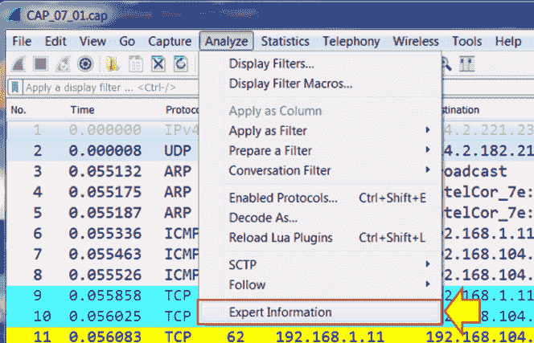

将会打开以下窗口:

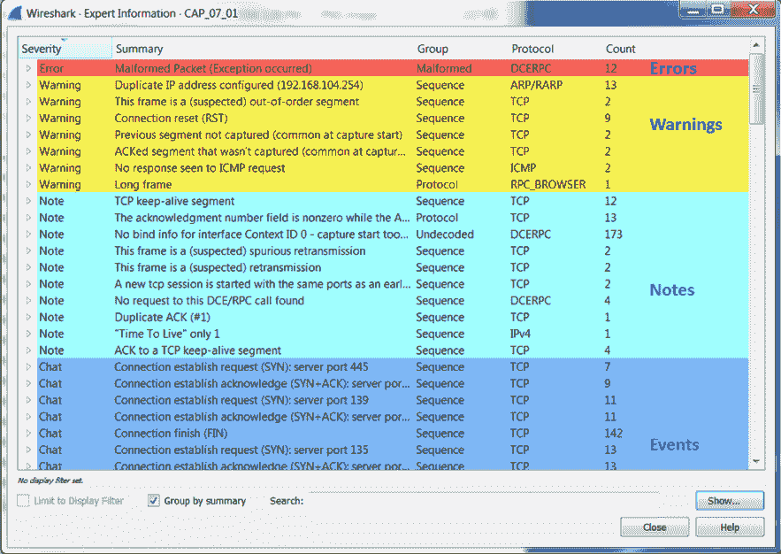

所有有效的事件都按这个顺序显示(如果有的话):**错误**、**警告**、**注释**等等...

条形右侧的数字显示了该类别中事件的数量。

上方的条形图提供了以下信息:

*   **错误**:严重的问题可能是以太网校验和错误、格式错误的数据包或协议报头中缺少字段。这些可能是各种类型的格式错误的数据包，如格式错误的 SPOOLSS、GTP 等。它们也可能是错误的校验和错误，例如 IPv4 错误的校验和。在下面的屏幕截图中，您可以看到以太网校验和错误:

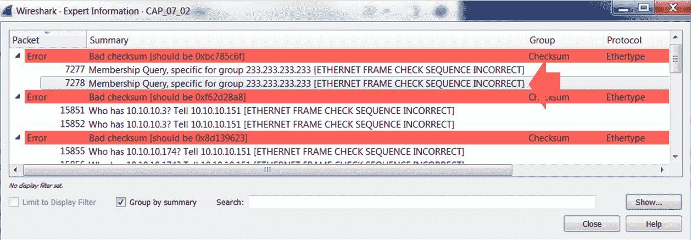

单击错误组左侧的小箭头，打开该类别下的错误列表。要在数据包窗格中查看特定数据包，请单击数据包行。

*   **警告**:警告表示应用或通信中的问题:如 TCP 零窗口、TCP 窗口满、前一个数据段未被捕获、无序数据段以及任何不符合协议行为的问题。你可以在下面的截图中看到这样的例子:

**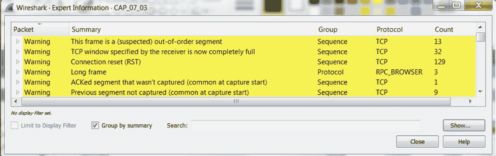**

*   **注意事项**:当 Wireshark 指出某个事件可能会导致问题，但仍在协议的正常行为范围内时，就会出现注意事项。例如，TCP 重新传输将显示在这里，因为即使它是一个使网络变慢的关键问题，它仍然在 TCP 的正常行为下。这里的其他事件有重复 ACK、快速重传等等。在下面的截图中，您可以看到重新传输和重复确认；它们可能表示通信缓慢，但仍然是 TCP 协议的正常行为:

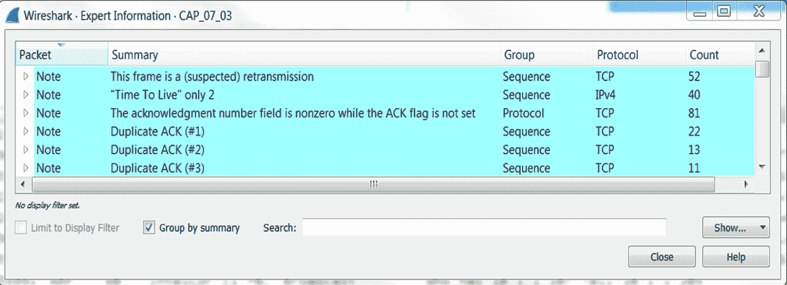

*   **聊天**:提供通常工作流程的信息，例如 TCP 连接建立请求(SYN)、TCP 连接建立确认(SYN + ACK)、连接重置(RST)、HTTP GET 和 HTTP POST:

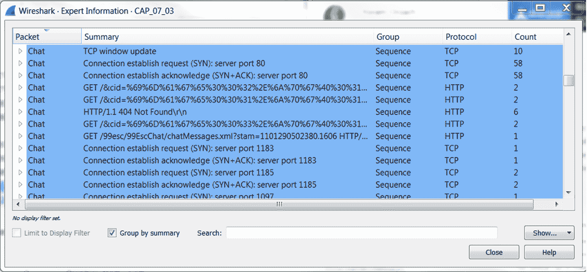

*   **数据包注释**:您可以手动为每个数据包添加注释。这将出现在专家信息窗口的聊天中。

要给数据包添加注释，右键单击它并选择数据包注释....将打开一个窗口，您可以在其中添加或更改您的评论。你可以在下一张截图中看到这一点。

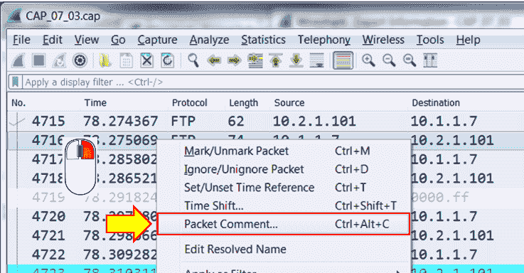

一般操作注意事项:

*   在“专家信息”窗口的底部，您可以选择限制显示过滤器和按摘要分组(默认情况下标记)，您还可以搜索事件中的特定单词。
*   要转到 packet capture 窗格中的事件，只需在 expert 窗口中单击事件下的数据包，它就会引导您找到该事件。

值得注意的是，警告事件可能不重要，而记录事件可能会严重影响网络。总是深入问题的细节，看看它是从哪里来的，它的意义是什么。

*   表格右侧的三列表示事件的分组。在下面的截图中，可以看到第一行属于协议 TCP 中的组序列( **1** )。下一行属于组协议。协议是 RPC 浏览器( **2** )。最后标记的事件属于一个序列组；协议是 IPv4 ( **3** )。该组保存来自同一类别的事件，例如，涉及序列参数的序列事件，并且它指示事件发生在哪个协议上。

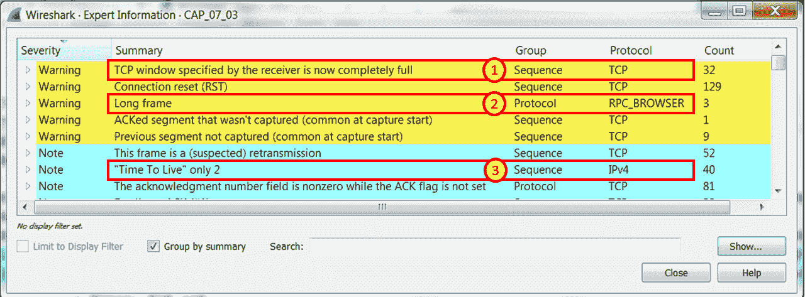

# 它是如何工作的...

专家信息窗口是一个专家系统，它为我们提供有关网络问题的信息，在某些情况下还提供可能的原因建议。虽然它给出了合理的结果，但总是要验证它的发现。

在有些情况下，Wireshark 发现的问题并不是真实的问题，反之亦然，在有些情况下，Wireshark 不会显示存在的真实问题。

不要忘记，最好的故障排除工具是你的大脑(和你的网络知识！).Wireshark 是一个非常智能的工具，但它仍然只是一个工具。

可能是您在数据传输期间开始了捕获，因此您会看到以前的数据段丢失消息或更复杂的问题。)，您只捕获了部分数据。Wireshark 称它为完整的数据流，并向您显示许多错误。我们将在本书的后面看到这些问题的许多例子。

# 还有更多...

专家严重性也可以通过显示过滤器过滤并显示在数据包窗格中。要根据显示过滤器查看事件:

1.  选择显示过滤器窗口右侧的表达式。
2.  向下滚动以获得专家消息(您只需输入工作专家即可到达)。
3.  如下图所示，您将获得以下过滤器— `expert.message`、`expert.group`和`expert.severity`:

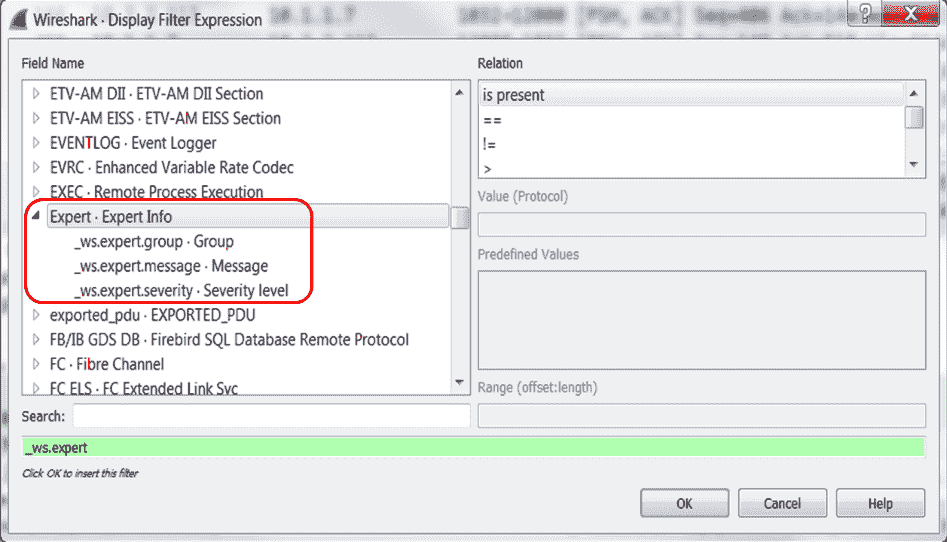

前面的过滤器解释如下:

*   `expert.group`指的是专家消息组，例如校验和错误组、序列组、格式错误组等。
*   `expert.message`是指特定的消息。例如，在这里，您可以配置一个过滤器来显示包含或匹配特定字符串的消息。
*   `expert.severity`是指具有特定严重性的消息，即错误、警告、注意等。

您也可以右键单击特定事件，如下图所示，您将看到以下菜单:

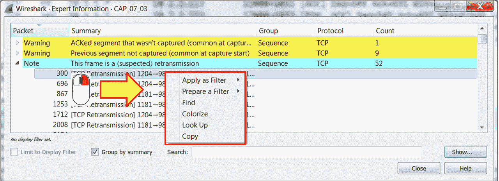

在这里，您可以:

*   选择引用此事件的显示过滤器并应用它
*   选择一个引用此事件的显示过滤器，并只准备它
*   在数据包窗格中找到特定的数据包
*   为事件配置着色规则
*   在互联网上查找事件信息
*   复制事件文本

# 请参见

*   [第八章](d1205fdc-1b98-40d5-abcb-0d1ffea148a0.xhtml)、*以太网和局域网交换*和协议章节

# 错误事件以及我们可以从中了解到什么

在这个菜谱中，我们将深入研究错误和事件类型、校验和错误、格式错误的数据包以及其他类型的错误。

# 做好准备

开始捕获，或打开现有文件并启动专家系统。

# 怎么做...

1.  从分析菜单中，打开专家信息。窗口顶部列出了错误:

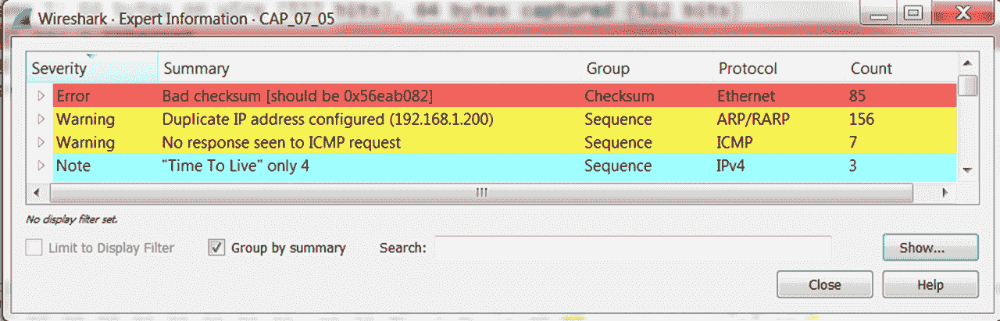

在前面作为示例提供的窗口中，您可以看到校验和错误；在这种情况下，可能是因为真正的错误或卸载。

2.  单击特定错误会将我们带到数据包窗格，以查看数据包本身的错误。这在下面的截图中有所呈现:

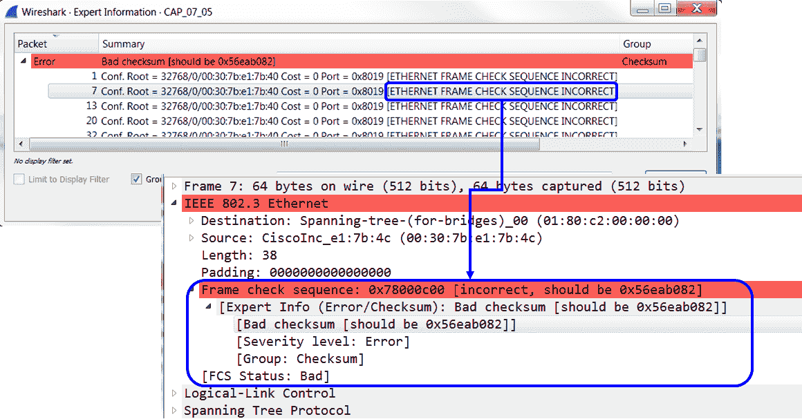

您在此事件中看到的是校验和错误，并且校验和不正确。在这种情况下(文件`CAP_07_05`)，我们看到所有错误都来自单个器件，这是一个很好的起点，可以开始查看问题来自哪里。关于以太网和以太网错误的更多信息，请参见第 8 章、*以太网和局域网交换*。

# 它是如何工作的...

校验和是一种错误检查机制，它使用数据包中插入的一个字节或一系列字节来实现帧验证算法。错误检查算法的原理是计算整个消息(第 4 层)、数据包(第 3 层)或帧(第 2 层)的公式。他们将结果插入包内的字节中，当包到达目的地时，他们再次计算它。如果我们得到相同的结果，这是一个好的数据包，如果不是，有一个错误。可以在整个分组上或者仅仅在报头上计算误差校验机制；这取决于协议。

卸载机制是在将 IP、TCP 和 UDP 校验和传输到网络之前，在 NIC 上对其进行计算的机制。在 Wireshark 中，这些会显示为错误数据包，因为 Wireshark 会在数据包发送到网络适配器之前将其捕获；因此，它将看不到正确的校验和，因为它还没有被计算。

因此，尽管看起来像是严重的错误，但在许多情况下，校验和错误是 Wireshark 的错误配置。如果您在从您的 PC 发送的数据包上看到许多校验和错误，这可能是因为卸载。

要取消校验和验证:

*   对于 IPv4，当您看到许多校验和错误，并且您确定它们是由于卸载造成的，请转到编辑|首选项，然后在协议| IPv4 下，取消选中单选按钮:如果可能，验证 IPv4 校验和
*   对于 TCP，当您看到许多校验和错误，并且您确定它们是由于卸载造成的，请转到编辑|首选项，然后在协议| TCP 下，取消选中单选按钮:如果可能，验证 TCP 校验和

# 还有更多...

对于格式错误的数据包，这可能是 Wireshark 错误或真正的格式错误数据包。使用其他工具来隔离问题。可以在 Wireshark 网站上报告可疑的错误。

当您看到许多校验和错误的格式错误的数据包时，可能是因为卸载或解析器错误。任何种类的超过 1%-2%的错误的网络将导致许多其他事件(例如，重新传输)，并且将变得比预期慢得多；因此，一个正常运行的网络不可能有高错误率！

# 请参见

*   [第八章](d1205fdc-1b98-40d5-abcb-0d1ffea148a0.xhtml)、*以太网和局域网交换*和协议章节

# 警告事件以及我们能从中了解到什么

如前所述，警告事件表明应用或通信中存在问题。在本食谱中，我们将描述这一类别中的主要事件。

# 做好准备

开始捕获，或打开现有文件并启动专家系统。

# 怎么做...

1.  从分析菜单中，打开专家信息。

2.  警告事件将从顶部第二个显示。如果没有错误事件，那么警告将排在第一位。你可以在下一张截图中看到一个例子(文件`CAP_07_04`):

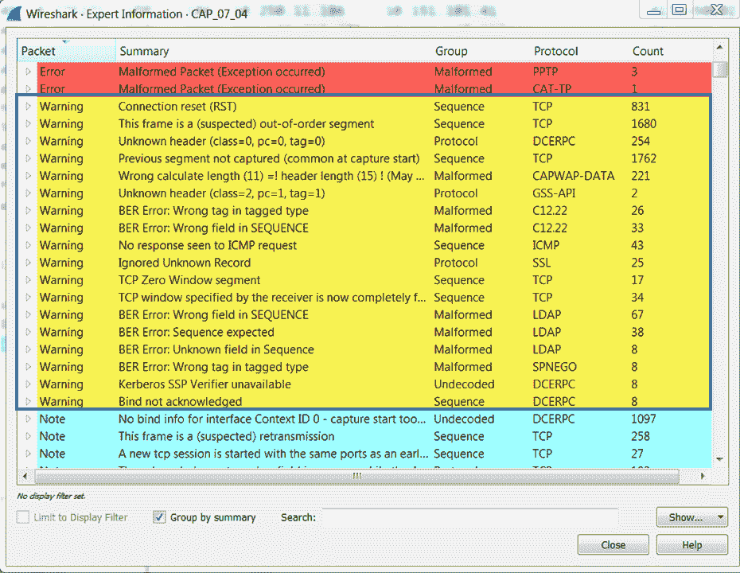

您将在这里看到几个事件类别:

3.  有关特定事件的详细信息，请右键单击该事件，然后选择查找。这将把你带到互联网上的相关页面。

# 它是如何工作的...

Wireshark 监视被监控数据包的参数:

*   它监视 TCP 窗口大小，并检查窗口大小是否减小到零
*   它会查找乱序的 TCP 数据包(数据段),即它们是在预期时间之前还是之后发送的
*   它查找未发送的 TCP 数据包的 ack

这些参数以及许多其他参数为您提供了查找网络问题的良好起点。我们将在[第十一章](f46fb26a-2c13-48c9-9302-aafb4e0e0e4b.xhtml)、*传输层协议分析*中了解它的细节。

# 还有更多...

不要忘记，警告事件是 Wireshark 指的非关键事件，但不是协议的正常行为。在这里，你有这样的事件:

*   **TCP 重置**:它们是 TCP 协议的一部分，但是连接应该以 TCP FIN 而不是 TCP 重置结束。因此，在这种情况下，这可能是由于一个问题，或者只是因为 TCP 开发人员选择了以这种方式关闭连接。
*   **TCP 零窗口**:对连接上的慢端设备的指示；这里我们看到了协议的另一种行为，这可能是由于连接的一端出现了问题，但这仍然是 TCP 的工作方式。

像未知标题、BER 错误:标记类型中的错误标记等消息。这些消息表明数据包结构中存在问题。就像各种错误和事件一样，重要的是理解它，而不是类别或颜色。

# 请参见

*   [第八章](d1205fdc-1b98-40d5-abcb-0d1ffea148a0.xhtml)、*以太网和局域网交换*和协议章节

# 记录事件以及我们能从中了解到什么

如前所述，当 Wireshark 指出某个事件可能会导致问题，但仍在协议的正常行为范围内时，该事件将属于注释类别。例如，TCP 重新传输将显示在注释栏下，因为即使它是一个使网络变慢的关键问题，但它仍在 TCP 的正常行为下。

# 做好准备

开始捕获，或打开现有文件并启动专家系统。

# 怎么做...

1.  从分析菜单中，打开专家信息。
2.  “注释”事件在“专家信息”窗口中从顶部数第三个出现:

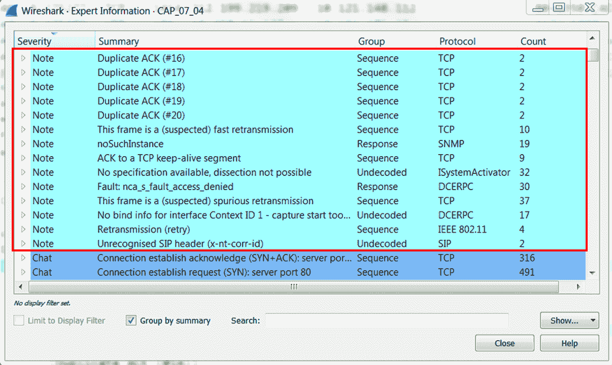

您将在这里看到几个事件类别:

其他事件将在相关的 TCP 和应用章节中讨论。

# 发现广播和错误风暴

通信网络中最常见和最麻烦的问题之一是广播/多播和错误风暴。发生这些问题的原因可能是第 2 层环路、基于第 2 层的攻击、有问题的网络适配器或向网络发送数据包的应用或服务。在这一章中，我们将提供一些基本的方法来发现、隔离和解决这些类型的问题。

广播/组播风暴是指你每秒钟收到几千甚至几万个这样的数据包。在大多数情况下，它会耗尽带宽并完全锁定网络。

# 它是如何工作的...

Wireshark 监视被监控数据包的参数:

*   它监视 TCP 序列号和确认号。它检查重新传输以及其他排序问题。
*   它寻找来自远程网络的值为 1 的 IP 生存时间，并告诉你这是一个问题。
*   它寻找保活；这可能是正常情况，但也可能表示有问题。

这些参数以及许多其他参数为您提供了一个寻找网络性能问题的良好起点。

# 还有更多...

这里看到的许多症状可能是几种问题的征兆。例如，由于错误导致数据包丢失，或者由于恶劣的网络条件(低带宽或高延迟)导致数据包不能按时到达，数据包可能会被重新传输。也可能是因为服务器或客户端没有响应。专家信息系统会给你症状。怎么解决问题？我们将在本书的后面学习。

# 请参见

*   [第八章](d1205fdc-1b98-40d5-abcb-0d1ffea148a0.xhtml)、*以太网和局域网交换*和协议章节