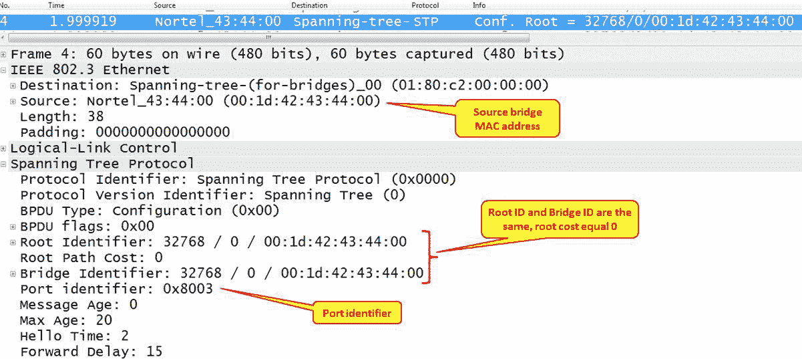

# 八、以太网和局域网交换

在本章中，我们将讨论以下主题:

*   发现广播和错误风暴
*   分析生成树协议
*   分析 VLAN 和 VLAN 标记问题

# 介绍

在本章中，我们将重点讨论如何发现和解决基于第 2 层的问题，重点是基于以太网的问题，如广播/组播事件、错误以及如何找到问题的根源。我们还将关注 LAN 协议，如生成树和 VLAN。

这些问题需要在我们进入第 3 层、第 4 层和应用层之前解决，因为第 2 层的问题会反映在上层协议中。例如，第 2 层中的数据包丢失将导致 TCP(第 4 层协议)中的重新传输，并导致应用变慢。

# 做好准备

当出现这些问题时，您通常用来解决问题的网络会非常慢，或者已经停止工作。？

需要记住的一些重要事实:

*   路由器不会转发广播。
*   广播不在 VLAN 之间转发(这就是 VLAN 被称为广播域的原因)，所以每个 VLAN 本身就是一个广播域。
*   LAN 交换机不会转发错误数据包，例如 CRC 错误的数据包、小于最小 64 字节的数据包等等。
*   除非另行配置，否则组播通过交换机转发。
*   仅当路由器被配置为这样做时，组播才通过路由器转发。
*   每个网络都传输合理数量的广播。这就是网络的工作方式，但是高比率的广播/组播可能是一个问题。
*   广播/组播被转发到交换机或路由器的控制平面/CPU，如果它被配置为这样做或启用了第 3 层功能。这可能导致操纵面不稳定(例如，OSPF 邻接襟翼)。

广播太多和广播风暴是有区别的。太多的广播(例如，每秒几百次)会使网络负载过重，但在大多数情况下，用户不会注意到。广播风暴会完全封锁网络。确定网络中广播数据包百分比的基线非常重要，以便在故障排除过程中用作数据点。

# 怎么做...

要找出问题的来源，请执行以下步骤:

1.  由于网速慢是用户感觉到的一个问题，所以先问以下问题:
    *   这个问题是在总部还是在某个分支机构？
    *   这是通过网络还是在特定的 VLAN？
    *   这是在大楼上方还是在特定楼层？

当然，不要问用户关于 VLANs 的问题；用户不是网络专家。询问他们在他们的小组、部门等中运行的应用，以了解问题的范围。

在一个组织网络中，VLAN 通常将按部门(或几个部门)和按地理区域(或几个区域)甚至按组织功能来配置；例如，人力资源 VLAN、财务 VLAN、特定软件的用户 VLAN 等等。通过询问问题是否与这些角色之一有关，你将能够缩小到你需要寻找问题的区域。

2.  下一个问题应该是一个微不足道的问题:网络还在工作吗？在广播/组播风暴中，网络会变得非常慢；在大多数情况下，应用将停止运行。在这种情况下，您会遇到以下典型问题:
    *   生成树问题
    *   产生广播的装置
    *   路由环路(在[第 10 章](9affead7-6197-42e7-8ebc-0da367154504.xhtml)、*网络层协议和操作*中讨论)

我经常被问到的问题是:多少次广播才算多？

这个问题当然有几种答案。这取决于网络设备在做什么，以及在这些设备上运行的协议。

合理的广播次数应该是每分钟每台设备 1-2 次到 4-5 次。例如，如果您的网络是由一台 VLAN 上的 100 台设备构建而成，则每秒钟的广播次数不应超过 5-10 次(5 次广播 x 100 台设备每分钟可广播 500 次，即每秒大约 9-10 次)。只要它们不是成千上万、来源不明，超过这个数字也是合理的。

# 生成树问题

在生成树问题中，你会得到每秒数千甚至数万次广播(参考*它是如何工作的...*本食谱中的一节知道为什么)。在这种情况下，您的 Wireshark，可能还有您的笔记本电脑，将会冻结。关闭 Wireshark，开始断开冗余电缆以隔离问题(几乎使网络层 2 环路空闲)，并检查交换机中的 STP 配置。

# 产生广播的装置

特定设备产生的典型广播风暴具有以下特征:

*   每秒大量的广播(数千甚至更多)
*   在大多数情况下，广播将来自单一来源；但是在攻击的情况下，它们可能来自多个来源
*   通常以恒定的包/秒速率，即帧之间的间隔几乎相等

让我们看看如何根据前面列表中提到的参数在接下来的三个截图中找到广播风暴。

在下面的屏幕截图中，我们看到大量广播数据包从源 MAC(惠普网络适配器)发送到`ff:ff:ff:ff:ff:ff`:

图 8.1:广播泛滥

如前面的屏幕截图所示，time 列以秒为单位进行配置(这意味着两个连续数据包的时间戳之间的差值将以秒为单位进行报告)。您可以通过导航至视图|时间显示格式进行配置。

可以通过导航到统计| IO 图来查看数据包的速率。下面的屏幕截图显示广播数据包的速率为每秒 5，000 个数据包:

图 8.2:广播泛洪:I/O 图

通过导航到统计|对话选项，我们可以从以太网、IPv4、TCP/UDP 的角度查看设备之间的对话。在以下屏幕截图的上半部分，我们可以看到两个 MAC 地址之间的大量广播，而屏幕截图的下半部分报告了相同的转换，但从 IPv4 地址的角度来看。总之，在 18 秒的持续时间内捕获了 87，142 个广播数据包。

图 8.3:广播泛滥:对话

在前一个案例中，问题是由一个叫做 SMB 邮件槽协议的服务引起的。简单的试错法找出这项服务是什么，并在电台上禁用它，解决了广播风暴问题。

注意这一点很重要:当您禁用一个服务(尤其是属于操作系统的服务)时，请确保系统继续运行并保持稳定。在核实之前不要离开现场！

此外，我建议您再次运行 Wireshark，以确认没有看到广播泛滥。

# 固定模式广播

您还可以按固定模式进行广播，例如，每隔固定时间进行一次广播，如下图所示:

图 8.4:固定模式广播

该图针对 1 分钟的刻度间隔(在 X 轴下)和以下过滤器进行了配置:

*   网络中所有广播的红色过滤器(`eth.addr ==ff:ff:ff:ff:ff:ff`)
*   ARP 请求广播的绿色过滤器(`arp.opcode ==1`)

我们在这里看到的是，大约每 5 分钟就有一次 ARP 请求的爆发(绿点)。如果我们单击图中的一个点，它会将我们带到捕获窗格中的数据包。

在下面的屏幕截图中，我们看到了每 5 分钟发生一次的扫描模式:

图 8.5: ARP 扫描

我们可以看到，扫描内部网络的是 d-link 路由器(基于源 MAC 地址)。这可能是好的也可能是坏的，但是检查我们的网络中正在运行什么是好的。

# 它是如何工作的...

IPv4 网络中的广播非常常见，这些第 3 层广播将通过第 2 层广播发送。每当第 3 层设备向网络发送广播(目的地是子网的广播地址；参见[第 10 章](9affead7-6197-42e7-8ebc-0da367154504.xhtml)、*网络层协议和操作*，了解更多信息)，它将被转换为所有 fs 目的 MAC 地址。

您将在基于 IP 的网络中看到几类广播。其中一些如下:

*   基于 TCP/IP 的网络协议，如 ARP 请求、DHCP 请求等
*   网络协议，如 **NetBIOS 名称服务** ( **NBNS** )查询、 **NetBIOS 服务器消息块** ( **SMB** )公告、**网络时间协议** ( **NTP** )等
*   发送广播的应用，如 Dropbox、Microsoft 网络负载平衡等

在 IPv6 中，我们没有广播，但是我们有单播、多播和任播。由于该协议与发现机制、公告和其他机制的多播一起工作，我们将会看到很多这样的机制。

# 还有更多...

我在许多情况下遇到的一个问题是如何在局域网交换机中使用广播和多播风暴控制定义(Cisco 设备中的风暴控制广播级别**【高级】【低级】**命令)。问题是，在许多情况下，我看到的配置将广播次数限制在每秒 50、100 或 200 次，而这还不够。在网络中，您可以安装一个软件，向网络发送跨越这些值的广播或组播。然后，根据您在交换机中的配置，它将开始向管理系统发送陷阱，生成系统日志消息，甚至断开端口(Cisco devices 中的风暴控制操作 **{shutdown | trap}** 命令)。

解决这个问题的方法是简单地配置高等级的广播作为阈值。当一场广播风暴发生时，你会得到成千上万的广播；因此，配置每秒 1，000 到 2，000 次广播或多播的阈值水平，可以为您提供相同的保护级别，而不会对正常的网络操作造成任何干扰。

如果您对风暴控制的高阈值水平不满意，那么您应该审核网络流量，以确定终端站在高峰工作时间发送广播的速率，并使用该数据来设置适当的阈值。

# 请参见

*   有关 IPv4 的更多信息，请参见[第 10 章](9affead7-6197-42e7-8ebc-0da367154504.xhtml)、*网络层协议和操作*

# 分析生成树问题

我们都用过，或者至少听说过**生成树协议** ( **STP** )。我之所以称这个方法为*分析生成树问题*是因为它有三个主要版本，如下所示:

*   STP:这是 1998 年的 IEEE 802.1D 标准，称为 802.1D-1998
*   **快速生成树协议(RSTP)** :这是 2001 年的 IEEE 802.1W 标准，后来添加到 802.1D 中，称为 802.1D-2004
*   **多生成树(MST)** :这最初是在 IEEE 802.1S 中定义的，后来合并到 IEEE 802.1Q 中

还有一些思科和其他厂商的专有版本。在本菜谱中，我们将重点介绍标准版本，并学习如何解决在 STP/RSTP/MST 作业中可能出现的问题。

# 做好准备

发现 STP 问题的最佳方法是登录到 LAN 交换机，使用供应商的命令(例如，Cisco IOS 或 Juniper JUNOS CLI)来发现并修复问题。如果您在网络设备上正确配置了 SNMP，您将在管理控制台上获得所有消息，除非 STP 问题以某种方式导致交换机与管理系统通信出现问题。

本指南的目的是展示如何使用 Wireshark 来实现这一目的，尽管我们仍然建议将其作为实现这一目的的二线工具。因此，只需打开您的笔记本电脑，启动 Wireshark，并开始捕获局域网上的数据。

# 怎么做...

关于 STP，网络中有几点需要注意:

*   网络上运行的是哪个 STP 版本？
*   拓扑结构有变化吗？

# 网络上运行的是哪个 STP 版本？

Wireshark 将通过查看**网桥协议数据单元**(**bpdu**)为您提供网络上运行的 STP 类型(STP、RSTP 或 MST)的版本。BPDUs 是在交换机之间组播的更新帧。

协议版本有:

*   对于 STP，协议版本 ID 等于 0
*   对于 RSTP/MST，协议版本 ID 等于 3

在标准中，你不会发现开关这个词；它将永远是网桥或多端口网桥。在本书中，我们将使用术语网桥和交换机。

# 拓扑变化太多了吗？

当您监控 STP 运行时，您可能会担心许多拓扑变化。拓扑变化在 STP 中是正常的，但是过多的拓扑变化会对网络性能产生影响，因为它可能会导致 MAC 地址老化，从而导致未知的单播泛洪。

当新设备连接到网络或从网络断开时，就会发生拓扑变化。您可以在下面的屏幕截图中看到拓扑变化:

图 8.6: STP:拓扑变化

当您看到过多的拓扑变化时，连接到不支持 STP 的主机(通常是用户频繁开关电源的终端站)的 LAN 交换机端口应配置端口快速功能(适用于 Cisco 交换机；对于其他供应商，请查阅供应商手册)。

在旧的 STP (IEEE 802.1d)中，将设备连接到交换机端口后，交换机大约需要一分钟来启动和转发数据包。当客户端试图在这段时间内登录到网络服务器，或者通过 DHCP 请求 IP 地址时，这可能是一个问题。端口快速功能强制端口在几秒钟内(通常是 8 到 10 秒)开始转发，以防止这类问题。

如果拓扑结构继续变化，请检查问题可能是什么以及是谁造成的。请注意，尽管大多数拓扑变化源自连接到终端站的端口，但也可能是由于两台交换机之间的链路抖动造成的。

# 它是如何工作的...

STP 可以防止局域网中出现环路。如果您使用多种连接方式连接两台或更多交换机，可能会发生环路，如下图所示:

图 8.7:生成树:环路是如何形成的

让我们看看循环是如何创建的:

*   **站 A** 向网络发送广播。广播可以是 ARP、NetBIOS 或任何其它目的 MAC 地址中全是 fs 的数据包。
*   由于广播被转发到交换机的所有端口， **SW1** 从端口 **1** 接收广播，并将其转发到端口 **2** 和 **3。**
*   **SW2** 和 **SW3** 将把数据包转发到它们的其他端口，这些端口将把它们送到 **SW4** 的端口 **2** 和 **3** 。
*   **SW4** 将来自端口 **2** 的数据包转发到端口 **3** ，来自端口 **3** 的数据包转发到端口 **2** 。
*   我们将得到两个无休止循环的数据包——一个已被转发到端口 **3** (红色箭头)和一个已被转发到端口 **2** (绿色箭头)的 **SW1** 。
*   根据交换机转发速度的不同，我们会得到多达数万个数据包，这些数据包会完全阻塞网络。

STP 通过简单地构建树形拓扑，即定义无环拓扑来防止这种情况发生。在出现故障的情况下，链路被断开并恢复服务。

在下图中，我们可以看到我们最初是如何通过多个连接来连接所有交换机的，以及 STP 是如何创建树的:

图 8.8:生成树:原始拓扑与树形拓扑

BPDUs 是使用第 2 层组播在 LAN 交换机之间交换的更新帧。首先，在以太网层，如下面的屏幕截图所示，数据包将从发送更新的交换机的源 MAC 进行组播:

图 8.9:生成树源和目的 MAC 地址

BPDU 由以太网 802.3 帧承载，其格式如下图所示:

图 8.10:生成树 BPDU 以太网帧格式

在下表中，您可以看到 STP 帧中的字段:

| **字段** | **字节** | **什么事？** | **值** | **显示过滤器** |
| 协议 ID | Two | 协议标识符 | 总是 0 | `stp.protocol` |
| 版本 | one | 协议版本 | 对于 STP = 0 对于 RSTP = 2 对于 MST = 3 | `stp.version` |
| 消息类型 | one | BPDU 类型 | 对于 STP = 0 对于 RSTP = 2 对于 MST = 2 | `stp.type` |
| 旗帜 | one | 协议标志 | 在上图中 | `stp.flags` |
| 根 ID | eight | 根标识符(根 ID)，即与网桥硬件地址(MAC)连接的网桥优先级 | 根桥的 MAC 地址 | `stp.root.prio`、`stp.root.ext`和`stp.root.hw` |
| 根路径开销 | four | 到根交换机的路径开销 | 由生成树计算的路径开销。如果这是根，路径开销将为零。 | `stp.root.cost` |
| 网桥 ID | eight | 网桥标识符(网桥 ID)，即与网桥硬件地址(MAC)连接的网桥优先级 | 网桥 MAC 地址 | `stp.bridge.prio`、`stp.bridge.ext`和`stp.bridge.hw` |
| 端口 ID 2 | Two | 端口标识符 | 发送更新的端口的标识符 | `stp.port` |
| 信息时代 | Two | 消息年龄字段指示自从网桥发送当前配置消息所基于的配置消息以来已经过去的时间量 | 对于每个 BPDU，发送帧的网桥发送一个值 0，每个网桥增加 1 转发它 | `stp.msg_age` |
| 最大值时间 | Two | 最大年龄，即帧可以在网络中停留的最长时间(实际上是网桥的数量) | 通常 20 秒 | `stp.max_age` |
| 你好时间 | Two | BPDUs 之间的时间 | 通常是 2 秒 | `stp.hello` |
| 向前延迟 | Two | 转发延迟字段指示拓扑变化后，网桥在转换到新状态之前应该等待的时间长度 | 通常 15 秒 | `stp.forward` |

注意，在 MST 的情况下，将为 MST 参数添加一个额外的头。

# 港口国

在 STP 中，端口状态如下:

*   **Disabled** :在这种状态下，没有帧被转发，也听不到 BPDUs
*   **阻塞**:在这种状态下，没有帧被转发，但是 BPDUs 被监听
*   **监听**:在这种状态下，没有帧被转发，但是端口监听帧
*   **学习**:在这种状态下，没有帧被转发，但是 MAC 地址被交换机学习
*   **转发**:在这种状态下，帧被转发，MAC 地址被交换机学习

当您将设备连接到 LAN 交换机时，端口会经历这些阶段，所需时间如下:

*   从屏蔽到监听需要 20 秒
*   从听到学需要 15 秒
*   从学习到转发需要 15 秒

在 RSTP 和 MST，港口州如下:

*   **丢弃**:在这种状态下，帧被丢弃
*   **学习**:在这个帧中，没有帧被转发，MAC 地址被捕获
*   **转发**:帧被转发，MAC 地址被捕获

根据网络拓扑和复杂性，从丢弃到转发的整个端口状态转换应该需要几秒钟。

# 还有更多...

对于生成树调试，最好的方法是从直接连接到 LAN 交换机的连接中获取数据。一个配置良好的管理系统 SNMP 陷阱也有助于完成这项任务。

STP 数据包的一些示例如下:

在下面的截图中，您可以看到一个 STP 帧。你可以看到源 MAC 地址是一个北电地址，在 BPDU 本身中，根和网桥标识符是相等的；这是因为发送数据包的网桥是根网桥。端口 ID 是`8003`，在北电交换机中表示端口号 3。

图 8.11:从根交换机生成 BPDU 树

在下面的截图中，你可以看到一个快速的 STP BPDU。您可以看到，协议标识符等于 2，端口状态为指定状态。

图 8.12:生成树 BPDU 参数

在前面的截图中，您可以看到 MST 的示例。在这里，我们看到 MST 扩展紧跟在标准 STP 帧之后。

图 8.13: MST BPDU 和扩展

# 分析 VLAN 和 VLAN 标记问题

VLAN，即虚拟局域网，是一种将局域网划分为独立局域网的机制，即使它们共存于同一物理基础设施中，它们之间也没有任何直接通信，这就是虚拟这个名称的由来。在本节中，我们将了解监控 VLAN 流量的方法。

本指南的目的是向读者简要介绍如何使用 Wireshark 解决 VLAN 问题。解决相关问题的一个更简单的方法是使用供应商的 CLI (Cisco IOS、Juniper JUNOS 等)来实现此目的。

# 做好准备

在本食谱中，我们将讨论两个问题:

*   如何监控 VLAN 内的流量？
*   如何查看通过 VLAN 标记端口的标记帧？

在第一种情况下，需要简单的配置。在第二种情况下，有一些要点需要注意。

在 VLAN 上捕获时，您不一定会看到数据包中的 VLAN 标签。您是否会看到 VLAN 标签的问题实际上取决于您正在运行的操作系统，以及您的**网络接口卡** ( **NIC** )和 NIC 驱动程序是否支持该功能。

您的操作系统和网卡是否支持 VLAN 标记完全取决于操作系统和网卡供应商。去供应商的手册或谷歌上找答案。

在下图中，您可以看到带有 VLANs 的典型拓扑。上层交换机通过两条中继(标记以太网帧的端口)连接到下层交换机。在此网络中，您有 VLANs 10、20 和 30，而连接到每个 VLAN 的 PC 将无法看到来自其它 VLAN 的 PC。

图 8.14: VLAN 标签

# 怎么做...

将 Wireshark 连接到您要监控的交换机。让我们看看前面的配置(如上图所示)。

# 监控 VLAN 内的流量

为了监控整个 VLAN 的流量:

1.  将您的笔记本电脑连接到中央交换机和其中一个端口。
2.  配置从受监控的 VLAN 到您所连接的端口的端口镜像。例如，如果您将笔记本电脑连接到 **SW1** 端口 **4** ，并且您想要监控来自 **VLAN10** 的流量，命令将会是(在 Cisco 中):
    *   `Switch(config)#monitor session 1 source vlan 10`
    *   `Switch(config)#monitor session 1 destination interface fastethernet0/4`

这将显示从 **VLAN10** 通过中央交换机 **SW1** 转发的流量。

有关如何在各种供应商网站上配置端口镜像的更多信息，请搜索 SPAN(在 Cisco 中)、port mirror 或 mirroring (HP、Dell、Juniper 等)。在监控刀片中心的流量时，通常只能监控物理端口上的流量；但是，有些应用使您能够监控刀片式服务器上特定服务器的流量(例如，Cisco Nexus 1000V)。

# 查看通过 VLAN 标记端口的标记帧

监控标记的流量不是一项简单的任务。使用 Wireshark 捕获数据时是否会看到 VLAN 标签取决于您的网络适配器、运行该适配器的驱动程序以及它们对 VLAN 标签的处理。

验证您的笔记本电脑能否捕获标记帧的最简单方法如下:

1.  开始用端口镜像捕获标记的端口。如果您看到标签，请继续工作。
2.  如果您没有看到任何标签，请转到适配器配置。在 Windows 7 中，您可以通过单击开始，然后导航到控制面板|网络和互联网|查看网络状态和任务|更改适配器设置|本地连接。接下来，执行以下屏幕截图中所示的步骤:

图 8.15:启用优先级和 VLAN

配置适配器的优先级并禁用 VLAN。这将移动 WinPcap 驱动程序和 Wireshark 的标记

在前面的截图中，我们看到了一个带有 Realtek 网卡的联想笔记本电脑示例。该图给出了一个流行设备上的示例，但在其他笔记本电脑或服务器上可能会有所不同。原理应该是一样的:通过提取 VLAN 标签禁用适配器，以便它将被转发到 WinPcap 驱动程序并呈现在 Wireshark 上。

# 它是如何工作的...

标签是添加到数据包中的小段数据，目的是向数据包中添加 VLAN 信息。标签是一个 4 字节长的字符串(32 位)，如下图所示。大多数网络适配器及其驱动程序会简单地将 VLAN 标签传递给上层来处理它们。在这些情况下，Wireshark 会看到 VLAN 标签并显示出来。在更复杂的适配器和驱动程序中，VLAN 标签将由适配器本身处理。这包括一些最常见的英特尔和 Broadcom 千兆位芯片组适配器。在这些情况下，您必须禁用 VLAN 功能。

图 8.16: VLAN 标记和网络适配器

在配置网卡驱动程序时，为了确保它不会处理 VLAN 标签，数据包将被简单地转发到 WinPcap 驱动程序并由 Wireshark 显示。

图 8.17: VLAN 标签

在下面的屏幕截图中，您可以看到一个标记帧的示例；该帧标有 VLAN `ID = 20`:

图 8.18:带有 VLAN 标签的数据包

# 还有更多...

Wireshark 也将捕获双标签，就像 802.1ad 标准一样。这些标签被称为服务标签，添加在服务提供商边缘，以便区分提供商和客户标签。提供商标签称为 S 标签(802.1ad)，客户标签称为 C 标签(802.1Q)。它也被称为 QinQ 机制。

# 请参见

*   有关 WinPcap 的更多信息，请访问 WinPcap 主页，网址为[http://www.winpcap.org/](http://www.winpcap.org/)
*   有关 UNIX/Linux 库的更多信息，请参考位于[http://www.tcpdump.org/](http://www.tcpdump.org/)的 tcpdump 主页