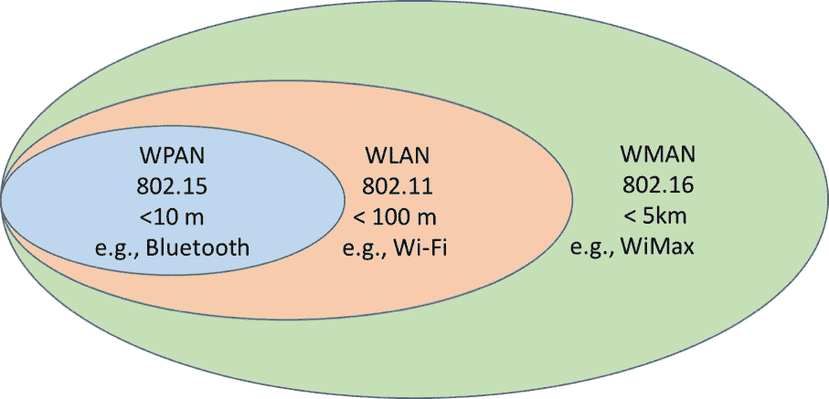

# 九、无线局域网

在本章中，我们将了解:

*   无线网络和标准简介
*   无线电问题、分析和故障排除
*   捕获无线局域网流量

# 学到的技能

本章结束时，读者将能够分析无线局域网流量，并诊断用户报告的连接和性能问题。

# 无线网络和标准简介

无线网络在过去十年中变得非常流行，现在它是我们的小工具保持连接所需的最重要的连接之一。概括地说，无线网络可以有以下几种类型:

*   **无线个人区域网(WPAN)** :无线设备之间的距离在 5-10 米之内，可以临时搭建
*   **无线局域网(WLAN)** :无线设备之间的距离不超过 100 米
*   **无线城域网(WMAN)** :无线设备之间的距离不超过 100 米，距离不超过 5 公里(3.1 英里)，通常覆盖郊区或城镇

图 9.1:无线网络的类型

让我们快速浏览一下各种 WLAN 标准。自 20 世纪 90 年代中期以来，IEEE 802.11 委员会一直在开发无线局域网标准，并已发布了从 802.11b 到 802.11ac 的若干标准，如下所示:

| **标准** | **802.11b** | **802.11a** | **802.11g** | **802.11n** | **802.11ac** |
| **年** | One thousand nine hundred and ninety-nine | One thousand nine hundred and ninety-nine | Two thousand and three | Two thousand and nine | Two thousand and thirteen |
| **频率** | 2.4ghz | 5 千兆赫 | 2.4ghz | 2.4 / 5 千兆赫 | 5 千兆赫 |
| **通道数量** | three | <=24 | three | 动态的 | 动态的 |
| **传输技术** | DSSS | 正交频分多路复用技术（Orthogonal Frequency Division Multiplexing 的缩写） | DSSS /正交频分复用 | 正交频分多路复用技术（Orthogonal Frequency Division Multiplexing 的缩写） | 正交频分多路复用技术（Orthogonal Frequency Division Multiplexing 的缩写） |
| **数据速率(Mbps)** | 1, 2, 5.5, 11 | 6, 9, 12, 18, 24, 36, 48, 54 | 6，9，12，18，24，36，48，54 - OFDM | <= 450 | 1300(第一波)，6930(第二波) |

# 了解 WLAN 设备、协议和术语

了解无线电基础知识和各种 WLAN 设备非常重要，这样有助于了解用户报告的问题并排除故障。

# 接入点

无线 LAN 网络基于**接入点**(**AP**)——允许无线站/设备(称为 STA)连接到它并进而连接到有线网络的硬件。AP 通常连接到上游交换机/路由器。

# 无线局域网控制器(WLC)

一个**无线局域网控制器** ( **WLC** )是一个硬件，它使用 IEEE CAPWAP(无线接入点的控制和供应)协议与大量轻量级接入点进行通信和管理，该协议基于思科的**轻量级接入点协议** ( **LWAPP** )。CAPWAP 在接入点和控制器之间传输控制流量(DTLS 加密)和数据流量(DTLS 加密可选)。

AP 可以以独立模式或集中模式部署。

*   **单机**:顾名思义，这种模式下，AP 是单独部署和维护的。这是中小型企业中最常见的部署类型，只需要几个接入点。

图 9.3:独立模式下的无线接入点

*   **集中式**:在这种模式下，大量接入点由无线局域网控制器管理其设备配置、安全/策略设置、软件/固件更新等。AP 和控制器之间的连接可以通过第 2/3 层网络。如前所述，接入点由使用 CAPWAP 协议的无线控制器管理，该协议处理数据和控制流量。

图 9.4:集中模式下的无线接入点

对无线局域网设备有了基本的了解后，让我们再来看几个无线领域中使用的术语:

*   **STA:** 使用服务的无线站或客户端
*   **AP** :为客户端提供无线服务的设备
*   DS:分布，连接接入点的局域网
*   **BSS** : **基本服务集** ( **BSS** )，或者具有相同媒体特性(例如，射频和调制方案)的无线设备单元
*   **ESS** : **扩展服务集** ( **ESS** )，或同一逻辑网段内基本服务集的逻辑单元(如 IP 子网和 VLAN)

为了更好地理解这些术语，请参考下图:

图 9.5:无线局域网分布和服务集

# 无线电问题、分析和故障排除

# 做好准备

当用户抱怨 Wi-Fi 网络没有连接或连接很差时，请带着您的笔记本电脑尽可能靠近用户的位置，并验证您是否有 Wi-Fi 网络。

# 怎么做...

要找出问题的来源，请执行以下步骤:

1.  用户的无线连接很差还是完全没有连接？
2.  无线连接性差的问题是出现在楼层/建筑的不同部分，还是只出现在楼层/建筑的特定部分？

# 零无线连接

如果用户的连接为零，则访问并检查覆盖受影响区域的接入点(以独立模式运行)的状态和运行状况。

如果 AP 由控制器集中管理，那么它们的用户界面(GUI)应该提供检查 AP 的状态、它们的健康状况，特别是它们提供服务的 SSIDs 的方法。从下面的屏幕截图中，我们可以看到 Cisco 无线控制器报告了 AP 的数量、它们的正常运行时间等等。

图 9.6:思科无线控制器接入点列表和状态

请注意，接入点发现控制器、加入无线域和下载配置/策略有一个过程。我建议参考特定供应商的故障排除文档来诊断和解决问题。

如果控制器的用户界面中缺少 AP，则它们之间可能存在连接问题。通过数据包捕获排除接入点和控制器之间的连接问题与排除网络中两台电脑之间的连接问题是一样的。

请注意，并非所有 SSIDs 都由 AP 广播。因此，如果用户抱怨看不到特定的 SSID，这可能是由于 AP 没有广播它们。如果是这样，那么尝试使用用户名/密码凭证手动加入特定的 SSID。

# 无线连接不良或断断续续

如果用户报告间歇性连接和性能不佳，请执行以下步骤。

基本工具就在笔记本电脑中(正如我们在下面的屏幕截图中所看到的)，在那里您有第一个指示:

*   信号强度，也称为**接收信号强度指标**(**)**
***   接入点 ID，即**服务集标识** ( **SSID** )*   使用的安全协议*   无线电类型(802.11n，如截图所示)**

**

图 9.7:电脑中的 Wi-Fi 网络和细节

一旦确认用户所在位置有合适的 Wi-Fi 网络，请使用专用软件(例如，免费版的 Acrylic Wi-Fi、Windows 版的 Homedale、Apple Mac 版的 NetSpot 或 macOS 无线诊断工具)。因此，您会发现可用的网络、信号强度、信道、链路质量以及更多细节。这将提供当地可用 Wi-Fi 网络的概况，以及可能的频率干扰、干扰和无线电问题。一些软件还提供了在特定时间内监控信号质量的选项。

RSSI 等级表明数字越高，强度越低:

*   **-60 dBm 及更好的**:这表示良好的信号水平
*   **-80 dBm 到-60 dBm** :表示合理的信号电平
*   **-80 dBm 到-90 dBm** :这表示信号电平很弱
*   **-90 dBm 及以下**:表示信号非常微弱

图 9.8:丙烯酸的 Wi-Fi 网络、RSSI 水平和速度

如果你有 RSSI 在合理的范围和以上，接收水平通常是足够的，你应该寻找频率干扰和其他无线电问题。**信噪比** ( **SNR** )是重要参数之一；它提供了环境中信号功率和噪声功率之间的比率。

我通常应用于无线网络设计的一个经验法则是，对于标准的企业应用，我需要 75 dBm 或更好；对于也应该用于 VoIP 的无线网络，我要求-65 dBm 或更好。

如果你想检查是否有任何干扰，你可以使用软件，将发现 RSSI 随着时间的推移，它会给你一个更准确的图片你的网络。在下面的截图中，你可以看到一个叫做**的软件。它让您更准确地了解哪些接入点正在工作及其详细信息。**

图 9.9:来自 inSSIDer 的 RSSI 随时间的变化

试着找出以下问题:

*   不同的接入点在同一区域的同一信道上工作
*   低信噪比，出现在 RSSI 较低(通常低于-90 dBm)和/或噪声较高时

802.11 网络运行在 2.4 GHz ISM(工业、科学和医疗)频段，无需许可。因此，由于来自各种设备(如无线摄像机、微波炉、无绳电话/耳机、无线游戏控制台/控制器、运动检测器甚至荧光灯)的传输，它非常拥挤。

图 9.10: 802.11 干扰

机场、海港和军事区等区域可能会出现频率干扰。下一步是使用频谱分析仪来检查哪些频率在您的地区使用。频谱分析仪可从各种供应商处获得，如 Fluke Networks、Agilent 和 Anritsu。

Wireshark 可用于分析 Wi-Fi 控制帧。首先要寻找的是 AP 是否正在发送信标帧，并且它们也在无线站被接收。在下面的截图中，您可以看到这些帧:

图 9.11:接入点发送的信标帧

AP 周期性地发送信标帧来宣告其存在、SSID、使用的安全方法等等，以及时间戳。

无线站/设备持续扫描所有 802.11 无线电信号并监听信标，以确定要关联的最佳接入点和无线网络。这些站确认信标，以便注册到 AP 和特定的 SSID。

无线站还可以发送探测请求帧来发现附近的接入点，这些接入点将使用探测响应帧进行响应，以提供进一步的信息。

在识别出首选无线网络并确认信标帧后，将启动一个标准的 DHCP 过程，如[第 10 章](9affead7-6197-42e7-8ebc-0da367154504.xhtml)、*网络层协议和操作*中所述。**  **# 捕获无线局域网流量

# 捕获选项

如果您试图捕获运行 Wireshark 的无线站与网络中其他有线/无线机器之间的流量，并且只对常规网络数据感兴趣，而对 802.11 控制数据包或无线电/链路层信息不感兴趣，那么您不必做任何特殊的事情。只需打开 Wireshark，选择您感兴趣的特定无线接口，应用必要的过滤器，并以混杂模式运行它。

使用 Wireshark，如果您想要捕获无线站内运行的不同进程之间的流量，则应该在环回接口上进行捕获。

如果您试图捕获不仅发送到运行 Wireshark 的无线站或从运行 Wireshark 的无线站发送的流量，而且还捕获网络中不同无线设备之间的流量，并且如果您对 802.11 控制数据包或无线电/链路层信息感兴趣，那么您必须通过启用监控模式来实现，如下所示(Wireshark 版本 10.6，运行在 Apple macOS Sierra 10.12.6 上)。这种类型的捕获通常被称为**空中** ( **OTA** )数据包捕获。

图 9.12: Wireshark 接口捕获选项

请注意，Wireshark 提供有限的功能来执行 OTA 数据包捕获；一些商业工具和应用可用于提供更全面的监控和故障排除功能和特性。

在基于 Unix 的操作系统和 Apple macOS (10.6 或更高版本)中，有一些内置工具，如`airportd`、airport 实用工具、无线诊断和 tcpdump，可以用来捕获和分析无线数据包。

# 做好准备

对捕获流量的可用选项有了基本的了解后，让我们来讨论基站成功关联到无线网络以及访问网络服务/数据的步骤:

*   无线站从 AP 接收信标帧和/或与 AP 交换探测请求和响应以获得关联。
*   关联成功后，工作站将通过身份验证过程并获得许可。
*   基于网络策略为无线客户端提供 IPv4/v6 地址。
*   在 web 身份验证过程中，用户同意无线服务提供商的条款和条件。根据提供商的不同，此步骤可能是可选的。

通过上述步骤，网络中会出现许多问题；它们可能会阻止站点成功地与无线网络关联并访问数据。在这里，我们将研究一些非常常见的问题:

*   没有加入特定 SSID 的无线站
*   成功关联到 SSID 后，用户将无法进行身份验证

# 怎么做...

请回顾上一节—无线电问题、分析和故障排除—并确保没有无线电/链路层问题。

# 没有加入特定 SSID 的无线站

在监控模式下运行 Wireshark，使用适用的过滤器过滤无线站(正在进行故障排除的设备)发送和接收的流量。

如前几章所述，在给定的框架中找到感兴趣的字段，右键单击它，并选择 Apply as Column 以将该字段添加为列。例如，您可以添加数据速率、强度等，这将在故障排除过程中非常有帮助。

考虑一个场景，一个苹果无线设备刚刚被激活，加入是一个 SSID。正如您接下来看到的，无线设备发送一个探测请求，并从 AP 获得探测响应。使用的过滤器:`(wlan.fc == 0x4000) or (wlan.fc == 0x5008)`:

图 9.13:探测请求和响应

请注意，探测请求是一个广播，目的地是所有 Fs mac 地址。

图 9.14:探测响应报头详细信息:无线电、AP 和 BSS

正如您在这里看到的，有效的探测响应将在 802.11 无线电信息报头中包含无线电/链路层信息，如频率、信道、SNR 等，在 802.11 探测响应报头中包含发射机和 BSS 信息。

下图显示了 SSID、支持的 Mbps 速率以及 802.11 无线 LAN 报头中的其他功能。确保所有信息看起来有效，并且与无线适配器兼容。

图 9.15:探测响应标头详细信息:SSID 和速率

得到响应后，无线客户端与 AP 服务的特定 SSID 相关联。如下所示，在探测请求和响应之后，客户端和 AP 交换一些消息来完成关联过程。

图 9.16:无线客户端和 AP 关联过程

如果您查看 AP 发送的最终关联响应帧中的 802.11 无线 LAN 报头，您应该会看到状态代码字段为成功。这表明客户端与特定的 AP 和 SSID 成功关联。

图 9.17:无线客户端和 AP 关联:状态代码

# 成功关联后用户无法进行身份验证

成功关联后，如果您看到客户端和 AP 之间交换了用户数据，则很可能没有实施安全策略。这在百货商店或酒店中很常见，在这些地方，客人可以在没有设备级认证的情况下访问无线网络。请记住，当用户打开浏览器时，可能会发生应用级别的身份验证，此时会要求用户提供用户名/密码凭据和/或接受条款和条件，以便继续使用无线服务。

在排除身份验证问题之前，让我们了解一下身份验证框架和各种方法。

**可扩展认证协议** ( **EAP** )是当今部署中最流行的认证框架之一，并得到了各种厂商和无线客户端的广泛支持。该框架本身不是一种身份验证机制，它提供了常见的身份验证功能和协商，称为 EAP 方法。目前有 40 多种方法用于保护设备之间的通信，例如 LEAP、EAP-TLS、EAP-MD5、EAP-FAST、EAP-IKEv2 等等。

**注**:

*   RFC5274 中定义了 EAP。早先它在 RFC3748 中被定义。
*   RFC4017 中描述了专用于无线局域网的方法要求。
*   有关 EAP 数据包中使用的类型和代码，请参考 IANA EAP 注册表，链接如下:[https://www . iana . org/assignments/EAP-numbers/EAP-numbers . XHTML](https://www.iana.org/assignments/eap-numbers/eap-numbers.xhtml)。
*   IEEE 802.1X 定义了 EAP over LAN 的封装，也称为 EAPoL。

请参考下面的截图，跟踪关联成功后发生的事件。

使用的过滤器:`(wlan.da == 78:88:6d:43:90:ad or wlan.sa == 78:88:6d:43:90:ad) && (eapol.type == 0)`。这里，`78:88:6d:43:90:ad`是无线客户端的 MAC 地址:

*   帧#9: AP 向无线客户端发送请求以识别自身。
*   第 10 帧:苹果无线客户端识别自己。
*   帧# 12:AP 想要使用 e AP-TLS 方法建立一个安全隧道来保护所有的 EAP 通信(称为受保护的 EAP-PEAP)。
*   帧#13:客户端开始向 AP 发送 TLS ver1.2 帧。
*   帧# 15-46:AP 和无线设备再交换几个数据包，以完成身份验证过程和封装方法。

图 9.18: EAP 流程

*   第 48 帧:EAP 进程完成，在 EAP 报头中有代码 ***成功*** 。详情如下:

图 9.19:–EAP 流程-最终状态代码

在成功的 EAP 过程之后，无线客户端和 AP 必须完成四次握手，这是为 AP 和无线客户端设计的，以在不泄露先前共享的密钥的情况下独立地向彼此证明它们的合法性。这对于保护网络免受各种恶意接入点的攻击至关重要。确保四次握手完成，以便无线客户端可以访问数据。

图 9.20:四次握手

# 还有更多...

**河床上的空气帽**

在前面讨论的场景中，考虑了一种非常特殊的身份验证和封装方法，并在 Apple Mac 笔记本电脑上执行。您可以使用市场上提供的各种商业工具，如 Riverbed 的 AirPcap 无线适配器，它与 Wireshark 和 SteelCentral packet analyzer 完全集成。该产品包提供了全面的报告和可视化。详情请参考以下链接:[https://www . riverbed . com/products/steel central/steel central-riverbed-aircap . html](https://www.riverbed.com/products/steelcentral/steelcentral-riverbed-airpcap.html)。

**获取无线客户端、接入点和控制器之间流量的更多方式**

在前面的章节中，我们只讨论了无线客户端和 AP 之间的交互，以及相关的数据包捕获。思科系统公司和阿鲁巴/HPE 公司等供应商提供了以嗅探模式运行 AP 和/或无线控制器的方法。在这种模式下，AP/WLC 向特定的 UDP 端口(例如，`5555`)发送流量；它可以在无线客户端中使用带有 UDP 端口`5555`过滤器的 Wireshark 捕获，并解码为 peekremote(在旧版本中为 airopeek)。此选项有助于确认从 AP 到客户端的流量没有丢失，也有助于验证各种无线电/链路层参数。

在正常情况下，无线客户端和接入点之间的所有控制/数据负载都是加密的，无法使用 Wireshark 解密。我建议您与特定的供应商联系，看看是否有可能在 AP/WLC 解密这些数据包。

此外，在集中式部署模式下，接入点和 WLC 之间的数据/控制流量采用 CAPWAP 隧道。可以使用 Wireshark 捕获 CAPWAP 流量(就像我们捕获网络中两台电脑之间的流量一样)并解码。

确保您检查了 Wireshark | Preferences | Protocols | CAPWAP 控制下的 Cisco 无线控制器支持选项，以便解码 CAPWAP 控制数据包。如果未选中，数据包可能会在 Wireshark 显示中被标记为*格式错误的*数据包。**