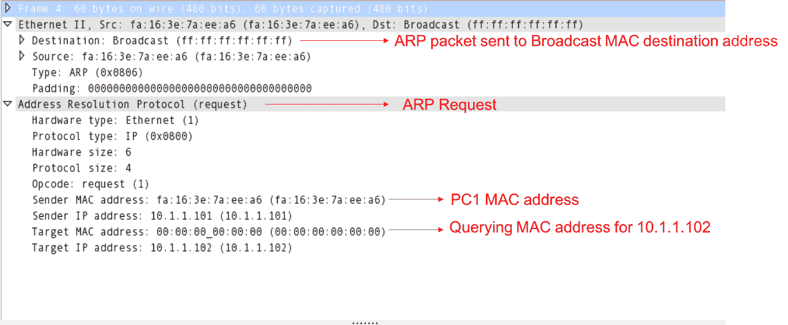
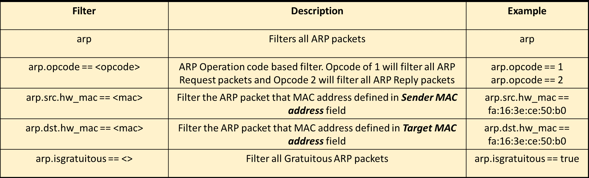
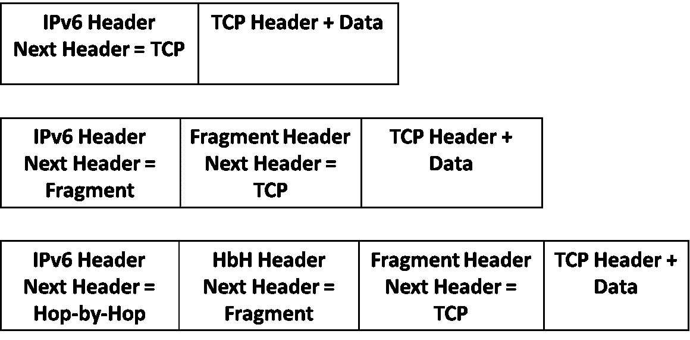
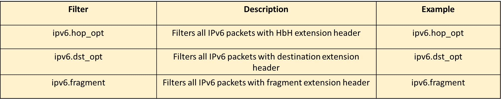
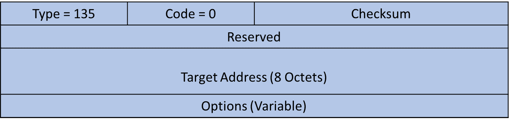
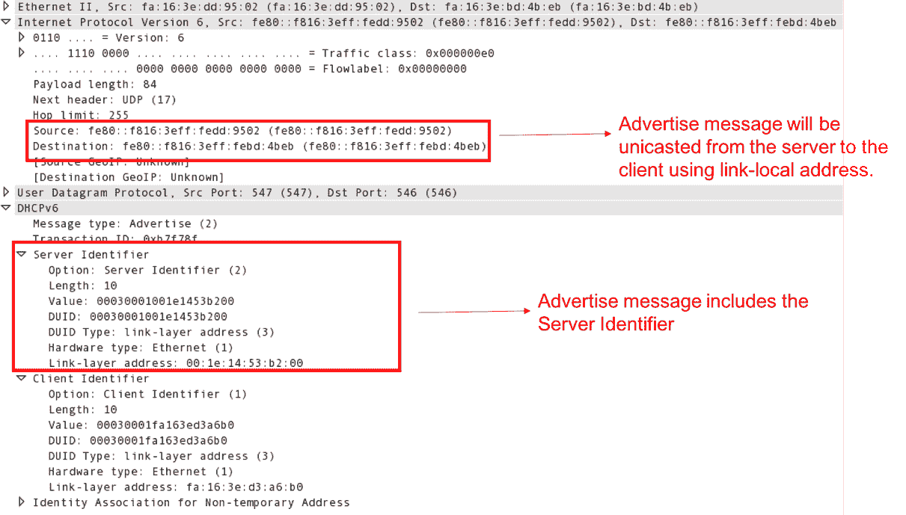
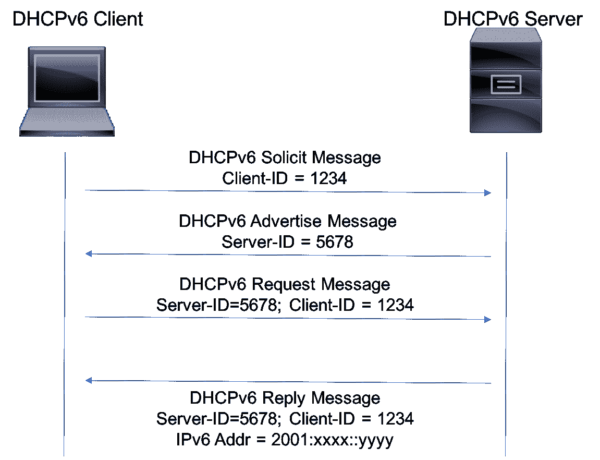

# 十、网络层协议和操作

在本章中，您将了解以下内容:

*   IPv4 操作原则
*   IPv4 地址解析协议操作和故障排除
*   ICMP–协议操作、分析和故障排除
*   分析 IPv4 单播路由操作
*   分析 IP 碎片故障
*   IPv4 多播路由操作
*   IPv6 操作原则
*   IPv6 扩展标头
*   icmp V6–协议操作、分析和故障排除
*   IPv6 自动配置
*   基于 DHCPv6 的地址配置
*   IPv6 邻居发现协议的运行与分析

# 介绍

在本章中，我们将主要关注 OSI 参考模型的第 3 层，并学习如何分析第 3 层协议(IPv4/IPv6)的运行，以及单播和组播流量分析。我们还将了解**地址解析协议** ( **ARP** )/ND、动态和无状态 IPv6 地址配置等等。我们将讨论您在排除这些协议故障时可能面临的基本问题。

我们将学习如何使用 Wireshark 分析单播和组播流量的端到端 IPv4 和 IPv6 连接故障。

虽然有各种结构化的故障排除方法，但自下而上的故障排除方法是最有效的方法。它从 OSI 参考模型的底层(物理层)开始。当端点之间出现端到端连接故障时，这种方法会从底层开始检查元素，然后向顶层移动，直到确定故障原因。方法如下:

ISO 自下而上故障排除模型

# IPv4 操作原则

在 OSI 参考模型中，网络层负责使用网络层寻址来提供全球唯一的设备标识，并为不同网络中的终端系统之间的数据传输提供连接。网络层的基本功能是从上层(传输层)接收数据段，用携带源和目的标识符的网络层报头封装数据段，然后将数据包转发到远程终端系统。

IP 是网络层协议，并且是互联网和其他网络最常用的网络层协议。IPv4 报头的格式如下:

IPv4 数据包报头

以下是 Wireshark 捕获 IP 数据包的示例:

样本 IP 数据包

# IP 寻址

IPv4 地址是分配给 IP 网络上每台设备的唯一逻辑网络层标识符。它是一个 32 位标识符，由网络部分和主机部分组成。地址格式如下:

IPv4 地址格式

网络 ID 用于识别主机所在的网络。同一网络中的所有节点将共享相同的网络 ID。主机 ID 用于识别网络中的主机。网络中的每个节点都有一个唯一的主机 ID。IP 地址总是分配有子网掩码，用于标识地址的网络 ID 部分。例如，子网掩码为`255.255.255.0`的 IP 地址`10.0.0.1`表示前三个二进制八位数是网络 ID，最后一个二进制八位数是主机 ID。

虽然 IPv4 地址的大小是 32 位，但用于表示地址的语法是基于点分十进制的。32 位分为四个二进制八位数，每个二进制八位数表示为一个十进制值，以点作为分界。

有三种类型的 IPv4 地址，概述如下:

*   **单播地址**:用于点对点通信，数据从一个节点发送到相同或不同网络中的一个接收方。单播的地址范围是从`1.0.0.0`到`223.255.255.255`。
*   **组播地址**:用于点对多点通信，数据从一个节点发送到相同或不同网络中的多个接收者。组播的地址范围是从`224.0.0.0`到`239.255.255.255`。
*   **广播地址**:用于点对多点通信，数据从一个节点发送到同一网络中的所有接收器。每个子网中的最后一个 IP 地址是广播地址。地址`255.255.255.255`被称为受限广播地址。

# IPv4 地址解析协议操作和故障排除

以太网是流行且主要部署的**局域网** ( **LAN** )技术，传输速率从 10 Mbps 到 400 Gbps。该数据链路层协议使用 48 位 MAC 地址作为数据链路层标识符。在本菜谱中，我们将讨论 IPv4 ARP 及其相关问题。

# 做好准备

在自下而上的故障排除方法中，任何连通性问题的第一步都是确保 ARP 解析对于相应的 IP 地址是成功的。

# 怎么做...

考虑以下 LAN 拓扑的屏幕截图:

局域网拓扑

在前面的场景中，假设 **PC1** 正试图联系 **PC2** :

1.  从 **PC1** ( `10.1.1.101`)到 **PC2** ( `10.1.1.102`)触发 ping 探针。这将触发从 **PC1** 到 **PC2** 的 ARP 请求。
2.  使用`arp-a`检查 **PC1** 上的 ARP 表，查看本地表中是否填充了`10.1.1.102`的 MAC 地址。
3.  如果你在 **PC1** 本地表中看到了`10.1.1.102`的 MAC 地址，那就证实了 **PC1** 发送了 ARP 请求并收到了来自 **PC2** 的 ARP 响应。
4.  如果在 **PC1** 中没有看到`10.1.1.102`的 MAC 地址，将 Wireshark 连接到交换机上的一个空闲端口并捕获数据包(使用端口镜像)。在连接 **PC1** 和 **PC2:** 的端口的入口和出口方向上执行捕获将是有用的

ARP 数据包捕获

5.  检查来自 **PC1** 的 ARP 请求是否出现在捕获中。前面的截图显示了来自 **PC1** 的 ARP 请求。您可能已经注意到，ARP 数据包的目的地是广播 MAC 地址`ff.ff.ff.ff.ff.ff`:
    *   如果在连接 **PC1** (入口方向)的端口的捕获中发现 ARP 请求包，但在连接 **PC2** (出口方向)的端口的捕获中没有发现，则交换机可能已经丢弃了 ARP 包。
    *   如果在连接 PC1 的端口(入口方向)的捕获中没有看到 ARP 请求数据包，请检查连接 **PC1** 到交换机的物理电缆。
    *   如果在连接 **PC1** 和 **PC2** 的两个端口上捕获到 ARP 请求包，但是没有 ARP 响应，检查 **PC2:**

ARP 回复捕获

6.  检查 ARP 回复数据包是否出现在捕获中。前面的截图显示了从 **PC2** 到 **PC1** 的 ARP 回复。可以看出，ARP 回复是单播给 **PC1** MAC 地址的:
    *   如果在连接 **PC2** 的端口(入口方向)的捕获中发现 ARP 回复数据包，但在连接 **PC1** 的端口(出口方向)的捕获中没有发现，则交换机可能已经丢弃了 ARP 回复数据包。
    *   如果在连接 **PC2** (入口方向)的端口上的捕获中没有看到 ARP 应答包，检查连接 **PC2** 到交换机的物理电缆。
    *   如果在连接 **PC1** 和 **PC2** 的两个端口的捕获中看到 ARP 应答包，但是在 **PC1** ARP 表中没有条目，检查 **PC1** 。

以下是一些有用的显示过滤器:

Wireshark ARP 显示过滤器

# ARP 攻击和缓解措施

ARP 是一个非常简单的协议，没有任何认证或其他内置的安全机制，因此很容易受到攻击。网络中的恶意用户可以使用 ARP 作为 ARP 中毒的手段进行窃听，或者可以使用 ARP 扫描进行**拒绝服务** ( **DoS** )攻击。在本节中，我们将讨论不同的基于 ARP 的攻击，以及如何使用 Wireshark 来检测它们。

# ARP 中毒和中间人攻击

中间人攻击的一种类型是，攻击者利用以太网网卡的 MAC 地址毒害他们想要监听的设备的 ARP 缓存。一旦 ARP 缓存中毒成功，每台受害设备在与另一台设备通信时，都会将其所有数据包发送给攻击者。当然，攻击者在读取数据后会重新发送给他们。

这被称为**中间人**攻击，因为它将攻击者置于受害设备之间的通信路径中间。它也被称为 **ARP 中毒**，因为攻击者实际上是用错误的信息毒害受害者的 ARP 缓存。

在下图中，我们看到了一个中间人攻击的示例:

ARP 中毒攻击

以下是 Wireshark 的截图:

ARP 欺骗捕获

应该注意的是，攻击者使用 MAC 地址`f0:de:f1:ae:77:69`来响应对`10.0.0.100`和`10.0.0.101`的 ARP 请求。在生产网络中，您可能会在几秒钟内看到成千上万的数据包被捕获。Wireshark 显示过滤器将有助于缩小我们感兴趣的数据包的范围。

# 无偿 ARP

任何节点都可以使用免费的 ARP ( **GARP** )来通告自己的 MAC 地址，并以相应的 IP 地址作为 ARP 回复，即使没有 ARP 请求。这种提前通知的主要目的是确保邻居的 ARP 缓存随着本地 MAC 地址的任何变化而更新。GARP 总是注定要广播 MAC 地址:

GARP 包

虽然预计它会在生产环境中看到 GARP，但它也可能被任何恶意攻击者利用，通过向 GARP 发送其自己的 MAC 地址来窃听任何 IP 地址:

GARP 滤波器

`arp.isgratuitous`是一个 Wireshark 显示过滤器，有助于从大量捕获的数据包中列出 GARP 数据包。

# 基于 ARP 扫描的 DoS 攻击

对于网络库存，通常的做法是使用管理系统，并向子网内的所有 IP 地址发送 ARP 请求扫描。在这种方法中，目标 IP 地址将不断变化，但发送方 IP 地址和发送方 MAC 地址将保持不变，并被设置为管理系统地址。为了实现高效通信，终端主机的默认行为是从 ARP 请求中获取发送方 IP 和 MAC 地址，并填充本地 ARP 缓存。任何恶意攻击者也可以利用 ARP 扫描和这种行为，通过更改发送者的 IP 和 MAC 地址来耗尽 LAN 网络中所有终端主机的 ARP 缓存。

ARP 请求和回复是常规网络操作的一部分。这里有一些经验法则来确保它们确实如此:

*   对于来自不同来源的 ARP 请求:
    *   如果来源合法，这是一个正常的操作
    *   如果来源是恶意的，这可能是一种攻击
*   对于来自单一来源的 ARP 请求:
    *   如果源是管理系统，则是正常操作
    *   如果来源是路由器，则可能是网络扫描
    *   如果来源不合法，则可能是攻击

IP 统计

Wireshark 统计数据可用于识别是否有 ARP 扫描。这可以通过 Wireshark 报头字段中的统计信息|协议层次结构来查看。如前例所示，通过该选项可以查看 ARP 数据包的数量，这将有助于我们了解网络中是否存在 ARP 数据包的扫荡。

# 它是如何工作的...

对于端到端通信，任何节点都需要解析与第 3 层 IPv4 或 IPv6 网络地址相关联的 48 位以太网 MAC 地址。

当第 3 层网络为 IPv4 时，ARP 用于解析与 IPv4 地址相关的 MAC 地址。ARP 数据包格式如下:

ARP 数据包格式

解析节点将发送 ARP 请求(`OpCode = 1`)，该请求广播 MAC 地址(`ff.ff.ff.ff.ff.ff`)。发送方硬件地址将被设置为发起节点的 MAC 地址，发送方协议地址将被设置为发起节点的 IP 地址。目标硬件地址将被设置为零值，并且目标协议地址将被设置为正在执行 MAC 解析的地址。

响应节点将用单播给解析节点的 ARP 回复(`Opcode = 2`)进行回复。

ARP 操作只是本地的，这意味着 ARP 请求是一种广播，只在局域网上发送。当源地址 *S* 和目的地址 *D* 属于同一个局域网(相同的 IP 网络和掩码)时，ARP 会通过发送携带目标协议地址为 *D* 的 ARP 请求，尝试解析出 *D* 的 MAC 地址。但是当源地址 *S* 和目的地址 *D* 在不同的局域网(不同的 IP 网络和掩码)时，将对默认网关地址进行解析。

# ICMP–协议操作、分析和故障排除

**互联网控制消息协议** ( **ICMP** )是一种网络层协议，用于错误报告和网络路径诊断功能。Ping 和 Traceroute 实用工具利用 ICMP 消息进行故障检测和隔离。ICMP 消息使用基本 IP 报头发送。IP 报头中的协议字段将被设置为 ICMP，后跟 ICMP 有效负载。ICMP 数据包具有以下格式:

ICMP 报头格式

用于网络连接性验证的 ICMP 消息类型有回应请求(`Type = 8`)和回应回复(`Type = 0`)。

# 做好准备

当 web 服务或邮件服务等终端应用出现问题时，使用自下而上方法的第一个故障排除步骤是检验数据链路层。使用上一节中定义的步骤检验完数据链路层后，下一步是检验端点之间的网络连通性。端点之间的网络连通性可以通过常用的故障检测和隔离实用工具来验证，例如 Ping 和 Traceroute。

# 怎么做...

考虑以下 IPv4 拓扑的屏幕截图，并仔细观察 Ping 探针:

IPv4 拓扑

在上图中，当从 **PC1** 到 **PC2** 触发 Ping 探测时，从 **PC1** 到 **PC2** 的 IP 或以太网报头不会有任何变化，因为它们都在同一个局域网中:

1.  触发 **PC1** ( `10.1.100.101`)到 **PC2** ( `10.1.100.102`)的 Ping 探针。这将产生一个从 **PC1** 到 **PC2** 的 ICMP 回应请求消息。
2.  如果没有来自 **PC2** 的回应回复，确保在本地 ARP 缓存表中填充了 **PC2** 的 MAC 地址。
3.  将 Wireshark 连接到 **SW1** 上的一个空闲端口，并捕获数据包(端口镜像):

ICMP 数据包

4.  检查在捕获中是否看到来自 **PC1** 的 ICMP 回应请求。前面的截图显示了从 **PC1** 到 **PC2** 的 ICMP 回应消息:
    *   如果在连接 **PC1** 和 **PC2** 的端口看到 echo 消息，但是还没有响应，检查 **PC2 上的防火墙和其他设置。**
    *   如果在连接 **PC1** 的端口看到回应消息，但在连接 **PC2** 的端口没有看到回应消息，请检查交换机是否正在丢弃数据包。
    *   如果在连接 **PC1** 的端口没有看到 echo 消息，检查连接 **PC1** 到 **SW1** 的物理电缆:

5.  检查在捕获中是否看到来自 **PC2** 的 ICMP 回复。上图显示了从 **PC2** 到 **PC1** 的 ICMP 回复:
    *   如果在连接 **PC1** 和 **PC2** 的端口中看到回应回复，那么一切都工作正常。
    *   如果在连接 **PC2** 的端口中看到回应应答，但在连接 **PC1** 的端口中没有看到回应应答，请检查交换机是否正在丢弃数据包。
    *   如果连接 **PC2** 的端口看不到回应应答，检查连接 **PC2** 到 **SW1** 的物理线缆。

以下是一些有用的 ICMP 显示过滤器:

# ICMP 攻击和缓解

虽然 ICMP 是一个极好的错误报告和诊断实用工具，但它也在许多网络中被用作 DoS 攻击的来源。

# ICMP 洪水攻击

ICMP flood 攻击是常见的 DoS 攻击之一，网络中的恶意用户会向目标主机(如服务器)发送大量 ICMP 数据包:

Wireshark 统计数据可用于识别是否存在 ICMP 攻击。可以通过 Wireshark 头字段中的统计信息|协议层次结构来查看统计信息。如前面的截图所示，几秒钟内有 60，000 个 ICMP 数据包。

# ICMP smurf 攻击

ICMP smurf 攻击是另一种分布式 DoS 攻击，在这种攻击中，恶意攻击者会向一个或多个目标发送大量 ICMP 回送消息，并将目标(受害者)主机的欺骗地址作为 ICMP 回送消息的源 IP 地址。这将导致受害主机收到大量回应回复消息，导致其缓冲区溢出和耗尽:

单一网络拓扑

在上图中，攻击者生成了一条 ICMP 回应消息，其中包含假冒地址 **PC1** 。这种攻击导致 **PC1** 收到来自非预期响应者的 ICMP 回应回复，导致缓冲区耗尽问题。

当启用第 2 层安全功能时，源 MAC 地址不能被欺骗。因此，捕获数据包并使用源 MAC 地址可能有助于识别攻击者以阻止攻击。

# 它是如何工作的...

为了验证 **PC1** 和 **PC3** 之间的可达性，Ping 实用工具将用于触发从 **PC1** 到 **PC3** 的 ICMP 消息，如下图所示:

将生成一个 ICMP 回应请求(类型 8 ),源地址为`10.1.100.101`,目的地为`10.1.200.101`,并转发到默认网关。路径上的每台路由器都会根据转发表转发它。 **PC3** 收到 ICMP 回应请求消息后，会回复一个 ICMP 回应回复(类型 0)给 figure。Ping 失败将指示 **PC1** 和 **PC3** 之间的连接问题。

# 分析 IPv4 单播路由操作

IPv4 单播路由是将单播数据包从一个网络中的主机转发到同一网络或另一个网络中的接收器的过程。数据分组可以沿着路径穿过一个或多个路由器，这些路由器将在 IP 报头中执行查找以做出转发决定。

# 做好准备

只需打开 Wireshark，将其连接到网络，配置您想要测试的设备的端口镜像，然后启动它。碎片化将主要影响交互式应用，如数据库，这些是我们应该寻找问题的地方。

# 它是如何工作的...

如果`10.1.100.0/24`网络中的 **PC1** 想要与`10.1.200.0/24`网络中的 **PC4** 通信，则执行以下操作:

1.  **PC1** 生成数据并将其封装到 IP 报头中。源 IP 地址被设置为`10.1.100.101`，目的 IP 地址被设置为`10.1.200.102`。
2.  **PC1** 用以太网报头封装数据包。源 MAC 地址设置为 **PC1** MAC 地址，目的 MAC 地址设置为 R1(默认网关)MAC 地址。该帧将被转发给 SW1。
3.  SW1 是一个简单的第 2 层交换机，因此它对以太网报头执行查找，然后转发到目的 MAC(本例中为 R1)。
4.  R1 收到数据包并解封以太网报头，因为目的 MAC 地址与它自己的地址匹配。它在本地路由表中查找 IP 报头中的目的 IP 地址，发现 R2 是到达`10.1.200.0/24`的下一跳。
5.  R1 递减 IP 报头中的 TTL，并将数据包封装到以太网报头中。源 MAC 地址设置为 R1，目的 MAC 地址设置为 R2。该帧将被转发到 R2。
6.  R2 执行相同的转发行为。它会解封以太网报头，减少 IP 报头的 TTL，并将其与封装的新以太网报头一起转发给 R3。
7.  R3 收到帧后，会解封以太网报头，递减 IP 报头的 TTL，并将其与以太网报头封装在一起。源 MAC 设置为 R3，目的 MAC 地址将设置为 **PC4** 的 MAC 地址。
8.  **PC4** 将接收帧，解封装以太网和 IP 报头，并将其用于适当的应用。

可以看到，沿着路径的路由器修改 IP 报头中的一些字段(例如 TTL ),并且以太网封装沿着路径改变。 **PC1** 和 **PC4** 之间的任何连接故障都可能是由于各种原因造成的，包括错误的以太网封装、TTL 处理以及数据包太大而无法处理。我们将看到如何使用 Wireshark 来分析此类数据包路由问题。

# TCP 路径 MTU 发现

虽然与 IP 报头相关联的转发语义允许任何中转节点对分组进行分段，但是这可能会产生性能问题(如前一节所述),因为在处理之前要求接收方重新组装分组。我们可以强制传输节点不分割分组，而是发信号通知路径中较低 MTU 的存在，并让发起者调整 MSS。此过程称为**路径 MTU 发现(PMTUD)** ，是检测路径上最低 MTU 并使用该值调整 MSS 以实现高效数据传输的有效方式。

# IP TTL 故障和攻击

正如我们在前面几节中看到的，每当中转路由器在 IP 报头中执行查找时，它都会将 IP TTL 减 1，然后再将数据包转发到下一跳路由器。如果路由器收到 TTL 为 1 的数据包，并且目的 IP 地址不是它自己的地址，则默认行为是丢弃该数据包并生成类型为 11(超过生存时间)的 ICMP 错误消息。此行为可确保路由环路中的数据包不会永远在节点之间跳跃，而是会在 255 次迭代后被丢弃(TTL 的最大值可设置为 255):

Wireshark 的**专家信息**选项提供了一个警告，提示收到了 TTL 小于 5 的数据包，并突出显示这些数据包，如前面的屏幕截图所示。这可以通过执行以下操作来查看:

1.  转到分析并单击专家信息选项
2.  单击警告或注释部分以查看更多详细信息

恶意攻击者可以利用 IP TTL 发送大量低 TTL 值(小于 5)的数据包来触发 DoS 攻击。传输节点将继续将数据包发送到 CPU，以生成 ICMP 错误消息，这可能会导致占用 CPU。有各种选项可用，如 CPU 保护机制或限制 CPU 的流量速率，可以帮助减轻此类攻击。

# 重复的 IP 地址

我们将从现象开始，例如对服务器或另一个设备的缓慢访问，对互联网的缓慢访问，以及所有没有得到回复的 pings。

*   当您缓慢访问网络设备时，其中一个问题可能是您的设备的 IP 地址与另一个地址冲突。要验证这一点，请 ping IP 地址。

在一些设备中，当它们的地址与相同的地址冲突时，驱动程序将被关闭(Windows 操作系统中屏幕左下角的小符号)。在其他设备中，您将不会收到任何冲突通知，而这正是会出现问题的地方。

*   在**命令行界面** ( **CLI** )中输入`arp -a`。在 Windows 中使用命令`cmd`(或者在 Linux 中使用任何 shell)。如果您使用不同的 MAC 地址 pinged 了两行 IP 地址，则存在重复。
*   谷歌一下这两款设备的 MAC 地址，地址的第一部分会告诉你厂商是谁。这会让你找到麻烦制造者。
*   如果您需要设备的位置，请登录到您的 LAN 交换机(当然，当您有被管理的交换机时)，从交换机 MAC 地址表中，您将看到您所连接的交换机端口。有一个软件可以显示连接到每台交换机的设备列表，以及它们的 MAC 地址、IP 地址、DNS 名称等等。谷歌交换机端口映射或交换机端口映射工具，你会发现很多。
*   如果 Ping 和 ARP 没有任何效果，只需启动 Wireshark 并对网络 VLANs 进行端口镜像。Wireshark 将向您显示重复地址错误以及相关详细信息。
*   您将得到的错误消息如下面的屏幕截图所示:

当您 ping 一个在您的本地网络中出现两次的 IP 地址时，具有相同 IP 地址的两台(或更多)设备将响应您发送的 ARP 请求，并且您的 ARP 缓存将有两个相同 IP 地址的条目。

在许多情况下，您的设备会通过关闭其 IP 驱动程序来指示它，并通过弹出窗口或您知道的任何其他类型的通知来通知您。

在其他情况下，冲突的设备不会通知您冲突，然后您会发现只有 Ping 和 ARP 有问题，如前所述。

无论如何，当您将 Wireshark 连接到网络并看到重复的 IP 消息时，不要忽略它们。

# 分析 IP 碎片故障

分段是 IP 中的一种常见机制，它将一个大的 IP 数据包分成适合第 2 层以太网帧的较小数据包。当任何路由器接收到大于出接口**最大传输单位** ( **MTU** )的数据包时，该数据包就会被分段。在大多数情况下，这种机制不应该有任何问题，但是这种机制可能会导致性能问题。IP 碎片也可能被用作 DoS 攻击的来源。

# 怎么做...

发生碎片化时，您会看到 UDP 或 TCP 数据包以及碎片化的 IP 协议数据包，如以下屏幕截图所示:

如果怀疑存在性能问题，例如，数据库客户机与服务器的连接速度很慢，请按照以下步骤查看问题是否是由碎片引起的:

1.  测试客户端和服务器之间的连接，验证没有其他问题。
2.  寻找客户端和服务器之间的碎片。片段将如之前的截图所示(IPv4 片段)。
3.  如果您怀疑碎片是问题的原因，可以通过修复传输路径的 MTU 或调整应用发送不会导致网络碎片的较小数据包来解决问题。
4.  以太网中推荐的数据包大小不超过 1460 字节减去 TCP 报头大小。因此，从接口出来的数据段应该有 1420-1440 字节的大小。

在我们需要更多字节作为报头的情况下，例如，当我们使用隧道机制和 TCP 选项时，DBA 将不得不进一步减小这个大小。最好的方法就是把它缩小到你看不到任何碎片的大小。

# 基于碎片的攻击

虽然在网络中看到 IP 碎片是正常的，但是恶意攻击者也可以利用碎片进行 DoS 攻击。这种攻击称为微小碎片攻击，攻击者将向目标主机发送大量微小碎片数据包。这种微小的碎片需要由目标主机重新组装，从而导致性能问题或其他缓冲区溢出问题:

在前面的截图中，可以看到捕获片段的大小为 100 字节；攻击者可以使用更小的规模在目标主机上触发 DoS 攻击。

默认情况下，Wireshark 会重组捕获中的任何碎片数据包，并将其显示为一个重组的数据包。这可能会给人一种网络不存在碎片化的印象。通过更改首选项设置，我们将能够在 Wireshark 中显示真正的碎片数据包。

这可以通过以下步骤完成:

1.  转到编辑并单击首选项
2.  单击协议，然后选择 IPv4
3.  取消设置重组碎片 IPv4 数据报字段

# 它是如何工作的...

理解定义通过网络发送的数据单元大小的两个术语非常重要，如下图所示:

*   **最大传输单位(MTU)** :这是 IP 数据包的大小，包括报头和数据
*   **最大数据段大小(MSS):** 这是 TCP 数据段的最大大小:

IPv4 中使用的分段机制如下图所示:

一个原始的大数据包进入网卡或路由器，其数据包大小需要进行分段。根据原始大小，数据包被分成几个部分。

对于碎片，我们有以下字段:

*   `ID`:与原始 IP 包的 ID 相同
*   `Bit 0`:始终`0`
*   `Bit 1 (DF bit)` : `0` =五月断片，`1` =不断片
*   `Bit 2 (MF bit)` : `0` =最后一个片段，`1` =更多片段
*   `Fragment Offset`:表示从原始数据包开始的字节数

在 IPv4 中，网卡本身可以在数据包到达目的地的途中与每台路由器一起将数据包分段。

PMTUD 利用 IP 报头中的**不分段** ( `DF`)标志。当任何中转路由器接收到大于输出接口 IP MTU 大小的 IP 数据包时，如果数据包报头中的`DF`标志设置为`1`，路由器将丢弃该数据包并生成类型 3 ( `Destination unreachable`)的 ICMP 错误消息，代码为 4(需要分段并设置 DF)。此消息将被发送给数据包的发起者，并将携带传出接口的 MTU 大小:

路径 MTU 发现拓扑

在上图中， **R2** 上出接口到达 **R3** 的 **MTU** 值为 **100** 。当 **R2** 接收到任何大小超过 100 的 IP 数据包时，它会丢弃该数据包并生成 ICMP 错误消息:

**R2** 丢弃数据包并生成 ICMP 错误消息，如前面的屏幕截图所示。发起主机将使用接收到的消息中的 MTU 值来调整会话的 MSS，以实现高效的数据传输。

以下是一些有用的 IP 碎片过滤器:

# IPv4 多播路由操作

IPv4 多播路由是将数据包从源转发到位于相同或不同网络中的一个或多个接收者的过程。组播包的源地址将是单播地址，而目的地址将是组播地址(`224.0.0.0`到`239.255.255.255`)。使用组播接收流量的终端应用将使用带外机制解析组播地址，并使用 IGMP 等组播组成员协议加入相应的组播组。主机将向连接的路由器发送 IGMP 加入。

连接接收器的支持多播的路由器被称为**最后一跳路由器(LHR)** ，连接源的支持多播的路由器被称为**第一跳路由器(FHR)** 。LHR 将使用诸如 PIM 之类的多播路由协议，使用最短路径来建立到 FHR 的多播树。FHR 将通过多播树转发多播数据流量。多播可以部署在不同的模式中。下面是两种最常用的多播模式:

*   **稀疏模式**:在这种模式下，一个普通节点将被定位为**集合点(RP)** ，每个 LHR 将向 RP 建立组播树。这种树被称为共享树。FHR 在接收到来自连接源的多播流量时，会将数据包单播给 RP，RP 又会将其转发给共享树上的接收器。
*   **特定于源的组播**:在这种模式下，每个 LHR 将建立一个组播树，指向连接到源本身的 FHR。这种模式下不需要 RP。

# 它是如何工作的...

在下图中，假设接收方使用`239.1.1.1`作为组播地址加入来自连接到 **R1:** 的源的流

在我们的例子中，`10.1.8.8`作为 **RP** ，这个 **RP** 连接到 **R2** :

*   接收者将向连接的多播路由器发送`239.1.1.1`的 IGMP 加入请求。LHR 路由器( **R3** 和 **R4** )在接收到来自接收者的 IGMP 加入后，将建立一棵朝向 RP 的共享树。在我们的例子中， **R3** 和 **R4** 将使用 **R2** 作为上游路由器来构建朝向 RP 的树。
*   连接到源的 FHR 在接收到第一个多播流量时，将使用 PIM register 消息对其进行封装，并向 **RP** 单播该数据包:

*   如前面截图所示， **R1** 将组播数据包(源为`10.1.17.7`，目的为`239.1.1.1`)封装成 PIM 注册封装头。它进一步使用 IP 单播报头对其进行封装，其中源作为 FHR 路由器(`10.1.12.1`)，目的地作为 **RP** ( `10.1.8.8`)。
*   **RP** 将解封装报头，并将多播流量转发到共享树。
*   默认情况下，LHR 路由器在收到组播流量后，会建立另一个指向源的树。这棵树叫做**最短路径树**。

虽然多播流量的转发行为不同于单播流量，但是 IP 报头在路径上的处理方式并没有太大的区别。例如，任何路由器都会减少单播和组播流量的 TTL。因此，我们为 IPv4 单播定义的所有故障排除分析程序也适用于 IPv4 多播捕获。

# 还有更多...

使用多播流量的终端应用主要是音频或视频应用，接收多播流的流量速率是故障排除时要考虑的标准之一。Wireshark 允许我们列出所有 UDP 多播流，并根据 PPS、使用的平均带宽等进行简单分析。在排除多播流量故障时，此统计信息非常有用。可以按照以下步骤查看统计数据:

1.  转到统计，然后单击 UDP 多播流
2.  检查多播信息的可用字段

# IPv6 工作原理

随着 20 世纪 90 年代初互联网泡沫的出现，更多的企业开始依赖 IP 网络，这意味着 IPv4 地址空间的急剧枯竭。很快，业界意识到需要一种新的网络层协议来适应和满足不断增长的网络需求。这使得该行业开始致力于下一代知识产权(IPng)。

虽然最初的努力是扩展流协议(ST2)作为网络地址耗尽的快速解决方案，但诸如**网络地址转换** ( **NAT** )和动态地址分配(如 DHCP)等功能在一定程度上解决了耗尽问题，使业界有足够的时间来研究 IPng。开发 IPng 不仅是为了应对地址空间挑战，也是为了考虑 IPv4 面临的其他限制和挑战。ST2 被正式指定为 IPv5，IPng 被正式指定为 IPv6。

IPv6 的大小为 128 位，因此提供了非常大的地址空间。虽然 IPv6 地址的大小是 IPv4 的四倍，但为了高效处理数据包，报头的大小得到了简化。IPv6 报头的格式如下:

以下是 Wireshark 捕获 IPv6 数据包的示例:

# IPv6 寻址

与 IPv4 一样，IPv6 地址是分配给连接到网络的每台设备的唯一逻辑网络层标识符。IPv6 地址的大小为 128 位，包括网络前缀和接口 ID。IPv4 表示为四个十进制八位数，而 IPv6 地址表示为八个 16 位十六进制值块，以冒号作为分界。IPv6 地址的格式如下:

网络前缀用于标识主机所在的网络，而接口 ID 用于标识网络中的主机。虽然 128 位表示通过以十六进制值引用地址而变得高效，但这里有一些进一步简化表示的良好实践:

*   IPv6 地址中的所有前导零都可以省略
*   连续的零可以表示为::
*   *在地址中只能出现一次

有许多不同类型的 IPv6 地址；以下是其中一些的细节:

*   **链路本地地址**:这是一个不可路由的单播地址，具有特定于链路的范围，用于链路本地通信，其中数据包不会被发送超过一跳。所有控制平面通信(如 OSPF hello 消息)都属于这一类。任何启用 IPv6 的接口都将被分配一个链路本地地址。地址范围是 fe80::/10。
*   **全局单播地址**:这是具有全局范围的公共可路由单播地址。大多数互联网设备将从此范围内分配。地址范围是 2000::/3。
*   **唯一本地地址**:这是一个私有范围单播地址，在公共互联网中不可路由。地址范围为 fc00::/8 和 fd00::/8。
*   **组播地址**:和 IPv4 一样，这个地址用于点到多点的通信。地址范围是 ff00::/8。

还有一些其他类型的地址，如 IPv4 嵌入式地址和请求节点组播地址，为简洁起见，此处不做解释。

可以注意到，IPv6 没有任何广播地址，因为所有类型的广播通信都可以通过 IPv6 多播地址来寻址。如前所述，多播的地址范围是 ff00::/8，第一个块的最后 4 位定义了多播地址的范围。例如，1 具有节点本地范围，2 具有链接本地范围，5 具有站点本地范围，而 E 具有全局范围。下表给出了不同地址和范围的明确信息:

# IPv6 扩展标头

为 IPv4 报头定义的 IP 选项主要用于携带额外的网络层信息。但是 IPv4 中 IP 选项的存在将最终将数据包发送到 CPU，从而由于慢路径数据包转发而引入性能问题。在 IPv6 中，提出了扩展报头来将这种控制平面信息编码为单独的灵活报头，而不增加 IPv6 报头的大小。IPv6 扩展报头位于分组中的 IPv6 报头和传输层报头之间，并且通过将下一个报头设置为相关值来识别 IPv6 扩展报头的存在。

以下是一些常用的 IPv6 扩展头:

| **协议号****(IPv6 NH 值)** | **扩展头名称** | **描述** | **参考** |
| `0` | IPv6 逐跳选项 | 可选的扩展报头，用于携带路径上每个节点可能处理的附加信息。这可能需要将数据包发送到所有节点上的 CPU。 | RFC 8200 |
| `44` | IPv6 的片段头 | 由源用来发送大于路径 MTU 的数据包。 | RFC 8200 |
| `50` | 封装安全负载 | 用于携带安全信息，以提供机密性、身份验证、完整性等。 | RFC 4303 |
| `60` | 目标标题 | 源使用它来携带只给最终目的地的信息。 | RFC 8200 |

以下是带有扩展报头的 IPv6 数据包格式:

以下是一个示例捕获:

# IPv6 扩展标头和攻击

尽管 IPv6 在设计时考虑到了安全性，但扩展报头仍可能被用作 DoS 攻击的来源。如前所述，逐跳扩展报头的存在将需要路径上的所有中转节点来处理报头，从而消耗大量 CPU。类似地，当大量具有 IPv6 目的地扩展报头的数据包被转发到特定主机或服务器时，它可能会消耗服务器上的大量资源。

# 做好准备

只需打开 Wireshark，将其连接到网络，配置设备的端口镜像，然后开始捕获。可以通过 Wireshark 捕获来验证 IPv6 扩展标头的存在。

# 怎么做...

下面的屏幕截图显示了带有 IPv6 扩展标头的 IPv6 数据包:

在前面的屏幕截图中，使用`ipv6.dst_opt`过滤数据包将列出所有带有 IPv6 目的地选项扩展头的 IPv6 数据包。或者，我们可以使用一个`ipv6.hop_opt`过滤器列出所有带有 IPv6 逐跳选项的 IPv6 数据包。

虽然上述任务有助于缩小收到的带有扩展报头的数据包或数据包数量，但可能需要额外的手动分析，以了解这是预期行为还是攻击。

# IPv6 分段

如前所述，分段是指将数据包分成更小的片段，以适应路径上最低的 MTU 的过程。IPv6 处理数据包碎片的方式与 IPv4 完全不同。以下是 IPv6 在处理碎片方面的一些主要差异:

*   在 IPv4 中，允许任何路由器对数据包进行分段(假设未设置`DF bit`),而 IPv6 仅允许 IPv6 数据包的源进行分段，任何中转节点都不能对 IPv6 数据包进行分段。
*   在 IPv4 中，分段细节作为 IPv4 报头的一部分被携带，但是在 IPv6 中，定义了新的扩展报头，并且该报头将仅被包括在分段的分组中。

# 它是如何工作的...

下图中， **R2** 上出接口的 **MTU** 值设置为 **1280** ，这是 IPv6 报文转发所需的最小 **MTU** :

如果路由器收到大于传出接口的 **MTU** 的 IPv6 数据包，默认行为是丢弃该数据包并生成 ICMPv6 错误消息:

在前面的屏幕截图中， **R2** 丢弃数据包并生成一个 ICMPv6 错误消息，其中传出的 **MTU** 接口指向数据包的实际来源(在我们的示例中为 **R1** )。

**R1** 将缓存此信息，并根据收到的 **MTU** 大小对数据包进行分段，如前面的截图所示。

如前面的屏幕截图所示，IPv6 片段扩展标头将包含所有与碎片相关的详细信息。在 IPv4 中，所有这些信息都作为 IPv4 报头本身的一部分携带。但是在 IPv6 中，它被包含在扩展报头中。

恶意攻击者也可以利用 IPv6 碎片进行 DoS 攻击。攻击者可能会发送大量带有 IPv6 片段扩展标头的数据包，导致目标主机消耗资源来重组片段数据包。

以下是一些有用的过滤器:

# icmp V6–协议操作、分析和故障排除

ICMPv6 是针对 IPv6 的 ICMP 的增强版本，它不仅执行错误报告和路径诊断功能，还进一步扩展了其他网络层功能。ICMPv6 在以下方面起着关键作用:

*   IPv6 路由器和邻居发现
*   IPv6 无状态自动配置
*   路径 MTU 发现
*   故障检测和隔离

ICMPv6 是 IPv6 的一个组成部分，IPv6 的下一个头字段将被设置为`58`。ICMPv6 数据包具有以下格式:

有不同类型的 ICMPv6 消息可用于错误报告、信息或发现目的。在本节中，我们将了解如何使用 ICMPv6 进行故障检测和隔离，在接下来的几节中，我们将看到 ICMPv6 的更多应用。

# 做好准备

当使用 IPv6 的终端应用面临连接问题时，可以使用 Ping 和 Traceroute 等故障检测和隔离实用工具来检测或隔离故障。当 Ping 工具用于 IPv6 地址时，它使用 ICMPv6 消息进行路径诊断。沿途一台或多台设备上的 Wireshark 可用于捕获不同点的数据包进行分析。

# IPv6 邻居发现协议的运行与分析

当第 3 层网络是 IPv6 寻址时，IPv6 **邻居发现(ND)** 协议用于解析与 IPv6 地址相关联的 MAC 地址。与 ARP 不同，IPv6 ND 通过定义不同的 ICMPv6 数据包类型，使用 ICMPv6 进行地址解析。

ICMPv6 邻居请求是一种 ICMPv6 消息类型，解析节点使用它来查询 IPv6 地址的链路层地址。这类似于 IPv4 的 ARP 请求。此消息将被指定给 IPv6 请求节点多播地址，因为 IPv6 中没有广播地址。邻居请求消息格式如下:

ICMPv6 邻居公告是一种 ICMPv6 消息类型，响应节点使用它来回复相关 IPv6 地址的链路层地址。此消息类似于 IPv4 的 ARP 回复。该消息将被单播给解析节点。

邻居通告消息格式如下:

# 怎么做...

1.  下图中， **R1** 正在对 **R3** 的地址 2001::3 进行路径诊断。当在 **R1** 上触发 ping 时，它产生一个 ICMPv6 回应消息，并将其转发给 **R2** :

2.  如下截图所示， **R1** 向 **R3** 发送 ICMPv6 回应请求消息(ICMPv6 type = 128)。

3.  **R3** 在收到 ICMPv6 回应请求后，将回复 ICMPv6 回应回复。

如前面截图所示， **R3** 回复 ICMPv6 回应回复给 **R1** 。

在一些故障场景中，我们可能会注意到一些间歇性的数据包丢失。在一个大的`pcap`文件中，可能很难缩小我们没有得到响应的 ICMPv6 消息的列表。专家信息选项在这里会很有帮助:

1.  转到分析并点击专家信息
2.  检查警告:

这将列出在捕获中没有 ICMPv6 响应的所有 ICMPv6 回显消息。

# IPv6 自动配置

IPv6 的主要优势之一是能够自动配置接口地址。这种能力允许支持 IPv6 的设备以即插即用模式工作。

# 做好准备

当使用 IPv6 自动配置的终端主机无法正常工作时，首先要做的是确保正确自动配置链路本地地址。这可以通过检查接口地址配置来验证。在 Unix/Linux 设备中，`ifconfig -a`将列出接口上配置的 IPv6 地址。如果您看不到任何东西，主机上的 IPv6 堆栈可能有问题。如果您看到 IPv6 链路本地地址，下一步是使用 Wireshark 捕获数据包，并查看路由器请求和广告消息是否交换。

# 怎么做...

1.  当在终端主机上启用 IPv6 自动配置时，预计会向所有路由器多播地址发送路由器请求消息。

2.  在 Wireshark 捕获中检查消息是否由主机发送:

3.  如前面的屏幕截图所示，IPv6 主机发送一条 ICMPv6 路由器请求消息。可以观察到，ICMPv6 选项在路由器请求消息中携带终端主机的 MAC 地址。任何收到此消息的路由器都会缓存 MAC 地址以进行地址解析。
4.  下一步是检查路由器是否正在发送路由器通告消息，其中包含终端主机可用于自动配置的相关详细信息:

5.  如前面的屏幕截图所示，路由器向所有节点的组播地址`ff02::1`发送路由器广告消息。局域网中的所有节点都将监听这个多播，因此将处理消息中的信息。
6.  ICMPv6 路由器广告消息携带最小 64 位的 IPv6 前缀细节。在前面的截图中，前缀`2001:db8:1000::/64`被广告。这个前缀将用一个双定时器变量来通告。**有效寿命**是该前缀在链路上作为有效地址使用的时间长度。**优选寿命**是从接收到的前缀生成的地址优选的时间长度。

如果在捕获中没有看到前面的路由器通告，则需要验证路由器配置，以确保启用了相关的 IPv6 自动配置来通告前缀。

# 它是如何工作的...

自动配置 IPv6 地址的过程被称为**无状态地址自动配置** ( **SLAAC** )。正如我们前面看到的，当 IPv6 在任何设备上启用时，默认情况下会分配一个来自`fe80::/10`范围的链路本地地址。根据 IPv6 地址格式的要求，IPv6 地址的接口 ID(最后 64 位)对于网络中的每个主机来说必须是唯一的。那么，我们如何确保自动配置的 IPv6 地址对于网络中的每台主机都是唯一的呢？在 LAN 中，MAC 地址是分配给每台主机的数据链路层标识符，在网络中应该是唯一的。这是为了确保帧被传送到正确的主机。IPv6 自动配置利用了 IPv6 自动配置的 MAC 地址的唯一性。但是有一个挑战 MAC 地址是 48 位大小，而接口 ID 是 64 位大小。MAC 地址由 24 位组织唯一标识符(OUI)和 24 位供应商分配的标识符组成。使用以下步骤将此 MAC 地址转换为 64 位 EUI-64 寻址格式:

*   16 位十六进制值`FFFE`插入 OUI 和供应商分配的标识符之间
*   OUI 中的 U/L 标志(位 7)被设置为`1`

以下是前面步骤的说明:

产生的 64 位值连接到 64 位网络前缀`{fe80::/10 + 54 bits all-zero value}`，以自动配置一个 128 位的唯一 IPv6 链路本地地址。顾名思义，该地址是本地链路范围的，因此不能用于与 LAN 网络外部的节点通信。

IPv6 SLAAC 从路由器发出全球唯一前缀信号，并利用终端主机生成 EUI-64 地址的能力来自动配置全球唯一的 IPv6 地址。ICMPv6 充当路由器向 LAN 网络中的终端主机通告全局唯一前缀的信令协议角色。以下是用于此目的的两种 ICMPv6 消息类型:

*   路由器请求消息
*   路由器广告消息

任何启用了 IPv6 自动配置的终端主机都将发送 ICMPv6 路由器请求消息。该 ICMPv6 消息的源地址通常设置为接口的本地链路地址，目的地址设置为所有路由器的本地链路组播地址(ff02::2)。该消息具有以下格式:

连接到 LAN 网络的路由器会定期发送 ICMPv6 路由器广告消息，其中包含前缀和其它相关详细信息，终端主机可以使用这些信息来自动配置地址。此 ICMPv6 消息的源地址将被设置为路由器接口的本地链路地址，目的地址将被设置为所有节点的本地链路多播地址(ff02::1)。该消息具有以下格式:

# 基于 DHCPv6 的地址分配

虽然 IPv6 SLAAC 更简单、更容易，因为它即插即用，但它不是自动配置 IPv6 地址的唯一选项。DHCPv6 是另一个集中式地址分配选项，可用于地址分配和管理。在这个菜谱中，我们将看到如何分析一些最常见的 DHCPv6 问题。

# 做好准备

确保您配置了 DHCPv6 服务器来为请求客户端分配 IPv6 地址。在 Unix/Linux 设备中，`ifconfig -a`将列出接口上配置的 IPv6 地址。如果您没有看到 DHCPv6 分配的地址，请在局域网中使用 Wireshark 捕获数据包。

# 怎么做...

1.  检查终端主机是否发送了 DHCPv6 请求消息。这是客户端发送的第一条消息，用于标识提供 IPv6 地址的可用 DHCPv6 服务器列表。该消息将以源地址作为链路本地地址发送，而目的地址将是链路本地范围的多播地址，称为全 DHCP 中继地址(`ff02::1:2`)。
2.  如果您在捕获中没有看到请求消息，则终端主机可能没有正确配置或运行不正常:
    *   检查相关接口是否启用了 IPv6。
    *   检查是否为接口分配了链路本地地址。
    *   检查接口是否能够从 DHCPv6 接收 IPv6 地址:

3.  如果看到请求消息，请确保消息中包含客户端标识符。这是 DHCPv6 服务器用来唯一标识客户端的 ID，有助于客户端管理和为客户端重新分配相同的地址。任何没有客户端 ID 的请求消息都将被服务器忽略。因此，如果您看到此消息，但没有客户端 ID，则预计服务器不会为客户端分配 IPv6 地址。
4.  接下来，检查在捕获中是否可以看到广告消息。如果服务器成功接收到带有客户端 ID 的请求消息，它将使用 DHCPv6 广告消息进行单播。如果网络中有多个服务器，所有的服务器都会回复一个广告消息。
5.  如果您没有看到 DHCPv6 广告消息，可能是服务器配置不正确或运行不正常:
    *   检查是否有服务器在监听`ff02::1:2`。这可以通过简单地触发从客户端到`ff02::1:2`的 ICMPv6 ping 来验证。如果我们得到一个响应，它验证有一个服务器在监听请求消息。
    *   检查服务器是否配置了 DHCPv6 池。
    *   检查服务器端的 IPv6 或 DHCPv6 堆栈是否有任何问题。这可能因用于此目的的服务器类型而异:

6.  前面的屏幕截图显示了来自服务器的 DHCPv6 广告消息。可以注意到，该消息将被单播给请求地址的客户端。广告消息携带服务器标识符，该标识符从网络中的其他可用服务器中唯一地标识该服务器..
7.  下一步是检查客户端是否正在发送 DHCPv6 请求消息。如果广告消息没有携带客户端标识符(来自请求消息)，客户端将忽略该消息:

8.  如果您看到请求消息，请检查该消息是否携带相关的客户端和服务器标识符。该消息将被发送到全 DHCP 中继地址，因此它将被传送到网络中的所有服务器。

9.  要检查的最后一条消息是 DHCPv6 回复消息。服务器从客户端收到 DHCPv6 请求消息后，将从本地地址池中分配一个 IPv6 地址。如果网络中有多台服务器，服务器标识符将用于标识哪个服务器将分配地址:

10.  如前面的屏幕截图所示，DHCPv6 回复消息是携带 IPv6 地址的实际消息。此消息将从服务器单播到客户端。

# 它是如何工作的...

考虑下图，其中启用了从 DHCPv6 服务器接收 IPv6 地址的 DHCPv6 客户端将发送 DHCPv6 请求消息:

该消息是一个 UDP 数据包，目的端口为`547`。DHCPv6 请求消息将被泛洪到 all-DHCPv6 组播地址`ff02::1:2`。源地址将被设置为客户端的链路本地 IPv6 地址。

DHCPv6 服务器在收到请求消息后，将发送 DHCPv6 广告消息。此消息将被单播回 DHCPv6 客户端的链路本地地址。网络中可能存在一个或多个 DHCPv6 服务器，并且所有服务器都将发送 DHCPv6 广告消息。每个服务器都会在广告消息中包含自己的服务器 ID。

DHCPv6 客户端在接收到广告消息后将发送 DHCPv6 请求消息。该消息将携带一个服务器 ID，以识别请求地址分配的服务器。

DHCPv6 服务器将从本地地址池中分配一个 IPv6 地址，并发送带有前缀和相关详细信息(如前缀的生命周期)的 DHCPv6 回复消息。

以下是一些有用的过滤器:

# 怎么做...

1.  在下图中，假设 **PC1** ( `2001:DB8::1`)正试图联系 **PC2** ( `2001:DB8::2`):

IPv6 拓扑

2.  从 **PC1** 到 **PC2** 触发 IPv6 ping 探针。这将触发从 **PC1** 到 **PC2** 的 IPv6 ND 邻居请求。

3.  检查 **PC1** 上的本地 IPv6 邻居表，查看本地表中是否填充了`2001:DB8::2`的 MAC 地址。不同的供应商使用不同的 show 命令来查询本地表:
    *   在 macOS 中，使用`ndp -na`列出 IPv6 邻居的详细信息。
    *   在 Windows 中，使用`netsh interface ipv6 show neighbor`。
4.  如果在 **PC1** 中看到`2001:DB8::2`的 MAC 地址，它确保 **PC2** 接收到来自 **PC1** 的 IPv6 邻居请求，并回复邻居广告

5.  如果在 **PC1** 中没有看到`2001:DB8::2`的 MAC 地址，将 Wireshark 连接到交换机上的一个空闲端口并捕获数据包(使用端口镜像)。在连接 **PC1** 和 **PC2:** 的端口的入口和出口方向上执行捕获将是有用的

6.  检查在捕获中是否看到来自 **PC1** 的 ICMPv6 邻居请求消息。前面的截图显示了来自 **PC1** 的消息。PC1 的 MAC 地址将包含在 IPv6 选项中:
    *   如果在连接 **PC1** (入口方向)的端口捕获中发现 ICMPv6 NS 数据包，但在连接 **PC2** (出口方向)的端口捕获中没有发现，则交换机可能丢弃了该数据包。
    *   如果在连接 **PC1** 的端口捕获上没有看到 ICMPv6 NS 数据包，检查连接 **PC1** 到交换机的物理电缆或者 **PC1** 的 NIC 端口。
    *   如果在入口和出口捕获中都看到 ICMPv6 NS 数据包，但没有 ICMPv6 NA，请检查 **PC2** 。
7.  同样，检查在从 **PC2** 的捕获中是否看到 ICMPv6 邻居广告数据包:
    *   如果在连接 **PC2** (入口方向)的端口捕获中发现 IPv6 NA 数据包，但在连接 **PC1** (出口方向)的端口捕获中没有发现，则交换机可能丢弃了回复数据包。
    *   如果在连接 **PC2** (入口方向)的捕获端口上没有看到 IPv6 NA 数据包，请检查连接 **PC2** 到交换机的物理电缆。
    *   如果在连接 **PC1** 和 **PC2** 的端口上的两个捕获中都看到 IPv6 NA 数据包，但是在 **PC1** IPv6 邻居表中还没有条目，则检查 **PC1** 。

以下是一些有用的过滤器:

# IPv6 重复地址检测

重复地址一直是 IPv4 网络中的一个难题。IPv4 没有内置的重复地址检测机制，这会导致生产网络出现问题。考虑到这些挑战，IPv6 设计了内置的**重复地址检测(DAD)** 机制。

# 它是如何工作的...

当主机使用静态或其他动态机制(如 SLAAC 或 DHCPv6)配置了 IPv6 地址时，主机会在将地址分配给接口之前向新的 IPv6 地址发送 ICMPv6 NS 消息。如果为 DAD 验证的地址是主机唯一可用的 IPv6 地址，则发送的 NS 消息将带有全零 IPv6 地址，如以下屏幕截图所示:

如 ND 部分所述，NS 消息将被发送到被请求的节点多播地址。如果它收到来自任何节点的响应，主机将检测到具有相同地址的另一台主机的存在，因此它不会分配这个重复的地址。如果它没有从任何主机收到任何 NA，则分配和使用 IPv6 地址是安全的。