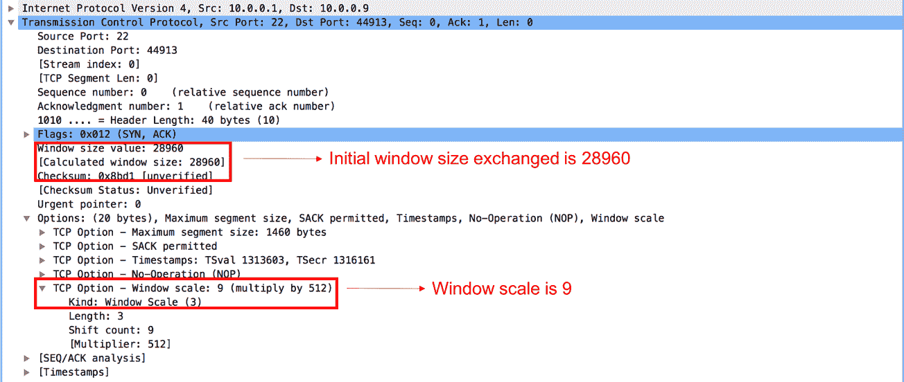

# 十一、传输层协议分析

在本章中，您将了解:

*   UDP 操作原理
*   UDP 协议分析及故障排除
*   TCP 操作原理
*   TCP 连接问题故障排除
*   TCP 重新传输问题疑难解答
*   TCP 滑动窗口机制
*   TCP 增强–选择性 ACK 和时间戳
*   TCP 吞吐量故障排除

# 介绍

在本章中，我们将主要关注 OSI 参考模型的传输层，并学习如何分析各种第 4 层协议(TCP/UDP/SCTP)的运行。传输层协议是主机到主机的通信协议，负责不同主机上运行的终端应用之间的数据交换。**用户数据报协议** ( **UDP** )是一种简单的无连接协议，它只是将数据报传递给预定的接收者，没有任何可靠性机制。另一方面，**传输控制协议** ( **TCP** )是面向连接的协议，其主要目的是在终端应用之间提供可靠的、拥塞感知的数据传输。

超过 80%的互联网总流量利用 TCP 作为传输层协议。任何对丢包敏感的终端应用都需要可靠性，这类应用使用 TCP 作为传输层协议。例如，使用 HTTP 的 web 服务器使用 TCP 端口`80`。虽然 TCP 提供了可靠性，但它需要重新传输丢失的数据；这可能会引入抖动和延迟。一些终端应用，如 IP 语音/视频，对丢包不太敏感，但对抖动/延迟更敏感。此类应用使用 UDP 而不是 TCP 作为传输层协议。

在本章中，我们将讨论不同传输层协议的基本原理、常见问题以及如何使用 Wireshark 来分析协议并排除故障。

# UDP 操作原理

UDP 是一种轻量级传输层协议，它基于最大努力工作。对于可以容忍数据包丢失的终端应用，或者如果可以在应用层考虑可靠性，UDP 是传输层协议的一个很好的选择。例如，**小文件传输协议** ( **TFTP** )，这是一个简单的文件传输协议，利用 UDP 作为传输层协议。TFTP 会对应用层收到的每个数据报块发送确认。因此，即使 UDP 没有内置的可靠性机制，这样的应用仍然可以使用 UDP 作为传输层协议。

对于 UDP，IP 报头的协议字段将被设置为`17`。UDP 报头的格式如下:

图 11.1: UDP 报头格式

发起 UDP 流的主机将使用从范围`1024`到`65535`的任何本地未使用的端口。目的端口将用于识别目的主机中的终端应用。目的港通常是从众所周知的`1`到`1023`。

下表列出了一些众所周知的 UDP 应用端口:

表 11.2:众所周知的 UDP 应用

以下是 Wireshark 捕获 UDP 数据包的示例:

图 11.3: UDP 数据包 Wireshark 捕获

# UDP 协议分析及故障排除

虽然大多数使用 UDP 的应用可以容忍数据包丢失，但是任何 UDP 流的大量数据包丢失都可能导致非常令人沮丧的最终用户体验。在本节中，我们将讨论 UDP 流故障的一些常见原因，以及如何使用 Wireshark 来分析和排除此类故障。

# 做好准备

当 UDP 流运行不正常时，第一步是确保到远程主机的网络连接工作正常。这可以通过使用实用工具(如 Ping 或 Traceroute)来验证。可以按照第 10 章、*网络层协议和操作*中的定义对网络连接中的任何故障进行故障排除。如果网络连接正常，我们执行以下步骤。

# 怎么做...

图 11.4: UDP 拓扑

在上图中，在 PC1 ( `10.1.100.101`)和 PC3 ( `10.1.200.101`)之间使用 UDP 流的终端应用运行不正常:

1.  确保防火墙或其他安全设置允许 UDP 端口。传输路径中或端点上不允许 UDP 端口的防火墙可能会丢弃数据包。
2.  获取 PC1 向其发送数据的 UDP 目的端口，并检查 PC3 上的相关 UDP 端口是否已打开以接收数据。这可以通过检查 PC3 上的进程或执行端口扫描来完成。

3.  当可以访问 PC3 时，可以在主机上直接使用`netstat` ，可以检查目的端口是否打开。
4.  当无法访问 PC3 时，可以使用端口扫描机制进行检查。有各种端口扫描工具可用于此目的。如果端口没有在 PC3 上打开，它将丢弃数据包并发送 ICMP 错误消息(目的端口不可达)。
5.  如果端口打开，下一步是执行 Wireshark 捕获和数据包分析。由于 UDP 是无连接的，因此建议在尽可能靠近两个端点的地方同时捕获数据包。

图 11.5 UDP 校验和

在前面的屏幕截图中，检查 UDP 校验和是否正确。如果校验和未通过验证，目的主机将会丢弃该数据包。由于 UDP 是无连接的，因此不会发送任何关于校验和错误的错误消息或确认。默认情况下，Wireshark 可能不会验证捕获中的校验和。这需要在工具中启用，如下所示:

1.  转到编辑并点击首选项。
2.  单击协议，然后选择 UDP。
3.  如果可能，设置验证 UDP 校验和。

4.  如果 UDP 校验和正常，比较两次捕获的 UDP 流，确保数据包到达目的地:

图 11.6: UDP 流索引

5.  Wireshark 允许我们跟踪特定的 UDP 流，该流可用于在捕获之间进行比较。每个捕获都有一个 UDP 流索引号，如前面的屏幕截图所示。这可以用作过滤器来跟踪 UDP 流。它基本上按接收顺序列出了具有相同源/目的 IP 和源/目的 UDP 端口的所有数据包。
6.  如果在比较的捕获中没有观察到问题，则可能是主机堆栈中的问题。

以下是一些有用的 UDP 过滤器:

# TCP 操作原理

TCP 是一种高度可靠的传输层协议，用于面向连接的主机到主机通信。对数据丢失非常敏感的终端应用可以利用 TCP 作为传输层协议。大多数互联网流量由 TCP 控制。它被许多应用广泛使用，包括电子邮件、对等文件共享和著名的 WWW 应用。TCP 从应用层接收数据，并将其分割成数据单元，这些数据单元将与 TCP 报头封装在一起。封装了 TCP 报头的协议数据单元称为**段**。如前所述，TCP 是面向连接的，因此将使用三次握手在端点之间建立连接。可靠性是通过确认每个数据段的接收方来实现的，任何丢失的数据段都将被重新传输。

对于 TCP，IP 报头的协议字段将被设置为`6`。TCP 报头的格式如下:

图 11.7: TCP 报头格式

与固定 8 字节报头的 UDP 报头相比，TCP 的大小为 20 字节。根据 TCP 选项的存在，大小可能会有所不同。序列号和确认号在为终端应用数据传输提供可靠性方面起着关键作用。更多细节将在接下来的食谱章节中介绍。

下表列出了一些众所周知的 UDP 应用端口:

表 11.8:众所周知的 UDP 应用

以下是 Wireshark 捕获 TCP 数据包的示例:

图 11.9: TCP 数据包捕获

# TCP 连接问题故障排除

当两个 TCP 进程希望通信时，它们打开连接，发送数据，然后关闭连接。当您打开浏览器连接到互联网，并从您的邮件客户端连接到邮件服务器，或者通过 Telnet 连接到您的路由器或任何其他通过 TCP 工作的应用时，就会发生这种情况。

当 TCP 打开连接时，它从源端口向目的端口发送一个打开连接的请求。在应用的建立或关闭过程中可能会出现一些问题。使用 Wireshark 来定位和解决这些问题是这个菜谱的目标。

# 做好准备

如果您遇到以下问题之一，请使用 Wireshark 找出原因。这些问题可能有多种类型，如下所示:

*   您尝试运行一个应用，但它不起作用。你试着浏览互联网，你没有得到任何回应。
*   您尝试使用您的邮件，但无法连接到邮件服务器。
*   问题可能是由简单的原因引起的，例如服务器关闭，应用没有在服务器上运行，或者网络在通往服务器的途中出现故障。
*   问题也可能是由更复杂的原因引起的，例如 DNS 问题、服务器上的内存不足使您无法连接(例如，由于应用的高内存消耗)、重复的 IP 以及许多其他原因。

在这个食谱中，我们关注这些去/不去的问题；它们通常很容易解决。

# 怎么做...

在这里，您将了解一些指标，以及使用 Wireshark 调试 TCP 连接问题时可以看到的情况。通常，这些问题会导致您尝试运行一个应用却没有任何结果。

当您尝试运行一个应用(例如，一个数据库客户端、一个邮件客户端、监视摄像机服务器等)而没有得到任何输出时，请按照下列步骤操作:

1.  验证服务器和应用正在运行。
2.  验证您的客户端正在运行，您已经配置了 IP 地址(手动或通过 DHCP)，并且您已连接到网络。
3.  对服务器执行 Ping 命令，并验证您已连接到该服务器。
4.  在捕获文件中，查找以下模式之一:
    *   没有响应的三次 SYN 消息
    *   **带有复位** ( **RST** )响应的 SYN 消息

在这两种情况下，可能是防火墙阻止了特定的应用，或者该应用没有运行。

在下面的截图中，我们看到了一个简单的例子，我们无法访问 web 服务器`81.218.31.171`(数据包`61`、`62`和`63`)。这可能是因为防火墙不允许，或者只是因为服务器有问题。我们也可以看到我们有一个到另一个网站的连接(`108.160.163.43`；数据包`65`、`66`、`67`)，所以连接问题只出在`81.218.31.171`上。

在下图中，我们看到了相同情况的一个稍微复杂一点的例子。在这种情况下，我们有一个摄像机服务器，客户希望登录并在远程站点上观看摄像机。摄像机的服务器有 IP 地址`135.82.12.1`，问题是客户可以通过登录窗口获得服务器的主网页，但无法登录系统。在下面的截图中，我们可以看到我们打开了一个到 IP 地址`135.82.12.1`的连接。我们可以看到一个到 HTTP 服务器的 TCP 连接已经打开，起初看起来没有连接问题:

当我们将所有流量过滤到 IP 地址`135.82.12.1`，即摄像机服务器时，问题就出现了。

在这里，我们可以看到，当我们尝试连接到 TCP 端口`6036`时，我们得到一个 RST/ACK 响应，这可能是由于以下原因:

*   阻止端口`6036`的防火墙(这里就是这种情况)
*   当配置了**端口地址转换** ( **PAT** )并且我们只转换端口`80`而不转换`6036`时
*   用户名和密码的验证是在 TCP 端口`6036`上完成的，防火墙只允许端口`80`，验证被阻止，应用无法工作

总而言之，当您无法连接到服务器时，请检查服务器和客户端，查看是否所有的 TCP/UDP 端口都在整个网络中转发，以及是否有您不知道的端口。

在某些情况下，当您在网络中安装新的应用时，最好连接客户端和服务器上的 Wireshark，并检查它们之间实际运行的内容。软件公司不会总是告诉你他们实际上在网络上传输什么(有时这是因为他们不知道！)和防火墙可以阻止你不知道的信息。

# 它是如何工作的...

启动 TCP 连接，如下图所示:

它分三步进行:

1.  客户端的 TCP 进程发送一个 SYN 数据包。这是一个 SYN 标志设置为`1`的数据包。在此数据包中，客户端:
    *   指定其初始序列号。这是客户端发送给服务器的第一个字节的编号。
    *   指定其窗口大小。这是客户端分配给进程的缓冲区(在客户端 RAM 中的位置)。
    *   设置它将使用的选项:MSS、选择性 ACK 等。
2.  当服务器接收到建立连接的请求时，服务器:
    *   向客户端发送 SYN/ACK 数据包，确认接受 SYN 请求。
    *   指定服务器的初始序列号。这是服务器发送给客户端的第一个字节的编号。
    *   指定服务器的窗口大小。这是服务器分配给进程的缓冲区大小(在服务器 RAM 中的位置)。
    *   响应请求的选项，并在服务器端设置选项。
3.  当接收到服务器的 SYN/ACK 时，客户端:
    *   向服务器发送 ACK 数据包，确认接受来自服务器的 SYN/ACK 数据包。
    *   指定客户端的窗口大小。这是客户端分配给进程的缓冲区大小。虽然这个参数是在第一个数据包(SYN 数据包)中定义的，但是服务器将引用这个参数，因为它是服务器接收到的最新窗口大小。

在 TCP 报头的选项字段中，我们有以下主要选项:

*   **最大段尺寸** ( **MSS** ):这是 TCP 数据报的最大尺寸，也就是从 TCP 头开始到整个包结束的字节数。
*   **窗口大小** ( **WSopt** ):该因子与 TCP 报头中的窗口大小字段相乘，以通知接收方有更大的缓冲区。由于标头中的最大窗口大小是 64 KB，因此因子 4 等于 64 KB 乘以 4，即 256 KB 的窗口大小。
*   **SACK** :选择性确认(Selective ACK)是一个选项，使连接双方能够确认特定的数据包，所以当单个数据包丢失时，只会再次发送这个数据包。连接双方必须就连接建立中的 SACK 达成一致。
*   **时间戳选项** ( **TSopt** ):这个参数在本章前面已经解释过了，指的是客户端和服务器之间的延迟测量。

到了这个阶段，双方:

*   同意建立联系
*   知道对方的初始序列号
*   知道对方的窗口大小

在建立连接时，除了完全的三次握手之外的任何事情都应该被认为是一个问题。这包括没有响应的 SYN、SYN 然后 SYN/ACK 和没有最后 ACK、用复位(RST 标志等于 1)应答的 SYN 等等。

Wireshark 允许用户以图形方式查看 TCP 数据段交换的完整流程。示例如下:

要查看上述格式的 TCP 流，请单击属于该 TCP 流的一个数据包，并执行以下操作:

1.  转到统计
2.  点击流程图

# 还有更多...

一些经验法则如下:

*   如果一个 SYN 数据包被 RST 应答，查找阻止端口号的防火墙。
*   没有任何响应的三重 SYN 的出现，要么是由于应用没有响应，要么是防火墙阻止了特定端口上的请求。
*   始终验证您是否拥有**网络地址转换** ( **NAT** )、端口转发以及使用 TCP 或 UDP 端口的机制。这些机制会干扰 TCP 的标准操作。

当 TCP 端点建立新的 TCP 连接时，SYN 数据包中的序列号将以任意数字开始，并且每 1 个字节递增 1。为了便于分析，Wireshark 将序列号替换为相对序列号，使得 SYN 数据包从序列号 0 开始，并按顺序递增。

在前面的截图中，可以观察到序列号被设置为 0，并标记为(相对序列号)。这不是 TCP 端点交换的真实序列号。通过禁用协议首选项中的相对序列号选项，可以保留原始序列号。

请按照下列步骤禁用该选项:

1.  前往偏好设置
2.  点击协议，然后选择 TCP
3.  禁用相对序列号

# TCP 重新传输问题疑难解答

当 TCP 发送一个包或一组包时(参考*它是如何工作的...在这个配方的末尾，它等待一个确认来确认这些包的接受。重传显然是由于没有到达的分组或者没有按时到达的确认而发生的。这可能有各种各样的原因，找到正确的原因是这个食谱的目标。*

# 做好准备

当您发现网络变慢时，原因之一可能是重新传输。将端口镜像中的 Wireshark 连接到可疑的客户端或服务器，并观察结果。

在本菜谱中，我们将看到 Wireshark 可能会遇到的一些常见问题以及这些问题的含义。

# 怎么做...

让我们开始吧:

1.  开始在相关接口上捕获数据。
2.  转到分析|专家信息菜单。
3.  在“注释”下，查找重新传输。
4.  您可以单击(+)号，将会打开一个重新传输列表。在每一行上单击鼠标，就会在数据包捕获窗格中显示重新传输。
5.  现在重要的问题来了:如何定位问题？

当您通过通信线路、服务器接口、互联网链接或任何其他线路捕获数据包时，您可能会收到来自多个 IP 地址、多个应用甚至每个应用上特定程序的流量。例如，在数据库应用中访问特定的表。这里重要的是定位发生重新传输的 TCP 连接。

您可以通过以下方式查看重新传输的来源:

*   在专家信息窗口中逐个移动数据包，并在数据包捕获窗格中找出哪些数据包(适合有经验的用户)
*   在 packet 窗格中，您可以配置显示过滤器`expert.message == "Retransmission (suspected)"`，您将在捕获文件中获得所有的重新传输
*   应用过滤器，然后在“Statistics à Conversations”窗口的右下角选中“Limit to display filter”部分

# 案例 1–向多个目的地重新传输

在下面的屏幕截图中，您可以看到我们已经在许多服务器之间进行了多次重新传输，目的端口为`80` (HTTP)。从这里我们还可以看到的是`10.0.0.5`端口发送重传；因此，数据包在通往互联网的途中丢失了，或者网络服务器没有及时发回确认信息。

嗯，很明显网络线路出了问题。我们怎么知道它是什么？

1.  从统计菜单中，打开 IO 图。
2.  在这种情况下(情况 1)，我们可以看到该行几乎是空的。这可能是一个错误或另一个加载到互联网上的线路。
3.  您可以通过登录到通信设备或任何 SNMP 浏览器(当设备上配置了 SNMP 代理时)来检查丢包和导致丢包的错误。查看以下截图供参考:

# 情况 2–单个连接上的重新传输

如果所有的重新传输都在一个 IP 上，只有一个 TCP 端口号，这将是一个缓慢的应用。我们可以在下面的截图中看到这一点:

对于单个连接上的重新传输，请执行以下步骤:

1.  我们也可以通过从“统计”菜单打开“对话”并选择“限制显示过滤器”复选框来验证这一点。我们将获得所有有重新传输的会话，在这种情况下，只有一个会话。
2.  通过选择 IPv4:1 选项卡，如下面的屏幕截图所示，我们将看到我们从哪些 IP 地址获得重新传输:

3.  通过选择 TCP:6 选项卡，如下图所示，我们将看到从哪个端口号(或应用)获得重新传输:

要找出问题，请执行以下步骤:

1.  查看 IO 图，确保线路不忙。

繁忙通信线路的指示将是非常接近线路最大带宽的直线。例如，如果您有一条 10 Mbps 的通信线路，您可以对其进行端口镜像，并在 IO 图中看到一条接近 10 Mbps 的直线。这是负载线的良好指示。一条非繁忙的通信线路会有许多起伏、峰值和空白间隔。

2.  如果线路不忙，这可能是 IP 地址`10.1.1.200`的服务器上的问题(`10.90.30.12`正在发送大部分重新传输，因此可能是`10.1.1.200`响应缓慢)。
3.  从数据包窗格中，我们可以看到该应用是 FTP-DATA。FTP 服务器可能在活动模式下工作。因此，我们在一个端口(`2350`)上打开了一个连接，服务器将端口更改为`1972`，因此它可能是一个缓慢的无响应 FTP 软件(这最终是这里的问题)。

# 案例 3–重传模式

在 TCP 重传中需要注意的一件重要事情是，重传是否有你可以看到的任何模式。

在下面的屏幕截图中，我们可以看到所有的重新传输都来自单个客户端和服务器上的 NetBIOS 会话服务(TCP 端口`139`)之间的单个连接。

看起来像是一个简单的服务器/应用问题，但是当我们查看数据包捕获窗格时，我们可以看到一些有趣的东西(参考下面的截图):

有趣的是，当我们观察重新传输的模式时，我们可以看到它们每 30 毫秒循环发生一次。这里的时间格式是秒，因为之前显示的数据包和时间刻度都是以秒为单位的。

这个案例中的问题是，一个客户在软件中执行了一个财务程序，导致软件每 30-36 毫秒变慢一次。

# 案例 4–由于无响应的应用导致的重新传输

重新传输的另一个原因可能是客户端或服务器没有响应请求。在这种情况下，您将看到五次重新传输，时间差不断增加。在这五次连续的重新传输之后，发送方认为连接丢失(在某些情况下，将发送 reset 来关闭连接，这取决于软件实现)。断开连接后，可能会发生两件事:

*   客户端将发送一个 SYN 请求来打开一个新的连接。在这种情况下，用户将看到应用冻结，15-20 秒后，它将再次开始工作。
*   不会发送 SYN，用户将不得不再次运行应用(或它的特定部分)。

在下面的截图中，我们可以看到一个打开新连接的情况:

# 情况 5 -由于延迟变化导致的重传

TCP 是一种只要延迟不变就能容忍延迟的协议。当延迟发生变化时，您可以期待重新传输。确定这是否是问题所在的方法如下:

1.  当然，首先要做的是 ping 目的地，并获得通信线路延迟的第一条信息。看看*它是如何工作的...*一节看看应该怎么做。
2.  检查延迟变化，这可能是由于以下原因造成的:
    *   不稳定或繁忙的通信线路。在这种情况下，您将使用`ping`命令看到延迟变化。它通常发生在带宽较窄的线路上，有时也发生在蜂窝线路上。
    *   负载过重或效率低下的应用。在这种情况下，您将只看到这个特定应用的许多重新传输。
    *   加载的通信设备(CPU 负载、缓冲器负载等)。您可以通过直接访问通信设备来检查这一点。
3.  使用 Wireshark 工具，如第 18 章、*中所述，排除带宽和延迟问题*。

TCP 重新传输的底线是，只要我们没有太多的重新传输，重新传输是 TCP 的自然行为。当重新传输约为 0.5%时，性能将开始下降，而断开连接将在约为 5%时开始。它还取决于应用及其对重传的敏感性。

# 找出它是什么

当您在通信链路(到互联网、服务器、站点之间或任何其他链路)上看到重新传输时，请执行以下步骤:

1.  找到问题所在。是特定的 IP 地址，特定的连接，特定的应用，还是其他什么问题？
2.  检查问题是由于通信链路、数据包丢失还是服务器或 PC 速度慢。检查应用是否缓慢。
3.  如果不是由于上述原因，请检查延迟变化。

# 它是如何工作的...

我们来看看 TCP 的常规操作，以及可能出现的问题的原因。

# TCP 序列/确认机制的常规操作

TCP 内置的机制之一是重新传输机制。这种机制支持恢复损坏、丢失、重复或无序交付的数据。

这是通过给每个传输的字节分配一个序列号，并期待来自接收方的**确认** ( **ACK** )来实现的。如果在超时间隔内没有收到 ACK，数据将被重新传输。

在接收端，序列号用于验证信息是否按照发送的顺序到达。如果没有，请将其重新排列到之前的状态。

该机制的工作原理如下:

1.  在连接建立时，双方告诉对方他们的初始序列号是多少。
2.  发送数据时，每个数据包都有一个序列号。序列号表示 TCP 有效负载中第一个字节的编号。发送的下一个包将具有前一个包的序列号加上前一个包中的字节数加 1(在下一个屏幕截图中)。

3.  当一个包被发送时，**重传超时** ( **RTO** )计数器开始从它被发送的时刻开始计数时间。

重传超时计时器基于 Van Jacobson 拥塞避免和控制算法，该算法基本上认为 TCP 可以容忍高延迟，但不能容忍快速延迟变化。

4.  当接收方收到数据包时，它会用 ACK 数据包进行应答，告知发送方发送下一个数据包。在下面的截图中，您将看到它是如何工作的:

从这里可以看到`10.0.0.7`正在从`62.219.24.171`下载一个文件。该文件通过 HTTP 下载(Wireshark 窗口被配置为显示编辑|首选项列配置中的`tcp.seq`和`tcp.ack`，如[第 1 章](53577c40-0245-4671-90d7-f42cc1c89cb1.xhtml)、*Wireshark v2 简介*中所述)。

从这里，`62.219.24.171`发送序列号以`85101, 86557`结尾的数据包，之后`10.0.0.7`发回一个 ACK，告诉发送者发送以`88009`结尾的数据包。然后发送者发送它。诸如此类。

你可以在这里看到一个例子:

# 什么是 TCP 重新传输，它们会导致什么？

当数据包确认丢失或 ACK 没有按时到达时，发送方将执行两项操作:

*   再次发送数据包，如本菜谱前面所述
*   降低吞吐量

在下一个屏幕截图中，我们看到了一个降低发送方吞吐量的重新传输示例(为清晰起见，添加了红色细线):

# 还有更多...

TCP 可以容忍高延迟，只要它们相当稳定。定义 TCP 在延迟变化下的行为的算法被称为 **Van Jacobson** 算法，以其发明者的名字命名。Van Jacobson 算法允许高达平均延迟 3-4 倍的容差；因此，例如，如果您有 100 毫秒的延迟，那么 TCP 将容忍高达 300-400 毫秒的延迟，只要它们不经常改变。

# 请参见

*   你可以在 http://ee.lbl.gov/papers/congavoid.pdf 查看范·雅各布森算法

# TCP 滑动窗口机制

当端点建立 TCP 会话时，TCP 报头中的窗口大小字段将用于通知接收缓冲区容量，并控制可以接收和处理的数据量。每个端点将维护一个本地**接收窗口** ( **RWND** )。这是接收器可以接收用于缓冲和处理的最大数据量。端点会将此 RWND 值包含在 TCP 报头中。发送方使用 RWND 作为输入来决定滑动窗口的大小。它可以在等待确认之前向窗口大小中定义的对等体发送 TCP 数据段。

发送方端点通过管理等待确认的未完成 TCP 数据段的数量来维护滑动窗口。当发送方收到已发送数据段的 ACK 并等待确认时，它会向右滑动窗口。

如果没有滑动窗口机制，TCP 发送方将会一次发送一个数据段，并在发送下一个数据段之前等待确认，从而对整个 TCP 吞吐量产生重大影响。

# 做好准备

连接服务器上的 Wireshark 并捕获数据包。通过过滤特定的 TCP 流来分析滑动窗口行为要容易得多。为了跟踪特定的流，选择要分析的流的第一个 TCP 包(SYN 包),并执行以下操作:

1.  去分析
2.  选择关注
3.  选择 TCP 流

# 怎么做...

在以下拓扑中，PC1 正在与 PC3 建立 TCP 会话以传输数据。

检查 TCP 端点是否正在用大于 0 的值交换 TCP 窗口大小。如果窗口大小设置为 0，接收器将无法接收任何流量，数据传输将会失败。

前面是 TCP 零窗口的一个例子。接收节点(`10.0.0.9`)不能接受任何新的会话或数据，因此当它从任何对等方接收到新 TCP 会话的 SYN 段时，它用 SYN，ACK 段进行回复，并将窗口大小设置为 0。通常情况下，一旦接收器准备好接收额外数据，这种情况就会自行纠正。当接收方发送零窗口消息时，看到发送方发送 **TCP 零窗口探测**是正常的。这是发送方发送的消息，用于查看接收方的零窗口条件是否仍然为真。对于从 TCP 零窗口消息的接收器接收的每个响应，它在发送下一个探测消息之前指数地递增计时器。

如果数据包捕获持续显示接收方正在以窗口大小为 0 发送，则可能表明终端服务器运行不正常，或者传入端口缓冲区已满或被阻塞，可能需要在服务器端进行额外的分析来解决任何问题。

一旦服务器上的问题得到解决，它应该能够协商正确的窗口大小。在前面的示例中，`10.0.0.1`在 SYN，ACK 段中使用非零窗口大小进行回复。可以注意到，服务器还包括一个 TCP 选项，它携带值为`9`的窗口比例。TCP 对等体将使用窗口大小和窗口比例的组合来识别滑动窗口大小。关于窗口缩放的更多细节在*中...*一节。

在所有后续数据包中，每个对等体都将包括窗口大小，对等体将使用该窗口大小来放大或缩小滑动窗口大小。

# 它是如何工作的...

TCP 滑动窗口机制的工作原理如下:

1.  连接建立后，发送方向接收方发送数据，填满接收方窗口。
2.  几个数据包之后，接收方向发送方发送 ACK，确认接收到发送方发送的字节。发送 ACK 会清空接收器窗口。
3.  当发送方填充窗口时，这个过程是连续的，接收方清空窗口并发送信息确认。
4.  增大接收方窗口大小会告诉发送方增加吞吐量，而减小接收方窗口大小会告诉发送方减少吞吐量。它根据以下 WS/RTT 规则工作(根据 TCP 版本有一些变化):

TCP 报头中的窗口大小字段以字节表示，并且该字段是允许携带最大值 65，535 的 16 位字段。对于大多数硬件，可以处理超过 65，535 字节的 TCP 数据段。为了发出大于 65，535 的窗口大小的信号，在初始 TCP 三次握手期间包括 TCP 窗口比例。TCP 对等使用窗口大小值和比例值来导出窗口大小。

例如，当窗口大小设置为 457 并且比例值设置为 6 时，滑动窗口将被计算为 29，248 字节。

Wireshark 计算滑动窗口，并将其显示为前面示例中突出显示的内容。

# TCP 增强–选择性 ACK 和时间戳

一段时间以来，已经引入了各种 TCP 增强来增强 TCP 性能。在本节中，我们将讨论这些重要的增强功能，并了解如何使用 Wireshark 进行分析。

# 做好准备

当您观察到 TCP 流性能下降并且不能按预期工作时，请连接 Wireshark 以捕获 TCP 流进行分析。

# 怎么做...

为了向后兼容，类似于**选择性确认** ( **SACK** )或 TCP 时间戳的功能增强将在最初的三次握手期间进行协商。TCP 端点将在 SYN 和 SYN/ACK 数据包中包含相关的 TCP 选项。

# TCP 选择性确认选项

TCP SACK 是一个 TCP 选项，将包含在 SYN 和 SYN/ACK 段中。当 TCP 端点启用了 TCP SACK 功能时，端点通过在 SYN 数据包中包含该功能来通知对等端的能力。

如前例所示，TCP SACK 选项将出现在 SYN 和 SYN/ACK 数据段中。如果在捕获中没有看到此 TCP 选项，请确保在 TCP 端点上启用了该功能。根据供应商和平台的不同，默认情况下可能会启用此功能。

当接收方想要选择性地确认某些数据段时，它会在 SACK 选项中包含相关的序列号。在前面的例子中，接收方确认它正在等待序列号为`3321`的数据段。但也包括同一段中序号为`3845`到`4369`的 SACK。关于 SACK 如何工作的更多细节，请查看*它是如何工作的...*一节。

# TCP 时间戳选项

与 TCP SACK 一样，TCP timestamp 是一个 TCP 选项，将包含在 SYN 和 SYN/ACK 数据段中。当 TCP 端点启用了 RTT 测量功能时，端点会向对等方发出在 SYN 数据包中包含 TCP 时间戳的信号。当两个端点都支持此功能时，发送方将在转发给对等方的所有数据段中包含 TCP 时间戳选项。

如前例所示，TCP 时间戳选项将出现在 SYN 和 SYN/ACK 数据段中。如果在捕获中没有看到此 TCP 选项，请确保在 TCP 端点上启用了该功能。根据供应商和平台的不同，默认情况下可能会启用此功能。

如前面的屏幕截图所示，发送方在发送数据段时会在 TSval 字段中包含当地时间。发送方将在**时间戳回应回复** ( **TSecr** )中包含一个零值。

接收方应仅在 Ack 包中包含 TSecr。如前面的示例所示，接收方在回复时包含了 TSecr 和 TSval。发送方将使用这两者的组合来导出 RTT 值。关于该功能的更多细节，请参见*它是如何工作的...*一节。

# 它是如何工作的...

# TCP 选择性确认

在前面几节中，我们讨论了 TCP 序列号和确认号如何帮助为最终应用提供可靠性。但是默认确认和重传行为不是吞吐量有效的，这是由于 TCP 要求从滑动窗口内的丢失段重传所有段的性质。下面的插图有助于我们更好地理解默认行为。

举例来说，我们使用一个窗口大小为五段的 TCP 会话。根据窗口大小，发送方在等待确认之前可以发送五个数据段。因此，它发送五个段，其中 *seq=2，3，4，5，6* 。接收器已经接收到具有*序列=2，4，5，6* 的段，但是它没有接收到具有*序列=3* 的段。发送 ACK 时，接收器发送 *ack=3* 。如前所述，ender 不仅会重新传输带有 *seq=3* 的段，还会重新传输窗口中的剩余段。

这会导致重复数据段的重新传输，从而导致吞吐量问题。

选择性确认通过允许接收器选择性地确认不连续的数据段来解决这个问题。TCP SACK 是一个 TCP 选项，将在初始 TCP 三次握手期间进行协商。

在同一个示例中，发送方和接收方都启用了 TCP SACK。请注意，TCP SACK 将包含在 SYN 数据段中，以向对等方发送信号。使用相同的例子，当接收器没有接收到具有 *seq=3* 的段时，它发送具有 *ack=3* 的 ack 段，但是它还包括针对 4、5、6 的选择性 ACK。这将指示发送方只发送丢失的数据段，而不重新传输其他接收到的数据段。这避免了重复，并有助于提供高效的吞吐量。

# TCP 时间戳

某些终端应用受益于连续的**往返时间**(**)测量。RTT 测量通过利用 TCP 时间戳选项来执行。TCP 时间戳选项将包含在所有数据段中。该选项带有两个字段，即 TSval 和 TSecr。发送方将在 TSval 字段中包含发送数据段的本地时间，TSecr 将被设置为 0。接收方在确认数据段后，会在 TSval 中包含本地时间，并包含来自发送方的最后一个接收数据段的 TSval。**

 **发送方将在 ACK 段中使用 TSval 和 TSecr 的组合来计算 RTT。为了效率，大多数实现将在每个窗口中一个或两个段中执行 RTT 测量，而不是在每个段的基础上执行。**  **# 还有更多...

虽然上一节讨论了几个 TCP 选项，但是还有更多这样的选项用于不同的目的。以下是几个选项:

*   TCP 认证
*   最大段尺寸
*   TCP 压缩过滤器
*   多路径 TCP

# TCP 吞吐量故障排除

行业中有各种工具可用于执行网络吞吐量测量，这些工具本质上更多是带外的。此类工具建立测试 TCP 会话，并由监视器执行。虽然这些工具很有用，但性能计算是在生产流量上进行的。使用 TCP 作为传输协议的 SLA 受限的终端应用需要一种机制来确保 TCP 流达到期望的吞吐量。为了证实这一点，我们需要一种简单有效的机制来测量每个 TCP 流的吞吐量。这可以用于各种目的，包括性能基准测试、基于 SLA 的服务保证等等。

有许多原因可能会影响 TCP 吞吐量的性能，其中一些原因已在前面的章节中讨论过，如重新传输、会话重置。在本节中，我们将讨论如何使用 Wireshark 来执行 TCP 吞吐量测量和分析。

# 做好准备

为了执行吞吐量测量，您必须做的第一件事是捕获流。您可以在终端服务器(如果支持的话)或传输路径上执行捕获。如前所述，使用相关过滤器仅显示要测量的 TCP 流。

# 怎么做...

1.  检查正在测量的 TCP 流的吞吐量。这是通过过滤相应的 TCP 流，然后检查 IO 图的吞吐量来实现的。以下是查看吞吐量图表的步骤。
2.  转到统计并选择 IO 图形**。**
3.  现在用`tcp.stream == <stream number>`过滤器创建一个新图形。
4.  示例如下所示:

5.  如果输出中显示的吞吐量符合预期，我们可以得出结论，该流工作正常。如果吞吐量不如预期，我们需要如下的额外分析。
6.  检查窗口大小是否协商为更大的大小。如果 RWND 较小，可能会导致吞吐量较低，因为发送方将在滑动窗口内等待数据段的确认。

7.  获取 TCP 流的专家信息，并检查不同错误和警告的数量。这有助于理解吞吐量的可能原因。有关专家信息的更多详情，请阅读[第 6 章](ec022445-b229-4794-899a-207790a42f39.xhtml)、*使用高级统计工具*。

8.  在上图中，可以注意到有 173 个缺失数据段的实例和多个重复数据段的实例。专家信息将帮助我们提供诸如无序段、连接重置、零窗口等错误。
9.  如果有许多`[TCP Retransmission]`丢失数据段的实例，网络中可能会有一些数据包丢失。使用`ping`等网络连接检查工具来验证底层网络的健康状况。或者，在网络中的多个捕获点上捕获流将有助于缩小丢弃节点的范围。

10.  如果存在大量无序分组的情况，则属于同一流的分组可能采用具有不同延迟/抖动的不同路径。理想情况下，路径上的所有节点将在流级别执行负载平衡，以便属于同一流的所有数据包将始终遵循同一路径。在涉及链路抖动(间歇或连续)或任何传统节点的情况下，执行每分组负载平衡可能会导致这种无序分组。
11.  如果有许多 TCP 窗口满错误的实例，接收节点就不能以发送方发送的速率处理数据包。如果问题持续存在，可能需要在接收端仔细调整 RWND。
12.  可以在端点上启用一些 TCP 增强功能，如更高的 RWND 大小、选择性 ACK、快速重传，以提高整体吞吐量。

# 它是如何工作的...

TCP 吞吐量没有特定的工作机制。TCP 吞吐量是端点上启用的各种 TCP 功能的结果。这些不同的特性是如何工作的已经在不同的*工作原理中介绍过了...*TCP 主题下的部分。**