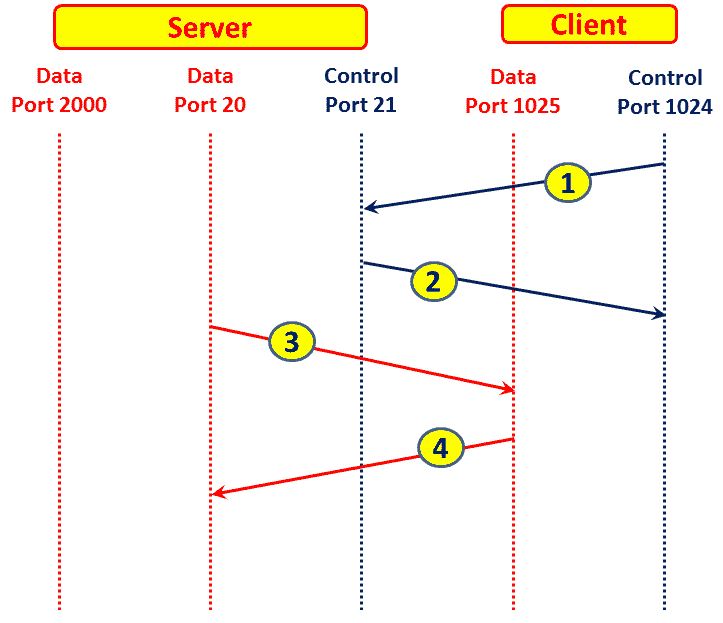

# 十二、FTP、HTTP/1 和 HTTP/2

在本章中，我们将讨论以下主题:

*   分析 FTP 问题
*   过滤 HTTP 流量
*   配置 HTTP 首选项
*   分析 HTTP 问题
*   导出 HTTP 对象
*   HTTP 流量分析
*   分析 HTTPS 流量-SSL/TLS 基础知识

# 介绍

FTP 是为通过 TCP/IP 在网络上传输文件而创建的协议。它是一种协议，分别在数据和控制连接的 TCP 端口`20`和`21`上运行。

HTTP 和 HTTPS 都用于浏览互联网，或者连接到组织内部或云中托管的其他软件。当我们使用 SSL/TLS 保护 HTTP 时，使用 HTTPS 来保护明文数据交换免受入侵和黑客攻击。当连接到您的银行、邮件帐户(例如，Gmail)或任何其他安全应用时，会用到它。

从 1991 年开始，HTTP 经历了不同的版本，如 0.9、1.0、1.1 和 2015 年发布的最新 v2.0。

在本章中，我们将讨论这些协议，它们是如何工作的，以及如何使用 Wireshark 来查找网络中的常见错误和问题。

# 分析 FTP 问题

FTP 有两种操作模式:

*   **主动模式(ACTV)** :在这种模式下，客户端向服务器发起控制连接，服务器向客户端发起数据连接
*   **被动模式(PASV)** :在这种模式下，客户端向服务器发起控制和数据连接

这两种类型的连接都可以实现，它们将在本菜谱的*工作原理中解释...*一节。

# 做好准备

使用 FTP 时，如果您怀疑存在任何连接或响应缓慢的问题，请将端口镜像配置为以下选项之一:

*   FTP 服务器端口
*   客户端端口
*   流量穿过的链路

如果需要，配置捕获或显示过滤器。

# 怎么做...

要检查 FTP 性能问题，请按照下列步骤操作:

1.  首先，如前几章所述，检查任何以太网、IP 或 TCP 问题。在许多情况下，响应缓慢是由于网络问题，而不一定是由于应用问题。在客户端和服务器之间执行简单的 ICMP ping(数据包较大，比如 1，500 字节)，因为它有助于发现路径上是否有任何延迟或故障。
2.  检查 TCP 重新传输和重复的 ack。检查它们是在整个流量上还是仅在 FTP 连接上:
    *   如果您在各种连接上收到它，这可能是由于影响整个流量的慢速网络造成的
    *   如果您只在同一个服务器或客户端的 FTP 连接上得到它，这可能是由于服务器或客户端速度太慢

3.  当您在 FTP 文件传输中复制单个文件时，您应该在 I/O 图中得到一条直线，在 TCP 流图(时间序列)中得到一个直线梯度。
4.  在这个截图中，我们可以看到一个坏的 FTP 在 TCP 流图中的样子(时序):

图 12.1:失败的 FTP-TCP 流图

5.  在下面的屏幕截图中，我们可以看到它在 I/O 图中的样子(配置了过滤器):

图 12.2:失败的 FTP-I/O 图形

6.  在下面截图显示的捕获文件中，我们可以看到 TCP 窗口问题。这些因素如下:
    *   服务器`15.216.111.13`向客户端发送 TCP 窗口已满消息，表示服务器发送窗口已满(数据包`5763`)。
    *   客户端`10.0.0.2`向服务器发送 TCP 零窗口消息，告知服务器停止发送数据(数据包`5778`)。
    *   服务器不断向客户端发送 TCP 零窗口探测消息，询问客户端条件是否仍然是零窗口(这告诉服务器不要再发送任何数据)。客户端用 TCP 零窗口探测 Ack 来回答这些消息，表明情况仍然如此(数据包`5793`到`5931`)。
    *   过了一会儿，客户端向服务器发送消息 TCP 窗口更新，告诉它开始增加 FTP 吞吐量(数据包`5939`)。

图 12.3:失败的 FTP 慢速客户端

7.  在前一种情况下，它只是一个慢速客户端。我们通过修改和删除一些不必要的程序解决了这个问题。

如果您遇到连接问题，可能是由于服务器无法正常工作，防火墙阻止了连接，或者服务器或客户端上安装的软件阻止了连接。在这种情况下，请执行以下步骤:

1.  对于`SYN` / `SYN-ACK` / `ACK`数据包，TCP 连接是否正确打开？如果没有，可能是由于以下原因:
    *   阻止通信的防火墙。请咨询系统管理员。
    *   没有运行的服务器。在进程表、FTP 服务器管理等服务器上检查这一点。
    *   服务器的一个软件阻塞了连接。它可以是具有阻止连接的附加防火墙的防病毒软件、VPN 客户端或任何其他安全或保护软件。
    *   还要检查客户端的连接。它可能被 VPN 客户端、客户端上的防火墙等阻止。

2.  在主动模式下，客户端打开与服务器的连接，服务器打开另一个连接。确保途中的防火墙支持它，或者使用被动模式。

# 它是如何工作的...

FTP 有两种模式:主动和被动。在主动模式下，服务器打开到客户端的另一个连接，而在被动模式下，是客户端打开到服务器的第二个连接。让我们看看它是如何工作的。

在被动模式下，操作如下图所示:

图 12.4: FTP 被动模式步骤

这些内容如下所述:

1.  客户端打开从随机端口 *P* (示例中为`1024`)到服务器端口`21`的控制连接
2.  服务器从端口`21`应答回客户端端口`1024`
3.  现在，客户端打开从端口 *P* + *1* (在示例中为`1025`)到服务器已经打开并通知客户端的数据端口(在示例中为端口`2000`)的数据连接
4.  服务器从数据端口(本例中为`2000`)应答发起连接的客户端端口，即数据端口 *P* + *1* (本例中为`1025`)

在主动模式下，操作略有不同:

1.  客户端打开从随机端口 *P* (示例中为`1024`)到服务器端口`21`的控制连接
2.  服务器从端口`21`应答到客户端端口`1024`
3.  服务器打开从端口`20`到客户端端口 *P* + *1* (示例中为`1025`)的数据连接
4.  客户端从数据端口 *P* + *1* (例子中为`1025`)到服务器端口`20`应答

图 12.5: FTP 主动模式步骤

# 还有更多...

FTP 是一个非常简单的应用，在大多数情况下，FTP 问题都有非常简单的解决方案。一些例子如下:

*   **问题 1** :我监测到一个国际连接，在网络的一端是 FTP 客户端，另一端是 FTP 服务器。客户抱怨运行缓慢，并指责国际服务提供商。当我向服务提供商询问时，他们说连接几乎没有负载(10 Mbps 线路的使用率只有 20%)，当我检查线路时，我证实了这一事实。当我查看 TCP 问题(重新传输、窗口问题等等)时，没有任何问题。只是检查一下，我把 FTP 服务器拆了，装了另一个(有很多免费的)，就开始工作了。这是一个低效率的 FTP 服务器的简单问题。
*   **问题 2** :一位客户抱怨说，当连接到一个 FTP 服务器时，每尝试五六次后，连接都被拒绝。当我用 Wireshark 检查时，我看到 FTP 连接拒绝消息(我已经从客户的投诉中知道了这一点)，所以它看起来像一个死胡同。只是为了检查，我开始停止服务器上运行的服务，问题就出来了。是一个反病毒软件干扰了这个特定的 FTP 服务器。

底线是:即使使用 Wireshark(和其他软件)，有时常识会给你更多的帮助。

# 过滤 HTTP 流量

可以为 HTTP 配置许多过滤器。在这个菜谱中，让我们集中讨论在这个上下文中最常用的显示过滤器。

# 做好准备

按照前面的方法配置端口镜像，并快速浏览一下[第 3 章](e4284eda-b4bf-4118-9733-c2ec55d1af4c.xhtml)，*使用捕获过滤器*。

# 怎么做...

要配置 HTTP 过滤器，可以直接在显示窗口栏写过滤器表达式；打开表达式窗口，通过右键单击数据包窗格中所需的参数来选择 HTTP 参数(如[第 4 章](297ea816-d45a-4111-9c4a-3c33e5ced6da.xhtml)、*使用显示过滤器*所述)。

可以在 HTTP 上配置各种过滤器。

基于名称的过滤器如下:

*   **对特定网站的请求** : `http.host == "www.packtpub.com"`
*   **对包含单词 PacktPub** 的网站的请求:`http.host contains "packt.pub"`
*   **从 PacktPub** 转发的请求:`http.referer == http://www.packtpub.com/`

请求方法过滤器如下:

*   **所有获取请求** : `http.request.method == GET`
*   **所有 HTTP 请求** : `http.request`
*   **所有 HTTP 响应** : `http.response`
*   **所有未获得的 HTTP 请求** : `http.request and not http.request.method == GET`

错误代码过滤器:

*   **HTTP 错误响应(代码 4xx 表示客户端错误，代码 5xx 表示服务器错误)** : `http.response.code >= 400`
*   **HTTP 客户端错误响应** : `http.response.code >= 400`和`http.response.code <= 499`
*   **HTTP 服务器错误响应** : `http.response.code >= 500`和`http.response.code <= 599`
*   **HTTP 响应代码 404(未找到)** : `http.response.code == 404`

当您配置一个简单的过滤器如`http.host == packtpub`时，您不需要在`""`字符中关闭它。如果你需要一个更复杂的字符串，比如`packtpubrn`或者几个单词的字符串，那么你需要在`""`中关闭它，比如`"http.host == packtpubrn"`。

# 它是如何工作的...

我们来看看 HTTP 上的一些细节。

# HTTP 方法

主要的 HTTP 请求方法发布在 RFCs 2616 中。这些年来，还有一些其他的 HTTP 方法被标准化了。后来，通过对 RFC 2616 (2817、5785、6266 和 6585)和附加标准(RFC 2518、3252、5789)的更新，增加了附加方法。

这些是 RFC 2616 中描述的基本方法:

*   `OPTIONS`:用于客户端请求确定 web 服务器的能力。
*   当我们请求一个 URL 时使用。
*   `HEAD`:类似于`GET`，但是服务器不应该在响应中返回消息体。
*   `POST`:用于向服务器发送数据。例如，当使用 webmail 时，它将用于发送电子邮件命令。
*   `DELETE`:用于请求服务器删除由请求 URI 标识的资源。
*   `PUT`:这用于请求将包含的实体存储在附加到请求的请求 URI 下。
*   `TRACE`:用于请求请求消息的远程应用层回送。
*   `CONNECT`:用于连接代理设备。

# 状态代码

这些是由 HTTP 标准化的消息代码类别:

| **类别** | **名称** | **原因** |
| 1xx | 报告的 | 提供一般信息，没有任何失败或成功的迹象 |
| 2xx | 成功 | 指示客户端请求的操作已被成功接收、接受和处理 |
| 3xx | 重寄 | 指示用户代理应该采取进一步的操作来完成请求 |
| 4xx | 客户端错误 | 表示客户端有错误 |
| 5xx | 服务器错误 | 表示服务器端有错误 |

表 12.6: HTTP 状态代码

HTTP 状态代码的完整列表可以在[HTTP://www . iana . org/assignments/HTTP-status-codes/HTTP-status-codes . XHTML](http://www.iana.org/assignments/http-status-codes/http-status-codes.xhtml)找到。

# 还有更多...

在某些情况下，您会在 packet details 窗格中的 HTTP 行下看到一个名为`Line-based text data: text/html`的行。如下图所示:

图 12.7: HTTP 错误和解释

您将在 packet details 窗格中的 HTTP 行的正下方看到基于行的文本数据(在前面的截图中标记为 **1** )。在下面，你会看到一些解释(在前面的截图中标记为 **2** 和 **3** )来解释错误的原因。

# 配置 HTTP 首选项

使用 HTTP 时，您可以更改一些首选项。让我们看看它们是什么。

# 做好准备

启动 Wireshark 并进入下一部分。

# 怎么做...

1.  选择编辑|首选项。
2.  在协议下，选择 HTTP。您将看到以下窗口:

图 12.8: HTTP 首选项

默认情况下，所有四个选项都处于选中状态。当在较低层执行分段时，这些选项可以重组 HTTP 头和主体。在 **TCP 端口**字段中，您将获得 Wireshark 将解析为 HTTP 的端口号列表。在这个列表中，您可以看到默认端口`80`，端口`8080`和`8088`(通常用于代理)，以及其他端口。如果您有一个使用 HTTP 的应用，其端口未列出，请在此处添加。对 HTTPS SSL/TLS 端口进行同样的操作—默认为`443`。如果您使用另一个端口，请在此处添加。端口`80`被列为**流控制传输协议** ( **SCTP** )的端口

# 自定义 HTTP 头字段

自定义 HTTP 头字段使我们能够在`http.header`过滤器下创建新的 HTTP 显示过滤器。

让我们看看下面截图中的例子:

图 12.9: HTTP 头—年龄

要在 http.header 过滤器下创建新的 HTTP 显示过滤器，请执行以下步骤:

1.  在 HTTP preferences 窗口(在下面的截图中标记为 **1** )中，单击 Edit...自定义 HTTP 头字段中的按钮。

图 12.10: HTTP 客户标题字段

2.  点击 New(在前面的截图中标记为 **2** )。
3.  在 Header name 中，输入用于扩展到`http.header`的过滤器的名称(在前面的截图中标记为 **3** )。例如，如果您想在 age 参数上配置一个过滤器，在 Header name 字段中键入名称`Age`(区分大小写！).
4.  在字段 desc 字段中，输入任何描述以提醒您已配置的内容。比如输入`Aging time of ....`(任何描述都可以，只是备注)。
5.  点击确定。
6.  在显示过滤器文本框中，您可以使用`http.header.Age`过滤器。例如，您将能够配置包含 88482 的显示过滤器`http.header.Age`,它将为您提供所有带有包含所请求号码的`Age`字段的数据包
7.  您可以使用此选项配置许多附加过滤器。

当您在 HTTP 头中使用专有参数，并且希望进行相应的过滤时，通常会使用这种过滤器配置。

# 它是如何工作的...

重组功能非常重要，因为在某些情况下会使用 IP 分段，因此 TCP 消息也会被分段。标记重组选项只是告诉 Wireshark 重组被监控的数据包(接收方正在做什么，因此能够理解它)。

# 还有更多...

通常，只有当 Wireshark 看到有效的 HTTP 报头时，它才会将端口为`80`的解析数据包显示为 HTTP。如果您想将 TCP 端口`80`的所有数据包视为 HTTP，请执行以下步骤:

1.  前往偏好设置并在协议中选择 TCP
2.  取消选中/禁用允许解析器重组 TCP 流

# 分析 HTTP 问题

底线当然是如何分析 HTTP 问题。这就是这个食谱的全部内容。HTTP 问题的发生可能是因为服务器和/或客户端速度慢、TCP 性能问题以及我们将在本菜谱中看到的其他一些原因。

# 做好准备

当您在浏览互联网时遇到性能不佳的情况时，请将带有端口镜像的 Wireshark 连接到遇到问题的 PC。当整个网络性能下降时，端口镜像连接到互联网或 web 服务器基础设施。

# 怎么做...

浏览速度慢的问题可能有多种原因，我们将尝试一步一步地解决这个问题。

步骤如下所示:

1.  首先，检查你没有简单地有一条到互联网的负载线路或网络中的核心连接，通信线路上的高错误率，或导致大多数问题的任何这些明显的问题(参见[第 5 章](8429d556-d7c9-470a-b9b4-4e236f88453e.xhtml)、*使用基本统计工具*章和[第 6 章](ec022445-b229-4794-899a-207790a42f39.xhtml)、*使用高级统计工具*了解更多细节)。
2.  要否定 TCP 问题(如第 11 章、*传输层协议分析*中的详细解释)，请检查以下详细信息:
    *   在专家信息窗口中，您不会得到太多的重新传输和重复的 ack(小于 1%仍然是可以接受的)。
    *   确保 HTTP 连接不会被重置。这可能是由于防火墙或站点限制。

3.  确保您不会遇到以下 DNS 问题:
    *   缓慢的响应时间
    *   名字找不到，不正确，等等

4.  如果这些都不适用，那么！让我们深入研究一下 HTTP。

不要忘记将网络和 IT 环境视为一个整体。你不能把 TCP 和 HTTP 分开，也不能把 DNS 问题和应用浏览缓慢分开。可能是你有一个非常慢的 HTTP 服务器；由于它的反应慢，你会得到 TCP 重新传输。或者，由于缓慢的 DNS 服务器，你会得到一个网页，打开后，许多秒钟。一步一步来，隔离问题。

第一次打开网页时，可能需要几秒钟。在这种情况下，您应该检查以下情况:

*   检查线路是否未装载。
*   检查线路上的延迟(对网站执行 ping 操作即可)。
*   查找错误代码。通常您会在浏览器上看到错误的原因，但并不总是如此。
*   配置过滤器`http.response >= 400`并查看您得到了多少个错误。在接下来的几节中，我们会看到几个例子来说明您应该注意些什么。

| **代码** | **状态** | **解释** |
| `100` | `Continue` | 请求成功完成，会话可以继续。 |
| `101` | `Switching protocols` | 服务器正在更改为不同的 HTTP 版本。随后是一个升级报头。 |

表 12.1: HTTP 信息代码

| **代码** | **状态** | **解释** |
| `200` | `OK` | 标准 OK 响应 |
| `201` | `Created` | 请求已被满足，新的资源已被创建 |
| `202` | `Accepted` | 该请求已被接受，仍在处理中 |
| `203` | `Non-authoritative information` | 从另一台服务器接收到包含内容的请求，并被理解 |
| `204` | `No content` | 请求已被接收并被理解，发回的回答没有内容 |
| `205` | `Reset content` | 这是服务器向客户端发出的重置发送给它的数据的请求 |
| `206` | `Partial content` | 对部分文档请求的响应 |

表 12.2: HTTP 成功代码

| **代码** | **状态** | **解释** | **做什么** |
| `300` | `Multiple choices` | 请求的地址引用了多个文件。例如，当资源已被移除，并且响应提供了它的潜在位置列表时，就会发生这种情况。 | - |
| `301` | `Moved permanently` | 请求的资源已被永久移动。今后的请求应转交给所附的 URI。 | - |
| `302` | `Moved temporarily (found)` | 页面已暂时移动，新的 URL 可用。通常情况下，你会被自动转发。 | 通常，您会看到一个找到的代码，然后是另一个指向指定 URL 的`GET` |
| `303` | `See other` | 对这一请求的回应可以在另一个 URI 找到。应该使用到该资源的 HTTP `GET`来检索它。 | - |
| `304` | `Not modified` | 当请求头包含一个`if modified since`参数时，如果该文件自该日期以来没有改变，将返回该代码。 | - |
| `305` | `Use proxy` | 请求的资源必须通过代理访问。 | 检查需要什么代理 |

表 12.3: HTTP 重定向代码

| **代码** | **状态** | **解释** | **做什么** |
| `400` | `Bad request` | 由于语法问题，服务器无法理解该请求。在向客户端重新发送请求之前，客户端应该对请求进行修改。 | 检查网站地址。这也可能是由于站点错误造成的。 |
| `401` | `Authorization required` | 由于缺少身份验证代码，客户端被拒绝访问。 | 检查您的用户名和密码。 |
| `402` | `Payment required` | 保留供将来使用。 |  |
| `403` | `Forbidden` | 不允许客户端查看特定文件。这可能是由于服务器访问限制。 | 检查凭证。此外，服务器加载的机会也更少。 |
| `404` | `Not found` | 找不到请求的资源。 | 这可能是因为该资源已被删除，或者它从未存在过。也可能是由于 URL 拼写错误。 |
| `405` | `Method not allowed` | 资源不支持或不允许您用来访问文件的方法。 |  |
| `406` | `Not acceptable` | 根据客户端请求，资源生成的内容不可接受。 | 检查/更新您的浏览器。 |
| `407` | `Proxy authentication required` | 在执行请求身份验证之前，需要进行请求身份验证。 | 客户端必须首先向代理验证自己。 |
| `408` | `Request timed out` | 服务器处理请求的时间超过了允许的时间。 | 检查响应时间和网络负载。 |
| `409` | `Conflict` | 客户端提交的请求无法完成，因为它与一些既定规则冲突。 | 可能是因为你试图上传的文件比现有的旧，或者有类似的问题。检查客户端正在尝试做什么。 |
| `410` | `Gone` | 客户端请求的 URL 在该系统中不再可用。 | 通常，这是服务器问题。这可能是由于文件被删除或位置被转发到新的位置。 |
| `411` | `Content length required` | 请求缺少其内容长度标头。 | 网站的兼容性问题。更改/更新您的浏览器。 |
| `412` | `Precondition failed` | 客户端尚未设置传送文件所需的配置。 | 网站的兼容性问题。更改/更新您的浏览器。 |
| `413` | `Request entity too long` | 请求的文件太大，无法处理。 | 服务器限制。 |
| `414` | `Request URI too long` | 您输入的地址对服务器来说太长了。 | 服务器限制。 |
| `415` | `Unsupported media type` | 不支持请求的文件类型。 | 服务器限制。 |

表 12.4: HTTP 客户端错误代码

下面的屏幕截图显示了一个简单的客户端错误示例。要进入此窗口，请执行以下步骤:

1.  右键单击带有错误代码的数据包。
2.  选择跟随 TCP 流。您应该会看到以下窗口:

图 12.11:示例客户端错误

您可以看到以下情况:

*   我试图浏览 URI `/poker-client/broadcast.htm`(在前面的截图中标记为 1 和 3)
*   URI 由推荐人转发:`http://www.888poker.com/poker-client/promotions.htm`(在前面的截图中标记为 **2**
*   状态代码为 404 Not Found(在前面的截图中标记为 **4** )

澄清一下，我没有玩扑克。我正在解决一个网络问题。

| **代码** | **状态** | **解释** | **做什么** |
| `500` | `Internal server error` | web 服务器遇到意外情况，无法执行客户端访问所请求 URL 的请求。 | 当 CGI 程序运行时，通常由 Perl 代码中的问题引起的响应。 |
| `501` | `Not implemented` | 服务器无法执行该请求。 | 服务器问题。 |
| `502` | `Bad gateway` | 您试图访问的服务器发回错误。 | 服务器问题。 |
| `503` | `Service unavailable` | 请求的服务或文件当前不可用。 | 服务器问题。 |
| `504` | `Gateway timeout` | 网关已超时。这个消息类似于`408`超时错误，但是这个错误发生在服务器的网关上。 | 服务器关闭或无响应。 |
| `505` | `HTTP version not supported` | 它不支持您想用来与服务器通信的 HTTP 协议版本。 | 服务器不支持 HTTP 版本。 |

表 12.5: HTTP 服务器错误代码

由于各种原因，您可以获得服务不可用状态(代码`503`)。在下面的例子中，有一个小办公室有如下抱怨:他们可以浏览脸书，但当他们点击这个网站上的链接时，他们得到的新页面被阻止。在下面的截图中，你可以看到问题仅仅是防火墙阻止了它(很明显):

图 12.12: HTTP 服务不可用:防火墙阻止

# 它是如何工作的...

在标准的 HTTP 浏览中，您应该看到一个非常简单的模式，如下所示:

*   TCP 打开连接(三次握手)
*   HTTP 发送一个`GET`命令
*   数据被下载到您的浏览器

在大多数情况下，打开一个网页会打开多个连接，在许多情况下，会打开几十个连接。例如，当您打开一个新闻页面(`www.cnn.com`、`www.foxnews.com`和`www.bbc.co.uk`)时，它会打开主页面、滚动突发新闻、商业广告、报道当地天气的窗口、与其他网站的连接等等。如果一个页面会打开近百个连接，甚至更多，不要感到惊讶。

在网页打开多个连接的情况下(大多数网页都是这样)，每个连接都需要一个 DNS 查询、响应、TCP SYN-SYN/ACK-ACK、HTTP GET 只有这样，数据才会开始出现在你的屏幕上。

# 还有更多...

当您在数据包详细信息窗格中看不到任何内容时，右键单击数据包并选择跟随 TCP 流。这将为您提供一个详细的窗口(如前面的屏幕截图所示)，它为您提供了连接的大量数据。

另一个广泛用于 HTTP 的工具是 Fiddler。可以在[http://fiddler2.com/](http://fiddler2.com/)找到。Fiddler 是一个用于 HTTP 调试的免费工具。这不在本书的讨论范围之内。

# 导出 HTTP 对象

导出 HTTP 对象是一个简单的功能，用于导出 HTTP 统计数据、网站和 HTTP 访问的文件。

# 做好准备

要导出 HTTP 对象，请选择文件|导出对象| HTTP。

# 怎么做...

要导出 HTTP 对象，请按照下列步骤操作:

1.  您可以在捕获运行时使用此功能，也可以保存捕获的文件。您将看到以下窗口:

图 12.13: HTTP 对象导出

2.  从这里你可以得到一个被访问网站的列表，包括每个网站中被访问的文件。您可以看到网站、文件类型、大小和名称。
3.  您可以使用“另存为”或“全部保存”按钮将数据保存在文件中。
4.  在“内容类型”列中，您将看到以下内容:
    *   文本:文本/纯文本、文本/html、文本/javascript。如果是 JavaScript，检查它是什么；这可能会有安全风险。
    *   图像:图像/jpeg、图像/gif 和其他类型的图像。可以用查看器打开。
    *   应用:应用/json、应用/javascript 和其他类型的应用。
    *   Wireshark 发现的任何其他文本文件。

要使导出 HTTP 对象功能工作，首先转到 TCP 首选项并启用 TCP 数据包重组(允许子分配器重组 TCP 流)。

您将获得一个包含捕获文件中捕获的所有对象的目录。对象可以是图片(例如前面截图中的数据包`1052`和`1057`)、文本(前面截图中的数据包`1019`、`1022`和其他)等。

# 它是如何工作的...

此功能扫描当前打开的捕获文件或正在运行的捕获中的 HTTP 流；接受重新组合的对象，如 HTML 文档、图像文件、可执行文件和其他可读格式；并允许您将它们保存到磁盘上。然后，保存的对象可以用适当的浏览器打开，或者在可执行文件的情况下，只需点击它们就可以执行。此功能可用于各种目的，包括窃听和保存备份对象(例如，通过电子邮件发送的文件)。

# 还有更多...

您有几个软件，它们以图形方式执行相同的事情，并提供统计数据的可视化；其中一些如下:

*   xplico:[http://www.xplico.org/](http://www.xplico.org/))
*   网络矿工:[http://www.netresec.com/?page=NetworkMiner](http://www.netresec.com/?page=NetworkMiner))

当你看到一个不知名的网站，上面有一个你不认识的应用，文件名看起来很可疑，谷歌一下；这可能是一个风险(我们将在安全性章节中回到这个问题)。

# HTTP 流量分析

本书前面简要讨论过的跟随 TCP 流功能是一个非常有用的功能，可以帮助您深入理解在监控网络时捕获的 TCP 流。在这个食谱中，我们将看到它的一些优点。

# 做好准备

端口镜像您想要监控的设备或链路，并开始数据包捕获。

# 怎么做...

要打开“跟随 TCP 流”窗口，请执行以下步骤:

1.  右键单击您想要查看的流中的一个数据包。
2.  Wireshark 会过滤您选择的数据流。您将在显示过滤栏中看到这一点，过滤栏将显示捕获中的数据流数量。您将看到以下窗口:

图 12.14:跟随 TCP 流

3.  您可以查看流的详细信息，例如:
    *   `GET`方法(在前面的截图中标记为 1)
    *   被请求的`HOST`(在前面的截图中标记为 **2**
    *   客户端类型，在本例中是 Mozilla Firefox(在前面的截图中标记为 **3** )
    *   推荐人，在这种情况下是思科(截图中的 **4** )
    *   HTTP OK 响应(截图中的 **5** )
    *   服务器类型(截图中的 **6** )
4.  这些都是明显的例子。当遇到问题或只是要调查的问题时，您将能够在此处看到许多类型的参数，这些参数将指示以下情况:
    *   一个用户正在使用 Kazza 客户端(如下图所示)进行文件共享(您的组织允许吗？).

图 12.15:遵循 TCP 流-参数

图 12.16:跟随 TCP 流-更多信息

5.  您还可以检查以下内容:
    *   错误和 bug 消息
        *   病毒和蠕虫。诸如 blast、probe 和 Xprobe 等名称，尤其是当您看到它们带有`.exe`扩展名时，应该敲响警钟(关于这个问题的更多细节将在[第 19 章](04fd2bda-1039-43f6-9fd7-203c0e56e8d3.xhtml) *、* *安全和网络取证*中提供)

# 它是如何工作的...

跟随 TCP 流功能只是分析从第一次 SYN-SYN/ACK/ACK 握手到连接结束的 TCP 数据，这由 FIN 数据包的 rst 指示。它还隔离了特定的流，帮助我们跟踪其中的错误和问题。

# 还有更多...

使用跟随 TCP 流功能可以发现和分配许多问题，这将在接下来的章节中进一步讨论。使用此功能隔离 TCP 流。

# 分析 HTTPS 流量-SSL/TLS 基础知识

HTTPS 是 HTTP 的安全版本。 *S* 表示它由安全套接字层(SSL)/传输层安全性(TLS)保护。当您连接到您的银行帐户、网络邮件服务或任何其他通过 HTTP 运行并需要安全性的服务时，会用到它。

在这个食谱中，我们将看到它是如何工作的，以及当我们使用 HTTPS 通信时会出现什么故障。

# 做好准备

端口镜像到可疑设备或从几个设备转发流量的链路，并开始捕获。HTTPS 使用 TCP 端口`443`，这是您应该注意的，除非您有一个使用不同端口的定制应用，正如在*配置 HTTP 首选项*方法中所讨论的。

# 怎么做...

要监控 HTTPS 会话，请执行以下步骤:

1.  HTTPS 会话的建立可以分四五步完成。在*中描述了它是如何工作的...*本食谱的一节。

2.  观察会话建立过程中数据包的顺序，确保您收到的消息符合下图所示的顺序(在括号中，您将看到数据包中应该显示的内容):

图 12.17: HTTPS 安全连接建立

3.  以下是 RFC 2246 中描述的常见警报(及其级别)。警报级别表示消息的严重性，具有致命级别的消息会导致会话终止。
    *   `close_notify (Alert level = 0)`:该消息通知接收方，发送方已完成在该连接上发送消息。该会话可以在以后继续。
    *   `unexpected_message (10)`:如果收到不适当的消息，则返回该警告。这是一个严重错误，可能表明其中一方的实现不好。
    *   `bad_record_mac (20)`:如果收到的记录的**消息认证码** ( **MAC** )不正确，则返回此警报。这是一个严重错误，可能表明其中一方的实现不好。
    *   `decryption_failed (21)`:如果 TLS 密文被错误解密，则返回此警报。这是一个关键消息，可能表明其中一方的实现不好。
    *   `record_overflow (22)`:如果收到长度超过允许长度的 TLS 密文记录，将返回此警报。这是一个致命的错误，通常表明其中一方的实现不好。
    *   `decompression_failure (30)`:该信息表示解压缩功能接收到错误的输入。这是一个严重错误，可能表明其中一方的实现不好。
    *   `handshake_failure (40)`:收到此警报消息表明，在给定可用选项的情况下，当发送方无法协商安全参数集时，出现了协商错误。这是一个严重错误，可能表明其中一方的实现不好。
    *   `bad_certificate (42)`:这是一个证书错误。当证书损坏、包含未正确验证的签名或任何其他错误时，会出现这种情况。
    *   `unsupported_certificate (43)`:表示收到的证书不是支持的类型。
    *   `certificate_revoked (44)`:表示证书被签名者取消。
    *   `certificate_expired (45)`:表示证书无效或证书已过期。
    *   `certificate_unknown (46)`:表示证书因不明原因未被接受。
    *   `illegal_parameter (47)`:这表示握手过程中的某个字段超出范围或与其他字段不一致。这是一个严重错误，可能表明其中一方的实现不好。
    *   `unknown_ca (48)`:这表示收到了一个有效的证书，但没有被接受，因为它无法与一个已知的可信 CA 匹配。这是一个严重错误，应该向证书颁发者核实。
    *   `access_denied (49)`:表示收到了一个有效的证书，但是它没有得到接收方的访问控制的批准，发送方决定不继续协商。
    *   这表示消息太长，因此无法解码。这是一个严重错误，可能表明其中一方的实现不好。
    *   `decrypt_error (51)`:表示握手加密操作失败，包括由于签名验证、密钥交换或已完成消息验证而失败的操作。
    *   `export_restriction (60)`:表示检测到不符合出口限制的洽谈。
    *   `protocol_version (70)`:告知不支持客户端尝试协商的协议版本。
    *   `insufficient_security (71)`:当协商失败时返回，因为服务器需要比客户端支持的安全性更高的密码。
    *   `internal_error (80)`:这是一个内部错误，与连接的对等方无关。
    *   `user_canceled (90)`:这表示握手被取消的原因不是协议故障。
    *   `no_renegotiation (100)`:初始握手后，由客户端或服务器发送，以响应 hello 请求。

在提到的每一个故障中，都不会建立连接。

# 它是如何工作的...

SSL 和 TLS 是保护特定应用的协议，例如 HTTP、SMTP、Telnet 等。SSL 版本 1、2 和 3 是 Netscape 在 20 世纪 90 年代中期为他们的 Navigator 浏览器开发的，而 TLS 是 IETF 的一个标准(RFC 2246、RFC 4492、RFC 5246、RFC 6176 等)。TLS 1.0 于 1999 年 1 月在 RFC 2246 中首次推出，作为 SSL 3.0 版的升级版(第三段在[http://tools.ietf.org/html/rfc2246](http://tools.ietf.org/html/rfc2246))。

TLS 握手协议包括以下建立 TLS 连接的过程:

1.  交换问候消息以就要使用的算法达成一致，并交换密钥生成的随机值
2.  交换必要的加密参数，以允许客户端和服务器就预主密钥达成一致
3.  交换证书和加密信息，以允许客户端和服务器相互验证

4.  从预主密钥和交换的随机值中生成主密钥
5.  允许客户端和服务器验证它们的对等方已经计算了相同的安全参数，并且握手没有被攻击者篡改

Figure 12.18: HTTPS secure connection establish: packet flow

让我们看看它是如何工作的。在前面的屏幕截图中，我们看到了 TCP SSL/TLS 如何建立连接(数据包 157-158-159)以及数据包 160 如何启动 TLS 握手。让我们来看看细节:

1.  选择加密算法:
    *   如数据包 160 所示，客户端发送客户端问候消息，开始协商( **1**
    *   服务器用服务器问候消息( **2** )进行响应，如数据包 162 所示
2.  如数据包 163 所示，服务器向客户端发送一个证书( **3**
3.  使用这个证书，客户端认证服务器，获取证书，并生成预主密钥( **4** )，如数据包 165 所示
4.  服务器生成主密钥( **5** )，如在包 166 中
5.  服务器和客户端之间的握手完成，事务开始，正如您在数据包 167 中看到的那样

这指的是一种机制(在 RFC 4507 中定义),它使 TLS 服务器能够恢复会话并避免保持每个客户端的会话状态。TLS 服务器将会话状态封装到票证中，并将其转发给客户端。客户端随后可以使用获得的票证恢复会话。例如，当您重新打开与您的网络邮件帐户(Gmail 等)的连接时，就会发生这种情况，这在这些情况下很常见。

客户端和服务器之间的通信将在步骤 4 或 5 之后开始。

让我们来看看他们中的每一个:

在步骤 1 中，分组 160 是客户端问候消息，它是 TLS 握手中的第一个分组。我们可以看到的一些参数显示在下面的截图中:

图 12.19: HTTPS 客户端你好

这些参数解释如下:

*   突出显示为 **1** 的区域表示该数据包的内容是一次握手(`ssl.record.content_type == 22`)。
*   突出显示为 **2** 的区域表示该数据包是从客户端发送到 web 服务器的客户端问候消息。该消息开始握手。
*   突出显示为 **3** 的区域显示客户端支持的最高 SSL 和 TLS 版本。
*   区域 **4** 显示了将在密钥生成过程中使用的客户端时间。
*   突出显示为 **5** 的区域显示客户端生成的随机数据，用于密钥生成过程。
*   区域 **6** 显示客户端支持的密码。密码按优先顺序排列。
*   突出显示为 **7** 的区域显示客户端支持的数据压缩方法。

如下面的屏幕截图所示，数据包 162 是一个服务器问候消息，包括以下详细信息:

图 12.20: HTTPS 服务器你好

这些细节解释如下:

*   高亮显示为 1 的区域表示该数据包的内容是握手(`ssl.record.content_type == 22`)。
*   突出显示为 2 的区域显示了将在此会话中使用的 TLS 版本。
*   区域 3 显示数据包是从服务器发送到客户端的服务器问候消息。
*   区域 4 显示了密钥生成过程中使用的服务器时间。
*   突出显示为 5 的区域显示了由服务器生成的随机数据，用于密钥生成过程。
*   突出显示为 6 的区域显示了本次对话中要使用的密码套件。它是从客户端发送的密码列表中选择的。
*   突出显示为 7 的区域显示了将用于该会话的数据压缩方法。

下一个数据包是来自发布证书的服务器的响应:

图 12.21: HTTPS 服务器证书

解释如下:

*   突出显示为 1 的区域表示服务器发送证书命令，该命令包含服务器的证书。通过单击该行左侧的(+)号并深入研究详细信息，您将看到证书颁发者、有效时间、算法和其他数据。
*   区域 **2** 显示服务器发送服务器密钥交换命令(通常是 Diffie-Hellman)，包括需要的参数(公钥、签名等)。
*   突出显示为 **3** 的区域表示服务器发送服务器 Hello Done 命令。这个命令表示服务器已经完成了 SSL 握手的这个阶段。下一步是客户端身份验证。

下一个数据包(本例中的数据包 165)是来自客户端的响应，接受证书并生成预主密钥。

图 12.22: HTTPS 客户端预主密钥

解释如下:

*   标记为 **1** 的区域表示客户端发送客户端密钥交换命令。此命令包含由客户端创建的预主密钥，然后使用服务器的公钥进行加密。对称加密密钥由客户端和服务器根据在客户端和服务器 hello 消息中交换的数据生成。
*   标记为 **2** 的区域表示客户端向服务器发送更改密码规范通知。这样做是为了表明客户端将开始使用新的会话密钥进行哈希和加密。

最后一步是服务器向客户端发送一个新的会话票证，它将类似于下面的屏幕截图中的示例:

图 12.23: HTTPS 服务器新会话票证

# 还有更多...

有人多次问我是否有可能解密用 SSL/TLS 加密的会话。嗯，如果你有私钥的话是有可能的，私钥是你连接的服务器提供给你的；得到它并不是一件容易的事。

有一些方法可以劫持这个密钥，在某些情况下它们会起作用。这不是一件显而易见的事情，无论如何这也不是本书的目标。如果您获得了私钥，您只需将它添加到首选项窗口的协议列表中，然后从那里继续。关于这个功能的更多细节可以从 http://wiki.wireshark.org/SSL 以及许多其他网站和博客上获得。