# 十三、DNS 协议分析

本章涵盖以下主题:

*   分析 DNS 记录类型
*   分析常规 DNS 操作
*   分析 DNSSEC 常规操作
*   DNS 性能故障排除

# 介绍

DNS 是一种名称解析协议，用于将域名解析为 IP 地址。互联网只不过是用唯一的 IP 地址作为标识符连接在一起的网络域的集合。实际上不可能根据 IP 地址记住每个域或设备。取而代之的是，使用域名来记忆域名，并使用一些动态的方法将域名转换成 IP 地址要容易得多。

DNS 是一种基于分布式客户端/服务器的通信模型。DNS 是一种应用层协议，其中客户端将向服务器发送携带域名的 DNS 查询，服务器将依次响应与域名相关联的相应 IP 地址的 DNS 响应。DNS 运行在 UDP 端口号`53`上。服务器将维护一个具有唯一域名和相关 IP 地址的数据库。数据库可以维护域名或域中的主机名。将域名转换为 IP 地址的功能称为 DNS 查找。

DNS 域名空间本质上是分层的，也就是说，它被细分成不同的域，这使得它具有灵活性和可扩展性。DNS 层次结构包括以下组件:

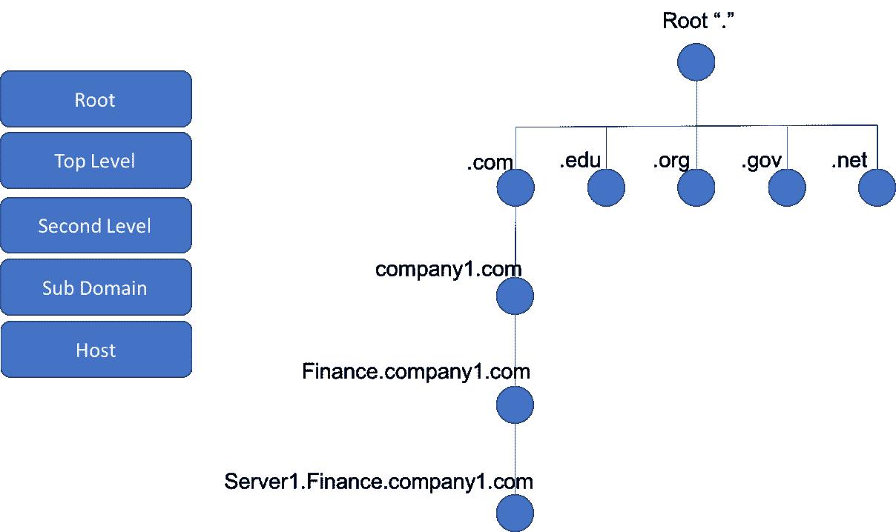

图 13.1: DNS 层级

在本章中，我们将讨论 DNS 协议的基本原理、功能、常见问题，以及如何使用 Wireshark 对协议进行分析和故障排除。

# 分析 DNS 记录类型

DNS 数据库是 DNS 记录的集合，其中每个记录是数据库中的一个条目，包括标签、类别、类型和数据，以及关于如何处理对相应记录的请求的指令。虽然有许多记录类型可用于解决不同的目的，但一些常见的记录类型是记录、AAAA 记录和 CNAME。

在本菜谱中，我们将讨论各种常见的 DNS 记录类型，并了解如何使用 Wireshark 来分析相关的行为和问题。

# 做好准备

为了分析 DNS 记录的类型，我们需要捕获 DNS 查询和响应包。为此，请将 Wireshark 连接到客户端和 DNS 服务器之间的路径，并捕获数据包。

# 怎么做...

在上图中，触发从客户端到名称服务器的 DNS 查询，并捕获 DNS 查询数据包以进行记录类型分析。可以使用不同的机制从客户端触发 DNS 查询，这些机制可能因客户端的配置、软件版本、供应商平台等而异。以下是我们可以用来从客户端触发查询的几个示例:

*   在客户端打开 web 浏览器，键入 URL，如`www.packtpub.com`。
*   打开终端并触发对已知域名的 ping。在 Ubuntu 和其他 Linux 发行版中，`ping xyz.com`将触发 DNS 查询以解析 IPv4 地址，而`ping6 xyz.com`将触发 DNS 查询以解析域的 IPv6 地址。
*   使用 dig 等工具，这是一种基于 CLI 的工具，可用于触发对不同类型 DNS 记录的 DNS 查询。

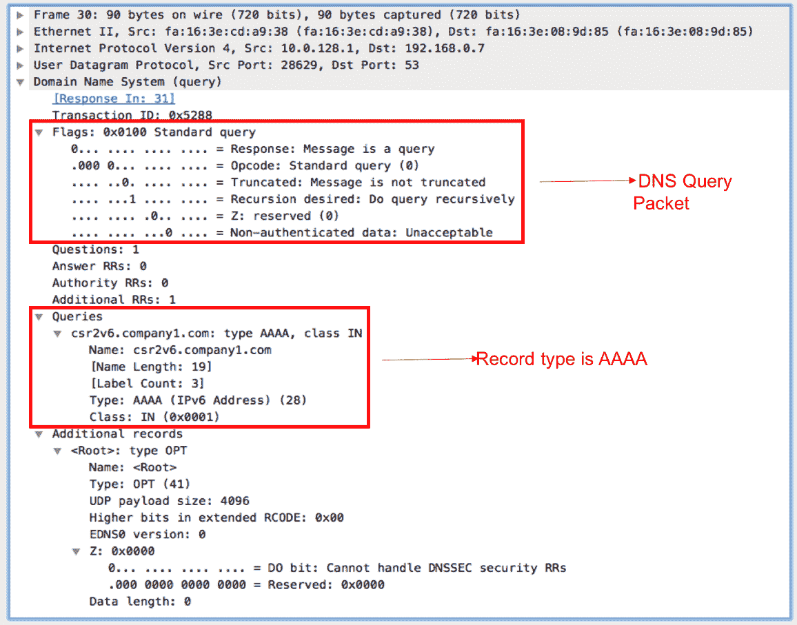

图 13.2: DNS 查询

前面的屏幕截图是针对 AAAA 记录类型触发的 DNS 查询的示例捕获。查询类型将被设置为 DNS 标准查询。任何查询都必须带有应该为其解析记录的域名以及所请求的记录类型。

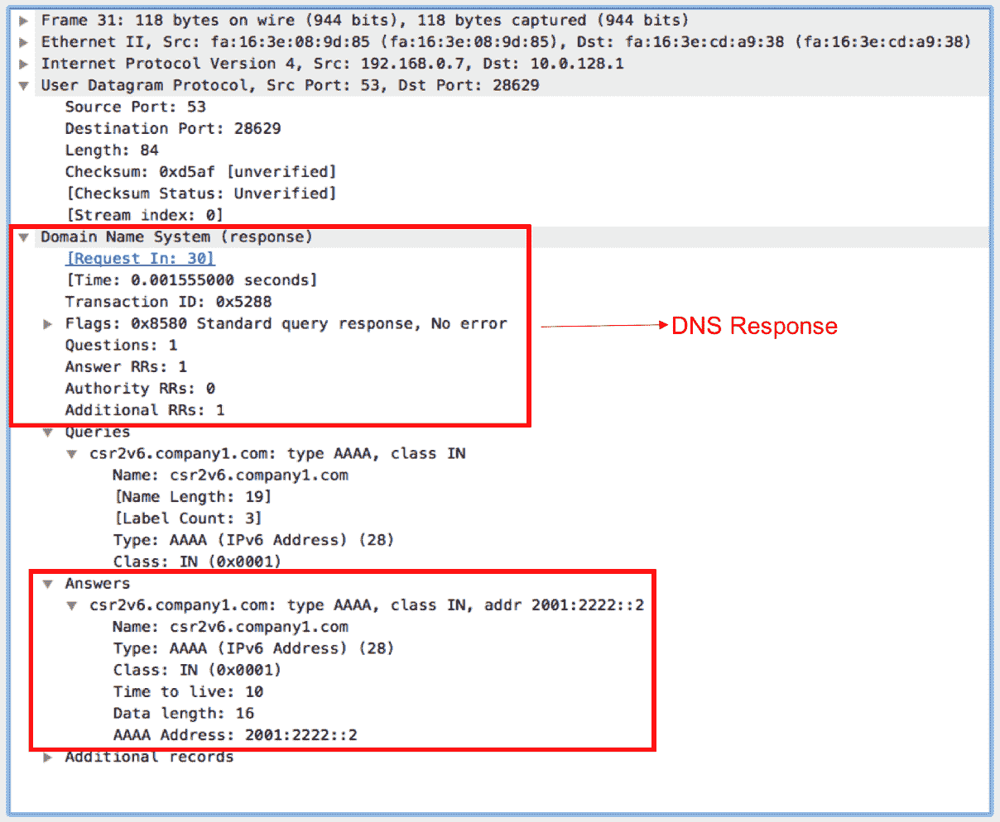

图 13.3: DNS 响应

前面的屏幕截图是对*图 13.2* 中查询的 DNS 响应的示例捕获。为了便于分析，Wireshark 在 DNS 响应数据包中突出显示了 DNS 查询的数据包编号。前面是携带客户端请求的域名的 AAAA 记录响应的响应。

对于请求任何记录类型的每个 DNS 查询，必须有来自服务器的相应记录的响应。如果我们没有看到任何这样的响应或得到一个否定的响应，这表明一些问题需要额外的分析。例如，对于所查询的记录类型，服务器数据库中缺少记录可能会导致以错误消息响应。

# 它是如何工作的...

有不同的 DNS 记录类型服务于不同的目的。我们将讨论一些常见的记录类型及其用途。

# SOA 记录

**授权开始** ( **SOA** )是一种资源记录类型，包含管理信息，例如作为 DNS 服务器负责名称解析的域的一部分的每个 DNS 区域的全局参数和配置。RFC 1035 中定义了 SOA 的定义和记录格式。

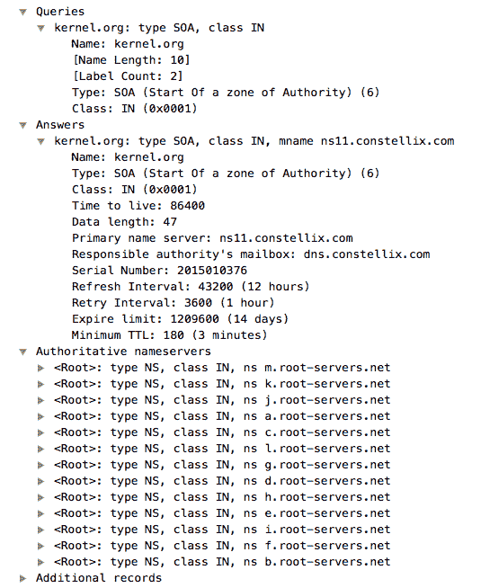

图 13.4: SOA 资源记录

前面的屏幕截图是一个 SOA 资源记录的示例捕获。每个区域只有一个 SOA 记录，详细信息如下:

*   **区域名称**:定义域内区域的名称。
*   **主域名服务器**:域的 DNS 主服务器。这是该区域数据记录的主要来源。
*   **负责机关**:该区域负责机关的邮箱信息。
*   **序列号**:该值随每次区域传送而递增。它可以被认为是 DNS 数据库的当前版本。
*   **时间间隔**:不同的刷新和重试间隔。

# 资源记录

A 资源也称为地址记录，是存储与域名关联的 IPv4 地址的资源记录。这是互联网上最常见的记录之一。出于负载平衡的目的，多个 IP 地址可以与同一个域名相关联。所以在 DNS 响应包中看到多个 A 记录是很常见的。

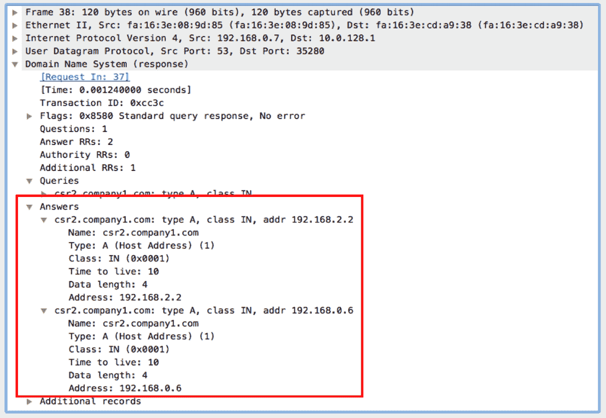

图 13.5:资源记录

前面的屏幕截图是一个 A 记录响应的示例捕获，其中多个 IP 地址与同一个域名相关联。在前面的截图中，`192.168.2.2`和`192.168.0.6`与主机名`csr2.company1.com`相关联。DNS 服务器在接收到对`csr2.company1.com`的 DNS 查询后，将响应多个应答对象，每个对象携带一个 IP 地址和相关的详细信息。客户端如何使用或使用什么 IP 地址是本地事务，并且是特定于实现的。

# AAAA 资源记录

AAAA 资源记录，也称为 IPv6 地址记录，是存储与域名相关联的 IPv6 地址的资源记录。出于负载平衡的目的，多个 IPv6 地址可以与同一个域名相关联。因此，在 DNS 响应数据包中看到多个 AAAA 记录是很常见的。

前面显示的样本捕获是一个 AAAA 记录。与 A 记录一样，如果有多个 IPv6 地址与域名相关联，DNS 响应可能会在响应中携带多个 AAAA 记录。

# CNAME 资源记录

CNAME 资源记录，也称为规范名称记录，是用于指定一个域名是另一个域名的别名的资源记录。CNAME 记录将始终指向另一个域名，而不会指向任何 IP 地址。该记录有助于在不影响最终用户的情况下无缝地从一个域名更改到另一个域名。

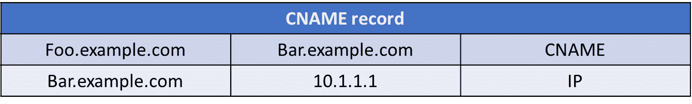

图 13.6: CNAME 记录

在前面的例子中，我们看到`foo.example.com`是为`bar.example.com`创建的别名。当服务器收到对`foo.example.com`的请求时，它会回复一个带有新域名`bar.example.com`的 CNAME。客户端将依次发送一个请求给`bar.example.com`来解析 IP 地址。这对客户来说是透明的，因此可以实现平稳的域名过渡。

# 还有更多...

在上一节中，我们看到了一些最常见的资源记录和相关的语义。行业中有更多这样的资源记录。关于其他资源记录的详细信息和每个记录的解释可在 IANA 获得:[https://www . iana . org/assignments/DNS-parameters/DNS-parameters . XHTML # DNS-parameters-4](https://www.iana.org/assignments/dns-parameters/dns-parameters.xhtml#dns-parameters-4)。

# 分析常规 DNS 操作

在这个菜谱中，我们将看到如何发现 DNS 是否正常工作。我们将看到 DNS 操作的一些场景，以及可能出错的地方。

# 做好准备

打开 Wireshark 并开始捕获数据。您应该镜像使用 DNS 的设备或 DNS 服务器本身。

# 怎么做...

将 Wireshark 连接到与受监控设备相连的 LAN 交换机，并为您怀疑问题来自的设备配置一个端口镜像。完成以下步骤:

1.  如果用户投诉，请配置端口镜像来监控用户设备。
2.  如果网络出现一般问题，请配置 DNS 服务器的端口镜像:
    *   当在内部服务器上配置 DNS 服务器时，请在服务器上配置端口镜像
    *   当 DNS 服务器配置在外部服务器上时，配置一个端口镜像到将您连接到互联网的链路

# 它是如何工作的...

DNS 是用于名称解析的主要协议，在浏览互联网时使用。它也用于在一个组织的网络中工作。DNS 标准描述了三种功能:

*   名称空间，这是 DNS 名称的外观和分配方式
*   名称注册流程，即我们如何注册 DNS 名称，以及它们如何通过 DNS 服务器的网络转发
*   解析过程，即如何将名称解析为 IP 地址

在这个食谱中，我们将重点关注第三个主题，即当我们浏览互联网，发送或接收电子邮件，或访问我们组织的内部服务器时，会发生什么。

# DNS 服务器分配

解决 DNS 相关问题的第一步是确保在客户端上配置正确的 DNS 服务器设置。这对于确保作为 DNS 查询的一部分解析的 IP 地址是合法的而不是伪造的是至关重要的。有两种不同类型的 DNS 客户端配置，如下所示:

*   在客户端上手动设置 DNS 服务器
*   动态 DNS

对于手动配置，我们需要在客户端静态定义 DNS 服务器信息。根据客户端的不同，配置可能会有所不同。例如，在 Linux 发行版中，应该在`/etc/resolv.conf`文件中配置 DNS 服务器。

通过**动态 DNS** ( **DDNS** )，我们利用动态配置协议来通告 DNS 服务器信息。在大型网络中，DHCP 是非常常见的地址分配协议。可以利用 DHCP 来动态通告一个或多个 DNS 服务器。

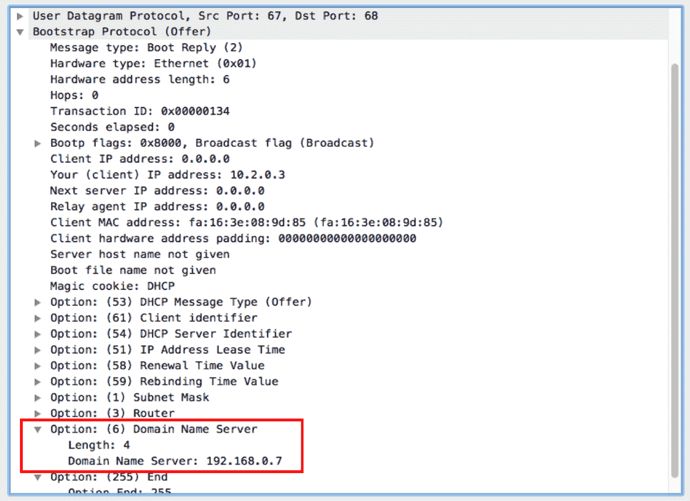

图 13.7:DHCP 响应中的 DNS 信息

如前面的屏幕截图所示，DNS 服务器信息是分配 IP 地址时将包括的 DHCP 选项之一。

在 IPv6 环境中，可以将 DNS 服务器信息作为 IPv6 路由器广告的一部分进行广告。任何启用了 IPv6 自动配置的客户端都将使用作为 IPv6 RA 消息的一部分接收的 DNS 服务器。

# DNS 操作

用户程序(web 浏览器、邮件客户端和许多其他程序)通过解析器与 DNS 服务器交互，解析器也是操作系统的一部分。解析器与为其提供所需 IP 的外部名称服务器交互(名称服务器可以是本地的或远程的；它在分解器的外部)。用户查询 DNS 服务器的方式是操作系统特定的。DNS 查询和响应在解析器和名称服务器之间发送和接收。如下图所示:

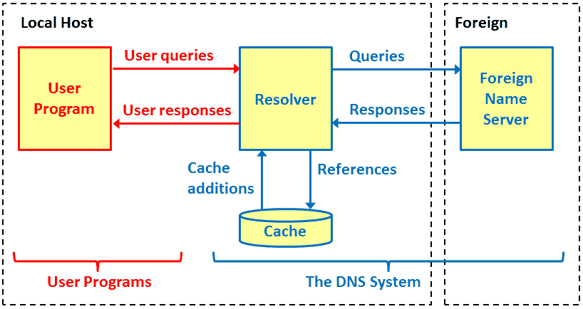

本地名称服务器通常位于组织网络中，并与 ISP 的 DNS 服务器交互。如果是家庭或小型办公网络，您的 DNS 服务器可以配置在将您连接到互联网的路由器上，或者直接配置到 ISP 的 DNS 服务器上:

*   当 DNS 服务器在路由器上时，您在查询您的 ISP DNS 的路由器上查询 DNS
*   当您的 DNS 位于 ISP 网络上时，您可以直接查询 DNS 服务器

# DNS 名称空间

DNS 命名空间基于分层树结构，如下图所示。其结构如下:

*   根服务器的网络([http://www.iana.org/domains/root/servers](http://www.iana.org/domains/root/servers))。
*   **顶级域名**(**)服务器(【http://www.iana.org/domains/root/db】)的网络。**
***   每个顶级域名都有类似于 IANA 管理的域名服务器。顶级域名包含二级域名。TLD 是最高级别的服务器，例如国家服务器，如下图所示。*   **二级域名** ( **SLD** )包含组织和国家的域名和名称。二级域名由指定的组织或国家管理:**

**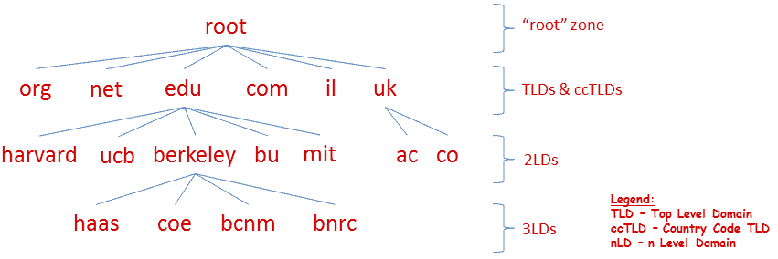

有一些重要的定义，如下图所示:

*   **域**:构成`ndi-com.com`下的所有分支，在这里是一个 SLD
*   **Zone**:DNS 名称空间中 DNS 域的连续部分，其数据库记录存在于一个或多个 DNS 服务器上存储的特定 DNS 数据库文件中，并在其中进行管理:

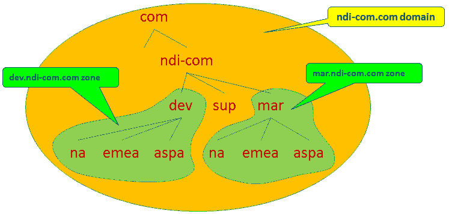** **# 解析过程

使用 DNS 服务器有两个原因:

*   第一个原因是它用于组织内部的交流。在这种情况下，您的组织中有一个 DNS 服务器，它将 IP 地址解析为组织中的名称。
*   它用于连接互联网、浏览、发送电子邮件等。

使用这两种服务时，您将向您的组织服务器发送 DNS 查询，组织服务器将向互联网发送查询。例如，当您想要访问组织中的本地服务器时，您将向本地 DNS 发送一个 DNS 查询，然后您将获得服务器 IP。当您浏览互联网上的网站时，本地 DNS 服务器会将请求转发给外部 DNS，例如 ISP DNS。

您是否配置了正确的 DNS 服务器？理论上，当你连接到互联网时，你可以配置世界上任何一台 DNS 服务器。通常，最好使用的 DNS 服务器是最近的。在您的组织中，您应该将本地 DNS 配置为第一优先，然后是 ISP 的 DNS 服务器。

有各种实用工具来检查 DNS 响应。其中一些如下:

*   命名长凳([goo.gl/86yjKU](http://goo.gl/86yjKU)
*   来自 GRC 的 DNS 基准([https://www.grc.com/dns/benchmark.htm](https://www.grc.com/dns/benchmark.htm))

在测试结果中，您应该为您配置的 DNS 服务器获得良好的响应时间。如果没有，就改变它们。

# 还有更多...

当终端设备上的某个进程正在寻找某个特定名称的 IP 地址时，它会与连接到 DNS 服务器的本地解析器进行交互。当 DNS 服务器在其数据库中没有找到您要查找的条目时，它可以通过两种方式做出响应；递归或迭代:

*   **递归模式**:在这种模式下，当应用(例如网页浏览器)想要解析一个网站的名称`www.packtpub.com`时，它会向本地 DNS 服务器发送一个 DNS 请求(在下图中标记为 **1** )。本地 DNS 服务器将请求发送到一个根服务器(下图中标记为 **2** 和 **3** )，然后发送到 TLD(下图中标记为 **3** 和 **4** ，最后发送到`www.packtpub.com`的权威服务器，权威服务器给我们所需的地址(下图中标记为 **6** 和 **7** )。然后，本地 DNS 服务器发送给我们所需的地址(下图中标记为 **8** )。在每一个响应中，解析器都获取下一步要查询的 DNS:

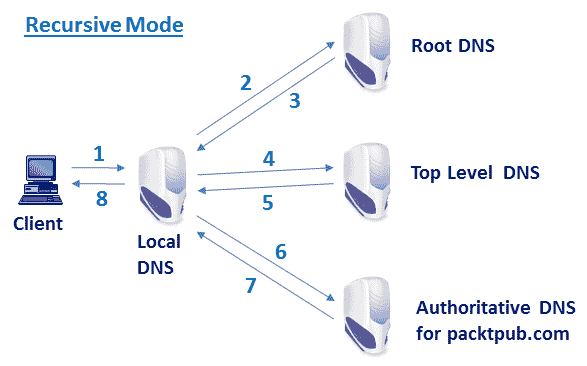

*   **迭代模式**:在这种模式下，DNS 客户端可以接收来自 DNS 服务器的响应，该响应将告诉客户端在哪里寻找所请求的名称。当应用(例如，web 浏览器)想要浏览网站`www.packtpub.com`时，它向本地 DNS 服务器发送 DNS 请求(在下图中标记为 **1** )。本地服务器将请求转发给根 DNS 服务器(在下图中标记为 **2** )。如果它不知道答案，它会将请求转发给 TLD(下图中标记为 **3** )和权威 DNS(下图中标记为 **4** )。然后，将答案一路发送回客户端(在下图中标记为 **5** 、 **6** 、 **7** 和 **8** ):

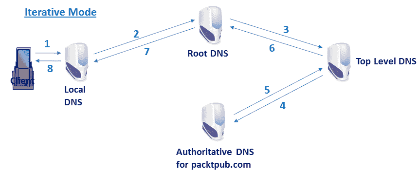

# 分析 DNSSEC 常规操作

DNS 通过将域名解析为相应的 IP 地址，在互联网上扮演着重要的角色。虽然它执行非常重要的服务，但它不提供任何数据完整性或原始授权。这种安全性的缺乏可以被操纵来用恶意 IP 地址欺骗域名，并将所有数据转发给恶意服务器。DNS 缓存中毒就是这样一种已知的攻击，它利用这个安全漏洞来泄漏数据。

**DNS 安全扩展** ( **DNSSEC** )是 DNS 协议的一套安全扩展，引入了区域签名的概念，从而有助于为 DNS 资源记录提供数据完整性和原始授权。

# 做好准备

DNSSEC 是对现有 DNS 数据包格式的扩展，因此从数据包捕获的角度来看，不需要任何加密或相关考虑。与传统的 DNS 数据包一样，Wireshark 将能够使用相同的端口镜像概念捕获 DNSSEC 数据包。

# 怎么做...

在捕获的数据包上，执行以下简单验证:

1.  检查从客户端发送的 DNS 查询是否设置了 DNSSEC 选项。这将包含在 DNS 查询数据包的附加记录字段中:

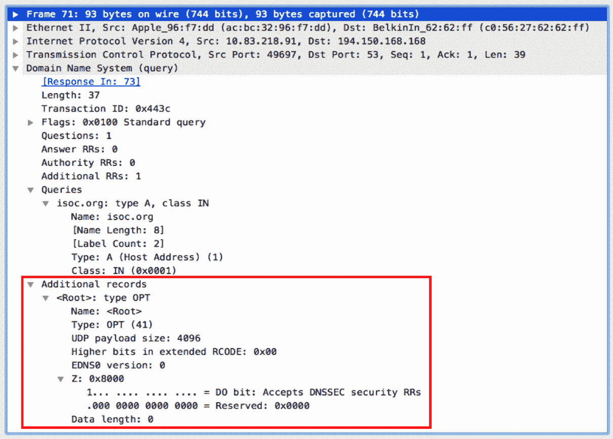

在前面的屏幕截图中，可以看到附加记录字段设置了一个标志，指示客户端接受 DNSSEC 安全资源记录。

2.  一旦接收到请求，DNS 服务器将回复一个 DNS 响应，该响应携带所请求记录的相关细节(例如，A 记录的 IP 地址)，并携带一个**资源记录签名** ( **RRSIG** )。这些是与资源记录相关联的数字签名:

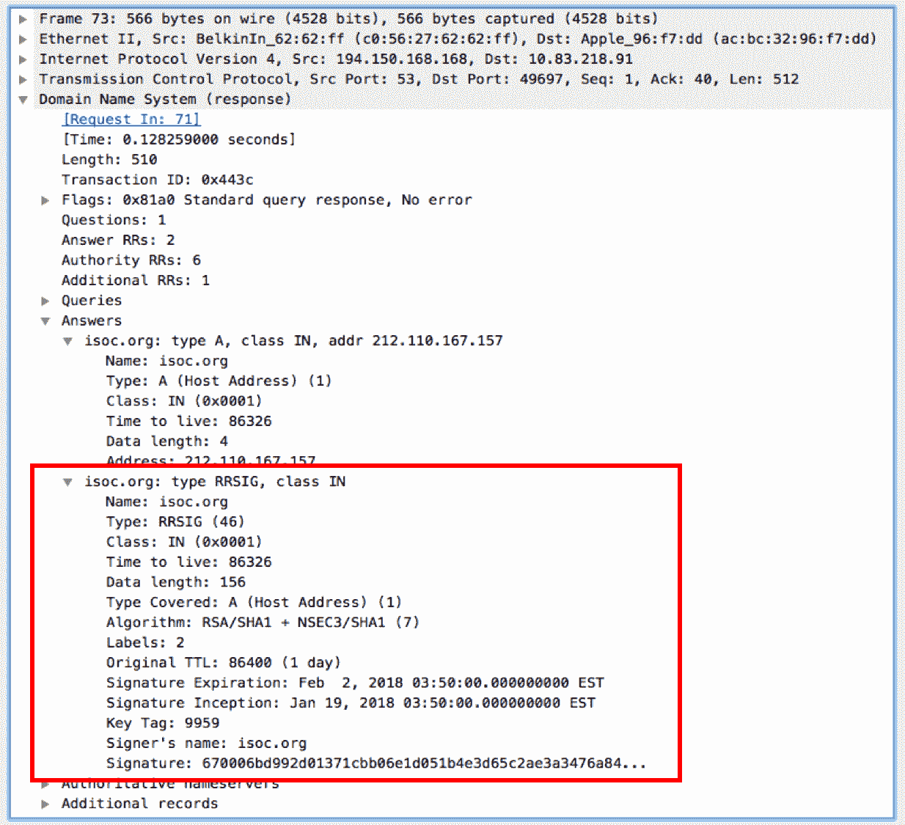

在前面的截图中，可以看到来自服务器的 DNS 响应将使用 RRSIG 进行回复。

3.  DNS 客户端现在向 DNSKEY 请求域名，如下所示:

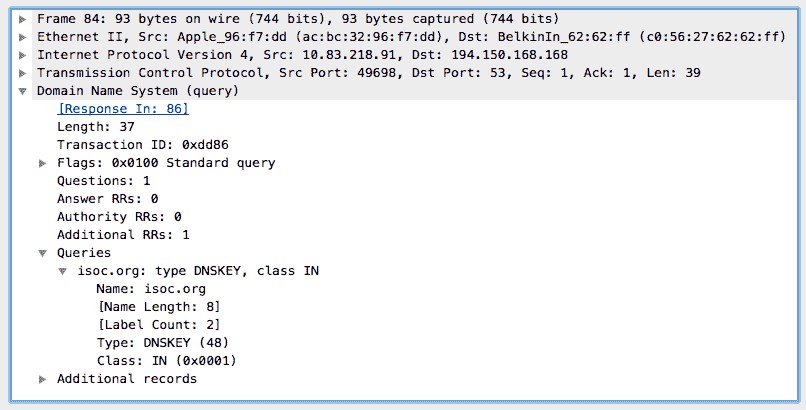

4.  DNS 服务器回复用于签署资源记录的公钥:

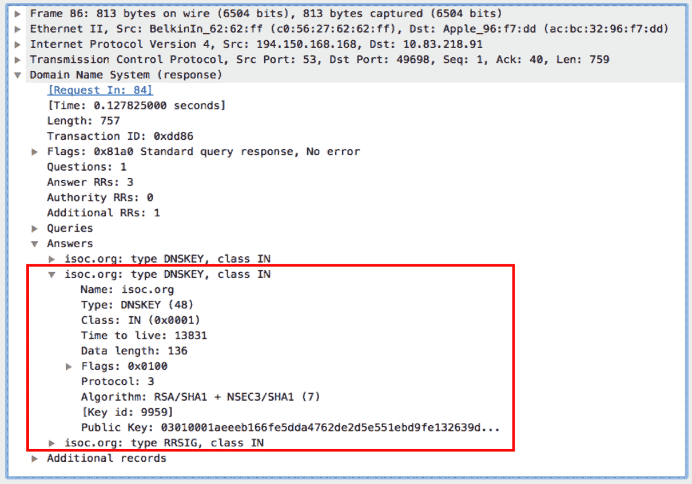

5.  客户端使用这些详细信息来验证从 DNS 服务器接收的资源记录的完整性。

# 它是如何工作的...

DNSSEC 是一种技术，通过对资源记录提供扩展的数据完整性检查来保护 DNS 资源记录。DNSSEC 通过对资源记录进行数字签名来运行，从分层 DNS 树的根开始:

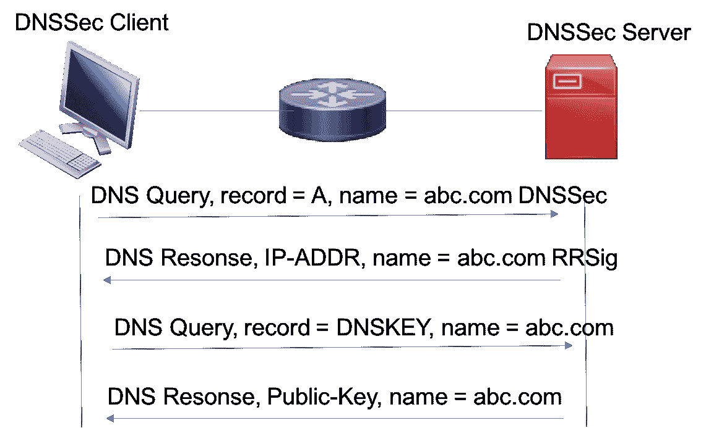

DNSKEY 和 RRSIG 在 DNSSEC 运营中发挥着关键作用。以下是客户端和服务器之间操作的简化序列:

1.  DNS 客户端发送在附加记录中设置了 DNSSEC 标志的 DNS 查询。这向服务器发出信号，表明客户端支持 DNSSEC，并期望对资源记录进行数字签名。
2.  DNS 服务器收到请求后，将回复响应并包含 RRSIG。RRSIG 是由委托签名者数字签名的资源记录。
3.  DNS 客户端将向服务器发送另一个请求，请求相同的域名，但记录类型设置为 DNSKEY。这是用于签署资源记录的公钥。
4.  DNS 服务器将使用所请求域的 DNSKEY 进行回复。
5.  DNS 客户端使用 DNSKEY 来计算哈希，并将其与 RRSIG 进行比较，以确保数据完整性。

6.  如果散列不匹配，则资源记录被破坏，客户端将不会使用它。

# 还有更多...

上一节简单解释了 DNSSEC 是如何工作的。有关 DNSSEC、区域签名及其如何使用签名链的更多详细信息，请参见以下 RFC:

*   **RFC 4033** : DNS 安全介绍和要求
*   RFC 4034:DNSSEC 的资源记录
*   RFC 4035:DNSSEC 协议修改

# DNS 性能故障排除

在这个菜谱中，我们将看到如何解决 DNS 性能相关的问题，如响应缓慢。我们将看到如何使用 Wireshark 来分析这些问题。

# 做好准备

通过利用 DNS 请求和响应数据包上的时间戳来测量 DNS 性能。为了测量性能，Wireshark 应尽可能靠近客户端连接并捕获 DNS 数据包。

# 怎么做...

你怎么知道这就是问题所在？

*   当您浏览互联网并且得到非常慢的响应时，请执行以下步骤:
    1.  端口镜像到互联网的连接，并检查在通往互联网的路上是否有任何瓶颈。为此，您可以使用 I/O 图，如第 6 章、【使用高级统计工具的 中所述。
    2.  验证您没有大量的重新传输或重复的 ack 来指示连接问题。
    3.  验证您没有任何与窗口相关的问题，例如零窗口或窗口已满。
*   如果前面检查的答案为否，则可能是 DNS 问题。在两种情况下，您可能会遇到 DNS 问题:
    *   在您的组织中工作时
    *   当连接到互联网时
*   这些问题可以通过两种方式解决:
    *   当您的组织遇到问题时，端口镜像连接到 DNS 服务器的交换机端口
    *   当互联网出现问题时，端口镜像将您的组织连接到互联网的交换机端口
*   观察您得到的 DNS 响应时间。找到问题的方法有几种，如下所示:
    *   最简单的方法是右键单击 DNS 查询流中的数据包，选择跟随 UDP 流，然后检查查询和响应之间的时间。
    *   另一种方法是使用 I/O 图来实现这一目的。在 IO 图形窗口中，选择高级...在 Y 轴配置中，用 AVG(*)在图形行中配置过滤器`dns.time`。参考以下截图:

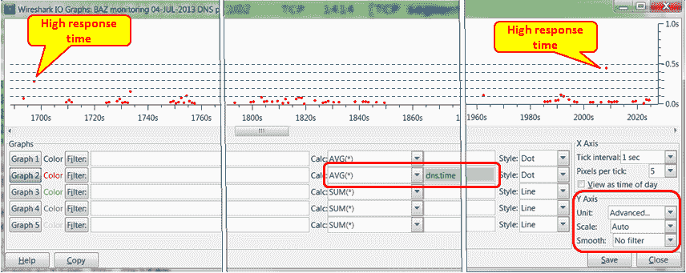

您将获得整个捕获时间内 DNS 响应时间的图表。

在此图中，您将看到大多数响应时间都低于 100 毫秒，这是相当合理的。我们有两个峰值表示可能存在问题，一个在捕获开始时为 300 ms，另一个在捕获结束时为 450 ms。

组织内部(在本地站点)的合理时间应该不超过几十毫秒。当浏览互联网时，良好的响应时间应该小于 100 毫秒，而高达 200 毫秒仍然是可以忍受的。

# 它是如何工作的...

如*分析常规 DNS 操作*部分所述，DNS 操作模式可能会影响整体解析性能。例如，递归模式可能导致 DNS 服务器递归地查询其他服务器，这引入了端对端延迟，该延迟根据与服务器和网络路径相关联的各种因素而变化。在配置了多个 DNS 服务器的情况下，如果第一个服务器在缓存中没有资源记录，迭代模式可能有助于查询其他服务器。

# 还有更多...

虽然使用 Wireshark 是测量和排除域名解析延迟的一种方法，但也有其他工具可以执行类似的测试。例如，dig 是一个基于 CLI 的工具，在大多数 Linux 发行版中都可以使用。它允许您触发任何记录类型的 DNS 查询，并测量解析所需的时间。

以下是如何使用它的示例:

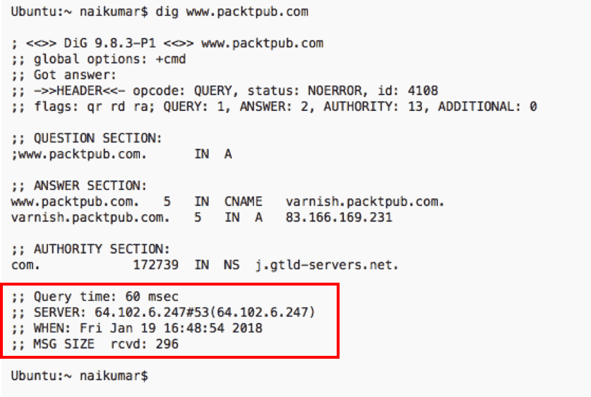**