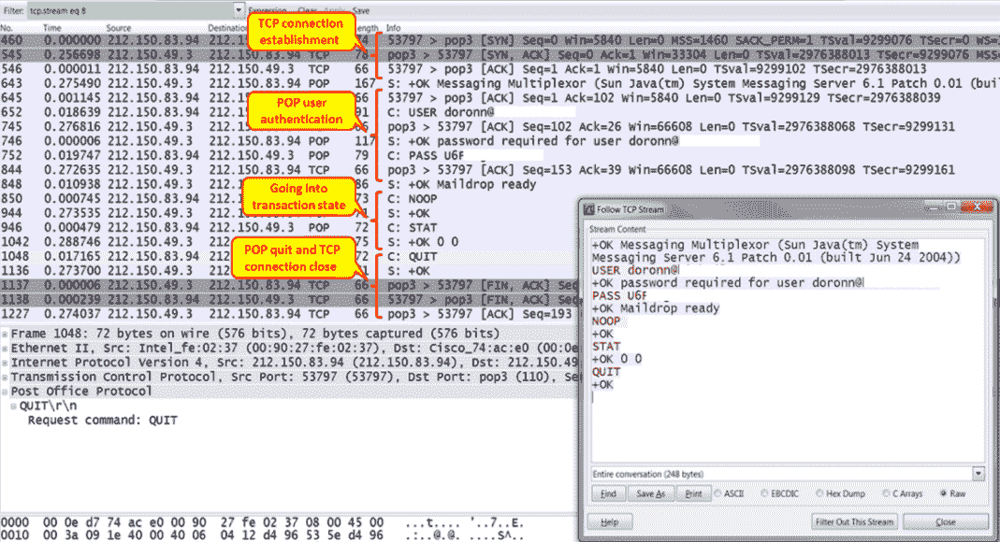
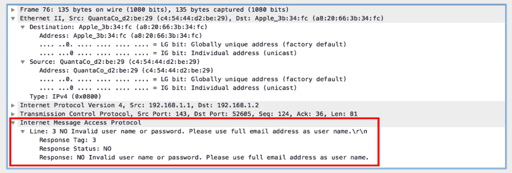
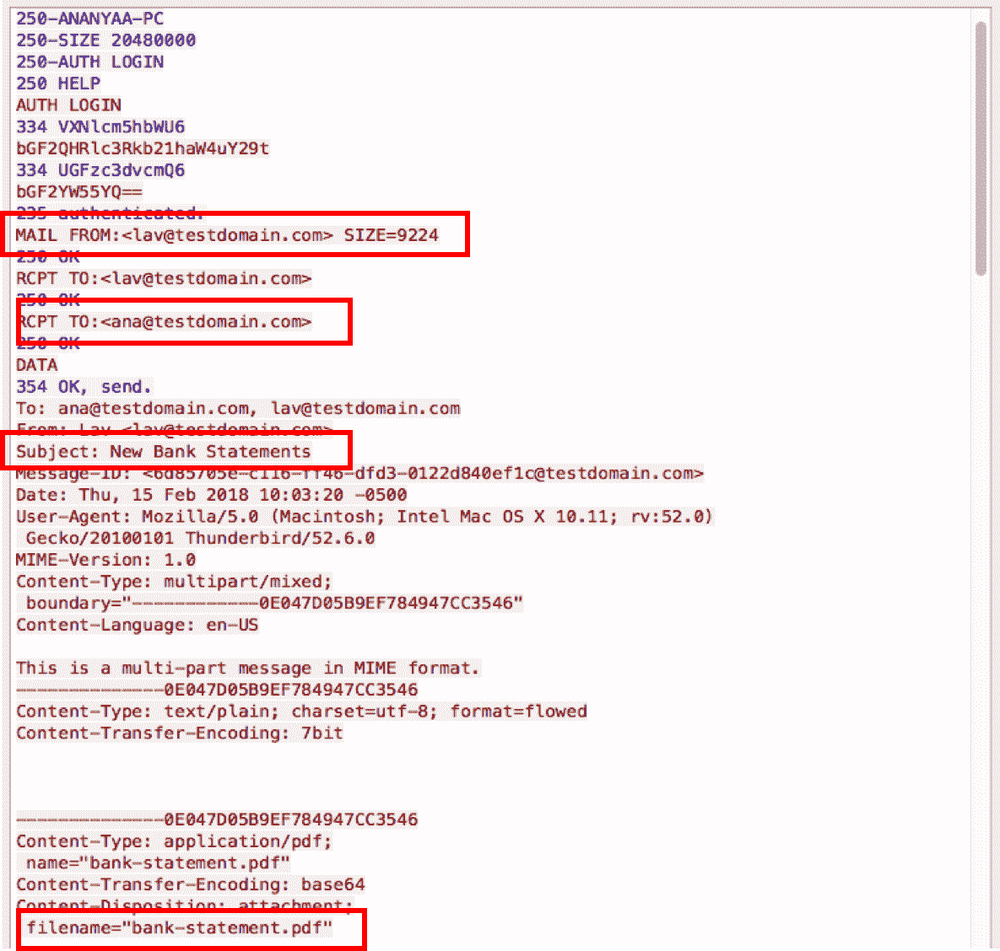

# 十四、分析邮件协议

在本章中，您将了解:

*   邮件协议的正常操作
*   分析 POP、IMAP 和 SMTP 问题
*   过滤和分析不同的错误代码
*   恶意和垃圾邮件分析

# 介绍

电子邮件是推动数字营销和商业发展的因素之一。电子邮件允许用户通过互联网以非常有效的方式交换实时消息和其他数字信息，例如文件和图像。每个用户都需要有一个可读的电子邮件地址，格式为`username@domainname.com`。互联网上有各种电子邮件提供商，任何用户都可以注册获得一个免费的电子邮件地址。

有不同的电子邮件应用层协议可用于发送和接收邮件，这些协议的组合有助于相同或不同邮件域中的用户之间的端到端电子邮件交换。三种最常用的应用层协议是 POP3、IMAP 和 SMTP:

*   **POP3** : **邮局协议 3** ( **POP3** )是邮件系统用来从邮件服务器检索邮件的应用层协议。电子邮件客户端使用 POP3 命令，如`LOGIN`、`LIST`、`RETR`、`DELE`、`QUIT`从服务器访问和操作(检索或删除)电子邮件。POP3 使用 TCP 端口`110`，一旦邮件下载到本地客户端，就会从服务器清除邮件。
*   **IMAP** : **互联网邮件访问协议** ( **IMAP** )是另一种应用层协议，用于从邮件服务器检索邮件。与 POP3 不同，IMAP 允许用户从多个客户端设备同时阅读和访问邮件。从目前的趋势来看，用户使用多种设备(笔记本电脑、智能手机等)访问电子邮件是很常见的，IMAP 的使用允许用户随时从任何设备访问邮件。IMAP 的当前版本是 4，它使用 TCP 端口`143`。
*   **SMTP** : **简单邮件传输协议** ( **SMTP** )是一种应用层协议，用于从客户端向邮件服务器发送邮件。当发件人和收件人位于不同的电子邮件域时，SMTP 有助于在不同域的服务器之间交换邮件。它使用 TCP 端口`25`:


如上图所示，SMTP 是用于将邮件发送到邮件服务器的电子邮件客户端，POP3 或 IMAP 用于从服务器检索电子邮件。电子邮件服务器使用 SMTP 在不同的域之间交换邮件。

为了维护最终用户的隐私，大多数电子邮件服务器在传输层使用不同的加密机制。如果在安全传输层(TLS)上使用，传输层端口号将不同于传统的电子邮件协议。比如 POP3 over TLS 使用 TCP 端口`995`，IMAP4 over TLS 使用 TCP 端口`993`，SMTP over TLS 使用端口`465`。

在本章中，我们将了解电子邮件协议的正常运行，以及如何使用 Wireshark 进行基本分析和故障排除。

# 邮件协议的正常操作

正如我们在*简介*中看到的，邮件客户端到服务器和服务器到服务器通信的常见邮件协议是 POP3、SMTP 和 IMAP4。

另一种访问电子邮件的常见方法是通过网络访问邮件，其中有常见的邮件服务器，如 Gmail、Yahoo！，以及 Hotmail。例子包括微软的 Outlook Web 客户端的**Outlook Web Access**(**OWA**)和 RPC over HTTPS。

在这个菜谱中，我们将讨论最常见的客户机-服务器和服务器-服务器协议，POP3 和 SMTP，以及每个协议的正常操作。

# 做好准备

捕获数据包的端口镜像可以在电子邮件客户端或服务器端完成。

# 怎么做...

POP3 通常用于客户端到服务器的通信，而 SMTP 通常用于服务器到服务器的通信。

# POP3 通信

POP3 通常用于邮件客户端到邮件服务器的通信。POP3 的正常操作如下:

1.  打开电子邮件客户端，输入登录访问的用户名和密码。
2.  使用 POP 作为显示过滤器来列出所有的 POP 数据包。应该注意，这个显示过滤器将只列出使用 TCP 端口`110`的数据包。如果使用 TLS，过滤器将不会列出 POP 数据包。我们可能需要使用`tcp.port == 995`来列出 TLS 上的 POP3 包。
3.  检查验证是否已正确通过。在下面的截图中，您可以看到一个以`doronn@`开头的用户名(所有 id 都被删除)和以`u6F`开头的密码打开的会话。

4.  要查看以下屏幕截图中显示的 TCP 流，请右键单击流中的一个数据包，并从下拉菜单中选择 Follow TCP Stream:



5.  身份验证阶段的任何错误消息都将阻止通信的建立。您可以在下面的屏幕截图中看到这样的例子，其中用户验证失败。在本例中，我们看到当客户端登录失败时，它关闭了 TCP 连接:


6.  使用相关的显示过滤器列出特定的数据包。例如，`pop.request.command == "USER"`会列出带有用户名的 POP 请求包，`pop.request.command == "PASS"`会列出带有密码的 POP 包。一个示例快照如下:


7.  在邮件传输过程中，请注意邮件客户端很容易填满一条窄带通信线路。您可以通过简单地在 POP 上配置一个过滤器来检查 I/O 图。
8.  始终检查常见的 TCP 指示:重新传输、零窗口、窗口满等。它们可以指示通信线路繁忙、服务器运行缓慢以及来自通信线路或终端节点和服务器的其他问题。这些问题通常会导致连接缓慢。

当 POP3 协议使用 TLS 进行加密时，有效负载的详细信息是不可见的。我们将在*中解释如何解密 SSL 捕获，还有更多内容...*一节。

# IMAP 通信

IMAP 与 POP3 的相似之处在于，客户端使用 IMAP 从服务器检索邮件。IMAP 通信的正常行为如下:

1.  打开电子邮件客户端，输入相关帐户的用户名和密码。
2.  撰写新邮件并从任何电子邮件帐户发送。
3.  在使用 IMAP 的客户端上检索电子邮件。不同的客户可能有不同的检索电子邮件的方式。使用相关按钮触发它。
4.  检查您是否在本地客户端上收到了电子邮件。

# SMTP 通信

SMTP 通常用于以下目的:

*   服务器到服务器的通信，其中 SMTP 是服务器之间运行的邮件协议
*   在某些客户端中，POP3 或 IMAP4 配置用于传入邮件(从服务器到客户端的邮件)，而 SMTP 配置用于传出邮件(从客户端到服务器的邮件)

SMTP 通信的正常行为如下:

*   本地电子邮件客户端解析配置的 SMTP 服务器地址的 IP 地址。
*   如果 SSL/TLS 未启用，这将触发到端口号`25`的 TCP 连接。如果启用了 SSL/TLS，则通过端口`465`建立 TCP 连接。
*   它与服务器交换 SMTP 消息以进行身份验证。客户端发送`AUTH LOGIN`触发登录认证。成功登录后，客户端将能够发送邮件。
*   它发送 SMTP 消息，如携带发送者和接收者电子邮件地址的`"MAIL FROM:<>", "RCPT TO:<>"`。
*   成功排队后，我们从 SMTP 服务器得到一个`OK`响应。

以下是客户端和服务器之间的 SMTP 邮件流示例:


# 它是如何工作的...

在本节中，让我们来看看使用 Wireshark 时不同电子邮件协议的正常操作。

邮件客户端通常使用 POP3 与服务器通信。在某些情况下，他们也会使用 SMTP。IMAP4 在需要服务器操作时使用，例如，当您需要查看远程服务器上的邮件而不需要将它们下载到客户端时。服务器到服务器的通信通常由 SMTP 实现。

IMAP 和 POP 的区别在于，在 IMAP 中，邮件总是存储在服务器上。如果您删除它，它将无法在任何其他机器上使用。在 POP 中，删除下载的电子邮件可能会也可能不会删除服务器上的该电子邮件。

一般来说，SMTP 状态代码分为三类，它们的结构有助于您理解到底哪里出了问题。SMTP 状态代码的方法和细节将在下一节讨论。

# POP3

POP3 是邮件客户端用来从服务器检索电子邮件的应用层协议。典型的 POP3 会话如下图所示:


它具有以下步骤:

1.  客户端打开到服务器的 TCP 连接。
2.  服务器向客户端发送一条`OK`消息(OK 消息多路复用器)。
3.  用户发送用户名和密码。
4.  协议操作开始。`NOOP`(无操作)是为了保持连接打开而发送的消息，`STAT`(状态)是从客户端发送到服务器查询消息状态。服务器用消息的数量和它们的总大小来回答(在包`1042`中，`OK 0 0`表示没有消息，它的总大小为零)
5.  当服务器上没有邮件消息时，客户端发送一个`QUIT`消息(`1048`，服务器确认它(数据包`1136`)，TCP 连接关闭(数据包`1137`、`1138`和`1227`)。
6.  在加密连接中，这个过程看起来几乎是一样的(见下面的截图)。连接建立后( **1** )，有几条 POP 消息( **2** )，TLS 连接建立( **3** ，然后是加密的申请数据:


# 因特网邮件访问协议

IMAP 的正常操作如下:

1.  电子邮件客户端解析 IMAP 服务器的 IP 地址:


如前面的屏幕截图所示，当 SSL/TSL 被禁用时，客户端建立到端口`143`的 TCP 连接。启用 SSL 时，将通过端口`993`建立 TCP 会话。

2.  一旦会话建立，客户端发送 IMAP 能力消息，请求服务器发送服务器支持的能力。
3.  接下来是访问服务器的身份验证。当认证成功时，服务器回复响应代码`3`,表明登录成功:


4.  客户端现在发送 IMAP `FETCH`命令从服务器获取邮件。
5.  当客户端关闭时，它发送注销消息并清除 TCP 会话。

# 简单邮件传输协议

SMTP 的正常操作如下:

1.  电子邮件客户端解析 SMTP 服务器的 IP 地址:


2.  当 SSL/TSL 未启用时，客户端在端口`25`上打开到 SMTP 服务器的 TCP 连接。如果启用了 SSL，客户端将在端口`465`上打开会话:


3.  TCP 会话建立成功后，客户端将发送一条`AUTH LOGIN`消息，提示输入帐户用户名/密码。
4.  用户名和密码将被发送到 SMTP 客户端进行帐户验证。

5.  如果认证成功，SMTP 将发送响应代码`235`:


6.  客户端现在将发送者的电子邮件地址发送到 SMTP 服务器。如果发件人的地址有效，SMTP 服务器将使用响应代码`250`进行响应。
7.  在收到来自服务器的`OK`响应时，客户端将发送接收者的地址。如果收件人的地址有效，SMTP 服务器将使用响应代码`250`进行响应。
8.  客户端现在将推送实际的电子邮件消息。SMTP 将使用响应代码`250`和响应参数`OK: queued`进行响应。
9.  成功排队的邮件确保邮件成功发送并排队等待传递到收件人地址。

# 还有更多...

电子邮件有时被称为网络的无声杀手之一，尤其是在使用非对称线路连接互联网的小企业中。发短信时，他们不会消费网络上的任何东西；但是，当您通过窄带上行链路向 ISP 发送一个几兆甚至几十兆的大文件时，您办公室中的其他用户将会遭受数秒甚至数分钟的网络减速。这个问题我在很多小办公室都见过。

邮件客户端的另一个问题是，在某些情况下(可配置)，邮件客户端被配置为在开始工作时从服务器下载所有新数据。如果您有一位客户抱怨说，当所有员工都在办公室开始一天的工作时，网络速度变慢了，这可能是由于数十或数百个客户端同时打开了他们的邮件客户端，而且邮件服务器位于 WAN 上。

# Wireshark 中的 SSL 解密

如前所述，所有电子邮件协议(SMTP、IMAP 和 POP3)都支持 SSL/TLS，其中传输层信息是加密的，在 Wireshark 中是不可读的。为了解密它，我们需要客户端使用的 SSL 密钥。

以下是要遵循的步骤:

1.  确定电子邮件客户端使用的 SSL 密钥。根据硬件和应用的不同，获取 SSL 的过程可能会有所不同:
    *   在 macOS 中，前往“应用”,然后前往“实用工具”,然后打开“钥匙串访问”。这将列出不同应用的所有证书和密钥。为电子邮件客户端确定正确的 SSL 密钥。
    *   在 Windows 中，转到 Microsoft 管理控制台(MMC ),然后转到证书。这将列出不同应用的所有证书。识别正确的证书并将其导出。
2.  确定电子邮件客户端的 SSL 密钥后，在 Wireshark 中打开首选项，如下所示:


3.  从协议中选择 SSL 。
4.  在突出显示的字段中选择 SSL 密钥，然后单击确定。

5.  前面的过程将让 Wireshark 使用 SSL 密钥解密消息，并显示数据包捕获的解密版本。

# 分析 POP、IMAP 和 SMTP 问题

在本菜谱中，我们将讨论如何使用 Wireshark 来分析电子邮件协议中的故障。

# 做好准备

当某个用户报告了故障，而所有其他用户都工作正常时，请尽可能靠近受影响的用户捕获数据包。如果多个用户都报告了失败，请在尽可能靠近服务器的地方捕获数据包。

# 怎么做...

根据故障的方向，我们可能需要确定应该对什么电子邮件协议进行故障诊断。


例如，如果用户抱怨发送电子邮件时出现故障，我们需要关注 SMTP，如果故障与接收电子邮件有关，我们需要关注 IMAP 或 POP3(取决于客户端使用的协议)。

1.  确定故障方向后，检查相关端口的 TCP 会话是否已建立:


2.  前面的截图显示客户端无法在端口`143`上建立到服务器的 TCP 会话。在这种情况下，我们应该遵循[第十章](9affead7-6197-42e7-8ebc-0da367154504.xhtml)、*网络层协议和操作*和[第十一章](f46fb26a-2c13-48c9-9302-aafb4e0e0e4b.xhtml)、*传输层协议分析*中解释的传统网络故障排除行为。
3.  如果建立了会话，下一步是检查应用层协议是否成功通过了服务器的身份验证。错误的用户名/密码或恶意用户访问服务器的尝试将被标记为以下错误消息:



4.  检查用户名和密码，确保使用正确的用户名和密码进行身份验证。

当您怀疑服务器到服务器的通信缓慢时，请按照下列步骤解决问题:

1.  检查服务器是否位于同一站点:
    *   如果它们位于同一个站点，您可能有缓慢的服务器或其他应用问题。在大多数情况下，局域网不会引起任何问题，尤其是当两台服务器位于同一个数据中心时。
    *   如果它们不在同一站点(当服务器通过 WAN 连接位于远程站点时)，请检查 WAN 连接上的负载。当发送大型邮件时，他们可以很容易地阻塞这些线路，尤其是当它们是窄带(几 Mbps)时。
2.  首先，查找 TCP 问题，并检查是仅在 SMTP 上，还是在所有其他应用上都存在这些问题。例如，在下面的屏幕截图中，您可以看到许多 TCP 重新传输:


3.  检查他们是否是因为一个缓慢的 SMTP 服务器。是邮件问题吗？当您查看下面的截图时，您会看到我已经使用了 TCP 对话统计。在选中“限制显示过滤器”复选框并单击窗口顶部的“数据包”(从更多的数据包中获取列表)后，我们可以看到只有 793 个数据包是重新传输的数据包中的 SMTP 数据包。端口`445`(微软 DS)的`172.16.30.247`和`172.16.30.2`之间转发了 9014 个包，端口`80` (HTTP)的`172.16.30.180`和`192.5.11.198`之间转发了 2319 个包，以此类推:


在这种情况下，SMTP 只受到不良通信的影响。这不是 SMTP 的问题。

4.  检查 SMTP 错误。在下面的截图中，可以看到错误代码`451`，也称为`local error in processing`服务器错误。此外，还包括一个错误列表。

当出现问题时，在大多数情况下，服务器或客户端会告诉您。你只需要看看这些信息，然后用谷歌搜索一下。我们以后会看到很多这样的例子。

您还可以在 http://www.ietf.org/rfc/rfc1893.txt 的 RFC 1893 中找到 SMTP 状态代码列表:


5.  当您想找出双方发送了哪些错误时，请配置一个过滤器，如下图所示:


在这里您可以看到各种事件(代码):

*   `421`:表示邮件服务可能不可用( **1** )。
*   `452`:这表示服务器无法响应，告诉您稍后再试。发生这种情况是由于服务器上的负载或服务器问题( **2** )。
*   `451`:(代码`250`如截图所示，见以下注释)这表示用户超限额( **3** )。
*   `452`:这表示已经超过邮箱大小限制( **4** )。
*   `450`:(代码`250`如截图所示，见以下注释)这表示没有找到主机( **5** )。

在 SMTP 中(像在许多其他协议中一样)，您可以在同一个消息中获得几个错误代码。您在 Wireshark 的数据包列表中看到的可能是第一个，或者是部分列表。要查看 SMTP 消息中的完整错误列表，请转到数据包详细信息并打开特定的数据包，如下一个屏幕截图所示。

当您看到太多代码时，表示服务器不可用。在这种情况下，请咨询服务器管理员:


# 它是如何工作的...

每个电子邮件协议(SMTP、IMAP 和 POP3)的正常行为在*邮件协议*配方的正常操作中解释。将失败捕获与正常操作捕获进行比较将有助于识别导致客户端失败的问题。

# 过滤和分析不同的错误代码

在本菜谱中，我们将讨论如何使用 Wireshark 根据错误代码过滤某些消息以进行分析。

# 做好准备

根据故障情况，在客户端或服务器端捕获数据包。重申一下，当协议使用 SSL/TLS 建立会话时，在使用错误代码作为过滤器之前，我们需要 SSL 密钥来解密消息。否则，错误代码将被解密，并且可能不会在筛选后的输出中列出。

# 怎么做...

每种电子邮件协议都使用不同类型的错误代码来传达客户端和服务器之间的任何故障或问题。在本节中，我们将讨论如何使用 Wireshark 过滤每个电子邮件协议的错误代码。

# 简单邮件传输协议

在对电子邮件相关问题进行故障排除或分析时，来自服务器日志或 Wireshark 捕获的 SMTP 状态代码非常有用。不同的状态代码在服务器和客户机之间交换，以表示工作或故障情况。虽然有不同的过滤方式，但我们将看到常见且有用的过滤选项:


使用`smtp.response`将过滤所有带有响应状态代码的 SMTP 消息。如果我们知道状态代码，可以使用`smtp.response.code==<code>`进一步细化过滤器。

由于 SMTP 响应状态代码是用数值定义的，Wireshark 允许我们根据范围过滤状态代码。例如，`smtp.response.code > 200`将列出状态码高于`200`的所有数据包。以下是输出示例:


还可以根据响应参数过滤 SMTP 邮件。使用`smtp.rsp.parameters==<param>`将根据响应参数过滤数据包。以下是一个示例输出，列出了带有`AUTH LOGIN`参数的 SMTP 数据包:


关于可用 SMTP 状态代码的更多细节可以在*中找到...*一节。

# 因特网邮件访问协议

诸如`OK`、`NO`、`BAD`、`BYE`之类的状态响应用于指示客户端和服务器之间的任何 IMAP 命令失败的原因。每个 IMAP 命令都与`OK`、`NO`和`BAD`状态响应相关联，并带有特定于该命令的附加细节。这些状态响应可能被标记或未被标记，携带额外的细节。

例如，IMAP 命令`DELETE`与响应代码`OK`、`NO`和`BAD`相关联。`OK`的状态响应表示删除命令成功。IMAP 命令`LOGIN`与响应代码`NO`相关联，该响应代码将携带额外的细节，例如无效的用户名或密码；这表明登录尝试失败:


使用`imap.request`将过滤从客户端到服务器的所有 IMAP `COMMAND`消息。如果我们知道具体的命令，可以使用`imap.request.command == "<>"`进一步细化过滤器:


通过使用`imap.response`，我们可以过滤从服务器到客户端的所有 IMAP 响应状态消息。`Imap.response.status ==<>`可用于按响应状态过滤，如`OK`、`NO`或`BAD`。

# POP3

与 IMAP 一样，POP3 使用响应消息来通知客户端和服务器之间的任何故障。POP3 主要使用`+OK`和`-ERR`作为响应指示器，以及关于响应的附加细节:


前面的截图是一个例子，其中`Response indicator`是`-ERR`，描述携带了`ERR`的类型。在这种情况下，`ERR`与登录失败有关。

通过使用`pop.request`或`pop.response`，我们可以分别基于从客户端到服务器的 POP3 请求或从服务器到客户端的响应来过滤数据包。我们可以进一步使用该指标根据具体的响应指标进行筛选:


如此处所示，指示器的过滤器应为`+OK`或`-ERR`。

# 它是如何工作的...

所有电子邮件协议都使用相同的概念，即发送命令并期待命令的响应或状态代码。当来自客户端的命令或请求被成功执行时，服务器发送一个肯定的状态码(如`OK`)。如果在执行命令时出现任何问题或失败，它会发送一个否定的响应代码(如`NO`或`BAD`)。关于错误代码的更多细节可以在*中找到...*节后文:


# 还有更多...

响应代码和每个响应代码的相关语义记录在每个邮件协议的不同 RFC 中。在本节中，我们将讨论一些常见的响应代码，并列出 RFC，其中提供了有关响应代码的更多详细信息。

# IMAP 响应代码(RFC 5530)

RFC 5530 列出了所有响应代码以及每个响应代码的相关含义。IMAP 响应代码的综合视图也可以从以下 IANA 链接中检索:[https://www . iana . org/assignments/IMAP-response-codes/IMAP-response-codes . XHTML](https://www.iana.org/assignments/imap-response-codes/imap-response-codes.xhtml)。

# POP3 响应代码(RFC 2449)

RFC 2449 列出了响应代码以及每个 POP3 响应代码的相关含义。POP3 响应代码的综合视图也可通过以下 IANA 链接获得:[https://www . iana . org/assignments/pop 3-extension-mechanism/pop 3-extension-mechanism . XHTML](https://www.iana.org/assignments/pop3-extension-mechanism/pop3-extension-mechanism.xhtml)。

# SMTP 和 SMTP 错误代码(RFC 3463)

SMTP 状态代码的结构如下:

```
class . subject . detail 
```

例如，当您看到状态代码`450`时，其含义如下:

*   等级 4 表示这是一个暂时的问题
*   主题 5 表示这是一个邮件传递状态
*   详细信息 0 表示一个未定义的错误(RFC 3463)

下表列出了各种类别:

| **状态代码** | **意为** | **原因** |
| `2.x.xxx` | 成功 | 操作成功。 |
| `4.x.xxx` | 持续瞬时故障 | 一个临时条件阻止了服务器发送邮件。这可能是由于服务器负载或网络瓶颈。通常，再次发送消息会成功。 |
| `5.x.xxx` | 永久失效 | 一个永久性问题阻止了服务器发送邮件。通常是服务器或兼容性错误。 |

下表列出了各种主题:

| **状态代码** | **什么事？** |
| `x.0.xxx` | 其他或未定义的状态 |
| `x.1.xxx` | 寻址状态 |
| `x.2.xxx` | 邮箱状态 |
| `x.3.xxx` | 邮件系统状态 |
| `x.4.xxx` | 网络和路由状态 |
| `x.5.xxx` | 邮件传递协议状态 |
| `x.6.xxx` | 消息内容或媒体状态 |
| `x.7.xxx` | 安全或策略状态 |

下表列出了各种详细信息。状态详细信息的完整列表太长，无法在此列出，但可以在位于[http://tools.ietf.org/html/rfc3463](http://tools.ietf.org/html/rfc3463)的标准页面中找到。

下表列出了一些常见的状态代码:

| **状态代码** | **什么事？** | **可能是什么原因？** |
| `220` | 服务准备好了 | 服务正在运行，准备执行邮件操作。 |
| `221` | 服务关闭传输通道 | 平时还行。这就是服务器在不需要服务时关闭服务的方式。 |
| `250` | 请求的邮件操作正常 | 消息已成功传递。 |
| `251` | 不是本地用户，邮件将被转发 | 一切正常。 |
| `252` | 无法验证用户 | 服务器无法验证该用户。邮件会被投递。 |
| `421` | 服务不可用 | 邮件传输服务不可用，由于临时事件，无法接收邮件。这可能是由于服务器问题(未运行的服务)或服务器限制。 |
| `422` | 邮件大小问题 | 收件人的邮箱已超过其限额或对传入邮件有限制。 |
| `431` | 内存不足或磁盘已满 | 服务器磁盘已满或内存不足。检查服务器。 |
| `432` | 传入邮件队列已停止 | 这可能是由于服务器错误(服务已停止)。 |
| `441` | 接收服务器没有响应 | 发送消息的服务器表示目的服务器没有响应。 |
| `442` | 连接不良 | 与目标服务器的连接有问题。 |
| `444` | 无法路由 | 服务器无法确定邮件的下一个跃点。 |
| `445` | 邮件系统拥塞 | 邮件服务器暂时拥塞。 |
| `447` | 交付时间已过 | 拒绝系统认为该消息太旧。这通常是由于排队或传输问题。 |
| `450` | 请求的操作未被执行 | 无法传输消息。这通常是由于远程服务器上的邮件服务有问题。 |
| `451` | 无效命令 | 这表示命令不受支持或顺序错误。接收服务器中止了该操作。这可能是由于发送或接收服务器上的负载造成的。 |
| `452` | 请求的操作未被执行 | 接收服务器上的存储空间不足。 |
| `500` | 语法错误 | 服务器发送的命令未被识别为有效的 SMTP 或 ESMTP 命令。 |
| `512` | DNS 错误 | 找不到作为邮件发送目的地的主机服务器。 |
| `530` | 认证问题 | 接收服务器需要认证，或者您的服务器已被接收服务器添加到黑名单中。 |
| `542` | 收件人地址被拒绝 | 表明您的服务器地址被接收服务器拒绝的消息。这通常是由于反垃圾邮件软件、IDS/IPS 系统、智能防火墙或其他安全系统。 |

# 恶意和垃圾邮件分析

在本菜谱中，我们将讨论如何使用 Wireshark 对恶意邮件和垃圾邮件进行一些基本分析，并使用它在服务器上过滤垃圾邮件。

# 做好准备

在大多数情况下，垃圾邮件会从域外发送，目标是企业内的客户端。因此，最好在服务器端执行数据包捕获以进行分析。

# 怎么做...

1.  第一步是识别邮件消息的数据部分。我们可以使用过滤器来显示邮件的数据部分。使用电子邮件协议和数据将显示带有数据的数据包。例如，使用`pop || data-text-lines`过滤带有 POP3 协议数据的邮件:


2.  在前面的截图中，特定端点之间的数据交换没有那么大。根据大小，它似乎是一条文本消息，不包含任何附件，因此我们可以忽略它:


3.  另一方面，前面的捕获显示数据交换相当大，并且似乎带有附件。
4.  使用“跟随流”来缩小 TCP 流的范围。这将以明文形式过滤和列出邮件交换，如下所示:



在前面的截图中，我们可以看到这封电子邮件带有一个 PDF 文件。使用发件人、收件人、主题和相关信息来识别邮件是否真实。或者，我们可以使用其他恶意软件检测软件来查找附件中的任何问题。

如果在多封电子邮件中看到类似的附件，请确定共同的发件人，并在服务器中创建垃圾邮件规则，将其标记为垃圾邮件或直接过滤此类电子邮件。

# 它是如何工作的...

大多数电子邮件服务器支持垃圾邮件和垃圾邮件检测，并为此类电子邮件动态创建过滤规则。服务器也支持基于发送者/接收者邮件地址，或者基于域和 IP 来定制这样的规则。

当服务器从使用 IMAP/POP3 的内部客户端或使用 SMTP 的外部服务器接收邮件时，它会检查本地过滤器，并在规则允许的情况下将其转发到相应的收件箱。如果任何规则与邮件中的某些属性或元数据匹配，服务器将过滤该邮件。

在电子邮件客户端，我们可以选择安装电子邮件扫描软件来提高安全性。这种软件会在客户端执行额外的检查，将其标记为垃圾邮件或恶意邮件，并警告用户。