# 十五、NetBIOS 和 SMB 协议分析

在本章中，我们将介绍以下配方:

*   NetBIOS 名称、数据报和会话服务
*   中小企业/SMB2/SMB3 详细信息和运营
*   不同的问题以及如何分析
*   连接和性能问题
*   数据库流量的常见问题和分析步骤
*   导出 SMB 对象–如何使用

# 介绍

Wireshark 的一个重要用途是应用分析和故障排除。当应用变慢时，可能是由于 LAN(在有线 LAN 中很少见)、WAN 服务(由于带宽不足或高延迟而常见)或缓慢的服务器或客户端(我们将在*数据库流量和常见问题*部分中看到这一点)。这也可能是由于缓慢或有问题的应用。

本章的目的是深入了解应用如何工作的细节，并提供一些隔离和解决这些问题的指南和方法。在第一个食谱中，我们将学习如何找出并分类在我们的网络上工作的应用。然后，我们将浏览各种类型的应用，看看它们是如何工作的，网络如何影响它们的行为，以及什么可能出错。

在本章中，我们将学习如何使用 Wireshark 来解决企业网络中常见的应用问题，例如 NetBIOS 和 SMB 协议。

# 了解 NetBIOS 协议

**网络基本输入/输出系统** ( **NetBIOS** )是 80 年代初为局域网通信开发的一套协议，目的是为会话层(OSI 模型中的第五层)提供服务。几年后，它被微软公司用于局域网联网，然后它被移植用于 TCP/IP(TCP/IP 上的 NetBIOS——NBT ),这将在 RFC 1001 和 1002 中讨论。

在当今的网络中，NetBIOS 提供三种服务:

*   **名称服务**(端口`137`)用于名称注册和名称到 IP 地址的解析。也称为 NetBIOS-NS。
*   **数据报分发服务**(端口`138`)用于客户端和服务器的服务通告。也称为 NetBIOS-DGM。
*   **会话服务**(端口`139`)用于主机间的会话协商。这用于访问文件、打开目录等等。也称为 NetBIOS-SSN。

NBNS 是一种注册域名并将其转换为 IP 地址的服务。当客户端在域控制器中注册其名称时，就会发生注册。客户端发送一个注册请求，然后得到一个响应，表明该注册是正确的，还是该名称已注册到另一个设备。微软的环境是用 WINS 实现的，由于大多数网络不使用它，它后来被 DNS 所取代。它通过 UDP 端口`137`工作。

NBDS 用于客户端和服务器的服务公告。通过此服务，网络上的设备会宣布它们的名称、它们可以向网络上的其他设备提供的服务，以及如何连接到这些服务。它通过 UDP 端口`138`工作。

NBSS 用于在主机之间建立会话，打开或保存文件，以及通过网络执行远程文件和其他会话。它通过 TCP 端口`139`工作。

还有一些附加协议，如**服务器消息块** ( **SMB** )，它们在 NBSS 上运行，用于事务操作，在 NBDS 上运行，用于服务通知，用于打印机请求的假脱机，以及其他一些协议。深入 NetBIOS 的细节超出了本书的范围。如果需要对 NetBIOS 协议进行故障排除，请遵循本节中的说明，并特别注意错误消息和注释。

# 了解 SMB 协议

我们在前面的章节中简要讨论了 SMB，也看到了相关的过滤器。简单地说，SMB 是一种协议，用于浏览目录、复制文件、访问打印机等服务以及网络上的其他一些操作。通用互联网文件系统 ( **CIFS** )是 SMB 的一种形式，或者说风味。

SMB 运行在会话层协议之上，如最初设计的 NetBIOS，或者也可以直接运行在 TCP 端口`445`上。SMB 2.0 是微软于 2006 年在 Windows Vista 中推出的，旨在减少 SMB 1.0 协议中所需的命令和子命令。尽管 SMB 2.0 是作为一种专有协议出现的，但微软还是发布了该标准，以允许其他系统与其操作系统进行互操作。

SMB 2.1 随 Windows 7 和 Server 2008 R2 一起发布，与 SMB 2.0 相比，性能有所提升。

Windows 8 和 Server 2012 中引入了 SMB 3.0(之前称为 SMB 2.2)。为了支持数据中心计算环境中的虚拟化，SMM 3.0 具有显著的性能改进(与早期版本相比)。

# 它是如何工作的...

SMB 采用客户端-服务器模式，客户端向服务器发出特定请求，服务器根据请求做出相应的响应。大多数请求与访问文件系统有关，而其他形式的请求涉及**进程间通信** ( **IPC** )。IPC 是一种便于不同进程相互通信的机制，不管它们是运行在同一台设备上还是网络中的多台设备上。

# 分析 NetBIOS/SMB 协议中的问题

在本章中，我们将探讨 NetBIOS 协议套件的一些常见问题，并学习如何尝试解决这些问题。由于 NetBIOS 协议集相当复杂，并且有数百种可能出错的情况，我们将尝试提供一些指南，说明如何查找常见问题以及可能出错的地方。

# 做好准备

NetBIOS 协议在 Windows 环境中工作，与 macOS 和 Linux 机器一起与 Windows 通信。当在这些环境中遇到诸如不稳定、响应时间慢、连接中断等问题时，NetBIOS 问题可能是原因之一。当面对这些问题时，解决它们的工具就是 Wireshark。它将向您显示网络上正在运行什么，而 Windows 工具将向您显示客户端和服务器上正在运行什么。

# 怎么做...

要尝试找出问题所在，请将装有 Wireshark 的笔记本电脑连接到网络，并按照这里所述对可疑的客户端或服务器进行端口镜像。在接下来的部分中，我们将看到几个问题的几个场景。

NetBIOS 使用了许多预定义的筛选器。你可以通过点击表达式找到它们...按钮，位于显示过滤器窗口的右侧:

*   一般的 NetBIOS 命令以`netbios`开始
*   NetBIOS 名称服务命令以`nbns`开头
*   NetBIOS 数据报服务命令以`nbds`开始
*   NetBIOS 会话服务命令以`nbss`开始
*   SMB 命令以`smb`或`smb2`开始

# 一般测试

首先，大致看一下网络。然后，寻找可疑的模式:

1.  将 Wireshark 连接到网络。确保运行 Wireshark 的工作站与出现问题的客户端在同一个广播域中。
2.  配置显示过滤器`nbns.flags.response == 0`。它会给你 NBNS 请求。你会看到很多广播，如下图截图所示:

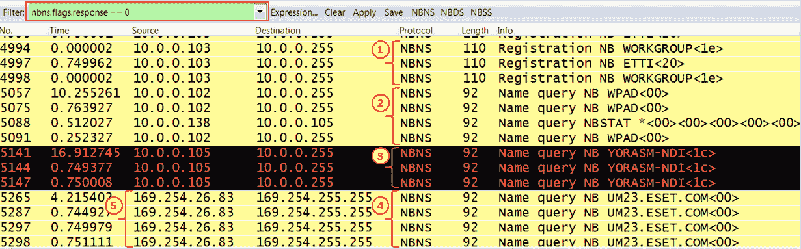

图 15.1: NBNS 数据包类型

3.  正如您在前面的屏幕截图中看到的，在捕获文件中，您将看到以下内容:
    *   **NBNS 注册包(1)** :在例子中，有名字为`WORKGROUP`和`ETTI`的注册。NBNS 服务器将通过向请求节点发出肯定或否定的名称注册响应来接受或拒绝名称注册。如果没有接收到，请求节点将认为它是正常的。
    *   **NBNS 查询(2、3 和 4)** :针对指定的名称发送查询。如果有 NBNS 服务器(这是域控制器)，您将看到以下响应之一:
        *   请求的名称不存在(代码`3`)
        *   无错误(代码`0`)

4.  确保没有来自以`169.254` ( **5** )开头的地址的注册或任何其他请求。这些是**自动私有 IP 地址** ( **APIPA** )地址。这实际上意味着 PC 被配置为自动接受地址(通过 DHCP ),但它还没有收到地址。
5.  还有许多公告包。这些将在 UDP 端口`138`上广播。在这里，您将看到每个工作站都公布了其功能:工作站、服务器、打印服务器等等。例如，您可以在这里看到:
    *   `172.16.100.10`名为`FILE-SRV`，其功能类似于工作站、服务器和 SQL server ( **1** )
    *   `172.16.100.204`名为`GOLF`，其功能类似于工作站、服务器和打印队列服务器( **2**

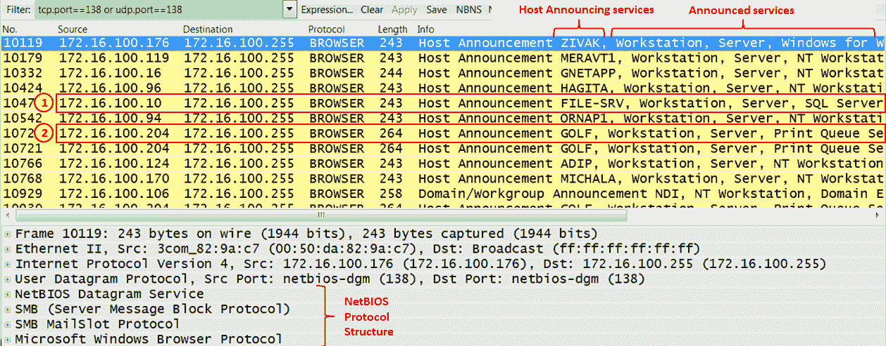

图 15.2: NetBIOS 服务公告

6.  有一些蠕虫和病毒正在使用 NetBIOS 名称服务来扫描网络。寻找不寻常的模式，如大规模扫描，高广播率，等等。
7.  验证你没有太多的广播。5 至 10 个广播/分钟/设备是合理的。超过这个通常意味着有问题。

您可以在这里看到数百种消息场景。使用 Wireshark 专家系统、Google 和常识找出问题。

# 具体问题

以下是您在日常操作中可能会遇到的一些问题:

*   使用 SMB(用于通过网络浏览目录、复制文件和其他操作的协议)，您可能会看到一些错误代码。错误类别和代码的完整列表在微软 MSDN:[http://msdn.microsoft.com/en-us/library/ee441884.aspx](http://msdn.microsoft.com/en-us/library/ee441884.aspx)和[https://tinyurl.com/y7kuxygd](https://tinyurl.com/y7kuxygd)中列出。
*   代码`0`就是`STATUS_OK`的意思，暗示一切正常，没有问题。应该检查任何其他代码。
*   在下面的例子中，您可以看到一条消息`STATUS_ACCESS_DENIED`。这是您应该查找的许多错误代码之一。在本例中，在 IP 地址以`203`开头的服务器上访问`\NAS01HOMEDIR`(出于安全原因，隐藏了完整地址)被拒绝。
*   当你试图浏览主目录时，Windows 通常会显示一条拒绝访问的信息或类似的信息。当应用试图访问某个目录但无法访问该目录时，可能会发生此问题。在这种情况下，您会看到一条拒绝访问消息、一条软件通信问题消息或程序员为您制作的任何其他消息。在这种情况下，使用 Wireshark 会让您找到确切的错误，Google 会告诉您错误的原因:

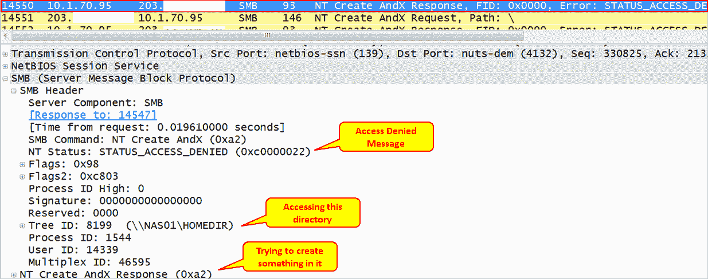

图 15.3: SMB 错误类别和代码—拒绝访问

*   在下一个例子中，我们看到了在`\NAS01SAMIM` ( **3** )的会话设置( **1** )期间发生的状态`STATUS_MORE_PROCESSING_REQUIRED` ( **2** )。
*   查看前面提到的链接，我们看到这是因为在指定的命名管道上，有更多的数据可供读取。
*   简短的谷歌搜索告诉我们，这可能表明一个凭证问题。请咨询您的系统管理员:

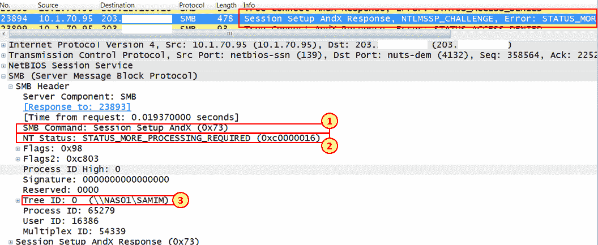

图 15.4: SMB 错误类别和代码—命名管道

*   要查看所有 SMB 错误消息，请键入筛选器`smb.nt_status != 0x0`。您将获得所有错误响应，如下面的屏幕截图所示:

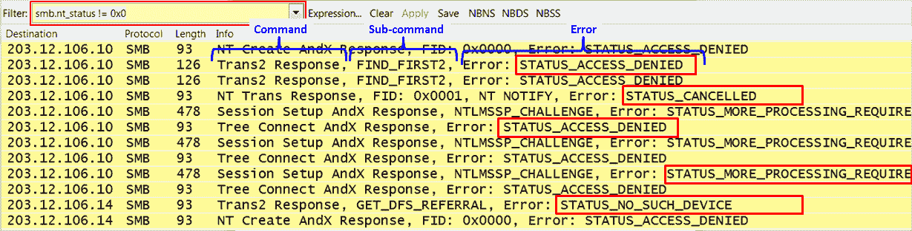

图 15.5: SMB 错误类别和代码—过滤错误

# 还有更多...

在这一节中，我将展示一些例子来更好地理解 NetBIOS 协议。

# 示例 1–应用冻结

在下面的屏幕截图中，我们看到了应用冻结的原因:

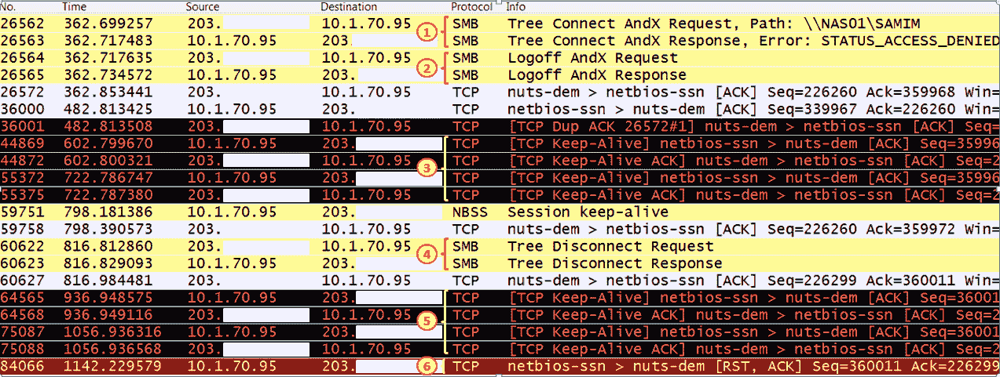

图 15.6:错误条件—应用冻结

在示例中，我们进行了以下观察:

*   IP 地址以`203`开头的客户端试图连接到 IP 地址为`10.1.70.95`的服务器上的`\NAS01SAMIM`，并返回一个`STATUS_ACCESS_DENIED`错误
*   `10.1.70.95`上的服务器回答访问被拒绝
*   由于应用在等待，TCP 用保活消息保持连接
*   过了一会儿，客户端发送服务器批准的断开请求
*   应用等待，TCP 通过保持活动来维持连接
*   TCP 用`RST`(复位)关闭连接

客户在这里看到的是应用冻结。

# 示例 2–中小企业引发的广播风暴

在我的一个客户的网络中，我接到一个紧急电话，说一个远程办公室与总部断开了连接。一些网络细节如下:

*   远程办公室地址在子网`172.30.121.0/24`上，具有默认网关`172.30.121.254`。
*   HQ 地址在子网`172.30.0.0/24`上。远程办公室和总部之间的连接是通过 MPLS 网络使用 l3ip-VPN。

为了解决这个问题，我做了以下工作:

*   我试着连接总部的服务器。我没有得到回应。
*   我打电话给为中心提供线路的服务提供商，他们说在他们的监控系统上他们没有看到线路上有任何负载。
*   我 pinged 了本地路由器`172.30.121.254`，没有得到响应。这意味着局域网上的 pc 机甚至不能到达它们的本地路由器，这是它们的默认网关。
*   我将带有 port-mirror 的 Wireshark 连接到路由器端口，看到了类似下面的截图:

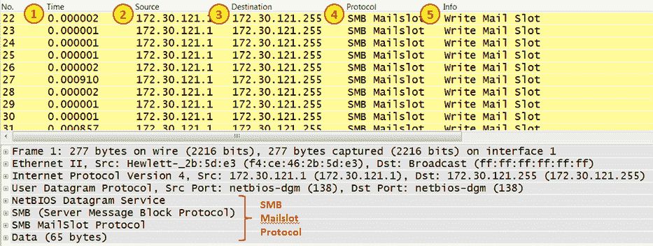

图 15.7:错误条件—广播风暴

*   我看到 IP 地址为`172.30.121.1`的主机在几微秒( **1** )内产生了大量的数据包。数据包被广播( **3** )，生成它们的服务是`Write Mail Slot` ( **5** )，由`SMB Mailslot`协议( **4** )发送。
*   为了了解包的数量，我使用了 I/O graphs 特性。我得到了每秒 5000 个包，这产生了 10 Mbps，阻塞了可怜的旧路由器端口(将路由器端口更改为 100 Mbps 或 1 Gbps 无济于事；它仍然会被封锁。
*   当我在谷歌或微软上没有找到任何关于它的信息时，我开始停止我不知道的服务，在每次改变后跟踪广播发生了什么。最终我发现导致问题的服务叫做`LS3Bcast.exe`。我阻止了它，确保它不再回来，就这样。

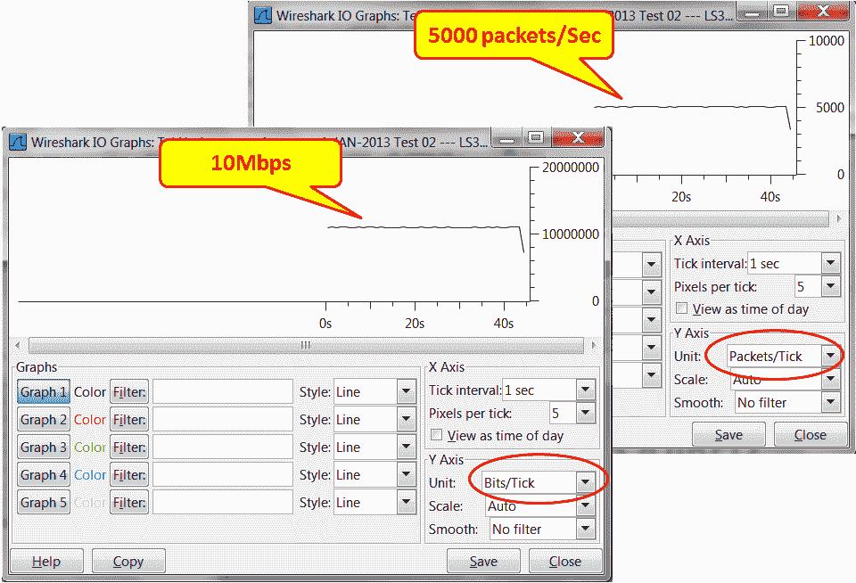

图 15.8: SMB 广播风暴—流量率

# 分析数据库流量和常见问题

你们中的一些人可能想知道为什么我在这里增加了这个部分。毕竟，数据库被认为是 IT 环境中完全不同的一个分支。一边是数据库和应用，另一边是网络和基础设施。这是正确的，因为我们不应该调试数据库；这方面有 DBA。但是通过网络上的信息，我们可以发现一些问题，帮助数据库管理员解决问题。

在大多数情况下，IT 人员会先来找我们，因为人们把一切都归咎于网络。我们必须确保问题不是来自网络，仅此而已。在少数情况下，我们将在捕获文件中看到一些细节，这些细节可以帮助 DBA 完成他们正在做的工作。

# 做好准备

当 IT 团队向我们抱怨网络速度慢时，我们需要做一些事情来证实事实并非如此。遵循下一节中的说明，以确保我们避免缓慢的网络问题。

# 怎么做...

如果数据库出现问题，请按照下列步骤操作:

1.  当您收到关于网络响应缓慢的投诉时，开始询问这些问题以准确地确定问题:
    *   这个问题是地方性的还是全球性的？它是只发生在远程办公室，还是也发生在中心？当问题出现在整个网络中时，它不是 WAN 带宽问题。
    *   所有客户的情况都一样吗？如果不是，可能是某个特定的问题只发生在某些用户身上，因为只有这些用户在运行导致该问题的特定应用。
    *   客户端和服务器之间的通信线路是否加载？加载它们的应用是什么？
    *   是所有应用都运行缓慢，还是只有应用与特定的数据库协同工作？可能是部分 PC 旧了，累了，还是服务器耗尽了资源？
2.  完成问卷后，让我们开始工作:
    1.  打开 Wireshark 并开始捕获数据包。您可以将端口镜像配置到特定的 PC、服务器、VLAN 或连接到您拥有客户端的远程办公室的路由器。
    2.  查看 TCP 事件(专家信息)。它们发生在整个通信链路上、特定的 IP 地址上还是特定的 TCP 端口号上？这将有助于您隔离问题，并验证问题是出在特定的链路、服务器还是应用上。

当测量互联网连接的流量时，您会收到许多对网站、邮件服务器等的重新传输和重复确认。这就是互联网。在一个组织中，您应该预计有 0.1%到 0.5%的重新传输。当连接到互联网时，您可以期待更高的数字。

3.  如果您发现网络中存在问题，请按照我们在前面章节中所学的方法解决问题。但是，有一些网络问题会影响数据库行为。在下面的例子中，我们看到了一个客户端的行为，它通过一条往返延迟为 35 到 40 毫秒的通信线路与服务器协作。
    1.  我们正在查看第八个 TCP 流( **1** )，连接以 TCP SYN/SYN-ACK/ACK 开始。我把这个作为参考( **2** )。我们可以看到整个连接用了 371 个包( **3** )。

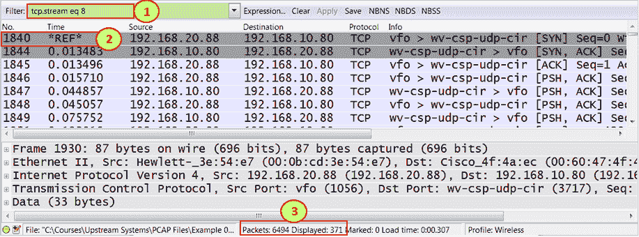

图 15.9:跟随 TCP 流

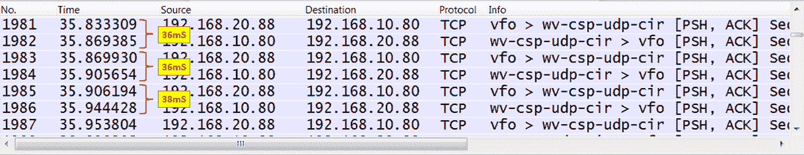

图 15.10:数据库请求和响应—时间间隔

4.  在这种情况下，您应该向 DBA 咨询如何显著减少网络上运行的数据包数量；或者，您可以转到另一种访问方式，例如，终端服务器或 web 访问。
5.  另一个可能发生的问题是，您将有一个软件问题，这将反映在捕获文件中。如果你看一下下面的截图，你会看到有五次重新传输，然后从客户端打开一个新的连接。这看起来像是 TCP 问题，但它只发生在软件的特定窗口中。它只是一个停止处理的软件过程，这阻止了 TCP 对客户端的响应:

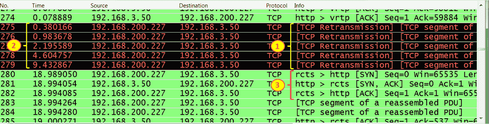

图 15.11:跟随 TCP 流—重新传输

# 它是如何工作的...

嗯，数据库如何工作对我来说一直是个谜。我们的任务是找出它们是如何影响网络的，这是我们在本节中学到的。

# 还有更多...

当您右键单击数据库客户端到服务器会话中的一个数据包时，将会打开一个包含对话的窗口。了解网络上运行的内容对 DBA 很有帮助。

当您面临延迟问题时，例如，当通过互联网或国际连接上的蜂窝线路工作时，服务器的数据库客户机并不总是足够有效。您可能需要通过 web 或终端访问数据库。

一个重要的问题是数据库如何工作。如果客户机正在访问数据库服务器，而数据库服务器正在使用从另一台服务器共享的文件，则可能是客户机-服务器工作得很好，但问题来自数据库服务器和文件服务器上的共享文件。在开始测试之前，请确保您了解所有这些依赖关系。

最重要的是，确保你有非常专业的 DBA 朋友。有一天你会需要它们。

# 导出 SMB 对象

导出 SMB 对象是导出 SMB 统计数据的一个简单功能。

# 做好准备

要导出 HTTP 对象，请选择文件|导出对象| SMB/SMB2。

# 怎么做...

要导出 SMB 对象，请执行以下步骤:

1.  您可以在捕获运行时使用此功能，也可以对捕获的文件运行此功能。您将看到以下窗口:

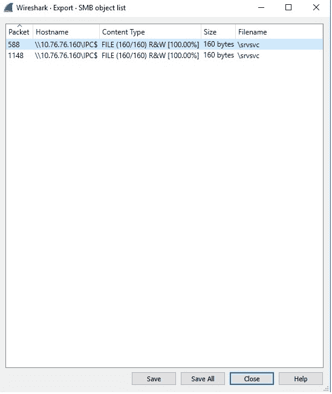

图 15.12:SMB—对象导出

2.  从这里，您可以获得被访问的服务器列表，包括每个服务器中被访问的文件。您可以看到数据包编号、主机名、内容类型(操作模式，读或读/写)、大小和文件名。

3.  您可以使用“另存为”或“全部保存”按钮将数据保存在文件中。
4.  在“内容类型”列中，您将看到以下内容:
    *   文件:如果访问的内容是由指定服务器提供的文件。
    *   PIPE:正如我们在本章前面几节中讨论的，SMB 也用于 IPC。对于这种 IPC 机制，SMB 系统提供了命名管道服务。例如，微软的 RPC over SMB 实现使用命名管道基础设施运行。关于命名管道的详细信息超出了本书的范围，Wireshark 发现的任何其他文件也是如此。

要使用导出 SMB 对象功能，首先转到 TCP 首选项并启用 TCP 数据包重组(允许子分配器重组 TCP 流)。

成功导出并保存后，您应该会看到通过重组数据包构建的数据(文件、图片或任何使用 SMB 访问的内容)。

# 它是如何工作的...

此功能扫描当前打开的捕获文件或正在运行的捕获中的 SMB 数据包，获取重组的对象，并允许您将它们保存到磁盘。然后，可以用适当的查看器打开保存的对象，或者在可执行文件的情况下，只需点击它们就可以执行它们。此功能可用于各种目的，包括窃听和保存备份对象(例如，通过文件共享访问的文件)。