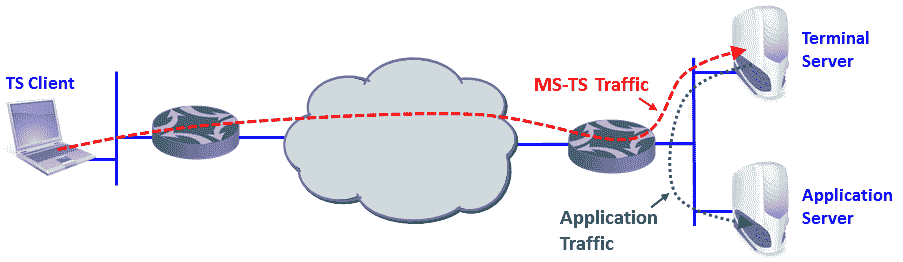

# 十六、分析企业应用的行为

在本章中，我们将介绍以下配方:

*   找出网络上运行的内容
*   分析微软终端服务器和 Citrix 的问题和协议
*   分析数据库流量和常见问题
*   分析 SNMP

# 介绍

Wireshark 的一个重要用途是应用分析和故障排除。当应用变慢时，可能是因为 LAN(在有线 LAN 中相当少见)、WAN 服务(由于带宽不足或高延迟而常见)或缓慢的服务器或客户端(我们将在 TCP 窗口问题中看到这种情况)。这也可能是由于缓慢或有问题的应用。

本章的目的是深入了解应用如何工作的细节，并提供隔离和解决这些问题的相关指南和方法。在第一个食谱中，我们将学习如何找出并分类在我们的网络上工作的应用。然后，我们将浏览各种类型的应用，看看它们是如何工作的，网络如何影响它们的行为，以及什么会出错。

在本章中，我们将学习如何使用 Wireshark 来解决企业网络中常见的应用问题并排除故障。这些是微软终端服务器和思杰，数据库，和简单网络管理协议(T2)。

# 找出网络上运行的内容

当监控一个新网络时，首先要做的是找出在其上运行的是什么。有各种类型的应用和网络协议，当它们都在网络上运行时，会相互影响和干扰。

在某些情况下，您将拥有不同的 VLANs、不同的**虚拟路由和转发** ( **VRFs** )，或者连接到刀片服务器中虚拟端口的服务器。最终，所有东西都运行在同一个基础设施上，它们可以相互影响。

vrf 和 VLANs 之间有一个常见的混淆。即使它们的目的完全相同，但它们在不同的地方配置。虽然 VLAN 是在 LAN 中配置的，以便在 OSI 第 1 层和第 2 层提供网络隔离，但 vrf 是路由表的多个实例，使它们共存于同一路由器中。这是第 3 层操作，在不同客户的网络之间分离。vrf 通常出现在服务提供商环境中，使用**多协议标签交换** ( **MPLS** )通过同一路由器网络向不同客户提供第 3 层连接，这样任何客户都无法看到任何其他客户的网络。

在这份食谱中，我们将了解如何详细了解网络上运行的内容，以及会降低速度的应用。

术语刀片式服务器指的是服务器机箱，它是前面有服务器架、后面有局域网交换机的机箱。它有几种不同的缩写；比如 IBM 称之为刀片中心，惠普称之为刀片系统。

# 做好准备

当您进入一个新的网络时，要做的第一件事就是连接 Wireshark 来嗅探应用和协议上运行的内容。请确保您遵循以下几点:

*   当需要监控服务器时，对其进行端口镜像，并查看其网络连接上运行的是什么。
*   当您需要监控远程办公室时，端口镜像将您连接到 WAN 连接的路由器端口。然后，检查有什么东西在上面跑。
*   当你需要监控一个缓慢的互联网连接时，端口镜像它，看看那里发生了什么。

在这个菜谱中，我们将看到如何使用 Wireshark 工具来分析什么正在运行，什么会导致问题。

# 怎么做...

要分析谁在说话，请遵循以下步骤:

1.  使用上一节提到的选项之一连接 Wireshark。
2.  您可以使用以下工具:
    *   导航到统计|协议层次结构，查看网络上运行的协议以及占总流量的百分比
    *   导航到统计|对话，查看谁在发言以及使用了什么协议

3.  在协议层次结构功能中，您将看到一个窗口，帮助您分析谁在通过网络交谈。如下图所示:

在前面的屏幕截图中，您可以看到协议分布:

*   以太网:IP、**逻辑链路控制** ( **LLC** )和配置测试协议(环回)
*   互联网协议版本 4: UDP、TCP、**协议独立组播** ( **PIM** )、**互联网组管理协议** ( **IGMP** )、**通用路由封装** ( **GRE** )

如果您单击+号，将会显示所有底层协议。

要查看特定的协议吞吐量，请单击下面屏幕截图所示的协议。您将看到捕获期间应用的平均吞吐量(本例中为 HTTP):

单击 HTTP 左侧的+号将打开在 HTTP 上运行的协议(XML、MIME、JavaScripts 等)及其在捕获期间的平均吞吐量的列表。

# 还有更多...

在某些情况下(尤其是当您需要准备管理报告时)，您需要提供网络统计数据的图形图像。对此有各种来源，例如:

*   **ether ape(Linux 版)**:【http://etherape.sourceforge.net/ 
*   **指南针(Windows 版)**:[http://download . CNET . com/Compass-Free/3000-2085 _ 4-75447541 . html？tag = mncol1](http://download.cnet.com/Compass-Free/3000-2085_4-75447541.html?tag=mncol;1)

# 分析 Microsoft 终端服务器和 Citrix 通信问题

微软终端服务器，使用**远程桌面协议** ( **RDP** )和 Citrix metaframe **独立计算架构** ( **ICA** )协议，广泛用于 pc 机和瘦客户机的本地和远程连接。关于这些类型的应用，需要记住的重要一点是，它们通过网络传输屏幕变化。如果只有很少的变化，它们将需要很低的带宽。如果有许多变化，它们将需要高带宽。

另一件事是，这些应用中的流量完全不对称。下行流量从几十 Kbps 到几 Mbps 不等，而上行流量最多几 Kbps。在使用这些应用时，不要忘记根据这一点来设计您的网络。

在本食谱中，我们将看到这些应用的一些典型问题以及如何定位它们。为了写作方便，我们会参考微软终端服务器，每次写微软终端服务器都会参考这一类的所有应用，比如 Citrix Metaframe。

# 做好准备

当怀疑 Microsoft 终端服务器运行缓慢时，首先向用户询问问题是什么。然后，将 Wireshark 连接到网络，并将端口镜像到投诉客户端或服务器。

# 怎么做...

当涉及到 Microsoft 终端服务器时，要找到问题所在，首先要找到用户并提出问题。请遵循以下步骤:

1.  当用户抱怨网络速度慢时，问他们一个简单的问题:当他们切换窗口时，他们看到屏幕上显示的数据慢了吗？
2.  如果他们说 windows 之间切换很快，那就不是微软终端服务器的问题了。微软终端服务器问题会导致窗口变化缓慢、图片冻结、图形文档滚动缓慢等等。
3.  如果他们说他们正在尝试生成报告(当软件在 Microsoft 终端服务器上运行时)，但报告是在很长一段时间后生成的，这是数据库问题，而不是 Microsoft 终端服务器或 Citrix 的问题。
4.  当用户通过高延迟的通信线路使用 Microsoft 终端服务器并快速键入时，他们可能会遇到字符延迟。这是因为 Microsoft 终端服务器正在传输窗口更改，由于延迟时间长，这些窗口更改的传输速度会很慢。
5.  使用 Wireshark 测量通信线路时:
    *   使用 I/O 图形监控线路
    *   使用过滤器监控上游和下游方向
    *   在 *y* 轴上配置每秒位数

6.  您将获得以下截图:

7.  在前面的屏幕截图中，您可以看到一个典型的流量模式，下行流量很高，上行流量很低。请注意，Y 轴配置为位/节拍。在 485 秒和 500 秒之间的时间内，您会看到吞吐量达到最大值。这时应用会变慢，用户会开始感觉到屏幕冻结，菜单移动非常慢，等等。

当 Citrix ICA 客户端连接到演示服务器时，它使用 TCP 端口`2598`或`1494`。

8.  当监视 Microsoft 终端服务器时，不要忘记客户端通过 Microsoft 终端服务器访问服务器，而服务器通过安装在服务器上的另一个客户端访问应用。性能问题可能来自 Microsoft 终端服务器或应用。

9.  如果问题是 Microsoft 终端服务器的问题，则有必要确定是网络问题还是系统问题:
    *   使用 Wireshark 检查网络，查看是否有负载。可以通过简单地增加通信线路来解决上一个屏幕截图中显示的负载。
    *   检查服务器的性能。像 Microsoft Terminal Server 这样的应用大部分都消耗内存，所以主要检查内存(RAM)问题。

# 它是如何工作的...

Microsoft 终端服务器、Citrix Metaframe 和应用只是通过网络传输窗口更改。从你的客户端(带软件客户端或瘦客户端的 PC)，你连接到终端服务器；和终端服务器运行各种客户端，用于从它连接到其他服务器。在下面的截图中，可以看到终端服务器运行的原理:

# 还有更多...

从终端服务器供应商那里，您会听到他们的应用改进了两件事。他们会说，它提高了客户机的可管理性，因为你不必为每个用户管理电脑和软件；您只需在服务器上安装所有东西，如果有什么东西出现故障，您可以在服务器上修复它。他们还会说网络上的流量会减少。

好吧，我不会进入第一场争论。这不是我们的主题，但我强烈反对第二个。使用终端客户端时，您的流量完全取决于您正在做的事情:

*   当使用基于文本/字符的应用时，例如，一些**企业资源计划** ( **ERP** )屏幕，你输入并读取数据。使用终端客户端时，您将连接到终端服务器，而终端服务器将连接到数据库服务器。根据您使用的数据库应用，终端服务器可以显著提高性能，也可以根本不提高性能。我们将在数据库部分讨论这一点。在这里，您可以预期几十到几百 Kbps 的负载。
*   如果您正在处理常规的 office 文档，如 Word、PowerPoint 等，这完全取决于您正在做什么。处理一个简单的 Word 文档需要几十到几百 Kbps。使用 PowerPoint 将需要数百 Kbps 到数 Mbps，当您全屏显示 PowerPoint 文件时( *F5* 函数),吞吐量可高达 8 到 10 Mbps。
*   浏览互联网的速度从几百 Kbps 到几 Mbps 不等，取决于你在上面做什么。高分辨率的电影通过终端服务器传到互联网上——好吧，不要这样做。

在实现任何终端环境之前，请对其进行测试。我曾经有一个软件公司希望他们的 logo(在用户窗口的右上角)非常清晰醒目。他们每秒刷新 10 次，导致 2 Mbps 的通信线路被阻断。你永远不知道你不测试什么！

# 分析数据库流量和常见问题

你们中的一些人可能想知道为什么我们在这里有这个部分。毕竟，数据库被认为是 IT 环境中完全不同的一个分支。一边是数据库和应用，另一边是网络和基础设施。这是正确的，因为我们不应该调试数据库；这方面有 DBA。但是通过网络上的信息，我们可以看到一些问题，这些问题可以帮助数据库管理员解决相关问题。

在大多数情况下，IT 人员会先来找我们，因为人们把一切都归咎于网络。我们必须确保问题不是来自网络，仅此而已。在少数情况下，我们会在捕获文件中看到一些细节，可以帮助 DBA 完成他们正在做的工作。

# 做好准备

当 IT 团队向我们抱怨网络速度慢时，需要做一些事情来验证事实并非如此。按照下一节中的说明操作，以确保避免网络速度慢的问题。

# 怎么做...

如果数据库出现问题，请按照下列步骤操作:

1.  当您抱怨网络响应缓慢时，开始询问以下问题:
    *   这个问题是地方性的还是全球性的？它是只发生在远程办公室还是也发生在中心？当问题出现在整个网络中时，它不是 WAN 带宽问题。
    *   所有客户的情况都一样吗？如果不是，那么可能是某个特定的问题只发生在某些用户身上，因为只有那些用户在运行导致该问题的特定应用。
    *   客户端和服务器之间的通信线路是否加载？加载它们的应用是什么？
    *   是所有应用都运行缓慢，还是只有应用与特定的数据库协同工作？可能是部分 PC 旧了，累了，还是服务器耗尽了资源？
2.  完成问卷后，让我们开始工作:
    1.  打开 Wireshark 并开始捕获数据包。您可以将端口镜像配置到特定的 PC、服务器、VLAN 或连接到拥有客户端的远程办公室的路由器。
    2.  查看 TCP 事件(专家信息)。它们发生在整个通信链路上、特定的 IP 地址上还是特定的 TCP 端口号上？这将有助于您隔离问题，并检查问题是否出在特定的链路、服务器或应用上。

When measuring traffic on a connection to the internet, you will get many retransmissions and duplicate ACKs to websites, mail servers, and so on. This is the internet. In an organization, you should expect 0.1 to 0.5 percent of retransmissions. When connecting to the internet, you can expect much higher numbers.

3.  如果您发现网络中存在问题，请按照我们在前面章节中所学的方法解决问题。但是有一些网络问题会影响数据库行为。在下面的例子中，我们看到了一个客户端的行为，它通过一条通信线路与服务器协作，往返延迟为 35 到 40 毫秒。
4.  我们正在查看编号为 8 ( **1** )的 TCP 流，连接以 TCP SYN/SYN-ACK/ACK 开始。我把这个作为参考( **2** )。我们可以看到整个连接用了 371 个数据包( **3** ):

5.  连接继续，我们可以看到数据库请求和响应之间的时间间隔大约为 35 毫秒:

6.  因为我们有 371 个包来回传输，371 x 35 毫秒给了我们大约 13 秒。再加上一些可能发生的重新传输和一些低效率，这会导致用户等待 10 到 15 秒甚至更长时间来执行数据库查询。
7.  在这种情况下，您应该向 DBA 咨询如何显著减少通过网络传输的数据包的数量，或者您可以采用另一种访问方式，例如终端服务器或 web 访问。
8.  另一个可能发生的问题是，您将有一个反映在捕获文件中的软件问题。如果你看一下下面的截图，你会看到有五次重新传输，然后从客户端打开一个新的连接。这看起来像是 TCP 问题，但它只出现在软件的特定窗口中。它只是一个停止处理的软件过程，这阻止了 TCP 对客户端的响应:

# 它是如何工作的...

数据库的工作方式对我来说一直是个奇迹。我们的任务是找出它们是如何影响网络的，这是我们在本节中学到的。

# 还有更多...

当您右键单击数据库客户端到服务器会话中的一个数据包时，将会打开一个包含对话的窗口。了解网络上运行的内容对 DBA 很有帮助。

当您面临延迟问题时，例如，当通过互联网或国际连接上的蜂窝线路工作时，服务器的数据库客户机并不总是足够有效。您可能需要通过 web 或终端访问数据库。

一个重要的问题是数据库如何工作。如果客户机正在访问数据库服务器，而数据库服务器正在使用从另一个服务器共享的文件，那么客户机-服务器可能工作得很好；但是问题是从数据库服务器到文件服务器上的共享文件。在开始测试之前，请确保您了解所有这些依赖关系。

最重要的是，确保你的朋友中有非常专业的 DBA。总有一天，你会需要它们的！

# 分析 SNMP

SNMP 是一种众所周知的协议，用于通过定期收集数据和统计信息来监控和管理网络中不同类型的设备。除了监视之外，它还可以用于配置和修改设置，并给予 SNMP 服务器适当的授权。通常支持 SNMP 的设备有交换机、路由器、服务器、工作站、主机、VoIP 电话等等。

要知道 SNMP 有三个版本:SNMPv1、SNMPv2c 和 SNMPv3，这一点很重要。后来出现的 v2c 和 v3 版本提供了更好的性能和安全性。

SNMP 由三个组件组成:

*   被管理的设备(称为被管理设备)。
*   SNMP 代理。这是一个运行在被管理设备上的软件，它从设备上收集数据并将其存储在一个数据库中，该数据库被称为**管理信息库(MIB)** 数据库。按照配置，这个 SNMP 代理定期将数据/统计数据导出到服务器(使用 UDP 端口`161`),以及任何事件和陷阱。
*   SNMP 服务器，也叫**网络管理服务器**(**)。这是一个服务器，它与网络中的所有代理进行通信，以收集导出的数据并构建一个中央存储库。SNMP 服务器提供对管理网络的 IT 人员的访问；他们可以远程监控、管理和配置网络。**

 **了解设备中实现的某些 MIB 可能是特定于供应商的，这一点非常重要。几乎所有的供应商都宣传在他们的设备中实现的这些 MIB。**  **# 做好准备

一般来说，我们从网络管理团队收到的投诉是关于在特定时间间隔内没有从设备获得任何统计数据或陷阱，或者对设备完全不可见。按照下一节中的说明来分析和解决这些问题。

# 怎么做...

如果出现 SNMP 问题，请遵循以下步骤。

当您收到关于 SNMP 的投诉时，开始问这些问题:

1.  这是最近带入网络的新的被管理设备吗？换句话说，设备中的 SNMP 曾经正常工作过吗？
    *   如果这是新设备，请咨询相关设备管理员和/或检查 SNMP 相关配置，如团体字符串。
    *   如果 SNMP 配置看起来正确，请确保 NMS 的 IP 地址配置正确，并检查相关的密码凭据。
    *   如果正在使用支持加密的 SNMP v3，请确保检查与加密相关的设置，如传输方法。
    *   如果设置和配置看起来有效且正确，请确保被管理设备与 NMS 连接，这可以通过简单的 ICMP pings 来验证。
2.  如果被管理设备工作正常，并且在特定时间内没有报告任何统计数据或警报:
    *   讨论中的设备在控制平面或管理平面中是否有任何问题阻止其导出 SNMP 统计数据？请注意，对于网络中的大多数设备，SNMP 是优先级最低的协议，这意味着如果设备有更高优先级的进程要处理，它会将 SNMP 请求和响应保留在队列中。
    *   该问题是仅出现在特定设备上，还是出现在网络中的多台设备上？
    *   网络(被管理设备和 NMS 之间)是否遇到任何问题？例如，在任何第 2 层生成树聚合期间，受管设备和 SNMP 服务器之间可能会发生流量丢失，NMS 将因此失去对受管设备的可见性。

正如您在下图中看到的，IP 地址为`172.18.254.139`的 SNMP 服务器正在对 IP 地址为`10.81.64.22`的工作站执行带有序列`GET-NEXT-REQUEST`的 SNMP 遍历，该工作站反过来以`GET-RESPONSE`响应。为简单起见，用于这些捕获的 Wireshark 过滤器是 SNMP。

工作站启用了 SNMP v2c，社区字符串为 public。

让我们讨论一些常见的故障场景。

# 用错误的 SNMP 版本轮询被管理设备

正如我前面提到的，工作站启用了 v2c，但是当 NMS 用错误的 SNMP 版本轮询设备时，它没有得到任何响应。因此，确保使用正确的 SNMP 版本轮询受管设备非常重要。

# 用错误的 MIB 对象 ID 轮询被管理设备(OID)

在以下示例中，NMS 正在轮询被管理设备，以获取在接口上发送的字节数。字节计数的 MIB OID 是. 1.3.6.1.2.1.2.2.1.16，即 ifOutOctets。讨论中的被管理设备有两个接口，分别映射到 OID 1 . 3 . 6 . 1 . 2 . 1 . 2 . 1 . 16 . 1 和 1 . 3 . 6 . 1 . 2 . 1 . 2 . 1 . 16 . 2。当 NMS 轮询设备以检查第三个接口(不存在)的统计数据时，它返回一个`noSuchInstance`错误。

# 它是如何工作的...

正如您在前面的章节中所了解到的，SNMP 是一个非常简单明了的协议，所有与它相关的标准和 MIB OIDs 信息都可以在互联网上找到。

# 还有更多...

以下是一些关于 SNMP 和 MIB OIDs 的有用信息的网站:

*   微软 TechNet SNMP:**[https://TechNet . Microsoft . com/en-us/library/cc 776379(v = ws . 10)。aspx](https://technet.microsoft.com/en-us/library/cc776379(v=ws.10).aspx)**
***   思科 IOS MIB 定位器:[http://mibs.cloudapps.cisco.com/ITDIT/MIBS/servlet/index](http://mibs.cloudapps.cisco.com/ITDIT/MIBS/servlet/index)****