# 十七、SIP、多媒体和 IP 电话故障排除

在本章中，您将了解:

*   IP 电话原理和正常操作
*   SIP 操作原理、消息和错误代码
*   基于 IP 和 RTSP 的视频
*   Wireshark 的 RTP 流分析和过滤功能
*   Wireshark 的 VoIP 通话重播功能

# 介绍

为了传输语音、视频或多媒体，我们需要执行两个功能。第一个是承载媒体流，主要是语音或视频，第二个是用于信令，即建立和终止呼叫，邀请参与者加入呼叫，等等。多年来，为信令提出了两个协议组:

*   ITU-T 协议集，包括作为该协议集的伞式协议的 H.323、用于注册和地址解析的 H.225、用于控制的 H.245 以及其他一些协议
*   IETF 协议套件，包括作为信令协议的 SIP(RFC 3261 和后来的更新)和描述会话参数的**会话描述协议**(**SDP**)(RFC 4566)

ITU-T 协议集在过去几年中逐步淘汰，今天的大多数应用都在使用 IETF 协议集，我们将在本章重点介绍 IETF 协议集。在下图中，您可以看到 IETF 协议套件的结构。

对于流传输，两个套件都使用 RTP 和 RTCP (RFC 3550 和更新版本)。RTP 用于媒体传输，RTCP 用于控制流的质量。

在基于 IP 的网络上传输多媒体会话有几种协议，如下图所示:

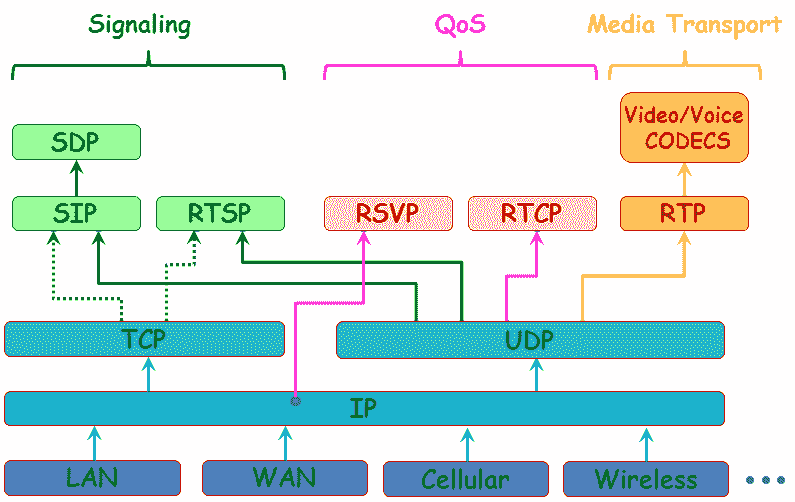

在本章中，我们将讨论不同的协议以及如何使用 Wireshark 分析音频和视频流。

# IP 电话原理和正常操作

IP 电话是将模拟语音呼叫转换成 IP 数据包并在 IP 网络上传输的概念。SIP 等呼叫信令协议将用于建立端点之间的呼叫会话，然后利用**实时传输协议** ( **RTP** )作为应用层协议，通过 IP 网络传输媒体流。音频(或视频)数据包将与 RTP 报头封装在一起，通常在 UDP 上运行。

在本菜谱中，我们将了解 IP 电话的正常运行，以及如何通过基于 Wireshark 的捕获分析将 RTP 和 RTCP 用于端到端音频流。

# 做好准备

由于 IP 电话将模拟呼叫转换为数字呼叫，因此只能在 IP 部分进行捕获。Wireshark 不能帮助捕获网络模拟部分的任何信号。

# 怎么做...

# RTP 操作

打开 Wireshark capture 并使用 Telephony 菜单导航至 RTP | RTP Streams，如以下屏幕截图所示:

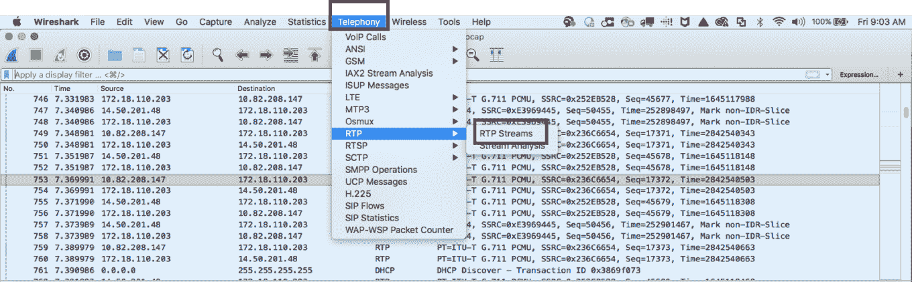

选择前面的选项将在新的弹出窗口中列出所有 RTP 流，如下所示:

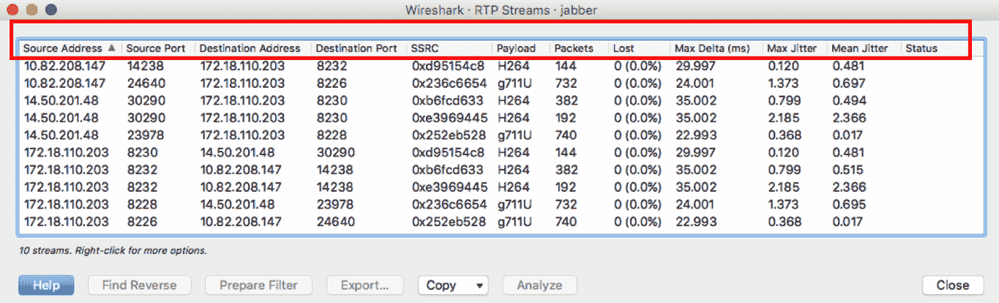

每个 RTP 流将以下列格式列出:

*   源地址:RTP 流端点的源 IP 地址。这可以是 IP 电话或电话会议单元。
*   源端口:UDP 头的源端口。会话发起者使用本地唯一的随机端口作为源端口。
*   目标地址:RTP 流端点的目标 IP 地址。
*   目的端口:UDP 报头的目的端口。会话发起者使用 RTP 端口范围中的一个端口作为目的端口。RTP 使用多种 UDP 端口来支持并发呼叫。端口范围从 16384 到 32767。
*   SSRC:同步源，这是一个 RTP 流标识符。
*   Payload:定义用于流的编解码器类型的 RTP 有效负载。
*   附加流数据:附加细节，包括为每个流捕获的数据包数量、丢失的数据包、抖动/延迟细节等。

从弹出窗口中选择相关的流或使用跟随流选项:

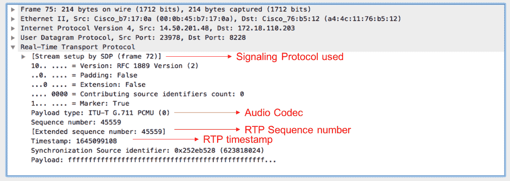

这些解释如下:

*   这是一个 RTP 数据包的屏幕截图。Wireshark 将突出显示设置此 RTP 数据包的信令协议的数据包编号。
*   RTP 包的有效载荷字段将描述所使用的音频编解码器。在前面的数据包中，G711 用作音频编解码器。
*   每个 RTP 分组将包括一个序列号，对于每个后续分组，该序列号将依次递增 1。
*   RTP 数据包还携带来自端点的时间戳。
*   序列号和时间戳用于衡量服务质量。

# RTCP 行动

获取 RTP 呼叫流的 UDP 端口号，并将其递增 1，并使用该端口号过滤相关的 RTCP 数据包。例如，如果 UDP 端口是用于 RTP 数据包的`24950`，则 UDP 端口`24951`将用于 RTCP 数据包。

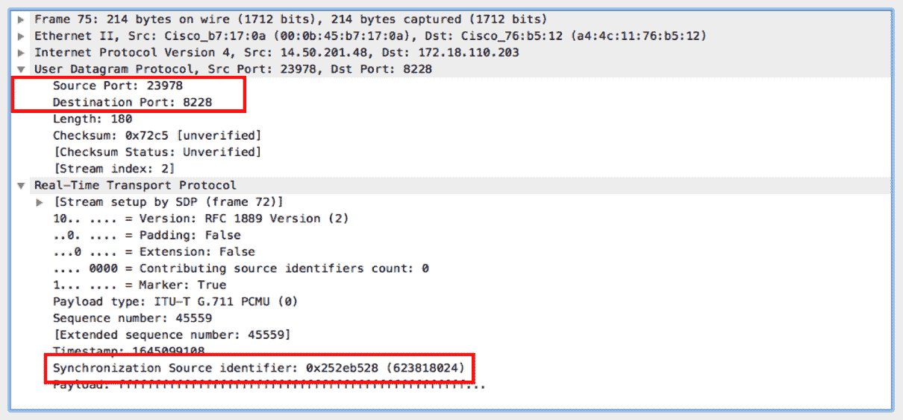

前面的屏幕截图是端点`14.50.201.48`和`172.18.110.203`之间使用 UDP 端口`23978`的一个 RTP 流的截图。与该 RTP 流相关联的 SSRC 是`0x252eb528`。通过使用 UDP 端口`23979`，我们可以识别该流的相关 RTCP 数据包:

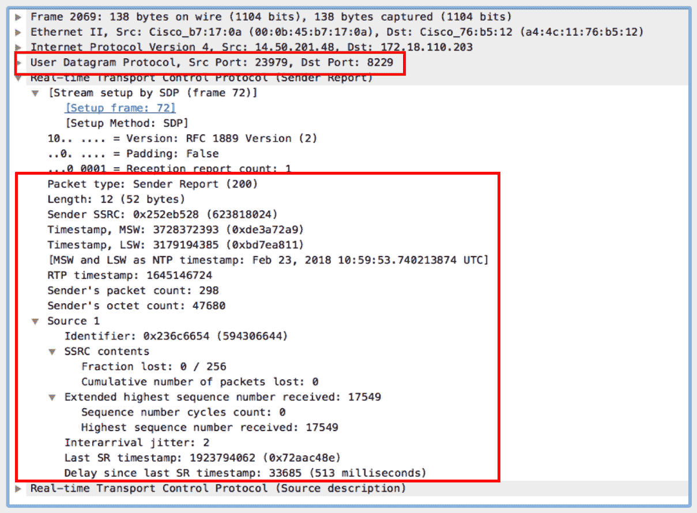

在前面的截图中，发送者 SSRC 将匹配 RTP 包的 SSRC(`0x252eb528`)。发送者报告是一种 RCTP 消息，携带 RTP 流的遥测细节。确保以下事项:

*   **损失分数**:这是零或完全在公差范围内。此计数器显示在当前和上一个发送者报告之间丢失的 RTP 数据包的数量。
*   **累计丢包数**:为零或在容许范围内。此计数器显示在此会话中丢失的 RTP 数据包的总数。
*   **到达间隔抖动**:这完全在**的范围内。**该计数器显示接收数据包的抖动测量值。

前面计数器中的任何问题都可能会指出端到端呼叫流程中的问题。关于 RTCP 的使用以及它如何帮助反馈循环的更多细节在*它如何工作中解释...*一节。

# 它是如何工作的...

IP 电话大量利用 RTP 和 RTCP 实现端到端呼叫流。RTP 是用于在端点之间传输媒体流(音频和视频)的应用层协议。

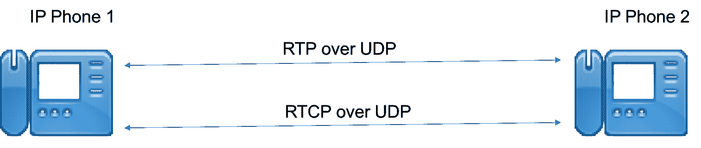

# RTP 操作原理

**RTP** 用于承载媒体。在 RTP 之前，我们有各种类型的语音和视频压缩编解码器。以下是 RTP 数据包的样本数据包格式:

RTP 报头携带特定于流和方向的细节，可用于会话识别、弹性和实时抖动/延迟测量。RTP 提供了定时恢复、丢失检测和纠正、有效载荷和源识别以及媒体同步的机制。

RTP 使用 UDP 作为传输层协议。在下图中，您可以看到 RTP 数据包结构:

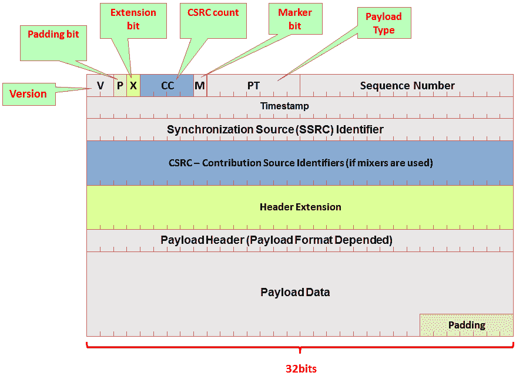

标题中的字段如下:

*   **版本(V)** :该字段表示 RTP 版本
*   **填充(P)** :该字段指示数据包在末尾包含一个或多个不属于有效载荷的附加填充字节
*   **扩展位(X)** :该字段指示标准报头之后的固定报头
*   **CSRC 计数(CC)** :该字段包含固定报头之后的 CSRC 字段的数量
*   **标记(M)** :该字段用于指示应用事件，例如视频帧边界
*   **有效载荷类型**:该字段标识由接收应用解释的 RTP 有效载荷的格式
*   **序列号**:每发送一个 RTP 包，该字段加 1。由接收器用来检测数据包丢失
*   **时间戳**:该字段反映 RTP 数据流中八位字节的采样率
*   **同步源(SSRC)** :该字段是随机选择的流标识符，使得同一 RTP 会话中没有两个同步源具有相同的 SSRC 标识符
*   **贡献源标识符列表(CSRC)** :该字段标识包含在该分组中的有效载荷的贡献源(即，流源)

在下图中，您可以看到序列和时间戳机制是如何工作的:

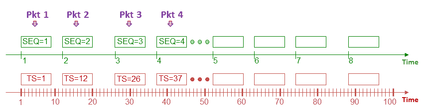

正如我们在图中看到的，每发送一个 RTP 数据包，序列号就增加一，而时间戳则增加一个数据包所覆盖的时间。例如，分组号 1 将两者都设置为 1；分组 2 将具有序列号 2 和时间戳 12；并且对于其他分组以这种方式继续。接收器将接收告诉他分组顺序的序列号和告诉他分组离开接收器的时间的时间戳。接收器将使用这两者来回放接收到的数据。

# RTCP 操作原理

RTCP 指定在会话的源和目标之间交换的报告。

RTCP 与 RTP 协同工作，端点使用它来监控 RTP 数据包的端到端质量，并通过以报告形式交换信息来控制传输。对于每个 RTP 流，将有一个 RTCP 流用于交换关于 RTP 流的不同报告。报告包含发送的 RTP-PDU 数量、丢失的 RTP-PDU 数量、到达间隔抖动等统计信息。应用可以使用这些报告来修改发送方的传输速率并用于诊断目的。

RTCP 有几种报告类型，发送方和接收方根据发送和接收的数据相互更新。以下是几种 RTCP 数据包类型:

*   发件人报告(类型 200)
*   接收方报告(201 型)
*   源描述(类型 202)
*   再见(203 型)
*   特定应用(204 型)

RFC 3550 中提供了每种类型的详细描述。在下面的屏幕截图中，您可以看到一个这样的例子，其中我们看到一个发送者报告，它告诉接收者发送了多少个数据包和八位字节、时间戳信息以及接收者可以使用的其他参数。

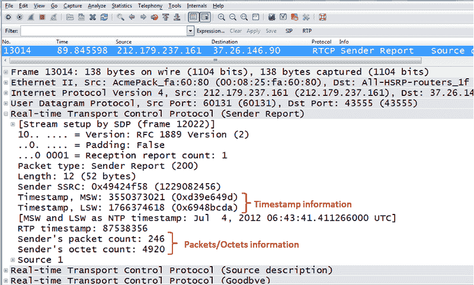

# SIP 操作原理、消息和错误代码

会话发起协议或 SIP (RFC 3261 和各种扩展)是在应用层操作的信令和控制协议，负责创建、修改和终止一个或多个参与者之间的多媒体会话。当发送 SIP 请求时，会话参数通过 SDP (SDP，RFC 4566)发送，这使得用户能够在它们之间就一组兼容的媒体类型达成一致。当会话被创建时，语音或视频由 RTP 传送，并且可选地由 RTCP 控制。

SIP 将端点定义为**用户代理** ( **UAs** )，并且创建会话的过程包括 UA 协商，以便就他们想要创建的会话的特征达成一致。对于诸如定位会话参与者、注册、呼叫转移等附加服务，SIP 定义了称为服务器的网络主机，UAs 可以向其发送注册、发送会话邀请以及其他请求。

在本菜谱中，我们将讨论协议集的信令部分，即 SIP，以及如何使用 Wireshark 来验证 SIP 的正常运行。

# 做好准备

为了建立端到端的呼叫流，可以在不同的 SIP 端点之间创建 SIP 会话。

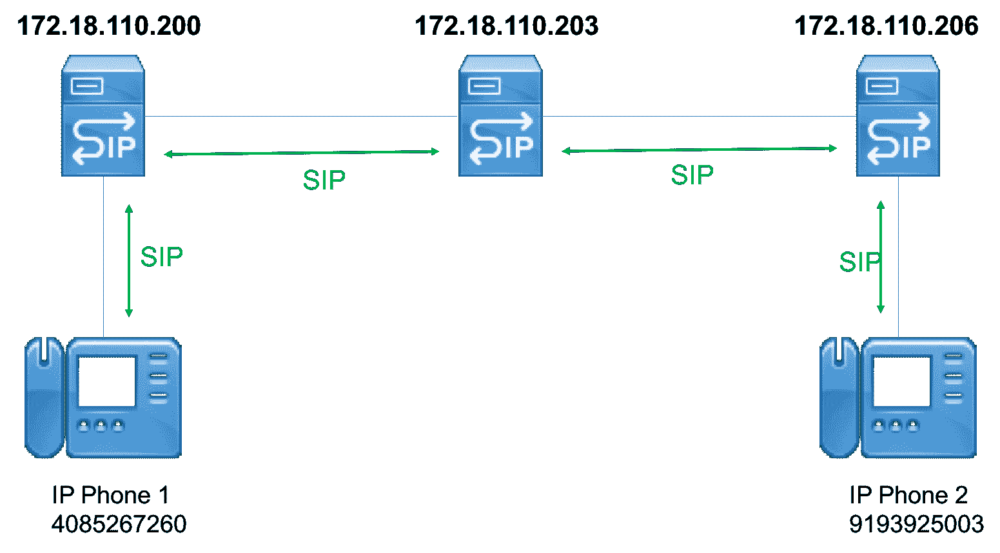

更好的方法是在多个会话共用的交换机或路由器中执行 Wireshark 捕获。在前面的拓扑中，我们在`172.18.110.203`上执行捕获，因为它是两个 SIP 会话的终止节点。

# 怎么做...

1.  打开 Wireshark capture 并使用 Telephony 菜单导航 SIP 流，如以下屏幕截图所示:

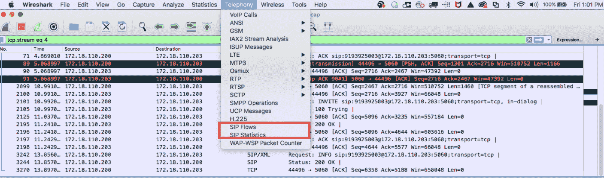

2.  SIP 流选项将在一个新的弹出窗口中列出数据包捕获中的所有 SIP 流。SIP 统计将列出所有 SIP 消息和数据包捕获中的计数。以下是列出捕获中 SIP 流的弹出窗口的屏幕截图:

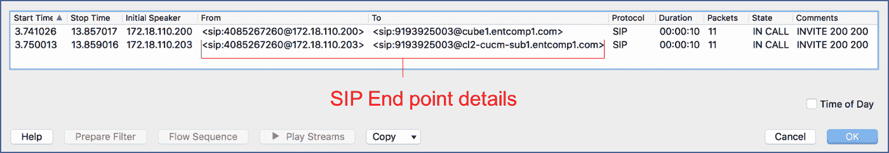

3.  前面的屏幕截图显示有两个 SIP 流。连接到 SIP 号码为`4085267260`的 UA 的 IP 地址为`172.18.110.200`的多维数据集或 CCM 正在向主机名为`cube1.entcomp1.com`的多维数据集发起 SIP 会话。
4.  使用显示过滤器跟踪 SIP 数据包的相关 TCP 流，并通过导航到 Statistics | Flow Graph **获得 SIP 流的流图。**
5.  启用“限制显示过滤器”选项，以限制仅用于 SIP 流的流图。这将列出 SIP 端点之间交换的所有 SIP 消息，作为便于分析的图表。
6.  虽然遵循 TCP 流只会列出特定的 SIP 会话，但是本地 UUID 可以用作过滤器。它将过滤与本地 UUID 关联的所有 SIP 会话。当端点(在这种情况下是 IP 电话)触发第一个 SIP 会话时，它包括它自己的 ID 作为本地 UUID，这将在沿着通向远程端点的路径的所有后续 SIP 会话中被携带。在我们的例子中，IP 电话 1 的本地 UUID 是`025ac8cd-0010-5000-a000-acbc3296f7dd` **。**

7.  前面的屏幕截图列出了与过滤器中提到的本地 UUID 相关联的所有 SIP 会话。如您所见，有两个 SIP 会话:
    *   从`172.18.110.200`到`172.18.110.203`的会话
    *   从`172.18.110.203`到`172.18.110.206`的会话

8.  通过导航流图并将其限制为显示，我们可以在捕获中看到每个 SIP 会话中交换的 SIP 消息。以下是我们拓扑中 SIP 会话的示例图:

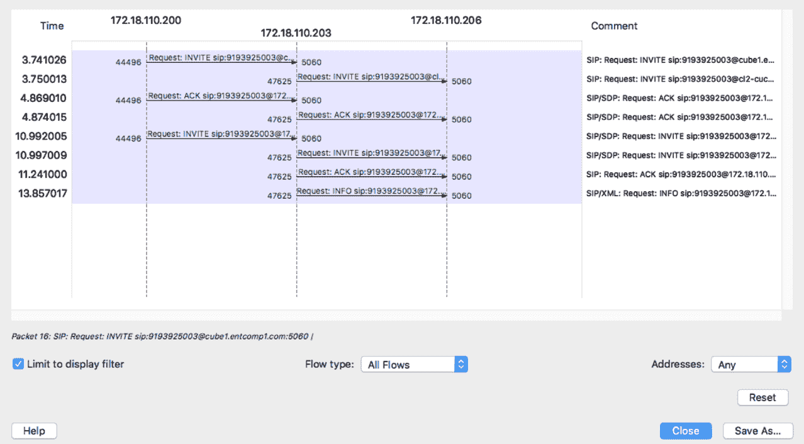

# 它是如何工作的...

1.  当 UA 希望建立多媒体会话时，它向远程 UA 发送`INVITE`方法。在下图中，您可以看到一个基本呼叫流程的示例:

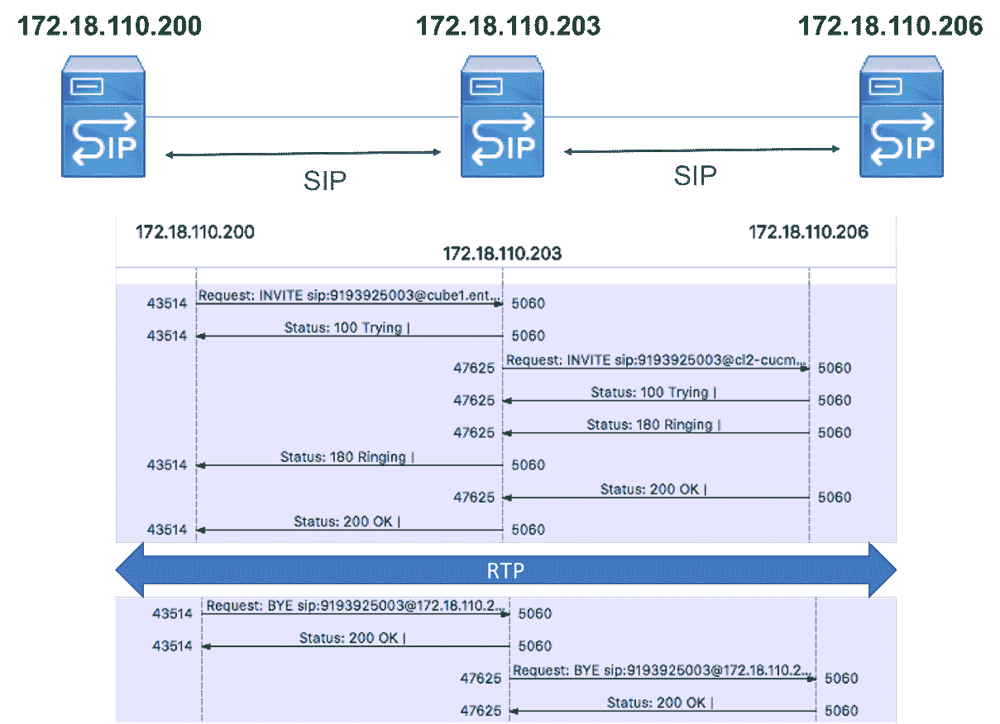An end device in SIP is called UA. A user agent can initiate or receive a call. A UA can be an IP phone, video camera, software client, or any device or software that participates in an SIP session.

2.  在`INVITE`之后，您应该会看到来自另一端的尝试、会话进度、响铃或它们的组合

3.  我们可以看到 172.18.110.200 上的发起方和 172.18.110.203 上的响应方之间的会话进度:
    *   从会话发起者发送 **INVITE** 方法。这将始终是开始对话的第一个数据包。
    *   响应者以正在尝试(代码 100)、会话进度(代码 183)和三秒后响铃(代码 180)来回答。然后它回答 OK(代码 200)，这意味着听筒被拿起。

4.  在前面的拓扑中，中间有多个立方体帮助建立端到端的呼叫流
5.  左侧的立方体或交换机`172.18.110.200`向交换机`172.18.110.203`发送邀请请求
6.  交换机`172.18.110.203`回复 SIP 尝试消息。
7.  交换机向右侧的立方体或交换机`172.18.110.206`发送邀请。
8.  交换机`172.18.110.206`发送 Trying(代码 100)，然后会话进行到交换机(代码 183)。
9.  当`172.18.110.203`接收到来自`172.18.110.206`的**振铃**时，依次发送**振铃**消息给`172.18.110.200`。

10.  当呼叫被应答时，目的地端点在`172.18.110.206`向通信管理器发送 SIP 200 OK。SIP 200 OK 消息在消息体中携带 SDP 内容。SDP 提供有关 RTP UDP 端口号的信息，并列出由目的地端点提供的音频和视频编解码器(也称为 SDP 提供)。SIP 200 OK 消息穿过 SBC ( `172.18.110.203`)、通信管理器(`172.18.110.200`)并到达发起端点。

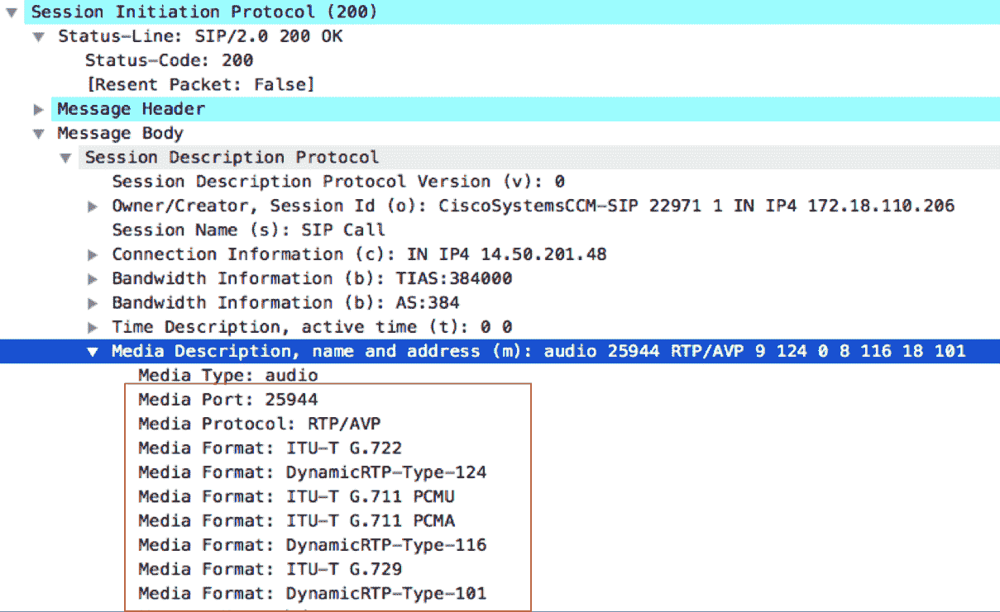

11.  在前面的示例截图中，SDP 消息指示将 UDP 端口`25944`用于 RTP 音频流。此外，它还包括支持的编解码器等其他详细信息。

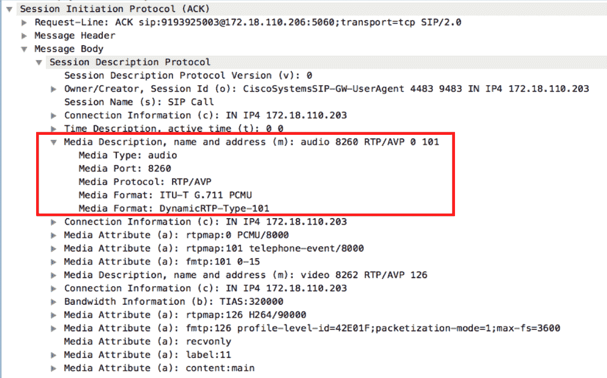

12.  发起端点选择音频代码之一，并在 SIP ACK 中向其通信管理器发送所选择的编解码器及其 RTP 端口号信息(也称为 SDP 应答)(`172.18.110.200`)。这个`SIP ACK`消息穿过 SBC ( `172.18.110.203`)、通信管理器(`172.18.110.206`)并到达目的地端点。收到 ACK 后，目的地端点开始在端口`8260`发送 RTP 数据包。它还将在端口`25944`接收 RTP 数据包。
13.  当用户挂断呼叫时，SIP BYE 消息将在 SIP 设备之间交换，以终止呼叫信令会话。
14.  如果在任何阶段收到错误消息，将不会建立连接。

不要忘了 SIP 工作在 UDP 之上。由于在发送请求之前，UDP 不会打开与另一端的任何连接，因此有可能只是因为网络可达性问题而导致请求无法到达目的地。因此，当您没有得到响应时，可能是因为网络问题，邀请没有到达目的地。

下表列出了 SIP 错误代码及其可能的原因。除非另有说明，这些代码在 RFC 3261 中定义。

# 1xx 代码-临时/信息

1xx 代码或临时/信息代码是接收到的请求仍在处理中的代码，接收方通知发送方。下表对它们进行了详细描述:

| **代码** | **事件名称** | **原因** |
| `100` | 令人厌烦的 | 服务器已经收到并接受了该请求，并且正在为此调用采取措施。 |
| `180` | 铃声 | 接收呼叫的 UA 正在提醒终端用户。这是在执行此操作时发送回客户端的消息。 |
| `181` | 呼叫转移 | 呼叫正被转接到另一个目的地。 |
| `182` | 排队 | 被叫方暂时不可用，服务器保存该消息以供以后发送。 |
| `183` | 会话进度 | 接收服务器正在处理该会话。关于呼叫进度的附加细节可以在消息头中传达。 |

# 2xx 代码–成功

2xx 代码或成功代码表示该操作已被成功接收、理解和接受。下表对它们进行了详细描述:

| **代码** | **事件名称** | **原因** |
| `200` | 好的 | 请求已被接受、处理并成功 |
| `202` | 可接受的 | 请求已被接受进行处理，但其处理尚未完成(RFC 3265) |

# 3xx 代码–重定向

3xx 代码表示需要采取重定向操作来完成请求。这里对它们进行了详细描述:

| **代码** | **事件名称** | **原因** |
| `300` | 多选 | 请求中的地址被解析为几个选项，接受服务器可以将其转发给其中一个选项。UA 可以使用 contact 头字段中的地址进行自动重定向，或者在重定向消息之前与发送者确认。 |
| `301` | 永久移动 | 无法在请求 URI 中的地址找到用户，发出请求的客户端应该尝试联系头字段中提供的地址。发送方应使用该更改更新其本地目录。 |
| `302` | 临时移动 | 请求客户端应该在联系报头字段中提供的新地址重试请求。 |
| `305` | 使用代理 | 请求的资源必须通过代理访问，代理的地址由 contact 字段给出。 |
| `380` | 替代役 | 呼叫未成功，因此接收方发送此响应，以便在接收方提供替代服务。这些服务在消息体中描述。 |

# 4xx 代码–客户端错误

4xx 代码或客户端错误表示请求包含错误的语法，或者无法在此服务器上实现。下表对它们进行了描述:

| **代码** | **事件名称** | **原因** |
| `400` | 错误的请求 | 由于语法错误，无法处理请求。 |
| `401` | 未经授权的 | 收到的请求需要用户身份验证。通常客户端会向用户索要。 |
| `402` | 要求付款 | 这是留作将来使用的。 |
| `403` | 被禁止的 | 服务器理解该请求，但拒绝执行。客户不应再次尝试。 |
| `404` | 未发现 | 服务器通知客户端用户不存在于请求 URI 中指定的域中。 |
| `405` | 不允许的方法 | 客户端发送的方法不允许被它使用。响应将包括一个`allow`头字段，通知发送者他可以使用哪些方法。 |
| `406` | 不可接受 | 根据请求中发送的`accept`报头字段，请求所标识的资源只能生成具有不可接受的内容特征的响应实体。 |
| `407` | 需要代理验证 | 客户端必须通过代理服务器的身份验证。 |
| `408` | 请求超时 | 服务器无法在预期时间内响应。过一会儿，客户端可能会再次发送请求。 |
| `410` | 过去的 | 请求的资源在服务器上不再可用，并且转发地址未知。这种情况被认为是永久性的。 |
| `413` | 请求实体太大 | 服务器拒绝处理请求，因为请求实体的主体大于服务器能够或愿意处理的范围。 |
| `414` | 请求-URI 太长 | 服务器拒绝为该请求提供服务，因为请求 URI 超过了服务器能够或愿意解释的长度。 |
| `415` | 不支持的媒体类型 | 服务器拒绝处理该请求，因为服务器不支持该请求的邮件正文格式。 |
| `416` | 不支持的 URI 方案 | 服务器不知道请求 URI，因此服务器无法处理该请求。 |
| `420` | 错误的扩展名 | 服务器不理解从客户端收到的协议扩展。 |
| `421` | 需要扩展 | 接收请求的 UA 需要一个特定的扩展来处理它，但是这个扩展没有在请求的 supported 报头字段中列出。 |
| `423` | 间隔太短 | 服务器拒绝该请求，因为该请求刷新的资源的过期时间太短。 |
| `424` | 错误的位置信息 | 此响应代码表示由于其位置内容而拒绝请求。这表示位置信息不正确或不令人满意(RFC6442)。 |
| `428` | 使用标识头 | 当验证者接收到缺少身份报头的 SIP 请求时，发送该消息，以指示该请求应该使用身份报头重新发送(RFC4474)。 |
| `429` | 提供推荐人身份 | 这提供了引用者身份(RFC3892)。 |
| `433` | 不允许匿名 | 这表明服务器拒绝满足请求，因为请求者是匿名的(RFC5079)。 |
| `436` | 错误的身份信息 | 当 Identity-Info 标头(RFC4474)中有错误信息时，会使用此响应。 |
| `437` | 不支持的证书 | 当验证者无法验证 Identity-Info 标头(RFC4474)中的 URI 所引用的证书时，将使用此选项。 |
| `438` | 无效的身份标头 | 当验证者(接收者 UA)接收到具有与验证者计算的摘要串不对应的身份签名的消息时，使用这种方法(RFC4474)。 |
| `470` | 需要同意 | 这是对包含 URI 列表的请求的响应，该列表中至少有一个 URI 是这样的，即中继没有访问权限(RFC5360)。 |
| `480` | 暂时不可用 | 已成功联系呼叫者的终端系统，但呼叫者当前不可用。 |
| `481` | 呼叫/交易不存在 | 接收 UA 接收到与任何现有事务或对话都不匹配的请求。 |
| `482` | 检测到环路 | 服务器检测到一个循环。 |
| `483` | 啤酒花太多 | 服务器收到一个包含等于零的 Max-Forwards 标头字段的请求。 |
| `484` | 地址不完整 | 服务器收到一个不完整的请求-URI。 |
| `485` | 引起歧义的 | 这个请求——URI 不清楚。响应可以在联系人报头字段中包含可能地址的列表。 |
| `486` | 这里很忙 | 已成功联系呼叫者的终端系统，但呼叫者当前无法或不愿意通过此终端系统接听其他呼叫。 |
| `487` | 请求终止 | 请求被 BYE 或 CANCEL 请求终止。 |
| `488` | 这里不接受 | URI 不接受请求中提到的具体资源。 |
| `491` | 请求待定 | 接收 UA 有一个待定请求。 |
| `493` | 无法解码的 | 请求包含加密的 MIME 正文，收件人无法解密。 |

# 5xx 代码–服务器错误

5xx 代码或服务器错误代码表示服务器无法满足明显有效的请求。下表对它们进行了详细描述:

| **代码** | **事件名称** | **原因** |
| `500` | 服务器内部错误 | 意外情况导致服务器无法完成请求 |
| `501` | 未实施 | 服务器不支持请求实现该请求的功能 |
| `502` | 错误网关 | 尝试完成请求时，网关或代理从其访问的下游服务器收到无效响应 |
| `503` | 服务不可用 | 由于服务器临时过载或维护，服务器暂时无法处理请求 |
| `504` | 服务器超时 | 处理请求的服务器已将请求发送到另一台服务器进行处理，但响应没有按时到达 |
| `505` | 不支持的版本 | 服务器不支持请求中使用的 SIP 协议版本 |
| `513` | 消息太大 | 由于消息太长，服务器无法处理该请求 |

# 6xx 代码–全局故障

6xx 代码或全局失败代码表示该请求无法在任何服务器上实现。下表对它们进行了详细描述:

| **代码** | **事件名称** | **原因** |
| `600` | 到处都很忙 | 已成功联系接收方的终端系统，但用户正忙，此时不想接听电话 |
| `603` | 下降 | 已成功联系接收 UA，但用户明确不希望或不能参与 |
| `604` | 不存在于任何地方 | 服务器拥有用户在请求 URI 中指明的权威信息，而这些信息在任何地方都不存在 |
| `606` | 不可接受 | 已成功联系用户，但 SDP 描述的会话描述的某些方面不可接受 |

# 基于 IP 和 RTSP 的视频

根据互联网协会发布的互联网报告，全球消费者互联网流量的 70%以上是 IP 视频流量。在娱乐和教育领域，视频内容非常普遍，并通过使用 IP 作为视频内容传输的传输媒体来利用 IP 网络的成熟度。各种编解码器用于将视频内容编码为比特流，并使用 RTP 作为端到端视频数据传输的传输协议。

视频流量可以是视频流，也可以是一对一的视频呼叫。尽管在任一情况下，RTP 被用作视频数据分组的协议，但是不同的控制平面信令协议可以用于建立视频呼叫会话。例如:

*   SIP 可以用作视频通话的信令协议
*   RTSP 可以用作流式视频的信令协议。

在本菜谱中，我们将讨论这两个选项，并了解如何使用 Wireshark 来分析正常操作。

# 做好准备

捕获数据包的端口镜像可以在客户端或服务器端完成。将 Wireshark 连接到端点附近，并捕获数据包进行分析。

# 怎么做...

SIP 信令协议:

**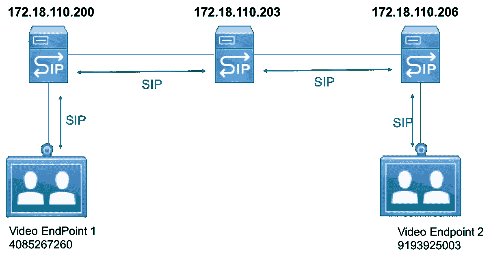**

当 SIP 用作信令协议时，端点和路径上的任何多维数据集或 SIP 代理之间交换的消息与*中解释的完全相同...*SIP 操作原理、消息和错误代码部分。启用视频通话时，端点之间交换的其他详细信息如下:

1.  当端点能够进行视频呼叫时，SDP 消息不仅携带音频流的 RTP 信息，还携带视频流的 RTP 信息。

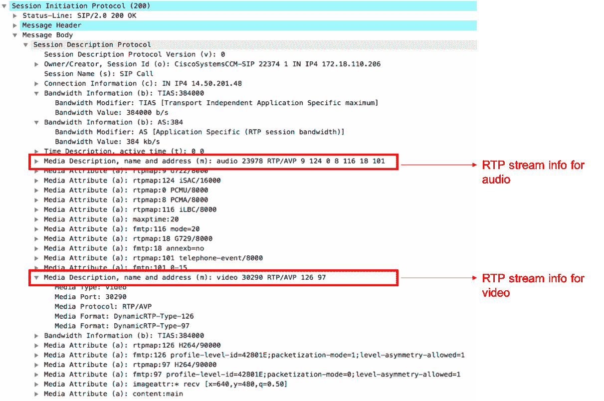

2.  在前面的屏幕截图中，可以观察到 SDP 消息携带音频和视频流的媒体描述细节。它还标志着使用 H.264 作为视频编解码器。

3.  SDP 消息指示将 UDP 端口`23978`用于音频流，将 UDP 端口`30290`用于视频流。

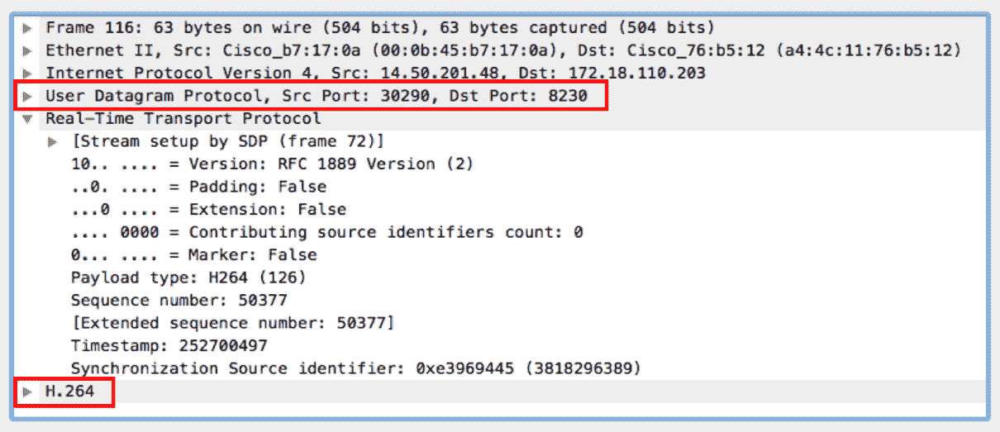

4.  收到 SDP 消息后，视频端点将使用 UDP 端口`30290`传输 RTP 视频流。如前面的截图所示，H.264 编解码器用于视频有效载荷编码。

实时流协议:

像 SIP 消息一样，RTSP 也使用 SDP 消息来指示 RTP 音频/视频流信息。

1.  打开 Wireshark 捕获，使用 **rtsp** 作为显示过滤器过滤 RTSP 数据包。
2.  导航到**统计**和**流量图**选项，获得 RTSP 流量图。

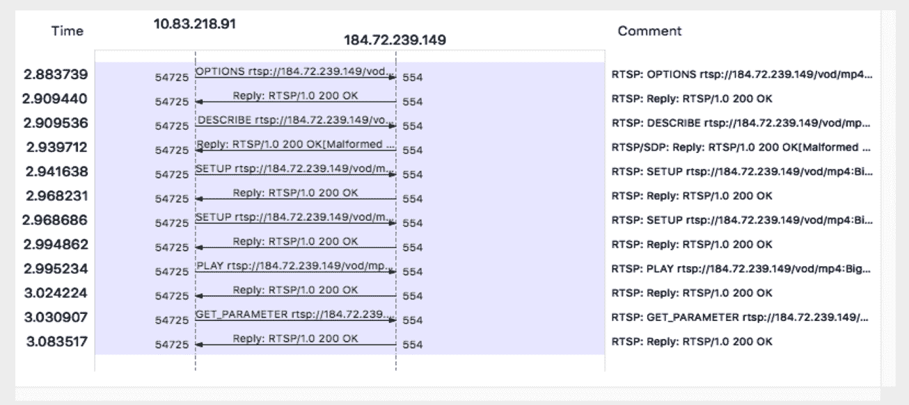

3.  流程图将列出客户端和媒体服务器之间交换的 RTSP 消息。在前面的截图中，客户端`10.83.218.91`与`184.72.239.149`建立了 RSTP 会话。

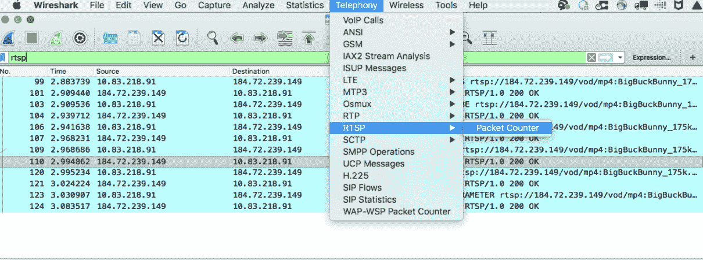

4.  导航到电话和 RTSP 和数据包计数器，列出收到的不同 RTSP 消息。
5.  关于 RSTP 正常运行的更多细节可以在*它是如何工作的...*一节。

# 它是如何工作的...

实时流协议:

如同 SIP(其用于信令，而 RTP 用于媒体的传输)，由 RTSP 控制的流可以使用任何传输协议；在许多情况下，他们也使用 RTP。该协议有意在语法和操作上与 HTTP 相似，并使用相同的语法。

最常见的 RTSP 方法(命令)是(C-Client，S-Server)。

| **命令** | **方向** | **功能** |
| `OPTIONS` | C 到 S 或 S 到 C | 确定服务器/客户端的功能 |
| `DESCRIBE` | c 到 S | 获取媒体流的描述 |
| `GET_PARAMETERS` | c 到 S | 检索 URI 中参数的值 |
| `ANNOUNCE` | C 到 S 或 S 到 C | 宣布新会话的描述 |
| `SETUP` | c 到 S | 创建媒体会话 |
| `PLAY` | c 到 S | 开始媒体传送 |
| `RECORD` | c 到 S | 开始媒体录制 |
| `PAUSE` | c 到 S | 暂停媒体传送 |
| `REDIRECT` | 从 s 到 C | 重定向到另一台服务器 |
| `TEARDOWN` | 从 s 到 C | 执行立即拆卸 |

响应类别包括:

| **代码系列** | **类型** | **意为** |
| 1xx | 报告的 | 收到请求，继续处理 |
| 2xx | 成功 | 该操作已被成功接收、理解和接受 |
| 3xx | 重寄 | 必须采取进一步的措施来完成请求 |
| 4xx | 客户端错误 | 请求包含错误的语法或无法实现 |
| 5xx | 服务器错误 | 服务器未能满足一个明显有效的请求 |

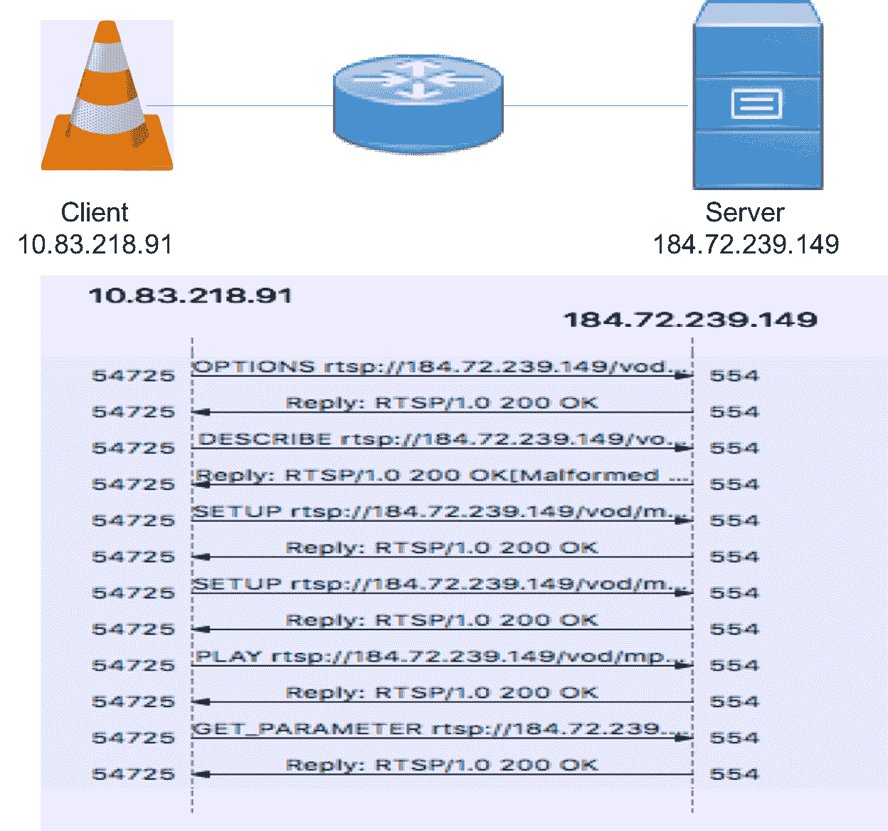

1.  客户端`10.83.218.91`将通过 TCP 端口`554`建立一个 RTSP 会话。

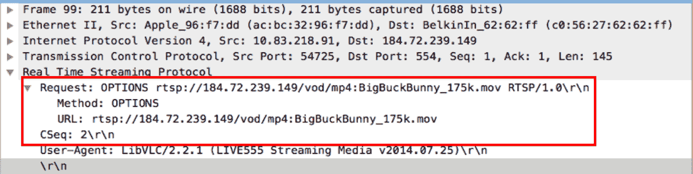

2.  建立会话后，客户端发送一条 RTSP 请求消息，其中包含选项方法和请求的资源。在前面的截图中，请求的资源是来自`184.72.239.149`的`mp4:BigBuckBunny_175k.mov`。

3.  服务器回复 RTSP 200 OK。RTSP 响应消息也用于携带能力。响应将携带来自请求消息的 CSeq 号。

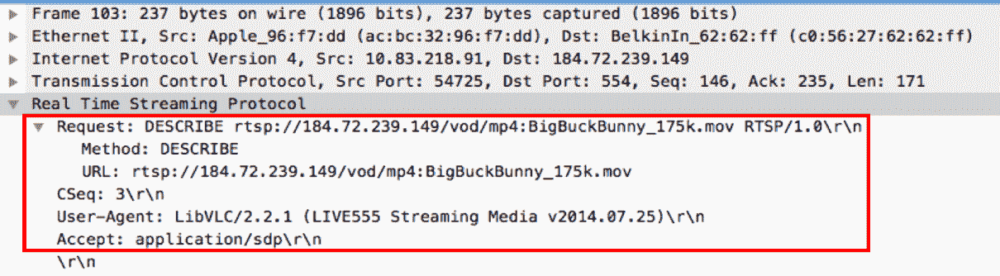

4.  客户端现在发送 RTSP 请求消息，该消息带有 URI 中资源的 DESCRIBE 方法。这用于从服务器检索内容描述或媒体对象。对于每个后续的请求消息，CSeq 号增加 1。

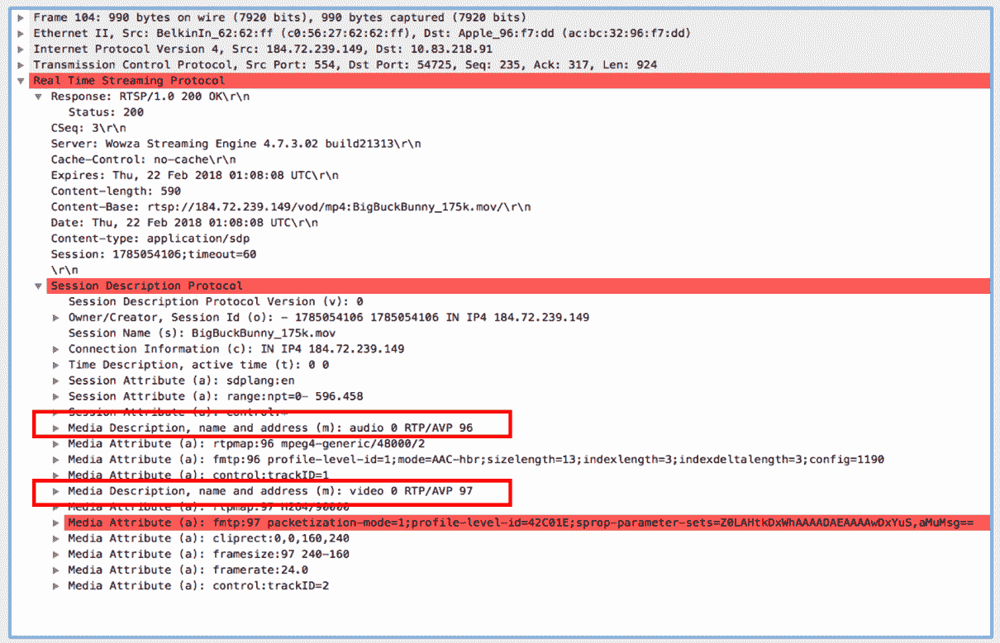

5.  服务器将回复 RTSP 200 OK。该响应将携带具有会话和内容相关信息的 SDP。SDP 指示对 RTP 音频流使用动态 RTP 类型 96，对 RTP 视频流使用动态 RTP 类型 97。
6.  与使用 SDP 交换 RTP 端口信息的 SIP 会话不同，RTSP 使用 SETUP 方法来实现此目的。客户端将使用 SETUP 方法发送请求消息，并携带用于 RTP 音频流的 UDP 端口。

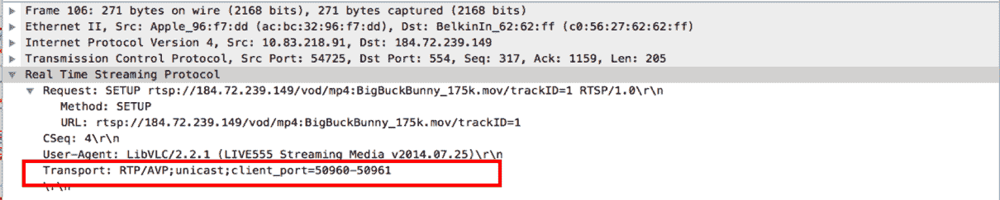

7.  在前面的屏幕截图中，客户端表示 UDP 端口`50960`被分配给 RTP 音频流，而`50961`被分配给 RTCP 流量。
8.  使用`SETUP`方法的类似请求也将被交换为 RTP 视频流。
9.  从服务器接收到 RTSP 200 OK 后，它将发送其他方法(如播放)来启动音频/视频流。

# 还有更多...

RFC 7826 提出了 RTSP v 2.0；它取代了 RFC 2326 中定义的 RTSP 1.0 版。

# 用于 RTP 流分析和过滤的 Wireshark 功能

Wireshark 具有各种内置功能，在分析 RTP 音频和视频流时非常有用。在本菜谱中，我们将讨论其功能以及如何使用它进行故障排除。

# 做好准备

当特定客户端出现问题时，使用端口镜像将 Wireshark 连接到客户端端口。当所有客户端都出现问题时，请将 Wireshark 连接到连接所有客户端的公共交换机。

# 怎么做...

1.  打开 Wireshark capture 并使用 **Telephony** 菜单导航至 **RTP | RTP Streams** ，如以下截图所示:

2.  这将导致一个弹出窗口，列出捕获中可用的所有 RTP 流。

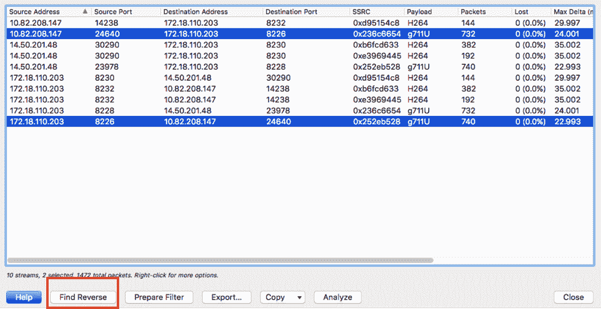

3.  选择要分析的相关流，并使用**查找反向**来识别端点之间反向的 RTP 流。

4.  使用**准备过滤器**过滤所有正向和反向的 RTP 数据包。或者，使用**分析**来分析正向和反向 RTP 流。点击**分析**将弹出一个新窗口，显示正向和反向指标。

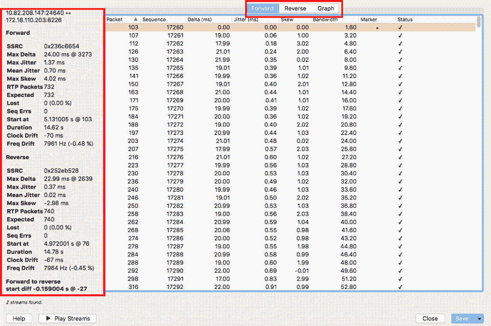

5.  不同的选项卡列出了与正向和反向 RTP 流相关的指标。如前面的屏幕截图所示，将对 RTP 流进行分析，以列出正向和反向流的抖动、延迟和数据包丢失...

**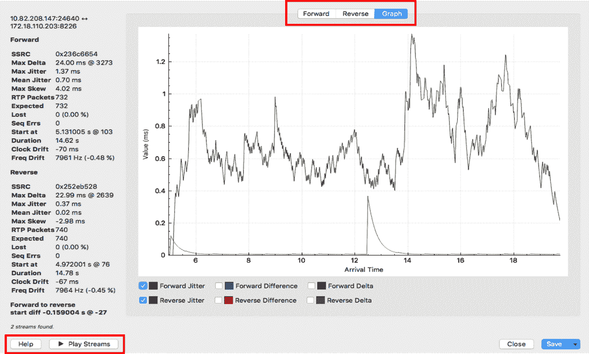**

6.  前面的屏幕截图是特定 RTP 流的示例图，突出显示了流的正向和反向抖动。

# 它是如何工作的...

不考虑所使用的呼叫信令协议，大多数当前的音频和视频流使用 RTP 作为应用层协议。RTP 协议通过在应用层对数据包进行排序来提供可靠性，并通过在每个 RTP 数据包中以小块形式转发音频和视频有效负载来帮助控制抖动和延迟。

本章的 *IP 电话原理和正常操作*部分提供了关于 RTP 流如何工作的更多详细信息。

# 用于 VoIP 呼叫重放的 Wireshark 功能

Wireshark 增加了音频回放功能，可以对 RTP 音频流进行编码并播放实际的音频内容。播放流用于此目的。该选项合并来自正向和反向的音频流，并允许用户收听实际的对话。

# 做好准备

当特定客户端出现问题时，使用端口镜像将 Wireshark 连接到客户端端口。当所有客户端都出现问题时，请将 Wireshark 连接到连接所有客户端的公共交换机。

# 怎么做...

1.  打开 Wireshark capture 并使用 Telephony 菜单导航至 RTP | RTP Streams，如以下屏幕截图所示:

2.  选择相关的 RTP 音频流和相关的反向流。现在使用分析来合并来自两个方向的流。这将弹出一个不同的窗口，如下所示:

**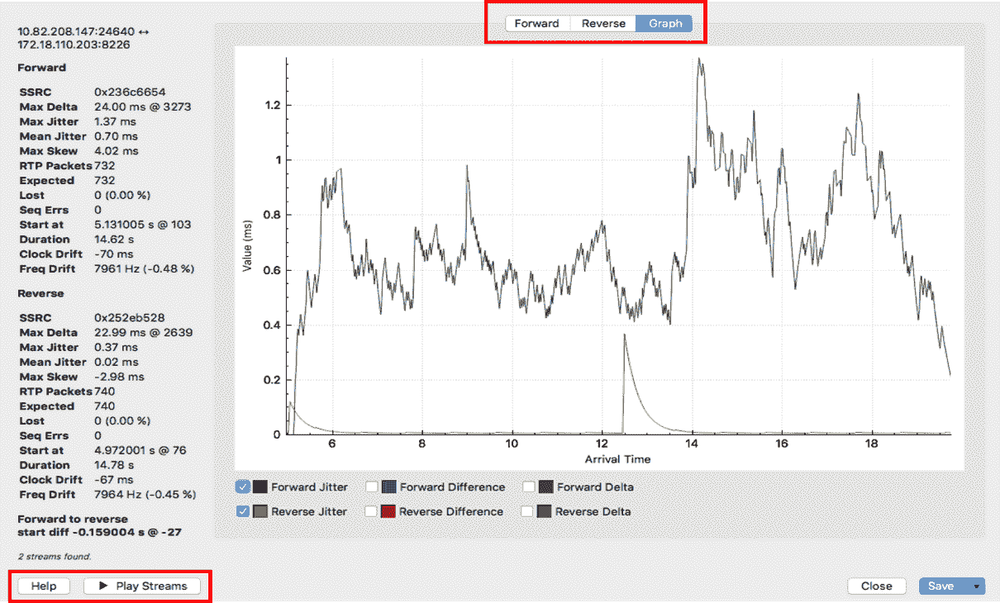**

3.  使用播放流并收听实际的音频内容。
4.  Wireshark RTP 播放不适用于 RTP 视频流。因此它不能用于观看视频内容。

# 它是如何工作的...

Wireshark 解释用于编码音频流的音频编解码器，并利用该编解码器解码音频文件内容。Wireshark 将使用 G711 编解码器将 RTP 音频流保存为一种`.au`文件格式，允许我们回放捕获的对话。

# 还有更多...

目前，Wireshark 原生支持使用 G711 编解码器播放 RTP 音频流。如果用于音频流的编解码器是 G729，则不会播放。使用以下程序转换 G729:[https://wiki.wireshark.org/HowToDecodeG729](https://wiki.wireshark.org/HowToDecodeG729)