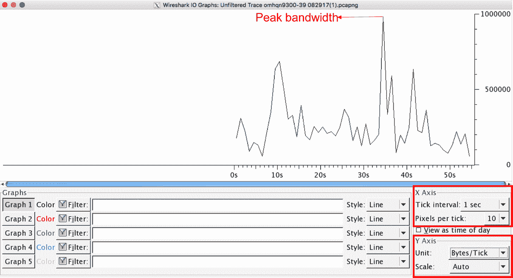
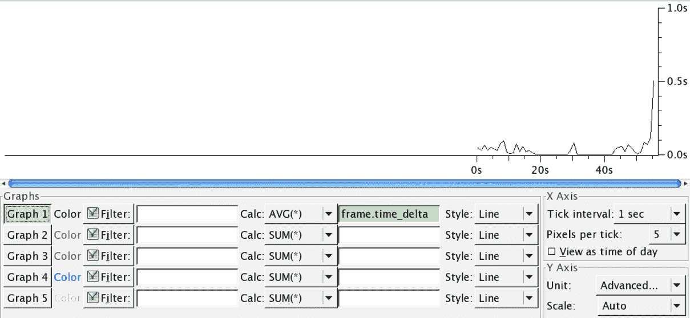

# 十八、带宽和延迟问题故障排除

在本章中，您将了解:

*   测量网络带宽和应用流量
*   使用 Wireshark 测量抖动和延迟
*   分析网络瓶颈、问题和故障排除

# 介绍

端到端服务和应用的性能在很大程度上取决于各种网络参数，如带宽、延迟、抖动和丢包。不同类型的终端应用有不同的 SLA 约束。例如，文件传输应用(FTP、TFTP)等涉及大量文件交换的应用对带宽和数据包丢失非常敏感，而另一方面，语音和视频流量等媒体应用对延迟和抖动非常敏感。

衡量终端应用的性能因终端应用的 SLA 限制而异，因此我们需要衡量不同的网络参数。

在本章中，我们将学习如何测量这些网络参数，如何检查由这些参数引起的网络问题，以及如何尽可能地解决这些问题。

# 测量网络带宽和应用流量

网络运营商的主要职责之一是监控网络和带宽利用率。这可能出于各种商业目的，例如:

*   确保低优先级或清道夫流量不会阻塞网络，使关键业务流量受损
*   确保 WAN 提供商能够在接入电路上提供承诺的流量速率
*   使用容量规划的结果来升级或降级带宽

图 19.1:广域网拓扑

在我们到目前为止讨论的大多数故障排除和分析方法中，数据捕获将在尽可能靠近应用端点的地方进行。为了测量 WAN 电路利用率，我们可能需要额外的考虑来精确测量带宽。在前面的拓扑中， **WAN-Router1** 可以通过 1 Gbps 接口连接到 WAN 提供商，但是**承诺的访问速率** ( **汽车**)可以低得多(例如 10 Mbps)。通常，WAN 提供商会在入站方向启用流量速率限制，将流量限制在 10 Mbps，并丢弃任何过量的流量。因此，在 **WAN-Router1** 端执行数据包捕获可能不准确。另一方面，客户可能会实施流量整形等功能，使他们能够缓冲流量，并确保从 WAN 路由器到提供商的出站流量不会超过 CAR。因此，根据网络的部署方式，需要在适当的位置捕获数据包。

在本菜谱中，我们将讨论如何使用 Wireshark 来测量 WAN 电路带宽并分析不同的应用流量利用率。

# 做好准备

根据网络的部署方式，我们可能需要在相关位置识别和放置数据包捕获工具:

*   如果启用了流量整形，我们可以在 WAN 路由器上捕获出站方向的数据包
*   如果没有启用流量整形，我们可以在 WAN 提供商或远程 WAN 路由器上捕获入站方向的数据包

# 怎么做...

要测量 WAN 电路的带宽，我们可能需要以接近带宽的速率抽取一些流量，以测试电路是否能够承受。有不同的流量生成器工具可用，如 iPerf、IXIA 和 Spirent，可用于抽取不同类型的流量。其他开源流量生成器，如 Scapy、tcpreplay 或 playcap 也可以用来生成流量。

要确定平均带宽利用率，请执行以下步骤:

1.  从统计数据中选择摘要:

输出将列出捕获的数据包数量，Avg。兆比特/秒，平均。数据包大小等等。

2.  它还允许我们通过使用过滤器来查看特定流或一组流的摘要。要获取选择性流的摘要，请使用显示过滤器过滤流，然后使用统计|摘要:

以上是特定 TCP 流的输出示例。

3.  使用 I/O 图可以更详细地了解电路的最大可用带宽。从统计中，选择 IO 图形:

4.  默认情况下，图表将显示所有捕获的数据包的整体性能。X 轴和 Y 轴可以修改:
    *   X 轴定义了刻度间隔，即 Y 轴将被测量的间隔。此间隔的粒度可以设置为 10 分钟到 1 毫秒。
    *   Y 轴定义了衡量绩效的单位。这种度量被称为每个节拍(X 轴)中的包数、字节数或位数。
    *   在前面的示例中，X 轴设置为 1 秒的刻度间隔，Y 轴设置为字节/刻度。所以测量值是字节/秒。
    *   选择 View as time of day 选项将列出捕获数据包的实际时间。这是一个非常有用的工具，可以确定在图中观察到流量峰值的实际时间。

5.  可以创建多个图表，列出不同的流，以根据流确定带宽利用率:

前面是一个示例输出，不同的流有不同的图形。

6.  为了识别消耗大部分带宽的终端用户或应用，可以列出排名靠前的通话端点。从统计，转到端点:

这将根据发送和接收的数据包/字节数列出所有端点。它有助于识别顶级通话端点。

7.  使用 conversation statistics 选项可以看到精确的特定于流的细节。从统计数据转到对话:

前面的屏幕截图显示了特定于流的对话、流的持续时间、交换的数据包数量等等。

# 它是如何工作的...

网络流量利用率有三种不同的定义，区分它们对于理解网络带宽利用率至关重要:

*   **速度**:可以穿越电路或链路的最大流量。
*   **带宽**:允许通过链路的最大流量(比特/秒)。默认情况下，带宽将等于链接的速度。
*   **吞吐量**:在应用端点之间传输的有效终端应用流量(比特/秒)。

链路速度(以及带宽)因各种因素而异，包括链路类型、提供商提供的 CAR 以及本地配置。默认情况下，大多数网络设备能够以线路速率转发流量，这是相应链路上支持的最大带宽。

在最近的部署中，人们普遍将千兆以太网视为从 WAN 路由器到服务提供商的最后一英里接入连接。千兆以太网的速度将为 1 Gbps，但带宽可能会因服务提供商提供的汽车而异。

即使 WAN 路由器能够以链路的线路速率发送流量，服务提供商也要确保流量不会超过汽车。

# 还有更多...

任何网络设备都会使用**先进先出** ( **FIFO** )排队机制将流量转发出电路。因此，如果清道夫流量过多，这种低优先级流量可能会消耗所有带宽，导致关键业务流量受损。这可以通过在网络中部署**服务质量** ( **QoS** )来避免。QoS 将排队机制从 FIFO 改为基于优先级的排队，防止清道夫或低优先级流量消耗所有带宽，从而确保关键业务流量始终优先。

# 使用 Wireshark 测量抖动和延迟

抖动和延迟是能够显著影响各种网络应用的特征。要监控通信线路的抖动和延迟，您可以使用简单或图形化的 ping 工具来显示线路特性。另一方面，Wireshark 不测量端到端延迟，而是测量它对网络流量的影响、帧间延迟以及它对应用的影响。

在本菜谱中，我们将看到如何使用 Wireshark 工具来监控这些参数，在下一个菜谱中，我们将看到如何找出由参数引起的问题。

# 做好准备

要监控通信线路上的延迟，首先使用`ping`命令来感受线路，然后将端口镜像配置到您想要监控的端口。

# 怎么做...

要监控帧间延迟，请遵循以下步骤:

1.  从统计中，选择 IO 图形。
2.  要监控特定数据流中帧之间的时间，请按照下列步骤操作:
    1.  单击 TCP 或 UDP 流中的数据包
    2.  点击跟随 TCP 流或跟随 UDP 流
    3.  复制显示的过滤器字符串(在下面的屏幕截图中编号为 1)

3.  从统计数据中，打开 IO 图。
4.  在 IO 图形的 Y 轴部分(窗口的右下角)，选择高级...(以下截图中编号为 **2** )。
5.  将 TCP 流编号(下图中编号为 **1** )复制到 I/O 图中的过滤器窗口(下图中编号为 **3** ):

6.  选择 AVG(*)(在前面的截图中编号为 **4** )。
7.  配置过滤器`frame.time_delta_displayed`(在前面的截图中编号为 **5** )。
8.  在图表中(在前面的截图中编号为 **6** ，您可以看到帧之间的时间，单位为毫秒。
9.  通过导航到统计数据| TCP 流图|往返时间图，您将获得相同的结果，如下图所示:

10.  在图中，我们看到 RTT 在低于 10 毫秒和高达 200-300 毫秒之间变化。
11.  要测量第 4 层中的延迟，使用`tcp.analysis.ack_rtt ` TCP 过滤器，它会给你确认每个接收到的包所需的时间。

# 它是如何工作的...

该软件只是捕获线路上的数据包，并向您显示它们之间的时差。需要注意的是，存在延迟或抖动，但我们看不到它来自哪里。

延迟是数据包从网络一端到达另一端所需的时间。它通常被称为 RTT。可以使用简单的 ping 或图形 Ping 工具来测量延迟。延迟以秒、毫秒、微秒等计量。

IP 网络中的抖动测量延迟的变化。例如，如果平均延迟为 100 毫秒，并且在 80 毫秒和 120 毫秒之间变化，则抖动为 20%。

# 还有更多...

很多网站上都有免费的图形化 Ping 工具。可以使用例如[http://www . colasoft . com/download/products/download _ ping _ tool . PHP](http://www.colasoft.com/download/products/download_ping_tool.php)。

# 发现不寻常的流量模式

在这个食谱中，我们将学习什么是正常和不正常的流量模式，以及如何区分它们。

# 分析网络瓶颈、问题和故障排除

前面的方法中讨论的问题和故障排除大多是相关的，可能会导致网络瓶颈问题。任何引入延迟的不当链路或路由器，或者容量规划不佳的网络设计，都可能导致带宽瓶颈问题，从而影响端到端应用性能。

在这个菜谱中，我们将看到如何使用 Wireshark 来分析瓶颈问题。

# 做好准备

为了识别瓶颈问题，我们可能需要在多个位置重复捕获，以进行分析和瓶颈隔离。理想情况下，端点上的数据包捕获将是识别受影响的应用流量的良好开端，然后我们可以使用 ping 实用工具等其他工具来缩小捕获点的范围。

# 怎么做...

1.  过滤捕获以显示应用服务器的 DNS 解析数据包，并检查解析的平均时间。这可以通过过滤 DNS 数据包并获得 I/O 图来查看:
    *   检查 DNS 数据包的数量是否在 DNS 服务器可以处理的阈值范围内。如果不是，需要考虑 DNS 服务器升级。
    *   检查分辨率的时间增量是否在阈值范围内。解析中的任何延迟都会导致最终应用会话建立的延迟:

上图是用于检查名称解析延迟的 DNS 数据包的 I/O 图。

2.  检查 WAN 带宽利用率在其峰值和正常工作时间是否在阈值范围内。使用*测量网络带宽和应用流量*一节中定义的步骤来确定 LAN 和 WAN 端的带宽利用率。本节中定义的过程不仅可用于识别带宽利用率，还可用于检查带宽利用率是由关键业务流量还是清道夫流量引起的:
    *   如果捕获显示 WAN 带宽利用率已被完全利用，并且流量主要是业务关键型的，则您可能需要升级带宽。
    *   如果捕获显示 WAN 带宽利用率完全得到利用，并且流量不是关键业务流量，则可能需要额外的排队和 QoS 机制来限制非关键流量的速率。
3.  检查任何传输链路(LAN、WAN)是否存在高延迟/抖动问题。关于如何执行此操作的更多详情，请参见*使用 Wireshark 测量抖动和延迟*部分。以秒为单位显示链接延迟的捕获是完全不正常的:

前面的 I/O 图显示了峰值延迟高达 10 秒，平均延迟超过 1 秒的链路。这种链路上的流量将受到严重影响，可能需要额外的链路级故障排除(检查电源、光纤清洁等)。

4.  检查应用服务器是否遇到任何规模问题。这可以通过检查高峰和正常时间的并发会话数量以及会话数量是否在服务器可以处理的阈值内来完成。
5.  检查端点图以确定并发会话的数量:

在前面的列表中，服务器`10.1.100.254`的并发会话数是 8850。确保来自客户端的连接请求是真实的，而不是来自受损的服务器。如果这超出了服务器能够处理的阈值，则需要考虑服务器升级。

# 它是如何工作的...

该方法解释了如何使用 Wireshark 来解决网络瓶颈问题。工作机制可以根据网络中的流量类型而变化。理想情况下，该流是不同协议的组合。例如，试图与应用服务器建立会话的客户机将使用名称解析协议(如 DNS)来识别终端服务器的 IP 地址。

一旦接收到 IP 地址，如果传输协议是 TCP(例如，HTTP 或 FTP)，它可以发送 TCP SYN 来建立 TCP 会话。如果应用的传输协议是 UDP(例如，QUIC)，它将简单地通过 UDP 数据包发送应用请求。服务器在收到请求后，将通过网络向客户端发送数据。

任何网络设备(L2 交换机和路由器)都会通过最佳路径转发流量。根据等价路径的可用性，路由器可以在不同的路径上对不同的流量进行负载平衡。

端到端性能涉及到不同的因素。终端应用服务器处理能力和内存在会话处理和数据传输中起着关键作用。网络容量规划在不同客户端和服务器之间的端到端数据传输中起着关键作用。

# 还有更多...

有各种网络遥测收集功能可用于定期从所有或选定的网络设备收集网络数据，以全面了解网络性能。这对容量规划非常有用。可以使用并且在许多平台上都可用的基本功能如下:

*   思科网络流量:
    *   [http://www . Cisco . com/en/US/products/PS 6601/products _ IOs _ protocol _ group _ home . html](http://www.cisco.com/en/US/products/ps6601/products_ios_protocol_group_home.html)
    *   [http://www.ietf.org/rfc/rfc3954.txt](http://www.ietf.org/rfc/rfc3954.txt)
*   Juniper J-Flow:
    *   [http://www . juniper . net/tech pubs/software/erx/junose 82/SW config-IP-services/html/IP-jflow-stats-config 2 . html](http://www.juniper.net/techpubs/software/erx/junose82/swconfig-ip-services/html/ip-jflow-stats-config2.html)
*   sFlow:
    *   [http://www.ietf.org/rfc/rfc3176.txt](http://www.ietf.org/rfc/rfc3176.txt)