# 十九、安全和网络取证

在本章中，我们将介绍以下配方:

*   发现不寻常的流量模式
*   发现基于 MAC 和基于 ARP 的攻击
*   发现 ICMP 和 TCP SYN/端口扫描
*   发现 DoS 和 DDoS 攻击
*   定位智能 TCP 攻击
*   发现暴力和应用攻击

# 介绍

信息安全是信息系统中最吸引人的领域之一，它的目的是保护组织的系统免受内部和外部的攻击，这些攻击可能以各种方式出现。这些攻击可能来自互联网或内部网络，因此，它们都来自网络；因此，可以使用 Wireshark(和其他类似的工具)对它们进行监控。

要监控网络以防范恶意流量，我们必须首先了解什么是正常流量，并定义流量速率的基线、流量模式等等。然后，我们可以尝试找出恶意流量与正常流量的差距。在异常流量中，我们可能会看到 ARP、IP 或 TCP 扫描；没有查询的 DNS 响应；异常的 TCP 标志；我们不知道其用途的未知 IP 地址或端口号，等等。

了解安全问题和网络问题之间的区别并加以区分也很重要。例如，ICMP 扫描可以是扫描网络的恶意软件，甚至是发现网络的管理软件。TCP SYN 扫描可能是蠕虫或软件错误。我们将在每个食谱中详细阐述这些。

在本章中，我们将首先区分正常和异常的网络流量，然后了解各种类型的攻击，它们来自哪里，以及如何隔离和解决它们。

# 做好准备

首先要找到 Wireshark。对此有几种选择:

1.  当您怀疑攻击来自互联网时，在防火墙后定位 Wireshark(**1**)，当您怀疑它穿越防火墙时，在防火墙前定位它( **2** )。
2.  当您怀疑恶意流量来自远程办公室时，端口镜像流量来自路由器之前( **3** )或之后( **4** )的中央线路。在这种情况下，您可以使用 IP 网络过滤可疑流量，查看来自不同办公室的模式，以便隔离有问题的办公室。
3.  您还可以在路由器之前( **7** )或之后( **6** )对远程办公室的流量进行端口镜像。
4.  当怀疑是 PC 或服务器时，端口镜像其在交换机上的端口( **8** )。

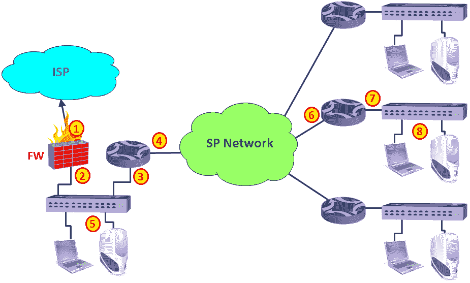

图 19.1: Wireshark 位置

现在，我们将尝试了解我们应该注意哪些类型的流量，哪些类型的流量是正常的，以及应该遵循哪些流量。

开始测试之前，请确保您有一个包含以下内容的最新网络拓扑:

*   服务器的 IP 地址和局域网的 IP 地址范围
*   路由器、交换机和其他通信设备的 IP 地址和拓扑结构
*   安全设备防火墙、**入侵检测系统** ( **IDSs** )/ **入侵防御系统** ( **IPSs** )、 **Web 应用防火墙** ( **WAFs** )、数据库和应用防火墙、防病毒系统以及任何其他具有 IP 地址并生成、过滤或转发网络流量的设备
*   哪些应用通过网络工作，包括软件的 TCP/UDP 端口号和 IP 地址

# 怎么做...

当您监控组织中的内部流量时，应检查以下内容:

*   从已知地址(在组织中)生成的流量:
    *   **正常**:这是来自已知地址和地址范围的流量
    *   **可疑**:这是来自/发往你不知道的地址的流量
*   应用和端口号:
    *   **正常**:这包括标准端口号、`80` (HTTP)、`137` / `8` / `9` (NetBIOS)、`3389` (RDP)、`20` / `21` (FTP)、`25110` (Mail)、`53` (DNS)等等。确保网络上运行的应用，并验证这些是您看到的唯一端口号。
    *   **可疑**:这包括异常端口号，即不属于服务器上运行的应用的端口号(例如，发往 web 服务器的 RDP 数据包)。
*   TCP 模式:
    *   **正常** : TCP `SYN` / `SYN-ACK` / `ACK`表示连接建立。单次复位(RST)表示快速断开连接。`FIN` / `FIN-ACK`数据包表示连接的定期拆除、标准数据包和确认。
    *   **可疑**:大量`SYN`数据包去往一个或多个目的地，或者来自多个来源(通常采用本章稍后描述的扫描模式)，异常标志组合(`RST` / `FIN`、`URG`)，等等。
*   您不知道的单个或多个网站的大量流量:
    *   **正常**:流量模式通常没有固定带宽。当你保存或打开文件，浏览互联网，发送或接收邮件，或使用 RDP 访问服务器时，你会看到起伏。
    *   **可疑**(在某些情况下):固定带宽模式可以表明有人连接到您的设备，但也可以表明有人正在通过互联网收听广播(100-150 Kbps)、观看视频(在某些情况下)等等。当您看到流量的固定带宽模式时，检查它是什么。固定带宽模式如下图所示:

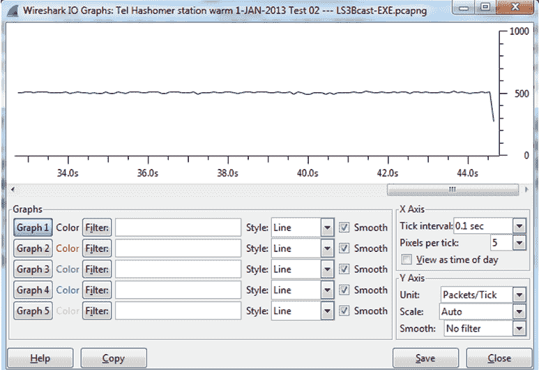

图 19.2:固定带宽模式

*   广播:
    *   **正常** : NetBIOS 广播、ARP 广播(不要太多)、DHCP(不要太多)、应用广播(通常每隔几秒或更长时间一次)等等
    *   **可疑**:每台设备每秒广播数十次、数百次、数千次或更多次
*   DNS 查询和响应:
    *   **Normal** :标准的查询-响应模式，每个客户端每秒几十次，偶尔
    *   **可疑**:大量的 DNS 查询和/或响应，没有查询的响应，等等

# 发现基于 MAC 和基于 ARP 的攻击

Wireshark 很容易发现各种类型的基于第 2 层 MAC 的攻击和基于第 2/3 层 ARP 的攻击。这些攻击通常是由扫描器(在下一个食谱中描述)和中间人攻击引起的。在本菜谱中，我们将看到一些典型的攻击模式及其含义。

# 发现 ICMP 和 TCP SYN/端口扫描

扫描是向网络设备发送数据包的过程，目的是查看谁在响应 ping 请求，寻找侦听 TCP/UDP 端口，并找出网络上共享的资源类型，包括系统和应用资源。

# 它是如何工作的...

网络取证和你在犯罪现场调查剧里看到的挺像的。出问题了；所以，你去犯罪现场(这是你的网络)，寻找证据(网络中留下的痕迹)。

您寻找的是与犯罪现场不匹配的东西(您的网络)、遗留的东西(不寻常的流量模式)、指纹和 DNA(可以识别攻击者的模式)。

在下面的食谱中，我们将查看各种类型的攻击和异常的详细信息，这些攻击和异常可能表明发生了犯罪，我们还将了解如何隔离问题并解决它们。

可能来自网络的一些常见攻击包括:

*   病毒:这些是攻击你的电脑并试图造成损害的小程序。病毒应该被反病毒软件发现并修复。
*   蠕虫:这些通常是试图在网络上自我复制的程序。它们对资源消耗有重大影响，例如，带宽消耗和 CPU 负载。重要的是，一旦你解决了问题，一切都会恢复正常。
*   **拒绝服务(DoS)和分布式拒绝服务(DDoS)** :这些是拒绝访问网络资源的攻击。这些类型的攻击通常很容易被发现，因为它们有独特的行为，很容易被发现。
*   **中间人攻击**:这些攻击是指攻击者拦截消息，然后重新发送。通过这种方式，攻击者可以窃听流量，或者在流量到达目的地之前改变流量。
*   **扫描**:有各种类型的扫描，从简单的 ICMP 扫描(通常是 DDoS 的一种形式)、TCP 扫描(例如，在各种端口号上发送 SYN 请求以尝试打开与服务器上运行的服务的连接)以及应用扫描(尝试连接到服务器上运行的应用)。
*   **应用层攻击**:这些攻击通过故意在服务器的操作系统或应用中造成故障来攻击服务器上的应用。

在下面的食谱中，我们将会看到它们中的每一个(以及更多)。

# 还有更多...

当服务器、PC、通信链路或网络上的任何其他实体变得缓慢，而没有任何逻辑原因时，表明出现了问题。例如:

*   当服务器变慢时，检查硬件和软件问题。检查网络问题，以及是否有人攻击它。
*   当从远程办公室到中心的链路变慢时，可能是因为负载(持续或突然)，但也可能是因为阻止它的攻击(通常是 DOS/DDoS)。
*   当一台电脑变得缓慢时，可能是因为它正在做你知道的事情，但这种可能性并不只有一种。检查你不知道的东西。

这里需要提到的是，有各种各样的系统保护我们免受攻击；其中一些列举如下:

*   防火墙:它们防止未经授权的流量进入特定区域。防火墙可以位于与互联网的连接处、组织服务器之前、组织区域之间，甚至可以作为每台 PC 上的个人防火墙。
*   **网络访问控制** ( **NAC** ):这些系统只允许授权用户连接网络。当将未授权设备连接到网络时，您会看到设备上的链接会打开并立即关闭，未授权设备会在 MAC 层被阻止。
*   **IDS/IPS** :这些系统可以识别入侵模式并进行拦截。这里通常有两道防线—一道在 ISP 网络，一道在客户驻地。IDS/IPS 可以是位于防火墙和互联网之间的专用设备，也可以是防火墙上的附加软件。
*   **WAF** 、**应用防火墙**、**数据库防火墙，以及其他应用保护设备**:这组产品是第 7 层保护设备，它查看应用内部，转发或阻止应用层攻击。
*   **网络过滤器和邮件过滤器**:这些设备扫描邮件和/或网络内容，只转发那些允许的邮件和流量。

刚才提到的功能可以是不同的设备、虚拟机上的软件或同一设备上的功能。

# 请参见

在这个菜谱中，我们讨论了一些安全组件。一些例子是:

*   **防火墙**:检查点([www.checkpoint.com](http://www.checkpoint.com))，瞻博 SSG 系列([http://www . Juniper . net/US/en/Products-services/security/SSG-series/](http://www.juniper.net/us/en/products-services/security/ssg-series/))，思科 ASA 系列([http://www . Cisco . com/en/US/Products/PS 5708/Products _ Sub _ Category _ home . html)](http://www.cisco.com/en/US/products/ps5708/Products_Sub_Category_Home.html))等等。
*   **NAC** :在这一类中，你有，比如说，Forescout(【http://www.forescout.com/solutions/network-access-control/】)和 entera sys([【http://www.enterasys.com/company/literature/nac-ds.pdf】](http://www.enterasys.com/company/literature/nac-ds.pdf))。
*   **IDS/IPS** :在这一类别中，我们有例如 Juniper IDP 设备系列([http://www . Juniper . net/us/en/products-services/security/IDP-series/](http://www.juniper.net/us/en/products-services/security/idp-series/))和用于防火墙的检查点软件刀片(【http://www.checkpoint.com/products/ips-software-blade/】T5)。
*   **WAF** :这里我们有例如 imper va([http://www . imper va . com/products/WSC _ we B- application-firewall . html](http://www.imperva.com/products/wsc_web-application-firewall.html))和 F5([http://www.f5.com/glossary/web-application-firewall/](http://www.f5.com/glossary/web-application-firewall/))。数据库防火墙是可用的，例如，来自 Oracle([http://www . Oracle . com/us/products/database/security/audit-vault-database-firewall/overview/index . html](http://www.oracle.com/us/products/database/security/audit-vault-database-firewall/overview/index.html))。
*   **网页和邮件过滤器**:这里我们有，例如，迈克菲([http://www . McAfee . com/au/products/email-and-we b-security/index . aspx](http://www.mcafee.com/au/products/email-and-web-security/index.aspx))、blue coat(【http://www.bluecoat.com/security-policy-enforcement-center】T5)和 Websense([http://www.websense.com/content/Home.aspx](http://www.websense.com/content/Home.aspx))。

# 做好准备

当在网络上看到太多 ARP 请求时，或者当在网络上看到非标准 MAC 地址时，使用端口镜像将 Wireshark 连接到它们的源并开始捕获。

# 怎么做...

要查找基于 ARP/MAC 的攻击，请遵循以下步骤:

1.  将 Wireshark 连接到网络上的任何端口。
2.  寻找大量的 ARP 广播。由于 ARP 请求是广播，它们将分布在整个第 2 层网络中(即，在一个 VLAN 上)。在下面的截图中，您可以看到一个典型的 ARP 扫描模式。值得注意的是，这种 ARP 扫描可能是一种以这种方式工作的应用，例如，发现使用免费 ARP 的网络和路由器的 SNMP 软件。只有当它来源不明时才是一个问题。

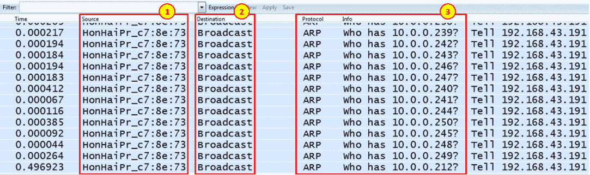

图 19.3: ARP 扫描模式

3.  还有一些可疑的 MAC 模式。当您看到以下内容时，您可以识别它们:
    *   两个相同的 MAC 地址，但 IP 地址不同。它可以是在同一个网络适配器上配置的两个 IP 地址，这是可以的，但它也可以是一种攻击模式，其中有人将其 MAC 地址更改为服务器的 MAC 地址(几乎可以在每个适配器上执行。)
    *   上面提到的案例也可能是中间人攻击，如[第 10 章](9affead7-6197-42e7-8ebc-0da367154504.xhtml) *、* *网络层协议和操作中的“ARP 中毒和中间人攻击”一节所述。*

# 它是如何工作的...

ARP 向网络发送广播，询问特定 IP 目的地的 MAC 地址。任何不遵循此模式的行为都应被视为恶意行为。

# 还有更多...

ARP 请求也可能来自发现网络的 SNMP 软件(自动发现功能)、发送免费 ARP 的 DHCP 服务器等等。每当看到 ARP 扫描什么东西的时候，不一定是问题；问题是谁送的？您可以在[第 10 章](9affead7-6197-42e7-8ebc-0da367154504.xhtml) *、* *网络层协议和操作中找到关于 ARP 过程的更多信息。*

# 做好准备

扫描攻击通常是由抱怨网络响应缓慢的用户、发现服务器或通信线路异常负载的管理系统，或者由识别可疑使用模式的**安全信息和事件管理系统** ( **SIEM** )实施的。在这些情况下，使用端口镜像找到 Wireshark，尽可能靠近您怀疑受感染的区域，然后开始捕获。

# 发现 DoS 和 DDoS 攻击

**拒绝服务** ( **DoS** )和**分布式拒绝服务** ( **DDoS** )是意在拒绝用户访问网络服务的攻击。可以拒绝用户访问的服务包括:

*   **通信线路**:这通常是通过产生淹没和阻塞通信线路的流量来实现的
*   **应用和服务(web 服务、邮件服务等)**:这通常是通过将服务器加载到无法满足客户端请求的程度来实现的

DoS/DDoS 攻击可能是我们在上一篇文章中提到的扫描的结果。区别在于 DoS/DDoS 是一种扫描，它以拒绝用户访问的方式降低服务器或网络的速度。

在本菜谱中，我们将看到一些常见的 DoS/DDoS 模式，并学习如何识别和阻止它们。

# 怎么做...

要发现问题，请按照下列步骤操作:

1.  启动 Wireshark，在靠近问题的接口上捕获:
    *   如果到互联网的线路变得很慢，请对线路进行端口镜像
    *   如果服务器变慢，请对服务器进行端口镜像
    *   如果远程办公室变得很慢，将线路镜像到它们的端口

2.  如果您看到 Wireshark 没有响应，很可能是因为您受到了非常强大的攻击，每秒钟会生成数千个或更多的数据包；因此，Wireshark(或您的笔记本电脑)无法处理它们。在这种情况下，停止 Wireshark(在 Windows 中使用*Ctrl*+*Alt*+*Del*，在 Unix 中使用`kill`命令，或者在 Apple Mac 中使用 *Force Quit* )并将其配置为捕获多个文件(在[第 1 章](53577c40-0245-4671-90d7-f42cc1c89cb1.xhtml) *、**Wireshark v2*简介中的“开始捕获数据”部分有所描述)。
3.  您可能会看到各种模式，所有模式都有相同的行为—大规模扫描，在大多数情况下是 ICMP 或 TCP，但也有其他类型。最好的理解方法是用一些例子来看它们。
4.  在下图中，您可以看到一个受到攻击的网络。所有远程站点的用户都抱怨网络非常慢。他们都在访问图表左侧中间的服务器。

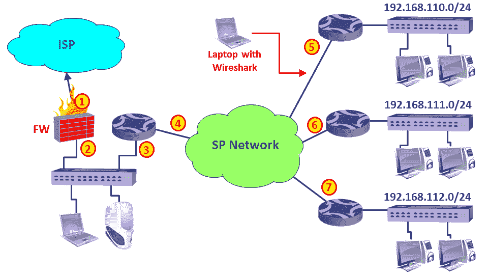

图 19.4: Wireshark 定位—远程站点速度缓慢

当我将 Wireshark 连接到一个远程站点时(如图所示),我收到了许多来自 LAN 192.168.110.0 (1)的 ICMP 请求(3)和随机目的地(2)。是随机的吗？

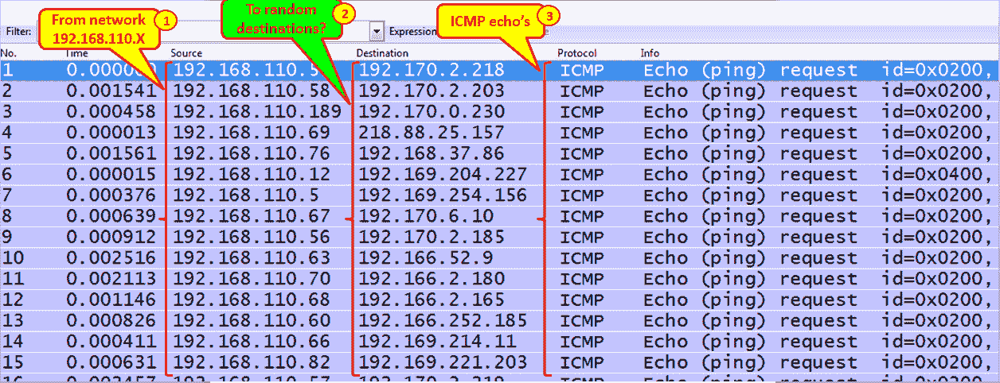

图 19.5: ICMP 扫描到随机目标

此外，还要查看数据包之间的时间间隔。如果扫描，通常会很短。

当你去统计|对话，你会看到一些有趣的事情:

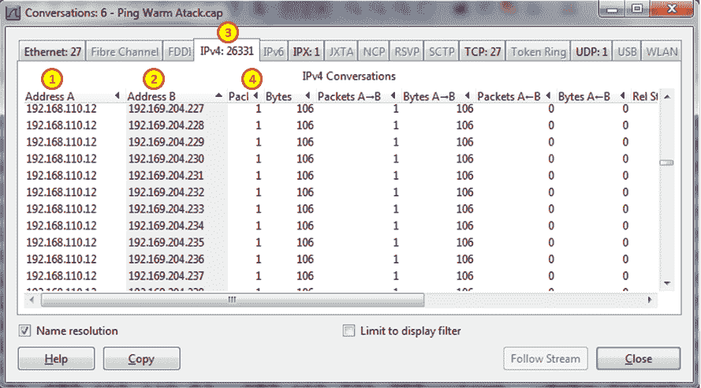

图 19.6: ICMP 扫描到随机目标—流量对话

当我们按地址 A ( **1** )对表进行排序时，我们看到了一种 ICMP 请求的模式，这些请求来自网络上的各个地址`192.168.110.0`(这里，我们看到了其中非常小的一部分，即`192.168.110.12`扫描网络)。

该蠕虫只是用 ICMP 请求扫描网络。当有人应答时，蠕虫也会感染他/她，几分钟后，所有的通信线路都会被远程办公室发出的 ICMP 请求阻塞。

Conclusion
When you see a massive number of pings scanning on a communication channel or link, that is, thousands or more pings, check for the problem. It can be the SNMP software discovering the network, but it can also be a worm that will flood your communication line or server links (or both).

5.  另一种常见的扫描类型是 TCP-SYN 扫描。在这种情况下，攻击者用 TCP-SYN 数据包扫描随机的 TCP 端口，等待有人用 SYN-ACK 应答。当它发生时，有两个选择:
    *   攻击者将继续发送 SYN 数据包并接收 SYN 确认，从而在受攻击的设备上留下许多半开连接
    *   攻击者将使用 ACK 进行应答，从而启动连接，并像在 DoS/DDoS 攻击中一样保持连接开放，或者试图通过此连接来损害受攻击的设备

6.  TCP-SYN 扫描将类似于以下屏幕截图中的模式之一:
    *   您将会看到许多 SYN 数据包没有来自受攻击节点的任何响应

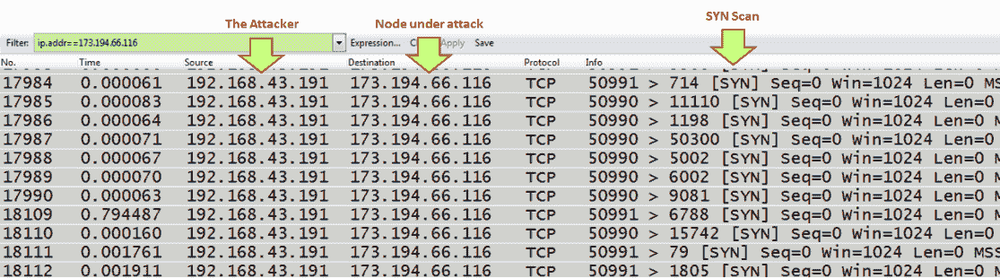

图 19.7: TCP SYN 攻击—无响应

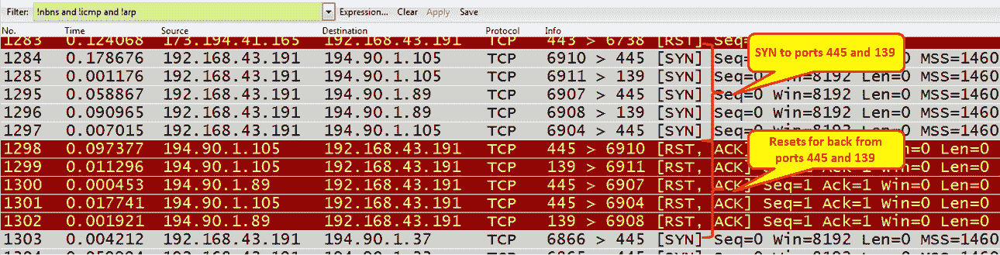

图 19.8: TCP SYN 攻击-连接重置

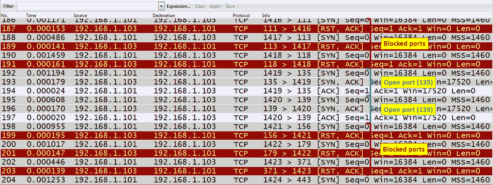 

图 19.9: TCP 会话发起-三次握手

7.  总是寻找不寻常的流量模式。例如，太多的 ICMP 请求是扫描的良好迹象。查找对客户端的多个 ICMP 请求、ICMP 时间戳请求、按升序或降序排列的 ICMP 等等。这些模式可能表示恶意扫描。

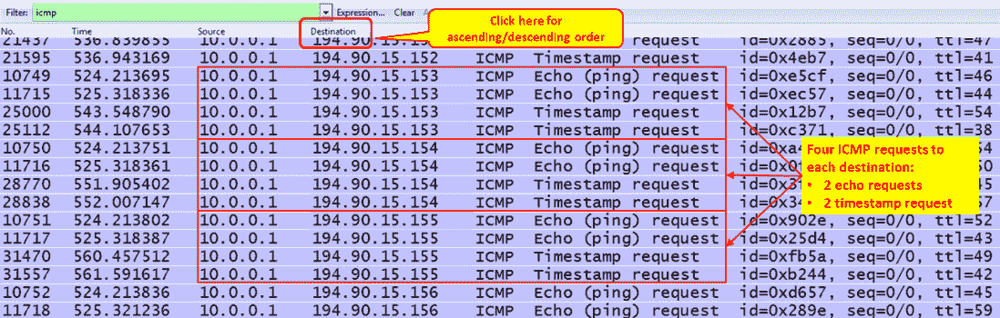

图 19.10: ICMP 请求-恶意扫描

8.  在应用扫描的情况下，您可以进行各种类型的扫描:

其他类型的应用根据其端口号进行扫描

# 它是如何工作的...

大多数扫描仪分几个步骤工作:ARP 扫描，ICMP，然后是 TCP 或 UDP。原理很简单:

*   如果扫描仪在局域网上，它会向整个局域网发送 ARP 广播。
*   扫描仪发送 ICMP 请求。一些 ICMP 请求将被应答。
*   当有人应答 ARP 或 ICMP 请求时，它会上升到 TCP 和 UDP 并开始扫描第 4 层端口。当扫描器发现一个端口打开时，它开始扫描应用。
*   在应用扫描中，扫描器向应用发送命令，试图让应用做出响应，并以这种方式试图侵入应用。

# 还有更多...

在过去几年中，大多数现代入侵检测/防御系统(IDS/IPS)都知道如何处理 ICMP 扫描、TCP SYN 扫描和各种类型的扫描，这些扫描会产生大量标准的、众所周知的攻击模式流量。如果您有这样的系统，并且您通过拥有他们系统的 ISP 连接到互联网，您可能会受到保护，免受这些简单类型的攻击。

这些系统通常以两种方式工作:

*   基于 NetFlow/Jflow 的 IDS/IPS，可识别来自多个来源的大量流量；他们通过阻止数据包或更改路由表来阻止这些数据包到达 ISP 网络，从而使其失效。
*   基于内容的入侵检测/入侵防御。它会查看流量模式，并据此决定是否转发。

来自内部网络的攻击不会被外部设备过滤，因此更加常见。本章后面的*智能 TCP 攻击*方法将讨论更复杂的攻击类型。

防止来自互联网的攻击的方法是通过具有高效 IDS/IPS 系统的 ISP 连接，并使用您自己的系统。防止来自内部网络的攻击的方法是实施组织安全策略以及适当的保护软件，如防病毒软件和个人防火墙。

# 请参见

在上一节中，我提到了组织安全策略的问题，即如何实现一组保护组织安全的规则。关于这一主题的更多信息可在互联网上广泛获取。一些涉及这方面的有趣网站有:

*   [http://www.cert.org/work/organizational_security.html](http://www.cert.org/work/organizational_security.html)
*   [http://www.praxiom.com/iso-17799-4.htm](http://www.praxiom.com/iso-17799-4.htm)
*   [http://www . sans . org/reading-room/whites/policy issues/1331 . PHP](http://www.sans.org/reading-room/whitepapers/policyissues/1331.php)
*   [http://www.sans.org/security-resources/policies/](http://www.sans.org/security-resources/policies/)

# 做好准备

DoS/DDoS 通常是在某个网络资源(即通信线路或服务器)变得非常慢或无法运行时发现的。

当您发现此类资源时，将 Wireshark 与该设备的端口镜像连接，并启动数据包捕获。在本菜谱中，我们将介绍一些常见的 DoS/DDoS 攻击及其特征。

# 怎么做...

使用端口镜像将 Wireshark 连接到您怀疑暴露于 DoS/DDoS 的资源的端口。通常，它会是服务器变得非常慢，通信线路变得非常负载，或者任何其他资源停止运行或变得非常慢。

*   当通信线路变得非常慢时，例如连接到互联网时，将带有端口镜像的 Wireshark 连接到该线路。
    *   试着找到流量的来源。
    *   我对服务器进行了端口镜像，这是我得到的结果:

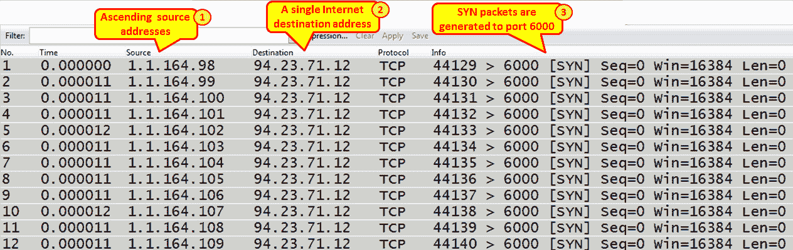

图 20.11:来自不同 IP 地址的 TCP SYN 攻击

*   我们看到源地址以升序排列，产生了到互联网地址`94.23.71.12`的流量。

当您查看配置了自上一次显示数据包以来的时间的时间列时，您会看到帧之间有 11-12 微秒。当你看到 TCP-SYN 以这样的速度来的时候，一定是出问题了。看看这是什么！

*   由于源地址未知，我检查了他们的 MAC 地址。我得到的是:

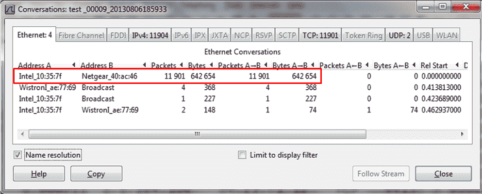

图 19.12: TCP SYN 攻击—流量对话

*   问题是所有源地址都来自同一个 MAC 地址。于是我查了他们的 MAC 地址，所有的 IP 地址都来自一个 MAC 地址:服务器的 MAC 地址。

检查 SYN 扫描，并验证它们来自哪个 IP 和 MAC 地址。可能是蠕虫生成的源地址不是主机的地址。

*   另一个例子是来自单个攻击者的简单 SYN 扫描，如下图所示。寻找 SYN 并观察他们正在扫描的端口号。您可能会看到:
    *   不响应
    *   重置数据包
    *   同步确认响应
*   这种类型的攻击可能会有各种后果:
    *   在没有响应或重置响应的情况下，被攻击的服务器运行良好。如果服务器用 SYN-ACK 响应来回答，可能会给服务器带来风险。
    *   风险在于，如果打开(SYN/SYN-ACK/ACK)或半开(SYN/SYN-ACK)的连接太多，服务器可能会因为这些连接而变慢。
    *   你可以在下面的截图中看到一个典型的 TCP SYN 攻击。当 SYN 攻击阻塞通信线路或使服务器负载达到停止运行的程度时，它就变成了 DoS/DDoS 攻击。

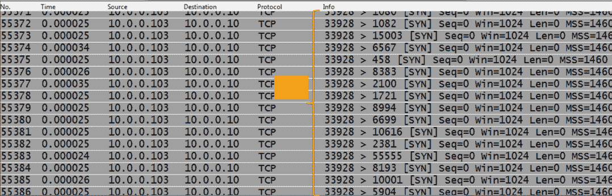Figure 19.13: TCP SYN DDoS attack

# 它是如何工作的...

DoS 是一种拒绝使用网络服务的攻击。其方式是让受攻击的设备将硬件资源(CPU、内存等)分配给攻击者，这样就不会给用户留下任何东西。

DoS 是指网络资源受到攻击。分布式拒绝服务是指攻击来自多个来源。

# 还有更多...

DoS/DDoS 攻击有时难以发现，因为它们可以模拟真实情况。例如:

*   Ping 扫描也可用于管理系统
*   HTTP GET 请求是 web 服务器接受的普通请求
*   SNMP 获取请求

为了发现问题，应监测这些和许多其他物质的数量和来源。在下面的截图中，我们看到了当我们跟踪一个特定的 TCP 流时会得到什么。

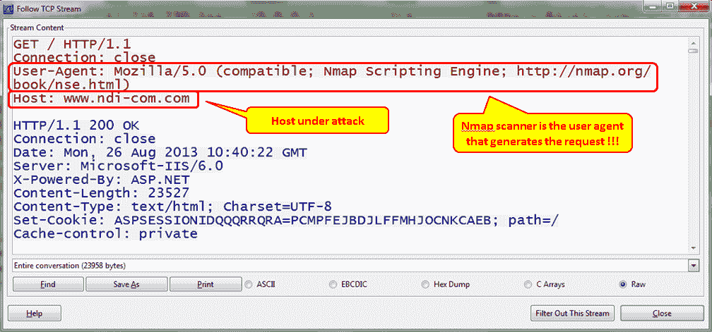

图 19.14: TCP SYN DDoS 攻击

# 定位智能 TCP 攻击

另一种类型的攻击是当您发送未知的 TCP 数据包时，希望受到攻击的设备不知道如何处理它们，并希望通过它们。这些类型的攻击是众所周知的，并且被当今网络中实现的大多数现代防火墙所阻挡；但是，我还是会简单地告诉你。

# 发现暴力和应用攻击

网络攻击的下一步是了解各种类型的暴力攻击。暴力攻击是一种反复试验的方法，用于从受害者那里获取信息，例如，试图找到组织服务器、用户目录和破解密码。

# 做好准备

当我到达一个新的网络时，我通常做的是将我的笔记本电脑连接到该网络，并查看它正在运行什么。首先，我只要把它连接到几个开关上，就能看到广播。然后，我为关键服务器和通信线路配置了一个端口镜像，并查看在它上面运行的是什么。

要查找异常流量，请对通信链路和中央服务器进行端口镜像，并检查异常流量模式。

# 怎么做

您应该寻找的流量模式有:

*   **ACK 扫描**:为了中断现有的 TCP 连接，通常会向多个端口发送多个 ACK

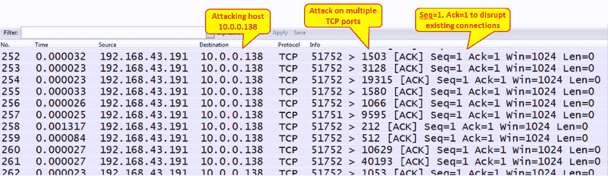

图 19.15: TCP 确认扫描

*   **不寻常的旗帜组合**:这是指任何带有 URG 旗帜、FIN 和 RST、SYN-FIN 等等的组合。不寻常的标志组合不是通常的 SYN、FIN 或 RST，有或没有 ACK。在下面的屏幕截图中，您可以看到这个场景的一个示例。FIN/PSH/URG 操作统称为圣诞扫描。

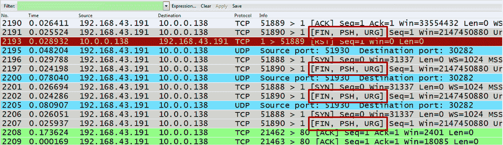

图 19.16: TCP 异常标志组合

所有标志都设置为零的 TCP 扫描。这种扫描被称为**空扫描**。

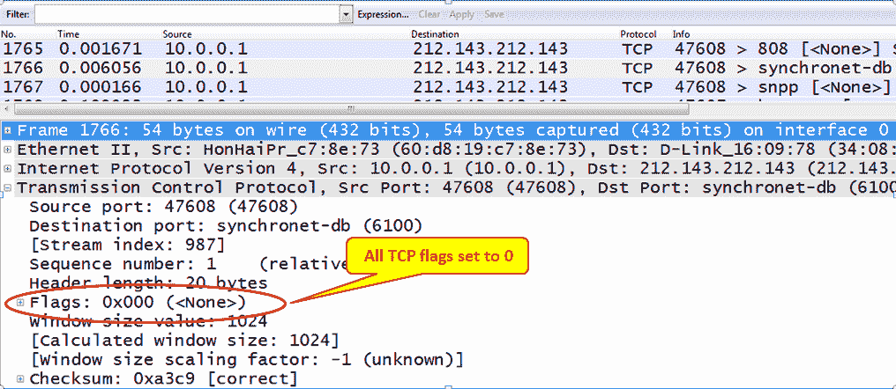

图 19.17: TCP 空扫描

*   **大量 FIN-ACK 扫描**:将 FIN 和 ACK 标志设置为 1 的大量数据包发送到多个端口，以使这些端口关闭或淹没网络

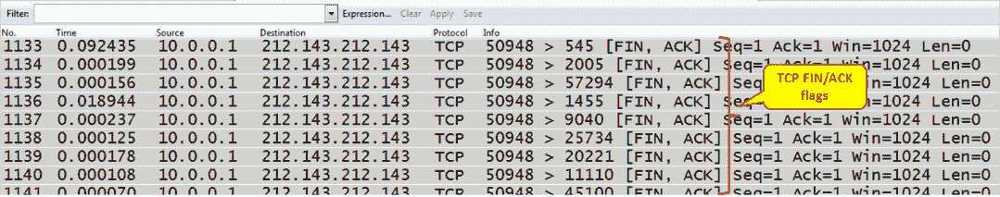

图 19.18: TCP 最终确认扫描

# 它是如何工作的...

有许多类型的 TCP 扫描是基于这样的假设:当我们向目标发送扫描各种端口号的 RST 或 FIN 标志(有或没有 ACK)时，我们将导致目标关闭连接，当我们向目标发送不寻常的标志组合时，它将使目标忙碌。这将导致它的速度变慢并断开现有的连接。

这些扫描中的大部分是众所周知的，并且针对防火墙和入侵检测/预防系统得到了很好的保护。

# 还有更多...

您还可以配置预定义的过滤器来捕获这些类型的攻击，但是在怀疑此类事件时，最好的做法是仔细检查捕获的数据并寻找不寻常的数据模式。

# 请参见

*   对于扫描类型，请访问 NMAP.org 网页:[http://nmap.org/book/man-port-scanning-techniques.html](http://nmap.org/book/man-port-scanning-techniques.html)

# 做好准备

暴力攻击通常不会在网络上产生非标准负载，它们被发现的方式通常是通过 IDS 系统或者当怀疑有人试图侵入网络时。在本菜谱中，我们将学习如何识别典型的暴力攻击。

# 怎么做...

当您怀疑网络上存在暴力时，请按照以下步骤进行定位。

1.  将带有端口镜像的 Wireshark 连接到您怀疑受到攻击的服务器端口。
2.  对于 DNS 暴力攻击，查找要求您的域下的通用名称的 DNS 查询。例如，在下面的截图中，您可以看到对 ISP 服务器的扫描。我们可以看到对常见名称的 DNS 查询，如 DNS ( **1** )和 DNS ( **2** )、IPv4 的记录( **2** )和 IPv6 的记录( **3** )，以及 intranet—IP v4 的记录( **4** )和 IPv6 的记录( **5** )。
    *   在`dns.icomm.co` ( **1** 的情况下，我们得到了回复；在所有其他情况下，我们没有。
    *   许多没有响应的查询不仅表示 DNS 暴力攻击，还表示有人正在寻找不存在的服务器。查看源地址，看它来自哪里。

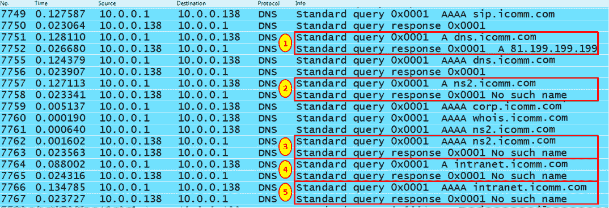

图 19.19: DNS 暴力攻击

3.  另一种需要警惕的暴力攻击是 HTTP 试图在服务器上寻找资源。
    *   要查找 HTTP 扫描，请在数据包详细信息中查找扫描程序的签名，如下图所示。

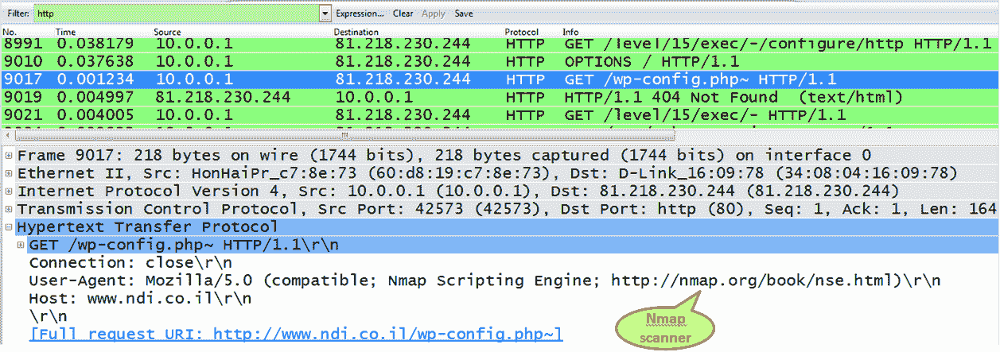

图 19.20: HTTP 暴力攻击-查找资源

*   另外，寻找太多的 HTTP 错误消息。下面的屏幕截图举例说明了一些例子。选择统计| HTTP |数据包计数器| PC。如果您收到太多错误消息，请检查它们的来源。

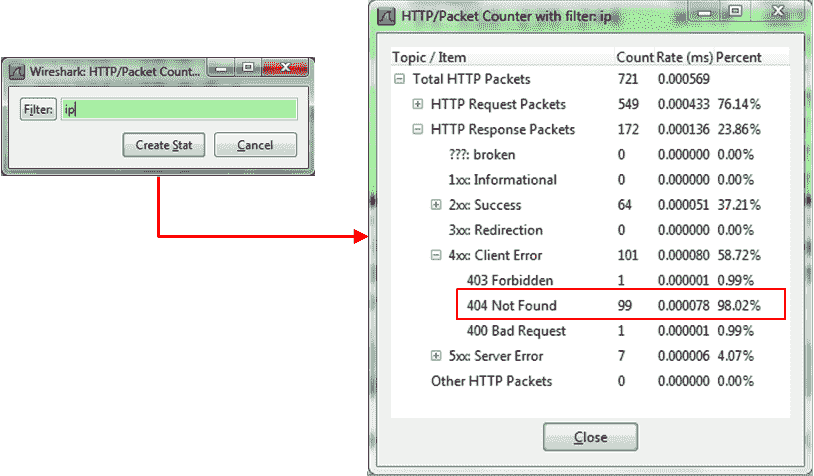

图 19.21: HTTP 错误消息和来源

# 它是如何工作的...

暴力攻击是一种反复试验的攻击，它向目的地发送请求，希望其中的一些会得到响应。由于这些请求中的大多数都会被拒绝(如果您已经正确配置了您的服务器)，大量的未找到的消息、禁止的消息和其他错误代码可能是这种攻击的一些迹象。

# 还有更多...

要发现 HTTP 错误代码，请配置显示过滤器`http.response.code >= 400` **。**这同样适用于 SIP 和任何使用类似 HTTP 代码的协议。要查找已知的扫描仪，您只需使用编辑|查找数据包功能并查找常见的扫描仪名称。在下面的截图中，你可以看到一个 Nmap 的例子，这是常见的例子之一。我们在包字节(2)中选择了字符串 nmap.org(1)。

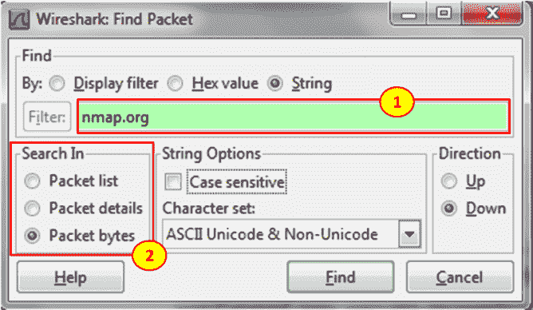

图 19.22:过滤以发现 HTTP 错误

这是我们得到的结果:

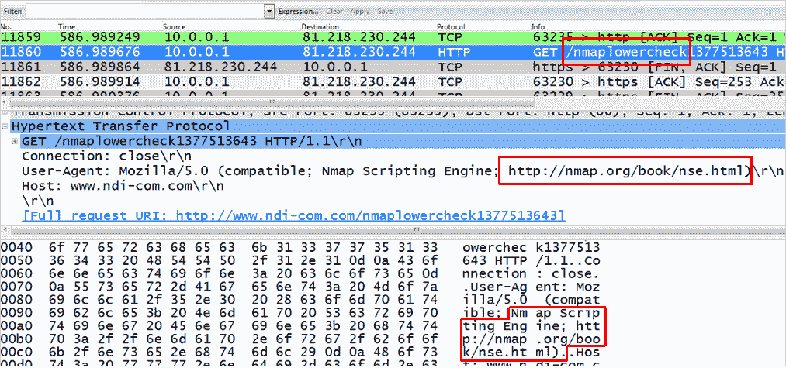

图 19.23:发现 HTTP 错误代码

暴力攻击的另一个重要问题是攻击者试图猜测密码以闯入服务器。

在下面的屏幕截图中，您会看到当攻击者试图闯入一个受到良好保护的 FTP 服务器时会发生什么。

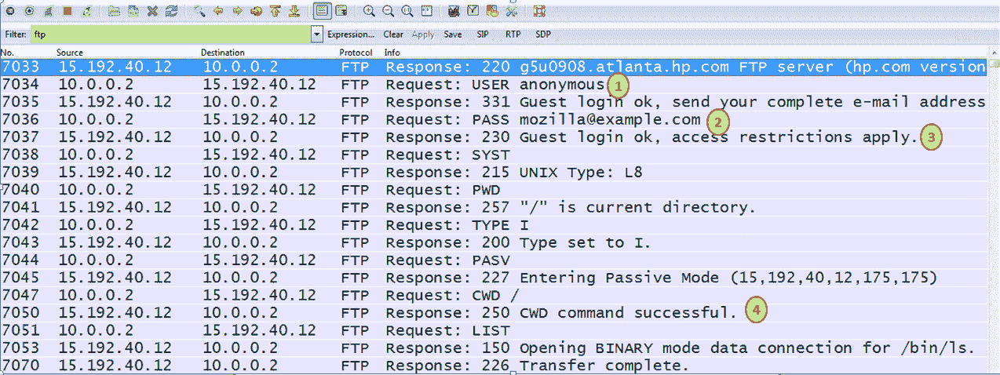

图 19.24:用户破坏 FTP 服务器

因为是 FTP，所以第一次试用的是用户名`anonymous` (1)。攻击者选择的密码(2)。当然，登录被批准(3)，攻击者进入(4)。

在下面的屏幕截图中，您可以看到当攻击者尝试未授权的其他用户名时会发生什么。

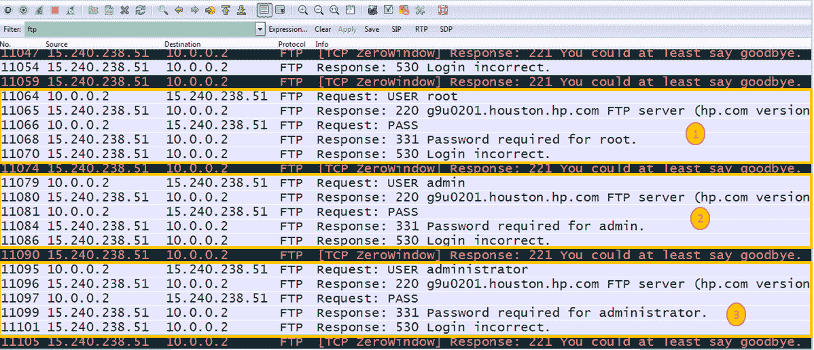

图 19.25:用户破坏 FTP 服务器-无效用户名

在这里，您可以看到攻击者试图使用用户名 root (1)、admin (2)和 administrator (3)登录。

攻击者被阻止，服务器发送 TCP 零窗口消息，甚至通过显示您至少可以说再见来回答。