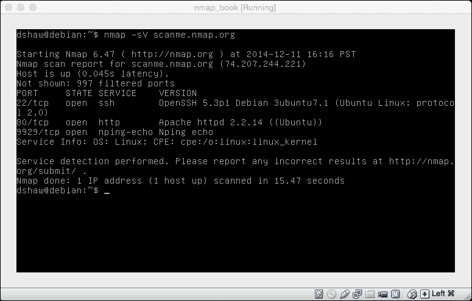
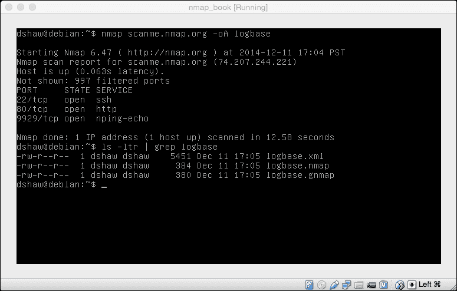
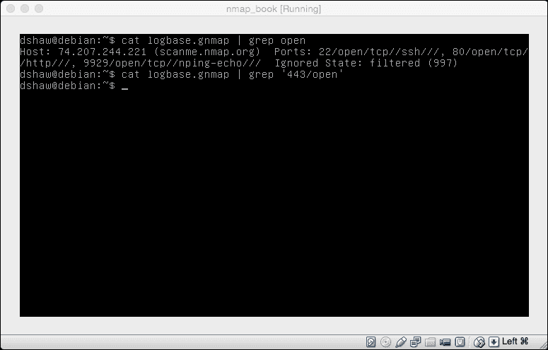
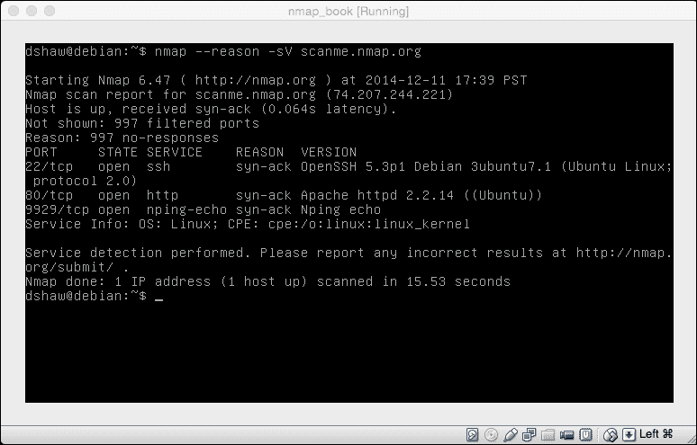

# 第三章：Nmap 基础知识

现在我们了解了网络是如何工作的，是时候真正开始使用 Nmap 来扫描计算机和网络了。本章旨在涵盖几个主题，让您能够真正开始扫描其中的一些内容。

在本章中，我们将涵盖：

+   如何选择目标

+   如何运行默认扫描

+   如何检查服务版本

+   如何记录扫描（以及不同的日志类型意味着什么）

+   如何指定特殊的扫描范围

+   如何了解 Nmap 结果的推理

# 如何选择目标

尽管普遍认为在互联网上扫描计算机不是犯罪，但系统管理员也不欣赏。每秒都有成千上万次的扫描，涵盖互联网的各个领域，但这并不意味着如果您扫描了错误的机器就不会收到滥用投诉（或更糟）。确保您选择的任何目标都知道（并同意）您可能决定进行的任何扫描。有几种方法可以创建自己的目标，一些读者可能会发现这比在网上使用免费目标更容易。

最简单的目标，也是最容易设置的，就是在本地局域网上使用另一台计算机。您可以使用路由器（家用路由器通常位于 192.168.1.1），网络上的另一台机器（我们将讨论如何找到），甚至购买一台便宜的笔记本电脑作为测试实验室。

如果您没有其他机器可以进行扫描，或者不愿意（或未经授权）扫描其他机器，您可以通过虚拟化一台机器来创建自己的机器。虽然您需要对安装 Linux 有一定了解，但有免费软件解决方案（如 VirtualBox）和商业软件解决方案（如 VMWare 或 Parallels）可以为您虚拟化机器。如果您决定采用这种方式来扫描本书中的目标，我建议您安装 Ubuntu 或 Debian - 您也可以从这些机器上进行扫描！除了创建自己的虚拟服务器，还可以在不花太多钱的情况下从云托管提供商那里购买**虚拟专用服务器**（**VPS**）。常见的提供商包括 Linode、DigitalOcean（在撰写本文时，每月只需 5 美元就可以获得 VPS）、**亚马逊网络服务**（**AWS**）、Rackspace 等。在这些基于云的服务器上运行的优势是，您还可以获得运行完整的 Linux 服务器的经验。如果您愿意，甚至可以在该服务器上托管网站、电子邮件、FTP 或任何其他服务！

最后，如果您不想托管自己的虚拟机，家庭网络中没有其他机器，也不想为虚拟专用服务器付费；您可以扫描自己的机器（这并不是很令人兴奋），或者使用 Nmap 团队在[`scanme.nmap.org/`](http://scanme.nmap.org/)提供的免费服务。

该网站允许您进行全面的扫描，因此您不必担心对任何网络管理员不礼貌或讨厌。另一方面，实际上无法更改此主机上正在侦听的任何服务，因此您实际上永远无法更改您获得的结果。有时使用自己的计算机（“localhost”或 127.0.0.1）可能是更好的选择，因为您可以运行服务并查看检测到的不同端口。

为了在本书中的扫描示例中使用，我们将使用[`scanme.nmap.org/`](http://scanme.nmap.org/)和其他为了被扫描而设置的虚拟机。记住：未经允许不要进行扫描！

# 运行默认扫描

一旦安装了 Nmap 并选择了目标，使用默认设置运行扫描就相对简单了。命令就像`nmap scanme.nmap.org`一样简单（假设[`scanme.nmap.org/`](http://scanme.nmap.org/)是这次特定扫描的目标）。

正如您在前面的屏幕截图中所看到的，运行默认扫描非常容易。通常，Nmap 使用 SYN 扫描作为默认扫描类型；但因为我们没有通过`sudo`以 root 权限运行扫描，Nmap 会转而使用“连接”扫描。我们将在第四章*高级 Nmap 扫描*中详细讨论特定扫描类型的区别。

目前，您可以看到我们已经检测到三个开放的服务。最左边的列显示了端口号和协议（在本例中为`22/tcp`、`80/tcp`和`9929/tcp`），该端口是开放的以及服务是什么。当我们运行 Nmap 而没有额外指定任何内容（比如刚刚运行的扫描），`SERVICE`列是根据`/etc/services`中的端口规范填写的（在 Linux 上），而不是实际分析协议。如果我们想要检查实际的服务版本（通过检查横幅），我们需要指定不同类型的扫描：服务版本扫描。

# 服务版本扫描

运行服务版本扫描非常简单；我们只需要添加一个额外的标志`-sV`。这意味着我们正在进行服务版本扫描，可以展示每个软件的版本。如果有人在非默认端口上运行服务（与`/etc/services`不匹配），这将特别有用——在这种情况下，能够准确地弄清楚正在运行的是什么更加重要。

当我们运行这个后续扫描时，您会看到结果略有不同：

您可以在前面的屏幕截图中看到，现在扫描结果中放入了更多的信息；在本例中，我们可以看到`OpenSSH`、`HTTP`和`Nping echo`服务的实际补丁版本。

在安全评估的背景下，您可以看到这是多么有用！如果您正在寻找特定软件版本的漏洞，能够准确地告诉正在运行的版本是至关重要的。漏洞通常只存在于特定版本的软件中（比如 1.0.1 和 1.0.4 之间），因此我们在这里看到的细节非常重要。然而，需要注意的是，如果系统管理员限制了服务版本，则无法准确地知道正在运行的是什么。从防御的角度来看，这非常重要！

您可能还注意到在扫描结果之前，顶部显示了文本`未显示：997 个被过滤的端口`。Nmap 不会显示所有扫描中关闭的端口，因为那样会使扫描结果变得混乱。通过增加扫描的详细程度，可以看到这些端口（以及它们是关闭还是被过滤），我们将在第四章*高级 Nmap 扫描*中讨论。然而，更重要的是，您应该记住每台机器上可以打开或关闭的端口有 65,535 个。如果我们将 997 个添加到我们已经看到的三个开放的端口中，我们只得到了 1,000 个——只是总端口数量的一小部分！

默认情况下，Nmap 只会扫描通常开放的前 1,000 个端口。这不对应于前 1,000 个端口，而是通常开放的端口。您可以通过使用`--top-ports 1000`标志或指定不同的数字（例如`--top-ports 200`）来获得相同的结果。

# 记录扫描

尽管逐个案例地查看扫描结果在短期内非常有帮助；对于更长的评估时间（或者对于会滚动屏幕的更大的扫描），将扫描记录到文件中是一个好主意。

Nmap 支持三种不同类型的日志记录。每种类型都有一个不同的标志来记录特定的日志类型，并且有不同的目的。幸运的是，对于我们来说，Nmap 开发团队足够聪明，他们使用`-oA`（输出全部）标志，可以输出所有三个日志文件。这个标志的第二个参数只是日志的基本名称。它们将自动具有自己独特的文件扩展名。

正如你在前面的截图中看到的，Nmap 自动保存了所有三个日志文件扩展名（`.xml`、`.nmap`和`.gnmap`），并使用了在`-oA`标志中指定的基本文件名。

正如你所看到的，在使用`-oA logbase`标志运行扫描后，当前目录中现在有三个文件。现在我们有一个`.xml`文件，其中以 XML 格式包含了扫描的结果（以及时间详细信息），还有一个`.nmap`文件，它是扫描的人类可读输出。换句话说，基本上就是在运行扫描时在屏幕上看到的相同输出——也许最有趣的是`.gnmap`文件。`.gnmap`文件代表**可搜索的 nmap**输出，它被设计为 Linux 命令行工具`grep`轻松使用。换句话说，它非常容易搜索。

你可以很容易地看到在前面的例子中，当搜索“open”时，我们得到了包含打开端口的`.gnmap`文件的行。由于我们只扫描了一个主机，返回的主机必须是我们扫描的那个——`scanme.nmap.org`——但在更大的扫描中，找出哪些主机有任何打开的端口（以及我们可以安全忽略哪些）是非常有用的。

其次，我们对`443/open`进行了`grep`。这个`grep`没有返回任何结果（因为在这次扫描中端口`443`没有打开），但你可以看到，使用这样的可搜索输出可以快速有效地确定哪些主机有特定端口在线。当我们谈论通过 Nmap 进行主动利用时，我们将能够更好地理解这样的有价值信息。

# 指定的扫描范围

我们之前了解到，默认情况下，Nmap 只扫描前 1000 个端口。然而，服务可以在线上的 65,535 个端口中的任何一个，而不仅仅是最常见的端口。许多系统管理员和网络工程师在非常高的端口上运行服务，比如 65,001，这样它们就不会被普通扫描检测到。然而，通过模糊性来保护安全从来都不是真正有效的！

可以使用`-p`标志指定特定的端口范围。因此，如果你只想扫描`scanme.nmap.org`的端口`80`，你可以输入`nmap -p 80 scanme.nmap.org`。端口规范标志也适用于范围——因此，在另一个例子中，`nmap -p1-1024 scanme.nmap.org`将扫描目标主机上的端口`1`到`1024`（所有特权端口）。

此外，还有一个有用的技巧可以扫描机器上的所有 65,535 个端口：不必输入`-p1-65535`，你可以简单地使用快捷方式`-p-`。Nmap 的开发人员很友善和有远见，他们意识到频繁输入数字“65,535”会很累人！

尽管我们目前只扫描了一个主机，但值得注意的是，还有几种指定多个 IP 地址或主机名的方法。CIDR 表示法（192.168.1.0/24）、IP 地址列表（1.2.3.4,1.2.3.5,1.2.3.6）和目标文件（`-iL targets.txt`）都是指定要扫描的主机的有效方法。它们将以相同的扫描类型进行扫描，并且 Nmap 本身会优化所涉及的时间。我们将在第五章*性能优化*中更多地讨论优化这个过程。

# 理解原因标志

由于我们已经涵盖了基本的网络知识，包括 TCP 三次握手，在第二章*网络基础*中，您已经知道端口“打开”的含义，以及通常如何确定。然而，在某些边缘情况下（特别是对于`filtered`端口），了解 Nmap 在打开、关闭和过滤端口背后的逻辑可以极其有用。

您可以使用`--reason`标志来确定 Nmap 是如何得出结论的。

如前面的屏幕截图所示，在调用`--reason`标志后，扫描后现在添加了第四列。在这种情况下，我们可以清楚地看到，被识别为在线的三个服务是因为 syn-ack，表明对 syn 请求的 syn/ack 响应——一旦我们看到给定端口上的服务正在尝试完成 TCP 三次握手，我们就知道有东西在监听。

# 总结

阅读完本章后，您应该能够进行许多不同和有趣的扫描类型。您还应该知道如何更改正在扫描的端口，以及如何一次扫描多个主机。您已经了解到获取服务横幅可以帮助您查看正在运行的软件版本，以及如何输出各种不同类型的日志文件。最后，您现在应该能够理解 Nmap 标记结果的网络原因。要成为真正的 Nmap 大师还有很长的路要走，但您已经掌握了进行扫描的基础知识。在下一章中，我们将学习如何进行高级 Nmap 扫描，以便在更复杂的情况下获得结果。这一章将使您能够在甚至奇怪或敌对的环境中进行扫描，这是安全专业人员在参与过程中经常遇到的情况。
