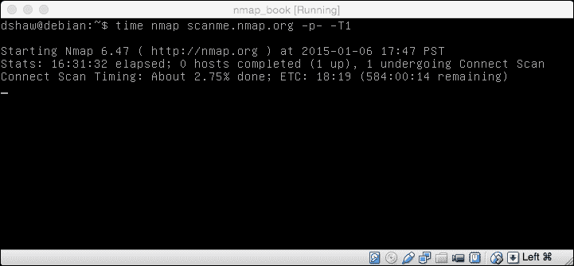
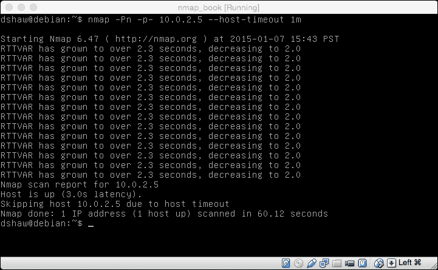

# 第五章：性能优化

我们现在完全能够扫描许多不同类型的主机，并克服系统管理员和网络工程师用来保护或隐藏他们的机器的各种方法。太棒了！在这一点上，我们将开始研究 Nmap 可以解决的一些更广泛的问题：特别是，如果我们尝试扫描可能会导致性能中断的大量 IP 地址。

不幸的是，使用我们在上一章学到的高级 Nmap 选项可能会使扫描花费比我们预期的时间更长。性能优化技术是一些最少使用但最有用的 Nmap 标志，因此值得好好学习它们—并在需要时使用它们。

在本章中，我们将涵盖：

+   基本的 Nmap 时间优化

+   自定义主机组大小

+   如何增加或减少 Nmap 的并行性

+   如何处理卡住的主机

+   如何延迟（或增加）单个数据包的速率

# Nmap 时间优化

使扫描运行更快的最简单方法是使用内置的`timing`标志。这些标志使用`-T`和数字从 1（最慢）到 5（最快）来调用。默认的扫描速度是`-T3`，正好在中间。

使用显著更快的扫描存在一些风险，因为它会在扫描中产生某些不可靠的方面。特别是，如果您的网络接口被认为是可靠的，这些选项应该谨慎使用！

默认的时间标志改变了六个不同的元素—其中许多我们稍后会详细介绍。具体来说，时间标志改变了`initial_rtt_timeout`、`min_rtt_timeout`、`max_rtt_timeout`、`max_parallelism`、`scan_delay`和`max_scan_delay`的各个值。如果这些标志对您听起来很奇怪，不要担心—我们将详细介绍您需要了解的不同标志，以便您能够调试各种网络和性能问题。

前面的截图是从[`www.professormesser.com/`](http://www.professormesser.com/)下载的，显示了`-T`标志在各种不同方式上的优化。最重要的区别是在`-T3`和`-T2`之间的并行到串行转换（意味着主机不再同时扫描），以及整体上显著的超时差异。

系统管理员也通过增加响应时间来减少目标的脆弱性，因为大部分时间主机信息可以从 TTL 值中读取。

运行“疯狂”扫描显然可以使大型网络块更快，但有趣的是，另一端的“隐秘”和“偏执”扫描（`-T1`和`-T0`）在“隐藏”端口扫描方面非常有效。

如果我们在进行渗透测试时，入侵检测系统和入侵预防系统正在运行，运行这些慢速扫描可能非常有益。

正如您在前面的截图中所看到的，对`scanme.nmap.org`进行的`-T5`扫描（包括所有端口）只花了一分钟（一秒），这在`time`命令的输出和 Nmap 自己的时间计算器中都可以看到。另一方面，运行一个“隐秘”的`-T1`扫描花费的时间要长得多。

为了展示长期慢速扫描的真实效果，我们对同一台主机运行了一个`-T1`扫描—您可以在这里看到，经过十六个小时，扫描仍然只完成了 2.75%—这是一个非常慢的扫描！很容易看出，我们不希望这些扫描选项通过大量的 IP 地址，但是在客户参与中额外隐蔽（比如运行 IDS 或 IPS 的客户）可能非常宝贵。

# 自定义主机组大小

为了有效地扫描主机，Nmap 使用同时扫描的主机组。假设你的互联网连接（和计算机处理能力）足够，通常最好增加主机组的大小以快速完成大型扫描。例如，如果你正在扫描 1000 个主机，主机组大小为 250，那么只需要四次“扫描”就可以并行完成整个扫描。

然而，一个人应该仔细权衡他们通过改变主机组大小所希望实现的目标。一次扫描许多主机的好处是明显的，但坏处可能并不明显——如果你正在扫描一个大组，你必须等待整个主机组完成扫描，然后才能看到任何结果并继续下一个组。如果你想快速看到结果，一个较小的主机组对于你的特定扫描会更好。

默认情况下，Nmap 会尝试采取动态的中间路线来处理主机组大小：它会动态改变主机组以适应详细扫描（这样我们可以看到发生了什么）和效率（这样完整扫描会很快完成）。Nmap 从 4 或 5 开始主机组，并将它们自动增加到 1024。

然而，如果你正在寻求精细调控，有两个主机组标志你应该记住：`--min-hostgroup`和`--max-hostgroup`。例如，如果你计划扫描一个完整的 C 类网络，指定一个大小为 256 的组将在一个大的并行通道中完成这次运行，大大提高了扫描引擎的效率。

值得注意的是，主机组规范对主机发现扫描并不起作用，包括 ping 扫描——Nmap 将自动使用非常大（通常为 4096）的主机组，以便使这些扫描运行高效。

# 增加和减少并行性

尽管我们刚刚学到的主机组大小定制可以帮助增加或减少完整扫描的并行性，但它并不处理同时发送的探测数量。然而，实际的并行性标志可以帮助我们处理这个问题！

和许多事情一样，Nmap 会尝试自动创建最有效的扫描组，这对几乎所有情况都很好。根据我的经验，在没有进行严肃的网络教育的情况下，改变同时发送的探测数量可能会导致灾难，但并非总是如此。

通过增加`--min-parallelism`的值，比如增加到 10 或 12，你可以强制 Nmap 至少以这样的速度进行扫描。Nmap 仍然会使扫描运行得更快，如果需要的话，这样可以减少一些风险。

另一方面，将`--max-parallelism`的值设置得低至 1 是非常有用的；这样可以强制 Nmap 一次只发送一个探测，但也会使工具运行得非常慢（正如你所想象的那样）。我们可以利用这样的技巧来愚弄安全系统，或者确保我们的扫描可靠性永远不会受到网络相关问题的影响。

如果你看到主机似乎无法完成，或者你非常关心当前组中扫描的主机数量，调整并行性可能非常有用。

# 处理卡住的主机

不幸的是，当处理大量 IP 地址块时——如果你正在扫描一个大型企业，无论是出于内部安全目的还是作为客户参与，这是一个非常常见的情况——遇到卡住的主机并不罕见。

当一个主机卡住时，意味着有些东西阻止了扫描以正常速度完成。这可能是由于一些无害的原因，比如连接的任一端出现了网络故障，也可能是更有意图的原因，比如一个安全软件故意使目标主机响应非常缓慢或不一致——有效地破坏了扫描。

为了演示目的，我将开始对我的网络上不存在的主机进行一个 ping 不可知（`-Pn`）扫描。你无法从中获得结果，但扫描可能需要很长时间。

您可以在上面的截图中看到，扫描这个不存在的主机花了 1,051 秒，或者十七分钟。Nmap 尽其所能改变 RTT 变量，试图补偿任何网络问题，但最终花了很长时间才意识到那里什么都没有。想象一下，如果您正在扫描一个 B 类网络会发生什么！我们将等待几天、几周或几年才能完成扫描。没有人想看一个无响应的 Nmap 屏幕！

在对一个不存在的主机进行第二次扫描时，我们保持了相同的标志，但将`--host-timeout`更改为 1 分钟。如您所见，60 秒后，Nmap 放弃了对主机的扫描，并完成了扫描——这比完成扫描所需的时间少了十七分之一！

`--host-timeout`标志非常有用，特别是在大型扫描中，但要确保不要将时间设置得太低——否则 Nmap 会放弃仍在积极扫描的主机！在许多评估中，我的团队会将`--host-timeout`设置为 10 分钟，这通常足够多个端口扫描在每个主机上完成而没有任何错误。结合并行性和主机组定制，设置主机超时标志可以节省大型目标主机的大量时间。

# 延迟和增加探测速率

最后一个重要的定时改进标志是直接延迟和增加速率。这可能是性能优化中最精细调整的部分，通常只有在您试图解决特定问题或创建特定情况时才会使用。

其中一个标志`--scan-delay`指定了 Nmap 在探测之间等待不做任何事情的时间。这在减慢扫描速度（有时候加快扫描速度，使用较低的 scan-delay）方面非常有用。再次强调，减慢扫描的最常见用途是为了避免目标管理员或安全系统的检测，或者尝试避免网络限速问题。由于许多系统使用请求速率来确定机器是否受到攻击，这可以是一种非常隐秘的技术，而测试人员几乎不需要付出太多努力。还值得注意的是，`--max-scan-delay`可以与其他定时标志一起使用，以取代它们，并确保扫描延迟永远不会慢于某个时间。

您可以在上面的截图中看到，将`--scan-delay`增加到 5 秒使得四个端口扫描（加上 ping 扫描）花了 41 秒。效率不高，但完美地掩盖了发生的事情！

最后，也可以使用`--min-rate`和`--max-rate`的组合来直接控制 Nmap 的速率，从而控制发送到网络上的每秒数据包数量。值得注意的是，Nmap 对这些设置的内部控制非常好，但偶尔需要更精细的控制。通过设置诸如`--min-rate 1`和`--max-rate 100`的标志，我们可以允许 Nmap 的内置定时引擎控制效率，但永远不会发送超过 100 个数据包或少于 1 个数据包。与许多这些标志一样，重要的是永远不要将最小值设置得太高或最大值设置得太低！

# 总结

本章教会了我们一些非常有价值的定时标志——Nmap 足够灵活，包括许多选项，可以帮助我们确保完全控制定时，以最大限度地提高效率并克服潜在的问题。

在本章中，我们涵盖了基本的 Nmap 定时优化、定制主机组大小、如何增加或减少 Nmap 的并行性、如何处理卡住的主机，以及如何延迟（或增加）单个数据包的速率。

在下一章中，我们将讨论 Nmap 最有趣和强大的功能之一：Nmap 脚本引擎（NSE）。我们将讨论 NSE 是什么，它能做什么，以及如何使用它调用有趣的脚本。
