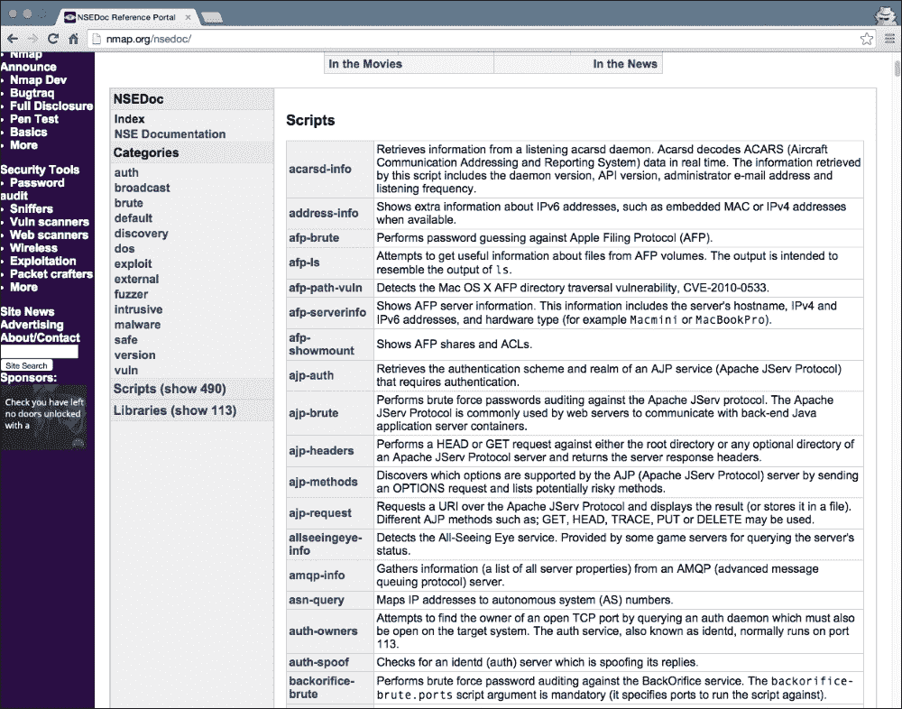
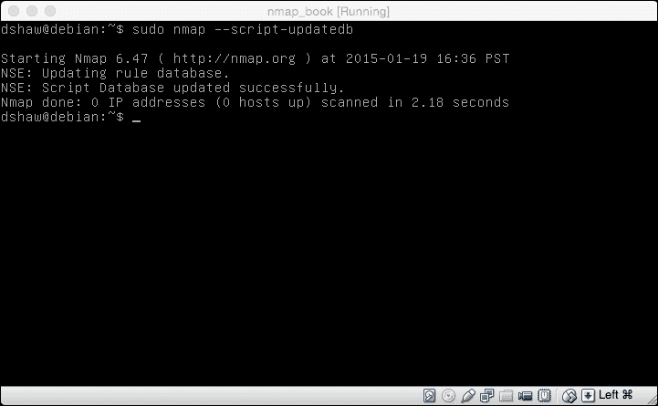
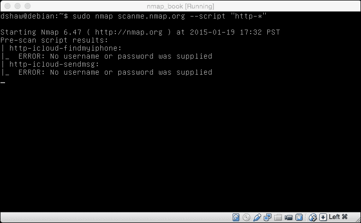

# 第六章：介绍 Nmap 脚本引擎

尽管进行端口扫描是使用 Nmap 工具套件的一个重要部分，但 Nmap 的开发者创建了一个非常强大的引擎，内置在工具中：**Nmap 脚本引擎**（**NSE**）。本章介绍了 NSE，并涵盖了使用可靠编写的脚本在 Nmap 脚本存储库中进行侦察扫描所需的所有主题，以包括远不止开放了哪些端口和哪些服务正在监听。

在这一章中，我们将涵盖：

+   NSE 的历史

+   NSE 的工作原理

+   如何找到现有的脚本来使用

+   如何使用 NSE 运行脚本

# NSE 的历史

到了 21 世纪中期，Nmap 已经确立自己作为端口扫描工具和安全工具的领导者，无论是开源还是非开源的。尽管不断创新和优化是一场持续不断的战斗，但 Nmap 只能被认为是一个非常成功的项目。

由于其受欢迎程度，以及它是一个具有相对高知名度的开源项目，Nmap 被选中多次参加 Google Summer of Code。Google Summer of Code 是一个软件开发实习/协会项目，期间学生们被选中并加入开源软件团队，为现有项目构建新功能。

2006 年 5 月，当时发布的 Nmap 版本只有 4.0 时，Nmap 被选为其第二个夏季代码。在 2005 年的前一年，学生们为 Nmap 项目编写了一种当代的 Netcat 实现（称为 Ncat），将 Nmap 的 OS 检测升级到了第二代（更好的一代），并创建了一个小型、简化的 GUI，后来成为 Zenmap。

在第二次运行中，经过第一个夏季的极其成功之后，参与开发的开发者们变得更加雄心勃勃。由于 Nmap 显然拥有出色的功能集，为什么不让这些功能可以被更广泛的社区扩展呢？新的漏洞和扫描技术正在被频繁地开发，而完整的 Nmap 版本无法跟上安全专业人员需要评估的事物。每当出现新的漏洞时，安全专业人员（以及恶意黑客！）会使用 Nmap 扫描易受攻击的服务，但只能通过手动分析来测试软件版本是否易受攻击：显然，这不是一个非常有效的时间利用。

由于 Google Summer of Code 开发者提供的新资源，创建了一个任意的脚本框架，允许用户基于特定的开放端口或服务触发额外的检查。这意味着，例如，如果你想在所有 Web 服务器上查找特定文件，比如`robots.txt`，你可以轻松地创建一个脚本，在所有 HTTP 和 HTTPS 服务上进行检查。NSE（以及在 Nmap 的默认安装中包含 Nmap 脚本）真正改变了工具套件的多功能性。

经过数月的辛勤工作，NSE 于 2006 年 12 月发布，与 Nmap 4.21ALPHA1 版本一起打包发布。随着 NSE 打包的脚本在复杂性和可用性上不断增长，它们成为了将 Nmap 转变为一个功能齐全的安全工具套件的绝佳资源。

# NSE 的内部工作

NSE 是一个运行使用 Lua 编写的代码的框架，具有引擎可以解析的特定标志。Lua 是一种轻量级、快速、解释性的编程语言，最著名的用途是为《魔兽世界》等电脑游戏编写用户界面的脚本语言，它具有与其他当代解释性语言类似的语法。

如果你曾经见过用 Python 或 Ruby 编写的代码，Lua 对你来说就不会太陌生。

前面的截图显示了一个 Nmap 脚本，用于识别有关比特币的信息（由 Patrik Karlsson 编写）。如果你还不理解，不要担心，我们将在第七章《编写 Nmap 脚本》中进行讲解，但你可以看到用于生成相对复杂的 Nmap 脚本的代码看起来非常简单。这就是 NSE 的全部意义所在！安全工程师和系统管理员过去需要导出 Nmap 结果，查找他们正在寻找的信息，然后使用第三方工具来帮助他们；现在他们可以找到一个符合他们目的的脚本，或者自己编写一个简单的脚本。许多渗透测试人员可以利用 Nmap 脚本语言甚至将该工具武装化以进行安全漏洞利用，我们将在第十章《使用 Metasploit 进行渗透测试》中详细介绍。

# 查找 Nmap 脚本

许多 Nmap 脚本已经随 Nmap 一起打包在您的系统上。然而，确定您想要为每个特定的扫描或评估运行哪些脚本可能会很困难。幸运的是，NSE 文档门户是整个 Nmap 项目中最深入和文档最完备的方面之一。

### 注意

通过访问[`nmap.org/nsedoc/`](http://nmap.org/nsedoc/)，您可以查看所有包含在官方 Nmap 脚本存储库中的脚本。

前面的截图显示了**Nmap 脚本引擎文档**（**NSEDoc**）参考门户网页，以及撰写本书时的所有官方 Nmap 脚本。每个脚本旁边都有一个小段落，简要描述了它的设计目的。撰写本书时，官方文档中有 490 个和 113 个 Nmap 脚本，这是您可以使用 NSE 做的很多事情！

这些脚本分为几个类别，每个类别都有自己特定的用例。值得注意的是，有时这些脚本可以属于几个类别，具体取决于脚本的完整功能。这些类别及其定义如下：

+   **认证**：这些脚本尝试对服务进行身份验证，并可以验证找到的凭据

+   **广播**：这些脚本广播某些协议，以了解它们是否正在监听

+   **暴力**：这些脚本尝试对网络服务进行暴力或基于字典的攻击

+   **默认**：这是扫描启动时可能运行的脚本的默认类别

+   **发现**：这些脚本尝试从主机和网络服务中枚举敏感信息

+   **拒绝服务（DoS）**：这些脚本可能会对正在扫描的服务造成破坏

+   **利用**：这些脚本尝试执行利用给定漏洞的攻击

+   **外部**：这些脚本查询第三方数据库，如 DNS 黑名单，以收集有关目标的额外信息

+   **模糊器**：这些脚本向服务发送随机的“垃圾”信息，以尝试找到软件中的缺陷

+   **侵入式**：这些脚本是可能对服务本身造成损害或具有侵入性的脚本的总类别

+   **恶意软件**：这些脚本尝试查找已知恶意软件的实例

+   **安全**：这些脚本已经验证不会对服务器造成伤害

+   **版本**：这些脚本尝试以比普通服务版本检测更深入的方式识别特定版本以及信息泄露的特定服务

+   **漏洞**：这些脚本识别服务中已知的漏洞

重要的是要知道要运行哪些类别，因为其中几个类别（特别是 DoS、exploit 和 intrusive）可能对弱系统或生产系统造成危险。在安全评估中包含这些 Nmap 脚本可以极大地增加 Nmap 的效用。

# 运行 Nmap 脚本

运行 Nmap 脚本很容易——有些脚本，例如“默认”类别，甚至会作为正常扫描的一部分自行运行。有些脚本旨在简单地提供有关目标的附加信息，而其他脚本则会积极利用它（“exploit”类别）甚至使其脱机（“DoS”类别）。

运行 Nmap 脚本的第一步是验证脚本是否存储在本地。与 Nmap 工具本身不同，Nmap 脚本存储库经常更新，因此最好始终验证是否有最新版本。您可以通过运行带有 `--script-updatedb` 标志的 Nmap 来更新 NSE 脚本，该标志会更新脚本数据库。

更新脚本数据库后，可以使用 `--script` 标签选择脚本。您可以选择特定目的的特定脚本，也可以选择广泛的脚本类别。幸运的是，Nmap 开发人员允许一次选择多个脚本类别。例如，假设我们想运行所有默认脚本，但也想运行所有侵入性脚本；我们可以使用 `--script default` 或 `intrusive` 标志运行扫描：

您可以在上述截图中看到，在此处运行 `default` 脚本明显立即标记了几个发现。如果您使用 `-vv` 运行相同的扫描以启用双重详细模式，您还可以看到加载到给定目标的脚本数量（在本例中为 93）。在这种特定情况下，`http-title` 脚本在扫描结果中显示了 HTML 标题（`Go ahead and ScanMe!`）。

如果按类别或多个类别选择扫描太多，您还可以按其特定名称选择扫描，或使用通配符。例如，如果我想扫描 Web 服务器并加载默认扫描存储库中的所有 HTTP 模块，我将使用 `--script "http-*"` 标志进行扫描：

您可以看到，使用 `"http-*"` 通配符脚本名称启动扫描可以加载每个脚本，但会出现一些错误。某些脚本需要参数，因此如果加载了许多脚本，了解正在加载的脚本非常重要。可以准确在 HTTP 端口触发的脚本仍将启动，但需要额外信息的脚本将失败（并且不会返回任何有用信息）。要向 Nmap 脚本提供额外信息，可以使用 `--script-args` 标志提供参数。

最后，可以通过在括号中包含不同标签来组合不同选项以启动脚本。例如，如果要启动符合默认、安全或侵入性类别的脚本，但明确不想启动针对 Web 服务器的任何脚本，可以使用 `--script`（default、safe 或 intrusive）标志，而不是 `"http-*"`。始终记住，`or` 标志不是排他性或——意味着两个类别中的脚本仍将运行——但两个部分都必须有 `and`。 

尽管 Nmap 脚本存储库非常全面，但如果您认为某个特定脚本可能有用而未发布，还是值得在互联网上寻找其他地方。许多安全研究人员的博客会有特定目的的 NSE 脚本，在尝试编写自己的脚本之前，最好先在搜索引擎上查找！

# 总结

本章介绍了 NSE，它可以是 Nmap 工具套件中最有用、多功能和引人入胜的功能之一。我们现在应该能够启动扫描，不仅仅是端口和服务版本，Nmap 脚本实际上可以与正在监听的服务进行交互，并且在某些情况下甚至可以利用漏洞！

在本章中，我们涵盖了 NSE 的历史，NSE 的工作原理，如何找到现有的脚本并使用它们，以及如何使用 NSE 运行脚本。

在下一章中，我们将学习如何使用 Lua 编写基本的 Nmap 脚本。尽管已经存在许多脚本用于各种各样的任务，但自定义的内部使用可能需要编写我们自己的脚本。
