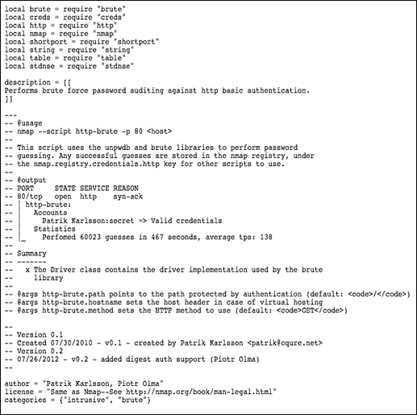
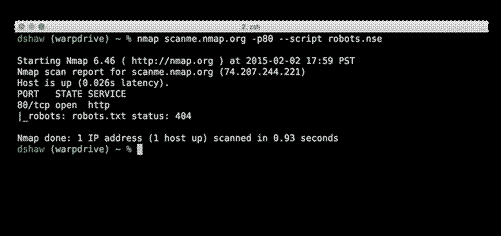
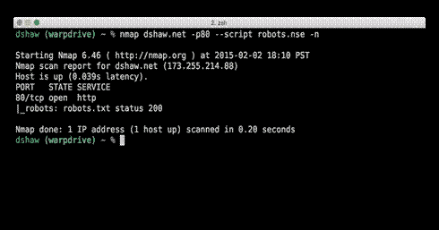

# 第七章：编写 Nmap 脚本

现在我们已经了解了 NSE 的工作原理，是时候学习如何编写我们的第一个 Nmap 脚本了。由于编写 Nmap 脚本的多功能和极其定制化的特性，有几种不同的方法可以编写执行各种功能的脚本，编写自己的脚本也有许多利弊。

虽然从头开始创建 Nmap 脚本可能并不总是最快的方式（因为几乎总会有一个已经存在的脚本来满足你可能需要的任何目的），但在某些情况下，利用 Nmap 脚本引擎的强大内置功能会导致创建自己的脚本正好具备正确的条件。

在本章中，我们将涵盖以下主题：

+   Nmap 脚本的解剖

+   编写 Nmap 脚本的头部

+   创建规则

+   定义脚本的动作

+   调试 Nmap 脚本

# Nmap 脚本的解剖

Nmap 脚本由几个独特的部分组成，每个部分定义了脚本执行的不同区域，或者 Nmap 解释预期输出的方式。我们必须始终在创建的任何脚本中包含几个主要区域，以确保脚本能够有效运行（并且 Nmap 能够理解如何解释数据）。

尽管 Nmap 脚本是用 Lua 编写的，这是一种解释性编程语言，但重要的是要记住这些脚本不是可以独立运行的可执行文件。与其将 Nmap 脚本作为要求运行的脚本，不如将 Nmap 脚本视为一种独特的 Nmap 编程语言的一套指令。

Nmap 脚本由三个独特的部分组成：

+   **头部**：Nmap 脚本的这一部分包括脚本的文档和分类，以便 Nmap 和 NSE 数据库可以成功地将脚本分类到适当的领域。

+   **规则**：脚本的这一部分准确地定义了 Nmap 脚本在何处以及如何执行。因为脚本在运行时利用了 Nmap 扫描的数据，某些元素可以触发脚本的运行。这实际上是一个触发器，用于评估脚本是否应该执行。

+   **动作**：最后，脚本的这一部分就是（你猜对了！）动作发生的地方。这是脚本的一部分，它在头部定义了脚本，规则触发了动作之后进行了大量的处理。

现在我们已经学会了 Nmap 脚本是如何组成的，是时候开始动手写一个了。因为每个 Nmap 脚本都是如此独特，我们将重新创建一个已经存在的脚本，但这个脚本展示了 NSE 的强大之处。

我们这个脚本的案例研究将是编写一个简单、易于遵循的 Nmap 脚本，利用 Nmap 的内置功能（结合 NSE 的强大功能）来确定 Web 服务器是否有`robots.txt`文件。`robots.txt`文件指示网站的哪些区域应该（和不应该）被网络爬虫和搜索引擎索引，并且通常列出了不应该被索引的敏感目录。因此，它们对于安全专业人员和渗透测试人员来说非常有趣，因为正是这些敏感文件和目录是我们正在寻找的！

# 定义 Nmap 脚本 - 脚本头部

每个 Nmap 脚本必须在脚本开头定义了某些必需的变量。脚本执行所需的任何 Nmap 先决条件、脚本分类的定义（例如是否具有侵入性、安全性、包含漏洞等），以及许可证也是头部中必需的内容。



前面的屏幕截图说明了 Nmap 脚本所需的各个部分，这些部分对程序的成功执行至关重要。让我们按顺序走过这些元素，以确定脚本的作者在做什么。

首先，定义了几个变量（由本地前缀定义）。为了确保每个 Nmap 元素都被适当地包含，做出了几项要求。

接下来，创建了一个更长的变量 - 描述。这是一个多行 Lua 变量，它被封装在`[[`和`]]`括号中。这个区域应该包括 Nmap 脚本的基本描述，以便在以编程方式运行时，可以选择正确的脚本。

在描述变量下面是一个完全注释的文本块，定义了脚本的用法。在 Lua 中，`--`前缀注释掉了该行代码，使其在执行脚本时不运行。您可以轻松地看到`@usage`块的格式 - 简单地显示脚本应该如何运行，以及它可能接受的任何参数 - 以及下面的`@output`块的格式。这些块显示了如何正确运行脚本，如何在命令行上传递参数（如果需要），以及你应该期望从所讨论的脚本中得到什么输出。

在注释块下面是 Nmap 解析的几个其他变量定义。具体来说，`author`块（这是您希望为脚本获得的署名方式），`license`块（通常列为与 Nmap 相同以进行分发，但如果您想保护脚本的某些元素，可以以特定方式指定），以及`categories`数组（列出脚本应该属于的类别）。您要确保，例如，如果您的脚本是侵入式的，您要将其标记为这样。

对于我们的脚本，我们只需要一些必需的`includes`，这使得我们的头部相对较短。让我们创建我们的头部部分，看起来像下面这样（当然，随时随地修改您的脚本！）:

```
  local http = require "http"
  local nmap = require "nmap"

  description = [[
  Checks to see if robots.txt exists on a web server.
  ]]

  author = "Nmap Essentials readers"
  license = "Same as Nmap--See http://nmap.org/book/man-legal.html"
  categories = {"default", "discovery", "safe"}
```

非常简单！我们需要 HTTP 模块，以便对问题中的`robots.txt`执行 HTTP GET 请求（在开放的端口 80 上），当然我们还需要 Nmap 包含以利用 Nmap 脚本引擎。您可以看到我们的描述非常简单明了，我们定义了作者、许可和类别，以帮助我们的用户确定脚本何时是安全和有效的运行。

现在我们的脚本头部已经完成，让我们转向规则。

# 触发函数 - 规则

Nmap 脚本的规则或 portrule 部分确定了何时应该执行操作（我们将在下一节中介绍）。明确定义这一点非常重要，这样我们就可以确信我们的脚本将在需要时每次都运行（基于端口号和版本）。有两种方法可以实现这种类型的规则：标准 portrule 文档和 NSE 中内置的名为**shortport**的辅助库。

定义规则实际上非常简单，取决于我们要寻找什么。在我们的`robots.txt`检测脚本（名为`robots.nse`）的情况下，我们只想在端口 80 上触发，以查看`robots.txt`是否存在。

如果我们要编写一个生产脚本，而不是一个概念验证，最好使用 shortport 的端口或服务功能来触发端口 80，或者 Nmap 通过其底层功能检测到的任何 Web 服务器。然而，在我们的情况下，我们可以简单地定义一些更容易理解的东西：

```
  portrule = function(host, port)
    return port.state == "open"
  end
```

正如你所看到的，这是一个非常简单的 portrule，当`port.state`为`open`时将返回`true`。这些都是内置的 Nmap 功能，在脚本运行时，每个端口都会根据 portrule 进行检查。

虽然我们的端口规则故意非常容易理解，但许多生产脚本都有非常复杂的端口规则，旨在根据特定版本和配置设置触发不同的分析元素。要了解更多关于高级端口规则和 shortport 库的信息，您可以阅读**Nmap 脚本引擎文档**（**NSEDoc**）门户的完整概述。

# 定义脚本的操作

在定义端口规则之后，唯一剩下的步骤就是定义当端口规则返回`true`时执行的操作。在我们的情况下，我们想要检查我们正在扫描的 Web 服务器上是否存在`robots.txt`。

为了确定服务器是否存在，我们需要了解一些关于**超文本传输协议**（**HTTP**）的知识。首先，请求页面的方式是通过 HTTP GET 请求。例如，如果我们想要访问[`google.com/images`](http://google.com/images)，我们的浏览器会向`Google.com`服务器发送包含`GET /images`的请求。

如果 GET 请求的状态是`OK`，Web 服务器将返回状态码`200`。如果有服务器端错误，将返回`500`错误。如果页面被移动，将返回`300`范围内的错误。最后（对于我们的目的），如果有授权错误或文件未找到错误，服务器将分别返回`403`或`404`。

为了定义我们的操作函数，我们需要执行以下步骤：

1.  请求`robots.txt`页面。

1.  找出它是否存在。

以下操作部分定义了这个请求：

```
  action = function(host, port)
  local robots = http.get(host, port, "/robots.txt")

  if robots.status == 200 then
    return "robots.txt status 200"
  else
    return "robots.txt status: " .. robots.status
  end
  end
```

如前面的代码片段所示，这是一个非常简单的操作部分。让我们一步一步地走过这个过程：

1.  首先，我们定义接受参数主机和端口的操作函数。一旦端口规则触发，这些参数会自动传递给操作块。

1.  接下来，我们定义一个本地变量（称为 robots），它是 NSE 的`http.get`请求的 HTTP 结果。在这种情况下，我们正在对我们当前扫描的主机和端口执行 GET，并向`/robots.txt`发出请求。

1.  一旦我们收到 HTTP 数据，我们可以很容易地使用`if`语句来确定状态是否为`200 OK`响应或其他状态。我们本可以将其与更短的`if`语句结合在一起（而不是 if/else），但是看到如何有多种可能性的输出是很有用的。

1.  如果输出不是`200`，我们转到`else`语句并查看状态是什么。例如，如果状态是`404`，我们知道它根本不存在；然而，如果我们得到`500`服务器错误或`403 未授权`，可能值得更深入地研究一下：

如您所见，运行此脚本（以及任何自定义的 Nmap 脚本）非常简单。当扫描`scanme.nmap.org`时，您可以清楚地看到没有`robots.txt` - 我们只收到了`404`错误。如果我们扫描一个确实有`robots.txt`页面的服务 - 我在[`dshaw.net/`](http://dshaw.net/)上创建了一个测试用例 - 我们会看到不同的结果。

在这种情况下，我们可以清楚地看到`200`状态 - HTTP OK - 意味着`robots.txt`确实存在：



如果这是一个生产 Nmap 脚本，可能值得将与`200 OK`响应相关联的返回更改为显示更多信息，例如不允许的文件和目录。但是，不要在这个特定的脚本上花费时间！官方 Nmap 存储库中已经有一个很棒的 HTTP `robots.txt`脚本（以及许多其他脚本）。

最后，还有一组非常有用的标志，可以很好地编写、理解和调试 Nmap 脚本，那就是`--script-trace`和`-d`（调试）标志。`--script-trace`标志显示有关脚本自己所做的所有不同请求的线上信息，这对于确定到底发生了什么非常有用：


在前面的截图中，你可以看到可能有一点信息过载，但是你可以通过使用`--script-trace`标志来准确地看到 Nmap 脚本在做什么。`-d`标志，用于调试，工作原理类似：如果你在编写脚本时遇到错误，尝试使用`-d`标志进行调试。你会惊讶地发现你可以学到很多东西！

# 总结

本章向我们展示了如何编写我们自己的 Nmap 脚本！NSE 是一个强大（有时复杂）的工具，可以帮助 Nmap 用户完成各种有趣和自动化的任务。我们编写的脚本作为概念验证可以轻松地检测服务器上是否存在`robots.txt`文件，但编写 Nmap 脚本的可能性——无论是用于内部使用还是检测特定漏洞——几乎是无限的！

在下一章中，我们将学习如何使用与 Nmap 工具套件捆绑在一起的工具，以及一些有用的技巧和窍门，以充分利用它们。
