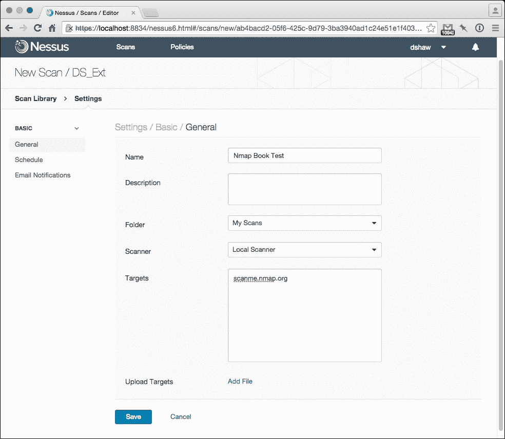
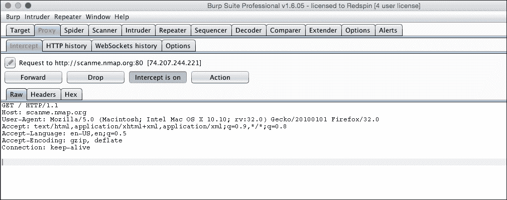

# 第九章：漏洞评估和工具

在学习了 Nmap 套件附带的所有附加工具之后，我们最好看一看一些第三方工具，这些工具可以帮助进行漏洞评估。漏洞评估不仅仅是简单的端口扫描，它是详细报告，详细说明了可能存在于给定目标范围上的所有漏洞。

本章中我们将学习的一些工具与 Nmap 非常配合，而其他一些工具则是在初始 Nmap 扫描之后使用的后续工具。

在本章中，我们将涵盖以下主题：

+   使用 Nessus 进行漏洞扫描

+   使用 Nikto 评估 Web 服务器问题

+   使用 DirBuster 识别敏感的 Web 目录

+   开始使用拦截代理

# 使用 Nessus 进行漏洞扫描

与端口扫描器一起使用的最常见的软件之一是漏洞扫描器。这个扫描器将端口扫描提升到一个更高的级别；它不仅识别开放的端口和服务，还将这些版本与（通常是专有的）漏洞数据库进行交叉引用，以显示给定服务是否容易受到攻击。

这些扫描器是漏洞评估中的关键元素，因为它们减轻了安全工程师的负担；扫描器（经常更新）可以做大部分工作，而不必手动识别弱点。

尽管 Nessus 最初（1998 年）是作为免费安全扫描器启动的，但由于 Tenable（Nessus 的创始人创建的公司）出售许可证，它现在已经对公众关闭。虽然许多安全公司为这些许可证付费，但你可以免费尝试 Nessus 项目的一个分支（OpenVAS）。

使用 Nessus 相当简单。虽然许多安全工具在命令行上运行（包括我们将在本章后面审查的一些工具），但 Nessus 使用基于 Web 的用户界面，非常直观易用。基本用法包括：

+   选择目标列表（Nmap 可以帮助完成这一步）

+   选择扫描类型

+   运行扫描

+   解释结果

以下屏幕截图显示了 Nessus 的“模板”页面：

正如我们在前面的屏幕截图中所看到的，登录 Nessus 并选择**新扫描**允许我们选择各种预定义的扫描类型，同时也允许我们选择**策略**以进行自定义扫描类型。为了进行这次扫描，我创建了一个特殊的扫描类型，它将扫描所有端口（就像 Nmap 一样！），然后交叉引用它检测到的任何漏洞。

为了启动扫描，我们必须选择要扫描的目标。就像在我们的 Nmap 测试扫描期间一样，我们将扫描`scanme.nmap.org`。请注意，在不愿意接受扫描的目标上进行漏洞扫描可能会让系统管理员非常沮丧，并且在世界上许多地方是非法的：

Nessus 图形用户界面非常简单易用；只需将主机添加到“目标”中，并给扫描命名。在大型渗透测试中，许多安全评估人员将专门从 Nmap 结果中解析出在线主机（或具有服务监听的主机），以便不浪费 Nessus 时间在要么是离线的主机上，要么是没有任何服务监听的主机上。以下屏幕截图显示了 Nessus 中的漏洞扫描：

扫描完成后，单击**漏洞**会显示在目标范围上检测到的漏洞的当前列表。如预期的那样，`scanme.nmap.org`几乎没有漏洞（Nmap 团队对安全性了解很多！），但仍然会出现一些“信息”发现，以便向评估人员提供尽可能多的信息。在这种情况下，似乎某些配置（例如 Apache Web 服务器信息）允许信息泄露。

Nessus 是一个强大的工具，但 NSE 很快就成为了一个强大的竞争对手，因为它能够脚本化 Nessus 内置的所有检查。然而，Nessus 的优势在于 Tenable 拥有一个全职的安全工程师团队，几乎不断地编写新的插件；而对于 Nmap 脚本，需要有人创建脚本，将其上传到网络，并将其分发给许多用户，然后才能在实践中使用。

自定义检查是 Nessus 可以支持的另一个功能。与 NSE 类似，Nessus 用户可以使用一个强大的脚本工具，称为**Nessus 攻击脚本语言**（**NASL**）。任何人都可以编写 NASL 脚本，并提供 Nessus 引擎的全部功能，而不一定要对给定主机运行完整的 Nessus 扫描。完整的 NASL 文档可以在 Tenable 网站上访问。

# 使用 Nikto 评估 Web 服务器问题

Nikto 是一个开源工具，允许安全评估人员评估 Web 服务器的配置。与 Nmap 或 Nessus 不同，Nikto 专门设计用于基于 Web 的配置评估。通常情况下，建议在渗透测试或漏洞评估的一部分中运行 Nikto（或类似的 Web 扫描程序）以评估 Web 服务。可以从其网页[`cirt.net/Nikto2`](https://cirt.net/Nikto2)访问 Nikto。

Nikto 的安装过程非常简单，类似于本书中使用过的其他工具：

1.  `wget https://github.com/sullo/nikto/archive/master.zip`

1.  `解压缩 master.zip`

1.  `cd nikto-master/program`

1.  `Nikto 现在可以使用了！`

像许多早期的安全工具一样，Nikto 是一个 Perl 脚本，这意味着只要系统上有 Perl，Nikto 就可以运行！为了演示 Nikto 的工作原理，我们将对我们最喜欢的主机`scanme.nmap.org`运行一个简单的扫描。要运行此扫描，我们使用`-h`（主机）标志调用 Nikto：`nikto -h scanme.nmap.org`。

您可以在上面的屏幕截图中看到，随着 Nikto 的运行，它识别出许多问题（包括我们在 Nmap 和 Nessus 中识别出的一些问题），以及一些不同的配置选项，例如缺少某些安全标头，存在某些 Web 目录等等。

在实际 Web 服务器漏洞的情况下，Nikto 可以是无价的，以检测可利用的攻击向量。随着时间的推移，NSE 正在从 Nikto 中获取越来越多的这些检查，并将它们直接集成到 Nmap 中，但在其核心，Nmap 仍然是一个端口扫描程序；检测漏洞只是一个奖励，而不是主要目的。

# 使用 DirBuster 识别敏感的 Web 目录

尽管 Nikto 可以识别潜在的敏感目录和 Web 服务器配置错误，但其主要目的不是查找隐藏文件。然而，DirBuster 完全是为了查找 Web 服务器上的隐藏文件和目录而存在的。使用 Java（因此必须安装 Java 运行环境），DirBuster 可以向 Web 服务器发送许多请求，以完全枚举可能对任何评估人员感兴趣的任何目录。从自我测试的角度来看，运行 DirBuster 可以非常有用，以验证自己的 Web 服务器上没有留下敏感文件！

技术上，OWASP 组织认为作为独立产品的 DirBuster 已经终止生命周期。代码库已经移植到 OWASP Zed Attack Proxy (ZAP)项目中，但 DirBuster 仍然可以在独立模式下运行，这在信息安全咨询行业非常常见。您可以在以下网址下载 DirBuster：[`sourceforge.net/projects/dirbuster/`](http://sourceforge.net/projects/dirbuster/)。

在正常使用情况下，DirBuster 是基于图形用户界面（GUI）的软件，但在安全行业中最常见的用法是使用-H 标志，这将在无头模式下运行 DirBuster。这种模式意味着软件在命令行上运行，可以更容易地编写脚本来运行软件，并且可以从通常只通过 SSH 访问的"分级"服务器上运行 DirBuster。幸运的是，通过学习 Nmap 时，我们已经对命令行非常熟悉，所以这不应该是问题！

运行 DirBuster 对新手来说可能有点令人生畏，但实际上非常简单：运行`java -jar [Dirbuster file].jar -H -u http://scanme.nmap.org`将对`scanme.nmap.org`运行软件。我们使用`java -jar`来调用它，因为我们正在运行一个 JAR 文件（一个打包的 Java 程序），`-H`表示无头模式（如上所述），`-u`表示我们要扫描的基本站点的 URL。尽管我们可以在有权限的情况下扫描站点，但 DirBuster 通常需要一段时间才能运行，因为它必须检查许多潜在的目录以提供全面的列表。一旦 DirBuster 完成运行或者使用"control-C"停止机制停止，报告将被写入 DirBuster 运行的目录中的文本文件。这种自动生成的日志非常有用，因为 DirBuster 通常可以找到大量敏感目录。

有趣的是，您可以指定 DirBuster 用于检查目录的列表，并且确保该列表始终是最新的是个好主意。最好在互联网上查找更新的列表，特别是因为 DirBuster 本身在技术上不再得到积极维护。

# 开始使用拦截代理

现在我们已经学会了如何使用 Nessus 进行完整的漏洞扫描，使用 Nikto 找到 Web 服务器的配置错误，并使用 DirBuster 识别敏感文件和目录。然而，这些工具都没有向我们展示 Web 应用程序实际上如何与潜在的客户浏览器进行通信。为了看到这种通信水平，我们需要使用所谓的拦截代理。

您可能以前听说过代理——可以将您的网络流量反弹，以便具有不同的源 IP 地址或避开某些类型的防火墙，但拦截代理是完全不同的。虽然您仍然可以将您的流量反弹到其他地方，但在拦截代理的情况下，您是将代理到自己，然后使用一段软件来潜在地修改该请求。

安全行业中最常见的拦截代理之一是 Burp Suite，它有一个"社区"版（免费）和一个"专业"版（付费）。Burp Suite 的一个流行替代品是 OWASP ZAP，但为了演示拦截代理，Burp Suite 完全可以胜任。您可以在以下网址下载 Burp Suite 的免费版：

[`portswigger.net/burp/download.html`](http://portswigger.net/burp/download.html)

设置拦截代理的第一步是配置 Web 浏览器指向代理。每个代理都不同，但 Burp Suite 默认使用端口 8080。这通常在 Web 浏览器的设置中，通常在"网络"选项卡下。一旦设置了代理，简单地浏览到任何页面将允许拦截请求。

例如，我们已经设置了 Burp Suite 来拦截请求，并尝试使用 Firefox 浏览到`scanme.nmap.org`：

因为我们已经配置了代理到 Burp Suite，我们可以立即看到我们的请求（"GET /"）被 Burp Suite 拦截。这本身就很有用，因为它允许我们准确地看到我们的 Web 浏览器对请求的处理，但拦截代理还有更多的功能。除了看到请求，我们实际上还可以在传输过程中修改它们！以下屏幕截图显示了 Burp Suite 拦截请求：

在前面的屏幕截图中，您可以看到我们将请求从`GET /`改为`GET /TEST`，这样在服务器收到请求之前就改变了请求。尽管这个改变只是一个简单的`GET`参数改变，但在评估 Web 应用程序时，这个功能非常有用。例如，有时候可以通过改变变量来发送其他用户数据的`POST`请求，而仅仅通过 Web 浏览器浏览到不同的 URL 不会产生预期的效果。在评估 Web 应用程序方面，拦截代理是尖端工具的前沿。以下屏幕截图显示了 Web 浏览器解释请求的结果：

您可以看到，一旦我们在 Burp Suite 中点击了**Forward**按钮，允许修改后的请求继续发送到服务器，我们的浏览器就会收到一个`/TEST`在服务器上找不到的响应。这个 404 错误是因为请求在传输过程中被改变了，新文件并不存在。

Burp Suite 是一个功能强大的工具，具有许多功能，值得一本专门的书来介绍，这本书也是可用的。如果你对 Web 应用程序安全感兴趣，我强烈建议使用并了解更多关于 Burp Suite 的知识。

# 总结

这一章让我们从了解如何运行端口扫描，到学习其他安全工具如何适应安全专业人员的日常生活。我们已经学会了如何使用 Nessus 进行漏洞扫描和评估，使用 Nikto 评估 Web 服务器配置，使用 DirBuster 查找隐藏的文件和目录，并使用 Burp Suite 拦截和修改 Web 应用程序的请求。

虽然关于安全世界还有很多要学习的，但我们现在已经达到了进行漏洞评估的阶段！

在下一章中，我们将学习使用 Metasploit 进行渗透测试的基础知识，以及如何结合使用 Nmap 和 Metasploit 来生成一个出色的攻击平台。
