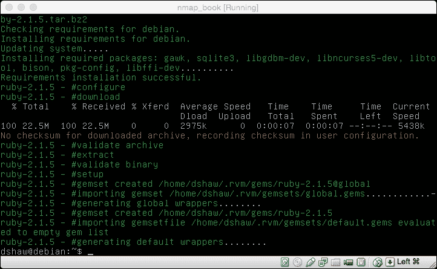
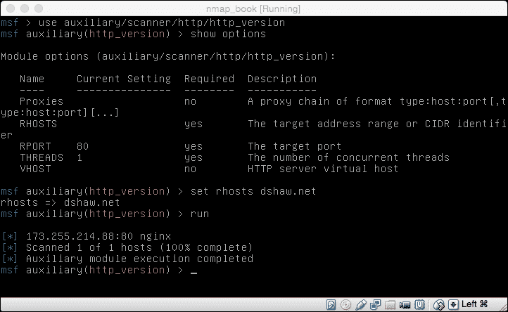

# 第十章：渗透测试与 Metasploit

漏洞评估只是完整安全扫描的一部分。在识别漏洞或发现配置错误后，安全评估员应努力实际利用这些漏洞。将评估提升到利用阶段的原因很多，但最重要的部分是消除虚假阳性结果并展示潜在严重结果的全部重要性。

很少有什么比从一个被认为是安全的系统中窃取敏感数据更能引起 IT 主管或 CIO 的注意！

Metasploit 是一个非常有效的攻击平台，许多模块被快速添加到系统中。利用 Metasploit 的强大功能与诸如 Nmap 的扫描工具和 Nessus 等漏洞扫描器可以完成一个准备充分的安全工具套件的三重奏。

在本章中，我们将涵盖以下主题：

+   安装 Metasploit

+   使用 Metasploit 进行扫描

+   使用 Metasploit 攻击服务

+   接下来学什么

# 安装 Metasploit

在我们开始使用 Metasploit 之前，我们需要将其安装到我们的系统中。与 Nmap 不同，安装 Metasploit 可能会有点棘手，但只要小心工作就可以克服！

第一步是确保安装了 Metasploit 所需的所有依赖项。这样做相对简单，我们只需要运行`sudo apt-get install build-essential libreadline-dev libssl-dev libpq5 libpq-dev libreadline5 libsqlite3-dev libpcap-dev openjdk-7-jre git-core autoconf postgresql pgadmin3 curl zlib1g-dev libxml2-dev libxslt1-dev vncviewer libyaml-dev curl zlib1g-dev`：


如前面的屏幕截图所示，大多数 Linux 机器都需要安装此列表中默认未包含的几个软件包。如果您不知道这些单独的软件包是做什么的，不要担心-我们只需要安装它们以便 Metasploit 能够正确运行。

除了安装各种软件包之外，我们还需要确保安装了最新版本的 Ruby。使用一个名为“RVM”的工具可以使这相对简单；RVM 的完整文档可在[`rvm.io`](http://rvm.io)上找到。在撰写本文时，我们正在安装 Ruby 2.1.5 来运行 Metasploit：



一旦安装了 Ruby，唯一的其他要求就是 Nmap（我们已经安装了），配置 Postgres 和安装 Metasploit 本身。

配置 Postgres 非常简单：作为`root`，只需运行`su postgres`来假定该用户角色，并运行以下两个命令：

```
  createuser msf -P -S -R -D
  createdb -O msf msf
```

一旦配置了 Postgres 数据库，我们就可以开始使用 Metasploit 本身。第一步是克隆 Git 存储库以在本地获取代码，可以通过运行`git clone https://github.com/rapid7/metasploit-framework.git`来实现。

文件创建完成后（在一个名为“metasploit-framework”的目录中），我们可以`cd`进入该目录并运行`bundle install`，以确保 Ruby gem 依赖项是最新的。如果 gem 已过时，`bundle update`将验证最新指定的版本是否正在运行：


在这个阶段，Metasploit 已经安装好了！我们不需要编译任何东西，因为 Metasploit 是用 Ruby 编写的（这是一种解释性语言，而不是编译型语言）。要启动 Metasploit，只需在 metasploit-framework 目录中运行`./msfconsole`，就这么简单！

# 使用 Metasploit 进行扫描

虽然 Nmap 的主要优势在于执行快速、可扩展的端口扫描，Nessus 的长处在于进行深入的漏洞扫描和错误配置检测，但 Metasploit 在实际利用漏洞方面表现出色。在安全评估中，Metasploit 通常作为最后一步被引入：一旦从其他工具中枚举出漏洞，Metasploit 就可以实际利用它们。敏感数据、受损的机器等都可以很容易地使用 Metasploit 和框架附带的各种工具被窃取。

Metasploit 可以轻松地有一整本书来专门讲述它的用法——实际上，它确实有——但是我们将介绍基本的扫描和利用技术，以便您可以将其应用到您的日常流程中，而不会有太多麻烦。

启动特定漏洞扫描（或信息收集技术）的最简单方法就是使用它。在 Metasploit 中指定`use`命令的方式就是简单地运行`use primary/secondary/module`。以下截图显示了我们在 Metasploit 中设置 HTTP 版本扫描的过程：


正如您在前面的截图中可以轻松看到的，我们决定使用`auxiliary/scanner/http/http_version`模块来检查 HTTP 版本。一旦我们选择了模块，我们通过运行“show options”来检查可用的选项。在这种情况下，我们需要指定`rhosts`应该是我们的目标 Web 服务器。因为这是复数形式（hosts，而不是'host'），您可以看出我们可以从这个指令理论上扫描一个 Internet 范围。此窗口的**描述**选项卡中还写有简要描述。以下截图显示了 Metasploit 扫描的选项：



前面的截图说明了运行模块很简单——只需调用`run`命令——我们就得到了我们要找的结果！在这种情况下，我们得到了我的 Web 服务器的版本为`nginx`。

值得注意的是，有许多辅助模块，特别是用于各种不同漏洞和利用的“扫描器”模块。您并不总是需要实际攻击一个服务来找出它是否有漏洞！

# 使用 Metasploit 攻击服务

正如我们在本章前面学到的，Metasploit 的成名之作是作为一个攻击平台。每天都有 Metasploit 模块被编写并提交到 Metasploit 项目中；每个模块都可以执行扫描，或者更常见的是实际攻击特定漏洞。

当 Metasploit 首次推出时，其作为攻击平台的能力是革命性的：安全专业人员不再需要寻找概念证明，或者在漏洞公布后编写自己的概念证明，而是立即能够使用一个可靠的平台和经过验证的模块来发动攻击。Metasploit 是用 Ruby 编写的，因此几乎可以在任何平台上使用——并且由于所有模块都在框架上运行，所以没有理由希望概念证明能够在用户当前使用的任何类型的机器上运行。

成功发动攻击的第一步是使用 Metasploit 的“搜索”功能查找特定模块。您可以使用搜索功能的许多方式，但是对于我们的目的，我们只是要寻找相对简单的东西：MS08-067，这是 Windows 中一个众所周知的漏洞，如果我们正确使用它，可以给我们带来相当多的访问权限！


我们可以通过调用 `use` 来选择模块，然后通过列出 `show options` 来设置我们需要的选项。值得注意的是，在前面的屏幕截图中，每个 Metasploit 模块都可以有一个等级——在我们的情况下，匹配的模块返回了“great”。太棒了！最后，您可能会注意到，Metasploit 的初始响应是我们没有连接数据库，所以我们正在使用 `slow search`。虽然连接我们之前创建的 Postgres 数据库到 Metasploit 可能是有道理的，但如果我们只是想快速运行一个 exploit，这并不总是最快的方法。

在使用 `rhost` 设置我们的目标后，我们可以通过输入 `exploit` 来运行 exploit。请注意，这与简单运行扫描是不同的——Metasploit 希望确保您充分意识到自己正在启动一个 exploit。

当 exploit 成功运行时，您将打开一个 `meterpreter` 会话。您可以通过运行 `sessions` 命令来查看已打开的会话。

Meterpreter 是一个强大的工具，它存在于被 compromise 的机器的内存中。通过 Meterpreter，可以运行各种命令，包括来自 Metasploit 本身的攻击，以将数据转移到另一个系统，或者进一步进入被 compromise 的网络。一系列的 Meterpreter shells 可以轻松地 compromise 整个网络，并将所有敏感数据转移到攻击源——在这种情况下，就是我们！

# 下一步要学什么

就像安全程序本身一样，了解信息安全始终是一个过程，而不是一个完成的状态。虽然我们已经学会了网络的基础知识；如何成为 Nmap 的高级用户（以及 Nmap 套件中的其他工具）；如何进行漏洞扫描；以及现在如何进行渗透测试——但还有数百万其他主题可供学习。

虽然没有一套固定的课程来成为安全专业人员或在这一领域继续教育，但关于这个主题的书籍还有很多，而且有许多不同的主题可以涵盖。如果您对 Web 应用程序评估感兴趣，我强烈建议您阅读《Web 应用程序黑客手册》。还有无数关于 Metasploit、Burp Suite Professional、利用开发、逆向工程、恶意软件分析等主题的书籍可以探索。

永远不要停止学习！

# 总结

在本章中，我们学会了如何安装 Metasploit，使用 Metasploit 进行特定漏洞或信息泄漏的扫描，并实际利用这些漏洞以进行成功的攻击。然后，我们了解了 Meterpreter，包括如何查看会话以及进一步进入目标网络的能力。

Metasploit 是一个用于利用基于网络的漏洞的强大框架，它应该成为任何安全评估的重点。

感谢您抽出时间阅读本书。虽然我们已经尽最大努力尽可能保持本书中的信息最新，但安全世界——特别是安全工具的世界——总是在变化。如果有必要，欢迎随时与我联系以获取更新的信息。祝您愉快的黑客攻击！
