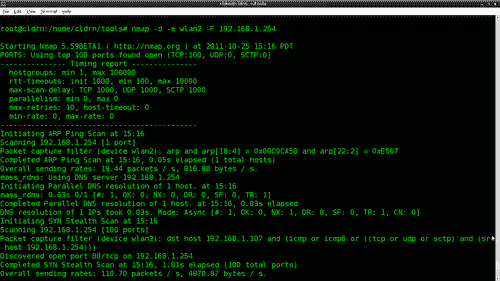
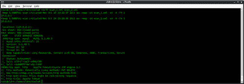
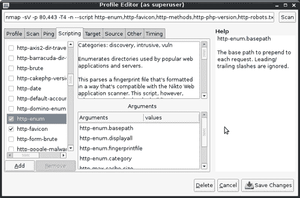

# 第一章：Nmap 基础知识

### 注意

本章向您展示了如何执行在许多情况下可能是非法、不道德、违反服务条款或只是不明智的一些操作。这里提供这些信息是为了让您了解如何保护自己免受威胁，并使自己的系统更加安全。在遵循这些说明之前，请确保您站在法律和道德的一边……运用您的力量为善！

在本章中，我们将涵盖：

+   从官方源代码仓库下载 Nmap

+   从源代码编译 Nmap

+   列出远程主机上的开放端口

+   对远程主机的指纹服务

+   在您的网络中查找活动主机

+   使用特定端口范围进行扫描

+   运行 NSE 脚本

+   使用指定的网络接口进行扫描

+   使用 Ndiff 比较扫描结果

+   使用 Zenmap 管理多个扫描配置文件

+   使用 Nping 检测 NAT

+   使用 Nmap 和 Ndiff 远程监控服务器

# 介绍

**Nmap**（网络映射器）是一款专门用于网络探索和安全审计的开源工具，最初由 Gordon "Fyodor" Lyon 发布。官方网站（[`nmap.org`](http://nmap.org)）对其进行了如下描述：

> Nmap（网络映射器）是一个用于网络发现和安全审计的免费开源（许可证）实用程序。许多系统和网络管理员也发现它在网络清单、管理服务升级计划和监控主机或服务的正常运行时间等任务中非常有用。Nmap 以新颖的方式使用原始 IP 数据包来确定网络上有哪些主机可用，这些主机提供了哪些服务（应用程序名称和版本），它们正在运行哪种操作系统（和操作系统版本），正在使用哪种类型的数据包过滤器/防火墙，以及其他几十种特征。它旨在快速扫描大型网络，但也可以对单个主机进行扫描。Nmap 可在所有主要计算机操作系统上运行，并提供 Linux、Windows 和 Mac OS X 的官方二进制软件包。

市面上有许多其他端口扫描工具，但没有一个能够提供 Nmap 的灵活性和高级选项。

**Nmap 脚本引擎（NSE）**通过允许用户编写使用 Nmap 收集的主机信息执行自定义任务的脚本，彻底改变了端口扫描仪的可能性。

此外，Nmap 项目还包括其他出色的工具：

+   **Zenmap**：Nmap 的图形界面

+   **Ndiff**：用于比较扫描结果的工具

+   **Nping**：用于生成数据包和流量分析的优秀工具

+   **Ncrack**：用于暴力破解网络登录的与 Nmap 兼容的工具

+   **Ncat**：用于在网络上读写数据的调试工具

不用说，每个安全专业人员和网络管理员都必须掌握这个工具，以便进行安全评估、高效地监控和管理网络。

Nmap 的社区非常活跃，每周都会添加新功能。我鼓励您始终在您的工具库中保持最新版本，如果您还没有这样做；更好的是，订阅开发邮件列表，网址为[`cgi.insecure.org/mailman/listinfo/nmap-dev`](http://cgi.insecure.org/mailman/listinfo/nmap-dev)。

本章描述了如何使用 Nmap 执行一些最常见的任务，包括端口扫描和目标枚举。它还包括一些示例，说明了 Zenmap 的配置文件有多方便，如何使用 Nping 进行 NAT 检测，以及 Ndiff 的不同应用，包括如何借助 bash 脚本和 cron 设置远程监控系统。我尽可能添加了许多参考链接，建议您访问它们以了解更多有关 Nmap 执行的高级扫描技术内部工作的信息。

我还创建了网站[`nmap-cookbook.com`](http://nmap-cookbook.com)来发布新的相关材料和额外的示例，所以请确保您不时地过来逛逛。

# 从官方源代码存储库下载 Nmap

本节描述了如何从官方子版本存储库下载 Nmap 的源代码。通过这样做，用户可以编译 Nmap 的最新版本，并跟上提交到子版本存储库的每日更新。

## 准备

在继续之前，您需要有一个工作的互联网连接和访问子版本客户端。基于 Unix 的平台配备了一个名为**subversion**（**svn**）的命令行客户端。要检查它是否已安装在您的系统中，只需打开终端并键入：

```
$ svn

```

如果它告诉您找不到该命令，请使用您喜欢的软件包管理器安装`svn`或从源代码构建它。从源代码构建 svn 的说明超出了本书的范围，但在网上有广泛的文档记录。使用您喜欢的搜索引擎找到您系统的具体说明。

如果您更喜欢使用图形用户界面，RapidSVN 是一个非常受欢迎的跨平台替代品。您可以从[`rapidsvn.tigris.org/`](http://rapidsvn.tigris.org/)下载并安装 RapidSVN。

## 如何做...

打开您的终端并输入以下命令：

```
$ svn co --username guest https://svn.nmap.org/nmap/

```

### 提示

**下载示例代码**

您可以从[`www.packtpub.com`](http://www.packtpub.com)的帐户中下载您购买的所有 Packt 图书的示例代码文件。如果您在其他地方购买了本书，您可以访问[`www.packtpub.com/support`](http://www.packtpub.com/support)并注册以直接通过电子邮件接收文件。

等到 svn 下载存储库中的所有文件。当它完成时，您应该看到添加的文件列表，如下面的屏幕截图所示：


当程序返回/退出时，您将在当前目录中拥有 Nmap 的源代码。

## 它是如何工作的...

```
$ svn checkout https://svn.nmap.org/nmap/ 

```

此命令将下载位于[`svn.nmap.org/nmap/`](https://svn.nmap.org/nmap/)的远程存储库的副本。该存储库具有对最新稳定构建的全球读取访问权限，允许 svn 下载您的本地工作副本。

## 还有更多...

如果您使用 RapidSVN，则按照以下步骤操作：

1.  右键单击**书签**。

1.  单击**检出新的工作副本**。

1.  在 URL 字段中键入`https://svn.nmap.org/nmap/`。

1.  选择您的本地工作目录。

1.  单击**确定**开始下载您的新工作副本。

### 尝试开发分支

如果您想尝试开发团队的最新创作，那么有一个名为`nmap-exp`的文件夹，其中包含项目的不同实验分支。存储在那里的代码不能保证始终有效，因为开发人员将其用作沙盒，直到准备合并到稳定分支为止。该文件夹的完整子版本 URL 是[`svn.nmap.org/nmap-exp/`](https://svn.nmap.org/nmap-exp/)。

### 保持您的源代码最新

要更新先前下载的 Nmap 副本，请在工作目录中使用以下命令：

```
$ svn update

```

您应该看到已更新的文件列表，以及一些修订信息。

## 另请参阅

+   *从源代码编译 Nmap*配方

+   *列出远程主机上的开放端口*配方

+   *对远程主机的服务进行指纹识别*配方

+   *运行 NSE 脚本*配方

+   *使用 Ndiff 比较扫描结果*配方

+   *使用 Zenmap 管理多个扫描配置文件*配方

+   第八章中的*使用 Zenmap 生成网络拓扑图*配方，生成*扫描报告*

+   第八章中的*以正常格式保存扫描结果*配方，生成*扫描报告*

# 从源代码编译 Nmap

预编译的软件包总是需要时间来准备和测试，导致发布之间的延迟。如果您想要保持与最新添加的内容同步，强烈建议编译 Nmap 的源代码。

该食谱描述了如何在 Unix 环境中编译 Nmap 的源代码。

## 准备工作

确保您的系统中安装了以下软件包：

+   `gcc`

+   `openssl`

+   `make`

使用您喜欢的软件包管理器安装缺少的软件，或者从源代码构建。从源代码构建这些软件包的说明超出了本书的范围，但可以在线获得。

## 操作步骤...

1.  打开您的终端并进入 Nmap 源代码存储的目录。

1.  根据您的系统进行配置：

```
$ ./configure

```

如果成功，将显示一个 ASCII 龙警告您 Nmap 的强大（如下图所示），否则将显示指定错误的行。


1.  使用以下命令构建 Nmap：

```
$ make 

```

如果您没有看到任何错误，那么您已成功构建了最新版本的 Nmap。您可以通过查找当前目录中编译的二进制文件`Nmap`来验证这一点。

如果要使 Nmap 对系统中的所有用户可用，请输入以下命令：

```
# make install 

```

## 工作原理...

我们使用脚本`configure`来设置不同的参数和影响您的系统和所需配置的环境变量。然后，GNU 的`make`通过编译源代码生成了二进制文件。

## 还有更多...

如果您只需要 Nmap 二进制文件，可以使用以下配置指令来避免安装 Ndiff、Nping 和 Zenmap：

+   通过使用`--without-ndiff`跳过 Ndiff 的安装

+   通过使用`--without-zenmap`跳过 Zenmap 的安装

+   通过使用`--without-nping`跳过 Nping 的安装

### OpenSSL 开发库

在构建 Nmap 时，OpenSSL 是可选的。启用它允许 Nmap 访问与多精度整数、哈希和编码/解码相关的此库的功能，用于服务检测和 Nmap NSE 脚本。

在 Debian 系统中，OpenSSL 开发包的名称是`libssl-dev`。

### 配置指令

在构建 Nmap 时可以使用几个配置指令。要获取完整的指令列表，请使用以下命令：

```
$ ./configure --help

```

### 预编译软件包

在线上有几个预编译的软件包（[`nmap.org/download.html`](http://nmap.org/download.html)）可供使用，适用于那些无法访问编译器的人，但不幸的是，除非是最近的版本，否则很可能会缺少功能。Nmap 在不断发展。如果您真的想利用 Nmap 的功能，就要保持本地副本与官方仓库同步。

### 另请参阅

+   *从官方源代码仓库下载 Nmap*食谱

+   *列出远程主机上的开放端口*食谱

+   *对远程主机的服务进行指纹识别*食谱

+   *使用 Ndiff 比较扫描结果*食谱

+   *使用 Zenmap 管理多个扫描配置文件*食谱

+   *运行 NSE 脚本*食谱

+   *使用指定的网络接口进行扫描*食谱

+   在第八章中的*保存正常格式的扫描结果*食谱，生成*扫描报告*

+   在第八章中的*使用 Zenmap 生成网络拓扑图*食谱，生成*扫描报告*

# 列出远程主机上的开放端口

该食谱描述了使用 Nmap 确定远程主机上端口状态的最简单方法，这是用于识别常用服务的运行过程，通常称为**端口扫描**。

## 操作步骤...

1.  打开终端。

1.  输入以下命令：

```
$ nmap scanme.nmap.org

```

扫描结果应该显示在屏幕上，显示有趣的端口及其状态。标记为打开的端口特别重要，因为它们代表目标主机上运行的服务。


## 工作原理...

通过启动 TCP 端口扫描，以下命令检查主机`scanme.nmap.org`上最受欢迎的端口的状态：

```
$ nmap scanme.nmap.org

```

结果包含主机信息，如 IPv4 地址和 PTR 记录，以及端口信息，如服务名称和端口状态。

## 还有更多...

即使对于这种最简单的端口扫描，Nmap 在后台也做了很多事情，这些也可以进行配置。

Nmap 首先通过 DNS 将主机名转换为 IPv4 地址。如果您希望使用不同的 DNS 服务器，请使用`--dns-servers <serv1[,serv2],...>`，或者如果您希望跳过此步骤，请使用`-n`如下：

```
$ nmap --dns-servers 8.8.8.8,8.8.4.4 scanme.nmap.org

```

然后，它会 ping 目标地址，以检查主机是否存活。要跳过此步骤，请使用`–PN`如下：

```
$ nmap -PN scanme.nmap.org

```

然后，Nmap 通过反向 DNS 调用将 IPv4 地址转换回主机名。如下使用`-n`跳过此步骤：

```
$ nmap -n scanme.nmap.org

```

最后，它启动了 TCP 端口扫描。要指定不同的端口范围，请使用`-p[1-65535]`，或使用`-p-`表示所有可能的 TCP 端口，如下所示：

```
$ nmap -p1-30 scanme.nmap.org

```

### 特权与非特权

以特权用户身份运行`nmap <TARGET>`将启动**SYN Stealth 扫描**。对于无法创建原始数据包的非特权帐户，将使用**TCP Connect 扫描**。

这两者之间的区别在于 TCP Connect 扫描使用高级系统调用**connect**来获取有关端口状态的信息。这意味着每个 TCP 连接都完全完成，因此速度较慢，更容易被检测并记录在系统日志中。SYN Stealth 扫描使用原始数据包发送特制的 TCP 数据包，更可靠地检测端口状态。

### 端口状态

Nmap 将端口分类为以下状态：

### 注意

发送的数据包类型取决于使用的扫描技术。

+   **开放**：这表示应用程序正在此端口上监听连接。

+   **关闭**：这表示探测已收到，但在此端口上没有应用程序监听。

+   **过滤**：这表示探测未收到，无法确定状态。还表示探测正在被某种过滤器丢弃。

+   **未过滤**：这表示探测已收到，但无法确定状态。

+   **开放/过滤**：这表示端口被过滤或打开，但 Nmap 无法确定状态。

+   **关闭/过滤**：这表示端口被过滤或关闭，但 Nmap 无法确定状态。

### Nmap 支持的端口扫描技术

我们展示了执行端口扫描的最简单方法，但 Nmap 提供了大量先进的扫描技术。使用`nmap -h`或访问[`nmap.org/book/man-port-scanning-techniques.html`](http://nmap.org/book/man-port-scanning-techniques.html)了解更多信息。

## 另请参阅

+   *指纹识别远程主机的服务*食谱

+   *在您的网络中查找活动主机*食谱

+   *使用特定端口范围进行扫描*食谱

+   *使用指定网络接口进行扫描*食谱

+   *使用 Zenmap 管理不同的扫描配置文件*食谱

+   *使用 Nmap 和 Ndiff 远程监视服务器*食谱

+   *从扫描中排除主机*食谱在第二章中，*网络探索*

+   *扫描 IPv6 地址*食谱在第二章中，*网络探索*

+   *指纹识别主机操作系统*食谱在第三章中，*收集额外的主机信息*

+   *发现 UDP 服务*食谱在第三章中，*收集额外的主机信息*

+   *列出远程主机支持的协议*食谱在第三章中，*收集额外的主机信息*

# 指纹识别远程主机的服务

**版本检测**是 Nmap 最受欢迎的功能之一。知道服务的确切版本对于使用该服务寻找安全漏洞的渗透测试人员以及希望监视网络是否有未经授权更改的系统管理员非常有价值。对服务进行指纹识别还可能揭示有关目标的其他信息，例如可用模块和特定协议信息。

本食谱描述了如何使用 Nmap 对远程主机的服务进行指纹识别。

## 如何做...

打开终端并输入以下命令：

```
$ nmap -sV scanme.nmap.org

```

此命令的结果是一个包含名为**版本**的额外列的表，显示特定的服务版本，如果被识别。其他信息将被括号括起来。请参考以下截图：


## 它是如何工作的...

标志`-sV`启用服务检测，返回额外的服务和版本信息。

**服务检测**是 Nmap 最受欢迎的功能之一，因为它在许多情况下非常有用，比如识别安全漏洞或确保服务在给定端口上运行。

这个功能基本上是通过从`nmap-service-probes`发送不同的探测到疑似开放端口的列表。探测是根据它们可能被用来识别服务的可能性选择的。

关于服务检测模式的工作原理和使用的文件格式有非常详细的文档，网址为[`nmap.org/book/vscan.html`](http://nmap.org/book/vscan.html)。

## 还有更多...

您可以通过更改扫描的强度级别来设置要使用的探测数量，使用参数`--version-intensity [0-9]`，如下所示：

```
# nmap -sV –-version-intensity 9 

```

### 侵略性检测

Nmap 有一个特殊的标志来激活侵略性检测，即`-A`。**侵略模式**启用了 OS 检测(`-O`)、版本检测(`-sV`)、脚本扫描(`-sC`)和跟踪路由(`--traceroute`)。不用说，这种模式发送了更多的探测，更容易被检测到，但提供了大量有价值的主机信息。您可以通过以下命令之一来查看：

```
# nmap -A <target>

```

或

```
# nmap -sC -sV -O <target>

```


### 提交服务指纹

Nmap 的准确性来自多年来通过用户提交收集的数据库。非常重要的是，我们帮助保持这个数据库的最新。如果 Nmap 没有正确识别服务，请将您的新服务指纹或更正提交到[`insecure.org/cgi-bin/submit.cgi?`](http://insecure.org/cgi-bin/submit.cgi?)。

## 另请参阅

+   *列出远程主机上的开放端口*食谱

+   *在您的网络中查找活动主机*食谱

+   *使用特定端口范围进行扫描*食谱

+   *使用指定网络接口进行扫描*食谱

+   *使用 Zenmap 管理多个扫描配置文件*食谱

+   *使用 Nmap 和 Ndiff 远程监视服务器*食谱

+   在第二章的*使用额外的随机数据隐藏我们的流量*食谱中，*网络探索*

+   在第二章的*扫描 IPv6 地址*食谱中，*网络探索*

+   在第三章的*从 WHOIS 记录中获取信息*食谱中，*收集额外的主机信息*

+   在第三章的*暴力破解 DNS 记录*食谱中，*收集额外的主机信息*

+   在第三章的*对主机的操作系统进行指纹识别*食谱中，*收集额外的主机信息*

# 在您的网络中查找活动主机

在网络中查找活动主机通常被渗透测试人员用来枚举活动目标，也被系统管理员用来计算或监视活动主机的数量。

此配方描述了如何执行 ping 扫描，以通过 Nmap 找到网络中的活动主机。

## 如何做...

打开您的终端并输入以下命令：

```
$ nmap -sP 192.168.1.1/24

```

结果显示了在线并响应 ping 扫描的主机。

```
Nmap scan report for 192.168.1.102 
Host is up. 
Nmap scan report for 192.168.1.254 
Host is up (0.0027s latency). 
MAC Address: 5C:4C:A9:F2:DC:7C (Huawei Device Co.) 
Nmap done: 256 IP addresses (2 hosts up) scanned in 10.18 seconds 

```

在这种情况下，我们在网络中找到了两个活动主机。Nmap 还找到了 MAC 地址，并识别了家用路由器的供应商。

## 它是如何工作的...

Nmap 使用`-sP`标志进行 ping 扫描。这种类型的扫描对于枚举网络中的主机非常有用。它使用 TCP ACK 数据包和 ICMP 回显请求（如果以特权用户身份执行），或者使用`connect()` `syscall`发送的 SYN 数据包（如果由不能发送原始数据包的用户运行）。

在`192.168.1.1/24`中使用 CIDR`/24`表示我们要扫描网络中的所有 256 个 IP。

## 还有更多...

在以特权用户身份扫描本地以太网网络时使用 ARP 请求，但您可以通过包括标志`--send-ip`来覆盖此行为。

```
# nmap -sP --send-ip 192.168.1.1/24

```

### Traceroute

使用`--traceroute`来包括您的机器和每个找到的主机之间的路径。

```
Nmap scan report for 192.168.1.101 
Host is up (0.062s latency). 
MAC Address: 00:23:76:CD:C5:BE (HTC) 

TRACEROUTE 
HOP RTT      ADDRESS 
1   61.70 ms 192.168.1.101 

Nmap scan report for 192.168.1.102 
Host is up. 

Nmap scan report for 192.168.1.254 
Host is up (0.0044s latency). 
MAC Address: 5C:4C:A9:F2:DC:7C (Huawei Device Co.) 

TRACEROUTE 
HOP RTT     ADDRESS 
1   4.40 ms 192.168.1.254 

Nmap done: 256 IP addresses (3 hosts up) scanned in 10.03 seconds 

```

### NSE 脚本

Ping 扫描不执行端口扫描或服务检测，但可以根据主机规则启用 Nmap 脚本引擎，例如`sniffer-detect`和`dns-brute`的情况。

```
# nmap -sP --script discovery 192.168.1.1/24 

Pre-scan script results: 
| broadcast-ping: 
|_  Use the newtargets script-arg to add the results as targets 
Nmap scan report for 192.168.1.102 
Host is up. 

Host script results: 
|_dns-brute: Can't guess domain of "192.168.1.102"; use dns-brute.domain script argument. 

Nmap scan report for 192.168.1.254 
Host is up (0.0023s latency). 
MAC Address: 5C:4C:A9:F2:DC:7C (Huawei Device Co.) 

Host script results: 
|_dns-brute: Can't guess domain of "192.168.1.254"; use dns-brute.domain script argument. 
|_sniffer-detect: Likely in promiscuous mode (tests: "11111111") 

Nmap done: 256 IP addresses (2 hosts up) scanned in 14.11 seconds 

```

## 另请参阅

+   *运行 NSE 脚本*配方

+   第二章中的*使用广播 ping 发现主机*配方，*网络探索*

+   第二章中的*使用 TCP SYN ping 扫描发现主机*配方，*网络探索*

+   第二章中的*使用 TCP ACK ping 扫描发现主机*配方，*网络探索*

+   第二章中的*使用 ICMP ping 扫描发现主机*配方，*网络探索*

+   第二章中的*使用广播脚本收集网络信息*配方，*网络探索*

+   第三章中的*发现指向相同 IP 的主机名*配方，*收集额外主机信息*

+   第三章中的*强制 DNS 记录*配方，*收集额外主机信息*

+   第三章中的*欺骗端口扫描的源 IP*配方，*收集额外主机信息*

# 使用特定端口范围进行扫描

有时系统管理员正在寻找使用特定端口进行通信的感染机器，或者用户只是寻找特定服务或开放端口，而不太关心其他内容。缩小使用的端口范围也可以优化性能，在扫描多个目标时非常重要。

此配方描述了在执行 Nmap 扫描时如何使用端口范围。

## 如何做...

打开您的终端并输入以下命令：

```
# nmap -p80 192.168.1.1/24 

```

将显示带有端口`80`状态的主机列表。

```
Nmap scan report for 192.168.1.102 
Host is up (0.000079s latency). 
PORT   STATE SERVICE 
80/tcp closed  http 

Nmap scan report for 192.168.1.103 
Host is up (0.016s latency). 
PORT   STATE SERVICE 
80/tcp open  http 
MAC Address: 00:16:6F:7E:E0:B6 (Intel) 

Nmap scan report for 192.168.1.254 
Host is up (0.0065s latency). 
PORT   STATE SERVICE 
80/tcp open  http 
MAC Address: 5C:4C:A9:F2:DC:7C (Huawei Device Co.) 

Nmap done: 256 IP addresses (3 hosts up) scanned in 8.93 seconds 

```

## 它是如何工作的...

Nmap 使用标志`-p`来设置要扫描的端口范围。此标志可以与任何扫描方法结合使用。在前面的示例中，我们使用参数`-p80`来告诉 Nmap 我们只对端口 80 感兴趣。

在`192.168.1.1/24`中使用 CIDR`/24`表示我们要扫描网络中的所有 256 个 IP。

## 还有更多...

对于参数`-p`，有几种被接受的格式：

+   端口列表：

```
# nmap -p80,443 localhost

```

+   端口范围：

```
# nmap -p1-100 localhost

```

+   所有端口：

```
# nmap -p- localhost

```

+   协议的特定端口：

```
# nmap -pT:25,U:53 <target>

```

+   服务名称：

```
# nmap -p smtp <target>

```

+   服务名称通配符：

```
# nmap -p smtp* <target>

```

+   仅在 Nmap 服务中注册的端口：

```
# nmap -p[1-65535] <target>

```

## 另请参阅

+   *在您的网络中查找活动主机*配方

+   *列出远程主机上的开放端口*配方

+   *使用指定的网络接口进行扫描*配方

+   *运行 NSE 脚本*配方

+   第二章中的*使用额外的随机数据隐藏我们的流量*配方，*网络探索*

+   第二章中的*强制 DNS 解析*配方，*网络探索*

+   第二章中的*从扫描中排除主机*配方，*网络探索*

+   第二章中的*扫描 IPv6 地址*配方，*网络探索*

+   第三章中的*列出远程主机支持的协议*配方，*收集额外的主机信息*

# 运行 NSE 脚本

NSE 脚本非常强大，已经成为 Nmap 的主要优势之一，可以执行从高级版本检测到漏洞利用的任务。

以下配方描述了如何运行 NSE 脚本以及此引擎的不同选项。

## 如何做到...

要在扫描结果中包含 Web 服务器索引文档的标题，请打开终端并输入以下命令：

```
$ nmap -sV --script http-title scanme.nmap.org 

```


## 它是如何工作的...

参数**--script**设置应该在扫描中运行的 NSE 脚本。在这种情况下，当服务扫描检测到 Web 服务器时，将为所选的 NSE 脚本初始化一个并行线程。

有超过 230 个可用的脚本，执行各种各样的任务。NSE 脚本**http-title**如果检测到 Web 服务器，则返回根文档的标题。

## 还有更多...

您可以一次运行多个脚本：

```
$ nmap --script http-headers,http-title scanme.nmap.org
Nmap scan report for scanme.nmap.org (74.207.244.221) 
Host is up (0.096s latency). 
Not shown: 995 closed ports 
PORT     STATE    SERVICE 
22/tcp   open     ssh 
25/tcp   filtered smtp 
80/tcp   open     http 
| http-headers: 
|   Date: Mon, 24 Oct 2011 07:12:09 GMT 
|   Server: Apache/2.2.14 (Ubuntu) 
|   Accept-Ranges: bytes 
|   Vary: Accept-Encoding 
|   Connection: close 
|   Content-Type: text/html 
| 
|_  (Request type: HEAD) 
|_http-title: Go ahead and ScanMe! 
646/tcp  filtered ldp 
9929/tcp open     nping-echo 

```

此外，NSE 脚本可以按类别、表达式或文件夹进行选择：

+   运行`vuln`类别中的所有脚本：

```
$ nmap -sV --script vuln <target>

```

+   运行`version`或`discovery`类别中的脚本：

```
$ nmap -sV --script="version,discovery" <target>

```

+   运行除`exploit`类别中的脚本之外的所有脚本：

```
$ nmap -sV --script "not exploit" <target>

```

+   运行除`http-brute`和`http-slowloris`之外的所有 HTTP 脚本：

```
$ nmap -sV --script "(http-*) and not(http-slowloris or http-brute)" <target>

```

要调试脚本，请使用`--script-trace`。这将启用执行脚本的堆栈跟踪，以帮助您调试会话。请记住，有时您可能需要增加调试级别，使用标志`-d[1-9]`来解决问题的根源：

```
$ nmap -sV –-script exploit -d3 --script-trace 192.168.1.1 

```

### NSE 脚本参数

标志`--script-args`用于设置 NSE 脚本的参数。例如，如果您想设置 HTTP 库参数`useragent`，您将使用：

```
$ nmap -sV --script http-title --script-args http.useragent="Mozilla 999" <target>

```

在设置 NSE 脚本的参数时，您还可以使用别名。例如，您可以使用

```
$ nmap -p80 --script http-trace --script-args path <target>

```

而不是：

```
$ nmap -p80 --script http-trace --script-args http-trace.path <target> 

```

### 添加新脚本

要测试新脚本，您只需将它们复制到您的`/scripts`目录，并运行以下命令来更新脚本数据库：

```
# nmap --script-update-db

```

### NSE 脚本类别

+   `auth`：此类别用于与用户身份验证相关的脚本。

+   `broadcast`：这是一个非常有趣的脚本类别，它使用广播请求收集信息。

+   `brute`：此类别用于帮助进行暴力密码审计的脚本。

+   `default`：此类别用于在执行脚本扫描（`-sC`）时执行的脚本。

+   `discovery`：此类别用于与主机和服务发现相关的脚本。

+   `dos`：此类别用于与拒绝服务攻击相关的脚本。

+   `exploit`：此类别用于利用安全漏洞的脚本。

+   `external`：此类别用于依赖于第三方服务的脚本。

+   `fuzzer`：此类别用于专注于模糊测试的 NSE 脚本。

+   `intrusive`：此类别用于可能会导致崩溃或产生大量网络噪音的脚本。系统管理员可能认为具有侵入性的脚本属于此类别。

+   `malware`：此类别用于与恶意软件检测相关的脚本。

+   `safe`：此类别用于在所有情况下都被认为是安全的脚本。

+   `version`：此类别用于高级版本控制的脚本。

+   `vuln`：此类别用于与安全漏洞相关的脚本。

## 另请参阅

+   *使用 Zenmap 管理不同的扫描配置文件*配方

+   *使用 Nmap 和 Ndiff 远程监视服务器*食谱

+   *远程主机的服务指纹识别*食谱

+   *在你的网络中查找活动主机*食谱

+   在第二章的*网络探索*中的*使用广播脚本收集网络信息*食谱

+   在第三章的*收集额外主机信息*中的*收集有效的电子邮件帐户*食谱

+   在第三章的*收集额外主机信息*中的*发现指向相同 IP 的主机名*食谱

+   在第三章的*收集额外主机信息*中的*暴力破解 DNS 记录*食谱

# 使用指定的网络接口进行扫描

Nmap 以其灵活性而闻名，并允许用户在扫描时指定使用的网络接口。当运行一些嗅探器 NSE 脚本、发现你的接口是否支持混杂模式，或者测试具有路由问题的网络连接时，这非常方便。

以下食谱描述了如何强制 Nmap 使用指定的网络接口进行扫描。

## 如何操作...

打开你的终端并输入以下命令：

```
$ nmap -e <INTERFACE> scanme.nmap.org

```

这将强制 Nmap 使用接口`<INTERFACE>`对`scanme.nmap.org`执行 TCP 扫描。



## 它是如何工作的...

当 Nmap 无法自动选择一个网络接口时，使用标志**-e**来设置特定的网络接口。该标志的存在允许 Nmap 通过备用接口发送和接收数据包。

## 还有更多...

如果你需要手动选择你的接口，你会看到以下消息：

```
WARNING: Unable to find appropriate interface for system route to ...

```

### 检查 TCP 连接

要检查网络接口是否能与你的网络通信，你可以尝试强制 Nmap 使用指定的接口进行 ping 扫描：

```
$ nmap -sP -e INTERFACE 192.168.1.254 
--------------- Timing report --------------- 
 hostgroups: min 1, max 100000 
 rtt-timeouts: init 1000, min 100, max 10000 
 max-scan-delay: TCP 1000, UDP 1000, SCTP 1000 
 parallelism: min 0, max 0 
 max-retries: 10, host-timeout: 0 
 min-rate: 0, max-rate: 0 
--------------------------------------------- 
Initiating ARP Ping Scan at 02:46 
Scanning 192.168.1.254 [1 port] 
Packet capture filter (device wlan2): arp and arp[18:4] = 0x00C0CA50 and arp[22:2] = 0xE567 
Completed ARP Ping Scan at 02:46, 0.06s elapsed (1 total hosts) 
Overall sending rates: 16.76 packets / s, 704.05 bytes / s. 
mass_rdns: Using DNS server 192.168.1.254 
Initiating Parallel DNS resolution of 1 host. at 02:46 
mass_rdns: 0.03s 0/1 [#: 1, OK: 0, NX: 0, DR: 0, SF: 0, TR: 1] 
Completed Parallel DNS resolution of 1 host. at 02:46, 0.03s elapsed 
DNS resolution of 1 IPs took 0.03s. Mode: Async [#: 1, OK: 0, NX: 1, DR: 0, SF: 0, TR: 1, CN: 0] 
Nmap scan report for 192.168.1.254 
Host is up, received arp-response (0.0017s latency). 
MAC Address: 5C:4C:A9:F2:DC:7C (Huawei Device Co.) 
Final times for host: srtt: 1731 rttvar: 5000  to: 100000 
Read from /usr/local/bin/../share/nmap: nmap-mac-prefixes nmap-payloads. 
Nmap done: 1 IP address (1 host up) scanned in 0.17 seconds 
 Raw packets sent: 1 (28B) | Rcvd: 1 (28B) 

```

## 另请参阅

+   *运行 NSE 脚本*食谱

+   *使用特定端口范围进行扫描*食谱

+   在第二章的*网络探索*中的*使用额外随机数据隐藏我们的流量*食谱

+   在第二章的*网络探索*中的*强制 DNS 解析*食谱

+   在第二章的*网络探索*中的*排除扫描主机*食谱

+   在第三章的*收集额外主机信息*中的*暴力破解 DNS 记录*食谱

+   在第三章的*收集额外主机信息*中的*识别主机操作系统的指纹识别*食谱

+   在第三章的*收集额外主机信息*中的*发现 UDP 服务*食谱

+   在第三章的*收集额外主机信息*中的*列出远程主机支持的协议*食谱

# 使用 Ndiff 比较扫描结果

Ndiff 旨在解决使用两个 XML 扫描结果进行差异比较的问题。它通过删除误报并生成更易读的输出来比较文件，非常适合需要跟踪扫描结果的人。

这个食谱描述了如何比较两个 Nmap 扫描以检测主机中的变化。

## 准备工作

Ndiff 需要两个 Nmap XML 文件才能工作，所以确保你之前已经保存了同一主机的扫描结果。如果没有，你可以随时扫描你自己的网络，停用一个服务，然后再次扫描以获得这两个测试文件。要将 Nmap 扫描结果保存到 XML 文件中，请使用`-oX <filename>`。

## 如何操作...

1.  打开你的终端。

1.  输入以下命令：

```
$ ndiff FILE1 FILE2

```

1.  输出返回`FILE1`和`FILE2`之间的所有差异。新行显示在加号后。在`FILE2`上删除的行显示在减号后。

## 它是如何工作的...

Ndiff 使用第一个文件作为基础来与第二个文件进行比较。它显示主机、端口、服务和操作系统检测的状态差异。

## 还有更多...

如果您喜欢 Zenmap，您可以使用以下步骤：

1.  启动 Zenmap。

1.  单击主工具栏上的**工具**。

1.  单击**比较结果**（*Ctrl* + *D*）。

1.  通过单击**打开**在名为**扫描**的部分中选择第一个文件。

1.  通过单击**打开**在名为**B 扫描**的部分中选择第二个文件。

### 输出格式

默认情况下返回人类可读的格式。但是，如果需要，Ndiff 可以使用`--xml`标志以 XML 格式返回差异。

### 详细模式

**详细模式**包括所有信息，包括未更改的主机和端口。要使用它，请输入以下命令：

```
$ ndiff -v FILE1 FILE2
$ ndiff –verbose FILE1 FILE2 

```

## 另请参阅

+   *使用 Nmap 和 Ndiff 远程监视服务器*配方

+   *使用 Zenmap 管理多个扫描配置文件*配方

+   *IP 地址地理定位*配方在第三章中，*获取额外的主机信息*

+   *从 WHOIS 记录获取信息*配方在第三章中，*获取额外的主机信息*

+   *指纹识别主机操作系统*配方在第三章中，*获取额外的主机信息*

+   *发现 UDP 服务*配方在第三章中，*获取额外的主机信息*

+   *检测可能的 XST 漏洞*配方在第四章中，*审计 Web 服务器*

# 使用 Zenmap 管理多个扫描配置文件

扫描配置文件是 Nmap 参数的组合，可用于节省时间，并且在启动 Nmap 扫描时无需记住参数名称。

这个配方是关于在 Zenmap 中添加、编辑和删除扫描配置文件。

## 如何操作...

让我们为扫描 Web 服务器添加一个新的配置文件：

1.  启动 Zenmap。

1.  单击主工具栏上的**配置文件**。

1.  单击**新配置文件**或**命令**（*Ctrl* + *P*）。将启动**配置文件编辑器**。

1.  在**配置文件**选项卡上输入配置文件名称和描述。

1.  在**扫描**选项卡上启用**版本检测**，并禁用**反向 DNS 解析**。

1.  在**脚本**选项卡上启用以下脚本：

+   **hostmap**

+   **http-default-accounts**

+   **http-enum**

+   **http-favicon**

+   **http-headers**

+   **http-methods**

+   **http-trace**

+   **http-php-version**

+   **http-robots.txt**

+   **http-title**

1.  接下来，转到**目标**选项卡，单击**端口**以扫描，并输入`80`，`443`。

1.  单击**保存更改**以保存更改。

## 它是如何工作的...

在使用编辑器创建配置文件后，我们得到了以下 Nmap 命令：

```
$ nmap -sV -p 80,443 -T4 -n --script http-default-accounts,http-methods,http-php-version,http-robots.txt,http-title,http-trace,http-userdir-enum <target>

```

使用**配置文件**向导，我们已启用服务扫描（`-sV`），将扫描端口设置为`80`和`443`，将**定时**模板设置为`4`，并选择了一堆 HTTP 相关的脚本，以尽可能多地从这个 Web 服务器中收集信息。现在我们已经保存了这个配置文件，可以快速扫描而无需再次输入所有这些标志和选项。

## 还有更多...

Zenmap 包括 10 个预定义的扫描配置文件，以帮助新手熟悉 Nmap。我建议您分析它们，以了解 Nmap 可用的附加扫描技术，以及一些更有用的选项组合。

+   强烈扫描：`nmap -T4 -A -v`

+   强烈扫描加 UDP：`nmap -sS -sU -T4 -A -v`

+   强烈扫描，所有 TCP 端口：`nmap -p 1-65535 -T4 -A -v`

+   强烈扫描，无 ping：`nmap -T4 -A -v -Pn`

+   Ping 扫描：`nmap -sn`

+   快速扫描：`nmap -T4 -F`

+   快速扫描加：`nmap -sV -T4 -O -F –version-light`

+   快速 traceroute：`nmap -sn –traceroute`

+   常规扫描：`nmap`

+   慢速综合扫描：`nmap -sS -sU -T4 -A -v -PE -PP -PS80,443 -PA3389 -PU40125 -PY -g 53 --script`默认或发现和安全

### 编辑和删除扫描配置文件

要编辑或删除扫描配置文件，您需要从**配置文件**下拉菜单中选择要修改的条目。单击主工具栏上的**配置文件**，然后选择**编辑所选配置文件**（*Ctrl* + *E*）。

将启动编辑器，允许您编辑或删除所选配置文件。

## 另请参阅

+   列出远程主机上的开放端口的配方

+   远程主机的指纹服务器的配方

+   在您的网络中查找活动主机的配方

+   使用特定端口范围进行扫描的配方

+   运行 NSE 脚本的配方

+   在[第二章]（ch02.html“第二章。网络探索”）中扫描 IPv6 地址的配方，网络探索

+   在[第二章]（ch02.html“第二章。网络探索”）中使用广播脚本收集网络信息的配方，网络探索

+   在[第三章]（ch03.html“第三章。收集其他主机信息”）中查找 UDP 服务的配方，收集其他主机信息

# 使用 Nping 检测 NAT

Nping 旨在用于数据包制作和流量分析，并且非常适用于各种网络任务。

以下配方将介绍 Nping，演示如何借助 Nping Echo 协议执行 NAT 检测。

## 如何做...

打开终端并输入以下命令：

```
# nping --ec "public" -c 1 echo.nmap.org

```

这将导致类似于以下示例的输出流：

Nping 将返回客户端和 Nping 回显服务器`echo.nmap.org`之间的数据包流量：

```
Starting Nping 0.5.59BETA1 ( http://nmap.org/nping ) at 2011-10-27 16:59 PDT 
SENT (1.1453s) ICMP 192.168.1.102 > 74.207.244.221 Echo request (type=8/code=0) ttl=64 id=47754 iplen=28 
CAPT (1.1929s) ICMP 187.136.56.27 > 74.207.244.221 Echo request (type=8/code=0) ttl=57 id=47754 iplen=28 
RCVD (1.2361s) ICMP 74.207.244.221 > 192.168.1.102 Echo reply (type=0/code=0) ttl=53 id=37482 iplen=28 

Max rtt: 90.751ms | Min rtt: 90.751ms | Avg rtt: 90.751ms 
Raw packets sent: 1 (28B) | Rcvd: 1 (46B) | Lost: 0 (0.00%)| Echoed: 1 (28B) 
Tx time: 0.00120s | Tx bytes/s: 23236.51 | Tx pkts/s: 829.88 
Rx time: 1.00130s | Rx bytes/s: 45.94 | Rx pkts/s: 1.00 
Nping done: 1 IP address pinged in 2.23 seconds 

```

注意第一个标记为`SENT`的数据包中的源地址`192.168.1.102`。

```
 SENT (1.1453s) ICMP 192.168.1.102 > 74.207.244.221 Echo request (type=8/code=0) ttl=64 id=47754 iplen=28 

```

将此地址与标记为`CAPT`的第二个数据包中的源地址进行比较。

```
CAPT (1.1929s) ICMP 187.136.56.27 > 74.207.244.221 Echo request (type=8/code=0) ttl=57 id=47754 iplen=28 

```

这些地址不同，表明存在 NAT。

## 它是如何工作的...

Nping 的**回显模式**旨在帮助排除防火墙和路由问题。基本上，它会将接收到的数据包的副本返回给客户端。

命令是：

```
# nping --ec "public" -c 1 echo.nmap.org

```

它使用 Nping 的回显模式（`--ec`或`--echo-client`）来帮助我们分析 Nmap 的 Nping 回显服务器之间的流量，以确定网络中是否存在 NAT 设备。 `–ec`后面的参数对应于服务器知道的秘密密码短语，用于加密和验证会话。

标志`-c`用于指定必须发送多少次数据包的迭代。

## 还有更多...

使用 Nping 生成自定义 TCP 数据包非常简单。例如，要向端口 80 发送 TCP SYN 数据包，请使用以下命令：

```
# nping --tcp -flags syn -p80 -c 1 192.168.1.254

```

这将导致以下输出：

```
SENT (0.0615s) TCP 192.168.1.102:33599 > 192.168.1.254:80 S ttl=64 id=21546 iplen=40  seq=2463610684 win=1480 
RCVD (0.0638s) TCP 192.168.1.254:80 > 192.168.1.102:33599 SA ttl=254 id=30048 iplen=44  seq=457728000 win=1536 <mss 768> 

Max rtt: 2.342ms | Min rtt: 2.342ms | Avg rtt: 2.342ms 
Raw packets sent: 1 (40B) | Rcvd: 1 (46B) | Lost: 0 (0.00%) 
Tx time: 0.00122s | Tx bytes/s: 32894.74 | Tx pkts/s: 822.37 
Rx time: 1.00169s | Rx bytes/s: 45.92 | Rx pkts/s: 1.00 
Nping done: 1 IP address pinged in 1.14 seconds 

```

Nping 是用于流量分析和数据包制作的非常强大的工具。通过使用以下命令，花点时间查看其所有选项：

```
$ nping -h 

```

### Nping Echo 协议

要了解有关 Nping Echo 协议的更多信息，请访问[`nmap.org/svn/nping/docs/EchoProtoRFC.txt`](http://nmap.org/svn/nping/docs/EchoProtoRFC.txt)。

## 另请参阅

+   在您的网络中查找活动主机的配方

+   使用 Ndiff 比较扫描结果的配方

+   使用 Zenmap 管理多个扫描配置文件的配方

+   使用 Nmap 和 Ndiff 远程监视服务器的配方

+   使用广播脚本收集网络信息的配方[第二章]（ch02.html“第二章。网络探索”），网络探索

+   暴力破解 DNS 记录的配方[第三章]（ch03.html“第三章。收集其他主机信息”），收集其他主机信息

+   欺骗端口扫描的源 IP 的配方[第三章]（ch03.html“第三章。收集其他主机信息”），收集其他主机信息

+   使用 Zenmap 生成网络拓扑图的配方[第八章]（ch08.html“第八章。生成扫描报告”），生成扫描报告

# 使用 Nmap 和 Ndiff 远程监视服务器

通过结合 Nmap 项目中的工具，我们可以建立一个简单但强大的监控系统。这可以被系统管理员用来监视 Web 服务器，也可以被渗透测试人员用来监视远程系统。

本配方描述了如何使用 bash 脚本、cron、Nmap 和 Ndiff 设置一个监控系统，如果在网络中检测到变化，系统将通过电子邮件向用户发出警报。

## 如何做...

创建目录`/usr/local/share/nmap-mon/`以存储所有必要的文件。

扫描您的目标主机并将结果保存在您刚刚创建的目录中。

```
# nmap -oX base_results.xml -sV -PN <target>

```

生成的文件`base_results.xml`将被用作您的基本文件，这意味着它应该反映已知的“良好”版本和端口。

将文件`nmap-mon.sh`复制到您的工作目录中。

扫描的输出将如下所示。

```
#!/bin/bash 
#Bash script to email admin when changes are detected in a network using Nmap and Ndiff. 
# 
#Don't forget to adjust the CONFIGURATION variables. 
#Paulino Calderon <calderon@websec.mx> 

# 
#CONFIGURATION 
# 
NETWORK="YOURDOMAIN.COM" 
ADMIN=YOUR@EMAIL.COM 
NMAP_FLAGS="-sV -Pn -p- -T4" 
BASE_PATH=/usr/local/share/nmap-mon/ 
BIN_PATH=/usr/local/bin/ 
BASE_FILE=base.xml 
NDIFF_FILE=ndiff.log 
NEW_RESULTS_FILE=newscanresults.xml 

BASE_RESULTS="$BASE_PATH$BASE_FILE" 
NEW_RESULTS="$BASE_PATH$NEW_RESULTS_FILE" 
NDIFF_RESULTS="$BASE_PATH$NDIFF_FILE" 

if [ -f $BASE_RESULTS ] 
then 
 echo "Checking host $NETWORK" 
 ${BIN_PATH}nmap -oX $NEW_RESULTS $NMAP_FLAGS $NETWORK 
 ${BIN_PATH}ndiff $BASE_RESULTS $NEW_RESULTS > $NDIFF_RESULTS 
 if [ $(cat $NDIFF_RESULTS | wc -l) -gt 0 ] 
 then 
 echo "Network changes detected in $NETWORK" 
 cat $NDIFF_RESULTS 
 echo "Alerting admin $ADMIN" 
 mail -s "Network changes detected in $NETWORK" $ADMIN < $NDIFF_RESULTS 
 fi 
fi 

```

根据您的系统更新配置值。

```
NETWORK="YOURDOMAIN.COM" 
ADMIN=YOUR@EMAIL.COM 
NMAP_FLAGS="-sV -Pn -p- -T4" 
BASE_PATH=/usr/local/share/nmap-mon/ 
BIN_PATH=/usr/local/bin/ 
BASE_FILE=base.xml 
NDIFF_FILE=ndiff.log 
NEW_RESULTS_FILE=newscanresults.xml 

```

通过输入以下命令使`nmap-mon.sh`可执行：

```
# chmod +x /usr/local/share/nmap-mon/nmap-mon.sh 

```

现在，您可以运行脚本`nmap-mon.sh`，以确保它正常工作。

```
# /usr/local/share/nmap-mon/nmap-mon.sh

```

启动您的`crontab`编辑器：

```
# crontab -e 

```

添加以下命令：

```
0 * * * * /usr/local/share/nmap-mon/nmap-mon.sh

```

当 Ndiff 检测到网络中的变化时，您现在应该收到电子邮件警报。

## 它是如何工作的...

Ndiff 是用于比较两次 Nmap 扫描的工具。借助 bash 和 cron 的帮助，我们设置了一个定期执行的任务，以扫描我们的网络并将当前状态与旧状态进行比较，以识别它们之间的差异。

## 还有更多...

您可以通过修改 cron 行来调整扫描之间的间隔：

```
0 * * * * /usr/local/share/nmap-mon/nmap-mon.sh

```

要更新您的基本文件，您只需覆盖位于`/usr/local/share/nmap-mon/`的基本文件。请记住，当我们更改扫描参数以创建基本文件时，我们也需要在`nmap-mon.sh`中更新它们。

### 监视特定服务

要监视某些特定服务，您需要更新`nmap-mon.sh`中的扫描参数。

```
NMAP_FLAGS="-sV -Pn"

```

例如，如果您想监视 Web 服务器，可以使用以下参数：

```
NMAP_FLAGS="-sV --script http-google-safe -Pn -p80,443" 

```

这些参数仅将端口扫描设置为端口`80`和`443`，此外，这些参数还包括脚本`http-google-safe`，以检查您的 Web 服务器是否被 Google 安全浏览服务标记为恶意。

## 另请参阅

+   *列出远程主机上的开放端口*配方

+   *对远程主机的指纹服务进行识别*配方

+   *在您的网络中查找活动主机*配方

+   *运行 NSE 脚本*配方

+   *使用 Ndiff 比较扫描结果*配方

+   第二章中的*使用 ICMP ping 扫描发现主机*配方，*网络探索*

+   第二章中的*扫描 IPv6 地址*配方，*网络探索*

+   第二章中的*使用广播脚本收集网络信息*配方，*网络探索*

+   第三章中的*检查主机是否已知存在恶意活动*配方，*收集额外的主机信息*

+   第三章中的*发现 UDP 服务*配方，*收集额外的主机信息*
