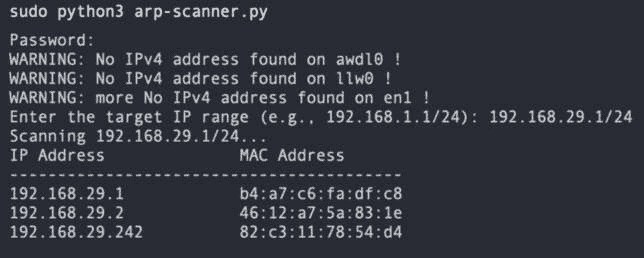

# 第二章：Python 用于安全专业人士——超越基础知识

本章探讨了专为安全专业人士设计的复杂 Python 应用，带您超越基础知识，进入前沿的网络安全实践领域。

在本章结束时，您不仅将彻底了解 Python 在网络安全中的作用，还将亲身体验设计一个全面的安全工具。通过实际案例和深入讲解，您将获得有效解决实际安全问题所需的专业知识。

在本章中，我们将覆盖以下主要主题：

+   使用关键的安全库

+   利用高级 Python 技术进行安全防护

+   编译 Python 库

+   高级 Python 特性

# 使用关键的安全库

网络分析的核心是网络扫描实践。**网络扫描**是一种用于发现网络设备、确定开放端口、识别可用服务并发现漏洞的技术。这些信息对安全评估和维护网络的整体安全性至关重要。

事不宜迟，让我们编写一个网络扫描器。**Scapy** 将是我们首选的库。

Scapy 是一个强大的数据包处理工具，允许用户捕获、分析和伪造网络数据包。它可用于网络发现、安全测试和取证分析。

我如何确认 Scapy 是我们工具的首选库？

您需要进行一些 Google 搜索，您还可以使用 [`pypi.org/`](https://pypi.org/) 查找适合您需求的模块。

那么，既然我们已经有了库，如何找到 Scapy 中我们工具所需的模块呢？为此，您可以使用可在 [`pypi.org/`](https://pypi.org/) 或库的 GitHub 仓库（[`github.com/secdev/scapy`](https://github.com/secdev/scapy)）上找到的文档。

一种有效的网络发现方法是利用**地址解析协议**（**ARP**）扫描来查询本地网络上的设备，收集它们的 IP 和 MAC 地址。使用 Scapy 这一强大的数据包处理库，我们可以创建一个简单而高效的脚本来执行此任务。Scapy 的灵活性允许对数据包进行详细定制，从而精确控制我们发送的 ARP 请求。这不仅提高了扫描过程的效率，还最小化了潜在的网络干扰。以下是一个优化过的脚本，展示了这一过程。

任何 Python 脚本的第一步是加载必要的模块。

从 Scapy 导入必要的模块，包括 `ARP`、`Ether`（`srp`（**发送和接收数据包**））：

```
 1\. # Import the necessary modules from Scapy
 2\. from scapy.all import ARP, Ether, srp
 3.
```

我们可以从创建执行 ARP 扫描的函数开始。`arp_scan` 函数接受一个目标 IP 范围作为输入，并为指定范围内的每个 IP 地址创建 ARP 请求包。它发送数据包、接收响应，并提取 IP 和 MAC 地址，将其存储在一个名为 `devices_list` 的列表中：

```
 4\. # Function to perform ARP scan
 5\. def arp_scan(target_ip):
 6.     # Create an ARP request packet
 7.     arp_request = ARP(pdst=target_ip)
 8.     # Create an Ethernet frame to encapsulate the ARP request
 9.     ether_frame = Ether(dst="ff:ff:ff:ff:ff:ff")  # Broadcasting to all devices in the network
10.
11.     # Combine the Ethernet frame and ARP request packet
12.     arp_request_packet = ether_frame / arp_request
13.
14.     # Send the packet and receive the response
15.     result = srp(arp_request_packet, timeout=3, verbose=False)[0]
16.
17.     # List to store the discovered devices
18.     devices_list = []
19.
20.     # Parse the response and extract IP and MAC addresses
21.     for sent, received in result:
22.         devices_list.append({’ip’: received.psrc, ’mac’: received.hwsrc})
23.
24.     return devices_list
25.
```

另一个任务是将扫描结果显示在输入输出流中。`print_scan_results` 函数接受 `devices_list` 作为输入，并以格式化的方式打印出发现的 IP 和 MAC 地址：

```
26\. # Function to print scan results
27\. def print_scan_results(devices_list):
28.     print("IP Address\t\tMAC Address")
29.     print("-----------------------------------------")
30.     for device in devices_list:
31.         print(f"{device[’ip’]}\t\t{device[’mac’]}")
32.
```

`main` 函数是启动脚本的主要函数，它接受目标 IP 范围作为输入，启动 ARP 扫描并打印扫描结果：

```
33\. # Main function to perform the scan
34\. def main(target_ip):
35.     print(f"Scanning {target_ip}...")
36.     devices_list = arp_scan(target_ip)
37.     print_scan_results(devices_list)
38.
```

`if __name__ == "__main__":` 代码块使脚本可以在命令行中执行，并能够接受参数。脚本会提示用户输入目标 IP 范围，例如 `192.168.1.1/24`：

```
39\. # Entry point of the script
40\. if __name__ == "__main__":
41.     # Define the target IP range (e.g., "192.168.1.1/24")
42.     target_ip = input("Enter the target IP range (e.g., 192.168.1.1/24): ")
43.     main(target_ip)
```

要运行脚本，确保你已经进入虚拟环境，安装了 Scapy 库（`pip install scapy`），并以管理员权限执行它。它将对指定的 IP 范围执行 ARP 扫描，并打印出发现的设备的 IP 和 MAC 地址。

结果应如下所示：



图 2.1 – 执行 ARP 扫描脚本的输出

上述内容是一个简单的例子，展示了 Python 库的强大功能。除了 Scapy，我在上一章中列出了我们可以在安全操作中使用的一些常见库。所列出的库只是其中的一部分，还有许多其他库可以根据不同的需求使用。

现在让我们深入探索如何利用先进的 Python 技术，利用我们新学到的知识，以最大的精准度、创新性和韧性在复杂的安全领域中导航。

# 利用先进的 Python 技术进行安全防护

使用我们从网络扫描中获得的 IP 地址，我们将创建一个 Python 模块，将其导入到我们的程序中，并对这些 IP 进行端口扫描。在此过程中，我们还将涉及一些高级 Python 概念。

在本节中，我们将深入探讨复杂的 Python 概念，从基本元素开始，如 **面向对象编程** 和 **列表推导式**。我们将分解这些高级 Python 方面的内容，使其易于理解，并讨论如何在技术安全测试领域中应用它们。

在开始端口扫描器之前，我们需要在 Python 中导入必要的模块，这里是 `socket` 模块。`socket` 模块是用于在 Python 中创建网络接口的关键工具。导入它非常重要，因为 `socket` 模块提供了与其他计算机通过网络连接的能力。这种与其他计算机的连接是任何端口扫描过程的关键起点。因此，导入 `socket` 模块是设置端口扫描器的第一步。

在这个初始阶段，我们将照常导入必要的模块：

```
 1\. import socket
 2\. import threading
 3\. import time
```

我们将开始创建一个`PortScanner`类。在 Python 中，类充当创建对象的蓝图，这些对象封装了一组变量和函数：

```
 5\. #Class Definition
 6\. class PortScanner:
```

在类中遇到的第一个方法是`__init__`方法。这个方法至关重要，因为它用于初始化类的实例或设置默认值。`__init__`方法是 Python 类中的特殊方法，充当构造函数，并在创建类的新实例时自动调用。在这个方法中：

+   **self**：指的是正在创建的类的实例。它允许你访问实例的属性和方法。

+   **target_host**：表示目标主机（例如网站或 IP 地址）的参数，端口扫描器将对其进行扫描。

+   **start_port**和**end_port**是表示要扫描的端口范围的参数，从**start_port**到**end_port**。

+   **open_ports**：一个空列表，用于存储在扫描过程中找到的开放端口列表。此列表对于每个**PortScanner**类的实例都是特定的：

```
 7.     def __init__(self, target_host, start_port, end_port):
 8.         self.target_host = target_host
 9.         self.start_port = start_port
10.         self.end_port = end_port
11.         self.open_ports = []
```

名为`is_port_open`的方法接下来将被详细讨论。此过程旨在检查某些网络端口是否开放，这对于识别网络安全系统中的潜在漏洞至关重要。

以下是该方法的参数：

+   **self**：表示调用该方法的类的实例。

+   **port**：表示要检查是否开放的端口号的参数。

```
12\. #is_port_open Method
13.     def is_port_open(self, port):
14.         try:
15.             with socket.socket(socket.AF_INET, socket.SOCK_STREAM) as s:
16.                 s.settimeout(1)
17.                 s.connect((self.target_host, port))
18.             return True
19.         except (socket.timeout, ConnectionRefusedError):
20.             return False
```

以下是前面代码块中概述的原则的详细阐述：

+   **with socket.socket(socket.AF_INET, socket.SOCK_STREAM) as s:**：这一行创建了一个新的套接字对象：

    +   **socket.AF_INET**：表示套接字将使用 IPv4 地址。

    +   **socket.SOCK_STREAM**：表示套接字是一个 TCP 套接字，用于流式传输数据。

+   **s.settimeout(1)**：为套接字连接尝试设置 **1** 秒的超时时间。如果连接在 **1** 秒内未成功，将引发**socket.timeout**异常。

+   **s.connect((self.target_host, port))**：尝试建立与目标主机（**self.target_host**）在指定端口（**port**）上的连接。

+   **处理连接结果**：如果连接尝试成功（即端口开放并接受连接），则会执行**try**块中的代码且没有错误。在这种情况下，方法会立即返回**True**，表示端口已打开。

+   **处理异常**：如果连接尝试结果为超时（**socket.timeout**）或**ConnectionRefusedError**，则表示端口关闭或无法访问。这些异常将在**except**块中捕获，并且方法返回**False**，表示端口已关闭。

`is_port_open` 方法在 `PortScanner` 类内部使用。它提供了一种简单且可复用的方式来检查目标主机上的特定端口是开放还是关闭。通过将此逻辑封装到一个独立的方法中，代码变得更加模块化，易于维护。该方法允许 `PortScanner` 类在扫描过程中高效地确定端口的状态。

接下来，我们讨论 `scan_ports` 方法。这个方法是一个复杂的过程，它系统地扫描和分析网络端口。

以下是方法的参数（`self`）；它表示调用该方法的类实例：

```
21\. #scan_ports Method
22.     def scan_ports(self):
23.         open_ports = [port for port in range(self.start_port, self.end_port + 1) if self.is_port_open(port)]
24.         return open_ports
```

以下是前面代码块中概述的原则的详细解释：

+   `iterable` 并可以根据条件选择性地过滤项目。

    列表推导式的语法如下：

    ```
    1\. new_list = [expression for item in iterable if condition]
    ```

    该结构的组成部分可以解释如下：

    +   `[port for port in range(self.start_port, self.end_port + 1) if self.is_port_open(port)]` 行在 `scan_ports` 方法中，它是一个列表推导式。其组成部分可以被拆解并详细阐述如下：

        +   `iterable`。它们是 Python 表达式语法的基础部分，使得开发者能够编写高效且易读的代码。

        +   `start_port` 和 `end_port`。

        +   使用 `is_port_open` 方法来检查端口是否开放（使用之前解释过的 `is_port_open` 辅助方法）。

        +   `is_port_open(port)` 返回 `True`。这个列表全面识别并捕获指定范围内的所有开放端口。

        +   `scan_ports` 方法提供了一种简洁的方式来扫描端口范围并收集开放端口的列表。它利用列表推导式，Python 中的一个强大功能，在一行代码中创建 `open_ports` 列表。通过使用此方法，`PortScanner` 类可以轻松且高效地识别目标主机上指定范围内的开放端口。该方法对于 `PortScanner` 类的功能至关重要，因为它封装了扫描和识别开放端口的逻辑。

        现在，我们将关注 `main()` 函数。以下是它的特点：

        +   **target_host = input("请输入目标主机：")**：这会提示用户输入目标主机（例如，网站域名或 IP 地址），并将输入存储到 **target_host** 变量中。

        +   **start_port = int(input("请输入起始端口："))**：这会提示用户输入起始端口号，并在将输入转换为整数后存储到 **start_port** 变量中。

        +   **end_port = int(input("请输入结束端口："))**：这会提示用户输入结束端口号，并在将输入转换为整数后存储到 **end_port** 变量中。

        以下是 `main()` 函数的代码部分：

        ```
        25\. def main():
        26.     target_host = input("Enter target host: ")
        27.     start_port = int(input("Enter starting port: "))
        28.     end_port = int(input("Enter ending port: "))
        29.
        30.     scanner = PortScanner(target_host, start_port, end_port)
        31.
        32.     open_ports = scanner.scan_ports()
        33.     print("Open ports: ", open_ports)
        34.
        ```

        以下是代码执行步骤的详细解释：

        +   创建 `PortScanner` 类的实例，并将 `target_host`、`start_port` 和 `end_port` 作为参数传递。此实例将用于扫描端口。

        +   使用 `PortScanner` 实例的 `scan_ports` 方法扫描端口。这个方法使用列表推导返回一个开放端口的列表，正如之前讨论的那样。

        +   使用列表推导的 `scan_ports` 方法。

        最后，添加以下代码块，以便在文件作为脚本执行时调用 `main` 方法，但当它作为模块导入时不调用：

        ```
        35\. if __name__ == "__main__":
        36.     main()
        ```

        `if __name__ == "__main__":` 这一行检查脚本是否直接运行（而不是作为模块导入）。当你直接执行脚本时，这个条件会评估为 `True`。如果脚本是直接运行的，它会调用 `main()` 函数，启动输入收集、端口扫描和显示结果的过程。

        总结来说，这个脚本会提示用户输入目标主机、起始端口和结束端口。然后它会创建一个 `PortScanner` 类的实例，并使用列表推导扫描指定范围内的端口。开放的端口将显示给用户。这个脚本被设计为可以直接作为独立程序运行，允许用户根据输入交互式地扫描端口。

        现在，让我们将代码转换成 Python 库，这样我们就可以在任何 Python 脚本中安装并使用这个库。

        # 编译 Python 库

        创建一个 Python 库涉及以一种方便他人安装、导入和使用的方式打包你的代码。要将你的代码转换为 Python 库，请按照以下步骤操作：

        1.  **整理你的代码**：确保我们的代码结构合理，遵循包结构：

            ```
            portscanner/
            |-- portscanner/
            |   |-- __init__.py
            |   |-- portscanner.py
            |-- setup.py
            |-- README.md
            ```

            Python 库的组件如下：

            +   **portscanner/**：包含你包的主要文件夹

            +   **portscanner/__init__.py**：一个空文件，表示 **portscanner** 是一个 Python 包

            +   **portscanner/scanner.py**：你的 **PortScanner** 类和相关函数

            +   **setup.py**：用于打包和分发你的库的脚本

            +   **README.md**：文档，说明如何使用你的库

        1.  **更新 setup.py**：

            ```
             1\. from setuptools import setup
             2.
             3\. setup(
             4.     name='portscanner',
             5.     version='0.1',
             6.     packages=['portscanner'],
             7.     install_requires=[],
             8.     entry_points={
             9.         'console_scripts': [
            10.             'portscanner = portscanner.portscanner:main'
            11.         ]
            12.     }
            13\. )
            ```

            在这个文件中，你需要指定包名（`portscanner`）、版本号，以及要包含的包（使用 `find_packages()` 来自动发现包）。将任何库的依赖项添加到 `install_requires` 列表中。

        1.  **打包你的代码**：在终端中，进入包含 **setup.py** 文件的目录，并运行以下命令来创建源分发包：

            ```
            .tar.gz file in the dist directory.
            ```

        1.  **发布你的库（可选）**：如果你想让你的库公开可用，你可以将它发布到 **Python Package Index**（**PyPI**）。你需要在 PyPI 上创建一个账户，并安装 **twine**，如果你还没有安装的话：

            ```
            twine:

            ```

            twine 上传 dist/*

            ```

            ```

        1.  **安装并使用你的库**：要测试你的库，你可以使用 **pip** 在本地安装它。在和 **setup.py** 同一目录下，运行以下命令：

            ```
            PortScanner class from the portscanner package:

            ```

            1\. 从 portscanner.portscanner 导入 PortScanner

            2.

            3\. scanner = PortScanner(target_host, start_port, end_port)

            4\. open_ports = scanner.scan_ports()

            5. print("开放端口: ", open_ports)

            ```

            Our code is now packaged as a Python library, ready for distribution and use by others.
            ```

        在我们结束关于编译 Python 库的讨论时，我们将转向探索更高级的 Python 特性，以进一步提升我们在网络安全领域的知识和技能。接下来的部分将更深入地探讨这些 Python 的复杂组件。

        # 高级 Python 特性

        我们可以将之前部分创建的库与我们的网络映射工具结合起来，并改造我们的代码，使其对发现的 IP 地址进行网络扫描和端口扫描。我们就停在这里，接下来讨论一些更高级的 Python 特性，从**装饰器**开始。

        ## 装饰器

        装饰器是 Python 语法中一个强大的方面，使你能够在不改变源代码的情况下修改或增强函数或方法的行为。

        为了更好地理解 Python 装饰器，我们将深入分析以下代码：

        ```
        1\. def timing_decorator(func):
        2.     def wrapper(*args, **kwargs):
        3.         start_time = time.time()  # Record the start time
        4.         result = func(*args, **kwargs)  # Call the original function
        5.         end_time = time.time()  # Record the end time
        6.         print(f"Scanning took {end_time - start_time:.2f} seconds.")  # Calculate and print the time taken
        7.         return result  # Return the result of the original function
        8.     return wrapper  # Return the wrapper function
        ```

        以下是详细解释的代码执行步骤：

        +   **timing_decorator(func)**：这个装饰器函数，称为**timing_decorator(func)**，通过接受一个函数（**func**）作为参数，然后生成一个新的函数（**wrapper**）。**wrapper**本质上是原始函数的一个载体，提供额外的操作层。

        +   **wrapper(*args, **kwargs)**：这是装饰器返回的**wrapper**函数。它捕获传递给原始函数的参数和关键字参数，记录开始时间，调用原始函数，记录结束时间，计算所花费的时间，打印持续时间，并最终返回原始函数的结果。

        让我们来看一下如何在代码中使用这个装饰器：

        ```
        1.     @timing_decorator
        2.     def scan_ports(self):
        3.         open_ports = [port for port in range(self.start_port, self.end_port + 1) if self.is_port_open(port)]
        4.         return open_ports
        ```

        在这里，`@timing_decorator` 使用 `timing_decorator` 装饰了 `scan_ports` 方法。它等同于写 `scan_ports =` `timing_decorator(scan_ports)`。

        `timing_decorator` 测量 `scan_ports` 方法执行的时间并打印持续时间。这是装饰器的一个常见用例，展示了它们如何以简洁和可重用的方式增强方法的功能。装饰器为修改或扩展 Python 中函数和方法的行为提供了一种灵活优雅的方式。

        接下来，我们将探讨装饰器在提升代码功能方面如何轻松地被有效运用。我们将强调装饰器在改善代码的可维护性、可读性和可重用性方面的好处，最终有助于构建更安全和优化的代码库。

        以下是装饰器的使用场景和优点：

        +   **代码重用性**：装饰器允许你将可重用的功能封装，并将其应用于多个函数或方法，而无需复制代码。

        +   **日志记录和计时**：装饰器通常用于日志记录、计时和性能分析函数，以监控它们的行为和表现。

        +   **身份验证和授权**：装饰器可以执行身份验证和授权检查，确保只有授权用户才能访问某些函数或方法。

        +   **错误处理**：装饰器可以处理函数抛出的异常，在代码的不同部分提供一致的错误处理。

        +   **面向切面编程（AOP）**：装饰器支持 AOP，允许你将跨越多个功能或方法的关注点（例如，日志记录、安全性）与核心逻辑分离。

        +   **方法链式调用和修改**：装饰器可以修改函数的输出或行为，从而实现方法链式调用或转换返回值。

        之前的代码使用看似接近完成，但似乎我们在本章开始时编写的端口扫描工具使用列表来存储开放端口并返回它们，这使得代码的内存效率较低，因此让我们引入**生成器**，这一 Python 概念。

        ## 生成器

        Python 中的生成器是特殊类型的函数，它返回一系列结果。它们允许你声明一个类似迭代器的函数，在 for 循环中迭代，或者通过 next 函数显式调用，同时维护程序的内部状态，并在生成值之间暂停执行，从而优化内存使用。

        生成器的特性在以下内容中进行了更详细的解释：

        +   **惰性求值**：生成器采用惰性求值，意味着它们按需生成值，仅在请求时生成。这使得它们在处理大数据集或潜在无限序列时内存效率非常高。

        +   **内存效率**：生成器不会一次性将所有值存储在内存中。它们一次生成一个值，消耗最小的内存。这对于处理大数据流特别有利。

        +   **高效迭代**：生成器是**可迭代**对象，可以像列表一样在循环和推导式中使用。然而，它们以高效的方式生成值，在需要时逐个处理每个项目。

        +   **无限序列**：生成器可以表示无限序列。由于它们按需生成值，可以创建一个理论上永远生成值的生成器。

        我们将通过深入分析以下代码，增强对 Python 生成器的理解：

        ```
        1.     def scan_ports_generator(self):
        2.         for port in range(self.start_port, self.end_port + 1):
        3.             if self.is_port_open(port):
        4.                 yield port
        ```

        以下是代码执行步骤的详细解释，帮助理解生成器函数的行为：

        +   **for port in range(self.start_port, self.end_port + 1)**：此循环遍历指定范围内的每个端口号（**self.start_port** 到 **self.end_port**），包括**start_port**和**end_port**。

        +   **if self.is_port_open(port)**：对于范围内的每个端口，调用**is_port_open**方法检查端口是否开放（使用前面解释过的**is_port_open**辅助方法）。

        +   **yield port**：如果端口开放，**yield** 关键字用于从生成器中返回一个值（**port**）。**generator** 函数保持其状态，使得在请求下一个值时可以从上次中断的地方恢复执行。

        生成器的使用案例进行了详细讲解，并进一步解释如下：

        +   **处理大文件**：逐行读取大文件而不将整个文件加载到内存中

        +   **流处理**：分析实时数据流，其中数据不断生成

        +   **高效过滤**：生成过滤后的序列而不创建中间列表

        +   **数学计算**：动态生成诸如斐波那契数列或质数等序列

        生成器是 Python 中一个强大的概念，它能够创建内存高效且可扩展的代码，尤其在处理大数据集或序列时非常有用。它们是 Python 表达式语法中的基础特性，在各种编程场景中被广泛使用。

        在利用了如装饰器和生成器等高级特性后，我们的代码将呈现出一定的形式。以下是代码在最终版本中的样子：

        ```
         1\. import socket
         2\. import time
         3.
         4\. #Class Definition
         5\. class PortScanner:
         6.     def __init__(self, target_host, start_port, end_port):
         7.         self.target_host = target_host
         8.         self.start_port = start_port
         9.         self.end_port = end_port
        10.         self.open_ports = []
        11.     #timing_decorator Decorator Method
        12.     def timing_decorator(func):
        13.         def wrapper(*args, **kwargs):
        14.             start_time = time.time()
        15.             result = func(*args, **kwargs)
        16.             end_time = time.time()
        17.             print(f"Scanning took {end_time - start_time:.2f} seconds.")
        18.             return result
        19.         return wrapper
        20.     #is_port_open Method
        21.     def is_port_open(self, port):
        22.         try:
        23.             with socket.socket(socket.AF_INET, socket.SOCK_STREAM) as s:
        24.                 s.settimeout(1)
        25.                 s.connect((self.target_host, port))
        26.             return True
        27.         except (socket.timeout, ConnectionRefusedError):
        28.             return False
        29.     #scan_ports Method
        30.     @timing_decorator
        31.     def scan_ports(self):
        32.         open_ports = [port for port in range(self.start_port, self.end_port + 1) if self.is_port_open(port)]
        33.         return open_ports
        34.     #scan_ports_generator Method
        35.     @timing_decorator
        36.     def scan_ports_generator(self):
        37.         for port in range(self.start_port, self.end_port + 1):
        38.             if self.is_port_open(port):
        39.                 yield port
        40.
        41\. def main():
        42.     target_host = input("Enter target host: ")
        43.     start_port = int(input("Enter starting port: "))
        44.     end_port = int(input("Enter ending port: "))
        45.
        46.     scanner = PortScanner(target_host, start_port, end_port)
        47.
        48.     open_ports = scanner.scan_ports()
        49.     print("Open ports: ", open_ports)
        50.
        51.     open_ports_generator = scanner.scan_ports_generator()
        52.     print("Open ports (using generator):", list(open_ports_generator))
        53.
        54\. if __name__ == "__main__":
        55.     main()
        ```

        在探索了端口扫描脚本的复杂性、模块化以及如何使用装饰器和生成器等高级特性后，我们的下一个任务是深入了解接下来的步骤。这意味着进行一项动手活动，让读者进一步分析和理解编码实践。

        # 总结

        在本章中，我们学习了如何使用 Python 创建网络映射器和端口扫描器。在过程中，我们涉及了多个复杂的 Python 主题，如面向对象编程、推导式、装饰器、生成器以及如何将 Python 程序打包成库。

        通过这些特性，你将能够编写更优雅的 Python 代码，脱颖而出。所呈现的概念起初可能较为复杂，但一旦掌握，你将永远不会再以其他方式进行编码。

        下一章将深入探讨 Python 在网络安全领域中的应用。它将探索 Python 提供的各种策略、工具和技术，帮助识别和消除安全威胁，同时理解网络安全的基本原理。在今天这个数字时代，这种知识至关重要，因为安全漏洞可能带来高昂的代价。

        # 活动

        现在，我将把任务交给你，你需要将网络扫描器和端口扫描器打包成库，并利用这些库编写一个更加简洁的脚本，扫描每个找到的 IP 的开放端口。

        建议读者按照章节中列出的步骤来巩固所介绍的概念。每个任务都旨在有效测试和加深读者的理解：

        1.  将这两个代码片段打包成库。

        1.  将你的新 Python 文件命名为 **network-and-port-scanner.py**。

        1.  导入两个库到新程序中。

        1.  使用参数解析获取扫描的 IP 和端口范围。

        1.  将 IP 地址范围传递给网络映射程序进行 ARP 扫描，并将 IP 写入文件。

        1.  从文件中读取 IP，并将发现的 IP 地址及其端口范围提供给端口扫描程序。

        1.  以更具视觉吸引力的方式将 IP 和端口打印成表格。
