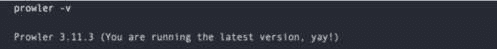
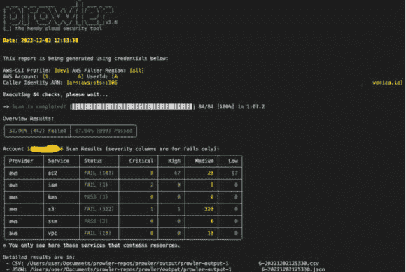
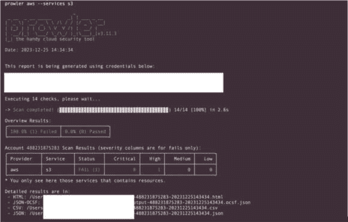

# 第五章：云间谍活动 – Python 在云端攻防安全中的应用

在一个企业严重依赖云技术的时代，加强防御以抵御网络威胁比以往任何时候都更为重要。欢迎深入了解云端攻防安全，在这里我们将探讨网络安全、云技术和 Python 之间的关系。

数字战争的舞台已经发展，防御者和对手所使用的战术也在不断变化。本章提供了一个完整的参考，揭示了在保护云基础设施的同时，评估威胁行为者可能利用的漏洞的关键方法、策略和工具。

在本章中，我们将涵盖以下主题：

+   云安全基础

+   基于 Python 的云数据提取与分析

+   利用云环境中的配置错误

+   加强安全性，Python 在无服务器环境和基础设施即代码（IaC）中的应用

# 云安全基础

在我们继续深入探讨使用 Python 进行云环境中的攻防安全技术之前，确保我们对控制云安全的基本概念有扎实的理解是至关重要的。本节将作为您的指南，建立一个框架，帮助您理解与云部署相关的复杂安全程序和责任。

## 共享责任模型

**共享责任模型**是云计算中的一个关键概念，定义了在保护云环境方面，**云服务提供商**（**CSP**）和其客户之间的责任划分。它明确了谁负责保护云基础设施的哪些组件。

理解责任划分在云计算中至关重要。以下是共享责任模型的细分：

+   **CSP 责任**：CSP 负责保护基础云基础设施，包括物理数据中心、网络基础设施和虚拟化层。这涉及确保基础设施的物理安全、可用性和维护。

+   **客户责任**：使用云服务的客户负责保护他们的数据、应用程序、操作系统、配置和访问管理。这包括设置适当的访问控制、加密、安全配置，并在云环境中管理用户访问和身份。

该模型的具体细节可能会根据使用的云服务类型有所不同。这意味着根据服务类型（例如，**基础设施即服务**（**IaaS**）、**平台即服务**（**PaaS**）、**软件即服务**（**SaaS**））以及每个服务类别内提供的功能，CSP 和客户之间的责任划分可能会有所不同：

+   **IaaS**：在 IaaS 中，云服务提供商（CSP）管理基础设施，而客户则负责保护他们的数据、应用程序和操作系统。

+   **PaaS 和 SaaS**：当你向上推进到 PaaS 和 SaaS 时，云服务提供商承担更多管理底层组件的责任，客户主要关注保护其应用程序和数据的安全。

共享责任模型对于客户至关重要，因为它帮助界定了云服务提供商管理的部分和客户需要负责保障安全的部分。这种理解确保安全措施得到适当实施，从而降低风险并维持安全的云环境。接下来，让我们深入探讨云部署模型及其安全影响，探索不同部署模型如何影响安全性考虑和策略。

## 云部署模型及其安全影响

**云部署模型**是指以不同方式提供和使云计算资源和服务对用户可用的方式。每种部署模型具有独特的特点，选择不同的模型可能会显著影响云环境的安全性。以下是常见部署模型及其安全影响的概述：

+   **公共云**：在这种模型中，服务和基础设施通过互联网由第三方提供商提供，资源在多个用户之间共享。虽然公共云提供了可扩展性和成本效益，但由于资源共享，可能会引发数据安全问题。实施强有力的访问控制和加密措施对减少未经授权访问敏感数据的风险至关重要。

+   **私有云**：此模型包含专用基础设施，可以位于内部或由第三方提供，专门服务于一个组织的需求。与公共云不同，私有云提供对数据和资源的更高控制和安全性。然而，它们可能需要更高的初始投资和持续的维护。

    私有云提供更多的控制和定制选项，允许严格的安全措施。然而，在私有云中管理安全需要强大的内部控制和专业知识。

+   **混合云**：此模型涉及将公共云和私有云基础设施集成在一起，允许在它们之间共享数据和应用程序。混合云通过允许组织利用公共云和私有云的优势，提供了灵活性。然而，跨多个环境管理安全性会带来复杂性。确保公共云和私有云之间的数据传输安全至关重要，以维护敏感信息的完整性和机密性。

+   **多云**：这种方法涉及同时利用多个云服务提供商的服务。组织采用多云战略来分散风险、优化成本，并利用不同供应商的专业服务。然而，管理多个云平台间的安全性和数据一致性可能面临挑战，需要强有力的治理和集成策略。

    多云架构提供了冗余和灵活性，但需要在各个平台上实施严格的安全控制，以保持一致性并防止配置错误或漏洞。

理解不同部署模型下的安全细节，对于确保数据和资源在云环境中得到强有力的保护至关重要。以下是各部署模型下安全的关键考虑因素：

+   **数据安全**：数据在每个模型中的存储、传输和访问方式

+   **访问控制**：确保适当的身份验证和授权机制

+   **合规性与治理**：在不同部署模型下遵守监管要求

+   **集成挑战**：在混合云或多云架构中，弥补不同云环境之间差距的安全措施

+   **供应商锁定**：依赖特定云供应商提供安全措施的风险

理解这些部署模型及其相应的安全影响对组织至关重要，帮助其在制定云战略时做出明智决策，并实施适当的安全措施，以适应其特定的部署模型。这使得他们能够主动应对潜在的安全风险，并保持云中的强大安全防护。

现在，让我们深入探讨云安全的关键组成部分：加密、访问控制和**身份** **管理**（**IdM**）。

## 加密、访问控制和 IdM

加密、访问控制和 IdM 是云安全的关键组成部分，在保护数据、控制资源访问和管理云环境中的用户身份方面发挥着重要作用。它们可以描述如下：

+   **加密**：加密是将数据转换成只有持有解密密钥的授权实体才能访问或解读的编码形式。在云中，加密用于保护传输中的数据和静态数据：

    +   **静态数据加密**：此做法涉及加密存储在数据库、存储服务或备份中的数据，以防止未经授权访问敏感信息，即使在物理存储设备遭到破坏的情况下。

    +   **数据传输加密**：这涉及到在用户、应用程序或云服务之间传输数据时，通过加密数据进行保护。**传输层安全性**（**TLS**）或**安全套接层**（**SSL**）协议通常用于此目的。

+   **访问控制**：访问控制调节谁可以访问云环境中的特定资源。它们包括身份验证、授权和审计机制，简要说明如下：

    +   **身份认证**：这包括验证试图访问云资源的用户或系统的身份。它确保只有经过授权的个人或实体才能访问，通过如密码、**多因素认证** (**MFA**) 或生物识别等方法来实现。

    +   **授权**：这涉及在身份验证成功后，确定用户或系统可以访问哪些操作或数据。**基于角色的访问控制** (**RBAC**) 和 **基于属性的访问控制** (**ABAC**) 是常用的权限分配方法，基于角色或特定属性进行授权。

    +   **审计与日志记录**：这涉及记录和监控访问活动，以检测未经授权或可疑的行为。审计日志提供了谁在何时访问了哪些资源的可视性。

+   **身份管理 (IdM)**：身份管理涉及在云环境中管理用户身份、身份验证、访问权限和生命周期。云环境中的有效身份管理包括多个关键实践，其中包括以下内容：

    +   **用户生命周期管理 (ULM)**：这与在用户生命周期内对用户账户、权限和角色的配置、取消配置和管理有关。

    +   **单点登录 (SSO)**：这与允许用户使用一组凭证访问多个应用程序或服务有关，从而简化了登录过程，减少了密码疲劳，并提升了用户体验和安全性。

    +   **联合身份管理 (Federated IdM)**：这与在不同身份域之间建立信任关系有关，使得用户可以无缝地访问多个组织或服务的资源。此方法简化了用户管理，增强了协作，并通过允许用户一次认证即可访问多个受信系统，避免了为每个系统需要单独的凭证，从而保持安全性。

在云中，这些安全措施对于确保数据的机密性、完整性和可用性至关重要。它们构成了强大安全防护的基础，帮助组织减轻与未经授权访问、数据泄露和合规性违规相关的风险。实施强加密标准、健全的访问控制和有效的身份管理实践对于确保安全的云环境至关重要。

接下来，我们将探讨主要云服务提供商提供的安全措施，考察他们的加密标准、访问控制和身份管理实践，以确保云环境的强大安全性。了解这些服务对于组织在云中有效保护数据和基础设施至关重要。

## 主要云服务提供商提供的安全措施

**亚马逊网络服务**（**AWS**）和**微软** **Azure**是云服务中的重要参与者，提供不同且有效的安全功能。本比较关注两个平台中包含的重要安全领域，包括身份管理、加密、网络安全和监控。虽然有多个云服务提供商（CSPs），但本章将重点介绍 AWS 和 Azure，旨在为理解云安全措施的复杂性提供有用的比较。

### AWS 安全措施

在 AWS 中，安全是重中之重，采取了多项措施来保护数据和资源，例如：

+   **身份与访问管理（IAM）**：AWS IAM 允许对用户访问 AWS 服务和资源进行精细化控制。

+   **虚拟私有云（VPC）**：VPC 提供 AWS 内部的隔离网络环境，用户可以定义自己的虚拟网络，并完全控制 IP 范围、子网和路由表。

+   **加密服务**：数据加密是云安全的关键组成部分，AWS 提供强大的加密服务来保护敏感信息：

    +   AWS **密钥管理服务**（**KMS**）使用户能够管理各种服务的加密密钥。

    +   亚马逊**S3**（也称为**简单存储服务**）提供**服务器端加密**（**SSE**）来保护存储的数据。

+   **网络安全**：确保云环境中的网络安全至关重要，AWS 提供全面的解决方案来保护网络资源：

    +   AWS **Web 应用防火墙**（**WAF**）保护 Web 应用程序免受常见的 Web 漏洞攻击。

    +   安全组和**网络访问控制列表**（**NACLs**）控制实例的进出流量。

+   **日志记录和监控**：有效的日志记录和监控对于维护云环境的安全性和性能至关重要，AWS 提供了强大的工具来实现这一目的：

    +   AWS CloudTrail 跟踪 API 活动并记录 AWS 账户活动。

    +   Amazon CloudWatch 实时监控资源和应用程序，提供指标和警报。

在云安全的背景下，下一个重点将是 Azure 的强大安全措施。除了 AWS，Azure 还提供了一系列安全措施来保护云中的数据和资源：

+   **Microsoft Entra ID**：为 Azure 资源提供身份和访问管理（IAM）服务。

+   **虚拟网络（VNet）**：类似于 AWS VPC，Azure VNet 为**虚拟机**（**VMs**）和服务提供隔离的网络。

+   **加密服务**：确保数据机密性在云环境中至关重要，Azure 提供强大的加密服务来保护敏感信息：

    +   Azure 密钥库使云应用程序和服务使用的密钥、机密和证书得以安全管理，确保加密密钥得到保护和控制。

    +   **Azure 磁盘加密**（**ADE**）加密操作系统和数据磁盘，为存储在 Azure 虚拟机中的数据提供额外的保护层。

+   **网络安全**：在云环境中，确保强大的网络安全至关重要，Azure 提供了全面的解决方案来保护网络资源：

    +   Azure 防火墙保护 Azure 虚拟网络，并提供应用级过滤，允许组织控制和监控进出其资源的流量。

+   **网络安全组**（**NSG**）过滤进出 Azure 资源的网络流量，提供对网络流量流动和安全性的细粒度控制。

+   **日志记录和监控**：有效的日志记录和监控对于维护云环境的安全性和性能至关重要，Azure 为此提供了强大的工具：

    +   Azure 监控提供资源性能和应用诊断的深入分析，使组织能够监控并优化其 Azure 部署。

    +   Azure 安全中心提供安全态势管理、威胁保护和建议，帮助组织有效地检测、预防和应对安全威胁。

以下是 AWS 和 Azure 提供的 IAM、网络安全功能和密钥管理服务的对比：

|  | **IAM 等效** | **网络安全** | **密钥管理** |
| --- | --- | --- | --- |
| **AWS** | IAM | WAF 作为 Web 应用防火墙 | KMS |
| **Azure** | Microsoft Entra ID | Azure 防火墙提供类似的保护 | Azure 密钥保管库 |

表 5.1 – AWS 和 Azure 之间关键差异的对比

AWS 和 Azure 都提供了一套强大的安全工具和服务。虽然它们的提供内容类似，但命名规范、界面设计和某些功能可能有所不同。了解每个云服务提供商的具体服务，有助于根据组织的需求和偏好做出明智的决策。

随着我们结束对主要云服务提供商所提供的安全措施的讨论，接下来我们将重点关注云环境中的关键访问控制方面。

## 云环境中的访问控制

在云环境中，实施有效的访问控制至关重要，以确保数据和资源的安全性与完整性。接下来是实现细粒度访问权限的关键原则和机制：

+   **细粒度访问权限**：云服务，如 AWS、Azure 或 Google Cloud Platform（GCP），采用共享责任模型，用户或实体被授予特定的权限或角色来访问资源。访问权限通过策略、角色以及附加到用户、组或角色的权限定义。

+   **最小权限原则（PoLP）**：PoLP 是云安全的基础。它规定每个用户、应用程序或服务应仅具备执行其功能所需的最小访问权限——不多也不算少。用户仅被授予执行任务所需的资源访问权限，从而减少了未预期操作或数据泄露的风险。

+   **多层次访问控制**：云环境通常采用多层次的访问控制。这包括身份验证（验证用户身份）和授权（根据用户的身份和权限确定用户可以访问哪些资源）。

+   **身份与访问管理（IAM）**：云平台中的 IAM 服务管理用户身份、角色、组及其相关权限。IAM 策略定义了用户或实体在云环境中对特定资源或服务可以执行的操作。

+   **程序化访问控制机制**：实施精细化的访问控制用于程序化访问有助于减少攻击面。在云环境中使用如 IAM 等工具，可以让管理员创建特定的角色或策略，只授予应用程序或服务必要的权限，从而执行最小权限原则（PoLP）。

在讨论完云环境中的访问控制后，接下来我们将探讨恶意活动的影响。

## 恶意活动的影响

在云环境中，恶意活动的影响通过强大的访问控制机制得到显著减轻。接下来是关于未经授权的行为在没有适当访问权限下影响有限的关键考虑因素：

+   **没有适当的访问权限影响有限**：任何在云环境中的恶意或未经授权的活动都严重依赖于具备必要的访问权限。如果没有适当的权限，尝试执行未经授权的操作或访问敏感资源通常会被现有的访问控制机制阻止或拒绝。

+   **功能受限**：如果攻击者或未经授权的用户缺乏所需的权限，他们在云环境中执行恶意活动的能力将受到严重限制。例如，尝试启动实例、访问敏感数据、修改配置或执行其他未经授权的操作将被阻止，除非具备必要的权限。

云环境设计了强大的访问控制机制，通过限制未经授权的访问来强制执行安全性。任何在云环境中执行恶意活动的尝试不仅需要技术知识，还需要适当的访问权限。

我们已探讨了云安全的基本原则，强调了强大的访问控制、加密、身份管理（IdM）和监控在保护云环境中的重要性。通过理解这些基础概念，组织可以建立强大的安全防护，以保护其在云中的数据和资源。现在，让我们深入了解基于 Python 的云数据提取与分析，探索 Python 如何帮助从云平台提取并分析数据，使组织能够为决策制定和优化提供有价值的洞见。

# 基于 Python 的云数据提取与分析

Python 的多功能性与云基础设施结合，呈现出强大的协同效应，用于提取和分析托管在云环境中的数据。在本节中，我们将探讨 Python 与云服务交互、提取数据以及使用强大库进行深度分析的能力，从而从云数据资源中获得可操作的洞见。

AWS 提供的 Python SDK（`boto3`）、Azure（Azure SDK for Python）和 Google Cloud（Google Cloud Client Library）简化了与云服务的编程交互。让我们通过以下代码示例，演示如何使用 AWS S3：

```
 s3client = boto3.client(
      service_name='s3',
      region_name='us-east-1',
      aws_access_key_id=ACCESS_KEY,
      aws_secret_access_key=SECRET_KEY
  )
  response = s3.list_buckets()
  for bucket in response['Buckets']:
      print(f'Bucket Name: {bucket["Name"]}')
```

以下是前述代码块的关键组件说明：

+   **S3 客户端初始化**：**boto3.client()** 方法初始化 AWS 服务的客户端——在此例中为 S3。

    接下来，我们详细说明代码片段中使用的参数：

    +   **service_name='s3'**：指定与之交互的 AWS 服务——在此例中为 S3。

    +   **region_name='us-east-1'**：定义 S3 服务所在的 AWS 区域。将 **'us-east-1'** 替换为您选择的 AWS 区域。

    +   **aws_access_key_id** 和 **aws_secret_access_key**：用于与 AWS 进行身份验证的凭证。将 **ACCESS_KEY** 和 **SECRET_KEY** 替换为您实际的 AWS 访问密钥 ID 和秘密访问密钥。

+   **列出存储桶**：**s3.list_buckets()** 向 AWS 发送请求，以列出与提供的凭证关联的指定区域的所有 S3 存储桶。AWS 的响应存储在 **response** 变量中。

+   **遍历存储桶**：前述代码片段演示了如何遍历从 AWS 响应中检索到的存储桶列表：

    +   **for bucket in response['Buckets']:** 遍历从 AWS 响应中检索到的存储桶列表。

    +   **bucket["Name"]** 从响应中提取每个存储桶的名称。

+   **打印存储桶名称**：**print(f'Bucket Name: {bucket["Name"]}')** 将每个存储桶的名称打印到控制台。

接下来概述了前述代码块执行的操作顺序：

1.  **S3 客户端初始化**：创建一个 S3 客户端对象 (**s3client**)，并指定配置项，包括 AWS 凭证（**ACCESS_KEY** 和 **SECRET_KEY**）以及区域（此处为 **us-east-1**）。

1.  **列出存储桶**：调用 S3 客户端的 **list_buckets()** 方法，以获取指定 AWS 区域中可用的存储桶列表。

1.  **存储桶迭代和打印**：前面的代码片段演示了如何迭代从响应中获取的存储桶列表，并将每个存储桶的名称打印到控制台：

    1.  迭代 **response** 变量中检索到的存储桶列表。

    1.  使用 **print(f'Bucket Name: {bucket["Name"]}')** 将每个存储桶的名称打印到控制台。

重要提示

将 **ACCESS_KEY** 和 **SECRET_KEY** 替换为您的实际 AWS 凭证。确保凭证具有列出 S3 存储桶的必要权限。

确保 **region_name** 参数反映您希望列出存储桶的 AWS 区域。

这段代码演示了如何使用 `boto3` 列出 AWS S3 存储服务中的存储桶，帮助理解如何初始化 S3 客户端、与 AWS 服务进行交互，并从 AWS 响应中检索数据。

现在，让我们探索一个使用 Azure SDK for Python 的示例。该示例演示了如何通过 Python 编程与 Azure 服务进行交互。

对于 Azure，Azure SDK for Python 名为 `azure-storage-blob`。以下是使用 Azure SDK 列出存储帐户的示例：

```
  from azure.storage.blob import BlobServiceClient
  # Connect to the Azure Blob service
  connection_string = "<your_connection_string>"
  blob_service_client = BlobServiceClient.from_connection_string(connection_string)
  # List containers in the storage account
  containers = blob_service_client.list_containers()
  for container in containers:
     print(f'Container Name: {container.name}')
```

在这里，我们将分析前面代码块中的关键元素，以提供全面的理解：

+   **导入 BlobServiceClient**：**from azure.storage.blob import BlobServiceClient** 从 **azure.storage.blob** 模块导入了 **BlobServiceClient** 类。此类允许与 Azure Blob 存储服务进行交互。

+   **连接到 Azure Blob 存储服务**：**connection_string = "<your_connection_string>"** 初始化一个 **connection_string** 变量，并将其设置为 Azure Blob 存储的连接字符串。请将 **<your_connection_string>** 替换为从 Azure 门户获得的实际连接字符串。

+   **BlobServiceClient 初始化**：**BlobServiceClient.from_connection_string(connection_string)** 通过使用 **from_connection_string()** 方法并传入 Azure Blob 存储连接字符串来创建一个 **BlobServiceClient** 对象。这个客户端是访问 Blob 存储服务的主要入口点。

+   **列出容器**：**blob_service_client** 的 **list_containers()** 方法获取一个生成器（迭代器），该生成器包含指定存储帐户中的容器列表。此方法返回一个可迭代对象，允许对容器进行迭代。

+   **迭代容器**：**for container in containers:** 语句遍历通过 **blob_service_client.list_containers()** 调用获得的容器列表，**container.name** 获取迭代中每个容器的名称。

+   **打印容器名称**：**print(f'Container Name: {container.name}')** 将每个容器的名称打印到控制台。

现在，让我们深入研究前面的代码块中描绘的执行流程，详细说明每个步骤：

1.  **连接初始化**：通过定义**connection_string**变量并提供所需的连接详细信息，建立与 Azure Blob 存储的连接。

1.  **BlobServiceClient 创建**：使用提供的连接字符串创建**BlobServiceClient**对象（**blob_service_client**）。此客户端用于与 Azure Blob 存储服务进行交互。

1.  **列出容器**：使用**blob_service_client.list_containers()**方法从指定的存储帐户中检索包含容器列表的生成器。

1.  **容器迭代和打印**：该代码片段迭代从生成器获得的容器列表，并使用**print(f'Container Name: {container.name}')**将每个容器的名称打印到控制台。

重要提示

将**<your_connection_string>**替换为从您的 Azure Blob 存储帐户中获取的实际连接字符串。

确保使用的连接字符串具有列出指定 Azure 存储帐户中的容器的必要权限。

这些示例演示了如何利用 AWS SDK（`boto3`）和 Azure SDK for Python 与云服务进行交互，执行诸如列出存储桶/容器、上传文件或在 AWS 或 Azure 环境中执行各种其他操作。然而，必须注意与在代码中硬编码敏感数据（如访问密钥）相关的安全风险。随着我们深入云开发，处理硬编码敏感数据的安全风险显得尤为重要。

## 硬编码敏感数据的风险及检测硬编码的访问密钥

现在，让我们有效地应用这些知识。需要注意的是，要执行这些活动，您应该在云环境中拥有适当的用户访问权限。

因此，从攻击者的角度来看，为了发起攻击，他们需要云环境的访问密钥。开发人员经常犯的一个错误是将这种敏感数据硬编码到代码中，这些代码可能通过公共 GitHub 仓库或无意中发布到论坛中而暴露给公众。

想象一下，如果这些私人数据被硬编码在 JavaScript 文件中，情况会如何，这种情况比你想象的更常见。让我们使用**生成预训练变换器**（**GPT**），一个来自 OpenAI 的**大型语言模型**（**LLM**），来提取这些密钥：

```
  import openai
  import argparse
  # Function to check for AWS or Azure keys in the provided text
  def check_for_keys(text):
      # Use the OpenAI GPT-3 API to analyze the content
      response = openai.Completion.create(
          engine="davinci-codex",
          prompt=text,
         max_tokens=100
     )
     generated_text = response['choices'][0]['text']
     # Check the generated text for AWS or Azure keys
     if 'AWS_ACCESS_KEY_ID' in generated_text and 'AWS_SECRET_ACCESS_KEY' in generated_text:
         print("Potential AWS keys found.")
     elif 'AZURE_CLIENT_ID' in generated_text and 'AZURE_CLIENT_SECRET' in generated_text:
         print("Potential Azure keys found.")
     else:
         print("No potential AWS or Azure keys found.")
 # Create argument parser
 parser = argparse.ArgumentParser(description='Check for AWS or Azure keys in a JavaScript file.')
 parser.add_argument('file_path', type=str, help='Path to the JavaScript file')
 # Parse command line arguments
 args = parser.parse_args()
 # Read the JavaScript file content
 file_path = args.file_path
 try:
     with open(file_path, 'r') as file:
         javascript_content = file.read()
         check_for_keys(javascript_content) except FileNotFoundError:
     print(f"File '{file_path}' not found.")
```

现在，让我们解构前面代码块中的重要元素，以便清晰地理解其功能：

+   **check_for_keys(text)**：此函数接收文本输入并将其发送至 GPT-3 API 进行分析。它检查生成的文本中是否存在与 AWS 或 Azure 密钥相关的模式。根据在生成的文本中找到的模式，它会打印出消息，指示是否检测到潜在的 AWS 或 Azure 密钥。

+   **命令行参数处理**：**argparse** 用于创建一个参数解析器。它定义了一个文件路径的命令行参数（**file_path**），用户在运行脚本时需要提供该参数。

+   **文件读取与 GPT-3 分析**：脚本使用 **argparse** 解析命令行参数。它尝试打开 **file_path** 参数指定的文件。如果文件找到，它会读取内容并将其存储在 **javascript_content** 变量中。然后调用 **check_for_keys()** 函数，将 JavaScript 文件的内容作为参数传递。GPT-3 API 分析这些 JavaScript 内容并生成文本，**check_for_keys()** 函数随后检查生成的文本中是否有与 AWS 或 Azure 密钥相关的模式。

为了执行脚本并分析你的 JavaScript 文件中的潜在 AWS 或 Azure 密钥，请按照以下步骤操作：

1.  **保存脚本**：将此代码保存为 Python 文件（例如，**check_keys.py**）。

1.  **从命令行运行**：打开终端或命令提示符，导航到脚本保存的目录。

1.  **执行脚本**：运行脚本时，使用 **python check_keys.py path/to/your/javascript/file.js**，将 **path/to/your/javascript/file.js** 替换为你的 JavaScript 文件的实际路径。

脚本将读取指定的 JavaScript 文件，将其内容发送到 GPT-3 API 进行分析，并输出是否在文件中检测到潜在的 AWS 或 Azure 密钥。

你可以利用前面章节的知识，扩展并改进程序，使用 MitMProxy 和网络爬虫来自动化此过程。

下面是一个示例，演示如何使用 Python 枚举 AWS 资源：

```
  import boto3
  # Initialize an AWS session
  session = boto3.Session(region_name='us-west-1')  # Replace with your desired region
  # Create clients for different AWS services
  ec2_client = session.client('ec2')
  s3_client = session.client('s3')
  iam_client = session.client('iam')
 # Enumerate EC2 instances
 response = ec2_client.describe_instances()
 for reservation in response['Reservations']:
     for instance in reservation['Instances']:
         print(f»EC2 Instance ID: {instance['InstanceId']}, State: {instance['State']['Name']}»)
 # Enumerate S3 buckets
 buckets = s3_client.list_buckets() for bucket in buckets['Buckets']:
     print(f"S3 Bucket Name: {bucket['Name']}")
 # Enumerate IAM users
 users = iam_client.list_users()
 for user in users['Users']:
     print(f"IAM User Name: {user[‚UserName']}")
```

现在，让我们深入分析代码，探索其核心元素和功能：

+   **AWS 会话初始化**：**boto3.Session()** 初始化 AWS 服务的会话，并指定一个区域（此处为 **us-west-1**）。你可以将其替换为所需的区域。

+   **为 AWS 服务创建客户端**：**session.client()** 为不同的 AWS 服务创建客户端——**Elastic Compute Cloud**（**EC2**）（**ec2_client**）、S3（**s3_client**）和 IAM（**iam_client**）。这些客户端允许通过定义的方法与相应的服务进行交互。

+   **枚举 EC2 实例**：**ec2_client.describe_instances()** 获取指定区域的 EC2 实例信息。然后，脚本遍历响应内容，提取实例 ID 和状态等详细信息，并将其打印到控制台。

+   **枚举 S3 存储桶**：**s3_client.list_buckets()** 获取 S3 存储桶的列表。然后，脚本遍历存储桶列表，并将每个存储桶的名称打印到控制台。

+   **枚举 IAM 用户**：**iam_client.list_users()** 方法获取 AWS 账户中的 IAM 用户列表。接着，脚本遍历此列表并将每个用户的名称打印到控制台。

现在，让我们来查看代码的执行流程和操作。这一部分阐明了脚本中的操作顺序，并提供了有关其功能和逻辑的见解：

1.  **会话初始化**：为指定区域的 AWS 服务建立会话。

1.  **服务客户端创建**：使用初始化的会话为 EC2、S3 和 IAM 服务创建客户端。

1.  **枚举任务**：脚本执行针对 EC2 实例、S3 桶和 IAM 用户的枚举任务，使用各自的服务客户端。然后，它遍历响应，提取并打印关于实例、桶和用户的相关信息到控制台。

重要注意事项

本脚本假定**boto3**使用的凭证（例如访问密钥和秘密密钥）具有执行这些操作所需的权限。

这段代码演示了基本的枚举任务，并作为一个起点，用于通过**boto3**在 AWS 账户中检索有关 EC2 实例、S3 桶和 IAM 用户的信息。

这段代码展示了如何使用 Python 和`boto3`库与各种 AWS 服务交互，并获取有关资源的信息，帮助在 AWS 环境中执行枚举和评估任务。

如果你遇到访问错误，可以通过以下任一方式修复：

1.  **更新** **IAM 策略**：

    1.  **访问 IAM 控制台**：使用具有管理员权限的账户登录 AWS 管理控制台。

    1.  **审查** **用户权限**：

        1.  导航到 IAM 并找到**test-tc-ecr-pull-only**用户。

        1.  查看与此用户关联的附加 IAM 策略或策略。

    1.  **授予** **所需的权限**：

        1.  修改附加的策略，加入**ec2:DescribeInstances**所需的权限。以下是一个示例策略片段，允许**ec2:DescribeInstances**：

    ```
    { "Version": "2012-10-17", "Statement": [ { "Effect": "Allow", "Action": "ec2:DescribeInstances", "Resource": "*" } ] }
    ```

    如果你想限制权限范围，将 `"Resource": "*"` 替换为特定资源或**Amazon 资源名称**（**ARN**）。

    1.  **将策略附加到用户**：将更新后的策略附加到**test-tc-ecr-pull-only**用户。

1.  **使用具有足够权限的凭证**：确保 Python 脚本使用的凭证属于具有必要权限的用户或角色。如果脚本使用的是一组特定的凭证，确保这些凭证具有所需的 IAM 权限。

1.  **AWS CLI 配置**：如果你使用特定配置文件的 AWS CLI，确保该配置文件具有必要的权限。

重要注意事项

授予权限时应谨慎操作，遵循 PoLP 原则——只授予执行特定任务所需的最少权限。更新权限后，重新运行 Python 脚本来枚举 AWS 资源。如果问题仍然存在，请再次检查附加的策略和脚本使用的凭证。

Python 是一个多功能且强大的工具，能够提取、处理和从云环境中托管的数据中获取洞察。其广泛的库和与云服务 SDK（如 AWS 的 `boto3` 或 Azure 的 Python SDK）的无缝集成，使用户能够有效地利用云托管数据的丰富资源。

此外，Python 结合 `boto3` 库，还可以用于在 AWS 环境中枚举 EC2 实例。

## 使用 Python（boto3）枚举 EC2 实例

在使用 Python 程序化地操作 AWS 资源时，`boto3` 库提供了一种便捷的方式与各种服务进行交互。在本小节中，我们将探讨如何利用 `boto3` 枚举 EC2 实例，从而获取有关 AWS 环境中正在运行的虚拟机的重要信息：

```
  import boto3
  # Initialize an AWS session
  session = boto3.Session(region_name='us-west-1')  # Replace with your desired region
  # Create an EC2 client
  ec2_client = session.client('ec2')
  # Enumerate EC2 instances
 response = ec2_client.describe_instances()
 # Process response to extract instance details
 for reservation in response['Reservations']:
     for instance in reservation['Instances']:
         instance_id = instance['InstanceId']
         instance_state = instance['State']['Name']
         instance_type = instance['InstanceType']
         public_ip = instance.get('PublicIpAddress', 'N/A')  # Retrieves Public IP if available
         print(f»EC2 Instance ID: {instance_id}»)
         print(f"Instance State: {instance_state}")
         print(f"Instance Type: {instance_type}")
         print(f"Public IP: {public_ip}")
         print("-" * 30)  # Separator for better readability
```

这段代码演示了如何使用 Python 和 `boto3` 来枚举 EC2 实例：

1.  **会话初始化**：使用指定区域初始化 AWS 会话。

1.  **创建 EC2 客户端**：使用 **session.client('ec2')** 创建 EC2 客户端，以便与 EC2 服务进行交互。

1.  **枚举 EC2 实例**：在使用 Python 和 **boto3** 枚举 EC2 实例时，通常涉及以下步骤：

    1.  **调用** **ec2_client.describe_instances()**：此函数用于从 AWS 环境中获取 EC2 实例的信息。

    1.  **遍历响应**：一旦获取到信息，脚本将遍历响应，以提取诸如实例 ID、状态、类型以及公共 IP 地址等重要细节（如果可用）。

    1.  **打印提取的实例信息**：最后，提取的实例信息将打印到控制台，供进一步分析或处理。

这段 Python 脚本演示了如何获取 AWS 区域内 EC2 实例的基本信息。您可以根据特定需求修改或扩展此代码，例如根据某些条件筛选实例或提取更多有关实例的详细信息。

通过 Python，可以轻松提取来自各种云服务的数据，例如 AWS S3、Azure Blob 存储等。结合 Pandas、NumPy 和 Matplotlib 等库，Python 可以进行全面分析，轻松完成统计计算、数据可视化以及大数据集处理等任务。

在探索了基于 Python 的云数据提取和分析后，我们深入了解了如何利用 Python SDK 与云服务进行交互，并在 AWS 或 Azure 环境中执行各种操作。现在，让我们深入探讨利用云环境中的配置错误的关键方面。理解和缓解这些漏洞对于确保云部署的安全性至关重要。让我们开始吧！

# 利用云环境中的配置错误

在云环境中理解误配置对加强安全措施至关重要。误配置指的是云服务设置和配置中的错误或疏忽，导致攻击者可以利用这些无意的漏洞。

## 误配置的类型

云系统中的误配置涵盖了云服务设置和管理中的各种无意错误或疏忽。它们可能出现在访问限制、数据存储、网络安全和身份管理等方面，每种情况都对云基础设施构成独特的威胁。以下是一些常见的误配置类型：

+   **访问控制**在云环境中发挥着保护敏感数据和资源的关键作用。以下是一些与访问控制相关的常见误配置：

    +   **过度权限**：为用户或服务分配比必要的更广泛的访问权限，可能导致敏感数据或资源的暴露。

    +   **权限不足**：未能分配足够的访问权限，导致服务中断或无法执行必要操作。

+   **数据存储**误配置可能导致云环境中的严重安全漏洞。让我们探讨这一领域中的一些常见陷阱：

    +   **暴露的存储桶**：错误配置存储服务（如 S3 存储桶或 Azure Blob 存储）允许公共访问，从而导致敏感数据的暴露。

    +   **未加密的数据**：存储未加密的数据，如果发生泄露，数据将容易受到未经授权的访问。

+   **网络安全——错误配置的安全组或防火墙规则**：通过错误配置网络安全策略，允许不必要的访问资源。

+   **身份和认证——弱或默认凭证**：未能更新默认凭证或使用弱密码，导致未经授权的访问。

了解误配置的广度——从过度的访问权限、暴露的存储桶到不充分的身份验证机制——对加强云安全至关重要。识别这些漏洞可以采取主动措施纠正误配置，强调严格的访问控制、加密标准和定期审计的重要性。

## 识别误配置

本节讨论如何发现误配置，使用 Prowler 揭示漏洞并系统性地改进云部署。

Prowler 是一个开源安全工具，用于评估、审计、**事件响应**（**IR**）、持续监控、加固和为 AWS、Azure 和 Google Cloud 的安全最佳实践做好取证准备。

它包含针对 **互联网安全中心**（**CIS**）、**支付卡行业数据安全标准**（**PCI DSS**）、*ISO 27001*、**通用数据保护条例**（**GDPR**）、**健康保险可携性和责任法案**（**HIPAA**）、**联邦金融机构检查委员会**（**FFIEC**）、**系统和组织控制 2**（**SOC 2**）、AWS **基础技术审查**（**FTR**）、**国家安全框架**（**ENS**）以及自定义安全框架的控制。

Prowler 作为 PyPI 上的一个项目提供，因此可以使用 `pip` 在 Python 3.9 或更高版本上安装。

在进行设置之前，请确保您具备以下要求：

+   Python >= 3.9

+   Python **pip** >= 3.9

+   AWS、Google Cloud Platform（GCP）和/或 Azure 凭证

要安装 Prowler，请使用以下命令：

```
pip install prowler
prowler -v
```

您应该看到类似于下面所示的消息：



图 5.1 – Prowler 安装确认，显示版本信息

要运行 Prowler，请按照以下方式指定云服务提供商（例如 AWS、GCP 或 Azure）：

```
prowler aws
```

在执行 Prowler 命令之前，请通过运行 `prowler [provider]` 指定云服务提供商，其中提供商可以是 AWS、GCP 或 Azure。下图显示了运行 `prowler aws` 命令后生成的输出，展示了 Prowler 对 AWS 环境进行安全评估的结果：



图 5.2 – 执行 prowler aws 命令后显示的安全发现和建议

由于 Prowler 在后台使用云凭证，您可以使用 AWS、Azure 和 GCP 提供的几乎所有身份验证方法。

接下来，让我们深入探索 Prowler 的功能。

## 探索 Prowler 的功能

Prowler 提供了一套强大的功能，旨在自动化审计过程，评估遵守安全标准的情况，并提供有关云安全态势的可操作见解，具体如下：

+   **自动化审计功能**：Prowler 在多个 AWS 服务（包括 EC2、S3、IAM、**关系型数据库服务**（**RDS**）等）中进行自动化检查。它检查配置、权限和设置，以识别可能带来安全风险的潜在配置错误。

+   **遵守标准和最佳实践**：它评估 AWS 账户是否符合已制定的安全标准和最佳实践，提供有关符合推荐安全配置的合规性水平的全面评估。

+   **报告和洞察**：Prowler 生成详细的报告，概述发现的配置错误，并提供其严重性级别和修复建议。它对发现的问题进行分类，帮助用户优先处理和解决关键问题。

从功能到特性，Prowler 提供的显著特点如下：

+   Prowler 默认生成 CSV、JSON 和 HTML 报告，但你也可以使用**-M**或**--output-modes**生成 JSON-ASFF（AWS Security Hub 使用的格式）报告：

    ```
    prowler <provider> -M csv json json-asff html
    ```

    HTML 报告将保存在默认的输出位置。

+   要列出提供者中所有可用的检查或服务，请使用**-l/--list-checks**或**--list-services**：

    ```
    prowler <provider> --list-checks
    prowler <provider> --list-services
    ```

+   你可以使用**-c/checks**或**-s/services**参数来运行特定的检查或服务：

    ```
    prowler azure --checks storage_blob_public_access_level_is_disabled
    prowler aws --services s3 ec2
    prowler aws --services s3 command:
    ```



图 5.3 – prowler aws --services s3 命令的示例输出

截图展示了 Prowler 扫描的结果，特别是针对 AWS S3 服务的扫描。它突出了与 AWS 环境中 S3 桶相关的任何配置错误、漏洞或安全风险。

接下来，让我们深入探讨 Prowler 的优势。

### Prowler 的优势

Prowler 为云安全管理提供了多个优势和最佳实践。以下是一些突出的特点，展示了它在主动防御、安全合规性遵循和持续改进方面的贡献：

+   **主动安全措施**：Prowler 通过促进系统化评估，在漏洞被利用之前帮助识别安全漏洞，发挥着关键的主动安全作用。

+   **合规性遵循**：Prowler 帮助组织遵循合规标准，通过检测与推荐安全配置的偏差，确保与监管要求的一致性。

+   **持续监控与改进**：将 Prowler 集成到常规安全审计中，可以实现持续监控，促进主动维护强大安全姿态，并推动持续改进。

通过 webhook 自动化传输关键安全发现，组织可以加速识别和响应潜在漏洞或配置错误的过程。这一自动化使得警报相关利益相关者或安全团队变得更加迅速和高效，使他们能够及时采取行动解决 Prowler 发现的任何安全问题。最终，这种方法增强了组织在管理其安全姿态和保护云基础设施方面的主动性。

利用从 Prowler 获取的洞察力，让我们通过 webhook 自动传输关键安全发现，从而简化识别和响应过程。使用以下代码实现这一自动化：

```
  import sys
  import json
  import requests
  def send_to_webhook(finding):
      webhook_url = "YOUR_WEBHOOK_URL_HERE"  # Replace this with your actual webhook URL
      headers = {
         "Content-Type": "application/json"
     }
     payload = {
         "finding_id": finding["FindingUniqueId"],
         "severity": finding["Severity"],
         "description": finding["Description"],
         # Include any other relevant data from the finding
     }
     try:
         response = requests.post(webhook_url, json=payload, headers=headers)
         response.raise_for_status()
         print(f"Webhook sent for finding: {finding['FindingUniqueId']}")
     except requests.RequestException as e:
         print(f"Failed to send webhook for finding {finding['FindingUniqueId']}: {e}")
 if __name__ == "__main__":
     if len(sys.argv) != 2:
         print("Usage: python script.py <json_file_path>")
         sys.exit(1)
     json_file_path = sys.argv[1]
     try:
         with open(json_file_path, "r") as file:
             data = json.load(file)
     except FileNotFoundError:
         print(f"File not found: {json_file_path}")
         sys.exit(1)
     except json.JSONDecodeError as e:
         print(f"Error loading JSON: {e}")
         sys.exit(1)
     # Send data to webhook for critical findings
     for finding in data:
         if finding.get("Severity", "").lower() == "critical":
             send_to_webhook(finding)
```

让我们详细分析一下自动化传输关键安全发现的代码，这些发现通过 webhook 进行传输：

+   **导入**：导入了**sys**、**json**和**requests**库。这些都是标准的 Python 库。**sys**库允许访问命令行参数，**json**库有助于处理 JSON 数据。此外，**requests**简化了 HTTP 请求的发送。

+   **send_to_webhook**：**send_to_webhook** 函数负责将数据发送到指定的 webhook URL。它使用**webhook_url**变量来保存数据将要发送的 URL。此外，**headers**包含有关发送内容类型的信息，在本例中为 JSON。**payload**变量是一个字典，保存从发现中提取的相关数据。通过**requests.post**向**webhook_url**变量发送**POST**请求，并检查响应状态是否有任何错误。根据请求的成功或失败，打印相应的消息。

+   **主程序块（****__name__ == "__main__"****）**：在主程序块（**n _name__ == "__main__"**）中，脚本检查是否作为主程序直接运行。它确保脚本通过一个命令行参数执行，该参数应该是 JSON 文件的路径。如果满足条件，脚本使用**sys.argv[1]**获取作为命令行参数提供的文件路径。然后，脚本尝试打开指定的文件并将其内容作为 JSON 数据加载。它还处理在此过程中可能发生的潜在错误，例如文件未找到或 JSON 解码问题。

+   `.py`扩展名（例如，`script.py`）。然后，从命令行执行该脚本，并提供 JSON 文件的路径作为参数，如下所示：

    ```
    python script.py path/to/your/json_file.json
    ```

    该脚本旨在自动化分析包含安全发现的 JSON 文件的过程，特别是关注那些标记为关键严重性的发现。脚本首先加载 JSON 文件，然后遍历其内容，检查每个发现。当遇到标记为关键的发现时，它将相关数据发送到预定义的 webhook URL。此自动化流程简化了关键安全问题的识别和响应，确保及时处理这些发现，从而增强整体系统安全性。

重要提示

记得将**"YOUR_WEBHOOK_URL_HERE"**替换为你的实际 webhook 服务 URL。根据你使用的 webhook 的要求调整负载结构和内容。

将 Prowler 纳入有关云配置错误的讨论，展示了自动化技术在发现漏洞方面的实际应用。它强调了该工具在加强安全流程、确保符合最佳实践和合规标准方面的重要性，特别是在 AWS 和其他云环境中。

总之，我们讨论的主题深入探讨了在云环境中使用像 Prowler 和 Python 脚本等工具自动化安全评估和响应的关键方面。我们已探讨了这些工具提供的主动安全措施、合规性遵循以及持续监控的重要性。现在，让我们进一步深入探讨如何通过探索 Python 在无服务器架构和 IaC 中的作用来增强安全性。本节将加深我们对如何利用 Python 在现代云生态系统中实施强大安全实践的理解。

# 增强安全性、Python 在无服务器架构中的应用以及基础设施即代码（IaC）

Python 展示了它既是一个强大的工具，又是一个潜在的风险。它的多功能性既能提供强大的防御，也能为攻击者提供一把双刃剑。当与无服务器架构和**基础设施即代码**（**IaC**）结合时，Python 的能力可以被用来增强安全性或进行利用。让我们看看在这些领域使用 Python 的复杂性，以及它如何增强安全性或成为有害行为的通道。

## 引入无服务器计算

**无服务器计算**，常被误解为*没有服务器*，实际上是指将服务器管理和基础设施问题从开发者中抽象出来。这是一种云计算模型，云服务提供商动态管理机器资源的分配。函数或应用程序根据事件响应运行，并根据实际使用情况收费，而不是按预配置的容量收费。

当我们深入探讨无服务器架构的复杂性时，理解其优势变得至关重要。这些优势不仅揭示了其所提供的效率，还为我们提供了为什么在现代云环境中利用无服务器技术至关重要的洞察：

+   **可扩展性**：随着需求自动扩展，实现高效的资源利用

+   **成本效益**：按执行计费模型消除空闲期间的成本

+   **简化操作**：减少开发者的基础设施管理负担

+   **更快的市场时间（TTM）**：允许更快的开发和部署周期

### 无服务器环境中的安全挑战

在探索无服务器环境的安全领域时，我们遇到了几个源自其独特架构和操作特征的挑战。这些挑战要求我们充分理解并采取积极的措施来有效地减轻潜在风险。让我们详细看看这些挑战：

+   **有限的可见性** **和控制**：

    +   **挑战**：无服务器环境抽象了基础设施，减少了对底层系统的可见性

    +   **脆弱性**：缺乏可见性可能导致威胁或事件未被发现

    让我们来看一下 Python 实现：

    ```
      import boto3
      # Get CloudWatch logs for a Lambda function
      def get_lambda_logs(lambda_name):
          client = boto3.client('logs')
          response = client.describe_log_streams(logGroupName=f'/aws/lambda/{lambda_name}')
          log_stream_name = response['logStreams'][0]['logStreamName']
          logs = client.get_log_events(logGroupName=f'/aws/lambda/{lambda_name}', logStreamName=log_stream_name)
          return logs['events']
    ```

    这个 Python 脚本利用 AWS SDK（`boto3`）获取特定 Lambda 函数的 CloudWatch 日志，便于监控和获取函数执行的相关信息。

+   **不安全的** **部署实践**：

    +   **挑战**：赋予无服务器函数过多权限

    +   **漏洞**：过度的权限可能导致未经授权的访问

    让我们来看一下 Python 实现：

    ```
      import boto3
      # Check Lambda function's permissions
      def check_lambda_permissions(lambda_name):
          client = boto3.client('lambda')
          response = client.get_policy(FunctionName=lambda_name)
          permissions = response['Policy']
          # Analyze permissions and enforce least privilege
          # Example: Validate permissions against predefined access levels
         # Implement corrective actions
    ```

    这段 Python 脚本展示了如何使用 `boto3` 中的 AWS Lambda 客户端来检索并分析 Lambda 函数的权限，确保遵循最小权限原则。

+   **数据安全** **和加密**：

    +   **挑战**：确保在无服务器函数中的数据安全处理

    +   **漏洞**：数据保护不足可能导致数据泄露

    让我们来看一下 Python 实现：

    ```
     from cryptography.fernet import Fernet
     # Encrypt data in a Lambda function using Fernet encryption
     def encrypt_data(data):
         key = Fernet.generate_key()
         cipher_suite = Fernet(key)
         encrypted_data = cipher_suite.encrypt(data.encode())
         return encrypted_data
    ```

    这个 Python 示例展示了如何使用 `cryptography` 库在无服务器函数中执行数据加密，从而增强数据安全性。

接下来，让我们深入了解 IaC 的世界，理解其在云计算环境中的原则和应用。

## IaC 简介

IaC 通过利用机器可读的脚本文件进行基础设施的配置和管理，彻底改变了基础设施管理的方式，与手动过程或交互式配置工具不同。此方法将基础设施设置视为软件开发，促进自动化、版本控制，并确保在不同环境中保持一致性。

探索 IaC 的意义为理解它在现代基础设施管理实践中的作用铺平道路，具体包括以下内容：

+   **可重现性**：确保在不同环境（开发、测试、生产）中的基础设施部署一致性

+   **敏捷性**：允许快速配置、扩展和修改基础设施资源

+   **减少人为错误**：最小化配置不一致和人为错误

+   **协作与版本控制**：促进团队协作和基础设施变更的版本控制

接下来，我们将深入探讨在 IaC 环境中遇到的安全挑战。

### IaC 环境中的安全挑战

针对现代基础设施设置的复杂性和规模，IaC 带来了其独特的安全挑战。这些挑战包括以下内容：

+   **配置漂移** **和不一致性**：

    +   **挑战**：不同环境中的配置不一致

    +   **漏洞**：漂移可能导致安全漏洞或部署失败

    让我们来看一下 Python 实现：

    ```
     import subprocess
     # Use Terraform to apply consistent configurations
     def apply_terraform():
         subprocess.run(["terraform", "init"])
         subprocess.run(["terraform", "apply"])
         # Ensure consistent configurations across environments
    ```

    这段 Python 代码示例展示了如何使用 Python 的 `subprocess` 模块与 Terraform 进行交互，确保各个环境中的配置一致性。

+   **密钥管理** **和处理**：

    +   **挑战**：在 IaC 模板中安全地管理密钥

    +   **漏洞**：不当处理可能会暴露敏感信息

    让我们来看一下 Python 实现：

    ```
     import boto3
     # Access AWS Secrets Manager to retrieve secrets
     def retrieve_secret(secret_name):
         client = boto3.client('secretsmanager')
         response = client.get_secret_value(SecretId=secret_name)
         secret = response['SecretString']
         return secret
    ```

    这段 Python 脚本利用 AWS SDK（`boto3`）访问 AWS Secrets Manager，并安全地检索密钥，然后将其注入到 IaC 配置中。

+   **资源配置错误**：

    +   **挑战**：云资源配置错误

    +   **漏洞**：配置错误可能暴露敏感数据或允许未经授权的访问

    让我们来看看 Python 的实现：

    ```
     import subprocess
     # Use CloudFormation validate-template to check for misconfigurations
     def validate_cf_template(template_file):
         subprocess.run(["aws", "cloudformation", "validate-template", "--template-body", f"file://{template_file}"])
         # Validate CloudFormation template for misconfigurations
    ```

    这个 Python 脚本演示了如何在 Python 的`subprocess`模块中使用 AWS CLI 命令来验证 CloudFormation 模板，确保它们符合安全最佳实践。

Python 的多功能性使其能够实现自动化、安全编码实践，并与云服务提供商的服务进行交互，从而在无服务器架构和基础设施即代码（IaC）环境中开发出强大的安全措施。这些代码片段和解释展示了 Python 如何实际应用于解决安全挑战，从而增强这些环境的安全性。

# 总结

在本章中，我们深入探讨了云安全的关键方面，利用主要云服务提供商的 Python SDK，并解决了硬编码敏感数据所带来的风险。我们通过 AWS 和 Azure SDK 进行了实用实现，并展示了利用 GPT LLM 模型来检测此类漏洞。此外，我们介绍了 Prowler 用于全面的安全审计，并强调了主动安全措施。通过 webhooks 自动传输关键发现，展示了安全工具如何集成到操作工作流中。转向无服务器架构和 IaC，我们强调了它们的变革性好处，同时揭示了它们带来的安全挑战。理解这些挑战对于增强云环境的防御能力，抵御新兴威胁并确保强有力的安全实践至关重要。

在接下来的章节中，我们将开始探索使用 Python 和第三方工具创建自动化安全管道的过程。
