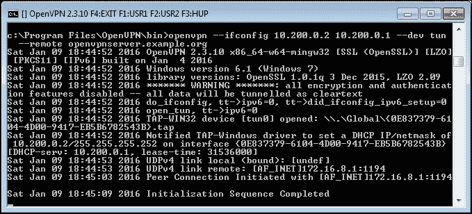

# 第一章。点对点网络

在本章中，我们将涵盖以下内容：

+   最简配置

+   OpenVPN 秘密密钥

+   多个秘密密钥

+   明文隧道

+   路由

+   配置文件与命令行

+   无 IP 配置

+   完整的站点对站点配置

+   三路路由

+   使用 IPv6

# 简介

本章的教程将介绍如何配置 OpenVPN。它们基于点对点类型的网络，这意味着每次只能连接一个客户端。

点对点网络在连接少数站点或客户端时非常有用。它的设置比较简单，因为不需要证书或**公钥基础设施**（**PKI**）。此外，由于不需要包含 `--iroute` 语句的特定客户端配置文件，路由配置也稍微简单一些。

点对点网络的缺点如下：

+   缺乏完美前向保密性——密钥泄露可能导致之前的会话完全泄露

+   秘密密钥必须以明文形式存在于每个 VPN 对等端

# 最简配置

本教程将解释使用 OpenVPN 时可能的最简配置。在此配置中，您需要两台通过网络（LAN 或 Internet）连接的计算机。我们将同时使用 TUN 类型网络和 TAP 类型网络，并重点关注它们之间的差异。TUN 设备主要用于仅传输 IP 流量的 VPN 隧道。而 TAP 设备则允许通过 OpenVPN 隧道传递所有以太网帧，因此支持非基于 IP 的协议，如 IPX 和 AppleTalk。

虽然乍一看这似乎没什么用，但它在快速测试 OpenVPN 是否能连接到远程系统时非常有用。

## 准备工作

在两台计算机上安装 OpenVPN 2.3.9 或更高版本。确保计算机已通过网络连接。在本教程中，服务器计算机运行的是 CentOS 6 Linux 和 OpenVPN 2.3.9，而客户端运行的是 Windows 7 Pro 64 位和 OpenVPN 2.3.10。

## 如何操作...

以下是你需要遵循的步骤：

1.  启动服务器端（监听）OpenVPN 进程，用于 TUN 类型网络：

    ```
     [root@server]# openvpn --ifconfig 10.200.0.1 10.200.0.2 \
     --dev tun

    ```

    ### 注意

    前述命令应该作为一行输入。字符 `\` 用于表示命令将在下一行继续。

1.  然后，启动客户端 OpenVPN 进程：

    ```
     [WinClient] C:\>"\Program Files\OpenVPN\bin\openvpn.exe" \
     --ifconfig 10.200.0.2 10.200.0.1 --dev tun \
     --remote openvpnserver.example.com

    ```

    以下截图显示了如何建立连接：

    

    一旦连接建立，我们就可以 ping 通隧道的另一端。

1.  接下来，通过按下命令窗口中的 ***F4*** 功能键停止隧道，并使用 TAP 设备重启隧道的两端。

1.  启动服务器端（监听）OpenVPN 进程，用于 TAP 类型网络：

    ```
    [root@server]# openvpn --ifconfig 10.200.0.1 255.255.255.0 \
     --dev tap

    ```

1.  然后启动客户端 OpenVPN 进程：

    ```
     [WinClient] C:\>"
    \Program Files\OpenVPN\bin\openvpn.exe" \
     --ifconfig 10.200.0.2 255.255.255.0 --dev tap \
     --remote openvpnserver.example.com

    ```

连接现在已经建立，我们可以再次 ping 通隧道的另一端。

## 它是如何工作的...

服务器监听 UDP 端口 `1194`，这是 OpenVPN 的默认端口，用于接收连接。客户端通过此端口连接到服务器。初始握手后，服务器将第一个可用的 TUN 设备配置为 IP 地址 `10.200.0.1`，并期望远端（对等地址）为 `10.200.0.2`。

客户端则执行相反的操作：在初始握手后，第一个 TUN 或 TAP-Win32 设备被配置为 IP 地址 `10.200.0.2`，并期望远端（对等地址）为 `10.200.0.1`。之后，VPN 被建立。

### 注意

请注意警告：

********* 警告 *******：所有加密和认证功能已禁用——所有数据将以明文方式传输**

在这里，数据并不安全：所有通过 VPN 隧道发送的数据都可以被读取！

## 还有更多...

我们来看一下几种不同的场景，并检查它们是否会修改过程。

### 使用 TCP 协议

在前面的示例中，我们选择了 UDP 协议。如果我们选择了 TCP 协议，实际上并不会有任何区别，前提是我们在服务器端（没有 `--remote` 的一方）和客户端都做了相同的设置。以下是服务器端实现该操作的代码：

```
[root@server]# openvpn --ifconfig 10.200.0.1 10.200.0.2 \
 --dev tun --proto tcp-server

```

以下是客户端的代码：

```
[root@client]# openvpn --ifconfig 10.200.0.2 10.200.0.1 \
 --dev tun --proto tcp-client --remote openvpnserver.example.com

```

### 在隧道中转发非 IP 流量

使用 TAP 风格接口，可以在隧道中运行非 IP 流量。例如，如果 AppleTalk 在两端正确配置，我们可以使用 `aecho` 命令查询远程主机：

```
aecho openvpnserver
22 bytes from 65280.1: aep_seq=0\. time=26\. ms
22 bytes from 65280.1: aep_seq=1\. time=26\. ms
22 bytes from 65280.1: aep_seq=2\. time=27\. ms

```

使用 `tcpdump -nnel -i tap0` 命令显示，流量类型确实是基于非 IP 的 AppleTalk。

# OpenVPN 秘密密钥

这个示例使用 OpenVPN 秘密密钥来保护 VPN 隧道。它与之前的示例非常相似，但这次我们将使用共享密钥来加密客户端和服务器之间的流量。

## 准备就绪

在两台计算机上安装 OpenVPN 2.3.9 或更高版本。确保两台计算机通过网络连接。在这个示例中，服务器计算机运行 CentOS 6 Linux 和 OpenVPN 2.3.9，而客户端运行 Windows 7 64 位和 OpenVPN 2.3.10。

## 如何操作...

1.  首先，在服务器端（监听端）生成一个密钥：

    ```
     [root@server]# openvpn --genkey --secret secret.key

    ```

1.  将此密钥通过安全通道（例如使用 `scp`）传输到客户端。

1.  接下来，启动服务器端（监听端）的 OpenVPN 进程：

    ```
     [root@server]# openvpn --ifconfig 10.200.0.1 10.200.0.2 \
     --dev tun --secret secret.key

    ```

1.  然后，启动客户端的 OpenVPN 进程：

    ```
     [WinClient] C:\>"\Program Files\OpenVPN\bin\openvpn.exe" \
     --ifconfig 10.200.0.2 10.200.0.1 \
     --dev tun --secret secret.key \
     --remote openvpnserver.example.com

    ```

连接已经建立，如下截图所示：


## 工作原理...

这个示例与第一个完全相同：服务器监听 UDP 端口 `1194` 上的传入连接，客户端通过该端口连接到服务器。初始握手后，服务器将第一个可用的 TUN 设备配置为 IP 地址 `10.200.0.1`，并期望远端（对等地址）为 `10.200.0.2`。客户端则执行相反的操作。

## 还有更多...

默认情况下，OpenVPN 在建立点对点连接时使用两个对称密钥：

+   用于加密交换数据包内容的加密密钥。

+   用于签署数据包的 HMAC 密钥。未使用适当 HMAC 密钥签署的数据包将立即被丢弃。这是防御“拒绝服务”攻击的第一道防线。

+   两端使用相同的密钥集，并且这两个密钥都是使用 `--secret` 参数指定的文件派生的。

OpenVPN 秘密密钥文件格式如下：

```
# 
# 2048 bit OpenVPN static key 
# 
-----BEGIN OpenVPN Static key V1----- 
<16 lines of random bytes> 
-----END OpenVPN Static key V1----- 

```

从随机字节中派生出 OpenVPN 加密和 HMAC 密钥。请注意，这些密钥对每个会话都是相同的。

## 另请参阅

+   下一个配方 *多个秘密密钥* 将详细解释秘密密钥的格式

# 多个秘密密钥

如前一配方所述，当建立点对点连接时，OpenVPN 使用两个对称密钥。但是，在点对点模式下也可以使用共享但非对称密钥。在这种情况下，OpenVPN 将使用四个密钥：

+   客户端的加密密钥

+   客户端的 HMAC 密钥

+   服务器端的加密密钥

+   服务器端的 HMAC 密钥

两端的点对点连接共享相同的密钥材料，但用于加密和签名数据的密钥在每一端是不同的。本配方解释了如何按此方式设置 OpenVPN，以及如何使密钥可见。

## 准备工作

对于此配方，我们使用上一个配方中的 `secret.key` 文件。在两台计算机上安装 OpenVPN 2.3.9 或更高版本。确保计算机通过网络连接。对于此配方，服务器计算机运行 CentOS 6 Linux 和 OpenVPN 2.3.9，客户端运行 Windows 7 64 位和 OpenVPN 2.3.10。我们将在此处使用 *OpenVPN 秘密密钥* 配方的 `secret.key` 文件。

## 如何实现...

1.  启动服务器端（监听）OpenVPN 进程时，使用额外的选项 `--secret` 参数和更详细的日志记录：

    ```
     [root@server]# openvpn \
     --ifconfig 10.200.0.1 10.200.0.2 \
     --dev tun --secret secret.key 0 \
     --verb 7

    ```

1.  然后启动客户端 OpenVPN 进程：

    ```
     [WinClient] C:\>"\Program Files\OpenVPN\bin\openvpn.exe" \
     --ifconfig 10.200.0.2 10.200.0.1 \
     --dev tun --secret secret.key 1\
     --remote openvpnserver \
     --verb 7

    ```

连接将建立并显示大量调试消息。

如果我们仔细查看服务器端消息（搜索 `crypt`），我们可以找到服务器端协商的密钥。请注意，输出已经重新格式化以增加清晰度：

```
... Static Encrypt: 
Cipher 'BF-CBC' initialized with 128 bit key 
... Static Encrypt:  
CIPHER KEY: 80797ddc 547fbdef 79eb353f 2a1f3d1f 
... Static Encrypt: 
Using 160 bit message hash 'SHA1' for HMAC authentication 
... Static Encrypt:  
HMAC KEY: c752f254 cc4ac230 83bd8daf 6141e73d 844764d8 
... Static Decrypt:  
Cipher 'BF-CBC' initialized with 128 bit key 
... Static Decrypt:  
CIPHER KEY: 8cf9abdd 371392b1 14b51523 25302c99 
... Static Decrypt:  
Using 160 bit message hash 'SHA1' for HMAC authentication 
... Static Decrypt:  
HMAC KEY: 39e06d8e 20c0d3c6 0f63b3e7 d94f35af bd744b27 

```

在客户端，我们将找到相同的密钥，但是“加密”和“解密”密钥将被反转：

```
... Static Encrypt:  
Cipher 'BF-CBC' initialized with 128 bit key 
... Static Encrypt:  
CIPHER KEY: 8cf9abdd 371392b1 14b51523 25302c99 
... Static Encrypt:  
Using 160 bit message hash 'SHA1' for HMAC authentication 
... Static Encrypt:  
HMAC KEY: 39e06d8e 20c0d3c6 0f63b3e7 d94f35af bd744b27 
... Static Decrypt:  
Cipher 'BF-CBC' initialized with 128 bit key 
... Static Decrypt:  
CIPHER KEY: 80797ddc 547fbdef 79eb353f 2a1f3d1f 
... Static Decrypt:  
Using 160 bit message hash 'SHA1' for HMAC authentication 
... Static Decrypt:  
HMAC KEY: c752f254 cc4ac230 83bd8daf 6141e73d 844764d8 

```

如果仔细查看密钥，您会发现每个密钥在客户端和服务器端都是镜像的。

## 工作原理...

OpenVPN 从 `static.key` 文件中派生所有密钥，前提是文件中有足够的熵（随机性）可靠地生成四个密钥。使用以下生成的所有密钥将具有足够的熵：

```
$ openvpn --genkey --secret secret.key

```

OpenVPN 静态密钥文件大小为 2,048 位。加密密钥每个为 128 位，而 HMAC 密钥每个为 160 位，总共为 776 位。这使得 OpenVPN 可以轻松地从静态密钥文件生成四个随机密钥，即使选择的加密方式需要更大的初始化密钥。

## 更多信息...

使用相同的秘密密钥文件，在客户端/服务器设置中，当使用 `tls-auth ta.key` 参数时。

## 参见

+   来自 第二章 的 *设置公钥和私钥* 配方，其中 `tls-auth` 密钥的生成方式与此非常相似。

# 明文隧道

在第一个示例中，我们创建了一个没有加密的数据流隧道。为了创建一个完全的明文隧道，我们还禁用了 HMAC 身份验证。这在调试连接问题时非常有用，因为现在可以轻松监控所有通过隧道的流量。在本例中，我们将看看如何做到这一点。这种隧道也在进行性能测量时非常有用，因为它是最不消耗 CPU 的隧道。

## 准备工作

在两台计算机上安装 OpenVPN 2.3.9 或更高版本。确保计算机通过网络连接。对于本例，服务器计算机运行的是 CentOS 6 Linux 和 OpenVPN 2.3.9，客户端计算机运行的是 Fedora 22 Linux 和 OpenVPN 2.3.10。

由于我们没有使用任何加密，因此不需要秘密密钥。

## 如何操作…

1.  启动服务器端（监听）OpenVPN 进程：

    ```
     [root@server]# openvpn \
     --ifconfig 10.200.0.1 10.200.0.2 \
     --dev tun --auth none

    ```

1.  然后启动客户端 OpenVPN 进程：

    ```
     [root@client]# openvpn \
     --ifconfig 10.200.0.2 10.200.0.1 \
     --dev tun --auth none\
     --remote openvpnserver.example.com

    ```

1.  连接将以以下两个警告消息作为输出：

    ```
     **... ******* WARNING *******: null cipher specified, no encryption will be 
                          used** 
     **... ******* WARNING *******: null MAC specified, no authentication will 
                          be used** 

    ```

## 它是如何工作的…

在此设置下，完全不进行加密。所有通过隧道发送的流量都封装在 OpenVPN 数据包中，然后按原样发送。

## 还有更多内容...

要实际查看流量，我们可以使用 `tcpdump`；按照以下步骤操作：

1.  按照概要设置连接。

1.  启动 `tcpdump`，并监听网络接口，而不是隧道接口本身：

    ```
     [root@client]# tcpdump -l -w -  -i eth0 -s 0 host 
               openvpnserver | strings

    ```

1.  现在，使用类似 `nc`（Netcat）这样的工具发送一些文本通过隧道。首先，在服务器端启动 `nc`：

    ```
     [server]$ nc -l 31000

    ```

1.  在客户端，启动 `nc` 命令的客户端模式并输入 `hello` 和 `goodbye`：

    ```
     [client]$ nc 10.200.0.1 3100
     hello
     goodbye

    ```

1.  在 `tcpdump` 窗口中，你现在应该能看到以下内容：

1.  按 *Ctrl* + *C* 终止 `tcpdump` 和 `nc`。

# 路由

点对点类型的网络非常适合如果你想通过静态、加密的隧道连接两个网络。如果你只有少数终端（少于四个），那么路由比使用 第二章 中描述的客户端/服务器设置要简单得多，*客户端-服务器 IP-only 网络*。

## 准备工作

对于本例，我们将使用以下网络布局：


在两台计算机上安装 OpenVPN 2.3.9 或更高版本。确保计算机通过网络连接。对于本例，服务器计算机运行的是 CentOS 6 Linux 和 OpenVPN 2.3.9，客户端计算机运行的是 Windows 7 64 位和 OpenVPN 2.3.10。我们将在这里使用来自 *OpenVPN 秘密密钥* 配方的 `secret.key` 文件。

## 如何操作…

1.  首先，建立连接，但也要确保 OpenVPN 已经将自己作为守护进程启动：

    ```
     [root@server]# openvpn \
     --ifconfig 10.200.0.1 10.200.0.2 \
     --dev tun --secret secret.key \
     --daemon --log /tmp/openvpnserver.log

    ```

1.  然后，启动客户端 OpenVPN 进程：

    ```
     [client]$ openvpn \
     --ifconfig 10.200.0.2 10.200.0.1 \
     --dev tun --secret secret.key \
     --remote openvpnserver \
     --daemon --log /tmp/openvpnclient.log

    ```

1.  连接已经建立：

    ```
     [server]$ tail -1 /tmp/openvpnserver.log
     Initialization Sequence Completed

    ```

现在我们添加路由：

1.  在服务器端，我们添加静态路由：

    ```
     [root@server]# route add -net 192.168.4.0/24 gw 10.200.0.2

    ```

1.  在客户端，我们需要做两件事：

    确保已启用 IP 流量转发。在 Linux 上，可以通过以下方式实现：

    ```
     [root@client]# sysctl -w net.ipv4.ip_forward=1

    ```

    ### 注意

    请注意，这个设置在系统重启后不会保存。

    在客户端局域网的 Windows 客户端上，确保有一条返回 OpenVPN 服务器的路由：

    ```
     C:> route add 10.200.0.0 mask 255.255.255.0 192.168.4.5

    ```

    ### 注意

    在这里，`192.168.4.5` 是 OpenVPN 客户端的局域网 IP 地址。

1.  从服务器端，我们现在可以 ping 客户端局域网中的机器。首先，ping OpenVPN 客户端的局域网 IP 地址：

    ```
     [root@server]# ping -c 2 192.168.4.5
     PING 192.168.4.5 (192.168.4.5) 56(84) bytes of data.
     64 bytes from 192.168.4.5: icmp_seq=0 ttl=64 time=31.7 ms
     64 bytes from 192.168.4.5: icmp_seq=1 ttl=64 time=31.3 ms
     --- 192.168.4.5 ping statistics ---
     2 packets transmitted, 2 received, 0% packet loss, time 
     1000ms
     rtt min/avg/max/mdev = 31.359/31.537/31.716/0.251 ms, pipe 2

    ```

1.  然后，ping OpenVPN 客户端局域网中某台机器的局域网 IP 地址：

    ```
     [root@server]# ping -c 2 192.168.4.164
     [server]$ ping -c 2 192.168.4.164
     PING 192.168.4.164 (192.168.4.164) 56(84) bytes of data.
     64 bytes from 192.168.4.164: icmp_seq=0 ttl=63 time=31.9 ms
     64 bytes from 192.168.4.164: icmp_seq=1 ttl=63 time=31.4 ms
     --- 192.168.4.164 ping statistics ---
     2 packets transmitted, 2 received, 0% packet loss, time 
     1001ms
     rtt min/avg/max/mdev = 31.486/31.737/31.989/0.308 ms, pipe 2

    ```

## 工作原理...

在我们的网络设置中，我们要到达的局域网位于 OpenVPN 客户端之后，所以我们必须添加到服务器的路由：

```
[server]$ route add -net 192.168.4.0/24 gw 10.200.0.2

```

在客户端，我们需要做两件事：

+   确保启用了路由。如果你希望在重启后路由保持启用，请编辑`/etc/sysctl.cnf` 文件：

    ```
            net.ipv4.ip_forward = 1 

    ```

+   我们还需要确保在客户端局域网中有一条返回 OpenVPN 服务器的路由。这可以通过添加到局域网网关的路由或为客户端局域网中的每台机器添加静态路由来完成。在这个例子中，我们为与 OpenVPN 客户端位于同一局域网的 Windows 客户端添加了一条路由：

    ```
     C:> route add 10.200.0.0 mask 255.255.255.0 192.168.4.5

    ```

在这里，`192.168.4.5` 是 OpenVPN 客户端的局域网 IP 地址。

## 还有更多内容...

让我们讨论一下路由问题以及如何自动化设置。

### 路由问题

在 OpenVPN 用户邮件列表中，报告的许多问题都与路由问题有关。大多数问题与 OpenVPN 本身关系不大，而更多的是与理解路由和网络中数据包流动相关。第七章，*排除 OpenVPN 故障 - 路由* 提供了一些解决最常见路由问题的方案。

### 自动化设置

也可以在隧道首次建立时添加适当的路由。这可以通过使用 `--route` 语句来完成：

```
[server]$ openvpn \
 --ifconfig 10.200.0.1 10.200.0.2 \
 --dev tun --secret secret.key \
 --daemon --log /var/log/openvpnserver-1.5.log \
 --route 192.168.4.0 255.255.255.0

```

请注意，在客户端局域网中，返回服务器的路由仍然需要手动设置。

## 另见

+   本章后面会介绍*三路路由*方案，涉及使用三个远程站点的更复杂设置。

+   第七章，*排除 OpenVPN 故障 - 路由*

# 配置文件与命令行

本书中的大多数食谱可以在不使用配置文件的情况下完成。然而，在大多数实际情况中，配置文件比冗长的命令行更易于使用。重要的是要知道，OpenVPN 实际上将配置文件条目和命令行参数视为相同。唯一的区别是，所有命令行参数都以双短划线（`--`）开头，而配置文件条目则没有。这使得通过额外的命令行参数覆盖配置文件条目变得非常容易。

## 准备工作

在两台计算机上安装 OpenVPN 2.3.9 或更高版本。确保这两台计算机通过网络连接。在这个食谱中，服务器计算机运行的是 CentOS 6 Linux 和 OpenVPN 2.3.9，客户端运行的是 Windows 7 64 位和 OpenVPN 2.3.10。在本食谱中，我们将使用来自 *OpenVPN 秘密密钥* 食谱的 `secret.key` 文件。

## 如何做...

1.  基于之前的食谱创建一个配置文件：

    ```
     dev tun
     port 1194
     ifconfig 10.200.0.1 10.200.0.2
     secret secret.key 
     remote openvpnserver.example.com
     verb 3

    ```

1.  将此文件保存为 `example1-6-client.conf`。

1.  在非标准端口上启动服务器端（监听）OpenVPN 进程：

    ```
     [root@server]# openvpn \
     --ifconfig 10.200.0.1 10.200.0.2 \
     --dev tun --secret secret.key \
     --port 11000

    ```

1.  然后启动客户端 OpenVPN 进程并添加一个额外的命令行参数：

    ```
     [WinClient] C:\>"\Program Files\OpenVPN\bin\openvpn.exe" \
     --config client.conf \
     --port 11000

    ```

连接已建立：

```
Jan 11 16:14:04 2016 UDPv4 link local (bound): [undef]
Jan 11 16:14:04 2016 UDPv4 link remote: [AF_INET]172.16.8.1:11000
Jan 11 16:14:06 2016 Peer Connection Initiated with [AF_INET]172.16.8.1:11000
Jan 11 16:14:12 2016 TEST ROUTES: 0/0 succeeded len=0 ret=1 a=0 u/d=up
Jan 11 16:14:12 2016 Initialization Sequence Completed

```

## 它是如何工作的...

命令行和配置文件是从左到右、从上到下读取和解析的。这意味着在配置文件之前指定的大多数选项可以被文件中的条目覆盖。类似地，在以下指令之后指定的选项将覆盖文件中的条目：

```
--config client.conf

```

因此，以下选项覆盖了配置文件中的 "`port 1194`" 行：

```
--port 11000

```

然而，一些选项可以指定多次，在这种情况下，第一个出现的“获胜”。在这种情况下，也可以在指定`--config`指令之前先指定该选项。

## 还有更多...

这是另一个示例，展示了命令行参数顺序的重要性：

```
C:\>"\Program Files\OpenVPN\bin\openvpn.exe" \
 --verb 0 \
 --config client.conf \
 --port 11000

```

这将产生与之前所示完全相同的连接日志。来自`client.conf`配置文件中的`verb 3`命令覆盖了命令行中指定的`--verb 0`。然而，请参阅以下命令行：

```
C:\>"\Program Files\OpenVPN\bin\openvpn.exe" \
 --config client.conf \
 --port 11000 \
 --verb 0

```

使用此命令行，连接日志将保持完全为空，但 VPN 连接将处于正常工作状态。

### 规则的例外

OpenVPN 的一些新特性略微偏离了这一原则，最显著的是`<connection>`块和内联证书。有些人更喜欢写下以下命令：

```
remote openvpnserver.example.com 1194

```

他们更喜欢这样，而不是以下命令：

```
port 1194
remote openvpnserver.example.com

```

这种表示法的缺点是，OpenVPN 将其解释为连接块。对于连接块，不能通过`--port 11000`来覆盖端口。

# 完整的站点到站点设置

在这个食谱中，我们设置了一个完整的站点到站点网络，使用了 OpenVPN 提供的大多数内置安全功能。它旨在作为一个“全方位”的示例，展示如何设置点对点网络。

## 准备工作

在两台计算机上安装 OpenVPN 2.3.9 或更高版本。确保计算机通过网络连接。对于此配方，服务器计算机运行的是 CentOS 6 Linux 和 OpenVPN 2.3.9，客户端运行的是 Fedora 22 Linux 和 OpenVPN 2.3.10。我们将在这里使用`secret.key`文件，从*OpenVPN 密钥*配方中获取。

我们将使用以下网络布局：


确保在服务器和客户端上配置了路由（IP 转发）。

## 如何做到...

1.  创建服务器配置文件：

    ```
            dev tun 
            proto udp 
            local  openvpnserver.example.com 
            lport  1194 
            remote openvpnclient.example.com 
            rport  1194 

            secret secret.key 0 
            ifconfig 10.200.0.1 10.200.0.2 
            route 192.168.4.0 255.255.255.0 

            user  nobody 
            group nobody  # use "group nogroup" on some distros 
            persist-tun 
            persist-key 
            keepalive 10 60 
            ping-timer-rem 

            verb 3 
            daemon 
            log-append /tmp/openvpn.log 

    ```

1.  将其保存为`example1-7-server.conf`。

1.  在客户端上，创建配置文件：

    ```
            dev tun 
            proto udp 
            local  openvpnclient.example.com 
            lport  1194 
            remote openvpnserver.example.com 
            rport  1194 

            secret secret.key 1 
            ifconfig 10.200.0.2 10.200.0.1 
            route 172.31.32.0 255.255.255.0 

            user  nobody 
            group nobody  # use "group nogroup" on some distros 
            persist-tun 
            persist-key 
            keepalive 10 60 
            ping-timer-rem 

            verb 3 
            daemon 
            log-append /tmp/openvpn.log 

    ```

1.  将其保存为`example1-7-client.conf`。

1.  然后在两端启动隧道。以下是服务器端的操作：

    ```
     [root@server]# openvpn --config example1-7-server.conf

    ```

    这是客户端端的代码：

    ```
     [root@client]# openvpn --config example1-7-client.conf

    ```

    现在我们的站点到站点隧道已建立。

1.  检查客户端和服务器的日志文件，以验证连接是否已建立。

1.  连接建立后，可以通过 OpenVPN 隧道访问两端后面的 LAN 上的计算机。例如，当我们从服务器上 ping 客户端侧 LAN 上的一台机器时，我们将看到以下内容：

## 工作原理...

客户端和服务器配置文件非常相似：

+   服务器仅在一个接口和一个 UDP 端口上侦听

+   服务器仅接受来自单个 IP 地址和端口的连接

+   客户端也有这些选项镜像

这里是一组配置选项：

```
user  nobody 
group nobody 
persist-tun 
persist-key 
keepalive 10 60 
ping-timer-rem 

```

这些选项用于使连接更加健壮和安全，如下所示：

在初始连接建立后，OpenVPN 进程以用户`nobody`和组`nobody`运行。即使有人能够控制 OpenVPN 进程本身，他或她仍然只能是`nobody`，而不是`root`。请注意，在某些 Linux 发行版上，使用的是`nogroup`而不是`nobody`。

`persist-tun`和`persist-key`选项用于确保如果底层网络中断，连接会自动恢复。在使用`user nobody`和`group nobody`（或`group nogroup`）时，这些选项是必需的。

`keepalive`和`ping-timer-rem`选项使 OpenVPN 定期通过隧道发送“ping”消息，以确保隧道的两端保持运行状态。

## 还有更多...

这种点对点设置也可以用来规避严格的防火墙。两个端点之间的数据流是不可识别的，而且非常难以解密。当 OpenVPN 在客户端/服务器模式下运行（参见第二章，*客户端-服务器 IP-only 网络*）时，由于初始的 TLS 握手，流量是可识别的作为 OpenVPN 流量。

## 另请参阅

+   本章中的最后一个配方，*使用 IPv6*，它在此基础上增加了对 IPv6 流量的支持。

+   第七章，*OpenVPN 故障排除 - 路由*，其中解释了最常见的路由问题

# 三向路由

对于少量（少于四个）固定端点，点对点设置非常灵活。在本示例中，我们在三个站点之间设置了三条 OpenVPN 隧道，包括端点之间的路由。通过设置三条隧道，我们创建了冗余路由，从而确保即使其中一条隧道中断，所有站点仍然能够连接。

## 准备就绪

在两台计算机上安装 OpenVPN 2.3.9 或更高版本。确保这两台计算机通过网络连接。在本示例中，服务器计算机运行 CentOS 6 Linux 和 OpenVPN 2.3.9，客户端计算机运行 Fedora 22 Linux 和 OpenVPN 2.3.10。

我们将使用以下网络布局：


确保在所有 OpenVPN 端点上配置了路由（IP 转发）。

## 如何操作...

1.  我们生成了三个静态密钥：

    ```
     [root@siteA]# openvpn --genkey --secret AtoB.key
     [root@siteA]# openvpn --genkey --secret AtoC.key
     [root@siteA]# openvpn --genkey --secret BtoC.key

    ```

1.  通过安全通道（例如，使用 `scp`）将这些密钥传输到所有端点。

1.  创建名为 `example1-8-serverBtoA.conf` 的服务器（监听器）配置文件：

    ```
            dev tun 
            proto udp 
            port  1194 

            secret AtoB.key 0 
            ifconfig 10.200.0.1 10.200.0.2 

            route 192.168.4.0 255.255.255.0 vpn_gateway 5 
            route 192.168.6.0 255.255.255.0 vpn_gateway 10 
            route-delay 

            keepalive 10 60 
            verb 3 

    ```

1.  接下来，创建一个 `example1-8-serverCtoA.conf` 文件：

    ```
            dev tun 
            proto udp 
            port  1195 

            secret AtoC.key 0 
            ifconfig 10.200.0.5 10.200.0.6 

            route 192.168.4.0 255.255.255.0 vpn_gateway 5 
            route 192.168.5.0 255.255.255.0 vpn_gateway 10 
            route-delay 

            keepalive 10 60 
            verb 3 

    ```

1.  另外，创建一个 `example1-8-serverBtoC.conf` 文件：

    ```
            dev tun 
            proto udp 
            port  1196 

            secret BtoC.key 0 
            ifconfig 10.200.0.9 10.200.0.10 

            route 192.168.4.0 255.255.255.0 vpn_gateway 10 
            route 192.168.6.0 255.255.255.0 vpn_gateway 5 
            route-delay 

            keepalive 10 60 
            verb 3 

    ```

1.  现在，创建客户端（连接器）配置文件，`example1-8-clientAtoB.conf`：

    ```
            dev tun 
            proto udp 
            remote siteB 
            port  1194 

            secret AtoB.key 1 
            ifconfig 10.200.0.2 10.200.0.1 

            route 192.168.5.0 255.255.255.0 vpn_gateway 5 
            route 192.168.6.0 255.255.255.0 vpn_gateway 10 
            route-delay 

            keepalive 10 60 
            verb 3 

    ```

1.  另外，创建一个 `example1-8-clientAtoC.conf` 文件：

    ```
            dev tun 
            proto udp 
            remote siteC 
            port  1195 

            secret AtoC.key 1 
            ifconfig 10.200.0.6 10.200.0.5 

            route 192.168.5.0 255.255.255.0 vpn_gateway 10 
            route 192.168.6.0 255.255.255.0 vpn_gateway 5 
            route-delay 

            verb 3 

    ```

1.  最后，创建 `example1-8-clientCtoB.conf` 文件：

    ```
            dev tun 
            proto udp 
            remote siteB 
            port  1196 

            secret BtoC.key 1 
            ifconfig 10.200.0.10 10.200.0.9 

            route 192.168.4.0 255.255.255.0 vpn_gateway 10 
            route 192.168.5.0 255.255.255.0 vpn_gateway 5 
            route-delay 

            keepalive 10 60 
            verb 3 

    ```

首先，我们启动所有监听隧道：

```
[root@siteB]# openvpn --config example1-8-serverBtoA.conf
[root@siteB]# openvpn --config example1-8-serverBtoC.conf
[root@siteC]# openvpn --config example1-8-serverCtoA.conf

```

接下来是连接器隧道：

```
[root@siteA]# openvpn --config example1-8-clientAtoB.conf
[root@siteA]# openvpn --config example1-8-clientAtoC.conf
[root@siteC]# openvpn --config example1-8-clientCtoB.conf

```

到此为止，我们建立了一个三方站点到站点的网络。

## 它是如何工作的...

可以明显看到，配置文件的数量很快就会失控。原则上，两个隧道足以连接三个远程站点，但那样就没有冗余了。

使用第三条隧道和配置选项，每个远程网络始终有两条可用路由：

```
route 192.168.5.0 255.255.255.0 vpn_gateway 5
route 192.168.6.0 255.255.255.0 vpn_gateway 10
route-delay
keepalive 10 60

```

例如，站点 A 有两条通往站点 B 的路由（LAN `192.168.5.0`/`24`），如下所示的路由表所示：

```
[siteA]$ ip route show
[...]
192.168.5.0/24 via 10.200.0.1 dev tun0  metric 5
192.168.5.0/24 via 10.200.0.5 dev tun1  metric 10
[...]

```

这是通往站点 A 的两条路由：

+   通过“直接”隧道到站点 B；此路由的度量值最低。

+   通过间接隧道：首先到站点 C，然后到站点 B；此路由的度量值较高，直到第一条路由断开才会被选择。

这个设置的优点是，如果一条隧道失败，60 秒后，连接及其相应路由会被丢弃并重新启动。然后，通往另一个网络的备份路由会自动接管，所有三个站点可以重新互通。

当直接隧道恢复时，直接路由也会恢复，网络流量将自动选择通往远程站点的最佳路径。

## 还有更多内容...

让我们讨论一下可扩展性和路由协议。

### 可扩展性

在此配方中，我们连接三个远程站点。这导致提供点对点设置限制的六个不同配置文件。一般来说，要连接*n*个可能的站点并实现完全冗余，您将需要*n * ( n - 1 )*个配置文件。对于最多四个站点，这是可以管理的，但在那之后，如下一章节所述的服务器/多客户端设置要容易得多。

### 路由协议

为增加网络的可用性，最好运行路由协议，如 RIPv2 或 OSPF。使用路由协议，故障路由被发现得更快，从而减少网络停机时间。

## 另请参阅

+   第七章, *OpenVPN 故障排除 - 路由*，其中解释了最常见的路由问题

# 使用 IPv6

在此配方中，我们将完整的站点到站点网络配方扩展到支持 IPv6。

## 准备就绪

在两台计算机上安装 OpenVPN 2.3.9 或更高版本。确保计算机通过网络连接。对于此配方，服务器计算机运行 CentOS 6 Linux 和 OpenVPN 2.3.9，客户端运行 Fedora 22 Linux 和 OpenVPN 2.3.10。我们将在此处使用*OpenVPN 秘密密钥*配方中的`secret.key`文件。

我们将使用以下网络布局：


## 操作步骤...

1.  创建服务器配置文件：

    ```
            dev tun 
            proto udp 
            local  openvpnserver.example.com 
            lport  1194 
            remote openvpnclient.example.com 
            rport  1194 

            secret secret.key 0 
            ifconfig 10.200.0.1 10.200.0.2 
            route 192.168.4.0 255.255.255.0 

            tun-ipv6 
            ifconfig-ipv6 2001:db8:100::1 2001:db8:100::2 

            user  nobody 
            group nobody  # use "group nogroup" on some distros 
            persist-tun 
            persist-key 
            keepalive 10 60 
            ping-timer-rem 

            verb 3 
            daemon 
            log-append /tmp/openvpn.log 

    ```

1.  将其保存为`example1-9-server.conf`。

1.  在客户端上，创建配置文件：

    ```
            dev tun 
            proto udp 
            local  openvpnclient.example.com 
            lport  1194 
            remote openvpnserver.example.com 
            rport  1194 

            secret secret.key 1 
            ifconfig 10.200.0.2 10.200.0.1 
            route 172.31.32.0 255.255.255.0 

            tun-ipv6 
            ifconfig-ipv6 2001:db8:100::2 2001:db8:100::1 

            user  nobody 
            group nobody  # use "group nogroup" on some distros 
            persist-tun 
            persist-key 
            keepalive 10 60 
            ping-timer-rem 

            verb 3 

    ```

1.  将其保存为`example1-9-client.conf`。

1.  然后在两端启动隧道。以下是服务器端的操作：

    ```
     [root@server]# openvpn --config example1-9-server.conf

    ```

    这是客户端端的代码：

    ```
     [root@client]# openvpn --config example1-9-client.conf

    ```

    现在我们的站点到站点隧道已建立。

1.  连接建立后，可以通过 OpenVPN 隧道访问两端后面的 LAN 上的机器。请注意，客户端 OpenVPN 会话在前台运行。

1.  接下来，ping 服务器端点的 IPv6 地址，以验证隧道上的 IPv6 流量是否正常工作：

    ```
             [client]$ ping6 -c 4 2001:db8:100::1
             PING 2001:db8:100::1(2001:db8:100::1) 56 data bytes
             64 bytes from 2001:db8:100::1: icmp_seq=1 ttl=64 time=7.43 ms
             64 bytes from 2001:db8:100::1: icmp_seq=2 ttl=64 time=7.54 ms
             64 bytes from 2001:db8:100::1: icmp_seq=3 ttl=64 time=7.77 ms
             64 bytes from 2001:db8:100::1: icmp_seq=4 ttl=64 time=7.42 ms
             --- 2001:db8:100::1 ping statistics ---
             4 packets transmitted, 4 received, 0% packet loss, time 3005ms
             rtt min/avg/max/mdev = 7.425/7.546/7.778/0.177 ms

    ```

1.  最后，通过按下*Ctrl* + *C* 中止客户端会话。以下截图列出了完整的客户端日志：

## 工作原理...

客户端和服务器配置文件与*完整站点到站点设置*配方中的配置文件非常相似，只是添加了以下两行：

```
tun-ipv6 
ifconfig-ipv6 2001:db8:100::2 2001:db8:100::1 

```

这使得 IPv6 支持成为可能，除了默认的 IPv4 支持。

此外，在客户端配置中，选项`daemon`和`log-append`不存在，因此所有 OpenVPN 输出都发送到屏幕上，进程继续在前台运行。

## 还有更多...

让我们稍微谈谈日志文件错误和仅 IPv6 隧道。

### 记录文件错误

如果我们仔细查看客户端连接输出，我们将在按下***Ctrl*** + ***C***后看到一些错误消息，尤其是以下内容：

```
RTNETLINK answers: operation not permitted 

```

当您使用`user nobody`选项保护 OpenVPN 设置时，这是一个副作用，它经常让新用户感到困惑。发生的情况是：

OpenVPN 以 `root` 身份启动，打开适当的 `tun` 设备，并在该 `tun` 接口上设置正确的 IPv4 和 IPv6 地址。

为了额外的安全性，OpenVPN 然后切换到 `nobody`，放弃与 `root` 关联的所有特权。

当 OpenVPN 终止时（在我们的情况下，通过按下 ***Ctrl*** +  ***C***），它关闭了对 `tun` 设备的访问，并尝试移除分配给该设备的 IPv4 和 IPv6 地址。此时，错误消息会出现，因为 `nobody` 没有权限执行这些操作。

在 OpenVPN 进程终止时，Linux 内核关闭了 `tun` 设备，并移除了所有配置设置。

在这种情况下，这些错误消息是无害的，但一般来说，应该密切关注 OpenVPN 打印的警告和错误消息。

### IPv6-only 隧道

使用 OpenVPN 2.3，IPv6-only 隧道需要始终启用 IPv4 支持。从 OpenVPN 2.4 开始，可以设置一个仅支持 IPv6 的连接。

## 另请参阅

本章前面的配方 *完整的站点到站点设置*，其中详细解释了 IPv4-only 站点到站点设置。

第六章 的最后一个配方，*OpenVPN 故障排除 - 配置*，详细解释了如何解释 OpenVPN 日志文件。
