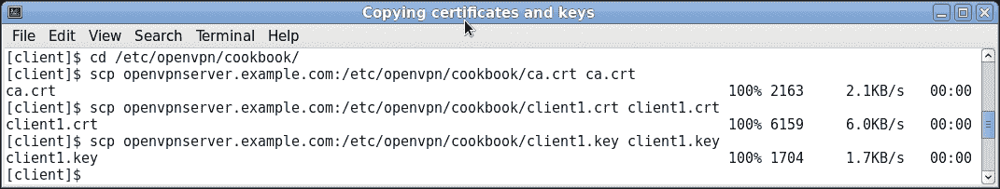

# 第二章：客户端-服务器 IP 专用网络

在本章中，我们将覆盖以下主题：

+   设置公钥和私钥

+   简单配置

+   服务器端路由

+   添加 IPv6 支持

+   使用 `client-config-dir` 文件

+   路由 - 双方的子网

+   重定向默认网关

+   重定向 IPv6 默认网关

+   使用 `ifconfig-pool` 块

+   使用状态文件

+   管理接口

+   Proxy-arp

# 介绍

本章中的配方将涵盖 OpenVPN 最常用的部署模型：一台服务器与多个远程客户端，能够路由 IP 流量。

除了客户端和服务器端的管理接口使用外，我们还将查看几种常见的路由配置。

本章的最后一个配方将展示如何避免在大多数实际用例中使用网络桥接。

由于路由的 TUN 样式设置是最常用的部署模型，本章中介绍的一些示例配置文件将在全书中重复使用。特别是，像 `basic-udp-server.conf`、`basic-udp-client.conf`、`basic-tcp-server.conf` 和 `basic-tcp-client.conf` 这样的配置文件将在 *服务器端路由* 配方中频繁使用，此外，来自 *使用 ifconfig-pool 块* 配方的 Windows 客户端配置文件 `basic-udp-client.ovpn` 和 `basic-tcp-client.ovpn` 也将经常被重用。

# 设置公钥和私钥

在我们设置客户端/服务器 VPN 之前，我们需要设置公钥基础设施（PKI）。PKI 包括证书颁发机构、私钥以及客户端和服务器的证书（公钥）。我们还需要生成一个 Diffie-Hellman 参数文件，这是实现完美前向保密所必需的。

要设置 PKI，我们使用 `easy-rsa` 脚本。这些脚本最初是与 OpenVPN 分发包一起提供的，但如今也可以单独下载和安装。

## 准备就绪

PKI 需要在受信任的计算机上设置。它可以与运行 OpenVPN 服务器的计算机相同，但从安全角度来看，最好将 PKI 完全与 OpenVPN 服务分开。一个选择是将 PKI 证书颁发机构（CA）密钥保存在一个外部磁盘上，只有在需要时才连接。另一个选择是将 CA 私钥保存在一台完全不连接任何网络的计算机上。

本配方是在 Linux 上完成的，但也可以在 Mac OS 机器上完成。在 Windows 上，命令也非常相似。Linux 中的 `easy-rsa` 脚本设计为在类 bash 的 shell 中运行，因此确保您没有在运行 csh/tcsh（UNIX shell）。

## 如何操作…

1.  为 PKI 创建目录，并将 `easy-rsa` 分发包从您的 OpenVPN 安装目录复制过来：

    ```
     $ mkdir -m 700 -p /etc/openvpn/cookbook/keys
     $ cd /etc/openvpn/cookbook
     $ cp -drp /usr/share/easy-rsa/2.0/* .

    ```

    ### 注意

    请注意，只要允许用户创建上述目录路径，就不需要以`root`用户身份运行这些命令。

1.  接下来，我们设置`vars`文件。创建一个包含以下内容的文件：

    ```
            export EASY_RSA=/etc/openvpn/cookbook 
            export OPENSSL="openssl" 
            export PKCS11TOOL="pkcs11-tool" 
            export GREP="grep" 
            export KEY_CONFIG=`$EASY_RSA/whichopensslcnf $EASY_RSA` 
            export KEY_DIR="$EASY_RSA/keys" 
            export PKCS11_MODULE_PATH="dummy" 
            export PKCS11_PIN="dummy" 
            export KEY_SIZE=2048 
            export CA_EXPIRE=3650 
            export KEY_EXPIRE=1000 
            export KEY_COUNTRY="US" 
            export KEY_PROVINCE= 
            export KEY_CITY= 
            export KEY_ORG="Cookbook 2.4" 
            export KEY_OU= 
            export KEY_CN= 
            export KEY_EMAIL="openvpn@example.com" 

    ```

    ### 注意

    请注意，即使您不使用智能卡，`PKCS11_MODULE_PATH`和`PKCS11_PIN`条目也是必需的。

    还需要注意的是，一些`KEY_`变量被设置为空值。这是批量生成证书时所必需的，稍后我们会看到。

    默认的`KEY_SIZE`为 2048 位，足够保证未来几年内的安全性。虽然可以选择更大的密钥大小（4096 位），但这样会带来性能损失。我们将生成一个 4096 位的 CA 私钥，因为在这里性能不是问题。

    调整设置（`KEY_ORG`、`KEY_OU`、`KEY_EMAIL`）以反映您的组织。这些设置的含义将在后面更详细地解释。

1.  来源文件`vars`，并生成 CA 私钥和证书，使用 4096 位模数。为 CA 证书选择一个强密码。之后，每当脚本要求输入时，只需按*Enter*键：

    ```
     $ cd /etc/openvpn/cookbook
     $ . ./vars
     $ ./clean-all
     $ KEY_SIZE=4096 ./build-ca --pass

    ```

    以下截图显示了示例输出：

    

1.  接下来，我们构建服务器证书。由于我们不希望在每个证书中都包含电子邮件地址，因此我们将`KEY_EMAIL`变量设置为空值。当脚本要求输入时，按*Enter*键。当脚本要求输入 CA 私钥（`ca.key`）密码时，输入 CA 证书的密码。最后，当脚本要求输入`[y/n]`时，输入`y`：

    ```
            $ export KEY_EMAIL=
            $ ./build-key-server openvpnserver
            Generating a 2048 bit RSA private key

     ............................................................
            ............................+++
    ...........................................+++
            writing new private key to 'openvpnserver.key'
            -----
            You are about to be asked to enter information that will be 
            incorporated
            into your certificate request.
            What you are about to enter is what is called a Distinguished 
            Name or a DN.
            There are quite a few fields but you can leave some blank
            For some fields there will be a default value,
            If you enter '.', the field will be left blank.
            -----
            Country Name (2 letter code) [US]:
            State or Province Name (full name) []:
            Locality Name (eg, city) []:
            Organization Name (eg, company) [Cookbook 2.4]:
            Organizational Unit Name (eg, section) []:
            Common Name (eg, your name or your server's hostname)         
            [openvpnserver]:
                Name []:
                Email Address []:
            Please enter the following 'extra' attributes
            to be sent with your certificate request
            A challenge password []:
            An optional company name []:
            Using configuration from /etc/openvpn/cookbook/openssl-
            1.0.0.cnf
            Enter pass phrase for /etc/openvpn/cookbook/keys/ca.key:
            Check that the request matches the signature
            Signature ok
            The Subject's Distinguished Name is as follows
            countryName           :PRINTABLE:'US'
            organizationName      :PRINTABLE:'Cookbook 2.4'
            commonName            :PRINTABLE:'openvpnserver'
            Certificate is to be certified until Oct 13 17:49:24 2018 GMT 
            (1000 days)
            Sign the certificate? [y/n]:y
            1 out of 1 certificate requests certified, commit? [y/n]y
            Write out database with 1 new entries
            Data Base Updated

    ```

1.  第一个客户端证书以批量方式生成。这是一种非常快速的生成客户端证书的方法，但无法在客户端的私钥文件上设置密码。仍然需要输入`ca.key`的密码：

    ```
     $ ./build-key --batch client1

    ```

    以下截图显示了示例输出：

    

1.  第二个客户端证书生成时设置了密码。选择一个强密码（但与 CA 证书密码不同！）。为了简洁起见，输出已简化：

    ```
            $ ./build-key-pass --batch client2
            Generating a 2048 bit RSA private key
            ............+++
            ...............+++
            writing new private key to 'client2.key'
            Enter PEM pass phrase:
            Verifying - Enter PEM pass phrase:
            -----
            Using configuration from /etc/openvpn/cookbook/openssl-
            1.0.0.cnf
            Enter pass phrase for /etc/openvpn/cookbook/keys/ca.key:
            Check that the request matches the signature
            Signature ok
            The Subject's Distinguished Name is as follows
            countryName           :PRINTABLE:'US'
            organizationName      :PRINTABLE:'Cookbook 2.4'
            commonName            :PRINTABLE:'client2'
            Certificate is to be certified until Oct 13 17:59:15 2018 GMT 
            (1000 days)
            Write out database with 1 new entries
            Data Base Updated

    ```

1.  接下来，构建服务器的 Diffie-Hellman 参数文件：

1.  最后，生成`tls-auth`密钥文件：

    ```
     $ openvpn --genkey --secret ta.key

    ```

## 它是如何工作的...

`easy-rsa`脚本是一组方便的包装脚本，封装了一些`openssl ca`命令。`openssl ca`命令通常用于使用 X509 证书设置公钥基础设施（PKI）。`build-dh`脚本是`openssl dh`命令的包装器。

## 还有更多内容...

`easy-rsa`脚本提供了完整的 PKI 设置，支持不同平台和许多设置。这里概述了一些设置。

### 在 Windows 上使用 easy-rsa 脚本

要在 Windows 上使用`easy-rsa`脚本，需要一个命令窗口（`cmd.exe`），并且需要去掉所有命令前的`./`，例如：

```
[Win]C:> vars
[Win]C:> clean-all
[Win]C:> build-ca

```

### 关于不同变量的一些说明

以下变量在`vars`文件中设置：

+   `KEY_SIZE=2048`：这是所有私钥的加密强度。密钥越长，加密越强。但遗憾的是，它也会使加密过程变慢。

+   `CA_EXPIRE=3650`：这表示 CA 证书的有效天数，转换为 10 年。对于中等安全性配置，这是可以接受的；但是，如果需要更强的安全性，这个值需要降低。

+   `KEY_EXPIRE=1000`：这表示客户端证书在服务器上的有效天数，大约为 3 年。

+   `KEY_COUNTRY="US"`、`KEY_PROVINCE=`、`KEY_CITY=`、`KEY_ORG="Cookbook 2.4"`、`KEY_EMAIL=openvpn@example.com`：这些变量用于形成证书的**区分名称**（**DN**）。虽然它们不是必需的，但 OpenVPN 和 OpenSSL 都建议至少使用 `KEY_COUNTRY` 来指明证书的颁发地点。

## 另请参见

+   参见 第四章，*PKI、证书和 OpenSSL*，以了解 `easy-rsa` 脚本和 `openssl` 命令的更详细介绍。

# 简单配置

本配方将演示如何使用证书在客户端或服务器模式下建立连接。

## 准备工作

在两台计算机上安装 OpenVPN 2.3.9 或更高版本。确保这两台计算机通过网络连接。使用前面的配方设置客户端和服务器证书。在这个例子中，服务器计算机运行 CentOS 6 Linux 和 OpenVPN 2.3.9，客户端运行 Fedora 22 Linux 和 OpenVPN 2.3.10。

## 如何操作...

1.  创建服务器配置文件：

    ```
            proto udp 
            port 1194 
            dev tun 
            server 10.200.0.0 255.255.255.0 

            ca   /etc/openvpn/cookbook/ca.crt 
            cert /etc/openvpn/cookbook/server.crt 
            key  /etc/openvpn/cookbook/server.key 
            dh   /etc/openvpn/cookbook/dh2048.pem 

    ```

    然后将其保存为 `example2-2-server.conf`。

1.  从 `/etc/openvpn/cookbook/keys` 目录复制公钥证书和服务器私钥：

    ```
     [server]$ cd /etc/openvpn/cookbook
     [server]$ cp keys/ca.crt ca.crt
     [server]$ cp keys/openvpnserver.crt server.crt
     [server]$ cp keys/openvpnserver.key server.key
     [server]$ cp keys/dh2048.pem dh2048.pem

    ```

    ### 注意

    注意，前述命令不需要以 `root` 用户身份运行，只要给予这些目录写权限即可。

1.  启动服务器：

    ```
     [root@server]# openvpn --config example2-2-server.conf

    ```

1.  接下来，创建客户端配置文件：

    ```
            client 
            proto udp 
            remote openvpnserver.example.com 
            port 1194 
            dev tun 
            nobind 

            ca /etc/openvpn/cookbook/ca.crt 
            cert /etc/openvpn/cookbook/client1.crt 
            key /etc/openvpn/cookbook/client1.key 

    ```

    然后将其保存为 `example2-2-client.conf`。

1.  使用安全通道（例如，使用 `scp` 命令）将 `ca.crt`、`client1.crt` 和 `client1.key` 等文件传输到客户端机器：

1.  然后，启动客户端：

    ```
     [root@client]# openvpn --config example2-2-client.conf
     [...]
     [openvpnserver] Peer Connection Initiated with 
              openvpnserver:1194
              TUN/TAP device tun0 opened
              /sbin/ip link set dev tun0 up mtu 1500
              /sbin/ip addr add dev tun0 local 10.200.0.6 peer 10.200.0.5
              Initialization Sequence Completed

    ```

连接建立后，我们可以通过 ping 服务器来验证连接是否正常（注意 IP 地址）：

```
[client]$ ping -c 2 10.200.0.1
PING 10.200.0.1 (10.200.0.1) 56(84) bytes of data.
64 bytes from 10.200.0.1: icmp_seq=1 ttl=64 time=30.6 ms
64 bytes from 10.200.0.1: icmp_seq=2 ttl=64 time=30.7 ms

```

## 它是如何工作的...

当服务器启动时，它会使用 IP 地址 `10.200.0.1` 配置第一个可用的 TUN 接口，并设置一个虚假的远程地址 `10.200.0.2`。然后，服务器会在 UDP 端口 `1194` 上监听传入的连接。

客户端通过此端口连接服务器。经过初步的 TLS 握手后，客户端使用客户端和服务器证书，分配了 IP 地址 `10.200.0.6`（或者更准确地说是子网 `10.200.0.4` - `10.200.0.7`）。然后客户端使用这些信息配置其第一个可用的 TUN 接口，之后 VPN 就建立了。

## 还有更多……

建立连接后，可以像这样查询 `tun0` 接口：

```
[client]$ /sbin/ifconfig tun0 | grep inet

```

然后，查找以下内容：

```
inet addr:10.200.0.6  P-t-P:10.200.0.5 

```

IP 地址 `10.200.0.5` 是一个占位地址，无法访问。从 OpenVPN 2.1 开始，也可以为客户端分配线性地址，这样可以在同一范围的 IP 地址中拥有更多的客户端。此部分将在下一个食谱中解释。

第一个地址是来自 `/30` 子网的 VPN 客户端地址，第二个地址是虚拟远程端点地址。每个 `/30` 子网必须从四的倍数开始，VPN 客户端的 IP 地址是起始地址加二：

+   `10.200.0.[0-3]`，VPN IP 地址为 `10.200.0.1`。通常，这一块地址是用于 OpenVPN 服务器本身的。

+   `10.200.0.[4-7]`，客户端 IP 地址为 `10.200.0.6`。通常，这一块地址是为第一个连接的客户端分配的。

+   `10.200.0.[8-11]`、`[12-15]`、`[16-19]` 等用于连续的客户端。

由于每个地址使用 `/30` 子网，这种拓扑模式被称为 **net30**。它仍然是默认的拓扑模式，但在不久的将来将会改变。

# 服务器端路由

本食谱将演示如何在客户端或服务器模式下设置服务器端路由。通过此设置，OpenVPN 客户端将能够访问 OpenVPN 服务器后面的所有机器。

与前一个食谱相比，本食谱包含了更多的设置，这些设置在生产环境中经常使用，包括使用 `linear` 地址（`topology subnet`）。

本食谱中使用的配置文件是本书其他食谱中的有用构建模块；因此，它们的命名为 `basic-udp-server.conf`、`basic-udp-client.conf` 等。

## 准备就绪

在两台计算机上安装 OpenVPN 2.3.9 或更高版本。确保这两台计算机通过网络连接。使用之前的食谱设置客户端和服务器证书。对于本食谱，服务器计算机运行 CentOS 6 Linux 和 OpenVPN 2.3.9，客户端计算机运行 Fedora 20 Linux 和 OpenVPN 2.3.9。

我们在此使用以下网络布局：


## 如何操作……

1.  创建服务器配置文件：

    ```
            proto udp 
            port 1194 
            dev tun 
            server 10.200.0.0 255.255.255.0 

            ca       /etc/openvpn/cookbook/ca.crt 
            cert     /etc/openvpn/cookbook/server.crt 
            key      /etc/openvpn/cookbook/server.key 
            dh       /etc/openvpn/cookbook/dh2048.pem 
            tls-auth /etc/openvpn/cookbook/ta.key 0 

            persist-key 
            persist-tun 
            keepalive 10 60 

            push "route 10.198.0.0 255.255.0.0" 
            topology subnet 

            user  nobody 
            group nobody   # use "group nogroup" on some distros 

            daemon 
            log-append /var/log/openvpn.log 

    ```

    然后将其保存为 `basic-udp-server.conf`。请注意，在某些 Linux 发行版中，使用 `nogroup` 组而不是 `nobody`。

1.  从 `/etc/openvpn/cookbook/keys` 目录复制 `tls-auth` 密钥文件：

    ```
     [root@server]# cp keys/ta.key ta.key

    ```

1.  然后启动服务器：

    ```
     root@server]# openvpn --config basic-udp-server.conf

    ```

1.  确保在服务器上启用 IP 流量转发：

    ```
     [root@server]# sysctl -w net.ipv4.ip_forward=1

    ```

1.  接下来，创建客户端配置文件：

    ```
            client 
            proto udp 
            remote openvpnserver.example.com 
            port 1194 
            dev tun 
            nobind 

            ca       /etc/openvpn/cookbook/ca.crt 
            cert     /etc/openvpn/cookbook/client1.crt 
            key      /etc/openvpn/cookbook/client1.key 
            tls-auth /etc/openvpn/cookbook/ta.key 1 

            remote-cert-tls server 

    ```

    将其保存为 `basic-udp-client.conf`。

1.  通过安全通道（如 `scp`）将 `tls-auth` 密钥文件 `ta.key` 传输到客户端计算机：

    ```
     [root@client]# scp \ 
     openvpnserver:/etc/openvpn/cookbook/keys/ta.key . 

    ```

1.  启动客户端：

    ```
     [root@client]# openvpn --config basic-udp-client.conf
            OpenVPN 2.3.9 x86_64-redhat-linux-gnu [SSL (OpenSSL)] [LZO] 
            [EPOLL]
    [PKCS11] [MH] [IPv6] built on Dec 16 2015
    library versions: OpenSSL 1.0.1e-fips 11 Feb 2013, LZO 2.08
    Control Channel Authentication: using   
            '/etc/openvpn/cookbook/ta.key' as a OpenVPN static key file
    UDPv4 link local: [undef]
    UDPv4 link remote: [AF_INET]openvpnserver:1194
    [openvpnserver] Peer Connection Initiated with      
            [AF_INET]openvpnserver:1194
    TUN/TAP device tun0 opened
    do_ifconfig, tt->ipv6=0, tt->did_ifconfig_ipv6_setup=0
    /usr/sbin/ip link set dev tun0 up mtu 1500
    /usr/sbin/ip addr add dev tun0 10.200.0.2/24 broadcast 
            10.200.0.255
    Initialization Sequence Completed

    ```

1.  向服务器端网关 `gateway1` 添加一条路由，以便将所有 VPN 流量发送回 VPN 服务器。在本食谱中，我们使用理解 Linux `ip route` 语法的路由器：

    ```
     [gateway1]> ip route add 10.200.0.0/24 via 10.198.1.1

    ```

VPN 建立后，验证我们是否能够 ping 远程服务器 LAN 上的机器：

```
[client]$ ping -c 2 10.198.0.10
PING 10.198.0.10 (10.198.0.10) 56(84) bytes of data.
64 bytes from 10.198.0.10: icmp_seq=1 ttl=63 time=31.1 ms
64 bytes from 10.198.0.10: icmp_seq=2 ttl=63 time=30.0 ms

```

## 它是如何工作的……

服务器启动并使用 IP 地址`10.200.0.1`配置第一个可用的 TUN 接口。使用`topology subnet`指令，假远程地址也是 10.200.0.1。之后，服务器在 UDP 端口`1194`上监听传入连接。出于安全考虑，OpenVPN 进程会切换到用户和组`nobody`。即使远程攻击者能够入侵 OpenVPN 进程，安全漏洞也仅限于用户`nobody`，而不是用户`root`。当使用`user`和`group`指令时，最好也添加以下内容：

```
persist-key 
persist-tun 

```

否则，OpenVPN 将无法正确重启自身。

另一项安全措施是在服务器端使用以下内容（客户端使用`ta.key 1`）：

```
tls-auth /etc/openvpn/cookbook/ta.key 0 

```

这可以防止服务器受到所谓的**分布式拒绝服务（DDoS）**攻击，因为如果 HMAC 不正确，OpenVPN 会立即忽略那些数据包。

以下指令在客户端和服务器端都设置了`keepalive`定时器：

```
keepalive 10 60 

```

每 10 秒钟，服务器和客户端之间都会互相发送数据包，以确保 VPN 隧道仍然处于运行状态。如果客户端在 60 秒后没有收到回复，VPN 连接会自动重新启动。在服务器端，超时期限会加倍；因此，如果 120 秒后没有收到回复，服务器会重新启动 VPN 连接。

最后，以下指令在生产环境中非常常见，其中 OpenVPN 进程在操作员注销后继续在后台运行（使其成为守护进程）：

```
daemon 
log-append /var/log/openvpn.log 

```

所有 OpenVPN 进程的输出都会附加到日志文件`/var/log/openvpn.log`中。你可以使用`tail -f`命令来监控 OpenVPN 进程的输出。

客户端连接到服务器。经过初步的 TLS 握手后，使用客户端和服务器证书，客户端被分配了 IP 地址`10.200.0.2`。客户端使用这些信息配置其第一个可用的 TUN 接口，并更新其路由表，以便服务器端 B 站点的局域网流量通过 VPN 进行隧道化。

## 还有更多...

由于本食谱中使用的示例文件将在后续中重复使用，因此有必要对使用的选项做更详细的解释。

### 线性地址

连接建立后，你可以像这样查询`tun0`接口：

```
[client]$ /sbin/ifconfig tun0 | grep inet

```

然后，查找以下内容：

```
inet addr:10.200.0.2  P-t-P:10.200.0.2 

```

这是由于`topology subnet`指令引起的，这是 OpenVPN 2.1 中新加入的内容。该指令告诉 OpenVPN 只为每个客户端分配一个 IP 地址。对于 OpenVPN 2.0，每个客户端的最小 IP 地址数是四个（如我们在前面的食谱中看到的）。

### 使用 TCP 协议

在前面的示例中，我们选择了 UDP 协议。本食谱中的配置文件可以通过更改以下行，轻松地转换为使用 TCP 协议：

```
proto udp 

```

应该将其更改为以下内容：

```
proto tcp 

```

这应在客户端和服务器配置文件中都进行。将这些文件保存为 `basic-tcp-server.conf` 和 `basic-tcp-client.conf` 以供将来使用：

```
$ cd /etc/openvpn/cookbook
$ sed 's/proto udp/proto tcp' basic-udp-server.conf \
 > basic-tcp-server.conf
$ sed 's/proto udp/proto tcp/' basic-udp-client.conf \
 > basic-tcp-client.conf

```

### 服务器证书和 `ns-cert-type server`

在客户端，`remote-cert-tls server` 指令通常与以下内容一起使用，结合使用由服务器证书构建的配置：

```
$ build-key-server

```

这是为了防止中间人攻击。其思想是，客户端会拒绝连接到没有特殊服务器证书的服务器。通过这样做，恶意客户端就无法伪装成服务器。此选项还支持根据 RFC 3280 TLS 规则，具有显式密钥使用和扩展密钥使用的证书。

旧版本的 OpenVPN 使用了 `ns-cert-type server` 指令。这个选项仍然被支持，但将来会在 OpenVPN 的版本中被废弃。

### 伪装

在这个食谱中，服务器端局域网的网关配置了一个额外的路由来处理 VPN 流量。有时，这种配置不可行，在这种情况下，可以使用 Linux `iptables` 命令来设置伪装：

```
[root@server]# iptables -t nat -I POSTROUTING -o eth0 \
 -s 10.200.0.0/24 -j MASQUERADE

```

这指示 Linux 内核重写来自子网 `10.200.0.0/24`（即我们的 OpenVPN 子网）的所有流量，并且这些流量将离开以太网接口 `eth0`。这些数据包的源地址被重写，使其看起来像是来自 OpenVPN 服务器本身，而不是来自 OpenVPN 客户端。`iptables` 模块会跟踪这些被重写的数据包，以便当返回的数据包被接收时，执行反向操作，将数据包再次转发回 OpenVPN 客户端。这是启用路由工作的简单方法，但当使用多个客户端时会有一个缺点：如果流量来自 OpenVPN 服务器本身，或来自通过 VPN 隧道的客户端 1，或来自通过 VPN 隧道的客户端 N，就无法再区分出流量是来自站点 B 的 LAN。

# 添加 IPv6 支持

OpenVPN 对 IPv6 地址的支持相对较新。随着越来越多的公司和互联网服务提供商开始使用 IPv6 地址，这篇食谱提供了一个使用 IPv6 作为隧道端点以及在隧道内使用它的设置。

## 准备工作

这篇食谱是上一篇的延续。请在两台计算机上安装 OpenVPN 2.3.9 或更高版本。确保计算机通过网络连接。使用上一篇中的食谱设置客户端和服务器证书。在这个食谱中，服务器计算机运行 CentOS 6 Linux 和 OpenVPN 2.3.9，客户端运行 Fedora 20 Linux 和 OpenVPN 2.3.9。保持上一篇中的配置文件 `basic-udp-server.conf` 和客户端配置文件 `basic-udp-client.conf`。

## 如何实现...

1.  通过添加一行，修改服务器配置文件 `basic-udp-server.conf`：

    ```
     server-ipv6 2001:db8:100::0/112

    ```

    然后将其保存为 `example2-4-server.conf`。

1.  启动服务器：

    ```
     [root@server]# openvpn --config example2-4-server.conf
    [...]
    do_ifconfig, tt->ipv6=1, tt->did_ifconfig_ipv6_setup=1
    /sbin/ip link set dev tun0 up mtu 1500
    /sbin/ip addr add dev tun0 10.200.0.1/24 broadcast  
              10.200.0.255
    /sbin/ip -6 addr add **2001:db8:100::1/112** dev tun0
    [...]

    ```

1.  使用上一篇中的配置文件启动客户端：

    ```
     [root@client]# openvpn --config basic-udp-client.conf
    [...]
    [openvpnserver] Peer Connection Initiated with         
              [AF_INET]openvpnserver:1194
    TUN/TAP device tun0 opened
    do_ifconfig, **tt->ipv6=1, tt->did_ifconfig_ipv6_setup=1** 
    /usr/sbin/ip link set dev tun0 up mtu 1500
    /usr/sbin/ip addr add dev tun0 10.200.0.2/24 broadcast 
              10.200.0.255
    /usr/sbin/ip -6 addr add **2001:db8:100::1000/112** dev tun0
    Initialization Sequence Completed

    ```

    显示 OpenVPN 配置 IPv6 地址的输出部分将用粗体显示。

1.  使用`ping6`命令验证我们是否能到达服务器：

    ```
     [client]$   ping6 -c 4  2001:db8:100::
    PING 2001:db8:100::1(2001:db8:100::1) 56 data bytes
    64 bytes from 2001:db8:100::1: icmp_seq=1 ttl=64 time=9.01 ms
    64 bytes from 2001:db8:100::1: icmp_seq=2 ttl=64 time=10.8 ms
    64 bytes from 2001:db8:100::1: icmp_seq=3 ttl=64 time=9.42 ms
    64 bytes from 2001:db8:100::1: icmp_seq=4 ttl=64 time=8.36 ms
    --- 2001:db8:100::1 ping statistics ---
    4 packets transmitted, 4 received, 0% packet loss, time   
              3004ms
    rtt min/avg/max/mdev = 8.364/9.409/10.832/0.904 ms

    ```

## 它是如何工作的...

OpenVPN 中的 IPv6 支持几乎与 IPv4 完全相同。地址格式不同，大多数选项需要额外的`-ipv6`后缀。

## 还有更多...

在使用客户端配置文件时，有一些有用的技巧需要记住。这里解释了一些技巧。

### IPv6 端点

如果服务器`openvpnserver.example.com`解析为 IPv6 地址，并且客户端具有有效的 IPv6 地址，那么连接可以通过 IPv6 自动建立。通过将客户端和服务器配置中的`proto udp`行改为`proto udp6`，可以实现这一点。然后，也可以使用以下命令为服务器指定 IPv6 地址：

```
remote 2001:db8:120:e120:225:90ff:fec0:3ed1

```

请注意，即使在服务器配置文件中使用了`proto udp6`，IPv4 客户端仍然可以连接。

### 仅限 IPv6 的设置

即使是 OpenVPN 2.4，仍然无法设置仅限 IPv6 的 VPN。你必须始终为 VPN IP 空间提供（虚假的）IPv4 地址范围。但是，使用 OpenVPN 2.4，确实可以设置一个只接受 IPv6 启用客户端请求的 OpenVPN 服务器。为此，`bind`指令添加了一个新标志：

```
proto udp6 
bind ipv6only 

```

# 使用 client-config-dir 文件

在单个服务器可以处理多个客户端的设置中，有时需要设置每个客户端的选项，以覆盖全局选项。`client-config-dir`选项对于此非常有用。它允许管理员为客户端分配特定的 IP 地址；将特定的选项（如压缩和 DNS 服务器）推送到客户端；或者临时禁用某个客户端。

## 准备工作

这个教程是前一个教程的延续。请在两台计算机上安装 OpenVPN 2.3.9 或更高版本。确保计算机通过网络连接。使用前面的教程设置客户端和服务器证书。在此教程中，服务器计算机运行的是 CentOS 6 Linux 和 OpenVPN 2.3.9，客户端计算机运行的是 Fedora 20 Linux 和 OpenVPN 2.3.9。将服务器配置文件`basic-udp-server.conf`与客户端配置文件`basic-udp-client.conf`（来自*服务器端路由*教程）放在一起。

## 如何操作...

1.  通过添加以下行来修改服务器配置文件`basic-udp-server.conf`：

    ```
     client-config-dir /etc/openvpn/cookbook/clients

    ```

    然后将其保存为`example2-5-server.conf`。

1.  接下来，创建`client-config`文件的目录，并将客户端证书命名为该目录中的一个文件。此文件需要包含一行，其中列出了客户端的 IP 地址两次：

    ```
     [root@server]# mkdir -m 755 /etc/openvpn/cookbook/clients
     [root@server]# cd /etc/openvpn/cookbook/clients
     [root@server]# echo "ifconfig-push 10.200.0.7 10.200.0.7" \
     > client1

    ```

1.  可以使用以下命令从客户端证书文件中获取该名称：

    ```
     [server]$ openssl x509 -subject -noout -in client1.crt
    subject= /C=US/O=Cookbook 2.4/CN=client1

    ```

1.  启动服务器：

    ```
     [root@server]# openvpn --config example2-5-server.conf

    ```

1.  使用前一个教程中的配置文件启动客户端：

    ```
     [root@client]# openvpn --config basic-udp-client.conf
    [...]
    [openvpnserver] Peer Connection Initiated with 
              [AF_INET]openvpnserver:1194
    TUN/TAP device tun0 opened
    do_ifconfig, tt->ipv6=0, tt->did_ifconfig_ipv6_setup=0
    /usr/sbin/ip link set dev tun0 up mtu 1500
    /usr/sbin/ip addr add dev tun0 10.200.0.7/24 broadcast 
              10.200.0.255
    Initialization Sequence Completed

    ```

## 它是如何工作的...

当客户端通过其证书及证书的公共名称`client1`连接到服务器时，OpenVPN 服务器检查是否在`client-config-dir`目录中存在对应的客户端配置文件（也称为 CCD 文件）。如果存在，它将作为该客户端的额外选项读取。在本食谱中，我们使用它为客户端分配一个特定的 IP 地址（尽管有更多灵活的方式可以做到这一点）。此时，客户端总是被分配 IP 地址`10.200.0.7`。

客户端配置文件包含一行`ifconfig-push 10.200.0.7 10.200.0.7`，该行指示 OpenVPN 服务器将客户端 IP 地址`10.200.0.7`推送到这个特定客户端。IP 地址需要列出两次，这主要是由于`topology net30`模式的遗留问题。

在此模式下，OpenVPN 2.3 中仍然是默认模式，需要始终指定一个远程端点地址，并且该地址必须在客户端 VPN IP 地址的 /30 网络范围内。在`topology subnet`模式下，仅需列出客户端的 VPN IP 地址两次，或者列出客户端的 VPN IP 地址后跟子网掩码。

## 还有更多...

使用客户端配置文件时，有几个有用的小技巧需要记住。这里解释了一些这些技巧。

### 默认配置文件

如果满足以下条件，则会读取并处理`DEFAULT`文件：

+   指定了一个`client-config-dir`指令。

+   在该目录中没有与客户端证书匹配的客户端文件。

+   在该目录中确实存在一个名为`DEFAULT`的文件。

请注意，这个名称区分大小写。

### 故障排除

处理 CCD 文件中的配置问题是 OpenVPN 邮件列表中的一个常见话题。最常见的配置错误如下：

+   在`client-config-dir`指令中始终指定完整路径。

+   确保目录可访问，并且 CCD 文件对运行 OpenVPN 的用户可读（大多数情况下为`nobody`或`openvpn`）。

+   确保 CCD 文件使用正确的文件名，并且没有任何扩展名。

### 客户端配置文件中允许的选项。

CCD 文件中允许以下配置选项：

+   `push`：此选项用于推送 DNS 服务器、WINS 服务器、路由等。

+   `push-reset`：此选项用于覆盖全局推送选项。

+   `iroute`：此选项用于将客户端子网路由到服务器。

+   `ifconfig-push`：此选项用于分配特定的 IP 地址，如本食谱所示。

+   `disable`：此选项用于临时禁用客户端。

+   `config`：此选项用于包含另一个配置文件。

# 路由 - 双方的子网

本食谱将演示如何在客户端/服务器模式中设置服务器端和客户端路由。通过这种设置，OpenVPN 客户端将能够访问 OpenVPN 服务器后面的所有机器，服务器也能够访问客户端后面的所有机器。

## 准备就绪

本教程使用本章第一篇教程中创建的 PKI 文件。在两台计算机上安装 OpenVPN 2.3.9 或更高版本。确保计算机之间通过网络连接。对于本教程，服务器计算机运行的是 CentOS 6 Linux 和 OpenVPN 2.3.9，而客户端运行的是 Fedora 20 Linux 和 OpenVPN 2.3.9。请保留服务器配置文件`basic-udp-server.conf`，以及来自*服务器端路由*教程的客户端配置文件`basic-udp-client.conf`。

我们使用以下网络布局：


## 如何操作...

1.  通过添加以下行来修改服务器配置文件`basic-udp-server.conf`：

    ```
            client-config-dir /etc/openvpn/cookbook/clients 
            route 192.168.4.0 255.255.255.0 10.200.0.1 

    ```

    然后将其保存为`example2-6-server.conf`。

1.  接下来，创建客户端配置文件的目录：

    ```
     [root@server]# mkdir -m 755 /etc/openvpn/cookbook/clients

    ```

1.  在此目录中放置一个文件，文件名为客户端证书的名称。该文件将包含一行内容：

    ```
            iroute 192.168.4.0 255.255.255.0 

    ```

    可以使用以下命令从客户端证书文件中提取客户端证书的名称：

    ```
     $ openssl x509 -subject -noout -in client1.crt
    subject= /C=US/O=Cookbook 2.4/CN=client1

    ```

    因此，对于本教程，客户端配置文件需要命名为`client1`，没有扩展名。

1.  启动服务器：

    ```
     [root@server]# openvpn --config example2-6-server.conf

    ```

1.  启动客户端：

    ```
     [root@client]# openvpn --config basic-udp-client.conf

    ```

1.  VPN 建立后，我们需要在两端设置路由。启用服务器上的 IP 流量转发功能：

    ```
     [root@server]# sysctl -w net.ipv4.ip_forward=1

    ```

1.  添加一条指向 LAN B 网关的路由，指向 OpenVPN 服务器本身：

    ```
     [siteB-gw]> ip route add 192.168.4.0/24 via 10.198.1.1
     [siteB-gw]> ip route add 10.200.0.0/24 via 10.198.1.1

    ```

    这里，`10.198.1.1`是本教程中使用的 OpenVPN 服务器的 LAN IP 地址。

1.  现在在客户端端设置路由：

    ```
     [client]$ sysctl -w net.ipv4.ip_forward=1

    ```

1.  同样，添加一条指向 LAN A 网关的路由：

    ```
     [siteA-gw]> ip route add 10.198.0.0/16 via 192.168.4.5
     [siteA-gw]> ip route add 10.200.0.0/24 via 192.168.4.5

    ```

    这里，`192.168.4.5`是本教程中使用的 OpenVPN 客户端的 LAN IP 地址。

1.  现在，我们验证是否可以 ping 通远程服务器 LAN 上的一台机器：

    ```
     [client]$ ping -c 2 10.198.0.10
     PING 10.198.0.10 (10.198.0.10) 56(84) bytes of data.
     64 bytes from 10.198.0.10: icmp_seq=1 ttl=63 time=31.1 ms
     64 bytes from 10.198.0.10: icmp_seq=2 ttl=63 time=30.0 ms

    ```

    我们验证相同的操作反向执行：

    ```
     [server]$ ping -c 2 192.168.4.164
     PING 192.168.4.164 (192.168.4.164) 56(84) bytes of data.
     64 bytes from 192.168.4.164: icmp_seq=1 ttl=64 time=30.2 ms
     64 bytes from 192.168.4.164: icmp_seq=2 ttl=64 time=29.7 ms

    ```

## 它是如何工作的...

当客户端使用其证书和证书的公共名称`client1`连接到服务器时，OpenVPN 服务器会读取`client-config-dir`目录中的客户端配置文件（也称为 CCD 文件）。该文件中的以下指令告诉 OpenVPN 服务器，子网`192.168.4.0/24`可以通过客户端`client1`访问：

```
iroute 192.168.4.0 255.255.255.0 

```

该指令与内核路由表无关，仅由 OpenVPN 服务器进程内部使用。

以下服务器指令由 OpenVPN 使用，以配置操作系统的路由表，使所有面向子网`192.168.4.0/24`的流量都转发到 IP 地址为`10.200.0.1`的接口，该地址是服务器的 VPN IP：

```
route 192.168.4.0 255.255.255.0 10.200.0.1 

```

在两端设置了适当的路由后，现在可以实现站点到站点的路由。

## 还有更多...

在路由客户端之间的多个客户端流量时，有几个需要注意的事项。

### 地址伪装

我们本可以在两端都使用地址伪装，但在有多个客户端的情况下，很难跟踪网络流量。

### 客户端到客户端的子网路由

如果另一个 VPN 客户端需要通过客户端`client1`访问子网`192.168.4.0/24`，则需要扩展服务器配置文件，添加以下内容：

```
push "route 192.168.4.0 255.255.255.0" 

```

这指示所有客户端，子网`192.168.4.0/24`可以通过 VPN 隧道访问，除了客户端`client1`。由于匹配的`iroute`条目，`client1`本身被排除在外。

### CCD 文件中没有路由声明

请注意，您不能在 CCD 文件中使用路由指令。这是 OpenVPN 的一个长期缺失的功能。通过使用`learn-address`脚本，我们可以实现类似的行为，正如我们在第五章，*脚本与插件*中将要学习的那样。

## 另请参见

+   第一章，*点对点网络*中的*完整的站点到站点设置*配方，详细解释了如何通过 VPN 隧道使用点对点设置连接两个远程局域网。

+   第五章，*脚本与插件*中的*使用 learn-address 脚本*配方，解释了如何使用`learn-address`脚本动态设置和删除服务器端路由。

# 重定向默认网关

VPN 的一个非常常见的用途是将所有流量通过安全隧道进行路由。这使得在敌对环境中（例如，一个保护不当、但已被正确植入木马的网吧）也能安全地访问网络甚至是互联网本身。

在本配方中，我们将设置 OpenVPN 来实现这一点。此配方与*服务器端路由*配方非常相似，但在将所有流量通过 VPN 隧道进行重定向时会有一些陷阱。

## 准备工作

本配方中使用的网络布局与*服务器端路由*配方中的相同。

本配方使用了本章第一个配方中创建的 PKI 文件。请在两台计算机上安装 OpenVPN 2.3.9 或更高版本。确保两台计算机已经通过网络连接。对于本配方，服务器计算机运行的是 CentOS 6 Linux 和 OpenVPN 2.3.9，而客户端计算机运行的是 Fedora 20 Linux 和 OpenVPN 2.3.9。请将服务器配置文件`basic-udp-server.conf`和客户端配置文件`basic-udp-client.conf`与*服务器端路由*配方一起准备好。

## 如何操作...

1.  通过向`basic-udp-server.conf`文件添加一行来创建服务器配置文件：

    ```
            push "redirect-gateway def1" 

    ```

    将其保存为`example2-7-server.conf`。

1.  启动服务器：

    ```
     [root@server]# openvpn --config example2-7-server.conf

    ```

1.  在另一个服务器终端中，启用 IP 流量转发：

    ```
     [root@server]# sysctl -w net.ipv4.ip_forward=1

    ```

1.  启动客户端：

    ```
     [root@client]# openvpn --config basic-udp-client.conf

    ```

    您将会看到类似如下内容：

    

1.  VPN 建立后，验证所有流量是否都通过隧道进行路由：

    `traceroute`输出中的第一个地址是 OpenVPN 服务器的地址，因此所有的流量都会通过隧道进行路由。

## 它是如何工作的...

当客户端连接到 OpenVPN 服务器时，服务器会向 OpenVPN 客户端推送一条特殊的重定向语句：

```
push "redirect-gateway def1" 

```

配置选项 `def1` 告诉 OpenVPN 客户端向客户端操作系统添加三条路由：

```
192.168.96.101 via 192.168.4.1 dev eth0 
0.0.0.0/1 via 10.200.0.1 dev tun0 
128.0.0.0/1 via 10.200.0.1 dev tun0 

```

第一路由是从客户端通过 LAN 接口到 OpenVPN 服务器的显式路由。需要这个路由，否则所有针对 OpenVPN 服务器本身的流量都会通过隧道。

另外两条路由是一个巧妙的技巧，用来覆盖默认路由，使所有流量通过隧道发送，而不是发送到默认的局域网网关。由于 `def1` 参数，现有的到局域网网关的默认路由并不会被删除。

## 还有更多内容...

与 `redirect-gateway` 指令相关的有许多参数和标志。这里列出了一部分这些参数以及一些其他的特殊使用情况。

### Redirect-gateway 参数

最初，OpenVPN 只支持以下指令：

```
push "redirect-gateway" 

```

该指令用于删除原始默认路由，并用指向 OpenVPN 服务器的路由替代。这看起来像是一种干净的解决方案，但在某些情况下，OpenVPN 无法确定现有的默认路由。这通常发生在通过移动网络连接的客户端上。它还可能导致路由死锁，所有流量都会通过隧道传输，包括 OpenVPN 客户端本身发送的包。

在当前版本的 OpenVPN 中，`redirect-gateway` 指令有几个标志：

+   `local`：此标志告诉 OpenVPN 不要设置从客户端到服务器的直接路由。它仅在客户端和服务器处于同一局域网（如保护无线网络时）时有用。

+   `block-local`：此标志指示 OpenVPN 在建立 VPN 隧道后，阻止对局域网的所有网络访问。通过将所有局域网流量路由到隧道中，除了指向 OpenVPN 服务器本身的流量，来实现这一点。

+   `bypass-dhcp`：此标志添加一条到本地 DHCP 服务器的直接路由。如果本地 DHCP 服务器位于不同的子网，此选项将确保分配给非 VPN 接口的 DHCP 地址会持续更新。Windows 客户端会自动识别此选项。其他操作系统则需要插件或脚本来处理。

+   `bypass-dns`：此标志添加一条到本地 DNS 服务器的直接路由。在大规模网络中，DNS 服务器通常不在客户端连接的本地子网内。如果在客户端连接后，将此 DNS 服务器的路由修改为通过 VPN 隧道传输，这至少会导致严重的性能损失。更可能的是，整个 DNS 服务器将变得不可达。Windows 客户端会自动检测到这一点，其他操作系统则需要插件或脚本来处理。

+   `!ipv4`：此标志在 OpenVPN 2.4 中新增，指示 OpenVPN 不通过 VPN 隧道重定向任何 IPv4 流量。它仅与 `ipv6` 标志一起使用时有用。我们将在下一篇教程中更详细地讨论。

+   `ipv6`：此标志在 OpenVPN 2.4 中新增，指示 OpenVPN 也将所有 IPv6 流量通过 VPN 隧道重定向。我们将在下一篇教程中详细讨论。

### `redirect-private` 选项

除了 `redirect-gateway` 指令，OpenVPN 还有第二个相对较少为人知的选项，叫做 `redirect-private`。此选项与 `redirect-gateway` 指令接受相同的参数，但它指示 OpenVPN 完全不更改默认路由。它通常与 `bypass-dhcp`、`bypass-dns`、`ipv6` 和 `block-local` 标志一起使用。

### 分割隧道

在某些情况下，`redirect-gateway` 参数可能过于严格。你可能想要向本地网络添加一些路由，并将所有其他流量通过 VPN 隧道路由。OpenVPN `route` 指令有几个特殊的参数可以用于此目的：

+   `net_gateway`：这是一个特殊的网关，表示 OpenVPN 启动时确定的 LAN 网关地址。例如，要向 LAN `192.168.4.0`/`24` 添加一条直接路由，你可以在客户端配置文件中添加以下内容：

    ```
            route 192.168.4.0 255.255.255.0 net_gateway 

    ```

+   `vpn_gateway`：这是一个特殊的网关，表示 VPN 网关地址。如果你想添加一条路由，明确地将特定子网的流量通过 VPN 隧道发送，覆盖任何本地路由，你可以添加以下选项：

    ```
            route 10.198.0.0 255.255.0.0 vpn_gateway
    ```

## 另见

+   *服务器端路由* 教程，其中解释了设置服务器端路由的基本步骤

# 重定向 IPv6 默认网关

随着 IPv6 网络的出现，设置一个能保障 IPv4 和 IPv6 流量的 VPN 变得越来越重要。如果只有 IPv4 流量通过 VPN 隧道加密，那么 IPv6 流量仍可能泄露。在本教程中，我们将配置 OpenVPN 来保障所有 IPv6 流量的安全。OpenVPN 2.4 添加了对这一功能的支持。

## 准备工作

本教程中使用的网络布局与 *服务器端路由* 教程中使用的相同。

本教程使用的是本章第一篇教程中创建的 PKI 文件。在两台计算机上安装 OpenVPN 2.4 或更高版本。确保这两台计算机通过网络连接。对于本教程，服务器计算机运行的是 CentOS 6 Linux 和 OpenVPN 2.4，客户端计算机运行的是 Fedora 20 Linux 和 OpenVPN 2.4。对于服务器，保持手头有 *添加 IPv6 支持* 教程中的 IPv6 配置文件 `example2-4-server.conf`。对于客户端，保持手头有 *服务器端路由* 教程中的配置文件 `basic-udp-client.conf`。

## 如何操作...

1.  通过在 `example2-4-server.conf` 文件中添加一行来创建服务器配置文件：

    ```
            push "redirect-gateway ipv6 !ipv4" 

    ```

    将其保存为 `example2-8-server.conf`。

1.  启动服务器：

    ```
     [root@server]# openvpn --config example2-8-server.conf

    ```

1.  在另一个服务器终端中，启用 IP 流量转发：

    ```
     [root@server]# sysctl -w net.ipv6.conf.all.forwarding=1

    ```

1.  启动客户端：

    ```
     [root@client]# openvpn --config basic-udp-client.conf
    [...]
    add_route_ipv6(::/3 -> 2001:db8:100::1 metric -1) dev tun1
    add_route_ipv6(2000::/4 -> 2001:db8:100::1 metric -1) dev 
              tun1
    add_route_ipv6(3000::/4 -> 2001:db8:100::1 metric -1) dev 
              tun1
    add_route_ipv6(fc00::/7 -> 2001:db8:100::1 metric -1) dev 
              tun1
    Initialization Sequence Completed

    ```

## 它是如何工作的...

当客户端连接到 OpenVPN 服务器时，服务器会将一个特殊的重定向语句推送到 OpenVPN 客户端：

```
push "redirect-gateway ipv6 !ipv4" 

```

配置标志`ipv6`告诉 OpenVPN 客户端将所有 IPv6 流量重定向通过隧道，通过向客户端操作系统添加三条路由：

```
2000::/4 
3000::/4 
fc00::/4 

```

这有效地将所有 IPv6 流量重定向通过 VPN 隧道。

第二个标志`!ipv4`告诉 OpenVPN 客户端不重定向 IPv4 流量。此标志被添加到此示例中，以演示仅重定向 IPv6 流量也是可能的。

## 还有更多...

通过向服务器配置文件添加以下几行，也可以实现相同的行为：

```
push "route-ipv6 2000::/4" 
push "route-ipv6 3000::/4" 
push "route-ipv6 fc00::/4" 

```

OpenVPN 2.3 也支持这一功能。然而，这里有一个非常重要的警告：如果服务器的 IPv6 地址与任何前述地址在同一范围内，那么此设置将失败，因为所有前述 IPv6 网络的流量将被重定向通过隧道。为了解决这个问题，OpenVPN 2.4 引入了`ipv6`标志。

# 使用`ifconfig-pool`块

在本食谱中，我们将使用`ifconfig-pool`块将普通 VPN 客户端与管理员 VPN 客户端分开。这样更容易为管理员用户设置不同的防火墙规则。

## 准备就绪

本食谱使用了本章第一个食谱中创建的 PKI 文件。在两台计算机上安装 OpenVPN 2.3.9 或更高版本。确保两台计算机通过网络连接。对于本食谱，服务器计算机运行 CentOS 6 Linux 和 OpenVPN 2.3.9，普通 VPN 客户端运行 Windows 7 64 位和 OpenVPN 2.3.11，并分配到`192.168.200.0`网络。VPN 客户端 Admin 运行 Fedora 20 Linux 和 OpenVPN 2.3.9，并位于`192.168.202.0`网络。保留来自*服务器端路由*食谱的客户端配置文件`basic-udp-client.conf`。

我们使用以下网络布局：


## 如何操作...

1.  创建服务器配置文件：

    ```
            proto udp 
            port 1194 
            dev tun 

            mode server 
            ifconfig 192.168.200.1 255.255.255.0 
            ifconfig-pool 192.168.200.100 192.168.200.120 
            route 192.168.200.0 255.255.248.0 192.168.200.1 
            push "route 192.168.200.1" 
            push "route 192.168.200.0 255.255.248.0" 

            ca       /etc/openvpn/cookbook/ca.crt 
            cert     /etc/openvpn/cookbook/server.crt 
            key      /etc/openvpn/cookbook/server.key 
            dh       /etc/openvpn/cookbook/dh2048.pem 
            tls-auth /etc/openvpn/cookbook/ta.key 0 

            persist-key 
            persist-tun 
            keepalive 10 60 

            topology subnet 
            push "topology subnet" 

            user  nobody 
            group nobody  # use "group nogroup" on some distros 

            daemon 
            log-append /var/log/openvpn.log 

            client-config-dir /etc/openvpn/cookbook/clients 

    ```

    然后将其保存为`example2-9-server.conf`。

1.  启动服务器：

    ```
     [root@server]# openvpn --config example2-9-server.conf

    ```

1.  管理员 VPN 客户端将通过客户端配置文件分配一个特殊的 IP 地址：

    ```
     [root@server]# mkdir -m 755 /etc/openvpn/cookbook/clients
     [root@server]# cd /etc/openvpn/cookbook/clients
     [root@server]# echo "ifconfig-push 192.168.202.6 
               192.168.202.6" \
     > client1

    ```

    请注意，客户端 VPN 地址列出了两次。这不是打字错误；有关更多详细信息，请参阅前面的食谱。

1.  请注意，`clients`目录需要对所有人可读，因为 OpenVPN 服务器进程启动后将作为用户`nobody`运行。

1.  接下来，使用之前食谱中的配置文件启动 Linux 客户端：

    ```
     [root@AdminClient]# openvpn --config basic-udp-client.conf
    [...]
    [openvpnserver] Peer Connection Initiated with 
               openvpnserver:1194
    TUN/TAP device tun0 opened
    do_ifconfig, tt->ipv6=0, tt->did_ifconfig_ipv6_setup=0
    /usr/sbin/ip link set dev tun0 up mtu 1500
    /usr/sbin/ip addr add dev tun0 **192.168.202.6/24** broadcast     
               192.168.200.255
    Initialization Sequence Completed 

    ```

    为了清晰起见，突出显示分配给管理员客户端的 IP 地址。

1.  创建 Windows 客户端的配置文件：

    ```
            client 
            proto udp 
            remote openvpnserver.example.com 
            port 1194 
            dev tun 
            nobind 

            ca       "c:/program files/openvpn/config/ca.crt" 
            cert     "c:/program files/openvpn/config/client2.crt" 
            key      "c:/program files/openvpn/config/client2.key" 
            tls-auth "c:/program files/openvpn/config/ta.key" 1 

            remote-cert-tls server 

    ```

1.  然后将其保存为`basic-udp-client.ovpn`。

    ### 注意

    注意使用正斜杠 (`/`)，它比反斜杠 (`\`) 更易于使用，因为反斜杠每次都需要重复两次。

1.  将`ca.crt`、`client2.crt`、`client2.key`文件以及`tls-auth`密钥文件`ta.key`通过安全渠道（如`winscp`或 PuTTY 的`pscp`命令行工具）传输到 Windows 机器上。

1.  使用 OpenVPN GUI 启动 Windows 客户端：

    ### 注意

    记住，这个客户端的私钥文件是通过密码或密码短语保护的。两个客户端连接后，我们验证它们是否能够相互 ping 通并与服务器通信（假设没有防火墙阻止访问）。

1.  在管理客户端上：

    ```
     [AdminClient]$ ping 192.168.200.1
     [AdminClient]$ ping 192.168.200.102

    ```

1.  在常规客户端上：

    ```
     [WinClient]C:> ping 192.168.200.1
     [WinClient]C:> ping 192.168.202.6

    ```

## 工作原理...

服务器配置文件通常使用以下指令为客户端配置一系列 IP 地址：

```
server 192.168.200.0 255.255.255.0 

```

该指令在内部扩展为以下内容：

```
mode server 
tls-server 

ifconfig 192.168.200.1 192.168.200.2  
ifconfig-pool 192.168.200.4 192.168.200.251 
route 192.168.200.0 255.255.255.0 
push "route 192.168.200.1" 
if (topology==subnet) push "topology subnet" 

```

所以，通过不使用`server`指令，而是指定我们自己的`ifconfig-pool`范围，我们可以覆盖此行为。然后，我们使用 CCD 文件将 IP 地址分配给管理客户端，该地址位于`ifconfig-pool`范围之外。通过使用适当的`route`和`push "route"`语句，我们确保所有客户端能够相互 ping 通。

请注意，在这种情况下，我们还需要明确地推送拓扑，因为`server`指令不再自动执行此操作。

## 还有更多...

设置默认配置文件时需要考虑许多细节。

### Windows 上的配置文件

Windows 上的 OpenVPN GUI 应用程序始终在以下目录启动：

```
C:\Program Files\OpenVPN\config 

```

或者，当在 64 位 Windows 版本上使用 32 位版本的 OpenVPN 时，路径为`C:\Program Files(x86)\..`。因此，可以省略`basic-udp-client.ovpn`配置文件中的目录路径：

```
ca       ca.crt 
cert     client2.crt 
key      client2.key 
tls-auth ta.key 1 

```

### 客户端之间的访问

使用此设置，即使我们没有在服务器端配置文件中使用以下指令，VPN 客户端仍然可以互相连接：

```
client-to-client 

```

这是通过服务器配置文件中的`route`和`push "route"`语句实现的。不使用`client-to-client`的优点是，仍然可以使用`iptables`或其他防火墙解决方案来过滤掉不需要的流量。

如果没有必要让管理客户端连接到常规 VPN 客户端（或反之亦然），那么可以将子网掩码调整为：

```
route 192.168.200.0 255.255.255.0 
push "route 192.168.200.0 255.255.255.0" 

```

现在，网络完全分隔开了。

### 使用 TCP 协议

在这个示例中，我们选择了 UDP 协议。这个配方中的客户端配置文件可以通过更改以下行轻松转换为使用 TCP 协议：

```
proto udp 

```

将其更改为以下内容：

```
proto tcp 

```

将此文件保存为`basic-tcp-client.ovpn`以供将来使用。

# 使用状态文件

OpenVPN 提供了几种方法来监视连接到服务器的客户端。最常用的方法是使用状态文件。这个配方将展示如何使用和读取 OpenVPN 的状态文件。

## 准备工作

本食谱中使用的网络布局与*服务器端路由*食谱中相同。本食谱使用了本章第一篇食谱中创建的 PKI 文件。在两台计算机上安装 OpenVPN 2.3.9 或更高版本。确保两台计算机通过网络连接。在本食谱中，服务器计算机运行 CentOS 6 Linux 和 OpenVPN 2.3.9，第一台客户端计算机运行 Fedora 20 Linux 和 OpenVPN 2.3.9，第二台客户端计算机运行 Windows 7 64 位和 OpenVPN 2.3.11。对于 Linux 服务器，请随时准备好*服务器端路由*食谱中的`basic-udp-server.conf`文件。对于 Linux 客户端，请随时准备好同一食谱中的`basic-udp-client.conf`文件。对于 Windows 客户端，请随时准备好上一食谱中的`basic-udp-client.ovpn`配置文件。

## 如何操作...

1.  通过向`basic-udp-server.conf`文件添加一行来创建服务器配置文件：

    ```
            status /var/log/openvpn.status 

    ```

    将其保存为`example2-10-server.conf`。

1.  启动服务器：

    ```
     [root@server]# openvpn --config example2-10-server.conf

    ```

1.  首先，启动 Linux 客户端：

    ```
     [root@client1]# openvpn --config basic-udp-client.conf

    ```

1.  VPN 建立后，列出`openvpn.status`文件的内容：

    ```
     [root@server]# cat /var/log/openvpn.status

    ```

    以下截图展示了一个示例输出：

    

1.  使用安全通道（如`winscp`或 PuTTY 的`pscp`命令行工具）将`ca.crt`、`client2.crt`、`client2.key`文件和`tls-auth`秘钥文件`ta.key`传输到 Windows 计算机。

1.  在命令行上启动 Windows 客户端：

    ```
     [WinClient2]C:> cd \program files\openvpn\config
     [WinClient2]C:> ..\bin\openvpn --config basic-udp-
               client.ovpn

    ```

    请记住，该客户端的私钥文件是通过密码或密码短语进行保护的。

1.  在服务器上再次列出状态文件的内容：

    ```
     [root@server]# cat /var/log/openvpn.status

    ```

    以下截图展示了一个示例输出：

    

## 它是如何工作的...

每次客户端连接到 OpenVPN 服务器时，状态文件都会更新连接信息。**OpenVPN CLIENT LIST**和**ROUTING TABLE**是最为关键的两个表格，因为它们提供了以下信息：

+   哪些客户端已连接

+   客户端是从哪个 IP 地址连接的

+   每个客户端接收和传输的字节数

+   客户端连接的时间

此外，路由表还显示了哪些网络被路由到每个客户端。

## 还有更多...

使用状态文件时有三点需要记住：

### 状态参数

`status`指令需要两个参数：

+   状态文件的文件名。

+   可选地，更新状态文件的刷新频率。默认值为 60 秒，通常足够应对大多数情况。

### 断开连接的客户端

请注意，当客户端断开连接时，状态文件不会立即更新。OpenVPN 会首先尝试根据服务器配置文件中的`keepalive`参数重新连接客户端。本食谱中的服务器配置文件使用：

```
keepalive 10 60 

```

这告诉服务器它将每 10 秒钟向客户端发送一次 ping。如果在 60 秒* 2 后没有收到响应，则连接将重新启动。OpenVPN 服务器将加倍第二个参数的值。服务器还会告诉客户端每 10 秒钟 ping 一次，如果在 60 秒内没有收到任何响应，则重新启动连接。

### Explicit-exit-notify

OpenVPN 的一个不太为人知的选项是以下指令：

```
explicit-exit-notify [N] 

```

这可以在客户端端设置，使得当客户端断开连接时，它会向服务器发送一个明确的**OCC_EXIT**消息（如果可能）。这将加速断开客户端的移除。可选参数 N 表示消息发送的次数。默认情况下，只发送一次**OCC_EXIT**消息，这可能会导致问题，因为 UDP 协议不保证数据包的传输。

# 管理接口

这个示例展示了如何通过服务器端的管理接口管理 OpenVPN 客户端。

## 准备就绪

本示例中使用的网络布局与*服务器端路由*示例相同。本示例使用的是本章第一篇示例中创建的 PKI 文件。对于本示例，服务器计算机运行的是 CentOS 6 Linux 和 OpenVPN 2.3.9，客户端运行的是 Windows 7 64 位和 OpenVPN 2.3.10。对于服务器，保持`basic-udp-server.conf`配置文件，参考*服务器端路由*示例。对于 Windows 客户端，保持相应的客户端配置文件`basic-udp-client.ovpn`，参考前面的示例。

## 如何操作...

1.  使用默认的服务器配置文件启动服务器：

    ```
     [root@server]# openvpn --config basic-udp-server.conf

    ```

1.  通过在`basic-udp-client.ovpn`文件中添加一行来为 Windows 客户端创建配置文件：

    ```
            management tunnel 23000 stdin 

    ```

    将其保存为`example2-11.ovpn`。

1.  使用安全通道（例如`winscp`或 PuTTY 的`pscp`命令行工具）将`ca.crt`、`client2.crt`、`client2.key`文件以及`tls-auth`密钥文件`ta.key`传输到 Windows 计算机。

1.  OpenVPN GUI 不支持这种特定的管理接口配置。因此，我们通过命令行启动 Windows 客户端：

    ```
     [WinClient]C:> cd \program files\openvpn\config
     [WinClient]C:> ..\bin\openvpn --config example2-11.ovpn

    ```

    OpenVPN 客户端现在将要求输入管理接口的密码。选择一个好的密码。之后，它将要求输入私钥密码。

1.  在 VPN 建立后，我们可以通过服务器上的 telnet 程序从服务器连接到 OpenVPN 客户端的管理接口：

    ```
     [server]$ telnet 10.200.0.3 23000
    Trying 10.200.0.3...
    Connected to 10.200.0.3.
    Escape character is '^]'.
    ENTER PASSWORD:
    SUCCESS: password is correct
    >INFO:OpenVPN Management Interface Version 1 -- type 'help' 
              for more info
    status
    OpenVPN STATISTICS
    Updated,Fri Feb 5 18:22:31 2016
    TUN/TAP read bytes,21849
    TUN/TAP write bytes,451
    TCP/UDP read bytes,6571
    TCP/UDP write bytes,30172
    Auth read bytes,707
    TAP-WIN32 driver status,"(null)"
    END
    signal SIGTERM

    ```

1.  使用*Ctrl* + *]*或退出命令退出`telnet`程序。

## 它是如何工作的...

当 OpenVPN 客户端连接到服务器时，使用以下指令设置一个特殊的管理接口：

```
management tunnel 23000 stdin 

```

它有以下参数：

+   `tunnel`参数将管理接口绑定到 VPN 隧道本身。这对于测试目的和一些高级客户端设置非常有用。在服务器端，最好始终为管理 IP 指定`127.0.0.1`。

+   管理接口将监听的端口`23000`。

+   最后的参数是密码文件或特殊关键字`stdin`，表示在 OpenVPN 启动时会指定管理接口密码。请注意，这个密码与 OpenVPN 使用的私钥密码或任何其他用户管理密码无关。

管理接口启动后，服务器操作员可以使用 telnet 连接到它并查询客户端。客户端可以输入以下内容：

```
signal SIGTERM 

```

这实际上会使其关闭，仿佛用户已停止它！这显示了保护管理接口及其密码的重要性。

## 还有更多内容...

管理接口也可以在 OpenVPN 服务器本身运行。在这种情况下，可以列出连接的客户端，断开它们，或执行各种其他 OpenVPN 管理任务。

预计在未来的 OpenVPN 版本中，管理接口将变得更加重要，无论是在客户端还是服务器端，它都将是与 OpenVPN 软件进行程序交互的首选方法。

## 另请参见

+   第三章中的*管理接口*章节详细解释了服务器端管理接口的使用。

# 代理 ARP

在本食谱中，我们将使用 Linux 内核的`proxy-arp`功能，使 VPN 客户端看起来像是服务器端局域网的一部分。这消除了使用桥接的需求，这在大多数情况下是理想的。

## 准备开始

本食谱使用本章第一篇食谱中创建的 PKI 文件。对于此食谱，服务器计算机运行 CentOS 6 Linux 和 OpenVPN 2.3.9，客户端运行 Windows 7 64 位和 OpenVPN 2.3.10。对于服务器，保持`basic-udp-server.conf`配置文件在手，来自*服务器端路由*食谱。对于 Windows 客户端，保持相应的客户端配置文件`basic-udp-client.ovpn`在手，来自*使用 ifconfig-pool 块*食谱。

我们使用以下网络布局：


## 如何操作...

1.  通过将以下内容添加到`basic-udp-server.conf`文件中来创建服务器配置文件：

    ```
            script-security 2 
            client-connect    /etc/openvpn/cookbook/proxyarp-connect.sh 
            client-disconnect /etc/openvpn/cookbook/proxyarp-disconnect.sh 

    ```

    将其保存为`example2-12-server.conf`。

1.  创建`proxyarp-connect.sh`脚本：

    ```
            #!/bin/bash 
            /sbin/arp -i eth0  -Ds $ifconfig_pool_remote_ip eth0 pub 

    ```

    然后创建`proxyarp-disconnect.sh`脚本：

    ```
            #!/bin/bash 
            /sbin/arp -i eth0  -d $ifconfig_pool_remote_ip 

    ```

1.  确保这两个脚本是可执行的：

    ```
     [root@server]# cd /etc/openvpn/cookbook
     [root@server]# chmod 755 proxyarp-connect.sh 
     [root@server]# chmod 755 proxyarp-disconnect.sh

    ```

1.  启动服务器：

    ```
     [root@server]# openvpn --config example2-12-server.conf

    ```

1.  然后，使用 OpenVPN GUI 启动 Windows 客户端：

客户端成功连接后，OpenVPN 服务器上的`arp`表将新增一条条目：

```
10.198.1.130 * * MP eth0 

```

从服务器端局域网的机器上，现在我们可以 ping VPN 客户端：

```
[siteBclient]C:> ping 10.198.1.130

```

注意，Site B 的局域网无需特别的路由配置。VPN 客户端真正表现得像是在该局域网中。

## 它是如何工作的...

`proxy-arp` 功能被大多数 UNIX 和 Linux 内核支持。它最常用于将拨号客户端连接到局域网，现在也被 ADSL 和有线互联网服务提供商使用。当 OpenVPN 客户端连接时，来自站点 B 的局域网地址段中的一个 IP 地址会被借用，并分配给 OpenVPN 客户端。同时，OpenVPN 服务器上会创建一个特殊的 ARP 条目，通知网络其他设备，OpenVPN 服务器充当 `10.198.1.130` 的代理。这意味着，当站点 B 上的另一台机器想知道如何找到 `10.198.1.130` 时，OpenVPN 服务器会用自己的 MAC 地址做出响应。

## 还有更多内容...

`proxy-arp` 配置有其独特的应用场景和挑战。以下列出了一些：

### TAP 风格的网络

`proxy-arp` 功能也可以在 TAP 风格的网络中使用。与外部 DHCP 服务器结合使用时，它提供了几乎与以太网桥接解决方案相同的功能，同时避免了以太网桥接本身的缺点。

## 用户 nobody

请注意，在本例中我们并未使用：

```
user nobody 
group nobody
```

我们之所以这么做，是因为这会阻止 `proxyarp-*` 脚本的正常工作。为了执行 `/sbin/arp` 命令，需要根用户权限。因此，在 OpenVPN 服务器启动后，无法切换到用户 `nobody`。作为替代方案，可以配置 `sudo` 访问权限来执行 `/sbin/arp` 命令，从而绕过这个问题。

### 广播流量可能并不总是有效

在使用 `proxy-arp` 的网络上发送广播流量是棘手的。对于大多数用途（例如，Windows 网络邻居浏览），`proxy-arp` 会有效。对于一些需要所有客户端都属于完整广播域的应用程序，使用 `proxy-arp` 可能无法满足要求。在这种情况下，使用以太网桥接是一个更好的解决方案。

## 另请参见

+   来自第三章的 *检查广播和非 IP 流量* 配方，*客户端-服务器以太网风格网络*
