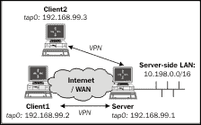

# 第三章：客户端-服务器以太网风格的网络

本章将涵盖以下主题：

+   简单配置 - 非桥接模式

+   启用客户端到客户端的流量

+   桥接 - Linux

+   桥接 - Windows

+   检查广播和非 IP 流量

+   外部 DHCP

+   使用状态文件

+   管理界面

+   将 IPv6 集成到 TAP 风格的网络中

# 介绍

本章中的教程将涵盖单服务器和多个远程客户端的部署模型，这些客户端能够转发以太网流量。

我们将查看几种常见的配置，包括桥接、使用外部 DHCP 服务器，以及使用`OpenVPN`状态文件。请注意，桥接应仅在最后的选择中使用。桥接提供的大部分功能可以通过其他方法实现。此外，使用桥接有许多缺点，尤其是在性能和安全性方面。

# 简单配置 - 非桥接模式

本教程将演示如何使用证书在客户端或服务器模式下设置基于 TAP 的连接。它还使用伪装技术，使 OpenVPN 客户端能够访问 OpenVPN 服务器背后的所有计算机。伪装的优点是使用它后，服务器局域网无需特殊路由。OpenVPN 服务器的伪装功能仅在 Linux 和 UNIX 变种上可用。本教程类似于上一章中的*服务器端路由*教程。

## 准备工作

使用第二章中的第一个教程设置客户端和服务器证书，*客户端-服务器仅 IP 网络*。对于本教程，服务器计算机和客户端计算机都运行 CentOS 6 Linux 和 OpenVPN 2.3.10。

我们使用以下网络布局：


## 如何操作...

1.  创建服务器配置文件：

    ```
            tls-server 
            proto udp 
            port 1194 
            dev tap 

            server 192.168.99.0 255.255.255.0 

            tls-auth /etc/openvpn/cookbook/ta.key 0 
            ca       /etc/openvpn/cookbook/ca.crt 
            cert     /etc/openvpn/cookbook/server.crt 
            key      /etc/openvpn/cookbook/server.key 
            dh       /etc/openvpn/cookbook/dh2048.pem 

            persist-key 
            persist-tun 
            keepalive 10 60 

            push "route 10.198.0.0 255.255.0.0" 

            user  nobody 
            group nobody   # use "group nogroup" on some distros 

            daemon 
            log-append /var/log/openvpn.log 

    ```

    将其保存为`example-3-1-server.conf`。请注意，在某些 Linux 发行版中，使用`nogroup`而不是`nobody`。

1.  启动服务器：

    ```
     [root@server]# openvpn --config example3-1-server.conf

    ```

1.  设置 IP 转发和`iptables`伪装规则：

    ```
     [root@server]# sysctl -w net.ipv4.ip_forward=1
     [root@server]# iptables -t nat -I POSTROUTING -i tap+ -o eth0 \
     -s 192.168.99.0/24 -j MASQUERADE

    ```

1.  接下来，创建客户端配置文件：

    ```
            client 
            proto udp 
            remote openvpnserver.example.com 
            port 1194 
            dev tap 
            nobind 

            remote-cert-tls server 
            tls-auth /etc/openvpn/cookbook/ta.key 1 
            ca   /etc/openvpn/cookbook/ca.crt 
            cert /etc/openvpn/cookbook/client1.crt 
            key  /etc/openvpn/cookbook/client1.key 

    ```

    将其保存为`example-3-1-client.conf`。

1.  启动客户端：

    ```
     [root@client]# openvpn --config example3-1-client.conf

    ```

    生成的输出如下所示：

    

1.  连接建立后，我们可以验证其是否正常工作。首先，我们 ping 一下服务器：

    ```
     [client]$ ping -c 2 192.168.99.1
    PING 192.168.99.1 (192.168.99.1) 56(84) bytes of data.
    64 bytes from 192.168.99.1: icmp_seq=1 ttl=64 time=25.3 ms
    64 bytes from 192.168.99.1: icmp_seq=2 ttl=64 time=25.2 ms

    ```

    第二步，我们对服务器端局域网中的一台主机进行 ping 测试：

    ```
     [client]$ ping -c 2 10.198.0.1
    PING 10.198.0.1 (10.198.0.1) 56(84) bytes of data.
    64 bytes from 10.198.0.1: icmp_seq=1 ttl=63 time=29.2 ms
    64 bytes from 10.198.0.1: icmp_seq=2 ttl=63 time=25.3 ms

    ```

## 它是如何工作的...

当服务器启动时，它会配置第一个可用的 TAP 接口，并分配 IP 地址`192.168.99.1`。之后，服务器会在 UDP 端口 1194 上监听传入的连接，这是 OpenVPN 的默认端口。

客户端通过此端口连接到服务器。在初始 TLS 握手过程中，使用客户端和服务器证书后，客户端会被分配 IP 地址`192.168.99.2`。客户端使用此信息配置其第一个可用的 TAP 接口；之后，VPN 建立连接。

除了 OpenVPN 配置，本食谱还使用 `iptables` 命令来使客户端能够访问站点 B 的局域网，而无需在站点 B 的局域网网关上设置额外的路由。以下命令指示 Linux 内核重写所有来自子网 `192.168.99.0/24`（即我们的 OpenVPN 子网）并离开以太网接口 `eth0` 的流量：

```
[root@server]# iptables -t nat -I POSTROUTING -i tap+ -o eth0 \
-s 192.168.99.0/24 -j MASQUERADE

```

每一个数据包的源地址都会被重写，以便看起来像是来自 OpenVPN 服务器本身，而不是来自 OpenVPN 客户端。`iptables` 模块会跟踪这些重写的数据包，当收到返回数据包时，会反向处理并将数据包转发回 OpenVPN 客户端。这是一种使路由正常工作的简单方法，但当使用多个客户端时，会有一个缺点：无法区分流量是否来自 OpenVPN 服务器本身，还是来自通过 VPN 隧道的 client1 或 clientN。

## 还有更多...

在设置 TAP 风格网络时，需要注意一些事项。

### TUN 和 TAP 之间的区别

这个设置与前一章节的 *服务器端路由* 食谱的区别很小。然而，也有一些细微的差别，如果不注意，可能会导致一些意想不到的效果：

+   使用 TAP 适配器时，整个以太网帧会被封装。这会导致稍微更大的开销。

+   所有连接到 TAP 风格网络的机器都形成一个单一的广播域。这个效果将在下一个食谱中变得更加清晰。

+   如果需要桥接，则需要 TAP 风格的隧道。

### 使用 TCP 协议

在此示例中，我们选择了 UDP 协议。本食谱中的配置文件可以通过更改以下行轻松转换为使用 TCP 协议：

```
proto udp 

```

将其更改为：

```
proto tcp 

```

在客户端和服务器的配置文件中都执行此操作。

UDP 协议通常提供最佳性能，但一些路由器和防火墙在转发 UDP 流量时存在问题。在这种情况下，TCP 协议通常能正常工作。

### 使 IP 转发永久生效

在大多数 Linux 系统上，设置 IP 转发的正确方法如下：

+   将以下行添加到 `/etc/sysctl.conf` 文件中：

    ```
            net.ipv4.ip_forward=1 

    ```

+   使用以下命令重新加载 `sysctl.conf` 文件：

    ```
     [root@server]# sysctl -p

    ```

## 另见

+   来自 第二章 的 *服务器端路由* 食谱，解释了一个基本的 TUN 风格的设置。

# 启用客户端到客户端的流量

本食谱是前一个食谱的延续。它将演示如何使用证书在客户端或服务器模式下设置基于 TAP 的连接。通过使用 `client-to-client` 指令，它还将使不同的 OpenVPN 客户端能够相互联系。对于基于 TAP 的网络，这会产生一些重要的副作用。

## 准备就绪

我们使用以下网络布局：



使用第二章中的第一个方案设置客户端和服务器证书，*客户端-服务器 IP-only 网络*。

对于这个方案，服务器运行 CentOS 6 Linux 和 OpenVPN 2.3.10；两个客户端都运行 Windows 7 64 位和 OpenVPN 2.3.10。对于服务器，请保留上一方案中的配置文件 `example3-1-server.conf`。

## 如何操作...

1.  通过向 `example3-1-server.conf` 文件添加一行来创建服务器配置文件：

    ```
     client-to-client

    ```

    将其保存为 `example-3-2-server.conf`。

1.  启动服务器：

    ```
     [root@server]# openvpn --config example3-2-server.conf

    ```

1.  设置 IP 转发和 `iptables` 伪装规则：

    ```
     [root@server]# sysctl -w net.ipv4.ip_forward=1
     [root@server]# iptables -t nat -I POSTROUTING -i tap+ -o eth0 \
     -s 192.168.99.0/24 -j MASQUERADE

    ```

1.  接下来，创建第一个客户端的配置文件：

    ```
            client 
            proto udp 
            remote openvpnserver.example.com 
            port 1194 

            dev tap 
            nobind 

            remote-cert-tls server 
            tls-auth "c:/program files/openvpn/config/ta.key" 1 
            ca       "c:/program files/openvpn/config/ca.crt" 
            cert     "c:/program files/openvpn/config/client1.crt" 
            key      "c:/program files/openvpn/config/client1.key" 

            verb 5 

    ```

    将其保存为 `example-3-2-client1.ovpn`。

1.  同样地，为第二个客户端创建配置文件：

    ```
            client 
            proto udp 
            remote openvpnserver.example.com 
            port 1194 

            dev tap 
            nobind 

            remote-cert-tls server 
            tls-auth "c:/program files/openvpn/config/ta.key" 1 
            ca       "c:/program files/openvpn/config/ca.crt" 
            cert     "c:/program files/openvpn/config/client2.crt" 
            key      "c:/program files/openvpn/config/client2.key" 

            verb 5 

    ```

    将其保存为 `example-3-2-client2.ovpn`。

1.  启动 Windows 客户端，一个通过命令行：

    ```
     [WinClient1]C:> cd \program files\openvpn\config
     [WinClient1]C:> ..\bin\openvpn --config example3-2-
              client1.ovpn

    ```

    使用 OpenVPN GUI 启动 Client2：

    

    由于私钥文件 `client2.key` 使用密码短语保护，因此会提示输入密码：

    

1.  连接建立后，GUI 窗口会消失并弹出气泡：

    现在，我们可以通过以下方法验证 VPN 连接是否正常工作。首先，ping 通服务器：

    ```
     [WinClient1]C:> ping 192.168.99.1
     Pinging 192.168.99.1 with 32 bytes of data:
     Reply from 192.168.99.1: bytes=32 time=24ms TTL=64
     Reply from 192.168.99.1: bytes=32 time=25ms TTL=64

    ```

    然后，ping 通第二个客户端：

    ```
     [WinClient1]C:> ping 192.168.99.3
     Pinging 192.168.99.3 with 32 bytes of data:
     Reply from 192.168.99.3: bytes=32 time=49ms TTL=128
     Reply from 192.168.99.3: bytes=32 time=50ms TTL=128

    ```

    请注意较高的往返时间。

1.  最后，验证我们是否仍然能够 ping 通服务器端局域网的主机：

    ```
     [WinClient1]C:\> ping -c 2 10.198.0.9
     Pinging 10.198.0.9 with 32 bytes of data:
     Reply from 10.198.0.9: bytes=32 time=25ms TTL=63
     Reply from 10.198.0.9: bytes=32 time=25ms TTL=63

    ```

## 如何运作...

两个客户端以常规方式连接到 OpenVPN 服务器。为了让客户端彼此看到，只需要以下指令：

```
client-to-client 

```

客户端之间的通信仍然会通过 OpenVPN 服务器，这解释了 ICMP 数据包的较高往返时间。ICMP（`ping`）回显和回复的流向如下：

1.  OpenVPN 客户端加密数据包并通过安全链接将其转发到服务器。

1.  服务器解密数据包，并确定该数据包需要转发给另一个 OpenVPN 客户端。因此，数据包不会转发到内核路由模块，而是再次加密并转发给第二个客户端。

1.  第二个客户端接收到数据包，解密它，并通过安全链接发送回复回服务器。

1.  服务器解密回复数据包，并确定该数据包需要转发给第一个客户端。因此，数据包不会转发到内核路由模块，而是再次加密并转发给原始客户端。

## 还有更多...

一如既往，需要注意一些警告。

### 广播流量可能会影响可扩展性

所有连接到 TAP 类型网络的机器都形成一个单一的广播域。当启用 `client-to-client` 时，这意味着所有客户端的广播流量都会转发到所有其他客户端。Wireshark 在 `client2` 上运行时，确实显示了大量来自 `client1` 的广播数据包，所有这些数据包都通过 OpenVPN 服务器。这可能导致当连接大量客户端时，出现可扩展性问题。

### 过滤流量

在当前版本的 OpenVPN 中，当使用 `client-to-client` 指令时，无法过滤 VPN 客户端之间的流量。OpenVPN 确实支持过滤插件，但该插件未维护，并且需要进行大量配置。

另一种过滤客户端之间流量的方法是使用系统的路由表，并结合 Linux 内核标志 `proxy_arp_pvlan`。这个标志在现代 Linux 内核中可用（2.6.34+ 或者带有回溯选项的内核）。这个标志指示 Linux 内核将 ARP 请求从原接口重新发送回来。正是这个标志使得客户端之间的流量能够在不使用 `client-to-client` 指令的情况下正常工作。因此，为了过滤流量，我们首先通过设置这个标志来启用 TAP 模式下的客户端间流量：

```
# echo 1 > /proc/sys/net/ipv4/conf/tap0/proxy_arp_pvlan 

```

然后，我们可以使用 `iptables` 命令过滤客户端之间的流量。

### TUN 类型网络

`client-to-client` 指令也可以在 TUN 类型网络中使用。它的工作方式与本示例完全相同，不同之处在于 OpenVPN 客户端并不形成一个单一的广播域。

# 桥接 - Linux

本示例将演示如何设置一个桥接的 OpenVPN 服务器。在这种模式下，本地网络和 VPN 网络被桥接，这意味着一个网络的所有流量都会转发到另一个网络，反之亦然。

这种设置通常用于安全地将远程客户端连接到基于 Windows 的局域网，但要正确配置它相当困难。在几乎所有情况下，使用带有本地 WINS 服务器的 TUN 类型网络即可满足需求，而无需使用桥接的 VPN。桥接的 VPN 确实有其优势，这将在接下来的几个示例中显现出来。

然而，使用桥接也有一些缺点，特别是在性能方面：桥接的 100 Mbps 以太网适配器性能大约是非桥接适配器的一半。

## 准备就绪

我们使用以下网络布局：


使用 第二章 中的第一个示例，设置客户端和服务器证书，*客户端-服务器 IP-only 网络*。对于这个示例，服务器运行 CentOS 6 Linux 和 OpenVPN 2.3.10，客户端计算机运行 Windows 7 64 位和 OpenVPN 2.3.10。对于客户端，请将客户端配置文件 `example3-2-client2.ovpn` 保存在手边。

## 如何操作...

1.  创建服务器配置文件：

    ```
    proto udp
    port 1194
    dev tap0 ## the '0' is extremely important
    server-bridge 192.168.4.65 255.255.255.0 192.168.4.128  
            192.168.4.200
    push "route 192.168.4.0 255.255.255.0"
    tls-auth /etc/openvpn/cookbook/ta.key 0
    ca       /etc/openvpn/cookbook/ca.crt
    cert     /etc/openvpn/cookbook/server.crt
    key      /etc/openvpn/cookbook/server.key
    dh       /etc/openvpn/cookbook/dh2048.pem
    persist-key
    persist-tun
    keepalive 10 60
    user  nobody
    group nobody  # use "group nogroup" on some distros
    daemon
    log-append /var/log/openvpn.log

    ```

    将其保存为 `example-3-3-server.conf`。

1.  接下来，创建一个脚本来启动网络桥接：

    ```
            #!/bin/bash 

            br="br0" 
            tap="tap0" 

            eth="eth0" 
            eth_ip="192.168.4.65" 
            eth_netmask="255.255.255.0" 
            eth_broadcast="192.168.4.255" 

            openvpn --mktun --dev $tap 

            brctl addbr $br 
            brctl addif $br $eth 
            brctl addif $br $tap 
            ifconfig $tap 0.0.0.0 promisc up 
            ifconfig $eth 0.0.0.0 promisc up 
            ifconfig $br $eth_ip netmask $eth_netmask \ 
            broadcast $eth_broadcast 

    ```

    将此脚本保存为`example3-3-bridge-start`文件。

1.  同样，使用脚本停止以太网桥接：

    ```
            #!/bin/bash 

            br="br0" 
            tap="tap0" 

            ifconfig $br down 
            brctl delbr $br 
            openvpn --rmtun --dev $tap 

    ```

    将此脚本保存为`example3-3-bridge-stop`文件。这些脚本基于`bridge-start`和`bridge-stop`示例，后者是 OpenVPN 配发的一部分。

1.  创建网络桥接并验证它是否正常工作：

    ```
     [root@server]# bash example3-3-bridge-start
     TUN/TAP device tap0 opened
     Persist state set to: ON
     [root@server]# brctl show
     bridge name bridge id         STP enabled interfaces
     br0         8000.00219bd2d422 no          eth0
     tap0

    ```

1.  启动 OpenVPN 服务器：

    ```
     [root@server]# openvpn --config example3-3-server.conf

    ```

1.  启动客户端：

1.  检查分配的 VPN 地址：

    ```
     [WinClient]C:> ipconfig /all
     [...]
     Ethernet adapter tun0:
     Connection-specific DNS Suffix  . :
     Description . . . . . . . . . . . : TAP-Win32 Adapter V9
     Physical Address. . . . . . . . . : 00-FF-17-82-55-DB
     Dhcp Enabled. . . . . . . . . . . : Yes
     Autoconfiguration Enabled . . . . : Yes
     IP Address. . . . . . . . . . . . : 192.168.4.128
     Subnet Mask . . . . . . . . . . . : 255.255.255.0
     Default Gateway . . . . . . . . . :
     DHCP Server . . . . . . . . . . . : 192.168.4.0

    ```

1.  现在，验证我们是否能 ping 通远程服务器局域网中的一台机器：

    ```
     [WinClient]C:> ping 192.168.4.164
     Pinging 192.168.4.164 with 32 bytes of data:
     Reply from 192.168.4.164: bytes=32 time=3ms TTL=64
     Reply from 192.168.4.164: bytes=32 time=1ms TTL=64
     Reply from 192.168.4.164: bytes=32 time=1ms TTL=64
     Reply from 192.168.4.164: bytes=32 time<1ms TTL=64

    ```

1.  停止 OpenVPN 服务器后，请记得拆除网络桥接：

    ```
     [root@server]# bash example3-3-bridge-stop
     TUN/TAP device tap0 opened
     Persist state set to: OFF

    ```

## 它是如何工作的...

`bridge-start`脚本为两个网络适配器建立了连接：一侧是局域网适配器`eth0`，另一侧是 VPN 适配器`tap0`。网络桥接的主要特性是所有流量都会从一侧复制到另一侧，反之亦然。这使我们能够设置一个几乎让客户端真正成为服务器端局域网一部分的 VPN。

桥接网络的缺点是增加了开销，并且对 OpenVPN 服务器本身造成性能损失：如果来自任一端的客户端有大量广播流量，桥接可能会变得过载。

## 还有更多...

### 固定地址和默认网关

在这个配方中，OpenVPN 服务器被分配了一个固定的服务器局域网地址，这通常是为桥接接口设置的做法。给网络桥接分配动态地址的问题是，无法清楚地确定动态地址应该从哪个网络中选择。这也使我们能够在服务器配置文件中指定一个固定的服务器桥接地址。

使用桥接时，检查桥接启动后默认路由是否可用也很重要。在大多数设置中，`eth0`会被分配一个动态地址，包括默认网关。当执行`bridge-start`脚本时，`br0`会被分配一个固定地址，但作为副作用，默认网关通常会丢失。

### 名称解析

设置桥接网络时的一个难点是与名称解析有关。OpenVPN 只支持以太网（Layer2）或基于 IP 的路由。在桥接环境中，设置一个适当的名称解析系统（例如，Windows 网络中的域控制器和/或 WINS 服务器）可能也会非常棘手。

## 另见

+   本章的下一个配方，解释了如何在 Windows 服务器上设置桥接。

# 桥接 - Windows

这个配方将演示如何在 Windows 上设置桥接 OpenVPN 服务器。Windows 上的桥接与 Linux 或 UNIX 略有不同，但概念是一样的。

这个配方与前一个配方非常相似，唯一不同的是设置桥接的方法。

## 准备工作

使用第二章中的第一个配方设置客户端和服务器证书，*客户端-服务器 IP-only 网络*。

对于这个配方，服务器计算机运行的是 Windows 7 64 位系统和 OpenVPN 2.3.10 版本。客户端计算机运行的是 Fedora 20 Linux 和 OpenVPN 2.3.10 版本。对于 Linux 客户端，保持客户端配置文件`example3-1-client.conf`在手。

我们使用以下网络布局：


## 如何操作...

1.  创建服务器配置文件：

    ```
            proto udp 
            port 1194 
            dev tap 
            dev-node tapbridge 

            server-bridge 192.168.3.15 255.255.255.0 192.168.3.128 
            192.168.3.250 

            dh       "c:/program files/openvpn/config/dh2048.pem" 
            tls-auth "c:/program files/openvpn/config/ta.key" 0 
            ca       "c:/program files/openvpn/config/ca.crt" 
            cert     "c:/program files/openvpn/config/server.crt" 
            key      "c:/program files/openvpn/config/server.key" 

            push "route 192.168.3.0 255.255.255.0" 

            persist-key 
            persist-tun 
            keepalive 10 60 

    ```

    将其保存为`example-3-4-server.conf`。

1.  接下来，创建网络桥接：

    +   进入**网络和共享中心**，然后选择**更改适配器设置**。

    +   通过右键点击`TAP-Win`适配器并选择**重命名**，将其重命名为`tapbridge`。在所使用的测试计算机上，连接到局域网的以太网适配器被重命名为`eth0`。

    +   通过按住*Ctrl*键并点击每个适配器来选择需要桥接的两个适配器，然后右键点击并选择**桥接连接**：

    这将会在控制面板中创建一个新的桥接适配器图标，通常命名为**网络桥接（...）**。

1.  网络桥接现在已准备好进行配置：

1.  在命令窗口中，验证桥接是否正确配置：

    ```
     [winserver]C:> netsh interface ip show address "Network 
              Bridge"
     Configuration for interface "Network Bridge"
     DHCP enabled:                     No
     IP Address:                       192.168.3.15
     SubnetMask:                       255.255.255.0
     Default Gateway:                  192.168.3.1
     GatewayMetric:                    5
     InterfaceMetric:                  0

    ```

1.  启动 OpenVPN 服务器：

    ```
     [winserver]C:> cd \program files\openvpn\config
     [winserver]C:> ..\bin\openvpn --config example3-4-server.ovpn

    ```

1.  Windows 防火墙会弹出一个安全警告。允许 OpenVPN 访问 VPN：

1.  启动客户端：

    ```
     [root@client]# openvpn --config example3-1-client.conf

    ```

1.  现在，检查分配的 VPN 地址，并验证我们是否能 ping 通远程服务器局域网中的一台计算机：

    ```
     [client]$ /sbin/ifconfig tap1
     tap1  Link encap:Ethernet  HWaddr A2:F4:E2:41:05:BF
     inet addr:192.168.3.128  Bcast:192.168.3.255 
     Mask:255.255.255.0
    [...]
     [client]$ ping -c 2 192.168.3.1
     PING 192.168.3.1 (192.168.3.1) 56(84) bytes of data.
     64 bytes from 192.168.3.1: icmp_seq=1 ttl=128 time=24.0 ms
     64 bytes from 192.168.3.1: icmp_seq=2 ttl=128 time=26.0 ms

    ```

## 它是如何工作的...

除了创建和配置桥接的方式外，这个配方与之前的配方非常相似。唯一需要记住的是如何在服务器配置文件中选择适配器：

```
dev tap 
dev-node tapbridge 

```

在 Linux 和其他 UNIX 变种上，可以通过一行命令来实现：

```
dev tap0 

```

但 Windows 上 TAP 适配器的命名规则不同。为了解决这个问题，需要添加`dev-node`指令。

## 参见：

+   之前的配方中，已经解释了如何在 Linux 上进行桥接。

# 检查广播和非 IP 流量

桥接设置的主要目的是为所有连接的客户端创建一个单一的广播域，无论是通过 VPN 还是通过常规网络连接。

另一个原因是能够路由或转发基于非 IP 的流量，例如较旧的 Novell IPX 和 Appletalk 协议。

这个配方重点介绍了如何使用`tcpdump`和`wireshark`等工具来检测广播域是否正常工作，以及非 IP 流量是否以正确的方式流动。

## 准备就绪

对于这个配方，我们使用的是本章*桥接 - Linux*配方中的设置。我们使用以下网络布局：


对于这个配方，服务器计算机运行的是 CentOS 6 Linux 和 OpenVPN 2.3.9。对于服务器，保持服务器配置文件`example3-3-server.conf`来自*桥接 - Linux*配方准备好。第一台客户端计算机运行的是 Windows 7 64 位和 OpenVPN 2.3.10，并且与 OpenVPN 服务器处于同一局域网段。第二台客户端运行的是 Windows XP 和 OpenVPN 2.1.1。对于这个客户端，保持客户端配置文件`example3-2-client2.ovpn`来自*启用客户端到客户端流量*配方。

确保 Windows 机器上已安装 AppleTalk 和 IPX 协议。将这些协议绑定到局域网适配器（这是默认设置）。

## 如何操作...

1.  创建网络桥接并验证它是否工作：

    ```
     [root@server]# bash example3-3-bridge-start
     TUN/TAP device tap0 opened
     Persist state set to: ON
     [root@server]# brctl show
     bridge name bridge id         STP enabled interfaces
     br0         8000.00219bd2d422 no          eth0
     tap0

    ```

1.  启动 OpenVPN 服务器：

    ```
     [root@server]# openvpn --config example3-3-server.conf

    ```

1.  启动 OpenVPN 客户端：

    ```
     [WinClient1]C:> cd \program files\openvpn\config
     [WinClient1]C:> ..\bin\openvpn --config example3-2-
              client2.ovpn

    ```

    使用 OpenVPN GUI 启动客户端 2：

    

    在这个配方中，Windows 7 客户端被分配了`192.168.4.64`。Windows XP 客户端被分配了`192.168.4.128`。

1.  客户端成功连接后，我们首先检查 ARP 消息。在服务器上运行`tcpdump`命令并监听桥接接口`br0`上的流量：

    在这个输出中，`192.168.4.254`是服务器端网关的地址。因此，网关正在请求 ARP 信息，而 ARP 回复来自 OpenVPN 服务器和 OpenVPN 客户端本身。只有在 ARP 请求通过桥接转发到 OpenVPN 客户端时，才会发生这种情况。

1.  接下来，在 Windows 7 客户端上，检查来自 Windows XP 客户端的广播流量。为此，我们使用 Wireshark。Wireshark 适用于 Linux 和 Windows。将其配置为捕获来自以太网适配器的所有流量。以下是一个示例：

    在这个输出中，我们看到很多 Netbios 广播流量，当 OpenVPN 客户端首次连接到网络时。

1.  作为最终示例，我们查看 IPX 流量：

    这表明非 IP 流量也会通过桥接转发。

## 它是如何工作的...

所有通过桥接转发的流量都会被 Wireshark 等程序拦截。通过过滤特定类型的流量，很容易证明，在桥接设置中，来自 OpenVPN 客户端的流量确实是通过服务器端的局域网传输的。这在排查几乎完成的设置时非常重要。

# 一个外部 DHCP 服务器

在这个配方中，我们将配置一个桥接的 OpenVPN 服务器，使其使用外部 DHCP 服务器为 OpenVPN 客户端分配地址，从而进一步增强远程客户端与服务器端局域网中现有客户端的集成。

## 准备就绪

我们使用以下网络布局：


使用第二章中的第一个配方，*客户端-服务器仅 IP 网络*，设置客户端和服务器证书。对于这个配方，服务器计算机运行的是 CentOS 6 Linux 和 OpenVPN 2.3.10。客户端运行的是 Windows 7 64 位和 OpenVPN 2.3.10。对于这个客户端，保留客户端配置文件`example3-2-client2.ovpn`，并参考*启用客户端到客户端流量*配方。

## 如何操作...

1.  创建服务器配置文件：

    ```
            proto udp 
            port 1194 
            dev tap0 

            server-bridge 
            push "route 0.0.0.0 255.255.255.255 net_gateway" 

            tls-auth /etc/openvpn/cookbook/ta.key 0 
            ca       /etc/openvpn/cookbook/ca.crt 
            cert     /etc/openvpn/cookbook/server.crt 
            key      /etc/openvpn/cookbook/server.key 
            dh       /etc/openvpn/cookbook/dh2048.pem 

            persist-key 
            persist-tun 
            keepalive 10 60 

            user  nobody 
            group nobody  # use "group nogroup" on some distros 

            daemon 
            log-append /var/log/openvpn.log 

    ```

1.  保存为 `example3-6-server.conf`。

1.  启动服务器：

    ```
     [root@server]# openvpn --config example3-6-server.conf

    ```

1.  启动 Windows 客户端：

1.  VPN 连接建立后，验证 IP 地址和路由表：

    ```
     [WinClient]C:> ipconfig /all
     [...]
     Ethernet adapter tapwin32-0
     Connection-specific DNS Suffix  . : lan
     Description . . . . . . . . . . . : TAP-Win32 Adapter V9
     Physical Address. . . . . . . . . : 00-FF-17-82-55-DB
     Dhcp Enabled. . . . . . . . . . . : Yes
     Autoconfiguration Enabled . . . . : Yes
     IP Address. . . . . . . . . . . . : 192.168.4.66
     Subnet Mask . . . . . . . . . . . : 255.255.255.0
     Default Gateway . . . . . . . . . : 192.168.4.254
     DHCP Server . . . . . . . . . . . : 192.168.4.254
     DNS Servers . . . . . . . . . . . : 192.168.4.254
     [...]
     [WinClient]C:> netstat -rn
     [...]
     0.0.0.0  0.0.0.0         192.168.3.1    192.168.3.22  10
     0.0.0.0  255.255.255.255 192.168.3.1    192.168.3.22   1
     0.0.0.0  0.0.0.0         192.168.4.254 192.168.4.66   1
     Default Gateway:        192.168.3.1
     [...]

    ```

1.  最后，检查我们是否能访问服务器端 LAN 中的其他主机：

    ```
     [WinClient]C:> ping 192.168.4.64
     Pinging 192.168.4.64 with 32 bytes of data:
     Reply from 192.168.4.64: bytes=32 time=3ms TTL=64
     Reply from 192.168.4.64: bytes=32 time=1ms TTL=64
     Reply from 192.168.4.64: bytes=32 time=1ms TTL=64
     Reply from 192.168.4.64: bytes=32 time<1ms TTL=64

    ```

## 它是如何工作的...

这是服务器指令：

```
server-bridge 

```

如果没有任何参数，该指令会指示 OpenVPN 不为客户端分配一个 IP 地址池。所以，所有来自客户端的 DHCP 请求都会通过桥接转发。然后，服务器端局域网中的 DHCP 服务器会返回一个 IP 地址。

这里的难点是，DHCP 服务器几乎总是会返回默认网关，而默认网关通常是 LAN 网关。如果远程客户端将其默认网关设置为 LAN 的网关，就会发生一些奇怪的事情，因为在大多数情况下，直接到 OpenVPN 服务器的路由会丢失。

以下指令指示 OpenVPN 客户端通过 `net_gateway` 添加一个显式默认路由，该路由始终是客户端侧的 LAN 网关：

```
push "route 0.0.0.0 255.255.255.255 net_gateway" 

```

对于 Windows 客户端，这个技巧是有效的，默认网关保持不变。

对于 Linux 客户端，调整 `dhclient` 和 `network-scripts` 设置更加容易。但这取决于具体的发行版。

在保持默认网关不变的情况下，OpenVPN 客户端将从服务器端的 DHCP 服务器正确地分配到一个地址。

## 还有更多内容...

使用外部 DHCP 设置时，请注意以下事项。

### DHCP 服务器配置

正确的解决方案是配置 DHCP 服务器，使 VPN 客户端的 DHCP 请求不会分配默认网关。这将增加服务器端 DHCP 服务器的管理负担。

在这种情况下，使用以下示例，通过客户端配置文件明确设置唯一的 MAC 地址是有意义的：

```
lladdr CA:C6:F8:FB:EB:3B 

```

在 Linux 上，当 TAP 接口启动时，MAC 地址会随机计算，因此每次停止并重新启动 OpenVPN 客户端时，都会分配一个新的 IP 地址。也可以通过在启动 OpenVPN 之前使用系统配置脚本启动 TAP 设备，从而创建一个永久固定的静态 MAC 地址。

### DHCP 转发

也可以在不使用桥接的情况下使用外部 DHCP 服务器。如果在启动 OpenVPN 之前配置了 TAP 适配器，并使用此配方中的服务器配置文件，则可以使用 Linux `dhrelay` 命令来使用外部 DHCP 服务器：

```
[root@server]# dhrelay -i tap0 -i eth0

```

确保列出 TAP 适配器和外部 DHCP 服务器连接的以太网适配器。结合`proxy-arp`脚本（参见第二章，*客户端-服务器仅 IP 网络*），可以在大多数情况下避免使用桥接。

### 调整/etc/sysconfig/network-scripts

在基于 RedHat、Fedora 和 OpenSuSE 的系统中，TAP 适配器通过脚本`/etc/sysconfig/network-scripts/ifup-tap0`和以下命令启动：

```
[root@client]# /sbin/ifup tap0

```

通过向`/etc/sysconfig/network-scripts/ifup-tap0`文件中添加这一行，`dhclient`脚本会忽略从 DHCP 服务器分配的网关：

```
GATEWAYDEV=eth0 

```

一个类似的黑客可以为基于 Debian/Ubuntu 的系统开发。

# 使用状态文件

OpenVPN 提供了几种监控连接到服务器的客户端的方法。最常用的方法是使用状态文件。本配方将展示如何使用和读取 OpenVPN 状态文件。我们还将重点介绍在 TAP 样式设置中的一些状态文件的细节。

## 准备工作

使用第二章的第一个配方设置客户端和服务器证书，*客户端-服务器仅 IP 网络*。在这个配方中，服务器计算机运行的是 CentOS 6 Linux 和 OpenVPN 2.3.10。第一个客户端运行的是 Fedora 20 Linux 和 OpenVPN 2.3.10。第二个客户端运行的是 Windows 7 64 位和 OpenVPN 2.3.10。对于 Linux 客户端，请随时准备好客户端配置文件`example3-1-client.conf`。对于 Windows 客户端，请随时准备好客户端配置文件`example3-2-client2.ovpn`。

## 如何操作...

1.  通过在`example3-1-server.conf`文件中添加一行，创建服务器配置文件：

    ```
            status /var/log/openvpn.status 

    ```

    将其保存为`example3-7-server.conf`。

1.  启动服务器：

    ```
     [root@server]# openvpn --config example3-7-server.conf

    ```

1.  首先，使用早前配方中的配置文件启动 Linux 客户端，并 ping 一个远程网络中的主机：

    ```
     [root@client1]# openvpn --config example3-1-client.conf
     [root@client1]# ping 10.198.0.1

    ```

1.  在 VPN 建立后，列出`openvpn.status`文件的内容（以 root 用户身份）：

    ```
     [root@server]# cat /var/log/openvpn.status
     OpenVPN CLIENT LIST
     Updated,Wed Mar  2 17:34:39 2016
     Common Name,Real Address,Bytes Received,Bytes Sent,Connected 
     Since
     client1,192.168.4.65:50183,10024,10159,Wed Mar 2 17:26:48 
              2016
     ROUTING TABLE
     Virtual Address,Common Name,Real Address,Last Ref
     5e:52:73:5c:6a:ce,client1,192.168.4.65:50183,Wed Mar 2 
              17:27:06 2016
     GLOBAL STATS
     Max bcast/mcast queue length,1
     END

    ```

1.  启动 Windows 客户端：

1.  Ping 远程网络中的主机：

    ```
     [WinClient2]C:> ping 10.198.0.1

    ```

1.  再次列出服务器上状态文件的内容：

    ```
     [root@server]# cat /var/log/openvpn.status
     OpenVPN CLIENT LIST
     Updated,Wed Mar  2 17:40:22 2016
     Common Name,Real Address,Bytes Received,Bytes Sent,Connected
     Since
     client1,192.168.4.65:50183,10024,10159,Wed Mar  2 17:27:08  
              2016
     client2,192.168.4.64:50186,18055,9726,Wed Mar  2 17:26:48 
              2016
     ROUTING TABLE
     Virtual Address,Common Name,Real Address,Last Ref
     5e:52:73:5c:6a:ce,client1,192.168.4.65:50183,Wed Mar  2 
              17:27:06 2016
     00:ff:17:82:55:db,client2,192.168.4.64:50186,Wed Mar  2 
              17:27:16 2016
     GLOBAL STATS
     Max bcast/mcast queue length,1
     END

    ```

## 它是如何工作的...

每次客户端连接到 OpenVPN 服务器时，状态文件会更新连接信息。**OPENVPN CLIENT LIST**和**ROUTING TABLE**表格是最为重要的表格，它们显示了以下内容：

+   哪些客户端已连接

+   客户端连接的 IP 地址

+   每个客户端接收和传输的字节数

+   客户端连接的时间

路由表还显示了每个客户端路由到的网络。只有当客户端开始发送需要路由的流量时，这个路由表才会被填充。配方中的`ping`命令被用来触发路由表项。

## 还有更多...

当将此示例与 TUN 风格的设置进行比较时，存在许多相似之处，但也有一些区别：

### 与 TUN 风格网络的区别

使用 TAP 风格网络与 TUN 风格网络相比，状态文件的主要区别（请参见来自 第二章 的 *使用状态文件* 配方，*客户端-服务器仅 IP 网络*）在于 **路由 表**。上一章的配方展示了这一点：

```
10.200.0.2,client1,192.168.4.65:56764,<Date> 

```

在本教程中，我们看到以下内容：

```
5e:52:73:5c:6a:ce,client1,192.168.4.65:50183,<Date> 

```

地址 `5e:52:73:5c:6a:ce` 是 `client1` 机器上 tap 适配器的随机选择的 MAC 地址。

### 断开客户端连接

注意，当客户端断开连接时，状态文件不会立即更新。OpenVPN 首先尝试根据服务器配置文件中的 `keepalive` 参数重新连接客户端。本教程中的服务器配置文件使用了以下设置：

```
keepalive 10 60 

```

这告诉服务器它将在每第 10 秒时 ping 客户端。如果 OpenVPN 服务器在 2 * 60 秒后没有收到响应，它将重启连接。服务器还会告诉客户端每 10 秒 ping 服务器一次，如果没有响应则在 60 秒后重启连接。

如果客户端通过 `explicit-exit-notify` 指令显式关闭连接，或者在使用基于 TCP 的设置时，服务器将不会等待客户端的 ping 响应。

## 另见

+   来自 第二章 的 *使用状态文件* 配方，解释了如何配置并使用状态文件来处理仅 IP 风格的网络。

# 管理接口

本教程展示了如何通过服务器上的管理接口来管理 OpenVPN。

## 准备工作

使用 第二章 中的第一个配方来设置客户端和服务器证书，*客户端-服务器仅 IP 网络*。

对于本教程，服务器计算机运行 CentOS 6 Linux 和 OpenVPN 2.3.10。第一个客户端运行 Fedora 20 Linux 和 OpenVPN 2.3.10。第二个客户端运行 Windows 7 64 位和 OpenVPN 2.3.10。

对于服务器，随时准备使用本章第一个教程中的 `example3-1-server.conf` 配置文件。对于 Linux 客户端，随时准备使用本章第一个教程中的 `example3-1-client.conf` 配置文件。对于 Windows 客户端，随时准备使用 *启用客户端间流量* 配方中的 `example3-2-client2.ovpn` 配置文件。

我们使用以下网络布局：


## 如何操作...

1.  通过向 `example3-1-server.conf` 文件添加一行来创建服务器配置文件：

    ```
            management tunnel 23000 stdin 

    ```

1.  将其保存为 `example3-8-server.conf`。

1.  启动服务器：

    ```
    [root@server]# openvpn --config example3-8-server.conf

    ```

    OpenVPN 服务器现在首先会要求输入管理接口的密码。

1.  使用之前菜谱中的配置文件启动客户端：

    ```
    [root@client1]# openvpn --config example3-1-client.conf

    ```

1.  同样启动 Windows 客户端：

1.  VPN 建立后，我们可以使用`telnet`程序从服务器连接到 OpenVPN 客户端的管理接口：

    ```
    [server]$ telnet 127.0.0.1 23000
    Trying 127.0.0.1...
    Connected to localhost.localdomain (127.0.0.1).
    Escape character is '^]'.
    ENTER PASSWORD:cookbook
    SUCCESS: password is correct
    >INFO:OpenVPN Management Interface Version 1 -- type 'help' for 
            more info
    status
    OpenVPN CLIENT LIST
    Updated,Wed Mar  2 17:57:07 2016
    Common Name,Real Address,Bytes Received,Bytes Sent,Connected 
            Since
    client1,192.168.4.64:50209,7851,8095,Wed Mar  2 17:56:08 2016
    client2,192.168.4.5:50212,11696,7447,Wed Mar  2 17:56:45 2016
    ROUTING TABLE
    Virtual Address,Common Name,Real Address,Last Ref
    00:ff:17:82:55:db,client2,192.168.4.5:50212,Wed Mar  2 17:56:49 
            2016
    1e:b8:95:e5:60:21,client1,192.168.4.64:50209,Wed Mar  2 
            17:56:53 2016
    GLOBAL STATS
    Max bcast/mcast queue length,1
    END

    ```

    请注意，它与之前菜谱中的状态文件完全相同。

1.  也可以断开客户端连接：

    ```
            kill client2 
            SUCCESS: common name 'client2' found, 1 client(s) killed 

            status 
            OpenVPN CLIENT LIST 
            Updated,Wed Mar  2 17:58:51 2016 
            Common Name,Real Address,Bytes Received,Bytes Sent,Connected 
            Since 
            client1,192.168.4.64:50209,8381,8625,Wed Mar  2 17:56:08 2016 
            ROUTING TABLE 
            Virtual Address,Common Name,Real Address,Last Ref 
            1e:b8:95:e5:60:21,client1,192.168.4.64:50209,Wed Mar  2 
            17:56:53 2016 
            GLOBAL STATS 
            Max bcast/mcast queue length,1 
            END 

    ```

1.  使用*Ctrl* + *]* 或退出命令来退出 telnet 程序。

## 它是如何工作的…

当 OpenVPN 服务器启动时，使用以下指令设置一个特殊的管理接口：

```
management 127.0.0.1 23000 stdin 

```

接口通过以下参数进行设置：

+   将 IP `127.0.0.1` 绑定到管理接口，仅允许 localhost 连接。

+   `23000`端口，管理接口将在此端口监听。

+   最后一个参数是密码文件或特殊关键字`stdin`，表示在 OpenVPN 启动时会指定管理接口的密码。请注意，这个密码与私钥密码或 OpenVPN 使用的其他用户管理密码完全无关。

在管理接口启动后，服务器操作员可以使用`telnet`连接到该接口，并查询服务器。通过输入以下命令，操作员可以断开客户端：

```
kill <clientcommonname> 

```

请注意，如果 OpenVPN 客户端配置为自动重连，它将在几分钟后自动重连。

当将管理接口的`status`命令的输出与*使用状态文件*这一菜谱中展示的状态文件输出进行比较时，第二章，*客户端-服务器仅 IP 网络*，主要区别在于此处列出了客户端的 MAC 地址，而不是 VPN 的 IP 地址。OpenVPN 甚至不需要知道客户端的 IP 地址，因为这些地址可以由外部的 DHCP 服务器分配。

## 还有更多…

管理接口也可以在 OpenVPN 客户端上运行。请参见第二章，*客户端-服务器仅 IP 网络*中的*管理接口*菜谱。

预计管理接口将在未来版本的 OpenVPN 中变得更加重要，无论是客户端还是服务器端，都将成为与 OpenVPN 软件进行程序化交互的首选方法。

## 另见

+   *管理接口*菜谱出自第二章，*客户端-服务器仅 IP 网络*，其中解释了客户端侧的管理接口。

+   *使用状态文件*这一菜谱出自第二章，*客户端-服务器仅 IP 网络*，其中解释了 TUN 风格网络的状态文件详情。

# 将 IPv6 集成到 TAP 风格网络中

本章的最后一个食谱将展示如何将 IPv6 设置集成到 TAP 风格的网络中。TAP 风格的网络对 IPv6 流量的支持比 TUN 风格的网络更早，因为 TAP 风格网络提供类似以太网的层，这一层能够传输几乎任何类型的网络协议，包括 IPv6。在 OpenVPN 2.3 中，增加了更好的 IPv6 支持，使得 OpenVPN 服务器能够提供带有 IPv6 地址的 DHCP 池。在此食谱中，我们将展示如何实现这一点。

## 准备中

使用第二章中的第一个食谱设置客户端和服务器证书，*客户端-服务器仅 IP 网络*。在此食谱中，服务器计算机和客户端计算机都运行 CentOS 6 Linux 和 OpenVPN 2.3.10。对于服务器，请随时使用本章第一个食谱中的配置文件`example3-1-server.conf`。对于客户端，请随时使用本章第一个食谱中的客户端配置文件`example3-1-client.conf`。

我们使用以下网络布局：


## 如何实现...

1.  通过添加一行来修改服务器配置文件`example3-1-server.conf`：

    ```
            server-ipv6 2001:db8:99::0/112 

    ```

1.  将其保存为`example3-9-server.conf`。

1.  启动服务器：

    ```
    [root@server]# openvpn --config example3-9-server.conf

    ```

1.  启动客户端：

    ```
    [root@client1]# openvpn --config example3-1-client.conf \
     --suppress-timestamps
    OpenVPN 2.3.10 x86_64-redhat-linux-gnu [SSL (OpenSSL)] [LZO]    
            [EPOLL] [PKCS11] [MH] [IPv6] built on Jan  4 2016
    library versions: OpenSSL 1.0.1e-fips 11 Feb 2013, LZO 2.03
    Control Channel Authentication: using    
            '/etc/openvpn/cookbook/ta.key' as a OpenVPN static key file
    UDPv4 link local: [undef]
    UDPv4 link remote: [AF_INET]openvpnserver:1194
    [openvpnserver] Peer Connection Initiated with     
            [AF_INET]openvpnserver:1194
    TUN/TAP device tap0 opened
    do_ifconfig, tt->ipv6=1, tt->did_ifconfig_ipv6_setup=1
    /sbin/ip link set dev tap0 up mtu 1500
    /sbin/ip addr add dev tap0 192.168.99.2/24 broadcast 
            192.168.99.255
    /sbin/ip -6 addr add 2001:db8:99::1000/112 dev tap0
    Initialization Sequence Completed

    ```

    请注意，我们通过命令行指令`--suppress-timestamps`抑制了日志文件中的时间戳。

1.  在 VPN 建立后，使用`ping6`命令验证我们是否能够连接到服务器：

    ```
     [client]$   ping6 -c 4  2001:db8:99::1
    ping6 -c 4 2001:db8:99::1
    PING 2001:db8:99::1(2001:db8:99::1) 56 data bytes
    64 bytes from 2001:db8:99::1: icmp_seq=1 ttl=64 time=0.620 ms
    64 bytes from 2001:db8:99::1: icmp_seq=2 ttl=64 time=0.630 ms
    64 bytes from 2001:db8:99::1: icmp_seq=3 ttl=64 time=0.631 ms
    64 bytes from 2001:db8:99::1: icmp_seq=4 ttl=64 time=0.627 ms
    --- 2001:db8:99::1 ping statistics ---
    4 packets transmitted, 4 received, 0% packet loss, time 
              3000ms
    rtt min/avg/max/mdev = 0.620/0.627/0.631/0.004 ms

    ```

## 工作原理...

TAP 风格网络的 IPv6 支持几乎与 TUN 风格网络的 IPv6 支持相同。通过向服务器配置文件添加一行，我们可以为连接的 VPN 客户端提供 IPv6 地址：

```
server-ipv6 2001:db8:99::0/112 

```

适用于 TUN 基于设置的相同指令（以`-ip6`结尾），也适用于 TAP 风格网络。

## 还有更多...

IPv6 流量的防火墙规则与 IPv4 流量的防火墙规则略有不同。此外，对于 TAP 风格的网络，通常需要允许 `tap+` 适配器范围内的所有传入和传出流量。这在调试无法工作的设置时尤其有用：

```
# iptables -I INPUT -i tap+ -j ACCEPT
# iptables -I OUTPUT -o tap+ -j ACCEPT
# ip6tables -I INPUT -i tap+ -j ACCEPT
# ip6tables -I OUTPUT -o tap+ -j ACCEPT
# iptables -I FORWARD -i tap+ -j ACCEPT
# iptables -I FORWARD -o tap+ -j ACCEPT
# ip6tables -I FORWARD -i tap+ -j ACCEPT
# ip6tables -I FORWARD -o tap+ -j ACCEPT

```

请注意，这类规则仅应用于调试目的。

## 另请参见

+   来自第二章的*添加 IPv6 支持*食谱，*客户端-服务器仅 IP 网络*，其中为非常相似的 TUN 风格设置添加了 IPv6 支持
