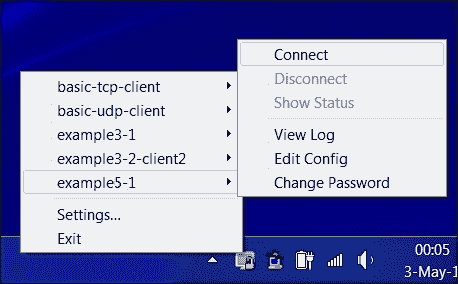

# 第五章：脚本和插件

本章将涵盖以下实例：

+   使用客户端的 up/down 脚本

+   使用`client-connect`脚本

+   使用`learn-address`脚本

+   使用`tls-verify`脚本

+   使用`auth-user-pass-verify`脚本

+   脚本顺序

+   脚本安全性和日志记录

+   脚本编写与 IPv6

+   使用`down-root`插件

+   使用 PAM 认证插件

# 简介

OpenVPN 的一个强大功能是其脚本能力，并通过插件扩展 OpenVPN 本身。通过客户端脚本，可以根据站点的具体需求定制连接过程，比如设置高级路由选项、添加防火墙规则或映射网络驱动器。通过服务器端脚本，可以为不同客户端分配自定义 IP 地址，或者通过增加额外的用户名和密码检查来扩展认证过程。插件在将 OpenVPN 认证集成到现有的认证框架（如 PAM、LDAP 或 Active Directory）中时非常有用。

本章将重点介绍脚本编写，包括客户端和服务器端的脚本，以及一些常用的插件。

# 使用客户端的 up/down 脚本

在这个实例中，我们将在客户端使用非常简单的`up`和`down`脚本来展示 OpenVPN 如何调用这些脚本。通过将消息记录到文件以及环境变量中，我们可以轻松地看到 OpenVPN 提供给`up`和`down`脚本的信息。

## 准备工作

使用第二章中的*设置公钥和私钥*实例来设置客户端和服务器证书，*客户端-服务器仅 IP 网络*。在这个实例中，服务器计算机运行的是 Fedora 22 Linux 和 OpenVPN 2.3.10，客户端运行的是 Windows 7 64 位和 OpenVPN 2.3.10。保留服务器配置文件`basic-udp-server.conf`，该文件来自第二章中的*服务器端路由*实例。

## 如何实现...

1.  启动服务器：

    ```
    [root@server]# openvpn --config basic-udp-server.conf

    ```

1.  创建客户端配置文件：

    ```
            client 
            proto udp 
            remote openvpnserver.example.com 
            port 1194 
            dev tun 
            nobind 

            ca       "c:/program files/openvpn/config/ca.crt" 
            cert     "c:/program files/openvpn/config/client2.crt" 
            key      "c:/program files/openvpn/config/client2.key" 
            tls-auth "c:/program files/openvpn/config/ta.key"" 1 

            remote-cert-tls server 
            script-security 2 
            up   "c:\\program\ files\\openvpn\\scripts\\updown.bat" 
            down "c:\\program\ files\\openvpn\\scripts\\updown.bat" 

    ```

    将文件保存为`example5-1.ovpn`。请注意反斜杠：在指定`ca`、`cert`、`key`和`tls-auth`指令时可以使用正斜杠，但`up`和`down`脚本不能使用！

1.  接下来，在 Windows 客户端上，在`C:\Program Files\OpenVPN\scripts`目录中创建批处理文件`updown.bat`：

    ```
            @echo off 
            echo === BEGIN '%script_type%' script === >> 
            c:\temp\openvpn.log 
            echo Script name: [%0] >> c:\temp\openvpn.log 
            echo Command line argument 1: [%1] >> c:\temp\openvpn.log 
            echo Command line argument 2: [%2] >> c:\temp\openvpn.log 
            echo Command line argument 3: [%3] >> c:\temp\openvpn.log 
            echo Command line argument 4: [%4] >> c:\temp\openvpn.log 
            echo Command line argument 5: [%5] >> c:\temp\openvpn.log 
            echo Command line argument 6: [%6] >> c:\temp\openvpn.log 
            echo Command line argument 7: [%7] >> c:\temp\openvpn.log 
            echo Command line argument 8: [%8] >> c:\temp\openvpn.log 
            echo Command line argument 9: [%9] >> c:\temp\openvpn.log 
            set >> c:\temp\openvpn.log 
            echo === END '%script_type%' script === >>                 
            c:\temp\openvpn.log 

    ```

1.  最后，启动 OpenVPN 客户端：

客户端成功连接到 OpenVPN 服务器后，`c:\temp\openvpn.log`日志文件将包含类似以下的输出：

```
=== BEGIN 'up' script ===  
Script name: ["c:\program files\openvpn\scripts\updown.bat"]  
Command line argument 1: [Local Area Connection 2]  
Command line argument 2: [1500]  
Command line argument 3: [1541]  
Command line argument 4: [10.200.0.2]  

Command line argument 5: [255.255.255.0]  

Command line argument 6: [init]  
Command line argument 7: []  
Command line argument 8: []  
Command line argument 9: [] 
...  
script_type=up 
[dump of environment variables] 
... 
=== END 'up' script === 

```

当客户端与服务器断开连接时，脚本会再次被调用，且命令行参数完全相同，但此时`script_type`设置为`down`。

请注意，第一个命令行参数包含 `TUN` 设备的名称。在 Linux 和 Mac OS 系统上，这通常是 `tun0` 或 `tun1`，但在 Windows 平台上，它是实际的 TAP-Win32 适配器名称。

## 工作原理...

在与 OpenVPN 服务器建立初始连接后，但在 VPN 完全建立之前，OpenVPN 客户端调用 `up` 脚本。如果 `up` 脚本返回的退出代码不等于零，则连接过程会被中止。

同样，当连接关闭时，`down` 脚本会在 VPN 连接停止后执行。

注意在 `up` 和 `down` 指令中使用双反斜杠 (`\\`)：OpenVPN 在内部翻译反斜杠字符，因此需要指定两次。在 `c:\\program` 和 `files` 之间的反斜杠是必需的，否则 OpenVPN 无法找到 `up` 和 `down` 脚本。

## 还有更多...

在本节中，我们将看到使用 `up` 和 `down` 脚本的一些更高级技巧，包括一个示例脚本，用于验证 VPN 服务器的远程主机名。

### 环境变量

本配方中使用的脚本仅将所有环境变量写入文件。这些环境变量包含有关远程服务器的有用信息，如 `common_name` 证书。此脚本的扩展可以检查 `common_name` 证书是否与远程主机名匹配。远程主机名的 IP 地址作为 `trusted_ip` 提供。

### 在连接终止之前调用 `down` 脚本

`down` 脚本在与 OpenVPN 服务器的实际连接停止后执行。也可以在断开连接阶段执行该脚本，即在与服务器的连接断开之前。要实现此功能，请将以下指令添加到客户端配置文件中：

```
down-pre 

```

### 高级 - 验证远程主机名

`up` 脚本的更高级用法是验证远程主机名是否与远程 IP 地址匹配，类似于 Web 浏览器验证安全网站地址的方式。在 Linux 系统上，这可以通过使用 shell 脚本作为 `up` 脚本轻松实现：

```
#!/bin/bash 

# reverse DNS lookup 
server_name=`host $untrusted_ip | \ 
  sed -n 's/.*name pointer \(.*\)\./\1/p' 
if [ "$server_name" != "$common_name" ] 
then 
    echo "Server certificate does not match hostname."
    echo "Aborting" 
    exit 1 
fi 

```

但在 Windows 上，除非使用 PowerShell 或 Cygwin 等工具，否则这会更加复杂。

# 使用客户端连接脚本

本配方将演示如何设置一个客户端连接脚本，该脚本在新客户端连接时在服务器端执行。同样，我们可以指定一个 `client-disconnect` 脚本，该脚本在客户端与服务器断开连接时执行。客户端连接和客户端断开脚本可以用于多种目的：

+   额外认证

+   开放和关闭防火墙端口

+   为特定客户端分配特定 IP 地址

+   为客户端编写特定的连接配置行

在这个教程中，我们将使用`client-connect`脚本，在晚上 10 点（或 22:00）到早上 6 点之间禁用使用`client2`证书的客户端访问。其他时间段内，将为该客户端分配一个静态 IP 地址。

## 正在准备中

在两台计算机上安装 OpenVPN 2.3 或更高版本。确保计算机通过网络连接。使用第二章的第一个教程设置客户端和服务器证书，*客户端-服务器 IP 网络*。在这个示例中，服务器计算机运行的是 Fedora 22 Linux 和 OpenVPN 2.3.10，而客户端运行的是 Windows 7 64 位和 OpenVPN 2.3.10。保持`basic-udp-server.conf`服务器配置文件（来自*服务器端路由*教程，出自第二章，*客户端-服务器 IP 网络*）在手。对于客户端，保持`basic-udp-client.ovpn`配置文件（来自第二章的*使用 ifconfig-pool 块*教程，*客户端-服务器 IP 网络*）在手。

## 如何操作...

1.  将以下内容添加到`basic-udp-server.conf`服务器配置文件中：

    ```
            script-security 2 
            client-connect    /etc/openvpn/cookbook/example5-2-connect.sh 

    ```

1.  将其保存为`example5-2-server.conf`。

1.  接下来，创建连接脚本：

    ```
            #!/bin/bash 

            if [ "x$common_name" = "xclient2" ] 
            then 
              hour= /bin/date +"%H" 
              if [ $hour -lt 6 -o $hour -gt 22 ] 
              then 
                echo "disable" > $1 
              else 
                echo "ifconfig-push 10.200.0.200 255.255.255.0" 
              fi 
            fi  

    ```

1.  将此文件保存为`example5-2-connect.sh`。

1.  确保脚本是可执行的：

    ```
    [root@server]# chmod 755 example5-2-connect.sh

    ```

1.  启动服务器：

    ```
    [root@server]# openvpn --config example5-2-server.conf

    ```

1.  启动 OpenVPN 客户端：

1.  如果客户端在早上 6 点到晚上 10 点之间启动，连接将会成功建立。否则，客户端日志文件将显示类似以下的内容：

    ```
            us=70083 SENT CONTROL [openvpnserver]: 'PUSH_REQUEST' 
            (status=1) 

    ```

    同时，服务器日志会更明确地说明连接拒绝的原因：

    ```
             client2/192.168.3.22:57870 MULTI: client has been rejected due 
             to 'disable' directive 

    ```

## 它是如何工作的...

当客户端连接时，OpenVPN 服务器会执行`client-connect`脚本，并设置一些与客户端连接相关的环境变量。该脚本会向特定于连接的配置文件写入两行，这个配置文件作为第一个也是唯一的参数传递给`client-connect`脚本。然后，OpenVPN 服务器会像处理普通配置文件一样处理这个配置文件。我们使用的两个可能的选项是`disable`和`ifconfig-push 10.200.0.200 255.255.255.0`。

第一个选项禁用客户端连接。第二个选项向客户端推送预定义的 IP 地址。

## 还有更多内容...

在本节中，我们重点讲解`client-disconnect`和所有 OpenVPN 脚本可用的许多环境变量。

### 使用 ifconfig-push 时的陷阱

这里使用的`client-connect`脚本没有检查通过`ifconfig-push 10.200.0.200 255.255.255.0`命令分配的 IP 地址是否实际上可用。如果有多个客户端连接到服务器，那么这个 IP 地址将从由`server 10.200.0.0 255.255.255.0`语句生成的 IP 地址池中分配。

在为客户端分配静态 IP 地址时，最好从一个特殊的子网分配它们。

### 客户端断开连接脚本

可以使用以下方式指定 `client-disconnect` 脚本：

```
client-disconnect /etc/openvpn/cookbook/disconnect.sh 

```

当客户端从服务器断开连接时执行此脚本。请注意，当客户端首次断开连接且客户端端未指定 `explicit-exit-notify` 时，OpenVPN 服务器将首先尝试多次重新连接客户端。如果客户端在多次尝试后仍未响应，则将执行 `client-disconnect` 脚本。根据服务器配置，这可能是客户端实际断开连接后数分钟。使用 TCP 连接时，无需指定 `explicit-exit-notify`，因为当 TCP 连接停止时，客户端会立即断开连接。

### 环境变量

在 `client-connect` 和 `client-disconnect` 脚本中可用多种环境变量。编写一个比以下脚本更详细的 `client-connect` 脚本非常有教育意义：

```
#!/bin.bash 
env >> /tmp/log 

```

与 `up` 和 `down` 脚本类似的还有 `script_type` 环境变量，该变量包含在服务器配置文件中配置的脚本类型。这使服务器管理员可以为 `client-connect` 和 `client-disconnect` 编写单个脚本。

### 绝对路径

请注意脚本使用了绝对路径。允许使用相对路径，但特别是对于 OpenVPN 服务器，使用绝对路径更安全。假设 OpenVPN 服务器始终在相同目录中启动是不良的安全实践。一个替代方法是使用以下内容：

```
cd /etc/openvpn/cookcook
client-connect example5-2-connect.sh 

```

# 使用`learn-address`脚本

本文档将演示如何设置一个 `learn-address` 脚本，该脚本在连接客户端地址变化时在服务器端执行。`learn-address` 脚本可用于为特定客户端动态设置防火墙规则或调整路由表。

在本文档中，我们将使用一个 `learn-address` 脚本来打开防火墙并为客户端设置伪装。当客户端断开连接时，关闭防火墙，并移除 `iptables` 伪装规则。

## 准备工作

在两台计算机上安装 OpenVPN 2.3 或更高版本。确保计算机通过网络连接。使用第一章节的客户端和服务器证书配置第二章中的第一个配方，*仅 IP 客户端服务器网络*。对于这个配方，服务器计算机运行 Fedora 22 Linux 和 OpenVPN 2.3.10，客户端运行 Windows 7 64 位和 OpenVPN 2.3.10。对于客户端，保留来自*使用 ifconfig-pool block*配方的客户端配置文件`basic-udp-client.ovpn`，从第二章，*仅 IP 客户端服务器网络*。

## 如何做…

1.  创建服务器配置文件：

    ```
            proto udp 
            port 1194 
            dev tun 

            server 10.200.0.0 255.255.255.0 

            ca       /etc/openvpn/cookbook/ca.crt 
            cert     /etc/openvpn/cookbook/server.crt 
            key      /etc/openvpn/cookbook/server.key 
            dh       /etc/openvpn/cookbook/dh2048.pem 
            tls-auth /etc/openvpn/cookbook/ta.key 0 

            persist-key 
            persist-tun 
            keepalive 10 60 

            topology subnet 

            daemon 
            log-append /var/log/openvpn.log 
            script-security 2 
            learn-address /etc/openvpn/cookbook/example5-3-learn-address.sh 
            push "redirect-gateway def1" 

    ```

1.  将其保存为 `example5-3-server.conf`。注意，此服务器配置文件中没有 `user nobody` 和 `group nobody`（也没有 `group nogroup`）行。

1.  接下来，创建 `learn-address` 脚本：

    ```
            #!/bin/bash 

            # $1 = action (add, update, delete) 
            # $2 = IP or MAC 
            # $3 = client_common name 

            if [ "$1" = "add" ] 
            then 
                /sbin/iptables -I FORWARD -i tun0 -s $2 -j ACCEPT 
                /sbin/iptables -I FORWARD -o tun0 -d $2 -j ACCEPT 
                /sbin/iptables -t nat -I POSTROUTING -s $2 -o wlan0 -j 
                MASQUERADE 
            elif [ "$1" = "delete" ] 
            then 
                /sbin/iptables -D FORWARD -i tun0 -s $2 -j ACCEPT 
                /sbin/iptables -D FORWARD -o tun0 -d $2 -j ACCEPT 
                /sbin/iptables -t nat -D POSTROUTING -s $2 -o wlan0 -j 
                MASQUERADE 
            fi 

    ```

1.  将此文件保存为 `example5-3-learn-address.sh`。

1.  确保脚本是可执行的，并启动 OpenVPN 服务器：

    ```
    [root@server]# chmod 755 example5-3-learn-address.sh
    [root@server]# openvpn --config example5-3-server.conf

    ```

1.  使用基本配置文件通过 Windows GUI 启动客户端：

1.  客户端连接到服务器后，检查服务器上的 `iptables` 防火墙规则：

    ```
            [root@server]# iptables -L FORWARD -n -v 
            Chain FORWARD (policy ACCEPT 4612K packets, 1761M bytes) 
             pkts bytes target     prot opt in     out     source                       destination 
                0     0 ACCEPT     all  --  *      tun0    0.0.0.0/0                    10.200.0.2 
                0     0 ACCEPT     all  --  tun0   *       10.200.0.2                0.0.0.0/0 

            [root@server]# iptables -t nat -L POSTROUTING -n -v 
            Chain POSTROUTING (policy ACCEPT 336K packets, 20M bytes) 
             pkts bytes target     prot opt in     out     source                       destination 
                0     0 MASQUERADE  all  --  *      wlan0   10.200.0.2                0.0.0.0/0 

    ```

1.  断开客户端连接，等待几分钟，然后验证 `iptables` 规则是否已被移除。

## 它是如何工作的...

当客户端连接或断开连接 OpenVPN 服务器时，OpenVPN 服务器会使用几个命令行参数执行 `learn-address` 脚本：

+   `$1`：操作（添加、更新、删除）。

+   `$2`：IP 或 MAC。对于基于 tun 的网络，这是客户端的 IP 地址。对于基于 tap 的网络，这是客户端（虚拟）MAC 地址。

+   `$3`：`client_common` 名称。

在本例中，`learn-address` 脚本用于为连接的客户端打开防火墙，并为客户端设置伪装规则，以便客户端可以访问服务器端局域网上的其他计算机。

## 还有更多...

在接下来的部分中，将介绍 `user nobody` 指令和 `learn-address` 脚本的 `update` 操作的一些细节。

### 用户 nobody

如前所述，此服务器配置不包括以下行：

```
user nobody 
group nobody 

```

或者，在某些 Linux 发行版中，它可以如下所示：

```
group 
nogroup 

```

如果我们添加了这些行，那么 OpenVPN 服务器进程将作为 `nobody` 用户运行。此用户没有足够的权限通过 `iptables` 打开和关闭防火墙端口，因此在本例中将其删除。

### 更新操作

当 OpenVPN 服务器检测到客户端侧的地址变化时，也会调用 `learn-address` 脚本。这个情况在使用外部 DHCP 服务器的 TAP 网络中最为常见。此时，`learn-address` 脚本可以基于新的客户端 IP 地址调整路由表或防火墙规则，使用 `update` 操作。

生成 `learn-address update` 操作的另一种方法是通过触发服务器的软重启；例如，通过向服务器进程发送 USR1 信号。这将导致所有客户端重新连接，这时会触发 `update` 操作。

# 使用 tls-verify 脚本

OpenVPN 在多个层次上验证连接客户端的凭证。通过指定 `tls-verify` 脚本，甚至可以向验证过程添加自定义层。在本例中，我们将演示如何使用该脚本，只允许某个特定证书进行访问。

## 准备工作

在两台计算机上安装 OpenVPN 2.3 或更高版本。确保计算机之间通过网络连接。使用第二章中的 *设置公钥和私钥* 例子来设置客户端和服务器证书，*客户端-服务器 IP-only 网络*。在这个例子中，服务器计算机运行 Fedora 22 Linux 和 OpenVPN 2.3.10，而客户端运行 Windows 7 64 位和 OpenVPN 2.3.10。对于客户端，保留第二章 *使用 ifconfig-pool 块* 例子中的 `basic-udp-client.ovpn` 配置文件，*客户端-服务器 IP-only 网络*。

## 如何操作...

1.  创建服务器配置文件：

    ```
            proto udp 
            port 1194 
            dev tun 

            server 10.200.0.0 255.255.255.0 

            ca       /etc/openvpn/cookbook/ca.crt 
            cert     /etc/openvpn/cookbook/server.crt 
            key      /etc/openvpn/cookbook/server.key 
            dh       /etc/openvpn/cookbook/dh2048.pem 
            tls-auth /etc/openvpn/cookbook/ta.key 0 

            persist-key 
            persist-tun 
            keepalive 10 60 

            topology subnet 

            user  nobody 
            group nobody  # nogroup on some distros 
            daemon 
            log-append /var/log/openvpn.log 

            script-security 2 
            tls-verify /etc/openvpn/cookbook/example5-4-tls-verify.sh 

    ```

1.  将其保存为 `example5-4-server.conf`。

1.  接下来，创建 `tls-verify` 脚本：

    ```
            #!/bin/bash 

            [ $# -lt 2 ] && exit 1 

            # if the depth is non-zero , continue processing 
            [ "$1" -ne 0 ] && exit 0 

            allowed_cns=`sed 's/ /_/g' $0.allowed` 
            for i in $allowed_cns 
            do 
              [ "$2" = "$i" ] && exit 0 
            done 
            # catch-all 
            exit 1 

    ```

1.  将此文件保存为 `example5-4-tls-verify.sh`。

1.  确保脚本是可执行的：

    ```
    [root@server]# chmod 755 example5-4-tls-verify.sh

    ```

1.  最后，创建允许的证书列表：

    ```
    [root@server]# echo "/C=US/O=Cookbook 2.4/CN=client1" > \ 
     /etc/openvpn/cookbook/example5-4-tls-verify.sh.allowed

    ```

    请注意，这是一个单行命令。

1.  启动 OpenVPN 服务器：

    ```
    [root@server]# openvpn --config example5-4-server.conf

    ```

1.  使用 Windows GUI 启动客户端，使用基本配置文件：

    客户端应该能够正常连接。

1.  现在，在 OpenVPN 服务器上，删除 `/etc/openvpn/cookbook/example5-4-tls-verify.sh.allowed` 文件并重新连接。这时，服务器日志将显示以下内容：

    ```
            CN not found in /etc/openvpn/cookbook/example5-4-tls-
            verify.sh.allowed, denying access 
            ... openvpnclient1:9007 TLS_ERROR: BIO read tls_read_plaintext 
            error: error:140890B2:SSL 
            routines:SSL3_GET_CLIENT_CERTIFICATE:no certificate returned 
            ... openvpnclient1:9007 TLS Error: TLS object -> incoming 
            plaintext read error 
            ... openvpnclient1:9007 TLS Error: TLS handshake failed 

    ```

    这意味着客户端被 OpenVPN 服务器拒绝访问。

## 它是如何工作的...

当客户端连接到 OpenVPN 服务器时，`tls-verify` 脚本会多次执行，以验证连接客户端的整个证书链。在这个例子中，我们查找终端用户证书，它相当于 `client1.crt` 文件。当在 `example5-4-tls-verify.sh.allowed` 文件中找到该终端用户证书时，脚本返回 `0`，表示验证成功。如果没有找到，OpenVPN 日志中会打印一条消息，脚本返回 `1`。然后，OpenVPN 服务器会拒绝该客户端的访问。

## 还有更多...

在这个例子中，我们只关注终端用户证书，使用一个简单的查找表。当然，也可以通过其他多种方式来实现（例如，使用 `client-config-dir` 文件）。通过 `tls-verify` 脚本，还可以禁止来自特定证书颁发机构（CA）的所有证书。

在更复杂的设置中，如果客户端证书可能由多个不同的 CA 签发，临时拒绝来自特定 CA 的所有证书的访问是非常有用的。例如，为了拒绝所有由主题名称为 "Cookbook 2.4 CA" 的 CA 证书签发的证书访问，可以使用以下脚本：第二章中的 *客户端-服务器 IP-only 网络*：

```
#!/bin/bash 

[ $# -lt 2 ] && exit 1 
CA=`echo $2 | sed -n 's/.*\/CN=\(.*\)\/.*/\1/p'` 
[ "$CA" = "Cookbook 2.4 CA" ] && exit 1 

```

# 使用 auth-user-pass-verify 脚本

除了证书和私钥外，OpenVPN 还提供了使用用户名和密码机制来验证客户端访问的选项。在这个示例中，我们将演示如何设置一个`auth-user-pass-verify`脚本，该脚本在客户端连接时由服务器端执行。这个脚本可以用来在数据库或文件中查找用户，也可以用来验证输入的密码是否正确。

## 准备就绪

在两台计算机上安装 OpenVPN 2.3 或更高版本。确保这两台计算机已通过网络连接。使用第二章中的第一个示例设置客户端和服务器证书，*客户端-服务器 IP-only 网络*。对于本示例，服务器计算机运行 CentOS 6 Linux 和 OpenVPN 2.3.10，客户端运行 Fedora 22 和 OpenVPN 2.3.10。对于服务器，保持使用*服务器端路由*示例中的服务器配置文件`basic-udp-server.conf`，该示例来自第二章，*客户端-服务器 IP-only 网络*。

## 如何操作...

1.  向服务器配置文件`basic-udp-server.conf`添加一行：

    ```
            script-security 2 
            auth-user-pass-verify /etc/openvpn/cookbook/example5-5-aupv.sh 
            via-file 

    ```

    请注意，最后一行是单独的一行。将其保存为`example5-5-server.conf`。

1.  创建`auth-user-pass-verify`脚本：

    ```
            #!/bin/bash 

            # the username+password is stored in a temporary file 
            # pointed to by $1 
            username=`head -1 $1` 
            password=`tail -1 $1` 

            if grep "$username:$password" $0.passwd > /dev/null 2>&1 
            then 
              exit 0 
            else 
              if grep "$username" $0.passwd > /dev/null 2>&1 
              then 
                echo "auth-user-pass-verify: Wrong password entered for 
                       user '$username'" 
              else 
                echo "auth-user-pass-verify: Unknown user '$username'" 
              fi 
              exit 1 
            fi 

    ```

1.  将其保存为`example5-5-aupv.sh`。

1.  设置一个（非常不安全的！）密码文件：

    ```
    [server]$ cd /etc/openvpn/cookbook
    [server]$ echo "cookbook:koobcook" > example5-5-
            aupv.sh.passwd

    ```

1.  确保`auth-user-pass-verify`脚本是可执行的，然后启动服务器：

    ```
    [root@server]#$ chmod 755 example5-5-aupv.sh
    [root@server]# openvpn --config example5-5-server.conf

    ```

1.  接下来，创建客户端配置文件：

    ```
            client 
            proto udp 
            remote openvpnserver.example.com 
            port 1194 

            dev tun 
            nobind 

            ca       /etc/openvpn/cookbook/ca.crt 
            cert     /etc/openvpn/cookbook/client1.crt 
            key      /etc/openvpn/cookbook/client1.key 
            tls-auth /etc/openvpn/cookbook/ta.key 1 

            remote-cert-tls server 
            auth-user-pass 

    ```

1.  将其保存为`example5-5-client.conf`。

1.  启动客户端：

    ```
    [root@client]# openvpn --config example5-5-client.conf

    ```

1.  首先，OpenVPN 客户端将询问用户名和密码：

    ```
            Enter Auth Username: cookbook 
            Enter Auth Password: koobcook 

    ```

1.  然后，如果输入正确的密码，连接将正常建立。

1.  接下来，尝试使用不同的用户名重新连接：

    ```
            Enter Auth Username: janjust 
            Enter Auth Password: whatever 

    ```

1.  服务器日志现在将显示以下内容：

    ```
            auth-user-pass-verify: Unknown user 'janjust' 
            ... openvpnclient:50834 TLS Auth Error: Auth Username/Password          verification failed for peer 

    ```

客户端现在被拒绝访问。

## 它是如何工作的...

OpenVPN 客户端首先提示用户输入身份验证的用户名和密码。请注意，密码通过安全通道发送到服务器，但密码本身没有被哈希或加密。服务器端的`auth-user-pass-verify`脚本会将用户名和密码以文件形式传递，其中密码位于两行中。脚本随后在密码文件中查找用户名，并验证是否指定了正确的密码。如果密码正确，脚本将以退出代码 0 退出，表示成功。否则，返回退出代码 1，导致服务器中止客户端连接。

## 还有更多...

在接下来的部分中，我们将看到有关如何指定密码以及如何将密码从服务器传递到`auth-user-pass-verify`脚本的一些细节。

### 在客户端文件中指定用户名和密码

OpenVPN 提供了在客户端的文件中指定用户名和密码的选项。为了实现这一点，OpenVPN 需要使用一个特殊的标志进行编译，从 OpenVPN 2.3 开始默认启用该选项。

请注意，允许密码以明文格式存储在客户端是不安全的！

### 通过环境变量传递密码

在本节中，我们使用了以下内容：

```
auth-user-pass-verify example5-5-aupv.sh via-file 

```

这将配置 OpenVPN 服务器通过临时文件传递客户端提供的用户名和密码。该临时文件仅对服务器进程可访问，因此这是将加密密码安全地传递给`auth-user-pass-verify`脚本的机制。

也可以通过环境变量将用户名和密码传递给`auth-user-pass-verify`脚本：

```
auth-user-pass-verify example5-5-aupv.sh via-env 

```

这样做的优点是无需创建额外的文件。缺点是通过明文和环境变量传递密码的安全性稍差：比起读取其他用户拥有的安全文件，嗅探其他进程的环境要容易（但并非易事！）。

# 脚本顺序

在 OpenVPN 服务器上可以配置多种脚本，因此确定这些脚本的执行顺序变得非常重要。在本节中，我们将了解执行顺序是什么，以及每个脚本的命令行参数。

## 准备工作

在两台计算机上安装 OpenVPN 2.3 或更高版本，确保计算机通过网络连接。使用第二章中的第一个配方设置客户端和服务器证书，*客户端-服务器仅 IP 网络*。在此配方中，服务器计算机运行 CentSO 6 Linux 和 OpenVPN 2.3.10，客户端运行 Fedora 22 和 OpenVPN 2.3.10。对于服务器，保留来自*服务器端路由*配方的服务器配置文件`basic-udp-server.conf`，该配方来自第二章，*客户端-服务器仅 IP 网络*。对于客户端，保留上一节中的客户端配置文件。

## 如何操作...

1.  将以下行追加到服务器配置文件`basic-udp-server.conf`中：

    ```
            script-security 2 
            cd /etc/openvpn/cookbook 
            up                   example5-6-script.sh 
            route-up             example5-6-script.sh 
            down                 example5-6-script.sh 
            client-connect       example5-7-script.sh 
            client-disconnect    example5-6-script.sh 
            learn-address        example5-6-script.sh 
            tls-verify           example5-6-script.sh 
            auth-user-pass-verify      example5-6-script.sh via-env 

    ```

1.  将其保存为`example5-6-server.conf`。

1.  创建以下脚本：

    ```
            #!/bin/bash 

            exec >> /tmp/example5-6.log 2>&1 
            date +"%H:%M:%S: START $script_type script ===" 
            echo "argv = $0 $@" 
            echo "user = `id -un`/`id -gn`" 
            date +"%H:%M:%S: END $script_type script ===" 

    ```

1.  将其保存为`example5-6-script.sh`。

1.  确保脚本可执行，然后启动服务器：

    ```
    [root@server]# chmod 755 example5-6-script.sh
    [root@server]# openvpn --config example5-6-server.conf

    ```

1.  接下来，启动客户端：

    ```
    [root@client]# openvpn --config example5-5-client.conf

    ```

    Auth 用户名和密码可以任意选择，因为它们并不会被使用。

1.  成功连接到服务器后，断开客户端连接并等待几分钟，直到服务器识别出客户端已断开连接。现在，也停止 OpenVPN 服务器。

    日志文件将被创建在`/tmp/example5-6.log`中，以下为部分内容：

    ```
            13:34:45: START up script === 
            13:34:45: START route-up script === 
            13:36:26: START tls-verify script === 
            18:36:26: START tls-verify script === 
            18:36:27: START user-pass-verify script === 
            18:36:27: START client-connect script === 
            18:36:27: START learn-address script === 
            argv = example5-6-script.sh add 10.200.0.2 client1 
            18:37:14: START client-disconnect script === 
            18:37:20: START learn-address script === 
            argv = example5-6-script.sh delete 10.200.0.2 
            18:37:20: START down script === 

    ```

## 工作原理...

OpenVPN 内置了许多脚本钩子。当 OpenVPN 服务器启动、客户端连接并断开时，这些脚本会依次执行。顺序（针对 OpenVPN 2.3）如下：

+   以用户`root`执行`up`脚本。

+   以用户`root`执行`route-up`脚本；之后，root 权限会被丢弃，OpenVPN 会切换到配置文件中指定的`nobody`用户。

+   `tls-verify` 脚本。用于签署客户端证书的 CA 证书会传递进行验证。

+   `tls-verify` 脚本。客户端证书本身会传递。

+   `user-pass-verify` 脚本。

+   `client-connect` 脚本。

+   带有动作 `add` 的 `learn-address` 脚本。

此时，客户端已经成功建立 VPN 连接。现在，当客户端断开连接时：

+   `client-disconnect` 脚本

+   带有动作 `delete` 的 `learn-address` 脚本

当服务器关闭时：

+   `down` 命令；请注意，这是以用户 `nobody` 身份运行的！

## 还有更多...

在编写脚本时，牢记脚本执行时间非常重要。OpenVPN 2 的设计非常单体化：所有内容（插件除外，我们将在本章后面讨论插件）都在单个线程中运行。这意味着，在脚本执行时，整个 OpenVPN 服务器会暂时对所有其他客户端不可用：数据包路由停止，其他客户端无法连接或断开连接，甚至管理界面也不会响应。因此，确保所有服务器端脚本快速执行非常重要。

这个设计缺陷已经被识别，但预计在 OpenVPN 3 到来之前不会有重大变化。

# 脚本安全性和日志记录

OpenVPN 2.0 及以后版本之间的一个主要区别与运行脚本时的安全性有关。在 OpenVPN 2.0 中，所有脚本都是通过 `system` 调用执行的，并且将整个服务器环境变量集传递给每个脚本。从 OpenVPN 2.1 开始，引入了 `script-security` 配置指令，默认执行脚本的方式变为 `execv` 调用，这更加安全。此外，出于安全原因，建议记录脚本输出。通过日志记录脚本输出（包括时间戳），可以更容易地追踪问题和可能的安全事件。从 OpenVPN 2.3 开始，不能再将 `system` 选项添加到 `script-security` 配置指令中。

在这个方案中，我们将重点介绍 `script-security` 配置指令的不同选项，以及简化脚本输出日志记录的方法。

## 准备工作

在两台计算机上安装 OpenVPN 2.3 或更高版本。确保计算机通过网络连接。使用 第二章 中的第一个方案设置客户端和服务器证书，*客户端-服务器 IP-only 网络*。对于本方案，服务器计算机运行的是 CentSO 6 Linux 和 OpenVPN 2.3.10，客户端运行的是 Fedora 22 和 OpenVPN 2.3.10。对于服务器，保留来自 *服务器端路由* 方案的服务器配置文件 `basic-udp-server.conf`，来自 第二章，*客户端-服务器 IP-only 网络*。

## 如何执行...

1.  使用来自 *使用客户端端 up/down 脚本* 配方的配置文件启动 OpenVPN 服务器：

    ```
    [root@server]# openvpn --config basic-udp-server.conf

    ```

1.  创建客户端配置文件：

    ```
            client 
            proto udp 
            remote openvpnserver.example.com 
            port 1194 

            dev tun 
            nobind 

            ca       /etc/openvpn/cookbook/ca.crt 
            cert     /etc/openvpn/cookbook/client1.crt 
            key      /etc/openvpn/cookbook/client1.key 
            tls-auth /etc/openvpn/cookbook/ta.key 1 

            remote-cert-tls server 
            up "/etc/openvpn/cookbook/example5-7-up.sh arg1 arg2" 

    ```

1.  将其保存为 `example5-7-client.conf`。注意缺少 `script-security` 指令。

1.  创建 `up` 脚本：

    ```
            #!/bin/bash 

            exec >> /etc/openvpn/cookbook/example5-7.log 2>&1 
            date +"%H:%M:%S: START $script_type script ===" 
            echo "argv = [$0] [$1] [$2] [$3] [$4]" 
            pstree $PPID 
            date +"%H:%M:%S: END $script_type script ===" 

    ```

1.  将其保存为 `example5-7-up.sh` 并确保它是可执行的。

1.  启动 OpenVPN 客户端：

    ```
    [client]$ openvpn --config example5-7-client.conf

    ```

1.  客户端似乎连接成功，直到需要执行 `up` 脚本时：

    ```
            ... /etc/openvpn/cookbook/example5-7-up.sh [arguments] 
            ... WARNING: External program may not be called unless '--
            script-security 2' or higher is enabled. See --help text or 
            man page for detailed info.  
            ... WARNING: Failed running command (--up/--down): external 
            program fork failed  
            ... Exiting due to fatal error  

    ```

1.  当我们重复上述操作，并添加额外的命令行参数 `--script-security 2` 时，客户端可以成功连接：

    ```
                [client]$ openvpn --config example5-7-client.conf  \
                   --script-security 2

    ```

`/etc/openvpn/cookbook/example5-7.log` 日志文件现在显示以下内容：

```
05:25:33: START up script === 
argv = [/etc/openvpn/cookbook/example5-7-up.sh] [argument1] [argument2] [tun0] [1500] 
openvpn---example5-7-up.s---pstree 
05:25:33: END up script ===  

```

如果我们使用 `--script-security 3` 重复此操作，我们将得到类似的输出。

## 它是如何工作的...

为了在客户端或服务器上执行脚本，必须指定指令 `script-security 2`（或 3）；否则，OpenVPN 2.1 或更高版本将拒绝启动。可以为 `script-security` 指令指定以下参数：

+   `0`：此参数指定不允许调用外部程序。这意味着除非在某些特定情况下在 Microsoft Windows 上，否则 OpenVPN 无法成功启动。

+   `1`：此参数指定只能调用内置的外部程序（例如在 Linux 上的 `/sbin/ifconfig` 和 `/sbin/ip`，以及在 Windows 上的 `netsh.exe` 和 `route.exe`）。

+   `2`：此参数指定可以调用内置程序和脚本。

+   `3`：这与 `2` 相同，但现在可以通过环境变量将密码传递给脚本。

## 还有更多内容...

在 Linux/NetBSD/Mac OS 和 Windows 上运行脚本之间存在细微差异。在 Windows 上，默认使用系统调用 `CreateProcess`。这使得无法将额外的参数传递给某些脚本，例如 `up` 脚本，因为 `up` 指令后的整个文本（用引号括起来的部分）被视为可执行文件或脚本的名称。

# 脚本编写与 IPv6

现在 IPv6 地址更为普及，展示如何将 IPv6 地址从服务器传递到客户端脚本是很有帮助的。基本上，所有适用于 IPv4 地址的环境变量，对于 IPv6 也同样适用，只需在环境变量后附加或插入 `_ipv6` 即可。在本例中，我们将向您展示如何处理这些环境变量。

## 准备就绪

在两台计算机上安装 OpenVPN 2.3 或更高版本。确保计算机已通过网络连接。使用第二章中的第一个配方设置客户端和服务器证书，*客户端-服务器 IP-only 网络*。在这个配方中，服务器计算机运行 CentOS 6 Linux 和 OpenVPN 2.3.10，而客户端运行 Fedora 22 和 OpenVPN 2.3.10。对于服务器，保留*服务器端路由*配方中的服务器配置文件`basic-udp-server.conf`，该配方来自第二章，*客户端-服务器 IP-only 网络*。

## 如何操作…

1.  将两行添加到服务器配置文件`basic-udp-server.conf`中：

    ```
            push "route-ipv6 2001:610:120::111:0:1/96" 
            push "route-ipv6 2001:610:120::222:0:1/96" 

    ```

1.  将其保存为`example5-8-server.conf`。

1.  启动服务器：

    ```
    [root@server]# openvpn --config example5-8-server.conf

    ```

1.  接下来，创建客户端配置文件：

    ```
            client 
            proto udp 
            remote openvpnserver.example.com 
            port 1194 

            dev tun 
            nobind 

            ca       /etc/openvpn/cookbook/ca.crt 
            cert     /etc/openvpn/cookbook/client1.crt 
            key      /etc/openvpn/cookbook/client1.key 
            tls-auth /etc/openvpn/cookbook/ta.key 1 

            remote-cert-tls server 
            script-security 2 
            up "/etc/openvpn/cookbook/example5-8.sh" 

            route-up "/etc/openvpn/cookbook/example5-8.sh" 

    ```

1.  将其保存为`example5-8-client.conf`。

1.  创建以下脚本：

    ```
            #!/bin/bash 

            exec >> /tmp/example5-10.log 2>&1 
            date +"%H:%M:%S: START $script_type script ===" 
            export | grep ipv6 
            date +"%H:%M:%S: END $script_type script ==="  

    ```

1.  将其保存为`example5-8-script.sh`。

1.  确保`example5-8.sh`脚本是可执行的，然后启动客户端：

    ```
    [root@client]# chmod 755 example5-8.sh
    [root@client]# openvpn --config example5-8-client.conf

    ```

1.  客户端连接后，检查客户端日志文件`/tmp/example5-8.log`：

    ```
            16:19:58: START up script === 

            declare -x ifconfig_ipv6_local="2001:610:120::200:0:1001" 
            declare -x ifconfig_ipv6_netbits="112" 
            declare -x ifconfig_ipv6_remote="2001:610:120::200:0:2" 
            declare -x route_ipv6_gateway_1="2001:610:120::200:0:2" 
            declare -x route_ipv6_gateway_2="2001:610:120::200:0:2" 
            declare -x route_ipv6_network_1="2001:610:120::111:0:1/96" 
            declare -x route_ipv6_network_2="2001:610:120::222:0:1/96"
            16:19:58: END up script === 
            16:19:58: START route-up script === 
            declare -x ifconfig_ipv6_local="2001:610:120::200:0:1001" 
            declare -x ifconfig_ipv6_netbits="112" 
            declare -x ifconfig_ipv6_remote="2001:610:120::200:0:2" 
            declare -x route_ipv6_gateway_1="2001:610:120::200:0:2" 
            declare -x route_ipv6_gateway_2="2001:610:120::200:0:2" 
            declare -x route_ipv6_network_1="2001:610:120::111:0:1/96" 
            declare -x route_ipv6_network_2="2001:610:120::222:0:1/96" 
            16:19:58: END route-up script === 

    ```

## 它是如何工作的…

OpenVPN 服务器为客户端分配一个 IPv6 地址，并通过`push "route-ipv6 ..." `指令将两个 IPv6 路由推送到客户端。客户端接收这些指令并将其传递给`up`和`route-up`脚本。这些脚本只显示包含`ipv6`的环境变量，这可以很好地概述可用于脚本和插件的 IPv6 设置。

## 还有更多…

当传递包含服务器自身 IPv6 地址的 IPv6 路由给客户端时要小心——这些路由可能会优先于现有的到服务器的路由，导致 VPN 连接停滞。

# 使用 down-root 插件

OpenVPN 支持插件架构，外部插件可以用来扩展 OpenVPN 的功能。插件是遵循 OpenVPN 插件 API 的特殊模块或库。其中一个插件是`down-root`插件，它仅在 Linux 上可用。这个插件允许用户在 OpenVPN 关闭时以`root`用户身份运行指定的命令。通常，OpenVPN 进程会出于安全原因丢弃 root 权限（如果使用了`--user`指令）。虽然这是一个很好的安全措施，但它使得撤销某些`up`脚本作为`root`用户插件执行的操作变得困难。为此，开发了`down-root`插件。本配方将演示如何使用`down-root`插件删除由`up`脚本创建的文件。

## 准备工作

使用第二章中的*设置公钥和私钥*配方设置客户端和服务器证书，*客户端-服务器 IP-only 网络*。在这个配方中，服务器计算机运行 CentOS 6 Linux 和 OpenVPN 2.3.10。不需要客户端计算机。

## 如何操作…

1.  创建服务器配置文件：

    ```
            proto udp 
            port 1194 
            dev tun 

            server 10.200.0.0 255.255.255.0 

            ca       /etc/openvpn/cookbook/ca.crt 
            cert     /etc/openvpn/cookbook/server.crt 
            key      /etc/openvpn/cookbook/server.key 
            dh       /etc/openvpn/cookbook/dh2048.pem 
            tls-auth /etc/openvpn/cookbook/ta.key 0 

            persist-key 
            persist-tun 
            keepalive 10 60 

            topology subnet 

            user  nobody 
            group nobody  # nogroup on some distros 

            daemon 
            log-append /var/log/openvpn.log 

            script-security 2 
            cd /etc/openvpn/cookbook 
            up "example5-9.sh" 
            plugin /usr/lib64/openvpn/plugin/lib/openvpn-down-root.so 
            "./example5-9.sh --down" 

            suppress-timestamps 
            verb 5 

    ```

1.  将其保存为 `example5-9-server.conf`。

1.  接下来，创建 `up` 脚本，我们也将使用它来实现 `down-root` 插件：

    ```
            #!/bin/sh 
            if [ "$script_type" = "up" ] 
            then 
              touch /tmp/example5-9.tempfile 
            fi 
            if [ "$1" = "--down" ] 
            then 
              rm /tmp/example5-9.tempfile 
            fi 

    ```

1.  将其保存为`example5-9.sh`并确保它是可执行的。

1.  启动 OpenVPN 服务器：

    ```
    [root@server]# openvpn --config example5-9-server.conf

    ```

    服务器日志文件现在会显示以下内容：

    ```
            PLUGIN_CALL: POST /usr/lib64/openvpn/plugin/lib/openvpn-down-         root.so/PLUGIN_UP status=0 
            example5-9.sh tun0 1500 1541 10.200.0.1 10.200.0.2 init 

    ```

    这表示插件已启动。`up` 脚本执行后没有出现错误代码，说明其成功运行。

1.  验证服务器上是否创建了 `/tmp/example5-9.tempfile` 文件。

1.  接下来，停止服务器。服务器日志现在会显示以下内容：

    ```
            PLUGIN_CALL: POST /usr/lib64/openvpn/plugin/lib/openvpn-down-  
            root.so/PLUGIN_DOWN status=0 
            PLUGIN_CLOSE: /usr/lib64/openvpn/plugin/lib/openvpn-down-
            root.so 

    ```

1.  验证 `/tmp/example5-9.tempfile` 文件是否已被删除。

## 它是如何工作的...

`down-root` 插件在系统启动时注册，当 OpenVPN 服务器进程仍然以 `root` 权限运行时。插件将在单独的线程中生成，这意味着当主 OpenVPN 进程丧失其 root 权限时，插件仍然可以完全访问 `root` 权限。当 OpenVPN 关闭时，将调用插件，它会删除服务器启动时由 `root` 插件创建的文件。

这里是服务器日志文件中的一个有趣部分：

```
/sbin/ifconfig tun0 0.0.0.0 
SIOCSIFADDR: Permission denied 
SIOCSIFFLAGS: Permission denied 
Linux ip addr del failed: external program exited with error status: 255 
PLUGIN_CALL: POST /usr/lib64/openvpn/plugin/lib/openvpn-down-root.so/PLUGIN_DOWN status=0 
PLUGIN_CLOSE: /usr/lib64/openvpn/plugin/lib/openvpn-down-root.so 

```

这表明 OpenVPN 进程确实无法执行命令 `/sbin/ifconfig tun0 0.0.0.0`，证明 `root` 权限已成功被移除。然后插件被调用，该插件具有 `root` 权限，因此它能够删除 `/tmp` 中由 `root` 用户创建的文件。

注意，插件运行的脚本必须指定一个以 `./` 开头的路径。如果在 Linux 或 Mac OS 上没有指定前导的 `./`，则 OpenVPN 将无法找到插件需要运行的脚本，因为当前目录（`.`）通常不在 PATH 环境变量中。

还要注意，`up` 脚本会设置 `script_type` 环境变量，但插件则不然。为了解决这个问题，添加了一个额外的参数，以便同一个脚本可以同时用作 `up` 和 `down-root` 脚本。

## 还有更多...

插件支持 Linux、Net/FreeBSD 和 Windows 操作系统。以下脚本回调可以通过插件进行拦截：

+   `up`

+   `down`

+   `route-up`

+   `ipchange`

+   `tls-verify`

+   `auth-user-pass-verify`

+   `client-connect`

+   `client-disconnect`

+   `learn-address`

## 另见

+   下一个食谱，*使用 PAM 身份验证插件*，它解释了如何使用 OpenVPN 插件来验证远程 VPN 客户端。

# 使用 PAM 身份验证插件

对于 OpenVPN，一个非常有用的插件是使用 Linux/UNIX PAM 认证系统验证用户名的插件。**PAM**代表**可插拔认证模块**，它是一个非常模块化的系统，允许用户访问系统资源。大多数现代 Linux 和 UNIX 变种都使用它，提供一个非常灵活和可扩展的用户认证和授权系统。在本食谱中，我们将使用 PAM 认证插件来替代`auth-user-pass-verify`脚本，以根据系统 PAM 配置验证远程用户的凭证。

## 准备工作

在两台计算机上安装 OpenVPN 2.3 或更高版本。确保计算机通过网络连接。使用第二章中的第一个食谱设置客户端和服务器证书，*仅客户端-服务器 IP 网络*。在本食谱中，服务器计算机运行 CentOS 6 Linux 和 OpenVPN 2.3.11，而客户端运行 Fedora 22 Linux 和 OpenVPN 2.3.11。对于客户端，准备好使用*使用 auth-user-pass-verify 脚本*食谱中的`example5-5-client.conf`客户端配置文件。

## 如何操作...

1.  创建服务器配置文件：

    ```
            proto udp 
            port 1194 
            dev tun 

            server 10.200.0.0 255.255.255.0 

            ca       /etc/openvpn/cookbook/ca.crt 
            cert     /etc/openvpn/cookbook/server.crt 
            key      /etc/openvpn/cookbook/server.key 
            dh       /etc/openvpn/cookbook/dh2048.pem 
            tls-auth /etc/openvpn/cookbook/ta.key 0 

            persist-key 
            persist-tun 
            keepalive 10 60 

            topology subnet 

            user  nobody 
            group nobody  # nogroup on some distros 

            daemon 
            log-append /var/log/openvpn.log 

            verb 5 
            suppress-timestamps 

            plugin /usr/lib64/openvpn/plugins/openvpn-plugin-auth-pam.so          "login login USERNAME password PASSWORD" 

    ```

    请注意，服务器配置文件的最后一行是单行的。将其保存为：`example5-10-server.conf`。

1.  启动 OpenVPN 服务器：

    ```
    [root@server]# openvpn --config example5-10-server.conf

    ```

    服务器日志文件现在将显示：

    ```
            AUTH-PAM: BACKGROUND: INIT service='login' 
            PLUGIN_INIT: POST /usr/lib64/openvpn/plugins/openvpn-plugin-
            auth-pam.so '/usr/lib64/openvpn/plugins/openvpn-plugin-auth-
            pam.so] [login] [login] [USERNAME] [password] [PASSWORD]'          intercepted=PLUGIN_AUTH_USER_PASS_VERIFY 

    ```

    这表示 PAM 插件已在后台成功初始化。

1.  启动 OpenVPN 客户端。OpenVPN 首先会提示输入认证用户名和密码：

    ```
            ... OpenVPN 2.3.11 x86_64-redhat-linux-gnu [SSL (OpenSSL)] 
            [LZO] [EPOLL] [PKCS11] [MH] [IPv6] built on May 10 2016 
            ... library versions: OpenSSL 1.0.1e-fips 11 Feb 2013, LZO 2.08 
            Enter Auth Username: ******** 
            Enter Auth Password: ********  

    ```

在本食谱中使用的服务器上，创建了一个特殊的用户`cookbook`。输入用户名和密码后，成功建立与服务器的连接。OpenVPN 服务器日志显示如下：

```
AUTH-PAM: BACKGROUND: received command code: 0 
AUTH-PAM: BACKGROUND: USER: cookbook 
AUTH-PAM: BACKGROUND: my_conv[0] query='login:' style=2 
AUTH-PAM: BACKGROUND: name match found, query/match-string ['login:', 'login'] = 'USERNAME' 
AUTH-PAM: BACKGROUND: my_conv[0] query='Password: ' style=1 
AUTH-PAM: BACKGROUND: name match found, query/match-string ['Password: ', 'password'] = 'PASSWORD' 
... 192.168.3.22:50887 PLUGIN_CALL: POST /usr/lib64/openvpn/plugins/openvpn-plugin-auth-pam.so/PLUGIN_AUTH_USER_PASS_VERIFY status=0 
... 192.168.3.22:50887 TLS: Username/Password authentication succeeded for username 'cookbook' 

```

这表明用户已经通过 PAM 成功认证。

## 它是如何工作的...

PAM 认证插件会拦截`auth-user-pass-verify`回调。当 OpenVPN 客户端连接并传递用户名和密码时，插件会被唤醒。它通过查看`login`模块（这是`openvpn-auth-pam.so`文件的第一个参数）来查询 PAM 子系统。其他参数被`auth-pam`插件用来确定 PAM 子系统会提供哪些输入：

```
login USERNAME password PASSWORD 

```

PAM `login`子系统会通过显示`login prompt`来请求用户名，并通过显示`password`提示来请求密码。`auth-pam`插件使用这些信息来知道在哪里填写用户名（`USERNAME`）和密码（`PASSWORD`）。

用户在通过 PAM 子系统成功认证后，连接被建立。

## 还有更多...

也可以使用`auth-user-pass-verify`脚本通过查询 PAM 子系统来验证用户。使用 PAM 插件有两个主要优点：

+   完全不需要使用`script-security`指令。

+   插件方法要更快且具有更好的可扩展性。当多个用户同时尝试连接到 OpenVPN 服务器时，使用 `auth-user-pass-verify` 脚本会极大地影响 VPN 性能，因为每个用户连接时都需要启动一个单独的进程，在此过程中会安装 OpenVPN 的主线程。

## 另请参阅

+   前面的食谱，*使用 down-root 插件*，解释了如何使用 OpenVPN 插件的基本方法。
