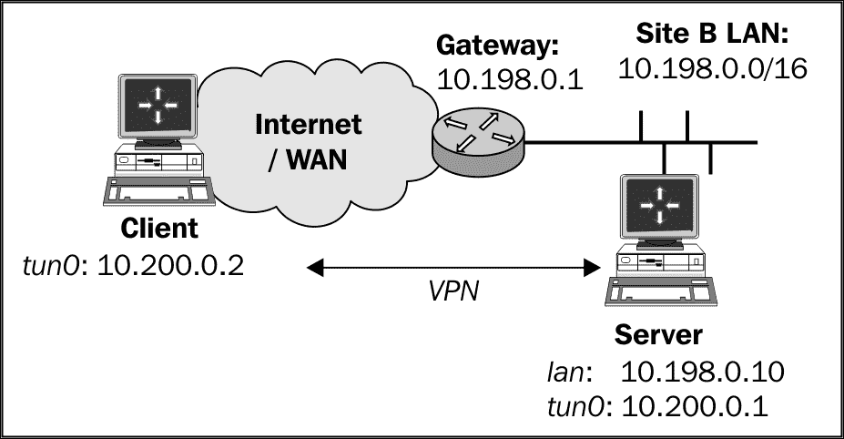
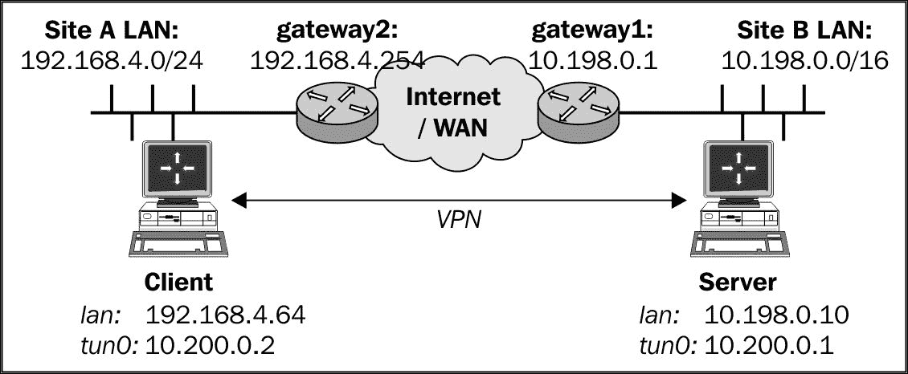
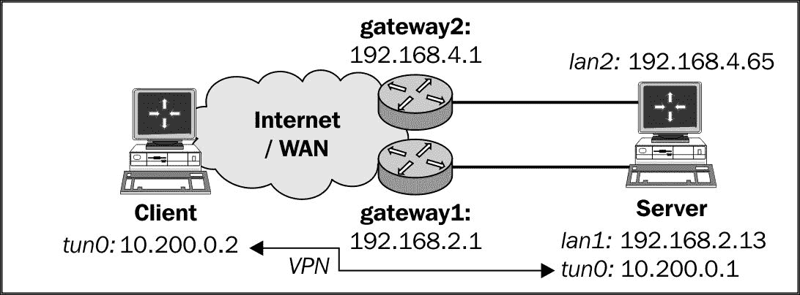
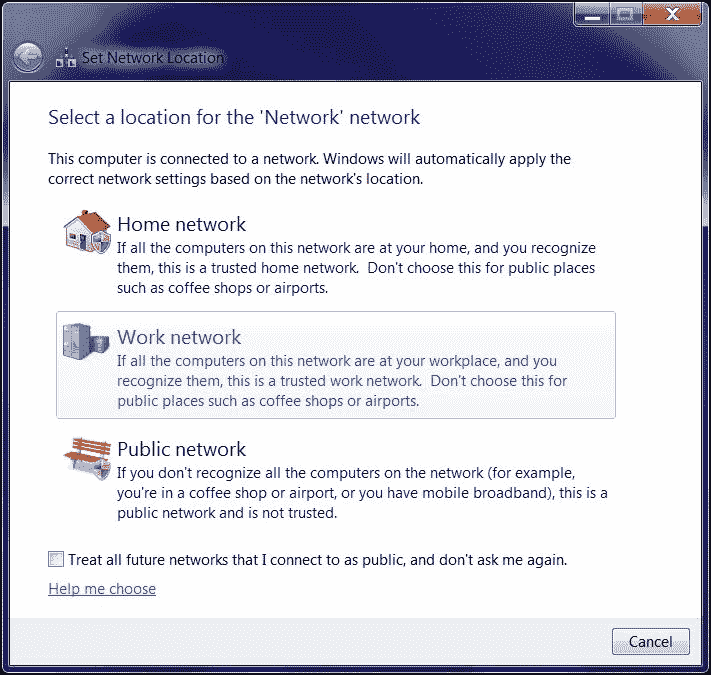
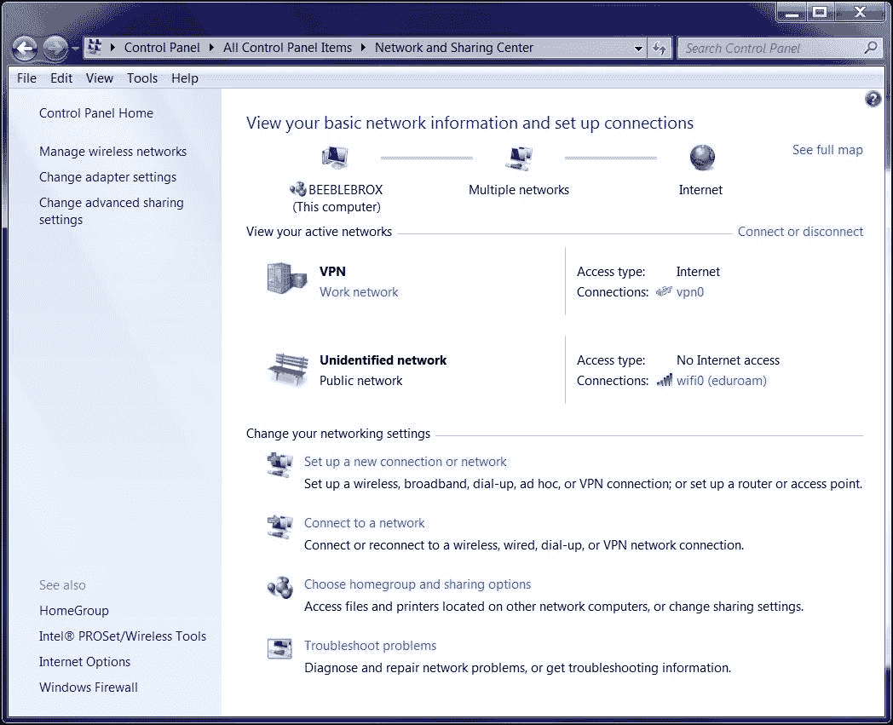
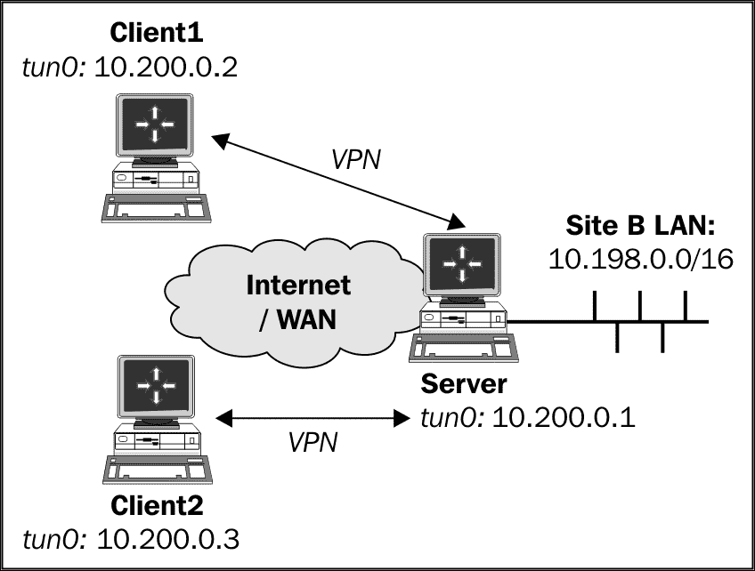
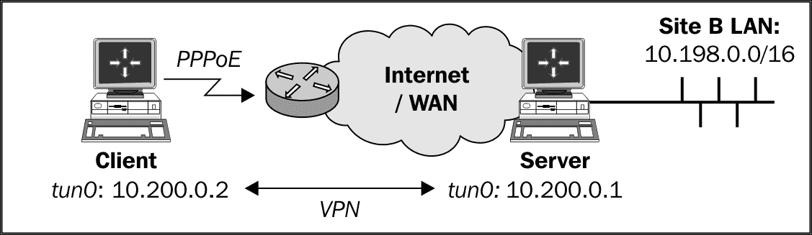

# 第七章. 故障排除 OpenVPN - 路由

本章将涉及以下故障排除主题：

+   缺失的返回路由

+   使用 `iroute` 时缺失的返回路由

+   所有客户端都能正常工作，除了 OpenVPN 端点

+   源路由

+   Windows 上的路由和权限

+   无法更改 Windows 网络位置

+   故障排除客户端到客户端流量路由

+   理解 `MULTI: bad source` 警告

+   重定向默认网关时的故障

# 介绍

本章和前一章的主题是排除 OpenVPN 故障。本章重点讨论在设置 VPN 时常见的路由问题。由于在 `openvpn-users` 邮件列表上超过一半的问题都可以归结为路由问题，本章旨在为一些常见的路由配置错误提供解答。

因此，本章中的配方将首先处理故障排除，然后提供如何查找和解决配置错误的工具。

# 缺失的返回路由

在首次成功设置 OpenVPN 后，网络路由配置错误是非常常见的。在本配方中，我们将首先设置一个基本的 TUN 风格 VPN，如第二章，*客户端-服务器 IP-only 网络* 中所做的那样。起初，路由将无法工作，直到正确的路由被添加。本配方的目的是描述如何排除此类路由错误。

## 准备就绪

我们使用以下网络布局：



使用 第二章，*客户端-服务器 IP-only 网络* 中的 *设置公钥和私钥* 配方设置客户端和服务器证书。对于这个配方，服务器计算机运行 CentOS 6 Linux 和 OpenVPN 2.3.11，客户端运行 Fedora 22 Linux 和 OpenVPN 2.3.11。保持使用第二章，*客户端-服务器 IP-only 网络* 中的 *服务器端路由* 配方的配置文件 `basic-udp-server.conf`，以及客户端配置文件 `basic-udp-client.conf`。

## 如何操作...

1.  使用配置文件 `basic-udp-server.conf` 启动服务器：

    ```
    [root@server]# openvpn --config basic-udp-server.conf

    ```

1.  接下来，启动客户端：

    ```
    [root@client]# openvpn --config basic-udp-client.conf
    ...
    ... Initialization Sequence Completed

    ```

1.  此时，可以 ping 远程 VPN IP 和所有位于 VPN 服务器上的接口：

    ```
            [client]$ ping -c 2 10.200.0.1
            PING 10.200.0.1 (10.200.0.1) 56(84) bytes of data.
            64 bytes from 10.200.0.1: icmp_seq=1 ttl=64 time=25.2 ms
            64 bytes from 10.200.0.1: icmp_seq=2 ttl=64 time=25.1 ms
            [client]$ ping -c 2 10.198.0.10
            PING 10.198.0.10 (10.198.0.10) 56(84) bytes of data.
            64 bytes from 10.198.0.10: icmp_seq=1 ttl=64 time=24.7 ms
            64 bytes from 10.198.0.10: icmp_seq=2 ttl=64 time=25.0 ms

    ```

    如果这两个 ping 命令中的任何一个失败，那么 VPN 连接尚未成功建立，且无需继续。

1.  如果没有在服务器端网关上添加路由，那么远程 `10.198.0.0/16` 网络上的所有其他主机将无法访问：

    ```
            [client]$ ping 10.198.0.1
            PING 10.198.0.1 (10.198.0.1) 56(84) bytes of data.
            ^C
            --- 10.198.0.1 ping statistics ---
            1 packets transmitted, 0 received, 100% packet loss, time 764ms

    ```

1.  如果我们在远程网络的局域网网关上添加路由，明确转发所有 VPN 流量到 VPN 服务器，那么我们就可以访问远程局域网上的所有机器（就像在第二章的*服务器端路由*食谱中做的那样，*客户端-服务器 IP-only 网络*）：

    ```
            [gateway]> ip route add 10.200.0.0/24 via 10.198.0.10

    ```

    这里，`10.198.1.1`是 VPN 服务器的局域网 IP 地址。在这种情况下，远程局域网网关运行的是 Linux 系统。添加静态路由到网关的确切语法将根据网关的型号和操作系统有所不同。

1.  现在，所有的机器都可以访问：

    ```
            [client]$ ping 10.198.0.1
            PING 10.198.0.1 (10.198.0.1) 56(84) bytes of data.
            64 bytes from 10.198.0.1: icmp_seq=1 ttl=63 time=27.1 ms
            64 bytes from 10.198.0.1: icmp_seq=2 ttl=63 time=25.0 ms

    ```

## 它是如何工作的……

当 VPN 客户端尝试连接到服务器端局域网上的主机时，数据包会带有源 IP 地址和目标 IP 地址：

+   **源 IP** = `10.200.0.2`：这个地址是 VPN 隧道的 IP 地址

+   **目标 IP** = **IP**：这是我们试图联系的主机的 IP 地址

远程主机希望回复一个数据包，并交换源 IP 地址和目标 IP 地址。当远程主机想要发送数据包时，它不知道该发送到哪里，因为地址`10.200.0.2`是我们的私有 VPN 地址。于是，它将数据包转发到局域网网关。然而，局域网网关也不知道应该将数据包返回到哪里，它会将数据包转发到其默认网关。当数据包到达直接连接到互联网的路由器时，该路由器通常会选择丢弃（丢掉）数据包，导致主机无法访问。

通过在远程局域网网关上添加路由——告诉它所有针对网络`10.200.0.0/24`的流量都应转发到 VPN 服务器——数据包就会被发送回正确的机器。VPN 服务器会将数据包转发回 VPN 客户端，连接得以建立。

首先 ping 远程 VPN 端点，然后 ping 服务器局域网 IP（`10.198.0.10`）的步骤，乍一看似乎是多余的，但这些步骤在排查路由问题时至关重要。如果这些步骤已经失败，那么就不需要再查看缺失的路由了。

## 还有更多……

本节将重点介绍针对本食谱中描述的问题的不同解决方案。

### 伪装

解决上述问题的一个快速且粗糙的方案概述见于第二章的*服务器端路由*食谱。在该食谱的*更多内容…*部分，使用伪装（即 NAT 的一种形式）来让所有流量看起来像是来自 OpenVPN 服务器本身。如果你无法控制远程局域网网关，这是一个完美的解决方案，但它并不是一个很干净的路由解决方案。当数据经过 NAT 时，某些应用程序可能表现得不太好。此外，从安全日志记录的角度来看，有时最好避免 NAT，因为你将多个 IP 地址映射到一个地址上，从而丧失了一些信息。

### 在局域网主机上添加路由

除了向远程局域网网关添加路由外，还可以在每个 VPN 客户端需要访问的远程局域网主机上添加路由。如果 VPN 客户端只需要访问有限的服务器端主机集，则此解决方案非常适合，但它的扩展性较差。

## 另请参见

+   来自第二章的*服务器端路由*食谱，其中包含从服务器端局域网路由流量的基本设置

# 使用 iroute 时缺少返回路由

本食谱是前一个食谱的延续。在确保单个 VPN 客户端可以访问服务器端局域网后，下一步是确保 VPN 客户端背后的其他主机能够访问服务器端局域网中的主机。

在本食谱中，我们将首先设置一个 VPN，就像在第二章 *路由：两侧的子网* 食谱中一样。如果没有设置返回路由，那么客户端局域网中的主机将无法访问服务器端局域网中的主机，反之亦然。通过添加适当的路由，问题得以解决。

## 准备就绪

我们使用以下网络布局：



使用第二章的第一个食谱设置客户端和服务器证书，*客户端-服务器 IP 仅网络*。对于本食谱，服务器计算机运行 CentOS 6 Linux 和 OpenVPN 2.3.11，客户端运行 Fedora 22 Linux 和 OpenVPN 2.3.11。保留配置文件`example2-5-server.conf`，来自第二章的*路由：两侧的子网*食谱，以及客户端配置`basic-udp-client.conf`，来自第二章的*服务器端路由*食谱。

## 如何实现...

1.  启动服务器：

    ```
            [root@server]# openvpn --config example2-5-server.conf

    ```

1.  接下来，启动客户端：

    ```
            [root@client]# openvpn --config basic-udp-client.conf
            ...
            ... Initialization Sequence Completed

    ```

1.  此时，可以 ping 远程 VPN IP 以及 VPN 服务器本身的所有接口，反之亦然：

    ```
            [client]$ ping -c 2 10.200.0.1
            PING 10.200.0.1 (10.200.0.1) 56(84) bytes of data.
            64 bytes from 10.200.0.1: icmp_seq=1 ttl=64 time=25.2 ms
            64 bytes from 10.200.0.1: icmp_seq=2 ttl=64 time=25.1 ms
            [client]$ ping -c 2 10.198.0.10
            PING 10.198.0.1 (10.198.0.10) 56(84) bytes of data.
            64 bytes from 10.198.0.10: icmp_seq=1 ttl=64 time=24.7 ms
            64 bytes from 10.198.0.10: icmp_seq=2 ttl=64 time=25.0 ms
            [server]$ ping -c 2 10.200.0.2
            PING 10.200.0.2 (10.200.0.2) 56(84) bytes of data.
            64 bytes from 10.200.0.2: icmp_seq=1 ttl=64 time=25.0 ms
            64 bytes from 10.200.0.2: icmp_seq=2 ttl=64 time=24.6 ms
            [server]$ ping -c 2 192.168.4.64
            PING 192.168.4.64 (192.168.4.64) 56(84) bytes of data.
            64 bytes from 192.168.4.64: icmp_seq=1 ttl=64 time=25.2 ms
            64 bytes from 192.168.4.64: icmp_seq=2 ttl=64 time=24.3 ms

    ```

1.  服务器上的路由表显示远程网络已正确路由：

    ```
            [server]$ netstat -rn | grep tun0
            192.168.4.0   10.200.0.1 255.255.255.0 UG 0 0 0 tun0
            10.200.0.0 0.0.0.0       255.255.255.0 U  0 0 0 tun0

    ```

1.  当我们尝试 ping 服务器端局域网的远程主机时，失败了，就像在前一个食谱中一样。反之，当我们尝试从服务器端局域网的主机 ping 客户端局域网的主机时，我们看到：

    ```
            [siteB-host]$ ping -c 2 192.168.4.66
            PING 192.168.4.66 (192.168.4.66) 56(84) bytes of data.
            --- 192.168.4.66 ping statistics ---
            2 packets transmitted, 0 received, 100% packet loss, time 999ms

    ```

1.  通过在两侧的网关上添加适当的路由，路由恢复。首先是服务器端局域网的网关：

    ```
            [gateway1]> ip route add 192.168.4.0/24 via 10.198.0.10

    ```

    这里，`10.198.0.10` 是 VPN 服务器的局域网 IP 地址。

    接下来是客户端局域网的网关/路由器：

    ```
            [gateway2]> ip route add 10.198.0.0/16 via 192.168.4.64

    ```

    这里，`192.168.4.64` 是 VPN 客户端的局域网 IP 地址。

之后，局域网中的主机可以互相访问。

## 它是如何工作的...

与前一操作类似，当站点 A 局域网中的主机尝试连接站点 B 局域网中的主机时，数据包将以源和目的 IP 地址的方式发送：

+   **源 IP** = `192.168.4.64`：站点 A 的局域网地址

+   **目的 IP** = `10.198.1.12`：站点 B 的局域网地址

远程主机会希望用一个源和目的 IP 地址交换的包进行回复。当远程主机要发送数据包时，它将数据包转发到局域网网关。然而，局域网网关也不知道将数据包返回到哪里，它会将数据包转发到其默认网关。当数据包到达与互联网直接连接的路由器时，路由器通常会决定丢弃（丢掉）这些数据包，导致主机变得不可访问。

在前面的操作中出现了类似的问题，但现在数据包的 IP 地址是实际的站点 A 和站点 B 的局域网 IP 地址。

通过在两边添加适当的路由，问题得以缓解。

在排查这类路由问题时，首先从最内层的网络（此案例中为实际的 VPN）开始排查，然后向外层扩展：

1.  首先，确保 VPN 端点可以互相访问。

1.  确保 VPN 客户端可以访问服务器的局域网 IP，反之亦然。

1.  确保 VPN 客户端能够访问服务器端局域网中的主机。

1.  确保服务器端局域网中的主机能够看到 VPN 客户端。

1.  确保客户端局域网中的主机能够看到 VPN 服务器。

1.  最后，确保客户端局域网中的主机能够看到服务器端局域网中的主机，反之亦然。

## 还有更多内容...

同样，前面提到的 *服务器端路由* 操作中概述了对上述问题的一个简单快速的解决方案，该操作来自 第二章，*客户端-服务器仅 IP 网络*。在该操作中，使用了伪装技术，使得所有流量看起来都来自 OpenVPN 服务器本身。特别是在通过 VPN 连接子网时，这种做法并不可取，因为伪装使得无法确定是哪个客户端连接到哪个服务器，反之亦然。因此，在这种情况下，推荐使用完全路由的设置。

## 另请参见

+   来自 第二章，*客户端-服务器仅 IP 网络* 的 *路由：两边的子网* 操作详细解释了如何在客户端和服务器端设置路由。

# 除了 OpenVPN 端点，所有客户端都能正常工作

本操作是前一操作的延续。前一操作解释了如何在连接客户端局域网（或子网）到服务器端局域网时排查路由问题。然而，在前一操作中，故意做了一些路由配置上的遗漏。在本操作中，我们将重点关注排查这个相当常见的遗漏。

## 准备工作

我们使用以下网络布局：


使用第二章中的第一个配方设置客户端和服务器证书，*客户端-服务器 IP 仅网络*。对于此配方，服务器计算机运行的是 CentOS 6 Linux 和 OpenVPN 2.3.11。

客户端运行的是 Fedora 22 Linux 和 OpenVPN 2.3.11。保留第二章中的 *路由：两端子网* 配方中的配置文件`example2-5-server.conf`，以及来自第二章中 *服务器端路由* 配方的客户端配置文件`basic-udp-client.conf`。

## 如何操作...

1.  启动服务器：

    ```
            [root@server]# openvpn --config example2-5-server.conf

    ```

1.  接下来，启动客户端：

    ```
            [root@client]# openvpn --config basic-udp-client.conf
            ...
            ... Initialization Sequence Completed

    ```

1.  在两端的网关上添加适当的路由：

    ```
            [gateway1]> ip route add 192.168.4.0/24 via 10.198.0.10
            [gateway2]> ip route add 10.198.0.0/16 via 192.168.4.64

    ```

    之后，所有局域网内的主机都可以相互访问。

1.  我们通过 ping 两端局域网上的各种机器来验证这一点：

    ```
            [client]$ ping -c 2 10.198.0.10
            [server]$ ping -c 2 192.168.4.64
            [siteA-host]$ ping -c 2 10.198.0.1
            [siteB-host]$ ping -c 2 192.168.4.66

    ```

    它们都能正常工作。然而，当 VPN 服务器尝试 ping 客户端局域网中的一台主机时，它失败了：

    ```
            [server]$ ping -c 2 192.168.4.66
            PING 192.168.4.66 (192.168.4.66) 56(84) bytes of data.
            --- 192.168.4.66 ping statistics ---
            2 packets transmitted, 0 received, 100% packet loss, time 
            1009ms

    ```

    同样，客户端只能访问服务器的局域网 IP 地址，无法访问其他主机。

1.  在 Linux 和 UNIX 主机上，可以明确指定源 IP 地址：

    ```
            [server]$ ping -I 10.198.0.10 -c 2 192.168.4.66
            PING 192.168.4.66 (192.168.4.66) 56(84) bytes of data.
            64 bytes from 192.168.4.66: icmp_seq=1 ttl=63 time=25.5 ms
            64 bytes from 192.168.4.66: icmp_seq=2 ttl=63 time=24.3 ms

    ```

    成功了！所以，问题出在数据包的源地址上。

1.  通过在两端的网关上为 VPN 子网本身添加额外的路由，可以解决此问题：

    ```
            [gateway1]> ip route add 10.200.0.0/24 via 10.198.0.10
            [gateway2]> ip route add 10.200.0.0/24 via 192.168.4.64

    ```

1.  现在，VPN 服务器可以访问客户端子网中的所有主机，反之亦然：

    ```
            [server]$ ping -c 2 192.168.4.66
            PING 192.168.4.66 (192.168.4.66) 56(84) bytes of data.
            64 bytes from 192.168.4.66: icmp_seq=1 ttl=63 time=25.3 ms
            64 bytes from 192.168.4.66: icmp_seq=2 ttl=63 time=24.9 ms

    ```

## 它是如何工作的...

要排查此类问题，将所有涉及局域网的源地址和目标地址列出来非常有用。在此案例中，问题出现在 VPN 服务器想要连接客户端局域网中的主机时。在 VPN 服务器上，发送到客户端主机的数据包是直接通过 VPN 接口发送的。因此，该数据包的源地址被设置为 VPN 接口本身的 IP 地址。于是，数据包具有以下 IP 地址：

+   **源 IP** = `10.200.0.1`：VPN 服务器的 IP 地址

+   **目标 IP** = `192.168.4.66`：站点 A 的局域网地址

远程主机将希望通过交换源和目标 IP 地址的方式响应数据包。当远程主机想要发送数据包时，它会将数据包转发到局域网网关。然而，局域网网关同样不知道将数据包返回到哪里，它会将数据包转发到默认网关。当数据包到达一个直接连接到互联网的路由器时，该路由器通常会决定丢弃（抛弃）数据包，导致主机无法访问。

这个问题仅出现在 VPN 服务器和 VPN 客户端上。在客户端和服务器端的其他主机上，使用的是局域网 IP 地址，且路由按照之前的配方正常工作。

通过在两端添加适当的路由，问题得以解决。

## 还有更多...

本配方中使用 NAT（网络地址转换）的一个好方法是从路由表中移除与 VPN IP 范围相关的任何条目。这可以通过仅伪装 VPN 端点地址来完成。如果这样做，网关上的额外路由将不再需要。例如，在服务器上添加一个 NAT 规则，在客户端上添加一个类似的规则，网关上的额外路由就不再需要。

```
[root@server]# iptables -t nat -I POSTROUTING -i tun0 -o eth0 \
 -s 10.200.0.0/24 -j MASQUERADE
[root@client]# iptables -t nat -I POSTROUTING -i tun0 -o eth0 \
 -s 10.200.0.0/24 -j MASQUERADE

```

请注意，在基于 Linux 和 UNIX 的操作系统上，源路由设置非常简单，但在 Windows 上则需要更多的操作。

## 另请参见

+   第二章中的*路由：两侧子网*配方，*客户端-服务器仅 IP 网络*，详细说明了如何在客户端和服务器端设置路由。

# 源路由

随着网络配置变得更加复杂，对更多高级功能的需求也在增加，源路由功能就是其中之一。当服务器通过两个网络接口连接到网络（或互联网）时，通常会使用源路由（请参见下图）。在这种情况下，确保通过某一接口启动的连接保持在该接口上非常重要。如果 VPN 连接的传入流量是通过第一个接口进入，但返回流量是通过第二个接口发送回去，那么 VPN 连接等将会失败，正如我们在这个配方中将要看到的那样。源路由是大多数现代操作系统的高级功能。在本配方中，我们将展示如何使用 Linux 的`iproute2`工具设置源路由，但在其他操作系统上使用类似工具也可以实现相同的功能。

## 准备工作

我们使用以下网络布局：



使用第二章中的第一个配方设置客户端和服务器证书，*客户端-服务器仅 IP 网络*。对于这个配方，服务器计算机运行的是 CentOS 6 Linux 和 OpenVPN 2.3.11，并连接到一个具有两个 IP 地址的路由器：`192.168.4.65`和`192.168.2.13`；该系统的默认网关是`192.168.2.1`，意味着流量默认会通过 IP 地址为`192.168.2.13`的接口离开。第二网关的 IP 地址是`192.168.4.1`。客户端运行的是 Windows 7 64 位和 OpenVPN 2.3.11。客户端的 IP 地址是`192.168.2.10`，默认路由为`192.168.2.1`。保留第二章中*服务器端路由*配方中的配置文件`basic-udp-server.conf`，以及第二章中*使用 ifconfig-pool 块*配方中的客户端配置文件`basic-udp-client.ovpn`。

## 如何操作…

1.  使用配置文件 `basic-udp-server.conf` 启动服务器：

    ```
            [root@server]# openvpn --config basic-udp-server.conf

    ```

1.  接下来，启动客户端：

1.  在此配置中，远程服务器地址 `openvpnserver.example.com` 解析为 `192.168.4.65`。

    连接将无法启动，客户端的 OpenVPN 日志文件将显示以下消息，并重复几次：

    ```
            Wed Aug 25 16:24:28 2010 TCP/UDP: Incoming packet rejected from           192.168.2.13:1194[2], expected peer address: 192.168.4.65:1194 
            (allow this incoming source address/port by removing --remote 
            or adding --float)

    ```

1.  通过添加一个源路由规则，将所有通过某接口（`192.168.4.65`）从另一个接口（子网 `192.168.2.0/24`）的主机传入的流量，重定向到出接口（`192.168.2.0/24`）的路由器（`192.168.4.1`），连接得以恢复：

    ```
            [root@server]# ip route add to default table 100 dev eth0 \
                              via 192.168.4.1
            [root@server]# ip rule add from 192.168.2.10 priority 50 \
                              table 100
            [root@server]# ip rule add to 192.168.2.10 priority 50 \
                               table 100

    ```

    现在，客户端可以成功连接到 VPN 服务器。

## 它是如何工作的...

当客户端 `192.168.2.10` 连接到 VPN 服务器 `192.168.4.65` 时，返回路由选择了最短路径，在这里的设置中是 `192.168.2.1`。服务器操作系统将数据包的返回 IP 地址设置为 `192.168.2.13`，因为这是与该网络关联的接口的 IP 地址。这使得 OpenVPN 客户端感到困惑，因为它连接到主机 `192.168.4.65`，但却接收到来自 `192.168.2.13` 的返回流量。通过明确强制流量从另一个接口（`192.168.4.65`）出去，这个不对称路由问题得以解决。

源路由规则的确切语法高度依赖于具体的网络配置，但在*如何操作*一节中概述的三条命令的基本思想是：

+   创建一个 ID 为`100`的路由表，并将此表的默认网关设备设置为`eth0`，其 IP 地址为`192.168.4.65`

+   创建一条路由规则，将任何来自客户端 `192.168.2.10` 的流量重定向到路由表

+   创建一条路由规则，将任何希望离开客户端`192.168.2.10`的流量重定向到路由表

路由规则需要根据实际情况进行调整，因为这些规则会阻止某些其他类型的网络流量，但原理是正确的。

## 还有更多...

更高级的路由控制可以使用**LARTC**（**Linux 高级路由与流量控制**）来完成。更好的方法是标记从接口传入的数据包，并仅将标记的数据包重定向到正确的外发接口。

# Windows 上的路由和权限

在本教程中，我们将重点讨论用户在 VPN 客户端机器运行 Windows 且没有完全或提升权限时常遇到的常见错误。在某些情况下，OpenVPN 客户端能够成功连接，但远程服务器推送的路由未正确设置。本教程将重点讨论如何排查和修正这个错误。

## 准备中

使用第二章中的第一个配方设置客户端和服务器证书，*客户端-服务器 IP 专用网络*。对于这个配方，服务器计算机运行的是 CentOS 6 Linux 和 OpenVPN 2.3.11，而客户端运行的是 Windows 7 64 位和 OpenVPN 2.3.11。请保留来自第二章中 *服务器端路由* 配方的配置文件 `basic-udp-server.conf`，以及来自第二章中 *使用 ifconfig-pool 块* 配方的客户端配置文件 `basic-udp-client.ovpn`。

## 如何操作...

1.  以非特权用户身份登录 Windows，即没有 `Power User` 或 `Administrator` 权限的用户。此外，确保暂时从 OpenVPN 中移除**以管理员身份运行**标志，以便不以提升的权限启动 OpenVPN。可以通过在 OpenVPN GUI 属性中取消勾选**以管理员身份运行此程序**标志来实现：

1.  使用配置文件 `basic-udp-server.conf` 启动服务器：

    ```
    [root@server]# openvpn --config basic-udp-server.conf

    ```

1.  最后，启动客户端。

连接将开始，OpenVPN GUI 灯会变为绿色。然而，客户端 OpenVPN 日志文件将显示以下消息：

```
... C:\WINDOWS\system32\route.exe ADD 10.198.0.0 MASK 255.255.0.0 10.200.0.1
... ROUTE: route addition failed using CreateIpForwardEntry: Network access is denied.   [status=65 if_index=2]
... Route addition via IPAPI failed [adaptive]
Thu Aug 26 16:47:53 2010 us=187000 Route addition fallback to route.exe

```

如果尝试访问服务器端 LAN 上的主机，将会失败：

```
[WinClient]C:\>ping 10.198.0.1
Pinging 10.198.0.1 with 32 bytes of data:
Request timed out.
Ping statistics for 10.198.0.1:
Packets: Sent = 1, Received = 0, Lost = 1 (100% loss)

```

解决此问题的方法是为用户提供适当的网络权限，或者恢复 OpenVPN 的提升权限。

## 它是如何工作的...

OpenVPN 客户端尝试打开 TAP-Win32 适配器，在默认安装中这是被允许的。然而，当服务器通过以下方式推送路由到客户端时：

```
push "route 10.198.0.0 255.255.0.0"

```

然后，由于缺少管理员权限，OpenVPN 客户端将无法实际将该路由添加到系统路由表中。然而，VPN 连接已经成功建立，并且 GUI 客户端显示连接成功。

请注意，即使没有 `push "route"` 语句，Windows OpenVPN 图形界面仍然显示绿色图标，表明连接已启动。从技术角度讲，连接确实已经建立，但这仍然应视为一个 bug。

## 还有更多内容...

Windows XP 及更高版本包含一个**以管理员身份运行**服务，允许用户暂时以更高的权限级别运行程序。这个机制在 Windows Vista/7 中得到了扩展，并在启动应用程序时成为默认设置。实际上，这就是在这些平台上运行 OpenVPN 时，`openvpn-users` 邮件列表上出现的许多问题的根本原因。

# 无法更改 Windows 网络位置

这篇食谱的标题看起来似乎与路由问题无关，但 Windows 的网络位置依赖于路由才能正常工作。从 Windows Vista 开始，微软引入了网络位置的概念。默认情况下，有多个网络位置：**家庭**、**工作**和**公共**（适用于 Windows 7），以及**私人**和**公共**（适用于 Windows 8 及以上）。这些网络位置适用于所有网络适配器，包括 OpenVPN 的虚拟 TAP-Win 网络适配器。

**家庭**网络位置是为家庭网络设计的。同样，**工作**网络位置也为工作提供较高的信任级别，允许计算机共享文件、连接打印机等。在 Windows 8 及以上版本中，**家庭**和**工作**网络位置合并成了可信的**私人**网络位置。**公共**网络位置不被信任，Windows 会限制对网络资源的访问，即使 Windows 防火墙被禁用。

OpenVPN 设置的路由属性决定了 TAP-Win 适配器是否被信任，从而决定是否允许文件共享。在这个食谱中，我们将展示如何更改 OpenVPN 设置，以便可以更改网络位置。

## 准备工作

使用第二章中的第一个食谱设置客户端和服务器证书，*客户端-服务器 IP 仅网络*。在这个食谱中，服务器计算机运行的是 CentOS 6 Linux 和 OpenVPN 2.3.11，客户端运行的是 Windows 7 64 位和 OpenVPN 2.3.11。请随时准备好第二章中*重定向默认网关*食谱中的配置文件`example2-7-server.conf`，以及第二章中的*使用 ifconfig-pool 块*食谱中的客户端配置文件`basic-udp-client.ovpn`，*客户端-服务器 IP 仅网络*。

## 如何操作...

1.  使用配置文件`example-2-7-server.conf`启动服务器：

    ```
            [root@server]# openvpn --config example2-7-server.conf

    ```

1.  接下来，启动客户端。

1.  进入**网络和共享中心**，并观察到 TAP 适配器位于**公共网络**部分，并且无法更改此设置。此外，尝试通过 VPN 隧道访问文件共享，这应该是无法实现的。

1.  通过删除`push redirect-gateway def1`行中的`def1`来更改服务器配置：

    ```
            push "redirect-gateway" 

    ```

1.  在两端重新启动 VPN 连接。

1.  当 VPN 连接建立时，Windows 会询问你新网络的位置：**网络**：

1.  选择**工作网络**位置，然后将新网络命名为`VPN`。

1.  现在，再次进入**网络和共享中心**，并观察到 TAP 适配器（命名为**vpn0**）位于工作网络位置**VPN**：

## 它是如何工作的...

尽管所有网络流量都通过 VPN 路由（使用 `redirect-gateway def1`），Windows 仍然不信任 VPN 适配器，因此会拒绝通过 VPN 隧道的完全访问。Windows 只有在网络适配器广告默认网关（0.0.0.0/0）时，才会信任该网络适配器，或者该网络适配器必须属于 Windows 域。可以通过将服务器配置更改为使用来解决此问题：

```
push "redirect-gateway" 

```

## 还有更多内容...

也可以使用 Windows 注册表编辑器更改网络位置，但不推荐这样做，因为这将把所有网络适配器标记为受信任。

# 排查客户端之间流量路由问题

在本例中，我们将排查一个 VPN 设置问题，该设置的目标是启用客户端之间的流量，但服务器配置文件中缺少 "client-to-client" 指令。在 TUN 类型的网络中，即使没有此指令，也可以允许客户端之间的流量，并且它还允许服务器管理员对客户端间的流量应用防火墙规则。在 TAP 类型的网络中，通常不可能做到这一点，正如在 *还有更多内容...* 部分将会解释的那样。

## 准备就绪

我们使用以下网络布局：



使用 第二章 的第一个例子，设置客户端和服务器证书，*客户端-服务器 IP 网络*。在这个例子中，服务器计算机运行 CentOS 6 Linux 和 OpenVPN 2.3.11。第一个客户端运行 Fedora 22 Linux 和 OpenVPN 2.3.11。第二个客户端运行 Windows 7 64 位和 OpenVPN 2.3.11。保留配置文件 `basic-udp-server.conf`，该文件来自 第二章 中的 *服务器端路由* 例子，以及客户端配置文件 `basic-udp-client.ovpn`，该文件来自 第二章 中的 *使用 ifconfig-pool 块* 例子，*客户端-服务器 IP 网络*。

## 如何操作...

1.  使用配置文件 `basic-udp-server.conf` 启动服务器：

    ```
            [root@server]# openvpn --config basic-udp-server.conf

    ```

1.  接下来，启动 Linux 客户端。

    ```
            [root@client]# openvpn --config basic-udp-client.conf

    ```

1.  最后，启动 Windows 客户端：

1.  接下来，尝试从 Linux 客户端 ping Windows 客户端（确保没有防火墙阻止流量）：

    ```
            [client]$ ping -c 2 10.200.0.3
            PING 10.200.0.3 (10.200.0.3) 56(84) bytes of data.
            --- 10.200.0.3 ping statistics ---
            2 packets transmitted, 0 received, 100% packet loss, time 
            10999ms

    ```

    可能主机已经可达，但在这种情况下，服务器上的防火墙非常宽松。

1.  此时，可以在 VPN 服务器上设置 `iptables` 日志记录来进行排查：

    ```
            [root@server]# iptables -I FORWARD -i tun+ -j LOG

    ```

    然后再次尝试 ping。这将在 `/var/log/messages` 中产生以下消息：

    ```
            ... openvpnserver kernel: IN=tun0 OUT=tun0 SRC=10.200.0.2     
            DST=10.200.0.3 LEN=84 TOS=0x00 PREC=0x00 TTL=63 ID=0 DF 
            PROTO=ICMP TYPE=8 CODE=0 ID=40808 SEQ=1 
            ... openvpnserver kernel: IN=tun0 OUT=tun0 SRC=10.200.0.2 
            DST=10.200.0.3 LEN=84 TOS=0x00 PREC=0x00 TTL=63 ID=0 DF 
            PROTO=ICMP TYPE=8 CODE=0 ID=40808 SEQ=2

    ```

第一个客户端 `10.200.0.2` 正试图连接第二个客户端 `10.200.0.3`。此问题可以通过向服务器配置文件中添加 `client-to-client` 配置指令并重启 OpenVPN 服务器来解决，或者通过允许隧道流量转发来解决：

```
        [server]# iptables -I FORWARD -i tun+ -o tun+ -j ACCEPT
        [server]# echo 1 > /proc/sys/net/ipv4/ip_forward

```

## 它是如何工作的...

当第一个 OpenVPN 客户端尝试连接到第二个客户端时，数据包会被发送到服务器本身。OpenVPN 服务器不知道如何处理这些数据包，因此将它们交给内核。内核根据是否启用了路由以及防火墙规则（`iptables`）是否允许来转发数据包。如果不允许，数据包将被丢弃，第二个客户端将无法到达。

通过添加以下指令，OpenVPN 服务器进程可以内部处理客户端到客户端的流量，绕过内核转发和防火墙规则：

```
client-to-client 

```

另一种解决方案是正确设置 Linux 内核中的路由，这种方式稍微更安全，但可扩展性较差。

## 还有更多...

在 TAP 风格的网络中，上述 `iptables` 规则不起作用。在 TAP 风格的网络中，所有客户端都属于同一个广播域。当省略 `client-to-client` 指令时，如果客户端尝试连接到另一台客户端，它首先会发送 `arp` 谁有 消息，以查找另一台客户端的 MAC 地址。OpenVPN 服务器将忽略这些请求，也不会将它们转发给其他客户端，无论是否设置了 `iptables` 规则。因此，客户端在没有 `client-to-client` 指令的情况下，不能轻松地相互访问，除非使用像代理 ARP 这样的技巧。

## 另请参阅

+   *启用客户端到客户端流量* 食谱，来自 第三章，*客户端-服务器以太网风格网络*，该部分解释了如何在 TAP 风格的环境中设置客户端到客户端的流量。

# 理解 MULTI: bad source 警告

在这个食谱中，我们再次关注 VPN 配置，其中我们尝试将客户端局域网（LAN）连接到服务器端局域网。通常，这通过向 OpenVPN 服务器配置添加 `client-config-dir` 指令，然后添加相应的 CCD 文件来完成。然而，如果找不到 CCD 文件或该文件不可读，VPN 连接将正常工作，但客户端局域网上的主机将无法访问服务器端局域网上的主机，反之亦然。在这种情况下，如果日志的详细级别足够高，OpenVPN 服务器日志文件将显示类似 `MULTI: bad source` 的消息。在本食谱中，我们将首先像在 *路由：* *两端子网* 食谱中那样设置 VPN，参见 第二章，*客户端-服务器 IP-only 网络*，但客户端缺少 CCD 文件。接下来，我们将展示如何触发 `MULTI: bad source` 警告以及如何解决这个问题。

## 准备工作

我们使用以下网络布局：


使用第二章的第一个配方来设置客户端和服务器证书，*客户端-服务器 IP 专用网络*。在这个配方中，服务器计算机运行的是 CentOS 6 Linux 和 OpenVPN 2.3.11，客户端运行的是 Fedora 22 Linux 和 OpenVPN 2.3.11。保留*使用 client-config-dir 文件*配方中的配置文件`example2-5-server.conf`，来自第二章，*客户端-服务器 IP 专用网络*。对于客户端，保留*服务器端路由*配方中的配置文件`basic-udp-client.conf`，该配方同样来自第二章，*客户端-服务器 IP 专用网络*。

## 如何做到...

1.  首先，确保客户端 CCD 文件不可访问：

    ```
            [root@server]# chmod 700 /etc/openvpn/cookbook/clients

    ```

1.  使用配置文件`example2-5-server.conf`启动服务器，并增加输出详细程度：

    ```
            [root@server]# openvpn --config example2-5-server.conf --verb 5

    ```

1.  接下来，启动客户端以成功连接：

    ```
            [root@client]# openvpn --config basic-udp-client.conf
            ...
            ... Initialization Sequence Completed

    ```

    然而，当客户端侧的某个主机尝试访问服务器侧的计算机时，OpenVPN 服务器日志文件中会出现以下信息：

    ```
            ... openvpnclient1/client-ip:58370 MULTI: bad source address 
            from client [192.168.4.66], packet dropped

    ```

在这个配方中，问题的根本原因可以像在第六章，*排查 OpenVPN 配置问题*的*排查 client-config-dir 问题*配方中那样解决，修复目录`/etc/openvpn/cookbook/clients`的权限，然后重新连接 OpenVPN 客户端。

## 它是如何工作的...

为了将远程局域网连接到 OpenVPN 服务器，需要两个服务器配置指令：

```
route remote-lan remote-mask 
client-config-dir /etc/openvpn/cookbook/clients 

```

还需要一个 CCD 文件，包含客户端证书的名称。CCD 文件包含：

```
iroute remote-lan remote-mask 

```

如果没有这个，OpenVPN 服务器无法知道远程网络连接到哪个 VPN 客户端。如果从一个 OpenVPN 服务器未识别的客户端接收到数据包，那么该数据包将被丢弃，并且在"verb 5"或更高等级时，会打印警告`MULTI: bad source`。

## 还有更多...

除了上述解释的警告之外，还有另一个主要原因会导致`MULTI: bad source`信息出现。

### 其他出现的 MULTI: bad source 信息

有时，即使没有客户端局域网连接到 VPN 客户端，OpenVPN 服务器日志中也会打印`MULTI: bad source`信息。这种情况通常发生在运行 Windows 的 VPN 客户端中。当通过 VPN 连接访问文件共享时，Windows 有时会发送与 VPN 接口源 IP 地址不同的源 IP 地址的数据包。这些数据包无法被 OpenVPN 服务器识别，从而打印出警告。解决此问题的方法尚不清楚。

## 另见

+   来自第二章的*路由：两侧的子网*配方，*客户端-服务器 IP 专用网络*，解释了如何设置`client-config-dir`配置的基础知识。

+   来自第六章，*故障排除 OpenVPN 配置*中的*故障排除 client-config-dir 问题*食谱更深入地探讨了使用`client-config-dir`指令时常见的一些错误。

# 重定向默认网关失败

在本食谱中，我们将排查一个不常见但非常持久的问题，通常出现在设置 VPN 连接时。当使用`redirect-gateway`指令来重定向 OpenVPN 客户端的默认网关时，有时会导致客户端失去所有的 Internet 连接。这种情况尤其在 OpenVPN 运行的客户端计算机通过 PPP 连接（如 PPPoE 或 PPPoA）连接到网络或互联网时发生，尤其是使用手机进行 GPRS/UMTS 连接时。

当这种情况发生时，OpenVPN 有时无法在重定向之前确定默认网关。默认网关被重定向到 OpenVPN 隧道后，整个隧道会崩溃，因为所有流量（包括加密的隧道流量）都被重定向到隧道中，导致 VPN 锁死。

本食谱将展示如何检测这种情况以及可以采取的措施。在此食谱中，我们不会使用 GPRS/UMTS 连接，而是使用 PPP-over-SSH 连接，其行为类似，并且更容易获取。

## 准备工作

我们使用以下网络布局：



使用第二章中的第一个食谱，*客户端-服务器仅 IP 网络*，来设置客户端和服务器证书。对于这个食谱，服务器计算机运行的是 CentOS 6 Linux 和 OpenVPN 2.3.11，客户端计算机运行的是 Fedora 22 Linux 和 OpenVPN 2.3.11。保持使用*服务器端路由*食谱中的配置文件`basic-udp-server.conf`，该食谱来自第二章，*客户端-服务器仅 IP 网络*。

确保客户端通过 PPP 连接到网络，否则本食谱标题中描述的问题将不会发生。对于此食谱，使用 PPP-over-SSH 连接，并且默认路由被更改为指向`ppp0`设备。

## 如何操作...

1.  启动服务器并添加一个额外的参数来指引默认网关：

    ```
            [root@server]# openvpn --config basic-udp-server.conf \
              --push "redirect-gateway"

    ```

1.  创建客户端配置文件：

    ```
            client 
            proto udp 
            # next is the IP address of the VPN server via the 
            # PPP-over-SSH link 
            remote 192.168.222.1 
            port 1194 

            dev tun 
            nobind 

            ca       /etc/openvpn/cookbook/ca.crt 
            cert     /etc/openvpn/cookbook/client1.crt 
            key      /etc/openvpn/cookbook/client1.key 
            tls-auth /etc/openvpn/cookbook/ta.key 1 

            user nobody 
            verb 5 

    ```

    将其保存为`example7-9-client.conf`。

1.  启动客户端之前检查系统路由：

    ```
            [root@client]# netstat -rn
            172.30.0.10    172.30.0.1     255.255.255.255 UGH 0 0 0 eth0
            192.168.222.1  0.0.0.0        255.255.255.255 UH  0 0 0 ppp0
            0.0.0.0        192.168.222.1  0.0.0.0         UG  0 0 0 ppp0

    ```

1.  现在，启动客户端：

    ```
    [root@client]# openvpn --config example7-9-client.conf

    ```

    连接会启动，但几秒钟后会停止，日志文件中会出现一条警告信息：

    ```
    ... OpenVPN ROUTE: omitted no-op route:   
            192.168.222.1/255.255.255.255 -> 192.168.222.1

    ```

1.  再次检查系统路由：

    ```
            [client]$ netstat -rn
            172.30.0.19    172.30.0.1     255.255.255.255 UGH 0 0 0 eth0
            192.168.222.1  0.0.0.0        255.255.255.255 UH  0 0 0 ppp0
            192.16.186.192 0.0.0.0        255.255.255.192 U   0 0 0 eth0
            10.200.0.0  0.0.0.0        255.255.248.0   U   0 0 0 tun0
            10.198.0.0     10.200.0.1  255.255.0.0     UG  0 0 0 tun0
            0.0.0.0        10.200.0.1  0.0.0.0         UG  0 0 0 tun0

    ```

默认网关现在是 VPN 隧道，但通往网关的原始路由已不复存在。

客户端的所有连接已停止。更糟的是，当 OpenVPN 客户端被中止（通过在终端窗口按**Ctrl** + **C**）时，默认路由没有恢复，因为 OpenVPN 进程没有足够的权限来恢复它：

```
TCP/UDP: Closing socket 
/sbin/ip route del 10.198.0.0/16 
RTNETLINK answers: Operation not permitted 
ERROR: Linux route delete command failed: external program exited with error status: 2 
/sbin/ip route del 192.168.222.1/32 
RTNETLINK answers: Operation not permitted 
ERROR: Linux route delete command failed: external program exited with error status: 2 
/sbin/ip route del 0.0.0.0/0 
RTNETLINK answers: Operation not permitted 
ERROR: Linux route delete command failed: external program exited with error status: 2 
/sbin/ip route add 0.0.0.0/0 via 192.168.222.1 
RTNETLINK answers: Operation not permitted 
ERROR: Linux route add command failed: external program exited with error status: 2 
Closing TUN/TAP interface 

```

结果是客户端机器上的默认网关消失了。唯一的解决方法是重新加载网络适配器，以便恢复所有系统默认设置。

上述问题的解决方案是使用以下方法，就像在第二章的*重定向默认网关*一节中所做的那样：

```
push "redirect-gateway def1" 

```

## 它是如何工作的……

当 OpenVPN 客户端初始化时，它总是尝试通过现有的系统网关与 OpenVPN 服务器建立直接连接。在某些情况下，这种尝试会失败，主要是由于异常的网络配置。通常在默认网关是拨号连接或 PPPoE 连接时会看到这种问题，尤其是在某些 ADSL/VDSL 配置以及使用 GPRS/UMTS 连接时。

当 OpenVPN 客户端被指示将所有流量通过 VPN 隧道重定向时，它通常会直接通过链接将加密的 VPN 流量发送到 OpenVPN 服务器。你可以将加密的 VPN 流量视为隧道外部流量。然而，当这个直接路由缺失时，隧道外的流量也会被发送到隧道内，造成一个 VPN 永远无法恢复的隧道循环。

在本食谱中使用的示例中，使用客户端配置指令使情况变得更糟：

```
user nobody

```

这告诉 OpenVPN 进程在启动后丢弃所有权限。当客户端因为隧道未正常工作而被中止时，客户端无法恢复原始网关，系统将处于无法使用的状态：

```
[client]$ netstat -rn
194.171.96.27  192.16.186.254 255.255.255.255 UGH 0 0 0 eth0
192.168.222.1  0.0.0.0        255.255.255.255 UH  0 0 0 ppp0
192.16.186.192 0.0.0.0        255.255.255.192 U   0 0 0 eth0

```

只有添加一个新的默认网关，网络才能恢复。

适当的解决方法是使用：

```
push "redirect-gateway def1"

```

这不会覆盖现有的默认网关，但会添加两个额外的路由：

```
0.0.0.0   10.200.0.1 128.0.0.0  UGH 0 0 0 tun0 
128.0.0.0 10.200.0.1 128.0.0.0  UGH 0 0 0 tun0 

```

这两个路由各自覆盖了可用网络空间的一半。它们有效地替代了现有的默认路由，而不会覆盖它。

## 还有更多……

这个“自咬尾巴”问题在旧版本的 OpenVPN 中更为常见。在当前版本的 OpenVPN 中，默认网关的检测已得到大幅改进，现在这个问题很少发生。然而，了解当问题发生时发生了什么，仍然是有用的。

## 另见

+   第二章的*重定向默认网关*一节，解释了如何通过 VPN 隧道正确重定向所有流量。
