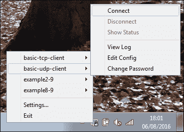
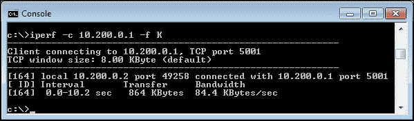
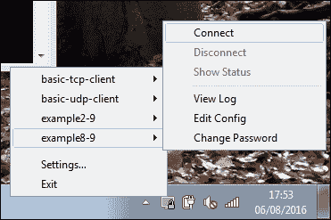
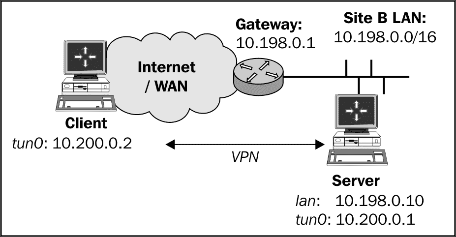
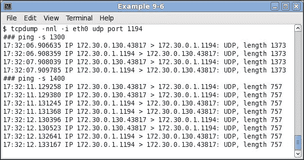

# 第八章：性能调优

在本章中，我们将讨论以下故障排除主题：

+   使用`ping`优化性能

+   使用`iperf`优化性能

+   比较 IPv4 和 IPv6 速度

+   OpenSSL 密码算法速度

+   OpenVPN 在千兆网络中的应用

+   压缩测试

+   流量整形

+   调整基于 UDP 的连接

+   调整基于 TCP 的连接

+   使用`tcpdump`分析性能

# 介绍

本章重点介绍如何从 OpenVPN 设置中获取最佳性能。有几个参数可以在服务器端和客户端进行调整，以获得最高的吞吐量和最低的延迟。然而，这些参数的最佳设置在很大程度上取决于网络布局。因此，本章中的配方将提供如何调整这些参数以及如何衡量性能增减的指南。这些指南随后可以应用于其他网络布局，以找到最佳性能。

# 使用 ping 优化性能

在本节中，我们将使用低级的`ping`命令来确定 OpenVPN 设置的最佳**最大传输单元**(**MTU**)大小。找到合适的 MTU 大小对性能有巨大影响，尤其是在使用卫星连接，或某些有线/ADSL 提供商时。尤其是，使用**PPPoE**(**以太网点对点协议**)协议的宽带连接通常具有非标准的 MTU 大小。在常规的局域网设置中，几乎不需要优化 MTU 大小，因为 OpenVPN 的默认设置接近最佳。

## 准备工作

确保客户端和服务器计算机通过网络连接。在本节中，服务器计算机运行的是 CentOS 6 Linux，客户端运行的是 Fedora 22 Linux，但也提供了 Windows 客户端的相关说明。

## 如何操作...

1.  我们首先验证客户端是否能连接到服务器：

    ```
    [client]$ ping -c 2 <openvpn-server-ip>

    ```

    这将向服务器发送两个 ICMP ping 数据包，应该返回两个回复。如果没有返回，那么防火墙或`iptables`规则可能在阻止 ICMP 流量。在继续之前，确保服务器可以使用`ping`命令访问。

1.  接下来，尝试从客户端向服务器发送一个大的 ping 数据包，并设置`Don't Fragment`(**DF**)位。奇怪的是，在 Linux 上，这是通过参数`-M do`来完成的。

    ```
    [client]$ ping -c 2 -M do -s 1600 <openvpn-server-ip>

    ```

    通常，这个命令不会成功：

    ```
    From 172.30.0.128 icmp_seq=1 Frag needed and DF set (mtu = 
            1500)

    ```

    从这个接口发送的数据包的最大大小为 1500 字节。从中需要减去以太网头部（通常是 28 字节），这意味着 ICMP 数据包的最大大小为 1472 字节：

    ```
    [client]$ ping -c 2 -M do -s 1472 <openvpn-server-ip>
    PING 172.30.0.128 (172.30.0.128) 1472(1500) bytes of data.
    1480 bytes from 172.30.0.128: icmp_seq=1 ttl=128 time=0.630 ms
    1480 bytes from 172.30.0.128: icmp_seq=2 ttl=128 time=0.398 ms

    ```

1.  对于 Windows 客户端，`ping`命令的语法略有不同：

    ```
    [winclient]C:> ping -f -l 1600 <openvpn-server-ip>
    Packet needs to be fragmented but DF set.

    ```

    以及：

    ```
    [winclient]C:> ping -f -l 1472 <openvpn-server-ip>
    Pinging 172.30.0.1 with 1472 bytes of data:
    Reply from 172.30.0.1: bytes=1472 time<1ms TTL=64

    ```

    1472 字节的有效载荷大小实际上是基于以太网网络的常规大小，尽管本节是在有线连接上进行的。

对于 OpenVPN 的`tun-mtu`设置，一个好的初始值是最大有效载荷大小加上之前减去的 28 字节。然而，这并不意味着这是最优值，正如我们在后面的配方中所看到的那样。

## 它是如何工作的...

`ping` 命令使用的 ICMP 协议有一个选项，用于设置标志 `Don't Fragment`（DF）。启用该标志后，ICMP 数据包在到达目的地之前不能被拆分成多个片段。如果路由器需要将数据包拆分才能传输，它将被丢弃，并返回 ICMP 错误代码。这提供了一种非常简单的方法来确定可以传输到服务器的最大数据包大小，反之亦然。特别是在高延迟网络中，例如使用卫星链接时，限制数据包数量并最大化每个数据包的大小非常重要。

通过巧妙地使用 `ping` 命令，可以确定最大数据包大小。然后，可以利用这个大小进一步优化 OpenVPN 的性能。

## 还有更多内容...

在某些网络配置中，ICMP 流量会被过滤，从而使此方法失效。如果能够访问 OpenVPN 服务器，那么也可以通过隧道来找出最大负载大小。

启动 OpenVPN 服务器并添加额外的标志：

```
cipher none 
auth none 

```

对 OpenVPN 客户端执行相同操作。确保禁用压缩（或简单地不指定）并且没有使用 `fragment` 选项。这将启动一个明文隧道，我们可以通过该隧道发送各种大小的 ICMP 数据包。

Ping 远程端的 VPN IP 地址，例如：

```
[client]$ ping -c 2 -M do -s 1472 10.200.0.1

```

当 ICMP 数据包变得太大时，流量将被一个间歇性的路由器丢弃。降低 ICMP 数据包的大小，直到 ping 命令成功返回。从这个值，可以推导出 MTU 大小。

## 另见

+   *调整基于 UDP 的连接* 配方，详细解释了如何调整基于 UDP 的配置性能

+   *调整基于 TCP 的连接* 配方，深入讲解了 TCP 基于连接的调优细节，并解释了网络适配器的 MTU 设置的一些复杂性

# 使用 iperf 优化性能

本方法并不真正关于 OpenVPN，而是更多地讲解如何在 OpenVPN 配置中使用网络性能测量工具 `iperf`。`iperf` 工具可以从 [`sourceforge.net/projects/iperf/`](http://sourceforge.net/projects/iperf/) 下载，支持 Linux、Windows 和 macOS。

在本方法中，我们将在 OpenVPN 外部以及通过 VPN 隧道运行 `iperf`，然后解释性能差异。

## 准备就绪

我们使用以下网络布局：


使用第二章中的*设置公共和私有密钥*食谱，配置客户端和服务器证书。对于这个食谱，服务器使用的是 CentOS 6 Linux 和 OpenVPN 2.3.11，客户端使用的是 Fedora 22 Linux 和 OpenVPN 2.3.11。保留来自*服务器端路由*食谱的配置文件`basic-udp-server.conf`，以及客户端配置文件`basic-udp-client.conf`，这些都来自第二章，*客户端-服务器 IP 仅网络*。

## 如何操作...

1.  启动服务器：

    ```
    [root@server]# openvpn --config basic-udp-server.conf

    ```

1.  接下来，启动客户端：

    ```
            [root@client]# openvpn --config basic-udp-client.conf
            ...
            ... Initialization Sequence Completed

    ```

1.  接下来，我们在服务器上启动 `iperf`：

    ```
            [server]$ iperf -s

    ```

1.  首先，我们测量隧道外的性能：

    ```
            [client]$ iperf -l 1M -n 8M -c <openvpn-server-ip>
            [  3]  0.0-15.2 sec  8 MBytes  4.1 Mbits/sec

    ```

    这实际上是测量发送到服务器的数据性能。本食谱中使用的有线网络的理论上传速限制为每秒 4 兆位（Mbps），我们在这次测试中达到了该速率。

1.  接下来，我们测量隧道内的性能：

    ```
            [client]$ iperf -l 1M -n 8M -c 10.200.0.1
            [  3]  0.0-17.0 sec  8 MBytes  3.95 Mbits/sec

    ```

    在这种网络设置下，隧道外的流量和通过隧道发送的流量之间存在小幅性能差异。

1.  在 802.11n 无线网络上进行第二次测试：

    ```
            [client]$ iperf -c <openvpn-server-ip>
            [  4]  0.0-10.8 sec  7.88 MBytes  6.10 Mbits/sec 

    ```

    对比：

    ```
            [client]$ iperf -c 10.200.0.1
            [  5]  0.0-11.3 sec  5.25 MBytes  3.91 Mbits/sec

    ```

    在这里，可以明显看到性能下降，表明 OpenVPN 配置并不理想。这个无线网络上噪声较多，导致优化变得困难。

## 它是如何工作的...

`iperf` 工具非常直观：它建立一个 TCP 连接（或者 UDP，如果需要）并测量它在该连接上发送或接收数据的速度。通常，流量只测试一个方向，虽然也可以使用 `-r` 标志触发双向测试。

## 还有更多...

网络性能的调优很大程度上依赖于网络延迟和可用带宽，详情请参考这里的内容。

### 客户端与服务器 `iperf` 结果

客户端和服务器的 `iperf` 进程报告在 `iperf -c` 会话结束后网络吞吐量的结果。实践表明，本食谱中使用的服务器报告的数字比客户端报告的数字更为准确。在编写此食谱时使用的有线网络，最大上传速度约为 4 Mbps。客户端有时会报告超过 4.4 Mbps 的速度，而服务器则报告更准确的 4.1 Mbps。

### 网络延迟

有线网络和无线网络在性能下降方面的主要差异之一，源于网络延迟。在有线网络中，延迟非常稳定，约为 11 毫秒。而在无线网络中，延迟在 2 毫秒到 90 毫秒之间波动。尤其是，延迟的这种波动会影响 `iperf` 性能测试结果，使得优化 OpenVPN 参数变得非常困难。

### 千兆网络

千兆网络上的性能测试显示，VPN 本身正在成为瓶颈。正常的 TCP 连接将显示 900 Mbps 的传输速率，而通过未调优的 OpenVPN 隧道的 TCP 连接最多也不会超过 320 Mbps。我们将在本章后面回来详细讨论这个问题。

## 另请参见

+   《在千兆网络中使用 OpenVPN》，将详细解释如何调优 OpenVPN 以在高速网络上提升性能的方法。

# 比较 IPv4 和 IPv6 的速度

这个方案是前一个方案的延续，但我们将集中讨论 IPv4 流量和 IPv6 流量之间的性能差异。在这个方案中，我们将在 VPN 隧道中使用 IPv4 地址和 IPv6 地址运行`iperf`，之后将解释性能差异。

## 准备就绪

我们使用以下网络布局：


使用《设置公共和私有密钥》一章的*设置客户端和服务器证书*方案来设置客户端和服务器证书，*客户端-服务器仅 IP 网络*。对于本方案，服务器计算机运行的是 CentOS 6 Linux 和 OpenVPN 2.3.11。客户端运行的是 Fedora 22 Linux 和 OpenVPN 2.3.11。保留来自《添加 IPv6 支持》一章的配置文件`example-2-4-server.conf`，*客户端-服务器仅 IP 网络*，以及客户端配置文件`basic-udp-client.conf`。

## 如何操作...

1.  启动服务器：

    ```
            [root@server]# openvpn --config example-2-4-server.conf

    ```

1.  接下来，启动客户端：

    ```
            [root@client]# openvpn --config basic-udp-client.conf
            ...
            ... Initialization Sequence Completed

    ```

1.  接下来，我们在服务器上启动`iperf`：

    ```
            [server]$ iperf -s

    ```

1.  首先，我们测量通过 IPv4 流量进行隧道时的性能：

    ```
            [client]$ iperf -l 1M -n 8M -c 10.200.0.1
            [  3]  0.0-17.0 sec  8 MBytes  3.95 Mbits/sec

    ```

1.  接下来，我们测量使用 IPv6 数据包时的性能：

    ```
            [client]$ iperf -l 1M -n 8M -c  2001:db8:100::1
            [  3]  0.0-17.7 sec  8 MBytes  3.78 Mbits/sec

    ```

这显示了大约 5%的性能差异。这种差异在所有类型的网络上都能稳定测量到。

## 工作原理...

IPv6 地址比 IPv4 地址更长。所有数据包的源和目的地地址都存储在经过 OpenVPN 隧道的加密数据包中。因此，使用较大的寻址方案时，实际的“有效负载”所剩下的字节数就会减少。IPv6 数据包实际上可以比 IPv4 数据包携带少 20 字节的“有效负载”。这 20 字节占了 5%的性能差异。对此几乎无能为力。

## 还有更多...

调整网络性能取决于网络特性，以及所使用的调整工具，这里将详细概述。

### 客户端与服务器 iperf 结果

客户端和服务器的`iperf`进程在`iperf -c`会话结束后报告网络吞吐量。实践表明，本食谱中使用的服务器报告的数字比客户端报告的数字更准确。此外，通过使用固定数据大小而不是默认的 10 秒固定时间间隔来运行`iperf`，可以获得更准确的结果。我们通过`iperf -l 1M -n 8M -c <IP 地址>`指定了固定的块大小（1MB）和固定的总大小（8MB）。

这增加了准确性并改善了客户端和服务器端报告数字的一致性。

# OpenSSL 加密算法速度

OpenVPN 使用 OpenSSL 执行所有的加密操作。这意味着，OpenVPN 客户端或服务器的性能取决于接收流量的解密速度以及发送流量的加密速度。对于一个与 OpenVPN 服务器连接的单个客户端，这通常不是问题，但当 OpenVPN 服务器同时连接数百个客户端时，加密性能变得非常重要。此外，在高速度网络链路（千兆位或更高）上运行 OpenVPN 时，加密性能也发挥着重要作用。

在本食谱中，我们将展示如何测量 OpenSSL 加密例程的性能，以及如何使用这些测量结果来提高 OpenVPN 服务器的性能。

## 准备工作

本食谱在多种计算机上进行：

+   一台老旧的笔记本电脑，配备 2.5 GHz 的 Intel Core2 Duo T9300 处理器，运行 Fedora Linux 22 64 位

+   一台较旧的服务器，配备 2.8 GHz 的 Intel Xeon X5660 处理器，并支持 AESNI 指令，运行 CentOS 6 64 位

+   一台高端服务器，配备 2.6 GHz 的 Intel Xeon E5-2697A v4 处理器，并支持 AESNI 指令，运行 CentOS 6 64 位

本食谱也可以轻松在 MacOS 上执行。每台计算机都安装了 OpenVPN 2.3 及其附带的 OpenSSL 库。

## 如何操作...

在每个系统上，运行以下 OpenSSL 命令：

```
$ openssl speed -evp bf-cbc
$ openssl speed -evp aes-128-cbc
$ openssl speed -evp aes-256-cbc

```

第一个命令测试 OpenVPN 默认的 BlowFish 加密算法的速度。第二个和第三个命令测试 128 位和 256 位 AES 算法的性能，这些算法通常用于保护网站安全。所有命令在新高端服务器上运行了两次：一次启用了 AES-NI 指令集，另一次则关闭了 AES-NI 支持，使用命令`$ OPENSSL_ia32=0 openssl speed -evp <cipher>`。

结果显示在下表中。表中的所有数字都是在加密一个数据块时每秒处理的字节数。数据块的大小列在表格的列中。

对于`BlowFish`加密算法，记录了以下结果：

| **类型** | **256 字节** | **1024 字节** | **8192 字节** |
| --- | --- | --- | --- |
| 笔记本电脑 | 95851.54k | 95426.22k | 95862.84k |
| 旧服务器 | 111466.67k | 111849.47k | 112162.13k |
| 新服务器 | 151329.96k | 152054.10k | 152428.54k |
| 新服务器，无 AES-NI | 151128.49k | 151951.02k | 152048.98k |

对于 `AES128` 加密算法，记录了以下结果：

| **类型** | **256 字节** | **1024 字节** | **8192 字节** |
| --- | --- | --- | --- |
| 笔记本电脑 | 85588.05k | 179870.91k | 183104.85k |
| 旧服务器 | 758884.44k | 762378.58k | 755960.49k |
| 新服务器 | 802229.85k | 806787.75k | 807682.05k |
| 新服务器，无 AES-NI | 160414.98k | 361608.53k | 368836.61k |

对于 `AES256`：

| **类型** | **256 字节** | **1024 字节** | **8192 字节** |
| --- | --- | --- | --- |
| 笔记本电脑 | 60698.20k | 130553.15k | 132085.73k |
| 旧服务器 | 560398.93k | 562632.92k | 564687.49k |
| 新服务器 | 577053.35k | 578981.21k | 579532.12k |
| 新服务器，无 AES-NI | 114444.29k | 266473.47k | 270030.17k |

## 它是如何工作的...

`openssl speed` 命令的输出显示，加密和解密性能取决于加密密钥和使用的硬件。大多数 OpenVPN 数据包约为 1500 字节，因此 1024 字节这一列是最值得关注的列。

`BlowFish` 加密算法的结果非常有趣，如果考虑到处理器的速度：如果将 `BlowFish` 的性能除以处理器时钟速度，结果非常相似。这意味着 `BlowFish` 的性能完全受限于处理器的时钟速度。运行在更高时钟速度的旧处理器可能实际上会超过时钟速度略低的新版处理器。

对于 `AES128` 和 `AES256` 加密算法，这个情况不再成立。现代的 i5/i7 和 Xeon 架构比旧的 Pentium 4 和 Athlon 架构要快得多。启用 AES-NI 扩展后，性能提升了 4 倍。如果设置一个必须支持大量客户端的 OpenVPN 服务器，那么这个加密算法是一个非常好的选择，前提是服务器的 CPU 支持这些扩展。

这个配方还提供了一个简单的测试，检查 AES-NI 指令是否可用，并且底层的 OpenSSL 库是否实际调用了这些指令。如果 `openssl` 和 `OPENSSL_ia32cap=0 openssl` 之间的速度结果没有差异，则说明 AES-NI 指令没有用于加密或解密。

## 还有更多...

加密算法的选择对 OpenVPN 性能的影响在单个客户端的情况下是最小的。根据本食谱的测量，当在现代系统上通过 VPN 隧道以最高速度下载文件时，客户端 CPU 的负载低于 8%。然而，在较旧的桌面电脑上，选择加密算法变得很重要：当 `BlowFish` 算法切换为 `AES256` 算法时，上传速度从 760 kbps 降至 720 kbps。特别是在使用较旧的硬件或某些家庭路由器设备时，这可能很快成为瓶颈。例如，大多数能够运行 OpenVPN 的家庭无线路由器（如支持 DD-WRT 或 OpenWRT 的无线路由器）都拥有约 250 MHz 的处理器速度。如果此路由器还用作 OpenVPN 服务器，尤其是在多个客户端同时连接时，处理器速度很快就会成为瓶颈。

## 另见

+   第六章中的 *加密不匹配* 配方，详细说明了如何排查客户端和服务器配置文件中的加密算法不匹配问题。

# 千兆网络中的 OpenVPN

随着高速网络的到来，对高速 VPN 的需求也增加了。OpenVPN 并非专门为高速设计，但通过现代硬件和正确的加密算法，使用 OpenVPN 2.4 可以达到接近千兆的速度。本食谱将展示如何实现这些速度。

## 准备就绪

我们使用以下网络布局：


本食谱中使用的客户端是一台搭载 Core i7-4810 处理器的笔记本，最高 TurboBoost 速度为 3.8 GHz。服务器是一台搭载 Xeon E5-2697A v4 处理器的服务器，最高 TurboBoost 速度为 3.6 GHz。将客户端和服务器都连接到千兆以太网交换机。使用第二章中的 *设置公钥和私钥* 配方设置客户端和服务器证书，*客户端-服务器仅 IP 网络*。在本食谱中，服务器计算机运行 CentOS 6 Linux 和 OpenVPN 2.4.0，客户端运行 Fedora 22 Linux 和 OpenVPN 2.4.0。保留第二章中 *服务器端路由* 配方中的配置文件 `basic-udp-server.conf`，以及客户端配置文件 `basic-udp-client.conf`。

## 如何操作...

1.  启动服务器：

    ```
    [root@server]# openvpn --config basic-udp-server.conf

    ```

1.  接下来，启动客户端：

    ```
            [root@client]# openvpn --config basic-udp-client.conf
            ...
            ... Initialization Sequence Completed

    ```

1.  接下来，我们在服务器上启动`iperf`：

    ```
            [server]$ iperf -s

    ```

1.  首先，我们测量隧道外的性能：

    ```
            [client]$ iperf -c <openvpn-server-ip>
            [  3]  0.0-10.0 sec  11 GBytes  900 Mbits/sec

    ```

    对于千兆以太网网络，这接近理论极限。

1.  接下来，我们在隧道内测量性能：

    ```
            [client]$ iperf -l 1M -n 8M -c 10.200.0.1
            [  4]  0.0-10.2 sec  292 MBytes  233 Mbits/sec 

    ```

    这是默认 OpenVPN 隧道的性能。

1.  停止客户端和服务器上的 OpenVPN 进程。

1.  现在，我们切换到 AES-256 加密算法，以利用两款处理器都支持的 AES-NI 指令：

    ```
            [server]# openvpn --config basic-udp-server.conf --cipher aes-
            256-cbc

    ```

    以及客户端：

    ```
            [client]# openvpn --config basic-udp-client.conf --cipher aes-
            256-cbc
            ...
            ... Initialization Sequence Completed

    ```

1.  再次，我们在隧道内测量性能，测试两个方向：

    ```
            [client]$ iperf -l 1M -n 8M -c 10.200.0.1 -r
            [  4]  0.0-10.2 sec  762 MBytes  610 Mbits/sec 
            [  5]  0.0-10.2 sec  807 MBytes  646 Mbits/sec 

    ```

    这清楚地表明，AES-NI 指令确实有所不同。

1.  再次停止客户端和服务器的 OpenVPN 进程。

1.  现在，我们切换到 AES-256-GCM，这是 OpenVPN 2.4 支持的新加密算法，相较于 AES-256 加密算法和 SHA2 HMAC 函数，它更为高效：

    ```
            [server]# openvpn --config basic-udp-server.conf --cipher aes-
            256-gcm

    ```

    以及客户端：

    ```
            [client]# openvpn --config basic-udp-client.conf --cipher aes-
            256-gcm
            ...
            ... Initialization Sequence Completed   
    ```

1.  再次，我们在隧道内测量性能，测试两个方向：

    ```
            [client]$ iperf -l 1M -n 8M -c 10.200.0.1 -r
            [  4]  0.0-10.2 sec  1.07 GBytes  859 Mbits/sec 
            [  5]  0.0-10.2 sec  1.08 GBytes  865 Mbits/sec 

    ```

最后的性能数据实际上非常接近通过千兆以太网 OpenVPN 隧道能够实现的最大速度。

## 它是如何工作的...

当使用具有高时钟频率并支持 AES-NI 指令的处理器时，OpenVPN 和操作系统能够跟上以千兆以太网速度进出的大量数据包。

新的 AES-256-GCM 加密算法在这里尤其有帮助，因为加密和身份验证（HMAC）在一个步骤中完成。这大大提高了性能，部分原因是计算时间更短，部分原因是这种加密算法每个数据包的加密开销更小，为实际的“有效载荷”留下了更多字节。

## 还有更多...

在千兆以太网中调整网络性能在很大程度上取决于所使用的硬件和操作系统。

### 明文隧道

另一个有趣的测试是关闭所有加密和身份验证（`--cipher none --auth none`），然后再次运行`iperf`测试。在本配方中使用的硬件上，得到了以下结果：

```
[  4]  0.0-10.2 sec  1.09 GBytes  874 Mbits/sec  
[  5]  0.0-10.2 sec  1.10 GBytes  879 Mbits/sec  

```

这些数字甚至更接近实际的线路速度，主要是因为没有加密开销，为“有效载荷”留出了最佳空间。

### Windows 性能

`iperf` 工具也可以在 Windows 上使用，因此上述方法也可以通过 Windows 客户端和/或服务器完成。与 Linux 客户端或服务器相比，结果会有所不同。我们可以通过使用`[WinClient]> iperf -w 128K -c <openvpn-server-ip>`实现类似的“原始”以太网速度。

然而，通过 OpenVPN 隧道的性能，无论是否加密，都远低于 200 Mbps，即使使用的是最快的处理器。这很可能是由于 Windows TAP 驱动程序的设计问题。此问题目前正在调查中。

# 压缩测试

如果正确编译，OpenVPN 内置支持 LZO 压缩。所有 Windows 二进制文件默认都支持 LZO 压缩。在本配方中，我们将展示在传输易于压缩的数据（如网页）和不可压缩数据（如照片或二进制文件）时，使用 LZO 压缩的性能。

## 准备工作

我们使用以下网络布局：


使用第二章中的*设置公钥和私钥*食谱设置客户端和服务器证书，*客户端-服务器 IP 仅网络*。在这个食谱中，服务器计算机运行的是 CentOS 6 Linux 和 OpenVPN 2.3.11。第一个客户端运行的是 Fedora 22 Linux 和 OpenVPN 2.3.11。保留第二章中*服务器端路由*食谱中的`basic-udp-server.conf`配置文件，和客户端配置文件`basic-udp-client.conf`。该食谱还在第二个客户端运行 Windows 7 64 位和 OpenVPN 2.3.11 时进行了重复。保留第二章中*服务器端路由*食谱中的`basic-udp-server.conf`配置文件，和来自*使用 ifconfig-pool 块*的客户端配置文件`basic-udp-client.ovpn`。

## 如何操作...

1.  将以下行添加到`basic-udp-server.conf`文件中：

    ```
    comp-lzo

    ```

    将其保存为`example8-6-server.conf`。

1.  启动服务器：

    ```
    [root@server]# openvpn --config example8-6-server.conf

    ```

1.  同样地，对于客户端，添加一行到`basic-udp-client.conf`文件中：

    ```
    comp-lzo

    ```

    将其保存为`example8-6-client.conf`。

1.  启动客户端：

    ```
    [root@client]# openvpn --config example8-6-client.conf

    ```

1.  接下来，我们在服务器上启动`iperf`：

    ```
    [server]$ iperf -s

    ```

1.  首先，我们测量传输隧道外数据时的性能：

    ```
    [client]$ iperf -c <openvpn-server-ip>

    ```

    这导致在 802.11n 无线网络上大约达到 50 Mbps 的吞吐量。

1.  接下来是不可压缩数据：

    ```
    [client]$ dd if=/dev/urandom bs=1024k count=60 of=random
    [client]$ iperf -c 10.200.0.1 -F random
    [  4]  0.0-10.0 sec  35.0 MBytes  29.3 Mbits/sec

    ```

    在第一步中，我们创建一个包含随机数据的 60MB 文件。然后，我们测量传输该文件时`iperf`的性能。

1.  最后，压缩数据（一个填充零的文件）：

    ```
    [client]$ dd if=/dev/zeroes bs=1024k count=60 of=zeroes
    [client]$ iperf -c 10.200.0.1 -F zeroes
    [  5]  0.0- 5.9 sec  58.6 MBytes  83.3 Mbits/sec

    ```

    显示了当传输可压缩数据（如文本文件和网页）时，VPN 隧道的性能。

1.  相同的测量可以使用 Windows PC 进行。将以下行添加到`basic-udp-client.ovpn`文件中：

    ```
    comp-lzo

    ```

    将其保存为`example8-6.ovpn`。

1.  启动客户端。

`iperf` 测量结果略有不同：

+   隧道外：50 Mbps

+   不可压缩数据：16 Mbps

+   可压缩数据：22 Mbps

显然，OpenVPN 的配置需要优化，但这不在本食谱的范围内。结果显示，对于 Windows 和 Linux 客户端，当通过隧道传输的可压缩数据时，性能有显著提升。

## 它是如何工作的...

启用压缩时，所有通过隧道发送的数据包会在加密和传输到另一端之前进行压缩。压缩使用 LZO 库，该库集成在 OpenVPN 中。此压缩是即时完成的，这意味着压缩比率没有事先压缩数据时那么好。但当传输文本页面时，性能提升依然显著。

## 还有更多内容...

当使用以下配置指令时，默认启用自适应压缩：

```
comp-lzo

```

当 OpenVPN 检测到某个数据不可压缩时，它会在不先压缩的情况下将数据发送到远程 VPN 端点。通过在两端指定以下设置，每个数据包都始终会被压缩：

```
comp-lzo yes

```

根据传输的数据类型，性能会稍微有所提高。

# 流量整形

在本例中，我们将使用流量整形来限制 OpenVPN 客户端的上传速度。这可以用来限制客户端到服务器之间的带宽，或客户端到客户端之间的带宽。请注意，OpenVPN 流量整形不能用于限制 OpenVPN 客户端的下载速度。限制下载速度最好使用外部流量控制工具，例如 Linux 上的 `tc` 工具，它是 LARTC 软件包的一部分。

## 准备中

我们使用以下网络布局：


使用 第二章 中的*设置公钥和私钥*食谱设置客户端和服务器证书，*客户端-服务器 IP 仅网络*。在本食谱中，服务器计算机运行 CentOS 6 Linux 和 OpenVPN 2.3.11，客户端运行 Windows 7 64 位和 OpenVPN 2.3.11。保留来自 第二章，*客户端-服务器 IP 仅网络* 的 `basic-udp-server.conf` 配置文件，以及来自*使用 ifconfig-pool 块*食谱的客户端配置文件 `basic-udp-client.ovpn`。

## 如何实现...

1.  将以下行追加到`basic-udp-server.conf`文件中：

    ```
    push "shaper 100000"

    ```

    这将限制 VPN 客户端的上传速度为每秒 100,000 字节（100 kbps）。将其保存为 `example8-7-server.conf`。

1.  启动服务器：

    ```
    [root@server]# openvpn --config example8-7-server.conf

    ```

1.  启动客户端：

1.  接下来，我们在服务器上启动`iperf`：

    ```
    [server]$ iperf -s

    ```

1.  当我们在 Windows PC 上运行`iperf`时，性能接近 100 KB/s：

1.  穿越隧道传输的 PNG 字节数（包括加密开销）实际上非常接近每秒 100,000 字节。

## 它是如何工作的...

当 OpenVPN 客户端连接到服务器时，服务器会推送一个选项，通过 VPN 隧道限制外发流量为 100 KB/s。每当流量通过隧道发送时，OpenVPN 客户端会将外发流量限制为最大 100 KB/s。下载速度不受此限制，注意，以下指令不能在 OpenVPN 服务器本身使用：

```
shaper 100000 

```

要限制离开服务器的流量，应该使用更高级的流量控制工具，例如 Linux 上的 `tc`。

# 调整基于 UDP 的连接

在本教程中，我们重点介绍了一些优化基于 UDP 的 VPN 隧道的基本技巧。这些技巧需要谨慎使用，因为没有一种万无一失的方法可以优化 OpenVPN 性能。实际的性能提升因每个网络配置的不同而有所差异。因此，本教程仅展示了一些可以用于优化的配置指令。

## 准备工作

我们使用以下网络布局：


使用第二章中的*设置公共和私有密钥*教程设置客户端和服务器证书，*客户端-服务器 IP-only 网络*。对于本教程，服务器计算机运行的是 CentOS 6 Linux 和 OpenVPN 2.3.11，客户端运行的是 Fedora 22 Linux 和 OpenVPN 2.3.11。保留第二章中*服务器端路由*教程的`basic-udp-server.conf`配置文件，以及客户端配置文件`basic-udp-client.conf`。

## 如何操作...

1.  将以下行添加到`basic-udp-server.conf`文件中：

    ```
    fragment 1400

    ```

1.  将其保存为`example8-8-server.conf`。

1.  启动服务器：

    ```
    [root@server]# openvpn --config example8-8-server.conf

    ```

1.  同样地，对于客户端，在`basic-udp-client.conf`文件中添加一行：

    ```
    fragment 1400

    ```

1.  将其保存为`example8-8-client.conf`。

1.  启动客户端：

    ```
    [root@client]# openvpn --config example9-6-client.conf

    ```

1.  接下来，我们在服务器上启动`iperf`：

    ```
    [server]$ iperf -s

    ```

1.  首先，我们测量隧道外的性能：

    ```
    [client]$ iperf -c <openvpn-server-ip>
    [  4]  0.0-16.7 sec  8.00 MBytes  4.03 Mbits/sec

    ```

    这实际上是测量发送到服务器的数据性能。本教程中使用的电缆网络理论上传输速率为 4 Mbps。请注意，这个结果几乎与*使用 iperf 优化性能*教程中的结果相同。

1.  接下来，我们在隧道内测量性能：

    ```
    [client]$ iperf -c 10.200.0.1
    [  4]  0.0-18.3 sec  8.00 MBytes  3.66 Mbits/sec

    ```

    由于 OpenVPN 隧道的存在，性能会有所下降，但结果几乎与教程*使用 iperf 优化性能*中的结果相同。

    分片确实会影响`ping`的往返时间。

1.  对于不同的`fragment`选项值，从客户端到服务器运行`ping`命令：

    ```
    [client]$ ping -c 10 10.200.0.1

    ```

结果列在以下表格中：

| **分片大小** | **Ping 结果** |
| --- | --- |
| 默认 (1500) | 9.4 +/- 1.0 毫秒 |
| 1400 | 9.9 +/- 1.5 毫秒 |
| 400 | 19.2 +/- 8 毫秒 |

因此，向服务器配置中添加`fragment`选项对于此网络配置而言不是一个可行的选项。然而，在其他网络配置中，这可能会提高性能。

## 它是如何工作的...

OpenVPN 配置指令`fragment 1400`会导致所有大于 1400 字节的加密数据包被分段。如果网络延迟足够低，则对性能没有明显影响，如`iperf`的结果所示。通过降低分段大小，数据包被分成更多的包。这会导致较大数据包的往返时间增加。如果网络延迟已经很高，这将导致更多的延迟问题。因此，`fragment`选项和相关的`mssfix`选项必须小心使用。

## 还有更多...

`fragment`指令通常与`mssfix`指令一起使用：

```
mssfix [maximum-segment-size] 

```

该指令通知通过隧道运行的 TCP 会话，要求它们限制发送数据包的大小，以便在 OpenVPN 将它们封装后，OpenVPN 发送到其对等端的 UDP 数据包大小不会超过最大分段大小。它也被 OpenVPN 内部使用，用于设置出站数据包的最大分段大小。如果未指定最大分段大小，则使用`fragment`指令中的值。

理想情况下，`mssfix`和`fragment`指令一起使用，其中`mssfix`会尽量避免 TCP 需要数据包分段，如果仍然有大数据包通过（例如，来自非 TCP 协议的包），则`fragment`指令会对其进行内部分段。

## 另见

+   本章中的下一个食谱解释了如何以非常相似的方式调整基于 TCP 的连接。

# 调整基于 TCP 的连接

在这个食谱中，我们专注于一些优化基于 TCP 的 VPN 隧道的基本技术。在基于 TCP 的 VPN 设置中，VPN 端点之间的连接是一个常规的 TCP 连接。这有其优点和缺点。主要优点是，通常设置 TCP 连接比设置 UDP 连接更容易，主要是由于防火墙的限制。通过 TCP 隧道传输 TCP 流量的主要缺点是，当网络连接较差时，可能会出现严重的性能损失。这种性能损失是由*tcp-over-tcp*症状引起的。TCP 协议保证数据包的顺序传送，因此如果某个数据包在传输过程中丢失，它将被重新发送。一旦新数据包被接收，数据包的顺序就会恢复。在此之前，所有在`丢失`数据包之后的数据包都将被暂停。通过 TCP 连接隧道传输 TCP 流量的问题在于，两个层都希望保证数据包按顺序传送。这可能会导致大量重传，从而带来巨大的性能损失。

然而，当正确调整时，通过 TCP 连接的 OpenVPN 隧道可以达到与通过 UDP 连接的 OpenVPN 隧道相同的性能。在本食谱中，我们将展示一些调整此类基于 TCP 的 OpenVPN 连接的技术。

## 准备开始

我们使用以下网络布局：


使用第二章中的 *设置公钥和私钥* 配方设置客户端和服务器证书，*客户端-服务器仅 IP 网络*。对于这个配方，服务器计算机运行的是 CentOS 6 Linux 和 OpenVPN 2.3.11，而客户端运行的是 Windows 7 64 位和 OpenVPN 2.3.11。保留 第二章中的 *服务器端路由* 配方中的配置文件 `basic-udp-server.conf`，以及 *使用 ifconfig-pool 块* 配方中的客户端配置文件 `basic-udp-client.ovpn`。

## 如何操作...

1.  创建服务器配置文件：

    ```
            proto tcp 
            port 1194 
            dev tun 
            server 10.200.0.0 255.255.255.0 

            ca       /etc/openvpn/cookbook/ca.crt 
            cert     /etc/openvpn/cookbook/server.crt 
            key      /etc/openvpn/cookbook/server.key 
            dh       /etc/openvpn/cookbook/dh2048.pem 
            tls-auth /etc/openvpn/cookbook/ta.key 0 

            persist-key 
            persist-tun 
            keepalive 10 60 

            topology subnet 

            user  nobody 
            group nobody 

            daemon 
            log-append /var/log/openvpn.log 

            tcp-nodelay 

    ```

1.  将其保存为 `example8-9-server.conf`。

1.  启动服务器：

    ```
    [root@server]# openvpn --config example8-9-server.conf

    ```

1.  接下来，创建客户端配置文件：

    ```
            client 
            proto tcp 
            remote openvpnserver.example.com 
            port 1194 

            dev tun 
            nobind 

            remote-cert-tls server 
            ca       "c:/program files/openvpn/config/ca.crt" 
            cert     "c:/program files/openvpn/config/client2.crt" 
            key      "c:/program files/openvpn/config/client2.key" 
            tls-auth "c:/program files/openvpn/config/ta.key" 1 

    ```

1.  将其保存为 `example8-9.ovpn`。

1.  启动客户端：

1.  接下来，在服务器上启动 `iperf`：

    ```
    [server]$ iperf -s

    ```

1.  然后，测量隧道的性能：

    ```
    [WinClient]> iperf -c 10.200.0.1 -w 128k

    ```

在这个特定网络上，测试了以下设置：

| **协议** | **结果** |
| --- | --- |
| UDP | 147 Mbits/sec |
| TCP | 115 Mbits/sec |
| 带有 tcp-nodelay 的 TCP | 146 Mbits/sec |

如图所示，使用 TCP 运行 OpenVPN 的性能几乎与使用 UDP 运行 OpenVPN 时的性能相同，前提是使用了 `--tcp-nodelay` 指令。

## 它是如何工作的...

当 OpenVPN 使用 TCP 作为底层协议时，所有数据包都通过常规的 TCP 连接传输。默认情况下，TCP 连接会使用 Nagle 算法，在该算法中，较小的数据包会被延迟并收集，直到它们被发送出去。对于 OpenVPN 隧道来说，在大多数情况下，这会对性能产生不利影响，因此禁用 Nagle 算法是有意义的。通过添加 `--tcp-nodelay` 指令，我们禁用了 Nagle 算法，并且性能得到了显著提升。

## 还有更多...

可调的两个重要参数是：

+   `--tcp-nodelay` 指令

+   通过 `--tun-mtu` 或 `--link-mtu` 指令调整 TUN/TAP-Win32 适配器的 MTU 大小

在 Linux 上，TUN（或 TAP）适配器的 MTU 大小可以动态调整，但在 Windows 上，这并不容易。必须配置 OpenVPN 以匹配服务器上指定的 MTU 大小。然而，在使用新的 MTU 大小之前，必须调整 TAP 适配器的 MTU。自 Windows Vista 起，现在也可以使用 `netsh` 命令动态调整 MTU：

+   首先，找到正确的子接口编号：

    ```
    [winclient]C:> netsh interface ipv4 show subinterfaces

    ```

+   接下来，要更改子接口的 MTU 大小，请使用：

    ```
    [winclient]C:> netsh interface ipv4 set subinterface "1" 
            mtu=1400

    ```

请注意，这些命令必须以提升的权限运行。

如果 Windows TAP-Win32 适配器的 MTU 设置大于 OpenVPN 配置的 MTU 大小，OpenVPN 日志文件中可能会出现以下消息：

```
... read from TUN/TAP  [State=AT?c Err=[c:\src\21\tap-win32\tapdrvr.c/2447] #O=4 Tx=[29510,0] Rx=[15309,0] IrpQ=[0,1,16] PktQ=[0,22,64] InjQ=[0,1,16]]: More data is available.  (code=234) 

```

对于这个特定的网络，所有对 MTU 大小的更改（包括适当的 Windows 重启）对性能没有产生积极的影响。

# 使用 tcpdump 分析性能

在本食谱中，我们将分析使用`tcpdump`工具的 OpenVPN 配置性能。也可以使用 Wireshark 工具，它适用于 Linux、Windows 和 Mac OS X。本食谱虽然没有介绍任何新的 OpenVPN 功能，但展示了如何进行这样的分析，依然很有帮助。

## 准备就绪

我们使用以下网络布局：



使用*设置公钥和私钥*食谱来设置客户端和服务器证书，见第二章，*客户端-服务器仅限 IP 网络*。在此食谱中，服务器计算机运行 CentOS 6 Linux 和 OpenVPN 2.3.11，客户端运行 Fedora 22 Linux 和 OpenVPN 2.3.11。请保留`example8-8-server.conf`配置文件，来自第二章的*Tuning UDP-based connections*食谱，以及来自同一食谱的客户端配置`example8-8-client.conf`。

## 操作步骤...

1.  启动服务器：

    ```
            [root@server]# openvpn --config example8-8-server.conf

    ```

1.  接下来，启动客户端：

    ```
            [root@client]# openvpn --config example8-8-client.conf

    ```

1.  在服务器上，运行`tcpdump`来监控网络接口上的传入数据包（而不是隧道接口本身）：

    ```
            [root@server]# tcpdump -nnl -i eth0 udp port 1194

    ```

    这指示`tcpdump`在本地网络接口上监听所有 UDP 流量，端口为`1194`，这是 OpenVPN 的默认端口。

1.  从客户端 ping 服务器的 VPN IP 地址，使用两种不同的大小：

    ```
            [client]$ ping -c 2 -s 1300 10.200.0.1
            [client]$ ping -c 2 -s 1400 10.200.0.1

    ```

以下数据包出现在`tcpdump`屏幕上：



第一个 ICMP 数据包未分段发送，因为它们小于 1400 字节。第二组加密的 ICMP 数据包大于分段大小（1400），因此被分成两部分。

## 工作原理...

OpenVPN 配置指令`fragment 1400`会导致所有大于 1400 字节的加密数据包被分段。在观察加密流量时，可以通过 ping OpenVPN 服务器来验证这一点。需要注意的是，需要分段的数据包会均匀分段：所有数据包的大小相同。

同时，请注意，以下命令会导致加密数据包大于 1400 字节：

```
[client]$ ping -c 2 -s 1400 10.200.0.1

```

用于安全隧道的加密会给传输的数据包增加额外的开销。这是使用 VPN 隧道（不仅仅是 OpenVPN）相比非加密流量时性能下降的根本原因之一。在大多数网络中，这个开销并不会被注意到，但它始终存在。

## 另见

+   本章中的*Tuning UDP-based connections*食谱解释了如何使用`fragment`指令。
