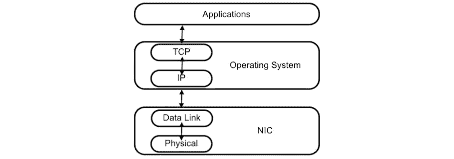
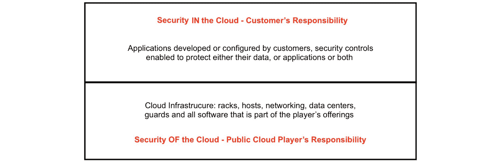

# 第一章：理解 API 及其安全性

**应用程序编程接口**（**APIs**）几乎无处不在，尽管它们的创建早于全球网络的出现。由于 API 在我们日常生活中的重要性，并且为了确保设备和系统之间的可持续通信，建议您从理解 API 是什么，以及它们可能存在的安全问题开始阅读本书。

在本章中，您将了解 API 的基本概念、它们的一些历史以及一些著名的 API 示例。您将了解到 API 的主要组件，以及它们如何相互作用以实现*魔力*的运作。

您还将了解 API 的不同呈现方式，以及它们的类型和部署中涉及的协议。根据您愿意创建的软件，您会发现设计一个更具体的 API 类型可能更合适。

本章还涵盖了 API 安全性的重要性，讨论了其设计和部署阶段的前提条件。到本章结束时，您将了解一些常见漏洞是如何从安全性差的 API 中产生的，以及它们可能对您的环境造成的影响。

本章将涵盖以下主要主题：

+   什么是 API？

+   API 类型和协议

+   API 安全性的重要性

+   常见的 API 漏洞

# 什么是 API？

有几个定义。例如，Red Hat 表示，API 是“*一套用于构建和集成* *应用程序软件*的定义和协议。”而**Amazon Web Services**（**AWS**）则表示，“*API 是使两个软件组件能够使用一套定义和协议相互通信的机制*。”当然，API 不仅限于两个软件组件，但这两个定义都包含了这一部分：“*定义和协议*”。让我们通过与类比世界的比较来创造我们自己的定义。

API 是两个不同部分（代码）之间的桥梁（通信路径），无论它们是否属于同一个城市（同一程序）。通过遵循一套预先建立的交通规则（协议）和约定（定义），车辆（请求和响应）可以在两侧自由流动。有时，API 可能会有速度控制（节流装置），根据需要执行。

就像所有通信方式一样，首先需要建立定义。这条规则不仅限于数字世界。如果你不知道什么是“销售”或“汽车”是一种交通工具，我不能要求你卖给我一辆车。协议同样至关重要。除非你是赠送产品，否则销售始于我支付你我想要的产品的费用，而你将产品交给我。如果需要，还包括找零。

在 API 的定义中，涉及到在通信方之间哪些**类型**和**长度**的数据是可接受和允许的。例如，当接收方期望接收一个数字时，请求方不能将数据作为字符串发送。负数也可能对编写不良的 API 造成额外的挑战。在处理数据长度时，适用最小值，尤其是最大值。稍后你将了解，如何阻止大于 API 能处理的块大小的数据传输是非常重要的。

协议是 API 的第二个组成部分。作为网络领域的对应物，它们负责确保独立编写的软件能够以有效的方式进行通信。即使你主要是因为 Web 相关的 API 及其安全漏洞而阅读本书，我也需要告诉你，甚至在你的计算机内部，API 也在**操作系统**（**OS**）与 Wi-Fi 卡之间工作，并具有类似于更著名的 Web API 的定义和协议。如果你熟悉**传输控制协议/互联网协议**（**TCP/IP**）栈，那么以下的图对你来说并不陌生。TCP/IP 上的通信之所以能够发生，是因为每个小*矩形*都有自己实现的低层协议，这样就能让同一个**网络接口卡**（**NIC**）在不同的操作系统之间使用，并且这些不同的操作系统可以相互通信：



图 1.1 – 使用 TCP/IP 进行通信

每个 API 都应该有良好的文档，这样任何想使用它的人就不必向其创建者或维护者请求信息。你能想象如果每次新产品发布时，**国防高级研究计划局**（**DARPA**）的科学家们收到来自网络接口卡制造商的关于如何开发数据链路层、应该使用哪些数据结构、以及应该考虑哪些数据类型和大小的询问，会是一场怎样的灾难吗？

在编写 API 文档时，至少需要明确数据类型和采用的协议的定义。完善的 API 文档通常还会提供使用示例，以及在发生错误时可能产生的异常，比如数据处理错误或意外行为。

## API 的简史

本书中你将阅读大量关于 Web API 的内容。然而，正如你在 TCP/IP 示例中看到的，API 并不是随着 Web 一起诞生的。这个概念的诞生要追溯到几十年前，1951 年，当时三位英国计算机科学家 Maurice Wilkes、David Wheeler 和 Stanley Gill 提出了这一概念，他们当时正在构建 **电子延迟储存自动计算机**（**EDSAC**），这是最早的计算机之一。他们的著作《电子数字计算机程序的准备》主要解释了他们所构建的库以及其子程序（如果你需要开发一个程序以在 EDSAC 上运行）。从书名可以看出，书中重点解释了如何使用这台计算机。这本书成为我们有记录的第一本 API 文档。

进入 1960 和 70 年代，计算机的使用逐渐增长，得益于电气和电子电路的改进。计算机的体积也开始缩小，尽管如此，它们仍然占据着一个房间的大小。此时，API 的使用开始与开发者不必担心显示器或其他外设如何工作的需求相关联。我们处于大型主机时代，而新方式与计算机交互的出现，例如终端和打印机，给程序开发者带来了额外的挑战。1975 年，英国数学家和计算机科学家 Cristopher Date 和 Edgar Codd 发表了一篇题为《关系与网络方法：应用程序编程接口的比较》的论文。在这篇论文中，API 被提出应用于数据库，至今这一概念仍在使用。

进入 1980 年代，我们开始看到消费网络的商业探索。1984 年，CompoServe 推出的在线购物服务 *电子商城* 向其订阅用户提供。用户可以通过该公司的 **消费者信息服务** 网络从其他商家购买产品。你可能会问，这其中哪里有 API。随着计算机网络的逐步使用，开发者需要让他们的代码更加复杂，并且对远程计算机上存储的代码和库的访问要求开始出现。正是 1981 年，美国计算机科学家 Bruce Nelson 首次提出了 **远程过程调用**（**RPCs**）的概念。这个概念非常简单，就是客户端向网络服务器发送请求，服务器处理该请求（执行某些计算）并将结果返回给客户端。因此，RPC 就是我们所知道的 *消息传递* 机制，通过某个通道（通常是计算机网络）实现不同元素之间通过消息交换的通信。

在 1990 年代，也就是在 API 的概念首次提出超过 40 年后，互联网在全球范围内普及开来（在美国，这一变化发生在近十年前）。互联网此前仅限于研究机构和政府机关使用，而商业化的网络使用在那时变得完全可行。这进一步推动了 API 的采用，它们成为了程序之间交换信息的*事实标准*。新的网站不断涌现，新的消费产品和服务通过互联网得以商业化，软件之间需要通过标准来进行沟通变得愈加明确。由 Sun Microsystems（现为 Oracle Inc.一部分）创建的编程语言 Java 在这一过程中起到了至关重要的作用。1984 年，Sun Microsystems 的第 21 号员工 John Gage 提出了“*网络就是计算机*”这一观点。用他自己的话说，“*我们将关于互联世界的愿景建立在开放和共享的标准之上。*”十一年后，另一位 Sun Microsystems 的员工 James Gosling 创建了 Java 编程语言，随后发展为 Java 2，并成为了重要 API 的基石，这些 API 作为**Java 2 企业版**（**J2EE**，现在的**Jakarta EE**）和**Java 2 微型版**（**J2ME**）的一部分发布。

到了 2000 年代，互联网基本上已经巩固下来。不断增加的加入网络的公司数量，以及大量开发者创造的新网页解决方案，要求一种快速有效的方式来建立客户端（当时大多是浏览器）和网页服务器之间的通信路径。2000 年，Roy Fielding 在其博士论文《*网络基础软件架构的建筑风格与设计*》中提出了一种结构化的方法来允许客户端和服务器在互联网上交换信息。Roy 提出了**表现层状态转移**（**REST**），它成为了全球最受欢迎的 API 协议之一。这个年代还见证了云计算的爆炸式增长，无论是私有云还是公有云，大多数实现了 REST。2004 年，Web 2.0 的诞生也标志着互联网使用方式的变化（更加注重以用户为中心），同时像 Facebook、X（前身为 Twitter）、Reddit 等应用也在这一时期诞生。

十年后，在 2010 年代，网络协议更为发展。那是社交媒体和应用程序的时代，每分钟数百万个请求。举个例子，2013 年，每分钟互联网流量中，包括其他流量，461,805 个 Facebook 登录，38,000 张 Instagram 照片上传和 347,000 条推文发送。这也是容器和基于微服务的应用程序迎来最广泛采用的十年。Kubernetes 的发布，作为开源容器编排工具，扩大了互联网动态应用的可能性。正是在 2010 年代，**Web 3.0**这一术语首次被提出，主要聚焦于区块链技术。API 成为了公司为公众创建和交付产品的基础。

正如 Tears for Fears 1985 年热曲*Head Over Heels*所说，时间过得“*真是快得令人惊讶*”。时光飞逝，我们进入了 2020 年代。如今，应用程序不断更新，但我们现在有了更加分散运行的系统。边缘计算和**物联网** (**IoT**) 等概念的出现增加了整个场景的复杂性，并要求 API 进化以适应这些变化。Web 3.0 实际上是在 2021 年才被纳入。现在，我们正在设计和开发围绕 API 的应用程序，而不是像技术早期那样反过来。

# API 类型和协议

回到我们的网络世界，这里有一些显著的 API 协议：

+   **简单对象访问协议** (**SOAP**)：它允许访问对象，通过 HTTP 保持通信，并基于**可扩展标记语言** (**XML**) 。它简单且提供了一个很好的方式来建立 Web 应用程序之间的通信，因为它是操作系统独立的，且不依赖于技术和编程语言。

+   **REST**：也许是现在使用的最著名的 Web API 协议，REST 是一种设计 Web 服务的架构风格。因此，遵循这种风格的服务被称为**RESTful**。REST 操作的预定义集合是无状态的，服务可以访问构造来操作数据的文本表示形式。

+   **谷歌远程过程调用** (**gRPC**)：由搜索引擎背后的公司开发，它是另一种基于 HTTP 的架构，恰好是开源的。它应用缓冲区以允许数据在对之间传输。

+   **JavaScript 对象表示法 – 远程过程调用** (**JSON-RPC**)：就像 REST 一样，JSON-RPC 也是无状态的，使用对象（像 SOAP 一样），并且在需要更高性能时可以替代 REST。

+   **图形查询语言** (**GraphQL**)：由 Meta（前身为 Facebook）创建，旨在成为一种数据库查询语言。GraphQL 是开源的，通过使用 JSON 等简单数据结构，允许复杂的响应。

让我们更深入地分析每个协议。

## SOAP

由于 SOAP 是基于对象的，为了简化，通信中的两个对等方必须就他们交换信息时使用的元素达成一致。SOAP 消息由常规的 XML 文件实现，至少包含以下元素：

+   **正文**：它包含关于调用和响应的信息。

+   **信封**：这用于将文件标识为 SOAP 消息。

+   **故障**：它携带有关错误和状态的信息。

+   **头部**：顾名思义，包含头部信息。

尽管 SOAP 消息必须使用 XML 作为结构，但此类文档不能包含处理指令或**文档类型定义**（**DTDs**）。XML 文档的属性是在 DTD 内定义的。SOAP 1.1 规范有三部分：

+   **信封**，定义了消息的内容、应该处理它的结构，以及是否是强制性的或可选的规格。

+   **编码规则**，定义了序列化数据类型时使用的机制。

+   **RPC**表示法，用于指示如何表示远程调用及其响应。

SOAP 1.2 规范只有两个部分：

+   消息信封。

+   数据模型和协议绑定。

从组织结构的角度来看，SOAP 消息由命名空间组成。根元素是 SOAP 信封。`Header`、`Body`和最终的`Fault`元素都包含在其中。所有 SOAP 信封必须指定`http://www.w3.org/2003/05/soap-envelope/`，`encodingStyle`属性可能出现在其中，以指示消息内部使用的编码模式。信封声明可能如下所示：

```
<soap:Envelope

soap:encodingStyle="http://www.w3.org/2003/05/soap-encoding">
```

SOAP 消息中的头部是可选的，但如果存在，它必须位于消息的开始位置，即在`Envelope`声明之后。其目的是存储特定于应用程序的数据，例如支付信息或`env:role`、`env:mustUnderstand`和`env:relay`。第一个用于定义与头部块关联的角色。第二个是一个布尔变量，当其值为`true`时，表示消息的接收者必须处理该头部。如果在处理头部时出现问题，则会生成一个故障元素。最后，`env:relay`组件仅由中继（中间节点）检查或处理。它是 SOAP 1.2 规范中的新特性。一个包含两个块的示例头部可能如下所示（标签被分成多行以便于阅读）：

```
<env:Header>
  <BA:BlockA 
   env:role="http://mysoap.com/role/A" env:mustUnderstand="true">
   ...
  </BA:BlockA>
  <BB:BlockB 
   env:role="http://mysoap.com/role/B" env:relay="true">
    ...
  </BB:BlockB>
</env:Header>
```

在这个示例中，A 块部分有一个`mustUnderstand`子句，其值为`true`，意味着接收者必须处理它。B 块仅供中间节点解析，因为`env:relay`属性被设置为`true`。这两个块都有角色规范。

**XML 协议**（**XMLP**）是另一种基于 XML 的消息交换协议，直到 2009 年才停止使用，SOAP 规范 1.2 发布后的两年。XMLP 提出了一个抽象模型，而 SOAP 详细描述了实现该模型的基本原语。SOAP 和 XMLP 都具有绑定的概念，用于确定 XMLP 和/或 SOAP 应连接的其他协议。SOAP 最流行的绑定之一（如果不是最流行的话）就是 HTTP。这意味着 SOAP 消息可以有效地用于通过 HTTP 实现对等通信。

## REST

预定义的 REST 操作集是无状态的（与 XMLP 相同），并且服务可以访问构造体来操作数据的文本表示。尽管 SOAP 和 XMLP 具有绑定功能，可以将它们连接到其他应用层协议，甚至传输层（TCP 或 UDP），但 REST 更多与 HTTP 相关（同样是无状态的），因此，操作这些构造体减少了开发人员和系统管理员学习 HTTP 术语的难度。使用 HTTP 时，REST 可以使用协议的所有方法：`CONNECT`、`DELETE`、`GET`、`HEAD`、`OPTIONS`、`PATCH`、`POST`、`PUT` 和 `TRACE`。REST 用于定义 HTTP 1.1 版本的规范。

可能存在中介节点，在 REST 的情况下，这些节点表现为网关，如缓存或代理服务器，甚至是防火墙。这些节点可能为架构提供可扩展性，因为消息内部不保存状态，而且可以在响应中插入一些显式的缓存信息。根据 Roy Fielding 的规范，有六个约束条件决定一个系统是否可以被归类为 RESTful，具体如下：

+   **客户端-服务器**：尽管可能存在中介节点，但通信通常只发生在两个对等体之间。

+   **无状态**：RESTful 消息中不存储状态。会话状态必须由客户端管理。由于状态不被控制，这使得架构具备可扩展性。

+   **缓存**：中介节点可以充当缓存服务器。服务器指向可以缓存的内容，客户端会遵循这一指引。

+   **统一接口**：通过使用通用性，架构变得更简单，从而提高了交互的可见性。

+   **分层系统**：通过采用层级结构，每一层仅能访问与其直接交互的其他层，这样可以实现对遗留服务的封装。

+   **按需代码**：通过从服务器下载和执行额外的代码，可以扩展客户端功能，从而简化客户端设计。

任何基于 REST 的设计的核心是`POST`，读取操作对应`GET`，更新操作对应`PUT`，删除操作对应`DELETE`（HTTP 动词通常在技术文献中用大写字母表示）。

尽管 REST 和 SOAP 有许多相似之处，但它们在如何进行远程调用（RPC）方面存在一些显著的差异。另一方面，在 REST 中，客户端定位服务器中的资源，并选择对其进行什么操作（修改、删除或获取信息——分别对应`UPDATE`、`DELETE`和`GET` HTTP 方法）。在 SOAP 中，客户端不会直接与资源进行交互。相反，客户端需要调用一个服务，服务再对相关的对象和资源执行所需的操作。

为了绕过这种工作方式，SOAP 利用了一些框架，允许它为客户端提供额外的功能。其中一个框架是`getTermRequest`，例如`string`类型，WSDL 在使用 SOAP 进行 Web 服务时提供了更进一步的能力。

我们需要理解为什么 REST 几乎完全取代了 SOAP，成为现代 Web API 领域的主流。比较 REST 和 SOAP 时，支持 REST 的一个关键因素是 SOAP 基于 XML。XML 语言能够生成相当复杂且冗长的文档，这些文档显然需要发送方正确构造，并由接收方解析。解析 XML 文档（或结构）意味着读取它并将其元素转换为一种数据结构，之后应用程序可以进一步处理。最著名的解析器之一叫做**文档对象模型**（**DOM**）。使用 DOM 的一个缺点是它消耗大量内存，可能是文档中原始描述的内存大小的几倍。

在计算机科学中，数据序列化是将数据结构中存在的抽象对象（或元素）转换成可以存储在计算机上或在计算机之间传输的格式的过程。反序列化是与此相反的操作。随着文档中使用嵌套，数据序列化变得更加复杂。XML 允许元素嵌套。在 XML 规范中没有正式的限制，这基本上意味着元素可以无限制地嵌套。复杂性可能带来安全威胁。通过解析 XML 文档，应用程序可以将其元素存储在**结构化查询语言**（**SQL**）数据库中，将其转换为表、行和列，甚至作为 NoSQL 数据库中的**键值**（**KV**）对。当从未知或不可信的源接受序列化对象时，这可能会给应用程序带来不必要的风险。

**开放 Web 应用程序安全项目**（**OWASP**）是一个全球性组织，定期发布网络安全最佳实践，包括安全的代码开发，并维护一些著名的安全项目。其中之一是**Top Ten**，它列出了对 Web 应用程序最具威胁性的十大安全问题。最新版本发布于 2021 年。数据反序列化不安全属于*A03-2021 注入*类别，这意味着它被认为是应用程序第三大最危险的威胁。

在同一项目中，**XML 外部实体**（**XXE**）攻击被归类为对网络安全构成的第五大危险威胁，属于*2021 年 A05 安全配置错误*组。如果 XML 文档使用了 DTD，它可能会被 XML 解析器错误地解读。DTD 是指定 XML 文档结构的第一种方式，它还可以用来确定 XML 数据应如何存储。

使用 DTD 时，一个易受攻击的 XML 解析器可能会成为**拒绝服务**（**DoS**）攻击的受害者，这种攻击被称为**XML 炸弹**（也称为**十亿笑话攻击**）。通过指定十个 DTD 实体，每个后续实体是前一个实体的十倍引用，这将导致第一个实体出现十亿次。如前所述，为了在内存中容纳所有实体，XML 解析器需要分配大量内存，最终会崩溃，导致应用程序无法使用。

另一方面，REST API 主要基于 JSON 数据结构。这些是更简单的文档，作为映射组织，利用键值对（KV 对）的概念。JSON 文件不需要特定的解析器；它们支持不同类型的数据，如字符串、布尔值、数字、数组和对象。然而，与 XML 文件相比，JSON 文件通常较小。JSON 也不支持注释。因此，JSON 结构更紧凑，也更容易编写和处理。下面的代码块包含一个 JSON 结构的示例：

```
{
    "config_file": "apache.conf",
    "number_of_replicas": 2, "active": true,
    "host_names": [
        "server1.domain", "server2.domain"
    ]
}
```

## gRPC

gRPC 的核心思想是让你作为开发者，调用一个远程方法（位于你同事的电脑上或世界另一端），就像它在你自己的代码库中一样。换句话说，客户端（在规范中称为**存根**）调用一个函数，带有预期的参数，但该函数甚至不在它的代码中，而是在其他地方实现的。为了解决这个问题，你需要遵循 gRPC 调用的服务器端所定义的规范。这些定义包括可接受的数据类型以及方法调用结束后返回的内容。所有的工作都基于创建一个服务，通过这些方法向客户端提供数据。

gRPC 的另一个有趣的特点是它对现代编程语言的支持，这使得你可以在团队中分配开发任务，例如，让 Go 程序员负责服务器，而 Python 程序员则专注于构建客户端。由于该协议是由 Google 创建的，因此 gRPC 服务器也可以托管在公司的公共云上。

gRPC 与之前讨论的其他两种协议之间有一个主要的区别：它使用 `protoc` 协议缓冲编译器，数据类在代码中创建。数据结构存储在 `.proto` 扩展名的文本文件中。在 `.proto` 文件中，你创建一个服务并定义在客户端和服务器之间流动的消息。当你运行 `protoc` 时，它会创建或更新相应的类。以下代码块展示了一个这样的文件示例：

```
service MyService {
    rpc ProcessFile (FileRequest) returns (ExitCode);
} // Comments are supported.
message FileRequest {
    string FileName = 1;
}
message ExitCode {
    int code = 1;
}
```

在前面的代码中，你正在创建一个名为`ProcessFile`的服务，该服务由应用程序的客户端在一个名为`FileRequest`的方法中调用，该方法返回`ExitCode`作为输出。这个方法的实现位于应用程序的服务器部分。显然，根据 gRPC 的定义，客户端和服务器部分可以位于不同的机器上。服务可以有四种不同的类型：

+   **一元请求**：客户端发送一个请求并等待一个响应。

+   **服务器流式传输**：客户端发送一个请求，响应作为消息流返回。消息按顺序发送。

+   **客户端流式传输**：客户端发送一系列消息并等待来自服务器的单一响应。

+   **双向流式传输**：两方都发送消息序列。

有趣的是，gRPC 也可以作为 `protoc` 编译器。在 Python 中，编译器作为 **Python 包安装器** (**PIP**) 模块实现。

## JSON-RPC

正如我们介绍的，JSON-RPC 是当性能是一个重要因素时，替代 REST 的一个不错选择。该协议的一个特点是，客户端可以发送请求而无需等待服务器的响应。另一个特点是，客户端可以向服务器发送多个请求，服务器返回的响应顺序与原始请求顺序不同。换句话说，服务器的响应是异步跟随的。

当前的规范是 2.0，并且与之前的 1.0 版本不完全兼容。当客户端和服务器没有运行相同版本的协议时，JSON-RPC 2.0 请求和响应对象可能无法正确理解，尽管容易识别 2.0 规范，因为它使用一个名为 `jsonrpc` 的键，其值为 `2.0`。所有 JSON 原始数据类型（字符串、数字、布尔值、null）和结构（数组和对象）都得到完全支持。

在发送请求和接收响应时，必须遵守严格的语法（记得我们之前提到过 API 定义吗？）。以下是请求中可能的成员：

+   `jsonrpc`：当使用该规范时，它包含 `2.0`。

+   `method`：包含要调用的远程方法名称的字符串。

+   `params`：可选成员，结构化（可以是数组或对象），包含传递给调用方法的参数。

+   `id`：可选成员，可以是字符串、数字或 null，包含请求的标识。

同样，也有响应结构的定义。其成员如下：

+   `jsonrpc`：与请求中的描述相同。

+   `result`：仅在方法成功调用时存在；其内容由调用的方法提供。

+   `error`：仅在方法未成功调用时存在；这是一个对象成员，其内容由调用的方法提供。

+   `id`：与请求中的描述相同，需要携带与请求中指定的相同值。

错误对象有其自己的结构。你可以很容易地看出 REST 和 JSON-RPC 之间的另一个区别。没有 `GET`、`PUT` 或 `POST` 等 HTTP 方法被调用。相反，提供了一个简单的 JSON 结构。另一个区别在于响应格式。REST 可以使用 JSON 或 XML 格式，而 JSON-RPC 仅支持 JSON。在错误处理方面，你刚刚看到 JSON-RPC 有其自己的 `error` 成员。REST 提供了 HTTP 状态码，例如 200（当提供的数字注册 `id` 是已注册学生时，`IsStudent` 会返回 `True` 或 `False`。第一个请求成功，而第二个请求会产生错误）：

```
{"jsonrpc": "2.0", "method": "IsStudent", "params": [100], "id": 1}
{"jsonrpc": "2.0", "result": true, "id": 1}
{"jsonrpc": "2.0", "method": "IsStudent", "params": ["ABC"], "id": 2}
{"jsonrpc": "2.0", "error": {"code": -1, "message": "Invalid enrollment id format"}, "id": 2}
```

## GraphQL

正如其名所示，GraphQL 是一种用于查询由 API 提供的数据的语言。等等！这在协议小节里，语言怎么在这里？协议的一般定义可以是“*一组规则，必须正确遵循才能成功建立两个或更多对等方之间的通信。*” GraphQL 也实现了这一点。

它由 Meta（当时是 Facebook）在 2012 年创建，并于 2015 年作为开源项目发布。后来，2018 年，它开始由 Linux 基金会托管，并由 GraphQL 基金会接管了所有权。一个著名的特点是，GraphQL 只暴露一个端点，方便开发者请求和接收所需的数据。其他 API 协议可能最终会暴露多个端点，以满足提供不同类型数据或数据分布在多个数据库或系统中的需求。

数据格式也类似于 JSON，只是有一些微小的变化。GraphQL 和 REST 之间有着巨大的差异。与其发出请求、获取结果，并在分析结果后调整请求然后提交新请求，GraphQL 允许应用程序交互式地更改请求，直到接收到令人满意的结果。这得到了**WebSockets**的支持，这是一种允许 HTTP 客户端与服务器之间进行持续双向通信的技术，双方都可以发送和接收数据，任何一方都可以关闭连接。

由于任何一方，客户端或服务器，随时都可以互相传输数据，WebSockets 也非常适合用于发送通知，尤其是从服务器到客户端，当连接仍然保持开放时。这个协议的一个应用场景是货币兑换网站。客户端只需查询一次服务器获取汇率，每当汇率变化时，服务器就会通知客户端新的汇率。GraphQL 也支持查询参数。你可以基于某个标准过滤结果，或者请求服务器进行数据转换或计算，所有操作都在同一个查询中完成。接下来的代码块展示了一个请求的示例：

```
{
  student(id: 100) {
    name
    grade(average: True)
  }
}
```

上面的代码查询服务器获取一个 `id` 为 `100` 的学生。客户端想要学生的姓名和他们的成绩，但只需要平均成绩（通过课程模块计算的平均分），而不是具体成绩（`average: True`）。一个可能的答案在下面的代码块中。请注意，GraphQL 的响应遵循与请求相同的结构：

```
{
  "data": {
    "student" {
      "name": "Mauricio Harley"
      "grade": 85.2128
    }
  }
}
```

GraphQL 的数据结构有一个模式。这样，在设计查询时，开发人员可以提前知道响应中可能返回的数据类型。值得注意的是，考虑到模式已经正确设置，一个查询可能只需少量的努力就能生成一系列项目作为响应。

# API 安全性的重要性

即使是你在这里看到的简单代码和模板示例，一个细心的读者也会意识到，从这些简单的数据结构和查询中可能会产生潜在的安全漏洞，因为这些简单的结构和查询可能会用少量的代码行造成大量的资源消耗。安全软件开发并不是一个新的流行词，但随着新威胁和攻击的出现，它逐渐获得了更多的关注。

一些公司更倾向于将更多的时间和资金投入到应急策略中，例如实施一个与业务连续性计划相绑定的事故响应团队。尽管这一点非常重要，我们知道这些团队通常是在事情发生之后才投入使用。他们只能进行损害控制，尽量减少某些入侵对公司资产的影响。其他一些公司则认为他们的系统是安全的，仅仅因为它们运行在公共云上。众所周知，公共云服务商与客户共享安全责任，这种方式被称为共享责任模型：



图 1.2 – 公共云共享责任模型

与任何正在开发的重大软件一样，API 也有它们的生命周期，并且它们属于一个管道。普遍的看法是，安全性应该尽可能向左迁移，这意味着应该尽早考虑潜在缺陷的安全问题，而不是等到后期再考虑。你需要从 API 设计开始就考虑安全性。然而，对于预算有限或缺乏适当技术支持的公司来说，这可能并不容易。也就是说，并非所有公司在早期阶段都会采取安全对策，因为它们根本做不到。

在开发 API 时，你应该从选择你的 API 将使用的协议开始。考虑这里讨论过的协议，并选择一个你认为能满足应用程序需求和用户期望的协议。查找协议的缺点，并验证是否可以让一个公共云服务商为你实现 API。所有主要的云服务商都有 API 管理或网关服务。它们通常实施安全最佳实践，并与 Web 防火墙集成。

API 通常是应用程序唯一的入口点，或者至少是最常用的入口。这就是为什么加强它们的安全性对任何业务领域都至关重要的原因。API 的每个部分都应该获得相应的保护。例如，你是如何处理身份认证（AuthN）和**授权**（**AuthZ**）的？你是使用令牌还是仅使用用户名/密码凭证对？这些令牌或凭证是如何存储的，并且它们如何在 API 端点和客户端之间流动？你是否管理它们的生命周期？你是否记录每次令牌或凭证的使用情况，以及拥有这些令牌或凭证的用户试图访问系统的哪些部分？你是否定期旋转令牌或凭证？你能看到仅仅一个关注点就提出了多少问题吗？处理不当的身份认证（AuthN）和授权（AuthZ）可能导致潜在的入侵和重大损失。

# 常见的 API 漏洞

身份认证（AuthN）和授权（AuthZ）只是设计和开发 API 时需要特别注意的众多话题之一。尽管它们是两个独立的概念，但通常会一起讨论，因为没有一个就没有另一个的意义。它们不仅在处理外部用户时相关。当你的应用程序需要与内部系统或合作伙伴应用程序进行交互时，同样或其他的控制措施也必须到位。应用程序之间会相互通信，冒充应用程序或外部用户是我想要讨论的第一个漏洞。

OWASP，这个我们之前提到的组织，也拥有**2023 年 API 安全前十**项目。它的 API 安全前十倡议将 API1:2023——**破损的对象级权限控制（Broken Object Level AuthZ）**和 API1:2023——**破损的身份验证（Broken AuthN）**定位为两个最危险的威胁。第一个话题是关于在 API 执行过程中未正确处理对对象的访问。这样可能会导致敏感数据无意中暴露给未授权的人。因此，必须在对象级别上实施访问验证和保护措施。第二个话题与上一段讨论的内容相关。错误地处理身份验证数据，或实施了弱身份验证机制或已知的安全漏洞，会成为 API 管理中的一个重大难题。

接下来，我们将讨论**破损的对象级权限控制（Broken Object Property Level AuthZ）**，这是排名第三的严重威胁。容易受此漏洞影响的 API 要么没有实现必要的安全控制，要么仅部分实现了这些控制，导致对象级别的访问保护不足，尤其是未授权人员可能会接触到不该公开的数据。它类似于破损的对象级权限控制，但该漏洞涉及的是 API 显示了超出必要的数据来执行其功能。接下来的威胁是**不受限制的资源消耗**。你还记得我们之前讨论 XML 和 XMLP 时提到过，XML 文档的创建方式可能会导致安全漏洞吗？这正是指的这种情况。API 如果没有正确解析输入，可能会遭受 DoS 攻击，因为会进行更多的处理或磁盘访问，导致成本增加。假设 API 运行在公有云服务商上，如果更多的处理被请求，可能导致启动新的实例（虚拟机）或将随机数据存储到高性能磁盘区域。这将导致月度账单呈指数级增长，或者触发一些由云服务商或公司管理的限流机制，使得 API 停机或进入休眠状态。无论如何，应用程序都会停止运行。

身份验证授权问题（AuthZ）再次出现在下一个威胁中。随着你的 API 变得越来越复杂并且触及其他系统，尤其是在与其他系统交互时，你可能会遇到 **功能级别授权失效（Broken Function Level AuthZ）**，这意味着你需要密切关注在 API 内部创建的角色和角色所涉及的权限。当这些角色和权限没有被明确定义和强制执行时，不当处理 API 层级结构可能会导致漏洞，使得属于某个角色的用户能够有意或无意地（即使是合法用户，也可能会不小心遇到这种问题）获取更高角色的权限。API 并不构成整个应用程序。它是更大系统的一部分，有时，为了支撑系统的正常运转，会有多个业务流程同时运行。当你拥有**对业务流程的无限制访问**时，可能会出现一个漏洞：API 会暴露这些流程的内部结构。因此，攻击者利用这一漏洞可能会推断出 API 背后的业务逻辑。我们稍后将进一步讲解。

**服务器端请求伪造（SSRF）** 是一种非常常见的威胁，针对 Web 应用程序和 API，包括云环境中的威胁。一个易受攻击的 API 可能会接受任何 URI，包括执行内部命令，这些命令可能会暴露 API 背后的支持系统：操作系统、内核或库版本，及其他组件等。保护 API 本身非常重要，必须通过安全设计和实施来加以防护。巴西葡萄牙语中有句谚语，翻译过来大概是：“*一只燕子不能代表一个夏天*”。我想说的是，仅仅保护 API 本身是不够的。当一个系统存在**安全配置错误**时，换句话说，当帮助 API 运作的系统没有足够频繁地更新，或者没有被调整以实施安全最佳实践时，这种威胁就会变成 API 的现实。

管理 API 运行的整个环境非常重要，包括端点、底层系统、库等。API 和其他软件一样，都有版本，最终这些版本会被淘汰。运行弃用版本的端点应该被淘汰或使其不可用。当发生**不当的库存管理**时，遗忘的 API 端点或支持系统仍可能参与到 API 当前的实现中，暴露出额外的可利用漏洞。你开发的 API 是为合法用户或第三方所设计的。然而，保护 API 的投资通常更多地集中在外部用户，而非合作伙伴。当攻击者发现 API 集成时，他们可能会尝试利用第三方来入侵原本针对的端点。这被称为 **不安全的 API 使用**，通过采用我们稍后会讨论的 **零信任** 术语，能够避免或至少减少这种情况的发生。

# 总结

本章介绍了 API 背后的概念，并简要回顾了它们的历史，包括解释了数据定义是什么，并披露了实现 API 的主要协议。接着，我们讨论了 API 安全性对现代应用程序的重要性，并通过讲解最常见的 API 漏洞结束了本章内容。希望你已经享受了我们向 API 渗透测试之旅的开始。

在下一章中，我们将设置我们的渗透测试环境。将介绍一些工具，给出执行示例，并且我们有机会通过克隆书籍的代码库来节省时间，这将帮助我们利用一些工具。

# 延伸阅读

+   你可以在[`www.redhat.com/en/topics/api/what-are-application-programming-interfaces`](https://www.redhat.com/en/topics/api/what-are-application-programming-interfaces)找到 Red Hat 关于 API 的定义。

+   你可以在[`aws.amazon.com/what-is/api/`](https://aws.amazon.com/what-is/api/)找到 AWS 关于 API 的定义。

+   查看关于 TCP/IP 与 OSI-RM 模型比较的科学文章：https://ieeexplore.ieee.org/document/46812

+   *电子数字计算机的程序准备*： [`archive.org/details/programsforelect00wilk/mode/2up`](https://archive.org/details/programsforelect00wilk/mode/2up)

+   你将会找到一篇比较 API 的科学文章：[`dl.acm.org/doi/10.1145/800297.811532`](https://dl.acm.org/doi/10.1145/800297.811532)

+   阅读电子商务简史：[`web.archive.org/web/20160326123900/http://gsbrown.org/compuserve/electronic-mall-1984-04/`](https://web.archive.org/web/20160326123900/http://gsbrown.org/compuserve/electronic-mall-1984-04/)

+   DS 的论文*《网络基础软件架构的架构风格与设计》*： [`www.ics.uci.edu/~fielding/pubs/dissertation/top.htm`](https://www.ics.uci.edu/~fielding/pubs/dissertation/top.htm)

+   这张信息图展示了 2013 年和 2014 年每分钟的互联网数据生成情况：[`www.fourthsource.com/general/internet-minute-2013-vs-2014-infographic-18293`](https://www.fourthsource.com/general/internet-minute-2013-vs-2014-infographic-18293)

+   OWASP Top Ten 项目：[`owasp.org/www-project-top-ten/`](https://owasp.org/www-project-top-ten/)

+   gRPC 官方文档：[`grpc.io/docs/`](https://grpc.io/docs/)

+   查看官方的 JSON-RPC 文档：[`www.jsonrpc.org/specification`](https://www.jsonrpc.org/specification)

+   你可以在[`owasp.org/www-project-api-security/`](https://owasp.org/www-project-api-security/)了解更多关于 OWASP Top Ten API 项目的信息。
