# 第三章：API 侦察与信息收集

在进攻之前了解地形是一条军事格言。著名的《孙子兵法》作者**孙子**写道：“*你应该对周围的地形有强烈的认识。*”了解目标 API 的情况与删除攻击痕迹一样重要。因此，了解再出发！

API 侦察与信息收集是收集关于 API 的信息的过程，例如其端点、方法、参数、认证机制和业务目的。这些信息可以用来识别安全漏洞、测试 API 的功能，或者开发与 API 交互的新应用程序。

在本章中，你将学习侦察与信息收集技术，这些技术将成为渗透测试规划活动的一部分。实际上，在前一章中正确设置好你的工具箱后，下一步就是收集关于目标的信息。

你将学习重要的概念，如枚举、API 文档、**开源情报** (**OSINT**) 和 API 模式。所有这些概念基本上都与互联网上的任何现代 API 相关。我们将使用 OWASP 的 crAPI 和 WebGoat 项目作为我们的练习场。

在本章中，我们将讨论以下主要内容：

+   识别和列举 API

+   分析 API 文档和端点

+   利用开源情报（OSINT）

+   识别数据和模式结构

# 技术要求

理想情况下，你应该已经按照 *第二章*中的指导建立了你的渗透测试环境。然而，如果你还没有建立，也没关系。

你可以使用以下工具来完成本章内容：

+   需要一个像 Oracle VirtualBox 这样的虚拟机管理程序。

+   一个 Linux **虚拟机** (**VM**)，我推荐选择 Ubuntu 或 Fedora 发行版，因为这两者有大量的实用工具。

+   Postman ([`www.postman.com/downloads/`](https://www.postman.com/downloads/))。

+   OWASP **完全荒谬的 API** (**crAPI**) ([`github.com/OWASP/crAPI/`](https://github.com/OWASP/crAPI/))。

+   OWASP WebGoat ([`owasp.org/www-project-webgoat/`](https://owasp.org/www-project-webgoat/))。

+   OWASP ZAP ([`www.zaproxy.org/`](https://www.zaproxy.org/))。

+   在容器引擎方面，使用 Docker 或 Podman，后者是 Docker 的超集。

+   如果你选择使用 WebGoat 的独立版本，你将需要一个 Java 运行时环境。我建议选择 OpenJDK，Ubuntu 和 Fedora 都有其包。其他发行版也可能有。

+   你需要至少 30 GB 的磁盘空间、2 个 vCPU 和 4 GB 的内存来容纳虚拟机。推荐配置为 50 GB、4 个 vCPU 和 8 GB。

重要提示

在本书写作时，还没有适用于 Apple Silicon 芯片电脑的稳定版本的 VirtualBox。可用的测试版本无法启动 ARM 虚拟机。如果这是你的情况，建议改用 UTM（[`mac.getutm.app/`](https://mac.getutm.app/)）。有几种安装方法，包括通过 Homebrew。本章使用 Ubuntu 22.04 LTS 服务器作为 UTM 上的虚拟机。

# 识别和枚举 API

目标的识别和枚举可以是被动的或主动的，这不仅仅限于 API。被动侦查涉及在不直接与 API 交互的情况下收集 API 的信息。这可以通过多种方法完成，例如：

+   **搜索公共文档**：许多 API 提供者发布描述 API 端点、方法、参数和身份验证机制的文档。这些文档可以在提供者的网站、在线论坛或代码仓库中找到。

+   **分析公共流量**：如果 API 是公开可访问的，可以分析 API 的流量，以了解它是如何使用的。可以使用如 Wireshark 或 Fiddler 等工具来完成此操作。

+   **搜索暴露的信息**：API 提供者可能会在公共论坛或代码仓库中不小心暴露敏感信息，如 API 密钥或密码。可以使用搜索引擎或如 Shodan 等工具找到这些信息。

**被动侦查**是指在不与 API 直接交互的情况下获取 API 的信息。换句话说，你需要通过使用其他来源（如公共文档、分析公共流量或搜索暴露的信息）来寻找所需的信息。许多 API 提供者发布关于其 API 方法、动词和参数的文档，以及身份验证和授权的工作原理。这最终可能会揭示出控制机制的弱点，例如简单的用户名/密码组合。如果 API 是公开可访问的，你可以通过捕获其流量来分析它，借助 Wireshark 和 Fiddler 等工具。此外，敏感数据，如密钥、令牌、密码或特殊配置参数，可能在代码仓库或论坛中不小心泄露。通过使用网页搜索引擎或如 Shodan 等工具，你可以轻松找到它们。

**主动枚举**，另一方面，要求你与 API 进行交互。就像渗透测试中的所有主动阶段一样，请记住，你的操作可能会被 API 提供者记录。不管怎样，主动侦查通常遵循以下顺序：

1.  你首先通过发现 API 的端点（即它等待的 URL）并回答请求来开始。使用蜘蛛工具，如 Sitebulb 或 Screaming Frog SEO Spider，你可以枚举所有 API 的端点：

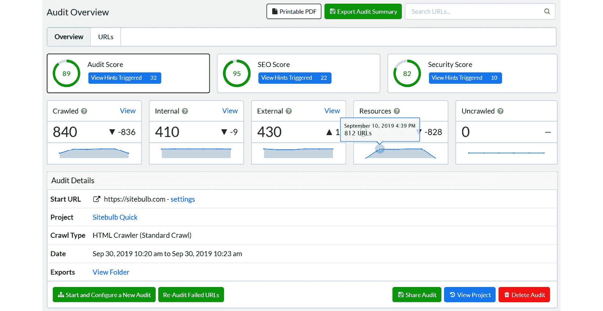

图 3.1 – Sitebulb 的界面（图片来源：Sitebulb）

然后，你可以通过 `curl` 工具或像 Postman 这样的工具向它们发送请求。事实上，Postman 的一个非常有趣的功能是将你在图形界面中构建的请求转换为 `curl` 命令：

```
$ curl --location 'https://url/api' \
--header 'Authorization:<authorization token>' \
--form 'form_field_1="content of field 1"' \
--form 'upload=@"/path/file_to_upload"' \
--form 'form_field_2="content of field 2"' \
--form 'format="PDF"' \
--form 'description="Details about the File"'
```

1.  一些 API 端点接受可以用来控制 API 行为的参数。通过探测这些参数，你可以了解更多关于它们的信息，包括哪些值是可接受的，以及它们如何影响 API 的操作。

1.  你还可以选择测试 API 的认证机制。有些 API 在你发送只读请求时，即使没有事先认证，也会返回数据。然而，如果 API 需要某种类型的认证控制，你可以测试它来了解其健壮性，例如，通过构造特殊或模糊的凭证。

现在，我们将介绍一些非常适用于渗透测试的工具，包括 crAPI，你将在本书的其余部分使用它。

## 分析 WebGoat

让我们开始玩转我们的实验室吧。Docker 已安装，并且包含 crAPI 和 WebGoat，两者都使用 Docker 镜像。crAPI 配有一个 Docker Compose 多容器定义文件。你完全可以选择任何其他分发版和安装 WebGoat 和 WebWolf（WebGoat 的附带应用，用于测试一些功能）的方法。两者可以使用相同的 Docker 镜像安装，或者直接使用单独的 Java Archive 文件执行。Wireshark 也已安装。

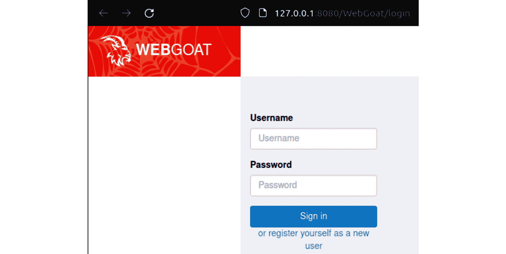

图 3.2 – WebGoat 的登录页面 (http://localhost:8080/WebGoat/login)

以下截图显示了 WebWolf 的登录页面：

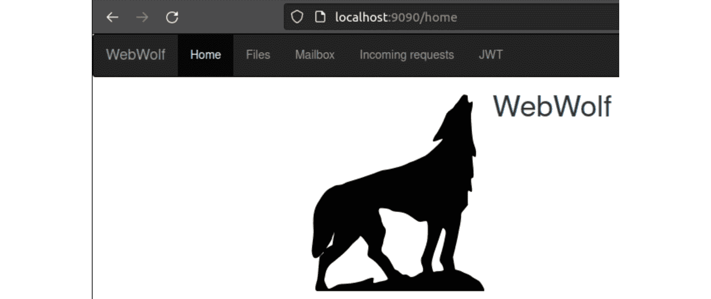

图 3.3 – WebWolf 的初始页面 (http://localhost:9090/home)

由于我们的目标 API 是 crAPI 和 WebGoat，因此没有 API 文档可供查询，这减少了我们的被动侦察选项。但我们仍然可以模拟一些流量捕获来理解它是如何工作的。启动 Wireshark，并在回环接口（`127.0.0.1`）上开始捕获。为了避免被系统生成的其他流量淹没，可以设置过滤器，仅捕获 TCP 端口 `8080` 上的 HTTP 包（`tcp.port == 8080 and http`）。通过简单加载 WebGoat 的登录页面，你会看到捕获的数据行不断出现。为了方便识别数据包的捕获时间，你可以通过点击**视图** | **时间** **显示格式**来改变 Wireshark 显示的方式。

你需要先注册一个账户才能开始使用该工具。本书中的示例使用 `pentest`/`pentest` 作为一对凭证。注册账户并启动 Wireshark。观察捕获的一个数据包。显然，我们可以看到密码，因为 WebGoat 在通信中没有应用数字证书：

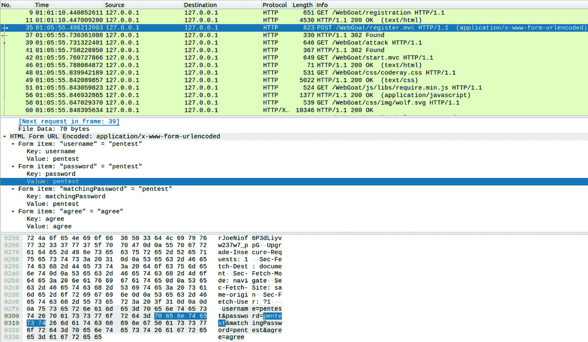

图 3.4 – Wireshark 数据包捕获的输出，显示明文密码

从该数据包中，你可以验证创建凭证的元素叫做`/WebGoat/register.mvc`，它是由`/WebGoat/registration`调用的。尝试通过`curl`单独调用它，看看是否有有用的信息。如果你运行`curl -vslk http://localhost:8080/WebGoat/register.mvc`，你将看到类似以下的内容。为了简洁起见，部分输出已被省略。

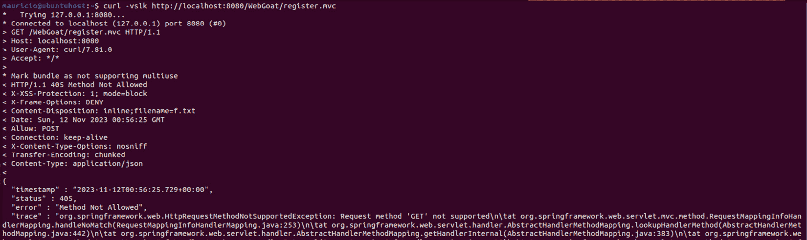

图 3.5 – WebGoat 的 register.mvc 元素抛出错误信息

`curl` 工具默认使用 `GET` HTTP 动词。我们刚刚发现，这个元素不支持 `GET` 动词，它只是抛出了一个非常有信息量的错误信息，提示（例如）应用程序使用了 Spring 框架。甚至还提供了其中一个受影响的源代码文件及其行号：`RequestMappingInfoHandler.java`，第`253`行！你也可以通过浏览器获取这些信息，但熟悉使用 `curl` 非常重要。虽然这是一个不错的开始，但 WebGoat 并不是一个特别适合我们深入了解 API 内部的工具。crAPI 是更好的选择。

## 查看 crAPI

crAPI 是一个有意设计为易受攻击的应用程序，提供 RESTful API，旨在帮助探索 OWASP 的 API 安全十大威胁（[`owasp.org/API-Security/`](https://owasp.org/API-Security/)）。在编写本书的同时，恰逢 API 安全十大项目的最新发布。另一个像 crAPI 的工具是 Juice Shop（[`owasp.org/www-project-juice-shop/`](https://owasp.org/www-project-juice-shop/)），它是用 JavaScript 编写的。

当你完成运行 crAPI 的 Docker Compose 文件后，可以通过访问`http://localhost:8888/`来打开应用程序。你将被重定向到`/login`路径。这并不一定意味着你正在处理一个 RESTful API。被重定向到另一个路径仅仅意味着应用程序识别到你尚未认证，或者在你尝试打开一个过时的组件时，将你重定向到正确的页面。命令如下：

```
$ docker compose -f docker-compose.yml --compatibility up -d
```

向后兼容标志已在新版 Docker Compose 中实现。对先前版本的支持已于 2023 年 6 月结束。更多信息请参考[`docs.docker.com/compose/compose-file/compose-versioning/`](https://docs.docker.com/compose/compose-file/compose-versioning/)。

由于它是基于容器的应用程序，你将利用无需手动下载所有组件的优势。当 Compose 完成下载镜像、创建卷和环境变量以及定义限制后，你将看到以下容器：

| **容器名称** | **容器镜像** | **用途** |
| --- | --- | --- |
| `api.mypremiumdealership.com` | gateway-service | 脆弱的 API |
| `crapi-community` | 同名 | 社区博客 |
| `crapi-identity` | 同名 | 身份验证端点 |
| `crapi-web` | 同名 | Web UI |
| `crapi-workshop` | 同名 | 汽车维修车间 |
| `mailhog` | 同名 | 邮件服务 |
| `mongodb` | mongo | 不言自明 |
| `postgresdb` | postgres | 不言自明 |

表 3.1 – crAPI 的容器和镜像及其用途

crAPI 实现了一个网站，供车辆所有者搜索、查找并请求汽车维修，同时暴露了一个 RESTful API 以便完成这些任务。我假设你已经按照前一章节的内容安装了 ZAP 或 Burp Suite。我们这里将使用 ZAP。第一个 crAPI 页面是一个登录/注册对话框：

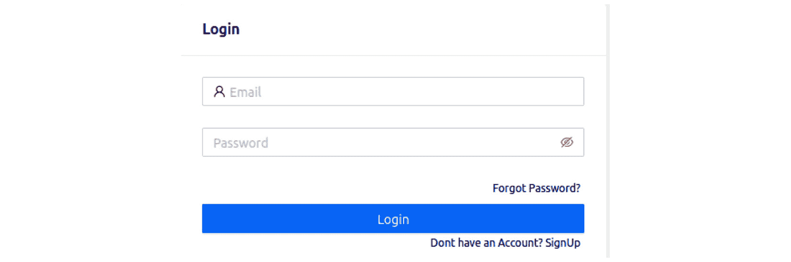

图 3.6 – crAPI 的登录页面

你可以通过在用户名或邮箱地址字段中输入特殊字符来稍微测试一下注册页面。你甚至可以输入一个无效的电话号码（前端逻辑仅检查内容是否非空），我就这么做了，并在 ZAP 上查看结果。我将电话号码留空并尝试注册，响应如下：

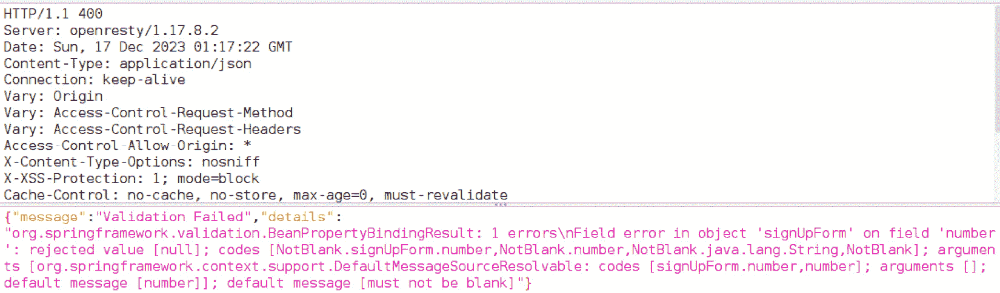

图 3.7 – 无效的注册页面，揭示应用后端的详细信息

在与 Web 应用程序的首次互动中，甚至没有构造特殊请求，我们就发现它运行在 Spring 框架上，这意味着我们正在处理一个基于 Java 的后端。太酷了！现在让我们填写表单，作为车主登录。响应提供了一个持有者令牌：

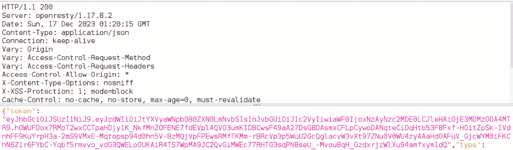

图 3.8 – 有效登录操作的响应，提供相应的持有者令牌

让我们继续添加一辆虚拟车辆。我们将验证更多关于应用程序和 API 端点的信息将被揭示。当添加车辆时，你需要输入 PIN 和 VIN，这些信息会通过你注册时输入的邮箱地址发送到你的邮箱。只需打开另一个浏览器标签页并访问 `http://localhost:8025` 来访问 Mailhog 服务。你会在那儿找到邮件。仅仅登录并点击相应的按钮添加车辆就能揭示更多 API 端点。观察接下来的一系列图像，了解更多信息。在第一个图像中，你可以看到成功登录后的响应。

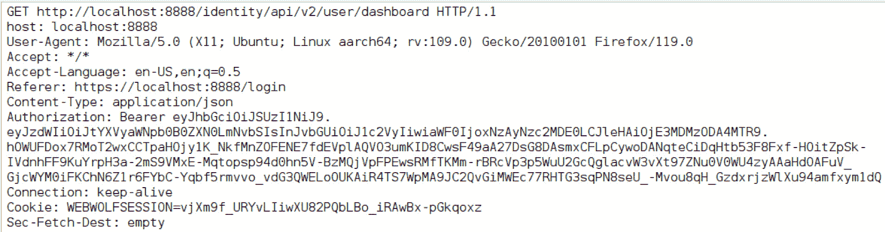

图 3.9 – 登录后 /api/v2/user 端点

以下是添加车辆后你将收到的响应类型。

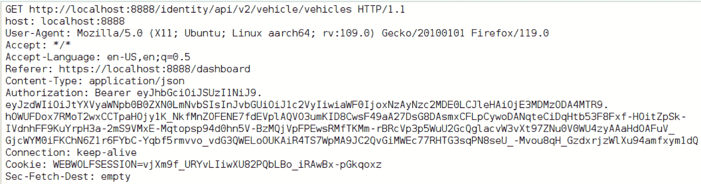

图 3.10 – 点击添加车辆按钮后的 /api/v2/vehicle 端点

最后，在成功添加车辆后，你将看到如下屏幕。


图 3.11 – 随机车辆已被添加

当一辆车被添加时，应用会为其分配一个 UUID，我们可以通过检查 `/api/v2/vehicle/vehicles` 调用的响应来确认这一点：

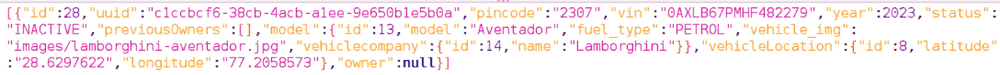

图 3.12 – 添加车辆时生成的 UUID

位置数据也已提供。请注意这一点，它将非常有用。你可以稍微操作一下网页 UI，但在进入**社区**部分时，观察一下响应发生了什么变化。这部分类似于一个论坛，车主们可以在这里发表评论或寻求帮助。问题在于，*所有*车主的帖子都包含他们相应的车辆 ID！显然，除非绝对必要，否则不建议公开这些数据，而这里正是如此。那么，为什么有些好心的人会想知道其他人的车辆 ID 呢？

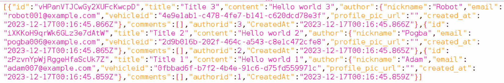

图 3.13 – 其他车辆 ID 在应用的社区部分被公开

`/api/v2/vehicle` 端点提供了一个选项，可以提供车辆的 UUID，并通过指定 `location` 关键字来获取车辆的经纬度。如果我们利用前面截图中的输出，尝试获取不是自己车辆的数据会怎样呢？你可以使用你喜欢的方式来实现，比如通过 ZAP、Postman，甚至通过命令行配合 `curl`。不过，记得先登录，因为之后所有的请求都需要授权令牌，而该令牌只有在成功认证后才能获得。在*图 3.13*中可以看到，我的车辆 ID 以 `5b0a` 结尾。我将尝试获取一辆 ID 以 `8e3f` 结尾的车辆的位置。使用 `curl` 时，命令将是（这是一个单行命令）：

```
$ curl http://localhost:8888/identity/api/v2/vehicle/4e9e1ab1-c478-4fe7-b141-c620dcd78e3f/location --header 'Content-Type: application/json' --header 'Authorization: Bearer <put your authorization token here>'
```

Bingo！观察以下截图。这展示了 crAPI 提供的 API 的脆弱性。只需提供有效的令牌，我就能查看属于不同用户名的资产的详细信息！

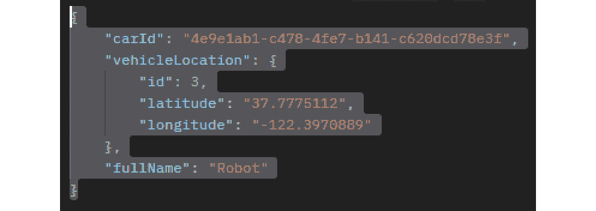

图 3.14 – 获取另一辆车的数据

恭喜！你刚刚不小心访问了另一个用户的车辆数据，这对应于第一个 crAPI 挑战：**破损的对象级别授权**（**BOLA**）。让我们看看如何通过其他方式获取 API 信息。

# 分析 API 文档和端点

你还可以通过仔细分析 API 的文档及其暴露的端点来获取重要信息。即使在今天，一些 API 端点仍未使用**传输层安全性**（**TLS**），这绝不应成为一种习惯。为了保持向后兼容性，一些供应商和应用程序所有者选择保持这些不安全的连接点开放。它们有时被低性能设备使用，例如**物联网**（**IoT**）树莓派、Arduino 控制器，甚至是计算能力较弱的普通客户端。这是因为 TLS 卸载可能需要大量的处理能力，具体取决于所需的同时或后续连接数量。

除此之外，通过分析文档和端点，你还可以发现其他潜在的攻击向量，比如弱或没有身份验证和/或授权机制。为了分析 API 文档，你可以使用一些不错的工具，如 SwaggerUI（[`github.com/swagger-api/swagger-ui`](https://github.com/swagger-api/swagger-ui)）和 ReDoc（[`github.com/Redocly/redoc`](https://github.com/Redocly/redoc)）。尽管它们最初是为了构建遵循 OpenAPI 规范的 API 文档（[`www.openapis.org/`](https://www.openapis.org/)）而设计的，但它们也可以用于分析书面文档。考虑到后续的文件，将`<<<Put OpenAPI Link here>>>`占位符替换为托管 OpenAPI 类似文档 YAML 文件的链接。你可以在 APIs Guru 的网站上找到相关网站（[`apis.guru/`](https://apis.guru/)）；见*图 3.15*和*图 3.16*。

```
<!DOCTYPE html>
<html>
  <head>
    <title>ReDoc</title>
    <!-- needed for adaptive design -->
    <meta charset="utf-8"/>
    <meta name="viewport" content="width=device-width, initial-scale=1">
    <link href="https://fonts.googleapis.com/css?family=Montserrat:300,400,700|Roboto:300,400,700" rel="stylesheet">
    <!--
    ReDoc doesn't change outer page styles
    -->
    <style>
      body {
        margin: 0;
        padding: 0;
      }
    </style>
  </head>
  <body>
    <redoc spec-url='<<<Put OpenAPI Link here>>>'></redoc>
    <script src="img/redoc.standalone.js"> </script>
  </body>
</html>
```

你可以在此找到部分 Fitbit 的 API 文档：

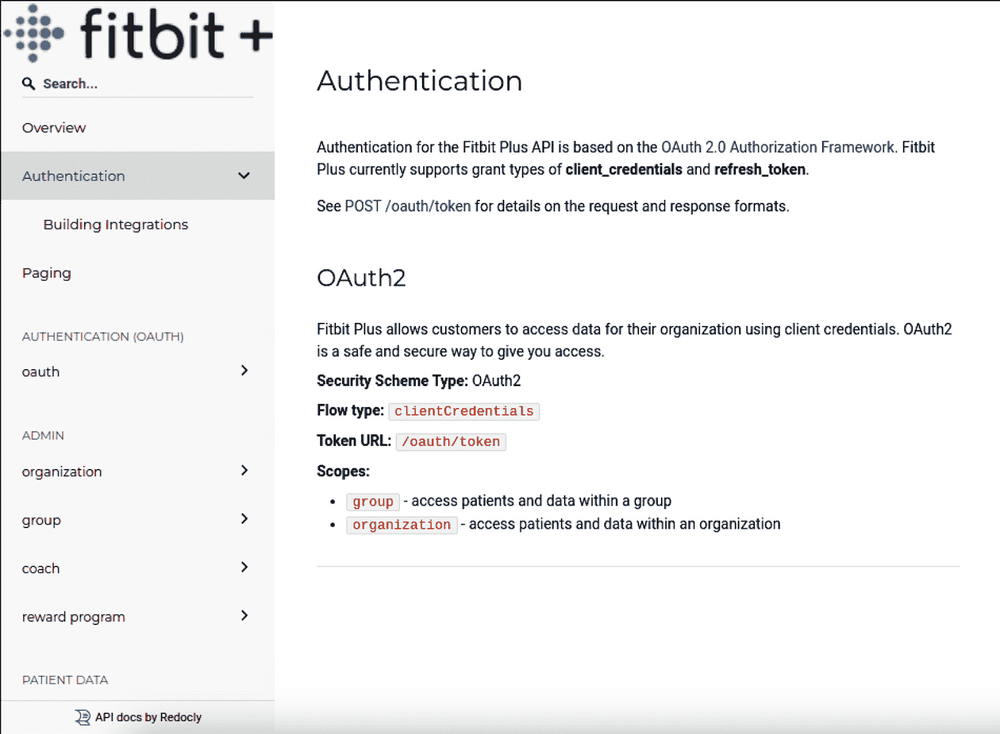

图 3.15 – Fitbit 的 API 文档

在这里，你可以看到与外汇 API 相同的内容。这是文档屏幕的截图，显示了对请求的响应。

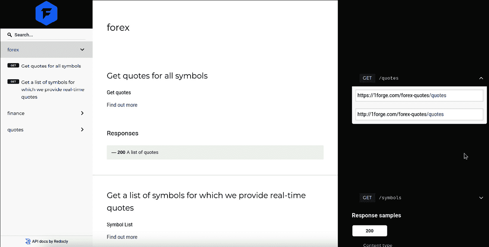

图 3.16 – 1Forge Finance 的 API 文档

请注意，Fitbit 的第一个条目涉及认证，使用了 OAuth2 协议。另一方面，乍一看，1Forge 的 API 根本没有提供任何认证，至少对于那些暴露的服务是这样。事实上，它确实提供了认证，但这仅在他们的网站上得到了正确提及。1Forge 还暴露了纯 HTTP 端点。利用我们刚刚提到的“暴露”，当你展开 ReDoc 右侧窗格中的一个条目时，会提供更多信息。在这种情况下，我们可以看到我们可以利用的网站来与 API 交互。

另外，要在本地查看一个虚拟的 OpenAPI 规范，你可以安装 ReDoc——或者更好的是，使用它的 Docker 版本。我加载了 Docker 版本并设置监听`8085`端口（默认的`8080`端口已被 ZAP 或其他工具占用）。这样就可以访问虚拟的 PetStore API 文档进行阅读：

```
$ docker run -d -p 8085:80 redocly/redoc
```

验证 API 文档的另一个目的，是检查其请求和响应的结构。通过分析它们需要如何构造，或如何发送回你，你可以推测出 API 的更多细节。例如，如果你没有使用代理或浏览器的检查工具，其他车辆所有者的数据泄露可能会被忽视。另一个例子是用户 ID。一些应用程序可能容易受到用户 ID 剖析攻击。如果一个 API 允许你创建用户，你可以编写一个简单的脚本，连续发出两三次请求，创建一个小型用户列表。如果 API 在响应中返回了用户 ID，并且这些 ID 是连续的，那么你就知道该 API 容易受到这种威胁。对于纯 HTTP 端点来说，情况更好，因为你可以通过伪造代理服务器在本地网络中捕获所有其他用户的数据。

回顾 HTTP RFC（参考链接），我们知道 HTTP 请求有头部和正文。Web 应用开发者在实现 API 时可以使用其中任何一个或两个部分。通过再次检查 RFC，我们可以达成共识：如果请求中发送的数据*是*元数据，那么*头部*是存放这些数据的最佳位置。如果数据*不是*元数据，那么应该使用*正文*。我为什么要告诉你这些？公共云服务提供商几乎会记录所有进出其网络的数据。然而，Web 请求的正文可能不会被完全记录，因为它们可能包含客户的敏感数据，允许未授权人员（如云服务提供商的工程师）访问这些日志会导致安全合规性失败，而没有任何提供商会愿意发生这种情况。因此，在与任何 API 交互时，要非常注意 API 的响应正文，因为它们可能包含在准备攻击时可以使用的非常宝贵的数据。

# 利用 OSINT

OSINT 是近年来快速增长的一个市场，并且有持续增长的趋势。根据一份公开的报告，2022 年该市场的规模为 42 亿美元，预计到 2031 年将达到 73.2 亿美元，增幅为 73.43%，年复合增长率（**CAGR**）约为 6.31%，为期九年。这是一个不可忽视的趋势。这个市场主要由构建软件和/或培训以探索相关研究技术的公司组成。

如果你从未听说过 OSINT，我来为你简要总结一下。OSINT 包括一系列收集和分析公开信息的技术。OSINT 可以用来通过多种方式收集关于 API 的信息。例如，你可以使用 OSINT 来做以下事情：

+   查找那些提供商未公开文档化的 API 信息。

+   识别已发布的新 API 端点。

+   发现现有 API 端点的变化。

+   查找关于 API 安全漏洞的信息。

一些常见的 OSINT 资源，用于收集关于 API 的信息，包括以下内容：

+   **搜索引擎**：搜索引擎可以用来查找那些提供商未公开文档化的 API 信息。

+   **社交媒体**：像 X（前身为 Twitter）和 GitHub 这样的社交媒体平台可以用来查找有关新 API 端点、现有 API 端点的变化以及 API 的安全漏洞信息。

+   **在线论坛**：像 Stack Overflow 和 Reddit 这样的在线论坛可以用来查找如何使用 API 的信息，以及排除 API 问题。

OSINT 还可以用于其他几种活动，例如监视或跟踪个人或公司，发现关于 API 端点以外的资产信息，例如服务器、应用程序、外部可用系统，定位建筑物或设施等。我知道这看起来有些可怕，但就像生活中的大多数事情一样，这项技术有好的用途，也有不那么好的用途。互联网上有相当多免费的 OSINT 内容，包括资源和工具的列表。在所有资源中，我不会忘记提到以下几个：

+   **OSINT 框架** ([`osintframework.com/`](https://osintframework.com/)): 这是一个在线目录，列出了按类型分类的在线资源。一些资源是免费的，其他的允许你进行测试，还有一些是商业性质的。

+   **Shodan** ([`www.shodan.io/`](https://www.shodan.io/)): 这是一个搜索服务，拥有一个庞大的 IoT 设备数据库，例如摄像头、路由器和微控制器。虽然这是一个付费服务，但在一些日期（如黑色星期五）经常能找到不错的折扣。

+   **Google 黑客数据库** ([`www.exploit-db.com/google-hacking-database/`](https://www.exploit-db.com/google-hacking-database/)): 这是一个 Google dorks（特别定制的 Google 查询）合集，你可以通过筛选只显示所需类型的目标，包括 API。

*图 3.17* 和 *图 3.18* 显示了在 Shodan 上查找 API 端点时可以找到的示例。该服务可以透露该端点是否存在漏洞，以及漏洞的类型。实用吧？这些漏洞通常与支持服务器的操作系统相关，但网页服务本身也可能列出为有漏洞，这有助于你的渗透测试任务。这些截图是在登录服务后截取的。第一张显示了一个 API 端点。截图已故意匿名化。

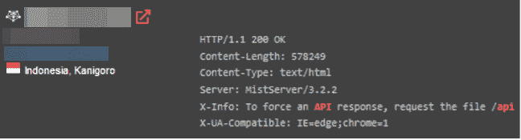

图 3.17 – 一个可能存在漏洞的印尼大学 API 端点

第二张显示了一个开放给全世界的 Oracle 服务器端点。

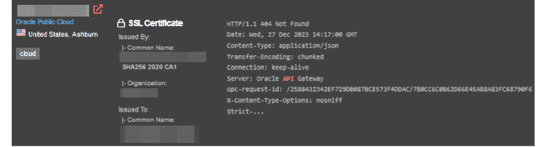

图 3.18 – Shodan 上的简单 API 查询

该服务提供了很多查询供你探索。以下是一些最常用的查询：

+   `hostname:targetdomain.com`：将所有查询指向目标域名，如果目标使用 APEX 域名，也会返回主机名。

+   `content-type:application/json`（或 `xml`）：大多数 API 接受并返回 JSON 或 XML 格式的数据。结合主机名使用时，此关键词会将结果过滤为包含所需内容类型的项。

+   `200 OK`：这是成功的 HTTP 状态码。你可以将其与其他查询组合，返回仅包含成功请求的结果。如果目标 API 不接受 Shodan 查询，它可能会返回 300 或 400 的 HTTP 状态码。

+   `wp-json`：当查询目标 **内容管理系统**（**CMSs**），如 Joomla 或 Drupal 时，这种查询可能会揭示它们的存在。特别是，这与 WordPress REST API 相关。

让我们看看通过 ExploitDB 可以获得什么。如果你搜索 `API` 这个关键词，服务将返回相当数量的 Google dorks，其中包括 `allintext`、`intitle` 和 `inurl` 等查询。这些分别表示在整页内容中、仅在标题中和在 URL 名称中查找出现的结果。以下是几个值得关注的例子：

+   `allintext:"API_SECRET*" ext:env | ext:yml`：查找以 `API_SECRET` 开头的字符串，文件扩展名为 `.env` 或 `.yml`。这非常有用，因为许多应用程序的配置文件会将敏感数据（如 API 密钥）存储在这些扩展名的文件中。一个不小心的开发者可能会将其推送到公共代码库。你还可以了解到实现的 API 版本，旧版本可能存在漏洞。

+   `intitle:"Index of /api/"`：你会找到列出其 `/api` 网页目录中所有文件的网站。在这里你可以找到非常有用的信息，甚至是一些你未曾想过会披露此类信息的网站。

+   `inurl:execute-api site:amazonaws.com`：列出所有 URL 中包含 `execute-api` 的站点。此类站点由 Amazon API Gateway 实现，这是一个公共云服务，在实际 Web 后台之前暴露一层。

我们并不局限于 Google 搜索引擎。如今，我们有了在线生成式 AI 服务，也能帮助我们进行 OSINT。一旦你构建了好的提示，也就是好的问题，你几乎可以获得所有想要的信息。这些服务随着时间的推移不断优化，并加入了额外的保护措施，以防止公司和个人的无意数据暴露或泄露。然而，我不能保证所有数据都会得到完全保护。

GitHub 也有它的 dorks。专注于特定的文件名，你可以找到关于你正在检查的 API 的相关信息。以下是我通过向某个生成式 AI 服务询问后得到的一些 dorks，按类别组织。你可以随意混合和匹配它们。该服务最初不愿意给我这些，但正如我之前所说，通过正确的提示和一些耐心，你一定能够得到：

+   基于路径的 dorks：

    ```
    path:/config/
    path:/secrets/
    path:/keys/
    path:/private/
    path:/deploy/
    ```

+   基于语言的 dorks：

    ```
    language:json
    language:yaml
    language:python
    language:javascript
    language:ruby
    ```

+   基于扩展名的 dorks：

    ```
    extension:yml
    extension:json
    extension:xml
    extension:cfg
    extension:config
    ```

+   基于用户或组织的 dorks：

    ```
    user:username
    org:organization
    ```

+   基于大小的 dorks：

    ```
    size:>1000 (Files larger than 1 KB)
    size:<500 (Files smaller than 500 bytes)
    ```

+   Fork 和 stars dorks：

    ```
    fork:true
    stars:>100
    ```

+   基于日期范围的 dorks：

    ```
    created:2022-01-01..2022-12-31
    pushed:2022-01-01..2022-12-31
    updated:2022-01-01..2022-12-31
    ```

+   基于许可证的 dorks：

    ```
    license:mit
    license:apache-2.0
    ```

+   基于文本内容的 dorks：

    ```
    in:file (Search within file content)
    in:readme (Search within README files)
    in:description (Search within repository descriptions)
    ```

+   通配符 dorks：

    ```
    *api* (Matches any repository with "api" in its name)
    user:*api* (Matches repository with "api" in the username
    ```

+   一些可以揭示 API 敏感数据存在的好关键词包括：

    ```
    "api key", "api keys", "apikey", "access_token", "authorization: Bearer", "secret", "token"
    ```

接下来，我们将通过学习 API 的数据和架构结构，了解 API 的内部细节。

# 识别数据和架构结构

我们将结束关于 API 侦察和枚举的章节，讲解一个和其他所有内容一样重要的话题。通过成功识别 API 的数据和架构结构，你可以获得更多关于目标的信息。一旦你分析了 API 文档和端点，你需要识别 API 使用的数据和架构结构。这些信息可以帮助你理解 API 如何工作，并开发与 API 交互的应用程序。

API 文档应提供关于 API 使用的数据和架构结构的信息。然而，你可能需要分析 API 的响应，才能完整理解数据和架构结构。

一些 API 返回 JSON 结构，而其他的则倾向于在发送响应给请求者之前，将响应编码为 XML。事实上，XML 曾经是多年内首选的数据传输格式，因为它具有灵活性和强大功能。然而，这些优势也带来了缺点。XML 结构越复杂，越容易受到攻击。写得不好的 XML 解析器可能导致应用程序意外崩溃，甚至更糟，导致数据暴露或泄漏。

但是首先，什么是架构？就像数据库中的架构一样，API 架构是用于定义 API 内数据结构的元数据。换句话说，当请求和接收这些请求的响应时，你可以提前知道期望哪些组件，以及它们使用的数据类型。这对于某些操作特别重要：*模糊测试*。

到目前为止我们还没有讨论过这个问题，但从一般意义上来说，模糊测试（fuzzing）是通过生成随机字符序列作为输入，进行不同的系统交互。在我们的例子中，系统是一个 API 端点。在了解其架构和数据结构后，你可以通过发送例如符号到期望日期的字段，或者字母到承载数量的字段来测试 API。或者，你可以参考一个不属于数据结构的结构，比如列表或数组，然后检查端点的行为。当应用程序写得很好时，抗模糊测试的应用会简单地忽略这些数据，并可选择性地抛出警告或错误信息，说明提供了一个损坏的输入。

让我们做些练习。利用我们的 crAPI 部署和 Postman，发送几个请求并验证其响应。crAPI 期望输入为 JSON，并返回一个 JSON 结构的响应。crAPI 已经在其仓库中提供了一个方便的 Postman 请求集合。让我们看看当我们发送与 JSON 不同的内容时会发生什么。首先，我们需要登录以获取授权令牌。这是我们的初步测试。让我们把 JSON 部分换成，比如说，XML 格式：

```
<?xml version="1.0" encoding="UTF-8"?>
<email>{{email}}</email>
<password>{{password}}</password>
```

`{{email}}` 和 `{{password}}` 注释是 Postman 用来表示变量的约定。我在我的 Postman 集合中创建了变量来存储我的登录名和密码，这样每次需要登录时就不必重新输入。我对授权令牌做了同样的处理。那么，在这个初步测试中，crAPI 根本没有返回任何内容。让我们继续进行，并以正确的方式登录，输入一个 JSON 数据结构。我们刚刚收到了令牌。

还有另一个端点是通过 POST 方法访问的。它叫做 `Signup example.com`。它期望请求体包含以下内容：

```
{
    "name": "{{name}}",
    "email": "{{email}}",
    "number": "{{phone}}",
    "password": "{{password}}"
}
```

当你发送期望的格式，比如电子邮件地址和作为电话号码的数字序列时，API 会做出如下响应：

```
{
    "message": "User registered successfully! Please Login.",
    "status": 200
}
```

然而，如果我们发送一些稍微不同的内容，比如这样：

```
{
    "name": "{{name}}",
    "email": "304laskdf))(&)&)*",
    "number": "asdf98asd09fans2#$%@#$%",
    "password": "{{password}}"
}
```

看起来 crAPI 确实在某种程度上验证了输入，但不是以一种很好的方式：

```
{
    "message": "Validation Failed",
    "details":
 "org.springframework.validation.BeanPropertyBindingResult: 2 errors\nField error in object 'signUpForm' on field 'number': rejected value [asdf98asd09fans2#$%@#$%]; codes [Size.signUpForm.number,Size.number,Size.java.lang.String,Size]; arguments [org.springframework.context.support.DefaultMessageSourceResolvable: codes [signUpForm.number,number]; arguments []; default message [number],15,0]; default message [size must be between 0 and 15]\nField error in object 'signUpForm' on field 'email': rejected value [304laskdf))(&)&)*]; codes [Email.signUpForm.email,Email.email,Email.java.lang.String,Email]; arguments [org.springframework.context.support.DefaultMessageSourceResolvable: codes [signUpForm.email,email]; arguments []; default message [email],[Ljavax.validation.constraints.Pattern$Flag;@5319e7,.*]; default message [must be a well-formed email address]"
}
```

通过这个简单的测试，我们发现了几件事：

+   crAPI 肯定使用了一些 Java 的变种作为其后端。

+   邮箱和电话在某种程度上是经过验证的，但错误看起来像是异常。

+   电话号码的最大长度为 15 个字符。

当你验证身份容器的日志时，你会发现以下异常：

```
2023-12-28 18:34:17.934 DEBUG 8 --- [nio-8080-exec-9] o.s.web.method.HandlerMethod             : Could not resolve parameter [0] in public org.springframework.http.ResponseEntity<com.crapi.model.CRAPIResponse> com.crapi.controller.AuthController.registerUser(com.crapi.model.SignUpForm): JSON parse error: Illegal unquoted character ((CTRL-CHAR, code 10)): has to be escaped using backslash to be included in string value; nested exception is com.fasterxml.jackson.databind.JsonMappingException: Illegal unquoted character ((CTRL-CHAR, code 10)): has to be escaped using backslash to be included in string value
 at [Source: (PushbackInputStream); line: 1, column: 205] (through reference chain: com.crapi.model.SignUpForm["email"])
2023-12-28 18:34:17.934 DEBUG 8 --- [nio-8080-exec-9] .m.m.a.ExceptionHandlerExceptionResolver : Using @ExceptionHandler com.crapi.exception.ExceptionHandler#handleException(Exception, WebRequest)
2023-12-28 18:34:17.935 DEBUG 8 --- [nio-8080-exec-9] o.s.w.s.m.m.a.HttpEntityMethodProcessor  : Using 'application/octet-stream', given [*/*] and supported [*/*]
2023-12-28 18:34:17.935 DEBUG 8 --- [nio-8080-exec-9] .m.m.a.ExceptionHandlerExceptionResolver : Resolved [org.springframework.http.converter.HttpMessageNotReadableException: JSON parse error: Illegal unquoted character ((CTRL-CHAR, code 10)): has to be escaped using backslash to be included in string value; nested exception is com.fasterxml.jackson.databind.JsonMappingException: Illegal unquoted character ((CTRL-CHAR, code 10)): has to be escaped using backslash to be included in string value<LF> at [Source: (PushbackInputStream); line: 1, column: 205] (through reference chain: com.crapi.model.SignUpForm["email"])]
```

至此，我们已经完成了关于 API 侦察和信息收集的章节。

# 总结

本章涵盖了你在进行 API 渗透测试过程中必须了解的重要主题。你学到的第一步是必须从收集目标的信息和进行侦查开始。在正确识别并枚举 API 后，你学会了必须仔细阅读其文档，找出它公开的端点。这可能会揭示出有价值的信息，正如你所学到的。此外，你还学会了可以利用一组非常有用的技术，称为 OSINT，这些技术被法医调查人员和爱好者广泛应用。章节最后有一部分补充内容，介绍了 API 数据和架构结构在这一阶段的重要性。

在下一章，你将学习如何在进行 API 渗透测试时，更深入地探索身份验证和授权阶段。本章简要介绍了这一话题，但我们将在下一章深入分析并进行更多测试。

# 进一步阅读

+   VirtualBox 类型 2 虚拟机管理程序: [`www.virtualbox.org/`](https://www.virtualbox.org/)

+   UTM 类型 2 虚拟机管理程序: [`mac.getutm.app/`](https://mac.getutm.app/)

+   Podman，Docker 的超集: [`podman.io/`](https://podman.io/)

+   OWASP WebGoat 漏洞 Web 应用程序: [`owasp.org/www-project-webgoat/`](https://owasp.org/www-project-webgoat/)

+   OWASP crAPI 漏洞 API: [`owasp.org/www-project-crapi/`](https://owasp.org/www-project-crapi/)

+   Zed Attack Proxy 扫描器: [`www.zaproxy.org/`](https://www.zaproxy.org/)

+   Shodan，一个物联网漏洞搜索引擎: [`www.shodan.io/`](https://www.shodan.io/)

+   Fiddler，一个网络分析工具: [`www.telerik.com/fiddler/fiddler-everywhere`](https://www.telerik.com/fiddler/fiddler-everywhere)

+   Wireshark，最著名的网络数据包捕获工具之一: [`www.wireshark.org/`](https://www.wireshark.org/)

+   APIs Guru，一个不错的 API 文档列表: [`apis.guru/`](https://apis.guru/)

+   ReDoc，构建和阅读 API 文档的工具: [`github.com/Redocly/redoc`](https://github.com/Redocly/redoc)

+   Swagger UI，构建和阅读 API 文档的工具: [`github.com/swagger-api/swagger-ui`](https://github.com/swagger-api/swagger-ui)

+   建立 HTTP 规范的 RFC: [`datatracker.ietf.org/doc/html/rfc2616#page-31`](https://datatracker.ietf.org/doc/html/rfc2616#page-31)

+   讨论 OSINT 市场增长的报告: [`www.businessresearchinsights.com/market-reports/open-source-intelligence-market-109546`](https://www.businessresearchinsights.com/market-reports/open-source-intelligence-market-109546)

+   ExploitDB Google Dorks，一个包含 OSINT 小抄的列表: [`www.exploit-db.com/google-hacking-database/`](https://www.exploit-db.com/google-hacking-database/)

+   OSINT 框架，一个关于 OSINT 的工具和资源广泛列表: [`osintframework.com/`](https://osintframework.com/)

+   Google Dork 备忘单，更多关于 OSINT 的资源：[`gist.github.com/ikuamike/c2611b171d64b823c1c1956129cbc055`](https://gist.github.com/ikuamike/c2611b171d64b823c1c1956129cbc055)

+   用于自动化 crAPI 请求的 crAPI Postman 集合：[`github.com/OWASP/crAPI/tree/develop/postman_collections`](https://github.com/OWASP/crAPI/tree/develop/postman_collections)
