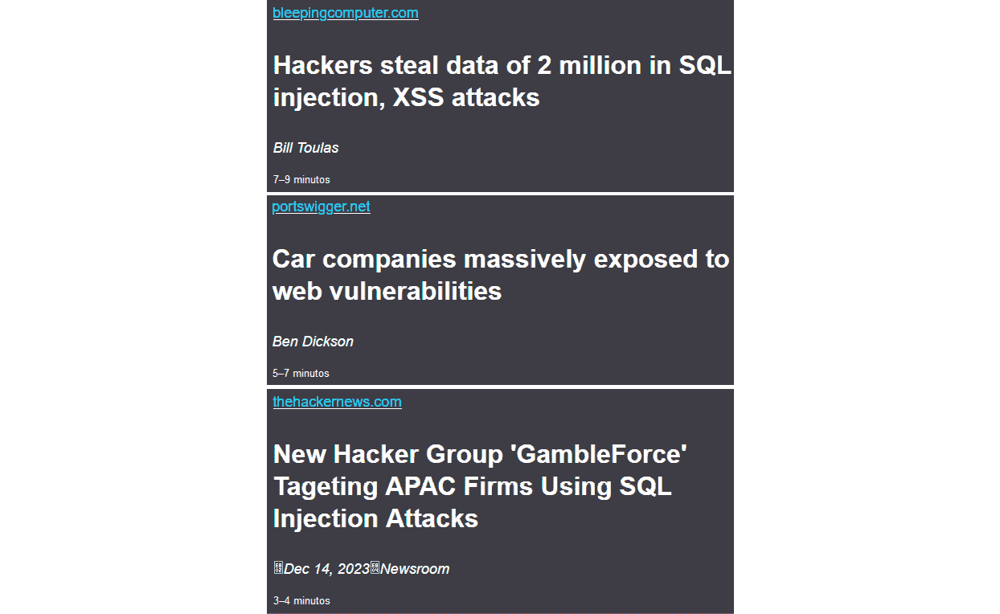
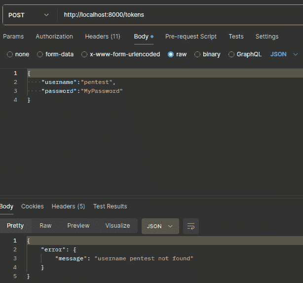
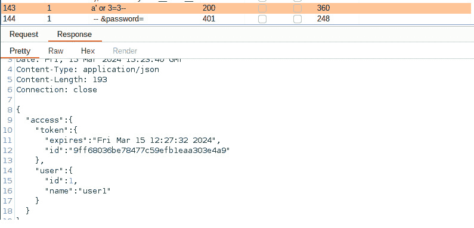
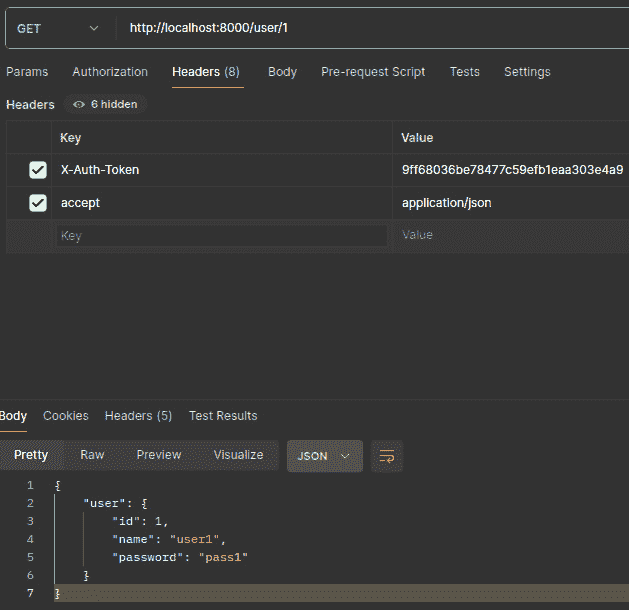
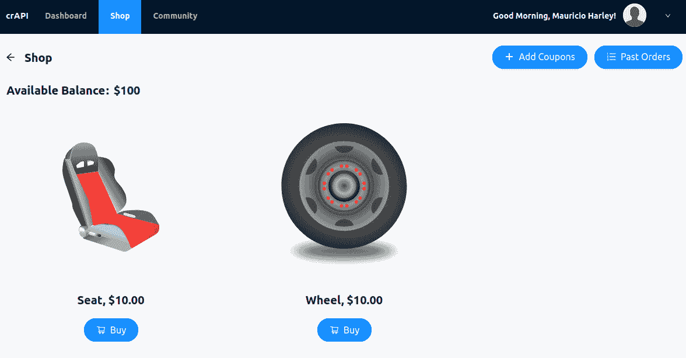
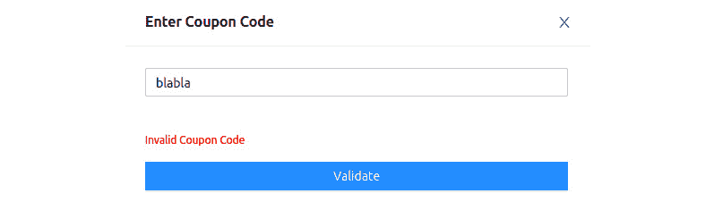
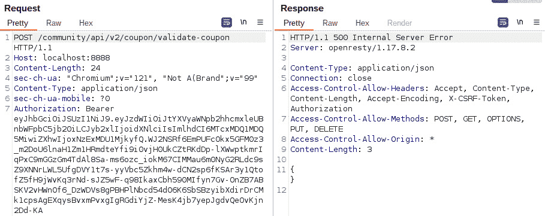
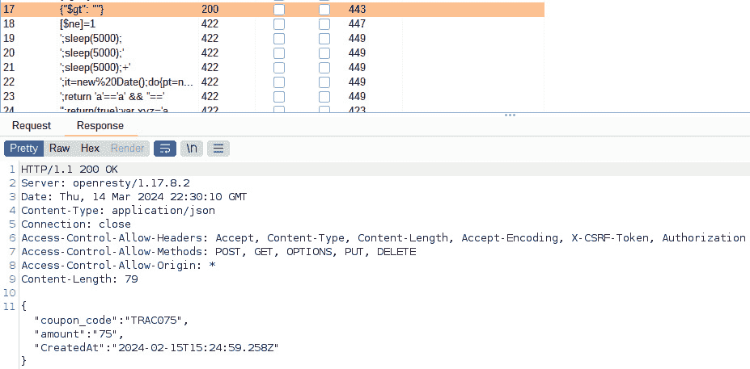

# 第五章：注入攻击和验证测试

我们即将开始书中的新部分。到目前为止，你已经了解了 API 安全的介绍，如何收集更多目标数据——通过重要的侦察与信息收集章节——并学习了测试大多数现代 API 所实施的认证与授权机制的方法。现在，是时候深入探讨攻击领域了。本部分从注入攻击和验证（或缺乏验证）测试开始。

这类攻击并不新鲜，但它们在全球媒体头条中出现的频率令人印象深刻，几乎影响到各类公司。希望你已经知道，这些攻击不限于**结构化查询语言**（**SQL**），但如果你还不清楚，也没关系，因为你将在本书中学到这些内容。

在本章中，我们首先介绍什么是注入攻击，以及缺乏对其关注可能导致哪些漏洞。接下来，我们会进行一些实际操作，涉及 SQL 相关和 NoSQL 相关的攻击，最后我们将讨论用户输入及其验证和清理的重要性。

在本章中，我们将涵盖以下主要内容：

+   理解注入漏洞

+   测试 SQL 注入

+   测试 NoSQL 注入

+   验证和清理用户输入

# 技术要求

我们将使用与**第三章**相同的环境。总结来说，你将需要一个类型 2 的虚拟化管理程序，如 VirtualBox，以及我们之前使用的相同工具——尤其是**完全荒谬的 API**（**crAPI**）项目。

# 理解注入漏洞

注入攻击相对容易理解，有时也很容易执行。它们仅仅是将意外的数据（通常是精心构造的命令或关键字）插入到本应只包含特定数据（如用户名和/或相应密码）的输入中。通过利用不同的格式，如另一种编码方式，或通过在输入中添加命令，错误实现的 API 后端可能会不小心执行这些命令，或尝试解释异常的编码，这可能导致系统故障以及可能的数据泄露。

可能最著名的这种攻击变种影响的是 SQL 数据库，它们通常被称为**SQLi**（“**i**”代表**注入**）攻击。这是因为许多公开可用的应用程序和 API 接口与后端基础设施上的关系型数据库进行交互。另一方面，某些其他应用程序则使用非结构化数据，这使它们成为 NoSQL 数据库的候选者。即便如此，后者同样也容易受到此类威胁。

您可以通过构建发送到 API 端点的请求，或通过填写表单中的字段来注入代码或虚假数据。例如，表单可能要求您提供关于最近购买的某个产品或服务的评论。假设您在表单中写了一个满意的评论，但在评论中添加了类似“*DROP DATABASE products;*”的内容。当 API 端点代码读取该评论时，它不会把评论作为响应返回，而是会执行它，删除整个`products`数据库。

除了 SQL 和 NoSQL 注入攻击外，还有其他类型的注入攻击，例如：

+   **轻量级目录访问协议（LDAP）注入**：此攻击针对用于身份验证和授权的 LDAP 服务器。如果 API 端点与 LDAP 交互以进行用户登录，攻击者可能会将恶意代码注入用户名或密码字段。这些代码可能利用 API 在构建 LDAP 查询时的漏洞，从而可能让攻击者绕过身份验证、窃取目录服务器中的用户凭据，或干扰目录服务，影响用户对各种系统的访问。防止 LDAP 注入攻击需要确保对用户提供的凭据进行适当的输入验证，并在构建 LDAP 查询之前对特殊字符进行转义。

+   **GraphQL 注入**：随着 GraphQL API 的日益流行，攻击者正在设计利用这些 API 处理用户输入时的漏洞。恶意查询可以利用查询验证中的弱点，获取未经授权的数据、操控 API 返回的数据，甚至通过构造复杂且资源消耗大的查询来触发**拒绝服务**（**DoS**）攻击。防止 GraphQL 注入需要对所有用户提供的数据在 GraphQL 查询中实施强有力的输入验证技术，并强制执行查询复杂度限制，以防止资源耗尽攻击。

在过去的几年里，已有多篇报道涉及注入攻击及其对公司和客户的危害。2017 年，历史上最大的泄露事件之一——Equifax 数据泄露，正是由于 Apache Struts 应用程序中的一个漏洞所导致。Struts 是一个用于多个互联网应用程序的 Web 应用框架。这个漏洞让攻击者能够执行 SQL 注入攻击，并窃取超过 1.47 亿人的个人信息。在*图 5.1*中，您可以看到一些关于注入攻击的新闻摘要：



图 5.1 – 关于注入攻击的新闻

注入攻击也可能发生在**图形用户界面**（**GUI**）场景中。2018 年，发现了影响 Apache Struts 的另一个漏洞。该漏洞允许攻击者通过 Struts REST API 执行远程代码注入攻击。此漏洞在 *CVE-2018-11776* 中记录，影响了全球数百万个 Web 应用程序，并强调了保护 API 端点免受注入攻击的重要性。

**XML 外部实体**（**XXE**）注入是另一种注入攻击方式，针对解析 XML 输入的 API。在 2019 年，Atlassian（背后有一些广泛使用的应用程序，如 Jira 套件、Confluence 和 Bitbucket）遭遇了一个漏洞，影响了其 Jira Service Management Data Center 和 Jira Service Management Server 解决方案。该漏洞在 *CVE-2019-13990* 中进行了详细描述，允许经过身份验证的用户通过职位描述发起 XXE 攻击。该漏洞代码位于一个特定的第三方组件：Terracotta Quartz Scheduler。

NoSQL 注入通过精心设计的查询，针对 NoSQL 数据库，旨在利用查询解析和执行中的一些已知或未知漏洞。在 2020 年，一位安全研究人员在一个流行的**移动后端即服务**（**MBaaS**）平台 Firebase 中发现了 NoSQL 注入漏洞。在一次 Android 分析中，作为漏洞赏金计划的一部分，他们发现攻击者可以绕过身份验证并访问存储在 Firebase 数据库中的敏感用户数据。

除了传统的注入攻击外，API 端点中的命令注入（及其对应的操作系统命令注入）漏洞也可能导致严重的安全漏洞，甚至连网络安全公司也难以避免这种侵入方式。Fortinet 因其 FortiSIEM（**安全信息和事件管理**，或 **SIEM**）平台中的漏洞而受到攻击，该漏洞允许攻击者在 API 请求中注入命令。同年，Palo Alto 也遭遇了类似问题。其防火墙中的一个漏洞被发现存在 API 命令注入漏洞，允许经过身份验证的 API 用户在设备操作系统 PAN-OS 上注入命令。

API 注入攻击突显了在 API 端点中实施强健输入验证和清理机制的重要性。通过验证和清理用户输入，开发人员可以防止注入攻击并降低数据泄露和未经授权访问的风险。此外，组织应定期进行安全评估和渗透测试，以识别并修复 API 基础设施中的漏洞。

练习时间！让我们看看注入攻击在实际中的运作方式。

# SQL 注入测试

好的，现在你已经了解了主要的注入攻击类型，让我们来探讨一种可能是最古老但如今仍最常见的攻击方式：SQL 数据库上的注入攻击。这种攻击可以从简单的 `OR` 子句开始，作为用户输入的一部分，到联合攻击和隐藏联合攻击的复杂性和精密度，其中多个 SQL 语句可以结合形成 *爆炸性* 负载。然而，第一步并不是直接攻击 API 端点背后的数据库，而是进行指纹识别。这可以大大减少选择技术时的工作量。通过尝试一些随机输入，你可以迫使一个没有准备好的 API 返回有用的数据库错误消息。一些数据库引擎在这些错误消息中会暴露自身信息。

以下代码段显示了来自 Microsoft SQL Server 的典型错误消息：

```
Connection failed:
SQLState: '08001'
SQL Server Error: 21
[Microsoft][SQL Server Native Client 11.0]Client unable to establish connection
```

同样，以下代码段包含来自 MariaDB 或其“亲戚”MySQL 的错误消息：

```
java.sql.SQLSyntaxErrorException: You have an error in your SQL syntax; check the manual that corresponds to your MariaDB server version for the right syntax to use near 'form category' at line 1
```

这是来自 Oracle 数据库服务器的错误消息。这个产品抛出的代码以 `ORA` 开头：

```
ORA-04021: timeout occurred while waiting to lock object SYS.<package like UTL_FILE
```

最后，这是 PostgreSQL 出现问题时显示的消息示例：

```
Warning: pg_query(): Query failed: ERROR: syntax error at or near "20131418" LINE 1: 20131418 ^ in /var/www/html/view_project.php on line 13
Warning: pg_num_rows() expects parameter 1 to be resource, boolean given in /var/www/html/view_project.php on line 14
```

接下来，我们将介绍最常见的 SQL 注入攻击类型。

## 经典 SQL 注入

几乎所有尝试将命令插入 SQL 指令的操作都会使用 `SELECT` 指令。这是因为其中一个主要目标是从数据库中提取数据。你可能想要获取完整的用户列表及其密码（无论是否加密），或有关其内部结构的详细信息，如表的数量、数据库架构、包含其值和配送地址的订单列表等。

想象一个在线商店，你可以在其中搜索商品。这个搜索功能可能存在安全弱点。当你输入搜索词时，系统会构建一条特殊消息（如编码指令）来请求数据库查找匹配的商品。构建消息的这种方式可能容易受到操控。让我们仔细看看这样一条消息的例子：

```
SELECT * FROM products WHERE name = '$user_input';
```

`$user_input` 变量代表用户在此 web 应用程序的前端组件中表单字段中输入的内容。它也可以是通过 `POST` 或 `PUT` 请求发送到 API 端点的数据。如果没有进行必要的验证或清理，注入攻击很容易发生。用户可能会发送以下内容，而不是提供某些搜索文本：

```
' OR 1=1 --
```

这将使最终的查询变为以下内容：

```
SELECT * FROM products WHERE name = '' OR 1=1 -- ';
```

使用逻辑 `OR` 运算符，其第二个操作数总是求值为 `true`，无论查询的第一部分（用户验证）是什么，都没有关系。`–` 部分被理解为注释，这意味着 SQL 引擎会忽略它之后的所有内容。一些数据库引擎使用 `/*` 作为注释的起始标记。从逻辑角度看，它大致相当于这样：

```
If name = '' OR 1=1 then
    SELECT * FROM products;
EndIf
```

通过这个简单的笑话，你可以获取整个`products`数据库。如果 API 端点或应用程序利用相同的输入执行其他任务，比如更新另一个数据库或删除项目，损害可能会更加严重。

## 嵌套 SQL 注入

攻击者可以使用比经典 SQL 注入攻击更先进的技术，称为堆叠（或链式）SQL 注入。这就像在餐厅一次性给出多个订单一样。通过堆叠攻击，攻击者欺骗 API 端点同时执行多个数据库指令，这让他们能够实现更复杂的目标，如篡改数据或在系统内获得更多权限。这些攻击尤其危险，因为它们允许你对数据库执行强有力的操作，并可能成为端点内更强大的用户。

让我们利用上一节中的相同命令。假设目标 API 端点向后台数据库发送以下查询：

```
SELECT * FROM products WHERE name = '$user_input';
```

现在，让我们稍微加点料，把它作为 `$``user_input` 变量：

```
'; INSERT INTO users (username, password) VALUES ('a', 'b') --
```

这将使最终的查询变成如下：

```
SELECT * FROM products WHERE name = ''; INSERT INTO users (username, password) VALUES ('a', 'b') --';
```

接收到此类查询的 SQL 引擎将把分号符号解释为命令的结束，并执行随后的命令，该命令会将一个新的用户名和密码插入到 `users` 表中。如果成功的话，你现在就有了一对凭据，可以访问 API 端点，并深入进行渗透测试活动……

## 联合 SQL 注入

联合 SQL 注入攻击是一种复杂的利用技术，它操控 SQL 查询的结构，以从数据库中提取额外的信息。这种类型的攻击利用 SQL `UNION` 操作符，将两个或多个 `SELECT` 查询的结果合并成一个单一的结果集，从而使你能够从通常没有权限访问的数据库表中检索数据。联合 SQL 注入攻击尤其危险，因为它们可能导致未经授权的数据访问、数据泄露，甚至如果没有正确缓解，可能会完全破坏数据库。

假设你的目标 API 端点接受 `GET` 请求。例如，要请求某个产品的详细信息，请求可能是这样的：

```
GET /api/show_product?prod_id=$id
```

在这里，`$id` 可能是某个数字或字母数字值。在后台，端点会构造一个相应的 `SELECT` 语句并将其传递给数据库，像你在前面部分看到的那样。现在，让我们将 `$id` 的内容替换为一个特别设计的序列：

```
50 UNION ALL SELECT * FROM ORDERS;
```

这将导致以下 `GET` 请求：

```
GET /api/show_product?prod_id=50 UNION ALL SELECT * FROM ORDERS;
```

如果没有适当的验证，端点将被欺骗构建出预期的 `SELECT` 语句，其中 `$prod_id` 等于 `50`，但同时发送一个第二个未预测到的 `SELECT` 语句，检索 `orders` 表中的所有项。这是因为端点只是选择了 `$prod_id` 的值，并将其传递给 `SELECT` 命令，而没有验证它是否符合预期格式。`ALL` 关键字在这里起到了重要作用。有些应用在从数据库中选择项时可能会使用 `DISTINCT` 关键字。首先，这是为了避免端点与数据库之间的过多网络通信；其次，是为了避免检索重复的项目。当 `ALL` 位于前面时，`SELECT` 语句将检索所有项目，而不管是否有 `DISTINCT`。

## 隐藏联合 SQL 注入

联合 SQL 注入漏洞对 API 安全构成了重大风险。然而，当攻击者将恶意意图隐藏在看似无害的用户输入中时，威胁就变得更加隐蔽。这就是隐藏联合 SQL 注入成为一个重要关注点的原因。隐藏联合 SQL 注入延伸了传统联合攻击的原理。你可以利用 API 端点的弱点，但提升欺骗的层级。通过精心设计恶意有效载荷，将最终意图伪装成合法的用户输入，你可以使得检测和缓解工作变得更加复杂。

恶意代码嵌入在用户输入中时看似无害，使得在粗略检查时难以发现。事实上，一个配置不当的**Web 应用防火墙**（**WAF**）可能会忽略这种攻击。此外，提取的机密数据通常会悄悄嵌入 API 响应中，可能与真实信息混合在一起。这种欺骗性策略使得检测可疑活动变得更加困难，必须仔细检查 API 查询和响应。

假设我们的目标 API 端点接受 `POST` 请求并响应从后台数据库检索到的产品数据。一个可能的场景是将以下结构作为参数传递给端点：

```
{
  'category': 'clothing',
  'max_num_items': '10'
}
```

这将成为一个合法的 `SQL SELECT` 语句，最多返回 10 件服装产品。通过隐藏联合攻击，我们可以将这个结构改为类似如下的形式：

```
{
  'category': "clothing (SELECT 'admin', version() FROM information_schema.tables LIMIT 1);--",
  'max_num_items': '10'
}
```

观察到第一个变化是将 `category` 的值中的单引号替换为双引号。这是为了允许后续使用单引号。攻击代码随后嵌入括号中。通过发送这个 `SELECT` 语句，我们请求从一个名为 `information_schema.tables` 的特殊表中获取关于管理员用户和数据库引擎版本的信息。再一次，`--` 部分和之前的例子一样起到了注释作用。`version()` 函数返回关于数据库引擎的详细信息，而 `LIMIT` 关键字将回答限制为一行，以避免响应被某些速率限制/节流机制拦截。

## 布尔型 SQL 注入

当你在利用 SQL 数据库支持 API 端点时，如果返回的错误信息过于通用，这个技巧非常有用。例如，当请求某个不存在的产品或用户时，端点仅返回 404 错误代码，而没有更多信息。通过发送一些简单的查询，返回值仅可能是 `true` 或 `false`，你可以检查数据库是否容易受到 SQL 注入攻击，然后对其进行更有针对性的攻击。考虑以下接受 `GET` 请求的端点：

```
GET /api/products?id=100
```

通过稍微修改为以下内容，你可以检查将会得到什么样的答案：

```
GET /api/products?id=100 AND 1=2;
```

这显然永远不会成功。这里的重点不是在第一次尝试时就获得数据。我们的目的是识别支持 API 端点的数据库如何响应。现在，你将语句的第二部分更改为一个有效的值：

```
GET /api/products?id=100 AND 1=1;
```

我之前没有说这个，因为它太显而易见了，但你需要捕获由端点发送的所有输出作为你请求的响应。每一部分数据都很重要，因为一个小片段的数据可能构成理解目标的关键部分。如果前一个查询（`1=1`）的答案与另一个查询（`1=2`）不同，你将得出数据库容易受到 SQL 注入攻击的结论。换句话说，端点在将输入发送到数据库之前没有正确清理。某些管理员只是配置他们的端点或 Web 应用程序提供通用的错误信息，认为通过这种方式模糊化错误信息，可以保护他们的环境。大错特错……

你可以通过利用一些多个数据库引擎常见的函数来增强这一技术。以下函数是你的朋友：

+   `ASCII(character)`：返回提供的字符对应的整数值（ASCII 码）。

+   `LENGTH(string)`：返回提供的字符串的字节长度。

+   `SUBSTRING(string, initial character, number of characters)`：返回从提供的字符串中截取的部分字符串，从初始字符位置开始，总长度为指定字符数。考虑 0 为初始字符的位置。

让你的想象力飞扬。我们之前发送的查询可以通过一些发现尝试进一步增强。假设你想获取所有长度小于或等于 10 的用户名。你可以构造类似这样的查询：

```
GET /api/products?id=100 OR UNION SELECT username FROM users WHERE LENGTH(username) <= 10;
```

你可以通过混合和匹配这些功能来自动化操作，例如尝试猜测管理员的用户名。你意识到这种技术的潜力了吗？通过结合耐心、想象力和易受攻击的 API 端点，你可以提取大量数据。在接下来的章节中，我们将在 crAPI 上利用 SQL 注入。

## 在一个易受攻击的 API 上利用 SQL 注入

在这个练习中，我们将使用一个轻量且高效的 Python 应用程序，其中嵌入了一些漏洞，包括 SQL 注入：`python vAPI.py -p <port>`。只需选择一个不被其他工具占用的端口，例如 Burp Suite、**开放全球应用安全项目 Zed 攻击代理**（**OWASP ZAP**）或 WebGoat。

让我们也使用其他工具，Burp Suite 和 Postman，来帮助我们完成这个任务。启动 Burp Suite 并使用默认设置创建一个新项目。同时启动 Postman。你需要配置操作系统以使用 Burp 作为代理，或者配置 Postman 本身来做这件事。我建议选择第二种方法，以避免破坏系统中其他正在进行的测试。在 Postman 中，点击 **文件** | **设置** 并选择 **代理**。然后，确保禁用 **使用系统代理**，并启用 **使用自定义代理配置**。选择至少 **HTTP** 代理类型，并提供 Burp 监听请求的主机名和端口。

vAPI 有使用 OpenAPI 格式编写的文档。它位于 `openapi/vAPI.yaml` 路径下。由于这是一个小型应用程序，直接打开并阅读此文档是可以的。另一方面，如果你更喜欢将其作为 HTML 文件阅读，有一个非常方便的 Python 代码可以为你转换它。这个工具可以在这里找到：[`gist.github.com/oseiskar/dbd51a3727fc96dcf5ed189fca491fb3`](https://gist.github.com/oseiskar/dbd51a3727fc96dcf5ed189fca491fb3)。你会验证到，有几个端点同时接受 `GET` 和 `POST` 请求。在分析可用端点后，似乎我们从 `/tokens` 端点开始，通过提供有效的凭证对，你可以收到一个有效的令牌。使用某个空闲端口启动应用程序，例如 `8000`：

```
$ python vAPI.py -p 8000
 * Serving Flask app 'vAPI'
 * Debug mode: on
```

由于我们不知道用户名和密码是什么，让我们通过使用 Postman 精心构造请求，利用创意组合这些信息：



图 5.2 – 发送 POST 请求到 vAPI 的 /tokens 端点

我们显然收到了一个错误信息。现在，进入 Burp Suite 查看 HTTP 连接历史记录。找到对 `/tokens` 的请求，右键点击它（仍然在 `§` 上）。这将用于指示工具哪些部分的后续请求将在攻击过程中发生变化：

```
{
  "username":"§pentest§",
  "password":"§MyPassword§"
}
```

将**攻击类型**设置为**狙击手**。现在，移动到**有效载荷**子章节。将**有效载荷类型**设置为**简单列表**，然后点击标记为**有效载荷设置 [简单列表]**的块中的**加载…**按钮。你可以一次加载多个文件。如果你有多个列表，可以这样做。取消选择最后一个复选框，文本为**URL 编码这些字符**。这样可以避免在提交有效载荷到目标时进行不必要的编码。最后，点击**开始攻击**。在现实中，如果你的目标受到速率限制或反 DoS 控制的保护，可能会收到一些阻塞。

注意

如果你使用的是 Burp Suite 的社区版，这可能需要一些时间，因为 Intruder 功能已减少，攻击会在本地时间受到限制。你可能会发现每个有效载荷之间大约有 5 秒钟的间隔。

希望有些耐心和运气，你会成功的。实际上，在一些时间后，我们成功找到了一个有效的用户名。在分析 Intruder 输出时，寻找带有 `200 代码`的结果。我们在实际例子中得到了很多这样的代码。在*图 5.3*中，你可以看到我们针对 crAPI 进行 SQL 注入攻击的成功。我们发现了有效的用户 ID 和用户名：



图 5.3 – vAPI 易受 SQL 注入攻击，并暴露了有效的凭证对

响应中提供了一个令牌。你可以利用它，例如，通过 `/user` 端点更改用户的密码。让我们使用这个相同的端点来获取用户密码，使用我们在攻击中提取的令牌：



图 5.4 – 获取用户密码，在获取有效令牌后

你可以进一步探索这个应用，可能通过进一步的注入攻击获取更多的数据。在接下来的章节中，我们将学习一些 NoSQL 注入。

# 测试 NoSQL 注入

我们已经涵盖了 SQL 注入攻击的合理范围，但事实上，互联网上有大量需要处理非结构化数据（如文档、电子邮件、社交媒体帖子、图像以及音频和视频文件）的应用程序（和 API 端点）。对于这些使用案例，关系数据库并不是最佳选择，因为这些数据库中的所有元素并非都有直接关系，这将使得其管理变得不公平。Carlo Strozzi 在 1998 年提出了 NoSQL 数据库的概念，并提出了 Strozzi NoSQL **开源软件**（**OSS**）的建议。从那时起，我们见证了许多出色的产品发布，如 MongoDB、Apache Cassandra 和 Neo4j，仅举几例。

由于这些数据库，顾名思义，并不是 SQL 数据库，它们不会使用 SQL 来进行查询或响应查询。因此，我们的 SQL 注入技术在这里不起作用。我们需要用另一种方式进行处理。在这种情况下，基本上有三种攻击方式可以利用以达到成功：**语法注入**、**对象注入**和**操作符注入**。让我们分别讨论每一种。

## 语法注入

语法注入是 NoSQL 注入中最常见的攻击方式。在这种攻击类型中，渗透测试者将有害代码嵌入到用户输入中，API 随后将其整合到 NoSQL 查询中。这个注入的代码可能会破坏查询的语法，绕过过滤器，甚至触发数据库中未授权命令的执行。

NoSQL 语法注入攻击的核心概念围绕着操控用户输入展开。渗透测试者编写恶意代码，并将其注入到作为参数的用户输入中，然后这些参数被脆弱的 API 纳入 NoSQL 查询中。NoSQL 语法注入攻击常发生在处理用户身份验证的 API 端点中。例如，某个 API 可能有一个登录端点，用户提交凭证以进行身份验证。如果 API 使用 NoSQL 数据库存储用户数据，并且没有正确地对用户输入进行清洗，攻击者就可以将恶意代码注入到登录凭证中，从而绕过身份验证检查或获取未授权的用户账户访问权限。

在 NoSQL 语法注入攻击中，作为渗透测试者，你可以利用各种技术来避开检测并达成目标。例如，你可能会使用通配符字符、正则表达式或其他语法操控技术来编写负载，扰乱查询的结构或绕过输入验证机制。通过精心构建负载，你可以利用 API 端点的漏洞，破坏数据库的完整性和机密性。

它是如何工作的呢？假设一个 API 端点使用 NoSQL 数据库进行用户身份验证。该端点接受 `GET` 请求，格式如下：

```
GET /api/login?username=$username&password=$password
```

在内部，API 端点将请求转换为类似以下的 NoSQL 查询：

```
db.users.find({ username: '$username', password: '$password' })
```

请注意，提供的输入（包括用户名和密码字段）没有经过任何验证或过滤。我们有了进行 NoSQL 语法注入攻击的机会！我们可以稍微修改此请求，例如如下所示：

```
GET /api/login?username[$regex]=.*&password[$regex]=.*
```

我们刚刚修改了查询，使用了一个正则表达式，表示任何用户名和任何密码（` .` 匹配任意字符，`*` 匹配前一个字符出现 0 次或多次）。我们刚刚绕过了端点的身份验证控制…

## 对象注入

NoSQL 对象注入攻击对与这些类型的数据库交互的 API 构成了独特的威胁。与传统的 NoSQL 攻击直接攻击原始查询不同，对象注入攻击利用了 API 在处理用户提供的数据时的弱点。

假设一个 API 使用一种秘密语言（序列化）将用户数据转换为 NoSQL 数据库能够理解的格式。作为渗透测试者，你可以利用这个转换过程中的漏洞。你可以构造恶意数据，当这些数据被 API*翻译*（反序列化）时，操纵内部的对象结构。这可能导致意外后果，甚至可能允许你运行未授权的代码或访问你不该接触的敏感数据。

一种常见的场景是，API 在将用户提供的数据（如 JSON）存储到 NoSQL 数据库之前会先进行序列化。如果 API 在翻译之前没有仔细检查数据，渗透测试者就可以悄悄插入恶意对象，利用反序列化过程中的弱点。可以把它想象成诱骗翻译人员说出完全不同于你原本想说的内容。这使得你能够在系统中获得不正当的优势。

作为示例，我们可以考虑一个允许用户根据价格和类别筛选产品的 API 端点。以下 JavaScript 代码展示了该端点可能构建的查询，发送到数据库：

```
const filterObject = { 
    price: { 
        $gt: req.query.minPrice 
    }, 
    category: req.query.category 
};
db.products.find(filterObject);
```

`filterObject`常量直接接收请求者提供的数据（`minPrice`和`category`）。然后，它被用于`db.products.find`查询。继续我们的示例，一个有效的`GET`请求，选择最低价格为 100 且属于`furniture`类别的产品将是以下内容：

```
GET /products?minPrice=100&category=furniture
```

无论是`GET`请求还是`POST`请求，都没关系。几乎可以使用相同的方法来处理任何请求方式。我们如何将其转化为对象注入攻击呢？很简单。我们将一个最初未被预料到的对象作为查询的一部分插入。这样，端点将在检查原始产品的类别之外，授予我们管理员访问权限。请看以下示例：

```
GET /products?minPrice=100&category={"$and": [{category: "furniture"}, {"isAdmin": true}]}
```

如果端点没有正确配置以清理这些输入，可能会授予数据库的管理员访问权限，然后攻击的其他阶段就会发生。`isAdmin`对象本不应作为合法查询的一部分，但因为我之前知道这个数据库会接受它作为一个可能的参数（当然，这是在我进行枚举/指纹识别工作之后得出的结论），所以我有些可以放心假设它会生效。NoSQL 对象注入攻击的成功在很大程度上取决于 API 如何处理用户提供的对象并将其纳入操作中。然而，改变对象结构以实现未授权访问或篡改数据的基本概念，在不同的 NoSQL 数据库平台中都是成立的。

## 操作符注入

在这一阶段，你可能已经推测到我们在谈论在此类攻击中插入 NoSQL 操作符。是的——我这次确实像个显而易见的“显而易见队长”，但请将此视为在这次长篇阅读后给你带来的一点轻松。幸运的是，你已经可以访问到一个小而实用的表格，其中列出了可以在这里利用的一些操作符。

NoSQL 数据库提供了强大且灵活的组合，但它们也带来了新的安全挑战。NoSQL 操作符注入攻击潜伏在阴影中，等待利用与这些数据库交互的 API。这些攻击瞄准了基于用户输入“动态生成”查询的 API 中的漏洞。狡猾的攻击者可以注入特制数据来操控数据库如何解释查询。此攻击与语法注入有些相似；然而，攻击者并不是打破查询的最初预测语法，而是扭曲它。

想象一个允许用户根据各种筛选条件（例如价格或类别）搜索产品的 API，正如我们之前所见。该 API 可能会构建一个 NoSQL 查询，动态地将用户提供的值纳入其中。问题在于：如果 API 没有仔细检查这些用户输入，你就可以悄悄地插入恶意操作符。这些操作符通常用于合法的筛选，但可以被扭曲，从而完全改变查询的逻辑。想象一下，有人操控图书馆网站上的搜索框来返回意想不到的结果。听起来像吗？

让我们继续使用之前的网站示例，该网站提供的产品按类别组织。一个展示所有属于`tools`类别的产品的端点可能像下面这样：

```
GET /api/products?category=tools
```

这就转化为以下 NoSQL 查询：

```
db.products.find({ category: '$category' })
```

简单却强大。现在，假设我用于与此端点交互的用户没有权限查看属于其他类别的产品，但该端点并未完全应用此控制。那么，我该如何绕过它呢？看看这个：

```
GET /api/products?category[$ne]=tools
```

`$ne` 部分对应一个 NoSQL 操作符，表示“不等于”。因此，我们要求 API 端点显示所有类别不为 `tools` 的产品。棒极了，是吧？！为了方便你，我提供了一份 MongoDB 操作符的列表。请注意，并非所有 NoSQL 数据库都遵循相同的规则，因此你可以尝试识别后端数据库，或结合不同数据库引擎的操作符：

| **操作符** | **含义** |
| --- | --- |
| `$``eq` | 匹配等于指定值的值 |
| `$``ne` | 匹配所有不等于指定值的值 |
| `$``gt` | 匹配大于指定值的值 |
| `$``gte` | 匹配大于或等于指定值的值 |
| `$``in` | 匹配数组中指定的任意值 |
| `$``lt` | 匹配小于指定值的值 |
| `$``lte` | 匹配小于或等于指定值的值 |
| `$``nin` | 匹配数组中指定的值之外的任何值 |

表 5.1 – MongoDB 比较操作符（来源：MongoDB 官方文档）

现在，让我们通过一个练习来看一下实际操作。

## 在 crAPI 上利用 NoSQL 注入

现在是时候回到我们的老朋友 crAPI 了。我们都知道它暴露了大量的端点，因此让我们验证一下是否有一个可以用来进行练习的端点。启动你的 crAPI 实例。我们还将使用另一个朋友——Burp Suite 来帮助我们完成这项任务。启动 Burp Suite，并使用默认设置开始一个新项目。你需要在实验室中使用 Burp 的浏览器，因为所有服务都是在本地监听的（`localhost`）。访问 crAPI。如果你还没有账户，按照简单的流程创建一个。登录后，进入 **商店** 区域，如 *图 5.5* 所示：



图 5.5 – crAPI 的商店区域

观察我们的初始余额：$100。我们的目标是以低于实际成本的价格购买商品或增加我们的余额。如果我们有优惠券，我们可以通过相应的按钮添加其代码。问题是，我们还没有任何代码——但很快就会有... 点击 **添加优惠券** 按钮并输入任意内容。你会收到一个错误消息：



图 5.6 – 无效的优惠券代码

crAPI 的这一部分使用了 NoSQL 数据库（更准确地说是 MongoDB）来存储优惠券。现在，转到 Burp Suite 查看 HTTP 连接历史。最后一项将显示 crAPI 用来验证该代码的端点。你会发现它是 `/community/api/v2/coupon/validate-coupon`。我们还确认该端点返回了一个 500 错误代码，并且是一个空的 JSON 结构。现在，让我们使用 Burp 的另一个资源来帮助我们发现 crAPI 的优惠券。*图 5.7* 显示了一个示例，展示了发送请求到优惠券验证端点的操作：



图 5.7 – crAPI 的优惠券验证端点

我们将做一些类似于在 SQL 注入部分中使用 vAPI Python 应用程序的操作。右键点击这个优惠券验证请求（仍然在 **HTTP 历史** 标签页中），选择 **发送到 Intruder**，然后进入该工具的这个部分。你将看到的第一个子部分是 **Positions**。观察请求结构，它是一个简单的 JSON 结构，包含一个键值对：

```
{
  "coupon_code": "blabla"
}
```

我们希望对“`blabla`”部分进行模糊测试，加入大量从有效负载列表中拉取的垃圾数据。选择整个“`blabla`”文本，*包括双引号*，然后点击`§`。将**攻击类型**设置为**Sniper**。接下来，移动到**有效负载**子部分。将**有效负载类型**设置为**简单**，然后点击**加载…**按钮，进入标记为**有效负载设置[简单列表]**的块。你可以一次加载多个文件。如果有多个文件，执行此操作。取消选择最后一个选框，标记为**URL 编码这些字符**。这将避免在提交有效负载时进行不必要的编码。最后，点击**开始攻击**。记住——Burp Community 可能会花更多时间，因为 Intruder 功能有意在发送有效负载之间加入了一些延迟。

再次切换到`200 代码`，如下面截图所示，它会向你显示一个优惠券代码。`TRAC075`代码代表 75 美元：



图 5.8 – crAPI 在 NoSQL 注入攻击后泄露优惠券代码

选择这个优惠券并将其添加到网站的相应区域。它会被接受，你的余额将增加，如*图 5.9*所示。幸运，幸运！


图 5.9 – 添加有效的优惠券代码

你可以看到余额增加了 75 美元，如*图* *5.10*所示。富有了！


图 5.10 – 添加优惠券代码后的余额增加

恭喜！你再也不用为 crAPI 商店中的任何单一产品支付更多费用了。抱歉——只是另一个糟糕的破冰段子。我在*进一步阅读*部分提供的参考资料中，列出了我为这次攻击使用的有效负载清单。别忘了检查它们，因为其中有大量可以用于渗透测试的资料。接下来，我们将学习用户输入验证和清理。

# 验证和清理用户输入

在这个阶段，我相信你已经深刻意识到，注入攻击的核心成功之处在于对用户提供给 API 端点或 Web 应用程序的数据没有进行充分（或根本没有）清理。构建安全的 API 时，验证和清理用户输入至关重要，它可以有效抵御攻击。作为渗透测试人员，理解这些技术对于识别漏洞至关重要。

当用户注册时，输入验证充当着一个警觉的守门员，确保他们提供的信息符合特定的准则并且适合处理。它仔细检查用户名、电子邮件地址和密码等关键信息字段的格式、长度和内容。像 OWASP **企业安全 API** (**ESAPI**) 这样的开源工具提供了可靠的验证工具，适用于不同类型的用户输入。试想使用 ESAPI 的验证功能来确保用户名仅由字母和数字组成，并符合预定的长度限制。类似地，你可以验证电子邮件地址是否符合合法格式，并确保密码满足复杂性要求，比如最小长度和包含特殊字符。通过这种强有力的方法，可以有效防止潜在有害或无意义的数据。

至少有五个点是每个 API 开发者都应关注的。作为渗透测试人员，你显然应该检查它们是否存在任何遗漏：

+   `@` 和 `.`），以及避免使用可能干扰系统的特殊字符的用户名。然而，这些防护措施有时可能存在缺陷。像 OWASP ZAP 和 Burp Suite 这样的工具使渗透测试人员能够成为隐形中介，拦截并剖析用户与 API 之间的通信（HTTP 请求）。

+   **清理查询参数以处理搜索查询**：允许用户通过名称或类别查找产品的 API 需要特别注意清理查询参数。这一步骤至关重要，涉及删除或转换可能被用来操控数据库查询的特殊字符。像 SQLMap 和 NoSQLMap 这样的工具充当数字探针，揭示这些查询中的漏洞。通过使用这些工具可以测试是否存在 SQL 和 NoSQL 注入攻击的漏洞。通过实施强有力的输入清理措施，这类攻击将失效，从而保护底层数据库的完整性。

+   **验证文件上传**：想象一个允许用户上传文件的 API，也许是图片或重要文档。然而，在这个看似无害的功能背后，潜藏着恶意活动的潜力。为了增强这个 API 的安全性，强有力的输入验证至关重要。它应该充当一个警觉的检查员，审查文件类型，确保只允许特定格式（如图片）。此外，必须强制文件大小限制，以防止通过大文件上传发起的 DoS 攻击。还应采用恶意软件检测机制，识别并拒绝任何可能试图渗透系统的恶意文件。

    此外，文件名本身也需要进行净化。这个关键步骤可以防止“目录遍历攻击”——一种渗透测试者利用文件命名规则中的漏洞，访问系统未授权部分的技术。像 OWASP ZAP 和 Nikto 这样的工具是安全专业人员的宝贵盟友，帮助他们模拟攻击并识别文件上传功能中的漏洞，特别是由于输入验证不充分所带来的问题。

+   `validator.js`（适用于 JavaScript）或 Django 内置的表单验证（适用于 Python）为实施强健的数字输入验证提供了宝贵的帮助。这些工具使开发者能够为可接受的数字范围设定明确的指导原则，防止**越界**（**OOB**）错误，并保持 API 中的数据完整性。

+   **净化 HTML 输入以防止跨站脚本（XSS）攻击**：某些 API 允许用户提交 HTML 内容，如评论或产品描述。如果没有适当的防护，这种看似无害的功能可能被攻击者利用。恶意行为者可能试图在 HTML 中注入恶意脚本（XSS 攻击），从而可能劫持用户会话、窃取数据或将用户重定向到恶意网站。为了防止这些攻击，净化是一个关键的防御机制。

    这个过程涉及转换（转义）或完全移除潜在的恶意 HTML 标签和属性，使其失效，无法执行恶意代码。幸运的是，像 DOMPurify（适用于 JavaScript）和 Bleach（适用于 Python）这样的开源库为开发者提供了帮助。这些工具使开发人员能够有效地净化 HTML 输入，消除 XSS 漏洞，保护 API 及其用户的完整性。

让我们更仔细地看一下这些用例。

## 用户注册的输入验证

在用户注册过程中，输入验证充当了一个警惕的安全检查点，确保用户提供的信息符合预定义的标准，并且适合处理而不会危及系统安全。这个细致的过程包括检查诸如用户名、电子邮件地址和密码等重要字段的格式、长度和内容等。像 OWASP ESAPI 这样的强大工具提供了一整套验证功能。可以把它们看作是训练有素的守卫，每个守卫都有特定的专长。一名守卫确保用户名只由字母和数字组成，并符合长度限制。另一名守卫验证电子邮件地址是否符合合法格式，而第三名守卫执行密码复杂性要求，要求密码具有最小长度并包含特殊字符。通过实施这些严格的检查，你有效地过滤掉了那些不合理或潜在恶意的数据，这些数据可能被攻击者利用来利用系统漏洞。彻底的输入验证是安全用户注册的基石。它为你的系统构筑了坚固的防护墙，保护它免受多种安全威胁，确保你的王国（API 和应用程序）的顺利运行。

即使在今天，Java 仍然是一个重要的编程语言，不难找到基于它构建的 Web 应用程序和 API 端点。让我们看看下面的 Java 代码片段，它展示了 OWASP ESAPI 的实际应用：

```
import org.owasp.esapi.ESAPI;
import org.owasp.esapi.errors.ValidationException;
public class UserRegistrationValidator {
    public boolean isValidUsername(String username) {
        try {
            ESAPI.validator().isValidInput("Username", username, "Username", 50, false);
            return true;
        } catch (ValidationException e) {
            return false;
        }
    }
}
```

在这段代码中，使用了两个类，`ESAPI` 本身和来自 `errors` 包的 `ValidationException`。请注意，只有当 `ESAPI.validator()` 函数确认用户名有效时，才视为有效。

## 清理查询参数

清理查询参数是与数据库交互的 API 关键的防御机制。如果没有适当的清理，攻击者可以利用称为 SQL 注入的漏洞来操控数据库查询。这些恶意行为者可能使用像 SQLMap 这样的工具来自动化这一过程，通过查询参数发送一连串精心构造的字符串（有效载荷）。这些有效载荷可能会诱使数据库执行意外的操作，比如窃取敏感数据或扰乱操作。

幸运的是，我们有强大的工具可以用来对抗这一威胁。输入清理技术，例如参数化查询，充当了防御这种攻击的盾牌。参数化查询将数据（用户输入）与实际的 SQL 语句分开，防止恶意代码被注入。像 Python 中的 Flask 这样的框架提供了对参数化查询的内置支持。通过采用这种方法，你可以自信地执行 SQL 查询，而无需将应用程序暴露于 SQL 注入的危险之中，保护数据库和用户信息的完整性。

以下代码部分包含了一个 Flask 应用程序，它与 SQLite3 数据库进行交互。它不是直接将输入传递到数据库，而是先将表名硬编码到 SQL 语句中，并应用`?`符号：

```
from flask import request
import sqlite3
@app.route('/search')
def search():
    query = request.args.get('q')
    conn = sqlite3.connect('database.db')
    cursor = conn.cursor()
    cursor.execute("SELECT * FROM items WHERE name LIKE ?", ('%' + query + '%',))
    results = cursor.fetchall()
    conn.close()
    return jsonify(results)
```

在此示例中，`q`查询参数通过使用参数化查询（`?`）进行了清理，确保用户提供的任何恶意输入都被正确转义，不会干扰 SQL 查询的执行。

## 文件上传验证

文件上传为用户提供了便捷的功能，但也可能成为攻击者的入口。恶意攻击者可能试图上传伪装成无害图片或文档的文件，但实际上，这些文件可能是恶意脚本或可执行文件，能够危及整个服务器。为了防止此类攻击，强有力的输入验证至关重要。这个过程会仔细检查上传的文件，确保它们符合预定义的安全标准。

验证重点关注两个关键方面：文件类型和大小。只应允许授权的文件类型，如图片或文档。像**Apache Commons FileUpload**这样的开源库可以提供帮助，提供一整套工具来验证上传。这些工具可以检查文件扩展名是否符合白名单，验证内容类型是否符合预期格式，并执行大小限制，以防止通过大规模上传发起的 DoS 攻击。通过实施这些防护措施，您可以有效解除这些伪装成文件上传的“数字炸弹”，保护您的服务器和用户数据。

以下 Java 代码示例演示了如何在将文件发送到 API 端点之前正确验证它们，以确保在后台有效处理之前，包括最终的数据库操作：

```
import org.apache.commons.fileupload.FileItem;
import org.apache.commons.fileupload.disk.DiskFileItemFactory;
import org.apache.commons.fileupload.servlet.ServletFileUpload;
List<FileItem> items = new ServletFileUpload(new DiskFileItemFactory()).parseRequest(request);
for (FileItem item : items) {
    if (!item.isFormField()) {
        String fileName = new File(item.getName()).getName();
        String contentType = item.getContentType();
        // Validates fileName, contentType, and file size
    }
}
```

在这个代码片段中，使用了 Apache Commons FileUpload 来解析文件上传请求，然后可以对文件名、内容类型和大小进行验证检查，以确保只接收安全的文件进行上传。

## 数值输入的验证

在处理用户的数值输入时，确保数据符合预期格式并保持在可接受范围内至关重要。未经检查的数值输入可能会引入漏洞，例如缓冲区溢出或算术溢出，从而导致程序行为异常、崩溃，甚至系统被攻破。

像 Apache Commons Validator 这样的开源库为 Java 提供了强大的工具，用于验证数字输入。这些库提供了专门处理不同数字数据类型（整数、浮点数等）的函数。开发者可以利用这些函数来定义可接受用户输入的明确约束，例如最小值和最大值。通过实现这样的验证，我们可以有效地“驯服”数字输入，防止错误并保护 API 接口免受恶意攻击者利用的漏洞。这确保了接口按预期处理数据，并保持其整体稳定性和安全性。

看一下如何将 Apache Commons Validator for Java 应用于清理用户输入：

```
import org.apache.commons.validator.routines.FloatValidator;
public class NumericInputValidator {
    public boolean isValidFloat(String input) {
        FloatValidator validator = FloatValidator.getInstance();
        return validator.isValid(input, Locale.US);
    // Using US locale for decimal separator
    // You can do the same for integers and other numeric types.
    }
}
```

在这段代码示例中，使用了 Apache Commons Validator 的 `FloatValidator` 类来验证一个浮动输入，确保输入字符串符合 `US` 区域设置的有效浮点数标准。

## 清理 HTML 输入以防止 XSS 攻击

想象一个场景，用户输入未经处理地直接插入到网页中。这种看似无害的做法会创建一个被称为 XSS（跨站脚本攻击）的漏洞。恶意攻击者可以利用 XSS 在其输入中植入隐藏的“*炸弹*”——伪装成普通文本的恶意脚本。一旦页面渲染，这些脚本就会引爆，窃取敏感的用户信息（如会话 cookie），或代表用户执行未授权的操作。

为了防止此类攻击，我们依赖一种名为 HTML 转义的技术。该过程涉及在显示到网页之前对用户输入中的特殊字符进行编码。通过编码这些字符，我们可以有效地解除“炸弹”，使其变得无害。像 **OWASP Java Encoder** 这样的开源库提供了用于 HTML 转义的有价值工具。通过利用这些工具，开发者可以有效地清理用户输入，堵住 XSS 漏洞的大门，从而保护用户数据和 API 接口功能。

以下代码片段展示了如何使用 OWASP Java Encoder 来清理 HTML 输入：

```
import org.owasp.encoder.Encode;
public class HtmlSanitizer {
    public String sanitizeHtml(String input) {
        return Encode.forHtml(input);
    }
}
```

在这个示例中，OWASP Java Encoder 的 `Encode.forHtml` 方法用于通过编码特殊字符（如 `<`、`>` 和 `&`）来清理 HTML 输入，从而防止它们被浏览器解释为 HTML 标签或脚本元素。

# 概述

在这一章中，我们讨论了 SQL 和 NoSQL 两种数据库的注入攻击，如何进行这些攻击，以及它们可能对提供 API 端点的最终系统造成的损害类型。我们了解了不同类型的注入攻击，并进行了一些练习，其中一个是使用 crAPI，另一个是使用一个脆弱的 Python 应用程序，每个练习都展示了如何通过注入命令或虚假/无法预测的数据攻击这两种类型的数据库。我们在本章结束时讨论了验证和清理用户输入，这旨在去除或至少减少注入攻击的成功率。还提供了代码片段，以便你能了解这在现实应用中如何运作。

在下一章中，我们将讨论错误处理和异常测试。这一内容与其他任何内容一样重要，因为我们将看到，一个处理不当的异常或错误可能会泄露有关 API 或其背后应用的宝贵信息。

# 进一步阅读

+   Equifax 数据泄露：[`consumer.ftc.gov/consumer-alerts/2019/07/equifax-data-breach-settlement-what-you-should-know`](https://consumer.ftc.gov/consumer-alerts/2019/07/equifax-data-breach-settlement-what-you-should-know)

+   Firebase NoSQL 漏洞： [`blog.securitybreached.org/2020/02/04/exploiting-insecure-firebase-database-bugbounty/`](https://blog.securitybreached.org/2020/02/04/exploiting-insecure-firebase-database-bugbounty/)

+   **常见漏洞与暴露** (**CVE**) 报告的 Apache Structs 漏洞： [`cve.mitre.org/cgi-bin/cvename.cgi?name=CVE-2018-11776`](https://cve.mitre.org/cgi-bin/cvename.cgi?name=CVE-2018-11776)

+   Atlassian XXE 漏洞： [`confluence.atlassian.com/security/cve-2019-13990-xxe-xml-external-entity-injection-vulnerability-in-jira-service-management-data-center-and-jira-service-management-server-1295385959.html`](https://confluence.atlassian.com/security/cve-2019-13990-xxe-xml-external-entity-injection-vulnerability-in-jira-service-management-data-center-and-jira-service-management-server-1295385959.html)

+   FortiSIEM *CVE-2023-36553* MITRE 记录：[`cve.mitre.org/cgi-bin/cvename.cgi?name=CVE-2023-36553`](https://cve.mitre.org/cgi-bin/cvename.cgi?name=CVE-2023-36553)

+   FortiSIEM *CVE-2023-36553* **国家标准与技术研究院** (**NIST**) 通知：[`nvd.nist.gov/vuln/detail/CVE-2023-36553`](https://nvd.nist.gov/vuln/detail/CVE-2023-36553)

+   Palo Alto 操作系统命令注入漏洞 – [`security.paloaltonetworks.com/CVE-2023-6792`](https://security.paloaltonetworks.com/CVE-2023-6792)

+   *BleepingComputer* – *黑客通过 SQL 注入和 XSS 攻击窃取 200 万条数据*：[`www.bleepingcomputer.com/news/security/hackers-steal-data-of-2-million-in-sql-injection-xss-attacks/`](https://www.bleepingcomputer.com/news/security/hackers-steal-data-of-2-million-in-sql-injection-xss-attacks/)

+   *PortSwigger* — *汽车公司大量暴露于网络* *漏洞*：[`portswigger.net/daily-swig/car-companies-massively-exposed-to-web-vulnerabilities`](https://portswigger.net/daily-swig/car-companies-massively-exposed-to-web-vulnerabilities)

+   *The Hacker News* — *新的黑客团体‘GambleForce’通过 SQL 注入* *攻击瞄准亚太地区公司*：[`thehackernews.com/2023/12/new-hacker-group-gambleforce-tageting.html`](https://thehackernews.com/2023/12/new-hacker-group-gambleforce-tageting.html)

+   *PayloadsAllTheThings*（大量注入载荷的列表）：[`github.com/swisskyrepo/PayloadsAllTheThings`](https://github.com/swisskyrepo/PayloadsAllTheThings)

+   SQL 注入载荷列表：[`github.com/payloadbox/sql-injection-payload-list`](https://github.com/payloadbox/sql-injection-payload-list)

+   全能 SQL 注入模糊测试词表：[`github.com/PenTestical/sqli`](https://github.com/PenTestical/sqli)

+   vAPI Python 应用：[`github.com/michealkeines/Vulnerable-API`](https://github.com/michealkeines/Vulnerable-API)

+   *探索查找辅助技术和 NoSQL 数据库* — 一篇关于 NoSQL 数据库的科学文章：[`ojs.library.ubc.ca/index.php/seealso/article/view/186333`](https://ojs.library.ubc.ca/index.php/seealso/article/view/186333)

+   MongoDB 查询操作符：[`www.mongodb.com/docs/manual/reference/operator/query/`](https://www.mongodb.com/docs/manual/reference/operator/query/)

+   OWASP ESAPI，一个提供安全清理用户输入方法的库：[`owasp.org/www-project-enterprise-security-api/`](https://owasp.org/www-project-enterprise-security-api/)

+   SQLMap，一个自动化渗透测试关系型数据库的工具：[`sqlmap.org/`](https://sqlmap.org/)

+   NoSQLMap – SQLMap 的“表亲”，专门用于自动化渗透测试和非关系型数据库的审计：[`github.com/codingo/NoSQLMap`](https://github.com/codingo/NoSQLMap)

+   Nikto，一个有用的工具，用于发现 Web 服务器中的漏洞，包括过时的软件和配置错误的接口：[`github.com/sullo/nikto`](https://github.com/sullo/nikto)

+   `validator.js` for JavaScript，一个验证和清理字符串输入的工具：[`www.npmjs.com/package/validator`](https://www.npmjs.com/package/validator)

+   DOMPurify for JavaScript，一个用于清理**文档对象模型**（**DOM**）HTML 表单的工具：[`github.com/cure53/DOMPurify`](https://github.com/cure53/DOMPurify)

+   Apache Commons FileUpload Validator for Java，一个用于在将文件视为有效输入之前清理文件的库：[`commons.apache.org/proper/commons-fileupload/`](https://commons.apache.org/proper/commons-fileupload/)

+   OWASP Java Encoder，一个可以用于对 HTML 输入进行编码并减少 XSS 攻击机会的类：[`owasp.org/www-project-java-encoder/`](https://owasp.org/www-project-java-encoder/)

+   OWASP ESAPI: [`owasp.org/www-project-enterprise-security-api/`](https://owasp.org/www-project-enterprise-security-api/)
