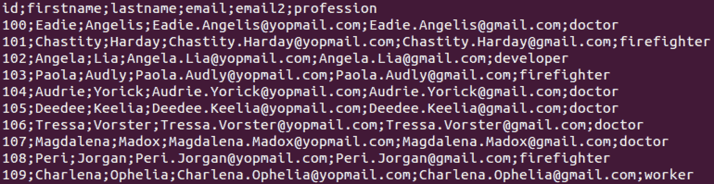
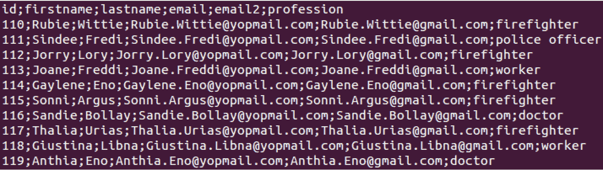
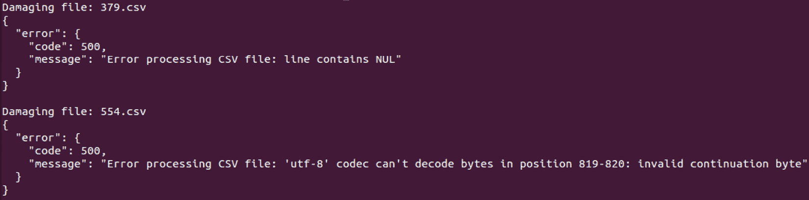
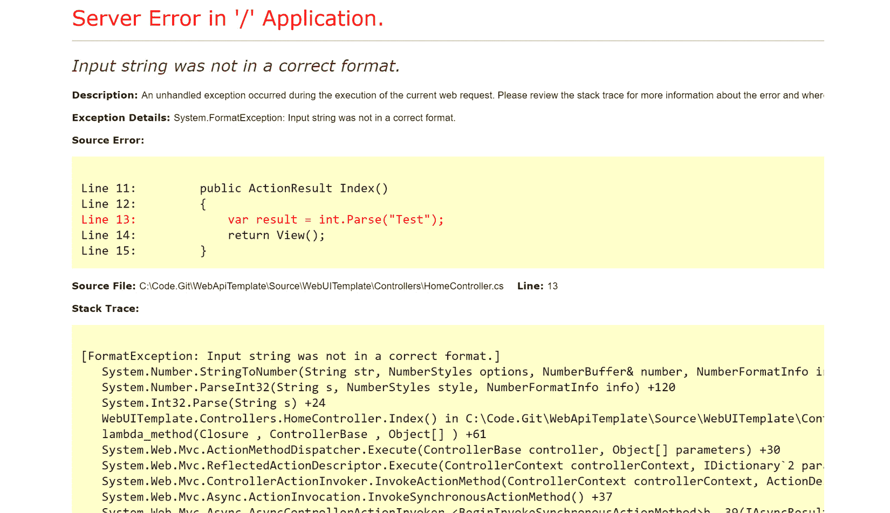
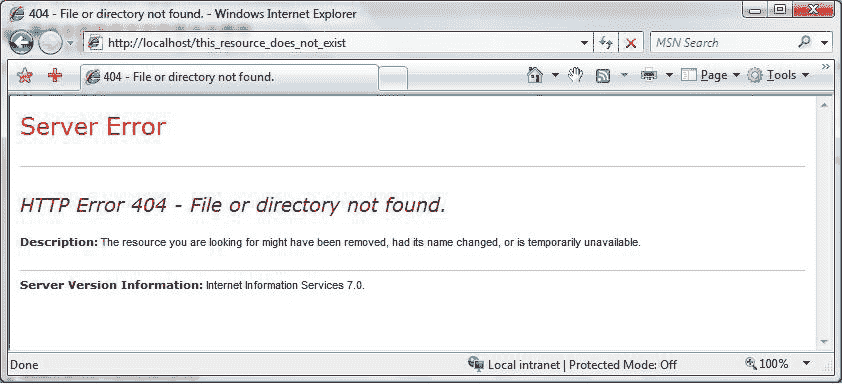

# 第六章：错误处理和异常测试

在上一章中，你已经接触到将代码注入合法输入字段的技术，适用于 API 端点。这些威胁中的一些使用的是旧技术，但依然非常普遍。其中一种方法是对将要注入的文本进行模糊测试（fuzzing）。这可能导致目标端点出现异常行为，仅仅因为它没有准备好接收不寻常或离奇的输入文本。这是因为 API 端点没有正确处理错误，或者实现它的代码没有处理可能出现的异常。

因此，对于 API 和应用程序的所有者来说，正确测试和处理错误和异常是非常重要的。当然，作为渗透测试员，你也不能忘记把这一点加入到测试笔记中。漏洞不仅可能源于错误或异常处理不当，异常或意外错误还可能泄露关于基础设施的有价值信息，比如框架、库、第三方软件、操作系统（包括内核）版本以及构建号。

本章将从讨论一些常见的错误代码和消息开始，并介绍如何轻松识别它们。接下来，我们将深入探讨模糊测试（fuzzing），以及它如何触发一些隐藏的漏洞。最后，我们将学习如何利用我们的研究成果来揭示我们所寻找的数据。

本章将涵盖以下主要主题：

+   识别错误代码和消息

+   模糊测试异常处理漏洞

+   利用错误响应进行信息泄露

# 技术要求

和*第五章*一样，我们将使用与前几章所指出的相同环境。因此，你将需要一个 2 型虚拟化管理程序，如 VirtualBox，以及一些 Linux 发行版，如 Ubuntu。其他一些相关的新工具将在相应部分中提到。

# 识别错误代码和消息

在这一部分，我们将学习 API 端点在响应请求时可能提供的错误代码和消息。错误代码和消息是有效 API 渗透测试的基石。它们是 API 通信渠道的窗口，揭示了在请求处理过程中遇到问题时，API 如何告知客户端和用户。通过解读这些消息，你可以评估 API 错误处理机制的强度和安全性。仔细审查错误响应可以揭示潜在的安全漏洞，如信息泄露、注入攻击或输入验证不严。

揭示错误代码和消息的一个显而易见的方法是检查 API 文档。在 *第三章* 中，你已经学习了这个渗透测试阶段的重要性。另一个方法是手动测试。在这里，渗透测试人员故意构造带有格式错误的数据或不正确输入的请求，观察返回的错误响应。分析这些响应的结构和内容可以提供有关 API 如何处理各种错误场景的见解。例如，发送一个无效认证令牌的请求可能会触发 *401 Unauthorized* 响应，表示认证尝试失败。手动检查这些响应可以揭示 API 安全状态的宝贵信息。

自动化测试工具，如 Burp Suite 和 OWASP ZAP，是识别错误代码和消息的强大工具。这些工具可以捕获 API 请求和响应，帮助系统地分析错误消息。通过自动化发送带有不同负载和输入的请求，你可以高效地识别 API 错误处理机制中的潜在漏洞。例如，Burp Suite 的 **Intruder** 工具可以用来发送带有不同参数的多个请求，而它的代理功能则允许实时捕获和分析错误响应。我们已经使用过这两者。

除了常见的 HTTP 状态码，错误消息通常还包括额外的细节，如错误代码、描述，甚至堆栈跟踪。这些细节为错误的性质和根本原因提供了宝贵的线索，有助于进一步调查和利用（当然是从道德渗透测试的角度来看）。你应该密切关注这些细节，因为它们可能揭示 API 中的漏洞或配置错误。例如，包含堆栈跟踪的错误消息可能暴露有关底层基础设施的敏感信息，如服务器路径或数据库查询。分析这些信息有助于你识别潜在的攻击向量，并评估漏洞的严重性。

此外，你可以利用参数操作技术来引发 API 的特定错误响应。通过修改请求参数，如输入数据或 HTTP 头部，它们可以触发不同的错误场景，并观察 API 的响应。这种方法允许你系统地测试 API 的错误处理能力，并识别潜在的安全弱点。例如，发送过大负载或格式不正确的数据请求可能导致 API 返回错误响应，指示输入验证失败或缓冲区溢出。

错误响应在不同端点和输入变化中的一致性和可预测性是识别错误代码和消息的关键因素。你可以检查 API 在不同条件下如何处理错误，比如不同的认证状态、输入格式或请求方法。一致的错误处理对于确保 API 的可靠性和安全性至关重要。不一致或不可预测的错误响应可能表明潜在的漏洞或实现缺陷，你可以利用这些问题。

让我们通过一个实际的例子来说明如何识别错误代码和消息。假设有一个用户认证的 API 端点，它通过 POST 请求接受用户名和密码参数。我们可以向这个端点发送无效凭证，并观察返回的错误响应。以下是一个请求和响应示例（命令在一行中）：

```
curl -X POST -H "Content-Type: application/json" -d \
'{"username": "admin", "password": "some invalid password"}' \
http://localhost:5000/api/authenticate
```

可能的答案如下：

```
{
  "error": {
    "message": "Invalid credentials",
    "code": 401,
    "details": "Authentication failed"
  }
}
```

你不仅会收到一个错误代码，还会得到一条消息和更多的详细信息。让我们来看另一种错误消息，它可能揭示出一些关于这个假设的 API 端点的逻辑。我们将尝试用一些通用的用户 ID 登录：

```
curl -X GET http://localhost:5000/api/user?id=abc123
```

该端点返回以下内容：

```
{
  "error": {
    "message": "Invalid parameter: id must be a numeric value",
    "code": 400,
    "details": "Invalid input"
  }
}
```

现在，你知道只有数字值会被接受作为用户 ID。这大大减少了用户枚举任务的搜索范围。同样，你也可以尝试通过使用其他 API 端点或 HTTP 动词来寻找其他错误代码。作为一个练习，相关的虚拟代码实现了一个带有端点和错误消息的 API。可以在[`github.com/PacktPublishing/Pentesting-APIs/blob/main/chapters/chapter06/identify_error_codes.py`](https://github.com/PacktPublishing/Pentesting-APIs/blob/main/chapters/chapter06/identify_error_codes.py)找到它。

Flask 应用程序默认监听 TCP 端口`5000`。你可以通过使用`port=`参数作为`app.run`方法的一部分来更改它。让我们通过运行一些`curl`命令来看一下它是如何工作的：

```
curl -X GET http://localhost:5000/api/user/1
{
  "email": "john.doe@example.com",
  "id": 1,
  "name": "John Doe"
}
```

这非常简单，没什么意外！现在，让我们验证一下当我们提供一个不存在的用户时，端点会如何表现：

```
curl -X GET http://localhost:5000/api/user/2
{
  "error": {
    "code": 404,
    "message": "User not found"
  }
}
```

好的；这也是应用代码的一部分。如果我们发送一些意外的内容呢？

```
curl -X GET http://localhost:5000/api/user/aksfljdf\!\#\$\!\#\$\!\#224534
<!doctype html>
<html lang=en>
<title>404 Not Found</title>
<h1>Not Found</h1>
<p>The requested URL was not found on the server. If you entered the URL manually please check your spelling and try again.</p>
```

这是由 Flask 直接回答的（而不是我写的代码），因为它没有找到任何接受字符串作为输入的`user`端点。这是 Python 应用程序和模块中常见的错误消息，尤其是使用 Werkzeug 模块的应用程序，该模块实现了**Web 服务器网关接口**（**WSGI**）。至少这个消息透露出该 API 使用 Python 作为后端。在真实场景中，我们本可以通过这个信息获得指纹识别的胜利！

接下来，让我们通过制造一个预测的错误来尝试其他端点：

```
curl -X POST -H "Content-Type: application/json" -d '{"name": \ "Alice"}' http://localhost:5000/api/user/create
{
  "error": {
    "code": 400,
    "message": "Bad Request: Name and email are required"
  }
}
```

如果你忘记提供姓名、电子邮件或两者，系统会返回此消息。但在这个代码的情况下，即使你按预期发送了所有参数，应用程序仍会抛出异常，向你展示这可能带来多少信息泄露：

```
curl -X POST -H "Content-Type: application/json" -d '{"name": "Alice", \
"email": "alice@example.com"}' http://localhost:5000/api/user/create
```

这是我们收到的输出结果：

```
<!doctype html>
...
<output omitted for brevity>
...
<h1>Exception</h1>
...
<output omitted for brevity>
...
Traceback (most recent call last):
  File "/apitest/lib/python3.10/site-packages/flask/app.py", line 1488, in __call__
    return self.wsgi_app(environ, start_response)
  File "/apitest/lib/python3.10/site-packages/flask/app.py", line 1466, in wsgi_app
    response = self.handle_exception(e)
  File "/apitest/lib/python3.10/site-packages/flask/app.py", line 1463, in wsgi_app
    response = self.full_dispatch_request()
  File "/apitest/lib/python3.10/site-packages/flask/app.py", line 872, in full_dispatch_request
    rv = self.handle_user_exception(e)
  File "/apitest/lib/python3.10/site-packages/flask/app.py", line 870, in full_dispatch_request
    rv = self.dispatch_request()
  File "/apitest/lib/python3.10/site-packages/flask/app.py", line 855, in dispatch_request
    return self.ensure_sync(self.view_functions[rule.endpoint])(**view_args)  # type: ignore[no-any-return]
  File "/home/mauricio/Downloads/api_error_messages.py", line 22, in create_user
    raise Exception("Internal Server Error: Failed to create user")
Exception: Internal Server Error: Failed to create user
```

看看异常处理不当有多危险？你不仅发现了该端点背后使用的是 Python，还揭示了部分目录结构，包括正在使用的 Python 版本。其他端点也会抛出类似的消息。在下一部分，我们将进行模糊测试。

# 异常处理漏洞的模糊测试

在 *第四章* 中，你通过参与我们使用 Burp Suite 进行的练习，快速尝试了模糊测试。现在，我们将更深入地探讨这一技术。模糊测试在 API 渗透测试中非常重要，因为它可以暴露应用程序在错误处理意外输入时的漏洞和弱点。由于错误处理不当可能导致的漏洞类型从信息泄露到 **拒绝服务**（**DoS**）不等。

一种流行的异常处理漏洞模糊测试方法是使用自动化工具，如 **American Fuzzy Lop**（**AFL**）。AFL 由 Michal Zalewski 创建，并由 Google 维护，擅长生成随机模式作为输入进行 API 端点或应用程序的测试。它通过反复修改输入文件并监控目标应用程序是否发生崩溃或异常行为来运行。有一些很好的模糊测试工具可以用来通过向 API 端点发送包含格式不正确数据、意外参数值甚至特制 HTTP 头部的请求来进行模糊测试。

例如，假设有一个 API 端点，用于处理用户认证的 JSON 负载。模糊测试涉及生成一系列格式不正确的 JSON 负载。这些负载可能包含缺失或无效的键值对、过大的大小，或者意外的数据类型。通过观察 API 对这些输入的响应，你可以发现潜在的异常处理漏洞，比如崩溃、内存泄漏或意外行为。

AFL 的优势在于其基于反馈的驱动方法，使其在识别异常处理漏洞方面尤其高效。当该工具发现新的输入触发了目标应用程序内的独特路径或行为时，它会优先修改这些输入，深入探讨应用程序的代码库。这一迭代过程有助于揭示那些仅凭手动测试可能遗漏的细微漏洞。

另一种模糊测试异常处理漏洞的方法是精心改变特定的输入参数或请求属性。例如，你可能会有策略地将特殊字符、边界值或意外的数据类型注入到输入字段中，以触发 API 处理逻辑中的异常或错误。通过精心构造输入负载，针对特定的代码路径或错误处理机制，你可以揭示那些可能被忽视的漏洞。

开源模糊框架，如 Sulley 和 Radamsa，提供了针对 API 端点的有针对性的模糊选项。这些框架提供了用于生成和变异输入数据的工具和库，以及用于监视和分析目标应用程序响应的机制。通过将模糊测试活动定制为专注于特定输入参数或请求属性，您可以有效地找出异常处理漏洞并评估其对 API 安全姿态的影响。

尽管 AFL 非常多才多艺且功能强大，但我在将其编译为在非英特尔芯片上运行时遇到了一些麻烦。这种情况得到支持，但您需要应用**低级虚拟机**（**LLVM**）或**快速模拟器**（**QEMU**），这两种广泛使用的硬件模拟器，才能在 ARM 等平台上运行。相反，Sulley 停止维护。一个新项目取代了它 - Boofuzz。它看起来很有前途，并且有很好的快速入门示例。然而，Radamsa 很容易在非英特尔芯片支持的操作系统上编译和安装。许多模糊器要求您对应用程序的代码进行更改，这并不完全符合我们的要求。我们想要了解当需要处理随机/意外输入时，通用 API 端点的行为如何。最后，**Fuzz Faster U Fool**（**FFUF**）是用 Golang 编写的快速网络模糊器。它的安装非常简单，而且它可以与 Radamsa 等其他模糊器结合使用。关键是，这些模糊器中的大多数适用于发送模糊数据，而不是**文件**。因此，我们将采取不同的方法。在这里，我们将结合一个变异器和自定义代码。我们可以处理响应状态代码，并仅显示我们想要的内容。

因此，对于我们的实际练习，我们将探索使用 Radamsa 提供的模糊数据进行请求，以说明模糊处理异常处理漏洞的过程。我们可以利用我们已经分享的相同代码，但至少增加一个端点。这个新端点将接受并处理 CSV 文件以更新用户信息。这样的模糊测试可能涉及生成一系列格式不正确的 CSV 文件，其中包含意外的列标题、分隔符字符或行格式。通过观察 API 对这些输入的响应，您可以在其 CSV 解析和异常处理逻辑中引发潜在的漏洞。

相关代码，已经编写成易受攻击的形式，可能如下所示：

```
import csv
from io import StringIO
@app.route('/api/upload/csv', methods=['POST'])
def upload_csv():
    # Check if file is present in request
    if 'file' not in request.files:
        return jsonify(
          {'error': {
             'message': 'Bad Request: No file part',
             'code': 401}}), 401
    file = request.files['file']
    # Validate file extension
    if file.filename.split('.')[-1].lower() != 'csv':
        return jsonify({'error': {
            'message': 'Bad Request: Only CSV files are allowed',
            'code': 403}}), 403
    # Read and process the uploaded CSV file
    try:
        csv_data = StringIO(file.stream.read().decode("UTF8"),
            newline=None)
        # Potential for infinite recursion (missing argument)
        csv_reader = csv.reader(csv_data)
        # Vulnerable to large data sets (memory exhaustion or crashes)
        header = next(csv_reader)
        # Converting to list reads entire data at once
        data_rows = list(csv_reader)
        num_rows = len(data_rows)
        num_cols = len(header)
        return jsonify({
            'message': 'CSV file uploaded successfully',
            'header': header,
            'data_rows': data_rows,
            'num_rows': num_rows,
            'num_cols': num_cols
        }), 200
    except Exception as e:
        return jsonify({'error': {
        'message': f'Error processing CSV file: {str(e)}',
        'code': 500}}), 500
```

该代码位于[`github.com/PacktPublishing/Pentesting-APIs/blob/main/chapters/chapter06/vulnerable_code_to_fuzz.py`](https://github.com/PacktPublishing/Pentesting-APIs/blob/main/chapters/chapter06/vulnerable_code_to_fuzz.py)。

将以下文件作为`upload_csv()`端点的两个合法输入：



图 6.1 - 包含合法数据的第一个 CSV 文件

下图显示了包含合法数据的第二个 CSV 文件：



图 6.2 - 包含合法数据的第二个 CSV 文件

第一步是基于这些文件生成（模糊化）数据。借助 Radamsa 的帮助，我们可以快速创建成千上万个模糊化的 CSV 文件。有很多网站可以根据一些参数生成随机数据和文件。我在*进一步阅读*部分放了其中一个。你可以使用以下命令创建模糊化的文件：

```
radamsa -n 1000 -o %n.csv csvfile1.csv csvfile2.txt
```

文件名以`1.csv`开始，一直到`1000.csv`。原始文件（`csvfile1.csv`和`csvfile2.csv`）中的任何数据都可能被模糊化。因此，你可能会发现模糊化的 CSV 文件具有奇怪的标题，比如`email4294967297`，负 ID 或奇怪的电子邮件地址。这正是本意所在。下面是自定义脚本代码。请注意，我们只过滤与`200`不同的响应代码。当发生这种情况时，我们会重复请求以显示确切的 API 端点输出：

```
#!/bin/bash
url=http://localhost:5000/api/upload/csv
for filename in ./*csv; do
    # Getting response code
    r_code=$(curl -s -o /dev/null -w "%{http_code}" -X POST -F \
             "file=@$filename" $url)
    if [ $r_code != 200 ]; then
         echo "Damaging file: `basename $filename`"
         # Making the complete request
         curl -X POST -F "file=@$filename" $url
         echo
    fi
done
```

在我的案例中，代码在 1000 次尝试中发现了两个错误，这意味着成功率只有 2%。然而，即使不到 1%也可能成功。让我们看看是什么让端点发疯了：



图 6.3 - API 端点抛出“500”错误代码的错误消息

现在，让我们快速看一下`379.csv`文件的内容。请注意，这个格式不良的标题是故意构建的：

```
id; firstnane;lastnane ;enatt; enat12 ;professton
110;Rubie;Wittie;Rubie.Hittie@yopmail.con;Rubie.Wittie@gnail.con;firefighter
111;Sindee;Fredi;Sindee.Fredi@yopmail.con;Sindee.Frediggnail.con;police officer
113; Joane;Freddi; Joane.Freddi@yopmail.com;Joane.Freddi@gnatl.con;worker
se:cavlene: Eno: cavlene, Enorvoomal, con: cavene, Enocamal, con:ti rer ahren
115; Sonnt;Argus; Sonnt.Argus@yopmatl.con;Sonnt.Argus@gmall.con;ftreftghter
117;Thalla;Urtas;Thalla.Urtas@yopmall.con;Thalla.Urtas@gnall.con;ftrefighter
118;Glustina;Libna;Glustina.Libnadyopnail.com;Gtustina.Libnaggnatl.com;worker
105; Deedee; Keelta; Deedee.Keelta@yopnatl.con; Deedee. Keeltaagnatl.com; doctor
10b.ressa.vorscertressa.vorscertyophou.con.tressa.vorscerdonas.com, docton
107; MagdaLena;Madox; MagdaLena.Madox@yopnall.con;MagdaLena.Madox@gnatl.com;doctor
109;Charlena:Ophelia;Charlena.Ophematl.con;orkerlena;0phelta;Charlena.Ophenall.com;korkerlena;0phelta;Charlena.Ophenatt.com;workerlena;0phelta;Charlena.0ph
enaul.con; worker Lena, 0phetta;Char Lena. DphenatL.con;worker Lena; OpheLta;Char Lena.OphenatL.con;worker Lena;ophe Lia; char Lena.OphemaL. Con; worker Lena; opheLLa; chat
lena.Ophenai1.com;workerlena;0phelia;CharLena.Ophemail.con;orkerlena;0phelia;Charlena.0phemail.con;korkerlena;0phelia;Charlena.Ophenatl.com;workerlena;0phe
Lta;Charlena.ophenail.con;orkerlena;ophelta;Charlena.Ophenatl.com;workerlena;ophelia;Charlena.Ophenail.com;workerlena;0phelio;Charlena.Opherail.com;workert
ena;0phelta;Charlena.Ophenatl.com;worker
```

模糊化的`554.csv`文件看起来类似：

```
1d;ftrstname; lastnane;ematl/enat12;professton
100; Eadte; Angelts;Eadte.Angel1s@yopnatl.com;Eadte.Angelts@gmatl.con;doctor 101;Chastity;Harday;Chastity.Harday@yopmatl.con;Chasttty.Harday@gnatt.com;ftreftghter
102;Angela;L1a;Angela.Lta@yopmatl.com;Angela.Lta@gnatl.com;developer
103;Paola;Audly;Paola.Audly@yopnatl.com;Paola.Audly@gnatl.com;ftrefighter
104;Audrie;Yorick;Audrie.Yorick@yopnatl.com;Audrie.Yorick@gmail.con;doctor
105;Deedee;Keelta;Deedee.Keeltaßyopnatl.com;Deedee-Keelta@gmail.com;doctor
106;Magdalena;Madox;Magdalena.Madox@yopmatl.con;Magdalena.Madox@gnatl.com; doctor
108:pertoroan:Periorgan.voonal.com:pertorgansonat,con:frertanter
```

请注意，这两个输入文件都有损坏的 CSV 结构。这可能导致目标 API 端点上意外的处理逻辑。如果我们提交 5000 个请求而不是 1000 次尝试，会发生什么呢？也许这会导致目标发生一些不好的事情。删除 Radamsa 之前创建的所有模糊化的 CSV 文件，并重复相同的`radamsa`命令，将`1000`替换为`5000`。部分输出如下所示：

```
Damaging file: 1006.csv
{
  "error": {
    "code": 500,
    "message": "Error processing CSV file: 'utf-8' codec can't decode bute oxff in
                position 802: Invalld start bvte"
  }
}
Damaging Tile: 102.csv
{
  "error": {
    "code": 500,
    "message": "Error processing CSV file: 'utf-8' codec can't decode byte Oxf4 in
                position 794: invalid continuation bvte"
  }
}
```

在我的案例中，这一新文件集导致了 41 个错误，这占了命中率的不到 1%。好吧，事情并没有按预期进行，但这并不意味着我们做错了。正如之前提到的，处理模糊测试时必须要有耐心。你可以结合不同的技术和工具来获得不同的结果，并尝试对目标进行测试。你也可以生成更多行和列的文件。迟早，你最终会取得成功，并在端点上造成失败。

在下一节中，我们将了解基于 API 端点在回答请求时抛出的错误消息，我们可以发现什么。

# 利用错误响应进行信息披露

很棒！你已经学会了如何识别错误代码和消息，并且在一个通用的 API 端点上进行了实践。现在是时候学习如何利用你从这些请求中获得的反馈信息了。它们可能会暴露出很多信息。有时，我们甚至不需要发送恶意负载就能使其失败。系统管理员和开发者可能会根据配置更改或新应用程序版本的发布来调整设置或参数，这些新场景可能会导致 API 停止工作。

在接下来的章节中，你会看到几个通用的错误信息图例，这些图例展示了真实 web 应用程序的错误消息。请注意，在至少一个图例中，应用程序简单地泄露了 .NET Framework 和 ASP.NET 的版本信息。这是很尴尬的。在这种特定情况下，可以通过更改 `web.config` 文件来抑制该特定行。同样，缺少 **Web 应用防火墙** (**WAF**) 可能会导致更多暴露的错误信息。WAF 可以过滤这些信息，或提供更简洁的错误消息。*图 6.4* 显示了一个 .NET 错误：



图 6.4 – 来自 .NET web 应用的错误信息（来源：Code Aperture）

*图 6.5* 显示了一个默认的 Microsoft IIS 错误页面：



图 6.5 – Microsoft IIS 错误页面（来源：Microsoft）

在本章开始时，我们对一个使用 Flask 的 API 端点进行了测试，而 Flask 又依赖于 Werkzeug。在一次简单的测试中，我们收到了一个错误消息，暴露了这些信息。接着我们可以寻找涉及这些组件的漏洞，并编写特定的负载来利用它们。非常直接。

在分析 API 端点抛出的错误消息时，有一些要点需要注意：

+   `/admin/users` 可能返回 404 状态码，附带原因短语，如 `No route found for /admin/users`。这表明 API 中可能存在 `admin` 目录或用户管理功能。你可以使用 FFUF 递归地对 `/` 下的所有端点进行模糊测试。

+   `java.lang.RuntimeException: Unsupported file format at com.example.api.UploadController.processFile(UploadController.java:123)`。这暴露了 Java 的使用，并揭示了处理文件的函数在应用程序代码中的位置。

+   `1003` 由于未经授权尝试更新用户角色。此代码可能暗示了不同权限级别的存在，或特定功能被映射到这些代码。

+   **自动化工具**：有几个工具可以帮助解析和分析错误响应。我们尝试过一些工具，比如 OWASP ZAP 和 Burp Suite。在模糊测试方面，我们使用 Radamsa 来变异 CSV 文件，并编写了一个自定义脚本，利用这些文件来测试 API 端点。

    使用 Burp Suite 的 Intruder 工具，您可以在 API 请求中对参数值进行模糊测试，并监视返回的错误消息。通过分析不同模糊输入导致的错误响应中的模式或特定细节，他们可能会识别信息泄露漏洞。我们也对 JWT 进行了这样的操作。

+   **结合技术**：当与其他渗透测试技术结合使用时，利用错误响应的效果通常会得到增强。正如之前演示的，模糊测试技术可以用来生成意外的输入，并触发信息丰富的错误消息。此外，手动分析应用程序行为和代码（如果您可以访问）可以为解释错误响应中披露的信息提供有价值的背景。

作为一般的最佳实践建议，API 开发人员可以采取几个步骤来减轻通过错误响应泄露信息的风险。具有最少技术细节的通用错误消息是一个良好的第一步。此外，正确配置日志记录和错误处理机制可以防止敏感信息包含在传递给外部用户的错误响应中。例如，避免将编程语言异常作为最后手段。当这样做时，作为开发人员，您完全失去了控制。相反，尽可能映射尽可能多的异常，作为最后手段，发送一个通用错误消息。

谈到日志时，一定要保护对其的访问。不要仅仅依赖于操作系统的安全机制，比如文件系统权限。一个好的方法是至少在其他地方备份一份，比如次要数据中心或者甚至公共云提供商，并且使用强大的算法对其进行加密，应用一个合理的密钥长度。考虑至少使用 256 位密钥。

# 摘要

在这个实用的章节中，我们看到当处理请求时 API 端点抛出的错误消息不仅可以揭示关于其环境和配置的信息（数据泄露），还可以造成更多的损害，比如 DoS 攻击（当端点在接收到激进负载后无法自我修复时）。我们亲自动手进行了变异和模糊测试，并利用它们来轰炸一个 API 端点，使用奇怪的数据。

在下一章中，我们将深入研究 DoS 攻击和速率限制测试。一些 API 受到控制机制的保护，减少客户端一次设置的请求数量。然而，我们可以利用一些技术来增加成功攻击的机会。

# 进一步阅读

要了解本章涵盖的主题更多内容，请查看以下资源：

+   实现 Flask “未找到”错误消息的 Werkzeug 代码：[`github.com/pallets/werkzeug/blob/main/src/werkzeug/exceptions.py#L345C1-L348C6`](https://github.com/pallets/werkzeug/blob/main/src/werkzeug/exceptions.py#L345C1-L348C6)

+   关于 WSGI 的更多信息: [`wsgi.readthedocs.io/en/latest/`](https://wsgi.readthedocs.io/en/latest/)  

+   American Fuzzy Lop，一个广泛使用的模糊测试工具，适用于各种类型的应用程序: [`github.com/google/AFL`](https://github.com/google/AFL)

+   什么是 LLVM?: [`llvm.org/`](https://llvm.org/)  

+   QEMU: [`www.qemu.org/`](https://www.qemu.org/)  

+   Sulley – 模糊测试框架: [`github.com/OpenRCE/sulley`](https://github.com/OpenRCE/sulley)  

+   Boofuzz – Sulley 的替代品: [`github.com/jtpereyda/boofuzz`](https://github.com/jtpereyda/boofuzz)  

+   Radamsa – 一个非常好的命令行模糊测试工具: [`gitlab.com/akihe/radamsa`](https://gitlab.com/akihe/radamsa)  

+   一个免费的 Burp 扩展，用于 Radamsa: [`github.com/ikkisoft/bradamsa`](https://github.com/ikkisoft/bradamsa)  

+   FFUF – 用 Golang 编写的快速 Web 模糊测试工具: [`github.com/ffuf/ffuf`](https://github.com/ffuf/ffuf)  

+   生成随机文件: [`extendsclass.com/csv-generator.html`](https://extendsclass.com/csv-generator.html)  
