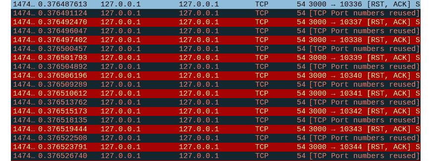

# 第七章：拒绝服务与限速测试

从基础的 API 攻击开始，现在是时候深入了解 **拒绝服务** (**DoS**) 和 **分布式拒绝服务** (**DDoS**) 威胁，并回答一些问题，例如：它们为何如此重要？它们对 API 端点的影响有多大？我们能利用什么来成功管理这些攻击的触发？你将了解到，DoS，尤其是其分布式形式，是一个全球性问题，几乎影响所有公开暴露的端点或应用程序。此外，尽管比较少见，但仅在私有环境中可访问的软件也并非免疫于此类攻击。内部威胁虽然较少，但也存在，并且可能会破坏内部应用。

**限速**是防御 DoS 攻击的关键机制，旨在控制 API 在特定时间内可以处理来自某个用户或 IP 地址的流量量。它可以防止用户在短时间内发送过多请求，这通常是攻击的指示。适当的限速可以在攻击期间帮助保持服务可用性，只允许一定数量的请求。

在进行渗透测试时，识别 API 的限速机制并测试其有效性非常重要。这包括评估为用户设置的阈值，并尝试绕过它们以检查这些控制的强度。此阶段的测试还可能包括检查 API 对不同攻击向量的响应，这些攻击向量可能导致服务中断。

本章将涵盖以下主要内容：

+   测试 DoS 漏洞

+   识别限速机制

+   绕过限速

# 技术要求

与前几章一样，我们将利用之前章节中提到的相同环境，例如 Ubuntu 发行版。在相应的部分中还将提到一些新的相关工具。

# 测试 DoS 漏洞

有一些值得提及的近期事件，这些事件能够展示这类攻击的威力和影响力。它们按流量规模列出，相关参考文献可以在本章最后的*进一步阅读*部分找到：

+   针对 Google Cloud 的攻击在 2017 年达到了 2.54 Tbps，但直到三年后的 2020 年才向公众披露。攻击通过伪造的数据包发送到 Web 服务器，伪装成 Google 服务器发送的请求。所有回应这些数据包的响应都被发送到 Google，从而导致了这一流量。

+   2020 年 2 月，一家 AWS 客户的基础设施成为 2.3 Tbps DDoS 攻击的目标。专门的服务 AWS Shield 成功吸收了这一“海啸”，从而保护了客户的资产。犯罪分子通过利用 **无连接目录访问协议** (**CLDAP**) 向公开可用的 **轻量目录访问协议** (**LDAP**) 服务器发送了大量数据包。

+   GitHub 排在我们的列表第三位。在 2018 年，利用 Memcached（一个流行的内存数据库）中的一个著名漏洞，攻击者可以滥用互联网上的公共 Memcached 服务器。根本原因类似于曾影响 Google 的事件。通过伪装 GitHub 的 IP 地址，罪犯发送了经过这些服务器放大的数据包，并将其返回到 GitHub。

我们将使用老朋友 Ubuntu 来构建本章的实验环境。但是，我们将安装一些额外的工具，因为我们需要发送合理数量的流量，并调整一些选项，以模拟从不同来源执行的操作。为此，我们将使用 **Mockoon**，这是一个开源解决方案，用于创建模拟的 API。自那时以来，我们一直在使用 crAPI 和我们自己的 Python 应用程序。现在是时候用一些其他软件进行测试了。

## 了解 Mockoon

安装过程非常简单，可以通过使用 Snap 完成（至少在 Linux 上是如此）。该产品也适用于 Windows 和 macOS。请注意，至少在本书写作时，尚未提供 ARM64 版本。所以，不幸的是，你必须拥有一个 Intel 系统才能使用它。

启动应用程序。第一次加载可能需要一些时间。以下截图展示了开机画面。我建议你浏览一下初始导览。它不大且相当直观。值得一提的是，Mockoon 将端点称为 **路由**。这是在文献中和一些其他产品中常见的命名方式。


图 7.1 – Mockoon 的启动画面

你会发现，Mockoon 在你完成初步浏览或直接取消时，已经启动了一个预配置的 API（称为 **DemoAPI**）和一些路由。你需要点击 *播放* 图标按钮，才能让 API 开始监听请求。在 **Settings** 标签页中，你可以选择将要使用的 IP 地址、端口和可选的前缀。还可以启用 TLS。该产品附带了一个自签名证书，但你也可以选择提供自己的证书文件、CA 证书文件和相关的密钥。当启用此选项时，一个锁形图标会显示在 API 名称下方，如果 API 已经在运行，你必须重启它。只需点击黄色圆圈箭头，或按照以下菜单顺序操作：**Run** | **Start** | **Stop** | **Reload** **current environment**：


图 7.2 – 启用 TLS 后重启 Mockoon API

花些时间浏览界面。所有路由（端点）都列在 **Routes** 标签页下。DemoAPI 总共有七个路由。作为 **创建、读取、更新和删除**（**CRUD**）的响应数据是一个使用某种语言类型的脚本。它生成 50 个随机的用户名及其 ID：

```
[
  {{#repeat 50}}
  {
    "id": "{{faker 'string.uuid'}}",
    "username": "{{faker 'internet.userName'}}"
  }
  {{/repeat}}
]
```

## 与 Mockoon 的端点进行交互

CRUD 路由正在监听 `/users`。观察执行此操作时发生的情况：

```
$ curl http://localhost:3000/users # use -k if you are testing with TLS.
[
  {
    "id": "b6790a61-295b-46d4-9739-bbea9ad30e4c",
    "username": "Annamarie.Hermiston39"
  },
  {
    "id": "8abcdac0-0ba4-40f0-95af-fbacff6b6d8f",
    "username": "Stephanie6"
  },
  {
    "id":"507f64b1-3ee8-4897-aa0b-514c4dc486fd",
    "username": "Maybell_Stark1"
  },
...output omitted for brevity and optimized for readability...
]
```

可接受的请求头可以在同名标签页中找到。默认情况下，只有常见的`Content-Type: application/json`。日志可以在同名标签页中访问。让我们先用这个 Mockoon 提供的虚拟 API 进行第一次测试。为此，我们将使用另一个著名的工具：`ab`。这是**ApacheBench**的缩写，它是开发人员和系统管理员在进行应用程序负载测试时常用的工具。它的安装也很简单。

注意

从现在起，我会交替使用*endpoint*和*route*这两个术语。请记住，在这个上下文中它们是相同的意思。

我们将目标定在`/users`路由，看看当接收到合理数量的请求时，我们的 API 表现如何。让我们从 100 个请求（`-n`命令选项）开始，其中 10 个（`-c`命令选项）是并发请求。输入以下命令并观察结果：

```
$ ab -n 100 -c 10 http://localhost:3000/resource-intensive-endpoint/
This is ApacheBench, Version 2.3 <$Revision: 1879490 $>
Copyright 1996 Adam Twiss, Zeus Technology Ltd, http://www.zeustech.net/
Licensed to The Apache Software Foundation, http://www.apache.org/
Benchmarking localhost (be patient).....done
Server Software:
Server Hostname:        localhost
Server Port:            3000
Document Path:          /users
Document Length:        0 bytes
Concurrency Level:      10
Time taken for tests:   0.201 seconds
Complete requests:      100
Failed requests:        0
Total transferred:      0 bytes
HTML transferred:       0 bytes
Requests per second:    497.08 [#/sec] (mean)
Time per request:       20.117 [ms] (mean)
Time per request:       2.012 [ms] (mean, across all concurrent requests)
Transfer rate:          0.00 [Kbytes/sec] received
Connection Times (ms)
              min  mean[+/-sd] median   max
Connect:        0    0   0.3      0       2
Processing:     1    2   3.6      1      23
Waiting:        0    0   0.0      0       0
Total:          1    2   3.6      1      23
Percentage of the requests served within a certain time (ms)
  50%      1
  66%      1
  75%      1
  80%      1
  90%      4
  95%     10
  98%     18
  99%     23
 100%     23 (longest request)
```

我们首先意识到`ab`有点啰嗦。这是可以预料的，因为它的主要目的是对你的应用程序进行负载测试，对吧？尽管如此，你可以通过`-q`和`-v`选项来控制它的输出。主页面解释了所有的选项开关。Mockoon 似乎按预期表现（在我的常规笔记本电脑上运行，并且在 Ubuntu 虚拟机上）。特别注意前面输出的最后一部分。它显示了特定时间段内服务请求的百分位数。它应当这样理解：

+   50%的请求在 1 毫秒或更短时间内被服务。

+   高达 95%的请求在 10 毫秒或更短时间内被服务。

+   最长的请求花费了 23 毫秒才被服务。

所有请求都被记录，并且没有任何请求经历大的延迟。不过，值得注意的是，Mockoon 在响应这些请求时并没有提供任何数据（甚至没有 HTML）。从前面`Document Length`、`Total transferred`和`HTML transferred`行中可以看出这一点。这可能揭示了 API 端的配置错误、意外的错误，或是 Mockoon 在回答`ab`时跳过了某些响应。由于 Mockoon 只是一个假/mock API 服务器，这种情况有时会发生。

现在，让我们看看当请求数量乘以 10 时，我们亲爱的 API 会有什么表现。一些输出故意被省略，以简化展示：

```
$ ab -n 1000 -c 100 http://localhost:3000/users
Document Length:        3629 bytes
Time taken for tests:   2.214 seconds
Complete requests:      1000
Total transferred:      3814000 bytes
HTML transferred:       3629000 bytes
Percentage of the requests served within a certain time (ms)
  50%    207
  66%    241
  75%    259
  80%    283
  90%    305
  95%    323
  98%    355
  99%    360
 100%    371 (longest request)
```

哈！现在，我们看到数据开始出现了。这才是我说的意思，伙计！抛开开场白不谈，观察到与上一次测试相比，响应时间显著增加。如果你重复这个命令，但通过 HTTPS，你会收到稍微长一点的响应时间。我做了最后一次测试，10,000 个请求，其中 1,000 个是并发请求，而这次 Mockoon 并没有完全响应：

```
Completed 9000 requests
apr_socket_recv: Connection reset by peer (104)
Total of 9585 requests completed
```

这与虚拟机的内存占用无关。我全程监视着它，我的系统有大约 2.5 GB 的空闲 RAM。我甚至重新启动了 Mockoon，以便为它提供一个干净的内存空间，但这仍然不足以解决问题。此次只记录了 50 个请求（这是 API 默认显示的最大日志条目数）。

## 利用 Scapy 攻击 Mockoon

我们有一段时间没使用 Wireshark 了，对吧？接下来的测试，如果我们能运行 Wireshark，将会更加有启发性。如果你系统中还没有它，赶紧安装并加载它。把它设置为监听回环适配器。你可能需要以 root 用户身份执行它来完成此操作。接下来的测试中，我们将使用 `pip` 并运行以下小段代码。观察它的输出：

```
from scapy.all import *
send(IP(dst="localhost")/TCP(dport=3000, flags="R"), count=5000)
```

这段代码将 5,000 个数据包发送到本地主机的 TCP 端口 `3000`，`3000` 是 Mockoon 监听请求的地方。观察它们不是 HTTP 数据包，而只是普通的 **传输控制协议**（**TCP**）数据包。这里的关键不在于观察 API 本身是否按预期行为表现，而是在于托管 API 的基础设施是否能应对这种不寻常的活动。如果你对 TCP/IP 网络了解不多，这类带有标志的数据包用于向接收方标明连接应终止。让我们看看 Mockoon 如何处理这种奇怪的通信。你将收到如下内容：

```
............................................................................................................................................................................................................................................
Sent 5000 packets.
```

Wireshark 捕获到了什么？切换到 Wireshark，你会看到许多红色的行对应着数据包（*图 7.3*）。


图 7.3 – Wireshark 捕获带有 RST 标志的 Scapy 数据包

代码没有返回任何错误，这意味着 Mockoon 很可能接收到了所有数据包（并可能忽略了它们）。如果你不确定输出中打印的点的数量，只需在命令行上运行该脚本，并附加 `|` `wc -c`。

当 Web 服务器或 API 网关没有配置来预见这种奇怪行为时，它可能会直接崩溃，甚至泄露一些内部数据，例如基础设施的详细信息。在我们的案例中，Mockoon 并没有抛出任何错误信息，也没有崩溃。也许它利用了一些支持这种行为的后端服务器。或者，可能是因为数据包是按顺序一个接一个地发送的，才没有出现问题。

到目前为止，我们一直从相同的源 IP 地址进行测试。这对于简单的测试很有帮助，但不足以检查端点如何同时处理来自多个地址的连接。这正是 DDoS 攻击的核心。API 端点及其环境可能很难区分合法流量和纯粹的攻击。

## 使用 hping3 进行 Mockoon 测试 – 初步测试

为了帮助我们完成这个任务，让我们调用另一个工具：`hping3`。在我们的实验环境中，我们可以使用 `apt` 来安装它。你可以利用 `hping3` 测试你的路由的方式至少有五种。首先，我们将发送几个 **同步**（**SYN**）数据包，假装我们正在尝试建立 TCP 连接，看看会发生什么：

```
$ hping3 -S -p 3000 -c 3 localhost
HPING localhost (lo 127.0.0.1): S set, 40 headers + 0 data bytes
len=44 ip=127.0.0.1 ttl=64 DF id=0 sport=3000 flags=SA seq=0 win=65495 rtt=7.1 ms
len=44 ip=127.0.0.1 ttl=64 DF id=0 sport=3000 flags=SA seq=1 win=65495 rtt=8.6 ms
len=44 ip=127.0.0.1 ttl=64 DF id=0 sport=3000 flags=SA seq=2 win=65495 rtt=6.1 ms
--- localhost hping statistic ---
3 packets transmitted, 3 packets received, 0% packet loss
round-trip min/avg/max = 0.4/7.7/16.1 ms
```

输出看起来像我们习惯的 `ping` 命令。重点正是如此。尽管如此，这个工具增强了其父工具所提供的可能性。观察 Wireshark 是如何记录它的：


图 7.4 – hping3 发送 SYN 数据包并重置连接

`hping3` 发送每个 SYN 数据包，并接收相应的 `Nmap`，命令如下：

```
$ hping3 --scan 3000 -c 3 localhost
Scanning localhost (127.0.0.1), port 3000
1 ports to scan, use -V to see all the replies
+----+-----------+---------+---+-----+-----+-----+
|port| serv name |  flags  |ttl| id  | win | len |
+----+-----------+---------+---+-----+-----+-----+
All replies received. Done.
Not responding ports: (3000 )
```

你可以通过逗号或破折号（用于范围）分隔多个端口。我们发送了三个数据包，但 Mockoon 并未回应。通过在 Wireshark 中查看，我们可以看到数据包确实到达了 Mockoon，但没有收到任何回复。Mockoon 可能正在忽略它们，因为它们只是探测数据包，而不是完整的 HTTP/HTTPS 数据包，也没有携带预期的头部或负载：


图 7.5 – 向 Mockoon 发送数据包以扫描端口

## 使用 hping3 发送随机数据

让我们继续前进。现在，我们将发送一些完全随机且无意义的数据。我们以前在其他场景中做过这个。此次，我们将使用 `hping3` 来实现。生成一个 1 MB 的文件，然后使用以下命令将其发送给 Mockoon。观察结果：

```
$ dd if=/dev/urandom of=random.bin bs=1M count=1
$ sudo hping3 -p 3000 -c 3 --file random.bin -d 32768 localhost
len=40 ip=127.0.0.1 ttl=64 DF id=0 sport=3000 flags=RA seq=0 win=0 rtt=1.9 ms
len=40 ip=127.0.0.1 ttl=64 DF id=0 sport=3000 flags=RA seq=1 win=0 rtt=11.1 ms
len=40 ip=127.0.0.1 ttl=64 DF id=0 sport=3000 flags=RA seq=2 win=0 rtt=9.4 ms
--- localhost hping statistic ---
3 packets transmitted, 3 packets received, 0% packet loss
round-trip min/avg/max = 1.9/7.4/11.1 ms
```

总结一下，我们告诉 `hping3` 执行以下操作：

+   向 TCP `3000` 端口发送数据包（`-p 3000`）

+   总共发送 3 个数据包（`-c 3`）

+   使用刚创建的文件作为数据负载（`--file random.bin`）

+   将数据包大小定义为 32768 字节（`-d 32768`）

+   使用 `localhost` 作为目标地址

如果你还在运行 Wireshark，你将捕获到类似以下的内容：


图 7.6 – Wireshark 捕获的数据包，当 hping3 向 Mockoon 发送文件时

注意到所有连接尝试都被重置。这是因为没有之前建立的连接能够维持文件传输。TCP/IP 栈简单地丢弃了所有尝试，发送了带有 RST 标志的数据包。我不确定你是否也意识到，`hping3` 为每个发送的数据包使用了不同的源端口。此外，这次需要使用 `sudo`。这是因为该工具需要进行系统调用，访问内核的网络驱动，而这只允许 root 操作员或经过特权提升后才能执行，我们可以通过 `sudo` 获得这些权限。

## 使用 hping3 发送分片数据包

在下一个测试中，我们将向目标发送分片数据包。由于与网络基础设施和目标服务的交互方式，分片数据包可能会干扰 API 端点。当一个大数据包通过互联网发送时，它通常会超过 `-f` 开关的限制：

```
$ sudo hping3 -f -p 3000 -c 3 -d 32768 localhost
HPING localhost (lo 127.0.0.1): NO FLAGS are set, 40 headers + 32768 data bytes
len=40 ip=127.0.0.1 ttl=64 DF id=0 sport=3000 flags=RA seq=0 win=0 rtt=11.1 ms
len=40 ip=127.0.0.1 ttl=64 DF id=0 sport=3000 flags=RA seq=1 win=0 rtt=10.5 ms
len=40 ip=127.0.0.1 ttl=64 DF id=0 sport=3000 flags=RA seq=2 win=0 rtt=11.3 ms
--- localhost hping statistic ---
3 packets transmitted, 3 packets received, 0% packet loss
round-trip min/avg/max = 11.1/12.2/14.2 ms
```

数据包分片是网络管理员关心的问题。这种攻击可能会对目标造成如下问题：

+   资源耗尽，可能由于 CPU 使用率增加或内存开销

+   重新组装失败，可能由于重新组装超时或重叠的分片

数据包捕获演示了通过网络流动的分片。你会看到比仅仅三个数据包更多的包，因为我们强制将其分片：


图 7.7 – 发送到 Mockoon 的分片数据包

## 使用 hping3 数据包进行洪水攻击 Mockoon

到目前为止，我们通过让 `hping3` 向我们的目标 API 服务器发送少量数据包。现在，我们将进一步操作。我们将发送更多数据包，尝试洪水攻击目标（使用 `--flood` 开关），并验证 Mockoon 是否足够智能来处理这些数据包。我们还会随机化源 IP 地址，以模拟真实的 DDoS 攻击。以下命令完成此任务：

```
$ sudo hping3 --flood --rand-source -p 3000 localhost
HPING localhost (lo 127.0.0.1): NO FLAGS are set, 40 headers + 0 data bytes
hping in flood mode, no replies will be shown
^C
--- localhost hping statistic ---
12356365 packets transmitted, 0 packets received, 100% packet loss
round-trip min/avg/max = 0.0/0.0/0.0 ms
```

你可以看到我没有指定数据包的数量。因此，`hping3` 将会不停地向目标发送数据包。此外，你还可以看到没有数据包被接收，表示存在 100% 丢包。这导致了系统中的两个有趣现象：

+   首先，空闲内存在几秒钟内急剧减少，并且即使停止 `hping3` 后也没有恢复：


图 7.8 – 系统内存因 DDoS 攻击处理而迅速减少

+   其次，可能由于缺乏空闲内存，Wireshark 经常停止响应，要求我等待或停止它：


图 7.9 – Wireshark 在捕获网络数据包时无法使用

当 Wireshark 最终决定至少再工作一段时间时，我可以截图给你展示 `hping3` 发送的数据包的结构：


图 7.10 – hping3 洪水攻击中的数据包

你可以轻松验证，这些是非常小的数据包（大小为 54 字节），来自几乎无限的不同 IP 地址源。这成功地耗尽了系统的内存，导致不仅 Mockoon 停止工作，其他所有应用程序也停止了。我甚至无法再使用 `curl` 向 API 发送简单请求。这是因为操作系统接收到了比它能在合理时间内处理的更多数据包，并且所有缓冲区同时在内存中打开，几乎完全占用了内存。只有通过完全重启，系统才恢复到了之前的状态。

## 让攻击更有趣——“快速”开关

这时，你可能会问我这个问题：有没有办法将其转变为更糟糕的情况？猜猜看？答案是一个大大的*是！* `hping3` 有一个 `--fast` 开关，它可以每秒发送大约 10 个数据包，彻底填满普通系统通常能够处理接收数据包的所有可能的数据包缓冲区。输入以下命令并观察结果。你的系统可能会再次挂掉，就像我的系统发生的那样。解释和之前的测试非常相似：

```
$ sudo hping3 --flood --syn --fast -p 3000 localhost
HPING localhost (lo 127.0.0.1): S set, 40 headers + 0 data bytes
hping in flood mode, no replies will be shown
^C
--- localhost hping statistic ---
1113320 packets transmitted, 0 packets received, 100% packet loss
round-trip min/avg/max = 0.0/0.0/0.0 ms
```

`--syn` 开关告诉 `hping3` 发送带有 SYN 标志的 TCP 数据包。这次我没有让它挂掉我的系统。也没有选择随机化源 IP 地址。即使有这些限制，Mockoon 仍然占据了使用更多内存的进程的顶部：


图 7.11 – 显示使用更多内存的进程的 top 命令输出

该包捕获也很有趣，展示了 Mockoon 尝试在数据包到达时重置它们，虽然这是一个高尚的任务，但并不足以应对：



图 7.12 – 使用 hping3 的 --fast 开关的包捕获

尽管这些流量并非来自不同的源 IP 地址，但它仍然是巨大的，确实可以对未做好准备的 API 端点及其后端造成一些损害，尤其是在它们没有防范 DoS 攻击时。这完全取决于系统处理如此多数据包句柄的能力和智慧。接下来，我们将探讨如何检测速率限制控制。速率限制对于抵御简单甚至有时复杂的攻击非常有用，就像我们刚刚学习的那种攻击。

# 识别速率限制机制

你刚刚学到了一些触发 DoS 攻击 API 端点的方法。我们甚至发送了一波微不足道但强大的 DDoS 数据包，使得我们的目标无法有效地处理这些数据包。防止此类威胁的第一种方法是对流量进行速率限制，也称为**节流**。更多信息，请参阅*进一步阅读*部分中的链接。

识别 API 中的速率限制机制是安全性和可用性评估中的关键部分。速率限制旨在通过限制用户在每个时间段内可以发起的请求数量，防止滥用。它有助于缓解各种攻击，如暴力破解或分布式拒绝服务（DDoS），通过限制操作频率来实现。这是通过应用一项策略来实现的，该策略确保服务器不会因同时收到过多请求而超载，这可能会影响其他用户的服务质量或导致服务器崩溃。速率限制可以基于多个因素，包括 IP 地址、用户账户、API 令牌或会话。它通常涉及设置允许的最大请求数量和这些请求的时间窗口。例如，一个 API 可能允许每个用户每分钟最多发起 100 个请求。该机制有助于保持服务质量、防止滥用，并更有效地管理服务器资源。

有多种实现速率限制的方法，例如固定窗口计数器、滚动窗口日志和漏桶算法，每种方法都有其优点和应用场景。固定窗口计数器在固定的时间间隔内重置计数，可能会在间隔边缘允许流量突发。滚动窗口在一个持续移动的窗口中跟踪计数，可以防止突发流量，但需要更复杂的跟踪机制。漏桶算法以稳定的速度允许请求，从而平滑流量的激增。选择合适的算法取决于你所保护的 API 的具体要求和行为。让我们进一步了解每种方法的细节。

## 固定窗口计数器

这是速率限制请求中的一个重要概念。它们只是记录在特定时间段内到达的请求数量的计数器。通过这个窗口，API 可以随时检查当前的请求数量，并根据阈值相应地减少或增加请求数量。如果流量被评估为合法，并且 API 需要处理更多的请求（例如，在新产品发布后），则会提高阈值。另一方面，当没有理由维持特定量的流量时，可以对其进行限制。

在渗透测试过程中，你可以利用固定窗口计数器为自己谋取优势。通过在定义的窗口时间内战略性地发送突发请求，你可以尝试识别速率限制本身。超出限制后的服务器响应观察至关重要。注意响应时间的变化、特定错误代码（如 429 请求过多）的出现，或是显示速率限制信息的头部。这些信息有助于渗透测试人员了解 API 对请求量的容忍度以及超出限制的后果。

不过，这种方式也有局限性。窗口计数器并不完全防止所谓的突发流量攻击。在这种攻击中，你在窗口时间即将刷新之前（前一个窗口结束，下一窗口开始）发送一波持续的请求。这可以利用计数器达到极限与窗口重置之间的空隙，从而暂时绕过速率限制。作为渗透测试人员，识别一个仅依赖固定窗口计数器的 API 可以揭示出在实际攻击场景中可能被利用的潜在漏洞。

## 滚动窗口日志

固定窗口计数器提供了基本的速率限制功能，但渗透测试人员常常遇到使用更复杂方法的 API：滚动窗口日志。与固定计数器不同，滚动窗口日志维护了与传入请求相关的时间戳的时间顺序记录。这个记录会不断更新，随着新请求的到来，旧的时间戳会被移出窗口。API 通过分析这个动态窗口内的请求数量来计算速率限制。

相比于固定窗口计数器，这种动态特性提供了若干优势。突发流量不会像在固定窗口计数器中那样轻易成功。窗口频繁调整，这减少了攻击者利用窗口重置定时器的机会。此外，滚动窗口日志能更真实地呈现实时请求的模式。它们可以考虑到正常流量的突然激增，这些流量可能会被固定窗口计数器错误地标记。这使得速率限制能够更精细化，避免在高活动时期不必要地阻止合法用户。

然而，这也给渗透测试人员带来了不同的挑战。与固定计数器相比，识别具体的窗口大小和速率限制可能更加困难。你可能需要采用更复杂的技术，例如发送间隔变化的请求来分析服务器响应，并推断滚动窗口的底层逻辑。此外，某些滚动窗口日志的实现可能不会通过错误代码或头部提供明确的反馈，这使得精确确定速率限制设置变得稍微有些困难。

## 漏桶

这个概念在 API 路由的速率限制中算是独特的。想象一个桶，底部有一个小孔，水持续以受控的量从孔中漏出。到达的请求可以比作水被倒入这个桶中。特定时间内能够处理的最大请求数对应于桶的容量（就像实际的桶有升或加仑的容量）。如果桶开始溢出*水*（有过多的请求到达端点），随后到达的请求会因没有足够的容量而被拒绝，只有当桶有足够空间容纳新请求时，才会接受新的请求。

这个类比转化为 API 的动态速率限制机制。漏桶的容量表示在一定时间内允许的最大请求量，而泄漏速率定义了请求被*处理*并视为允许的速度。这种方法为渗透测试 API 提供了多个优势。漏桶比固定窗口计数器更适合处理突发请求。即使有大量请求涌入，漏桶也能在一定程度上容纳这些请求，防止无谓地阻止合法用户。此外，正如 **服务质量** (**QoS**) 机制一样，漏桶可以优先处理某些类型的包，即使没有足够的容量容纳更多请求。通过为不同类型的请求调整泄漏速率，API 可以确保在高流量期间处理关键请求，从而提升整体系统的响应能力。

然而，对于渗透测试人员来说，漏桶模型提出了不同的测试挑战。与固定窗口或滚动窗口日志侧重于请求计数不同，漏桶模型涉及分析容量和泄漏速率。渗透测试人员可能需要发送一系列具有不同时间间隔的请求，并观察服务器如何响应。通过监控响应时间的变化或出现类似 429 Too Many Requests 的错误代码，测试人员可以尝试推测漏桶的容量和泄漏速率。这些信息能够揭示漏桶实现中的潜在弱点。

在下一节中，我们将实现一个速率限制机制，以保护我们用 Mockoon 创建的 API，并检查是否能够检测到其存在。Mockoon 本身已经提供了一些保护控制，你可以进行尝试，但我们也可以利用一些外部工具来实现这一目的，这将是我们的做法。

## 一个速率限制检测实验

为了实现这个实验，我们将使用 NGINX。我们本可以通过 Docker 容器来完成，但由于 Mockoon 是直接运行在我们的虚拟机上的，所以我们选择了第二种方式：在我们的 Linux 主机上安装 NGINX。只需按照操作系统的文档来安装该软件。在 Ubuntu 上，只需要几个 `apt` 命令。当安装完成后，NGINX 会在端口 `80` 上监听：


图 7.13 – NGINX 默认页面

现在，我们需要一个合适的 `nginx.conf` 文件，告诉 NGINX 作为反向代理工作，将所有请求转发到 Mockoon 并进行速率限制。将默认的 `/etc/nginx/nginx.conf` 文件内容替换为以下内容：

```
events {
    worker_connections  1024;
}
http {
    limit_req_zone $binary_remote_addr zone=limitlab:10m rate=1r/s;
    include      mime.types;
    default_type application/json;
    server {
     listen      80;
     server_name localhost;
       location / {
            limit_req zone=limitlab burst=5;
            proxy_pass http://localhost:3000;
            proxy_http_version 1.1;
            proxy_set_header Upgrade $http_upgrade;
            proxy_set_header Connection 'upgrade';
            proxy_set_header Host $host;
            proxy_set_header X-Real-IP $remote_addr;
            proxy_set_header X-Forwarded-For $proxy_add_x_forwarded_for;
            proxy_set_header X-Forwarded-Proto $scheme;
            proxy_cache_bypass $http_upgrade;
        }
    }
}
```

每个选项或指令都有其特定的用途：

+   `worker_connections`：此指令告诉 NGINX 每个工作进程能够处理多少并发连接，这对于同时处理多个请求至关重要。

+   `limit_req_zone $binary_remote_addr zone=limitlab:10m rate=1r/s`：此指令用于定义一个限流属性，限制客户端向服务器发起请求的速率。`$binary_remote_addr`部分表示客户端的 IP 地址，以紧凑的二进制格式呈现。此规则适用于每一个访问 NGINX 的 IP 地址。我们为创建的`limitlab`共享内存区分配了 10 MB 的 RAM，并指定了每秒一个请求的速率。进一步的选项在`limit_req`部分进行配置。

+   `include mime.types` 和 `default_type application/json` 确保 NGINX 适当地处理 MIME 类型。

+   `limit_req zone=limitlab burst=5`：在之前创建的`limitlab`区上，设定最多处理五个请求的突发流量，不做限制，以适应客户端偶尔快速连续发起多个请求的场景。

+   `proxy_pass http://localhost:3000` 和 `proxy_http_version 1.1`：定义要使用的 HTTP 版本以及后端的地址。在我们的例子中是 Mockoon API 服务器。

+   `proxy_set_header Upgrade $http_upgrade`：此头对于支持 WebSocket 连接至关重要。HTTP 请求中的`Upgrade`头用于请求服务器切换协议（例如，从`HTTP/1.1`切换到`WebSocket`）。此项仅为教育用途，不适用于我们的案例。

+   `proxy_set_header Connection 'upgrade'`：此头用于控制当前事务结束后，网络连接是否保持开启。将此设置为`'upgrade'`与`Upgrade`头配合使用，主要用于 WebSocket 或其他协议的升级。仅用于教育用途。

+   `proxy_set_header Host $host`：此头将转发请求的`Host`头设置为 NGINX 服务器接收到的请求的主机值。

+   `proxy_set_header X-Real-IP $remote_addr`：此自定义头通常用于将原始客户端的 IP 地址传递给后端服务器。

+   `proxy_set_header X-Forwarded-For $proxy_add_x_forwarded_for`：此头用于将客户端的 IP 地址追加到 NGINX 接收到的任何现有的`X-Forwarded-For`头。如果没有此头，NGINX 将创建一个。

+   `proxy_set_header X-Forwarded-Proto $scheme`：此头用于通知后端服务器客户端用来连接代理的协议。`$scheme`将包含`http`或`https`，具体取决于协议。

+   `proxy_cache_bypass $http_upgrade`：此指令用于在客户端请求中包含`Upgrade`头时绕过缓存。这通常用于不希望缓存响应的场景，例如在初始化 WebSocket 连接时。此项也仅为教育用途。

我在*进一步阅读*部分中放了一个链接，里面有关于如何配置 NGINX 作为远程代理的更多信息。如果它已经在运行，请重启服务。默认情况下，所有访问都记录在`/var/log/nginx/access.log`中，所有错误则记录在`/var/log/nginx/error.log`中。也启动 Wireshark，以便你检查是否发生了不同的情况。我们将从我们的朋友`ab`开始。由于我们现在是向 NGINX 发送请求，而不是直接向 Mockoon 发送，因此我们将省略`:3000`部分。为了简洁起见，部分输出被省略：

```
$ ab -n 100 -c 10 http://localhost/users
Server Software:        nginx/1.18.0
Concurrency Level:      10
Time taken for tests:   5.007 seconds
Complete requests:      100
Failed requests:        94
   (Connect: 0, Receive: 0, Length: 94, Exceptions: 0)
Non-2xx responses:      94
Requests per second:    19.97 [#/sec] (mean)
Time per request:       500.680 [ms] (mean)
Transfer rate:          11.61 [Kbytes/sec] received
Percentage of the requests served within a certain time (ms)
  50%      1
  66%      1
  75%      1
  80%      1
  90%      2
  95%    905
  98%   3902
  99%   4900
 100%   4900 (longest request)
```

非常有趣！将此与我们直接发送数据包到 Mockoon 时获得的先前结果进行比较。观察到 100 个数据包中有 94 个未能接收！这意味着 94%的流量被 NGINX 过滤掉了。考虑到我们允许每秒 5 个请求的突发流量，这表示`ab`成功接收了它的一次突发流量和一个单独发送的数据包。当你使用 Wireshark 检查流量时，我们会发现一些数据包带有 503 错误代码：


图 7.14 – NGINX 过滤掉过多的请求，这些请求原本会发送到 Mockoon

这发生在我们基本的 100 连接测试中，其中 10 个是同时进行的。与此同时，我也在监控已分配的 RAM 和 CPU 占用情况。它们没有受到任何影响。让我们重复之前使用`ab`进行的最激进的测试，看看是否有变化：

```
$ ab -n 10000 -c 1000 http://localhost/users
Concurrency Level:      1000
Time taken for tests:   5.009 seconds
Complete requests:      10000
Failed requests:        9994
Percentage of the requests served within a certain time (ms)
  50%     50
  66%     56
  75%     69
  80%     77
  90%    118
  95%    129
  98%    135
  99%    145
 100%   4991 (longest request)
```

被阻止的连接数量是相同的。此外，我们还注意到大多数请求的处理时间大幅增加（从 1 毫秒增加到平均约 60 毫秒）。在 Wireshark 中也可以验证类似的输出。检查`/var/log/nginx/error.log`，你会发现类似这样的几行：

```
[error] 11023#11023: *10619 limiting requests, excess: 5.048 by zone "limitlab", client: 127.0.0.1, server: localhost, request: "GET /users HTTP/1.1", host: "localhost"
```

好吧，我们可以确认我们的速率限制机制正在发挥作用。让我们看看如何在启用这种机制时发现这一点。为此，我们使用 Burp Suite。在启动之前，请再次确认你没有在其代理服务端口（默认情况下为`8080`）上运行其他服务。启动 Burp 后，切换到**Proxy**标签页，然后切换到**Proxy Settings**子标签页，确认它已启用。接着，转到**Intruder**标签页，点击**Intercept is on**按钮将其关闭。我们不希望每发送一个请求时都点击**Intercept**。

现在，在这个内部浏览器的`http://localhost/users`页面，你将收到带有随机用户名和 ID 的预期 JSON 结构。你可以关闭这个浏览器了。接下来，回到 Burp 的主界面，进入**Proxy**标签页，点击**HTTP history**子标签页。你将在那里看到该请求：


图 7.15 – Burp 捕获发送到 Mockoon 的请求及其响应

右键点击这个请求并选择 **发送到 Intruder**。你会看到 **Intruder** 选项卡变成橙色。点击那里。首先显示的界面名为 **Positions**。我们不需要使用它，因为我们不需要更改请求内容。我们这次不进行模糊测试（fuzzing）。我们只需要 Burp 重复请求：


图 7.16 – Burp 的 Intruder 捕获的原始请求

你可以使用任何攻击类型，不过对于这个测试，使用狙击手攻击（Sniper）或撞锤攻击（Battering ram）都足够了。如果使用多个有效载荷，Pitchfork 或 Cluster Bomb 方法会更合适。

接下来，切换到 **生成有效载荷** 文本框中的 `30`。在下图中，你可以看到 **Payloads** 部分的参数已经发生变化。


图 7.17 – 配置 Intruder 发送 30 个相同的数据包

现在，导航到 `10`：


图 7.18 – 创建资源池并定义并发请求数量

最后，点击 **开始攻击** 按钮。这将打开攻击窗口（*图 7.19*）。这会使 Intruder 向 NGINX 发送重复的请求。你会看到它们在这个窗口中不断出现，直到第 30 个请求。一些请求可能比其他请求更早到达，顺序也可能会乱。这是预期的，因为 NGINX 对它们施加了限制。顺便提一下，接收数据包时的延迟是我们需要考虑的一个变量。这可能意味着存在速率限制控制。你可以在 *图 7.19* 中看到一个成功的请求。注意查看日期。


图 7.19 – 由 Intruder 捕获的成功请求

让我们将其与紧随其后的请求进行比较（*图 7.20*），这是一个失败的请求（503 响应代码）。你可以看到，失败的请求在成功请求之前四秒发送，这表明可能启用了速率限制机制：


图 7.20 – 在成功请求之前收到的失败请求

保护 API 的其他迹象包括响应代码如 429，表示“请求过多”或响应中包含 `Retry-After` 头部。现在我们已经识别出在向 API 端点发送请求时可能会受到限流保护，接下来我们需要学习如何绕过这些保护机制。正是这一点将是下一节的内容。

# 绕过速率限制

当 NGINX 充当严密守卫时，速率限制成为控制流量并防止恶意活动的关键安全措施。NGINX 有一套速率限制配置，用于限制 API 客户端在特定时间内能够发送的请求数量。为了有效绕过这些限制，我们首先需要熟悉所使用的具体速率限制机制。这包括解读服务器响应，寻找诸如 `Retry-After` 头部或特定错误码（例如，429 Too Many Requests）等线索，这些都能表明速率限制的存在及其细节，正如我们之前所讨论的那样。

绕过速率限制的第一步是揭示触发限制的原因。常见的罪魁祸首包括客户端的 IP 地址、用户会话或 API 密钥。通过有策略地改变这些因素，我们可以找出速率限制的应用方式。像 Burp Suite 这样的工具成为我们的盟友，允许我们操控请求头部并模拟来自不同 IP 或用户会话的请求。分析服务器响应如何随不同输入变化，可以提供有关底层速率限制逻辑的有价值线索。在我们的案例中，我们知道 NGINX 基于源 IP 地址实施了速率限制。

为了绕过这种限制，我们通常会应用源 IP 地址的轮换。通过不断改变用于发送请求的 IP 地址，我们可以避开与特定 IP 绑定的限制。像 VPN、公共代理服务器或像 Tor 这样的匿名网络都可以用于此目的。此外，还可以使用自动化脚本或专门的工具，通过不同的 IP 地址池动态路由请求，进一步增加检测的难度。这正是我们在这里要做的。

如果速率限制依赖于会话标识符或特定的用户代理字符串，修改这些元素可能会重置速率限制计数器。Burp Suite 使我们能够操控 cookies（可能存储会话数据）和请求中的`User-Agent`头部。为每个请求编写自定义头部，或者利用浏览器自动化工具随机化用户代理字符串，可以有效绕过与用户会话或设备类型相关的限制。

另一种成功规避速率限制的方法是将请求分配到多个服务器或设备上。如果 NGINX 按 IP 地址跟踪请求数量，利用多个具有唯一 IP 的服务器发送请求可以帮助分散负载，并减少触发速率限制的风险。虽然这个策略涉及复杂的协调，但它可能非常有效，尤其是在结合 IP 轮换技术时。在现实攻击中，**僵尸网络**通常用于此目的。只需向它们发送一个命令，然后攻击就会从多个不同的地理位置同时开始。如果你对僵尸网络不太了解，我在*进一步阅读*部分提供了参考，找时间看看。这是不可错过的。

仔细检查 NGINX 如何响应超过速率限制的请求，可以提供有关潜在规避策略的有价值的见解。例如，如果响应头表明 NGINX 使用固定窗口计数器进行速率限制，那么在窗口重置后策略性地发送请求可以最大化请求容量。可以使用自动化工具来监控速率限制的时机和模式，并根据需要调整请求时机，以利用这个窗口。

行动时刻到！考虑以下代码。通过切换源 IP 地址，我们向`/users`路由发送不同的延迟请求：

```
import time
import requests
url = "http://localhost/users"
requests_per_ip = 10
delay_per_ip = 1
num_users = 5
for user_id in range(num_users):
    simulated_ip = f"10.0.0.{user_id+1}"
    print(f"Simulating user with IP: {simulated_ip}")
    # Loop to send requests for the current simulated user
    for i in range(requests_per_ip):
        response = requests.get(url)
        if response.status_code == 200:
            print(f"\tRequest {i+1} successful for user {user_id+1}.")
        else:
            print(f"\tRequest {i+1} failed for user {user_id+1}!")
            print(f"Status code: {response.status_code}")
            if response.status_code == 429 or response.status_code == 503:
                print(f"\tRate limit reached for user {user_id+1}!")
                print("\tWaiting for delay...")
                time.sleep(60)
        time.sleep(delay_per_ip)
print("All requests completed for simulated users.")
```

这段代码模拟了五个不同的用户。每个请求之间有 1 秒的延迟，当请求失败时，我们添加 60 秒（即 1 分钟）的延迟。我们可以调整这两个计时器，使它们保持在 NGINX 控制的边缘。你可以看到我们总共发出了 50 个请求（10 次乘以 5），这会触发 NGINX 的保护 9 次（记住，它允许最多 5 个请求的突发）。这里的关键是我们在每个请求之间设置的延迟。运行此代码后，所有请求都会收到成功的响应（为简洁起见，部分输出省略）：

```
     Request 8 successful for user 4.
     Request 9 successful for user 4.
     Request 10 successful for user 4.
Simulating user with IP: 10.0.0.5
     Request 1 successful for user 5.
     Request 2 successful for user 5.
     Request 3 successful for user 5.
     Request 4 successful for user 5.
     Request 5 successful for user 5.
     Request 6 successful for user 5.
     Request 7 successful for user 5.
     Request 8 successful for user 5.
     Request 9 successful for user 5.
     Request 10 successful for user 5.
All requests completed for simulated users.
```

NGINX 的错误日志没有新行，因为所有请求都已发送并接收。我们还可以通过检查 Mockoon 的日志来确认这一点。因此，我们可以得出结论，通过从不同的 IP 地址发起请求，并在请求之间设置小的延迟，可以绕过 NGINX 施加的速率限制。作为你环境中的未来练习，可以调整计时器和`nginx.conf`文件，看看不同值下的行为。别忘了重新启动服务以应用更改。

如果一个 API 提供多个端点可以实现相似的结果，交替使用这些端点可以帮助避免在单个端点上超过速率限制。这个策略取决于 API 的设计，但如果速率限制是按端点配置的，那么它可能非常有效。

有时候，简单地修改请求方式就足以避开速率限制。这可能包括将多个操作批量成一个请求，或者将通常会迅速连续发生的请求分散到更长的时间段内。提供能够在单次请求中获取或更新多个资源的 API，在这种情况下特别有用。

# 总结

在这一更具实践性的章节中，我们深入探讨了 DoS 和 DDoS 攻击，这些技术可以用来发现目标 API 端点的漏洞。接着，我们学习了如何检测速率限制控制是否已到位（这些控制能够过滤 DoS 攻击）。最后，我们通过编写 Python 代码，成功绕过了之前阻止我们的速率限制机制，这一过程通过在请求之间添加延时并更换源 IP 地址完成。

在下一章中，我们将开始新的内容，探索关于渗透测试 API 的高级话题。我们将从理解成功的入侵如何导致数据暴露和敏感信息泄露开始。

# 进一步阅读

+   针对 Google 服务的攻击: [`cloud.google.com/blog/products/identity-security/identifying-and-protecting-against-the-largest-ddos-attacks`](https://cloud.google.com/blog/products/identity-security/identifying-and-protecting-against-the-largest-ddos-attacks)

+   AWS 遭遇巨型 DDoS 攻击: [`aws-shield-tlr.s3.amazonaws.com/2020-Q1_AWS_Shield_TLR.pdf`](https://aws-shield-tlr.s3.amazonaws.com/2020-Q1_AWS_Shield_TLR.pdf)

+   影响 GitHub 的 Memcached 漏洞与 DDoS 攻击: [`github.blog/2018-03-01-ddos-incident-report/`](https://github.blog/2018-03-01-ddos-incident-report/)

+   使用 Mockoon 创建模拟 API: [`mockoon.com/`](https://mockoon.com/)

+   ApacheBench，网站/API 性能测试工具: [`httpd.apache.org/docs/current/programs/ab.html`](https://httpd.apache.org/docs/current/programs/ab.html)

+   Scapy Python 库: [`pypi.org/project/scapy/`](https://pypi.org/project/scapy/)

+   `hping3`: [`linux.die.net/man/8/hping3`](https://linux.die.net/man/8/hping3)

+   *什么是 API* *限流？*： [`www.tibco.com/glossary/what-is-api-throttling`](https://www.tibco.com/glossary/what-is-api-throttling)

+   NGINX 作为反向代理: [`docs.nginx.com/nginx/admin-guide/web-server/reverse-proxy/`](https://docs.nginx.com/nginx/admin-guide/web-server/reverse-proxy/)

+   Envoy，另一个开源代理服务： [`www.envoyproxy.io/`](https://www.envoyproxy.io/)

+   *僵尸网络及其对互联网* *安全的威胁*： [`www.researchgate.net/publication/227859109_Study_of_Botnets_and_their_threats_to_Internet_Security`](https://www.researchgate.net/publication/227859109_Study_of_Botnets_and_their_threats_to_Internet_Security)

+   更多关于 DoS 和 DDoS 攻击的信息：[`subscription.packtpub.com/book/programming/9781838645649/8/ch08lvl1sec02/denial-of-service-dos-and-distributed-denial-of-service-ddos-attacks`](https://subscription.packtpub.com/book/programming/9781838645649/8/ch08lvl1sec02/denial-of-service-dos-and-distributed-denial-of-service-ddos-attacks)

+   构建 RESTful Python Web 服务，提供了关于创建 API 的各种有用技巧，包括对请求实施限流：[`www.packtpub.com/en-th/product/building-restful-python-web-services-9781786462251`](https://www.packtpub.com/en-th/product/building-restful-python-web-services-9781786462251)

# 第四部分：API 高级主题

你可以通过*第三部分*中涉及的主题来实现较好的攻击效果。它们是基础性的，但依然非常有效。然而，有些情况下你需要使用更复杂的技术。我们这里谈论的是高级攻击技巧，这些将在本部分中进行讲解。你将了解如何检测数据曝光和泄露。你还将学习什么是 API 业务逻辑，以及如何利用其错误实现来获得未授权的访问和执行未授权的操作。与*第三部分*类似，本部分也会给出一些建议，帮助你避免出现 API 中这一关键部分的问题。

本节包含以下章节：

+   *第八章*，*数据曝光和敏感信息泄露*

+   *第九章*，*API 滥用与业务逻辑测试*
