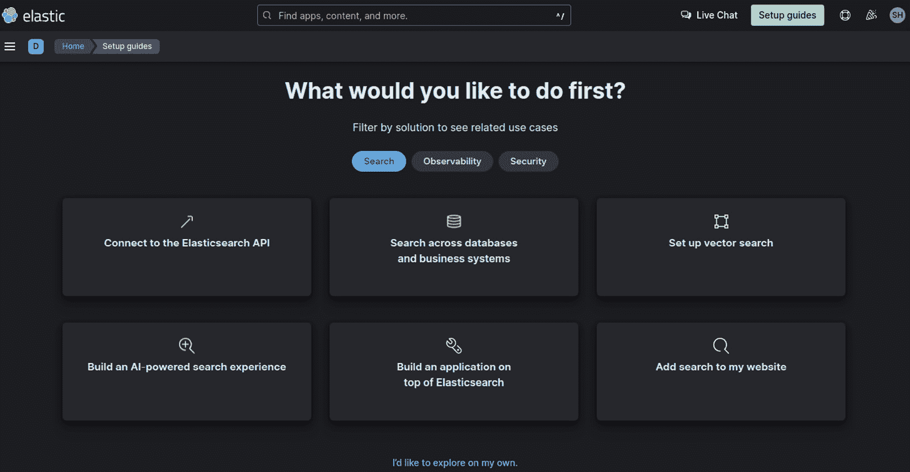
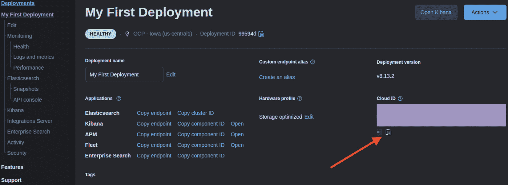
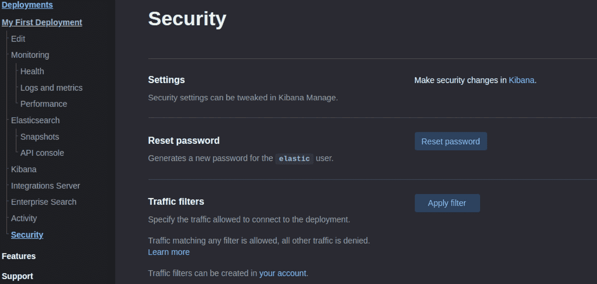
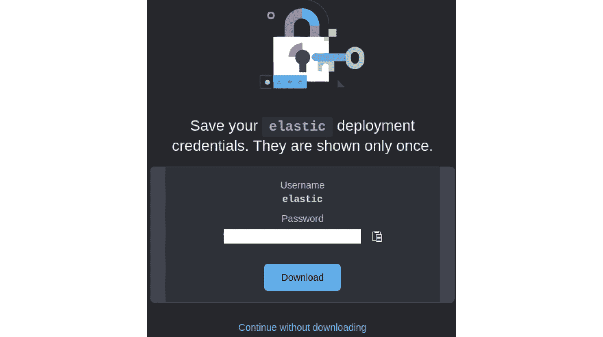
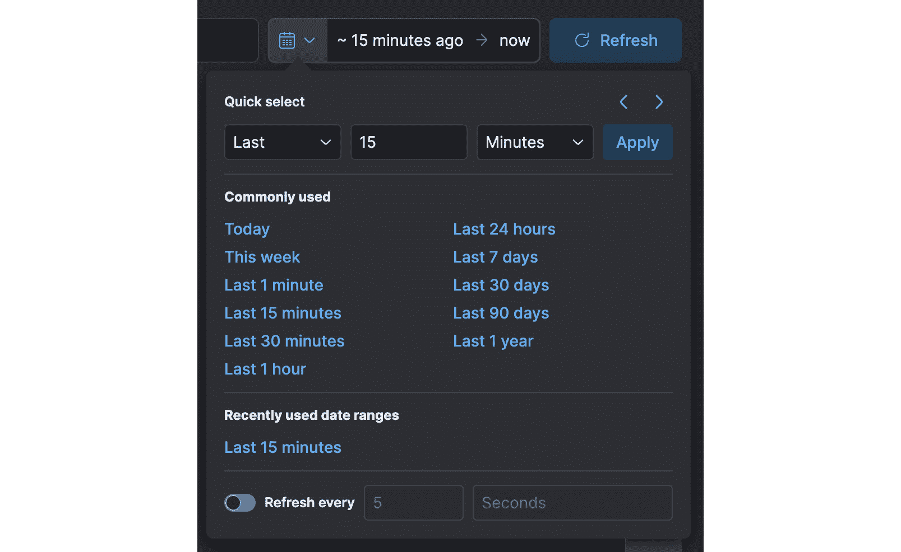
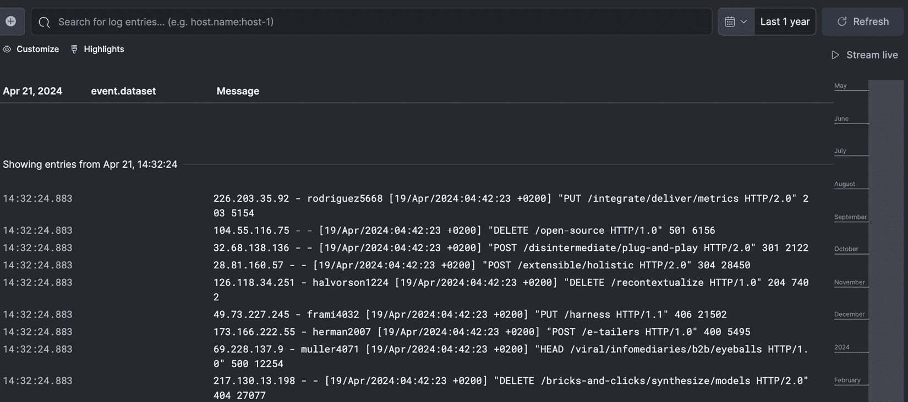
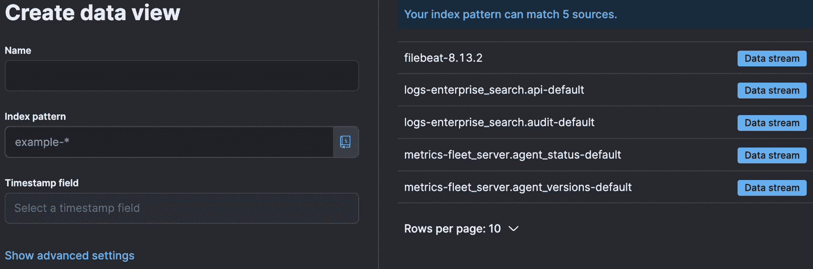
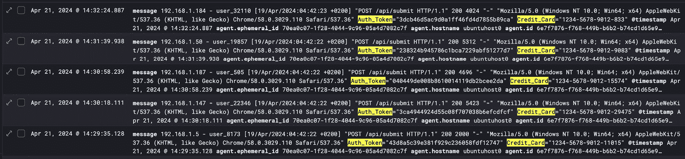

# 第八章：数据曝光和敏感信息泄漏

本章开始了我们书的第四部分，内容关于高级 API 技术。我们将更好地理解未修补或配置不当的 API 端点可能面临的数据曝光和敏感信息泄漏问题。我们将探讨这些问题发生的细微差别，并学习如何作为 API 渗透测试员将其转化为对我们有利的局面。

无论是通过消化一些数据块，还是通过利用之前渗透测试的发现，我们将学习如何在其他垃圾或不太有价值的资产中检测到数据或敏感信息。这不仅可以节省你进行渗透测试时的时间，还能在计划进行协调攻击的最终目标时帮助你。某些测试人员的工作范围是将一些数据从端点中提取出去，而另一些则通过滥用网络等手段来进行数据下传。你将学习这些技术，并了解如何在配置或构建 API 时避免此类问题。

在本章中，我们将涵盖以下主要话题：

+   识别敏感数据曝光

+   测试信息泄漏

+   防止数据泄漏

# 技术要求

正如我们在之前的章节中所做的那样，我们将利用与之前章节中提到的相同的环境，比如 Ubuntu 发行版。其他一些新的相关工具将在相应的章节中提到。

在本章中，我们将特别专注于处理大量数据。因此，我们将依赖一些数据挖掘和整理工具，这些工具将在分析大规模日志或其他类型的大数据时为我们完成繁重的工作。

# 识别敏感数据曝光

识别 API 中的敏感数据曝光是确保它们安全的关键步骤。无论大小，数据泄露都可能对公司声誉造成严重且常常无法修复的损害。因此，全面了解你拥有的 API 端点可能存在的漏洞至关重要。第一步是定义什么构成敏感数据。这不仅仅是**个人身份信息**（**PII**）如姓名和地址。以下是不同类型敏感数据的分类，以及 API 如何暴露这些数据：

+   **个人身份信息（PII）**：这对应于所有可以用来识别某人或个人的各种数据或信息。这包括政府身份证号码（例如美国或欧洲的社会保障号码，或巴西的 CPF），护照信息（例如护照号码，以及签发和到期日期），甚至健康数据。没有适当访问控制的 API 返回用户资料可能会泄露个人身份信息。

+   **财务数据**：信用卡详细信息、银行账户号码和财务交易历史都是高度敏感的。如果一个 API 端点需要处理任何类型的支付，即使只是将数据重定向到支付系统并从中接收数据，它也必须具备严格的安全控制。

+   **身份验证**（**AuthN**）**凭据：** 用户名、密码和访问令牌是保护 API 安全的基础。当此类数据泄露时，可能会危及 API 端点背后整个系统的访问权限。

+   **专有信息：** 商业机密、知识产权文件以及内部配置都可以视为敏感数据。如果与内部系统或数据库交互的 API 没有得到妥善保护，它们可能会泄露此类信息。

检测何时可以从输出中提取敏感数据并不总是那么直观。这可能需要我们在解析文件转储（如日志）时使用一些复杂的工具。现在我们将深入分析大量日志，结合几种工具和模式，发现哪些敏感数据或信息是可用的。根据手头的日志量，你可能需要将此任务委派给外部系统，以利用更强的计算能力来处理它。

由于在本次操作中不会使用真正的 API 端点和真正的敏感数据，我们需要一种方法来生成一些日志文件进行分析。有一个很好的开源项目是用 Golang 编写的，叫做 `go` 命令，可以直接作为二进制文件使用（包括使用 `.tar.gz` 包）或者作为 Docker 容器运行。

这些行不会包含我们正在寻找的任何类型的敏感数据。因此，让我们通过一些随机数据来增强其功能，方便后续查询。接下来的代码就是这么做的。循环创建日志条目，并将其存储在由 `LOG_FILE` 变量指向的文件中。请注意，只有当迭代器变量 (`i`) 能被 100 整除时，敏感数据才会被插入。当 `i` 不能被 100 整除时，`flog` 会生成一行完全随机的内容。因此，我们将有 1,000 行包含敏感数据，9,000 行不包含敏感数据。这将使输出文件变成一个包含大量数据但不太有趣的内容。echo 命令在一行内执行：

```
LOG_FILE=dummy.log
for i in $(seq 1 10000); do
  if [ $((i % 100)) -eq 0 ]; then
    # Every 100th line contains sensitive data
    echo "192.168.1.$((RANDOM % 255)) - user_$RANDOM [$(date +'%d/%b/%Y:%H:%M:%S %z')] \"POST /api/submit HTTP/1.1\" 200 $((RANDOM % 5000 + 500)) \"-\" \"Mozilla/5.0 (Windows NT 10.0; Win64; x64) AppleWebKit/537.36 (KHTML, like Gecko) Chrome/58.0.3029.110 Safari/537.36\" Auth_Token=\"$(openssl rand -hex 16)\" Credit_Card=\"1234-5678-9012-$RANDOM\"" >> $LOG_FILE
  else
    # Other lines contain generic log data
    flog >> $LOG_FILE
  fi
done
```

我们正在使用 BASH 的 `$RANDOM` 内部变量，它在读取时生成伪随机数。请注意，我们需要在系统上安装 `openssl` 来生成与虚假令牌对应的随机字符串。如果你不想包含 `Auth_Token` 部分，只需删除即可。上面的代码创建了一个约 1 GB 大小的文件。

那么，我们如何消化这些数据并只提取有趣的部分呢？有一些方法可以做到这一点。考虑到我们使用的是 Linux 系统，甚至 `grep` 命令也可以完成这个任务，并通过一些正则表达式来方便搜索。不过，这并不是性能最好的解决方案。我们需要其他方法。

## Elasticsearch 及更多内容

在处理大量数据时，我们需要正确的工具。好吧，1 GB 现在不算大，但假设你将需要访问数 TB 的日志文件，如何在可行的时间内用`grep`搜索它们呢？我们将练习一种可能的解决方案：**Elasticsearch、Logstash 和 Kibana**（**ELK**）堆栈。它们是三个独立的产品，可以结合在一起提供一流的数据分析和可视化体验。而且，它们可以作为 Docker 容器运行。

然而，有一个缺点，就是对资源（计算、内存和存储）的巨大需求。我无法在实验室虚拟机（8 GB RAM）上运行它们。仅仅是 Elasticsearch 就需要比可用内存更多的资源。事实上，在我写这章时尝试的版本（8.13.2）中特别抱怨最大映射数检查，这个检查由 Linux 内核参数控制。即使将其增加到文档推荐的数值（详细信息请参阅*进一步阅读*部分），Elasticsearch 仍然无法工作。我还在另一台运行 macOS 的系统上进行了一些测试，但无论是容器版本还是独立版本，都存在不同的问题，使得配置变得困难。

我最终决定在 Elastic 的云平台上运行这个堆栈。他们将其作为**软件即服务**（**SaaS**）销售，并提供 14 天的试用期。你可以使用产品的所有功能并导入外部数据源。设置此平台的步骤如下：

1.  你需要注册该平台或通过 AWS、Google 或 Microsoft 的云市场进行订阅。访问[`cloud.elastic.co/`](https://cloud.elastic.co/)并点击**注册**。你可能会收到一封带有链接的验证邮件，点击该链接并登录。

1.  向导会提示你回答一些关于你自己的问题，例如你的全名、公司名称以及使用该平台的目的。

1.  然后，向导会建议创建一个部署。通过点击**编辑设置**，你可以选择公共云提供商、区域、硬件配置和 Elastic 版本。应用程序会自动选择适合你所在位置的组合。为这个部署输入一个名称，然后点击**创建部署**。

1.  创建部署只需要几分钟，然后你会被重定向到平台的登录页面。这里有一个小提示很重要：你不会像预期的那样收到部署凭据。因此，你需要遵循一个额外的步骤，我们稍后会解释：



图 8.1 – Elastic Cloud Platform 的登录页面

1.  下一步是配置输入。你需要告诉它如何接收 Elasticsearch 和 Kibana 将要进一步分析的数据。为此，我们将使用 Filebeat，它既是一个外部工具，也是一种内建集成。你甚至可以直接将日志流式传输到平台。当你希望持续发送数据进行分析时，这非常有用。在我们的情况下，这只会发生一次。

1.  根据你所使用的操作系统，有不同的安装说明。Ubuntu 默认没有该应用程序的可下载仓库。为了方便起见，我在 *进一步阅读* 部分提供了需要遵循的步骤链接。

1.  你不会立即启动 Filebeat 服务。首先，你需要配置它，将数据发送到 Elastic 的云端。至少在 Ubuntu 系统上，`filebeat.yml` 配置文件位于 `/etc/filebeat`。你只需关注两个部分：**Filebeat 输入**和 **Elastic Cloud**。请先备份该文件，并用你喜欢的编辑器打开它。找到 **Filebeat 输入** 部分。

1.  你会看到类似这样的内容（为了简洁，省略了注释）：

    ```
    - type: filestream
      id: my-filestream-id
      enabled: false
      paths:
        - /var/log/*.log
    ```

1.  你需要执行以下操作：

    1.  将 `filestream` 替换为 `log`。这是为了告诉 Filebeat 这个不是一个持续变化的文件，而是一个静态文件。

    1.  将 `my-filestream-id` 替换为更相关的名称，比如 `sensitive-data-log`。

    1.  将 `false` 替换为 `true`，以有效启用输入。

    1.  将 `/var/log/*.log` 替换为你之前生成的文件的完整路径（即使用 `flog` 工具生成的那个文件）。

1.  找到 **Elastic Cloud** 部分。你会看到类似这样的内容：

    ```
    # The cloud.id setting overwrites the `output.elasticsearch.hosts` and
    # `setup.kibana.host` options.
    # You can find the `cloud.id` in the Elastic Cloud web UI.
    #cloud.id:
    # The cloud.auth setting overwrites the `output.elasticsearch.username` and
    # `output.elasticsearch.password` settings. The format is `<user>:<pass>`.
    #cloud.auth:
    ```

1.  此时，你需要回到网页控制台并找到这两个参数。可以通过以下顺序查找 Cloud ID：

    1.  从 *图 8.1* 中的登陆页面，点击左侧的三个水平线打开侧边菜单并选择 **管理此部署**。

    1.  有一个剪贴板按钮，你可以点击它来方便地复制此数据。点击复制并将其保存在临时位置。



图 8.2 – 在 Elastic 控制台中查找 Cloud ID 的位置

1.  `Cloud Auth` 参数需要几个额外步骤：

    1.  在此屏幕上，点击 **操作** 按钮并选择 **重置密码**。这将把你重定向到 **安全性** 设置页面，在那里你可以做一些调整：



图 8.3 – 重置部署的密码

1.  点击 **重置密码** 按钮。网站会要求你确认。只需点击 **重置**。

1.  你的新密码将被定义。你可以复制它（使用类似的剪贴板按钮）或下载包含凭证的 CSV 文件。参考 *图 8.4*。



图 8.4 – 新的 Elastic 密码已定义，并提供点击复制或下载 CSV 文件的选项

1.  现在，返回到`filebeat.yml`文件。

1.  取消注释`cloud.id`和`cloud.auth`这两行。接下来，在这两行中每个冒号后插入一个空格。

1.  将你之前复制的数据粘贴到相应的行中。对于`cloud.auth`这一行，注意预期格式是`username:password`。用户名部分通常是`elastic`。

1.  保存并关闭文件。你可以使用一些命令来验证配置文件是否良好，以及 Filebeat 是否能与云部署进行连接：

    ```
    $ sudo filebeat test config
    Config OK
    $ sudo filebeat test output
    elasticsearch: https://<a type of credential will show up here>.us-central1.gcp.cloud.es.io:443...
      parse url... OK
      connection...
        parse host... OK
        dns lookup... OK
        addresses: 35.193.143.25
        dial up... OK
      TLS...
        security: server's certificate chain verification is enabled
        handshake... OK
        TLS version: TLSv1.3
        dial up... OK
      talk to server... OK
      version: 8.13.2
    ```

1.  注意，你可能需要以超级用户身份运行这些命令。这取决于你的操作系统默认设置。现在，你可以启动 Filebeat 服务或以交互模式运行它。我个人更喜欢第二种方式，因为你可以查看它的日志输出：

    ```
    $ sudo filebeat -e
    {"log.level":"info","@timestamp":"2024-04-21T18:23:44.082+0200","log.origin":{"function":"github.com/elastic/beats/v7/libbeat/cmd/instance.(*Beat).configure","file.name":"instance/beat.go","file.line":811},"message":"Home path: [/usr/share/filebeat] Config path: [/etc/filebeat] Data path: [/var/lib/filebeat] Logs path: [/var/log/filebeat]","service.name":"filebeat","ecs.version":"1.6.0"}
    {"log.level":"info","@timestamp":"2024-04-21T18:23:44.083+0200","log.origin":{"function":"github.com/elastic/beats/v7/libbeat/cmd/instance.(*Beat).configure","file.name":"instance/beat.go","file.line":819},"message":"Beat ID: 6e7f7876-f768-449b-b6b2-b74cd1d65e93","service.name":"filebeat","ecs.version":"1.6.0"}
    The rest of the output was omitted for brevity.
    ```

此时，你可以返回控制台查看它正在接收的内容。假设一切正常，要查看`dummy.log`中的数据行，请再次点击侧边菜单中的三条横线，进入**Observability** | **Logs**。如果没有显示任何内容，只需点击**刷新**。默认情况下，这个视图会显示过去 15 分钟的活动。如果你在数据已发送时做了其他操作，可能什么也看不见。如果发生这种情况，只需将视图控制更改为显示更早的数据，如**过去 1 年**：



图 8.5 – 更改视图控制以显示日志数据

对视图控制的更改立即生效。以下截图显示了你在浏览由 Filebeat 发送的日志数据时将看到的视图类型。



图 8.6 – 可在 Elastic Cloud 平台上查询的日志行

注意，这些行是以 IP 地址开头的。我们可以将其用作索引。为了能够在这些数据上搜索模式，我们可以选择以下其中一种选项：

+   只需在此搜索栏中输入你要查找的数据。例如，如果你输入`Credit_card`或`Auth_Token`，在你按下*Enter*后，所有包含这些模式的行将会显示出来。

+   创建一个数据视图。某些文献中会使用**索引模式**这一术语来指代这个功能，但它在一段时间前已经被更名为数据视图。

这是 Kibana 的一个功能。要创建数据视图，如果你在最上面的搜索栏中输入 `Data View`，会更容易。这样会出现一个建议，并附带相应的链接。点击它，你将被重定向到一个空白页面，页面上有**创建数据视图**按钮。点击它后，所有源将被显示。其中一些是由部署创建的，还会有一个 Filebeat 的源：



图 8.7 – 在 Kibana 中创建数据视图

在 `filebeat-*` 中。这将导致屏幕右侧更新并仅显示 `@timestamp` 下的 Filebeat 来源）。点击**保存数据视图** **到 Kibana**。

当你这么做时，之前的空白页面将更新为最近创建的数据视图。现在，最后一步是发现模式。回到最上面的搜索栏，输入 `Discover`。你将被重定向到 KQL 的 `message` 关键字。我们可以构建这样的查询：

```
message: Credit_card OR Auth_Token
```

最终将显示过滤后的窗口：



图 8.8 – 使用 KQL 查找敏感数据模式

这远不是 ELK 堆栈的入门培训。我在*进一步阅读*部分添加了其他链接，你可以在平台上查看正则表达式，并且可以参加免费的培训课程。这个很好，但如果你不想使用浏览器，甚至不想利用一些云服务来进行敏感数据搜索怎么办？我们接下来会介绍这个。

## ripgrep

如果你正在寻找一个比 ELK 更小巧的工具来搜索日志中的敏感数据，`rg` 是一个面向行的搜索工具，它结合了 The Silver Searcher（链接在*进一步阅读*部分）的可用性和 grep 的原始速度。`rg` 默认工作非常高效，忽略二进制文件，尊重你的 `.gitignore` 文件以跳过隐藏和忽略的文件，并且有效地使用内存。

与 ELK 堆栈相比，`rg` 至少有三个优势：

+   它非常快速，即使在大文件上也能表现良好。

+   它是一个独立的可执行文件，安装和使用都非常简单，不需要复杂的配置。

+   不需要运行服务或守护进程，与 ELK 相比，内存和 CPU 使用非常少。

在 Ubuntu 上安装它和安装任何通过 `apt` 或 `apt-get` 提供的应用程序一样简单。它也有适用于 macOS 和 Windows 的版本。让我们看看它在查找信用卡号时如何处理我们的 1 GB 虚拟文件：

```
$ time rg "\b\d{4}-\d{4}-\d{4}-\d{4}\b" dummy.log
594006:192.168.1.120 - user_12186 [19/Apr/2024:04:41:55 +0200] "POST /api/submit HTTP/1.1" 200 1633 "-" "Mozilla/5.0 (Windows NT 10.0; Win64; x64) AppleWebKit/537.36 (KHTML, like Gecko) Chrome/58.0.3029.110 Safari/537.36" Auth_Token="e4e8be71c743f3273e22c43e1585282a" Credit_Card="1234-5678-9012-1975"
1188012:192.168.1.223 - user_22717 [19/Apr/2024:04:41:56 +0200] "POST /api/submit HTTP/1.1" 200 2929 "-" "Mozilla/5.0 (Windows NT 10.0; Win64; x64) AppleWebKit/537.36 (KHTML, like Gecko) Chrome/58.0.3029.110 Safari/537.36" Auth_Token="7e204c483eb812251e2c219bbdda7c08" Credit_Card="1234-5678-9012-5180"
1485015:192.168.1.247 - user_28863 [19/Apr/2024:04:41:57 +0200] "POST /api/submit HTTP/1.1" 200 1585 "-" "Mozilla/5.0 (Windows NT 10.0; Win64; x64) AppleWebKit/537.36 (KHTML, like Gecko) Chrome/58.0.3029.110 Safari/537.36" Auth_Token="a4de7124036ae0229ad43a75f972be69" Credit_Card="1234-5678-9012-6131"
...Output omitted for brevity...
real    0m2.276s
user    0m2.235s
sys    0m0.040s
```

大约 2.5 秒内，`rg` 就能在接近 1 GB 大小的文件中找到 26 行包含信用卡号的数据！这发生在它运行于拥有 4 个虚拟 CPU 和 8 GB 内存的 Ubuntu 虚拟机上。顺便提一下，Filebeat 仍在运行，我的浏览器实例也在和它争夺 CPU 和内存。接下来我们来看看它在 AuthN token 上的表现：

```
$ time rg "Auth_Token=[^ ]+" dummy.log
99001:192.168.1.209 - user_10741 [19/Apr/2024:04:41:53 +0200] "POST /api/submit HTTP/1.1" 200 2550 "-" "Mozilla/5.0 (Windows NT 10.0; Win64; x64) AppleWebKit/537.36 (KHTML, like Gecko) Chrome/58.0.3029.110 Safari/537.36" Auth_Token="76358e1eaf10a2da25845535f6a2f8ca" Credit_Card="1234-5678-9012-685"
198002:192.168.1.31 - user_15060 [19/Apr/2024:04:41:53 +0200] "POST /api/submit HTTP/1.1" 200 4211 "-" "Mozilla/5.0 (Windows NT 10.0; Win64; x64) AppleWebKit/537.36 (KHTML, like Gecko) Chrome/58.0.3029.110 Safari/537.36" Auth_Token="bfc4d56410a31f16e939559d1fd19011" Credit_Card="1234-5678-9012-30887"
297003:192.168.1.120 - user_1823 [19/Apr/2024:04:41:54 +0200] "POST /api/submit HTTP/1.1" 200 2612 "-" "Mozilla/5.0 (Windows NT 10.0; Win64; x64) AppleWebKit/537.36 (KHTML, like Gecko) Chrome/58.0.3029.110 Safari/537.36" Auth_Token="56a3d397f23094f3517296ea35e8bf5e" Credit_Card="1234-5678-9012-10401"
...Output omitted for brevity...
real    0m0.216s
user    0m0.172s
sys    0m0.044s
```

那更疯狂了。由于正则表达式更简单，它可以在不到 0.5 秒的时间内找到 100 行匹配的模式！和常规的`grep`一样，`rg`是区分大小写的。可以使用相同的开关（`-i`）来关闭此功能。你还可以组合正则表达式，一次查找多个模式：

```
$ time rg -e "\b\d{4}-\d{4}-\d{4}-\d{4}\b" -e "Auth_Token=[^ ]+" dummy.log
99001:192.168.1.209 - user_10741 [19/Apr/2024:04:41:53 +0200] "POST /api/submit HTTP/1.1" 200 2550 "-" "Mozilla/5.0 (Windows NT 10.0; Win64; x64) AppleWebKit/537.36 (KHTML, like Gecko) Chrome/58.0.3029.110 Safari/537.36" Auth_Token="76358e1eaf10a2da25845535f6a2f8ca" Credit_Card="1234-5678-9012-685"
198002:192.168.1.31 - user_15060 [19/Apr/2024:04:41:53 +0200] "POST /api/submit HTTP/1.1" 200 4211 "-" "Mozilla/5.0 (Windows NT 10.0; Win64; x64) AppleWebKit/537.36 (KHTML, like Gecko) Chrome/58.0.3029.110 Safari/537.36" Auth_Token="bfc4d56410a31f16e939559d1fd19011" Credit_Card="1234-5678-9012-30887"
297003:192.168.1.120 - user_1823 [19/Apr/2024:04:41:54 +0200] "POST /api/submit HTTP/1.1" 200 2612 "-" "Mozilla/5.0 (Windows NT 10.0; Win64; x64) AppleWebKit/537.36 (KHTML, like Gecko) Chrome/58.0.3029.110 Safari/537.36" Auth_Token="56a3d397f23094f3517296ea35e8bf5e" Credit_Card="1234-5678-9012-10401"
...Output omitted for brevity...
real    0m1.821s
user    0m1.788s
sys    0m0.033s
```

一切在不到 2 秒钟内完成。这是一次胜利！你可以选择将`rg`集成到自动化脚本中，并将其输出重定向到日志文件中。仔细查看它的手册页，了解更多关于这个神奇工具的信息。接下来，我们将学习如何进行测试，以检测信息泄露。

# 信息泄露测试

太酷了！所以，你获得了一个数据集，通过数据外泄、社会工程学或其他任何渗透测试技术获得的，现在你刚学会了如何使用几个相当不错的工具从这个数据集中提取数据。那么，如何测试一个 API 端点，以验证它是否容易泄露你正在寻找的数据呢？这就是我们将在这里看到的内容。需要强调的是，我们并不是在测试真实的公共 API 端点，因为显然我们没有权限这么做。请将这里的教学视为仅用于教育和专业目的。

我们将使用受控的实验室环境，运行一些 API 路由并稍作实验，以了解它们可能泄露哪些原本应该受到保护的数据。首先，你需要的数据当然是数据本身。你可以选择一个你可能已经拥有的包含虚拟数据的文件，或者运行以下脚本。这将生成 1,000 行随机数据，使用 `$RANDOM` BASH 变量。它将包含用户 ID、电子邮件地址、信用卡号和身份验证令牌：

```
# Generating dummy sensitive data
echo "id,name,email,credit_card,auth_token" > sensitive_data.csv
for i in {1..1000}; do
  echo "$i,User_$i,user$i@example.com,\
  $RANDOM-$RANDOM-$RANDOM-$RANDOM,\
  $(openssl rand -hex 16)" >> sensitive_data.csv
done
```

创建的文件将是 CSV 格式，看起来如下：

```
id,name,email,credit_card,auth_token
1,User_1,user1@example.com,  10796-5693-25560-7313,  7fb3eb19f290e107a789c781a50e2ff3
2,User_2,user2@example.com,  16541-23368-7044-11673,  41715cd1bc94db51192e61d895a6fed6
3,User_3,user3@example.com,  433-32493-22646-29072,  03ac641fb0d669d18320b9806403ad4c
4,User_4,user4@example.com,  21120-26964-18866-19201,  9566b0809b3fe28b8e86b8f97961670a
5,User_5,user5@example.com,  24266-28815-8839-23803,  f345c6d3ef4a83433178d7b5431c8e47
6,User_6,user6@example.com,  32051-14393-2369-23011,  006e2fe5208e98c694318f099ecdbb62
7,User_7,user7@example.com,  2141-3195-31552-27733,  864a9c035fd0f3fd07383406c620192e
8,User_8,user8@example.com,  215-813-6840-24823,  36f2da15355593dcca987f570f331673
9,User_9,user9@example.com,  4015-30295-20623-27347,  fe59f7e5b7c6b02a7ff622848e7ff2dd
10,User_10,user10@example.com, 14783-2106-26501-22541, a8f56bf3720c74cb2d0859cfc071bbed
...Output omitted for brevity...
```

现在我们来实现包含五个路由的 API：

+   `/users`：一个未进行身份验证的端点，暴露敏感的用户信息。

+   `/login`：一个容易受到 SQL 注入攻击的端点。

+   `/profile/<user_id>`：一个访问控制不足的端点。

+   `/get_sensitive_data`：一个容易发生数据泄露的端点。

+   `/cause_error`：一个触发详细错误消息并包含堆栈跟踪的端点。

实现此应用程序的代码可以在[`github.com/PacktPublishing/Pentesting-APIs/blob/main/chapters/chapter08/api_sensitive_data.py`](https://github.com/PacktPublishing/Pentesting-APIs/blob/main/chapters/chapter08/api_sensitive_data.py)找到。它是用 Python 编写的，因为这是本书中我们使用的主要语言之一，而且它相对简单易懂。使用了 pandas 框架来简化 CSV 文件的读取。

正如你已经知道的，这段代码默认监听 TCP/5000 端口。启动它，让我们尝试与这些端点互动。由于这个应用程序容易受到一些威胁的攻击，你不一定需要先进行身份验证就能与这些端点交互。

如果无法访问代码，你显然需要使用我们在本书第二部分中介绍的侦察技术。然而，由于你可以访问代码，即使只是粗略分析，你也会发现这个 API 的设计存在明显的弱点。自上而下地分析，我们可以看到：

+   有一个端点会在没有任何先前的 AuthN 和 AuthZ 的情况下返回全部数据。

+   登录端点容易受到 SQL 注入攻击，哪怕是最简单的形式。

+   提供用户资料信息的路由没有检查用户是否有权限访问这些信息。

+   倒数第二条路由试图通过寻找 AuthZ 令牌来进行一些控制，但它的设计过于简单，几次尝试后就可以猜到令牌的值。

+   最后，甚至还有一个端点会引发内部异常，造成泄露内部基础设施数据的可能性。

让我们逐一尝试：

```
$ curl http://127.0.0.1:5000/users

  {
    "auth_token": "  7fb3eb19f290e107a789c781a50e2ff3",
    "credit_card": "  10796-5693-25560-7313",
    "email": "user1@example.com",
    "id": 1,
    "name": "User_1"
  },
  {
    "auth_token": "  41715cd1bc94db51192e61d895a6fed6",
    "credit_card": "  16541-23368-7044-11673",
    "email": "user2@example.com",
    "id": 2,
    "name": "User_2"
  },
  {
    "auth_token": "  03ac641fb0d669d18320b9806403ad4c",
    "credit_card": "  433-32493-22646-29072",
    "email": "user3@example.com",
    "id": 3,
    "name": "User_3"
  }
...Output omitted for brevity...
```

你刚刚获得了所有用户的信息，以 JSON 格式组织，便于之后分类。登录端点实际上并未与 SQL 数据库进行交互。因此，我们无法在这里模拟注入攻击，但核心思想仍然存在。

```
$ curl -X POST -H "Content-Type: application/json" \
-d '{"username": "admin", "password": "admin\' OR \'1\'=\'1"}' \
http://localhost:5000/login
{
  "message": "Invalid credentials!"
}
```

那么，显示用户资料的路由怎么样呢？它不需要任何先前的 AuthZ 来查看用户资料。我们来试试看：

```
$ curl http://localhost:5000/profile/10
{
  "auth_token": "  0f5832741bd997a963a2b1c10c7e3410",
  "credit_card": "  4904-20956-3479-12358",
  "email": "user10@example.com",
  "id": 10,
  "name": "User_10"
}
```

你刚刚发现了另一个 API 端点，在没有正确的 AuthN 或 AuthZ 的情况下暴露了有效的信息。接下来，我们继续练习，探索那个尝试用 AuthZ 令牌保护应用程序的端点。在这种情况下，我们知道令牌控制是一个简单的 Python 条件判断，它检查一个简单的令牌内容，但在现实世界的场景中，如果使用 NoSQL 或内存数据库，我们可以尝试进行相关的注入攻击来绕过保护：

```
curl -H "Authorization: 12345" http://localhost:5000/get_sensitive_data
id,name,email,credit_card,auth_token
1,User_1,user1@example.com,  24280-22986-24153-30647, 1314d0dabf32fb00873d2af1df67104b
2,User_2,user2@example.com,  22724-31508-12727-13842,  0120956bf359ec6768e41451a4427360
3,User_3,user3@example.com,  19369-31798-14486-31982,  8be7e021287609dd9e274ccf26b7bbb5
…Output omitted for brevity…
```

最后一条路由仅仅是为了发送一条详细的错误信息，强化在异常和错误发生时不加以处理的危险。想了解更多内容，请查阅[*第六章*，在该章节中我们有深入的讨论：

```
$ curl http://localhost:5000/cause_error
<!doctype html>
<html lang=en>
  <head>
    <title>ZeroDivisionError: division by zero
 // Werkzeug Debugger</title>
    <link rel="stylesheet" href="?__debugger__=yes&amp;cmd=resource&amp;f=style.css">
    <link rel="shortcut icon"
        href="?__debugger__=yes&amp;cmd=resource&amp;f=console.png">
    <script src="img/?__debugger__=yes&amp;cmd=resource&amp;f=debugger.js"></script>
    <script>
      var CONSOLE_MODE = false,
          EVALEX = true,
          EVALEX_TRUSTED = false,
          SECRET = "MN645GMVPd9f6W0ZSFTa";
    </script>
  </head>
...Output omitted for brevity...
```

这些是与 API 交互并访问普通用户不应该直接访问的数据的一些方法。此外，发现 API 中无意泄露的信息需要结合被动和主动的探测方法。你可以使用工具向 API 发起各种查询，并仔细检查响应，以寻找潜在的数据泄露。这可能包括检查响应中的隐藏数据（元数据）、可能过于泄露的错误信息，或本不应该轻易获取的特定信息。

在实际环境中，像 Wireshark（或其命令行等效工具 `tshark`）这样的工具可能对检测隐藏字段或未保护的有效负载很有帮助。一旦发现这些字段，它们很可能会揭示你所寻找的信息。Burp Suite 或 OWASP ZAP 也在此过程中发挥了作用，尤其是在 API 端点的流量使用 TLS 加密时。在这种情况下，如果你不能将目标的 TLS 证书替换为自己的证书（这将允许你完全查看数据包内容），你可能会更难深入分析发现的问题。接下来，我们将了解在 API 世界中，我们可以使用哪些技术来减少数据泄露的可能性。

# 防止数据泄露

为了消除或至少减少在 API 或其背后应用程序中发生数据泄露的可能性，采用多层次的方法可能是最佳选择之一。这包括安全的编码实践、强大的身份认证（AuthN）和对敏感信息的谨慎处理。

防线的第一步是安全的 API 设计——只创建你需要的接口。换句话说，只有暴露 API 功能所需的数据。避免开放查询，这可能会导致未经授权的访问。在 GraphQL 中，像查询白名单这样的工具充当了守门员，限制数据请求并防止敏感信息的过度获取。

源代码最佳实践也是一个至关重要的话题。在与数据库交互时，有一个重要的注意点是使用参数化查询，而不是简单地将用户输入的内容转发给数据库。可以将这些视为提前准备好的数据库邀请函——它们防止攻击者操控查询并可能窃取数据（通常被称为 SQL 注入攻击）。一个实现这种查询的 Python 代码示例如下：

```
import sqlite3
def get_user_info(user_id):
    # Use parameterized query to prevent SQL injection
    connection = sqlite3.connect('my_database.db')
    cursor = connection.cursor()
    cursor.execute("SELECT * FROM users WHERE id = ?", (user_id,))
    user = cursor.fetchone()
    connection.close()
    return user
```

请注意在 `user_id` 字段上使用参数化占位符（`?`）。这样可以防止 API 端点的用户提供的输入数据影响最终的 SQL 数据库，从而降低注入攻击的可能性。

必须永远记住身份认证（AuthN）和授权（AuthZ）的动态组合。API 应该使用像 OAuth 2.0 或 OpenID Connect 这样的强大机制，确保只有授权用户可以访问敏感的端点。**JSON Web Tokens**（**JWTs**）就像是安全的邀请函——紧凑且受保护，它们允许开发者控制谁可以进入。在接下来的代码块中，你可以看到在 Python 中使用 Flask JWT Extended 模块实现 JWT 的代码：

```
from flask import Flask, jsonify, request
from flask_jwt_extended import JWTManager, create_access_token, jwt_required
app = Flask(__name__)
app.config['JWT_SECRET_KEY'] = 'type_a_secure_key_here'
jwt = JWTManager(app)
@app.route('/login', methods=['POST'])
def login():
    username = request.json.get("username", "")
    password = request.json.get("password", "")
    if username == "admin" and password == "admin123":
        access_token = create_access_token(identity=username)
        return jsonify(access_token=access_token)
    return jsonify({"message": "Invalid credentials!"}), 401
@app.route('/protected', methods=['GET'])
@jwt_required()
def protected():
    return jsonify({"message": "Access granted!"})
```

要能够访问 `/protected` API 路由，用户必须提供有效的 JWT 令牌，这是 `@``jwt_required()` 装饰器所要求的。

数据加密就像是皇冠上的宝石。你必须尽可能在通信中应用 TLS。事实上，Red Hat OpenStack（一种私有云解决方案）采用了一种叫做 **TLS-e** 的概念（**e** 代表 ** everywhere**），这意味着该产品的内部和公共端点都启用了 TLS，从而保证了流量加密。对于静态数据，加密算法如 AES（带有强大的密钥长度）就像保险库的大门，保护存储的数据。

输入验证和数据清理提供了一种微妙但绝对不可避免的保护盾。不要轻易接受任何输入为有效。在设计或编写 API 时，你应该始终始终始终以犯罪分子的思维方式来思考：每一行代码或已实现的端点都可能被恶意利用。清理用户输入有助于防止像 SQL 注入和 **跨站脚本攻击** (**XSS**) 这样的攻击，这些攻击如果不加以控制，可能会导致数据泄露。在这种情况下，OWASP **企业安全 API** (**ESAPI**) 可以在执行安全检查时提供帮助。

对于 GraphQL API，防止数据过度获取至关重要。像查询白名单和查询成本分析等技术充当着份额控制措施，确保用户仅检索他们所需的数据。Apollo GraphQL 平台提供了额外的安全资源和工具，帮助管理和分析查询。

正确的错误处理意味着你不应该泄露任何显示错误发生的细节之外的信息。此外，捕获所有可能的异常以避免未映射的错误，也可能无意中将内部数据公开给公众。

最后，日志记录和监控完成了我们分层的安全策略。适当配置的日志记录可以让安全团队检测和应对可疑活动，而监控工具则充当警报，提醒管理员潜在的安全漏洞或未经授权的访问。然而，重要的是要确保日志中不包含敏感信息。根据需要旋转并加密这些日志。

# 总结

本章开始了本书的第四部分，涵盖了 API 高级话题。我们学习了如何识别敏感数据的暴露。我们还讨论了如何测试 API 端点（或路由）上的信息泄漏，并通过一些通用建议总结了为何以及如何防止此类问题的发生。

归根结底，如果 API 使用的是现代编程语言，端点少且只执行特定任务，但其服务的数据没有得到良好保护，那也毫无意义。在公司遭遇网络攻击时，数据泄露是（如果不是最严重的话）最令人担忧的问题之一，不论公司大小。

在下一章，我们将完成第四部分的内容，讨论 API 滥用和常见的逻辑测试。这无非是更好地理解 API 实现背后的业务逻辑，以及失败时如何导致 API 本身的漏洞。下次见！

# 进一步阅读

+   Flog: [`github.com/mingrammer/flog`](https://github.com/mingrammer/flog)

+   ELK 堆栈: [`www.elastic.co/elastic-stack`](https://www.elastic.co/elastic-stack)

+   最大映射计数检查问题: [`www.elastic.co/guide/en/elasticsearch/reference/8.13/_maximum_map_count_check.html`](https://www.elastic.co/guide/en/elasticsearch/reference/8.13/_maximum_map_count_check.html)

+   Filebeat，一个日志发送代理: [`www.elastic.co/beats/filebeat`](https://www.elastic.co/beats/filebeat)

+   在 Ubuntu 上安装 Filebeat: [`www.elastic.co/guide/en/beats/filebeat/8.13/setup-repositories.html#_apt`](https://www.elastic.co/guide/en/beats/filebeat/8.13/setup-repositories.html#_apt)

+   KQL: [`www.elastic.co/guide/en/kibana/current/kuery-query.html`](https://www.elastic.co/guide/en/kibana/current/kuery-query.html)

+   Apache Lucene，一个开源搜索引擎: [`lucene.apache.org/`](https://lucene.apache.org/)

+   在 Elasticsearch 上探索正则表达式: [`www.elastic.co/guide/en/elasticsearch/reference/current/regexp-syntax.html`](https://www.elastic.co/guide/en/elasticsearch/reference/current/regexp-syntax.html)

+   免费的官方 Elastic 培训: [`www.elastic.co/training/free`](https://www.elastic.co/training/free)

+   `rg` 工具: [`github.com/BurntSushi/ripgrep`](https://github.com/BurntSushi/ripgrep)

+   Silver Searcher 工具: [`github.com/ggreer/the_silver_searcher`](https://github.com/ggreer/the_silver_searcher)

+   Red Hat OpenStack TLS-e: [`access.redhat.com/documentation/en-us/red_hat_openstack_platform/16.2/html/advanced_overcloud_customization/assembly_enabling-ssl-tls-on-overcloud-public-endpoints`](https://access.redhat.com/documentation/en-us/red_hat_openstack_platform/16.2/html/advanced_overcloud_customization/assembly_enabling-ssl-tls-on-overcloud-public-endpoints)

+   OWASP ESAPI: [`owasp.org/www-project-enterprise-security-api/`](https://owasp.org/www-project-enterprise-security-api/)
