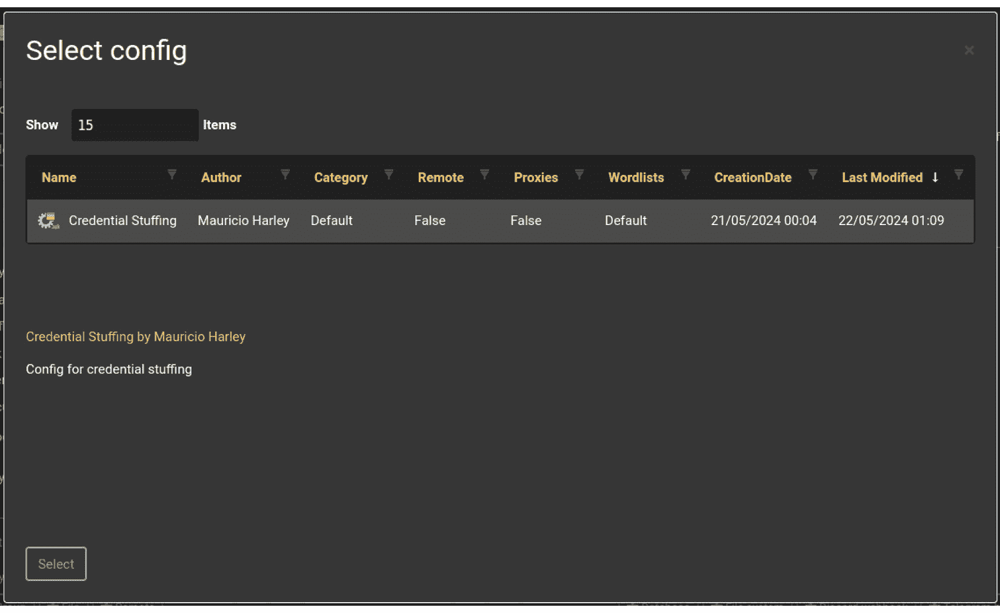

# 第九章：API 滥用与业务逻辑测试

在本章中，我们将完成本书的第四部分。我们刚刚学习了**数据暴露**和**信息泄露**，这两者在当今社会中非常常见。不幸的是，甚至还有更危险的方式来破坏 API 保护控制。滥用正确使用端点的方法就是其中之一。利用 API 逻辑漏洞则是另一个令人恐惧的方式。

**API 滥用**是指超出其预期用途的 API 滥用，导致安全漏洞、数据泄露或服务中断。**业务逻辑测试**涉及识别应用程序业务规则和工作流中的漏洞，确保应用程序在所有场景下都能按预期运行。结合这些测试，有助于保护 API 防止滥用和逻辑缺陷。

本章中，我们将继续讨论高级 API 话题，但我们将学习为什么 API 背后的业务逻辑可能会影响 API 端点被利用的频率和/或深度。我们将首先解析什么是业务逻辑及其可能存在的漏洞。然后，我们将看看滥用场景，模拟可以不正当地探索此类逻辑的环境。最后，使用像在*第八章*中应用的方法，我们将搜索业务逻辑中的漏洞。希望你能喜欢这段旅程。让我们一起开始吧！

在本章中，我们将涵盖以下主要内容：

+   理解业务逻辑漏洞

+   探索 API 滥用场景

+   业务逻辑漏洞测试

# 技术要求

我们将利用与前几章提到的环境相同的环境，例如 Ubuntu 发行版。其他一些相关的新工具将在相应的章节中提到。

在本章中，我们将编写更多的代码，用于模拟和测试一些漏洞，这一次我们将重点关注业务逻辑。

# 理解业务逻辑漏洞

要理解可能源自 API 端点背后业务逻辑及其应用的漏洞类型，我们首先需要理解什么是业务逻辑。简单来说，它就是一系列定义数据如何被软件处理的流程、规则和工作流。为了实现特定的业务目标，软件需要处理与用户的交互、事务和数据处理。换句话说，它是业务特性在代码中的实现。

使用网络商务作为一个常见的场景，应用程序的业务逻辑部分（也可以由 API 和它们的端点表示）处理各种任务，如维护购物车、插入折扣代码、所有物流活动（如计算运费和预计交货时间），最终处理或将支付转移到可信第三方。最终目的是确保应用程序按设计行为，使所有阶段都是确定性的而不是概率性的。这是一个非常重要的记点。

如果现在还不明显，你可以问为什么业务逻辑如此重要。好吧，它做以下工作：

+   **维护完整性和效率**：它保证应用程序运行顺畅，并具有数据完整性。

+   **转换业务规则**：通过遵循某些方法论，将业务政策和规则转化为代码行。这使应用程序能够执行诸如验证用户输入、执行安全措施、管理数据流和遵守法规等任务。想象一下银行应用程序 - 它的业务逻辑将强制执行关于交易限制、账户访问和欺诈检测的规则。

+   **自动化流程**：通过在应用程序内封装这些规则，企业可以自动化复杂任务，减少错误，并确保业务活动的一致执行。

+   **影响可靠性和安全性**：强大的业务逻辑直接影响软件的可靠性、安全性，最终影响用户的满意度。

简单来说，业务逻辑是软件的规则书，确保它运行高效并满足所服务业务的特定需求。

不错！现在我们已经在这个主题上建立了一些基础，我们可以谈谈可能影响它的漏洞。它们通常可以绕过传统的安全措施，如防火墙和**入侵检测系统（IDS）**，对以下原因非常危险：

+   他们的目标是核心业务。

+   它们难以检测和阻止。

有一些方法可以导致业务逻辑中的错误：

+   **工作流篡改**：通过这种方式，我们改变操作的顺序，以克服安全保护或获取未经授权的访问。

+   **验证绕过**：通过这种方式，我们寻找跳过或操纵某些验证的方法。

+   **不一致的错误处理**：在这种情况下，我们识别错误消息中可能泄露敏感数据或 API 行为的模式。

+   **升级权限**：通过利用 API 代码中的某些失败或支持它的系统，我们获得了更高级别的访问权限。

+   **并发问题**：实施并发性的 API 可能会对此产生漏洞，我们可以利用竞争条件或逻辑同步中的失败。

+   **操纵交易**：通过这种方式，我们直接干预逻辑操作，施加不一致性或获得某些好处，通常是财务方面的。

有一些显著的事件值得一提，以说明 API 业务逻辑漏洞如何对公司造成毁灭性的损害。您将在*进一步阅读*部分找到更多关于它们的信息链接。2021 年 4 月，一位独立安全研究人员发现了**Experian**用于评估个人信用价值的 API 的漏洞。该 API 使用最少的身份验证信息，容易被利用。攻击者可以使用轻松获得的公共信息检索敏感个人数据，包括**Fair Isaac Corporation**（**FICO**）分数和信用风险因素。这一事件凸显了弱身份验证和过度数据暴露的风险。

在同一年同一月，来自**Sick Codes**安全公司的安全研究人员揭示了 John Deere 的 API 中的漏洞，这使他们能够无需身份验证访问用户账户和敏感数据。John Deere 是一家全球性公司，生产农业、建筑和林业设备及解决方案。研究人员能够识别 John Deere 的客户，包括一些财富 1000 强企业，并检索与其设备相关联的个人数据。这些 API 中缺乏速率限制和身份验证控制，构成了重大安全风险。

在 2021 年 12 月，黑客利用 X（当时仍称为 Twitter）API 中的漏洞，获取了超过 540 万用户的个人数据。通过向 API 提交电子邮件地址或电话号码，攻击者可以检索相关联的账户。此次泄露暴露了用户名、电话号码和电子邮件地址，严重影响了用户对 X 的信任和信心。

再次在 2021 年 12 月，社交媒体调度平台 FlexBooker 遭遇了 API 泄露，泄露了 370 万用户记录。由于其 AWS 配置中的漏洞导致了敏感用户数据的下载和系统停机。该泄露源于 FlexBooker 在 AWS 上配置访问控制的缺陷，可以视为与 API 安全相关的业务逻辑问题。泄露的用户数据存储在 FlexBooker 的系统内，可能是通过被入侵的 API 访问的。这一事件强调了保护 API 端点和存储系统的重要性。

2022 年 1 月，**德克萨斯州保险部**因软件错误暴露了一个 API 端点（持续了近三年）。该漏洞暴露了包含社会安全号码、地址及其他个人信息的 180 万条记录。问题有两个：一个是脆弱的 Web 应用程序，另一个是暴露的数据。此漏洞存在于应用程序的代码中，表明业务逻辑实现存在问题。在暴露的数据中，包括了姓名、社会安全号码、地址、出生日期和索赔详情。此事件突显了持续监控和正确配置 API 端点以保护敏感数据的重要性。

现在我们已经涵盖了什么是 API 业务逻辑以及 API 漏洞可能导致的问题，让我们学习如何滥用 API。

# 探索 API 滥用场景

API 滥用与以偏离其预期目的或项目/设计的方式意外使用 API 相关。这通常会暴露出安全漏洞，进而可能导致数据泄露和/或服务中断。滥用 API 的一些常见方式包括：

+   **凭证填充**：通过使用被盗的凭证获得 API 访问权限。

+   **数据抓取**：从 API 中提取大量数据，通常违反了服务条款或隐私政策。

+   **端点发现**：通过使用自动化工具发现并利用“隐藏”（遗忘或未文档化）API 端点来实现。

+   **批量赋值**：你向端点发送意外的数据字段，以操控内部对象属性。

+   **参数篡改**：通过修改 API 参数，访问那些默认情况下会被拒绝或限制的数据或功能。

+   **速率限制违规**：通过超过单位时间内允许的最大请求次数来实现，通常会导致 DoS 攻击。

我们已经在理论和实践中涵盖了上述一些方法。现在，让我们深入探讨那些全新的方法。对于每种方法，我们将有一个用 Python 编写的虚拟 API 和你可以遵循的攻击步骤。

## 凭证填充

这是一种通用类型的攻击，犯罪分子利用大量被盗或泄露的凭证数据库，试图通过 API 端点获得对用户帐户的未授权访问。这里的主要目的是利用许多人在日常生活中的行为：在多个系统和网站上重复使用相同的密码。犯罪分子使用自动化工具来帮助加速这些攻击。在短时间内，可以生成数百万次尝试。这与暴力破解攻击不同，暴力破解攻击需要生成随机密码，有时还需要用户名，或者从字典文件中读取它们，甚至使用彩虹表（当目标是哈希值时）。凭证填充使用的是实际的用户名和密码。

这种攻击的危害基于它们能够克服基本安全防护的能力。一旦提供了有效的凭证对，如果保护机制仅依赖于密码的长度和复杂度，就很容易被绕过。它们对于处理敏感数据的应用程序尤其危险，因为即使是小规模的泄露也可能对公司声誉造成严重损害。

在声誉问题上，凭证填充攻击也会带来相当大的经济影响。**Ponemon Institute**的研究（[`ag.ny.gov/publications/business-guide-credential-stuffing-attacks`](https://ag.ny.gov/publications/business-guide-credential-stuffing-attacks)）得出结论，这种类型的攻击平均成本约为 600 万美元，其中包括事件响应、客户通知、合规和监管罚款的费用。还不包括声誉损失。这足以让许多小公司破产。为了减轻此类威胁，需要应用强大的安全措施，例如**多因素认证**（**MFA**）、**用户实体和行为分析**（**UEBA**）以及异常检测（现在通常通过**机器学习**（**ML**）解决方案实现）。

### 创建虚拟目标

凭证填充通常通过自动化工具实现，如**Sentry MBA**、**Snipr**或**OpenBullet**。我们将使用**OpenBullet 2**（[`github.com/openbullet/OpenBullet2`](https://github.com/openbullet/OpenBullet2)），这是初始版本的超集，来实现我们的攻击。为此，以下虚拟 API 将作为目标。该代码可在[`github.com/PacktPublishing/Pentesting-APIs/blob/main/chapters/chapter09/credential_stuffing/api_credential.py`](https://github.com/PacktPublishing/Pentesting-APIs/blob/main/chapters/chapter09/credential_stuffing/api_credential.py)找到：

```
from flask import Flask, request, jsonify
from datetime import datetime, timedelta
from collections import defaultdict
import time
app = Flask(__name__)
users = {
    "user1": "password123",
    "user2": "password456",
}
login_attempts = defaultdict(list)
def is_rate_limited(user):
    now = datetime.now()
    window_start = now - timedelta(minutes=1)
    attempts = [ts for ts in login_attempts[user] if ts > window_start]
    login_attempts[user] = attempts
    return len(attempts) >= 5
@app.route('/login', methods=['POST'])
def login():
    data = request.get_json()
    username = data.get('username')
    password = data.get('password')
    if is_rate_limited(username):
        return jsonify({"message": "Rate limit! Try again later."}), 429
    if users.get(username) == password:
        login_attempts[username].clear()
        return jsonify({"message": "Login successful"}), 200
    else:
        login_attempts[username].append(datetime.now())
        return jsonify({"message": "Invalid credentials"}), 401
if __name__ == '__main__':
    app.run(debug=True)
```

请注意，API 只有一个端点，用于处理登录过程。它还包含一个实现基本速率限制控制的功能。当一分钟内失败的尝试次数大于或等于五次时，请求将被拒绝。这里只有两个虚拟用户。由于我们并未真正窃取任何凭证，我们将创建一个包含其他虚拟用户名和密码的文件，包括 API 中存在的那些。此处的目的是展示该逻辑易受凭证填充攻击的影响。

我们将作为 Docker 容器运行这个 API，因为如你所见，我们的攻击工具也将以这种方式运行。虽然这并非绝对必要，你也可以直接在宿主系统上运行 Python 代码。但为了能从容器中访问其 5000/TCP 端口，你需要稍微调整一下容器的网络配置，因为根据你使用的 Docker 版本，默认情况下可能不允许这种通信。为了确保安全，最好将这两个软件都作为容器运行。如果在启动容器时或在其 `Dockerfile` 中没有指定其他设置，它们将共享同一个 Docker 网络（即 `bridge` 网络）。

```
$ docker network list
NETWORK ID     NAME      DRIVER    SCOPE
d8dd035a66bd   bridge    bridge    local
19ba2bd53bfd   host      host      local
821848b3ff50   none      null      local
```

很棒！那么，为了将这段 Python 代码作为 Docker 容器运行，我们需要一个 `Dockerfile` 文件。以下内容仅为建议，你可以自由选择其他包含 Python 的容器镜像。我推荐选择一个轻量级的镜像，以保持它的体积小。为了方便你，这个 Dockerfile 可以从 [`github.com/PacktPublishing/Pentesting-APIs/blob/main/chapters/chapter09/credential_stuffing/Dockerfile`](https://github.com/PacktPublishing/Pentesting-APIs/blob/main/chapters/chapter09/credential_stuffing/Dockerfile) 下载：

```
FROM python:3.9-slim-buster
WORKDIR /app
COPY ./requirements.txt /app
RUN pip install -r requirements.txt
COPY . .
EXPOSE 5000
ENV FLASK_APP=api_credential.py
CMD ["flask", "run", "--host", "0.0.0.0"]
```

所提到的 `requirements.txt` 文件是一个单行文件，只包含 `Flask`。我不确定你对 Docker 的了解程度，所以在这里简要解释一下。这个 Dockerfile 会暴露 `port 5000`（允许其他容器和宿主机通过该端口连接），安装 Flask，并将当前目录的所有内容（包括 `api_credential.py` Python 文件本身）复制到容器的当前目录（即 `/app`）。然后，它会运行应用程序。要让这个容器工作，输入以下命令：

```
$ docker build -t api .
$ docker run -p 5000:5000 --name credential_api api
```

第一个命令解析 `Dockerfile`，下载指定的镜像，将其标记为 `api`，并根据其余内容完成镜像构建。第二个命令实际上通过将宿主机的 `port 5000` 映射到容器的 `port 5000` 来运行容器，并将其命名为 `credential_api`，同时选择先前构建的 `api` 镜像。现在我们可以继续使用攻击工具了。

### 设置 OpenBullet2

OpenBullet2 有一个适用于 Windows 的原生客户端。由于我们不使用这个操作系统，我们将选择另一种方式：Web 客户端。安装这种方式有不止一种路径。你可以首先安装 Microsoft 的 .NET 运行时环境，下载 OpenBullet2（其中包括 Windows 的 DLL 文件），然后使用 .NET 来运行它。根据你使用的系统，这可能会遇到一些困难。在 Ubuntu 上，我个人更倾向于采用 Docker 方法。你只需要创建一个目录，容器将使用该目录来存储配置和攻击时捕获的数据，然后运行以下命令（此命令在产品文档中有说明）：

```
$ docker run --name openbullet2 --rm -p 8069:5000 \
-v ./UserData/:/app/UserData/ \
-it openbullet/openbullet2:latest
```

在这种情况下，我指定了一个本地的 `UserData` 目录，位于当前目录下，该目录会挂载到容器中作为 `/app/UserData` 卷（`-v` 选项表示卷）。该命令将容器命名为 `openbullet2`（`--name`）并以交互模式运行（`-it`），这种模式适合让你观察日志消息。容器监听 5000 端口，并映射到主机的 8069 端口。容器在关闭后会被移除（`--rm`）。只需在你喜欢的浏览器中打开 `http://localhost:8069`，就能看到该工具的界面（*图 9.1*）。


图 9.1 – OpenBullet2 的初始界面

注意

在使用 OpenBullet2 进行测试时，我浪费了不少时间试图理解为什么我的攻击没有成功。我不确定是否是我使用的版本出现了某些 Bug。事实上，以下内容帮助我解决了这个问题，让这个工具如预期般工作。你可以跳过这一段，继续阅读接下来的部分，但如果在某个阶段你遇到了类似 `UserData` 本地目录的错误，你会发现该工具会创建多个文件和目录。此时唯一重要的文件是 `Environment.ini`。检查它的权限，如果没有写权限，就授予它写权限。编辑该文件，将 `WORDLIST TYPE` 默认块修改为如下所示：

```
[WORDLIST TYPE]
Name=Default
Regex=^.*$
Verify=False
Separator=:
Slices=USERNAME,PASSWORD
```

我们在这里做的，是指示 OpenBullet2 使用冒号（`:`）作为字段分隔符，并将冒号左边部分命名为 `USERNAME`，右边部分命名为 `PASSWORD`。原本不应这样做，但这对我的环境产生了巨大变化。保存文件后，像第一次一样重新启动容器。现在继续阅读。

当你点击旗帜时，会展示其他旗帜和语言。在写这章内容时，共有十二种语言可供选择！点击你首选的语言/旗帜后，会出现许可协议，你只需接受即可。此外，第一次运行应用程序时，需要进行初始设置（*图 9.2*）。


图 9.2 – 初始设置

我们正在设置它以便本地运行。然后，只需点击相应的按钮。你还可以选择将 OpenBullet2 设置为在远程主机上运行。选择该选项后，设置将完成。你将看到仪表板，显示了许多有趣的选项和一般使用统计数据，包括 CPU、内存和网络消耗。不要在*图 9**.2*所示的屏幕上浪费太多时间，因为我们必须专注于攻击。

### 创建配置并进行攻击

我们将通过创建配置来开始攻击。按照以下顺序进行：

1.  点击左侧面板上的**Configs**。

1.  在新屏幕上，点击**New**。

    这将带你进入一个表单，在其中你可以输入一些元数据，如配置的作者、名称，以及存储在文件或 URL 中的图像。这是配置的元数据部分。其他选项包括**Readme**、**Stacker**、**LoliCode**、**设置**和**C# 代码**。值得注意的是，你可以将 C# 代码作为配置的一部分。它将由 OpenBullet2 执行，作为攻击的一部分。启动时，应用程序会记录一条警告信息，通知你不要以管理员或 root 身份运行它，因为二进制代码将被执行，而此类代码可以绕过主机系统的安全控制。*图 9**.3*显示了 OpenBullet2 的仪表板。


图 9.3 – OpenBullet2 仪表板屏幕

下一张图展示了配置的元数据屏幕。


图 9.4 – 配置的元数据部分

1.  只需为配置本身写一个名称和作者名称。将其余部分保留为默认设置。*图 9**.5*显示了启动应用程序时的警告信息。


图 9.5 – 启动警告信息

1.  在继续配置之前，我们需要回顾一下 OpenBullet2 和 API 都是作为容器运行的。这意味着它们已经获得了属于 Docker 桥接网络的 IP 地址。IP 段可能会根据 Docker 引擎版本和你正在运行的系统而变化，因此你需要检查它们被分配的地址。主机通常会选择该块的第一个地址。在我的情况下，像这样：

    ```
    $ ifconfig docker0
    docker0: flags=4163<UP,BROADCAST,RUNNING,MULTICAST>  mtu 1500
    inet 172.17.0.1  netmask 255.255.0.0  broadcast 172.17.255.255
    inet6 fe80::42:a2ff:fe20:673e  prefixlen 64  scopeid 0x20<link>
    ether 02:42:a2:20:67:3e  txqueuelen 0  (Ethernet)
    RX packets 0  bytes 0 (0.0 B)
    RX errors 0  dropped 0  overruns 0  frame 0
    TX packets 36  bytes 4857 (4.8 KB)
    172.17.0.1. Containers will be allocated the subsequent addresses in the order in which they come up. I will presume that the API has 172.17.0.2, as it was the first container to be started. Let’s confirm that:

    ```

    $ docker inspect -f \

    '{{range .NetworkSettings.Networks}}{{.IPAddress}}{{end}}' credential_api

    172.17.0.3）。让我们回到我们的流程。

    ```

    ```

1.  如果你想创建一些文字来描述它的内容，当更多的人使用相同实例时，这会很有用，你可以进入**Readme**部分并在那里写一些说明。现在点击**Stacker**。在这里，我们可以告诉 OpenBullet2 攻击应如何进行。你会看到当前堆栈为空。

1.  点击绿色加号以创建一个新的堆栈配置。这将打开**添加** **块**窗口。

1.  点击 **Requests** | **Http** | **Http Request** (*图 9**.6*)。


图 9.6 – 将 HTTP 请求块插入堆栈配置

你会回到堆栈配置屏幕，在这里你可以编辑请求的所有细节。我们需要更改以下内容：

1.  将 `URL` 设置为 `http://172.17.0.2:5000/login`（记住 API 的端点是 `/login`）。

1.  更改 `POST`。

1.  在 `Content-Type: application/json` 下。

1.  在 **Content** 下，输入你希望作为请求主体发送的内容。它将包含一个简单的 JSON 结构：

    ```
    {"username": "<input.USERNAME>", "password": "<input.PASSWORD>"}
    ```

1.  `<input.USERNAME>` 和 `<input.PASSWORD>` 部分将被我们稍后创建的 `credentials.txt` 文件中的行替换。

在阅读单词列表时（稍后你会看到这个），OpenBullet2 会逐行处理 `credentials.txt` 文件，每次把冒号左边的部分当作 `input.USERNAME`，右边的部分当作 `input.PASSWORD`。动态构建的 JSON 字符串将作为登录信息发送到 API 端点。这将为你提供类似 *图 9**.7* 的内容。


图 9.7 – 配置攻击 HTTP 请求

我们必须分析 API 返回的响应。因此，我们需要添加另一个块。再次点击绿色的加号以添加新块。一开始你可能看不见它。输入 **key** 到搜索栏并点击 **搜索**。选择 **Keycheck** 块 (*图 9**.8*)。


图 9.8 – 添加 Keycheck 控制块

你将返回到堆栈配置屏幕。执行以下操作以完成请求配置：

1.  点击位于 **Keychains:** 字符串下方的另一个绿色加号。

1.  确保 **Result Status** 设置为 **SUCCESS**。

1.  点击 **+String** 按钮，这将打开几个文本框。

1.  在下拉框中选择 **Contains**，并在旁边的文本框中输入 **Login successful**。

1.  重复 *步骤 1* 到 *4*，但做以下更改：

    +   对于 `无效的凭证`。

    你将看到类似 *图 9**.9* 的内容。


图 9.9 – 配置期望的成功和失败响应。

1.  使用 `credentials.txt` 保存配置，并插入以下内容。为方便起见，你可以从 [`github.com/PacktPublishing/Pentesting-APIs/blob/main/chapters/chapter09/credential_stuffing/credentials.txt`](https://github.com/PacktPublishing/Pentesting-APIs/blob/main/chapters/chapter09/credential_stuffing/credentials.txt) 下载此文件：

    ```
    userABC:mypassword
    userDEF:du0CJB8Q
    user1:password123
    simple_user:EN3SZAbR
    user2:password456
    ```

我们将输入实际的凭证，在我们的例子中，它们是硬编码在 API 应用程序中的，以及其他一些无用的值。回到工具的界面，执行以下操作：

1.  点击左侧窗格中的 **Wordlists**。

1.  在这个新页面中，点击**+添加（+Add）**。这将打开一个新窗口。

1.  将**我的字典文件（My Wordlist）**改为**凭证（Credentials）**。

1.  点击`credentials.txt`文件。

1.  点击**上传（Upload）**按钮。

1.  你的字典文件添加界面将显示为*图 9.10*。


图 9.10 – 添加字典文件

1.  你将返回字典文件页面，看到刚刚添加的字典文件，并且显示已解析的行数（五行）。接下来的步骤是创建一个任务，将配置与字典文件结合，实际向 API 发送数据包。点击左侧面板的**任务（Jobs）**。在这个界面中，点击绿色的**+新建（+New）**按钮添加一个任务。点击**多次运行（Multi Run）**按钮。在此阶段，了解你可以利用代理服务器来拆分请求是非常重要的。OpenBullet2 配备了一个空的**默认（Default）**代理组。你可以进入**代理（Proxies）**区域，手动添加代理 URL 或导入它们，可以通过 URL 或文本文件导入。在我们的示例中，我们不会使用代理。

1.  点击**选择配置（Select Config）**按钮。这将打开一个窗口，显示你保存的所有配置。由于我们只保存了刚创建的配置，点击它并点击**选择（Select）**（*图 9.11*）。



图 9.11 – 选择要作为任务一部分的配置

1.  选择文件后，你将返回到更新后的任务定义页面，页面上已更新为选择的配置。点击此界面右侧的**选择字典文件（Select wordlist）**按钮。这将打开另一个窗口，显示你保存的所有字典文件。由于你只添加了一个字典文件，它将是唯一显示的。观察到，一旦选择了要添加到任务中的字典文件，它的内容将在窗口底部显示出来。这对于做最终的视觉检查和确认文件内容是否如预期非常有用。点击绿色的**选择（Select）**按钮（*图 9.12*）。


图 9.12 – 将字典文件添加到任务

1.  我们回到了任务定义页面。稍微向下滚动，直到看到绿色的**创建任务（Create Job）**按钮。点击它。如果你在任务中做错了什么，可以通过点击相应按钮更改任务定义。否则，你可以通过**开始（Start）**按钮启动任务。做吧！由于我们的字典文件很小，并且所有操作都在本地进行，任务将很快完成。所有有效的凭证（**命中（Hits）**）会显示在控制按钮下方。**失败（Fails）**和跳过的行也会有它们的统计信息行（*图 9.13*）。


图 9.13 – 运行攻击任务后的结果；有效的凭证以绿色显示

现在实验已经完成，让我们学习更多其他重要的主题。

### 其他功能和安全建议

OpenBullet2 还有许多其他功能，可以根据你面临的渗透测试场景发挥作用。自初版以来，它经历了改版，现在有了网页客户端选项，当测试系统不是 Windows 时非常方便。顺便提一下，OpenBullet 最初是作为一个 .NET 应用程序设计和构建的。

为了防止凭证填充攻击，API 应该应用多因素认证（MFA）。速率限制提供了另一层保护，因为它能减少自动化工具（如 OpenBullet2）在特定时间范围内进行过多登录尝试的影响。最后，异常检测解决方案，尤其是在如今由**人工智能**（**AI**）和机器学习（ML）提供的丰富功能支持下，值得考虑，因为它们可以同时追踪和分析多种不同类型的证据，例如异常登录模式、来自不同地理位置的多次失败尝试（当使用代理时可能会发生这种情况），以及根据一些阈值通知系统管理员。在下一部分，我们将探讨数据抓取。

## 数据抓取

数据抓取是指通过自动化方式从网站或 API 中提取数据，通常是在没有适当授权的情况下进行的。不过，这并不总是犯罪行为。你可能正在进行研究并需要聚合公开的数据；这种行为是合法的。然而，当目标是私人或敏感数据时，这就成为了一个真正的问题。处理多个系统之间数据交换的 API 可能特别容易受到这种威胁，因为它们可能会以机器可读格式公开结构化数据，这使得自动提取变得更加容易。随着 API 的广泛采用，部分由云服务提供商推动，这种攻击面已经大大增加。

渗透测试人员使用多种工具和技术来实现这一目标。这些工具可以从简单的 Python 代码或**Golang**到更复杂的框架，如 Scrapy，后者将在本节中进行示例。Scrapy 可以一次处理非常大的数据集。另一个值得注意的例子是**Selenium**，它通常用于抓取由客户端 JavaScript 渲染的动态内容。其行为基本相同：这些工具通过模拟人类向 API 端点发送请求。这些工具可以被配置以适应某些端点所呈现的不同特性，例如分页、令牌化、速率限制等。因为它们如此适应性强且像人类一样，这使得这些工具更容易绕过一些安全防护措施。一种常见的规避技术是切换源 IP 地址（可以通过僵尸网络实现）或使用代理服务器。

未经授权的数据抓取可能对公司和组织造成极大的损害。它们可能导致敏感数据的窃取和/或泄露。用户配置文件、私人数据集、财务记录、知识产权信息、健康记录或学术历史等内容都可能成为攻击的目标。除了财务和声誉损失外，企业及其代表可能会因泄露的数据比例和泄露数据的性质而面临法律后果。这可能包括审判甚至监禁。

在接下来的子章节中，您将创建并运行一个虚拟的目标 API，并编写一些攻击代码。

### 提升虚拟目标

为了练习数据抓取，我们将使用以下 GraphQL 虚拟 API 作为目标。为了方便您，可以从[`github.com/PacktPublishing/Pentesting-APIs/blob/main/chapters/chapter09/data_scraping/api_scraping.py`](https://github.com/PacktPublishing/Pentesting-APIs/blob/main/chapters/chapter09/data_scraping/api_scraping.py)下载此代码：

```
from flask import Flask, request, jsonify
from flask_graphql import GraphQLView
import graphene
from flask_jwt_extended import JWTManager, create_access_token, jwt_required
app = Flask(__name__)
app.config['JWT_SECRET_KEY'] = 'Token_Secret_Key'
jwt = JWTManager(app)
class User(graphene.ObjectType):
    id = graphene.ID()
    name = graphene.String()
    email = graphene.String()
class Query(graphene.ObjectType):
    users = graphene.List(User)
    @jwt_required()
    def resolve_users(self, info):
        return [
            User(id=1, name="Alice", email="alice@example.com"),
            User(id=2, name="Bob", email="bob@example.com"),
            User(id=3, name="Charlie", email="charlie@example.com"),
        ]
class Mutation(graphene.ObjectType):
    login = graphene.Field(graphene.String, username=graphene.String(),
            password=graphene.String())
    def resolve_login(self, info, username, password):
        if username == "admin" and password == "password":
            return create_access_token(identity=username)
        return None
schema = graphene.Schema(query=Query, mutation=Mutation)
app.add_url_rule(
    '/graphql',
    view_func=GraphQLView.as_view(
        'graphql',
        schema=schema,
        graphiql=True,
    )
)
if __name__ == '__main__':
    app.run(debug=True)
```

请注意，API 通过一对凭证（`admin`和`password`）建立了基本的身份验证机制。当客户端成功发送它们时，将创建并返回一个 JWT。唯一可用的端点（`/graphql`）仅在客户端提交有效 JWT 时才起作用（由`@jwt_required()`装饰器强制执行）。数据本身是用户数据库。这是我们的目标。

要运行代码，您需要安装几个其他 Python 模块。为了安全起见，只需键入以下内容：

```
$ pip install Flask Flask-GraphQL graphene Flask-JWT-Extended
```

您已准备好运行 API。现在，让我们专注于攻击代码。

### 让攻击生效

首先，您必须使用`pip`安装 Scrapy。然后，使用以下命令创建一个项目并进入其目录：

```
$ scrapy startproject graphqlscraper
$ cd graphqlscraper
```

由于我们需要首先进行身份验证，代码的一部分专门用于执行多个身份验证尝试，直到找到有效的凭据对为止。有一个名为`BruteForcespider`的类。一切都始于`start_requests()`方法。这是由 Scrapy 的爬虫定义指定的（稍后将对其进行解释），它会遍历硬编码的凭据对。每次发送请求时，代码都会调用`parse_login()`方法来分析结果。当结果中出现令牌时，这意味着身份验证成功。因此，代码执行 GraphQL 查询以请求用户数据库。最后，调用`parse_users()`方法以打印收集到的数据。可以在[`github.com/PacktPublishing/Pentesting-APIs/blob/main/chapters/chapter09/data_scraping/bruteforce_spider.py`](https://github.com/PacktPublishing/Pentesting-APIs/blob/main/chapters/chapter09/data_scraping/bruteforce_spider.py)找到`bruteforce_spider.py`代码。

在我们运行代码之前，我们必须创建一个 Scrapy 项目。以下是完成这一任务的步骤：

```
$ scrapy startproject graphqlscraper
```

创建时，`graphqlscraper`项目由一个目录表示，其中还插入了几个其他文件：

```
$ ls -lRhap
.:
total 16K
drwxrwxr-x 3 mauricio mauricio 4.0K May 22 22:22 ./
drwxrwxr-x 3 mauricio mauricio 4.0K May 22 22:29 ../
drwxrwxr-x 4 mauricio mauricio 4.0K May 22 22:24 graphqlscraper/
-rw-rw-r-- 1 mauricio mauricio  271 May 22 22:22 scrapy.cfg
./graphqlscraper:
total 32K
drwxrwxr-x 4 mauricio mauricio 4.0K May 22 22:24 ./
drwxrwxr-x 3 mauricio mauricio 4.0K May 22 22:22 ../
-rw-rw-r-- 1 mauricio mauricio    0 May 22 22:19 __init__.py
-rw-rw-r-- 1 mauricio mauricio  270 May 22 22:22 items.py
-rw-rw-r-- 1 mauricio mauricio 3.6K May 22 22:22 middlewares.py
-rw-rw-r-- 1 mauricio mauricio  368 May 22 22:22 pipelines.py
-rw-rw-r-- 1 mauricio mauricio 3.3K May 22 22:22 settings.py
drwxrwxr-x 3 mauricio mauricio 4.0K May 22 22:35 spiders/
./graphqlscraper/spiders:
total 28K
drwxrwxr-x 3 mauricio mauricio 4.0K May 22 22:35 ./
drwxrwxr-x 4 mauricio mauricio 4.0K May 22 22:24 ../
-rw-rw-r-- 1 mauricio mauricio 2.1K May 22 22:35 bruteforce_spider.py
-rw-rw-r-- 1 mauricio mauricio  161 May 22 22:19 __init__.py
```

代码位于 `spiders` 子目录中。要运行它，请键入以下命令：

```
$ scrapy crawl bruteforce_spider -o users.json
```

这指示 Scrapy 启动一个爬虫，其类可以在 `bruteforce_spider.py` 文件中找到。输出被发送到 `users.json`。几秒钟后，你应该会收到 Scrapy 的详细输出：

```
$ scrapy crawl bruteforce_spider -o users.json
2024-05-22 22:36:05 [scrapy.utils.log] INFO: Scrapy 2.11.2 started (bot: graphqlscraper)
2024-05-22 22:36:05 [scrapy.utils.log] INFO: Versions: lxml 5.2.2.0, libxml2 2.12.6, cssselect 1.2.0, parsel 1.9.1, w3lib 2.1.2, Twisted 24.3.0, Python 3.10.12 (main, Nov 20 2023, 15:14:05) [GCC 11.4.0], pyOpenSSL 24.1.0 (OpenSSL 3.2.1 30 Jan 2024), cryptography 42.0.7, Platform Linux-5.15.0-107-generic-aarch64-with-glibc2.35
2024-05-22 22:36:05 [asyncio] DEBUG: Using selector: EpollSelector
2024-05-22 22:36:05 [scrapy.utils.log] DEBUG: Using reactor: twisted.internet.asyncioreactor.AsyncioSelectorReactor
…Output omitted for brevity…
2024-05-22 22:36:05 [scrapy.utils.log] DEBUG: Using asyncio event loop:
{'ID': '1', 'Name': 'Alice', 'Email': 'alice@example.com'}
2024-05-22 22:36:05 [scrapy.core.scraper] DEBUG: Scraped from <200 http://127.0.0.1:5000/graphql>
{'ID': '2', 'Name': 'Bob', 'Email': 'bob@example.com'}
2024-05-22 22:36:05 [scrapy.core.scraper] DEBUG: Scraped from <200 http://127.0.0.1:5000/graphql>
{'ID': '3', 'Name': 'Charlie', 'Email': 'charlie@example.com'}
2024-05-22 22:36:05 [scrapy.core.engine] INFO: Closing spider (finished)
2024-05-22 22:36:05 [scrapy.extensions.feedexport] INFO: Stored json feed (3 items) in: users.json
2024-05-22 22:36:05 [scrapy.statscollectors] INFO: Dumping Scrapy stats:
INFO: Stored json feed (3 items) in: users.json. Now check this file:

```

$ more graphqlscraper/spiders/users.json

[

{"ID": "1", "Name": "Alice", "Email": "alice@example.com"},

{"ID": "2", "Name": "Bob", "Email": "bob@example.com"},

{"ID": "3", "Name": "Charlie", "Email": "charlie@example.com"}

]

```

			That’s it. Mission accomplished. Scrapy is a very powerful framework with lots of new features. You should definitely invest some time into looking at its documentation. I shared the official website in the *Further reading* section. Next, we will learn what **parameter tampering** is about.
			Parameter tampering
			This technique consists of deliberately manipulating the parameters exchanged between the client and server with the intent to alter the application’s behavior. The final objective could be to gain unauthorized data access, escalate privileges, or cause damage to data (such as temporary or permanent corruption). The core of the attack lies in exploiting the trust the API endpoint has in the parameters provided as part of the requests. A dangerous approach is putting too much trust on the client-side security controls. When running as JavaScript code or hidden form fields, for example, our API endpoints will likely be vulnerable to this threat.
			Any acceptable parameter, such as query parameters (including GraphQL), form fields, cookies, headers, and JSON structures, can be used to perpetrate this type of attack. A simple scenario could involve changing the user ID on a request header trying to access another user’s data or changing an exam grade on a school’s student system. Without proper validation, any supplied parameter, including the ones that are incorrectly formatted, could be an attack vector toward the API endpoint. APIs that are vulnerable to business logic attacks are also particularly vulnerable to this type of threat.
			This sort of pentesting usually involves a few steps. You need to do some reconnaissance in the sense of identifying which methods, verbs, and parameters are accepted by the API endpoints (supposing that they are not explicitly documented). Tools such as **Burp Suite**, **OWASP ZAP**, and **Postman** will be some of your best friends. You can still achieve reasonable results with Python code or some shell scripting. This comparison is not strictly appropriate, but we can establish a quick analogy with the work we’ve done tampering JWTs in *Chapter 4*, *Authentication and Authorization Testing*. We analyzed which types of tokens were being handled by the API target and changed them in an attempt to deceive the backend.
			In 2021, Microsoft released several vulnerabilities affecting its mail product (Exchange). They were consolidated under the **CVE-2021-26855**. They consisted of implementing **Server-Side Request Forgery** (**SSRF**) attacks by tampering with some parameters before sending them to the HTTP/HTTPS listening endpoints. The vulnerability led to **Remote Code Execution** (**RCE**) on the affected Exchange servers.
			Yet in 2021, **Ghost CMS**, an open source publishing platform, was affected by a parameter tampering vulnerability. Identified as **CVE 2021-201315**, this vulnerability allowed **crackers** to change some query parameters, which resulted in authentication and authorization bypassing. In the end, criminals were able to access the admin interface, which created possibilities for inserting any type of malicious code.
			We will use the `api_tampering.py` file as the target. As usual, you need to install Flask. The code can be found at [`github.com/PacktPublishing/Pentesting-APIs/blob/main/chapters/chapter09/parameter_tampering/api_tampering.py`](https://github.com/PacktPublishing/Pentesting-APIs/blob/main/chapters/chapter09/parameter_tampering/api_tampering.py):

				1.  Put the API to run. As usual, it’s listening on port 5000\. We’ll carry out three different attacks. First, let’s try to escalate privileges by changing a user role. The `/user` endpoint gives us user data:

    ```

    $ curl http://localhost:5000/api/user/1

    {

    "id": 1,

    "name": "Alice",

    "email": "alice@example.com",

    "role": "user"

    admin_secret) 密码提供特殊访问权限，我们可以通过 Python 发出一个请求来操作角色参数，将 *Alice* 设置为管理员（此代码可以从 https://github.com/PacktPublishing/Pentesting-APIs/blob/main/chapters/chapter09/parameter_tampering/manipulate_role.py 下载）：

    ```
    import requests
    data = {
        'user_id': '1',
        'role': 'admin',
        'auth': 'admin_secret'
    }
    response = requests.post('http://localhost:5000/api/admin/change_role', data=data)
    print(response.json())
    ```

    ```

    				2.  This results in the following:

    ```

    {

    "message": "用户角色已更新"

    }

    ```

    				3.  Confirm that the tampering actually worked:

    ```

    $ curl http://localhost:5000/api/user/1

    {

    "id": 1,

    "name": "Alice",

    "email": "alice@example.com",

    "role": "admin"

    /transaction 一笔交易涉及金融信息。为了检索一些数据，我们需要提供交易 ID。我们可以推测数值顺序（比如 1？）：

    ```
    $ curl http://localhost:5000/api/transaction/1
    {
      "id": 1,
      "user_id": 1,
      "amount": 100,
      "status": "pending"
    pending. Let’s cause data corruption by forcing the transaction to complete and by leveraging the *top secret* password with another simple Python code (this code can be downloaded from https://github.com/PacktPublishing/Pentesting-APIs/blob/main/chapters/chapter09/parameter_tampering/manipulate_transaction_status.py):

    ```

    import requests

    data = {

    'transaction_id': '1',

    'status': 'completed',

    'auth': 'admin_secret'

    }

    response = requests.post(

    'http://localhost:5000/api/admin/update_status', data=data

    )

    print(response.json())

    ```

    Guess what, the transaction is now finished.

    ```

    {

    "message": "交易状态已更新"

    }

    ```

    ```

    ```

    				4.  Let’s double-check it:

    ```

    $ curl http://localhost:5000/api/transaction/1

    {

    "id": 1,

    "user_id": 1,

    "amount": 100,

    "status": "completed"

    /admin/update_status 端点未提供相应的密码：

    ```
    $ curl http://localhost:5000/api/admin/update_status
    {
      "error": "Unauthorized"
    }
    ```

    ```

    				5.  OK, that was expected. However, should we obtain such a password in some way, such as through social engineering, resource exhaustion, or data leaks, we could easily retrieve and manipulate data without proper authorization (this code can be downloaded from [`github.com/PacktPublishing/Pentesting-APIs/blob/main/chapters/chapter09/parameter_tampering/manipulate_authorization.py`](https://github.com/PacktPublishing/Pentesting-APIs/blob/main/chapters/chapter09/parameter_tampering/manipulate_authorization.py)):

    ```

    import requests

    data = {

    'auth': 'admin_secret'

    }

    response = requests.post(

    'http://localhost:5000/api/admin/update_status', data=data

    )

    print(response.json())

    ```

    				6.  This would give us the confirmation of unauthorized access:

    ```

    {

    "super_secret": "这是机密数据！"

    }

    ```

			Results with parameter tampering attacks can be as easy to achieve as the implementation of the API that’s the target. You might need to combine techniques depending on the scenario, but it’s not difficult to detect whether the API is vulnerable to this category of threat. For the people responsible for watching and protecting the environment, it can be difficult to detect when such type of attack is running, as it may be confused with a user trying to communicate with the API but messing up with some parameters because of a lack of knowledge about the documentation. In the next section, we are going to cover how we can test for business logic vulnerabilities.
			Testing for business logic vulnerabilities
			Unraveling vulnerabilities within an API’s business logic is a challenging but crucial aspect of security evaluations. Contrary to what we do with common flaws derived from coding errors or infrastructure misconfigurations, these types of vulnerabilities target the API’s designed and intended functionalities. To identify these chinks in the armor, security testers must possess a comprehensive understanding of the application’s business processes and how they might be contorted. This in-depth examination involves meticulously analyzing the application’s workflows, user permissions, and data flow to unearth potential weaknesses.
			Discovering business logic vulnerabilities within APIs is not straightforward since they can easily bypass traditional security watchdogs. Automated tools might miss these hidden weaknesses since they don’t necessarily involve strange inputs or well-known exploit patterns.  Instead, these vulnerabilities stem from how the application handles legitimate operations. For example, an attacker could leverage the way an API manages transactions, user permissions, or data processing tasks to their advantage. Uncovering these flaws demands a sophisticated grasp of the application’s internal logic and a sharp eye for potential misuses that could be manipulated for malicious purposes.
			Unveiling business logic vulnerabilities hinges on manual testing. Security specialists need to delve into the application’s functionalities by hand, brainstorming how various features intertwine and how they might be misused for malicious ends. This hands-on approach often involves crafting intricate test scenarios that explore diverse situations.  Testers might try running actions in an unorthodox order or feeding the application with unexpected data values.  By carefully sifting through the application’s workflows, testers can pinpoint subtle cracks in the system’s logic that could be exploited to execute unauthorized actions or access sensitive data.
			In 2022, a business logic vulnerability in PayPal’s API, tied to how it interprets transaction details, allowed attackers to tamper with money transfers. The vulnerability stemmed from flaws in how the system verified transaction parameters. By exploiting these gaps, attackers could manipulate the amounts being sent, resulting in financial losses. This incident highlighted the vital importance of fortifying all transaction-related checks within the system to safeguard the integrity of financial operations. You will find a detailed explanation at [`phoenixnap.com/blog/paypal-hacked`](https://phoenixnap.com/blog/paypal-hacked).
			You don’t need to apply graphical tools. Code written in Python or even in Bash with the help of curl may successfully exploit business logic vulnerabilities in badly written APIs. However, should you choose the graphical path, some already-known friends such as Burp Suite and Postman are handy. Spotlighting weaknesses within an application’s business logic requires a multi-pronged approach.  One powerful technique involves a deep dive into the application’s source code, if available. This grants testers a clear picture of how various components interact, potentially revealing flaws in the application’s decision-making processes. Automated code analysis tools can accelerate this process by highlighting areas where the business logic might be implemented incorrectly, or where security controls are lacking. However, these code audits shouldn’t be the sole focus. Real-world testing (dynamic testing) is crucial to understanding how the application behaves in a live environment and how different inputs affect its internal state. Combining these methods provides a more holistic view of potential vulnerabilities.
			For our exercises in this section, we’ll apply the `api_business_logic.py` file. It can be found at [`github.com/PacktPublishing/Pentesting-APIs/blob/main/chapters/chapter09/business_logic/api_business_logic.py`](https://github.com/PacktPublishing/Pentesting-APIs/blob/main/chapters/chapter09/business_logic/api_business_logic.py).
			We can list at least three weaknesses:

				*   Right in the beginning, we have a `users` variable raises this vulnerability. Instead of specifying this in the code, we should leverage environment variables or retrieve it from an external database service, either SQL or NoSQL.
				*   Incorrect input validation is present in the `/admin` endpoint. Rather than relying on what the user provides as input, the code should leverage the language’s features, such as safe functions or methods to retrieve data.
				*   Finally, *passwords should never be stored in clear text*. Before storing them, passwords should always be stored as hashes, and safe functions or modules should be used to apply the hashes.

			There are some useful utilities that you can make use of to help you spot code flaws:

				*   **Bandit**: Python security analysis tool ([`pypi.org/project/bandit/`](https://pypi.org/project/bandit/)).
				*   **Safety**: Dependency vulnerability detection utility ([`pypi.org/project/safety/`](https://pypi.org/project/safety/)).
				*   **Semgrep**: Flexible code analysis tool ([`pypi.org/project/semgrep/`](https://pypi.org/project/semgrep/)).

			Note
			Safety is backed by a company nowadays ([`safetycli.com/`](https://safetycli.com/)). Although claiming to be free software, to effectively run, it needs you to create an account with this company, which involves agreeing to their service terms and sharing an email address. The first time you run the utility, you’ll receive a message like the following:

```

$ safety scan --target .

请登录或注册 Safety CLI（永久免费）以扫描并保护你的项目

(R)egister 免费帐户或 (L)ogin 登录现有帐户继续（R/L）：R

正在将你的浏览器重定向到注册页面以获取免费帐户。注册后，返回此处开始使用 Safety。

如果浏览器在 5 秒内没有自动打开，请将此 URL 复制并粘贴到浏览器中：

<<<这里是动态 URL。>>>

[=   ] 等待浏览器认证 update.go:85: 无法根据更改挂载命名空间更改挂载（/var/lib/snapd/hostfs/usr/local/share/doc /usr/local/share/doc none bind,ro 0 0）：无法打开目录 "/usr/local/share"：权限被拒绝

[  ==] 等待浏览器认证 Gtk-Message: 22:45:48.735: 未加载模块 "atk-bridge"：该功能由 GTK 原生提供。请尝试不要加载它。

成功注册 address@domain.com

```

			After the registration is complete, the next time you use the software, you’ll need to log in, and then all will be good. The utility downloads the requested (or default) rules from the internet before each run.
			Let’s start the attacks against the API. The steps are provided in the following sequence:

				1.  The first thing we’ll do is to register a new user. This code does not check any authorization in this step. We’ll use Burp Suite for these exercises. Hence, run Burp Suite and click on the **Proxy** tab. Make sure that this service is on and that **Intercept** is *active*. We’ll need it to be active to change the request type and add more parameters. Finally, click on the **Open** **browser** button.
				2.  With Burp’s browser opened (usually, a Chromium instance), access `http://localhost:5000/register`. Immediately go back to Burp and click on the `POST` instead of `GET`. Then, we need to specify the `Content-Type` to be `application/json`, as expected. Then, we must add the JSON structure for a new user. You can put anything here since it’s a valid JSON element with `username` and `password` as keys (*Figure 9**.14*).

			

			Figure 9.14 – Changing a GET request to POST on Burp’s Intercept

				1.  Now click on the **Forward** button. This will send the crafted request to the API and the user will be registered. Back in the browser window, you’ll receive a message stating that the operation was successful (*Figure 9**.15*).

			

			Figure 9.15 – A successful user registration attack

				1.  Moving on, let’s explore the `/order` endpoint. By analyzing the code, we can find out that it expects to receive a username (this just needs to be a valid one), a product ID (we can infer `1` as being valid), a quantity, and a discount code. We’ll send an arbitrary discount code by crafting a combination of possible values trying to cause the logic to fail. Go back to Burp’s browser and send a request to `/order`, then get back to Burp’s **Intercept**. Again, adapt the request accordingly, making equivalent changes to the ones you made before. This time though, the JSON structure will be more sophisticated since we need to send more keys (*Figure 9**.16*).

			

			Figure 9.16 – Sending a crafted POST request to /order

				1.  Again, click on the **Forward** button and go back to the browser. You’ll realize that the order was successfully submitted. However, the discount code was not applied, demonstrating that this logic doesn’t seem vulnerable to our attempts (*Figure 9**.17*).

			

			Figure 9.17 – Submitting an order using the previously created user

				1.  Our final exercise will lie in the `/admin` endpoint. Since absolutely no other security control besides the credential pair checking is in place, we’ll add a 100% discount code using the hardcoded credentials (they could have been stolen by a parallel method, such as social engineering or invalid exception handling). Go to the browser one more time and submit a dummy request to `/admin`, then get back to Burp’s **Intercept** and change it to the following (*Figure 9**.18*).

			

			Figure 9.18 – Adding an arbitrary discount code using a stolen admin credential
			As expected, the discount code was correctly added to the application (*Figure 9**.19*).
			

			Figure 9.19 – The discount code is applied

				1.  Now, if we repeat the request to `/order` expressed in *Figure 9**.16* but change the `discount_code` to `CRAFTED_CODE` and reduce the quantity to `1` (to avoid receiving the **Insufficient stock** message), we’ll be successful (*Figure 9**.20*).

			

			Figure 9.20 – The order is successfully submitted with a crafted discount code
			In this section, you’ll realize how reasonably small and easy code can cause substantial damage to real API targets. Your toolbelt doesn’t have to be expensive or complex to help achieve success with your pentesting activities. Just a few open source utilities can be quite handy.
			Summary
			This chapter finished the fourth part of our book, covering important aspects of API business logic and abuse scenarios. We learned how damaging the lack of source code analysis and API business logic testing can be for APIs. Some notable incidents involving threats of this nature were also mentioned.
			While some security teams are only worried about the traditional or more common threats and security measures, criminals may be trying to leverage other non-obvious attack scenarios, such as the ones we mentioned in the chapter, making use of techniques that exploit flaws in APIs’ business logic. We learned this in this chapter. It’s definitely a topic you should add to your toolbelt when conducting a professional pentest.
			In the next chapter, the final one of this book, we’ll discuss secure API coding practices. These are more geared toward developers, but every pentester should know about them as well.
			Further reading

				*   Experian’s API vulnerability: [`salt.security/blog/what-happened-in-the-experian-api-leak`](https://salt.security/blog/what-happened-in-the-experian-api-leak)
				*   John Deere’s API Leak: [`sick.codes/leaky-john-deere-apis-serious-food-supply-chain-vulnerabilities-discovered-by-sick-codes-kevin-kenney-willie-cade/`](https://sick.codes/leaky-john-deere-apis-serious-food-supply-chain-vulnerabilities-discovered-by-sick-codes-kevin-kenney-willie-cade/)
				*   The Twitter/X API breach that damaged 5.4 million users: [`www.bbc.com/news/technology-64153381`](https://www.bbc.com/news/technology-64153381)
				*   Flexbooker’s cloud API vulnerability that exposed the data of 3.7 million users: [`www.imperva.com/blog/five-takeaways-from-flexbookers-data-breach/`](https://www.imperva.com/blog/five-takeaways-from-flexbookers-data-breach/ )
				*   The Texas Department of Insurance’s API incident, exposed for nearly 3 years, which compromised 1.8 million records: [`www.texastribune.org/2022/05/16/texas-insurance-data-breach/`](https://www.texastribune.org/2022/05/16/texas-insurance-data-breach/)
				*   OpenBullet2, a web testing tool: [`github.com/openbullet/OpenBullet2`](https://github.com/openbullet/OpenBullet2 )
				*   Scrapy, a data extraction framework: [`scrapy.org/`](https://scrapy.org/)
				*   Microsoft Exchange Parameter Tampering CVE: [`cve.mitre.org/cgi-bin/cvename.cgi?name=CVE-2021-26855`](https://cve.mitre.org/cgi-bin/cvename.cgi?name=CVE-2021-26855)
				*   Microsoft Official Blog Post: [`www.microsoft.com/en-us/security/blog/2021/03/02/hafnium-targeting-exchange-servers/`](https://www.microsoft.com/en-us/security/blog/2021/03/02/hafnium-targeting-exchange-servers/)
				*   CVE 2021-201315: [`nvd.nist.gov/vuln/detail/CVE-2021-21315`](https://nvd.nist.gov/vuln/detail/CVE-2021-21315)

```

# 第五部分：API 安全最佳实践

这是本书的最后一部分。你已经学习了如何在不同的场景中发现、获取信息并攻击 APIs。在前面的章节中，我们向你展示了具有漏洞的代码，包含可被利用的点，涉及 RESTful 和 GraphQL APIs。在这一部分，你将理解到，API 安全问题的一部分原因来源于糟糕的编码实践。了解最佳实践对于以更恰当的方式保护 API 至关重要。当渗透测试人员更加熟悉 API 代码是如何编写的，以及哪些部分被开发人员忽略或遗忘时，这无疑会在入侵过程中提供帮助。

本节包含以下章节：

+   *第十章*，*API 的安全编码实践*
