# 第一章：使用虚拟化

本书的第一章涉及**虚拟化**的相关性以及熟悉不同版本的重要性，包括 VirtualBox、Hyper-V、KVM、VMware 等。然而，在本书中，我们将专注于 VMware，特别是 ESXi Hypervisor，因为它是免费的，并且在生产环境中能看到的东西的一个缩小版本。我们将启动 Hypervisor 来创建我们自己的实验室，在其中安装一些**虚拟机**（**VM**），并尝试模仿虚拟**监控与数据采集**（**SCADA**）环境。

在本章中，我们将涵盖以下主要内容：

+   理解虚拟化是什么

+   探索 VMware 是什么

+   打开所有内容

+   路由和规则

# 技术要求

对于本章，您将需要以下内容：

+   支持虚拟化和双接口的计算机

+   VMWare ESXi

+   VMWare Fusion

+   Ubuntu 镜像

+   Windows 7 镜像

+   Kali Linux 镜像

以下是您可以导航到下载软件的链接：

+   macOS Fusion：[`www.vmware.com/products/fusion/fusion-evaluation.html`](https://www.vmware.com/products/fusion/fusion-evaluation.html)

+   Windows：[`www.vmware.com/products/workstation-pro/workstation-pro-evaluation.html`](https://www.vmware.com/products/workstation-pro/workstation-pro-evaluation.html)

+   ESXi：[`my.vmware.com/en/web/vmware/evalcenter?p=free-esxi7`](https://my.vmware.com/en/web/vmware/evalcenter?p=free-esxi7)

+   Kali Linux：[`www.kali.org/downloads/`](https://www.kali.org/downloads/)

# 理解虚拟化是什么

虚拟化，通俗来讲，是通过纯软件的方式模拟任意硬件和软件组合的方法。这使得任何人都可以运行和测试无数个主机，而无需承担硬件要求的财务负担和成本。如果您有发行版承诺问题，这将特别有用。

我无法强调理解虚拟化内部工作原理的重要性有多大。这项技术已经成为所有开发和测试都进行和构建的基础。我参与的每个项目都有其基础设施的大部分在某种虚拟化平台上运行。了解虚拟化如何运作的具体知识对于任何项目至关重要，您可以在您的*受害者*组织或技术上执行侦察，并在您的**虚拟实验室**内重现它。

通过进行一些简单的**开源情报**（**OSINT**）工作，你可以轻松发现一个组织正在使用的网络设备，包括他们的防火墙技术、终端保护以及公司安装的**操作技术入侵检测系统**（**OT IDS**）。有了这些信息，你可以访问你新发现的情报的官方网站，下载该软件的**虚拟机**实例，并将其与新搭建的本地虚拟环境一起运行。从这里，你可以规划每一个攻击角度，设计多种妥协场景，确定如何以及在哪里进入网络的低层段，构建利用已知漏洞的有效载荷，并最终获得*王国的钥匙*。这个技巧将在后续章节中进一步讨论，但要知道，它是构建攻击路径、渗透组织基础设施的关键。

虚拟化的一个最重要特性是使用快照。如果在任何时候，你“弄坏”了一台设备，你可以将其恢复到之前的状态，从头开始，记录下失败的尝试，并最终避免在实际操作中遇到同样的问题。这样，你可以尝试各种攻击方式，而不必太担心结果，因为你知道可以恢复到一个稳定的副本。我在职业生涯中接触过许多虚拟化厂商/产品，包括*VMware*、*VirtualBox*、*Hyper-V*、*Citrix* 和 *KVM*。每个都有其优缺点。我默认使用 VMware，并将在本书中继续使用他们的各种产品。

无论如何，这绝不是对 VMware 的任何销售推广；只需要知道，VMware 更容易使用，因为其在整个产品生态系统中的集成几乎是无缝的，几乎让人感到恼火，因此它已经成为组织在其环境中采纳的中介。

理解虚拟化在**渗透测试**中的重要作用，将有助于你加强新兴的职业生涯。练习在每个平台上启动基本的虚拟机，将帮助你理解每个平台的细节，并学习虚拟硬件依赖关系的复杂性。作为奖励，通过熟悉每个虚拟化平台，你将能够找出你更喜欢哪款软件，并深入挖掘其细节。说到这里，我将使用 VMware 来构建实验室。

# 发现 VMware 是什么

VMware 成立于 1998 年，并于 1999 年推出了他们的首个产品，*VMware workstation*。公司成立三年后，他们将 `GSX` 和 `ESX` 推向了服务器市场。`Elastic Sky X`（**ESX**）一直保留该名称，直到 2010 年。之后，VMware 投入时间和资金对操作系统进行升级并现代化用户界面，增加了 "i" 字母，产品也因此被称为 **ESX 集成**（**ESXi**）。如果你正在阅读这篇文章，我想我可以合理地假设你已经浏览过几本相关书籍，因为大多数书籍都涉及 **桌面虚拟化管理程序**，如 *Player*、*Workstation* 和/或 *Fusion*。接下来，我想更进一步，带你进行一些实际操作和 ESXi 的实践体验。

好吧，也许这有点像营销宣传，但我可以诚实地说，我从未为 VMware 工作，也没有因宣传他们的技术而获得任何版税。然而，我觉得如果不带你亲身体验一下这项技术，我会对你不公平，因为你在实际工作中一定会遇到它。我个人在石油和天然气、能源、化工、制药、消费品生产、离散制造和主题公园等领域遇到过 VMware，仅举几个例子。

一个典型的生产解决方案包括以下内容：

+   **分布式资源调度器**（**DRS**）

+   **高可用性**（**HA**）

+   整合备份

+   VCenter

+   虚拟机

+   ESXi 服务器

+   **虚拟机文件系统**（**VMFS**）

+   **虚拟对称多处理**（**SMP**）

若想更好地了解这些特定组件，请参考以下网页：[`www.vmware.com/pdf/vi_architecture_wp.pdf`](https://www.vmware.com/pdf/vi_architecture_wp.pdf)。

我不打算深入探讨 VMware；相反，我只是想让你了解一些在参与工作时会遇到的技术组成部分。然而，我确实想强调核心技术栈，包括 vCenter、ESXi 服务器和虚拟机（VM）。这些几乎是大规模组织中所有虚拟化实施的基础。vCenter 控制着 ESXi 服务器，而 ESXi 服务器是虚拟机存在的地方。了解这一点将帮助你理解**权限提升**的路径，一旦你在公司运营层的虚拟机上站稳脚跟。多年来，我与安全人员进行了许多关于**职责分离**（**SoD**）的讨论，负责应用程序的团队也乐意向我解释他们为遵守**保密性**、**完整性**和**可用性**（**CIA**）所付出的巨大努力和艰难历程。在与这些团队进行桌面演练时，问他们“*谁控制着你们应用所在的 ESXi 服务器？*”然后接着问，“*如果你们的 vCenter 被攻破，你们的暴露面有多大？*”，你会发现，大多数情况下，他们的回答会让你震惊，甚至让你感到不寒而栗。我挑战你去问问你的 IT/OT 团队——或者任何管理你虚拟基础设施的人——每台服务器上运行了多少虚拟机。然后继续问，*“你们上一次进行**灾难恢复**（**DR**）故障转移测试是什么时候？”* 知道关键控制是否运行在一个资源紧张的超负荷服务器上，从风险缓解的角度来看是非常有用的，但本书的目的是利用系统中一个被忽视的组件的弱点。

下图展示了我们之前提到的不同组件之间的关系，以及它们如何相互集成：

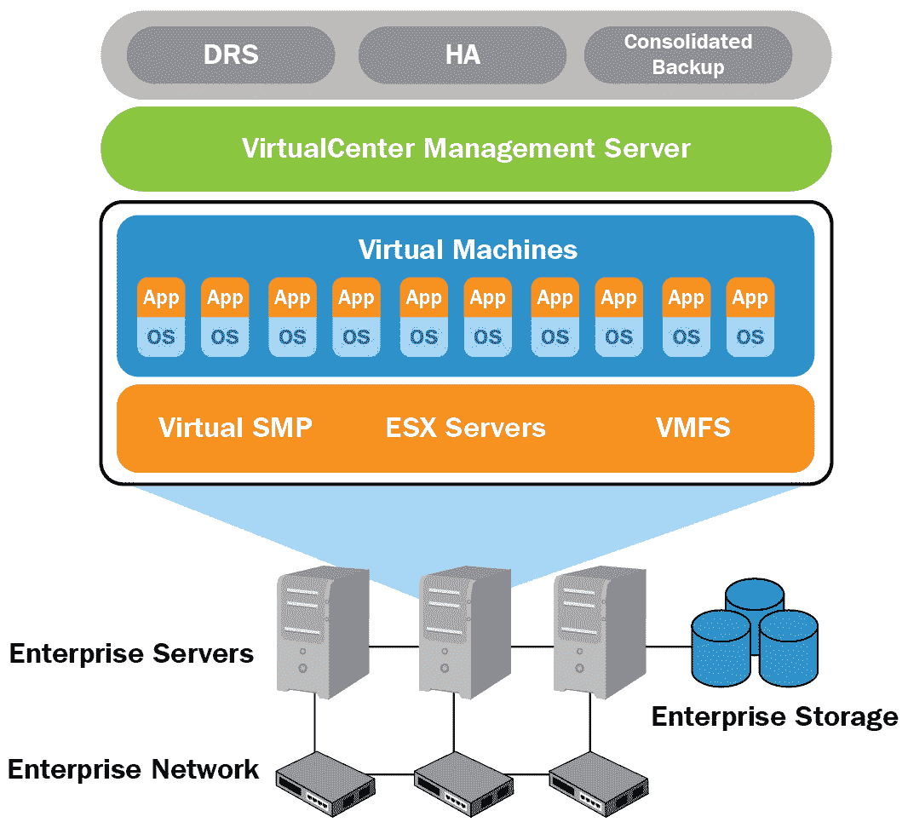

图 1.1 – VMware 基础架构

我曾为一家**蒸汽辅助重力排水**（**SAGD**）重油公司工作，他们的部分声明内容是将*Rockwell PlantPAX DCS*虚拟化。这一切都建立在*ESXi 集群*之上，运行在一个强大的*vSphere*平台上。理解 VMware 的最大收获是，在企业级别，vSphere 是**平台**，而 ESXi 是**虚拟机监控程序**。在本书中，我将展示`VMware Fusion`的截图，它是 macOS 专用的桌面平台，还有 ESXi 的截图。如果你使用 Windows，有两个选择——`VMPlayer` 或 `VMWorkstation`。我将重点介绍 ESXi，因为我认为理解这项技术是进行工业渗透测试的关键任务。

在本节中，我们介绍了 VMware 的基本概念，讲解了构建虚拟化栈的核心组件，并分享了一些你在实际环境中可能遇到的实例。接下来，我们将直接进入正题，*启动所有服务*。我们将从 VMware Fusion、VMware ESXi 和虚拟机的安装过程开始，为后续章节中的测试创建一个虚拟的 **监控控制与数据采集**（**SCADA**）环境。

# 启动所有服务

既然我们已经简要了解了虚拟化是什么，下一步是通过安装 VMware Fusion、VMware ESXi 服务器和四个虚拟机来构建实验室的核心，以模拟 SCADA 环境。这更像是一个话题的引入或是我想全盘托出的声明，如果前两个部分让你觉得困难，那么接下来只会更难，并且有许多写得很好的资源可以参考或在深入探讨这个主题之前阅读。

话虽如此，让我们开始搭建实验室的虚拟部分。我不想当一个“数字土豪”，也不想在处理器、RAM、存储和其他琐事上浪费时间。不过，谈论硬件是不可避免的——换句话说，我们拥有的核心数和内存越多，就越好。我发现即使在配备 8 GB RAM 的*Mac*上运行`Fusion`也是可行的，但它非常受限，如果你打开 Google Chrome 进行任何研究，那就得准备好接受系统崩溃的现实，开始**分页**（请参阅下面的提示，了解这是什么意思）。

重要提示

当计算机内存不足时，系统会将部分内存内容从 RAM 移动到磁盘空间中，以释放内存供计算机继续运行。这一过程称为**分页**。Google Chrome 是导致这一问题的主要罪魁祸首之一。

由于这是一次痛苦的个人经历，我建议至少配备 16 GB 的 RAM 和 4 个核心。如今大多数系统默认都配备了这个配置。如果我说我在看新的*PowerBook*，它可以处理 64 GB 的 RAM 和 8 个核心，那我就是在说实话。现在，启动 ESXi 需要更强大的系统。我最初是用*Dell PowerEdge R710*开始我的实验室的。我四处寻找可以以最低成本获取的旧设备（或停用的设备），并发现了一些不错的交易。从那时起，我转向了*Gigabyte Brix*和*Intel NUC*，它们的体积从厨房桌子的大小变成了手机的大小，噪音比吹风机低到图书馆里掉下的针一样，这些因素毫无疑问是让我选择 Brix 或 NUC 来运行 VMware ESXi 的原因。我还得说，我一直在关注*SuperMicro IOT*服务器，它允许使用*服务器级*内存，同时保持与 Gigabyte Brix 和 NUC 相似的小巧外形和低噪音比。未来的 ESXi 设置中，我将使用一个回收的加密矿机来构建我的服务器，因为我有几个这样的设备，可以让我向系统中添加更多内存。

快速规格如下：

+   AMD Ryzen 7 3800X

+   128 GB RAM

+   2 TB 或磁盘

这些并不是你必须遵循的要求。它们只是我从剩余的零部件中拼凑出来的。我个人推荐任何配备 16 GB 或更多 RAM 和至少两个网络接口的 Intel NUC 产品。

这是一个链接，你可以访问它来浏览他们的产品线：[`simplynuc.com/9i9vx/`](https://simplynuc.com/9i9vx/)

在本节中，我们将涵盖以下子主题：

+   如何安装 Fusion

+   如何安装 Hypervisor

+   启动 Ubuntu 作为伪**可编程逻辑控制器**（**PLC**）

+   启动 Ubuntu 作为伪 SCADA

+   启动 Windows 工程工作站

+   启动 Kali Linux

+   设置网络分段，以模拟类似于普渡大学的模型

开始吧！

## 如何安装 Fusion

安装 Fusion 的第一步是从以下链接下载 Fusion：

[`www.vmware.com/products/fusion/fusion-evaluation.html`](https://www.vmware.com/products/fusion/fusion-evaluation.html)

这个过程应该是直接的，因为你可以选择使用 `Fusion Player` 或 `Fusion Pro`。我个人使用 Fusion Pro，因为在我使用的所有工具中，它被证明是最有效的。

一旦你安装了 Fusion，我们将继续安装 ESXi Hypervisor。我们将在本章稍后讨论实验室的网络设置。现在，请继续下载 Hypervisor。

## 如何安装 ESXi

安装 ESXi 的第一步是从以下链接下载 ESXi：[`my.vmware.com/en/web/vmware/evalcenter?p=free-esxi7`](https://my.vmware.com/en/web/vmware/evalcenter?p=free-esxi7)

请注意，我将使用*版本 6.7*，因为我在为我的实验室拼装设备时遇到了硬件兼容性问题。

## 如何安装虚拟化软件

你需要执行以下步骤：

1.  与工作站或 Fusion 不同，你需要创建一个*VMware 账户*。一旦你创建了账户并验证了身份，你就可以继续下载。你将进入以下页面，页面上会展示四个选项：一个是`ISO`文件，第二个是包含 VMware 工具的 ISO 包，一个是本地`ZIP`格式包，另一个是`README`文件：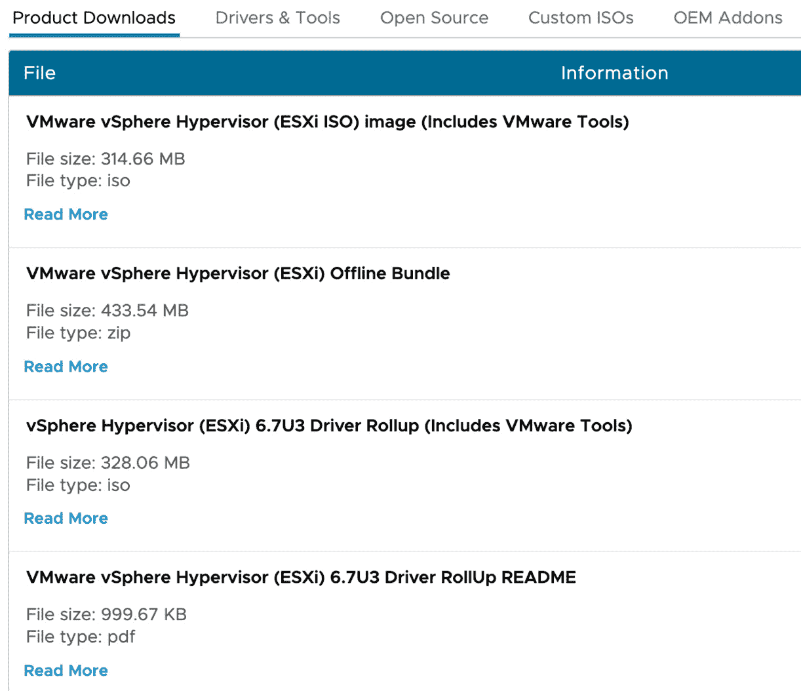

    图 1.2 – 虚拟化软件下载列表

    下载 ISO 文件后，你可以将其刻录到 USB 闪存盘上，然后用该 USB 闪存盘启动并执行*裸机安装*。这两种格式的主要区别在于，ZIP 格式允许用户进行微调并添加第三方驱动程序来发布和构建自定义 ISO。

    重要提示

    裸机安装指的是一台没有任何操作系统的机器，这是第一次在机器硬盘上安装操作系统。

    如果你打算在消费者级 PC 上执行**裸机安装**，这点尤为重要，因为标准的 ISO 包中并不涵盖所有网络驱动程序，且需要在发布前将它们添加到基础包中。我们在本书中不会涉及此内容。

1.  选择 ISO 文件后，你将被引导到一个链接，提供哈希列表。这是良好的安全习惯，因为它为用户提供了哈希值列表，以验证下载包的有效性：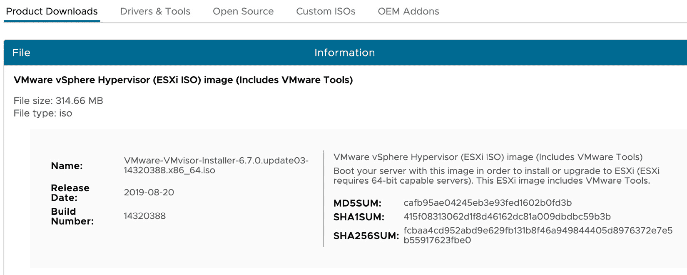

    图 1.3 – 文件完整性检查

    如果我们没有通过运行**哈希检查**来确认文件的完整性，那我们就不是合格的安全从业人员了。这一点非常重要，以确保文件在传输过程中没有被篡改。现在，一些关注新闻的人可能会说，*供应链*攻击能够绕过这种验证。一个供应链攻击的例子是*SolarWinds Orion*，当时有人怀疑一个 APT 组织，名为*Cozy Bear*，更新了 Orion 的代码库，并使哈希检查失效，因为开发者发布了包含恶意软件和清洁代码的哈希值，然后验证它是否为真实来源。无论如何，始终检查文件的哈希值仍然是一个好的做法，可以防止**脚本小子**在你的实验室内立足。

    重要提示

    通常，脚本小子是一些经验不足的黑客，他们下载了一款软件，但并不完全理解运行该软件后的结果是什么，只是因为他们并不关心攻击的结果或影响，只要它能做点什么，他们就会运行它。

1.  通过运行哈希检查来检查你新下载的 ISO 文件。正如以下截图所示，我进行了`SHA-1`检查，并将其与 VMware 提供的`SHA1SUM`检查进行了比较：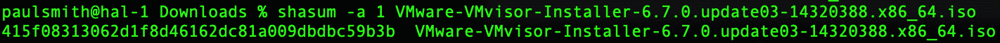

    图 1.4 – SHA-1 校验和

1.  现在我们已经确认哈希匹配，我们需要将此内容刻录到*USB 密钥*上，以便可以从 USB 密钥启动并在服务器上安装 ESXi。我已经非常依赖`balenaEtcher`来创建可启动的 USB 密钥。一旦你手动制作了几百个，甚至上千个 USB 密钥，`Etcher`带来的简便性真的是一种福音。

1.  访问*balenaEtcher*官网并下载软件，可以通过以下链接进行下载：[`www.balena.io/etcher/`](https://www.balena.io/etcher/)。

1.  下载*balenaEtcher*并启动工具。你将看到以下界面。你需要点击**选择镜像**并选择虚拟化管理程序镜像：

    图 1.5 – 选择要烧录的镜像

    由于*balena*会搜索 ISO 文件中的*GPT*或*MBR* **分区表**，如果未能找到，它会提醒用户，因此会出现以下警告。你可以继续闪存到 USB 密钥，因为从密钥启动应该没有任何问题：

    

    图 1.6 – 缺少分区表警告

1.  点击**继续**后，工具会带你进入下一个界面，整个过程只需要几分钟。趁此机会休息一下，去补充你的咖啡或其他偏好的饮品，等你回来时，它应该已经完成。一旦完成，拔出 USB 密钥并插入你将要进行裸机构建的机器：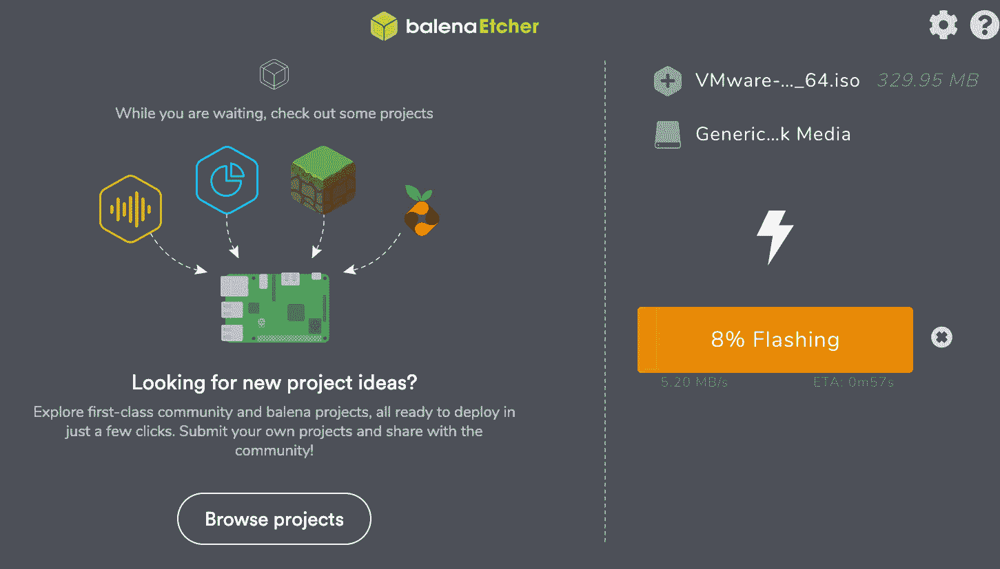

    图 1.7 – 刷写 USB 密钥

    过去，我在*Intel NUC*、*Gigabyte Brix*、*Supermicro IoT*和*Dell PowerEdge*等服务器上构建过各种虚拟化管理程序服务器。为了演示，我决定重新利用一些以前用于加密货币挖矿的旧设备，但这是另一个话题，可能会在另一本书中讨论。根据你的实验室预算，我在*eBay*上找到了很多不错的设备，效果很好。我刚做了个快速搜索，找到了几台大约 $150.00 美元的 1U 服务器。

1.  接下来，我假设你有合适的设备，可以从 USB 密钥启动并进行裸机安装虚拟化管理程序。一旦你开机，系统将从你新制作的 USB 密钥启动。你接着需要设置**用户名**和**密码**，如以下截图所示，然后设置 IP 地址，可以通过 DHCP 获取动态地址，或者设置静态地址。一旦设置好了管理 IP 地址，你就可以打开网页浏览器并访问 GUI：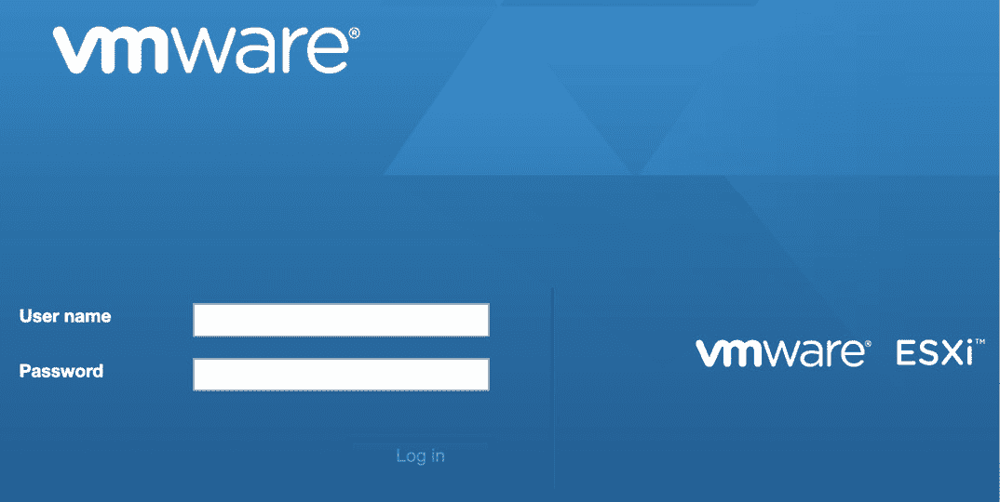

    图 1.8 – VMware ESXi 登录

1.  使用在安装过程中配置的**用户名**和**密码**登录。认证通过后，您将看到 `ESXi` 的主机管理页面，如下截图所示：

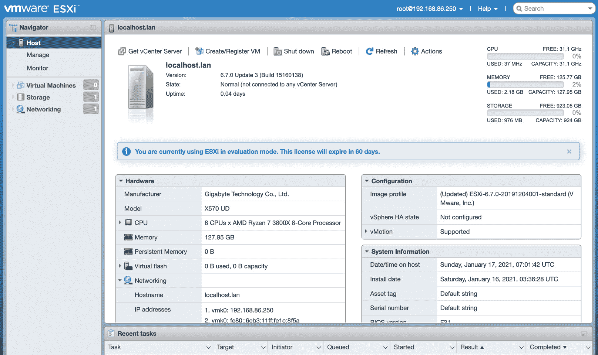

](image/Figure_1.09_B16321.jpg)

图 1.9 – VMware ESXi 仪表盘

如果您通过最小的努力已经到达这里，那么说明一切顺利。至此，我们已成功在实验室硬件上安装了 VMware Fusion 和 VMware ESXi。我们距离建立一个完全运行的**工业控制系统**（**ICS**）实验室又近了一步。在接下来的章节中，我们将在新服务器上安装虚拟机（VM）。

## 将 Ubuntu 启动为伪 PLC/SCADA

我们将模拟一个虚拟的**可编程逻辑控制器**（**PLC**）和`SCADA`组合，建立一个*测试平台*，以帮助我们在本书中逐步形成我们的操作方法。PLC 通常是一个小型的、坚固耐用的计算机，用于控制工业过程。这些过程可以从机场的人员搬运设备，到控制*SpaceX 的猎鹰 9*；从非常简单的开关任务，到非常复杂的级联控制任务。我们可以在石油和天然气、能源生成、传输和分配中找到自动化系统，确保我们可以给 iPhone 和 Android 设备充电；食品和饮料生产，例如可口可乐；化学混合和灌装；制药制造，例如辉瑞疫苗的生产；交通运输中的飞机电子设备用于控制飞机飞行系统；医院用于监控患者；以及更多的行业。PLC 无处不在，这些设备控制着我们日常生活中习以为常的事物。SCADA 是一个广泛的系统，用于控制一组更大范围的已定义过程。以人员搬运设备为例，您可以使用一个单独的 PLC 来控制人员搬运设备的本地开关行为和速度。然后，这些数据会被发布并由 SCADA 系统控制，允许操作员远程控制这个过程的运行。PLC 和 SCADA 的组合对于单一过程而言可能是过度的，但 SCADA 真正展现优势的地方是当您希望控制机场、购物中心，甚至是拉斯维加斯大道上的所有人员搬运设备时。SCADA 系统可以启动或停止单独的过程，或者同时启动或停止所有过程。它的强大之处在于，在设计安全防护时，确保保护该系统应该是最重要的。

现在这段简短的介绍结束了，我选择使用`Ubuntu`作为我的*Linux 发行版*。它由*Canonical*开发，并且是一个维护良好的发行版。熟悉它将有助于你前进，因为 Canonical 已经开发了`UbuntuCore`，它是一个支持**物联网**（**IoT**）生态系统的操作系统。我提到这个是因为**运营技术**（**OT**）行业正在慢慢转向采用物联网技术来替代传统设备。许多大厂商正在这个领域进行创新，以丰富他们的产品组合。好吧，未来的闲聊就到这里；让我们进入下载阶段：

1.  首先，导航到以下链接以开始下载：[`ubuntu.com/download/desktop`](https://ubuntu.com/download/desktop)。

    这将带你到一个类似这样的网页：

    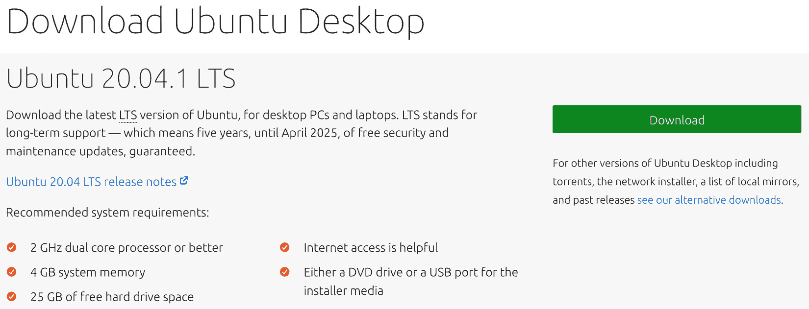

    图 1.10 – Ubuntu 软件下载

1.  点击**下载**按钮，然后坐下来等它完成。根据你的网络连接，下载可能需要一些时间。

    下载完成后，我们可以继续安装*操作系统*。有多种方法可以做到这一点。一种方法是在 Fusion 上安装，然后连接到服务器，将虚拟机从 Fusion 上传到 ESXi。另一种选择是将 ISO 文件传输到 ESXi 的数据存储中，并从那里配置一个新的虚拟机，将 Ubuntu ISO 挂载在虚拟 DVD 驱动器上。我们将使用数据存储方法，因为我们希望尽可能少地使用本地资源，不想通过托管多个虚拟机来消耗本地计算机的资源。我们将登录到 GUI，在主机管理界面上，点击**存储**下的**数据存储**选项，如下图所示：

    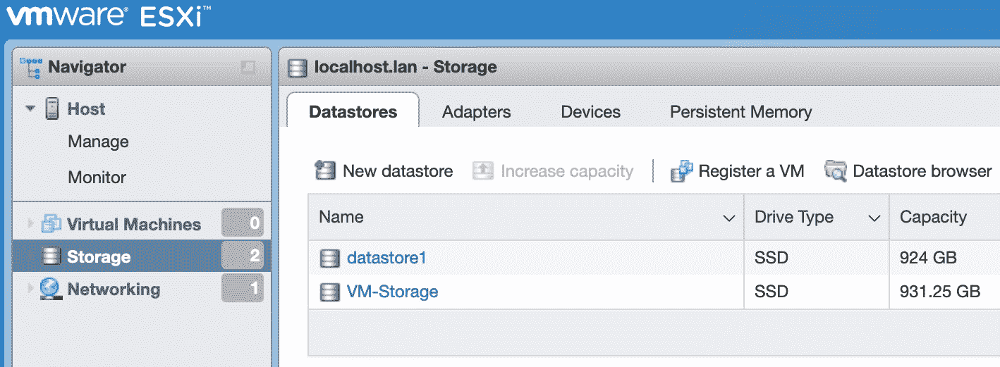

    图 1.11 – 存储数据存储

    根据你的设置，你可能只有*一个磁盘*或*多个磁盘*。这种配置超出了本书的范围，但最终，这取决于你个人的偏好。

1.  接下来，我们将点击**数据存储浏览器**按钮。屏幕上会弹出一个模态窗口，如下所示：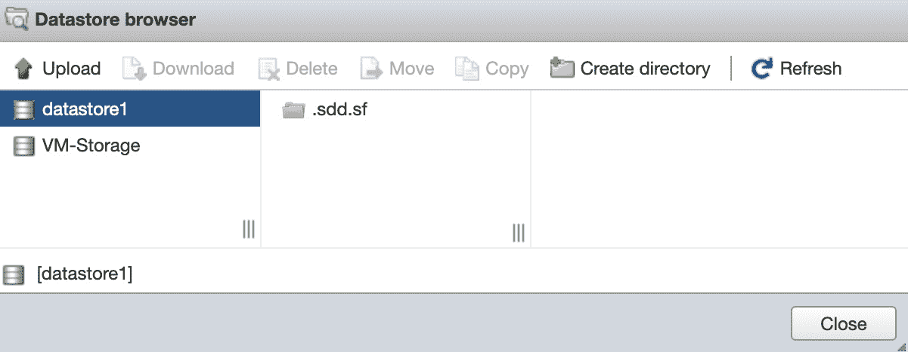

    图 1.12 – 上传浏览器

1.  在这里，你需要选择将上传 ISO 文件的那个数据存储。然后，我喜欢创建一个**目录**，将所有 ISO 文件放在其中，便于以后快速调用。你可以看到创建名为`iso_folder`的目录的示例，见下图：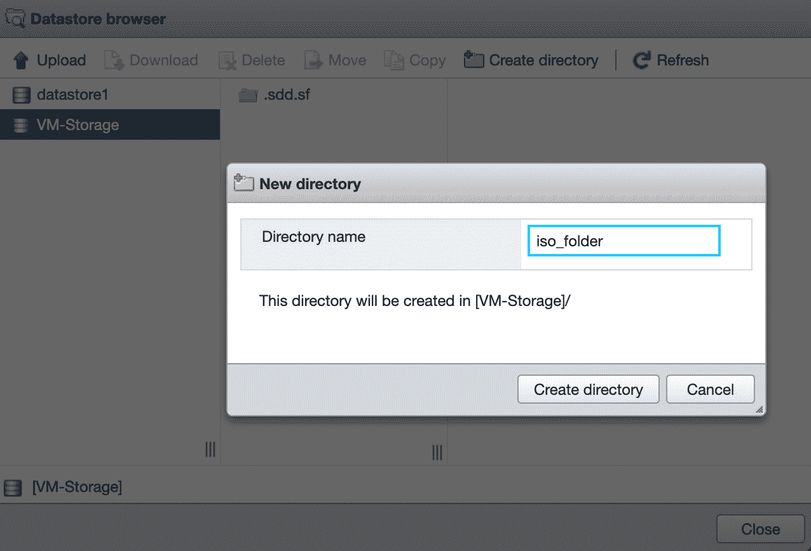

    图 1.13 – 创建新目录

1.  现在，您需要选择新创建的目录并点击**上传**按钮。这将打开一个*Finder/Explorer*窗口，您可以在其中选择刚刚下载的`ISO`文件。选择后，您将看到一个进度条，指示文件的完成情况，如以下截图所示：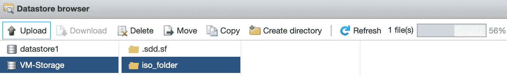

    图 1.14 – 上传进度

    一旦文件上传完成，您将看到新上传的虚拟机出现在`iso_folder`中：

    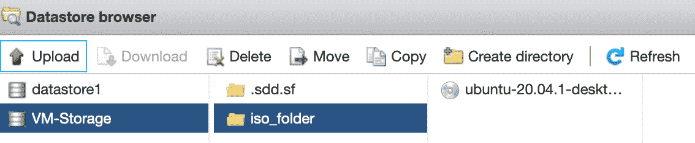

    图 1.15 – 已上传的 ISO

1.  下一步是从屏幕左侧的**导航器**菜单中选择**虚拟机**。然后点击屏幕右侧的**创建/注册虚拟机**按钮，如以下截图所示：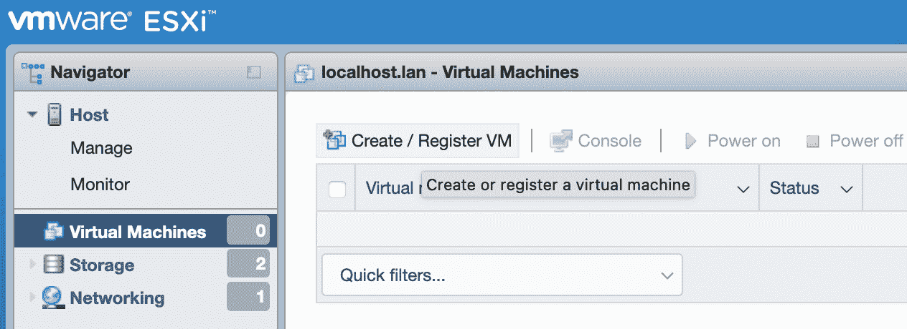

    图 1.16 – 虚拟机仪表盘

1.  一旦点击，这将弹出一个模态窗口，显示三个不同的选项：

    a. **创建新的虚拟机**

    b. **从 OVF 或 OVA 文件部署虚拟机**

    c. **注册现有虚拟机**

    您可以在以下截图中看到这一点：

    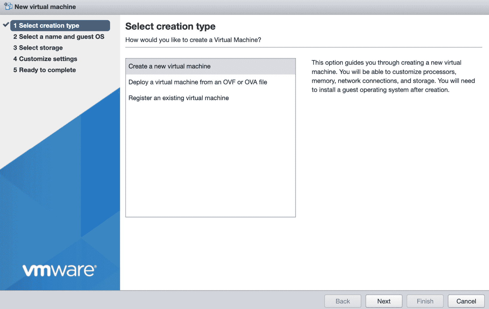

    图 1.17 – 创建虚拟机

    我们将在这里选择**创建新的虚拟机**选项。这将弹出另一个窗口。从这里，我们需要填写**名称**、**兼容性**、**客户操作系统系列**和**客户操作系统版本**等选项。**兼容性**是一个选项，允许虚拟机访问特定版本的虚拟硬件。我们可以在以下截图中看到这是什么样子的：

    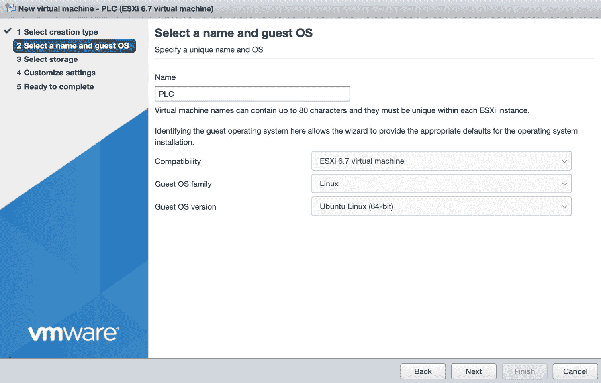

    图 1.18 – 兼容性选择

1.  点击**下一步**。您将进入一个新界面，您可以在其中选择希望在哪个数据存储中启动新的*PLC 虚拟机*。我选择了`VM-Storage`并点击了**下一步**：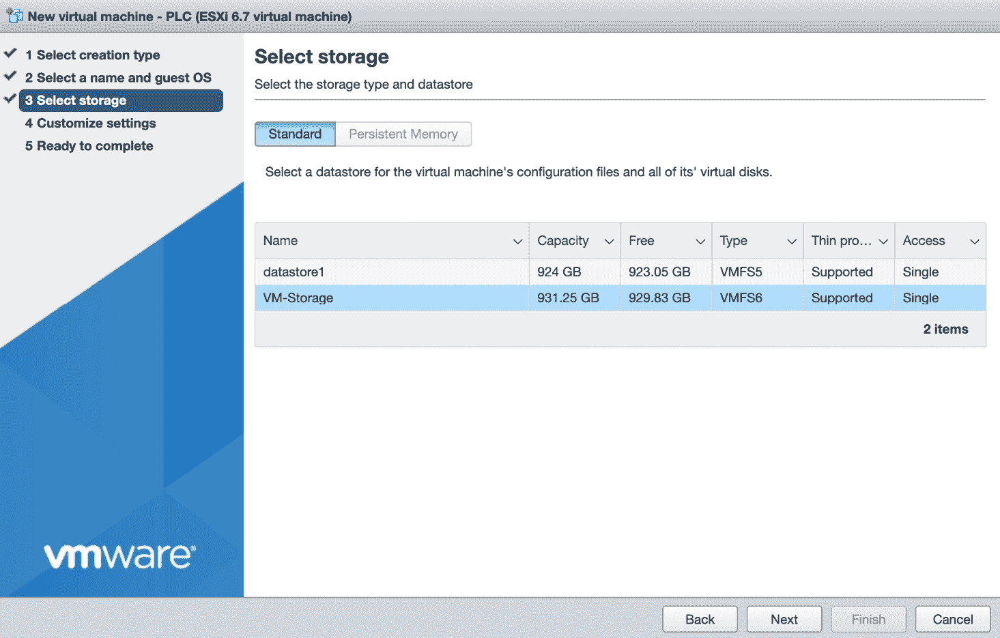

    图 1.19 – 选择存储页面

    下一屏幕允许您自定义我们正在加载的虚拟机。由于这台虚拟机将模拟一个 PLC，我们希望保留与真实现成设备相同的资源配置。关键点将是我们加载到**CD/DVD 驱动器 1**中的`Datastore ISO`文件。

    如下截图所示，我选择的规格是`1`个`CPU`，1GB RAM，`40` GB 磁盘空间，**VM 网络**和`Datastore ISO`（Ubuntu ISO）：

    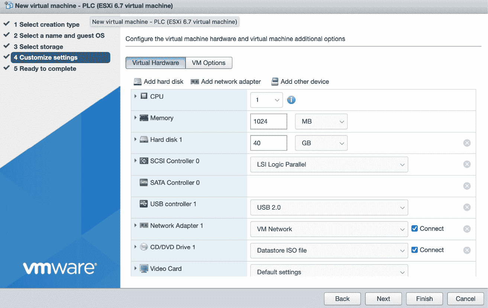

    图 1.20 – 自定义设置页面

    我们将在下一节配置网络，使其遵循**准普渡**模型。普渡模型是用于分段工业网络的理论框架。已经出版了许多书籍，详细记录了根据普渡模型对网络进行建模的实用性，因此我强烈推荐你拿一本来阅读。普渡模型是一种应用标准进行分段的方法，尽管已经创建了许多其他标准，而且许多都是行业特定的。在北美，针对公用事业行业的**北美可靠性公司关键基础设施保护**（**NERC CIP**）是一套可靠性标准，用于遵循安全最佳实践。**化学设施反恐标准**（**CFATS**）是专门为化学工业制定的，但这些标准之间有很多重叠。**国际标准化组织**（**ISO/IEC**）27000 系列，特别是 ISO-27002，已经在北美以外地区采用，此外还有**国际自动化学会**（**ISA**）99 或 ISA 62443，这是普渡模型的最终来源。

1.  现在，点击**完成**。这将把已配置的虚拟机放入数据存储区。然后，我们将运行该虚拟机，它将引导我们进入 Ubuntu 安装过程。我们可以通过点击以下截图中显示的绿色开机按钮来完成：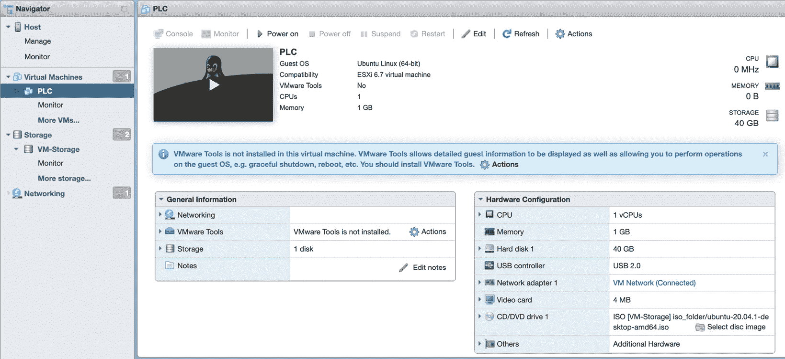

    图 1.21 – PLC 虚拟机

1.  点击开机按钮后，您将看到如下页面：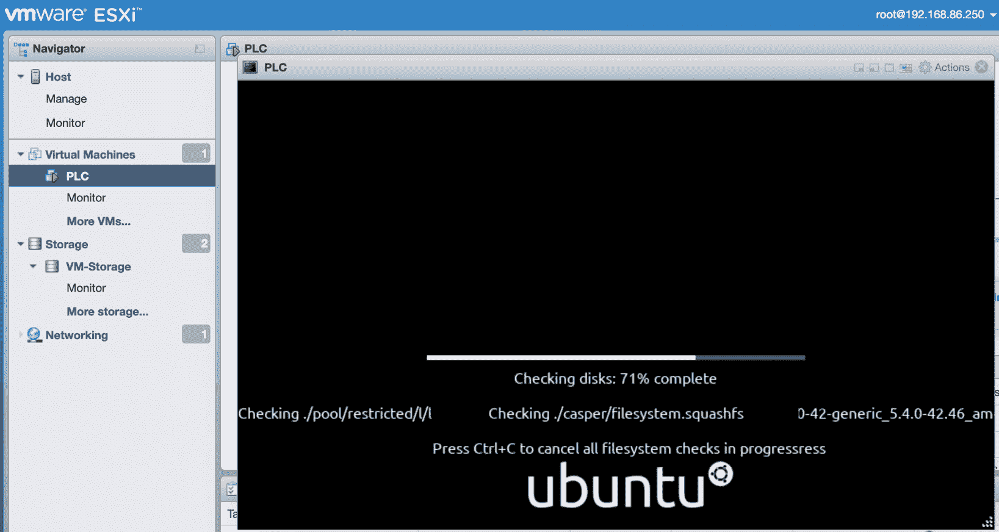

    图 1.22 – 启动虚拟机

1.  按照通常安装任何 Linux 发行版的方式安装`Ubuntu`。安装完成后，您应该会看到如下所示的登录界面：

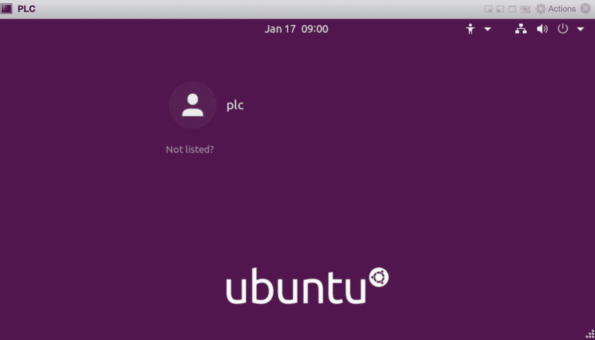

图 1.23 – PLC 虚拟机的登录界面

我们将重复所有步骤，创建名为 PLC 的虚拟机：

1.  创建一台新虚拟机。

1.  加载存储区中的 Ubuntu ISO DVD。

1.  选择 1 个 CPU、4GB 内存、40GB 硬盘和一个虚拟机网络接口。

1.  点击开机按钮。

1.  如同之前一样进行安装。

现在，将虚拟机命名为 SCADA。现在你有了两台 Ubuntu 虚拟机——一台名为 PLC，另一台名为 SCADA——接下来的步骤将是更新虚拟机，并添加我们希望用来模拟**虚拟 PLC**的关键软件包。

首先，登录到*PLC*和*SCADA*虚拟机，并运行以下命令：

sudo apt update

sudo apt upgrade

这将确保你拥有最新版本的核心软件包，构成你的 Ubuntu 机器。接下来，我们将安装特定软件包，以便能够创建**虚拟 OT 实验室**。

需要安装的关键软件包如下：

sudo apt install git

sudo apt install vsftpd

sudo apt install telnetd

sudo apt install openssh-server

sudo apt install php7.4-cli

sudo apt install python3-pip

pip3 install twisted

pip3 install testresources

pip3 install pytest

pip3 install cpppo

pip3 install pymodbus

下一步我们必须做的是克隆一个特定的工具。

运行以下命令：

git clone https://github.com/sourceperl/mbtget.git

cd mbtget

perl Makefile.PL

make

sudo make install

几乎每个软件包都有独立的书籍来详细介绍，所以在这里我不会深入细节，而是会解释每个软件包的背后原因。

它们如下所示：

+   `git`：我们将使用这个工具克隆一个用*Perl* 编写的简单 Modbus 客户端，名为 `mbtget`。

+   `vsftpd`：这是一个非常简单的 FTP 守护进程，允许我们模拟网络中的配置文件传输。

+   `telnetd`：这是一个 `Telnet` 守护进程，也将帮助我们模拟网络中的配置文件传输。

+   `openssh-server`：这允许我们通过 `ssh` 连接到 PLC 进行命令和控制。

+   `php7.4-cli`：这将帮助我们在本书后面模拟 PLC 接口。

+   `python3-pip`：这是一个专门用于 Python 3 的包管理器。

接下来的软件包是专门为 Python 编写的：

+   `twisted`：一个网络引擎，是 *pymodbus* 的依赖。

+   `testresources`：一个单元测试包，是 *pymodbus* 的依赖。

+   `pytest`：一个测试引擎，并且是 *Cpppo* 的一个依赖。

+   `cpppo`：一个用于测试各种工业协议的有用引擎。在本书中，我们将重点介绍 Ethernet/IP。

+   `pymodbus`：这是一个可以作为客户端/服务器使用的 `modbus` 引擎。

下一个软件包是 `mtbget`，它是*Perl* 特定的。它是一个 `modbus` 客户端，非常有用于现场测试设备。

目前我们在 ESXi 服务器中运行着两台完全更新的 Ubuntu 机器。我们还安装了各种软件包，这些软件包将帮助我们模拟 PLC 与 SCADA 之间的关系。我们还可以通过不同的协议生成远程连接，这将在后续章节中派上用场。接下来，我们将构建一个工程工作站和一个 Kali Linux 攻击盒子。

## 启动 Windows 工程工作站

如果你能够顺利完成安装，那么我们就离拥有一个完善的*虚拟实验室*更近了一步。接下来，我们需要获取一个*Windows 7* 镜像。这很重要，因为我们配置和与物理硬件通信所需的软件大部分是为 Windows 开发的。严格来说，它最初是为 Windows XP 开发的，后来升级到了 Windows 7\。

按照我们构建 Ubuntu 虚拟机的步骤，我们将创建我们的 Windows 7 机器：

1.  创建一个新的虚拟机。

1.  加载存储库中的 Windows7 ISO 的 DVD。

1.  选择 1 个 CPU，4 GB 内存，40 GB 硬盘和一个 VM 网络作为接口。

1.  点击开机按钮。

1.  安装 Windows。

安装并登录 Windows 后，你应该看到一个类似于以下的界面：

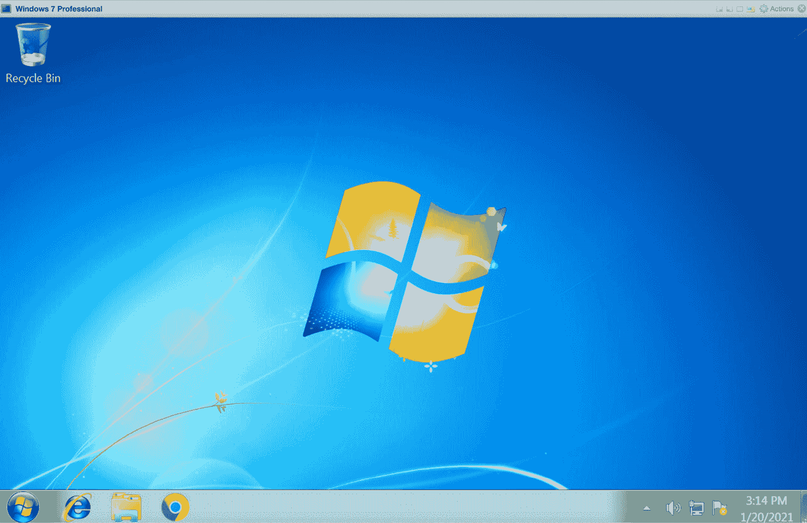

图 1.24 – Windows 7 虚拟机

现在我们的 Windows 7 虚拟机已经运行，我们将继续安装 Kali Linux。

## 启动 Kali Linux

`Kali Linux`是一个专为**安全研究**、**评估**和**渗透测试**等设计的 Linux 发行版。尽管名称自检查软件包以来有所变化，但它仍然是市场上最广泛使用的安全工具之一。

点击这里下载您的 Kali Linux 副本：[`www.kali.org/downloads/`](https://www.kali.org/downloads/).

我们将使用`Kali Linux`对实验室中的设备进行测试，包括虚拟和物理设备。这是一个全面的平台，包括*gpg 签名的软件包*，并有一个庞大的开发社区。还有许多其他显著的*渗透测试框架*，如现在的`controlthings.io`，以前称为`SamuraiSTFU`。`ControlThings`提供了一系列专门针对 ICS/OT 环境的工具，还包括了用于测试目的的`pcaps`回放功能。此外，它们还提供了无数的仿真器，使您可以真正磨练评估技能。*Parrot OS*是一个安全平台，因其用户友好的界面、低内存消耗和默认的匿名浏览功能而广受欢迎。它是您*渗透测试工具库*中的一个强大框架。

Kali Linux 有一个简单直接的安装过程。

您需要按照之前为 Ubuntu 和 Windows 7 执行的相同步骤，将 Kali ISO 上传到数据存储，并将 ISO 挂载到 DVD 驱动器上并引导虚拟机。

接下来，根据您所在地区的选项进行安装设置。虚拟实验室的一个很棒的部分是，一旦启动了一台机器，您可以调整其硬件设置。以下截图显示了我开始使用的**硬件配置**设置：

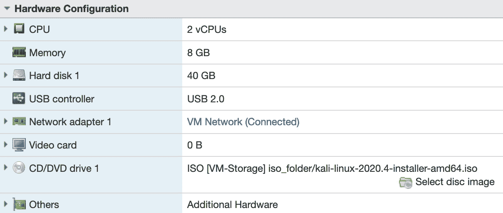

图 1.25 – Kali Linux 配置

安装过程的最后一步是选择要安装的软件。我个人选择了`large`版本以预装更多工具。这个选择如下截图所示：

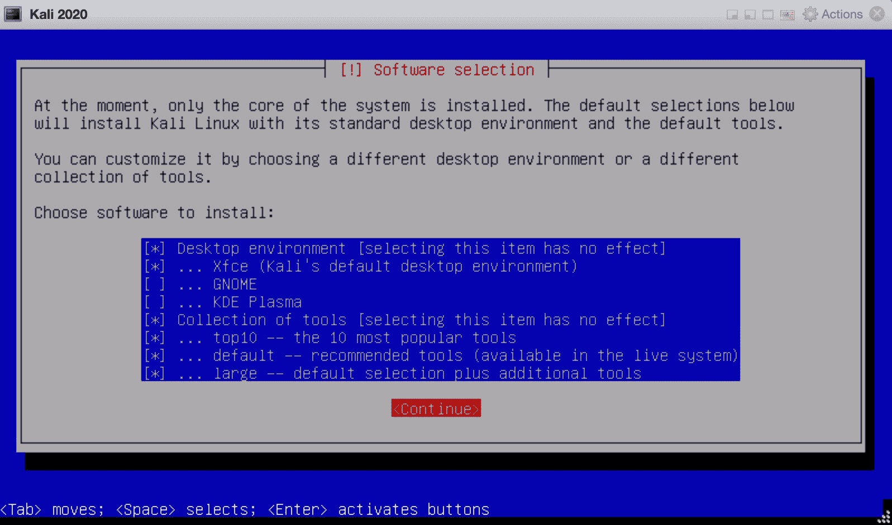

图 1.26 – 软件选择

接下来，使用在初始安装过程中设置的用户登录`Kali`系统。

提示

一些关于*BackTrack/Kali*凭据的快速历史是，`root:toor`自我开始使用`BackTrack 4`以来一直是默认凭据。现在，它们已经更改为`kali:kali`。所以，如果你恰好是*Blue Team*阵营的一员，请确保为这些已知凭据建立一个**入侵检测规则**（**IDR**）。

你将看到一个登录屏幕，如下截图所示：

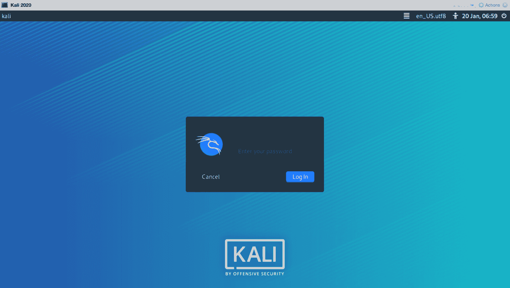

图 1.27 – Kali Linux 登录界面

接下来，我们将像在 Ubuntu 中一样更新 Kali，并安装与之前安装的类似的软件包。

关键软件包使用以下命令安装：

+   `sudo apt install python3-pip`

+   `pip3 install pymodbus`

+   `pip3 install cpppo`

+   `git clone` ([`github.com/sourceperl/mbtget.git`](https://github.com/sourceperl/mbtget.git))

+   `cd mbtget`

+   `perl Makefile.PL`

+   `make`

+   `sudo make install`

现在，如果没有出现错误，您应该在您的虚拟化平台上安装了四个虚拟机，如下截图所示：

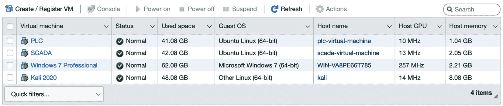

图 1.28 – 虚拟机

在本节中，我们安装了一个 Windows 7 工程工作站和一个将在实验室中模拟攻击者的 Kali Linux 主机。我们将从这里启动各种枚举、利用和攻击。在下一节中，我们将继续通过设置与 **Purdue 模型** 相关的 *层次* 来设计和实施网络分段。

# 路由和规则

在设置我们的 *虚拟实验室网络* 时，我们希望尝试模仿真实世界的**分段策略**。话虽如此，谈论 OT 网络时很难不提及 *Purdue 模型*。这个模型已被几乎所有行业用作构建网络分层基线的参考方法。这些层次如下：

+   Level 5: `Enterprise`

+   Level 4: `Site Business Systems`

+   Level 3: `Operations and Control`

+   Level 2: `Localized Control`

+   Level 1: `Process`

+   Level 0: `I/O`

因此，忠于原则，我们将在我们的实验室中采取相同的方法。我们将首先将虚拟 PLC 放入 *Level 1*，将 SCADA VM 放入 *Level 2*，将 Windows 7 工程工作站放入 *Level 3*，最后将我们的 Kali Linux 攻击主机放入 *Level 5*。我们需要登录 ESXi 并点击 `Networking`。这将显示一个屏幕，显示与 ESXi 网络基础设施相关的多个选项卡，如下所示：

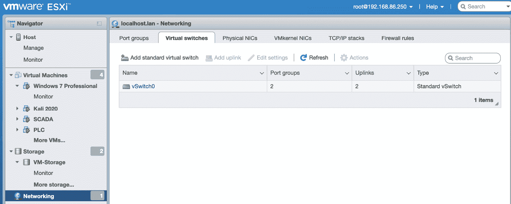

图 1.29 – 网络仪表板

我们将在 `Virtual switches` 选项卡上创建一个新的交换机。首先填写 `vSwitch Name` 选项并将 `Link discovery Mode` 更改为 `Both`，如下截图所示。这允许有关物理和虚拟交换机的详细信息被发布并可用：

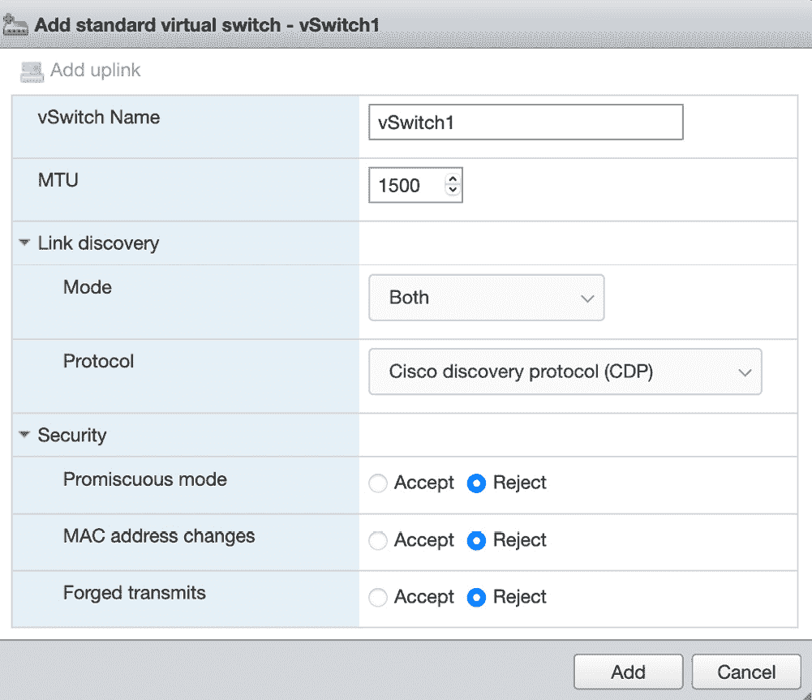

图 1.30 – 配置虚拟交换机

我们将返回并在*第五章*中更改 `Promiscuous mode`，*Span Me If You Can*，当我们讨论 **入侵检测系统**(**IDS**) 时。完成后，您应该看到您的新虚拟交换机。

接下来，我们想进入**端口组**标签。从这里，我们点击**添加端口组**，这将弹出一个窗口，在这里我们可以设置**名称**、`VLAN`，并将端口组与**虚拟交换机**关联。对于**端口安全性**，我们将默认继承之前步骤中创建的`vSwitch1`的安全设置。所有这些细节可以在以下截图中看到：

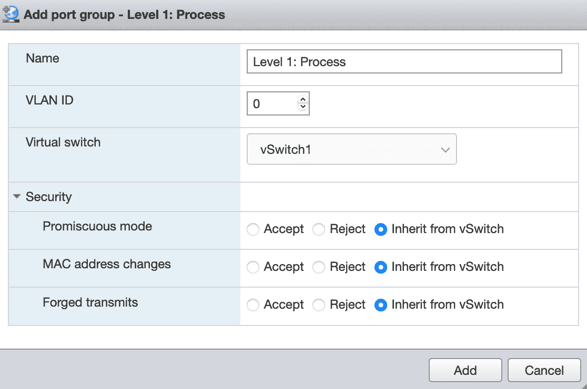

图 1.31 – 端口组配置

现在，我们想通过添加剩余的网络来完成该过程：

+   企业

+   站点业务系统

+   操作与控制

+   本地化控制

完成后，您将看到与专用交换机关联的端口组。请注意，完成分段并遵循*普渡模型*有多种方式：

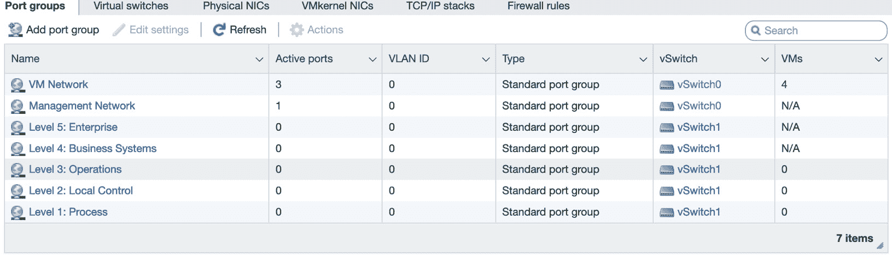

图 1.32 – 端口组仪表盘

如您所见，我们的所有虚拟机仍与 VM 网络关联。下一步是将虚拟机移入各自的独立段，并手动设置它们的 IP 地址和范围。我们将从 PLC 虚拟机开始，因此我们需要从导航栏选择**虚拟机**，然后点击**PLC 虚拟机**。点击**编辑**按钮，这将带您到以下页面：

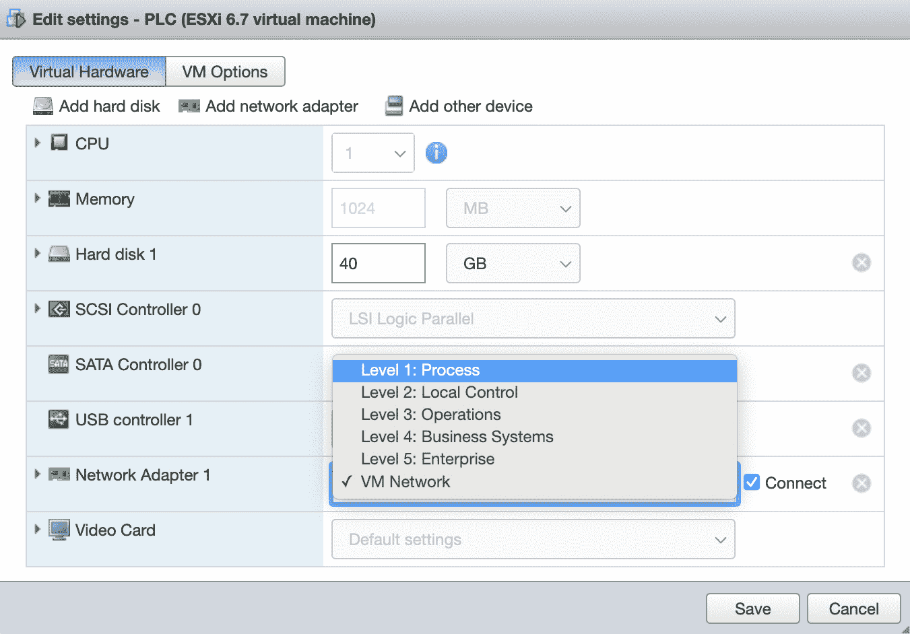

图 1.33 – 端口组选择

我们想将**网络适配器**从**VM 网络**切换到**Level 1: 进程**，然后点击**保存**。接下来，我们需要手动设置 PLC 的 IP 地址。所以，我们需要打开控制台，登录 PLC，并导航到**网络设置**。

您将看到以下页面：

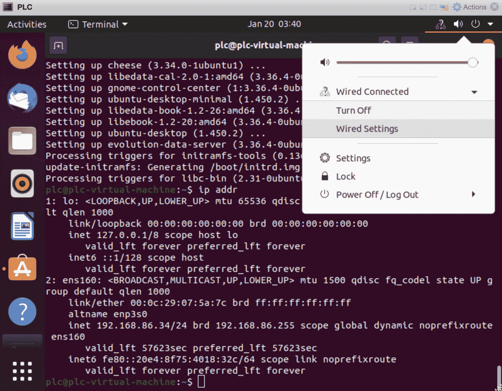

图 1.34 – 网络设置

从这里，我们可以点击**有线设置**选项。然后，会弹出一个窗口。接下来，您需要选择位于紫色滑块旁边的*齿轮*图标，如以下截图所示：

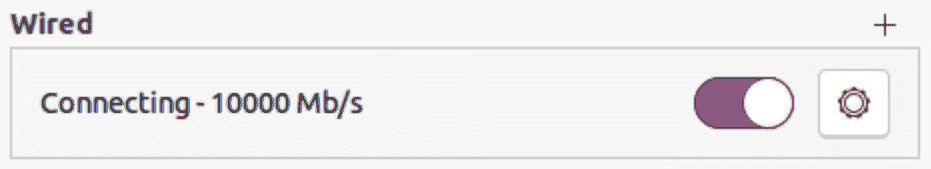

图 1.35 – 有线网络接口

在这一点上，我们应该花点时间讨论我们的 IP 地址方案。

在这里，我们将每个网络段拆分为专用的 IP 范围，如下表所示：

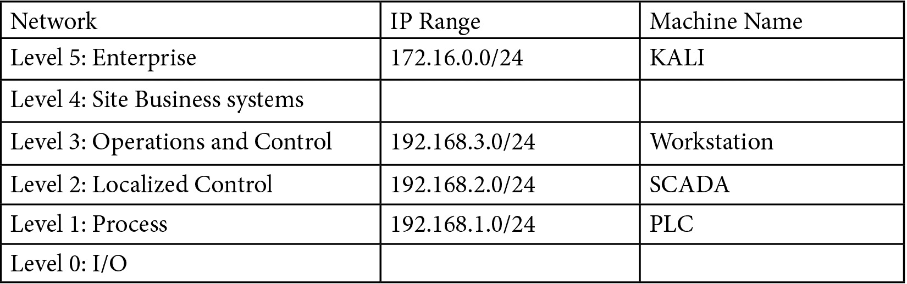

现在，我们可以为我们构建的虚拟机预先分配 IP 地址。

我们将分配以下 IP 地址：

+   `PLC**: **192.168.1.10`

+   `SCADA**: **192.168.2.10`

+   **工作站`: **192.168.3.10`

+   `Kali**: **172.16.0.10`

我们可以通过在基于 Linux 的发行版上运行`ip addr`命令来检查机器，以确保 IP 地址已生效，如以下截图所示：

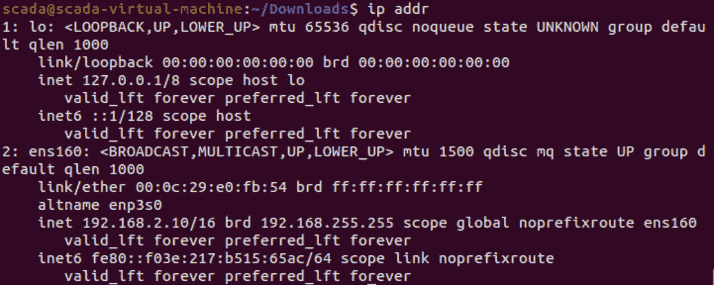

图 1.36 – 检查网络地址

在此，选择 `IPv4`，然后选择 **手动** 选项。为所有三个 – PLC、SCADA 和 Kali 设置 Linux 基础的发行版 IP 地址的选项应出现在 **地址** 下，如以下截图所示：

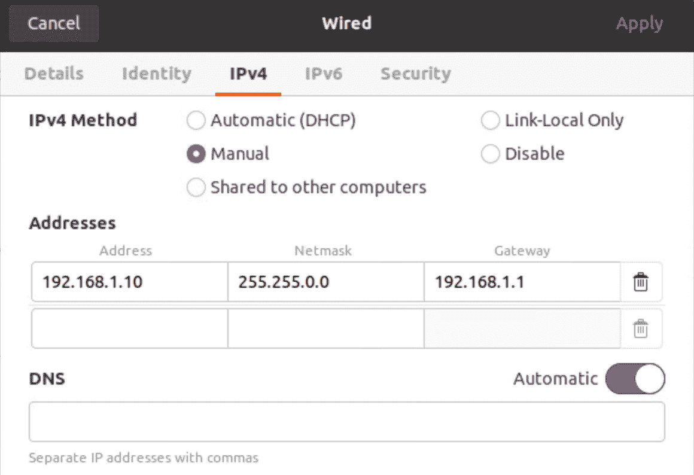

图 1.37 – Ubuntu 手动 IP 配置

现在，我们可以继续进行 *Windows 7* 配置，并在那里手动设置 IP 地址。Windows 7 配置如下所示：

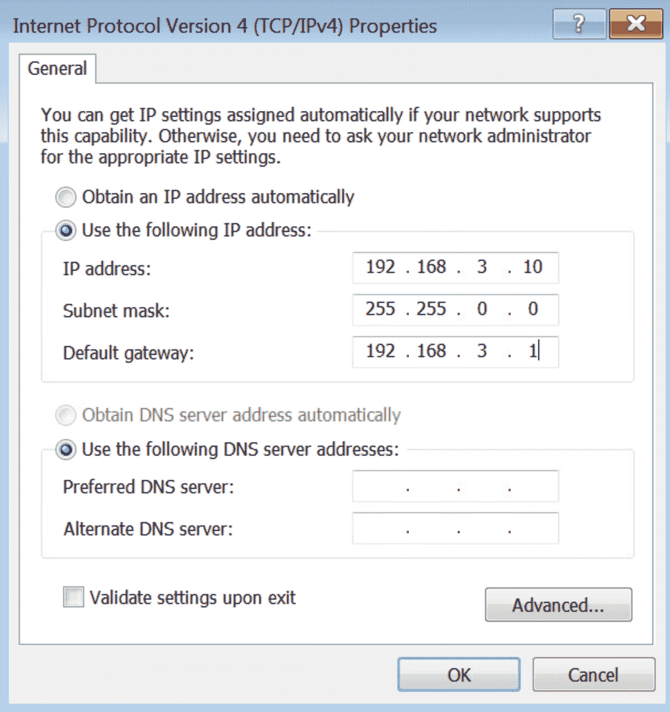

图 1.38 – Windows 7 网络配置

确保 PLC、SCADA 和工作站能够互相 ping 通，通过运行 `ping` 命令，如以下截图所示：

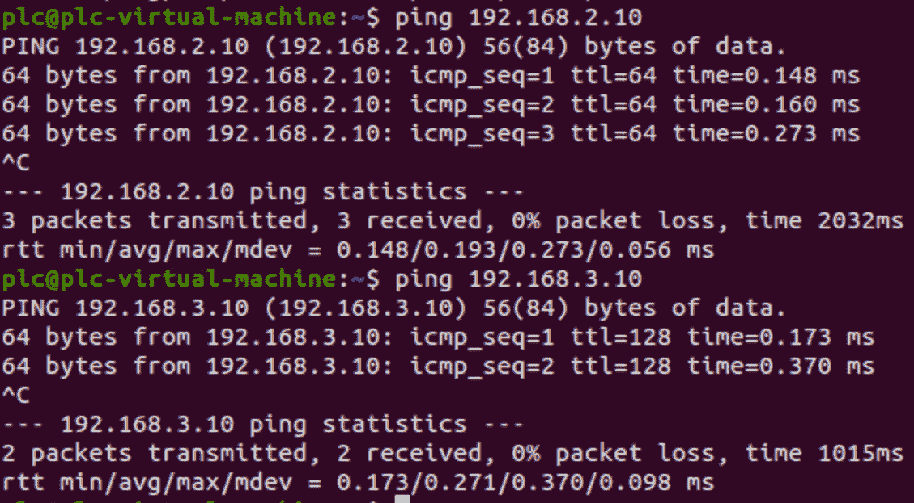

图 1.39 – 检查虚拟机之间的通信

我们现在已经成功地设置了网络分段，使其代表 Purdue 模型。所有 IP 地址都已静态设置，并且我们已经测试了各个层级和虚拟机之间的通信。

# 概述

在本章的介绍中，我们涵盖了相当多的细节。我们提到了虚拟化的重要性，以及熟悉不同平台提供商的必要性。通过安装自己的 Fusion 桌面和 ESXi 服务器，我们对 VMware 进行了深入了解。然后，我们下载并安装了四个独特的虚拟机，并配置了网络方案，使其与 Purdue 模型对齐。

经过这一系列努力，我们现在已经为构建实验室奠定了坚实的基础。接下来，我们将通过根据需要添加软件并利用攻击虚拟机运行我们设计的场景，继续构建这个实验室。

在下一章中，我们将通过安装与我们的硬件 PLC 通信的工程软件，构建实验室的物理组件。
