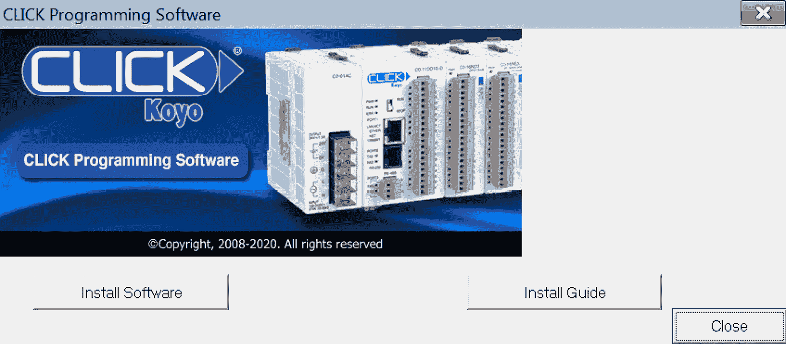
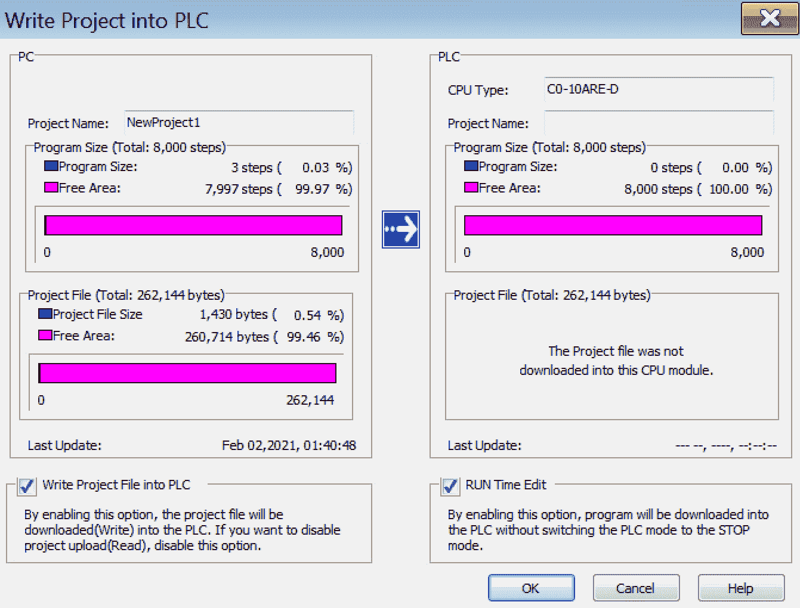
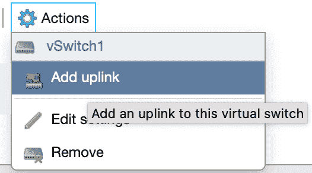
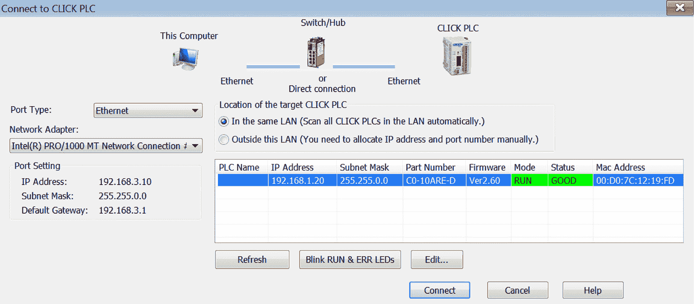

# 第二章：路由硬件

本章将带你踏上理解如何将物理**硬件**连接到虚拟基础设施的精彩旅程。了解一台运行`ESXi`的机器如何将通信路由到本地**可编程逻辑控制器**（**PLC**）、**人机界面**（**HMI**）及其他类似设备。首先，本节将使用`Koyo Click`软件和硬件，因为 Koyo Click PLC 是一个非常具成本效益的选择，而其工程编程软件是免费的，这与其他主流厂商需要支付高额费用来获得编程软件许可证的做法不同。需要注意的是，本章讨论的原理和方法也适用于其他自动化厂商，如西门子、罗克韦尔、施耐德、欧姆龙、三菱等。如果获取 Koyo Click 比较困难，你可以选择你自己的 PLC 进行学习。请注意，你需要获得所选厂商的工程编程软件。我们将安装**Click 软件**，设置物理`PLC`，并最终配置虚拟机与物理 PLC 之间的通信。

熟悉工业技术的编程方式将极大提高你在渗透测试中的成功率。了解软件的反应机制、它所使用的资源以及通信方式将帮助你发现潜在的入口点。

本章将涵盖以下主要内容：

+   安装 Click 软件

+   设置 Koyo Click

+   配置通信

# 技术要求

本章所需的设备：

+   Koyo Click 软件，你可以从这里下载：[`www.automationdirect.com/support/software-downloads?itemcode=CLICK`](https://www.automationdirect.com/support/software-downloads?itemcode=CLICK)

+   Koyo Click 硬件，你可以在这里找到：[`www.automationdirect.com/adc/overview/catalog/programmable_controllers/click_series_plcs/`](https://www.automationdirect.com/adc/overview/catalog/programmable_controllers/click_series_plcs/)

+   一台 Windows 7 机器，前一章中已经介绍过

+   正如前一章所介绍的，ESXi

# 安装 Click 软件

欢迎来到本章的第一个主题。在本节中，我们将一步步演示如何安装 Koyo Click 软件。这个软件将帮助我们与 Koyo Click PLC 进行通信，并上传和下载程序。

在开始之前，我想再次强调，这不是 Koyo Click 或 AutomationDirect 的销售宣传；它只是一个非常灵活、多功能、全面且具有成本效益的 PLC 选择。此外，AutomationDirect 是一个一站式商店，你可以在这里下单并获得构建完整实验室所需的一切。

在我们开始之前，让我们访问 AutomationDirect 网站。请点击以下链接：[`www.automationdirect.com/support/software-downloads?itemcode=CLICK`](https://www.automationdirect.com/support/software-downloads?itemcode=CLICK)。

我们将下载来自 AutomationDirect 的 Koyo Click 编程软件。一旦你访问了上述链接，你将看到以下界面：

图 2.1 – 点击软件下载

接下来，点击绿色的**下载**按钮，系统会弹出通知并要求输入**电子邮件地址**，如*图 2.2*所示，随后需要进行*电子邮件地址确认*以继续操作：

图 2.2 – 电子邮件确认

一旦你的电子邮件地址确认无误，软件开始下载。现在你应该已经下载好了软件。你需要将其传输到我们在*第一章*中创建的`Windows 7` 虚拟机上，*使用虚拟化*。有很多方法可以做到这一点——在虚拟机上建立第二个接口并将其放置在**ESXi 虚拟化主机**的网络段中是一种可行的方式。传输文件有多种不同的协议/工具。我通常选择最简单的方式，这已经成为我的第二天性。在评估过程中，我通过简单地启动一个`Python 3` 网络服务器，并让`Windows 7` 机器访问该文件并下载，完成了许多文件传输和反向 shell 推送操作。

以下是启动 Python 3 网络服务器的命令：

图 2.3 – 启动 python3 网络服务器

当客户端连接时，你可以看到 HTTP 200 OK 成功状态响应代码，如下所示：

图 2.4 – 成功状态的响应代码

如你所见，Windows 7 机器已连接并下载了软件文件。下图显示了本地服务器上托管的**目录列表**：

图 2.5 – Python HTTP 服务器目录列表

我提到这个是因为将来建立这种习惯会非常有用，它将在未来的**渗透测试**工作中派上用场，特别是当你需要在主机和你试图破解的机器之间移动文件时。

该截图展示了可以提取的**CD 镜像**，以启动安装过程：

图 2.6 – Koyo Click CD 镜像

现在我们已经将软件下载到 Windows 7 **虚拟机**（**VM**）上，我们需要提取**光盘镜像**并运行随后的**安装**选项：

图 2.7 – 安装点击软件

这时会弹出一个**用户帐户控制**（**UAC**）对话框，如*图 2.8*所示，我们需要点击**是**按钮。点击**是**后，软件将生成一个对话框，允许我们安装**CLICK 编程软件**：

图 2.8 – 接受 UAC 安装验证

接下来的截图将引导你完成安装点击编程软件。我们首先点击**安装软件**按钮，如下图所示：

图 2.9 – 点击编程软件

现在你应该能看到如*图 2.10*所示的页面。点击**下一步 >**按钮继续执行**InstallShield 向导**，此时会弹出一个对话框提示你在 Windows 7 机器上禁用防病毒软件，因为它会导致编程软件无法正确和完全安装：

图 2.10 – 点击 InstallShield

要启用此功能，只需点击**确定**，确认防病毒软件未开启，理论上它不应该开启，因为我们在*第一章*中并未安装任何防病毒软件，*使用虚拟化*：

图 2.11 – 防病毒检查

在下一个截图中，我们要接受**许可协议**并点击**下一步 >**：

图 2.12 – 许可协议

这将导致出现如*图 2.13*所示的页面。在框中填写**用户名**和**公司名称**。从*图 2.13*中你可以看到，我使用了我的名字**保罗·史密斯**和`ICS Lab`作为公司名称。这是一个示例，你需要填写你自己的信息：

图 2.13 – 配置客户信息

现在将加载以下页面：

图 2.14 – 选择目标位置

在这个页面上，你将选择软件安装的目标位置。我个人保持了默认文件夹结构，如*图 2.14*所示，在**更改**按钮的左侧。然后，点击**下一步 >**按钮，接着会生成另一个对话框，让你继续点击如下：

图 2.15 – 安装程序

安装程序完成后，InstallShield 会询问您是否要**创建桌面图标**，如*图 2.16*所示。我选择了此选项，因为以后更容易找到：

图 2.16 – 创建桌面图标

最后，我们完成了安装，过程应该不算太痛苦。点击**完成**，如*图 2.17*所示，然后启动软件：

图 2.17 – 完成安装

双击**CLICK 编程软件**图标启动程序。它应该会像下面这样显示在您的桌面上：

图 2.18 – CLICK 编程软件图标

这将启动以下对话框，允许我们**开始一个新项目**、**打开现有项目**或**连接到 PLC**：

图 2.19 – 开始一个新项目

一旦我们到达这里，一切都已设置完毕，准备就绪。

现在，如果我不指出明显的问题，那就对不起你了，也许你正问自己同样的问题：**哈希在哪里？** 这是**水坑攻击**的典型例子。水坑攻击是一种攻击手段，攻击者通过毒害软件包或更新，并将其发布到一个网站上，供设备或软件的用户下载这个已损坏的文件。这与我们在**第一章**中简要提到的`SolarWinds`攻击非常相似，*使用虚拟化*。如果一个广泛使用的技术被入侵，这种攻击可能带来非常深远且广泛的影响。

因此，今后，请特别留意获取**工业控制系统**（**ICS**）设备的软件来源以及它对您的 SCADA/ICS 系统可能产生的控制影响。现在我们将继续进行硬件设置，但稍后我们将回到软件部分。

# 设置 Koyo Click

我有几种不同型号的设备，但我将重点介绍`C0-10ARE-D`型号，这是以太网基础 PLC 单元。如果您没有 Koyo Click，也可以使用任何其他类型或型号的 PLC 和工程软件来进行操作。选择使用 Koyo 是因为它是我手头有的少数几台备用控制器之一，而且它没有被用于项目中。然而，更重要的是，这台设备专门用于该 PLC 的以太网通信端口，并且其工程软件是免费的。此外，它利用离散 I/O 来驱动和断开线圈的电流，并将有助于在我们`ICS`实验室中建立实际过程与设备之间的关联。

默认情况下，`Koyo Click` 配备了两种本地协议：

+   Modbus

+   以太网/IP

如果你还记得上一章，我们安装的工具专注于这些协议，以便我们通过本地通信路径与设备进行交互。现在，关于`Koyo Click`的另一个吸引人的特点是*设计*和*可扩展性*，Click 的模块化使其能够添加不同的控制功能，从模拟到数字，再到继电器控制和专用模块。你可以将它们堆叠在一起，扩展控制范围，适应几乎任何项目，并且拥有无限的 I/O。

以下链接将带你到*AutomationDirect*和`CLICK PLC`设备：[`www.automationdirect.com/adc/overview/catalog/programmable_controllers/click_series_plcs/`](https://www.automationdirect.com/adc/overview/catalog/programmable_controllers/click_series_plcs/)。

现在，你可以为 PLC 运行自己的电源，但是考虑到 C0-01AC 的价格，将它们打包在一起同样方便。我建议选择 01AC 而不是 00AC 电源的原因是，你可以为实验室做好未来规划，而 01AC 具有 1.3A 的电流，能够支持并驱动完全扩展的控制器。

这是*C0-01AC*电源的图片：

图 2.20 – C0-01AC 电源

这是我将在实验室使用的 Koyo Click 型号`C0-10ARE-D`的图片：

图 2.21 – 控制器

一旦你在实验室里有了电源和 PLC，确保将墙壁上的端子接到电源上，再将电源连接到控制器的底部。

你将看到为控制器提供电源所需的端子。现在我们已经为控制器提供了电源，接下来连接一根以太网线，将 PLC 与计算机连接起来。这可以通过直接连接或通过交换机完成。

下一步是打开 CLICK 编程软件，选择**连接到 PLC**，这时会弹出一个**Windows 安全警告**对话框，询问你是否允许这种连接类型在私人网络和公共网络上进行。由于这是一个实验室并且是隔离的，我选择启用这两个选项，如下截图所示：

图 2.22 – 防火墙访问

一旦你点击了屏幕底部的**允许访问**，将会弹出一个对话框，允许你连接到`CLICK PLC`。在这里，你需要选择**端口类型**，有三种选择：

+   `USB`

+   **串行**

+   **以太网**

我们当然会选择**以太网**，然后继续选择下一个选项，即选择特定的**网络适配器**。根据你的系统，可能会有多个适配器。选择一个与`CLICK PLC`有连接路径的**网络适配器**。如果在 PLC 和 Windows 7 虚拟机之间存在路径，你应该能看到 PLC 的**IP 地址**、**子网掩码**、**部件号**、**固件**、**模式**、**状态**和**MAC 地址**，如以下截图所示：

图 2.23 – 连接到 PLC

从这里，你可以选择 PLC 并点击**连接**按钮。这时会显示另一个**Windows 安全警报**，但这次是针对**通信服务器**，并允许它在私有或公共网络上进行通信。你可以在以下截图中看到它的样子：

图 2.24 – 允许防火墙访问

点击屏幕底部的**允许访问**。一旦点击，你应该会看到一个网络不匹配的错误，如下图所示，因为我们仍然需要通过`ESXi`配置到 PLC 的网络连接，并将 PLC 置于正确的网络中：

图 2.25 – 子网匹配错误

这引导我们进入本章的下一部分，在这一部分中，我们将配置硬件以进行通信，并确保位于正确的子网中。

# 配置通信

现在我们知道有一条路径通向物理 PLC，但我们无法与之通信。解决方案是，我们需要调整 Windows 7 虚拟机的 IP 地址，使其与 PLC 所在的子网对齐。这将允许我们直接连接到 PLC 并将地址配置为与上一章中为虚拟 PLC 设定的子网对齐。

通过查看*图 2.26*，我们需要确保为 Windows 7 提供一个可以 ping 通 Koyo CLICK 的**IP 地址**。我决定任意选择`192.168.0.20`，因为我的 CLICK 的默认地址是`192.168.0.10`，然而根据你的 Koyo CLICK 的默认地址，你需要适当地调整它：

图 2.26 – 配置 Windows 界面

一旦设置了 IP 地址，你可以启动 CLICK 编程软件并点击**连接到 PLC**，然后选择你看到的 PLC。如果一切配置正确，你应该会看到如*图 2.27*所示的页面。此步骤将允许你读取 PLC 中的现有项目，或直接跳过读取：

图 2.27 – PLC 中的预先存在的项目

提示/重要说明

始终从 PLC 读取项目是一个良好的做法。很有可能没有人备份当前运行的项目文件，而这次连接可能是唯一获取副本的机会。

如果攻击者在此级别取得立足点，能够访问 PLC 并读取/写入项目文件，他们不必是 L337 高手也能造成重大破坏。他们只需要将一个空白项目文件写入 PLC，过程就会停止。如果他们没有本地备份，这可能意味着数百万美元的损失，因为停机时间。大公司通常会将这些备份的责任和管理交给他们外包的第三方工程公司，这些公司负责设备的运行和维护。

在下方的截图中，你可以看到有两个选项呈现给我们。如前所述，我们将选择**从 PLC 读取项目**：

图 2.28 – 读取项目文件

现在，你应该看到一个空白项目摆在你面前。我们将去更改 PLC 地址信息，以便与我们在*第一章*中提到的设计相对接，*使用虚拟化*。你需要点击**设置**，然后选择**通信端口设置**，如以下截图所示：

图 2.29 – 通信端口设置

这将向你展示 CLICK PLC 的布局，并让你选择两个可用端口的设置。继续选择**端口 1**设置，这将是以太网端口，如以下截图所示：

图 2.30 – Koyo Click COM 端口设置

从这里，你可以看到如以下截图所示的两个选项：

+   **使用默认固定地址**

+   **手动设置：**

图 2.31 – 通信端口设置详情

我们将手动设置这些信息，所以选择**手动设置**选项，如*图 2.32*所示。

这将打开**IP 地址**、**子网掩码**和**默认网关**：

图 2.32 – 设置 IP 地址

根据*第一章*中提到的*使用虚拟化*，我们知道我们的虚拟 PLC 位于**第 1 级：过程**中，正如以下表格所示：

接下来，我们将为我们构建的虚拟机预先分配 IP 地址。

我们将分配以下 IP 地址：

+   `PLC`：`192.168.1.10`

+   `SCADA`：`192.168.2.10`

+   **工作站**：`192.168.3.10`

+   `Kali`：`172.16.0.1`

我们将设置物理 PLC 与虚拟 PLC 在同一子网中，设置如下：

+   `CLICK`：`192.168.1.20`

+   **设置 IP 地址**：`192.168.1.20`

+   **设置子网掩码**：`255.255.0.0`

+   **设置网关**：`192.168.1.1`

现在，要提交更改，你需要将项目写入 PLC，导航到 PLC 菜单，选择**写入项目到 PLC...**，如下图所示：

图 2.33 – 写入项目到 PLC

如果你跟着操作，编程软件应该会抛出一个像这样的错误：

图 2.34 – 语法错误

如果你查看输出窗口，你应该会看到一个有用的提示，内容是**主程序中没有无条件的 END 指令**，如下所示：

图 2.35 – 调试窗口

如果出于某些原因，你没有看到输出窗口，请导航到**视图** | **窗口** | **输出**来开启它，以下截图演示了这一点：

图 2.36 – 视图选择

在这里，我们需要向某个梯级添加一个*无条件结束*。查看**指令列表**，滚动直到你找到`End`功能，如下所示：

图 2.37 – 指令列表

接下来，将`End`功能拖到其中一个`( NOP )`输出位置，如下所示：

图 2.38 – 梯形图

你应该看到`END`功能替换了`( NOP )`作为输出：

图 2.39 – 指令替换

现在，让我们返回到写入项目到 PLC，回顾一下，这个选项在`PLC`菜单项下。现在我们的项目应该可以编译并显示一个对话框，展示我们对**端口 1**所做的更改。点击新更改的 Port1 配置底部的按钮，按钮上标有**使用此设置**，如下所示：

图 2.40 – 设置项目详情

一旦点击，它会显示一个错误，指出 Windows 7 虚拟机与 CLICK 之间的通信将丢失，以下截图展示了这一点：

图 2.41 – 确认更新

点击**确定**，并继续到**写入项目到 PLC**界面，如下所示：

图 2.42 – 写入项目详情

在这里，我们会被提示进行最终检查，在将更改推送到 PLC 之前。如果没有错误，点击**确定**，完成后你将看到一个**传输完成**的对话框，如下所示：

图 2.43 - 传输完成

现在你可以看到 IP 地址已经改变，所以点击 *Figure 2.44* 中显示的 **连接** 按钮，你应该会收到超时错误。这没关系，因为我们移动了子网：

Figure 2.44 – PLC 连接

现在，如果你回忆起我们的 ESXi 网络架构，你会注意到 **未设置物理适配器**，如 *Figure 2.45* 所示。这意味着虚拟 PLC 和物理 PLC 之间无法通信：

Figure 2.45 – vSwitch 拓扑结构

我们可以通过登录到虚拟 PLC 快速测试这一点，并尝试 ping 物理 PLC，如下所示：

Figure 2.46 – Ping 连接测试

正如你所见，主机无法访问。我们需要做的是向虚拟交换机添加一个上行链路。选择 `vSwitch1`，并点击 **添加上行链路**，如下截图所示：

Figure 2.47 – 添加上行链路

现在我们可以看到 `Uplink 1` 显示了一个下拉菜单，列出了物理网络适配器的列表。这完全取决于你的硬件设置。我决定保持一致性，`vSwitch0` 关联 `vmnic0`，`vSwitch1` 关联 `vmnic1`，如下所示：

Figure 2.48 – 将物理 PLC 连接到虚拟交换机

现在当你查看拓扑结构时，你应该看到一个物理适配器与你的 vSwitch 关联，并连接到在 *Chapter 1* 中创建的端口组，*使用虚拟化*：

Figure 2.49 – 带有物理连接的 vSwitch 拓扑结构

现在尝试从虚拟 PLC 到物理 PLC 发送 ping。你应该收到回复，如下截图所示：

Figure 2.50 – 连接测试

现在稍作整理。由于我给 Windows 7 VM 添加了一个辅助适配器，以通过 VM 网络连接到 Koyo CLICK，我打算返回并断开该适配器，测试一下我是否仍然可以通过 `vmnic1` 连接到 CLICK：

Figure 2.51 – 连接到 PLC

瞧！我们已经从 Windows 7 到 `CLICK PLC` 有了一条路径。现在，对于阅读本书的网络专家们，我知道你们可能在暗自窃笑，心想，*嗯，我们在使用 B 类子网掩码！当然，我们可以在子网之间通信！* 首先，感谢你们阅读本书，这对我意义重大。其次，我觉得这是最省力的方式，而不是将防火墙装配到虚拟机中并编写策略，因为那可能需要一本专门的书来讲述。

# 摘要

我们已经在 Windows 7 虚拟机上安装了 Koyo Click 编程软件。我们还将电源连接到 Koyo Click PLC，并将其开启。我们成功地配置了 Koyo Click PLC 的物理网络，使其能够通过 ESXi vSwitch 与 Windows 7 接口的网络接口进行通信。

本章总结，我们已经成功运行了位于 `Level 1: Process` 网络段的 Koyo CLICK PLC，并在位于 `Level 3: Operations network` 网络段的 Windows 7 虚拟机上安装并测试了 CLICK 编程软件。我们还测试了虚拟 PLC 和物理 PLC 之间的网络通信。我们为前一章节中配置的 ESXi 虚拟交换机添加了一个物理适配器上行链路。

现在，我们对自动化工程师在开始项目时如何分配时间有了更清晰的了解。了解如何协调和安装软件将帮助你在未来的渗透测试中提升和磨练你的技能。

在下一章节中，我们将编写我们的第一个 PLC 程序并将其下载到 Koyo CLICK 上。
