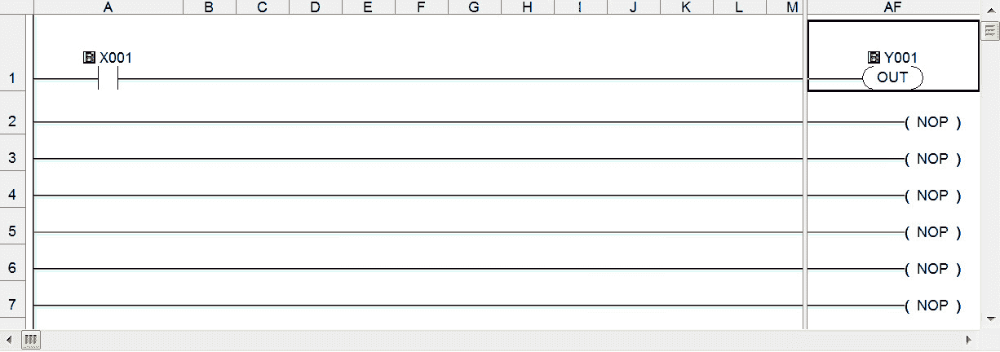
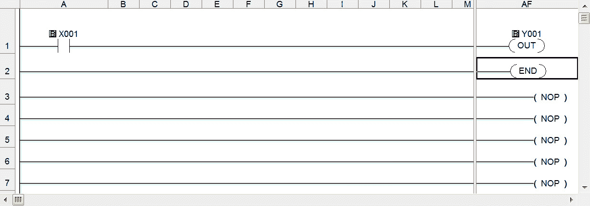
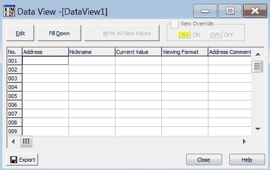

# 第三章：我爱我的比特 – 实验室设置

到目前为止，我们主要配置了网络的连接性。现在，我们将进入下一阶段。在本章中，我们将配置一个简单的**程序**，并使用安装在 Windows 7 **虚拟机**（**VM**）上的软件，物理地改变 PLC 上的`I/O`。这一过程会通过虚拟机接口，通过虚拟交换机，到达物理适配器。然后，它会传递到*物理*管理交换机，并最终连接到 PLC。本章将扩展我们之前在*第二章*中开始设置的实验室，*硬件路由*。我们将通过一个演示方法，使用`Koyo Click PLC`和**人机界面**（**HMI**）I，将其连接到物理 I/O，以学习如何通过**图形用户界面**和**脚本编写**实现开关灯的操作。

在本章中，我们将涵盖以下主要内容：

+   编写和下载我们的第一个程序

+   重写和接线 I/O

+   控制测试

# 技术要求

本章所需材料：

+   安装在 Windows 7 机器上的`Koyo Click`软件。

+   `Koyo Click`硬件电源和 PLC。

+   一个物理网络交换机，用于在 PLC 和 ESXi 之间路由流量。

+   一个选择开关站盒，用于切换 I/O 的电源开/关。

+   一个工业信号塔灯，用于显示视觉反馈。

+   一只电压表用于测试连通性。

+   一根 14 号线，用于将选择开关站盒和信号塔灯连接到 PLC。

+   剪线钳和剥线钳，用于处理和准备安装电线。

+   螺丝刀（十字头和一字头）用于打开和关闭接线端子的紧固螺丝。

你可以在这里查看本章代码的实际操作：[`bit.ly/3v5w61B`](https://bit.ly/3v5w61B)

# 编写和下载我们的第一个程序

现在到了令人兴奋的部分——编写我们的*hello world*自动化程序。我们将介绍如何构建一个简单的梯形逻辑程序，用于通电或断电一个线圈。这将帮助我们更深入地理解 Koyo Click 软件的工作原理。这一点很重要，因为每个 PLC、SCADA 和**分布式控制系统**（**DCS**）都遵循相同的标准和准则。说到标准，有一个特别的标准你应该熟悉，那就是*IEC 61131-3*，它帮助定义了五种核心编程语言，如下所示：

+   梯形图

+   功能块图

+   结构化文本

+   指令列表

+   顺序功能图

类似于软件编程语言，其中核心基本原理在所有语言中是相同的，主要变化在于语法，这五种语言中，有三种是基于图形的，两种是基于文本的。**CLICK 编程软件**使用**梯形图**作为核心编程语言，也叫做**梯形逻辑**，这是在过程自动化领域最常见的语言。它模仿电路，允许左侧的输入驱动右侧的输出。

首先，我们将打开在 Windows 7 机器上的 Koyo Click 软件，如下图所示：

图 3.1 – Koyo Click 软件

从菜单栏中点击**文件**选项，然后选择**新建项目…**，如下所示：

图 3.2 – 新建项目…

接下来，您将看到一个对话框，如下图所示。您需要双击**启动新项目**图标：

图 3.3 – 启动新项目

现在，我们将进入**选择 CPU 模块**窗口，如下图所示。我们将在实验室使用在上一章推荐的 CPU。现在，您可能会问自己，“*等等，这不是有更简单的方法吗？*”，您是对的。在上一章，我们只需连接到 PLC，软件会自动检测并为我们选择正确的 CPU。然而，我想向您展示，建立项目的方式不止一种。话虽如此，您将看到类似以下的屏幕，您需要选择`C0-10ARE-D`，这是我们在上一章中讨论的：

图 3.4 – 选择实验室 CPU

在这里，您可以查看关于 CPU 的详细信息。我们有八个交流输入和六个继电器输出，以及关于功耗的信息。现在，点击**确定**继续 CPU 选择过程。

一旦点击，您将被带回到编程界面，如下所示：

图 3.5 – 主程序

在开始添加梯形图指令之前，我们需要配置一些小细节。选择**设置**菜单选项，然后点击**系统配置**，如下所示：

图 3.6 – 系统配置…

这将带我们到下面的屏幕，显示了我们**PLC 机箱**的图形布局。在这里，您可以看到我们之前选择的 CPU，并显示警告，指示我们没有足够的电源供应给 CPU。这仅仅是因为我们尚未在此屏幕上设置**电源供应单元**（**PSU**）：

图 3.7 – 系统配置窗口

点击第一列（`P/S`列）中的**选择**按钮，如前面的屏幕截图所示。您将看到选择电源的选项，如下面的屏幕截图所示。选择您购买并安装在实验室中的电源：

图 3.8 – 选择电源窗口

类似于我们之前看到的用于 CPU 的屏幕，我们可以看到有关我们购买的**电源**的更多细节，例如输入和输出电压以及生成的最大功率。继续点击**确定**以选择并应用电源到机箱概览。您现在应该看到一个代表连接到 CPU 的电源的图像。您会看到警告已经消失，因为电源足以为 CPU 供电：

图 3.9 – 更新的系统配置窗口

现在，点击**确定**并立即进入程序。我们想创建一个简单的程序，允许我们按下按钮并点亮灯。但是，在我们开始之前，我想快速介绍一些术语：

+   **梯形图**和**横梁**：梯形图用于表示电气布线框架中的控制程序。电源是*垂直线*（梯形），而控制电路是*水平线*（横梁）。

+   **指令列表**：这是用于设计程序电路的图形控件列表。

+   **接点**：接点是二进制选择器的图形表示，类似于墙上的开关，没有更好的定义。

+   `NO**/**NC`：**常开**和**常闭**是我们想要控制 I/O *状态*的接点的术语。常开接点意味着当接点打开时电路运行，反之亦然。

现在我们对布局和术语有了更好的理解，下一步是将一个 NO **接点**拖到第一横排。然后，我们应该通过点击右侧的**地址**按钮来选择地址，如下面的屏幕截图所示：

图 3.10 – 插入一个接点

会出现一个对话框，允许我们从 Koyo Click 提供的地址列表中选择所需的地址。在下面的截图中，我们可以看到列表选项，包括**地址**、**数据类型**、**昵称**等：

图 3.11 – 地址选择器

双击第一个地址；也就是`X001`。这将填充您的地址选择，如下截图所示：

图 3.12 – 选择的地址

点击**确定**按钮后，您应该看到您现在在横梁 1 上有一个地址为`X001`的接触输入，如下截图所示：

图 3.13 – 接触 X001

现在，既然我们有了一个输入，我们将需要一个输出。在用户界面右侧的**指令列表**菜单的**线圈**部分下，找到`Out`功能，并将其拖动到右侧的`( NOP )`位置，如下截图所示：

图 3.14 – 线圈输出

将`Out`功能拖动到横梁 1 末端的`( NOP )`位置，如下所示：

图 3.15 – 输出

一旦功能锁定，将创建一个对话框，要求程序员配置**位内存**寻址，如下所示：

图 3.16 – 线圈地址

点击内存地址选择器图标；将会出现一个**地址选择器**对话框，类似于我们在 NO 输入接触步骤中遇到的对话框。下面的截图显示，地址选择器会自动显示真实世界的输出地址列表：

图 3.17 – 地址选择器

选择`Y001`作为我们放置在横梁 1 上的线圈的输出地址，并选择**确定**。如下截图所示，它已经自动填充了**位内存地址 1：**的选择。您应该看到地址旁边有一个绿色的勾号，表示该地址是一个有效的内存位置：

图 3.18 – 位内存地址

点击**确定**继续并将**线圈**添加到输出位置，如下截图所示：

图 3.19 – 线圈输出

如果您想知道为什么我们选择`X001`和`Y001`作为输入和输出地址，请看看您的 CLICK PLC 的正面。在端子条上，找到标有`X1`和`Y1`的**引脚输出**标签。这些地址直接与这些 I/O 端子相关联，如下图所示：

图 3.20 – 端子引脚

接下来，我们需要添加一个`END`功能，告诉程序我们已经完成所有操作。从**指令列表**菜单中，在**程序控制**标题下，选择并拖动`END`功能到第 2 横排末尾的`( NOP )`位置，如下截图所示：

图 3.21 – 添加 END 功能

添加`END`功能后，我们要检查语法错误。定期运行**语法检查**是个好习惯，这样您可以在将来开发更复杂的程序时捕捉任何错误之前，避免它们变成重大问题。在**程序**选项卡上，双击**梯形图程序**文件夹中的**语法检查**选项，如下所示：

图 3.22 – 语法检查

在**输出窗口**中，您应该看到语法检查的结果。如果您一直在紧密跟随，您应该有类似的结果：

图 3.23 – 语法检查

如您所见，目前有**0 个错误**和**0 个警告**。此时，您应该保存程序，然后将项目写入 PLC。要将项目写入 PLC，请从`PLC`菜单中选择**将项目写入 PLC…**选项，如下截图所示：

图 3.24 – 将项目写入 PLC…

完成后，您将看到一个对话框，简要介绍了一个`diff`功能，我们将在当前 PLC 项目与您将写入 PLC 的项目上使用，如下所示：

图 3.25 – 将项目写入 PLC 窗口

如果一切顺利，您应该看到一个**传输完成**对话框，如下所示：

图 3.26 – 传输完成

接下来，您将被要求将**PLC 模式**设置从**停止**更改为**运行**，如下所示：

图 3.27 – PLC 模式窗口

如果一切正常，您应该看到以下指示器：

+   一个绿色的**运行**状态

+   没有**PLC 错误**消息

+   蓝色突出显示的`END`功能

+   **输出窗口** – **将项目写入 PLC…**

+   **输出窗口** – **传输完成**

这些指示器显示在以下截图中：

图 3.28 – 运行指示器

在这一部分，我们学习了如何使用输入和输出创建一个简单的程序，该程序包含常开触点和线圈。我们进行了语法检查，并将项目写入我们的 PLC。这使我们更深入地理解了编程软件的工作原理，并获得了创建和写入项目的实践经验。这些是学习的基础，是任何自动化和控制项目的构建模块。在下一部分，我们将模拟输入上的信号，使我们的程序产生输出。然后，我们将为程序中创建的线圈提供电能。

# 覆盖和接线输入输出

在上一部分，我们创建了一个简单的*Hello World*程序，并将其写入 PLC。在这一部分，我们将模拟输入触点上的信号，为输出端的线圈供电。我们将深入了解 CLICK 编程软件的功能，熟悉数据视图，并**覆盖**输入以产生一个通电的线圈。为此，我们将使用一个名为**数据视图**的工具，它允许我们读取和写入我们在上一部分中为常开触点选择的内存地址。

为此，请从**监视器**菜单中打开**数据视图**窗口，如下图所示：

图 3.29 – 数据视图选择

您将看到一个空白表格，如下所示：

图 3.30 – 数据视图工具

现在，我们将选择`001`行中的**地址**单元格，然后点击对话框左上角的**编辑**按钮，这将允许您选择我们之前使用的地址选择器。在这里，我们为**触点输入**和**线圈输出**分配了地址。接下来，您将看到自动填充的地址空间，从`X001`开始，在第一个内存地址中，您应该会看到`X001`的**已使用**列中显示**是**。这是反馈，告诉我们在程序中使用了`X001`。如下图所示：

图 3.31 – 地址选择器

继续选择`X001`并按下**确定**按钮。这样将填充我们的**数据视图**工具中的**编号` **001`行。您将看到**昵称**设置（如果之前给它设置了），我们的**当前值**，**新值**，**写入**（用于反馈），**查看格式**，以及您可能添加的任何地址评论。如下图所示：

图 3.32 – 选择的 X001 地址

现在，尝试选择**新值**列中的`ON`按钮。**写入**列中将出现一个图标，允许你将输入值写入 PLC。双击该图标，看看会发生什么。此时应该什么都没有发生。图标确实将值写入 PLC 的内存空间，但针脚 I/O 是主导的，PLC 上的物理输入没有发生变化，因此什么都没有改变。正是因为这种行为，我们必须启用`Override`。在对话框中，我们会看到**查看 Override**的选项。你需要启用此选项。启用后，你将看到在**写入**图标旁边新增了一列。添加了一个`OVR`按钮，如下图所示：

图 3.33 – Override

双击`OVR`按钮，这将启用此 I/O 的`Override`功能。CLICK 编程软件会在主窗口中打开`Override`指示器，并在**数据视图**窗口中将`OVR`按钮高亮显示为黄色：

图 3.34 – 启用 Override

现在，尝试重新运行我们之前运行的操作，在**新值**列中选择`ON`按钮，并双击**写入**图标。你应该能听到 PLC 上线圈的通电声音，并且可以看到线圈上的指示灯亮起，同时编程软件显示`X001`被高亮显示，以及`Y001`，如下所示：

图 3.35 – 通电线圈

如果你没有看到高亮显示的输入和输出，如图所示，请确保选择了**状态监视器**。你可以在**监视器**菜单中找到它，选择**状态监视器**后：

图 3.36 – 状态监视器

继续双击**新值**列中的`OFF`按钮，如下图所示。你应该会注意到，通过双击按钮，我们节省了一步；这只是为了显示有多种方式可以快速覆盖输入：

图 3.37 – 输入关闭

到目前为止，我们做的所有操作都是软件相关的。现在，我们将使用**选择开关站框**，如图所示：

图 3.38 – 选择开关站框

这种开关，或类似的开关，可以在亚马逊上购买。我们将使用短时**按键**，即绿色按钮，并将其接线到我们在上一节中编程并寻址的`X001`输入接点。

使用你的*菲利普斯*螺丝刀拆下四个面板螺丝和面板。当你打开**控制箱**时，你会看到三个开关模块，每个模块里都有四个接线端子。专注于瞬时开关，两个接线端子组与开关的动作相关联。因为我希望按下按钮时电流能够通过开关，所以我将使用底部的接线端子。你可以使用**电压表**测试接线端子，并测试模块两侧的连续性。按下开关，看看接线端子是否产生短路，导致电压表发出蜂鸣声。我认为，使用电压表检查连续性已经成为我数百个项目中的主要用途，现在想想其实有些可惜，因为电压表还有很多其他功能和特性。一旦你确认使用的是正确的接线端子，剪下并剥去两根电线的绝缘层。将每根电线的一端连接到接线端子两侧。然后，一侧连接到电源，另一侧将这根电线连接到`X1`的`PLC`输入/输出端。可以参考以下图示：

图 3.39 – 接线图

在输入/输出端子上，你会看到`C1`和`C2`，分别代表**公共端 1**和**公共端 2**。将公共端 1 接地。如果所有**接线**都正确，按下瞬时开关将激活线圈，你应该会看到红色指示灯亮起，如图所示：

图 3.40 – 实物接线

现在我们有了一个控制`X001`输入的按钮，并且在`Y001`上有了视觉反馈。接下来，我们将为**工业信号塔灯**接线输出，其外观类似于下图：

图 3.41 – 工业信号塔灯

重要提示

接线输出将需要你修改程序，通过复制第 1 行并为信号塔灯中的每盏灯创建一行。我使用的是一个四灯系统，包含*红色*、*黄色*、*绿色*和*蓝色*灯。

以下图示展示了如何将信号塔灯连接到输出通道。因为我使用的是一个四灯系统，所以我将红色接到`Y001`，黄色接到`Y002`，绿色接到`Y003`，蓝色接到`Y004`，如图所示：

图 3.42 – 输出接线到塔灯

到目前为止，你应该已经接好了输出并更改了程序以适应新的灯光输出，并将更改写入 CLICK PLC。这个过程与上一节中我们写入 PLC 的单个梯形图程序相同。你的程序应该如下所示，应该有四个新的独立输入来自`X001`到`X004`，以及四个新的独立输出来自`Y001`到`Y004`：

图 3.43 – 四灯接线程序

在本节中，我们学习了如何重写输入值以模拟控制器输出端的信号。我们将一个按钮开关接入 X001，并将四灯信号塔灯接入 Y001、Y002、Y003 和 Y004。现在，我们有了一个完整的物理演示，并且对自动化工程师在接手新项目和新组件时所面临的挑战有了一定了解。在下一节中，我们将学习如何通过编写和启动脚本与我们的实验室进行交互。

# 控制测试

在上一节中，我们学习了如何重写输入并在接触点 X001 上模拟信号，从而触发 Y001 线圈上的输出。接着，我们将 PLC 的输入端接到开关，并用物理输入再现相同的结果。最后，我们接线了四灯信号塔。在本节中，我们将通过使用在*第二章*中安装的`MBtget`工具，从`DataView`和我们的 SCADA 虚拟机测试**信号塔**。

你需要执行以下步骤：

1.  打开`DataView1`，正如我们在上一节中所做的那样；作为复习，请查看以下截图，你将在**监视器`| `数据视图**部分找到它：

    图 3.44 – 数据视图

1.  这将弹出数据视图窗口。正如我们之前所做的，添加你在上一节中创建的新接点。这些接点是地址空间中的`X002`、`X003`和`X004`。确保启用**视图重写**选项。如果一切顺利，你的屏幕应该类似于以下内容：

    图 3.45 – 数据视图

1.  现在，继续切换输入并逐步移动每个值，确保你的物理灯塔打开与你为输出配置的匹配灯光。你会注意到你可以看到 CLICK 上的视觉反馈，和你在软件中看到的一样，如下所示：

    图 3.46 – 重写灯光

1.  现在我们已经将所有灯光打开，打开之前我们创建的 **SCADA 虚拟机**。前往 `Navigator** > **Virtual Machines** > **SCADA` 来查找它，如下所示：

图 3.47 – SCADA 虚拟机

启动 SCADA 控制台并打开您的 **终端** 程序。使用 `mbtget -h` 命令查看有关 `mbtget` 工具的详细信息，如下所示：

图 3.48 – mbtget 工具

这是解释 mbtget 的一个好时机

mbtget 是一个用 Perl 编写的工具，允许我们通过 `ModbusTCP` 在端口 `502` 上直接与 Koyo Click 交互。有关更多详细信息，请访问以下链接并查看 GitHub 上的项目：[`github.com/sourceperl/mbtget`](https://github.com/sourceperl/mbtget)。

好的，让我们回到正常的编程工作。现在我们已经将 mbtget 安装在 SCADA 机器上，我们可以通过运行以下命令检查我们在上一部分中配置的四个线圈的位：

mbtget -r1 -a 0 192.168.1.20

让我们来看一下命令中包含的参数。我们将在 *第八章**，协议 202* 中更详细地介绍 `modbus` 协议。现在，我们需要知道我们正在使用的线圈的内存地址，以及我们是要读取还是写入该内存地址：

+   `-r1`：读取功能 `1` 的位

+   `-a`：地址 `0`

+   PLC 地址是 `192.168.1.20`

如果您已经清除了编程软件中设置的所有覆盖项，您应该看到以下输出，其中地址 `1` 的值为 `0`：

图 3.49 – 地址 0 读取输出

现在，使用以下命令将值写入线圈：

mbtget -w5 1 -a 0 192.168.1.20

以下是命令中包含的参数：

+   `-w5`：将功能值 `1` 写入以开启

+   `-a`：地址 `0`

+   PLC 地址是 `192.168.1.20`

如果一切正常，您应该已经点亮了信号塔中的第一个/最上面的灯，并获得以下结果：

图 3.50 – 写入值到线圈

现在，为了使用 `mbtget` 确认输出，请再次运行读取线圈命令：

mbtget -r1 -a 0 192.168.1.20

以下是命令中的参数：

+   `-r1`：读取功能 `1` 的位

+   `-a`：地址 `0`

+   PLC 地址是 `192.168.1.20`

如果一切正常，您应该看到以下输出：

图 3.51 – 读取线圈地址 0

您应该看到地址值已经更改为 `1`，并且灯亮了。继续测试塔中的其余灯光，按照我们之前的步骤进行操作。将 `1` 写入下一个地址，读取线圈位，并确保输出符合预期。

你可能注意到，通过一个简单的命令行功能随机设置一个比特是多么容易，可能会想知道安全特性在哪里。为什么你可以覆盖一个线圈而不需要输入*密钥*或*密码*？这真的是*工业环境*如此不安全吗？嗯，我得说*是的，也不是*。是的，工业环境传统上一直如此不安全，但在提升对该领域存在的安全问题的意识方面，已经取得了很大进展。*厂商*们已经听取了反馈，并开始将安全层嵌入到他们的系统中。然而，这并不意味着客户已经将其遗留系统升级为新技术。现在，对于那些好奇的你们，可能已经意识到发生了什么……是的，你们抓到了我——之所以能够这么做，是因为我们在编程软件中仍然启用了覆盖功能。移除覆盖功能后，再尝试通过强制控制线圈来测试 mbtget。结果如何？你应该看不到任何结果——什么也不会发生。这是因为我们已经告诉 PLC 只对本地输入做出反应。

# 总结

在本章中，我们构建了一个介绍性功能实验室，在这里我们可以在 PLC 中开发逻辑，并连接到现实世界的输入输出，观察在特定环境测试下事物如何反应。这有助于传达工业系统如何运作和工作的基本理解。基于这些核心概念，我们可以将实验室扩展到更复杂的场景。我们使用**工程软件**强制输入，然后我们通过 mbtget 在远程复制相同的行为，以说明如何轻松改变控制器上的简单开/关输入。

想象一下其他行业流程是如何运作的，例如水厂上开关阀门，或是打开氢氧化钠（也称为烧碱）储罐的阀门，并允许它流入水处理单元，这与 2021 年 2 月 5 日发生的*佛罗里达市供水黑客攻击*类似。然而，佛罗里达市供水黑客攻击更为复杂，因为它涉及在操作员屏幕上更改浓度数值。这一更改通过食谱逻辑块传递，最终指示阀门保持更长时间开启，直到浓度水平匹配新的设定值。这是一个实际世界中，因小小的逻辑更改而可能产生重大影响的例子。这是双刃剑，也是渗透测试任务中的警示故事。非常容易破坏并导致客户流程停机，从而造成严重的生产和收入损失。

在下一章中，我们将暂时停止构建我们的 ICS 实验室，并讨论**开源情报**（**OSINT**）收集，因为这是任何渗透测试任务中的关键步骤。
